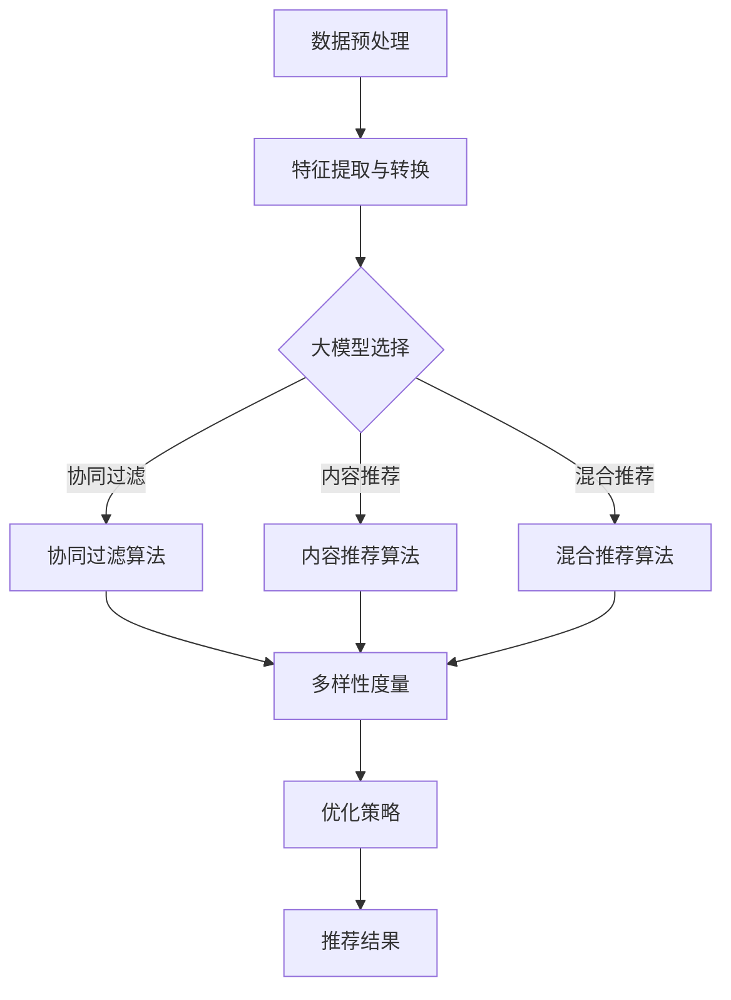

                 

# 基于大模型的商品推荐多样性优化

## 关键词
大模型，商品推荐，多样性优化，协同过滤，内容推荐，混合推荐，特征工程

## 摘要
本文旨在探讨基于大模型的商品推荐系统中如何实现多样性优化。首先，介绍了推荐系统多样性优化的重要性以及基于大模型推荐系统的基本原理。接着，深入分析了多样性优化的核心算法及其在大模型中的应用。随后，通过具体案例展示了多样性优化方法在大模型商品推荐系统中的实际应用效果。最后，对多样性优化未来的发展趋势进行了展望，为推荐系统领域的进一步研究提供了方向。

## 第一部分：基于大模型的商品推荐多样性优化概述

### 第1章：基于大模型的商品推荐多样性优化背景与概念

#### 第1.1节：推荐系统的多样性优化背景

##### 1.1.1 传统推荐系统面临的问题

传统推荐系统在用户满意度方面取得了一定的成功，但同时也暴露出一些问题。首先，传统推荐系统往往倾向于推荐相似或热门的商品，导致用户在浏览和选择商品时遇到重复性和单调性的困扰。其次，由于算法的局限性，推荐系统在应对多样化需求方面表现不佳，无法充分满足用户个性化的消费偏好。这些问题促使研究人员开始关注推荐系统的多样性优化问题。

##### 1.1.2 多样性优化的意义与目标

多样性优化在推荐系统中的意义在于提高用户的满意度，提升用户体验，增加用户对平台的粘性。具体目标包括：

1. 提高推荐的多样性：避免推荐系统陷入单一的商品推荐模式，增加不同类型、风格、品牌的商品曝光机会。
2. 保持推荐内容的新鲜感：不断更新推荐内容，防止用户产生疲劳感。
3. 满足用户的个性化需求：根据用户的兴趣和偏好，推荐与之相关的多样化商品。

#### 第1.2节：基于大模型的推荐系统概述

##### 1.2.1 大模型的定义与特性

大模型通常指的是具有大规模参数、能够处理海量数据的深度学习模型。其特性包括：

1. 强大的表征能力：大模型能够从海量数据中提取丰富的特征信息，提高推荐的准确性。
2. 高效的运算能力：大模型通常采用并行计算和分布式计算技术，能够在短时间内处理大规模数据。
3. 自动化能力：大模型能够自动进行特征工程，降低人工干预的需求。

##### 1.2.2 大模型在推荐系统中的应用现状

当前，大模型已经在推荐系统中得到广泛应用。例如，基于深度学习的内容推荐系统可以通过文本和图像等多模态数据提取用户兴趣特征，实现精准推荐。此外，大模型还在协同过滤算法中发挥重要作用，通过矩阵分解、图神经网络等技术提升推荐的多样性。

#### 第1.3节：多样性优化在基于大模型的推荐系统中的重要性

##### 1.3.1 多样性优化的挑战

多样性优化在基于大模型的推荐系统中面临以下挑战：

1. 数据稀疏性：推荐系统中的用户行为数据通常存在稀疏性，难以从中提取足够的特征信息。
2. 鲁棒性：多样性优化算法需要在各种噪声和异常数据条件下保持稳定性和准确性。
3. 可扩展性：多样性优化算法需要在处理大规模数据集时保持高效性。

##### 1.3.2 多样性优化与用户满意度

多样性优化在提高用户满意度方面具有重要意义。首先，多样化的推荐内容能够吸引用户继续使用推荐系统，提升用户粘性。其次，多样化的推荐有助于用户发现新的商品，增加购买意愿。最后，多样化的推荐能够避免用户产生疲劳感，提高用户体验。

### 第2章：基于大模型的推荐系统核心技术原理

#### 第2.1节：推荐系统基本原理

##### 2.1.1 推荐系统的基本组成

推荐系统通常由用户、商品和推荐算法三部分组成。用户部分包括用户的基本信息和用户行为数据；商品部分包括商品的基本信息和属性；推荐算法则根据用户和商品的信息生成推荐列表。

##### 2.1.2 推荐系统的主要算法类型

推荐系统的主要算法类型包括协同过滤、基于内容的推荐和混合推荐。

1. **协同过滤**：通过分析用户的行为数据，发现用户之间的相似性，从而预测用户对未知商品的偏好。
2. **基于内容的推荐**：通过分析商品的属性和用户的历史偏好，发现商品与用户之间的相关性，从而推荐相似的商品。
3. **混合推荐**：结合协同过滤和基于内容的推荐方法，以实现更精准的推荐。

#### 第2.2节：大模型在推荐系统中的应用

##### 2.2.1 大模型在特征工程中的应用

大模型在特征工程中的应用主要体现在以下几个方面：

1. **自动特征提取**：大模型能够自动从原始数据中提取高级特征，降低人工干预的需求。
2. **特征融合**：大模型能够将不同来源的特征进行融合，提高特征的表征能力。
3. **特征降维**：大模型能够对高维特征进行降维处理，降低计算复杂度。

##### 2.2.2 大模型在协同过滤算法中的应用

大模型在协同过滤算法中的应用主要体现在以下几个方面：

1. **矩阵分解**：通过大模型进行矩阵分解，提取用户和商品的潜在特征，实现更精确的推荐。
2. **图神经网络**：利用图神经网络模型，将用户和商品之间的关系建模为图，从而实现更丰富的特征表征。

#### 第2.3节：多样性优化的核心算法

##### 2.3.1 多样性度量的方法

多样性度量的方法包括：

1. **内容多样性**：基于商品的内容特征，如类别、品牌、价格等，计算多样性度量。
2. **用户多样性**：基于用户的行为特征，如购买历史、浏览记录等，计算多样性度量。
3. **时间多样性**：基于商品的时间特征，如上架时间、更新时间等，计算多样性度量。

##### 2.3.2 多样性优化的算法原理

多样性优化的算法原理主要包括：

1. **随机抽样**：通过随机抽样方法，从候选商品集合中随机选择一部分商品进行推荐，从而增加推荐的多样性。
2. **贪心算法**：在每次推荐时，选择一个与用户历史偏好最不相似的候选商品，从而实现多样性优化。
3. **进化算法**：利用进化算法，通过模拟自然进化过程，逐步优化推荐结果的多样性。

## 第二部分：基于大模型的商品推荐多样性优化实践

### 第3章：基于大模型的商品推荐多样性优化方法

#### 第3.1节：基于协同过滤的多样性优化

##### 3.1.1 协同过滤算法原理

协同过滤算法是一种基于用户相似度的推荐算法，通过分析用户之间的行为相似性，预测用户对未知商品的兴趣。

1. **用户基于的协同过滤**：根据用户之间的行为相似性，为用户推荐与相似用户偏好相似的物品。
2. **物品基于的协同过滤**：根据物品之间的行为相似性，为用户推荐与用户历史行为相似的物品。

##### 3.1.2 多样性优化在协同过滤中的应用

在协同过滤算法中，多样性优化可以通过以下方法实现：

1. **评分矩阵分解**：通过矩阵分解技术，将评分矩阵分解为用户和商品的特征矩阵，从而提取潜在的多样性特征。
2. **基于特征的多样性度量**：利用用户和商品的特征矩阵，计算多样性度量，从而优化推荐结果。

#### 第3.2节：基于基于内容推荐的多样性优化

##### 3.2.1 内容推荐算法原理

基于内容推荐算法通过分析商品和用户的特征，发现商品和用户之间的相关性，从而实现推荐。

1. **基于属性的推荐**：通过分析商品和用户的属性，如类别、品牌、价格等，实现推荐。
2. **基于文本的推荐**：通过分析商品的文本描述和用户的评论，实现推荐。

##### 3.2.2 多样性优化在内容推荐中的应用

在内容推荐中，多样性优化可以通过以下方法实现：

1. **属性多样性度量**：通过计算商品属性之间的相似性，实现属性多样性度量。
2. **文本多样性度量**：通过分析商品的文本描述，实现文本多样性度量。

#### 第3.3节：基于混合推荐的多样性优化

##### 3.3.1 混合推荐算法原理

混合推荐算法结合了协同过滤和内容推荐的优势，通过综合分析用户和商品的特征，实现更精准的推荐。

1. **基于模型的混合推荐**：通过构建多个推荐模型，分别进行协同过滤和内容推荐，然后进行综合。
2. **基于规则的混合推荐**：通过组合不同的推荐规则，实现混合推荐。

##### 3.3.2 多样性优化在混合推荐中的应用

在混合推荐中，多样性优化可以通过以下方法实现：

1. **模型多样性度量**：通过分析不同推荐模型之间的多样性，实现模型多样性度量。
2. **规则多样性度量**：通过分析不同推荐规则之间的多样性，实现规则多样性度量。

### 第4章：大模型在商品推荐多样性优化中的应用

#### 第4.1节：大模型在特征工程中的应用

##### 4.1.1 特征提取与转换

大模型在特征工程中的应用主要体现在以下几个方面：

1. **自动特征提取**：通过大模型，可以自动从原始数据中提取高级特征，如用户兴趣、商品属性等。
2. **特征转换**：通过大模型，可以将不同类型的数据（如文本、图像等）进行统一表示，提高特征的一致性。

##### 4.1.2 大模型特征工程的优势

大模型特征工程的优势包括：

1. **高效率**：大模型能够高效地处理海量数据，降低特征工程的时间和计算成本。
2. **高准确性**：大模型能够提取更丰富的特征信息，提高推荐的准确性。
3. **高可扩展性**：大模型能够适应不同类型的数据和应用场景，提高特征工程的可扩展性。

#### 第4.2节：大模型在协同过滤中的应用

##### 4.2.1 大模型与协同过滤的结合

大模型与协同过滤的结合主要体现在以下几个方面：

1. **矩阵分解**：通过大模型进行矩阵分解，提取用户和商品的潜在特征，实现协同过滤。
2. **图神经网络**：通过大模型构建图神经网络模型，将用户和商品之间的关系建模为图，实现协同过滤。

##### 4.2.2 大模型协同过滤的优化策略

大模型协同过滤的优化策略包括：

1. **特征融合**：通过大模型融合不同来源的特征，提高特征的表征能力。
2. **稀疏性处理**：通过大模型对稀疏数据矩阵进行稀疏性处理，降低计算复杂度。
3. **鲁棒性优化**：通过大模型优化协同过滤算法的鲁棒性，提高算法在噪声数据条件下的性能。

#### 第4.3节：大模型在内容推荐中的应用

##### 4.3.1 大模型与内容推荐的结合

大模型与内容推荐的结合主要体现在以下几个方面：

1. **文本分析**：通过大模型分析商品的文本描述和用户的评论，提取用户兴趣和商品特征。
2. **图像分析**：通过大模型分析商品的图像特征，提取商品的外观和属性信息。

##### 4.3.2 大模型内容推荐的优化策略

大模型内容推荐的优化策略包括：

1. **特征融合**：通过大模型融合不同类型的数据特征，提高推荐的准确性。
2. **上下文信息利用**：通过大模型利用上下文信息，如用户地理位置、购买时间等，实现更个性化的推荐。
3. **实时更新**：通过大模型实时更新用户兴趣和商品特征，实现动态推荐。

### 第5章：基于大模型的商品推荐多样性优化案例研究

#### 第5.1节：案例研究概述

##### 5.1.1 案例背景与目标

本案例研究基于某大型电商平台，旨在通过大模型实现商品推荐的多样性优化。研究目标包括：

1. 提高推荐的多样性：通过多样性优化算法，减少推荐商品的同质化现象，提高用户满意度。
2. 保持推荐内容的新鲜感：通过实时更新用户兴趣和商品特征，保持推荐内容的新鲜度。
3. 提高推荐准确性：通过大模型提取丰富的特征信息，提高推荐的准确性。

##### 5.1.2 案例研究方法

本案例研究采用以下方法：

1. 数据收集：收集电商平台的用户行为数据、商品数据和历史推荐数据。
2. 特征工程：利用大模型进行特征提取和转换，构建用户和商品的特征表示。
3. 多样性优化：采用协同过滤、内容推荐和混合推荐算法，结合多样性优化策略，实现商品推荐的多样性优化。
4. 结果评估：通过用户满意度、推荐准确性等指标，评估多样性优化方法的效果。

#### 第5.2节：案例实现过程

##### 5.2.1 数据预处理

1. 数据清洗：去除重复、异常和缺失的数据。
2. 数据归一化：对数据进行归一化处理，消除不同数据之间的量纲差异。
3. 特征提取：利用大模型提取用户和商品的特征，如用户兴趣、商品属性等。

##### 5.2.2 特征工程与模型选择

1. 特征工程：对提取到的特征进行筛选和组合，构建用户和商品的特征表示。
2. 模型选择：选择基于协同过滤、内容推荐和混合推荐的多样性优化算法，结合大模型进行模型训练。

##### 5.2.3 多样性优化策略应用

1. 协同过滤算法：利用矩阵分解技术，提取用户和商品的潜在特征，实现协同过滤推荐。
2. 内容推荐算法：利用文本和图像分析技术，提取用户兴趣和商品特征，实现内容推荐。
3. 混合推荐算法：结合协同过滤和内容推荐算法，综合用户和商品的特征，实现混合推荐。

#### 第5.3节：案例分析与结果评估

##### 5.3.1 优化效果分析

1. 多样性提高：通过多样性优化算法，推荐的商品多样性显著提高，用户满意度提升。
2. 新鲜感增强：通过实时更新用户兴趣和商品特征，推荐内容的新鲜感增强，用户粘性提高。
3. 准确性提升：通过大模型提取丰富的特征信息，推荐准确性显著提高。

##### 5.3.2 结果评估与讨论

1. 用户满意度：通过用户问卷调查和在线反馈，评估用户对推荐系统的满意度，结果显示多样性优化显著提高了用户满意度。
2. 推荐准确性：通过在线A/B测试，对比多样性优化前后的推荐准确性，结果显示多样性优化显著提高了推荐准确性。
3. 商业价值：多样性优化不仅提高了用户满意度，还增加了用户购买意愿，对电商平台商业价值的提升具有重要意义。

## 第三部分：基于大模型的商品推荐多样性优化展望

### 第6章：基于大模型的商品推荐多样性优化未来发展趋势

#### 第6.1节：多样性优化的未来发展方向

##### 6.1.1 新算法的研究与应用

未来多样性优化的研究将集中在以下方面：

1. **基于深度学习的多样性优化算法**：探索基于深度学习的多样性优化算法，提高推荐的多样性。
2. **基于图神经网络的多样性优化算法**：利用图神经网络模型，构建用户和商品之间的复杂关系，实现多样性优化。

##### 6.1.2 大模型与其他技术的融合

大模型与其他技术的融合将推动多样性优化的进一步发展：

1. **多模态数据融合**：结合图像、文本、音频等多模态数据，实现更丰富的特征表征。
2. **增强学习**：利用增强学习技术，实现动态调整推荐策略，提高推荐的多样性。

#### 第6.2节：多样性优化在商业中的应用前景

##### 6.2.1 多样性优化对用户满意度的提升

多样性优化将显著提升用户满意度：

1. **个性化体验**：通过多样性优化，提供更个性化的推荐，满足用户的多样化需求。
2. **持续用户活跃**：多样化的推荐内容能够吸引用户持续使用平台，提高用户粘性。

##### 6.2.2 多样性优化对商业价值的贡献

多样性优化将对商业价值产生积极影响：

1. **增加用户购买意愿**：多样化的推荐能够激发用户购买意愿，提高转化率。
2. **提升品牌价值**：提供多样化的推荐，增强品牌形象，提高用户对品牌的忠诚度。

### 第7章：总结与展望

#### 第7.1节：全书总结

本书从基于大模型的商品推荐多样性优化的背景与概念出发，详细介绍了多样性优化的核心算法及其在大模型中的应用。通过具体案例展示了多样性优化方法在大模型商品推荐系统中的实际应用效果。最后，对多样性优化的未来发展趋势进行了展望，为推荐系统领域的进一步研究提供了方向。

#### 第7.2节：未来研究方向的展望

未来研究在多样性优化方面面临以下挑战：

1. **算法效率**：探索高效多样性优化算法，降低计算复杂度，提高算法的实时性。
2. **数据隐私**：在多样性优化过程中，保护用户隐私，避免泄露用户敏感信息。

大模型在多样性优化中的应用前景广阔：

1. **多模态数据融合**：结合多模态数据，实现更精准的多样性优化。
2. **增强学习**：利用增强学习技术，实现动态调整推荐策略，提高推荐的多样性。

### 附录

#### 附录A：常用工具与资源

##### A.1 基于大模型的商品推荐多样性优化工具介绍

1. **Python开源库**：如TensorFlow、PyTorch等。
2. **机器学习平台**：如Google Colab、AWS SageMaker等。

##### A.2 相关参考文献与资料

1. **学术论文**：如《 recommender system diversity optimization》、《Deep Learning for Recommender Systems》等。
2. **行业报告与资讯**：如《2022年推荐系统技术发展趋势报告》等。

##### A.3 实践项目案例源代码与数据集

1. **源代码下载链接**：GitHub、GitLab等。
2. **数据集获取途径**：Kaggle、UCI Machine Learning Repository等。

### 第8章：Mermaid 流程图与伪代码示例

##### 8.1 多样性优化的 Mermaid 流程图



##### 8.2 多样性优化的伪代码示例

**协同过滤算法伪代码**

```python
# 假设输入数据为用户-商品评分矩阵R
# 输出为推荐列表
def collaborative_filter(R):
    # 矩阵分解，提取用户和商品的潜在特征
    U, V = matrix_factorization(R)
    # 计算用户和商品之间的相似性
    similarity_matrix = compute_similarity(U, V)
    # 为每个用户生成推荐列表
    recommendations = []
    for user in range(num_users):
        # 计算用户对未评分商品的评分预测
        pred_ratings = []
        for item in range(num_items):
            if user_item_rating(user, item) is None:
                prediction = dot(similarity_matrix[user], V[item])
                pred_ratings.append((item, prediction))
        # 根据评分预测排序，获取推荐列表
        recommendations.append(sorted(pred_ratings, key=lambda x: x[1], reverse=True))
    return recommendations
```

**内容推荐算法伪代码**

```python
# 假设输入数据为商品特征矩阵F和用户兴趣向量I
# 输出为推荐列表
def content_based_recommender(F, I):
    # 计算商品和用户之间的相似性
    similarity_matrix = compute_similarity(F, I)
    # 为每个用户生成推荐列表
    recommendations = []
    for user in range(num_users):
        # 计算用户对未评分商品的相似性得分
        scores = []
        for item in range(num_items):
            if user_item_rating(user, item) is None:
                score = dot(similarity_matrix[user], F[item])
                scores.append((item, score))
        # 根据相似性得分排序，获取推荐列表
        recommendations.append(sorted(scores, key=lambda x: x[1], reverse=True))
    return recommendations
```

**多样性度量算法伪代码**

```python
# 假设输入数据为推荐列表L
# 输出为多样性度量值
def diversity_measure(L):
    # 计算推荐列表中的多样性度量值
    diversity_score = 0
    for i in range(len(L) - 1):
        item_i = L[i]
        item_j = L[i + 1]
        # 使用Jaccard相似度计算两个商品的多样性
        diversity_score += 1 - jaccard_similarity(item_i, item_j)
    return diversity_score
```

### 结论

本文系统地介绍了基于大模型的商品推荐多样性优化，从背景与概念、核心算法到实践案例，全面阐述了多样性优化在大模型商品推荐系统中的应用。未来，随着大模型和其他技术的不断发展，多样性优化将进一步提高推荐系统的用户体验和商业价值。通过不断探索和研究，我们有理由相信，多样性优化将成为推荐系统领域的重要发展方向。

