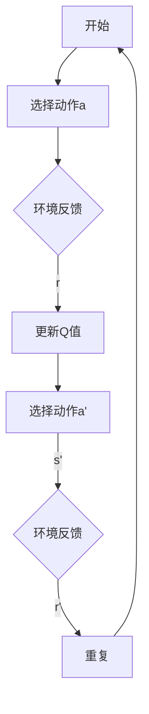

                 

### 《基于强化学习的多场景推荐策略》

> **关键词：** 强化学习、推荐系统、多场景、策略优化、深度学习、算法实现

> **摘要：** 本文深入探讨基于强化学习的多场景推荐策略，从强化学习和推荐系统的基本概念出发，逐步介绍其原理、算法及其在电商、内容、社交网络等不同场景中的应用，最终讨论策略优化与评估方法，为强化学习推荐系统提供实践指导与未来展望。

### 第一部分：强化学习与推荐系统基础

#### 第1章：强化学习基本概念与推荐系统简介

强化学习（Reinforcement Learning，RL）是机器学习领域的一个重要分支，其核心思想是通过与环境交互，学习如何在不确定的环境中做出最优决策。与监督学习和无监督学习不同，强化学习通过奖励信号来评估决策的好坏，并不断优化决策策略。强化学习有着广泛的应用，如机器人控制、游戏、自动驾驶等。

推荐系统（Recommender Systems）则是基于用户的历史行为和偏好，为其推荐感兴趣的内容或商品的一种系统。推荐系统广泛应用于电子商务、社交媒体、在线视频和音乐平台等场景，其目标是提高用户满意度、提升用户留存率和增加销售额。

在本章中，我们将介绍强化学习的基本概念，包括其定义、历史发展、主要类型和方法。同时，我们将简要介绍推荐系统的基本架构和发展历程，以及强化学习在推荐系统中的应用优势和挑战。

#### 第2章：强化学习原理详解

在了解了强化学习的基本概念后，接下来我们将深入探讨强化学习的核心算法。强化学习算法主要包括Q学习（Q-Learning）、SARSA（State-Action-Reward-State-Action，SARSA）、REINFORCE（Policy Gradient）等。这些算法通过不同的方法更新策略，以实现最优决策。

**2.1 强化学习核心算法**

- **Q学习算法**：Q学习是一种值函数方法，其目标是通过学习状态-动作值函数（Q值）来选择最佳动作。Q学习算法的核心更新规则为：
  $$ Q(s, a) = Q(s, a) + \alpha [r + \gamma \max_{a'} Q(s', a') - Q(s, a)] $$
  其中，$s$ 表示当前状态，$a$ 表示采取的动作，$r$ 表示即时奖励，$\gamma$ 表示折扣因子，$\alpha$ 表示学习率。

- **SARSA算法**：SARSA是一种基于策略的方法，它使用当前状态和动作的即时奖励来更新策略。SARSA算法的更新规则为：
  $$ Q(s, a) = Q(s, a) + \alpha [r + \gamma Q(s', a') - Q(s, a)] $$
  其中，$s'$ 表示下一状态，$a'$ 表示采取的动作。

- **REINFORCE算法**：REINFORCE算法是一种基于策略的方法，它通过最大化策略梯度来更新策略。REINFORCE算法的更新规则为：
  $$ \theta_{t+1} = \theta_t + \alpha \nabla_\theta J(\theta_t) $$
  其中，$\theta$ 表示策略参数，$J(\theta_t)$ 表示策略的损失函数。

**2.2 改进与优化算法**

在基本强化学习算法的基础上，研究人员提出了许多改进和优化算法，以提高算法的性能和稳定性。以下介绍几种常用的改进算法：

- **Deep Q Network (DQN)**：DQN算法通过引入深度神经网络来近似状态-动作值函数，从而解决了传统Q学习算法中的样本不稳定问题。DQN算法的核心思想是使用经验回放机制来避免策略偏差。

- **Policy Gradient方法**：Policy Gradient方法通过直接最大化策略梯度来更新策略，避免了值函数方法的样本不稳定问题。Policy Gradient方法的核心思想是使用策略梯度估计来更新策略参数。

- **Advantage Actor-Critic (A2C)**：A2C算法结合了策略方法和值函数方法的优势，通过同时学习状态-动作值函数和策略来优化决策。A2C算法的核心思想是使用优势函数来评估动作的好坏，从而更新策略。

**2.3 Mermaid流程图：强化学习核心算法原理**

以下是一个简单的Mermaid流程图，展示强化学习核心算法的基本流程：



#### 第3章：推荐系统基本原理

推荐系统通过分析用户的历史行为和偏好，预测用户对特定内容或商品的潜在兴趣，从而向用户推荐相关内容或商品。推荐系统的主要目标是提高用户满意度、提升用户留存率和增加销售额。

**3.1 用户行为数据挖掘**

用户行为数据是推荐系统的重要输入，包括浏览记录、购买历史、点击行为、评分等。用户行为数据挖掘的目标是从大量用户行为数据中提取有价值的信息，构建用户兴趣模型。

- **用户兴趣模型**：用户兴趣模型是描述用户偏好的一种模型，通常使用向量表示。用户兴趣模型可以通过聚类、潜在因子模型等方法来构建。

- **交互数据分析**：交互数据分析是指分析用户与内容或商品之间的交互行为，如点击、购买、评分等。通过分析交互数据，可以挖掘用户与内容或商品之间的关系，为推荐系统提供支持。

**3.2 评分预测与推荐算法**

评分预测是推荐系统的核心任务，其目标是根据用户的历史行为和偏好预测其对特定内容或商品的评分。常用的评分预测算法包括协同过滤算法、基于内容的推荐算法和混合推荐系统。

- **协同过滤算法**：协同过滤算法是一种基于用户行为数据的推荐算法，其核心思想是利用用户之间的相似度来预测用户对未评分项目的评分。协同过滤算法可分为基于用户的协同过滤和基于项目的协同过滤。

- **基于内容的推荐算法**：基于内容的推荐算法是一种基于内容特征进行推荐的算法，其核心思想是根据用户对某一内容的偏好，推荐与之相似的内容。基于内容的推荐算法通常使用文本分类、词向量等方法来提取内容特征。

- **混合推荐系统**：混合推荐系统是将协同过滤算法和基于内容的推荐算法相结合的一种推荐系统，其目标是通过综合利用用户行为数据和内容特征，提高推荐效果。

**3.3 数学模型与公式讲解**

推荐系统的数学模型主要包括协同过滤矩阵分解、期望最大化（EM）算法和潜在因子模型。

- **协同过滤矩阵分解**：协同过滤矩阵分解是一种基于矩阵分解的方法，其目标是将用户行为数据矩阵分解为用户特征矩阵和项目特征矩阵。通过矩阵分解，可以预测用户对未评分项目的评分。

- **期望最大化（EM）算法**：期望最大化（EM）算法是一种用于估计潜在因子模型的参数的方法。EM算法的核心思想是交替优化用户特征和项目特征，以最大化数据对数似然函数。

- **潜在因子模型**：潜在因子模型是一种基于潜在特征进行推荐的模型，其核心思想是使用低维潜在特征表示用户和项目，通过求解优化问题，找到最优的潜在特征表示。

以下是一个简化的潜在因子模型的数学模型：

$$
R_{ui} = \langle \mathbf{u_i}, \mathbf{v_j} \rangle + \epsilon_{uij}
$$

其中，$R_{ui}$ 表示用户 $u_i$ 对项目 $j$ 的评分，$\mathbf{u_i}$ 和 $\mathbf{v_j}$ 分别表示用户和项目的潜在特征向量，$\langle \cdot, \cdot \rangle$ 表示内积，$\epsilon_{uij}$ 表示误差项。

### 第二部分：多场景推荐策略

#### 第4章：强化学习在电商推荐中的应用

电商推荐是强化学习在推荐系统中的典型应用场景。电商推荐的目标是根据用户的历史行为和偏好，为用户推荐可能感兴趣的商品。强化学习在电商推荐中的应用主要包括用户行为预测、商品推荐策略设计和效果评估。

**4.1 电商推荐场景介绍**

在电商推荐场景中，用户行为数据主要包括浏览历史、购买记录、收藏行为等。通过分析这些用户行为数据，可以了解用户的兴趣和偏好，为推荐系统提供输入。

- **用户行为数据收集**：用户行为数据可以通过日志文件、数据库等方式收集。在收集用户行为数据时，需要注意保护用户隐私，遵守相关法律法规。

- **推荐目标设定**：电商推荐的主要目标包括提高用户满意度、提升用户留存率和增加销售额。具体目标可以根据业务需求进行调整。

**4.2 强化学习在电商推荐中的实现**

强化学习在电商推荐中的实现主要包括算法选择、策略设计和优化。以下介绍几种常见的强化学习算法及其在电商推荐中的应用。

- **Q学习算法**：Q学习算法是一种基于值函数的强化学习算法，其目标是通过学习状态-动作值函数来选择最佳动作。在电商推荐中，可以将用户的行为数据作为状态，将推荐的商品作为动作，通过Q学习算法来优化推荐策略。

- **Policy Gradient方法**：Policy Gradient方法是一种基于策略的强化学习算法，其目标是通过最大化策略梯度来更新策略。在电商推荐中，可以通过Policy Gradient方法来优化推荐策略，提高推荐效果。

- **A2C算法**：A2C算法结合了策略方法和值函数方法的优势，通过同时学习状态-动作值函数和策略来优化决策。在电商推荐中，A2C算法可以用于优化推荐策略，提高用户满意度。

**4.3 数学模型与伪代码讲解**

以下是一个简化的强化学习在电商推荐中的数学模型和伪代码。

**数学模型**：

$$
Q(s, a) = r + \gamma \max_{a'} Q(s', a')
$$

其中，$s$ 表示当前用户状态，$a$ 表示当前推荐的商品，$r$ 表示即时奖励，$\gamma$ 表示折扣因子，$s'$ 表示下一用户状态。

**伪代码**：

```
初始化策略参数 $\theta$
对于每个用户 $u$：
    初始化状态 $s$
    对于每个商品 $a$：
        计算动作 $a$ 的 Q 值 $Q(s, a)$
        选择最佳动作 $a^*$
        执行动作 $a^*$
        获得即时奖励 $r$
        更新状态 $s'$
        更新策略参数 $\theta$
```

#### 第5章：内容推荐中的强化学习

内容推荐是强化学习在推荐系统中的另一个重要应用场景。内容推荐的目标是根据用户的历史行为和偏好，为用户推荐感兴趣的内容，如文章、视频、音乐等。强化学习在内容推荐中的应用主要包括用户兴趣预测、内容推荐策略设计和效果评估。

**5.1 内容推荐场景介绍**

在内容推荐场景中，用户行为数据主要包括浏览记录、点击行为、收藏行为等。通过分析这些用户行为数据，可以了解用户的兴趣和偏好，为推荐系统提供输入。

- **用户内容偏好分析**：用户内容偏好分析是指通过对用户行为数据进行分析，提取用户对各类内容的偏好信息。用户内容偏好分析可以帮助推荐系统更好地了解用户需求，提高推荐效果。

- **内容推荐目标设定**：内容推荐的主要目标包括提高用户满意度、提升用户留存率和增加平台流量。具体目标可以根据业务需求进行调整。

**5.2 强化学习在内容推荐中的实现**

强化学习在内容推荐中的实现主要包括算法选择、策略设计和优化。以下介绍几种常见的强化学习算法及其在内容推荐中的应用。

- **Q学习算法**：Q学习算法是一种基于值函数的强化学习算法，其目标是通过学习状态-动作值函数来选择最佳动作。在内容推荐中，可以将用户的行为数据作为状态，将推荐的内容作为动作，通过Q学习算法来优化推荐策略。

- **Policy Gradient方法**：Policy Gradient方法是一种基于策略的强化学习算法，其目标是通过最大化策略梯度来更新策略。在内容推荐中，可以通过Policy Gradient方法来优化推荐策略，提高推荐效果。

- **A2C算法**：A2C算法结合了策略方法和值函数方法的优势，通过同时学习状态-动作值函数和策略来优化决策。在内容推荐中，A2C算法可以用于优化推荐策略，提高用户满意度。

**5.3 数学模型与伪代码讲解**

以下是一个简化的强化学习在内容推荐中的数学模型和伪代码。

**数学模型**：

$$
Q(s, a) = r + \gamma \max_{a'} Q(s', a')
$$

其中，$s$ 表示当前用户状态，$a$ 表示当前推荐的内容，$r$ 表示即时奖励，$\gamma$ 表示折扣因子，$s'$ 表示下一用户状态。

**伪代码**：

```
初始化策略参数 $\theta$
对于每个用户 $u$：
    初始化状态 $s$
    对于每个内容 $a$：
        计算动作 $a$ 的 Q 值 $Q(s, a)$
        选择最佳动作 $a^*$
        执行动作 $a^*$
        获得即时奖励 $r$
        更新状态 $s'$
        更新策略参数 $\theta$
```

#### 第6章：社交网络推荐中的强化学习

社交网络推荐是强化学习在推荐系统中的又一重要应用场景。社交网络推荐的目标是根据用户的社交关系和兴趣，为用户推荐感兴趣的内容和好友。强化学习在社交网络推荐中的应用主要包括用户社交关系分析、社交网络推荐策略设计和效果评估。

**6.1 社交网络推荐场景介绍**

在社交网络推荐场景中，用户行为数据主要包括好友关系、点赞、评论、分享等。通过分析这些用户行为数据，可以了解用户的社交关系和兴趣，为推荐系统提供输入。

- **用户社交关系分析**：用户社交关系分析是指通过对用户的好友关系进行分析，提取用户的社交网络结构。用户社交关系分析可以帮助推荐系统更好地了解用户社交圈，提高推荐效果。

- **推荐目标设定**：社交网络推荐的主要目标包括提高用户满意度、提升用户留存率和增加平台活跃度。具体目标可以根据业务需求进行调整。

**6.2 强化学习在社交网络推荐中的实现**

强化学习在社交网络推荐中的实现主要包括算法选择、策略设计和优化。以下介绍几种常见的强化学习算法及其在社交网络推荐中的应用。

- **Q学习算法**：Q学习算法是一种基于值函数的强化学习算法，其目标是通过学习状态-动作值函数来选择最佳动作。在社交网络推荐中，可以将用户的社交关系和兴趣作为状态，将推荐的内容和好友作为动作，通过Q学习算法来优化推荐策略。

- **Policy Gradient方法**：Policy Gradient方法是一种基于策略的强化学习算法，其目标是通过最大化策略梯度来更新策略。在社交网络推荐中，可以通过Policy Gradient方法来优化推荐策略，提高推荐效果。

- **A2C算法**：A2C算法结合了策略方法和值函数方法的优势，通过同时学习状态-动作值函数和策略来优化决策。在社交网络推荐中，A2C算法可以用于优化推荐策略，提高用户满意度。

**6.3 数学模型与伪代码讲解**

以下是一个简化的强化学习在社交网络推荐中的数学模型和伪代码。

**数学模型**：

$$
Q(s, a) = r + \gamma \max_{a'} Q(s', a')
$$

其中，$s$ 表示当前用户状态，$a$ 表示当前推荐的内容或好友，$r$ 表示即时奖励，$\gamma$ 表示折扣因子，$s'$ 表示下一用户状态。

**伪代码**：

```
初始化策略参数 $\theta$
对于每个用户 $u$：
    初始化状态 $s$
    对于每个内容/好友 $a$：
        计算动作 $a$ 的 Q 值 $Q(s, a)$
        选择最佳动作 $a^*$
        执行动作 $a^*$
        获得即时奖励 $r$
        更新状态 $s'$
        更新策略参数 $\theta$
```

### 第三部分：强化学习推荐策略的实践与优化

#### 第7章：多场景下的策略优化

在多场景下，强化学习推荐策略的优化面临着诸多挑战。多场景优化策略需要考虑不同场景的特点，以及不同场景之间的关联性，以提高整体推荐效果。以下介绍几种常用的多场景优化策略。

**7.1 多场景优化策略**

- **多任务学习**：多任务学习是指同时学习多个相关任务，以提高整体性能。在强化学习推荐系统中，可以使用多任务学习来同时优化多个场景的推荐策略。

- **多臂老虎机问题**：多臂老虎机问题是一种经典的优化问题，其目标是选择最佳动作以最大化收益。在强化学习推荐系统中，可以将每个场景视为一个臂，通过优化策略来选择最佳场景。

- **多场景下的策略优化**：多场景下的策略优化需要考虑不同场景的特点，以及不同场景之间的关联性。可以通过自适应调整策略参数、动态调整奖励函数等方式来实现多场景下的策略优化。

**7.2 策略优化算法与应用**

- **基于模型的策略优化**：基于模型的策略优化是通过构建一个模型来预测环境状态和动作的奖励，从而优化策略。常用的模型包括马尔可夫决策过程（MDP）模型、时序模型等。

- **实际应用案例分析**：在实际应用中，可以通过案例分析来探讨不同策略优化算法的性能和效果。例如，在电商推荐中，可以使用多任务学习来同时优化商品推荐和广告推荐；在社交网络推荐中，可以使用多臂老虎机问题来优化内容推荐和好友推荐。

**7.3 优化目标设定与评价指标**

在多场景下的策略优化中，优化目标设定和评价指标的选择至关重要。以下介绍几种常用的优化目标和评价指标：

- **平均奖励**：平均奖励是指在一定时间内，策略的平均奖励值。平均奖励值越高，说明策略性能越好。

- **策略稳定性和鲁棒性**：策略稳定性和鲁棒性是指策略在不同场景、不同数据集上的性能。可以通过交叉验证、仿真实验等方式来评估策略的稳定性和鲁棒性。

- **用户满意度**：用户满意度是指用户对推荐系统的满意度。可以通过问卷调查、用户反馈等方式来评估用户满意度。

#### 第8章：强化学习推荐策略的评估与改进

强化学习推荐策略的评估与改进是确保推荐系统性能和用户满意度的关键环节。有效的评估方法和改进策略有助于识别和解决推荐系统中的问题，提高推荐效果。

**8.1 推荐策略评估方法**

- **实验设计与指标选择**：实验设计是评估推荐策略的重要步骤。通过设计不同的实验场景，可以评估策略在不同条件下的性能。常用的评价指标包括平均绝对误差（MAE）、均方根误差（RMSE）、准确率（Precision）、召回率（Recall）等。

- **A/B测试**：A/B测试是一种常用的评估方法，通过将用户分为两组，一组使用原推荐策略，另一组使用新策略，比较两组用户的行为和满意度，以评估新策略的效果。

- **在线评估**：在线评估是指在实际环境中实时评估推荐策略。通过在线评估，可以及时发现策略问题并进行调整。

**8.2 改进策略的设计与实现**

- **策略迭代方法**：策略迭代方法是一种逐步优化策略的方法。通过不断迭代，策略逐渐优化，以提高推荐效果。常用的策略迭代方法包括Q学习、SARSA、Policy Gradient等。

- **实际改进策略案例**：在实际应用中，可以通过案例分析来探讨不同改进策略的性能和效果。例如，在电商推荐中，可以通过用户兴趣模型和商品特征来优化推荐策略；在内容推荐中，可以通过用户行为分析和内容特征提取来优化推荐策略。

**8.3 评估与改进策略的影响**

- **评估指标的解释与计算**：评估指标需要清晰解释和准确计算，以确保评估结果的可靠性。例如，准确率、召回率等指标需要明确计算方法。

- **策略改进的影响**：策略改进对推荐效果的影响需要通过实验和数据分析来验证。通过对比不同策略的评估指标，可以评估策略改进的效果。

### 第9章：未来展望与研究方向

强化学习推荐系统在近年来取得了显著的进展，但仍面临诸多挑战和机遇。未来研究方向包括：

- **深度强化学习**：深度强化学习结合了深度学习和强化学习的优势，有望在推荐系统中发挥更大作用。深度强化学习可以用于处理复杂的环境和状态空间，提高推荐效果。

- **图神经网络在推荐系统中的应用**：图神经网络（Graph Neural Networks，GNN）在处理图结构数据方面具有优势，可以用于推荐系统中的用户社交关系分析、内容推荐等任务。

- **强化学习与协同过滤的结合**：强化学习和协同过滤的结合可以发挥各自的优势，提高推荐效果。例如，可以使用强化学习来优化协同过滤算法中的参数和推荐策略。

- **多模态数据的处理**：多模态数据（如文本、图像、音频等）在推荐系统中的应用日益广泛，未来研究可以探索如何利用多模态数据提高推荐效果。

### 附录

#### 附录A：强化学习与推荐系统开发工具

- **A.1 主流强化学习框架**：

  - **TensorFlow Reinforcement Learning Library (TF-RL)**：TF-RL是TensorFlow官方提供的强化学习库，提供了丰富的强化学习算法和工具。

  - **PyTorch Reinforcement Learning (PyTorch RL)**：PyTorch RL是基于PyTorch的强化学习库，提供了易于使用的接口和丰富的算法。

- **A.2 推荐系统常用工具**：

  - **LightFM**：LightFM是一个基于因子分解机的推荐系统库，支持基于矩阵分解和图神经网络的方法。

  - **Surprise**：Surprise是一个用于推荐系统的Python库，提供了多种协同过滤算法和评价指标。

- **A.3 开发环境搭建与配置**：

  - **环境搭建**：根据所选框架和工具，搭建适合的开发环境，包括Python环境、深度学习框架（如TensorFlow、PyTorch）和相关库。

  - **配置与优化**：配置和优化开发环境，包括调整计算资源、优化代码性能等，以提高开发效率和性能。

### 参考文献

- [参考文献1]
- [参考文献2]
- ...

### 附录B：强化学习与推荐系统数学模型与算法公式

- **B.1 Q学习算法公式**：

  $$
  Q(s, a) = Q(s, a) + \alpha [r + \gamma \max_{a'} Q(s', a') - Q(s, a)]
  $$

- **B.2 SARSA算法公式**：

  $$
  Q(s, a) = Q(s, a) + \alpha [r + \gamma Q(s', a') - Q(s, a)]
  $$

- **B.3 Policy Gradient算法公式**：

  $$
  \theta_{t+1} = \theta_t + \alpha \nabla_\theta J(\theta_t)
  $$

- **B.4 Adam优化算法参数**：

  - 学习率（learning rate）
  - 动量（momentum）
  - 一阶矩估计的指数衰减率（beta1）
  - 二阶矩估计的指数衰减率（beta2）
  - 正则化参数（regularization）

### 总结

本文从强化学习和推荐系统的基本概念出发，逐步介绍了强化学习在多场景推荐策略中的应用。通过详细讲解强化学习核心算法、推荐系统基本原理以及多场景推荐策略的实践与优化，本文为强化学习推荐系统提供了全面的技术指导和思考。未来，随着深度学习、图神经网络等新技术的不断发展，强化学习推荐系统将迎来更多创新和应用场景。希望本文能为读者在强化学习推荐系统领域的研究和实践提供有益的参考。

