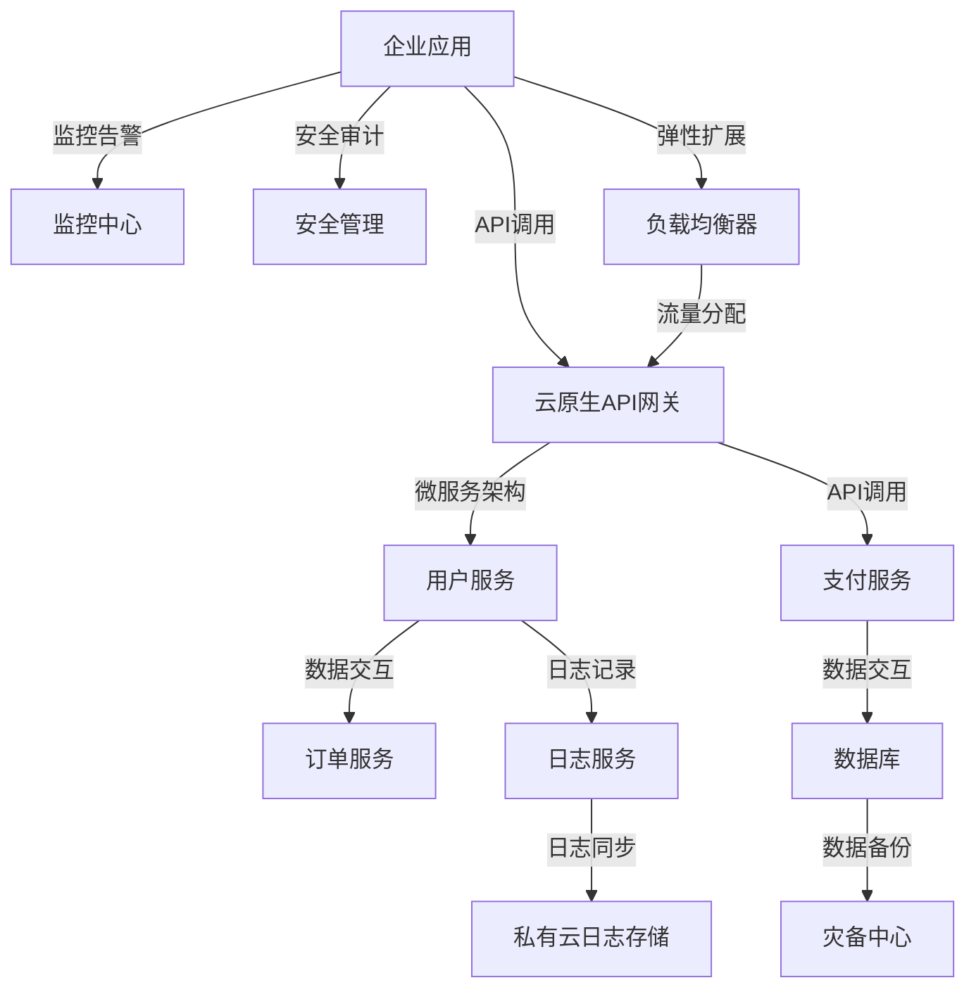

                 

### 引言

在现代信息技术迅猛发展的背景下，云计算已经成为企业数字化转型的重要基石。云计算技术的不断演进，尤其是多云和混合云环境的应用，使得企业能够更加灵活地应对业务需求，提升服务效率和降低成本。本文旨在探讨多云战略在混合云环境下的应用部署，帮助读者理解和掌握多云战略的核心概念、架构设计、应用部署策略、技术实践、案例分析以及未来趋势。

#### 多云与混合云的重要性

随着企业业务的不断增长和复杂性提升，单一云服务提供商已无法满足多样化的需求。多云战略通过整合多个云服务提供商的资源，为企业提供了更加灵活和弹性的IT基础设施。混合云则进一步结合了公有云和私有云的优势，使得企业可以在不同的云环境中部署应用，实现资源的最优配置。

#### 文章结构

本文分为四个主要部分：

1. **引入与概述**：介绍多云与混合云的基础概念、优势和挑战。
2. **技术实践**：详细讲解多云架构设计、应用部署策略、云原生应用开发、混合云数据管理、云服务集成与互操作、混合云安全与合规。
3. **案例与实践**：分析实际案例，展示技术实践中的问题与解决方案。
4. **总结与展望**：总结文章内容，展望多云战略的未来趋势。

通过以上结构，我们将逐步深入探讨多云战略在混合云环境下的应用部署，帮助读者全面理解和掌握相关技术和实践。

### 第一部分：引入与概述

#### 第1章：多云与混合云基础

在讨论多云战略之前，首先需要理解多云与混合云的基本概念。这些概念不仅有助于我们构建清晰的理论框架，而且能够帮助我们在实际应用中做出明智的决策。

##### 1.1 多云与混合云的概念与演进

**多云（Multi-Cloud）**：多云战略指的是企业同时使用两个或两个以上的云服务提供商，以避免单一供应商锁定和获取最佳资源。多云环境可能包括公有云（如Amazon Web Services, AWS, Microsoft Azure, Google Cloud Platform, GCP等）和私有云。

**混合云（Hybrid Cloud）**：混合云则是将公有云和私有云结合起来，使得企业可以在同一时间、同一应用程序中利用不同的云资源。这种模式提供了更大的灵活性，使得企业可以根据不同需求选择不同的云环境。

**演进**：随着云计算技术的不断发展和企业需求的多样化，从传统的单一云环境到多云再到混合云，企业的IT架构正在经历一次重大变革。从最初的基于本地数据中心的IT基础设施，到使用单一的云服务提供商，再到今天的多云和混合云，这一过程体现了企业在应对技术变革和市场挑战中的智慧和灵活性。

##### 1.2 企业为何需要多云战略

**避免供应商锁定**：企业通过采用多云战略，可以避免对单一云服务提供商的过度依赖，从而降低因供应商策略变化而带来的风险。

**灵活性**：多云战略使得企业能够根据具体业务需求灵活选择云服务，比如在某些云服务上实现特定功能或优化成本。

**成本优化**：通过在不同云服务提供商之间进行资源调配，企业可以实现成本的优化。

**业务连续性与灾难恢复**：多云和混合云提供了更加可靠的业务连续性和灾难恢复解决方案。企业可以将关键应用和数据分散存储在不同的云环境中，确保在发生故障时能够快速恢复。

**创新与实验性**：多云环境为企业提供了更大的实验空间，可以在不影响生产环境的情况下进行新技术的试验。

##### 1.3 混合云的优势与挑战

**优势**：

1. **资源优化**：企业可以根据不同应用的需求，将工作负载部署到最适合的云环境中，实现资源的最佳利用。
2. **灵活扩展**：混合云环境使得企业能够根据需求快速扩展或缩减资源，提高业务的敏捷性。
3. **数据合规**：混合云可以帮助企业满足不同国家和地区的数据合规要求。
4. **创新加速**：混合云环境为企业提供了丰富的云服务，有助于加速创新和产品开发。

**挑战**：

1. **复杂性**：多云和混合云环境的复杂性较高，管理难度大，需要专业知识和技能。
2. **成本控制**：如果不进行有效的资源管理，多云和混合云可能会带来较高的运营成本。
3. **安全性**：多环境和多云服务增加了安全管理的复杂度，需要制定全面的安全策略。
4. **整合与互操作性**：不同云服务提供商之间的整合和互操作性是混合云环境中的一个重要挑战。

通过以上章节的介绍，我们初步了解了多云与混合云的基础知识。接下来，我们将深入探讨多云架构的设计原则和关键组件，以及混合云架构的常见模式，帮助读者进一步理解多云战略的架构实现。

## 第2章：多云架构设计

在了解了多云和混合云的基础概念后，接下来我们将深入探讨多云架构的设计原则、关键组件和常见模式。这些内容将为我们在实际应用中设计和部署多云环境提供重要的理论指导和实践经验。

### 2.1 多云架构的设计原则

设计一个有效的多云架构，需要遵循一些基本原则，以确保系统的高可用性、可扩展性和灵活性。

**1. 容错性（Fault Tolerance）**：在多云架构中，关键服务应该能够在发生故障时自动切换到备用服务，确保业务连续性。

**2. 扩展性（Scalability）**：架构设计应考虑未来的扩展需求，确保系统能够灵活地增加或减少资源，以满足业务增长。

**3. 高可用性（High Availability）**：通过在多个云服务提供商之间部署应用和数据，实现高可用性，减少单点故障的风险。

**4. 一致性（Consistency）**：保证跨多个云环境的数据一致性，防止数据冲突和错误。

**5. 灵活性（Flexibility）**：选择能够适应不同业务需求的云服务，确保系统能够快速响应市场变化。

**6. 成本优化（Cost Optimization）**：合理规划资源使用，避免不必要的浪费，实现成本最优。

### 2.2 混合云架构的关键组件

一个成功的混合云架构通常包含以下几个关键组件：

**1. 公有云（Public Cloud）**：公有云提供弹性的计算资源，如AWS、Azure、GCP等，适用于非关键性业务和快速迭代开发。

**2. 私有云（Private Cloud）**：私有云为企业提供定制化的基础设施和服务，确保数据的安全和合规性，适用于关键业务和敏感数据。

**3. 连接（Connectivity）**：通过虚拟专用网络（VPN）和专线等连接方式，实现公有云和私有云之间的安全通信和数据传输。

**4. 服务管理（Service Management）**：使用自动化工具和平台，如AWS的AWS Management Console、Azure的Azure Portal等，进行多云资源的集中管理和监控。

**5. 数据管理（Data Management）**：实现数据在不同云环境之间的同步和备份，确保数据的一致性和可用性。

**6. 安全和合规性（Security and Compliance）**：采用多层次的安全措施，包括身份验证、加密和监控，确保混合云环境的安全性。

### 2.3 多云架构的常见模式

在实际应用中，多云架构通常遵循以下几种常见模式：

**1. 微服务架构（Microservices Architecture）**：通过将应用程序拆分为一组独立的、可复用的服务，每个服务运行在其自己的容器中，部署在不同的云环境中，提高了系统的灵活性和可扩展性。

**2. 容器化与容器编排（Containerization and Container Orchestration）**：使用容器（如Docker）将应用及其依赖环境打包，通过容器编排工具（如Kubernetes）实现自动化部署和管理，简化了多云环境中的应用部署。

**3. 数据中心即代码（Data Center as Code）**：通过基础设施即代码（IaC）工具（如Terraform、Ansible）实现基础设施的自动化部署和管理，确保多云环境的一致性和可重复性。

**4. 服务网格（Service Mesh）**：通过服务网格（如Istio、Linkerd）实现服务之间的通信管理和监控，提供可靠的服务发现、负载均衡和故障转移功能。

**5. 数据同步与灾备（Data Sync and Disaster Recovery）**：通过数据同步工具（如Apache Kafka、Consul）和灾备方案（如AWS的AWS Backup、Azure的Azure Site Recovery），实现数据的高效同步和快速恢复。

以上是多云架构设计中的关键原则、组件和常见模式。通过深入理解这些内容，我们可以为企业的多云和混合云战略提供更加完善和有效的技术支持。在下一章中，我们将探讨应用部署策略，帮助读者制定适合自身业务需求的部署方案。

### 2.4 多云架构的Mermaid流程图

为了更直观地理解多云架构的构建过程，我们可以使用Mermaid流程图来展示其关键组件和交互逻辑。以下是一个简单的Mermaid流程图示例：



这个Mermaid流程图展示了企业应用通过API网关与多个微服务进行交互，包括用户服务、订单服务、支付服务和日志服务等。同时，监控中心、安全管理、负载均衡器和灾备中心等组件也通过相应的接口与整个架构进行交互，确保系统的高可用性和灵活性。

通过使用Mermaid流程图，我们可以更加清晰地理解和设计多云架构，帮助读者在实际应用中更好地实现多云和混合云环境的部署和管理。

### 第3章：应用部署策略

在多云架构设计中，应用部署策略的选择至关重要。不同的部署策略会影响系统的性能、可靠性和可维护性。本章将详细探讨应用部署的目标与原则，以及在不同云环境下的部署策略。

#### 3.1 应用部署的目标与原则

**目标**：

1. **高可用性（High Availability）**：确保应用在发生故障时能够快速恢复，减少业务中断时间。
2. **可扩展性（Scalability）**：根据业务需求灵活调整资源，确保系统能够处理突发流量。
3. **灵活性（Flexibility）**：支持不同类型的应用部署，包括Web应用、大数据应用、实时流处理等。
4. **成本优化（Cost Optimization）**：合理分配资源，避免不必要的浪费，实现成本效益。

**原则**：

1. **分布式部署**：将应用部署到多个节点，避免单点故障，提高系统的可靠性。
2. **自动化部署**：使用自动化工具和脚本实现应用的自动化部署和更新，减少人为错误。
3. **弹性扩展**：根据实际负载动态调整资源，确保系统在高流量情况下能够稳定运行。
4. **监控与告警**：建立全面的监控体系，及时发现并处理系统故障，确保业务连续性。

#### 3.2 应用在不同云环境下的部署策略

**公有云（Public Cloud）**：

1. **完全分布式部署**：将应用部署到多个公有云节点，利用云服务提供商的负载均衡和自动扩展功能，实现高可用性和弹性扩展。
2. **混合部署**：将核心业务部署到私有云，将非核心业务部署到公有云，通过VPN或专线实现数据同步和安全通信。
3. **自动化部署**：利用云服务提供商的自动化工具（如AWS的EC2 Auto Scaling、Azure的Azure VM Scale Sets），实现自动部署和扩展。

**私有云（Private Cloud）**：

1. **容器化部署**：使用容器（如Docker）将应用打包，通过容器编排工具（如Kubernetes）实现自动化部署和管理。
2. **虚拟机部署**：将应用部署到虚拟机中，通过虚拟化技术实现资源隔离和动态调整。
3. **自动化部署**：使用基础设施即代码工具（如Terraform、Ansible）实现私有云资源的自动化部署和配置。

**混合云（Hybrid Cloud）**：

1. **集成部署**：将公有云和私有云的服务进行集成，通过API网关和容器编排工具实现统一管理。
2. **数据同步**：使用数据同步工具（如Apache Kafka、Consul）实现数据在不同云环境之间的实时同步。
3. **灾备部署**：将关键数据和应用部署到多个云环境中，实现数据的异地备份和快速恢复。

**跨云部署**：

1. **服务网格部署**：使用服务网格（如Istio、Linkerd）实现跨云服务之间的通信管理和监控。
2. **容器化跨云部署**：将应用容器化，通过容器编排工具实现跨云环境的自动化部署和扩展。
3. **云服务集成**：将不同云服务提供商的服务进行集成，实现跨云服务的统一管理和调用。

#### 3.3 部署过程中需要考虑的因素

在应用部署过程中，需要考虑以下因素：

1. **网络延迟**：选择合适的云服务提供商，确保网络延迟最小化，提高系统性能。
2. **安全性**：实施严格的安全策略，包括身份验证、加密和数据备份，确保数据的安全性和完整性。
3. **成本**：根据实际需求和预算，合理规划资源，避免过度投资和资源浪费。
4. **运维管理**：建立完善的运维管理体系，包括监控、告警和日志分析，确保系统的稳定运行和快速响应。
5. **兼容性**：确保应用在不同云环境中具有良好的兼容性，避免因环境差异导致的问题。

通过以上策略和考虑因素，我们可以实现高效、可靠和灵活的应用部署，满足多云和混合云环境下的业务需求。在下一章中，我们将详细探讨云原生应用开发的相关技术，帮助读者构建高效的云原生应用。

### 第4章：云原生应用开发

云原生应用开发是多云和混合云环境下的重要一环。它充分利用云计算的弹性和灵活性，为应用提供高性能、高可用性和可扩展性。本章将详细探讨云原生应用的特点与架构，以及容器化技术和微服务架构。

#### 4.1 云原生应用的特点与架构

**特点**：

1. **容器化**：云原生应用通常使用容器（如Docker）进行打包和部署，确保应用在不同环境中的一致性和可移植性。
2. **微服务架构**：应用被拆分为多个独立的服务，每个服务负责特定的功能，提高了系统的灵活性和可维护性。
3. **自动化**：云原生应用支持自动化部署、扩展和管理，减少了手动操作的复杂性。
4. **持续集成和持续部署（CI/CD）**：通过自动化工具和流程，实现代码的快速集成和部署，提高开发效率。
5. **服务网格**：使用服务网格（如Istio、Linkerd）实现服务之间的通信管理和监控，提供了更高级的流量管理和安全功能。

**架构**：

云原生应用的典型架构包括以下几个层次：

1. **基础设施层**：提供虚拟化资源和容器编排工具，如Kubernetes。
2. **容器层**：使用容器技术（如Docker）将应用打包，确保应用的可移植性和一致性。
3. **服务层**：应用被拆分为多个微服务，每个服务独立部署和运行。
4. **服务网格层**：使用服务网格技术（如Istio）实现服务之间的通信管理和监控。
5. **应用层**：实现具体的业务逻辑和功能。

#### 4.2 容器化技术介绍（Docker）

**Docker的基本概念**：

Docker是一种开源容器化技术，用于打包、交付和运行应用。它将应用及其依赖环境打包成一个容器镜像，确保在任意环境中都能一致地运行。

**主要组件**：

1. **Docker Engine**：Docker的核心组件，负责容器镜像的构建、运行和管理。
2. **Docker Hub**：Docker的镜像仓库，用户可以共享和下载容器镜像。
3. **Docker Compose**：用于定义和运行多容器应用的工具，提供了简单的配置文件格式。
4. **Docker Swarm**：Docker的集群管理工具，用于管理多个Docker Engine实例，提供高可用性和负载均衡。

**Docker的基本操作**：

1. **拉取镜像**：使用`docker pull`命令从Docker Hub下载所需的容器镜像。
2. **构建镜像**：使用`docker build`命令根据Dockerfile构建新的容器镜像。
3. **运行容器**：使用`docker run`命令启动新的容器实例。
4. **管理容器**：使用`docker ps`、`docker stop`和`docker restart`等命令管理容器实例。

**Dockerfile的基本语法**：

Dockerfile是用于构建容器镜像的脚本文件，包含一系列的命令和参数。以下是一个简单的Dockerfile示例：

```Dockerfile
FROM ubuntu:18.04
RUN apt-get update && apt-get install -y nginx
COPY ./app /usr/share/nginx/html
EXPOSE 80
CMD ["nginx", "-g", "daemon off;"]
```

这个Dockerfile基于Ubuntu 18.04镜像，安装了Nginx服务器，复制了应用程序到Nginx的默认位置，并暴露了80端口，指定了启动命令。

#### 4.3 服务网格与微服务架构

**服务网格的概念**：

服务网格是一种用于管理微服务通信的网络层基础设施。它提供了服务发现、负载均衡、故障转移和安全等功能，简化了微服务的管理和监控。

**主要组件**：

1. **服务代理**：在每个微服务实例中运行的代理，负责处理服务之间的通信。
2. **控制平面**：负责配置、监控和管理服务代理的中央控制层。
3. **数据平面**：由服务代理和数据存储组成，负责处理服务之间的流量和监控数据。

**服务网格的主要功能**：

1. **服务发现**：自动发现和注册服务实例，确保服务之间的通信。
2. **负载均衡**：根据服务实例的健康状态和配置，动态分配流量。
3. **故障转移**：在服务实例发生故障时，自动切换到备用实例，确保服务的连续性。
4. **安全**：提供细粒度的访问控制和加密，确保服务之间的通信安全。
5. **监控与日志**：收集和聚合服务网格中的监控数据和日志，提供统一的监控和分析界面。

**常用的服务网格技术**：

1. **Istio**：由Google、IBM和Lyft共同开发，是当前最流行的服务网格技术之一。
2. **Linkerd**：由Buoyant公司开发，是一个开源的服务网格平台，提供了丰富的功能。
3. **Conduit**：由Aspen Mesh开发，是一个简单且易于使用的服务网格技术。

通过云原生应用开发，企业可以在多云和混合云环境中构建高效、可靠和可扩展的应用。下一章我们将探讨混合云数据管理的挑战与策略，帮助读者实现数据的高效管理和同步。

### 第5章：混合云数据管理

在混合云环境中，数据管理面临着诸多挑战，如数据一致性、数据同步和灾难恢复。本章将深入探讨混合云数据管理的挑战、策略以及云数据库的选择与优化。

#### 5.1 数据管理的挑战与策略

**数据一致性的挑战**：

在混合云环境中，由于数据可能分布在多个云服务提供商中，保持数据一致性是一个重要挑战。不同的数据库系统可能具有不同的数据一致性和同步机制，这可能导致数据不一致性。为了解决这一问题，企业可以采用以下策略：

1. **分布式事务管理**：通过分布式事务管理技术（如两阶段提交、最终一致性协议等）确保跨多个数据库的数据一致性。
2. **数据复制与同步**：采用数据复制和同步技术（如数据库镜像、日志同步等）确保数据在不同云环境之间的实时同步。
3. **一致性保障机制**：使用一致性保障机制（如一致性哈希、版本控制等）确保数据在多副本环境中的准确性。

**数据同步的策略**：

数据同步是混合云数据管理的关键环节，确保数据在不同云环境之间的一致性和可用性。以下是一些常用的数据同步策略：

1. **实时同步**：通过实时同步技术（如数据库触发器、消息队列等）确保数据在不同云环境之间实时同步，减少数据延迟。
2. **批处理同步**：采用批处理同步技术（如数据ETL工具、定时任务等）定期同步数据，适用于低频数据同步场景。
3. **双向同步**：采用双向同步技术，确保数据在不同云环境之间的双向同步，避免单点故障和数据丢失。

**灾难恢复的策略**：

混合云环境下的灾难恢复是一个重要但复杂的任务。企业需要制定有效的灾难恢复策略，以确保在发生灾难时能够快速恢复业务。以下是一些常用的灾难恢复策略：

1. **异地备份**：将关键数据备份到异地云环境中，确保在本地数据中心发生灾难时能够快速恢复。
2. **多活架构**：采用多活架构（Multi-Active Architecture），在多个云环境中部署关键应用和数据，实现业务的高可用性和灾难恢复。
3. **灾备中心**：建立灾备中心，配置备用硬件和软件资源，确保在发生灾难时能够迅速切换到灾备中心。

#### 5.2 云数据库的选择与优化

在混合云环境中，选择合适的云数据库是数据管理的关键。不同的云数据库具有不同的性能、可扩展性和成本特点。以下是一些常用的云数据库及其选择依据：

**关系型数据库**：

1. **Amazon RDS**：提供自动化的数据库管理，包括备份、扩展和故障转移，适用于中等负载场景。
2. **Azure Database for MySQL**：提供高性能、高可靠性的MySQL数据库服务，适用于Web应用和数据分析。
3. **Google Cloud SQL**：提供易于管理的MySQL和PostgreSQL数据库服务，适用于快速开发和部署。

**NoSQL数据库**：

1. **Amazon DynamoDB**：提供自动扩展的键值存储，适用于大规模实时应用。
2. **Azure Cosmos DB**：提供多种数据模型和全球化分布式存储，适用于高并发和全球访问场景。
3. **Google Cloud Datastore**：提供强一致性、自动扩展和备份的NoSQL数据库服务，适用于Web应用和移动应用。

**数据仓库**：

1. **Amazon Redshift**：提供大规模数据仓库服务，适用于大数据分析和数据挖掘。
2. **Azure Synapse Analytics**：提供统一的数据分析平台，结合了数据仓库和大数据处理功能。
3. **Google BigQuery**：提供快速、强大的大数据分析服务，适用于实时数据分析和机器学习。

**优化策略**：

1. **查询优化**：通过索引优化、查询缓存和执行计划调整，提高数据库查询性能。
2. **存储优化**：根据数据访问模式和使用频率，合理分配存储资源，避免存储浪费。
3. **性能监控与调优**：使用数据库监控工具（如AWS CloudWatch、Azure Monitor等）实时监控数据库性能，根据监控数据调优配置。

通过有效的数据管理策略和合理的选择与优化，企业可以在混合云环境中实现高效、可靠和可扩展的数据管理。下一章我们将探讨云服务集成与互操作，帮助读者实现多云环境中的服务整合和管理。

### 第6章：云服务集成与互操作

在多云和混合云环境中，云服务的集成与互操作是确保系统高效运行和业务连续性的关键。本章将详细探讨云服务集成的基础设施、互操作性和自动化与编排技术。

#### 6.1 云服务集成的基础设施

**云服务集成的重要性**：

在多云环境中，企业通常会使用多个云服务提供商的不同服务。这些服务可能包括计算、存储、数据库、网络和人工智能等。云服务集成能够实现以下目标：

1. **资源整合**：通过集成不同云服务，企业可以实现资源的统一管理和优化配置，避免资源浪费。
2. **业务流程简化**：集成后的云服务能够简化业务流程，提高操作效率，降低运维成本。
3. **数据一致性**：实现不同云服务之间的数据一致性，确保数据在企业内部的高效流通。

**基础设施组件**：

云服务集成的基础设施通常包括以下几个关键组件：

1. **API网关**：API网关作为服务的统一入口，负责路由和认证，简化了服务之间的交互。
2. **服务注册与发现**：服务注册与发现机制确保服务实例的动态更新和发现，提高了系统的灵活性和可扩展性。
3. **服务编排**：服务编排工具（如Kubernetes、Apache NiFi等）用于定义和自动化部署多个服务的交互流程。
4. **服务代理**：服务代理位于每个服务实例前，负责处理请求、路由和负载均衡。

**云服务集成方案**：

一个典型的云服务集成方案通常包括以下步骤：

1. **服务定义**：定义需要集成的各个服务，明确服务的接口和功能。
2. **服务注册**：将服务注册到服务注册中心，以便其他服务能够发现和调用。
3. **接口适配**：根据服务规范实现接口适配，确保服务之间的通信顺畅。
4. **自动化部署**：使用服务编排工具自动化部署和管理集成后的服务。
5. **监控与告警**：建立监控体系，实时监控服务的运行状态和性能，及时发现并处理问题。

#### 6.2 云服务的互操作性

**互操作性的挑战**：

在多云和混合云环境中，云服务的互操作性面临以下挑战：

1. **数据格式**：不同云服务可能使用不同的数据格式和协议，导致数据集成困难。
2. **接口规范**：不同云服务提供的接口可能不一致，影响服务的调用和集成。
3. **认证与授权**：不同云服务可能使用不同的认证和授权机制，增加了互操作性的复杂性。
4. **性能和稳定性**：服务的互操作性可能对服务的性能和稳定性产生影响。

**解决互操作性的方法**：

为了解决上述挑战，可以采取以下方法：

1. **标准化接口**：使用标准化接口（如RESTful API、GraphQL等）确保服务之间的通信一致性。
2. **数据格式转换**：使用数据格式转换工具（如JSON-to-XML转换器、XML-to-JSON转换器等）处理不同数据格式之间的转换。
3. **认证与授权统一**：采用统一的认证和授权机制（如OAuth 2.0、OpenID Connect等），简化服务的互操作性。
4. **服务代理**：使用服务代理层处理服务之间的认证、路由和协议转换，减少服务的直接交互复杂性。

**互操作性示例**：

以下是一个简单的互操作性示例，展示如何使用RESTful API在不同云服务之间进行数据交换：

```http
POST /api/v1/orders
Host: service1.example.com
Content-Type: application/json

{
  "customer_id": "12345",
  "product_id": "67890",
  "quantity": 2
}
```

该示例中，客户端通过POST请求向服务1（订单服务）发送创建订单的请求，服务1处理请求并返回相应的响应。通过标准化的接口和格式，不同云服务能够高效地进行数据交互。

#### 6.3 服务的自动化与编排

**自动化的重要性**：

在多云环境中，服务的自动化与编排是提高运维效率和降低成本的关键。自动化能够实现以下目标：

1. **简化操作**：通过自动化脚本和工具，简化日常的运维操作，减少人工干预。
2. **加快部署**：使用自动化工具和平台，快速部署和扩展服务，提高业务响应速度。
3. **降低错误**：通过自动化脚本和流程，减少人为错误，提高系统稳定性。

**常用的自动化工具和平台**：

1. **Kubernetes**：Kubernetes是流行的容器编排工具，用于自动化部署、扩展和管理容器化应用。
2. **AWS Lambda**：AWS Lambda是一种无服务器计算服务，能够自动执行代码，无需管理基础设施。
3. **Azure Functions**：Azure Functions是微软提供的无服务器计算服务，支持多种编程语言。
4. **Apache NiFi**：Apache NiFi是一种数据集成平台，用于自动化数据处理和流程编排。

**自动化与编排示例**：

以下是一个使用Kubernetes进行服务自动化与编排的示例：

```yaml
apiVersion: apps/v1
kind: Deployment
metadata:
  name: order-service
spec:
  replicas: 3
  selector:
    matchLabels:
      app: order-service
  template:
    metadata:
      labels:
        app: order-service
    spec:
      containers:
      - name: order-service
        image: order-service:latest
        ports:
        - containerPort: 8080
```

该示例中，Kubernetes部署文件定义了一个名为`order-service`的部署，配置了3个副本，并指定了使用的容器镜像。通过Kubernetes，企业可以自动化部署和管理订单服务，实现高效的服务管理和扩展。

通过本章的探讨，我们了解了云服务集成与互操作的基础设施、挑战与解决方案，以及服务的自动化与编排技术。这些技术为多云和混合云环境中的服务整合和管理提供了有力支持。下一章将深入探讨混合云安全与合规性管理，确保系统的安全与数据保护。

### 第7章：混合云安全与合规

在混合云环境中，安全性和合规性是确保业务连续性和数据保护的关键。本章将详细探讨混合云安全策略、面向混合云的合规性管理，以及安全工具与技术的应用。

#### 7.1 混合云安全策略

**安全性目标**：

混合云安全策略的目标包括：

1. **数据保护**：确保存储在云中的数据得到充分保护，防止数据泄露和未授权访问。
2. **系统安全**：确保云基础设施和应用程序的安全，防止恶意攻击和漏洞利用。
3. **访问控制**：严格控制用户和服务的访问权限，防止未经授权的访问。
4. **审计与监控**：建立全面的监控和审计机制，及时发现和响应安全事件。

**关键安全要素**：

1. **身份验证与授权**：采用多因素认证（MFA）和基于角色的访问控制（RBAC）机制，确保用户和服务访问的合法性和安全性。
2. **数据加密**：对传输中和静态的数据进行加密，确保数据在传输和存储过程中的安全性。
3. **网络安全**：使用防火墙、入侵检测系统和虚拟专用网络（VPN）等技术，保护网络不受攻击。
4. **安全监控**：实时监控云环境中的安全事件，包括日志记录、告警和事件响应。

**安全策略框架**：

一个典型的混合云安全策略框架包括以下步骤：

1. **安全需求分析**：分析业务需求和风险，确定安全需求。
2. **安全架构设计**：设计符合安全需求的混合云架构。
3. **安全工具选型**：选择适合的安全工具和平台，包括防火墙、加密工具、监控工具等。
4. **安全培训与意识**：培训员工，提高安全意识和技能。
5. **安全审计与评估**：定期进行安全审计和评估，确保安全策略的有效性。

#### 7.2 面向混合云的合规性管理

**合规性挑战**：

混合云环境中的合规性管理面临以下挑战：

1. **数据合规性**：确保数据在不同云环境中的存储和处理符合相关法律法规。
2. **监管要求**：遵守不同国家和地区的数据保护法规，如GDPR、CCPA等。
3. **合规性审计**：进行定期合规性审计，确保业务符合法规要求。
4. **跨境数据传输**：确保跨境数据传输符合法规要求，防止数据泄露和违规。

**合规性管理策略**：

为了有效管理混合云环境中的合规性，企业可以采取以下策略：

1. **合规性需求识别**：分析业务需求，识别适用的法律法规和合规性要求。
2. **合规性框架设计**：设计符合法规的合规性框架，包括数据分类、访问控制、数据加密等。
3. **合规性审计**：建立内部审计机制，定期进行合规性审计，确保业务的合规性。
4. **合规性培训与意识**：培训员工，提高合规性意识和技能。
5. **合规性工具与平台**：使用合规性工具和平台（如合规性监控工具、数据加密工具等）实现合规性管理。

**合规性管理示例**：

以下是一个简单的合规性管理示例，展示如何使用加密技术保护数据：

```plaintext
1. 数据分类：将敏感数据（如客户信息、财务数据）归类为高敏感度数据。
2. 数据加密：在数据传输和存储过程中使用加密技术，如AES-256加密算法。
3. 访问控制：使用基于角色的访问控制（RBAC）机制，确保只有授权用户可以访问敏感数据。
4. 安全审计：定期进行安全审计，确保数据加密和访问控制策略的有效性。
5. 合规性报告：根据合规性要求，生成合规性报告，供管理层审阅。
```

#### 7.3 安全工具与技术

**常用的安全工具与技术**：

1. **防火墙**：防火墙用于过滤网络流量，防止未授权访问和恶意攻击。
2. **入侵检测系统（IDS）**：IDS用于监控网络流量，检测和响应潜在的安全威胁。
3. **虚拟专用网络（VPN）**：VPN用于建立安全的加密通道，确保数据在传输过程中的安全性。
4. **加密技术**：加密技术用于保护数据和通信，防止数据泄露和篡改。
5. **身份认证与访问管理（IDAM）**：IDAM用于管理用户的身份验证和访问权限。
6. **日志记录与分析**：日志记录与分析用于监控和审计系统活动，发现潜在的安全威胁。
7. **数据备份与恢复**：数据备份与恢复用于确保在数据丢失或系统故障时能够快速恢复业务。

**安全工具的应用示例**：

以下是一个使用防火墙和加密技术的示例：

```plaintext
1. 防火墙配置：配置防火墙规则，禁止外部访问关键服务和端口。
2. VPN部署：部署VPN，确保远程访问的安全和加密。
3. 数据加密：使用AES-256加密算法对存储和传输中的敏感数据进行加密。
4. 日志记录：启用系统日志记录功能，定期分析日志，发现潜在的安全威胁。
5. 安全审计：定期进行安全审计，评估防火墙和加密技术的有效性。
```

通过本章的探讨，我们了解了混合云安全策略、合规性管理以及安全工具与技术的应用。这些措施为混合云环境中的数据保护和安全提供了有力保障。在下一章中，我们将通过具体案例展示多云战略的实际应用和效果。

### 第8章：多云战略案例分析

为了更好地理解多云战略在现实环境中的应用效果，本章节将分析一个具体的案例，展示多云战略的实施背景、目标、技术选型与架构设计，以及实际部署与效果评估。

#### 8.1 案例背景与目标

**案例背景**：

某大型零售企业在其数字化转型过程中，面临着业务快速增长和数据量激增的挑战。为了提高业务敏捷性、降低成本和确保数据安全，该企业决定采用多云战略，将业务部署在多个云服务提供商上。

**目标**：

1. **提高业务连续性和灾难恢复能力**：通过将关键应用和数据分布在不同的云环境中，确保在发生故障时能够快速恢复业务。
2. **优化成本**：通过在多个云服务提供商之间灵活调配资源，实现成本最优。
3. **增强业务敏捷性**：快速响应市场变化，灵活部署和扩展应用。
4. **确保数据安全**：采用多层次的安全措施，保护关键数据和业务流程。

#### 8.2 案例中的技术选型与架构设计

**技术选型**：

为了实现上述目标，该企业选择了以下技术：

1. **公有云**：选择了AWS、Azure和Google Cloud Platform（GCP）三个主要云服务提供商。
2. **私有云**：采用VMware vSphere构建私有云基础设施，实现虚拟化资源的管理和调度。
3. **容器化与容器编排**：使用Docker进行应用容器化，Kubernetes进行容器编排，实现应用的自动化部署和管理。
4. **服务网格**：采用Istio实现服务之间的通信管理和监控。
5. **数据同步与备份**：使用Apache Kafka进行数据同步，AWS的AWS Backup进行数据备份。
6. **安全工具**：采用AWS GuardDuty、Azure Security Center和Google Cloud Armor进行安全监控和威胁防护。

**架构设计**：

该企业的混合云架构设计分为以下几个层次：

1. **基础设施层**：包括公有云、私有云和虚拟专用网络（VPN）。
2. **容器层**：基于Kubernetes的容器编排，实现应用的高效部署和管理。
3. **服务层**：采用微服务架构，将业务拆分为多个独立的服务，如用户服务、订单服务、库存服务等。
4. **数据层**：使用分布式数据库，如AWS RDS、Azure Database for MySQL和Google Cloud SQL，确保数据的高可用性和一致性。
5. **服务网格层**：采用Istio实现服务之间的可靠通信和安全防护。
6. **监控与日志层**：使用Prometheus和Grafana进行监控，ELK（Elasticsearch、Logstash、Kibana）堆栈进行日志分析。

#### 8.3 案例的实际部署与效果评估

**实际部署**：

1. **基础设施搭建**：首先，在AWS、Azure和GCP上分别搭建了公有云环境，在VMware vSphere上构建了私有云环境，并通过VPN建立了云环境之间的安全连接。
2. **容器化应用部署**：使用Docker将应用容器化，并编写Kubernetes部署文件，将容器化应用部署到Kubernetes集群中。
3. **服务网格配置**：在Kubernetes集群中安装Istio，配置服务网格，实现服务之间的通信管理和监控。
4. **数据同步与备份**：使用Apache Kafka实现数据在不同云环境之间的同步，AWS的AWS Backup进行数据备份。
5. **安全配置**：配置AWS GuardDuty、Azure Security Center和Google Cloud Armor，建立全面的安全监控和威胁防护机制。

**效果评估**：

1. **业务连续性和灾难恢复**：通过将关键应用和数据分布在不同的云环境中，该企业在发生故障时能够快速切换到备用环境，确保业务的连续性。
2. **成本优化**：通过在多个云服务提供商之间灵活调配资源，企业实现了成本的最优，避免了单一云服务提供商的锁定问题。
3. **业务敏捷性**：通过容器化和微服务架构，企业能够快速部署和扩展应用，提高了业务的敏捷性。
4. **数据安全**：通过多层次的安全措施，如数据加密、访问控制和安全监控，企业确保了关键数据和业务流程的安全。

通过这个案例，我们看到了多云战略在实际应用中的效果和优势。它不仅提高了业务的连续性和灾难恢复能力，还实现了成本优化和业务敏捷性。同时，有效的安全措施确保了数据的安全和合规性。这个案例为其他企业实施多云战略提供了宝贵的经验和参考。

### 第9章：混合云环境下的应用部署实战

在本章中，我们将通过一个实际的混合云应用部署项目，详细描述项目概述、开发环境搭建、应用部署流程、代码实现和遇到的问题及解决方案。通过这个实战案例，读者将能够理解混合云环境下的应用部署过程，并掌握关键技术和策略。

#### 9.1 实战项目概述

**项目背景**：

某电子商务平台计划采用混合云架构来部署其核心业务系统，以提高系统的弹性和可靠性。项目目标是在AWS公有云和VMware私有云之间实现应用的高效部署和管理，同时确保数据的安全和一致性。

**应用场景**：

该电子商务平台的主要应用包括用户管理、订单处理、支付处理和库存管理。为了满足不同业务场景的需求，项目需要将用户管理和支付处理部署在AWS公有云上，而订单处理和库存管理则部署在VMware私有云上。

**关键技术**：

1. **容器化技术**：使用Docker进行应用容器化，确保应用在不同云环境中的可移植性。
2. **容器编排**：使用Kubernetes进行容器编排，实现应用的自动化部署和管理。
3. **服务网格**：使用Istio实现服务之间的可靠通信和安全防护。
4. **数据同步与备份**：使用Apache Kafka进行数据在不同云环境之间的同步，使用AWS的AWS Backup进行数据备份。
5. **云服务集成**：通过API网关和服务注册与发现机制，实现云服务之间的集成与互操作性。

#### 9.2 开发环境搭建

**AWS公有云环境**：

1. **创建AWS账户**：在AWS管理控制台中创建新的账户，并配置角色和权限。
2. **配置Kubernetes集群**：使用AWS的EKS（Elastic Kubernetes Service）服务创建Kubernetes集群，并配置必要的网络和安全设置。
3. **安装Docker**：在AWS EC2实例上安装Docker，确保容器化应用能够在集群中运行。

**VMware私有云环境**：

1. **安装VMware vSphere**：在企业数据中心中安装VMware vSphere，配置虚拟化基础设施。
2. **配置Kubernetes集群**：在VMware环境中配置Kubernetes集群，使用虚拟机资源进行容器化应用的部署和管理。
3. **安装Docker**：在VMware ESXi主机上安装Docker，确保容器化应用能够在私有云环境中运行。

**网络配置**：

1. **VPN连接**：在AWS和VMware之间配置VPN连接，确保数据在不同云环境之间的安全传输。
2. **服务注册与发现**：使用Consul或Kubernetes的内置服务注册与发现机制，确保服务实例的动态更新和发现。

#### 9.3 应用部署流程与代码实现

**应用部署流程**：

1. **容器化应用**：使用Docker将应用打包成容器镜像，包括用户管理、订单处理、支付处理和库存管理等模块。
2. **创建Kubernetes部署文件**：编写Kubernetes部署文件（YAML），定义每个服务的容器镜像、副本数量、资源限制和网络配置。
3. **部署应用**：使用Kubernetes API部署应用，确保应用在AWS和VMware的Kubernetes集群中正常运行。
4. **配置服务网格**：在Istio中进行配置，实现服务之间的通信管理和监控。
5. **数据同步与备份**：配置Apache Kafka，确保数据在不同云环境之间的实时同步，并使用AWS Backup进行数据备份。

**代码实现示例**：

以下是一个简单的Kubernetes部署文件的示例，展示如何部署用户管理服务：

```yaml
apiVersion: apps/v1
kind: Deployment
metadata:
  name: user-service
spec:
  replicas: 3
  selector:
    matchLabels:
      app: user-service
  template:
    metadata:
      labels:
        app: user-service
    spec:
      containers:
      - name: user-service
        image: user-service:latest
        ports:
        - containerPort: 8080
```

在这个示例中，`user-service`部署了三个副本，使用最新的容器镜像，并暴露了8080端口。

#### 9.4 部署过程中遇到的问题及解决方案

**问题1**：Kubernetes集群无法访问外部服务

**问题描述**：在部署用户管理服务时，Kubernetes集群无法访问外部服务，导致服务无法正常通信。

**解决方案**：检查Kubernetes集群的网络配置，确保所有节点都能够正常访问外部网络。增加必要的网络路由规则，确保外部流量能够到达Kubernetes集群。

**问题2**：容器镜像无法拉取

**问题描述**：在部署容器化应用时，容器镜像无法从Docker Hub拉取。

**解决方案**：检查网络连接，确保能够访问Docker Hub。如果使用私有镜像仓库，确保Kubernetes集群可以访问私有镜像仓库，并配置相应的认证信息。

**问题3**：服务间通信不稳定

**问题描述**：服务间通信不稳定，导致请求失败。

**解决方案**：使用Istio进行服务网格配置，确保服务之间的通信稳定和可靠。检查Istio的控制平面和数据平面，确保其正常运行。

通过这个实战案例，我们详细描述了混合云环境下的应用部署过程，包括项目概述、开发环境搭建、应用部署流程、代码实现以及遇到的问题及解决方案。这些经验和技巧对于理解和实施混合云应用部署具有重要意义。

### 第10章：混合云应用性能优化

在混合云环境中，应用性能优化是一个关键任务，它直接影响到用户体验和业务效率。本章将讨论性能优化的目标与方法，详细解释缓存策略和数据缓存，以及性能监控与调优的实践。

#### 10.1 性能优化的目标与方法

**性能优化的目标**：

1. **提高响应时间**：减少用户请求的响应时间，提高系统的整体性能。
2. **提升并发处理能力**：增加系统处理并发请求的能力，确保在高负载情况下系统的稳定性。
3. **降低延迟**：减少数据传输和网络通信的延迟，提高系统的响应速度。
4. **提高资源利用率**：优化资源的分配和使用，避免资源浪费，提高系统的资源利用率。

**性能优化的方法**：

1. **性能评估**：使用性能监控工具对系统进行全面的性能评估，识别性能瓶颈。
2. **负载均衡**：通过负载均衡器（如AWS ELB、Azure Load Balancer等）分配流量，避免单点过载。
3. **分布式部署**：将应用部署到多个节点，提高系统的扩展性和并发处理能力。
4. **缓存策略**：使用缓存技术减少数据访问次数，提高系统的响应速度。
5. **数据优化**：优化数据库查询和索引，减少数据访问和处理的延迟。
6. **网络优化**：优化网络配置，减少网络延迟和数据传输量。

#### 10.2 缓存策略与数据缓存

**缓存策略**：

1. **内存缓存**：使用内存缓存（如Redis、Memcached）存储频繁访问的数据，减少对后端存储的访问次数。
2. **磁盘缓存**：使用磁盘缓存（如文件系统缓存）存储非频繁访问的数据，提高数据的访问速度。
3. **分布式缓存**：使用分布式缓存系统（如Consul、etcd）实现缓存的高可用性和横向扩展。

**数据缓存**：

1. **热点数据缓存**：将系统中频繁访问的数据缓存起来，如用户会话信息、热门商品信息等。
2. **预加载缓存**：在用户请求之前预加载可能需要的数据，减少请求的处理时间。
3. **缓存一致性**：确保缓存中的数据与后端存储的数据保持一致，防止数据冲突和错误。

**缓存策略示例**：

以下是一个使用Redis进行内存缓存的示例：

```python
import redis

# 连接Redis缓存
cache = redis.Redis(host='localhost', port=6379, db=0)

# 设置缓存
cache.set('user:12345', 'John Doe')

# 获取缓存
user = cache.get('user:12345')
print(user.decode())
```

在这个示例中，我们使用Redis缓存存储用户的会话信息，并在需要时从缓存中获取，减少对数据库的访问。

#### 10.3 性能监控与调优实践

**性能监控**：

1. **指标收集**：监控系统的关键性能指标（KPI），如响应时间、并发请求数、CPU利用率、内存使用率等。
2. **日志分析**：分析系统日志，识别性能瓶颈和异常行为。
3. **告警机制**：设置告警规则，及时发现和处理性能问题。
4. **性能测试**：进行压力测试和负载测试，评估系统的性能和稳定性。

**调优实践**：

1. **代码优化**：优化应用代码，减少不必要的计算和I/O操作。
2. **数据库优化**：优化数据库查询和索引，减少查询时间和数据访问量。
3. **缓存优化**：合理配置缓存策略，确保缓存的有效利用。
4. **网络优化**：优化网络配置，减少数据传输延迟。
5. **资源分配**：合理分配系统资源，避免资源瓶颈。

**性能监控工具示例**：

以下是一个使用Prometheus进行性能监控的示例：

```yaml
# Prometheus配置文件示例
global:
  scrape_interval: 15s
  evaluation_interval: 15s

scrape_configs:
  - job_name: 'prometheus'
    static_configs:
      - targets: ['localhost:9090']
  - job_name: 'aws'
    metrics_path: '/metrics'
    static_configs:
      - targets: ['ec2-xxx-xxx-xxx-xxx.compute-1.amazonaws.com:80']

alerting:
  alertmanagers:
    - static_configs:
      - targets: ['alertmanager:9093']
```

在这个示例中，Prometheus配置了两个监控作业：一个是监控本地的Prometheus实例，另一个是监控AWS EC2实例的性能指标。

通过本章的探讨，我们了解了混合云环境下的应用性能优化目标和策略，以及具体的缓存策略和实践。这些技术和方法能够有效提高系统的性能和响应速度，为用户提供更好的体验。在下一章中，我们将总结全书内容，并展望多云战略的未来趋势。

### 第11章：多云战略的未来趋势

随着云计算技术的不断演进，多云战略正在迎来新的发展趋势和技术创新。本章节将探讨多云与混合云的未来发展、技术趋势以及这些趋势对企业的影响。

#### 11.1 多云与混合云的未来发展

**多云与混合云的普及**：

随着企业对云计算需求的增加，多云和混合云环境已经成为许多企业的标准配置。未来，多云与混合云的普及程度将继续提高，更多的企业将采用这种灵活的IT架构来应对复杂多变的业务需求。

**云计算服务多样性的增加**：

云服务提供商将继续丰富其服务种类，包括高性能计算（HPC）、人工智能（AI）、物联网（IoT）等。这些新服务的推出将使得企业在多云环境下能够更加灵活地配置资源，满足多样化的业务需求。

**跨云协作与互操作性的增强**：

未来，云服务提供商之间将进一步加强协作，推动跨云协作和互操作性的实现。这将有助于企业更好地整合不同云环境中的资源和服务，实现更高效和统一的IT管理。

**多云安全与合规性的进一步提升**：

随着多云和混合云环境的复杂性增加，安全与合规性将成为关键挑战。未来，云服务提供商将推出更多安全工具和解决方案，帮助企业在多云环境中实现更高级别的安全防护和合规性管理。

#### 11.2 技术趋势与新兴领域

**容器化与容器编排的进一步普及**：

容器化技术（如Docker和Kubernetes）将继续成为多云和混合云环境中的核心技术。未来，容器化技术将更加成熟和普及，为企业提供更高效的应用部署和管理方式。

**服务网格与微服务架构的结合**：

服务网格（如Istio和Linkerd）与微服务架构的结合将成为未来趋势。服务网格将提供更高级别的服务管理功能，包括流量管理、安全性和监控，帮助企业实现更加高效和可靠的服务架构。

**人工智能与云计算的深度融合**：

人工智能（AI）与云计算的深度融合将带来新的发展机遇。云服务提供商将推出更多AI服务，如机器学习平台、自然语言处理等，帮助企业利用AI技术提高业务效率和创新能力。

**边缘计算的发展**：

随着物联网和5G技术的普及，边缘计算将成为多云战略中的重要组成部分。未来，企业将在多云和混合云环境中部署边缘计算资源，实现更快速的数据处理和响应，提升用户体验。

#### 11.3 多云战略对企业的影响

**提高业务敏捷性**：

多云战略使得企业能够更快速地响应市场需求，灵活地部署和扩展应用。这种灵活性有助于企业抓住市场机遇，提高业务敏捷性。

**降低成本**：

通过在多个云服务提供商之间调配资源，企业可以实现成本优化，避免过度投资和资源浪费。此外，多云战略还可以帮助企业避免单一供应商锁定，降低谈判成本。

**增强数据安全性**：

多云和混合云环境提供了多种安全工具和策略，帮助企业实现更高级别的数据保护和合规性管理。通过分布式部署和数据备份，企业能够更好地保护关键数据。

**提升创新能力**：

多云战略为企业提供了丰富的云服务和技术资源，有助于加速创新和产品开发。企业可以利用这些资源进行新技术试验和快速迭代，推动业务创新。

综上所述，多云战略的未来发展充满机遇和挑战。随着技术的不断演进，企业将能够在多云和混合云环境中实现更高的业务敏捷性、成本优化和创新能力。未来，多云战略将继续成为企业数字化转型和业务发展的重要推动力。

### 第12章：总结与展望

在本文中，我们系统地探讨了多云战略在混合云环境下的应用部署，从基础概念到实际案例，全面剖析了多云架构设计、应用部署策略、云原生应用开发、数据管理、服务集成与互操作性、安全与合规性管理等多个方面。通过这些内容的深入讲解，我们希望读者能够：

1. **理解多云与混合云的核心概念**：包括多云与混合云的定义、优势与挑战，为后续架构设计和应用部署提供了理论基础。
2. **掌握多云架构设计原则**：包括高可用性、扩展性、灵活性等关键原则，帮助读者设计和构建灵活可靠的架构。
3. **熟悉应用部署策略**：了解在不同云环境下的部署策略，以及部署过程中需要考虑的因素，提高实际操作能力。
4. **掌握云原生应用开发技术**：包括容器化与微服务架构，通过实际案例学习云原生应用的开发与部署。
5. **了解数据管理和集成技术**：探讨混合云数据管理的挑战与策略，以及云服务集成与互操作性，为数据的高效管理提供解决方案。
6. **理解混合云安全与合规性**：掌握混合云安全策略和合规性管理，确保系统的安全与数据保护。
7. **通过案例分析学习**：通过具体的多云战略案例分析，读者能够更直观地理解技术在实际应用中的效果和实现过程。

#### 阅读建议与后续学习

对于希望进一步深入了解多云和混合云技术的读者，以下是一些建议：

1. **深入学习云服务提供商的文档**：如AWS、Azure、GCP等，了解各个云服务的具体实现和最佳实践。
2. **参与开源社区和论坛**：加入Kubernetes、Istio、Docker等开源社区的讨论，学习最新的技术动态和实践经验。
3. **实践项目**：通过实际项目搭建和部署多云和混合云环境，将理论知识转化为实践能力。
4. **参加专业培训和认证**：参加云计算相关的培训课程和认证考试，如AWS Certified Solutions Architect、Azure Certified Solutions Architect等。

#### 对云计算与混合云应用的展望

未来，随着技术的不断进步和市场需求的增长，云计算与混合云应用将呈现出以下几个趋势：

1. **更广泛的云服务覆盖**：云服务提供商将继续丰富其服务种类，覆盖更多行业和应用场景。
2. **自动化与智能化的深度融合**：自动化工具和人工智能技术将更加深入地融入云服务，提高系统管理效率和用户体验。
3. **边缘计算的快速发展**：随着物联网和5G的普及，边缘计算将成为云计算的重要延伸，实现更快速的数据处理和响应。
4. **安全与合规性的持续提升**：随着数据隐私和安全法规的不断完善，云服务提供商将投入更多资源确保系统的安全性和合规性。
5. **企业数字化转型加速**：多云和混合云战略将成为企业数字化转型的重要推动力，帮助企业实现业务敏捷性、成本优化和创新能力。

总结而言，云计算与混合云技术将继续为企业和行业带来深远影响，未来充满机遇和挑战。通过不断学习和实践，我们将能够更好地利用这些技术，推动业务的发展和进步。

---

作者：AI天才研究院/AI Genius Institute & 禅与计算机程序设计艺术 /Zen And The Art of Computer Programming

文章标题：多云战略：混合云环境下的应用部署

文章关键词：多云战略、混合云、应用部署、云原生应用、容器化、微服务架构、数据管理、服务集成、安全与合规性、案例与实践、性能优化。

文章摘要：本文深入探讨了多云战略在混合云环境下的应用部署，从基础概念到实际案例，全面分析了多云架构设计、应用部署策略、云原生应用开发、数据管理、服务集成与互操作性、安全与合规性管理等方面的内容。通过详细的讲解和实践，帮助读者理解多云战略的核心概念、架构设计、技术实现和应用效果，为企业在多云和混合云环境中的数字化转型提供理论指导和实践参考。

