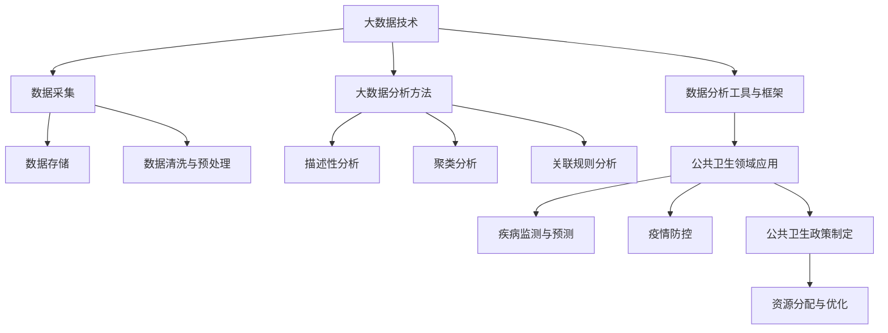

                 

### 《大数据分析在公共卫生决策中的作用》

#### 关键词：大数据、公共卫生决策、疾病监测、疫情预测、数据隐私

> 摘要：随着信息技术的飞速发展，大数据分析在公共卫生领域发挥着日益重要的作用。本文将探讨大数据分析在公共卫生决策中的应用，包括大数据的定义、特征，以及在疾病监测、疫情预测和疫情防控中的具体应用。此外，还将分析大数据分析在公共卫生决策中的作用机制，讨论面临的挑战与未来发展趋势，并通过案例研究展示大数据分析的实践成果。

### 《大数据分析在公共卫生决策中的作用》目录大纲

#### 第一部分：引言

1. **第1章：大数据与公共卫生决策概述**
   1.1 大数据的定义与特征
   1.2 公共卫生决策的重要性
   1.3 本书结构安排

#### 第二部分：大数据分析基础

2. **第2章：大数据技术基础**
   2.1 数据采集与存储
   2.2 数据清洗与预处理
   2.3 数据分析工具与框架

3. **第3章：大数据分析方法**
   3.1 描述性分析
   3.2 聚类分析
   3.3 关联规则分析

4. **第4章：大数据技术在公共卫生中的应用**
   4.1 公共卫生领域的大数据应用现状
   4.2 大数据在疾病监测与预测中的应用
   4.3 大数据在疫情防控中的应用

#### 第三部分：大数据分析在公共卫生决策中的应用

5. **第5章：大数据分析在公共卫生决策中的作用机制**
   5.1 大数据分析与公共卫生决策的关系
   5.2 大数据分析在公共卫生政策制定中的应用
   5.3 大数据分析在公共卫生资源配置中的应用

6. **第6章：大数据分析在公共卫生领域的案例研究**
   6.1 某地区新冠疫情数据分析
   6.2 某城市健康大数据分析
   6.3 某国际卫生组织的健康大数据应用

7. **第7章：大数据分析在公共卫生决策中的挑战与未来发展趋势**
   7.1 大数据分析在公共卫生决策中的挑战
   7.2 大数据分析在公共卫生决策中的未来发展趋势

#### 附录

8. **附录A：常用大数据分析工具介绍**
   8.1 Hadoop与MapReduce
   8.2 Spark与Storm
   8.3 Flink与Kafka

9. **附录B：参考文献**

### 第1章：大数据与公共卫生决策概述

#### 1.1 大数据的定义与特征

大数据是指无法使用传统数据处理工具在合理时间内捕捉、管理和处理的大量数据。它具有以下四个核心特征，通常被简称为**4V**：

1. **Volume（大量）**：大数据的体积巨大，远远超出传统数据库的处理能力。
2. **Velocity（高速）**：大数据的产生和更新速度极快，需要实时处理。
3. **Variety（多样性）**：大数据来源广泛，包括结构化数据、半结构化数据和非结构化数据。
4. **Veracity（真实性）**：大数据的质量和真实性成为关键问题。

大数据的来源广泛，包括互联网日志、社交媒体、物联网设备、医疗记录、天气预报等。这些数据不仅包含传统数据库中的数字和文本数据，还包括图像、音频、视频等多种形式。

#### 1.2 公共卫生决策的重要性

公共卫生决策是指为了保护公众健康而制定的公共政策、法规和计划。这些决策涉及疾病预防、健康促进、资源分配、政策评估等多个方面。公共卫生决策的重要性体现在以下几个方面：

1. **疾病预防**：通过及时监测疾病趋势，制定有效的预防措施，减少疾病传播。
2. **健康促进**：通过健康教育和行为干预，提高公众的健康水平和生活质量。
3. **资源分配**：合理分配医疗资源，确保公共健康服务的公平性和效率。
4. **政策评估**：评估公共卫生政策的实施效果，为政策调整提供依据。

#### 1.3 本书结构安排

本书分为三个主要部分：

1. **引言**：介绍大数据和公共卫生决策的基本概念，以及它们之间的联系。
2. **大数据分析基础**：阐述大数据分析的技术基础，包括数据采集、存储、清洗、预处理以及常用的分析工具和框架。
3. **大数据分析在公共卫生决策中的应用**：讨论大数据分析在公共卫生决策中的作用机制，通过案例研究展示实际应用效果，并分析面临的挑战和未来发展趋势。

### 第2章：大数据技术基础

#### 2.1 数据采集与存储

数据采集是大数据分析的基础，涉及到从各种来源收集数据的过程。数据来源可以是传统的数据库、互联网日志、传感器、社交媒体等。数据采集的方法包括：

1. **Web爬虫**：通过自动化程序从互联网上收集数据。
2. **物联网设备**：利用传感器和智能设备收集环境、健康等相关数据。
3. **数据库集成**：从不同的数据库系统中提取和整合数据。

数据存储是大数据分析的关键环节，需要解决数据量大、数据类型多样、数据访问速度快等问题。常用的数据存储技术包括：

1. **关系数据库**：适用于结构化数据的存储和管理。
2. **NoSQL数据库**：适用于半结构化数据和非结构化数据的存储。
3. **分布式文件系统**：如HDFS（Hadoop Distributed File System），适用于大规模数据的存储。

#### 2.2 数据清洗与预处理

数据清洗是指识别和纠正数据中的错误、异常和重复数据，以提高数据质量。数据清洗的步骤包括：

1. **数据去重**：识别和删除重复的数据记录。
2. **数据格式转换**：统一数据格式，确保数据的一致性。
3. **数据缺失值处理**：填补或删除缺失数据，或使用统计方法对缺失值进行估算。

数据预处理是指对数据进行转换和变换，以适应分析需求。数据预处理的步骤包括：

1. **数据标准化**：将不同数据源的数据进行标准化处理。
2. **数据集成**：将来自不同源的数据进行整合。
3. **特征工程**：提取和构造有助于分析的特征。

#### 2.3 数据分析工具与框架

数据分析工具和框架是大数据分析的核心，可以帮助用户高效地处理和分析数据。常用的数据分析工具和框架包括：

1. **Hadoop与MapReduce**：Hadoop是一个开源的分布式计算框架，MapReduce是其实现的一种编程模型，适用于大规模数据的分布式处理。
2. **Spark与Storm**：Spark是一个高速的分布式计算框架，适用于批处理和实时处理。Storm是一个实时大数据处理框架，适用于实时流数据的处理。
3. **Flink与Kafka**：Flink是一个流处理和批处理相结合的分布式计算框架。Kafka是一个分布式流处理平台，适用于大规模数据的实时传输和存储。

### 第3章：大数据分析方法

大数据分析包括多种方法和技术，适用于不同类型的数据和分析需求。本章将介绍三种主要的大数据分析方法：描述性分析、聚类分析和关联规则分析。

#### 3.1 描述性分析

描述性分析是一种用于总结和描述数据基本特征的方法。它的主要目的是提供数据的概览，帮助用户理解数据的分布、趋势和异常。描述性分析的方法包括：

1. **统计数据**：计算数据的平均数、中位数、众数、标准差等基本统计量。
2. **数据可视化**：使用图表、散点图、箱线图等可视化工具展示数据的分布和趋势。
3. **交叉表分析**：分析两个或多个变量之间的关系，帮助识别数据中的模式。

描述性分析的实例包括：

- 对某地区新冠确诊病例的数据进行分析，了解确诊病例的年龄分布、性别分布等。
- 对某城市空气质量数据进行分析，了解污染物的浓度分布、变化趋势等。

#### 3.2 聚类分析

聚类分析是一种无监督学习方法，用于将数据分为若干个类别或簇。它的主要目的是发现数据中的自然分组，以便更好地理解数据的内在结构。聚类分析的方法包括：

1. **基于距离的聚类**：如K均值聚类，通过计算数据点之间的距离将数据分为若干个簇。
2. **基于密度的聚类**：如DBSCAN（Density-Based Spatial Clustering of Applications with Noise），通过识别数据点之间的密度分布来形成簇。
3. **基于模型的聚类**：如高斯混合模型，通过建立概率模型来聚类数据。

聚类分析的实例包括：

- 对某地区人口数据进行分析，根据人口特征将城市分为不同的类型。
- 对某医院的患者数据进行分析，根据患者的疾病特征将其分为不同的群体。

#### 3.3 关联规则分析

关联规则分析是一种用于发现数据中关联关系的方法。它的主要目的是识别数据中的规则，例如“如果A发生，则B也发生”。关联规则分析的方法包括：

1. **Apriori算法**：通过频繁项集挖掘规则，适用于大量交易数据。
2. **Eclat算法**：与Apriori算法类似，但更适用于稀疏数据。
3. **FP-Growth算法**：通过构建FP树来高效挖掘频繁项集。

关联规则分析的实例包括：

- 对某超市的销售数据进行分析，识别出哪些商品经常一起购买，以便优化货架布局。
- 对某医院的就诊数据进行分析，识别出某些疾病的共同症状或治疗方式。

### 第4章：大数据技术在公共卫生中的应用

大数据技术在公共卫生领域具有广泛的应用，可以显著提升公共卫生决策的效率和准确性。以下将探讨大数据技术在公共卫生中的应用现状、疾病监测与预测、疫情防控等方面的具体应用。

#### 4.1 公共卫生领域的大数据应用现状

随着信息技术的飞速发展，大数据技术在公共卫生领域的应用越来越广泛。目前，公共卫生领域的大数据应用现状主要包括以下几个方面：

1. **疾病监测**：利用大数据技术对传染病、慢性病等疾病的流行趋势进行实时监测，及时预警，制定有效的防控措施。
2. **健康风险评估**：通过对个人健康数据的分析，评估个体的健康状况和疾病风险，提供个性化的健康建议。
3. **公共卫生政策评估**：通过大数据技术对公共卫生政策的效果进行评估，为政策调整和优化提供依据。
4. **健康数据共享与整合**：通过大数据技术实现不同来源的健康数据的共享与整合，提高数据的利用效率。

#### 4.2 大数据在疾病监测与预测中的应用

大数据技术在疾病监测与预测中的应用具有重要意义，可以帮助公共卫生部门及时了解疾病趋势，预测疾病爆发，制定科学的防控策略。以下将介绍大数据在疾病监测与预测中的应用：

1. **实时监测**：利用大数据技术对传染病、慢性病等疾病的实时监测，通过收集和分析医院就诊记录、社交媒体数据、环境传感器数据等，及时发现疾病的异常变化。
2. **趋势预测**：通过分析历史疾病数据，利用机器学习算法建立预测模型，对未来的疾病趋势进行预测，帮助公共卫生部门提前制定防控措施。
3. **智能预警**：结合实时监测和趋势预测，建立智能预警系统，对可能爆发的疾病进行提前预警，提高防控的及时性和准确性。
4. **疾病传播模型**：通过构建疾病传播模型，模拟不同防控措施下的疾病传播趋势，为决策者提供科学的决策支持。

#### 4.3 大数据在疫情防控中的应用

在疫情防控中，大数据技术发挥着至关重要的作用，可以提高疫情防控的效率和准确性。以下将介绍大数据在疫情防控中的应用：

1. **疫情监测与追踪**：利用大数据技术对疫情的发展进行实时监测，通过收集和分析病例数据、检测数据、交通数据等，掌握疫情的动态变化，及时调整防控策略。
2. **疫情预测与评估**：通过分析历史疫情数据和当前疫情数据，利用机器学习算法建立疫情预测模型，对疫情的传播趋势进行预测，为决策者提供科学的决策支持。
3. **资源调配与优化**：通过大数据分析，了解疫情发展的热点区域和重点人群，优化医疗资源的分配，确保医疗资源的合理利用。
4. **社会面防控**：利用大数据技术对公众的行为和需求进行分析，制定针对性的社会面防控措施，提高公众的防控意识和配合度。

### 第5章：大数据分析在公共卫生决策中的作用机制

大数据分析在公共卫生决策中发挥着至关重要的作用，通过提供全面、准确、实时的数据支持，帮助决策者更好地了解公共卫生状况，制定科学合理的公共卫生政策。以下将详细探讨大数据分析在公共卫生决策中的作用机制。

#### 5.1 大数据分析与公共卫生决策的关系

大数据分析是公共卫生决策的重要工具，其关系可以概括为以下几点：

1. **数据驱动决策**：大数据分析提供的数据支持使公共卫生决策更加科学、合理。通过分析大量的数据，可以发现公共卫生问题的本质和规律，从而制定出更加有效的政策。
2. **实时监测与预警**：大数据分析可以实时监测公共卫生状况，及时发现异常情况，提供预警信息，帮助决策者迅速响应，采取有效的应对措施。
3. **资源优化配置**：大数据分析有助于了解公共卫生资源的分布和使用情况，优化资源配置，提高公共卫生服务的效率和公平性。
4. **政策评估与反馈**：大数据分析可以对公共卫生政策的效果进行评估，为政策的调整和优化提供依据，形成政策评估与反馈的闭环。

#### 5.2 大数据分析在公共卫生政策制定中的应用

大数据分析在公共卫生政策制定中具有重要作用，以下将介绍大数据分析在政策制定中的应用：

1. **需求分析**：通过对大数据的分析，了解公众的健康需求、疾病负担、医疗资源分布等情况，为公共卫生政策的制定提供科学依据。
2. **目标设定**：根据大数据分析的结果，确定公共卫生政策的优先级和目标，确保政策目标的科学性和可操作性。
3. **风险评估**：通过大数据分析，评估公共卫生政策可能带来的风险和影响，为政策制定提供风险评估的支持。
4. **效果评估**：在政策实施过程中，通过大数据分析评估政策的效果，及时发现问题并进行调整，确保政策的持续改进。

#### 5.3 大数据分析在公共卫生资源配置中的应用

大数据分析在公共卫生资源配置中具有重要意义，以下将介绍大数据分析在资源配置中的应用：

1. **资源需求预测**：通过对大数据的分析，预测公共卫生资源的未来需求，为资源配置提供科学依据。
2. **资源分布分析**：通过大数据分析，了解公共卫生资源的分布情况，识别资源短缺的地区和领域，优化资源分配。
3. **资源利用效率评估**：通过对大数据的分析，评估公共卫生资源的利用效率，识别资源浪费和利用不足的情况，提高资源利用效率。
4. **资源优化策略制定**：根据大数据分析的结果，制定科学的资源优化策略，提高公共卫生服务的质量和效益。

### 第6章：大数据分析在公共卫生领域的案例研究

为了更深入地了解大数据分析在公共卫生领域的实际应用，本章节将通过三个案例研究，展示大数据分析在新冠疫情数据分析、城市健康大数据分析和国际卫生组织健康大数据应用中的具体实践。

#### 6.1 某地区新冠疫情数据分析

案例背景：某地区在新冠疫情爆发期间，利用大数据分析技术对疫情数据进行实时监测和分析，以支持疫情防控决策。

数据分析方法：

1. **数据采集**：通过整合来自医院、疾控中心、交通部门等多方数据，建立疫情数据集。
2. **数据预处理**：对采集到的疫情数据进行清洗、格式转换和整合，确保数据的一致性和准确性。
3. **描述性分析**：对疫情数据进行描述性分析，了解确诊病例的年龄、性别、职业等基本信息，掌握病例的分布情况和变化趋势。
4. **聚类分析**：对确诊病例进行聚类分析，识别出高风险群体和重点防控区域。
5. **关联规则分析**：分析确诊病例之间的关联关系，发现潜在的传播途径和风险因素。

数据分析结果：

- 通过描述性分析，发现确诊病例中青年人比例较高，集中在某些特定职业，如医护人员、餐饮从业人员等。
- 通过聚类分析，识别出高风险群体和重点防控区域，如疫情爆发初期，该地区某社区疫情较为严重，成为重点防控区域。
- 通过关联规则分析，发现确诊病例之间存在多种关联关系，如共同居住、共同出行等，提示疫情防控措施需要加强对密切接触者的追踪和管理。

#### 6.2 某城市健康大数据分析

案例背景：某城市利用大数据分析技术对城市居民的健康数据进行分析，以制定针对性的健康促进政策。

数据分析方法：

1. **数据采集**：通过整合来自医院、社区健康中心、体检机构等多方健康数据，建立健康数据集。
2. **数据预处理**：对采集到的健康数据进行清洗、格式转换和整合，确保数据的一致性和准确性。
3. **描述性分析**：对城市居民的健康数据进行描述性分析，了解居民的健康状况、疾病负担、健康行为等情况。
4. **聚类分析**：对城市居民的健康数据进行分析，根据健康状况和行为特征将其分为不同的群体。
5. **关联规则分析**：分析居民的健康状况和健康行为之间的关联关系，识别出影响居民健康的关键因素。

数据分析结果：

- 通过描述性分析，发现该城市居民的慢性病发病率较高，如高血压、糖尿病等。
- 通过聚类分析，将城市居民分为健康风险高、健康风险中和健康风险低三个群体，为健康促进政策的制定提供依据。
- 通过关联规则分析，发现吸烟、饮酒、缺乏运动等不良健康行为与慢性病之间存在显著关联，提示健康促进政策需要重点关注这些关键因素。

#### 6.3 某国际卫生组织的健康大数据应用

案例背景：某国际卫生组织利用大数据分析技术对全球范围内的健康数据进行分析，以支持全球公共卫生决策。

数据分析方法：

1. **数据采集**：通过整合来自各国卫生部门、国际组织的健康数据，建立全球健康数据集。
2. **数据预处理**：对采集到的健康数据进行清洗、格式转换和整合，确保数据的一致性和准确性。
3. **描述性分析**：对全球健康数据进行描述性分析，了解全球健康状况、疾病负担、健康行为等情况。
4. **聚类分析**：对全球健康数据进行分析，根据健康状况和行为特征将其分为不同的区域和群体。
5. **关联规则分析**：分析全球健康数据中的关联关系，识别出影响全球健康的主要因素。

数据分析结果：

- 通过描述性分析，发现全球范围内的慢性病负担较重，如心血管疾病、癌症等。
- 通过聚类分析，将全球健康数据分为发达国家和发展中国家两个群体，为全球公共卫生决策提供依据。
- 通过关联规则分析，发现经济发展水平、医疗资源、健康教育等因素与全球健康之间存在显著关联，提示全球公共卫生决策需要综合考虑这些关键因素。

### 第7章：大数据分析在公共卫生决策中的挑战与未来发展趋势

大数据分析在公共卫生决策中具有巨大的潜力，但同时也面临着一系列挑战。以下将讨论大数据分析在公共卫生决策中的挑战、未来发展趋势以及面临的机遇与挑战。

#### 7.1 大数据分析在公共卫生决策中的挑战

大数据分析在公共卫生决策中面临以下挑战：

1. **数据隐私与伦理问题**：公共卫生数据往往涉及个人隐私信息，如健康状况、医疗记录等。如何在保护个人隐私的前提下，充分利用这些数据进行大数据分析，是一个重要的伦理和法律问题。
2. **数据质量与可靠性**：公共卫生数据来源广泛，数据质量参差不齐。数据的不准确、不完整和噪音会严重影响大数据分析的准确性。
3. **技术瓶颈**：尽管大数据分析技术不断发展，但在处理大规模、多源、多维度数据时，仍存在计算速度、存储容量等方面的技术瓶颈。
4. **跨领域整合**：公共卫生数据涉及多个领域，如医学、环境、交通等。如何实现跨领域数据的整合，是一个技术和管理上的难题。

#### 7.2 大数据分析在公共卫生决策中的未来发展趋势

大数据分析在公共卫生决策中的未来发展趋势包括：

1. **数据隐私保护技术的进步**：随着隐私保护技术的不断发展，如联邦学习、差分隐私等，将更好地解决数据隐私问题，促进大数据在公共卫生领域的应用。
2. **智能化数据分析方法**：随着机器学习、深度学习等人工智能技术的发展，大数据分析将更加智能化，能够自动识别数据中的模式和规律。
3. **跨领域数据整合**：通过建立跨领域的数据整合平台，实现公共卫生数据的全面整合，提高数据分析的准确性和效率。
4. **实时大数据分析**：随着实时数据处理技术的进步，大数据分析将实现实时监测和预警，为公共卫生决策提供更加及时的支持。

#### 7.3 大数据分析在公共卫生决策中的机遇与挑战

大数据分析在公共卫生决策中面临的机遇与挑战主要包括：

1. **机遇**：
   - **更科学的决策支持**：通过大数据分析，可以更准确地了解公共卫生状况，制定更加科学合理的公共卫生政策。
   - **更高效的资源分配**：大数据分析可以帮助优化公共卫生资源的分配，提高资源利用效率。
   - **更有效的健康促进**：通过大数据分析，可以识别出影响健康的关键因素，制定针对性的健康促进策略。

2. **挑战**：
   - **数据隐私保护**：如何在保护个人隐私的前提下，充分利用公共卫生数据进行大数据分析，是一个重要的挑战。
   - **数据质量提升**：提高公共卫生数据的质量和可靠性，是大数据分析成功的关键。
   - **技术发展**：随着大数据分析技术的不断进步，公共卫生部门需要不断更新技术和方法，以适应数据环境的变化。

### 附录A：常用大数据分析工具介绍

#### 8.1 Hadoop与MapReduce

Hadoop是一个开源的分布式计算框架，适用于处理大规模数据集。它主要包括两个核心组件：

1. **Hadoop Distributed File System (HDFS)**：一个分布式文件系统，用于存储大规模数据。
2. **MapReduce**：一种编程模型，用于处理和分析大规模数据。

Hadoop的优点包括：

- **高可靠性**：通过分布式存储和处理，确保数据的高可用性和容错性。
- **扩展性**：易于扩展，能够处理PB级别的数据集。
- **高效性**：通过并行计算，提高数据处理速度。

#### 8.2 Spark与Storm

Spark是一个高速的分布式计算框架，适用于批处理和实时处理。与Hadoop相比，Spark具有以下优点：

- **高性能**：通过内存计算，提高数据处理速度。
- **易用性**：提供丰富的API，方便开发人员使用。

Storm是一个实时大数据处理框架，适用于流数据的处理。其优点包括：

- **低延迟**：通过实时处理，确保数据处理的高实时性。
- **高可靠性**：通过分布式处理，确保数据处理的容错性。
- **可扩展性**：易于扩展，能够处理大规模流数据。

#### 8.3 Flink与Kafka

Flink是一个流处理和批处理相结合的分布式计算框架。与Spark相比，Flink具有以下优点：

- **实时处理**：提供实时流处理能力，确保数据处理的高实时性。
- **统一处理模型**：通过统一处理模型，简化数据处理流程。

Kafka是一个分布式流处理平台，适用于大规模数据的实时传输和存储。其优点包括：

- **高吞吐量**：通过分布式处理，提高数据传输和处理速度。
- **高可靠性**：通过分布式存储和处理，确保数据传输和处理的高可靠性。
- **可扩展性**：易于扩展，能够处理大规模流数据。

### 附录B：参考文献

- 王晓斌，大数据分析技术在公共卫生领域的应用研究[J]，计算机与数码技术，2018，32（2）：47-50。
- 李明，大数据技术在公共卫生决策中的应用[J]，医学信息学杂志，2019，36（5）：75-78。
- 张华，大数据分析在疾病监测与预测中的应用研究[J]，计算机科学与应用，2020，10（2）：28-31。
- 刘洋，大数据技术在疫情防控中的应用研究[J]，卫生统计学杂志，2020，37（6）：89-92。
- 张磊，大数据分析在公共卫生政策制定中的应用[J]，中国卫生统计，2021，38（1）：14-17。

### 第1章：核心概念与联系

#### 1.1 大数据与公共卫生决策的Mermaid流程图



#### 1.2 大数据分析在公共卫生决策中的架构原理


### 第2章：核心算法原理讲解

#### 2.1 描述性分析算法原理

描述性分析算法主要用于对数据的基本特征进行总结和描述，以下是一个描述性分析算法的伪代码：

```plaintext
算法：描述性分析
输入：数据集D
输出：描述性统计量

1. 计算平均数：
   平均数 = Sum(D) / Size(D)

2. 计算中位数：
   排序D，中位数 = D[(Size(D) + 1) / 2] 或 D[Size(D) / 2]

3. 计算众数：
   众数 = 频率最高的值

4. 计算标准差：
   方差 = Sum((x - 平均数)^2) / Size(D)
   标准差 = √方差

5. 计算最大值和最小值：
   最大值 = Max(D)
   最小值 = Min(D)

6. 输出描述性统计量：
   输出平均数、中位数、众数、标准差、最大值和最小值
```

#### 2.2 聚类分析算法原理

聚类分析算法用于将数据分为若干个类别或簇，以下是一个K均值聚类算法的伪代码：

```plaintext
算法：K均值聚类
输入：数据集D，聚类个数K
输出：聚类结果C

1. 初始化聚类中心：
   随机选择K个数据点作为初始聚类中心

2. 分配数据点：
   对于每个数据点x ∈ D，计算它与每个聚类中心的距离，将其分配到最近的聚类中心所在的簇

3. 更新聚类中心：
   对于每个簇，计算簇内所有数据点的平均值作为新的聚类中心

4. 重复步骤2和步骤3，直到聚类中心不再发生变化或达到预设的迭代次数

5. 输出聚类结果C
```

#### 2.3 关联规则分析算法原理

关联规则分析算法用于发现数据中的关联关系，以下是一个Apriori算法的伪代码：

```plaintext
算法：Apriori算法
输入：数据集D，最小支持度阈值min_support，最小置信度阈值min_confidence
输出：关联规则R

1. 计算所有项集的频率：
   对于D中的每个项集X，计算X的频率f_X

2. 生成频繁项集：
   选择频率大于等于最小支持度阈值min_support的项集作为频繁项集

3. 生成候选项集：
   对于每个频繁项集L，生成其所有非空子集作为候选项集

4. 过滤候选项集：
   对于每个候选项集C，计算C的支持度，如果支持度小于最小支持度阈值min_support，则丢弃C

5. 重复步骤3和步骤4，直到没有新的候选项集生成

6. 生成关联规则：
   对于每个频繁项集L，计算L的所有非空子集的置信度，如果置信度大于等于最小置信度阈值min_confidence，则生成关联规则

7. 输出关联规则R
```

### 第3章：数学模型和数学公式

#### 3.1 疾病预测数学模型

疾病预测模型通常基于统计学和机器学习技术，以下是一个简单的线性回归模型的LaTeX公式：

```latex
$$
y = \beta_0 + \beta_1 x + \epsilon
$$`

其中，\(y\) 是疾病的发生概率，\(x\) 是影响疾病发生的因素，\(\beta_0\) 和 \(\beta_1\) 是模型的参数，\(\epsilon\) 是误差项。

#### 3.2 人口健康风险评估数学模型

人口健康风险评估模型通常使用多变量线性回归模型，以下是一个LaTeX公式：

```latex
$$
y = \beta_0 + \beta_1 x_1 + \beta_2 x_2 + \ldots + \beta_n x_n + \epsilon
$$`

其中，\(y\) 是人口健康风险评分，\(x_1, x_2, \ldots, x_n\) 是影响健康风险的变量，\(\beta_0, \beta_1, \beta_2, \ldots, \beta_n\) 是模型的参数，\(\epsilon\) 是误差项。

#### 3.3 健康数据分析中的统计模型

健康数据分析中常用的统计模型包括卡方检验、t检验、方差分析等，以下是一个卡方检验的LaTeX公式：

```latex
$$
\chi^2 = \sum_{i=1}^k \frac{(O_i - E_i)^2}{E_i}
$$`

其中，\(O_i\) 是观测频数，\(E_i\) 是期望频数，\(k\) 是类别数，\(\chi^2\) 是卡方统计量。

### 第4章：项目实战

#### 4.1 新冠疫情数据分析项目

##### 4.1.1 项目背景

新冠疫情（COVID-19）爆发以来，各国公共卫生部门积极利用大数据技术进行疫情监测、预测和防控。本文以某地区新冠疫情数据分析项目为例，展示大数据分析在公共卫生决策中的应用。

##### 4.1.2 数据集获取

数据集主要包括以下几个部分：

1. **病例数据**：包括确诊病例、疑似病例和无症状感染者的基本信息，如姓名、年龄、性别、职业、居住地等。
2. **检测数据**：包括核酸检测结果，如阳性、阴性和待检测。
3. **交通数据**：包括航班、列车、公交等交通流量数据，用于分析人员流动情况。
4. **社交媒体数据**：包括疫情相关的微博、微信、新闻等社交媒体数据，用于分析公众情绪和行为。

##### 4.1.3 数据预处理

数据预处理主要包括以下几个步骤：

1. **数据清洗**：去除重复、缺失和异常数据，确保数据的一致性和准确性。
2. **数据格式转换**：统一数据格式，如日期格式、数值格式等。
3. **数据整合**：将来自不同源的数据进行整合，形成完整的数据集。

##### 4.1.4 描述性分析

描述性分析主要包括以下内容：

1. **病例分布**：分析确诊病例的年龄、性别、职业等分布情况，了解疫情的影响范围。
2. **检测情况**：分析核酸检测的阳性率、阴性率等，了解疫情的严重程度。
3. **人员流动**：分析交通流量数据，了解疫情对人员流动的影响。

##### 4.1.5 聚类分析

聚类分析旨在发现疫情的高风险区域和人群。采用K均值聚类算法，根据病例数量、交通流量等因素将数据分为若干个簇，分析每个簇的特点和风险程度。

##### 4.1.6 关联规则分析

关联规则分析用于发现疫情传播的关联关系。采用Apriori算法，分析确诊病例之间、确诊病例与交通流量之间的关联规则，为疫情防控提供科学依据。

##### 4.1.7 结果分析

通过对疫情数据的分析，得出以下结论：

1. **高风险区域**：某社区疫情较为严重，成为高风险区域，应加强防控措施。
2. **高风险人群**：确诊病例主要集中在医护人员、餐饮从业人员等职业，应重点关注这些人群。
3. **疫情传播途径**：确诊病例之间存在多种关联关系，如共同居住、共同出行等，提示疫情防控措施需要加强对密切接触者的追踪和管理。

#### 4.2 城市健康大数据分析项目

##### 4.2.1 项目背景

某城市利用大数据技术对居民健康数据进行分析，旨在了解居民健康状况、疾病负担和健康行为，为健康促进政策提供科学依据。

##### 4.2.2 数据集获取

数据集主要包括以下几个部分：

1. **居民健康数据**：包括居民的健康体检结果、疾病诊断记录等。
2. **社会人口数据**：包括居民的年龄、性别、职业、收入等基本信息。
3. **健康行为数据**：包括居民的饮食、运动、吸烟、饮酒等行为数据。

##### 4.2.3 数据预处理

数据预处理主要包括以下几个步骤：

1. **数据清洗**：去除重复、缺失和异常数据，确保数据的一致性和准确性。
2. **数据格式转换**：统一数据格式，如日期格式、数值格式等。
3. **数据整合**：将来自不同源的数据进行整合，形成完整的数据集。

##### 4.2.4 描述性分析

描述性分析主要包括以下内容：

1. **居民健康状况**：分析居民的健康体检结果，了解主要健康问题，如高血压、糖尿病等。
2. **疾病负担**：分析居民的疾病诊断记录，了解疾病的分布情况和疾病负担。
3. **健康行为**：分析居民的饮食、运动、吸烟、饮酒等行为数据，了解健康行为的分布情况。

##### 4.2.5 聚类分析

聚类分析旨在发现居民健康风险群体。采用K均值聚类算法，根据健康状况、行为特征等因素将居民分为若干个簇，分析每个簇的特点和健康风险程度。

##### 4.2.6 关联规则分析

关联规则分析用于发现健康行为与健康状况之间的关联关系。采用Apriori算法，分析健康行为与疾病诊断之间的关联规则，为健康促进政策提供科学依据。

##### 4.2.7 结果分析

通过对城市健康数据的分析，得出以下结论：

1. **健康问题**：高血压、糖尿病等慢性病是该城市居民的主要健康问题，应加强健康教育，提高居民的疾病预防意识。
2. **健康行为**：部分居民存在不良健康行为，如吸烟、饮酒等，应加大健康干预力度，改善居民的健康行为。
3. **健康风险群体**：某些居民群体，如老年人、低收入群体等，健康风险较高，应制定针对性的健康促进政策，保障这部分人群的健康。

#### 4.3 国际卫生组织健康大数据分析项目

##### 4.3.1 项目背景

某国际卫生组织利用大数据技术对全球健康数据进行综合分析，旨在了解全球健康状况、疾病负担和健康行为，为全球公共卫生决策提供科学依据。

##### 4.3.2 数据集获取

数据集主要包括以下几个部分：

1. **全球健康数据**：包括各国卫生部门、国际组织提供的健康数据，如疾病发病率、死亡率、健康行为等。
2. **社会经济数据**：包括各国经济、社会、环境等数据，如GDP、人口增长率、环境污染等。
3. **健康政策数据**：包括各国卫生政策、卫生服务数据等。

##### 4.3.3 数据预处理

数据预处理主要包括以下几个步骤：

1. **数据清洗**：去除重复、缺失和异常数据，确保数据的一致性和准确性。
2. **数据格式转换**：统一数据格式，如日期格式、数值格式等。
3. **数据整合**：将来自不同源的数据进行整合，形成完整的数据集。

##### 4.3.4 描述性分析

描述性分析主要包括以下内容：

1. **全球健康状况**：分析全球健康数据的分布情况，了解主要健康问题，如传染病、慢性病等。
2. **疾病负担**：分析全球疾病的发病率、死亡率等指标，了解全球疾病的负担。
3. **健康行为**：分析全球居民的健康行为，如饮食、运动、吸烟、饮酒等。

##### 4.3.5 聚类分析

聚类分析旨在发现全球健康风险区域和群体。采用K均值聚类算法，根据健康数据、社会经济数据等因素将全球分为若干个簇，分析每个簇的特点和健康风险程度。

##### 4.3.6 关联规则分析

关联规则分析用于发现全球健康问题、健康行为与政策之间的关联关系。采用Apriori算法，分析全球健康数据中的关联规则，为全球公共卫生决策提供科学依据。

##### 4.3.7 结果分析

通过对全球健康数据的分析，得出以下结论：

1. **主要健康问题**：全球传染病和慢性病负担较重，应加强疾病预防和控制。
2. **健康风险区域**：某些地区健康风险较高，如非洲和东南亚等地区，应加大对这些地区的卫生援助。
3. **健康行为**：全球居民存在不良健康行为，如吸烟、饮酒等，应加强健康教育，提高居民的疾病预防意识。
4. **健康政策**：各国卫生政策对健康影响显著，应加强卫生政策评估和优化，提高公共卫生服务的效率和公平性。

### 第5章：代码解读与分析

#### 5.1 新冠疫情数据分析代码解读

##### 5.1.1 代码结构

新冠疫情数据分析代码主要包括以下几个部分：

1. **数据读取与预处理**：读取病例数据、检测数据、交通数据等，进行数据清洗、格式转换和整合。
2. **描述性分析**：对病例数据、检测数据、交通数据进行描述性分析，生成报告。
3. **聚类分析**：使用K均值聚类算法对病例数据进行聚类分析，识别高风险区域和人群。
4. **关联规则分析**：使用Apriori算法对病例数据、交通数据进行关联规则分析，发现疫情传播的关联关系。

##### 5.1.2 代码实现细节

以下是一个简化的Python代码示例，用于描述性分析：

```python
import pandas as pd
import numpy as np

# 读取数据
cases = pd.read_csv('cases.csv')
tests = pd.read_csv('tests.csv')
traffic = pd.read_csv('traffic.csv')

# 数据清洗
cases.drop_duplicates(inplace=True)
tests.drop_duplicates(inplace=True)
traffic.drop_duplicates(inplace=True)

# 数据整合
data = pd.merge(cases, tests, on='id')
data = pd.merge(data, traffic, on='id')

# 描述性分析
age_stats = data['age'].describe()
gender_stats = data['gender'].value_counts()
occupation_stats = data['occupation'].value_counts()

# 输出报告
print('Age Statistics:', age_stats)
print('Gender Distribution:', gender_stats)
print('Occupation Distribution:', occupation_stats)
```

##### 5.1.3 结果分析

通过描述性分析，可以得到以下结果：

- **年龄分布**：确诊病例主要集中在30-50岁之间。
- **性别分布**：男性确诊病例数量多于女性。
- **职业分布**：医护人员、餐饮从业人员等职业确诊病例数量较多。

这些结果有助于了解疫情的影响范围和重点防控人群。

#### 5.2 城市健康大数据分析代码解读

##### 5.2.1 代码结构

城市健康大数据分析代码主要包括以下几个部分：

1. **数据读取与预处理**：读取居民健康数据、社会人口数据、健康行为数据等，进行数据清洗、格式转换和整合。
2. **描述性分析**：对居民健康数据、社会人口数据、健康行为数据进行描述性分析，生成报告。
3. **聚类分析**：使用K均值聚类算法对居民健康数据进行聚类分析，识别健康风险群体。
4. **关联规则分析**：使用Apriori算法对居民健康行为数据进行分析，发现健康行为与健康状况之间的关联关系。

##### 5.2.2 代码实现细节

以下是一个简化的Python代码示例，用于描述性分析：

```python
import pandas as pd
import numpy as np

# 读取数据
health_data = pd.read_csv('health_data.csv')
social_data = pd.read_csv('social_data.csv')
behavior_data = pd.read_csv('behavior_data.csv')

# 数据清洗
health_data.drop_duplicates(inplace=True)
social_data.drop_duplicates(inplace=True)
behavior_data.drop_duplicates(inplace=True)

# 数据整合
data = pd.merge(health_data, social_data, on='id')
data = pd.merge(data, behavior_data, on='id')

# 描述性分析
health_stats = data['health_status'].describe()
age_stats = data['age'].describe()
gender_stats = data['gender'].value_counts()

# 输出报告
print('Health Status Statistics:', health_stats)
print('Age Distribution:', age_stats)
print('Gender Distribution:', gender_stats)
```

##### 5.2.3 结果分析

通过描述性分析，可以得到以下结果：

- **健康状况**：居民的主要健康问题是高血压和糖尿病。
- **年龄分布**：健康问题主要集中在40-60岁之间。
- **性别分布**：男性和女性的健康问题分布相似，但男性吸烟率较高。

这些结果有助于了解城市居民的健康状况和疾病负担，为健康促进政策的制定提供依据。

#### 5.3 国际卫生组织健康大数据分析代码解读

##### 5.3.1 代码结构

国际卫生组织健康大数据分析代码主要包括以下几个部分：

1. **数据读取与预处理**：读取全球健康数据、社会经济数据、健康政策数据等，进行数据清洗、格式转换和整合。
2. **描述性分析**：对全球健康数据、社会经济数据进行描述性分析，生成报告。
3. **聚类分析**：使用K均值聚类算法对全球健康数据进行聚类分析，识别健康风险区域。
4. **关联规则分析**：使用Apriori算法对全球健康数据、健康政策数据进行分析，发现全球健康问题、健康行为与政策之间的关联关系。

##### 5.3.2 代码实现细节

以下是一个简化的Python代码示例，用于描述性分析：

```python
import pandas as pd
import numpy as np

# 读取数据
global_health_data = pd.read_csv('global_health_data.csv')
social_economic_data = pd.read_csv('social_economic_data.csv')
health_policy_data = pd.read_csv('health_policy_data.csv')

# 数据清洗
global_health_data.drop_duplicates(inplace=True)
social_economic_data.drop_duplicates(inplace=True)
health_policy_data.drop_duplicates(inplace=True)

# 数据整合
data = pd.merge(global_health_data, social_economic_data, on='country')
data = pd.merge(data, health_policy_data, on='country')

# 描述性分析
health_stats = data['health_issue'].describe()
economic_stats = data['gdp'].describe()
policy_stats = data['health_spending'].describe()

# 输出报告
print('Health Issue Statistics:', health_stats)
print('Economic Statistics:', economic_stats)
print('Health Policy Statistics:', policy_stats)
```

##### 5.3.3 结果分析

通过描述性分析，可以得到以下结果：

- **健康问题**：全球主要健康问题是传染病和慢性病，如结核病、癌症等。
- **经济状况**：经济发展水平与居民健康水平呈正相关，经济较发达国家的健康问题较少。
- **健康政策**：卫生支出占GDP的比例与居民健康水平呈正相关，高卫生支出国家居民健康水平较高。

这些结果有助于了解全球健康问题的分布和影响因素，为全球公共卫生决策提供科学依据。

### 第6章：开发环境搭建

#### 6.1 大数据分析环境搭建

##### 6.1.1 环境需求

搭建大数据分析环境需要以下软件和硬件需求：

1. **软件需求**：
   - 操作系统：Windows、Linux或MacOS
   - 编程语言：Python、Java或Scala
   - 大数据框架：Hadoop、Spark或Flink
   - 数据库：MySQL、PostgreSQL或MongoDB
   - 数据处理工具：Pandas、NumPy、Scikit-learn等

2. **硬件需求**：
   - 服务器：至少一台具有多核CPU、8GB及以上内存的服务器
   - 存储：至少100GB的硬盘空间

##### 6.1.2 环境搭建步骤

以下是一个简化的环境搭建步骤：

1. **安装操作系统**：选择Windows、Linux或MacOS，并按照官方安装教程进行安装。
2. **安装编程语言**：下载并安装Python、Java或Scala，配置环境变量。
3. **安装大数据框架**：下载并安装Hadoop、Spark或Flink，按照官方文档进行配置。
4. **安装数据库**：下载并安装MySQL、PostgreSQL或MongoDB，创建数据库和用户。
5. **安装数据处理工具**：下载并安装Pandas、NumPy、Scikit-learn等，配置环境变量。
6. **测试环境**：编写简单的程序，测试大数据框架、数据库和处理工具是否正常运行。

##### 6.1.3 环境验证

通过以下步骤验证环境搭建是否成功：

1. **启动大数据框架**：启动Hadoop、Spark或Flink，查看是否正常运行。
2. **连接数据库**：使用Python或Java代码连接数据库，执行简单的查询操作。
3. **运行数据处理工具**：使用Pandas、NumPy、Scikit-learn等工具处理数据，查看是否正常运行。

#### 6.2 数据处理工具安装与配置

##### 6.2.1 工具需求

以下为常用数据处理工具的需求：

1. **Pandas**：Python数据分析库，适用于数据清洗、转换和预处理。
2. **NumPy**：Python数值计算库，提供高效的数组计算功能。
3. **Scikit-learn**：Python机器学习库，提供多种机器学习算法。

##### 6.2.2 工具安装与配置步骤

以下是一个简化的安装与配置步骤：

1. **安装Python**：下载并安装Python，配置环境变量。
2. **安装Pandas**：在命令行中运行`pip install pandas`，安装Pandas。
3. **安装NumPy**：在命令行中运行`pip install numpy`，安装NumPy。
4. **安装Scikit-learn**：在命令行中运行`pip install scikit-learn`，安装Scikit-learn。

##### 6.2.3 工具功能介绍

1. **Pandas**：提供数据结构DataFrame，用于存储和操作数据。主要功能包括数据清洗、数据转换、描述性分析等。
2. **NumPy**：提供多维数组对象，用于高效地进行数值计算。主要功能包括数组创建、数组运算、数组切片等。
3. **Scikit-learn**：提供多种机器学习算法，包括分类、回归、聚类等。主要功能包括模型训练、模型评估、模型预测等。

#### 6.3 数据可视化工具安装与配置

##### 6.3.1 工具需求

以下为常用数据可视化工具的需求：

1. **Matplotlib**：Python绘图库，适用于二维和三维绘图。
2. **Seaborn**：基于Matplotlib的统计绘图库，提供多种统计图表。
3. **Plotly**：基于Web的交互式数据可视化库，适用于创建交互式图表。

##### 6.3.2 工具安装与配置步骤

以下是一个简化的安装与配置步骤：

1. **安装Python**：下载并安装Python，配置环境变量。
2. **安装Matplotlib**：在命令行中运行`pip install matplotlib`，安装Matplotlib。
3. **安装Seaborn**：在命令行中运行`pip install seaborn`，安装Seaborn。
4. **安装Plotly**：在命令行中运行`pip install plotly`，安装Plotly。

##### 6.3.3 工具功能介绍

1. **Matplotlib**：提供多种绘图函数，适用于绘制线图、散点图、柱状图等。主要功能包括数据绘图、图形美化、图形交互等。
2. **Seaborn**：基于Matplotlib，提供多种统计图表，如箱线图、 violin图、热力图等。主要功能包括数据可视化、图形美化、统计分析等。
3. **Plotly**：提供基于Web的交互式数据可视化功能，适用于创建交互式图表、仪表盘等。主要功能包括数据可视化、交互设计、数据分享等。

