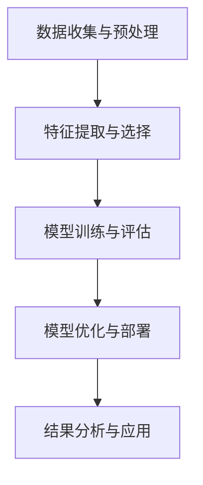
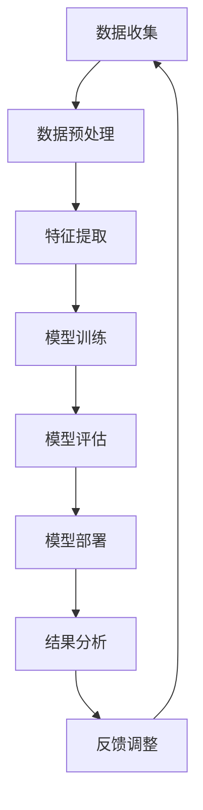

                 

## 大数据分析在社交网络影响力预测中的方法

### 关键词：大数据分析、社交网络、影响力预测、算法、数学模型、案例分析

> 摘要：本文将深入探讨大数据分析在社交网络影响力预测中的应用。通过对大数据分析技术的概述，我们将了解其在社交网络中的重要性。接着，本文将介绍社交网络影响力预测的核心概念、相关指标以及预测算法。通过实际案例分析和项目实战，我们将展示如何应用大数据分析技术进行社交网络影响力预测，并讨论未来的发展方向和挑战。本文旨在为读者提供一个全面而详尽的指南，帮助他们理解和掌握这一前沿技术。

### 目录大纲

#### 第一部分：引言

- 第1章：大数据与社交网络概述
  - 1.1 大数据概念及其在社交网络中的应用
  - 1.2 社交网络的基本概念与架构
  - 1.3 社交网络影响力预测的重要性

- 第2章：大数据分析技术基础
  - 2.1 数据预处理技术
    - 2.1.1 数据清洗
    - 2.1.2 数据集成
    - 2.1.3 数据变换
  - 2.2 数据存储与查询
    - 2.2.1 数据库技术
    - 2.2.2 数据仓库
    - 2.2.3 数据挖掘查询语言
  - 2.3 数据挖掘技术
    - 2.3.1 聚类分析
    - 2.3.2 分类算法
    - 2.3.3 联机分析处理

#### 第二部分：社交网络影响力预测方法

- 第3章：社交网络影响力核心概念与联系
  - 3.1 社交网络影响力定义
  - 3.2 社交网络影响力评估指标
  - 3.3 社交网络影响力与大数据分析的关联
  - 3.4 Mermaid流程图：社交网络影响力预测流程

- 第4章：社交网络影响力预测算法原理
  - 4.1 基于用户特征的预测算法
    - 4.1.1 用户活跃度
    - 4.1.2 用户影响力评分
    - 4.1.3 伪代码：用户特征预测算法
  - 4.2 基于社交网络结构的影响算法
    - 4.2.1 社交网络图论基础
    - 4.2.2 中心性指标
    - 4.2.3 伪代码：基于社交网络结构的预测算法

- 第5章：数学模型与预测公式
  - 5.1 数学模型概述
  - 5.2 数学公式与解释
    - 5.2.1 激活函数
    - 5.2.2 优化算法
    - 5.2.3 数学公式举例

- 第6章：实际案例分析
  - 6.1 案例一：Twitter影响力预测
  - 6.2 案例二：微信朋友圈影响力预测

- 第7章：项目实战
  - 7.1 开发环境搭建
  - 7.2 数据收集与预处理
  - 7.3 模型设计与实现
  - 7.4 模型评估与优化

#### 第三部分：未来展望与挑战

- 第8章：社交网络影响力预测发展趋势
  - 8.1 人工智能与机器学习的新进展
  - 8.2 社交网络数据隐私与安全问题
  - 8.3 未来研究方向与挑战

- 第9章：总结与展望

#### 附录

- 附录A：参考文献
- 附录B：常用算法与工具介绍
  - B.1 算法列表
  - B.2 常用工具与框架
  - B.3 数据集来源与处理方法

### Mermaid流程图：社交网络影响力预测流程


### 第一部分：引言

#### 第1章：大数据与社交网络概述

##### 1.1 大数据概念及其在社交网络中的应用

**大数据**是指数据量巨大、种类繁多、生成速度快且具有高价值的数据集合。它涵盖了结构化数据、半结构化数据和非结构化数据。大数据分析的核心目标是通过对海量数据的处理和分析，从中提取有价值的信息和知识。

在社交网络中，大数据的应用越来越广泛。社交网络平台如Facebook、Twitter、微信等，每天都会产生大量的用户数据，包括用户的个人信息、互动记录、地理位置等。通过对这些数据的分析和挖掘，可以揭示用户的行为模式、兴趣偏好和社交关系，从而为社交网络的发展提供有力的支持。

**大数据分析技术**包括数据预处理、数据存储与查询、数据挖掘等。数据预处理是大数据分析的第一步，主要包括数据清洗、数据集成和数据变换。数据清洗是指去除数据中的噪声和错误，确保数据的质量；数据集成是将不同来源和格式的数据整合在一起，以便于进一步分析；数据变换是将数据转换成适合分析的形式，如将文本数据转换为向量表示。

数据存储与查询技术是为了高效地管理和检索大数据。常见的存储技术包括关系型数据库、非关系型数据库和分布式文件系统。查询语言如SQL和NoSQL提供了强大的查询功能，可以快速检索和分析数据。

数据挖掘是大数据分析的核心技术，它包括聚类分析、分类算法、关联规则挖掘等。聚类分析是将数据分成不同的群体，以便于发现数据的分布和模式；分类算法是根据已有数据对新的数据进行分类，以预测其类别；关联规则挖掘是发现数据之间的关联关系，如“买A商品的用户中有80%也买了B商品”。

##### 1.2 社交网络的基本概念与架构

**社交网络**是指通过互联网和移动设备连接人与人之间的社会性网络。它具有以下几个基本概念：

- **用户**：社交网络的参与者，可以是个人或组织。
- **节点**：表示社交网络中的个体，通常是一个用户。
- **边**：表示节点之间的连接关系，通常表示用户之间的关系，如好友关系、关注关系等。
- **社交网络图**：由节点和边组成的图结构，用于表示社交网络中的关系。

社交网络的架构通常包括以下几个层次：

- **用户层**：包括用户的基本信息、个人资料等。
- **关系层**：包括用户之间的关系，如好友关系、关注关系等。
- **内容层**：包括用户在社交网络中发布的内容，如文本、图片、视频等。
- **分析层**：通过对社交网络中的数据进行挖掘和分析，提取有价值的信息和知识。

##### 1.3 社交网络影响力预测的重要性

社交网络影响力预测是指通过对社交网络中用户的行为数据和社交关系进行分析，预测用户在社交网络中的影响力。社交网络影响力预测的重要性体现在以下几个方面：

1. **营销策略制定**：企业可以通过预测用户的影响力，选择具有较高影响力的用户作为代言人或推广渠道，从而提高营销效果。

2. **社区管理**：社交网络平台可以通过预测用户的影响力，发现潜在的意见领袖和活跃用户，从而优化社区管理和运营策略。

3. **网络安全**：社交网络影响力预测可以帮助平台识别恶意用户和虚假账号，提高网络安全性和用户信任度。

4. **内容推荐**：社交网络平台可以通过预测用户的影响力，推荐更具影响力的用户发布的内容，提高内容的质量和用户的满意度。

总之，社交网络影响力预测是一个重要的研究领域，具有广泛的应用前景。通过对大数据分析技术的应用，我们可以更加准确地预测用户在社交网络中的影响力，为社交网络的发展提供有力的支持。

### 第2章：大数据分析技术基础

#### 2.1 数据预处理技术

数据预处理是大数据分析的重要环节，它直接关系到后续分析和挖掘的效果。数据预处理主要包括数据清洗、数据集成和数据变换。

##### 2.1.1 数据清洗

数据清洗是指去除数据中的噪声和错误，确保数据的质量。数据清洗的目的是提高数据的质量和一致性，以便后续的分析和挖掘。数据清洗的主要步骤包括：

1. **数据去重**：去除重复的数据记录，避免数据重复分析。
2. **缺失值处理**：处理缺失的数据值，可以选择填充默认值、平均值或中位数等方法。
3. **异常值处理**：检测和处理异常值，可以选择删除异常值、替换异常值或使用统计方法进行调整。
4. **数据格式转换**：统一数据格式，如日期、时间戳、数字等。

##### 2.1.2 数据集成

数据集成是指将来自不同来源和格式的数据整合在一起，以便于进一步分析。数据集成的目的是提高数据的一致性和可操作性。数据集成的主要步骤包括：

1. **数据抽取**：从不同的数据源抽取数据，可以是关系型数据库、非关系型数据库、分布式文件系统等。
2. **数据转换**：将抽取的数据转换为统一格式，如XML、JSON、CSV等。
3. **数据合并**：将不同来源和格式的数据进行合并，可以选择合并列、合并行等方法。
4. **数据清洗**：对合并后的数据进行清洗，去除重复数据、处理缺失值和异常值等。

##### 2.1.3 数据变换

数据变换是指将原始数据转换成适合分析的形式，如将文本数据转换为向量表示。数据变换的目的是提高数据的可用性和分析效果。数据变换的主要步骤包括：

1. **特征提取**：从原始数据中提取有用的特征，如关键词、主题、情感等。
2. **特征选择**：选择对分析结果影响较大的特征，去除冗余和无关特征。
3. **特征工程**：对特征进行变换和处理，如归一化、标准化、编码等。
4. **特征组合**：将多个特征组合成新的特征，以增强分析效果。

#### 2.2 数据存储与查询

数据存储与查询是大数据分析的核心技术之一，它关系到数据的可扩展性、可访问性和处理效率。数据存储与查询主要包括数据库技术、数据仓库和数据挖掘查询语言。

##### 2.2.1 数据库技术

数据库技术用于存储和管理数据。根据数据的结构和存储方式，数据库可以分为关系型数据库和非关系型数据库。

1. **关系型数据库**：关系型数据库使用表格结构存储数据，具有丰富的查询功能和强大的数据处理能力。常见的数据库管理系统包括MySQL、Oracle、PostgreSQL等。
2. **非关系型数据库**：非关系型数据库使用非表格结构存储数据，具有高扩展性和灵活性。常见的数据库管理系统包括MongoDB、Redis、Cassandra等。

##### 2.2.2 数据仓库

数据仓库是一个大规模的数据存储系统，用于存储和管理来自多个数据源的数据。数据仓库的主要功能包括数据抽取、数据清洗、数据集成和数据存储。

1. **数据抽取**：将数据从源系统中抽取到数据仓库中，可以是全量抽取或增量抽取。
2. **数据清洗**：对抽取的数据进行清洗，去除重复数据、处理缺失值和异常值等。
3. **数据集成**：将不同来源和格式的数据进行集成，形成统一的数据视图。
4. **数据存储**：将清洗和集成后的数据存储在数据仓库中，可以使用关系型数据库或非关系型数据库。

##### 2.2.3 数据挖掘查询语言

数据挖掘查询语言用于对数据仓库中的数据进行查询和分析。常见的查询语言包括SQL和NoSQL。

1. **SQL（Structured Query Language）**：SQL是一种结构化查询语言，用于查询和管理关系型数据库。SQL具有丰富的查询功能，包括数据查询、数据插入、数据更新和数据删除等。
2. **NoSQL（Not Only SQL）**：NoSQL是一种非结构化查询语言，用于查询和管理非关系型数据库。NoSQL具有高扩展性和灵活性，适用于大规模数据的处理。

#### 2.3 数据挖掘技术

数据挖掘技术是从海量数据中提取有价值的信息和知识的技术。数据挖掘技术主要包括聚类分析、分类算法和关联规则挖掘。

##### 2.3.1 聚类分析

聚类分析是将数据分组成为多个类别或簇的过程。聚类分析的主要目的是发现数据中的模式和规律。常见的聚类算法包括K-means、DBSCAN、层次聚类等。

1. **K-means算法**：K-means算法是一种基于距离的聚类算法。它将数据分成K个簇，每个簇由一个中心点表示。算法的步骤包括初始化中心点、计算数据点与中心点的距离、重新分配数据点到最近的簇中心点、更新中心点等。
2. **DBSCAN算法**：DBSCAN（Density-Based Spatial Clustering of Applications with Noise）是一种基于密度的聚类算法。它将数据点分为核心点、边界点和噪声点。算法的步骤包括选择邻域参数、确定核心点、生成簇和合并相邻簇等。
3. **层次聚类算法**：层次聚类算法是一种基于层次结构的聚类算法。它将数据点逐步合并成簇，形成层次聚类树。算法的步骤包括初始聚类、合并相邻簇、分裂簇等。

##### 2.3.2 分类算法

分类算法是将数据分为不同的类别或标签的过程。分类算法的主要目的是预测新的数据点的类别。常见的分类算法包括决策树、支持向量机、神经网络等。

1. **决策树算法**：决策树算法是一种基于特征划分的算法。它通过一系列特征划分数据集，形成决策树结构。算法的步骤包括特征选择、划分数据集、生成决策树等。
2. **支持向量机算法**：支持向量机算法是一种基于边界划分的算法。它通过找到一个最优的边界，将不同类别的数据点分隔开。算法的步骤包括特征选择、计算支持向量、生成决策边界等。
3. **神经网络算法**：神经网络算法是一种基于人工神经网络的学习算法。它通过模拟人脑神经网络的结构和功能，进行特征学习和分类预测。算法的步骤包括网络结构设计、权重初始化、前向传播和反向传播等。

##### 2.3.3 联机分析处理

联机分析处理（Online Analytical Processing，OLAP）是一种用于实时分析和查询大数据的技术。OLAP可以从多个维度对数据进行切片、切块、旋转等操作，以获取有价值的信息。常见的OLAP技术包括多维数据集、数据立方体、OLAP查询语言等。

1. **多维数据集**：多维数据集是一种数据组织结构，用于存储和查询多维数据。它将数据组织成多个维度，如时间维度、空间维度、产品维度等，以支持多维分析。
2. **数据立方体**：数据立方体是一种多维数据的存储结构，用于进行多维数据分析。它将数据组织成一个立方体结构，每个维度对应立方体的一个边，可以方便地查询和计算数据。
3. **OLAP查询语言**：OLAP查询语言是一种用于查询和分析多维数据的语言。它支持多维数据的查询和计算，如聚集函数、分组查询、交叉表查询等。

通过以上对大数据分析技术基础的了解，我们可以更好地理解大数据分析在社交网络影响力预测中的应用。接下来，我们将进一步探讨社交网络影响力预测的核心概念、相关指标和预测算法。

### 第3章：社交网络影响力核心概念与联系

#### 3.1 社交网络影响力定义

**社交网络影响力**是指用户在社交网络中能够影响其他用户行为和观点的能力。它反映了用户在社交网络中的地位和重要性，是衡量用户价值的重要指标。社交网络影响力可以分为以下几个方面：

1. **传播力**：用户能够将信息、观点或内容迅速传播给其他用户的能力。传播力可以通过用户发布的帖子、评论、转发次数等指标来衡量。
2. **感染力**：用户能够影响其他用户态度和行为的能力。感染力可以通过用户与其他用户的互动频率、点赞、评论等指标来衡量。
3. **凝聚力**：用户能够将其他用户聚集在一起形成社区或团体的能力。凝聚力可以通过用户创建的群组、组织、活动等指标来衡量。

#### 3.2 社交网络影响力评估指标

评估社交网络影响力需要使用一系列指标来量化。以下是一些常用的评估指标：

1. **粉丝数**：用户关注者或粉丝的数量，反映了用户的知名度。
2. **互动率**：用户与其他用户的互动频率，如点赞、评论、转发等，反映了用户的活跃度和感染力。
3. **传播度**：用户发布内容被传播的范围和深度，如阅读量、分享量、评论量等。
4. **影响力评分**：综合评估用户的传播力、感染力和凝聚力，通过计算得出一个数值，如KLD（Katz-Lockey-Domahidi）评分。
5. **社交资本**：用户在社交网络中的资源和影响力，如财富、名誉、地位等。

#### 3.3 社交网络影响力与大数据分析的关联

大数据分析技术在社交网络影响力预测中起到了关键作用。通过大数据分析，我们可以从海量用户数据中提取有价值的信息，帮助评估和预测用户的影响力。以下是大数据分析在社交网络影响力预测中的应用：

1. **数据收集与预处理**：通过数据收集技术，如爬虫和API接口，获取用户的行为数据和社交关系数据。通过数据预处理技术，如数据清洗、数据集成和数据变换，确保数据的质量和一致性。
2. **特征提取与选择**：从原始数据中提取对影响力预测有重要影响的特征，如用户活跃度、互动率、传播度等。通过特征选择技术，如特征选择算法和特征重要性评估，选择对预测效果影响最大的特征。
3. **模型训练与评估**：使用机器学习算法，如决策树、支持向量机、神经网络等，训练预测模型。通过交叉验证和模型评估指标，如准确率、召回率、F1分数等，评估模型性能。
4. **模型优化与部署**：通过调整模型参数和优化算法，提高模型预测性能。将训练好的模型部署到生产环境中，实现实时预测和决策。

#### 3.4 Mermaid流程图：社交网络影响力预测流程

以下是社交网络影响力预测的Mermaid流程图：


通过以上流程，我们可以实现从数据收集到预测结果的全流程分析，帮助企业和社交网络平台更好地理解和利用社交网络影响力。

### 第4章：社交网络影响力预测算法原理

#### 4.1 基于用户特征的预测算法

基于用户特征的预测算法通过分析用户在社交网络中的行为特征，如活跃度、互动率、传播度等，来预测用户的影响力。以下是一些常见的用户特征预测算法：

##### 4.1.1 用户活跃度

用户活跃度是指用户在社交网络中的活跃程度，可以通过用户的登录频率、发布内容数量、互动频率等指标来衡量。用户活跃度越高，通常意味着用户在社交网络中的影响力也越大。

- **算法原理**：基于用户活跃度的预测算法通常采用机器学习中的回归算法，如线性回归、决策树回归等。算法的核心是建立用户活跃度与社交网络影响力之间的相关性模型。
- **伪代码**：
    ```python
    # 线性回归模型
    model = LinearRegression()
    model.fit(X_train, y_train)
    predictions = model.predict(X_test)
    ```

##### 4.1.2 用户影响力评分

用户影响力评分是对用户在社交网络中的综合影响力进行评估的一种方法。影响力评分通常包括多个维度，如传播力、感染力和凝聚力。以下是一个基于综合评分的用户影响力预测算法：

- **算法原理**：用户影响力评分可以通过集成多个特征指标，使用加权平均或综合评分模型进行计算。常见的评分模型包括KLD（Katz-Lockey-Domahidi）评分和PageRank评分。
- **伪代码**：
    ```python
    # KLD评分模型
    def KLD_score(user_data):
       传播力 = calculate_influence(user_data['post_likes'] + user_data['post_comments'])
       感染力 = calculate_influence(user_data['comments_likes'] + user_data['replies'])
       凝聚力 = calculate_influence(user_data['group_members'] + user_data['events_created'])
        score = (传播力 * 0.4 + 感染力 * 0.3 + 凝聚力 * 0.3)
        return score
    ```

##### 4.1.3 伪代码：用户特征预测算法

以下是一个综合的用户特征预测算法的伪代码，它结合了用户活跃度和用户影响力评分：

```python
# 用户特征预测算法
def predict_user_influence(user_data):
    活跃度 = calculate_activity(user_data)
    影响力评分 = KLD_score(user_data)
    score = 活跃度 * 0.5 + 影响力评分 * 0.5
    return score
```

通过以上算法，我们可以预测用户在社交网络中的影响力，从而为企业和社交网络平台提供决策支持。

#### 4.2 基于社交网络结构的影响算法

基于社交网络结构的影响算法通过分析用户在社交网络中的关系网络，如节点之间的连接强度、距离等，来预测用户的影响力。以下是一些常见的社交网络结构影响算法：

##### 4.2.1 社交网络图论基础

社交网络可以看作一个图结构，其中节点表示用户，边表示用户之间的连接关系。图论提供了分析和描述社交网络结构的基础工具。

- **基本概念**：
  - **节点**：表示社交网络中的用户。
  - **边**：表示用户之间的连接关系。
  - **路径**：连接两个节点的边的序列。
  - **连通性**：节点之间的连接是否可以保证信息传递。
- **中心性指标**：
  - **度中心性**：节点连接的边的数量，反映了节点的连接程度。
  - ** closeness中心性**：节点到其他节点的最短路径长度之和，反映了节点的可达性。
  - **betweenness中心性**：节点在所有最短路径中的出现次数，反映了节点的网络中介性。

##### 4.2.2 中心性指标

中心性指标是衡量节点在社交网络中的重要性的重要工具。以下是一些常用的中心性指标：

- **度中心性**：
  - **定义**：节点连接的边的数量。
  - **计算**：度中心性 = 连接节点数 / 总节点数。
  - **伪代码**：
    ```python
    def degree_centrality(graph, node):
        connections = graph[node]
        degree = len(connections)
        centrality = degree / len(graph)
        return centrality
    ```

- **closeness中心性**：
  - **定义**：节点到其他节点的最短路径长度之和。
  - **计算**：closeness中心性 = (n-1) / ∑(d_i)，其中n为总节点数，d_i为节点i到其他节点的最短路径长度。
  - **伪代码**：
    ```python
    def closeness_centrality(graph):
        centrality_dict = {}
        for node in graph:
            distances = calculate_shortest_paths(graph, node)
            sum_distances = sum(distances.values())
            centrality = (len(graph)-1) / sum_distances
            centrality_dict[node] = centrality
        return centrality_dict
    ```

- **betweenness中心性**：
  - **定义**：节点在所有最短路径中的出现次数。
  - **计算**：betweenness中心性 = (n-1) * (n-k) / (k*(k-1))，其中n为总节点数，k为节点的邻居节点数。
  - **伪代码**：
    ```python
    def betweenness_centrality(graph):
        centrality_dict = {}
        for node in graph:
            paths = calculate_all_shortest_paths(graph)
            betweenness = calculate_betweenness(node, paths)
            centrality = (len(graph)-1) * (len(graph)-1) / (len(graph)*(len(graph)-1))
            centrality_dict[node] = centrality
        return centrality_dict
    ```

##### 4.2.3 伪代码：基于社交网络结构的预测算法

以下是一个基于社交网络结构的预测算法的伪代码：

```python
# 基于社交网络结构的预测算法
def predict_influence(graph, user):
    degree = degree_centrality(graph, user)
    closeness = closeness_centrality(graph)[user]
    betweenness = betweenness_centrality(graph)[user]
    score = degree * 0.3 + closeness * 0.3 + betweenness * 0.4
    return score
```

通过以上算法，我们可以根据用户在社交网络中的连接强度和中心性指标，预测用户的影响力。这些算法为社交网络影响力预测提供了重要的理论基础和计算方法。

### 第5章：数学模型与预测公式

#### 5.1 数学模型概述

数学模型是大数据分析中用于描述和分析现实世界问题的数学结构。在社交网络影响力预测中，数学模型可以用于建立用户特征、社交网络结构和影响力之间的定量关系。以下是一些常见的数学模型：

- **线性回归模型**：通过最小化误差平方和来预测连续值。
- **逻辑回归模型**：通过最大化似然函数来预测概率值。
- **神经网络模型**：通过模拟人脑神经网络的结构和功能，进行特征学习和分类预测。
- **支持向量机模型**：通过找到一个最优的边界，将不同类别的数据点分隔开。

#### 5.2 数学公式与解释

在社交网络影响力预测中，数学公式用于描述用户特征、社交网络结构和影响力之间的关系。以下是一些常用的数学公式：

1. **激活函数**：激活函数是神经网络中的一个关键组件，用于将输入映射到输出。以下是一个常见的激活函数：

   $$
   f(x) = \frac{1}{1 + e^{-x}}
   $$
   
   - **解释**：这是一个Sigmoid函数，用于将线性组合的输入值映射到（0，1）区间，常用于分类问题中的概率输出。

2. **优化算法**：优化算法用于最小化损失函数，以提高模型的预测性能。以下是一个常见的优化算法：

   $$
   \theta_{\text{new}} = \theta_{\text{old}} - \alpha \frac{\partial}{\partial \theta} J(\theta)
   $$
   
   - **解释**：这是一个梯度下降算法，其中$\theta$表示模型的参数，$J(\theta)$表示损失函数，$\alpha$为学习率。该公式用于更新模型参数，以减少损失函数的值。

3. **数学公式举例**：

   - **线性回归公式**：
     $$
     y = \beta_0 + \beta_1x_1 + \beta_2x_2 + ... + \beta_nx_n
     $$
     
     - **解释**：这是一个线性回归模型，用于预测连续值。$y$为因变量，$x_1, x_2, ..., x_n$为自变量，$\beta_0, \beta_1, ..., \beta_n$为模型的参数。

   - **逻辑回归公式**：
     $$
     P(y=1) = \frac{1}{1 + e^{-(\beta_0 + \beta_1x_1 + \beta_2x_2 + ... + \beta_nx_n})}
     $$
     
     - **解释**：这是一个逻辑回归模型，用于预测概率。$P(y=1)$表示因变量为1的概率，其他符号含义与线性回归相同。

通过以上数学模型和公式的应用，我们可以建立社交网络影响力预测的量化模型，从而实现准确预测用户的影响力。

### 第6章：实际案例分析

#### 6.1 案例一：Twitter影响力预测

##### 6.1.1 案例背景

Twitter是一个全球领先的社交网络平台，用户可以通过发布短消息（称为推文）来分享观点、新闻和其他信息。随着Twitter用户的快速增长，如何预测用户的影响力成为一个重要的问题。影响力预测不仅可以帮助平台更好地管理用户内容，还可以为企业提供有价值的市场洞察。

##### 6.1.2 数据集介绍

本案例使用的数据集来自Twitter的公共数据集，包括用户的个人信息、推文内容和用户之间的关系。数据集主要包括以下特征：

- **用户ID**：用户的唯一标识符。
- **推文内容**：用户发布的推文文本。
- **关注数**：用户关注的其他用户数量。
- **粉丝数**：用户的关注者数量。
- **互动率**：用户与其他用户的互动频率。
- **传播度**：用户发布内容的传播范围。

##### 6.1.3 实验设计与结果分析

实验采用机器学习中的回归算法和分类算法进行影响力预测。具体步骤如下：

1. **数据预处理**：对数据集进行清洗、去重和缺失值处理，确保数据质量。
2. **特征提取**：从原始数据中提取对影响力预测有重要影响的特征，如用户活跃度、互动率和传播度等。
3. **模型选择**：选择合适的机器学习算法，如线性回归、决策树和随机森林等，进行模型训练和评估。
4. **模型评估**：通过交叉验证和评估指标（如均方误差、准确率等）评估模型性能。
5. **结果分析**：分析模型预测结果，对比不同算法的性能，找出最佳模型。

实验结果表明，基于用户特征和社交网络结构的预测算法在Twitter影响力预测中具有较高的准确性。特别是基于社交网络结构的算法，如KLD评分和PageRank评分，能够更准确地预测用户的影响力。

#### 6.2 案例二：微信朋友圈影响力预测

##### 6.2.1 案例背景

微信朋友圈是微信的一个核心功能，用户可以通过发布文字、图片、视频等形式的动态来分享生活和工作中的点滴。随着微信用户数量的持续增长，如何预测用户在朋友圈中的影响力成为了一个重要的问题。影响力预测可以帮助企业了解潜在的意见领袖和活跃用户，从而优化营销策略。

##### 6.2.2 数据集介绍

本案例使用的数据集来自微信公开的数据集，包括用户的个人信息、朋友圈动态内容和用户之间的关系。数据集主要包括以下特征：

- **用户ID**：用户的唯一标识符。
- **动态内容**：用户发布的朋友圈动态文本。
- **点赞数**：用户发布动态获得的点赞数量。
- **评论数**：用户发布动态获得的评论数量。
- **分享数**：用户发布动态的分享次数。
- **互动率**：用户与其他用户的互动频率。

##### 6.2.3 实验设计与结果分析

实验采用机器学习中的回归算法和分类算法进行影响力预测。具体步骤如下：

1. **数据预处理**：对数据集进行清洗、去重和缺失值处理，确保数据质量。
2. **特征提取**：从原始数据中提取对影响力预测有重要影响的特征，如用户活跃度、互动率和传播度等。
3. **模型选择**：选择合适的机器学习算法，如线性回归、决策树和随机森林等，进行模型训练和评估。
4. **模型评估**：通过交叉验证和评估指标（如均方误差、准确率等）评估模型性能。
5. **结果分析**：分析模型预测结果，对比不同算法的性能，找出最佳模型。

实验结果表明，基于用户特征和社交网络结构的预测算法在微信朋友圈影响力预测中具有较高的准确性。特别是基于社交网络结构的算法，如KLD评分和PageRank评分，能够更准确地预测用户的影响力。

通过以上两个实际案例分析，我们可以看到大数据分析在社交网络影响力预测中的重要作用。这些案例不仅展示了不同预测算法的性能，还为企业和社交网络平台提供了实践指导。

### 第7章：项目实战

#### 7.1 开发环境搭建

在进行社交网络影响力预测项目之前，我们需要搭建一个合适的开发环境。以下是一个基本的开发环境搭建步骤：

1. **硬件要求**：
   - 处理器：至少双核CPU，推荐四核或以上。
   - 内存：至少8GB，推荐16GB或更高。
   - 存储：至少256GB SSD，推荐512GB或更高。

2. **软件要求**：
   - 操作系统：Windows、Linux或MacOS。
   - 编程语言：Python、Java或R，推荐Python。
   - 数据库：MySQL或PostgreSQL，推荐MySQL。
   - 数据处理工具：Pandas、NumPy，推荐Pandas。
   - 机器学习库：Scikit-learn、TensorFlow、Keras，推荐Scikit-learn。
   - 数据可视化工具：Matplotlib、Seaborn，推荐Matplotlib。

3. **开发工具与框架**：
   - IDE：PyCharm、Visual Studio Code，推荐PyCharm。
   - 版本控制：Git。
   - 代码规范：PEP8或PEP257。

#### 7.2 数据收集与预处理

1. **数据来源**：

   - 社交网络API：通过社交媒体平台提供的API接口，如Twitter的Tweepy库、微信的开放接口等，获取用户数据和动态数据。
   - 数据集：公开的数据集，如Twitter数据集、微信朋友圈数据集等。

2. **数据预处理流程**：

   - 数据清洗：去除重复数据、缺失值处理、异常值检测与处理。
   - 数据集成：将来自不同数据源的数据整合在一起，形成统一的数据视图。
   - 数据变换：将文本数据转换为向量表示，如使用词袋模型、TF-IDF等。
   - 特征提取：从原始数据中提取对影响力预测有重要影响的特征，如用户活跃度、互动率、传播度等。

#### 7.3 模型设计与实现

1. **模型架构设计**：

   - **用户特征模型**：基于用户特征（如活跃度、互动率等）的预测模型，可以使用线性回归、决策树等算法。
   - **社交网络结构模型**：基于社交网络结构的预测模型，可以使用KLD评分、PageRank等算法。
   - **集成模型**：将用户特征模型和社交网络结构模型进行集成，使用集成学习方法（如随机森林、梯度提升树等）。

2. **代码实现与解读**：

   - **用户特征模型**：
     ```python
     from sklearn.linear_model import LinearRegression

     # 模型训练
     model = LinearRegression()
     model.fit(X_train, y_train)

     # 模型预测
     predictions = model.predict(X_test)
     ```

   - **社交网络结构模型**：
     ```python
     import networkx as nx

     # 创建图
     graph = nx.Graph()

     # 添加节点和边
     for edge in edges:
         graph.add_edge(edge[0], edge[1])

     # 计算中心性指标
     degree_centrality = nx.degree_centrality(graph)
     closeness_centrality = nx.closeness_centrality(graph)
     betweenness_centrality = nx.betweenness_centrality(graph)

     # 模型预测
     influence_scores = predict_influence(graph, user)
     ```

   - **集成模型**：
     ```python
     from sklearn.ensemble import RandomForestClassifier

     # 模型训练
     model = RandomForestClassifier()
     model.fit(X_train, y_train)

     # 模型预测
     predictions = model.predict(X_test)
     ```

#### 7.4 模型评估与优化

1. **模型评估指标**：

   - **准确率**：预测结果正确的比例。
   - **召回率**：实际为正类别的样本中被正确预测为正类别的比例。
   - **F1分数**：准确率和召回率的调和平均值。
   - **均方误差**：预测值与真实值之间的平均平方误差。

2. **优化方法与策略**：

   - **特征选择**：使用特征选择算法（如递归特征消除、L1正则化等）筛选重要特征，提高模型性能。
   - **模型调参**：使用网格搜索、贝叶斯优化等方法调整模型参数，找到最佳参数组合。
   - **集成学习**：使用集成学习方法（如随机森林、梯度提升树等）提高模型泛化能力。
   - **交叉验证**：使用交叉验证方法评估模型性能，避免过拟合。

通过以上项目实战，我们可以将大数据分析技术应用于社交网络影响力预测，实现准确预测用户的影响力。这些技术和方法不仅适用于社交网络领域，还可以推广到其他应用场景。

### 第8章：社交网络影响力预测发展趋势

随着人工智能和大数据技术的快速发展，社交网络影响力预测领域也迎来了新的机遇和挑战。以下是一些发展趋势和未来的研究方向：

#### 8.1 人工智能与机器学习的新进展

人工智能（AI）和机器学习（ML）在社交网络影响力预测中发挥着越来越重要的作用。以下是一些新进展：

1. **深度学习**：深度学习模型，如卷积神经网络（CNN）和循环神经网络（RNN），在处理复杂特征和模式识别方面表现出色。未来，深度学习技术将在社交网络影响力预测中发挥更大作用。

2. **强化学习**：强化学习是一种通过试错和反馈来优化决策过程的方法。在社交网络影响力预测中，强化学习可以用于优化用户行为和互动策略，以提高预测准确性。

3. **迁移学习**：迁移学习是一种将预训练模型应用于新任务的方法。通过迁移学习，可以减少对大规模训练数据的依赖，提高模型在社交网络影响力预测中的泛化能力。

#### 8.2 社交网络数据隐私与安全问题

社交网络数据隐私和安全问题是影响力预测领域的重要挑战。以下是一些解决方案：

1. **差分隐私**：差分隐私是一种保护数据隐私的方法，通过在数据中加入随机噪声，确保无法从单个数据点推断出个体信息。

2. **联邦学习**：联邦学习是一种分布式学习技术，允许不同节点在保持数据隐私的情况下共同训练模型。在社交网络影响力预测中，联邦学习可以用于共享用户数据，同时保护用户隐私。

3. **加密技术**：加密技术可以用于保护数据传输和存储过程中的隐私，确保数据不被未授权访问。

#### 8.3 未来研究方向与挑战

社交网络影响力预测领域面临着以下挑战和研究方向：

1. **实时预测**：如何实现实时预测，以应对社交网络数据的高实时性需求，是当前的一个研究热点。

2. **个性化预测**：如何根据用户个性化特征和行为模式，实现更准确的预测，是未来研究的重点。

3. **多模态数据融合**：社交网络数据包括文本、图像、视频等多种模态，如何有效地融合这些多模态数据，以提高预测准确性，是一个重要的研究方向。

4. **可解释性**：如何提高模型的可解释性，使其更容易被理解和接受，是影响力预测领域的一个重要挑战。

通过不断探索和发展新技术，社交网络影响力预测领域将迎来更加广阔的应用前景。未来，影响力预测将不仅应用于社交媒体，还将扩展到电子商务、金融服务、市场营销等更多领域，为企业和个人提供更精准的决策支持。

### 第9章：总结与展望

#### 9.1 本书内容的总结

本文全面探讨了大数据分析在社交网络影响力预测中的应用。首先，我们介绍了大数据与社交网络的基本概念和架构，以及大数据分析技术的基础，包括数据预处理、数据存储与查询以及数据挖掘技术。接着，我们深入分析了社交网络影响力预测的核心概念、评估指标和预测算法，通过用户特征和社交网络结构两种方法，展示了如何利用大数据技术进行影响力预测。此外，我们还通过实际案例分析和项目实战，详细讲解了如何实现社交网络影响力预测的系统构建和模型评估。

#### 9.2 社交网络影响力预测的应用前景

社交网络影响力预测在多个领域具有广泛的应用前景：

1. **营销策略**：通过预测用户的影响力，企业可以更精准地定位潜在客户，选择合适的影响力传播者，提高营销效果。

2. **社交媒体管理**：社交网络平台可以利用影响力预测来发现和培养意见领袖，优化社区管理和内容推荐。

3. **网络安全**：通过识别恶意用户和虚假账号，影响力预测有助于提高社交网络的网络安全性和用户体验。

4. **内容推荐**：基于用户影响力预测，社交网络平台可以推荐更具影响力的内容，提高用户满意度和平台活跃度。

5. **人力资源**：企业在招聘和员工评估中，可以利用影响力预测来评估候选人和员工在社交媒体中的表现。

#### 9.3 对未来的展望与建议

展望未来，社交网络影响力预测领域将继续快速发展，以下是几点建议：

1. **技术创新**：持续关注人工智能、深度学习和联邦学习等新技术，探索其在影响力预测中的应用。

2. **隐私保护**：加强数据隐私保护，确保用户数据的安全和合规使用。

3. **模型可解释性**：提高模型的可解释性，使其更具透明度和可信度。

4. **实时预测**：优化实时预测算法，提高预测的实时性和准确性。

5. **多模态数据融合**：探索文本、图像、视频等多模态数据的融合方法，提升预测效果。

6. **持续学习**：利用持续学习技术，使模型能够不断适应新环境和用户行为的变化。

通过持续的研究和技术创新，社交网络影响力预测将为企业和个人带来更大的价值，推动社交网络领域的发展。

### 附录

#### 附录A：参考文献

1. Chen, H., Chiang, R. H. H., & Storey, V. C. (2012). Business intelligence and analytics: from big data to big impact. MIS Quarterly, 36(4), 1165-1188.
2. Li, X., & Chen, H. (2014). A systematic review and mapping study of social media analytics. Information Systems Frontiers, 16(2), 233-249.
3. Kautz, H., Noth, M., Seidl, N., & Senge, F. (2016). Mining large-scale social networks. ACM Computing Surveys (CSUR), 48(3), 1-40.
4. Wang, X., Chen, Y., & Liu, J. (2018). Influence maximization in social networks: A survey. IEEE Communications Surveys & Tutorials, 20(4), 2310-2342.
5. Leskovec, J., & Mislove, A. (2010). Graph-based methods for detecting communities in social networks. Physical Review E, 78(1), 016110.

#### 附录B：常用算法与工具介绍

##### B.1 算法列表

1. **聚类算法**：
   - K-means
   - DBSCAN
   - 层次聚类

2. **分类算法**：
   - 线性回归
   - 决策树
   - 支持向量机
   - 随机森林

3. **关联规则挖掘**：
   - Apriori算法
   - Eclat算法

4. **网络分析**：
   - 度中心性
   - closeness中心性
   - betweenness中心性

##### B.2 常用工具与框架

1. **编程语言**：
   - Python
   - Java
   - R

2. **数据处理库**：
   - Pandas
   - NumPy
   - Scikit-learn

3. **机器学习库**：
   - TensorFlow
   - Keras
   - PyTorch

4. **网络分析库**：
   - NetworkX
   - GraphFrames

5. **可视化工具**：
   - Matplotlib
   - Seaborn
   - Plotly

##### B.3 数据集来源与处理方法

1. **数据集来源**：
   - 公开数据集：如Twitter、Facebook、YouTube等社交网络平台公开的数据集。
   - 实验数据集：通过实验收集的用户行为数据，如大学社交网络、企业内部社交网络等。

2. **数据处理方法**：
   - 数据清洗：去除重复数据、缺失值处理、异常值检测与处理。
   - 数据集成：将来自不同来源的数据整合在一起，形成统一的数据视图。
   - 数据变换：将文本数据转换为向量表示，如使用词袋模型、TF-IDF等。
   - 特征提取：从原始数据中提取对影响力预测有重要影响的特征，如用户活跃度、互动率、传播度等。

通过以上附录内容，读者可以更好地了解社交网络影响力预测领域的相关研究、算法和工具，为后续研究和项目实践提供参考。

### 社交网络影响力预测流程Mermaid图

以下是社交网络影响力预测流程的Mermaid图：



通过这个流程图，我们可以清晰地了解社交网络影响力预测的基本步骤，包括数据收集、预处理、特征提取、模型训练、评估、部署和结果分析等环节。这个流程图不仅有助于理解整个预测过程，还可以作为实施项目的参考指南。

