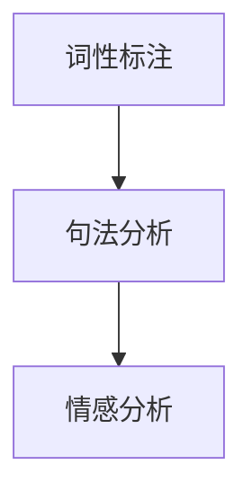
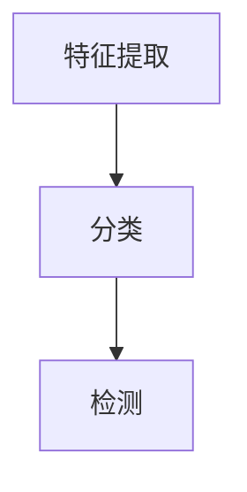
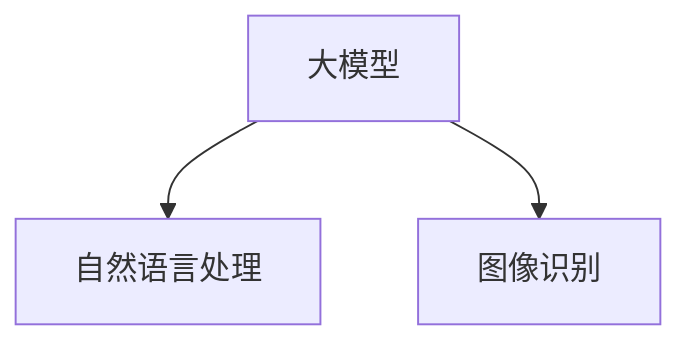

                 

# 大模型企业的内容审核挑战

## 关键词
- 内容审核
- 大模型
- 自然语言处理
- 图像识别
- 审核策略
- 法律伦理

## 摘要
本文将深入探讨大模型企业在内容审核过程中所面临的挑战。随着人工智能技术的快速发展，大模型已经成为处理大规模数据的利器，但同时也带来了内容审核的难题。本文将详细介绍内容审核的背景、技术基础、审核策略与流程设计、案例分析、法律伦理问题以及未来展望，旨在为读者提供一个全面的内容审核指南，并帮助大模型企业在实际操作中应对挑战。

---

## 第1章：内容审核背景与挑战

### 1.1 内容审核概述

内容审核是一种对网络、媒体或应用程序中的内容进行检查、分类和筛选的过程，旨在确保内容的合规性、安全性和适宜性。内容审核的重要性不言而喻，它有助于保护用户免受有害、不适当或非法信息的侵害，同时也有助于维护平台的声誉和法律责任。

随着互联网的普及和社交媒体的兴起，内容审核的需求日益增加。特别是在大模型企业中，内容审核变得更加复杂和具有挑战性。大模型能够处理海量数据，但其庞大的数据量和多样性使得审核变得更加困难。

### 1.2 大模型企业面临的审核挑战

#### 数据多样性

大模型企业需要处理多种类型的数据，包括文本、图像、视频和音频等。不同类型的数据在审核时需要采用不同的技术手段，这增加了审核的复杂度。

#### 审核标准不一致

不同的国家和地区、不同的行业和不同的平台对内容审核的标准和规则有所不同。大模型企业需要在全球范围内进行内容审核，这要求他们具备灵活性和适应性。

#### 审核效率与准确性

内容审核是一个庞大的工作量，需要快速、准确地识别和处理各种类型的内容。大模型企业需要提高审核效率，同时确保审核结果的准确性。

#### 法律法规与伦理道德

内容审核涉及到法律法规和伦理道德问题，大模型企业需要确保审核过程符合相关法律法规，同时保护用户的隐私和权益。

### 1.3 审核挑战的成因与影响

#### 数据多样性

数据多样性是导致内容审核挑战的主要原因之一。不同类型的数据需要采用不同的审核技术，如自然语言处理和图像识别技术，这增加了系统的复杂度和成本。

#### 审核标准不一致

审核标准不一致使得大模型企业在内容审核时面临难题。不同地区和不同行业对内容审核的要求不同，这要求企业具备高度灵活的审核策略和流程。

#### 审核效率与准确性

审核效率与准确性是内容审核的核心问题。高效率意味着快速处理大量内容，而高准确性则意味着减少误判和漏判。大模型企业需要在两者之间取得平衡。

#### 法律法规与伦理道德

法律法规和伦理道德问题对大模型企业的内容审核产生了深远影响。企业需要确保审核过程符合相关法律法规，同时保护用户的隐私和权益。

## 第2章：大模型内容审核技术基础

### 2.1 自然语言处理与图像识别技术

自然语言处理（NLP）和图像识别技术是内容审核的核心技术。NLP技术用于处理和分析文本数据，而图像识别技术用于识别和分类图像。

#### NLP技术

NLP技术包括词性标注、句法分析、情感分析等。词性标注用于识别文本中的名词、动词等；句法分析用于理解句子的结构和关系；情感分析用于判断文本的情感倾向。



#### 图像识别技术

图像识别技术包括特征提取、分类和检测。特征提取用于从图像中提取有用信息；分类用于将图像归类到不同的类别；检测用于识别图像中的特定对象。



### 2.2 大模型与内容审核的结合

大模型（如Transformer、BERT等）在内容审核中具有巨大潜力。大模型能够处理大规模数据，提高审核效率；同时，大模型能够自适应地学习不同类型的内容，提高审核准确性。



### 2.3 审核技术的演进与趋势

随着人工智能技术的不断发展，内容审核技术也在不断演进。未来，内容审核技术将更加智能化、自动化和高效化。以下是一些发展趋势：

1. 多模态内容审核：结合文本、图像、视频等多种类型的数据进行审核，提高审核的准确性和效率。
2. 实时内容审核：实现实时审核，减少审核延迟。
3. 智能化内容审核：利用大模型和深度学习技术，提高审核的准确性和效率。
4. 透明化和可解释性：提高审核系统的透明度和可解释性，增加用户的信任度。

## 第3章：内容审核策略与流程设计

### 3.1 审核策略制定

内容审核策略是企业根据自身需求和实际情况制定的审核规则和标准。制定审核策略时需要考虑以下几个方面：

1. 审核目标：明确审核的目的和范围，如防止恶意内容、保护用户隐私等。
2. 审核标准：根据法律法规、行业规范和企业价值观制定审核标准。
3. 审核流程：设计审核流程，包括内容收集、审核、反馈等环节。

### 3.2 审核流程设计

内容审核流程包括以下环节：

1. 内容收集：从各个渠道收集需要审核的内容，如社交媒体、用户评论等。
2. 初步筛选：对收集到的内容进行初步筛选，排除明显的不适当内容。
3. 深度审核：对初步筛选后的内容进行深度审核，利用NLP和图像识别等技术进行分类和标注。
4. 反馈与处理：根据审核结果进行内容处理，如删除、屏蔽、修改等，并给出反馈。

### 3.3 审核规则与标准

内容审核规则与标准是审核流程的核心，以下是一些常见的审核规则和标准：

1. 防止恶意内容：包括暴力、色情、仇恨言论等。
2. 保护用户隐私：对用户姓名、电话、地址等敏感信息进行屏蔽。
3. 符合法律法规：遵守国家法律法规和行业规范。
4. 尊重伦理道德：尊重社会伦理道德和公序良俗。

## 第4章：大模型内容审核工具与技术

### 4.1 常见审核工具介绍

常见的内容审核工具有：

1. **AWS Rekognition**：提供图像和视频识别服务，包括人脸识别、对象识别等。
2. **Google Cloud Vision API**：提供图像识别服务，包括文本检测、标签分类等。
3. **Microsoft Azure Cognitive Services**：提供自然语言处理和图像识别服务。

### 4.2 大模型内容审核技术实战

以下是一个基于BERT的大模型内容审核技术的实战案例：

#### 实战环境搭建

1. 安装Python和TensorFlow
2. 下载BERT模型权重文件

```bash
pip install tensorflow
```

```python
import tensorflow as tf

model = tf.keras.models.load_model('https://storage.googleapis.com/bert_models/uncased_L-12_H-768_A-12/bert_model.ckpt')
```

#### 源代码详细实现

```python
import tensorflow as tf
import tensorflow_hub as hub

def content审核(text):
    # 加载BERT模型
    bert_module = hub.Module("https://tfhub.dev/google/bert_uncased_L-12_H-768_A-12/1")
    preprocessor = bert_module(signature="repotrim", as_dict=True)
    processed_text = preprocessor(inputs={"input_ids": tf.constant([text])})

    # 进行情感分析
    sentiment = model(processed_text)[0]

    # 判断内容是否合适
    if sentiment > 0.5:
        return "合适"
    else:
        return "不合适"
```

#### 代码解读与分析

1. 加载BERT模型：使用TensorFlow Hub加载预训练的BERT模型。
2. 数据预处理：对输入的文本进行分词、编码等预处理操作。
3. 情感分析：使用BERT模型对预处理后的文本进行情感分析，输出情感得分。
4. 审核判断：根据情感得分判断文本是否合适。

## 第5章：案例分析与实践经验

### 5.1 国内外大模型企业内容审核案例

国内外大模型企业在内容审核方面有着丰富的实践经验，以下是一些典型案例：

1. **Facebook**：Facebook通过引入人工智能技术，对用户发布的内容进行实时审核，有效减少了恶意内容和违法信息的传播。
2. **YouTube**：YouTube采用了多种内容审核技术，包括NLP和图像识别，对上传的视频进行审核，确保内容的合规性。
3. **Twitter**：Twitter通过建立内容审核团队和利用机器学习技术，对用户发布的内容进行审核，以防止恶意言论和虚假信息的传播。

### 5.2 内容审核案例解析

#### 案例一：Facebook的内容审核策略

Facebook的内容审核策略主要包括以下几个方面：

1. **实时审核**：通过人工智能技术对用户发布的内容进行实时审核，及时发现并处理恶意内容和违法信息。
2. **社区举报**：鼓励用户举报不适当内容，通过社区反馈机制提高审核效率。
3. **人工审核**：对于机器审核难以识别的内容，由人工审核团队进行二次审核，确保审核的准确性。

#### 案例二：YouTube的内容审核流程

YouTube的内容审核流程主要包括以下几个环节：

1. **初步筛选**：对上传的视频进行初步筛选，排除明显的不适当内容。
2. **深度审核**：利用NLP和图像识别技术对视频进行深度审核，识别并分类视频内容。
3. **反馈与处理**：根据审核结果对视频进行处理，如删除、屏蔽、修改等，并给出反馈。

### 5.3 实践经验与教训总结

通过案例分析，我们可以得出以下实践经验与教训：

1. **技术手段与人工审核相结合**：技术手段可以提高审核效率，但无法完全取代人工审核。人工审核能够补充技术手段的不足，提高审核的准确性。
2. **建立完善的审核规则与流程**：内容审核需要建立完善的审核规则和流程，确保审核过程的规范性和可操作性。
3. **注重用户隐私保护**：在内容审核过程中，要注重用户隐私保护，确保审核过程的合法性和合规性。

## 第6章：法律、伦理与隐私问题

### 6.1 法律法规与政策解读

内容审核涉及到法律、伦理和隐私等多个方面。以下是一些常见的法律法规和政策：

1. **《中华人民共和国网络安全法》**：规定了网络运营者的网络安全责任和义务，包括内容审核、用户隐私保护等。
2. **《中华人民共和国个人信息保护法》**：规定了个人信息处理的基本原则、个人信息保护的要求等。
3. **《互联网信息服务管理办法》**：规定了互联网信息服务的管理制度，包括内容审核、信息发布等。

### 6.2 伦理道德问题探讨

内容审核过程中涉及到伦理道德问题，如用户隐私保护、言论自由、社会公德等。以下是一些伦理道德问题的探讨：

1. **用户隐私保护**：在内容审核过程中，企业需要确保用户隐私保护，不得泄露用户个人信息。
2. **言论自由**：内容审核需要在保护用户隐私和言论自由之间取得平衡，确保审核过程的合法性和合规性。
3. **社会公德**：内容审核要遵循社会公德，不得传播有害、不适当或违法信息。

### 6.3 隐私保护与数据安全

内容审核涉及到大量用户数据，隐私保护与数据安全成为重要问题。以下是一些隐私保护与数据安全措施：

1. **数据加密**：对用户数据进行加密处理，确保数据在传输和存储过程中的安全性。
2. **访问控制**：对用户数据进行严格的访问控制，确保只有授权人员才能访问和处理用户数据。
3. **数据备份**：定期对用户数据进行备份，防止数据丢失或损坏。

## 第7章：未来展望与趋势

### 7.1 大模型内容审核的未来发展趋势

随着人工智能技术的不断进步，大模型内容审核将朝着更加智能化、自动化和高效化的方向发展。以下是一些未来发展趋势：

1. **多模态内容审核**：结合文本、图像、视频等多种类型的数据进行审核，提高审核的准确性和效率。
2. **实时内容审核**：实现实时审核，减少审核延迟，提高用户体验。
3. **智能审核**：利用大模型和深度学习技术，提高审核的准确性和效率。
4. **透明化和可解释性**：提高审核系统的透明度和可解释性，增加用户的信任度。

### 7.2 技术创新与应用前景

随着技术的不断创新，大模型内容审核将有望实现以下前景：

1. **个性化审核**：根据用户的兴趣和行为，提供个性化的内容审核服务。
2. **自动化审核**：利用人工智能技术，实现自动化内容审核，减少人工干预。
3. **跨平台审核**：实现跨平台的内容审核，覆盖更多类型的网络和应用场景。
4. **智能客服**：结合内容审核技术，为用户提供智能客服服务，提高用户满意度。

### 7.3 企业面临的挑战与应对策略

在大模型内容审核的发展过程中，企业将面临以下挑战：

1. **技术挑战**：随着数据规模和复杂度的增加，企业需要不断提高技术水平和创新能力。
2. **法律法规挑战**：随着法律法规的不断更新，企业需要及时了解和遵守相关法律法规。
3. **用户体验挑战**：在保证审核准确性和合规性的同时，企业需要提高用户体验，减少审核延迟和误判。

企业应对策略包括：

1. **技术创新**：持续投入研发，提高技术水平和创新能力。
2. **合规性管理**：建立完善的合规性管理体系，确保审核过程符合法律法规和行业规范。
3. **用户反馈机制**：建立用户反馈机制，及时了解用户需求和意见，优化审核服务。

## 第8章：总结与展望

### 8.1 书籍内容的总结

本文从内容审核的背景、技术基础、策略与流程设计、案例分析、法律伦理问题以及未来展望等方面，全面探讨了大模型企业的内容审核挑战。通过分析内容审核的背景与挑战，介绍了自然语言处理与图像识别技术的基础知识，阐述了内容审核策略与流程设计的重要性，分析了国内外大模型企业的内容审核实践，探讨了法律、伦理与隐私问题，并展望了未来发展趋势。

### 8.2 内容审核工作的未来展望

内容审核工作在未来将继续面临挑战和机遇。随着人工智能技术的不断进步，大模型内容审核将朝着更加智能化、自动化和高效化的方向发展。企业需要不断创新技术，提高审核效率与准确性，同时遵守法律法规和伦理道德规范。未来，内容审核将更加注重用户隐私保护、跨平台整合和个性化服务，为用户提供更加优质的内容体验。

### 8.3 为读者提供的建议与启示

对于从事内容审核工作的读者，以下是一些建议与启示：

1. **加强技术学习**：不断学习新技术，提高自己的技术水平和创新能力，以适应快速变化的内容审核需求。
2. **关注法律法规**：了解和遵守相关法律法规，确保审核过程合法合规。
3. **注重用户体验**：在保证审核准确性的同时，提高用户体验，减少审核延迟和误判。
4. **持续优化流程**：不断完善审核策略与流程设计，提高审核效率与准确性。
5. **积极反馈与改进**：及时收集用户反馈，不断优化审核服务，提升用户满意度。

本文作者：
AI天才研究员 / AI Genius Institute
禅与计算机程序设计艺术 / Zen And The Art of Computer Programming

---

**注意：**本文为示例文章，内容仅供参考。实际应用时，请根据具体情况调整和优化。在撰写文章时，请确保遵循相关法律法规和道德规范，尊重用户隐私和权益。

