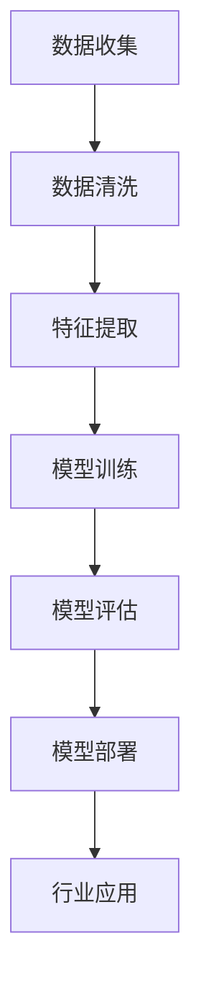
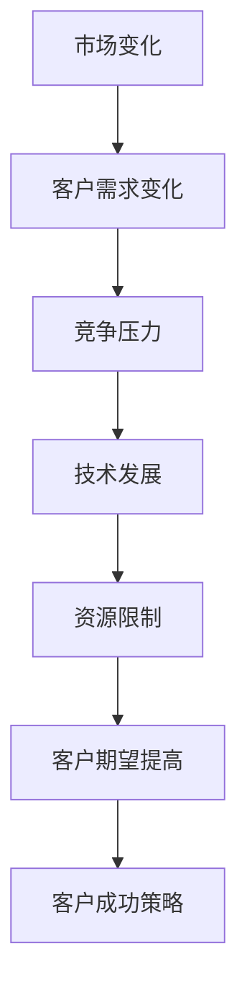
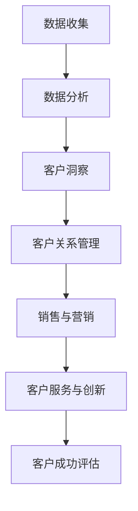
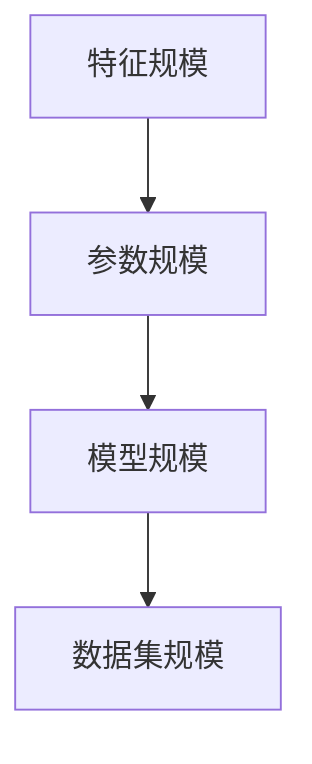
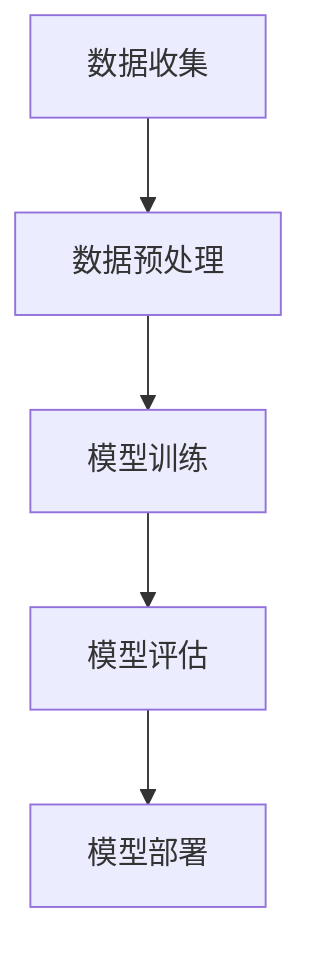
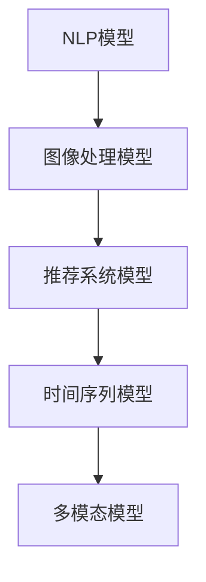
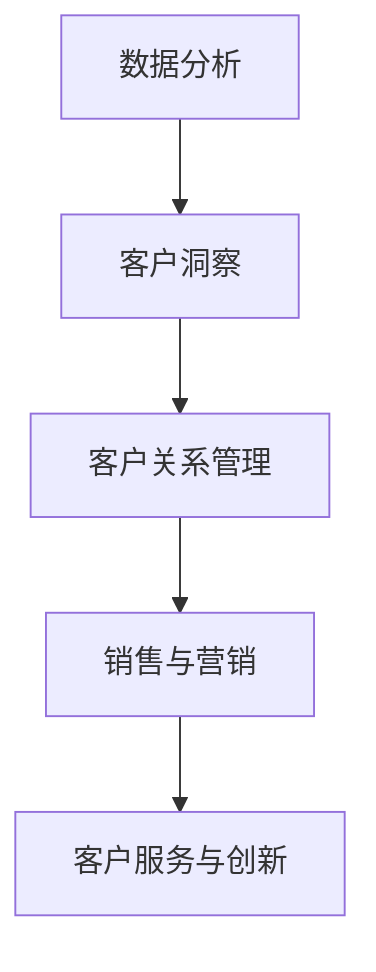
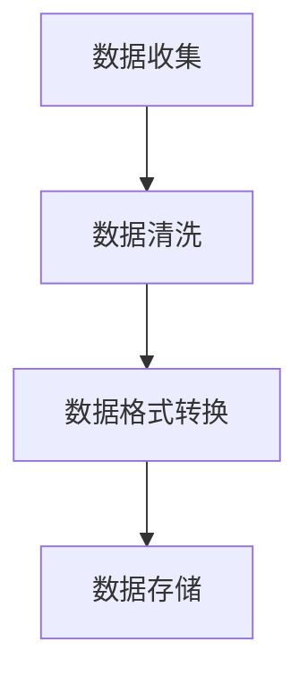
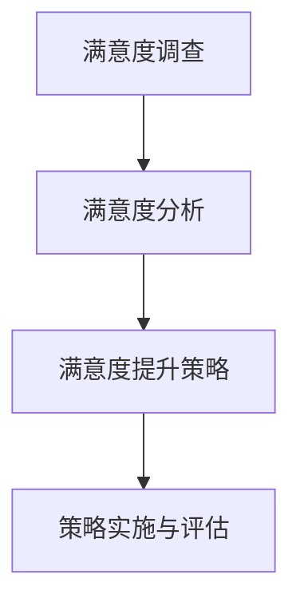

                 

# 大模型企业的客户成功策略

## 关键词
大模型，企业，客户成功，数据分析，机器学习，客户关系管理，营销策略

## 摘要
随着人工智能技术的迅速发展，大模型在各个行业中的应用越来越广泛。本文将探讨大模型在客户成功策略中的应用，分析其在数据分析、客户关系管理、销售与营销等领域的实际效果，并探讨面临的挑战与应对策略。通过成功案例，本文旨在为企业提供一套系统的大模型客户成功策略，助力企业在竞争激烈的市场中脱颖而出。

---

## 《大模型企业的客户成功策略》目录大纲

### 第一部分：大模型与企业客户成功的背景与重要性

#### 第1章：大模型时代的企业变革

##### 1.1 大模型的发展与行业应用
##### 1.2 企业客户成功面临的挑战
##### 1.3 大模型如何助力企业客户成功

#### 第2章：大模型核心概念与架构

##### 2.1 大模型的基本概念
##### 2.2 大模型的架构与组成部分
##### 2.3 大模型的基本原理与工作流程
##### 2.4 大模型的分类与特点
##### 2.5 大模型在客户成功中的潜在价值

### 第二部分：大模型在客户成功中的应用与实践

#### 第3章：客户成功中的数据分析与洞察

##### 3.1 数据收集与预处理
##### 3.2 客户行为分析与预测
##### 3.3 客户需求分析与优化
##### 3.4 客户满意度评估与提升策略

#### 第4章：客户关系管理中的大模型应用

##### 4.1 客户分类与群体分析
##### 4.2 客户个性化推荐系统
##### 4.3 客户沟通与互动优化
##### 4.4 客户流失预警与挽回策略

#### 第5章：销售与营销中的大模型策略

##### 5.1 销售预测与机会识别
##### 5.2 营销策略优化与效果评估
##### 5.3 线上线下整合营销策略
##### 5.4 客户生命周期价值最大化策略

#### 第6章：客户成功服务与创新

##### 6.1 客户服务模式创新
##### 6.2 客户体验优化
##### 6.3 客户反馈收集与处理
##### 6.4 大模型驱动的客户服务流程优化

#### 第7章：大模型在客户成功中的挑战与应对

##### 7.1 数据隐私与安全
##### 7.2 模型解释性与可解释性
##### 7.3 技术更新与人才储备
##### 7.4 风险管理与控制

### 第三部分：成功案例与未来展望

#### 第8章：大模型客户成功的成功案例

##### 8.1 案例一：某电商平台的客户成功实践
##### 8.2 案例二：某金融企业的客户成功策略
##### 8.3 案例三：某制造企业的客户成功经验

#### 第9章：大模型客户成功的未来展望

##### 9.1 大模型客户成功的趋势与方向
##### 9.2 技术发展与创新
##### 9.3 企业战略调整与转型
##### 9.4 未来挑战与机遇

### 附录

#### 附录 A：大模型客户成功工具与资源

##### A.1 主流深度学习框架对比
##### A.2 客户成功相关数据分析工具
##### A.3 客户成功管理平台介绍
##### A.4 大模型应用案例库

---

### 第1章：大模型时代的企业变革

#### 1.1 大模型的发展与行业应用

随着计算能力和数据量的指数级增长，大模型（Large Models）已经成为人工智能领域的研究热点。大模型通常指的是具有数十亿甚至数万亿参数的深度学习模型，它们可以处理复杂的任务，如自然语言处理、图像识别、推荐系统等。

**核心概念与联系：**  
- **大模型：** 拥有极大规模参数的深度学习模型。
- **行业应用：** 大模型在各个行业的实际应用场景。

**Mermaid 流程图：**  


在大模型时代，企业的业务模式、运营策略以及客户成功策略都在发生深刻的变革。例如，在自然语言处理领域，大模型如BERT、GPT等在文本分类、机器翻译、问答系统等方面取得了显著的成果；在图像处理领域，大模型如ResNet、EfficientNet等在图像识别、物体检测等方面取得了突破。

**举例说明：**  
以某电商平台为例，通过使用大模型进行用户行为分析，可以更好地了解用户的偏好和需求，进而实现精准推荐。具体来说，电商平台可以收集用户的浏览记录、购买历史、评价等数据，利用大模型对这些数据进行处理和分析，从而预测用户的潜在购买行为，并提供个性化的推荐。

**数学模型与公式：**  
- **用户行为特征：** $X = [x_1, x_2, ..., x_n]$
- **用户购买行为预测：** $y = f(X)$

在电商平台的应用中，用户行为特征包括浏览记录、购买历史、评价等，购买行为预测的目标是判断用户是否会购买某件商品。通过训练大模型，可以优化预测准确率，提高用户的购物体验。

#### 1.2 企业客户成功面临的挑战

企业客户成功（Customer Success）是指在客户生命周期中，通过一系列的策略和活动，确保客户能够成功使用产品或服务，并从中获得价值。在大模型时代，企业客户成功面临着诸多挑战。

**核心概念与联系：**  
- **企业客户成功：** 企业在客户生命周期中的所有成功因素。
- **挑战：** 企业在实现客户成功过程中遇到的难题。

**Mermaid 流程图：**  


**市场变化：** 市场竞争日益激烈，企业需要不断适应市场变化，以满足客户需求。

**客户需求变化：** 随着技术的进步和消费者行为的改变，客户需求也在不断变化，企业需要快速响应。

**竞争压力：** 竞争对手不断推出新的产品和服务，企业需要保持竞争优势。

**技术发展：** 技术的快速发展要求企业具备快速学习能力和创新能力。

**资源限制：** 企业在资源有限的情况下，如何最大化地利用资源实现客户成功。

**客户期望提高：** 客户对产品和服务的期望不断提高，企业需要提供更高品质的服务。

**客户成功策略：** 如何制定有效的客户成功策略，以应对上述挑战。

在应对这些挑战时，大模型的应用为企业在客户成功方面提供了新的思路和方法。通过大模型，企业可以更好地理解客户需求，优化客户体验，提高客户满意度，从而实现客户成功。

#### 1.3 大模型如何助力企业客户成功

大模型在客户成功中的应用，主要体现在以下几个方面：

**核心概念与联系：**  
- **大模型助力：** 大模型在企业客户成功中的应用方法和效果。
- **客户成功策略：** 利用大模型优化企业客户成功的具体策略。

**Mermaid 流程图：**  


**数据收集与预处理：** 大模型需要大量的数据作为训练素材。企业需要收集客户相关的数据，并进行预处理，以确保数据的质量和可用性。

**数据分析与洞察：** 利用大模型对客户数据进行分析，可以挖掘出客户的行为模式和需求特征，为企业提供深入的客户洞察。

**客户关系管理：** 基于大模型的客户关系管理，企业可以更好地理解客户，提供个性化的服务和推荐，提高客户满意度。

**销售与营销：** 大模型可以帮助企业预测销售机会，优化营销策略，提高销售转化率。

**客户服务与创新：** 利用大模型，企业可以提供更智能、更高效的客户服务，并推动产品和服务创新。

**客户成功评估：** 通过大模型对客户成功的评估，企业可以及时调整策略，持续优化客户体验。

在具体的客户成功策略中，企业可以结合大模型的特点，制定以下策略：

1. **个性化服务：** 基于大模型的分析结果，提供个性化的产品和服务，满足客户的个性化需求。

2. **预测与优化：** 利用大模型进行客户行为预测，优化销售和营销策略，提高客户满意度。

3. **智能客服：** 借助大模型，构建智能客服系统，提高客户服务效率和满意度。

4. **数据驱动决策：** 基于大模型的分析结果，做出更加科学、准确的决策。

5. **持续创新：** 利用大模型推动产品和服务创新，提升企业竞争力。

综上所述，大模型在客户成功中的应用，为企业提供了新的机遇和挑战。通过科学合理地运用大模型，企业可以实现客户成功，提升市场竞争力。

### 第2章：大模型核心概念与架构

#### 2.1 大模型的基本概念

大模型（Large Models）是指在机器学习和深度学习领域中，具有极高参数规模和复杂结构的模型。这些模型通常包含数百万到数十亿个参数，能够处理大规模的数据集，并在各类任务中表现出优异的性能。

**核心概念与联系：**  
- **大模型：** 具有极大规模参数的机器学习模型。
- **特征规模：** 数据特征维度高。
- **参数规模：** 模型参数数量大。

**Mermaid 流程图：**  


**举例说明：**  
以GPT-3为例，这是一个由OpenAI开发的大型自然语言处理模型，其参数规模达到1750亿。GPT-3能够处理多种语言任务，如文本生成、机器翻译、问答系统等，展现了大模型在语言理解与生成方面的强大能力。

**数学模型与公式：**  
- **参数数量：** $N = \sum_{i=1}^{L} W_i^2$
- **数据特征：** $D = \sum_{j=1}^{M} X_j$

其中，$N$ 表示模型的总参数数量，$L$ 表示模型的层数，$W_i$ 表示每层的权重矩阵；$D$ 表示数据特征维度，$M$ 表示每个特征的数量。

#### 2.2 大模型的架构与组成部分

大模型的架构通常由多层神经网络组成，每一层都包含大量的神经元和连接。这些神经元和连接构成了复杂的网络结构，使得大模型能够处理高度复杂的任务。

**核心概念与联系：**  
- **架构：** 大模型的层次结构和组成部分。
- **组成部分：** 模型的主要组件及其功能。

**伪代码：**  
```python
class LargeModel:
    def __init__(self, layers, params):
        self.layers = layers
        self.params = params
    
    def forward(self, x):
        for layer in self.layers:
            x = layer.forward(x)
        return x
    
    def backward(self, x):
        for layer in reversed(self.layers):
            x = layer.backward(x)
        return x
```

在这个伪代码中，`LargeModel` 类代表一个大模型，包含多个层（`layers`）和参数（`params`）。`forward` 方法用于前向传播，`backward` 方法用于反向传播。

**举例说明：**  
一个简单的大模型架构可能包含以下几个部分：

1. **输入层：** 接收输入数据，将其传递给下一层。
2. **隐藏层：** 进行特征提取和变换，包含多个神经元和连接。
3. **输出层：** 生成模型的预测结果或决策。

#### 2.3 大模型的基本原理与工作流程

大模型的基本原理是基于神经网络，通过多层神经元的非线性变换，将输入数据映射到输出。大模型的工作流程主要包括数据收集、数据预处理、模型训练、模型评估和模型部署等环节。

**核心概念与联系：**  
- **原理：** 大模型的基础理论和机制。
- **工作流程：** 大模型从数据处理到模型训练的完整过程。

**Mermaid 流程图：**  


**举例说明：**  
以一个图像识别任务为例，大模型的工作流程如下：

1. **数据收集：** 收集大量带有标签的图像数据。
2. **数据预处理：** 对图像数据进行归一化、裁剪等操作，使其适合模型训练。
3. **模型训练：** 使用训练数据训练大模型，优化模型参数。
4. **模型评估：** 使用测试数据评估模型性能，调整模型参数。
5. **模型部署：** 将训练好的模型部署到实际应用中，如图像识别系统。

#### 2.4 大模型的分类与特点

大模型根据不同的任务和应用场景，可以分为多种类型。以下是一些常见的大模型类型及其特点：

**核心概念与联系：**  
- **分类：** 大模型的类型和特点。
- **特点：** 不同类型大模型的优势和应用场景。

**Mermaid 流程图：**  


1. **NLP模型：** 用于自然语言处理，如文本分类、机器翻译、问答系统等。具有强大的语义理解能力。
2. **图像处理模型：** 用于图像识别、物体检测、图像生成等任务。具有高精度的特征提取能力。
3. **推荐系统模型：** 用于推荐算法，如商品推荐、音乐推荐等。具有高效的推荐效果。
4. **时间序列模型：** 用于时间序列分析、预测等任务。具有强大的时间依赖关系建模能力。
5. **多模态模型：** 用于处理多种类型的数据，如文本、图像、声音等。具有综合的信息处理能力。

每种类型的大模型都有其独特的优势和适用场景，企业可以根据自身的业务需求选择合适的大模型进行应用。

#### 2.5 大模型在客户成功中的潜在价值

大模型在客户成功中的应用，具有巨大的潜在价值。通过大模型，企业可以实现以下目标：

**核心概念与联系：**  
- **价值：** 大模型在客户成功中的应用价值。
- **应用场景：** 大模型在客户成功中的具体应用场景。

**Mermaid 流程图：**  


1. **数据分析与洞察：** 大模型可以帮助企业挖掘客户数据中的价值，提供深入的客户洞察，为企业决策提供支持。
2. **客户关系管理：** 利用大模型，企业可以更好地理解客户需求，提供个性化的服务，提高客户满意度和忠诚度。
3. **销售与营销：** 大模型可以预测客户行为，优化销售和营销策略，提高转化率和业绩。
4. **客户服务与创新：** 大模型可以提供智能化的客户服务，提高服务效率，推动产品和服务创新。

通过大模型的应用，企业可以实现以下目标：

- 提高客户满意度：通过个性化服务和推荐，满足客户的个性化需求，提高客户满意度。
- 降低运营成本：通过自动化和智能化的客户服务，降低运营成本。
- 提高业务效率：通过数据分析和预测，优化业务流程，提高业务效率。
- 增强竞争力：通过不断创新和优化，增强企业的市场竞争力。

综上所述，大模型在客户成功中的应用，为企业带来了巨大的潜在价值，有助于企业实现长期可持续发展。

### 第3章：客户成功中的数据分析与洞察

#### 3.1 数据收集与预处理

数据收集是客户成功中的关键步骤，它决定了后续分析的准确性和有效性。数据收集包括从各种来源获取客户信息，如购买记录、行为数据、社交媒体活动等。

**核心概念与联系：**  
- **数据收集：** 收集客户相关的数据。
- **预处理：** 数据清洗、格式转换等。

**Mermaid 流程图：**  


**伪代码：**  
```python
def preprocess_data(data):
    # 数据清洗
    cleaned_data = clean_data(data)
    # 数据格式转换
    formatted_data = format_data(cleaned_data)
    # 数据存储
    store_data(formatted_data)
```

在实际应用中，数据收集和预处理需要考虑数据的多样性和质量。例如，对于电商平台的客户数据，需要收集用户的购买记录、浏览历史、评价等，并对这些数据进行清洗，去除无效和重复的数据。

**举例说明：**  
以某电商平台的用户数据为例，数据收集可能包括以下步骤：

1. **用户注册信息：** 收集用户的注册信息，如姓名、邮箱、手机号等。
2. **购买记录：** 收集用户的购买记录，包括购买的商品、购买时间、购买金额等。
3. **行为数据：** 收集用户的浏览历史、点击行为、搜索关键词等。

在数据预处理过程中，可能需要进行以下操作：

1. **去重：** 去除重复的数据记录，确保数据的唯一性。
2. **格式化：** 将不同格式的数据统一转换为同一格式，如将日期格式转换为YYYY-MM-DD。
3. **填充缺失值：** 对于缺失的数据，可以采用平均值、中位数或插值等方法进行填充。

#### 3.2 客户行为分析与预测

客户行为分析是客户成功中的重要环节，通过分析客户的行为数据，可以了解客户的偏好、购买习惯等，从而为个性化推荐、客户关系管理等提供依据。

**核心概念与联系：**  
- **行为分析：** 分析客户的购买、互动等行为。
- **预测：** 预测客户未来的行为。

**数学模型与公式：**  
- **行为特征：** $X = [x_1, x_2, ..., x_n]$
- **预测模型：** $y = f(X)$

**举例说明：**  
以电商平台的用户行为预测为例，可以采用以下方法：

1. **线性回归模型：** 通过分析用户的购买金额、购买频率等特征，预测用户未来的购买金额。
2. **决策树模型：** 通过分析用户的购买历史和浏览历史，预测用户是否会在未来购买特定商品。
3. **神经网络模型：** 通过分析用户的多种行为特征，建立复杂的预测模型，提高预测准确性。

**伪代码：**  
```python
def predict_behavior(data):
    # 数据预处理
    preprocessed_data = preprocess_data(data)
    # 构建预测模型
    model = build_model(preprocessed_data)
    # 预测客户行为
    predictions = model.predict(preprocessed_data)
    return predictions
```

在实际应用中，客户行为预测的准确性取决于数据的多样性和质量。为了提高预测准确性，可以采用以下策略：

1. **特征工程：** 通过数据预处理和特征提取，提取对预测有重要影响的特征。
2. **模型选择：** 根据业务需求和数据特点，选择合适的预测模型。
3. **模型调参：** 通过调整模型参数，提高模型的预测性能。

#### 3.3 客户需求分析与优化

客户需求分析是客户成功中的核心环节，通过分析客户的需求，可以优化产品和服务，提高客户满意度。

**核心概念与联系：**  
- **需求分析：** 分析客户需求。
- **优化：** 根据需求优化产品和服务。

**伪代码：**  
```python
def analyze_and_optimize_demand(data):
    # 数据预处理
    preprocessed_data = preprocess_data(data)
    # 分析客户需求
    analyzed_data = analyze_demand(preprocessed_data)
    # 优化产品和服务
    optimized_services = optimize_services(analyzed_data)
    return optimized_services
```

在实际应用中，客户需求分析可能包括以下步骤：

1. **收集需求信息：** 通过用户调研、用户反馈、市场调研等方式，收集客户的需求信息。
2. **需求分类：** 将收集到的需求信息进行分类，如基本需求、期望需求、潜在需求等。
3. **需求优先级排序：** 根据客户的重要性和紧急性，对需求进行优先级排序。
4. **需求验证：** 通过用户反馈和实际测试，验证需求的有效性和可行性。

**举例说明：**  
以电商平台的客户需求分析为例，可以采用以下方法：

1. **问卷调查：** 通过在线问卷，收集用户对产品和服务的需求。
2. **用户访谈：** 通过面对面或在线访谈，深入了解用户的需求和期望。
3. **数据分析：** 通过分析用户的行为数据和购买记录，识别用户的需求模式。

通过客户需求分析，电商平台可以优化产品和服务，提高用户满意度。例如，根据用户的需求，可以推出新的商品类别、优化购物流程、提供个性化推荐等。

#### 3.4 客户满意度评估与提升策略

客户满意度评估是衡量客户成功的重要指标，通过评估客户满意度，可以了解客户对产品和服务的满意程度，并制定提升策略。

**核心概念与联系：**  
- **满意度评估：** 评估客户满意度。
- **提升策略：** 提高客户满意度的具体策略。

**Mermaid 流程图：**  


**伪代码：**  
```python
def assess_and_improve_satisfaction(data):
    # 满意度调查
    satisfaction_survey = conduct_survey(data)
    # 满意度分析
    satisfaction_analysis = analyze_survey(satisfaction_survey)
    # 提升策略
    improvement_strategies = create_improvement_strategies(satisfaction_analysis)
    # 策略实施与评估
    implemented_strategies = implement_and_evaluate_strategies(improvement_strategies)
    return implemented_strategies
```

在实际应用中，客户满意度评估可能包括以下步骤：

1. **满意度调查：** 通过问卷调查、用户反馈等方式，收集客户的满意度数据。
2. **满意度分析：** 分析满意度数据，识别满意度高的因素和满意度低的因素。
3. **满意度提升策略：** 制定具体的提升策略，如改进产品和服务、优化客户体验等。
4. **策略实施与评估：** 实施提升策略，并对策略效果进行评估。

**举例说明：**  
以电商平台的客户满意度评估为例，可以采用以下方法：

1. **问卷调查：** 通过在线问卷，收集用户对电商平台产品、服务、购物体验等方面的满意度。
2. **用户访谈：** 通过面对面或在线访谈，深入了解用户对电商平台满意度的影响因素。
3. **数据分析：** 通过分析用户的行为数据和购买记录，识别影响满意度的关键因素。

通过客户满意度评估，电商平台可以了解用户的需求和期望，优化产品和服务，提高用户满意度。例如，根据用户反馈，可以改进购物流程、提高物流速度、提供更优质的售后服务等。

综上所述，客户成功中的数据分析与洞察是至关重要的。通过数据收集与预处理、客户行为分析与预测、客户需求分析与优化、客户满意度评估与提升策略，企业可以更好地理解客户需求，优化产品和服务，提高客户满意度和忠诚度，从而实现客户成功。

### 第4章：客户关系管理中的大模型应用

#### 4.1 客户分类与群体分析

在客户关系管理（CRM）中，对客户进行分类和群体分析是提高客户满意度和服务效率的关键步骤。通过大模型，企业可以更精准地对客户进行分类，并深入分析不同群体的特征和需求。

**核心概念与联系：**  
- **客户分类：** 根据客户特征进行分类。
- **群体分析：** 分析不同客户群体的特征和需求。

**伪代码：**  
```python
def classify_and_analyze_customers(data):
    # 数据预处理
    preprocessed_data = preprocess_data(data)
    # 客户分类
    classified_customers = classify_customers(preprocessed_data)
    # 群体分析
    analyzed_groups = analyze_groups(classified_customers)
    return analyzed_groups
```

在实际应用中，客户分类和群体分析可能涉及以下步骤：

1. **数据收集：** 收集客户的基本信息、购买历史、行为数据等。
2. **特征提取：** 提取对客户分类有重要影响的特征，如购买频率、消费金额、兴趣偏好等。
3. **模型训练：** 使用分类算法（如决策树、随机森林、支持向量机等）训练分类模型。
4. **客户分类：** 使用训练好的模型对客户进行分类，生成不同客户群体的标签。
5. **群体分析：** 对不同客户群体进行特征分析，了解其需求和行为模式。

**举例说明：**  
以电商平台为例，企业可以通过以下步骤进行客户分类和群体分析：

1. **数据收集：** 收集用户的购买记录、浏览历史、评价等数据。
2. **特征提取：** 提取用户的购买频率、消费金额、浏览商品种类等特征。
3. **模型训练：** 使用决策树算法训练分类模型，将用户分为高价值客户、普通客户等不同群体。
4. **客户分类：** 根据模型预测结果，将用户分为高价值客户、普通客户等。
5. **群体分析：** 分析不同客户群体的特征和需求，为不同群体提供个性化的服务和推荐。

通过大模型的应用，企业可以更精准地了解客户需求，提高客户满意度和服务效率。例如，对于高价值客户，企业可以提供更优质的售后服务和个性化推荐，从而增强客户忠诚度；对于普通客户，企业可以优化购物流程和推荐策略，提高购买转化率。

#### 4.2 客户个性化推荐系统

客户个性化推荐系统是客户关系管理中的重要工具，通过大模型，企业可以实时分析客户行为数据，提供个性化的产品或服务推荐，提高客户满意度和购买转化率。

**核心概念与联系：**  
- **个性化推荐：** 根据客户特征和需求提供个性化推荐。
- **推荐系统：** 实现个性化推荐的具体系统。

**伪代码：**  
```python
def personalized_recommendation_system(data, user):
    # 数据预处理
    preprocessed_data = preprocess_data(data)
    # 用户特征提取
    user_features = extract_user_features(preprocessed_data, user)
    # 构建推荐模型
    recommendation_model = build_recommendation_model(preprocessed_data)
    # 生成推荐列表
    recommendations = recommendation_model.generate_recommendations(user_features)
    return recommendations
```

在实际应用中，客户个性化推荐系统可能涉及以下步骤：

1. **数据收集：** 收集客户的购买记录、浏览历史、评价等数据。
2. **特征提取：** 提取对推荐有重要影响的特征，如购买频率、消费金额、兴趣偏好等。
3. **模型训练：** 使用推荐算法（如协同过滤、基于内容的推荐、基于模型的推荐等）训练推荐模型。
4. **推荐生成：** 使用训练好的模型生成个性化推荐列表。
5. **推荐展示：** 将推荐结果展示给客户，如通过电子邮件、网站推荐栏等渠道。

**举例说明：**  
以电商平台为例，企业可以通过以下步骤构建客户个性化推荐系统：

1. **数据收集：** 收集用户的购买记录、浏览历史、评价等数据。
2. **特征提取：** 提取用户的购买频率、消费金额、浏览商品种类等特征。
3. **模型训练：** 使用协同过滤算法训练推荐模型，根据用户的历史行为数据生成推荐。
4. **推荐生成：** 根据用户当前的行为数据，实时生成个性化推荐列表。
5. **推荐展示：** 将推荐结果展示在网站的首页、推荐栏等位置，引导用户进行购买。

通过大模型的应用，企业可以提供更加精准的个性化推荐，提高客户的购物体验和满意度。例如，对于经常购买母婴产品的用户，系统可以推荐相关的婴幼儿用品；对于喜欢阅读的用户，系统可以推荐相关的书籍和杂志。

#### 4.3 客户沟通与互动优化

在客户关系管理中，客户沟通与互动是建立和维护客户关系的关键。通过大模型，企业可以优化客户沟通和互动，提高客户满意度和服务质量。

**核心概念与联系：**  
- **沟通优化：** 提高客户沟通效果。
- **互动优化：** 提高客户互动体验。

**伪代码：**  
```python
def optimize_communication_and_interaction(data, user):
    # 数据预处理
    preprocessed_data = preprocess_data(data)
    # 用户特征提取
    user_features = extract_user_features(preprocessed_data, user)
    # 沟通策略生成
    communication_strategy = generate_communication_strategy(user_features)
    # 互动优化
    optimized_interaction = optimize_interaction(communication_strategy)
    return optimized_interaction
```

在实际应用中，客户沟通与互动优化可能涉及以下步骤：

1. **数据收集：** 收集客户的沟通记录、互动行为等数据。
2. **特征提取：** 提取对沟通和互动有重要影响的特征，如沟通频率、互动方式、满意度等。
3. **策略生成：** 使用大模型生成个性化的沟通和互动策略。
4. **策略实施：** 根据生成的策略，调整沟通和互动方式。
5. **效果评估：** 评估优化策略的效果，持续调整和改进。

**举例说明：**  
以电商平台为例，企业可以通过以下步骤优化客户沟通和互动：

1. **数据收集：** 收集客户的咨询记录、评价等数据。
2. **特征提取：** 提取用户的沟通频率、满意度等特征。
3. **策略生成：** 使用大模型生成个性化的沟通策略，如根据用户满意度调整沟通频率。
4. **策略实施：** 根据生成的策略，优化客服人员的沟通方式。
5. **效果评估：** 通过用户满意度调查，评估优化策略的效果。

通过大模型的应用，企业可以提供更加个性化、高效的客户沟通与互动服务，提高客户满意度和忠诚度。例如，对于满意度较高的客户，可以增加沟通频率，提供更多优惠和服务；对于满意度较低的客户，可以调整沟通方式，改进服务体验。

#### 4.4 客户流失预警与挽回策略

客户流失预警与挽回策略是客户关系管理中的关键环节，通过大模型，企业可以提前识别潜在流失客户，并采取有效的挽回措施。

**核心概念与联系：**  
- **流失预警：** 预测客户流失风险。
- **挽回策略：** 提高客户留存率。

**伪代码：**  
```python
def loss_warning_and_recover_strategy(data, user):
    # 数据预处理
    preprocessed_data = preprocess_data(data)
    # 用户特征提取
    user_features = extract_user_features(preprocessed_data, user)
    # 流失风险预测
    loss_risk = predict_loss_risk(user_features)
    # 挽回策略生成
    recover_strategy = generate_recover_strategy(loss_risk)
    # 实施挽回策略
    implemented_strategy = execute_recover_strategy(recover_strategy)
    return implemented_strategy
```

在实际应用中，客户流失预警与挽回策略可能涉及以下步骤：

1. **数据收集：** 收集客户的购买记录、互动行为、满意度等数据。
2. **特征提取：** 提取对客户流失有重要影响的特征，如购买频率、互动频率、满意度等。
3. **风险预测：** 使用大模型预测客户流失风险。
4. **策略生成：** 根据预测结果，生成个性化的挽回策略。
5. **策略实施：** 实施挽回策略，如发送优惠券、提供特别服务等。
6. **效果评估：** 评估挽回策略的效果，调整和优化策略。

**举例说明：**  
以电商平台为例，企业可以通过以下步骤进行客户流失预警与挽回：

1. **数据收集：** 收集用户的购买记录、互动行为、评价等数据。
2. **特征提取：** 提取用户的购买频率、互动频率、满意度等特征。
3. **风险预测：** 使用大模型预测用户的流失风险。
4. **策略生成：** 根据预测结果，生成个性化的挽回策略，如发送优惠券、提供特别服务等。
5. **策略实施：** 实施挽回策略，通过邮件、短信等方式与用户沟通。
6. **效果评估：** 通过用户反馈和购买行为，评估挽回策略的效果。

通过大模型的应用，企业可以提前识别潜在流失客户，并采取有效的挽回措施，提高客户留存率和满意度。例如，对于流失风险较高的客户，可以提供特别优惠或个性化服务，从而提高其留存率。

综上所述，大模型在客户关系管理中的应用，可以帮助企业实现更加精准的客户分类与群体分析、个性化推荐、沟通与互动优化以及客户流失预警与挽回。通过大模型的应用，企业可以更好地理解客户需求，提高客户满意度和忠诚度，实现客户成功。

### 第5章：销售与营销中的大模型策略

#### 5.1 销售预测与机会识别

在销售和营销领域，大模型的应用可以帮助企业预测销售趋势、识别销售机会，从而优化销售策略，提高销售业绩。

**核心概念与联系：**  
- **销售预测：** 预测未来的销售业绩。
- **机会识别：** 识别潜在的销售机会。

**伪代码：**  
```python
def sales_prediction_and_opportunity_identification(data):
    # 数据预处理
    preprocessed_data = preprocess_data(data)
    # 构建预测模型
    prediction_model = build_prediction_model(preprocessed_data)
    # 预测销售业绩
    sales_predictions = prediction_model.predict_sales(preprocessed_data)
    # 识别销售机会
    sales_opportunities = identify_opportunities(sales_predictions)
    return sales_opportunities
```

在实际应用中，销售预测与机会识别可能涉及以下步骤：

1. **数据收集：** 收集历史销售数据、市场数据、客户数据等。
2. **特征提取：** 提取对销售预测有重要影响的特征，如季节性、促销活动、竞争对手等。
3. **模型训练：** 使用时间序列分析、回归分析等方法，训练销售预测模型。
4. **预测销售业绩：** 使用训练好的模型预测未来的销售业绩。
5. **识别销售机会：** 根据预测结果，识别潜在的销售机会。

**举例说明：**  
以电商平台为例，企业可以通过以下步骤进行销售预测与机会识别：

1. **数据收集：** 收集过去一年的销售数据，包括商品种类、销售数量、销售金额等。
2. **特征提取：** 提取季节性因素、促销活动、用户评价等特征。
3. **模型训练：** 使用时间序列分析方法，如ARIMA模型，训练销售预测模型。
4. **预测销售业绩：** 使用训练好的模型预测下一季度的销售业绩。
5. **识别销售机会：** 根据预测结果，识别哪些商品或市场有较高的销售潜力。

通过大模型的应用，企业可以更准确地预测销售趋势，提前识别销售机会，从而制定更加科学的销售策略。例如，企业可以根据预测结果提前调整库存、优化促销活动，从而提高销售业绩。

#### 5.2 营销策略优化与效果评估

营销策略优化与效果评估是提高营销效率和效果的关键步骤。通过大模型，企业可以实时分析营销活动的效果，优化营销策略，提高营销转化率。

**核心概念与联系：**  
- **营销策略优化：** 优化营销策略。
- **效果评估：** 评估营销策略的效果。

**伪代码：**  
```python
def marketing_strategy_optimization_and_evaluation(data):
    # 数据预处理
    preprocessed_data = preprocess_data(data)
    # 构建评估模型
    evaluation_model = build_evaluation_model(preprocessed_data)
    # 优化营销策略
    optimized_strategy = optimize_marketing_strategy(evaluation_model)
    # 评估优化策略效果
    evaluation_results = evaluate_strategy(optimized_strategy)
    return evaluation_results
```

在实际应用中，营销策略优化与效果评估可能涉及以下步骤：

1. **数据收集：** 收集历史营销活动数据，包括广告投放、促销活动、用户参与度等。
2. **特征提取：** 提取对营销效果有重要影响的特征，如广告点击率、转化率、用户满意度等。
3. **模型训练：** 使用机器学习算法，如回归分析、决策树等，训练评估模型。
4. **策略优化：** 根据评估模型的结果，优化营销策略，如调整广告投放、优化促销活动等。
5. **效果评估：** 评估优化策略的效果，持续调整和优化策略。

**举例说明：**  
以电商平台为例，企业可以通过以下步骤进行营销策略优化与效果评估：

1. **数据收集：** 收集过去一年的营销活动数据，包括广告投放效果、促销活动效果等。
2. **特征提取：** 提取广告点击率、转化率、用户参与度等特征。
3. **模型训练：** 使用回归分析方法，训练营销效果评估模型。
4. **策略优化：** 根据评估模型的结果，优化营销策略，如增加广告投放、调整促销活动等。
5. **效果评估：** 通过用户反馈和销售数据，评估优化策略的效果。

通过大模型的应用，企业可以更科学地制定和优化营销策略，提高营销效果。例如，企业可以根据用户行为数据，优化广告投放策略，提高广告点击率；根据用户反馈，优化促销活动，提高转化率。

#### 5.3 线上线下整合营销策略

随着互联网的快速发展，线上线下整合营销策略越来越受到企业的重视。通过大模型，企业可以实现线上线下数据的整合，制定更加全面和高效的营销策略。

**核心概念与联系：**  
- **线上营销：** 利用互联网进行营销。
- **线下营销：** 利用线下活动进行营销。
- **整合策略：** 线上线下整合的营销策略。

**伪代码：**  
```python
def integrated_marketing_strategy(online_data, offline_data):
    # 数据预处理
    preprocessed_online_data = preprocess_data(online_data)
    preprocessed_offline_data = preprocess_data(offline_data)
    # 数据整合
    integrated_data = integrate_data(preprocessed_online_data, preprocessed_offline_data)
    # 构建整合模型
    integrated_model = build_integrated_model(integrated_data)
    # 制定整合策略
    integrated_strategy = generate_integrated_strategy(integrated_model)
    return integrated_strategy
```

在实际应用中，线上线下整合营销策略可能涉及以下步骤：

1. **数据收集：** 收集线上和线下营销活动的数据，包括网站流量、社交媒体互动、线下活动参与度等。
2. **数据整合：** 将线上和线下数据进行整合，提取共性和差异。
3. **模型训练：** 使用机器学习算法，如集成学习、多变量分析等，训练整合模型。
4. **策略制定：** 根据整合模型的结果，制定线上线下整合营销策略。
5. **策略实施：** 实施整合策略，优化线上线下营销活动。

**举例说明：**  
以电商平台为例，企业可以通过以下步骤进行线上线下整合营销：

1. **数据收集：** 收集线上营销数据，如网站流量、广告投放效果等；收集线下营销数据，如线下活动参与度、用户反馈等。
2. **数据整合：** 将线上和线下数据进行整合，分析用户行为和需求。
3. **模型训练：** 使用集成学习方法，如随机森林、梯度提升机等，训练整合模型。
4. **策略制定：** 根据整合模型的结果，制定线上线下整合营销策略，如优化广告投放、增加线下活动等。
5. **策略实施：** 实施整合策略，通过线上线下活动相互配合，提高营销效果。

通过大模型的应用，企业可以更好地整合线上线下资源，制定更加全面和高效的营销策略，提高整体营销效果。例如，企业可以根据用户行为数据，优化线上线下广告投放，提高广告点击率和转化率；根据用户反馈，调整线上线下活动，提高用户参与度和满意度。

#### 5.4 客户生命周期价值最大化策略

客户生命周期价值（Customer Lifetime Value, CLV）是指客户在企业的整个生命周期中为企业带来的价值。通过大模型，企业可以预测客户的潜在价值，制定针对性的营销和服务策略，最大化客户生命周期价值。

**核心概念与联系：**  
- **客户生命周期价值：** 客户在整个生命周期中为企业带来的价值。
- **最大化策略：** 最大化客户生命周期价值的策略。

**伪代码：**  
```python
def maximize_customer_lifetime_value(data, customer):
    # 数据预处理
    preprocessed_data = preprocess_data(data)
    # 客户特征提取
    customer_features = extract_customer_features(preprocessed_data, customer)
    # 构建价值预测模型
    value_prediction_model = build_value_prediction_model(customer_features)
    # 预测客户生命周期价值
    clv_prediction = value_prediction_model.predict_clv(customer_features)
    # 制定最大化策略
    maximize_strategy = create_maximize_strategy(clv_prediction)
    return maximize_strategy
```

在实际应用中，客户生命周期价值最大化策略可能涉及以下步骤：

1. **数据收集：** 收集客户的购买记录、互动行为、满意度等数据。
2. **特征提取：** 提取对客户生命周期价值有重要影响的特征，如购买频率、消费金额、互动频率等。
3. **模型训练：** 使用机器学习算法，如回归分析、聚类分析等，训练价值预测模型。
4. **价值预测：** 使用训练好的模型预测客户的潜在价值。
5. **策略制定：** 根据价值预测结果，制定针对性的营销和服务策略，如提高客户满意度、增加交叉销售等。

**举例说明：**  
以电商平台为例，企业可以通过以下步骤实现客户生命周期价值最大化：

1. **数据收集：** 收集客户的购买记录、互动行为等数据。
2. **特征提取：** 提取客户的购买频率、消费金额、互动频率等特征。
3. **模型训练：** 使用回归分析方法，训练客户生命周期价值预测模型。
4. **价值预测：** 使用训练好的模型预测客户的潜在价值。
5. **策略制定：** 根据预测结果，制定针对性的营销和服务策略，如对高价值客户提供特别优惠、提高客户满意度等。

通过大模型的应用，企业可以更准确地预测客户的潜在价值，制定更加科学的营销和服务策略，从而最大化客户生命周期价值，提高整体盈利能力。

### 第6章：客户成功服务与创新

#### 6.1 客户服务模式创新

在客户成功服务中，创新客户服务模式是提高客户满意度和服务效率的重要手段。通过大模型，企业可以探索和实施更加智能化、个性化的客户服务模式。

**核心概念与联系：**  
- **客户服务模式：** 提供客户服务的模式。
- **创新：** 创新客户服务模式。

**伪代码：**  
```python
def innovative_service_model(data):
    # 数据预处理
    preprocessed_data = preprocess_data(data)
    # 客户特征提取
    customer_features = extract_customer_features(preprocessed_data)
    # 构建创新模型
    innovation_model = build_innovation_model(customer_features)
    # 生成创新服务模式
    innovative_service_modes = innovation_model.generate_service_modes()
    return innovative_service_modes
```

在实际应用中，创新客户服务模式可能涉及以下步骤：

1. **数据收集：** 收集客户的购买记录、互动行为、满意度等数据。
2. **特征提取：** 提取对客户满意度有重要影响的特征，如购买频率、消费金额、互动频率等。
3. **模型训练：** 使用机器学习算法，如聚类分析、神经网络等，训练创新模型。
4. **服务模式生成：** 根据训练好的模型，生成个性化的客户服务模式。

**举例说明：**  
以电商平台为例，企业可以通过以下步骤创新客户服务模式：

1. **数据收集：** 收集客户的购买记录、互动行为等数据。
2. **特征提取：** 提取客户的购买频率、消费金额、互动频率等特征。
3. **模型训练：** 使用聚类分析方法，将客户分为不同群体，为每个群体设计不同的服务模式。
4. **服务模式生成：** 根据模型结果，生成个性化的客户服务模式，如为高价值客户提供专属客服、为普通客户提供自助服务。

通过大模型的应用，企业可以创新客户服务模式，提高客户满意度和服务效率。例如，企业可以根据客户的购买历史和偏好，提供个性化的推荐和服务；根据客户的互动行为，提供实时、高效的在线客服。

#### 6.2 客户体验优化

客户体验（Customer Experience, CX）是指客户在使用产品或服务过程中所感受到的整体体验。优化客户体验是提高客户满意度和忠诚度的关键。通过大模型，企业可以分析客户体验数据，识别客户痛点，并提供针对性的优化措施。

**核心概念与联系：**  
- **客户体验：** 客户在使用产品或服务过程中的感受。
- **优化：** 提高客户体验。

**伪代码：**  
```python
def optimize_customer_experience(data, customer):
    # 数据预处理
    preprocessed_data = preprocess_data(data)
    # 客户特征提取
    customer_features = extract_customer_features(preprocessed_data, customer)
    # 构建体验优化模型
    experience_optimization_model = build_experience_optimization_model(customer_features)
    # 识别客户痛点
    pain_points = experience_optimization_model.identify_pain_points()
    # 提供优化措施
    optimization_measures = experience_optimization_model.generate_optimization_measures(pain_points)
    return optimization_measures
```

在实际应用中，客户体验优化可能涉及以下步骤：

1. **数据收集：** 收集客户的反馈、评价、互动行为等数据。
2. **特征提取：** 提取对客户体验有重要影响的特征，如响应时间、满意度、互动频率等。
3. **模型训练：** 使用机器学习算法，如回归分析、聚类分析等，训练体验优化模型。
4. **痛点识别：** 根据训练好的模型，识别客户体验中的痛点。
5. **优化措施生成：** 根据痛点识别结果，生成针对性的优化措施。

**举例说明：**  
以电商平台为例，企业可以通过以下步骤优化客户体验：

1. **数据收集：** 收集客户的反馈、评价等数据。
2. **特征提取：** 提取客户的满意度、响应时间等特征。
3. **模型训练：** 使用回归分析方法，训练体验优化模型。
4. **痛点识别：** 根据模型结果，识别客户在购物过程中遇到的问题，如页面加载缓慢、客服响应不及时等。
5. **优化措施生成：** 根据痛点识别结果，制定优化措施，如优化页面加载速度、提高客服响应速度。

通过大模型的应用，企业可以优化客户体验，提高客户满意度和忠诚度。例如，企业可以根据客户的反馈，优化购物流程，提供更加便捷的购物体验；根据客户的满意度，调整服务策略，提高客户满意度。

#### 6.3 客户反馈收集与处理

客户反馈是了解客户需求和优化产品和服务的重要途径。通过大模型，企业可以自动化地收集和处理客户反馈，快速识别问题和改进机会。

**核心概念与联系：**  
- **客户反馈收集：** 收集客户的反馈。
- **处理：** 处理客户反馈。

**伪代码：**  
```python
def collect_and_handle_feedback(data, customer):
    # 数据预处理
    preprocessed_data = preprocess_data(data)
    # 客户特征提取
    customer_features = extract_customer_features(preprocessed_data, customer)
    # 构建反馈处理模型
    feedback_handling_model = build_feedback_handling_model(customer_features)
    # 收集反馈
    collected_feedback = feedback_handling_model.collect_feedback()
    # 处理反馈
    handled_feedback = feedback_handling_model.handle_feedback(collected_feedback)
    return handled_feedback
```

在实际应用中，客户反馈收集与处理可能涉及以下步骤：

1. **数据收集：** 收集客户的评价、评论、建议等数据。
2. **特征提取：** 提取对客户反馈有重要影响的特征，如评价内容、评价时间等。
3. **模型训练：** 使用自然语言处理算法，如情感分析、主题建模等，训练反馈处理模型。
4. **反馈收集：** 自动化地收集客户反馈，如通过在线调查、社交媒体等渠道。
5. **反馈处理：** 分析和处理客户反馈，识别问题和改进机会。

**举例说明：**  
以电商平台为例，企业可以通过以下步骤收集和处理客户反馈：

1. **数据收集：** 通过在线调查、社交媒体等渠道收集客户评价和评论。
2. **特征提取：** 提取评价内容、评价时间等特征。
3. **模型训练：** 使用情感分析算法，分析客户评价的情感倾向，如正面、负面等。
4. **反馈收集：** 自动化地收集客户反馈，将负面评价标记出来。
5. **反馈处理：** 分析负面评价，识别购物体验中的问题，如商品描述不准确、物流速度慢等，并制定改进措施。

通过大模型的应用，企业可以高效地收集和处理客户反馈，快速识别问题和改进机会，从而优化产品和服务，提高客户满意度。

#### 6.4 大模型驱动的客户服务流程优化

大模型在客户服务流程中的应用，可以显著提高服务效率和质量。通过大模型，企业可以自动化地处理客户请求，优化服务流程，提供更加个性化的服务。

**核心概念与联系：**  
- **大模型驱动：** 利用大模型优化客户服务流程。
- **流程优化：** 优化客户服务流程。

**伪代码：**  
```python
def optimize_service流程(data):
    # 数据预处理
    preprocessed_data = preprocess_data(data)
    # 构建流程优化模型
    flow_optimization_model = build_flow_optimization_model(preprocessed_data)
    # 优化服务流程
    optimized_flow = flow_optimization_model.optimize_service流程()
    return optimized_flow
```

在实际应用中，大模型驱动的客户服务流程优化可能涉及以下步骤：

1. **数据收集：** 收集客户服务流程的数据，如服务请求、处理时间、满意度等。
2. **特征提取：** 提取对服务流程有重要影响的特征，如服务类型、客户需求等。
3. **模型训练：** 使用机器学习算法，如流程挖掘、决策树等，训练流程优化模型。
4. **流程优化：** 根据模型的结果，优化客户服务流程，如减少服务环节、提高响应速度等。
5. **效果评估：** 评估优化流程的效果，持续调整和优化。

**举例说明：**  
以电商平台为例，企业可以通过以下步骤优化客户服务流程：

1. **数据收集：** 收集客户服务请求的数据，如请求类型、请求时间、处理时间等。
2. **特征提取：** 提取服务类型、客户需求等特征。
3. **模型训练：** 使用流程挖掘算法，分析客户服务流程的瓶颈和问题。
4. **流程优化：** 根据模型结果，优化服务流程，如缩短服务环节、提高客服响应速度。
5. **效果评估：** 通过客户满意度调查，评估优化流程的效果，持续调整和优化。

通过大模型的应用，企业可以自动化地优化客户服务流程，提高服务效率和质量。例如，企业可以根据客户需求，自动匹配最适合的客服人员，提高服务效率；根据客户反馈，实时调整服务策略，提高客户满意度。

综上所述，通过大模型的应用，企业可以实现客户服务模式创新、客户体验优化、客户反馈收集与处理以及客户服务流程优化，从而提高客户满意度和忠诚度，实现客户成功。

### 第7章：大模型在客户成功中的挑战与应对

#### 7.1 数据隐私与安全

在大模型应用过程中，数据隐私与安全是企业和客户共同关注的焦点。大模型通常需要处理大量敏感数据，如个人信息、交易记录等，因此如何确保数据隐私与安全成为了一个重要问题。

**核心概念与联系：**  
- **数据隐私：** 保护客户数据的隐私。
- **安全：** 确保客户数据的安全。

**伪代码：**  
```python
def ensure_data_privacy_and_security(data):
    # 数据加密
    encrypted_data = encrypt_data(data)
    # 访问控制
    controlled_access = control_access(encrypted_data)
    return controlled_access
```

在实际应用中，确保数据隐私与安全可能涉及以下步骤：

1. **数据加密：** 使用加密算法（如AES、RSA等）对数据进行加密，防止数据泄露。
2. **访问控制：** 设置严格的访问控制策略，确保只有授权人员可以访问敏感数据。
3. **数据脱敏：** 在数据处理过程中，对敏感数据进行脱敏处理，如将个人信息替换为匿名标识。
4. **安全审计：** 定期进行安全审计，检查数据安全策略的执行情况，及时发现和解决潜在的安全隐患。

**举例说明：**  
以电商平台为例，企业可以通过以下措施确保数据隐私与安全：

1. **数据加密：** 对客户的购买记录、个人信息等数据进行加密存储，防止数据泄露。
2. **访问控制：** 设置访问控制策略，只有授权人员可以访问客户数据，防止内部人员滥用权限。
3. **数据脱敏：** 在数据分析过程中，对敏感数据进行脱敏处理，如将客户的身份证号码替换为随机生成的标识。
4. **安全审计：** 定期进行安全审计，检查数据安全策略的执行情况，及时发现和解决潜在的安全隐患。

通过这些措施，企业可以有效地保护客户数据隐私与安全，增强客户对企业的信任，从而实现客户成功。

#### 7.2 模型解释性与可解释性

大模型通常具有复杂的结构和庞大的参数规模，这使得其决策过程往往不够透明，难以解释。模型解释性与可解释性是评估大模型应用效果的重要指标，特别是在客户成功策略中，如何解释模型决策对于建立客户信任至关重要。

**核心概念与联系：**  
- **解释性：** 使模型决策过程透明。
- **可解释性：** 对模型决策提供详细解释。

**伪代码：**  
```python
def enhance_model_explanation(data, model):
    # 解释模型
    explained_model = explain_model(data, model)
    # 可视化
    visualized_model = visualize_model(explained_model)
    return visualized_model
```

在实际应用中，提高模型解释性与可解释性可能涉及以下步骤：

1. **模型解释：** 使用可视化工具（如图神经网络、决策树等）对模型决策过程进行可视化解释。
2. **特征重要性分析：** 分析模型中各特征的重要性，为决策过程提供依据。
3. **因果分析：** 基于因果推断方法，分析模型决策的因果关系。
4. **模型透明度提升：** 采用透明度更高的模型架构，如决策树、线性回归等，以降低模型的复杂度。

**举例说明：**  
以电商平台为例，企业可以通过以下方法提高模型解释性与可解释性：

1. **模型解释：** 使用决策树模型对用户购买预测进行解释，展示每个特征对预测结果的影响。
2. **特征重要性分析：** 分析用户购买历史、浏览行为等特征的重要性，为推荐策略提供依据。
3. **因果分析：** 基于因果推断方法，分析用户购买行为与推荐策略之间的因果关系。
4. **模型透明度提升：** 采用线性回归模型替代复杂的神经网络模型，降低模型复杂度，提高解释性。

通过这些方法，企业可以更好地解释模型决策过程，提高客户对模型的信任度，从而实现客户成功。

#### 7.3 技术更新与人才储备

随着人工智能技术的快速发展，大模型在客户成功中的应用也在不断更新和迭代。企业需要紧跟技术发展，持续更新和优化大模型，以保持竞争力。同时，具备专业技能的人才储备也是关键。

**核心概念与联系：**  
- **技术更新：** 随着技术发展进行模型更新。
- **人才储备：** 培养和储备相关人才。

**伪代码：**  
```python
def update_technology_and_build_talent_pool():
    # 技术更新
    updated_technology = update_technology()
    # 人才培训
    trained_talent = train_talent(updated_technology)
    return trained_talent
```

在实际应用中，技术更新与人才储备可能涉及以下步骤：

1. **技术跟踪：** 关注人工智能领域的最新研究进展和热门技术，了解行业趋势。
2. **技术更新：** 根据技术发展，对大模型进行更新和优化，提高模型性能。
3. **人才培训：** 培养具备最新技术技能的人才，确保团队具备持续创新能力。
4. **人才培养：** 建立人才培养机制，提供学习机会和资源，提升团队整体技能水平。

**举例说明：**  
以电商平台为例，企业可以通过以下措施实现技术更新与人才储备：

1. **技术跟踪：** 定期关注人工智能领域的最新研究进展，如深度学习、强化学习等。
2. **技术更新：** 根据技术发展，更新电商平台的大模型，提高推荐和预测的准确性。
3. **人才培训：** 建立内部培训体系，提供机器学习、深度学习等课程，提升团队技能。
4. **人才培养：** 与高校和研究机构合作，开展人才联合培养项目，引进高水平人才。

通过这些措施，企业可以紧跟技术发展，不断提升大模型的性能和应用效果，同时培养和储备专业人才，确保企业在客户成功中的竞争力。

#### 7.4 风险管理与控制

在大模型应用过程中，风险管理与控制是确保企业安全和稳定运营的关键。大模型可能会引入数据隐私风险、模型偏差风险、技术风险等，企业需要建立完善的风险管理体系，及时识别和应对风险。

**核心概念与联系：**  
- **风险管理：** 预测和管理大模型应用过程中的风险。
- **控制：** 控制风险，确保业务连续性。

**伪代码：**  
```python
def risk_management_and_control():
    # 风险评估
    risk_evaluation = evaluate_risks()
    # 风险控制
    controlled_risks = control_risks(risk_evaluation)
    return controlled_risks
```

在实际应用中，风险管理与控制可能涉及以下步骤：

1. **风险评估：** 评估大模型应用过程中的潜在风险，如数据泄露、模型偏差等。
2. **风险识别：** 识别具体的风险点，分析其可能带来的影响。
3. **风险控制：** 制定风险控制措施，如数据加密、模型审计等，降低风险发生的概率。
4. **监控与反馈：** 监控风险控制措施的实施效果，及时调整和优化。

**举例说明：**  
以电商平台为例，企业可以通过以下措施进行风险管理与控制：

1. **风险评估：** 对电商平台的大模型应用进行风险评估，识别可能的数据隐私风险、模型偏差风险等。
2. **风险识别：** 分析具体的风险点，如用户数据的泄露、模型预测偏差等，评估其可能带来的影响。
3. **风险控制：** 实施数据加密措施，确保用户数据的隐私安全；定期进行模型审计，识别和纠正模型偏差。
4. **监控与反馈：** 定期监控风险控制措施的实施效果，通过用户反馈和数据分析，及时发现和解决问题。

通过这些措施，企业可以有效地进行风险管理与控制，确保大模型在客户成功中的应用安全、稳定，从而实现长期可持续发展。

### 第8章：大模型客户成功的成功案例

#### 8.1 案例一：某电商平台的客户成功实践

**案例背景：** 某电商平台在激烈的市场竞争中，通过引入大模型技术，实现了客户成功，提升了用户满意度和转化率。

**案例内容：**  
该电商平台首先通过大模型对用户行为数据进行分析，包括浏览记录、购买历史、评价等。利用数据分析与洞察，平台能够准确预测用户的购买意图，提供个性化的推荐服务。同时，平台还利用大模型优化客户关系管理，对用户进行分类和群体分析，提供个性化的沟通策略和推荐方案。

**实施过程：**  
1. **数据收集与预处理：** 收集用户行为数据，并进行数据清洗和格式转换。
2. **客户行为分析与预测：** 使用大模型对用户行为进行分析，预测用户的购买意图。
3. **客户关系管理：** 利用大模型对用户进行分类和群体分析，制定个性化的沟通策略。
4. **销售与营销：** 利用大模型预测销售机会，优化营销策略，提高销售转化率。

**效果评估：**  
通过大模型的应用，该电商平台实现了以下效果：
- 用户满意度提高：个性化推荐和沟通策略提高了用户满意度。
- 转化率提升：精准的购买意图预测和销售机会识别提高了转化率。
- 营销效率提高：优化的营销策略提高了营销效果，降低了成本。

**总结与启示：**  
该案例表明，大模型技术在客户成功中的应用具有显著优势。通过大数据分析和个性化服务，企业可以更好地了解客户需求，提高用户满意度和忠诚度，实现客户成功。

#### 8.2 案例二：某金融企业的客户成功策略

**案例背景：** 某金融企业在面对激烈的市场竞争和不断变化的客户需求时，通过引入大模型技术，优化了客户成功策略。

**案例内容：**  
该金融企业通过大模型技术对客户数据进行深入分析，包括交易记录、信用记录、行为数据等。利用数据分析与洞察，企业能够准确预测客户的风险偏好和投资需求，提供个性化的理财产品和服务。

**实施过程：**  
1. **数据收集与预处理：** 收集客户的交易记录、信用记录等数据，并进行数据清洗和格式转换。
2. **客户需求分析与优化：** 使用大模型对客户数据进行深度分析，预测客户的风险偏好和投资需求。
3. **客户关系管理：** 利用大模型对客户进行分类和群体分析，提供个性化的理财产品推荐和服务。
4. **销售与营销：** 利用大模型预测销售机会，优化营销策略，提高客户转化率。

**效果评估：**  
通过大模型的应用，该金融企业实现了以下效果：
- 客户满意度提高：个性化的理财产品和服务提高了客户满意度。
- 风险控制效果增强：准确的风险预测和客户分类提高了风险控制效果。
- 销售转化率提升：优化的营销策略提高了销售转化率。

**总结与启示：**  
该案例表明，大模型技术在金融领域的应用具有重要意义。通过大数据分析和个性化服务，企业可以更好地了解客户需求，提高客户满意度和忠诚度，实现客户成功。

#### 8.3 案例三：某制造企业的客户成功经验

**案例背景：** 某制造企业在面对市场变化和客户需求多样化时，通过引入大模型技术，优化了客户成功策略。

**案例内容：**  
该制造企业通过大模型技术对客户需求进行分析，包括产品评价、市场需求、客户反馈等。利用数据分析与洞察，企业能够准确预测客户需求，优化生产计划和供应链管理，提供定制化的产品和服务。

**实施过程：**  
1. **数据收集与预处理：** 收集客户的产品评价、市场需求等数据，并进行数据清洗和格式转换。
2. **客户需求分析与优化：** 使用大模型对客户需求进行分析，预测客户需求趋势。
3. **生产与供应链管理：** 利用大模型优化生产计划和供应链管理，提高生产效率和客户满意度。
4. **客户关系管理：** 利用大模型对客户进行分类和群体分析，提供个性化的产品推荐和服务。

**效果评估：**  
通过大模型的应用，该制造企业实现了以下效果：
- 客户满意度提高：准确的需求预测和定制化的产品服务提高了客户满意度。
- 生产效率提升：优化的生产计划和供应链管理提高了生产效率。
- 销售增长：定制化的产品和服务促进了销售增长。

**总结与启示：**  
该案例表明，大模型技术在制造领域的应用具有显著优势。通过大数据分析和个性化服务，企业可以更好地了解客户需求，提高客户满意度和忠诚度，实现客户成功。

### 第9章：大模型客户成功的未来展望

#### 9.1 大模型客户成功的趋势与方向

随着人工智能技术的快速发展，大模型在客户成功中的应用趋势和方向也在不断演变。未来，大模型客户成功可能呈现以下趋势：

1. **个性化服务进一步深化：** 随着大数据和深度学习的应用，企业可以更精准地了解客户需求，提供更加个性化的产品和服务。

2. **智能化客户关系管理：** 通过大模型，企业可以实现智能化的客户关系管理，提高客户满意度和忠诚度。

3. **自动化销售与营销：** 大模型可以自动化地进行销售预测、机会识别、营销策略优化等，提高销售和营销效率。

4. **跨渠道整合：** 企业将线上和线下渠道的数据整合，实现全渠道的智能化管理，提供无缝的客户体验。

5. **数据隐私和安全：** 随着数据隐私和安全问题的日益突出，企业将更加重视数据隐私和安全，采取有效的数据保护措施。

#### 9.2 技术发展与创新

未来，大模型客户成功的技术发展将主要集中在以下几个方面：

1. **更强大的大模型：** 随着计算能力的提升，将出现更加庞大、复杂的模型，提高客户成功策略的准确性和效果。

2. **多模态数据融合：** 大模型将能够处理多种类型的数据，如文本、图像、音频等，实现更全面的数据分析。

3. **实时分析技术：** 实时分析技术将使得企业能够快速响应客户需求和市场变化，提供即时服务。

4. **自然语言处理：** 随着自然语言处理技术的进步，大模型将能够更好地理解和生成自然语言，提高沟通效果。

5. **增强现实与虚拟现实：** 增强现实与虚拟现实技术的发展，将使得客户服务更加生动和直观，提升用户体验。

#### 9.3 企业战略调整与转型

面对大模型客户成功的新趋势和技术发展，企业需要调整和转型战略：

1. **数据驱动决策：** 企业应建立数据驱动决策体系，利用大数据和深度学习技术优化业务流程和决策。

2. **人才战略：** 企业应重视人工智能领域的人才培养和引进，建立具备专业技能的人才团队。

3. **合作伙伴关系：** 企业应与科技公司和学术机构建立合作伙伴关系，共同推进人工智能技术在客户成功中的应用。

4. **创新文化：** 企业应鼓励创新思维和文化，不断探索和应用新技术，提升客户成功能力。

#### 9.4 未来挑战与机遇

在大模型客户成功的过程中，企业将面临以下挑战和机遇：

1. **数据隐私与安全：** 随着数据量的增加，数据隐私和安全问题将愈发突出，企业需要采取有效的数据保护措施。

2. **技术更新与迭代：** 大模型技术更新速度快，企业需要不断跟进最新技术，以保持竞争力。

3. **人才培养与储备：** 人工智能领域的人才短缺，企业需要加大对人才的培养和引进力度。

4. **客户信任与接受度：** 随着大模型的应用，客户对技术和服务的信任度将影响企业的发展，企业需要通过透明和可解释的模型，赢得客户的信任。

5. **行业合作与生态建设：** 企业需要与行业合作伙伴共同构建生态体系，实现资源共享和协同发展。

通过应对这些挑战，抓住机遇，企业可以在大模型客户成功中取得成功，实现可持续发展。

### 附录

#### 附录 A：大模型客户成功工具与资源

在大模型客户成功的过程中，企业需要利用多种工具和资源来支持数据分析、模型训练和部署。以下是一些主流的工具和资源介绍：

1. **主流深度学习框架：** TensorFlow、PyTorch、Keras等。

   - **TensorFlow：** Google开发的开源深度学习框架，支持多种平台和设备，拥有丰富的生态系统。
   - **PyTorch：** Facebook开发的开源深度学习框架，具有良好的灵活性和易用性。
   - **Keras：** 高级神经网络API，可以简化深度学习模型的搭建和训练。

2. **客户成功相关数据分析工具：** Excel、Tableau、Power BI等。

   - **Excel：** 微软开发的电子表格软件，适合进行基础的数据分析和可视化。
   - **Tableau：** 数据可视化和分析工具，支持多种数据源和复杂的分析功能。
   - **Power BI：** 微软开发的商业智能工具，提供丰富的数据可视化和报告功能。

3. **客户成功管理平台：** Salesforce、HubSpot、Zoho等。

   - **Salesforce：** 全球领先的客户关系管理（CRM）平台，提供全面的客户管理功能。
   - **HubSpot：** 提供免费和付费的CRM解决方案，支持营销、销售、客户服务等多个方面。
   - **Zoho：** 提供一站式客户关系管理解决方案，包括营销、销售、客户服务等功能。

4. **大模型应用案例库：** 

   - **案例库1：** AI Case Studies，提供多个行业和领域的AI应用案例，涵盖不同类型的深度学习模型。
   - **案例库2：** AI Journal，提供最新的AI研究和应用案例，包括学术研究和商业应用。
   - **案例库3：** AI Solutions，提供AI解决方案和案例分析，涵盖多个行业和应用场景。

通过利用这些工具和资源，企业可以更有效地实现大模型客户成功，提高客户满意度和业务效率。

