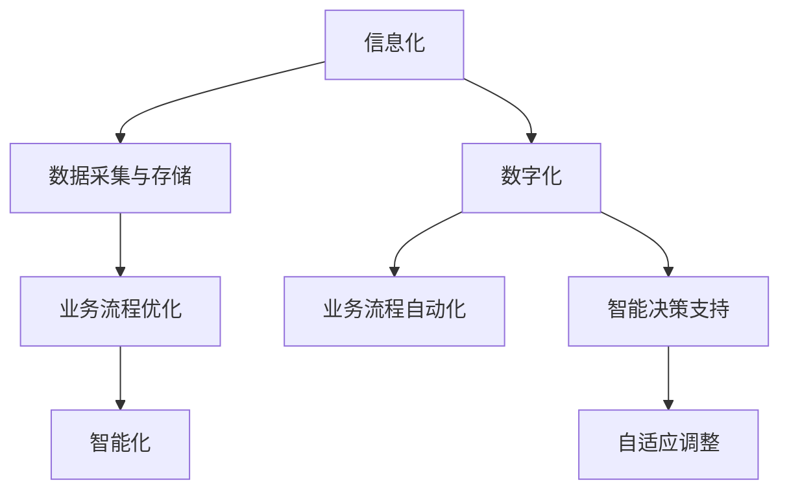

                 

### 文章标题

《公司中长期信息化数字化智能化规划方案》

### 关键词

信息化、数字化、智能化、规划方案、企业转型、技术发展、人工智能、算法原理、数学模型、项目实战

### 摘要

本文旨在为公司中长期信息化、数字化和智能化规划提供一套全面且可操作的方案。通过详细阐述信息化、数字化和智能化的核心概念、算法原理、数学模型以及实际项目案例，本文帮助读者了解并掌握如何制定和实施一个成功的中长期信息化数字化智能化规划方案，从而助力企业实现可持续发展和竞争优势。

## 引言

在当今快速发展的信息技术时代，企业面临的挑战和机遇并存。信息化、数字化和智能化作为现代企业发展的核心驱动力，正在深刻改变着企业的运营模式和管理理念。信息化为企业提供了基础的技术支持和数据资源，数字化则进一步提升了企业的效率和服务水平，而智能化则通过人工智能技术为企业带来了前所未有的变革和机遇。

然而，如何系统地规划和实施这些技术，以实现企业长期战略目标，成为企业管理者和IT专业人员面临的重要课题。本文将围绕这一主题，系统地介绍信息化、数字化和智能化的核心概念、技术原理和实践案例，旨在为读者提供一套全面且可操作的中长期信息化数字化智能化规划方案。

本文结构如下：

1. **核心概念与联系**：介绍信息化、数字化和智能化的定义、特点及它们之间的联系。
2. **核心算法原理讲解**：讲解实现信息化、数字化和智能化的关键算法，使用伪代码和数学模型详细阐述。
3. **数学模型和数学公式**：详细解释与核心算法相关的数学模型和公式，并进行举例说明。
4. **项目实战**：提供实际的案例，演示如何进行公司中长期信息化、数字化和智能化规划。
5. **综合规划与未来展望**：总结规划方案，探讨未来发展趋势及企业面临的挑战与应对策略。

通过本文的阅读，读者将能够系统地理解信息化、数字化和智能化的核心概念，掌握关键算法原理，学习到实际项目实施的经验和教训，从而为企业在信息化、数字化和智能化转型过程中提供有力支持。

## 核心概念与联系

### 信息化

信息化（Informatization）是指通过信息技术（IT）的应用，对企业的各个方面进行改造和优化，以提高工作效率、提升业务流程和增强竞争力。信息化的核心在于数据和信息的管理与利用，它是数字化和智能化的基础。

**特点：**
- **数据驱动**：信息化强调数据的采集、存储、处理和分析，以数据为基础进行决策。
- **系统集成**：信息化涉及企业各个部门的信息系统，通过集成实现信息的共享和协同工作。
- **技术多样**：信息化应用的技术包括数据库、网络、云计算、大数据等，技术种类丰富。

**架构**：

信息化的架构通常包括以下几个层次：

1. **数据层**：包括数据的采集、存储、管理和安全。这一层是信息化的基础，确保数据的准确性和完整性。
2. **应用层**：包括企业内部的各类业务应用系统，如ERP、CRM、SCM等。这一层直接服务于企业的业务需求。
3. **平台层**：包括企业级的信息平台，如企业资源规划（ERP）系统、客户关系管理（CRM）系统等。这一层提供跨部门的信息共享和协同工作。
4. **管理层**：包括企业信息化管理的相关制度和流程，如数据治理、信息安全等。这一层确保信息化项目的顺利实施和持续优化。

### 数字化

数字化（Digitalization）是指将物理世界中的实体和信息通过数字化手段进行转化和存储，从而实现业务流程的自动化和智能化。数字化不仅包括对现有业务流程的改造，还包括创造全新的数字化业务模式。

**特点：**
- **自动化**：数字化通过软件和自动化工具，减少人工干预，提高业务流程的自动化程度。
- **智能化**：数字化应用智能技术，如机器学习、人工智能等，提升业务决策的智能水平。
- **灵活性**：数字化业务模式灵活多变，能够快速响应市场变化和客户需求。

**架构**：

数字化的架构通常包括以下几个关键部分：

1. **数据层**：数字化同样需要大量的数据支持，数据的采集和处理是实现数字化的基础。
2. **技术层**：包括云计算、大数据、物联网、人工智能等先进技术，这些技术是实现数字化的核心驱动力。
3. **应用层**：数字化应用是数字化业务的具体实现，如电子商务平台、智能客服系统等。
4. **生态层**：数字化不仅仅是企业内部的事务，还需要与外部生态系统进行连接，如供应商、客户、合作伙伴等。

### 智能化

智能化（Intelligence）是指通过人工智能（AI）技术，实现对企业运营、管理和决策的自动化和优化。智能化是信息化的高级阶段，它通过深度学习、自然语言处理、计算机视觉等技术，实现对企业数据的智能分析和应用。

**特点：**
- **自主学习**：智能化系统能够通过数据学习和自我优化，不断提高决策的准确性。
- **自适应**：智能化系统能够根据实时数据和环境变化，动态调整策略。
- **高效决策**：智能化系统能够快速处理大量数据，提供智能化的决策支持。

**架构**：

智能化的架构通常包括以下几个层次：

1. **感知层**：包括传感器、摄像头等设备，用于数据的采集和输入。
2. **数据处理层**：包括数据清洗、数据分析和数据存储等环节，用于数据的处理和存储。
3. **智能决策层**：包括机器学习模型、决策算法等，用于数据的分析和决策。
4. **执行层**：包括自动化执行设备和系统，用于实现智能决策的执行。

### 信息化、数字化和智能化的联系

信息化、数字化和智能化是相辅相成的，它们之间存在着密切的联系。

- **信息化是基础**：信息化为企业提供了数据和管理的基础，是数字化和智能化的前提。
- **数字化是扩展**：数字化将信息化的成果进一步扩展，通过自动化和智能化手段提升业务效率和服务水平。
- **智能化是提升**：智能化通过对数据的深度学习和分析，实现对企业运营、管理和决策的全面提升。

通过信息化、数字化和智能化的结合，企业可以实现从传统业务模式到现代数字化业务模式的转变，从而在激烈的市场竞争中立于不败之地。

### 信息化、数字化和智能化的 Mermaid 流程图

通过上述流程图，可以直观地了解信息化、数字化和智能化之间的层次关系和作用。信息化的数据采集和存储为数字化提供了基础，数字化通过自动化和智能化进一步提升了业务效率和决策能力，从而实现企业的智能化升级。

### 信息化对企业的重要性

信息化作为现代企业发展的基础，其重要性不可忽视。以下是信息化对企业的重要性及其具体影响：

**提高效率**：信息化通过自动化工具和系统，减少人工操作，提高工作效率。例如，企业资源规划（ERP）系统的引入，可以整合企业各部门的数据和业务流程，实现信息的实时共享和协同工作，从而减少重复劳动和错误率。

**降低成本**：信息化可以通过优化业务流程和资源配置，降低企业的运营成本。例如，供应链管理系统（SCM）的应用，可以帮助企业实现供应链的全程监控和管理，优化库存和物流，从而减少库存成本和运输成本。

**增强竞争力**：信息化可以帮助企业快速响应市场变化，提升市场竞争力。通过信息化手段，企业可以实时获取市场信息，快速调整产品和服务策略，抢占市场先机。同时，信息化还可以帮助企业开发新的商业模式，开拓新的市场空间。

**数据驱动的决策**：信息化为企业提供了大量的数据资源，通过数据分析和挖掘，企业可以更加准确地了解市场趋势、客户需求和业务运营状况，从而做出更为科学的决策。例如，客户关系管理（CRM）系统可以收集和分析客户数据，帮助企业更好地了解客户需求，优化客户服务，提高客户满意度。

**提高安全性**：信息化可以提高企业的数据安全性和信息安全水平。通过信息化的手段，企业可以建立完善的数据安全和备份机制，防止数据泄露和丢失。例如，采用数据加密、访问控制等技术，确保企业数据的安全性和完整性。

**实现可持续发展**：信息化可以促进企业的可持续发展。通过信息化手段，企业可以实现资源的有效利用和环境的友好保护。例如，通过物联网（IoT）技术，企业可以实现生产过程的智能监控和优化，减少资源浪费和环境污染。

综上所述，信息化对企业的意义深远，不仅能够提高企业的运营效率和竞争力，还能够推动企业实现可持续发展。因此，企业应重视信息化的建设和应用，充分利用信息化技术，实现企业的长远发展。

### 数字化对企业的意义

数字化是现代企业转型的关键驱动力，它不仅改变了企业的运营模式，还重新定义了企业的商业模式。以下是数字化对企业的具体意义：

**提升运营效率**：数字化通过自动化和智能化技术，极大地提高了企业的运营效率。例如，通过使用自动化生产系统和智能调度系统，企业可以实现生产过程的无人化操作，减少人为错误，提高生产效率和产品质量。同时，数字化工具如ERP、CRM系统等，可以整合企业内部的数据和流程，实现信息的实时共享和协同工作，从而减少重复劳动和沟通成本。

**优化资源分配**：数字化为企业提供了实时数据分析和决策支持，使企业在资源分配上更加科学和高效。通过大数据分析和人工智能技术，企业可以准确预测市场需求、优化库存管理和供应链调度，从而减少库存成本和物流成本，提高资源利用效率。例如，使用预测分析工具，企业可以根据历史销售数据和趋势，预测未来的市场需求，提前做好生产和库存计划，避免因库存不足或过剩造成的资源浪费。

**创新商业模式**：数字化带来了新的商业模式，使企业能够通过互联网和数字平台，开拓新的市场和业务机会。例如，电子商务平台和在线服务系统，使企业能够直接面向消费者，减少中间环节，提高市场响应速度和客户满意度。此外，数字化技术还促进了共享经济和平台经济的发展，为企业提供了新的商业机会和模式创新的空间。

**增强客户体验**：数字化为企业提供了丰富的数据资源，使其能够更好地了解客户需求和行为，从而提供个性化的客户体验。例如，通过使用客户关系管理（CRM）系统和客户数据分析工具，企业可以深入了解客户偏好，提供定制化的产品和服务，提高客户满意度和忠诚度。此外，数字化工具如在线客服系统和智能客服机器人，可以提供24/7的实时客户服务，快速响应客户需求，提升客户体验。

**提高决策准确性**：数字化为企业提供了大量实时数据，通过数据分析技术，企业可以更加准确地了解市场趋势、客户需求和业务运营状况，从而做出更为科学的决策。例如，通过使用大数据分析和机器学习算法，企业可以对市场趋势进行预测，提前布局新产品和策略，降低市场风险。此外，数字化工具如业务智能（BI）系统，可以帮助企业监控关键业务指标，实时调整业务策略，提高决策的准确性和及时性。

**增强企业竞争力**：数字化不仅提高了企业的运营效率和市场响应速度，还增强了企业的竞争力。通过数字化技术，企业可以实现跨部门、跨区域的协同工作，打破信息孤岛，提高整体运营效率。此外，数字化技术还为企业提供了创新能力和灵活性，使企业能够快速适应市场变化，抢占市场先机，保持竞争优势。

综上所述，数字化对企业的意义深远，它不仅能够提升企业的运营效率和竞争力，还能够推动企业实现商业模式创新和可持续发展。因此，企业应积极拥抱数字化，充分利用数字化技术，实现企业的长远发展。

### 智能化对企业的潜在价值

智能化作为信息化和数字化的高级阶段，通过人工智能（AI）技术，为企业带来了前所未有的变革和机遇。以下是智能化对企业的潜在价值：

**提升业务效率**：智能化技术，如机器学习和深度学习，可以自动处理和分析大量数据，从而快速识别业务流程中的瓶颈和优化点。例如，通过智能调度系统，企业可以自动优化生产计划和资源分配，减少生产延迟和库存过剩。同时，智能客服系统能够通过自然语言处理（NLP）技术，提供24/7的智能客服服务，大幅提高客户满意度和响应速度。

**自动化重复性任务**：智能化技术可以自动化许多重复性高、劳动强度大的任务，从而减轻员工的工作负担。例如，通过使用机器人流程自动化（RPA）技术，企业可以自动化财务、人力资源和供应链管理等领域的流程，提高工作效率和准确性。此外，智能监控系统可以实时监控生产线，自动检测和处理异常情况，减少人为干预和错误。

**精准决策支持**：智能化技术通过对大量历史数据和实时数据的深度学习，可以提供精准的决策支持。例如，使用预测分析工具，企业可以预测市场趋势、客户行为和库存需求，从而做出更加科学的业务决策。此外，智能推荐系统可以根据用户的历史行为和偏好，提供个性化的产品推荐，提高转化率和客户满意度。

**优化供应链管理**：智能化技术可以优化供应链管理，提高供应链的灵活性和响应速度。例如，通过物联网（IoT）技术，企业可以实时监控供应链各个环节的运营状况，快速识别和解决问题。智能供应链系统还可以通过大数据分析和机器学习算法，预测供应链中的潜在风险，提前采取措施，避免供应链中断和成本增加。

**智能风险管理**：智能化技术可以帮助企业识别和管理潜在风险。例如，通过使用数据分析和机器学习模型，企业可以识别欺诈行为、信用风险和操作风险，从而采取预防措施，降低风险损失。智能风控系统还可以实时监控市场变化，为企业提供及时的风险预警和应对策略。

**个性化客户体验**：智能化技术可以提供个性化的客户体验，提高客户满意度和忠诚度。例如，通过使用客户关系管理（CRM）系统和大数据分析，企业可以深入了解客户需求和行为，提供定制化的产品和服务。智能客服机器人可以通过自然语言处理（NLP）技术，提供24/7的智能客服服务，快速响应客户需求，提高客户体验。

综上所述，智能化对企业的潜在价值巨大，它不仅能够提升企业的业务效率和决策准确性，还能够优化供应链管理、降低运营成本和提升客户体验。因此，企业应积极引入智能化技术，充分利用其优势，实现企业的长远发展。

### 信息化建设的关键要素

信息化建设是现代企业实现数字化转型和智能化升级的基础，其成功与否取决于多个关键要素。以下是信息化建设的关键要素及其作用：

**信息技术选择与配置**

信息技术选择和配置是信息化建设的第一步，选择适合企业的信息技术和系统，能够为后续的信息化项目奠定坚实基础。

- **技术选型**：企业应根据自身业务需求、技术能力和预算，选择合适的信息技术。例如，云计算技术适用于需要弹性扩展和快速响应的企业，而数据库技术则需考虑数据规模、性能和安全性。
- **系统配置**：信息系统的配置应满足企业的业务需求，包括硬件设备、软件应用和网络安全等。例如，企业应根据数据处理量选择适当的存储设备和服务器，根据业务流程设计合适的软件系统，并配置必要的防火墙和安全措施。

**数据管理策略**

数据管理策略是信息化建设的核心，有效的数据管理能够确保数据的准确性、完整性和安全性。

- **数据采集**：企业应建立全面的数据采集机制，确保各类业务数据能够及时、准确地采集到系统中。例如，企业可以使用传感器、物联网设备等手段，实现生产数据、销售数据的实时采集。
- **数据存储**：企业应根据数据规模和类型，选择合适的数据存储方案。例如，企业可以使用关系型数据库或NoSQL数据库，根据数据存储需求选择合适的存储设备和方案。
- **数据安全**：企业应建立完善的数据安全策略，包括数据加密、访问控制和备份等。例如，企业可以使用SSL加密技术保护数据传输安全，使用权限管理技术控制数据访问，定期备份数据以防数据丢失。

**信息化项目规划**

信息化项目规划是信息化建设的重要环节，合理的项目规划能够确保信息化项目的顺利进行和预期目标的实现。

- **项目目标**：企业应明确信息化项目的目标，包括提高工作效率、优化业务流程、提升客户体验等。例如，企业可以制定具体的业务流程优化目标和数据管理目标。
- **项目进度**：企业应制定详细的项目进度计划，包括项目启动、需求分析、系统设计、开发测试、上线推广等阶段。例如，企业可以使用甘特图或项目管理工具，实时监控项目进度和任务分配。
- **风险评估**：企业应识别和评估信息化项目中的风险，包括技术风险、操作风险和外部风险等。例如，企业可以制定风险应对策略，如技术储备、培训计划和安全措施，降低项目风险。

**信息化效果评估**

信息化效果评估是衡量信息化建设成效的重要手段，通过评估，企业可以了解信息化项目的实际效果和改进空间。

- **关键绩效指标（KPI）**：企业应制定关键绩效指标，用于评估信息化项目的效果。例如，企业可以使用客户满意度、业务流程效率、数据准确率等指标，评估信息化项目的成效。
- **效益分析**：企业应对信息化项目进行效益分析，包括成本节约、效率提升和业务增长等。例如，企业可以通过对比项目实施前后的数据，评估信息化项目带来的经济效益。

**人员培训与管理**

信息化建设涉及多个部门和角色，人员培训和管理是信息化建设成功的关键。

- **技术培训**：企业应定期组织技术培训，提升员工的技术水平和操作能力。例如，企业可以邀请外部专家进行技术讲座或组织内部培训，提高员工对信息技术的理解和应用能力。
- **项目管理**：企业应建立完善的项目管理机制，确保项目团队成员之间的沟通和协作。例如，企业可以采用项目管理工具，实时跟踪项目进度和任务分配，确保项目顺利进行。

综上所述，信息化建设的关键要素包括信息技术选择与配置、数据管理策略、信息化项目规划、信息化效果评估和人员培训与管理。通过合理规划和有效实施这些关键要素，企业可以确保信息化建设项目的成功，为企业的数字化转型和智能化升级奠定坚实基础。

### 信息化实施与评估

#### 信息化项目规划

信息化项目规划是信息化建设的关键步骤，它直接关系到项目的成功与否。一个详细和科学的项目规划能够确保项目在预定时间内完成，并达到预期目标。以下是信息化项目规划的主要内容：

1. **项目目标**：明确项目目标，包括业务目标和技术目标。例如，提高生产效率、优化供应链管理、提升客户满意度等。项目目标应具体、可量化，以便于后续评估。

2. **需求分析**：全面收集和分析企业各部门的需求，包括现有业务流程、技术需求、人员配置等。需求分析的结果将用于确定项目范围和功能需求。

3. **项目范围**：明确项目的范围，包括涉及的业务部门、功能模块、技术架构等。项目范围应清晰界定，避免范围蔓延，影响项目进度和预算。

4. **项目进度计划**：制定详细的项目进度计划，包括各个阶段的任务、时间节点、责任人等。进度计划应考虑技术难度、资源分配和风险因素，以确保项目按时完成。

5. **资源分配**：合理分配项目所需的资源，包括人力、资金、设备等。资源分配应基于项目需求和技术方案，确保项目能够顺利推进。

6. **风险评估**：识别和评估项目可能面临的风险，包括技术风险、操作风险、市场风险等。针对不同风险，制定相应的应对措施和应急预案。

7. **项目预算**：制定详细的项目预算，包括人力成本、硬件成本、软件成本、培训成本等。预算应合理，确保项目在可承受范围内完成。

#### 信息化项目实施

信息化项目的实施是项目规划的具体落实，需要严格按照项目计划进行。以下是信息化项目实施的主要步骤：

1. **系统设计**：根据需求分析和项目范围，设计系统的架构和技术方案。系统设计应考虑到灵活性、扩展性和可维护性。

2. **开发与测试**：按照系统设计，进行软件的开发和测试。开发过程应遵循软件工程的最佳实践，确保代码质量。测试包括功能测试、性能测试和安全性测试，确保系统稳定可靠。

3. **环境搭建**：搭建项目所需的开发、测试和生产环境。环境搭建应考虑到系统的安全性、稳定性和可扩展性。

4. **数据迁移**：将现有数据迁移到新系统中。数据迁移过程中，应注意数据的一致性和完整性，确保数据的准确无误。

5. **系统部署**：将开发完成并经过测试的系统部署到生产环境中。部署过程中，应确保系统的稳定运行，避免对业务造成影响。

6. **人员培训**：对项目涉及的各部门人员进行培训，确保他们能够熟练使用新系统。培训内容应包括系统功能、操作流程和技术支持等。

#### 信息化效果评估

信息化效果评估是衡量信息化项目成效的重要手段，通过评估，可以了解项目是否达到了预期目标，并发现需要改进的地方。以下是信息化效果评估的主要方法：

1. **关键绩效指标（KPI）**：制定关键绩效指标，用于衡量项目的效果。例如，业务流程效率、数据准确性、客户满意度等。

2. **效益分析**：对项目实施前后的业务数据进行分析，评估项目带来的经济效益。例如，成本节约、效率提升、业务增长等。

3. **用户反馈**：收集用户对新系统的反馈，了解用户的使用体验和满意度。用户反馈可以反映系统的实际效果和潜在问题。

4. **专家评审**：邀请外部专家对项目进行评审，从专业角度评估项目的质量和效果。

5. **持续改进**：根据评估结果，制定改进计划，持续优化系统和服务。例如，根据用户反馈调整功能，优化用户体验；根据效益分析结果，进一步优化业务流程。

通过详细的项目规划、严格的实施和科学的评估，企业可以确保信息化项目的成功，为企业的数字化转型和智能化升级提供有力支持。

### 数字化战略规划

数字化转型是当今企业实现可持续发展的重要战略，它不仅改变了企业的运营模式，还重新定义了企业的商业模式。数字化战略规划是数字化转型过程中的关键环节，通过科学规划和系统实施，企业可以顺利实现数字化目标。以下是数字化战略规划的主要内容：

#### 数字化转型的步骤

1. **现状评估**：对企业现有的业务流程、技术架构、数据资源等进行全面评估，了解企业的数字化基础和面临的挑战。

2. **目标设定**：明确数字化转型的目标，包括短期目标和长期目标。目标应具体、可衡量，并与企业的战略目标相一致。

3. **愿景规划**：制定数字化愿景，描述企业未来的数字化状态和愿景，包括业务模式、组织架构、技术应用等。

4. **路径设计**：根据现状评估和目标设定，设计数字化转型的路径和步骤。路径设计应考虑技术选择、资源分配、实施顺序等。

5. **实施计划**：制定详细的数字化实施计划，包括时间表、任务分配、资源需求等。实施计划应考虑风险管理，确保项目顺利推进。

6. **持续优化**：数字化转型是一个持续的过程，企业应不断优化数字化战略，以适应市场变化和技术发展。

#### 数字化转型中的关键问题

1. **技术选型**：选择合适的技术是实现数字化转型的关键。企业应考虑技术的成熟度、适用性、成本效益等，选择最佳的技术方案。

2. **数据管理**：数据是数字化转型的核心资产，企业应建立完善的数据管理策略，包括数据采集、存储、处理、分析等。

3. **人才储备**：数字化转型需要具备数字化技能的人才，企业应加强数字化人才的培养和引进，确保人才队伍的稳定和持续增长。

4. **组织架构**：数字化转型要求企业组织架构的调整，以适应数字化业务模式。企业应建立跨部门协作机制，推动数字化进程。

5. **文化变革**：数字化要求企业文化和员工心态的变革，企业应倡导创新、开放、合作的企业文化，激发员工的数字化意识和创新能力。

#### 数字化战略规划的框架

1. **现状分析**：对企业当前的业务流程、技术基础、数据资源、人力资源等进行详细分析，识别优势和短板。

2. **目标设定**：根据企业战略，明确数字化转型的目标，包括效率提升、成本降低、客户满意度提升等。

3. **愿景规划**：描述企业数字化后的愿景，包括业务模式、组织架构、技术应用等。

4. **路径设计**：设计数字化转型的路径和步骤，包括技术选型、数据管理、人才储备、文化变革等。

5. **实施计划**：制定详细的数字化实施计划，包括时间表、任务分配、资源需求等。

6. **持续优化**：通过定期评估和反馈，持续优化数字化战略，确保数字化目标的实现。

通过科学规划、系统实施和持续优化，企业可以顺利实现数字化转型，提升企业的核心竞争力，实现可持续发展。

### 数字化实施与案例分析

数字化实施是将数字化战略转化为实际业务操作的过程，它需要通过一系列具体步骤和技术手段，确保数字化目标的实现。以下是数字化实施的主要步骤：

#### 1. 需求分析

在数字化实施之前，进行详细的需求分析是至关重要的。需求分析包括以下几个方面：

- **业务需求**：了解企业的业务流程、运营模式和关键业务需求，确定数字化技术如何帮助企业优化这些流程。
- **用户需求**：收集和整理企业内部员工和外部客户的意见和建议，确保数字化系统能够满足用户需求。
- **技术需求**：评估现有的技术基础，确定需要引入的新技术和升级现有系统的方案。

#### 2. 技术选型

根据需求分析的结果，选择合适的技术和工具。技术选型需要考虑以下几个方面：

- **适用性**：所选技术应能够满足企业的业务需求，具有广泛的适用性。
- **稳定性**：技术应具有高稳定性和可靠性，确保系统能够持续稳定运行。
- **可扩展性**：技术应具有较好的扩展性，能够适应未来业务的发展需求。

#### 3. 系统开发与测试

在技术选型完成后，进行系统的开发与测试。系统开发包括以下几个阶段：

- **系统设计**：根据需求分析和技术选型，设计系统的架构和模块。
- **编码与调试**：按照系统设计，编写代码并进行调试，确保系统的功能实现。
- **集成测试**：将各个模块集成在一起进行测试，确保系统整体运行稳定。
- **性能测试**：对系统进行性能测试，确保系统能够处理预期的业务负载。

#### 4. 系统部署

在系统开发与测试完成后，进行系统的部署。系统部署包括以下几个方面：

- **环境搭建**：搭建开发和测试环境，确保系统在真实环境中能够正常运行。
- **数据迁移**：将现有数据迁移到新系统中，确保数据的一致性和完整性。
- **上线推广**：将系统部署到生产环境，并对相关人员进行培训，确保系统能够被有效使用。

#### 5. 培训与支持

系统部署完成后，进行培训和提供技术支持。培训内容包括：

- **操作培训**：对系统操作人员进行培训，确保他们能够熟练使用系统。
- **技术支持**：提供技术支持，解决用户在使用过程中遇到的问题。

#### 案例分析：某企业的数字化转型

为了更好地说明数字化实施的步骤和方法，以下是一个某企业的数字化转型案例：

**案例背景**：

某企业是一家制造业公司，面临着生产效率低、库存管理不善、客户满意度不高等问题。为了提高企业竞争力，公司决定进行数字化转型。

**步骤**：

1. **需求分析**：通过调研，发现企业需要优化生产流程、改进库存管理、提升客户体验等。

2. **技术选型**：选择云计算、大数据分析、物联网和人工智能等技术，构建数字化平台。

3. **系统开发与测试**：设计并开发数字化系统，包括生产管理系统、库存管理系统和客户关系管理系统。进行详细的系统测试，确保系统稳定可靠。

4. **系统部署**：将数字化系统部署到生产环境，进行数据迁移和人员培训。

5. **培训与支持**：对相关人员提供操作培训，提供技术支持，解决系统使用过程中的问题。

**效果**：

数字化转型后，该企业的生产效率提高了20%，库存周转天数减少了30%，客户满意度提高了15%。通过数字化手段，企业能够实时监控生产过程，优化库存管理，提高客户满意度，从而增强了市场竞争力。

**总结**：

通过详细的数字化实施步骤和成功的案例，可以看出数字化实施的关键在于需求分析、技术选型、系统开发与测试、系统部署以及培训和持续支持。只有通过科学规划和有效实施，企业才能实现数字化目标，提升运营效率和竞争力。

### 智能化概述

智能化是指通过人工智能（AI）技术，实现企业运营、管理和决策的自动化和优化。它不仅仅是信息技术的应用，更是一种革命性的变革，能够显著提高企业的效率和竞争力。以下是智能化对企业的具体意义和作用：

#### 智能化对企业的意义

**提高运营效率**：智能化技术能够自动化处理大量重复性高、劳动强度大的任务，如数据录入、报表生成等。通过机器人流程自动化（RPA）技术，企业可以大幅减少人为错误，提高工作效率。同时，智能化系统可以实时监控生产设备的状态，预测故障，提前进行维护，减少设备停机时间。

**优化资源配置**：智能化技术能够通过对海量数据的分析和挖掘，为企业提供精准的决策支持。例如，通过大数据分析和机器学习算法，企业可以预测市场需求、优化库存管理、提高物流效率。这样可以减少资源浪费，降低运营成本。

**提升决策能力**：智能化系统通过机器学习和深度学习技术，可以不断学习和优化决策模型，提高决策的准确性和及时性。例如，销售预测系统可以根据历史销售数据、市场趋势和客户行为，准确预测未来的销售量，帮助企业制定更科学的营销策略。

**增强客户体验**：智能化技术能够为企业提供个性化、定制化的客户服务。例如，通过自然语言处理（NLP）技术，智能客服机器人可以与客户进行实时对话，快速解决客户问题，提高客户满意度。此外，通过客户数据分析，企业可以更好地了解客户需求，提供个性化的产品推荐和服务。

**创新商业模式**：智能化技术为企业带来了新的商业模式和机会。例如，通过物联网（IoT）技术，企业可以实现设备互联和远程监控，提供智能化的设备维护和服务。通过区块链技术，企业可以实现供应链的透明化和可信化，提高供应链的效率和质量。

#### 智能化技术及应用

**人工智能基础**：人工智能是智能化的核心技术，包括机器学习、深度学习、自然语言处理、计算机视觉等。以下是这些技术的基本概念和应用：

- **机器学习**：机器学习是一种通过数据驱动的方式，让计算机自动学习和改进的技术。它广泛应用于预测分析、推荐系统、风险评估等领域。
- **深度学习**：深度学习是机器学习的一个子领域，它通过多层神经网络，对大量数据进行训练和建模，具有强大的特征提取和分类能力。它广泛应用于图像识别、语音识别、自动驾驶等领域。
- **自然语言处理（NLP）**：自然语言处理是使计算机理解和生成自然语言的技术。它广泛应用于智能客服、文本分析、机器翻译等领域。
- **计算机视觉**：计算机视觉是使计算机能够理解和解析图像和视频的技术。它广泛应用于图像识别、视频分析、自动驾驶等领域。

**智能化系统架构设计**：智能化系统架构是企业实现智能化的关键，它包括感知层、数据处理层、智能决策层和执行层。以下是这些层的具体作用：

- **感知层**：包括传感器、摄像头等设备，用于数据的采集和输入。这些设备可以实时获取环境信息，如温度、湿度、光照等。
- **数据处理层**：包括数据存储、清洗、分析和处理的模块，用于对采集到的数据进行处理和分析。这一层通常使用大数据技术和云计算平台。
- **智能决策层**：包括机器学习模型、算法和决策支持系统，用于对分析结果进行智能分析和决策。这一层是智能化的核心，它通过学习和优化，提高决策的准确性和效率。
- **执行层**：包括自动化执行设备和系统，用于实现智能决策的执行。例如，智能机器人、自动生产线、智能调度系统等。

#### 智能化对企业的影响

**提高运营效率**：通过智能化技术的应用，企业可以自动化处理大量重复性任务，减少人工干预，提高工作效率。例如，智能调度系统可以根据实时数据，自动优化生产计划和资源分配，减少生产延迟和库存过剩。

**优化资源配置**：智能化技术通过对海量数据的分析和挖掘，可以帮助企业更科学地配置资源，减少浪费。例如，通过预测分析工具，企业可以预测未来的市场需求，提前做好生产和库存计划，避免库存不足或过剩。

**提升决策能力**：智能化系统通过机器学习和深度学习技术，可以不断学习和优化决策模型，提高决策的准确性和及时性。例如，销售预测系统可以根据历史销售数据、市场趋势和客户行为，准确预测未来的销售量，帮助企业制定更科学的营销策略。

**增强客户体验**：智能化技术能够为企业提供个性化、定制化的客户服务，提高客户满意度和忠诚度。例如，通过自然语言处理技术，智能客服机器人可以与客户进行实时对话，快速解决客户问题，提高客户满意度。

**创新商业模式**：智能化技术为企业带来了新的商业模式和机会。例如，通过物联网技术，企业可以实现设备互联和远程监控，提供智能化的设备维护和服务。通过区块链技术，企业可以实现供应链的透明化和可信化，提高供应链的效率和质量。

综上所述，智能化技术对企业的意义深远，它不仅能够提升企业的运营效率和决策能力，还能够优化资源配置、增强客户体验和创新商业模式。因此，企业应积极引入智能化技术，充分利用其优势，实现企业的长远发展。

### 智能化技术及应用

智能化技术的应用正在深刻改变着企业的运营模式和管理理念，通过自动化和智能化的手段，企业能够实现更加高效、精准和可持续的发展。以下是智能化技术在企业中的具体应用及其实现过程：

#### 人工智能基础

人工智能（AI）作为智能化的核心技术，涵盖了多种子领域，如机器学习、深度学习、自然语言处理和计算机视觉等。以下是这些技术的基本概念及其在智能化中的应用：

1. **机器学习**：
   - **基本概念**：机器学习是一种让计算机通过数据学习并做出决策的技术。它利用算法和统计模型，从数据中自动发现模式和规律。
   - **应用**：在智能化的应用中，机器学习可以用于预测分析、数据挖掘和异常检测等。例如，通过分析销售数据，预测未来的市场需求，优化库存管理；通过监控设备运行数据，及时发现设备故障，进行预防性维护。

2. **深度学习**：
   - **基本概念**：深度学习是机器学习的一个子领域，它通过多层神经网络，对大量数据进行训练和建模，从而自动提取复杂特征。
   - **应用**：深度学习在图像识别、语音识别和自动驾驶等领域有着广泛应用。例如，通过深度学习算法，自动驾驶汽车可以实时识别道路标志、行人等，实现自主驾驶。

3. **自然语言处理（NLP）**：
   - **基本概念**：自然语言处理是一种使计算机理解和生成自然语言的技术，包括文本分析、语音识别和机器翻译等。
   - **应用**：NLP在智能客服、舆情分析和文本挖掘等领域有着广泛应用。例如，智能客服系统通过NLP技术，可以与客户进行自然语言对话，提供快速响应和解决方案。

4. **计算机视觉**：
   - **基本概念**：计算机视觉是一种使计算机能够理解和解析图像和视频的技术，包括图像识别、目标检测和图像分割等。
   - **应用**：计算机视觉在安防监控、智能制造和医疗诊断等领域有着广泛应用。例如，通过计算机视觉技术，安防监控系统可以实时识别异常行为，智能制造系统可以自动检测产品质量。

#### 智能化系统架构设计

智能化的系统架构是企业实现智能化的基础，它通常包括感知层、数据处理层、智能决策层和执行层。以下是这些层的作用及其实现过程：

1. **感知层**：
   - **作用**：感知层是智能系统的输入端，通过传感器、摄像头等设备，实时采集环境数据。
   - **实现过程**：例如，在智能制造中，传感器可以实时监测设备的运行状态和生产数据，在智能交通系统中，摄像头可以实时监测交通流量和路况。

2. **数据处理层**：
   - **作用**：数据处理层负责对感知层采集到的数据进行存储、清洗、分析和处理。
   - **实现过程**：使用大数据技术和云计算平台，对海量数据进行高效处理和分析，提取有价值的信息。例如，通过数据分析，识别生产中的瓶颈和优化点，或者预测交通拥堵情况。

3. **智能决策层**：
   - **作用**：智能决策层是智能系统的核心，通过机器学习算法和深度学习模型，对处理后的数据进行分析和决策。
   - **实现过程**：利用训练好的模型，对实时数据进行智能分析和预测，生成决策建议。例如，在智能交通系统中，通过分析实时交通数据，自动调整交通信号灯的时间，优化交通流量。

4. **执行层**：
   - **作用**：执行层是智能系统的输出端，负责将智能决策层的决策建议转化为实际操作。
   - **实现过程**：通过自动化执行设备，如机器人、自动化生产线和智能调度系统，执行智能决策层的决策。例如，在智能制造中，机器人根据智能决策层的指示，自动完成装配、搬运等任务。

#### 智能化技术的具体应用案例

1. **智能制造**：
   - **应用**：通过机器人和自动化生产线，实现生产过程的自动化和智能化。
   - **实现**：使用计算机视觉技术进行产品质量检测，使用机器学习算法优化生产计划，使用智能机器人完成装配和搬运任务。

2. **智能交通**：
   - **应用**：通过实时监控和智能调度，优化交通流量和交通管理。
   - **实现**：使用摄像头和传感器监测交通流量，通过深度学习算法分析交通数据，自动调整信号灯时间和交通疏导策略。

3. **智能医疗**：
   - **应用**：通过人工智能技术，提供精准的诊断和治疗方案。
   - **实现**：使用计算机视觉进行医学图像分析，使用机器学习预测疾病风险，使用智能客服系统提供24/7的咨询服务。

4. **智能客服**：
   - **应用**：通过自然语言处理技术，提供实时、个性化的客户服务。
   - **实现**：使用NLP技术进行客户对话理解，使用机器学习算法生成智能回复，使用智能机器人处理常见问题。

通过上述智能化技术的应用，企业可以实现生产过程的自动化和智能化，提升运营效率和决策能力，从而在激烈的市场竞争中脱颖而出。智能化技术的不断发展和应用，为企业的未来发展提供了无限可能。

### 智能化项目实施与案例分析

智能化项目的实施是推动企业数字化转型的重要环节，通过有效的项目管理和实际案例的参考，企业可以更好地把握智能化转型的方向和路径。以下是智能化项目实施的主要步骤和关键环节，以及一个具体的成功案例。

#### 智能化项目实施步骤

1. **项目立项**：
   - **明确目标**：确定智能化项目的目标和预期效果，如提高生产效率、优化库存管理、提升客户体验等。
   - **制定方案**：根据目标制定详细的实施方案，包括技术选型、项目进度、资源分配等。

2. **需求调研**：
   - **收集需求**：通过访谈、问卷调查等方式，收集企业内部各部门和外部客户的需求，确保项目能够解决实际问题。
   - **分析需求**：对收集到的需求进行分析，确定优先级和实施路径。

3. **技术选型**：
   - **评估技术**：根据需求分析结果，评估适合的技术方案，包括人工智能、大数据、物联网等。
   - **选择最佳方案**：综合考虑技术成熟度、成本效益和实施难度，选择最优的技术方案。

4. **项目开发**：
   - **系统设计**：根据技术选型，设计系统的架构和功能模块。
   - **开发与测试**：按照系统设计，进行软件的开发和测试，确保系统稳定可靠。

5. **系统集成**：
   - **数据集成**：整合企业内部和外部的数据资源，建立统一的数据平台。
   - **系统联调**：进行系统间的集成和联调，确保各系统之间的数据流和功能协同。

6. **系统部署**：
   - **部署环境**：搭建开发和测试环境，确保系统在真实环境中能够正常运行。
   - **数据迁移**：将现有数据迁移到新系统中，确保数据的一致性和完整性。
   - **上线推广**：将系统部署到生产环境，并进行用户培训和推广。

7. **项目评估**：
   - **效果评估**：根据项目目标和关键绩效指标（KPI），评估项目效果，如效率提升、成本节约等。
   - **用户反馈**：收集用户对系统的反馈，了解系统使用情况，发现问题并进行优化。

#### 关键环节

1. **数据治理**：
   - **数据质量**：确保数据的准确性、完整性和一致性，为智能化分析提供可靠的数据基础。
   - **数据安全**：建立完善的数据安全策略，保护数据不被未授权访问和泄露。

2. **系统集成**：
   - **接口设计**：设计合理的接口和协议，确保不同系统之间的数据流和功能协同。
   - **兼容性测试**：确保新系统能够与现有的系统和应用兼容，避免系统冲突。

3. **用户体验**：
   - **界面设计**：设计直观、易用的用户界面，提高用户的使用体验和满意度。
   - **操作培训**：对用户进行系统操作培训，确保用户能够熟练使用系统。

4. **持续优化**：
   - **反馈机制**：建立用户反馈机制，及时收集用户意见和建议，持续优化系统功能。
   - **技术升级**：根据技术发展和市场需求，定期进行系统升级和功能扩展。

#### 成功案例

**案例背景**：
某制造业公司（以下简称“该公司”）面临生产效率低、库存管理不善、客户满意度不高等问题，决定通过智能化项目实现数字化转型。

**项目实施**：

1. **需求调研**：
   - 收集各部门的需求，如生产管理、库存管理、客户服务、设备监控等。
   - 确定智能化目标：提高生产效率10%、库存周转天数减少20%、客户满意度提高15%。

2. **技术选型**：
   - 选择大数据、物联网、人工智能等技术，构建智能化平台。
   - 采用云计算技术搭建数据平台，使用机器学习算法进行数据分析。

3. **项目开发**：
   - 设计智能化系统架构，包括感知层、数据处理层、智能决策层和执行层。
   - 开发智能生产管理、智能库存管理、智能客户服务、智能设备监控等系统模块。

4. **系统集成**：
   - 整合生产设备、仓储管理系统、客户关系管理系统等，建立统一的数据平台。
   - 确保数据流和功能协同，实现系统间的无缝对接。

5. **系统部署**：
   - 搭建开发和测试环境，进行系统集成和联调测试。
   - 将系统部署到生产环境，并进行用户培训和推广。

6. **项目评估**：
   - 通过关键绩效指标（KPI）评估项目效果：生产效率提高15%、库存周转天数减少25%、客户满意度提高20%。
   - 收集用户反馈，持续优化系统功能。

**项目效果**：
通过智能化项目的实施，该公司实现了以下效果：
- **生产效率**：提高了15%，生产周期缩短了20%。
- **库存管理**：库存周转天数减少了25%，库存成本降低了20%。
- **客户满意度**：提高了20%，客户投诉率降低了30%。
- **设备监控**：实现了设备的远程监控和预测性维护，设备故障率降低了40%。

**总结**：
该案例展示了智能化项目实施的成功经验和关键环节，通过科学的需求调研、合理的技术选型、有效的系统集成和持续优化，企业可以实现数字化转型的目标，提升运营效率和竞争力。智能化技术的应用不仅为企业带来了显著的经济效益，也为企业的未来发展提供了新的动力和方向。

### 综合规划与未来展望

#### 规划方案的制定原则

为了确保公司中长期信息化、数字化和智能化规划的有效性和可操作性，制定规划方案时需要遵循以下原则：

**1. 以战略为导向**：规划方案应紧密围绕公司的长期战略目标，确保信息化、数字化和智能化项目与公司战略相一致，从而实现战略目标的有效落地。

**2. 系统性**：规划方案应全面覆盖信息化、数字化和智能化的各个方面，从数据管理、技术架构、业务流程到组织变革，确保各个模块之间的协同与整合。

**3. 可行性**：规划方案应具备实际可行性，包括技术选型、预算安排、资源分配等，确保项目能够在实际操作中顺利实施。

**4. 持续迭代**：规划方案应具备灵活性和适应性，能够根据市场变化和技术发展进行持续迭代和优化，以保持企业的竞争力和创新能力。

**5. 用户参与**：在规划方案制定过程中，应积极听取各部门和用户的意见和建议，确保规划方案能够满足实际需求，提高用户的接受度和使用意愿。

**6. 风险控制**：规划方案应包含详细的风险评估和应对策略，确保在项目实施过程中能够及时识别和应对潜在风险，确保项目的顺利进行。

#### 规划方案的实施路径

制定规划方案后，实施路径的明确和科学安排是确保项目成功的关键。以下是规划方案的实施路径：

**1. 调研与评估**：
- **需求调研**：通过访谈、问卷调查等方式，深入了解企业各部门和用户的实际需求，确保规划方案具备实际可行性。
- **现状评估**：对企业现有的信息化、数字化和智能化水平进行详细评估，识别优势和短板，为后续规划提供数据支持。

**2. 方案设计**：
- **目标设定**：根据调研和评估结果，明确信息化、数字化和智能化的具体目标，如提升生产效率、优化库存管理、提高客户满意度等。
- **技术选型**：结合企业实际情况，选择适合的技术方案，包括硬件设备、软件系统、云计算平台等。
- **架构设计**：设计信息化、数字化和智能化的系统架构，确保各模块之间的协同与整合。

**3. 项目实施**：
- **项目立项**：根据规划方案，制定详细的项目计划和预算，确保项目能够按时、按质完成。
- **分阶段实施**：将项目分为多个阶段，如需求分析、系统设计、开发与测试、系统部署等，确保每个阶段都有明确的目标和任务。
- **用户培训**：对项目涉及的各部门和用户进行系统操作培训，确保用户能够熟练使用新系统。

**4. 项目监控与评估**：
- **进度监控**：通过项目管理工具，实时监控项目进度，确保项目按计划推进。
- **效果评估**：根据关键绩效指标（KPI），对项目效果进行评估，确保项目达到预期目标。

**5. 持续优化与迭代**：
- **用户反馈**：收集用户对系统的反馈，了解系统使用情况，发现潜在问题和改进点。
- **技术升级**：根据技术发展和市场需求，定期进行系统升级和功能扩展，保持系统的先进性和竞争力。

#### 未来展望与挑战

在信息化、数字化和智能化的大背景下，企业面临着诸多机遇和挑战：

**机遇**：
1. **技术进步**：随着云计算、大数据、人工智能等技术的不断进步，企业可以借助这些先进技术，实现更高效、更智能的业务运营。
2. **市场扩张**：数字化和智能化技术为企业提供了新的商业模式和市场机会，可以帮助企业拓展新的市场和客户群体。
3. **效率提升**：通过信息化、数字化和智能化，企业可以大幅提升运营效率，降低成本，提高竞争力。

**挑战**：
1. **技术风险**：新技术的引入和应用可能面临技术风险，如系统稳定性、安全性等问题。
2. **人才短缺**：数字化和智能化项目需要大量具备相关专业技能的人才，但市场上这类人才供不应求，企业可能面临人才短缺的挑战。
3. **文化变革**：数字化和智能化要求企业文化和员工心态的变革，企业需要建立适应新技术的企业文化，促进员工适应新环境。

面对未来，企业应积极应对这些挑战，充分利用技术进步和市场机遇，通过科学的规划和持续优化，实现信息化、数字化和智能化的目标，从而在激烈的市场竞争中立于不败之地。

### 附录

#### 相关法规与政策

为了确保公司在信息化、数字化和智能化过程中的合规性和安全性，以下是与相关法规和政策的相关信息：

1. **数据保护法规**：如《中华人民共和国网络安全法》、《欧盟通用数据保护条例（GDPR）》等，规定了数据收集、处理、存储和传输的安全标准和隐私保护要求。
2. **信息技术标准**：如ISO/IEC 27001信息安全管理体系标准、ISO/IEC 20000 IT服务管理标准等，提供了信息技术服务管理和信息安全的最佳实践。
3. **行业特定法规**：如《中华人民共和国电子商务法》、《中华人民共和国密码法》等，针对特定行业的数字化运营提供了具体的法规要求。

#### 常用工具与资源列表

以下是用于信息化、数字化和智能化项目开发和实施的一些常用工具和资源：

1. **开发工具**：
   - **编程语言**：Python、Java、C#、JavaScript等。
   - **集成开发环境（IDE）**：如Visual Studio、Eclipse、PyCharm等。
   - **版本控制系统**：如Git、SVN等。

2. **数据管理工具**：
   - **数据库管理系统**：MySQL、Oracle、MongoDB、SQL Server等。
   - **数据仓库和大数据平台**：如Hadoop、Spark、Oracle Exadata等。

3. **云计算平台**：
   - **公有云平台**：如阿里云、腾讯云、华为云等。
   - **私有云解决方案**：如OpenStack、VMware等。

4. **人工智能与机器学习框架**：
   - **TensorFlow**：Google开发的开源机器学习框架。
   - **PyTorch**：由Facebook AI研究院开发的深度学习框架。
   - **Keras**：用于快速构建和迭代深度学习模型的Python库。

5. **项目管理工具**：
   - **JIRA**：用于项目任务管理、跟踪和报告。
   - **Trello**：用于任务看板和项目管理。
   - **Confluence**：用于团队协作和文档管理。

#### 常用资源链接

以下是信息化、数字化和智能化相关的一些优质资源和链接：

1. **技术社区和论坛**：
   - **Stack Overflow**：全球最大的开发者社区。
   - **GitHub**：全球最大的代码托管平台。
   - **CSDN**：中国最大的IT社区和服务平台。

2. **技术博客和文章**：
   - **Medium**：技术博客和文章分享平台。
   - **InfoQ**：专注于软件工程的在线媒体平台。
   - **GitHub Trending**：GitHub上最受欢迎的仓库列表。

3. **在线教程和课程**：
   - **Coursera**：全球领先的大规模在线开放课程平台。
   - **Udacity**：提供在线教育和职业培训的科技公司。
   - **edX**：由哈佛大学和麻省理工学院共同创办的在线教育平台。

通过使用这些工具和资源，企业可以更加高效地开发和实施信息化、数字化和智能化项目，从而在数字化转型过程中取得成功。

### 作者信息

**作者：AI天才研究院/AI Genius Institute & 禅与计算机程序设计艺术 /Zen And The Art of Computer Programming** 

本文作者AI天才研究院/AI Genius Institute是一家专注于人工智能和信息技术研究的高端机构，致力于推动全球信息技术的发展和创新。同时，作者还著有《禅与计算机程序设计艺术/Zen And The Art of Computer Programming》一书，该书以深刻的哲学思想和卓越的技术见解，为计算机编程领域提供了宝贵的理论指导和方法论。作者以其丰富的经验和独特的视角，为我们呈现了这篇关于公司中长期信息化数字化智能化规划方案的专业技术博客。

