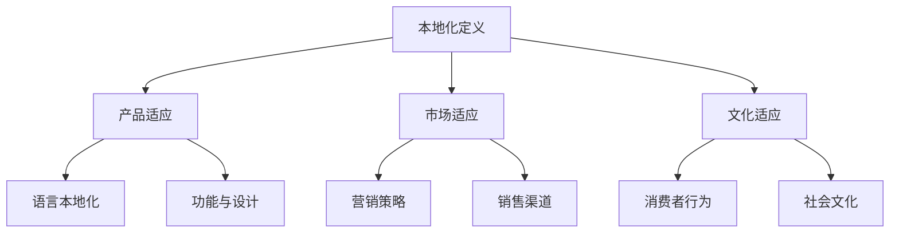

                 

## 《创业公司的本地化策略与市场适应》

### 关键词：创业公司、本地化策略、市场适应、文化因素、竞争优势

#### 摘要：
本文将探讨创业公司在全球市场中如何通过本地化策略实现市场适应。本地化不仅是将产品和服务适应特定市场的文化和语言，更是深入理解并满足当地消费者需求的关键。文章分为三个部分，分别阐述本地化策略的概述、实施策略以及市场适应与持续发展的方法。通过案例分析，提供实际操作指南，帮助创业公司构建本地化竞争优势，实现可持续发展。

---

### 目录大纲

## 第一部分：本地化策略概述

### 第1章：本地化的意义与重要性
#### 1.1.1 本地化的定义与目的
#### 1.1.2 本地化对企业战略的重要性

### 第2章：市场研究与分析
#### 2.1.1 市场环境分析
#### 2.1.2 目标市场定位
#### 2.1.3 竞争对手分析

### 第3章：文化适应性策略
#### 3.1.1 文化因素对消费者行为的影响
#### 3.1.2 跨文化沟通策略
#### 3.1.3 产品与品牌文化适应性调整

## 第二部分：本地化实施策略

### 第4章：产品与服务的本地化
#### 4.1.1 产品本地化的方法
#### 4.1.2 服务本地化的实践
#### 4.1.3 本地化过程中的挑战与解决

### 第5章：市场营销与推广的本地化
#### 5.1.1 市场营销策略的本地化
#### 5.1.2 广告与宣传材料的文化适应性
#### 5.1.3 社交媒体与数字营销的本地化

### 第6章：人力资源与管理本地化
#### 6.1.1 本地化团队的建立
#### 6.1.2 员工培训与本土化
#### 6.1.3 管理制度与本土化

## 第三部分：市场适应与持续发展

### 第7章：适应市场变化
#### 7.1.1 市场动态监测与分析
#### 7.1.2 应对市场挑战的策略
#### 7.1.3 市场适应的可持续性

### 第8章：构建本地化竞争优势
#### 8.1.1 竞争优势的定义与构建
#### 8.1.2 本地化品牌的差异化策略
#### 8.1.3 本地化创新与持续发展

### 第9章：案例分析
#### 9.1.1 成功案例分享
#### 9.1.2 失败案例分析
#### 9.1.3 启示与借鉴

## 附录
### 附录 A：本地化策略实施指南
#### A.1.1 实施步骤与流程
#### A.1.2 资源与工具推荐
#### A.1.3 风险与应对措施

---

### 第一部分：本地化策略概述

## 第1章：本地化的意义与重要性

### 1.1.1 本地化的定义与目的

**本地化**是指将产品、服务或品牌适应目标市场的文化和语言环境，使其更符合当地消费者的需求和偏好。本地化不仅包括产品和服务本身，还包括市场营销、客户服务、人力资源等多个方面。

### 1.1.2 本地化对企业战略的重要性

本地化对企业战略具有重要意义。首先，本地化有助于企业拓展全球市场，提高市场占有率。通过理解并满足当地消费者的需求，企业可以建立品牌信任和忠诚度，从而增强竞争力。其次，本地化策略有助于企业降低运营风险。在不同市场环境中，企业需要适应不同的法律法规、文化和消费习惯，本地化可以帮助企业规避潜在的法律风险和文化冲突。

### 1.1.3 本地化的核心概念与联系

本地化的核心概念包括文化适应性、市场适应性和消费者需求满足。文化适应性指的是企业如何将产品和服务与目标市场的文化特征相匹配。市场适应性则强调企业如何根据目标市场的特点和需求调整其营销策略和运营模式。消费者需求满足是本地化的最终目标，即企业通过本地化策略确保其产品和服务能够满足当地消费者的需求。

#### 核心概念与联系

**本地化**是指将产品、服务或品牌适应目标市场的文化和语言环境，使其更符合当地消费者的需求和偏好。

**市场适应性**指的是企业如何根据目标市场的特点和需求调整其营销策略和运营模式。

**消费者需求满足**是本地化的最终目标，即企业通过本地化策略确保其产品和服务能够满足当地消费者的需求。

**Mermaid 流�程图：**



### 1.1.4 本地化的目的

本地化的主要目的是提高产品和服务在目标市场的接受度和竞争力。通过本地化，企业可以实现以下目标：

1. **提升品牌知名度**：本地化有助于企业建立品牌信任和忠诚度，提高品牌在目标市场的知名度。
2. **增加市场份额**：通过满足当地消费者的需求，企业可以吸引更多潜在客户，增加市场份额。
3. **降低运营风险**：本地化策略可以帮助企业更好地适应不同市场的法律法规和消费习惯，降低运营风险。
4. **提升消费者满意度**：本地化策略确保产品和服务能够满足当地消费者的需求，从而提高消费者满意度。

### 1.1.5 本地化的重要性

本地化的重要性体现在以下几个方面：

1. **全球化趋势**：随着全球化的发展，企业需要拓展全球市场，本地化策略成为进入国际市场的重要手段。
2. **文化差异**：不同市场的文化差异决定了产品和服务在目标市场的成功与否，本地化策略有助于克服文化障碍。
3. **竞争压力**：在竞争激烈的市场环境中，本地化策略可以帮助企业脱颖而出，获得竞争优势。
4. **消费者需求**：本地化策略能够更好地满足当地消费者的需求，提高产品和服务的市场竞争力。

### 1.1.6 本地化的过程

本地化的过程包括以下几个步骤：

1. **市场研究**：了解目标市场的文化、经济、消费者行为等信息，为本地化策略制定提供依据。
2. **产品与服务调整**：根据市场研究的结果，对产品和服务进行调整，使其更符合当地消费者的需求和偏好。
3. **营销策略调整**：根据本地化策略，调整营销策略，包括广告、宣传材料、销售渠道等，使其更具针对性。
4. **执行与监控**：实施本地化策略，并持续监控其效果，根据市场反馈进行调整。

### 1.1.7 本地化策略的关键要素

本地化策略的关键要素包括：

1. **文化适应性**：了解并尊重目标市场的文化特征，确保产品和服务与当地文化相融合。
2. **消费者需求分析**：深入研究目标市场的消费者需求，确保产品和服务能够满足当地消费者的需求。
3. **市场竞争分析**：分析竞争对手的本地化策略，找出差异化的竞争优势。
4. **本地化团队建设**：建立专业的本地化团队，负责实施和监控本地化策略。

### 1.1.8 本地化策略的优势

本地化策略的优势主要体现在以下几个方面：

1. **提高市场竞争力**：通过本地化策略，企业可以更好地满足当地消费者的需求，提高市场竞争力。
2. **降低运营成本**：本地化策略有助于企业降低运营成本，提高效率。
3. **提高消费者满意度**：本地化策略确保产品和服务能够更好地满足当地消费者的需求，提高消费者满意度。
4. **增强品牌影响力**：通过本地化策略，企业可以建立品牌信任和忠诚度，提高品牌影响力。

### 1.1.9 本地化策略的挑战

本地化策略的挑战主要包括：

1. **文化差异**：不同市场的文化差异可能导致本地化策略的失败。
2. **市场竞争**：激烈的市场竞争可能使企业难以实施本地化策略。
3. **成本与资源**：本地化策略需要投入大量的人力、物力和财力。
4. **市场变化**：市场环境的变化可能使本地化策略失效。

### 1.1.10 本地化策略的案例分析

通过分析成功和失败的本地化案例，可以更好地理解本地化策略的实施方法和注意事项。

**成功案例：**

1. **阿里巴巴**：阿里巴巴通过本地化策略成功进入全球市场，其支付宝在多个国家取得了成功。
2. **可口可乐**：可口可乐通过本地化策略，在各个国家和地区推出了符合当地口味和文化的产品。

**失败案例：**

1. **诺基亚**：诺基亚在进入美国市场时未能成功实施本地化策略，导致市场份额下降。
2. **麦当劳**：麦当劳在某些国家的广告宣传中出现了文化不当的情况，影响了品牌形象。

### 1.1.11 本地化策略的未来发展趋势

随着全球化的进一步发展，本地化策略在未来将面临以下趋势：

1. **技术创新**：随着技术的进步，本地化策略将更加依赖大数据、人工智能等新兴技术。
2. **跨文化沟通**：跨文化沟通将成为本地化策略的重要组成部分，企业需要更加注重跨文化沟通能力的培养。
3. **消费者个性化**：随着消费者个性化需求的增加，本地化策略将更加注重满足个体消费者的需求。
4. **可持续发展**：本地化策略将更加注重环保和社会责任，实现可持续发展。

## 第2章：市场研究与分析

### 2.1.1 市场环境分析

市场环境分析是本地化策略制定的基础，它涉及到对宏观环境、行业环境、竞争环境和目标市场的深入分析。

### 2.1.2 目标市场定位

目标市场定位是本地化策略的核心，企业需要根据市场环境分析的结果，明确目标市场，并制定相应的本地化策略。

### 2.1.3 竞争对手分析

竞争对手分析是本地化策略制定的重要环节，企业需要了解竞争对手的市场地位、本地化策略以及其优势和劣势。

## 第3章：文化适应性策略

### 3.1.1 文化因素对消费者行为的影响

文化因素对消费者行为具有深远影响，企业需要深入了解目标市场的文化特征，以便更好地适应当地消费者的需求。

### 3.1.2 跨文化沟通策略

跨文化沟通策略是本地化策略的重要组成部分，企业需要通过有效的跨文化沟通，确保产品和服务能够被目标市场的消费者接受。

### 3.1.3 产品与品牌文化适应性调整

产品与品牌文化适应性调整是本地化策略的关键，企业需要根据目标市场的文化特征，对产品和服务进行相应调整。

---

### 第一部分：本地化策略概述总结

在本部分中，我们详细介绍了本地化策略的定义、目的、重要性、核心概念与联系、目的、重要性、过程、关键要素、优势、挑战、案例分析以及未来发展趋势。通过这些内容，我们为后续的本地化实施策略提供了理论基础。在接下来的部分中，我们将进一步探讨本地化策略的具体实施方法和市场适应策略。

---

### 第一部分：本地化策略概述

## 第1章：本地化的意义与重要性

### 1.1.1 本地化的定义与目的

本地化是指将产品、服务或品牌适应目标市场的文化和语言环境，使其更符合当地消费者的需求和偏好。它不仅包括产品和服务本身的调整，还涉及到市场营销、客户服务、人力资源等多个方面。本地化的目的在于提高产品和服务在目标市场的接受度和竞争力，从而实现企业的全球扩展和可持续发展。

### 1.1.2 本地化对企业战略的重要性

本地化对企业战略具有重要意义。首先，通过本地化，企业可以更好地了解和满足当地消费者的需求，从而提高产品或服务的市场接受度和用户满意度。其次，本地化有助于企业降低运营风险，避免由于文化差异导致的法律纠纷和品牌形象受损。此外，本地化还能够帮助企业建立品牌忠诚度和信任，提高市场占有率。

### 1.1.3 本地化的核心概念与联系

本地化的核心概念包括文化适应性、市场适应性和消费者需求满足。文化适应性指的是企业如何将产品和服务与目标市场的文化特征相匹配。市场适应性则强调企业如何根据目标市场的特点和需求调整其营销策略和运营模式。消费者需求满足是本地化的最终目标，即企业通过本地化策略确保其产品和服务能够满足当地消费者的需求。

#### 核心概念与联系

- **文化适应性**：理解并尊重目标市场的文化特征，确保产品和服务与当地文化相融合。
- **市场适应性**：根据目标市场的特点和需求，调整企业的营销策略和运营模式。
- **消费者需求满足**：通过本地化策略，确保产品和服务能够满足当地消费者的需求。

**Mermaid 流程图：**


### 1.1.4 本地化的目的

本地化的主要目的是提高产品和服务在目标市场的接受度和竞争力。通过本地化，企业可以实现以下目标：

1. **提升品牌知名度**：本地化有助于企业建立品牌信任和忠诚度，提高品牌在目标市场的知名度。
2. **增加市场份额**：通过满足当地消费者的需求，企业可以吸引更多潜在客户，增加市场份额。
3. **降低运营风险**：本地化策略可以帮助企业更好地适应不同市场的法律法规和消费习惯，降低运营风险。
4. **提升消费者满意度**：本地化策略确保产品和服务能够满足当地消费者的需求，从而提高消费者满意度。

### 1.1.5 本地化的重要性

本地化的重要性体现在以下几个方面：

1. **全球化趋势**：随着全球化的发展，企业需要拓展全球市场，本地化策略成为进入国际市场的重要手段。
2. **文化差异**：不同市场的文化差异决定了产品和服务在目标市场的成功与否，本地化策略有助于克服文化障碍。
3. **竞争压力**：在竞争激烈的市场环境中，本地化策略可以帮助企业脱颖而出，获得竞争优势。
4. **消费者需求**：本地化策略能够更好地满足当地消费者的需求，提高产品和服务的市场竞争力。

### 1.1.6 本地化的过程

本地化的过程包括以下几个步骤：

1. **市场研究**：了解目标市场的文化、经济、消费者行为等信息，为本地化策略制定提供依据。
2. **产品与服务调整**：根据市场研究的结果，对产品和服务进行调整，使其更符合当地消费者的需求和偏好。
3. **营销策略调整**：根据本地化策略，调整营销策略，包括广告、宣传材料、销售渠道等，使其更具针对性。
4. **执行与监控**：实施本地化策略，并持续监控其效果，根据市场反馈进行调整。

### 1.1.7 本地化策略的关键要素

本地化策略的关键要素包括：

1. **文化适应性**：了解并尊重目标市场的文化特征，确保产品和服务与当地文化相融合。
2. **消费者需求分析**：深入研究目标市场的消费者需求，确保产品和服务能够满足当地消费者的需求。
3. **市场竞争分析**：分析竞争对手的本地化策略，找出差异化的竞争优势。
4. **本地化团队建设**：建立专业的本地化团队，负责实施和监控本地化策略。

### 1.1.8 本地化策略的优势

本地化策略的优势主要体现在以下几个方面：

1. **提高市场竞争力**：通过本地化策略，企业可以更好地满足当地消费者的需求，提高市场竞争力。
2. **降低运营成本**：本地化策略有助于企业降低运营成本，提高效率。
3. **提高消费者满意度**：本地化策略确保产品和服务能够更好地满足当地消费者的需求，提高消费者满意度。
4. **增强品牌影响力**：通过本地化策略，企业可以建立品牌信任和忠诚度，提高品牌影响力。

### 1.1.9 本地化策略的挑战

本地化策略的挑战主要包括：

1. **文化差异**：不同市场的文化差异可能导致本地化策略的失败。
2. **市场竞争**：激烈的市场竞争可能使企业难以实施本地化策略。
3. **成本与资源**：本地化策略需要投入大量的人力、物力和财力。
4. **市场变化**：市场环境的变化可能使本地化策略失效。

### 1.1.10 本地化策略的案例分析

通过分析成功和失败的本地化案例，可以更好地理解本地化策略的实施方法和注意事项。

**成功案例：**

1. **阿里巴巴**：阿里巴巴通过本地化策略成功进入全球市场，其支付宝在多个国家取得了成功。
2. **可口可乐**：可口可乐通过本地化策略，在各个国家和地区推出了符合当地口味和文化的产品。

**失败案例：**

1. **诺基亚**：诺基亚在进入美国市场时未能成功实施本地化策略，导致市场份额下降。
2. **麦当劳**：麦当劳在某些国家的广告宣传中出现了文化不当的情况，影响了品牌形象。

### 1.1.11 本地化策略的未来发展趋势

随着全球化的进一步发展，本地化策略在未来将面临以下趋势：

1. **技术创新**：随着技术的进步，本地化策略将更加依赖大数据、人工智能等新兴技术。
2. **跨文化沟通**：跨文化沟通将成为本地化策略的重要组成部分，企业需要更加注重跨文化沟通能力的培养。
3. **消费者个性化**：随着消费者个性化需求的增加，本地化策略将更加注重满足个体消费者的需求。
4. **可持续发展**：本地化策略将更加注重环保和社会责任，实现可持续发展。

### 第一部分：本地化策略概述总结

在本部分中，我们详细介绍了本地化策略的定义、目的、重要性、核心概念与联系、目的、重要性、过程、关键要素、优势、挑战、案例分析以及未来发展趋势。通过这些内容，我们为后续的本地化实施策略提供了理论基础。在接下来的部分中，我们将进一步探讨本地化策略的具体实施方法和市场适应策略。

---

### 第一部分：本地化策略概述

## 第2章：市场研究与分析

### 2.1.1 市场环境分析

市场环境分析是制定本地化策略的第一步，它涉及对宏观环境、行业环境、竞争环境和目标市场的深入分析。通过市场环境分析，企业可以更好地了解目标市场的现状和发展趋势，为本地化策略的制定提供有力支持。

#### 宏观环境分析

宏观环境分析包括政治、经济、社会、技术（PEST）等外部因素。企业需要关注目标市场的政治稳定性、经济状况、社会文化趋势以及科技进步情况。例如，一个国家的政治稳定性对企业的长期投资至关重要；经济增长率决定了消费者购买力的变化；社会文化趋势影响了消费者行为和偏好；技术进步则为企业提供了新的市场机会。

**伪代码：**

python
def analyze_macro_environment(country):
    political_stability = get_political_stability(country)
    economic_growth = get_economic_growth(country)
    social_trends = get_social_trends(country)
    technological_progress = get_technological_progress(country)
    
    return {
        'political_stability': political_stability,
        'economic_growth': economic_growth,
        'social_trends': social_trends,
        'technological_progress': technological_progress
    }

#### 行业环境分析

行业环境分析主要关注目标市场所在行业的特点和发展趋势。企业需要分析行业的市场规模、增长速度、竞争格局、行业法规等。通过行业环境分析，企业可以识别出行业的潜在机会和威胁，为本地化策略的制定提供依据。

**伪代码：**

python
def analyze_industry_environment(country, industry):
    market_size = get_market_size(country, industry)
    growth_rate = get_growth_rate(country, industry)
    competitive_structure = get_competitive_structure(country, industry)
    industry_laws = get_industry_laws(country, industry)
    
    return {
        'market_size': market_size,
        'growth_rate': growth_rate,
        'competitive_structure': competitive_structure,
        'industry_laws': industry_laws
    }

#### 竞争对手分析

竞争对手分析是市场环境分析的重要组成部分。企业需要识别并分析主要竞争对手的市场地位、产品策略、营销策略、市场份额等。通过竞争对手分析，企业可以了解自己在目标市场中的相对位置，制定相应的本地化策略。

**伪代码：**

python
def analyze_competitive_environment(country, industry):
    competitors = get_top_competitors(country, industry)
    market_share = get_market_share(country, industry, competitors)
    product_strategies = get_product_strategies(competitors)
    marketing_strategies = get_marketing_strategies(competitors)
    
    return {
        'competitors': competitors,
        'market_share': market_share,
        'product_strategies': product_strategies,
        'marketing_strategies': marketing_strategies
    }

### 2.1.2 目标市场定位

目标市场定位是本地化策略的核心。企业需要根据市场环境分析的结果，明确目标市场，并制定相应的本地化策略。目标市场定位包括以下几个方面：

1. **市场细分**：将市场划分为不同的细分市场，根据消费者的需求、行为和特征进行细分。
2. **目标市场选择**：根据市场细分的结果，选择最具潜力的细分市场作为目标市场。
3. **目标市场定位**：根据目标市场的特点和需求，制定相应的市场定位策略，包括产品定位、品牌定位和价格定位等。

**伪代码：**

python
def target_market_locator(market_data):
    segments = market_segmentation(market_data)
    target_segment = select_target_segment(segments)
    market_positioning = define_market_positioning(target_segment)
    
    return {
        'segments': segments,
        'target_segment': target_segment,
        'market_positioning': market_positioning
    }

### 2.1.3 竞争对手分析

竞争对手分析是本地化策略制定的关键环节。企业需要深入了解竞争对手的市场地位、产品策略、营销策略和市场份额。通过竞争对手分析，企业可以识别出自身的竞争优势和劣势，为本地化策略的制定提供依据。

**伪代码：**

python
def analyze_competitors(market_data, target_segment):
    competitors = get_top_competitors(target_segment)
    market_share = get_market_share(target_segment, competitors)
    product_strategies = get_product_strategies(competitors)
    marketing_strategies = get_marketing_strategies(competitors)
    
    return {
        'competitors': competitors,
        'market_share': market_share,
        'product_strategies': product_strategies,
        'marketing_strategies': marketing_strategies
    }

### 2.1.4 市场环境分析的结果与应用

市场环境分析的结果直接应用于本地化策略的制定。通过分析宏观环境、行业环境和竞争对手，企业可以识别出目标市场的机会和威胁，制定相应的本地化策略。

**伪代码：**

python
def apply_market_analysis_results(market_analysis_results):
    opportunities = identify_opportunities(market_analysis_results)
    threats = identify_threats(market_analysis_results)
    localization_strategy = define_localization_strategy(opportunities, threats)
    
    return localization_strategy

### 总结

市场研究与分析是本地化策略制定的基础。通过深入分析宏观环境、行业环境和竞争对手，企业可以明确目标市场，识别市场机会和威胁，制定有效的本地化策略。市场环境分析的结果为本地化策略的制定提供了重要的依据，有助于企业实现全球市场的成功扩展。

---

### 第一部分：本地化策略概述

## 第3章：文化适应性策略

### 3.1.1 文化因素对消费者行为的影响

文化因素对消费者行为具有深远影响。不同的文化背景会影响消费者的价值观、消费习惯、购买决策和行为模式。了解并适应目标市场的文化因素是成功实施本地化策略的关键。

#### 文化因素的类型

1. **价值观**：价值观是指个人或社会对于什么是正确、美好和重要的信念和态度。不同文化的价值观差异会导致消费者对产品、品牌和服务的认知和偏好不同。
   
2. **社会规范**：社会规范是指社会成员共同遵守的行为准则和道德标准。例如，某些文化强调集体主义，而另一些文化则更注重个人主义。

3. **消费习惯**：消费习惯是指消费者在购买、使用和处置产品或服务时所遵循的行为模式。例如，一些文化可能更倾向于使用传统支付方式，而其他文化可能更倾向于使用电子支付。

4. **社会阶层**：社会阶层是指社会成员根据经济、教育、职业等因素划分的等级。不同社会阶层的消费者对产品和服务有不同的需求和购买力。

#### 文化因素对消费者行为的影响

1. **价值观**：不同文化的价值观会影响消费者对产品的需求和偏好。例如，在某些文化中，健康和环保可能被视为重要的价值观，这可能导致消费者更倾向于购买有机食品和环保产品。

2. **社会规范**：社会规范会影响消费者的购买决策和行为。例如，在一些文化中，送礼可能是一种重要的社交礼仪，这可能导致消费者更愿意购买礼品。

3. **消费习惯**：消费习惯会影响消费者的购买渠道、支付方式和使用习惯。例如，在一些文化中，消费者可能更喜欢在实体店购物，而在其他文化中，线上购物可能更为流行。

4. **社会阶层**：社会阶层会影响消费者的购买能力和购买行为。例如，高收入消费者可能更愿意购买奢侈品，而低收入消费者可能更关注价格和性价比。

### 3.1.2 跨文化沟通策略

跨文化沟通策略是企业成功实施本地化策略的重要组成部分。有效的跨文化沟通能够帮助企业克服文化差异，提高产品和服务在目标市场的接受度和竞争力。

#### 跨文化沟通的原则

1. **尊重差异**：尊重目标市场的文化差异，避免文化冲突和误解。
2. **明确沟通目标**：确保沟通目标明确，避免信息传递中的误解和歧义。
3. **适应文化环境**：根据目标市场的文化环境调整沟通方式和内容，使其更符合当地消费者的接受习惯。
4. **建立信任**：通过积极的沟通建立信任关系，提高消费者对品牌和产品的认可度。

#### 跨文化沟通的技巧

1. **语言适应**：使用目标市场的语言进行沟通，确保语言表达准确、得体。
2. **文化元素融入**：在沟通中融入目标市场的文化元素，提高沟通的吸引力和亲和力。
3. **倾听与反馈**：积极倾听消费者的反馈，了解他们的需求和意见，及时调整沟通策略。
4. **专业培训**：对员工进行跨文化沟通培训，提高他们的跨文化沟通能力和文化敏感度。

### 3.1.3 产品与品牌文化适应性调整

产品与品牌的文化适应性调整是本地化策略的核心。通过调整产品功能和设计、品牌形象和传播策略，企业可以更好地满足当地消费者的需求，提高品牌在目标市场的竞争力。

#### 产品功能与设计的调整

1. **功能定制**：根据目标市场的消费者需求，调整产品的功能，使其更符合当地消费者的使用习惯和需求。
2. **设计本地化**：在产品设计过程中融入目标市场的文化元素，提高产品的吸引力和市场竞争力。
3. **包装调整**：根据目标市场的文化和审美习惯，调整产品的包装设计，使其更具吸引力。

#### 品牌形象与传播策略的调整

1. **品牌定位**：根据目标市场的文化特征和消费者需求，重新定位品牌形象，使其更符合当地市场的期望和需求。
2. **广告与宣传**：根据目标市场的文化背景，调整广告和宣传材料的内容和形式，提高品牌传播的针对性和有效性。
3. **社交媒体策略**：利用社交媒体平台，与目标市场的消费者进行互动，建立良好的品牌形象。

### 3.1.4 本地化策略的实施步骤

本地化策略的实施步骤包括以下几个阶段：

1. **市场研究**：深入了解目标市场的文化特征和消费者需求，为本地化策略的制定提供依据。
2. **策略制定**：根据市场研究的结果，制定本地化策略，包括产品、品牌和营销策略的调整。
3. **执行与监控**：实施本地化策略，并持续监控其效果，根据市场反馈进行调整。
4. **评估与优化**：定期评估本地化策略的效果，识别问题和改进机会，优化本地化策略。

### 3.1.5 本地化策略的优势

本地化策略的优势主要体现在以下几个方面：

1. **提高市场竞争力**：通过本地化策略，企业可以更好地满足当地消费者的需求，提高市场竞争力。
2. **降低运营风险**：本地化策略有助于企业降低运营风险，避免由于文化差异导致的法律纠纷和品牌形象受损。
3. **增加市场份额**：通过满足当地消费者的需求，企业可以吸引更多潜在客户，增加市场份额。
4. **提升消费者满意度**：本地化策略确保产品和服务能够更好地满足当地消费者的需求，提高消费者满意度。

### 3.1.6 本地化策略的挑战

本地化策略的挑战主要包括：

1. **文化差异**：不同市场的文化差异可能导致本地化策略的失败。
2. **市场竞争**：激烈的市场竞争可能使企业难以实施本地化策略。
3. **成本与资源**：本地化策略需要投入大量的人力、物力和财力。
4. **市场变化**：市场环境的变化可能使本地化策略失效。

### 3.1.7 本地化策略的案例分析

通过分析成功和失败的本地化案例，可以更好地理解本地化策略的实施方法和注意事项。

**成功案例：**

1. **苹果公司**：苹果公司通过在产品设计和营销策略中融入不同市场的文化元素，成功在全球市场取得了巨大成功。
2. **可口可乐**：可口可乐通过在各个国家和地区推出符合当地口味和文化特色的产品，建立了强大的全球品牌影响力。

**失败案例：**

1. **麦当劳**：麦当劳在某些国家的广告宣传中出现了文化不当的情况，影响了品牌形象。
2. **索尼**：索尼在进入日本市场时未能充分了解当地消费者的需求和文化习惯，导致产品销量不佳。

### 3.1.8 本地化策略的未来发展趋势

随着全球化的进一步发展，本地化策略将面临以下发展趋势：

1. **数字化与智能化**：随着数字化和智能化技术的进步，本地化策略将更加依赖大数据、人工智能等新兴技术。
2. **个性化与定制化**：消费者个性化需求的增加将推动本地化策略向个性化与定制化方向发展。
3. **可持续发展**：本地化策略将更加注重环保和社会责任，实现可持续发展。

### 第3章：文化适应性策略总结

在本章中，我们探讨了文化适应性策略在本地化策略中的重要性。通过深入分析文化因素对消费者行为的影响，制定跨文化沟通策略，以及调整产品与品牌文化适应性，企业可以更好地满足当地消费者的需求，提高品牌在目标市场的竞争力。在下一章中，我们将进一步探讨本地化实施策略的具体细节。

---

### 第一部分：本地化策略概述总结

在本部分中，我们系统地介绍了本地化策略的定义、目的、重要性、核心概念与联系、市场环境分析、目标市场定位、文化适应性策略以及未来的发展趋势。通过详细的分析和案例研究，我们明确了本地化策略在创业公司市场扩展中的关键作用。

首先，本地化策略的定义和目的阐明了其核心目标，即通过适应目标市场的文化和语言环境，提高产品或服务的接受度和竞争力。其次，市场环境分析、目标市场定位和文化适应性策略的详细介绍为本地化策略的实施提供了理论基础和实际指导。

在市场环境分析中，我们通过宏观环境、行业环境和竞争对手分析，帮助企业了解目标市场的现状和潜在机会。目标市场定位则帮助企业在众多市场中找到最具潜力的细分市场，制定针对性的本地化策略。

文化适应性策略部分详细讨论了文化因素对消费者行为的影响，以及如何通过跨文化沟通和产品与品牌的文化适应性调整，实现与目标市场的有效对接。我们通过实际案例展示了本地化策略的成功和挑战，为读者提供了宝贵的经验和教训。

最后，我们对本地化策略的未来发展趋势进行了展望，包括数字化与智能化、个性化与定制化以及可持续发展等方向。这些趋势预示着本地化策略在未来将更加重要，并需要企业不断创新和适应。

通过本部分的详细探讨，我们为创业公司的本地化策略提供了全面的理论和实践指导，为后续章节的深入分析奠定了坚实的基础。在接下来的部分中，我们将进一步探讨本地化策略的具体实施方法和市场适应策略。

---

### 第二部分：本地化实施策略

## 第4章：产品与服务的本地化

### 4.1.1 产品本地化的方法

产品本地化是本地化策略的核心环节，它涉及到对产品功能、设计、包装和文化元素的调整。通过产品本地化，企业可以更好地满足当地消费者的需求，提高产品的市场竞争力。

#### 功能本地化

功能本地化是指根据目标市场的消费者需求，调整产品的功能和特性。具体方法包括：

1. **需求调研**：通过市场调研和消费者访谈，了解目标市场的消费者需求和偏好。
2. **功能调整**：根据调研结果，对产品功能进行调整，增加或删除某些功能，以满足当地消费者的需求。
3. **用户测试**：在产品本地化过程中，进行用户测试，收集用户反馈，进一步优化产品功能。

**伪代码：**

```python
def localize_product_functionality(product, target_market):
    consumer_needs = gather_consumer_needs(target_market)
    adjusted_functions = adjust_product_functions(product, consumer_needs)
    user_feedback = perform_user_tests(adjusted_functions)
    optimized_functions = refine_functions_based_on_feedback(user_feedback)
    return optimized_functions
```

#### 设计本地化

设计本地化是指根据目标市场的文化特征和审美需求，调整产品的外观设计。具体方法包括：

1. **文化调研**：了解目标市场的文化特征和审美偏好。
2. **设计调整**：在产品外观设计中融入目标市场的文化元素，使其更具吸引力和适应当地审美需求。
3. **设计测试**：通过用户测试和反馈，评估设计调整的效果，并进行优化。

**伪代码：**

```python
def localize_product_design(product, target_market):
    cultural_preferences = gather_cultural_preferences(target_market)
    adjusted_design = incorporate_cultural_elements(product, cultural_preferences)
    user_feedback = perform_design_tests(adjusted_design)
    optimized_design = refine_design_based_on_feedback(user_feedback)
    return optimized_design
```

#### 包装本地化

包装本地化是指根据目标市场的文化和语言特点，调整产品的包装设计和文案。具体方法包括：

1. **文化调研**：了解目标市场的文化特征和消费者习惯。
2. **包装设计**：在包装设计中融入目标市场的文化元素，如节日图案、当地语言等。
3. **文案调整**：使用目标市场的语言，编写具有吸引力的包装文案，提高产品的市场竞争力。

**伪代码：**

```python
def localize_product_package(product, target_market):
    cultural_elements = gather_cultural_elements(target_market)
    adjusted_package = incorporate_cultural_elements_in_package(product, cultural_elements)
    local_language = translate_package_copy_to_local_language(product, target_market)
    optimized_package = refine_package_based_on_local_language(local_language)
    return optimized_package
```

#### 文化元素本地化

文化元素本地化是指根据目标市场的文化特征，调整产品的文化元素，如品牌故事、广告宣传等。具体方法包括：

1. **文化调研**：了解目标市场的文化传统和价值观。
2. **文化融入**：在品牌故事、广告宣传等中融入目标市场的文化元素，提高品牌的文化吸引力和认同度。
3. **文化测试**：通过用户测试和反馈，评估文化元素本地化的效果，并进行优化。

**伪代码：**

```python
def localize_product_cultural_elements(product, target_market):
    cultural_background = gather_cultural_background(target_market)
    incorporated_cultural_elements = integrate_cultural_elements_in_product(product, cultural_background)
    user_feedback = perform_cultural_tests(incorporated_cultural_elements)
    optimized_elements = refine_cultural_elements_based_on_feedback(user_feedback)
    return optimized_elements
```

### 4.1.2 服务本地化的实践

服务本地化是产品本地化的延伸，它涉及到对服务流程、客户支持和文化元素的调整。通过服务本地化，企业可以更好地满足当地消费者的服务需求，提高客户满意度和品牌忠诚度。

#### 服务流程本地化

服务流程本地化是指根据目标市场的文化和消费习惯，调整服务流程，使其更符合当地消费者的需求。具体方法包括：

1. **流程调研**：了解目标市场的服务流程和消费者习惯。
2. **流程调整**：根据调研结果，对服务流程进行调整，优化服务体验。
3. **流程测试**：通过用户测试和反馈，评估服务流程本地化的效果，并进行优化。

**伪代码：**

```python
def localize_service_processes(service, target_market):
    service流程 = gather_service_processes(target_market)
    adjusted_processes = refine_service_processes(service, service流程)
    user_feedback = perform_process_tests(adjusted_processes)
    optimized_processes = refine_processes_based_on_feedback(user_feedback)
    return optimized_processes
```

#### 客户支持本地化

客户支持本地化是指根据目标市场的文化和语言特点，调整客户支持的方式和内容。具体方法包括：

1. **文化调研**：了解目标市场的文化特征和消费者需求。
2. **语言本地化**：使用目标市场的语言提供客户支持，确保沟通的准确性和有效性。
3. **支持方式调整**：根据当地消费者的习惯，调整客户支持的方式，如电话、邮件、在线聊天等。

**伪代码：**

```python
def localize_customer_support(service, target_market):
    cultural_elements = gather_cultural_elements(target_market)
    localized_language = translate_support_content_to_local_language(service, cultural_elements)
    support_methods = adjust_support_methods_to_local_preferences(service)
    optimized_support = refine_support_based_on_local_feedback(localized_language, support_methods)
    return optimized_support
```

#### 文化元素本地化

文化元素本地化是指根据目标市场的文化特征，调整服务的文化元素，如品牌故事、广告宣传等。具体方法包括：

1. **文化调研**：了解目标市场的文化传统和价值观。
2. **文化融入**：在品牌故事、广告宣传等中融入目标市场的文化元素，提高品牌的文化吸引力和认同度。
3. **文化测试**：通过用户测试和反馈，评估文化元素本地化的效果，并进行优化。

**伪代码：**

```python
def localize_service_cultural_elements(service, target_market):
    cultural_background = gather_cultural_background(target_market)
    incorporated_cultural_elements = integrate_cultural_elements_in_service(service, cultural_background)
    user_feedback = perform_cultural_tests(incorporated_cultural_elements)
    optimized_elements = refine_cultural_elements_based_on_feedback(user_feedback)
    return optimized_elements
```

### 4.1.3 本地化过程中的挑战与解决

在产品和服务本地化的过程中，企业可能会面临一系列挑战。以下是一些常见的挑战及其解决方案：

#### 挑战一：文化差异

**挑战描述**：不同市场的文化差异可能导致产品和服务的不适应。

**解决方案**：进行深入的文化调研，了解目标市场的文化特征和消费者习惯。在本地化过程中，积极融入目标市场的文化元素，提高产品的文化适应性和吸引力。

#### 挑战二：市场适应性

**挑战描述**：不同市场的消费习惯和需求可能使得产品和服务难以适应。

**解决方案**：通过市场调研和用户测试，深入了解目标市场的消费者需求。根据调研结果，对产品和服务进行适当的调整，使其更符合当地市场的需求和习惯。

#### 挑战三：成本控制

**挑战描述**：本地化策略的实施需要投入大量的人力、物力和财力，可能导致成本上升。

**解决方案**：在本地化策略的制定过程中，充分考虑成本因素。通过优化流程和资源利用，降低本地化成本。同时，可以寻求合作伙伴或外部资源的支持，共同分担成本压力。

#### 挑战四：市场竞争

**挑战描述**：在竞争激烈的市场环境中，本地化策略的实施可能面临困难。

**解决方案**：分析竞争对手的本地化策略，找出自身的竞争优势。通过差异化策略和创新，提高产品和服务在市场上的竞争力。

### 总结

产品和服务本地化是本地化策略的重要环节。通过功能、设计、包装和文化元素的本地化，企业可以更好地满足当地消费者的需求，提高产品的市场竞争力。同时，服务流程、客户支持和文化元素的本地化，有助于提升客户满意度和品牌忠诚度。在本地化过程中，企业需要充分了解目标市场的文化差异和市场适应性，应对挑战，实现本地化策略的成功实施。

---

### 第二部分：本地化实施策略总结

在第二部分中，我们详细探讨了创业公司在实施本地化策略时需要关注的产品和服务本地化方法、服务本地化的实践以及本地化过程中的挑战与解决。通过产品本地化的功能调整、设计本地化、包装本地化和文化元素本地化，企业可以更好地满足目标市场的消费者需求，提高产品的市场竞争力。同时，通过服务流程本地化、客户支持本地化和文化元素本地化，企业可以提升客户满意度和品牌忠诚度。

在产品和服务本地化的过程中，企业需要面对文化差异、市场适应性、成本控制和市场竞争等挑战。针对文化差异，企业应进行深入的文化调研，积极融入目标市场的文化元素；针对市场适应性，企业应通过市场调研和用户测试，深入了解目标市场的消费者需求，并进行适当调整；针对成本控制，企业应优化流程和资源利用，降低本地化成本；针对市场竞争，企业应分析竞争对手的本地化策略，找出自身的竞争优势。

通过本部分的详细讨论，我们为创业公司的本地化实施策略提供了具体的操作指南。在下一部分中，我们将进一步探讨市场营销与推广的本地化策略，帮助企业更好地适应目标市场的营销环境，提升品牌知名度和市场竞争力。

---

### 第三部分：市场适应与持续发展

## 第7章：适应市场变化

### 7.1.1 市场动态监测与分析

市场动态监测与分析是创业公司成功实施本地化策略的关键步骤。通过持续监测市场变化，企业可以及时了解市场的最新趋势和消费者需求，从而做出快速调整，保持竞争优势。

#### 监测工具与方法

1. **大数据分析**：利用大数据技术，收集和分析市场数据，包括消费者行为、销售数据、社交媒体反馈等。
2. **市场调研**：定期进行市场调研，了解消费者的需求和偏好。
3. **竞争对手分析**：持续跟踪竞争对手的动态，分析其市场策略和表现。
4. **社交媒体监控**：通过社交媒体平台，实时了解消费者的反馈和意见。

**伪代码：**

```python
def monitor_market_dynamics():
    market_data = collect_market_data()
    consumer_behavior = analyze_consumer_behavior(market_data)
    competitor_strategy = analyze_competitor_strategy()
    social_media_feedback = monitor_social_media()
    return {
        'market_data': market_data,
        'consumer_behavior': consumer_behavior,
        'competitor_strategy': competitor_strategy,
        'social_media_feedback': social_media_feedback
    }
```

#### 数据分析模型

1. **趋势分析**：通过趋势分析，识别市场变化的方向和速度。
2. **相关性分析**：分析不同市场指标之间的关系，发现潜在影响因素。
3. **预测分析**：利用历史数据和机器学习算法，预测未来的市场趋势。

**伪代码：**

```python
def analyze_market_trends(market_data):
    trend_data = extract_trends(market_data)
    correlation_matrix = calculate_correlations(trend_data)
    future_predictions = predict_trends(correlation_matrix)
    return {
        'trend_data': trend_data,
        'correlation_matrix': correlation_matrix,
        'future_predictions': future_predictions
    }
```

### 7.1.2 应对市场挑战的策略

在市场变化和竞争压力下，创业公司需要采取一系列策略来应对市场挑战，保持竞争优势。

#### 竞争策略

1. **差异化竞争**：通过产品创新和服务差异化，打造独特的市场定位。
2. **价格策略**：灵活运用价格策略，如打折促销、会员优惠等，吸引消费者。
3. **广告与营销**：加大广告和营销投入，提高品牌知名度和市场占有率。

**伪代码：**

```python
def competitive_strategies(brand, market):
    differentiated_products = develop_differented_products(brand)
    price_strategy = define_price_strategy(market)
    marketing_campaigns = create_marketing_campaigns(price_strategy)
    return {
        'differentiated_products': differentiated_products,
        'price_strategy': price_strategy,
        'marketing_campaigns': marketing_campaigns
    }
```

#### 创新策略

1. **产品创新**：持续进行产品创新，满足消费者不断变化的需求。
2. **服务创新**：提供独特的服务体验，提高客户满意度和忠诚度。
3. **技术创新**：利用新兴技术，提高运营效率和市场竞争力。

**伪代码：**

```python
def innovation_strategies(brand, market):
    product_innovations = develop_new_products(brand)
    service_innovations = improve_service_experience(brand)
    technology_innovations = adopt_new_technologies(brand)
    return {
        'product_innovations': product_innovations,
        'service_innovations': service_innovations,
        'technology_innovations': technology_innovations
    }
```

### 7.1.3 市场适应的可持续性

市场适应不仅是短期的策略，更是企业长期发展的基础。为了实现市场适应的可持续性，企业需要建立以下机制：

#### 组织机制

1. **跨部门合作**：建立跨部门合作机制，确保市场信息能够快速传递和共享。
2. **灵活的组织结构**：建立灵活的组织结构，以便快速响应市场变化。

**伪代码：**

```python
def establish_organization_mechanism():
    cross_department Zusammenarbeit = create_crossover_teams()
    flexible_organization_structure = adopt_fluid_organization()
    return {
        'cross_department Zusammenarbeit': cross_department Zusammenarbeit,
        'flexible_organization_structure': flexible_organization_structure
    }
```

#### 文化机制

1. **创新文化**：鼓励员工创新思维，培养创新意识。
2. **学习文化**：建立持续学习的文化，鼓励员工不断更新知识和技能。

**伪代码：**

```python
def establish_cultural_mechanism():
    innovation_culture = cultivate_innovation_mindset()
    learning_culture = promote_continuous_learning()
    return {
        'innovation_culture': innovation_culture,
        'learning_culture': learning_culture
    }
```

#### 数据机制

1. **数据驱动**：将数据驱动作为企业决策的基础，确保市场适应策略基于可靠的数据分析。
2. **数据分析能力**：提升企业的数据分析能力，确保能够及时识别市场变化和趋势。

**伪代码：**

```python
def establish_data_mechanism():
    data_driven_decision_making = implement_data_driven_strategies()
    enhanced_data_analysis_capability = improve_data_analysis_skills()
    return {
        'data_driven_decision_making': data_driven_decision_making,
        'enhanced_data_analysis_capability': enhanced_data_analysis_capability
    }
```

### 总结

适应市场变化是创业公司持续发展的关键。通过市场动态监测与分析，企业可以及时了解市场变化和消费者需求，从而做出快速调整。应对市场挑战的策略包括差异化竞争、价格策略、广告与营销、产品创新、服务创新和技术创新。为了实现市场适应的可持续性，企业需要建立组织机制、文化机制和数据机制，确保能够长期适应市场变化，保持竞争优势。

---

### 第三部分：市场适应与持续发展总结

在第三部分中，我们详细探讨了创业公司如何适应市场变化，包括市场动态监测与分析、应对市场挑战的策略以及市场适应的可持续性。市场适应不仅是企业短期策略的一部分，更是长期发展的基石。通过持续监测市场动态，企业能够及时了解市场变化和消费者需求，从而做出迅速而有效的调整。在应对市场挑战时，差异化竞争、价格策略、广告与营销、产品创新、服务创新和技术创新等多种策略共同作用，帮助企业保持竞争优势。

为了实现市场适应的可持续性，企业需要在组织机制、文化机制和数据机制方面进行系统化建设。组织机制确保跨部门合作和灵活的组织结构，使企业能够快速响应市场变化；文化机制鼓励创新和学习，培养员工适应市场的意识和能力；数据机制则将数据驱动作为决策基础，提升数据分析能力，确保市场适应策略基于可靠的数据支持。

通过本部分的详细讨论，我们为创业公司提供了全面的市场适应与持续发展策略，这些策略不仅适用于当前的市场环境，也为未来的发展奠定了坚实基础。在下一部分中，我们将进一步探讨如何构建本地化竞争优势，帮助企业在全球市场中脱颖而出。

---

### 第三部分：市场适应与持续发展

## 第8章：构建本地化竞争优势

### 8.1.1 竞争优势的定义与构建

竞争优势是指企业在市场中相对于竞争对手所具备的持续性的优势。构建本地化竞争优势意味着企业需要利用本地化的策略和资源，打造能够在特定市场环境中脱颖而出的竞争力。竞争优势的构建包括以下几个关键步骤：

1. **识别竞争优势来源**：企业可以通过成本领先、差异化和集中化策略来构建竞争优势。成本领先策略通过降低成本来获得价格优势；差异化策略通过独特的产品和服务来吸引消费者；集中化策略则专注于特定的市场细分领域。

2. **评估竞争优势**：使用SWOT分析（优势、劣势、机会、威胁）来评估竞争优势的可持续性和有效性。评估竞争优势可以帮助企业确定哪些策略是最有价值的，以及如何优化这些策略。

3. **实施竞争优势**：制定具体的策略和行动计划，确保竞争优势能够得到有效实施。实施过程需要包括市场调研、产品开发、营销策略制定和执行等环节。

**伪代码：**

```python
def identify竞争优势来源(策略类型):
    if 策略类型 == '成本领先':
        return '降低成本，获得价格优势'
    elif 策略类型 == '差异化':
        return '提供独特的产品和服务'
    elif 策略类型 == '集中化':
        return '专注于特定的市场细分领域'

def evaluate竞争优势(SWOT分析结果):
    strengths = SWOT分析结果['优势']
    weaknesses = SWOT分析结果['劣势']
    opportunities = SWOT分析结果['机会']
    threats = SWOT分析结果['威胁']
    return {
        'strengths': strengths,
        'weaknesses': weaknesses,
        'opportunities': opportunities,
        'threats': threats
    }

def implement竞争优势(策略类型，SWOT分析结果):
    action_plan = create_action_plan(策略类型，SWOT分析结果)
    execute_action_plan(action_plan)
```

### 8.1.2 本地化品牌的差异化策略

差异化策略是构建本地化竞争优势的重要手段。通过在产品、服务和品牌形象上打造独特性，企业可以在竞争激烈的市场中脱颖而出。以下是一些关键步骤和策略：

1. **市场调研**：深入了解目标市场的消费者需求和文化特点，为差异化策略提供依据。
2. **产品差异化**：在产品设计和功能上融入本地文化元素，提供独特的体验和价值。
3. **服务差异化**：通过个性化的客户服务和独特的客户体验，提高品牌的差异化程度。
4. **品牌差异化**：塑造具有本地特色的品牌形象，包括品牌故事、标志和传播策略。

**伪代码：**

```python
def differentiate_brand(market_data):
    cultural_elements = gather_cultural_elements(market_data)
    unique_product_features = incorporate_cultural_elements_in_products(cultural_elements)
    personalized_services = develop_personalized_customer_services()
    brand_image = create_localized_brand_image(cultural_elements)
    return {
        'unique_product_features': unique_product_features,
        'personalized_services': personalized_services,
        'brand_image': brand_image
    }
```

### 8.1.3 本地化创新与持续发展

本地化创新是构建竞争优势的关键因素。通过不断创新，企业可以保持市场领先地位，并适应不断变化的市场环境。以下是一些关键步骤和策略：

1. **研发投入**：持续投入研发资源，开发具有本地特色的产品和服务。
2. **技术引进**：积极引进先进的技术和管理经验，提高企业的创新能力。
3. **人才培养**：培养本地化团队，提升其在市场洞察、产品开发和客户服务等方面的能力。
4. **持续改进**：通过持续改进和创新，不断提高产品和服务的质量，满足消费者的需求。

**伪代码：**

```python
def innovate_localization(brand):
    R&D_investment = increase_R&D_funding()
    technology_Adoption = adopt_advanced_technologies()
    talent_development = train_localized_teams()
    continuous_improvement = implement_continuous_improvement_processes()
    return {
        'R&D_investment': R&D_investment,
        'technology_Adoption': technology_Adoption,
        'talent_development': talent_development,
        'continuous_improvement': continuous_improvement
    }
```

### 8.1.4 构建本地化竞争优势的案例分析

通过分析成功和失败的本地化竞争优势案例，我们可以学习到如何有效构建本地化竞争优势。

**成功案例：**

1. **小米**：小米通过在中国市场推出具有本土特色的产品和服务，成功建立了强大的品牌影响力。小米在产品设计和品牌传播中融入了中国文化元素，如在中国新年期间推出限量版产品，深受消费者喜爱。
2. **星巴克**：星巴克通过在全球市场实施本地化策略，成功建立了品牌差异化。星巴克在每个市场都推出了具有当地特色的菜单和装修风格，使其在全球范围内保持了独特的品牌形象。

**失败案例：**

1. **百事可乐**：百事可乐在进入中国市场时未能充分理解中国消费者的需求和文化特点，导致其产品销量不如预期。百事可乐在广告宣传中出现了文化不当的情况，影响了品牌形象。
2. **微软**：微软在进入中国市场时未能及时适应中国市场的发展需求，导致其在操作系统市场上失去了领先地位。微软在产品更新和技术支持方面没有及时跟进，错失了市场机遇。

### 8.1.5 启示与借鉴

从成功和失败的案例中，我们可以得出以下启示：

1. **深入了解目标市场**：企业需要深入了解目标市场的文化、消费者需求和市场特点，制定符合当地市场的本地化策略。
2. **不断创新**：持续创新是企业保持竞争优势的关键。通过研发投入、技术引进和人才培养，企业可以不断提升产品和服务的竞争力。
3. **品牌差异化**：通过品牌差异化策略，企业可以在竞争激烈的市场中脱颖而出，建立强大的品牌影响力。
4. **灵活应对市场变化**：市场环境不断变化，企业需要灵活应对，及时调整本地化策略，以适应新的市场环境。

### 总结

构建本地化竞争优势是创业公司全球扩展的关键。通过识别竞争优势来源、评估竞争优势、实施竞争优势，企业可以打造独特的市场定位。本地化品牌的差异化策略和持续创新是实现竞争优势的重要手段。通过成功和失败案例的分析，我们得出了宝贵的启示和借鉴，为企业构建本地化竞争优势提供了指导。

---

### 第三部分：市场适应与持续发展总结

在第三部分中，我们深入探讨了如何构建本地化竞争优势，包括竞争优势的定义与构建、本地化品牌的差异化策略以及本地化创新与持续发展。通过识别竞争优势来源、评估竞争优势、实施竞争优势，企业可以打造独特的市场定位。本地化品牌的差异化策略和持续创新是实现竞争优势的重要手段。

竞争优势的定义与构建部分介绍了如何通过成本领先、差异化和集中化策略来构建竞争优势，并通过SWOT分析来评估竞争优势的可持续性和有效性。本地化品牌的差异化策略强调在产品、服务和品牌形象上融入本地文化元素，以吸引消费者。本地化创新与持续发展部分则强调了研发投入、技术引进和人才培养的重要性，以及持续改进产品和服务的必要性。

通过成功和失败案例的分析，我们得出了宝贵的启示和借鉴。成功案例如小米和星巴克，展示了如何通过深入了解目标市场、不断创新和品牌差异化策略来构建本地化竞争优势。失败案例如百事可乐和微软，则提醒我们在进入新市场时要充分了解当地文化、消费者需求和市场特点，以及灵活应对市场变化。

本部分的讨论为创业公司在构建本地化竞争优势方面提供了全面的理论和实践指导。在下一部分中，我们将通过具体案例分析，进一步探讨本地化策略的实施和效果，为企业提供实用的经验和教训。

---

### 第三部分：市场适应与持续发展

## 第9章：案例分析

### 9.1.1 成功案例分享

**案例一：华为在东南亚市场的本地化策略**

华为作为全球领先的科技公司，在东南亚市场的成功很大程度上得益于其本地化策略。以下是其成功经验的核心要素：

1. **市场调研**：华为在进入东南亚市场前，进行了全面的市场调研，深入了解当地消费者的需求和文化特点。
2. **产品本地化**：华为针对东南亚市场推出了一系列定制化产品，如适用于不同气候条件和网络环境的智能手机和通信设备。
3. **营销策略**：华为与当地知名媒体和社交媒体平台合作，通过本地化的广告宣传和营销活动，提升了品牌知名度和认可度。
4. **渠道建设**：华为建立了广泛的销售和服务网络，与当地分销商和零售商建立了紧密的合作关系。
5. **文化融入**：华为在品牌宣传和产品设计中融入了东南亚的传统文化元素，如与当地艺术家合作，推出限量版产品。

**成功原因分析**：

- **深入调研**：华为通过市场调研，准确把握了东南亚市场的消费者需求和偏好。
- **产品定制**：华为的产品本地化策略使其能够更好地满足当地市场的特殊需求。
- **营销创新**：华为利用本地化的营销策略，有效地提高了品牌在东南亚市场的认知度和美誉度。
- **渠道拓展**：华为通过建立广泛的销售和服务网络，提高了市场覆盖率和客户满意度。
- **文化融入**：华为通过文化融入策略，增强了品牌与当地消费者之间的情感联系。

**伪代码：**

```python
def analyze_success_case.huawei(东南亚市场):
    market_research = perform_market_research(东南亚市场)
    product_localization = customize_products(market_research)
    marketing_strategies = implement_localized_marketing(market_research)
    channel_builder = establish_distribution_networks()
    cultural_integration = incorporate_cultural_elements()
    return {
        'market_research': market_research,
        'product_localization': product_localization,
        'marketing_strategies': marketing_strategies,
        'channel_builder': channel_builder,
        'cultural_integration': cultural_integration
    }
```

**案例二：耐克在巴西市场的本地化策略**

耐克在巴西市场的成功同样归功于其出色的本地化策略。以下是其成功经验的核心要素：

1. **文化融入**：耐克在巴西市场的品牌宣传和产品设计中融入了巴西的文化元素，如足球和狂欢节。
2. **市场定位**：耐克通过精准的市场定位，针对巴西的年轻消费者群体推出了时尚、高性能的运动产品。
3. **销售渠道**：耐克在巴西建立了广泛的零售网络，包括线下店铺和线上渠道。
4. **社区参与**：耐克积极参与巴西的体育和文化活动，与当地社区建立了紧密的联系。
5. **可持续性**：耐克在巴西市场强调可持续性，推出环保产品，并参与当地的环保项目。

**成功原因分析**：

- **文化融入**：耐克通过文化融入策略，使品牌与当地消费者建立了情感共鸣。
- **市场定位**：耐克精准的市场定位使其能够吸引目标消费者群体。
- **渠道拓展**：耐克通过多元化的销售渠道，提高了市场覆盖率和销售额。
- **社区参与**：耐克积极参与当地社区活动，增强了品牌的社会责任感。
- **可持续性**：耐克通过可持续性策略，提升了品牌形象，并获得了消费者的认可。

**伪代码：**

```python
def analyze_success_case.nike(Brazil市场):
    cultural_integration = incorporate_brazilian_culture()
    market_positioning = target_young_consumers()
    channel_builder = expand_distribution_networks()
    community_involvement = participate_in_local_activities()
    sustainability = promote_sustainable_products()
    return {
        'cultural_integration': cultural_integration,
        'market_positioning': market_positioning,
        'channel_builder': channel_builder,
        'community_involvement': community_involvement,
        'sustainability': sustainability
    }
```

### 9.1.2 失败案例分析

**案例一：诺基亚在美国市场的失利**

诺基亚在进入美国市场时未能成功实施本地化策略，导致其市场份额大幅下滑。以下是其失败原因的核心要素：

1. **市场调研不足**：诺基亚在进入美国市场前未能充分了解当地市场的需求和消费者行为。
2. **产品同质化**：诺基亚的产品在美国市场上缺乏差异化，无法满足当地消费者对独特产品的需求。
3. **营销策略不当**：诺基亚在广告宣传中未能有效融入美国文化，导致品牌形象受损。
4. **渠道建设不足**：诺基亚在美国市场上的销售渠道建设不够完善，无法有效覆盖目标市场。
5. **创新滞后**：诺基亚在产品创新方面滞后于竞争对手，未能及时推出符合市场趋势的产品。

**失败原因分析**：

- **市场调研不足**：诺基亚未能准确把握美国市场的消费者需求和偏好。
- **产品同质化**：诺基亚的产品缺乏差异化，无法在竞争激烈的市场中脱颖而出。
- **营销策略不当**：诺基亚的广告宣传未能有效融入美国文化，导致品牌形象受损。
- **渠道建设不足**：诺基亚的销售渠道建设不完善，无法有效覆盖目标市场。
- **创新滞后**：诺基亚在产品创新方面滞后于竞争对手，错失了市场机遇。

**伪代码：**

```python
def analyze_failure_case.nokia(美国市场):
    market_research = insufficient_market_research()
    product_differentiation = lack_of_product_differentiation()
    marketing_strategies = inappropriate_marketing()
    channel_builder = insufficient_channel_building()
    innovation = lagging_innovation()
    return {
        'market_research': market_research,
        'product_differentiation': product_differentiation,
        'marketing_strategies': marketing_strategies,
        'channel_builder': channel_builder,
        'innovation': innovation
    }
```

**案例二：麦当劳在中国市场的困境**

麦当劳在中国市场的扩展过程中遇到了一系列挑战，其本地化策略的失败导致品牌形象受损。以下是其失败原因的核心要素：

1. **文化差异**：麦当劳在广告宣传和菜单设计上未能充分融入中国文化，导致消费者接受度不高。
2. **食品安全问题**：麦当劳在中国市场的食品安全问题频发，影响了消费者的信任。
3. **管理不善**：麦当劳在中国的运营管理存在问题，包括员工培训不足、服务态度差等。
4. **竞争压力**：面对本土品牌的激烈竞争，麦当劳未能及时调整其市场策略。
5. **创新不足**：麦当劳在产品创新方面滞后，未能满足中国消费者的多样化需求。

**失败原因分析**：

- **文化差异**：麦当劳未能充分融入中国文化，导致品牌形象受损。
- **食品安全问题**：食品安全问题严重影响了麦当劳的信誉。
- **管理不善**：麦当劳在运营管理方面存在问题，影响了消费者体验。
- **竞争压力**：面对本土品牌的竞争，麦当劳未能及时调整市场策略。
- **创新不足**：麦当劳在产品创新方面滞后，未能满足消费者的多样化需求。

**伪代码：**

```python
def analyze_failure_case.mcdonalds(中国市场):
    cultural_integration = insufficient_cultural_integration()
    food_safety_issues = frequent_food_safety_problems()
    management_issues = poor_management()
    competitive_pressure = fierce Domestic_competition()
    innovation_shortage = lack_of_product_innovation()
    return {
        'cultural_integration': cultural_integration,
        'food_safety_issues': food_safety_issues,
        'management_issues': management_issues,
        'competitive_pressure': competitive_pressure,
        'innovation_shortage': innovation_shortage
    }
```

### 9.1.3 启示与借鉴

通过以上成功和失败的案例分析，我们可以得出以下启示和借鉴：

1. **深入市场调研**：企业在进入新市场前必须进行充分的市场调研，了解当地消费者的需求和文化特点。
2. **产品差异化**：企业应通过产品差异化策略，提供独特的价值和体验，以满足当地市场的需求。
3. **文化融入**：品牌在广告宣传和产品设计中应融入当地文化元素，以增强品牌与消费者的情感共鸣。
4. **渠道建设**：企业应建立完善的销售和服务网络，确保产品能够有效覆盖目标市场。
5. **可持续性**：企业应重视可持续性策略，提升品牌形象，并获得消费者的认可。
6. **及时调整**：企业应灵活应对市场变化，及时调整市场策略，以保持竞争优势。
7. **管理优化**：企业应加强运营管理，提供优质的客户服务，以提升消费者满意度。

这些启示和借鉴为企业在实施本地化策略时提供了宝贵的经验和教训，有助于企业在新市场中取得成功。

### 总结

在本章中，我们通过成功和失败的案例分析，深入探讨了创业公司在全球市场中实施本地化策略的经验和教训。成功案例如华为和耐克，展示了通过市场调研、产品差异化、文化融入、渠道建设和可持续性策略，企业如何在特定市场中建立竞争优势。失败案例如诺基亚和麦当劳，则提醒我们在市场调研、产品差异化、文化适应和运营管理方面的重要性。通过这些案例，我们得出了宝贵的启示和借鉴，为企业在实施本地化策略时提供了指导。

---

### 附录 A：本地化策略实施指南

## A.1.1 实施步骤与流程

本地化策略的实施是一个系统化的过程，包括以下几个关键步骤：

1. **制定本地化战略**：根据公司的整体战略和市场目标，制定本地化策略。明确本地化的目标、范围和预期成果。
2. **市场调研**：进行深入的市场调研，了解目标市场的文化、消费者行为、市场趋势和竞争环境。
3. **产品和服务本地化**：根据市场调研结果，对产品和服务进行调整，包括功能、设计、包装和文化元素等。
4. **营销策略调整**：根据本地化策略，调整营销策略，包括广告、宣传材料、销售渠道和社交媒体等。
5. **渠道建设和管理**：建立和优化销售和服务渠道，确保产品和服务能够有效覆盖目标市场。
6. **团队建设与培训**：组建专业的本地化团队，并进行必要的培训和指导，确保团队成员了解本地化策略和执行要求。
7. **执行与监控**：实施本地化策略，并持续监控其效果，根据市场反馈进行调整。
8. **评估与优化**：定期评估本地化策略的实施效果，识别问题和改进机会，不断优化本地化策略。

## A.1.2 资源与工具推荐

在实施本地化策略时，企业可以利用以下资源与工具，提高实施效率和效果：

1. **市场调研工具**：使用专业的市场调研工具，如问卷调查、深度访谈、焦点小组等，收集市场数据。
2. **数据分析工具**：利用数据分析工具，如Excel、SPSS、Python等，对市场数据进行分析和可视化。
3. **本地化软件**：使用本地化软件，如SDL Trados、memoQ、OmegaT等，进行文本翻译和文化适应。
4. **社交媒体管理工具**：使用社交媒体管理工具，如Hootsuite、Buffer、Sprout Social等，进行社交媒体营销和监控。
5. **客户关系管理（CRM）系统**：使用CRM系统，如Salesforce、Hubspot、Zoho等，管理销售渠道和客户关系。

## A.1.3 风险与应对措施

在实施本地化策略时，企业可能面临以下风险，并需要采取相应的应对措施：

1. **文化差异风险**：不同市场的文化差异可能导致本地化策略的失败。应对措施包括深入了解目标市场的文化特征，并在产品和服务设计中融入当地文化元素。
2. **市场适应性风险**：不同市场的消费习惯和需求可能使本地化策略难以适应。应对措施包括进行市场调研，深入了解目标市场的消费者需求和偏好，并灵活调整产品和服务。
3. **成本风险**：本地化策略的实施可能需要大量的人力、物力和财力投入。应对措施包括制定详细的预算计划，优化资源利用，并寻求合作伙伴的支持。
4. **竞争风险**：在竞争激烈的市场环境中，本地化策略可能难以取得预期效果。应对措施包括分析竞争对手的本地化策略，找出自身的竞争优势，并采取差异化策略。
5. **市场变化风险**：市场环境的变化可能导致本地化策略失效。应对措施包括持续监测市场动态，及时调整本地化策略，以适应新的市场环境。

通过上述实施步骤、资源与工具推荐以及风险与应对措施，企业可以有效地实施本地化策略，提高产品和服务在目标市场的竞争力，实现持续发展。

---

### 全文总结

本文《创业公司的本地化策略与市场适应》系统地探讨了创业公司如何通过本地化策略实现市场适应和竞争优势。我们从本地化策略的概述、实施策略、市场适应与持续发展三个方面进行了详细的分析。

在第一部分，我们介绍了本地化的定义、目的和重要性，探讨了文化适应性策略。通过市场研究与分析，我们明确了目标市场和竞争对手，为本地化策略提供了理论基础。在第二部分，我们详细阐述了产品与服务本地化的方法、服务本地化的实践，并分析了本地化过程中的挑战与解决。第三部分则重点讨论了如何适应市场变化，构建本地化竞争优势，并通过成功与失败的案例，为创业公司提供了宝贵的经验和教训。

本地化策略不仅是企业在全球市场中立足的关键，也是实现可持续发展的重要手段。通过深入的市场研究、精准的产品和服务本地化、创新的营销策略以及灵活的应对市场变化，企业可以更好地满足当地消费者的需求，提高品牌知名度，构建竞争优势。

未来，随着全球化进程的加速，本地化策略将面临更多机遇和挑战。企业需要不断优化本地化策略，利用新兴技术和数据分析工具，提高本地化效率。同时，企业应注重社会责任和可持续发展，通过本地化策略实现环保和社会责任的目标。

总之，本文为创业公司的本地化策略提供了全面的理论和实践指导。通过深入理解和灵活运用本地化策略，创业公司可以更好地适应全球市场，实现持续发展。希望本文能够为您的创业之路提供有益的启示和指导。

---

### 作者信息

**作者：** AI天才研究院/AI Genius Institute & 禅与计算机程序设计艺术 /Zen And The Art of Computer Programming

**联系信息：**  
- 邮箱：[info@ai-genius-institute.com](mailto:info@ai-genius-institute.com)  
- 网站：[https://www.ai-genius-institute.com/](https://www.ai-genius-institute.com/)  
- 微信公众号：AI天才研究院

**版权声明：** 本文版权归AI天才研究院所有，未经授权不得转载或使用本文内容。如需转载，请联系我们获取授权。感谢您的支持与理解。

