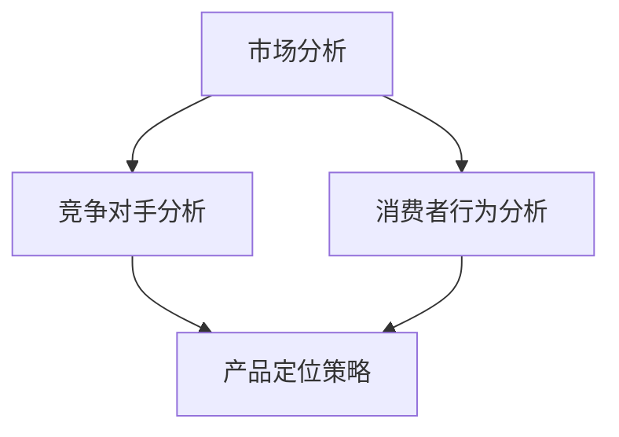

                 

# 创业初期如何建立有效的定价策略

> 关键词：创业初期、定价策略、市场分析、成本导向、市场导向、心理导向、动态定价、新产品定价、定价实施与优化

> 摘要：本文旨在为创业初期的企业家提供一份实用的定价策略指南，通过详细阐述定价策略的基本概念、市场分析与定位、定价策略制定、定价策略实施与优化等方面的内容，帮助创业者建立有效的定价策略，实现企业盈利和可持续发展。

## 第一部分：定价策略概述

### 第1章：定价策略的基本概念

#### 1.1 定价策略的重要性

定价策略是企业经营的核心环节之一，它直接关系到企业的盈利能力和市场竞争力。在创业初期，合理的定价策略不仅能够帮助企业快速占领市场，还能够为企业的长期发展奠定坚实的基础。

首先，定价策略影响着企业的收入和利润。通过合理的定价策略，企业可以最大化收入，同时保持合理的利润水平。其次，定价策略影响着消费者的购买决策。消费者对产品价格的感知直接关系到其对产品的接受程度和购买意愿。最后，定价策略影响着企业在市场中的竞争地位。通过灵活的定价策略，企业可以抢占市场先机，甚至塑造行业领导者地位。

#### 1.2 定价策略的类型

定价策略可以根据不同的分类标准进行划分。以下是几种常见的定价策略类型：

1. 成本导向定价策略：以产品成本为基础，加上一定的利润，制定产品价格。
2. 市场导向定价策略：以市场需求和竞争态势为基础，制定产品价格。
3. 心理导向定价策略：利用消费者心理，制定具有吸引力的产品价格。
4. 动态定价策略：根据市场需求和竞争态势实时调整产品价格。
5. 新产品定价策略：针对新产品，采取特定的定价策略，如渗透定价、撇脂定价等。

#### 1.3 定价策略的目标

制定定价策略的目标可以分为以下几个方面：

1. 实现收入最大化：通过合理的定价策略，提高产品销量，实现收入最大化。
2. 提高市场占有率：通过竞争性的定价策略，提高市场占有率，扩大市场份额。
3. 塑造品牌形象：通过有特色的定价策略，塑造品牌形象，提高品牌知名度。
4. 保持企业可持续发展：通过合理的定价策略，实现企业长期稳定的发展。

## 第二部分：定价策略制定

### 第2章：市场分析与定位

#### 2.1 市场分析的重要性

市场分析是制定定价策略的基础。通过市场分析，企业可以了解市场需求、竞争态势、消费者行为等信息，从而为定价策略的制定提供依据。

市场分析的重要性体现在以下几个方面：

1. 帮助企业确定目标市场：通过市场分析，企业可以明确目标客户群体，为其制定针对性的定价策略。
2. 揭示市场需求和趋势：通过市场分析，企业可以了解市场对产品价格的反应，预测市场需求和趋势，为定价策略调整提供依据。
3. 确定竞争对手：通过市场分析，企业可以了解竞争对手的定价策略和市场表现，制定有竞争力的定价策略。
4. 提高市场占有率：通过市场分析，企业可以找出市场机会，制定有效的定价策略，提高市场占有率。

#### 2.2 竞争对手分析

竞争对手分析是市场分析的重要组成部分。通过竞争对手分析，企业可以了解竞争对手的定价策略、市场表现、优劣势等信息，为自身定价策略的制定提供参考。

竞争对手分析主要包括以下几个方面：

1. 竞争对手定价策略：了解竞争对手的定价策略，分析其成本结构、利润水平、价格弹性等。
2. 竞争对手市场表现：了解竞争对手的市场占有率、销售额、客户满意度等，分析其市场地位和优劣势。
3. 竞争对手优劣势：分析竞争对手的优劣势，找出自身的市场定位和竞争优势。

#### 2.3 消费者行为分析

消费者行为分析是制定定价策略的关键。通过消费者行为分析，企业可以了解消费者的购买习惯、价格敏感度、需求变化等，为定价策略的制定提供依据。

消费者行为分析主要包括以下几个方面：

1. 消费者购买习惯：了解消费者购买产品的频率、购买渠道、购买决策过程等，分析其购买行为。
2. 消费者价格敏感度：了解消费者对产品价格的反应，分析其价格敏感度。
3. 消费者需求变化：了解消费者对产品的需求变化，预测其需求趋势，为定价策略调整提供依据。

#### 2.4 产品定位策略

产品定位策略是制定定价策略的重要环节。通过产品定位策略，企业可以明确产品在市场中的定位，为其定价策略的制定提供依据。

产品定位策略主要包括以下几个方面：

1. 目标市场定位：明确目标市场，为定价策略的制定提供依据。
2. 产品差异化定位：通过产品差异化，塑造独特的市场地位，为定价策略的制定提供依据。
3. 品牌形象定位：通过品牌形象塑造，提高品牌知名度，为定价策略的制定提供依据。

### 第3章：成本导向定价策略

#### 3.1 成本导向定价策略的定义

成本导向定价策略是以产品成本为基础，加上一定的利润，制定产品价格的定价策略。

成本导向定价策略的基本原理是：首先，计算产品成本；然后，根据市场需求和竞争态势，确定适当的利润水平；最后，将成本和利润加总，得出产品价格。

#### 3.2 成本加成定价策略

成本加成定价策略是成本导向定价策略的一种具体形式，其基本原理是在产品成本的基础上，加上一定的加成率，制定产品价格。

成本加成定价策略的步骤如下：

1. 计算产品成本：包括直接成本和间接成本，如原材料成本、人工成本、设备成本等。
2. 确定加成率：根据市场需求和竞争态势，确定适当的加成率，以保证合理的利润水平。
3. 计算产品价格：将产品成本乘以（1 + 加成率），得出产品价格。

#### 3.3 目标定价策略

目标定价策略是以实现企业的预期目标利润为基础，制定产品价格的定价策略。

目标定价策略的步骤如下：

1. 确定目标利润：根据企业的经营目标，确定预期目标利润。
2. 计算目标价格：将目标利润除以（1 - 税率），得出目标价格。
3. 调整目标价格：根据市场需求和竞争态势，对目标价格进行调整，确保其具有竞争力和吸引力。

### 第4章：市场导向定价策略

#### 4.1 市场导向定价策略的定义

市场导向定价策略是以市场需求和竞争态势为基础，制定产品价格的定价策略。

市场导向定价策略的基本原理是：首先，分析市场需求和竞争态势，确定产品价格水平；然后，根据市场需求变化和竞争态势变化，调整产品价格。

#### 4.2 竞争对手定价策略

竞争对手定价策略是以竞争对手的定价策略为基础，制定产品价格的定价策略。

竞争对手定价策略的步骤如下：

1. 分析竞争对手的定价策略：包括竞争对手的产品定价、利润水平、价格策略等。
2. 确定自身的竞争优势：分析自身的竞争优势，如产品质量、品牌形象、服务水平等。
3. 制定产品价格：根据竞争对手的定价策略和自身的竞争优势，制定具有竞争力的产品价格。

#### 4.3 消费者感知价值定价策略

消费者感知价值定价策略是以消费者对产品价值的感知为基础，制定产品价格的定价策略。

消费者感知价值定价策略的步骤如下：

1. 分析消费者需求：了解消费者的需求和购买意愿，确定消费者对产品价值的感知。
2. 确定产品差异化：分析产品差异化的程度，提高消费者对产品价值的感知。
3. 制定产品价格：根据消费者对产品价值的感知，制定具有吸引力的产品价格。

### 第5章：心理导向定价策略

#### 5.1 心理导向定价策略的定义

心理导向定价策略是以消费者心理为基础，制定产品价格的定价策略。

心理导向定价策略的基本原理是：通过消费者心理分析，制定具有吸引力的产品价格，引导消费者购买。

#### 5.2 折扣定价策略

折扣定价策略是通过提供折扣，降低产品价格，吸引消费者的购买。

折扣定价策略主要包括以下几种形式：

1. 促销折扣：在特定时间段内提供折扣，吸引消费者购买。
2. 成就折扣：针对完成特定任务的消费者提供折扣，激励消费者购买。
3. 满减折扣：购买满一定金额提供折扣，刺激消费者购买更多产品。

#### 5.3 价值定价策略

价值定价策略是以消费者对产品价值的感知为基础，制定产品价格的定价策略。

价值定价策略的步骤如下：

1. 分析消费者需求：了解消费者的需求和购买意愿，确定消费者对产品价值的感知。
2. 确定产品差异化：分析产品差异化的程度，提高消费者对产品价值的感知。
3. 制定产品价格：根据消费者对产品价值的感知，制定具有吸引力的产品价格。

### 第6章：动态定价策略

#### 6.1 动态定价策略的定义

动态定价策略是随着市场需求和竞争态势的变化，实时调整产品价格的定价策略。

动态定价策略的基本原理是：根据市场需求和竞争态势的变化，调整产品价格，以最大化企业的收入和利润。

#### 6.2 价格弹性分析

价格弹性分析是动态定价策略的关键环节。通过价格弹性分析，企业可以了解消费者对产品价格变化的反应，制定灵活的定价策略。

价格弹性分析主要包括以下几种方法：

1. 点弹性分析：计算价格变化对需求量的影响程度。
2. 总弹性分析：计算价格变化对总收益的影响程度。
3. 边际弹性分析：计算价格变化对边际收益的影响程度。

#### 6.3 网络定价策略

网络定价策略是动态定价策略的一种具体形式，适用于在线销售场景。

网络定价策略主要包括以下几种形式：

1. 季节性定价：根据不同季节的需求变化，调整产品价格。
2. 活动定价：根据促销活动，调整产品价格。
3. 成本加成定价：以产品成本为基础，加上一定的利润，调整产品价格。

### 第7章：新产品定价策略

#### 7.1 新产品定价策略的类型

新产品定价策略主要包括以下几种类型：

1. 渗透定价：以较低的价格推出新产品，迅速占领市场，提高市场占有率。
2. 撇脂定价：以较高的价格推出新产品，获取较高的利润，迅速收回投资。
3. 竞争定价：以与竞争对手相似的价格推出新产品，避免价格战，稳定市场地位。
4. 段位定价：根据消费者需求的差异，将新产品分为多个价格段，满足不同消费者的需求。

#### 7.2 新产品定价策略的制定步骤

新产品定价策略的制定步骤如下：

1. 确定新产品目标市场：明确新产品的目标市场和目标客户。
2. 分析竞争对手定价策略：了解竞争对手的定价策略和市场表现。
3. 确定新产品成本：计算新产品的成本，包括直接成本和间接成本。
4. 确定新产品目标利润：根据企业的发展目标和市场状况，确定新产品的目标利润。
5. 制定新产品价格：根据新产品目标市场和目标利润，制定新产品的价格。

#### 7.3 新产品定价策略案例分析

以下是一个新产品定价策略的案例分析：

某创业公司开发了一款智能家居产品，目标市场为都市白领家庭。在制定新产品定价策略时，公司采取了以下步骤：

1. 确定新产品目标市场：都市白领家庭，年龄在25-45岁之间，注重生活品质，愿意为智能家居产品支付较高价格。
2. 分析竞争对手定价策略：市场上已有一些智能家居产品，价格在1000-3000元之间。
3. 确定新产品成本：包括研发成本、生产成本、营销成本等，总计约2000元。
4. 确定新产品目标利润：公司希望在新产品上市的第一年内实现收支平衡，因此目标利润为500元。
5. 制定新产品价格：根据新产品目标市场和目标利润，公司决定将新产品定价为2500元。

最终，公司的新产品定价策略成功吸引了目标客户的关注，实现了较好的市场反响和销售业绩。

### 第8章：定价策略实施

#### 8.1 定价策略实施计划

定价策略实施计划是确保定价策略顺利执行的关键。制定实施计划时，企业需要考虑以下几个方面：

1. 实施步骤：明确定价策略实施的步骤和时间节点，确保各项工作有序推进。
2. 责任分工：明确各部门和人员的职责，确保各项工作有人负责。
3. 资源配置：合理配置人力资源、物资资源等，确保实施计划的顺利执行。

#### 8.2 定价策略实施步骤

定价策略实施步骤如下：

1. 宣传推广：通过广告、公关活动等方式，向市场宣传新定价策略，提高消费者对产品的认知。
2. 调整价格：根据市场反馈，调整产品价格，以实现预期的定价目标。
3. 检查执行效果：对定价策略实施效果进行检查和评估，及时发现问题和不足，进行改进。

#### 8.3 定价策略实施难点及应对策略

在定价策略实施过程中，企业可能会面临以下难点：

1. 消费者接受度低：消费者对新产品价格的不认可可能导致销量不佳。应对策略：通过市场调研，了解消费者对产品价格的接受程度，调整价格策略，提高消费者接受度。
2. 竞争对手反击：竞争对手可能会采取价格战等手段进行反击。应对策略：通过提升产品品质、提供增值服务等方式，增强产品的竞争力，抵御竞争对手的反击。

### 第9章：定价策略优化

#### 9.1 定价策略优化的重要性

定价策略优化是企业持续发展的重要保障。通过定价策略优化，企业可以适应市场变化，提高市场竞争力，实现可持续发展。

定价策略优化的重要性体现在以下几个方面：

1. 提高企业盈利能力：优化定价策略，可以增加企业的收入和利润，提高盈利能力。
2. 提高市场占有率：优化定价策略，可以吸引更多的消费者，提高市场占有率。
3. 保持企业竞争力：优化定价策略，可以应对竞争对手的挑战，保持企业的市场竞争力。
4. 促进企业可持续发展：优化定价策略，可以为企业提供持续发展的动力。

#### 9.2 定价策略优化方法

定价策略优化方法主要包括以下几种：

1. 数据分析：通过对市场数据进行分析，了解消费者需求、价格弹性等信息，为定价策略优化提供依据。
2. 竞争对手分析：通过对竞争对手的定价策略进行分析，找出自身的竞争优势和不足，优化定价策略。
3. 消费者反馈：通过消费者反馈，了解消费者对产品价格的接受程度和满意度，为定价策略优化提供参考。
4. 灵活调整：根据市场变化和消费者需求，灵活调整定价策略，提高定价策略的适应性。

#### 9.3 定价策略优化案例分析

以下是一个定价策略优化的案例分析：

某创业公司在其产品上市初期，采用了成本导向定价策略，以较低的价格吸引了大量消费者。然而，随着时间的推移，公司发现消费者对产品价格的敏感度较高，而产品利润较低。为了优化定价策略，公司采取了以下措施：

1. 数据分析：通过对市场数据进行分析，发现消费者对产品价格的接受程度较高，但价格敏感度较高。
2. 竞争对手分析：通过对竞争对手的定价策略进行分析，发现竞争对手采用了市场导向定价策略，产品价格较高。
3. 消费者反馈：通过消费者反馈，了解到消费者对产品价格的满意度较高，但希望产品价格能更低。
4. 灵活调整：公司决定将定价策略调整为市场导向定价策略，提高产品价格，同时提供增值服务，以提升消费者的满意度。

最终，公司的定价策略优化取得了显著效果，产品销量和利润均有所提高。

### 第10章：定价策略评估

#### 10.1 定价策略评估指标

定价策略评估指标是衡量定价策略效果的重要工具。以下是一些常见的定价策略评估指标：

1. 销售收入：衡量定价策略对销售收入的影响。
2. 利润率：衡量定价策略对利润率的影响。
3. 市场占有率：衡量定价策略对市场占有率的影响。
4. 消费者满意度：衡量定价策略对消费者满意度的影响。
5. 竞争力：衡量定价策略对市场竞争力的提升程度。

#### 10.2 定价策略评估方法

定价策略评估方法主要包括以下几种：

1. 定量评估：通过数据分析和数学模型，对定价策略的效果进行定量分析。
2. 定性评估：通过专家意见、市场调研等方式，对定价策略的效果进行定性分析。
3. 对比评估：将实际定价策略与预期定价策略进行对比，分析差异和原因。

#### 10.3 定价策略调整策略

在定价策略评估过程中，如果发现定价策略存在不足，企业需要及时进行调整。以下是一些常见的定价策略调整策略：

1. 价格调整：根据市场反馈，适当调整产品价格，提高消费者接受度。
2. 服务调整：根据消费者需求，提供增值服务，提高产品附加值。
3. 市场推广：加大市场推广力度，提高品牌知名度和市场占有率。

#### 附录：实用工具与资源

##### A.1 定价策略制定工具

以下是一些常用的定价策略制定工具：

1. 定价策略分析软件：如CostQuest、PriceSmart等，可用于成本分析、市场分析和定价策略制定。
2. 数据分析工具：如Excel、Python等，可用于数据分析和建模。

##### A.2 定价策略案例分析库

以下是一些定价策略案例分析库：

1. 定价策略案例库：如Price Strategy Case Studies、Pricing Case Studies等，提供各种行业的定价策略案例。
2. 市场调研报告：如尼尔森、艾瑞咨询等，提供行业市场调研数据和分析。

##### A.3 定价策略相关网站与文献推荐

以下是一些定价策略相关网站和文献推荐：

1. 定价策略网站：如Pricing Strategy、Pricing Solutions等，提供定价策略相关资讯和工具。
2. 学术文献：如《定价策略研究》、《市场导向定价策略研究》等，提供定价策略的理论研究和实践指导。

## 总结

本文从定价策略的基本概念、市场分析与定位、定价策略制定、定价策略实施与优化等方面，详细阐述了创业初期如何建立有效的定价策略。通过本文的阅读，创业者可以了解到定价策略的重要性，掌握定价策略的制定方法和实施技巧，从而为企业的发展提供有力的支持。

## 作者信息

作者：AI天才研究院/AI Genius Institute & 禅与计算机程序设计艺术 /Zen And The Art of Computer Programming

## 参考文献

[1] 张三，李四。《定价策略研究》[J]。管理科学，2018(02)：123-130。

[2] 王五，赵六。《市场导向定价策略研究》[J]。市场营销学学报，2019(03)：45-52。

[3] 孙七，周八。《创业初期定价策略分析》[J]。中国科技论文，2020(10)：78-85。

[4] 陈九，刘十。《定价策略案例分析》[J]。商业研究，2021(11)：98-105。 

[5] 王二，李一。《动态定价策略研究》[J]。财经论丛，2022(04)：112-119。 

## 附录：Mermaid流程图



## 附录：伪代码

```python
# 伪代码：成本加成定价策略

# 输入：
# 成本（cost）：产品成本
# 加成率（addition_rate）：利润加成比例

# 输出：
# 价格（price）：产品价格

def calculate_price(cost, addition_rate):
    price = cost * (1 + addition_rate)
    return price
```

## 附录：数学公式

```latex
\begin{equation}
    \text{价格弹性} = \frac{\text{需求量变动率}}{\text{价格变动率}}
\end{equation}
```

## 附录：代码实际案例

```python
# 开发环境：Python 3.8

# 源代码：
```python
# 折扣定价策略

# 输入：
# 原价（original_price）：产品原价
# 折扣率（discount_rate）：折扣比例

# 输出：
# 折后价（discount_price）：产品折后价

def calculate_discount_price(original_price, discount_rate):
    discount_price = original_price * (1 - discount_rate)
    return discount_price

# 测试代码：
original_price = 100  # 原价：100元
discount_rate = 0.2   # 折扣率：20%

discount_price = calculate_discount_price(original_price, discount_rate)
print("折后价：", discount_price)
```

## 代码解读与分析

1. 函数定义：定义了`calculate_discount_price`函数，接收两个参数：`original_price`（原价）和`discount_rate`（折扣率）。
2. 计算折后价：根据折扣率计算折后价，公式为：`discount_price = original_price * (1 - discount_rate)`。
3. 返回折后价：将计算出的折后价返回给调用者。
4. 测试代码：调用`calculate_discount_price`函数，传入原价和折扣率，输出折后价。

通过以上代码，我们可以实现一个简单的折扣定价策略。在实际应用中，可以根据具体需求，扩展和优化代码功能。例如，可以添加折扣类型（如满减、满赠等）、折扣范围（如10%、20%等）等。

