                 

### 第1章：市场定位的基本概念

#### 1.1 市场定位的定义与重要性

市场定位是指企业根据其产品和服务的特点，在目标市场中找到一个独特的位置，以区别于其他竞争者，从而满足特定消费者群体的需求。市场定位的核心目标是明确企业在市场中的差异化优势，并通过有效的营销手段将这一优势传达给消费者。

市场定位的重要性体现在多个方面。首先，市场定位有助于企业明确其市场目标，从而在资源分配和战略规划上做到有的放矢。其次，有效的市场定位可以帮助企业建立品牌认知度和忠诚度，提升市场竞争力和盈利能力。最后，市场定位是企业制定营销策略的基础，决定了产品定价、渠道选择和推广手段的决策方向。

让我们用 Mermaid 流程图来展示市场定位的核心概念与联系：

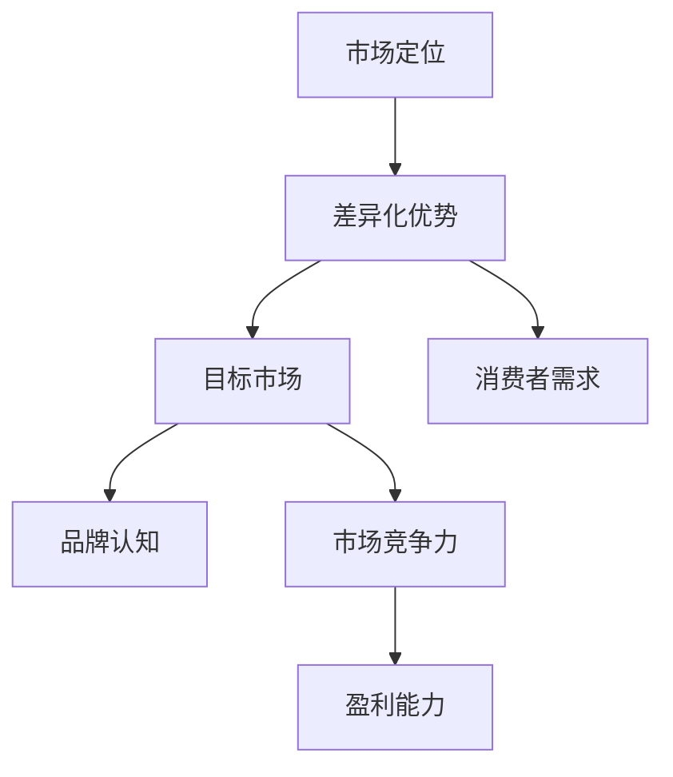

在市场定位过程中，差异化优势、目标市场、消费者需求、品牌认知和市场竞争力是关键的元素。这些元素相互关联，共同构成了市场定位的理论基础。

#### 1.2 市场细分策略

市场细分是指将整个市场划分为若干个具有相似需求和特征的子市场。市场细分策略是市场定位的基础步骤之一，其目的是为了更精准地满足不同消费者的需求，提高市场渗透率和客户满意度。

常用的市场细分标准包括以下几种：

1. **地理细分**：根据消费者所在的地理位置来划分市场，如城市市场、农村市场、国际市场等。
2. **人口细分**：根据人口统计特征，如年龄、性别、收入、职业等来划分市场。
3. **行为细分**：根据消费者的行为特征，如购买习惯、使用频率、忠诚度等来划分市场。
4. **心理细分**：根据消费者的心理特征，如生活方式、个性、价值观等来划分市场。

市场细分策略的实施步骤如下：

1. **确定市场细分标准**：根据企业的产品特点和目标市场，选择合适的细分标准。
2. **收集和分析数据**：收集关于目标市场的各种数据，包括人口统计、消费行为、心理特征等。
3. **划分子市场**：根据收集到的数据，将市场划分为不同的子市场。
4. **评估子市场吸引力**：对各个子市场进行评估，选择最具吸引力和最适合企业发展的子市场。

#### 1.3 市场定位的目标与原则

市场定位的目标可以分为短期目标和长期目标。短期目标主要包括提高市场知名度、增加市场份额和提升品牌认知度。长期目标则关注企业的可持续发展和市场领导地位的巩固。

为了实现市场定位的目标，企业需要遵循以下基本原则：

1. **明确目标市场**：确定企业的目标市场，并深入了解其需求和行为特征。
2. **差异化定位**：通过产品或服务的差异化，在市场中找到一个独特的位置，以区别于竞争对手。
3. **品牌一致性**：确保企业品牌形象和定位的一致性，建立品牌认知和忠诚度。
4. **灵活调整**：根据市场环境和竞争态势的变化，及时调整市场定位策略，保持竞争优势。

以下是一个简单的 Mermaid 流程图，展示了市场定位的基本原则：

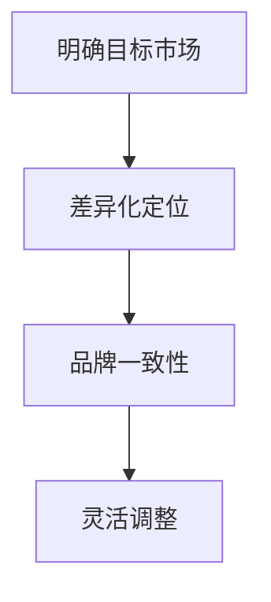

通过明确目标市场、差异化定位、品牌一致性和灵活调整，企业可以有效地实现市场定位的目标。

### 第2章：竞争对手分析

#### 2.1 竞争对手识别与评估

在市场竞争中，识别和评估竞争对手是企业成功定位的重要步骤。首先，企业需要明确谁是主要竞争对手。竞争对手可以是直接生产或销售同类产品或服务的公司，也可以是在目标市场中具有相似市场地位的其他企业。

识别竞争对手的方法包括：

1. **市场调研**：通过市场调研了解市场上的主要参与者，分析他们的产品特点、市场份额和营销策略。
2. **社交媒体分析**：利用社交媒体平台监测竞争对手的动态，了解他们的营销活动和用户反馈。
3. **行业报告**：参考行业报告和数据分析，了解市场格局和竞争对手的情况。

确定了竞争对手后，企业需要对竞争对手进行评估。评估指标包括市场份额、品牌知名度、产品特性、价格策略、渠道布局等。以下是一个简化的 Mermaid 流程图，展示了识别和评估竞争对手的过程：

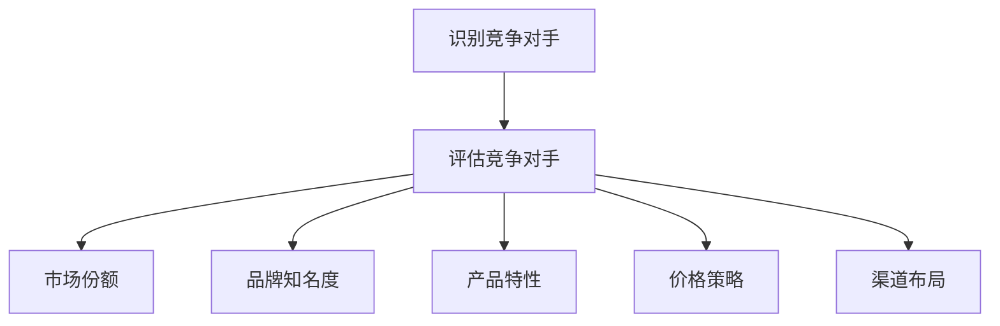

通过全面评估竞争对手，企业可以了解自己在市场中的位置，发现自身的优势和劣势，并制定相应的竞争策略。

#### 2.2 竞争态势分析

竞争态势分析是指对市场中的竞争环境进行全面、系统的分析。这包括了解市场结构、竞争者行为、消费者需求和市场变化等因素。

1. **市场结构**：分析市场的规模、增长率、市场集中度等指标，了解市场的整体状况。
2. **竞争者行为**：观察竞争对手的市场策略、产品定价、渠道选择和营销活动，分析他们的行为特征和趋势。
3. **消费者需求**：了解目标消费者的需求特征、购买行为和偏好，分析他们的需求和满意度。
4. **市场变化**：监测市场环境的变化，包括政策、经济环境、技术进步等，评估这些变化对企业竞争态势的影响。

以下是一个简化的 Mermaid 流程图，展示了竞争态势分析的关键要素：

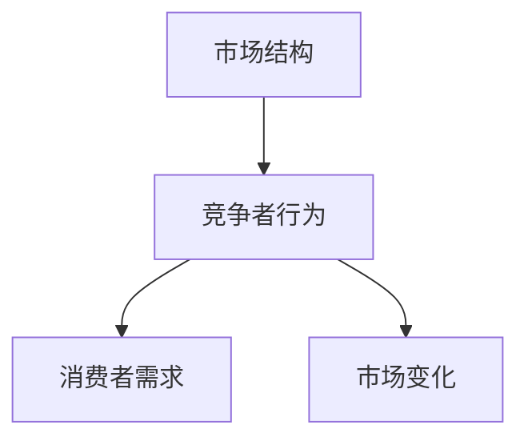

通过竞争态势分析，企业可以更准确地把握市场动态，发现市场机会和潜在风险，从而制定出更有效的市场定位策略。

#### 2.3 竞争策略制定

在明确了竞争对手和竞争态势后，企业需要制定有效的竞争策略。竞争策略的制定步骤如下：

1. **确定竞争目标**：根据企业的市场定位和长期发展目标，明确竞争的具体目标，如市场份额、品牌影响力、利润水平等。
2. **分析竞争优势**：评估企业在产品、技术、品牌、渠道等方面的优势，找出可以用来对抗竞争对手的优势点。
3. **制定差异化策略**：通过差异化策略在市场中找到一个独特的位置，与竞争对手区别开来。差异化策略可以包括产品特性、价格策略、服务质量和营销手段等。
4. **实施与监控**：将竞争策略具体化，制定详细的执行计划，并持续监控策略的实施效果，及时调整策略。

以下是一个简化的 Mermaid 流程图，展示了竞争策略制定的步骤：

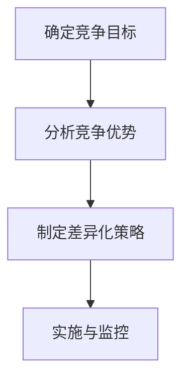

通过科学制定和实施竞争策略，企业可以在激烈的市场竞争中保持优势，实现长期发展目标。

### 第3章：目标市场选择

#### 3.1 目标市场定义

目标市场是指企业选择并致力于满足其需求、特征和行为特征的消费者群体。明确目标市场是企业成功进行市场定位的第一步。目标市场定义的过程包括以下几个关键步骤：

1. **识别潜在客户**：通过市场调研和数据分析，识别出潜在的目标客户群体，包括他们的基本特征、需求和行为模式。
2. **分析客户特征**：对潜在客户进行详细分析，包括年龄、性别、收入水平、职业、教育程度等，以便更好地理解他们的需求和行为。
3. **确定目标市场**：根据客户特征分析结果，确定最符合企业产品或服务定位的目标市场，并对其进行界定和描述。

在目标市场定义的过程中，企业需要明确以下几个问题：

- 目标市场的规模和增长潜力如何？
- 目标市场的购买力如何？
- 目标市场的竞争状况如何？
- 目标市场的消费者需求特征是什么？

以下是一个简化的 Mermaid 流程图，展示了目标市场定义的过程：

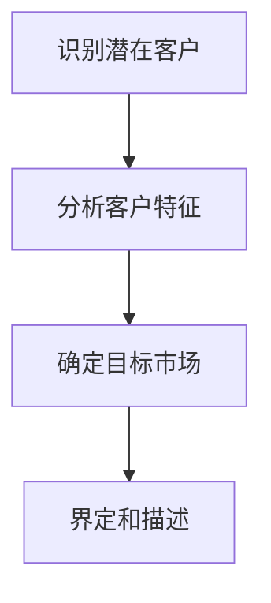

通过明确目标市场，企业可以集中资源，更有效地满足目标客户的需求，提高市场竞争力。

#### 3.2 目标市场分析

目标市场分析是企业在确定目标市场后，对其市场特征和需求进行深入分析和评估的过程。目标市场分析的关键步骤包括以下几个方面：

1. **市场细分**：根据客户特征和需求，将目标市场细分为若干个子市场，以便更精确地满足不同客户群体的需求。
2. **市场容量**：估算目标市场的整体规模和潜在增长率，以便评估市场的吸引力。
3. **市场定位**：根据目标市场的特点，确定企业在市场中的定位和差异化策略。
4. **竞争分析**：分析目标市场中的主要竞争对手，了解他们的市场策略、产品特性和市场份额。
5. **客户需求**：深入了解目标市场消费者的需求特征、购买习惯和偏好。

以下是一个简化的 Mermaid 流程图，展示了目标市场分析的过程：

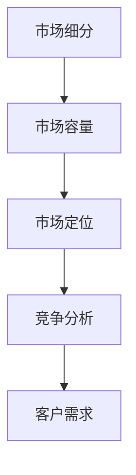

通过目标市场分析，企业可以更好地理解市场环境和客户需求，制定出更精准的市场定位策略。

#### 3.3 目标市场策略

在确定了目标市场并进行了详细分析后，企业需要制定相应的市场策略，以有效进入和占领目标市场。目标市场策略通常包括以下几个方面：

1. **市场进入策略**：根据企业的资源和目标市场的特点，选择合适的进入模式，如直接进入、间接进入或合资经营等。
2. **市场渗透策略**：通过增加市场份额，提高品牌认知度和客户满意度，巩固企业在目标市场中的地位。
3. **市场开发策略**：探索新的市场机会，开拓新的销售渠道，扩大目标市场的覆盖范围。
4. **市场维护策略**：通过有效的客户关系管理和持续的产品改进，保持现有市场的稳定和增长。

以下是一个简化的 Mermaid 流程图，展示了目标市场策略的实施过程：

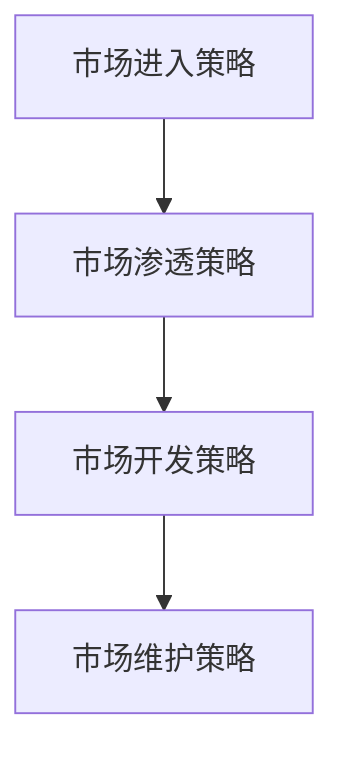

通过科学制定和实施目标市场策略，企业可以有效地进入和占领目标市场，实现长期发展目标。

### 第4章：产品定位策略

#### 4.1 产品特性分析

产品定位策略的核心在于分析产品的独特卖点（USP），即产品区别于竞争对手的独特之处。这一分析过程包括以下几个方面：

1. **功能特性**：评估产品的基本功能，包括核心技术、性能指标、操作便捷性等。
2. **设计特点**：分析产品的外观设计、用户体验、材质等，确保产品在视觉和触觉上具有吸引力。
3. **技术创新**：评估产品在技术上的创新点，如新材料、新工艺、新功能等。
4. **成本优势**：分析产品的成本构成，确保在提供优质产品的同时，具备价格竞争力。

以下是一个简化的 Mermaid 流程图，展示了产品特性分析的过程：

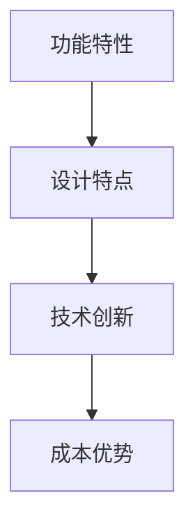

通过详细的产品特性分析，企业可以明确产品的独特卖点，为市场定位提供有力支持。

#### 4.2 品牌定位策略

品牌定位策略是指企业在消费者心中建立品牌形象和认知的过程。成功的品牌定位可以增强消费者对品牌的信任和忠诚度，提高品牌的市场竞争力。品牌定位策略包括以下几个关键步骤：

1. **品牌价值定位**：明确品牌的核心价值和主张，确保品牌形象与目标市场相符。
2. **品牌个性塑造**：通过品牌故事、视觉元素、文化背景等手段，塑造品牌独特的个性特征。
3. **品牌传播策略**：制定有效的品牌传播计划，通过多种渠道传递品牌信息，提高品牌知名度。
4. **品牌维护**：持续关注消费者反馈，及时调整品牌策略，保持品牌形象的一致性和活力。

以下是一个简化的 Mermaid 流程图，展示了品牌定位策略的实施过程：

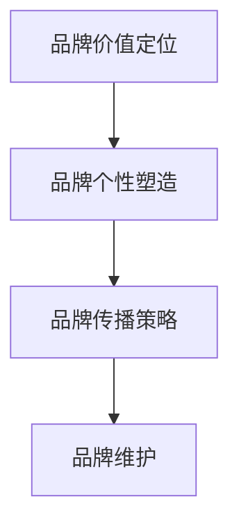

通过系统实施品牌定位策略，企业可以在消费者心中建立鲜明的品牌形象，提升品牌的市场地位。

#### 4.3 产品生命周期定位

产品生命周期定位是指根据产品在市场中的不同阶段，制定相应的市场策略，以实现最佳的市场效益。产品生命周期通常包括引入期、成长期、成熟期和衰退期四个阶段。

1. **引入期**：在产品刚进入市场时，企业需要重点宣传产品的特点和优势，吸引消费者尝试购买。
2. **成长期**：在产品逐渐被市场接受后，企业需要加大营销力度，提高市场份额，扩大销售渠道。
3. **成熟期**：在产品市场份额稳定后，企业可以通过优化产品性能、降低成本、提供增值服务等方式，维持市场份额。
4. **衰退期**：在产品市场需求下降时，企业可以采取降价促销、产品创新或退出市场等措施，减少损失。

以下是一个简化的 Mermaid 流程图，展示了产品生命周期定位的策略：

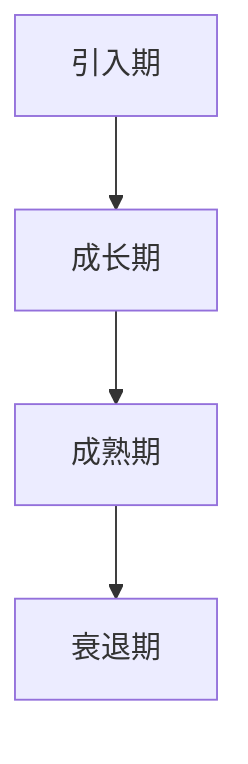

通过科学的产品生命周期定位，企业可以更好地应对市场变化，延长产品的市场生命周期。

### 第5章：市场进入策略

#### 5.1 市场进入模式

市场进入模式是指企业在新市场中开展业务的方式。选择合适的进入模式对于企业成功开拓市场至关重要。市场进入模式主要包括以下几种：

1. **直接进入**：企业直接投资新建生产线或收购现有企业，快速进入目标市场。
2. **间接进入**：企业通过与当地企业合作，借助合作伙伴的网络和资源进入市场。
3. **合资经营**：企业与当地企业共同投资，共同经营，共享市场收益。
4. **并购**：企业通过收购目标市场中的企业，迅速获得市场份额和品牌资源。

以下是一个简化的 Mermaid 流程图，展示了市场进入模式的分类：

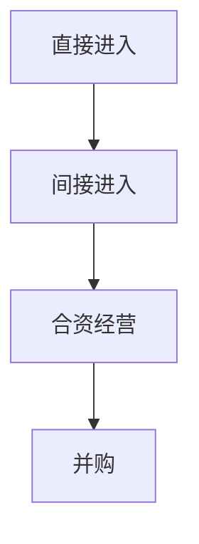

通过选择合适的市场进入模式，企业可以快速、有效地进入目标市场，减少进入成本和风险。

#### 5.2 市场推广策略

市场推广策略是企业通过一系列营销活动，提高品牌知名度、吸引潜在客户并促进销售的过程。市场推广策略包括以下几个关键方面：

1. **广告宣传**：通过电视、广播、网络、杂志等媒体渠道，进行品牌和产品的宣传。
2. **公关活动**：组织新闻发布会、产品发布会、赞助活动等，提升品牌形象。
3. **促销活动**：开展打折、赠送礼品、限时优惠等活动，刺激消费者购买。
4. **口碑营销**：通过用户推荐、社交媒体传播等方式，建立良好的口碑效应。

以下是一个简化的 Mermaid 流程图，展示了市场推广策略的实施步骤：

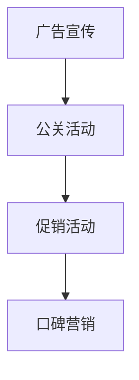

通过科学制定和实施市场推广策略，企业可以迅速提高品牌知名度，吸引更多潜在客户。

#### 5.3 市场反馈与调整

市场反馈是指企业从市场中收集到的关于产品、服务、营销策略等方面的信息。市场反馈对于企业调整市场定位策略至关重要。以下是在市场定位过程中进行市场反馈与调整的步骤：

1. **数据收集**：通过调查问卷、在线评论、社交媒体监测等方式，收集消费者和市场对产品的反馈。
2. **数据分析**：对收集到的数据进行分析，识别市场趋势和消费者需求变化。
3. **策略调整**：根据分析结果，对市场定位策略进行优化和调整，以更好地满足市场需求。
4. **持续监控**：定期收集和分析市场反馈，确保市场定位策略的持续优化。

以下是一个简化的 Mermaid 流程图，展示了市场反馈与调整的过程：

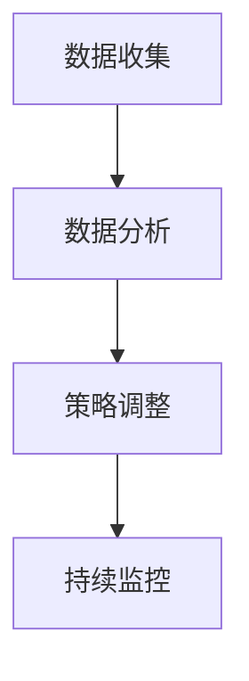

通过及时有效的市场反馈与调整，企业可以保持市场定位的灵活性和有效性。

### 第6章：市场定位评估与优化

#### 6.1 市场定位评估指标

市场定位评估是确保企业市场策略有效性的关键步骤。通过设定和跟踪一系列评估指标，企业可以全面了解市场定位的效果，并及时进行调整。以下是一些常用的市场定位评估指标：

1. **市场份额**：企业在市场中所占的份额，是衡量市场定位效果的重要指标。
2. **品牌知名度**：消费者对品牌的认知程度，可以通过市场调查和社交媒体监测来评估。
3. **客户满意度**：客户对企业产品和服务的满意程度，通过客户反馈和满意度调查来衡量。
4. **销售增长率**：企业在一定时期内的销售额增长情况，反映了市场定位策略的效果。
5. **利润率**：企业从市场中获得的利润水平，是市场定位成功的重要标志。

以下是一个简化的 Mermaid 流程图，展示了市场定位评估指标：

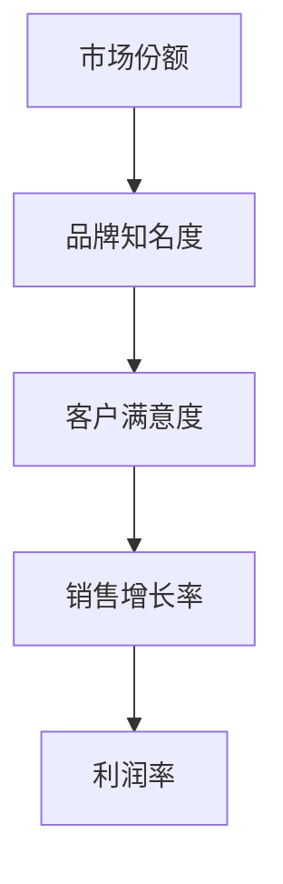

通过设定和跟踪这些指标，企业可以全面了解市场定位的效果，确保策略的有效性。

#### 6.2 定位优化的方法

市场定位优化是提高市场定位效果的关键步骤。以下是一些常用的定位优化方法：

1. **SWOT分析**：通过分析企业的优势、劣势、机会和威胁，制定针对性的优化策略。
2. **竞争分析**：分析竞争对手的市场定位策略，寻找自身的差异化和竞争优势。
3. **市场调研**：通过调查消费者需求和市场趋势，调整市场定位策略以更好地满足市场需求。
4. **数据分析**：利用大数据和数据分析技术，对市场定位效果进行量化评估，找到优化的方向。

以下是一个简化的 Mermaid 流程图，展示了定位优化的方法：

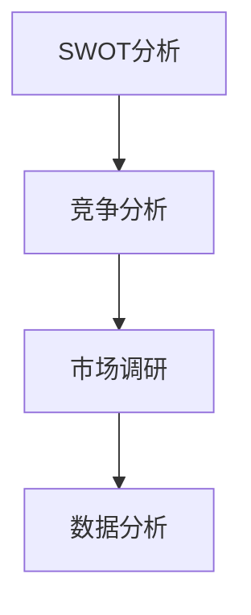

通过系统实施这些优化方法，企业可以不断提高市场定位的效果。

#### 6.3 案例分析：成功与失败的定位策略

市场定位的成功与失败案例可以帮助我们更好地理解和应用市场定位策略。以下是一些成功和失败的案例及其经验教训：

**成功案例：**

- **苹果公司**：通过创新的产品设计和卓越的用户体验，成功将品牌定位为高端科技产品代表，树立了强大的品牌形象。
- **小米公司**：通过“性价比”策略，成功进入大众市场，迅速提升了市场份额和品牌知名度。

**失败案例：**

- **诺基亚**：未能及时调整市场定位策略，忽视了智能手机市场的发展趋势，导致市场份额大幅下降。
- **柯达公司**：未能适应数码相机市场的变化，坚持传统胶卷业务，最终被市场淘汰。

以下是一个简化的 Mermaid 流程图，展示了案例分析的过程：

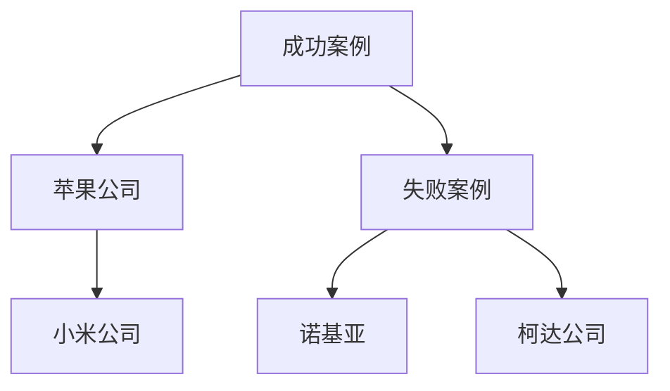

通过分析这些成功与失败的案例，我们可以汲取经验教训，为企业的市场定位提供有益的参考。

### 第7章：市场定位的挑战与应对策略

#### 7.1 挑战与风险分析

市场定位过程中，企业可能会面临多种挑战和风险。以下是一些常见的问题及其潜在影响：

1. **竞争压力**：竞争对手的数量和实力可能对企业市场定位策略构成威胁。
2. **市场变化**：市场需求和竞争态势的快速变化可能使企业的定位策略失去效力。
3. **资源限制**：企业可能因资源不足而难以实施有效的市场定位策略。
4. **法律和政策风险**：政策法规的变化可能对企业市场定位策略产生重大影响。

以下是一个简化的 Mermaid 流程图，展示了市场定位过程中可能面临的挑战：

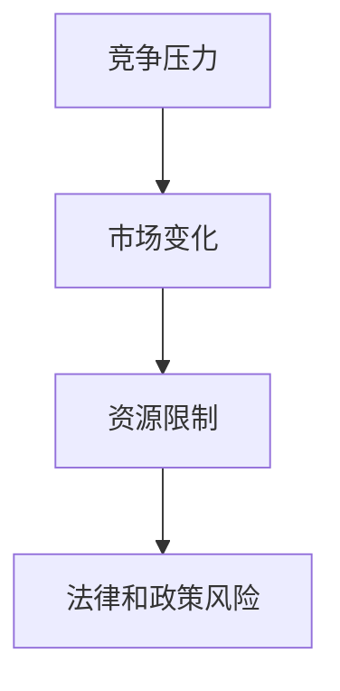

通过识别和分析这些挑战，企业可以提前制定应对策略，降低风险。

#### 7.2 应对策略与解决方案

为了应对市场定位过程中可能遇到的挑战，企业需要制定相应的应对策略和解决方案。以下是一些常见的策略：

1. **多元化策略**：通过开发多样化的产品或服务，分散市场风险。
2. **灵活调整**：根据市场变化和竞争态势，及时调整市场定位策略。
3. **资源整合**：通过内部资源优化和外部合作，提升企业的资源利用效率。
4. **法律合规**：密切关注政策法规变化，确保企业的市场定位策略符合法律法规。

以下是一个简化的 Mermaid 流程图，展示了应对策略的框架：

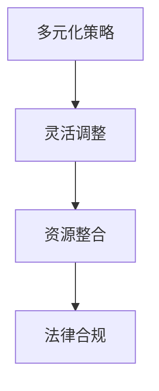

通过科学制定和实施应对策略，企业可以更好地应对市场定位过程中的挑战。

### 附录A：市场定位工具与资源

为了帮助企业更好地实施市场定位策略，以下介绍一些常用的市场定位工具和资源。

#### A.1 市场定位工具概览

1. **SWOT分析工具**：SWOT分析是一种常用的战略规划工具，用于评估企业的优势、劣势、机会和威胁。多种在线和离线工具可供选择，如SWOT Matrix、SWOT分析模板等。
2. **市场调研工具**：市场调研工具用于收集和分析市场数据，如问卷调查、焦点小组、在线调查等。常见工具包括SurveyMonkey、Qualtrics等。
3. **竞争对手分析工具**：这些工具帮助分析竞争对手的市场策略、产品特性和市场份额。例如，Ahrefs、SimilarWeb等。

#### A.2 资源推荐

1. **市场定位书籍**：《蓝海战略》、《定位》等经典著作提供了丰富的市场定位理论和实践指导。
2. **市场定位教程**：在线教育平台（如Coursera、Udemy）提供了丰富的市场定位课程和教程。
3. **市场研究报告**：行业报告和分析报告（如Gartner、Forrester等）提供了行业趋势和市场洞察。

#### A.3 实战案例

1. **案例分析**：企业可以通过研究成功和失败的市场定位案例，学习实践经验。例如，通过分析苹果、小米等公司的市场定位策略。
2. **伪代码示例**：以下是一个简化的市场定位策略的伪代码示例，展示如何使用SWOT分析进行市场定位。

```python
# 市场定位策略伪代码

# 步骤1：进行SWOT分析
strengths = ["创新技术", "高品质产品", "强大品牌"]
weaknesses = ["市场进入成本高", "渠道拓展困难"]
opportunities = ["新兴市场机会", "技术进步带来的创新点"]
threats = ["激烈的市场竞争", "政策法规变化"]

# 步骤2：根据SWOT分析结果制定市场定位策略
market_positioning_strategy = {
    "value proposition": "提供创新技术和高品质产品，满足消费者需求",
    "target market": "高端市场和中端市场",
    "differentiation": "技术创新和品牌影响力",
    "risk management": "多元化产品和市场进入策略"
}

# 步骤3：实施市场定位策略
# ...

# 步骤4：监控市场定位效果并调整策略
# ...

```

通过以上工具和资源的支持，企业可以更好地实施市场定位策略，提高市场竞争力。

### 文章摘要

本文从市场定位的基础概念出发，详细阐述了市场细分策略、竞争对手分析、目标市场选择、产品定位策略、市场进入策略以及市场定位评估与优化等方面的内容。通过结合实际案例和伪代码示例，本文提供了全面的市场定位策略指南，帮助企业在竞争激烈的市场环境中找到正确的定位，实现持续发展和成功。关键词：市场定位、市场细分、竞争对手分析、目标市场、产品定位、市场进入策略。摘要：本文系统地介绍了市场定位策略，从理论到实践，提供了全面、详细的指导，旨在帮助企业实现精准的市场定位，提升市场竞争力和盈利能力。

