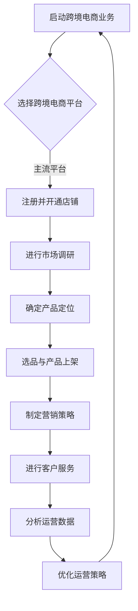

                 

## 《创业路上的跨境电商：开拓国际市场的实用技巧和注意事项》

### 文章关键词
- 跨境电商
- 国际市场
- 实用技巧
- 注意事项
- 营销策略
- 法律风险
- 数据分析

### 文章摘要
本文旨在为创业者提供一份详细的跨境电商指南，涵盖了从基础到实战，再到新兴领域的全方位知识。我们将探讨跨境电商的基本概念、主流平台和工具，物流和仓储策略，营销方法，风险管理，以及最新的技术趋势。通过深入分析市场调研、运营策略和案例分析，读者将获得宝贵的实战经验和实用的操作技巧，为在激烈的国际市场中成功开拓业务做好准备。

---

### 第一部分：跨境电商基础篇

在进入跨境电商的广阔天地之前，我们需要先了解其基础概念和运作模式。本部分将帮助您搭建跨境电商的基本框架，为后续的深入探索奠定基础。

#### 第1章：跨境电商概述

##### 1.1 跨境电商的定义与背景
跨境电商是指在不同国家和地区之间进行的电子商务活动。随着互联网技术的发展和全球化的加深，跨境电商逐渐成为国际贸易的重要组成部分。其背景可以追溯到20世纪90年代，随着互联网普及，电子商务开始兴起，并迅速在全球范围内扩展。

##### 1.2 跨境电商的发展现状与趋势
当前，跨境电商已经成为全球电子商务市场的一个重要分支。随着全球化进程的加快和消费者购买力的提升，跨境电商市场呈现出高速增长的态势。预测未来，跨境电商将继续保持增长，并在全球贸易中扮演更加重要的角色。

##### 1.3 跨境电商的模式与分类
跨境电商模式可以分为B2B（企业对企业）、B2C（企业对消费者）和C2C（消费者对消费者）三种。根据经营方式的不同，还可以分为直接模式和间接模式。了解这些模式有助于选择合适的经营策略。

#### 第2章：跨境电商平台与工具

##### 2.1 主流跨境电商平台介绍
目前市场上主流的跨境电商平台有亚马逊、eBay、阿里巴巴、Shopify等。每种平台都有其独特的优势，适合不同类型的商家。本文将详细介绍这些平台的特点，帮助您选择最合适的平台。

##### 2.2 跨境电商工具的选择与应用
跨境电商工具包括翻译工具、支付工具、物流工具等。选择合适的工具可以提高运营效率，降低成本。本文将介绍一些常用的跨境电商工具，并分析其应用场景。

##### 2.3 跨境电商支付解决方案
跨境支付是跨境电商的重要组成部分。本文将探讨跨境支付的方式、选择支付服务商的标准以及如何处理跨境支付中的风险。

#### 第3章：跨境电商物流与仓储

##### 3.1 跨境电商物流模式与策略
跨境电商物流包括国际快递、海外仓储、国际铁路等模式。了解不同物流模式的特点和适用场景，有助于制定有效的物流策略。

##### 3.2 跨境电商仓储管理
仓储管理是跨境电商运营的关键环节。本文将讨论如何选择仓储地点、优化仓储流程以及处理仓储中的常见问题。

##### 3.3 国际物流供应链优化
国际物流供应链的优化是提高跨境电商竞争力的重要手段。本文将介绍供应链优化的方法和工具，帮助商家降低物流成本，提高效率。

#### 第4章：跨境电商营销策略

##### 4.1 社交媒体营销在跨境电商中的应用
社交媒体营销是跨境电商不可或缺的一环。本文将分析社交媒体平台的特点，探讨如何利用社交媒体平台进行跨境电商营销。

##### 4.2 搜索引擎优化与广告推广
搜索引擎优化（SEO）和搜索引擎营销（SEM）是提高跨境电商网站流量和转化率的关键手段。本文将详细介绍SEO和SEM的策略和技巧。

##### 4.3 跨境电商的促销与活动策划
促销活动是吸引消费者、提高销售额的重要手段。本文将讨论如何策划有效的促销活动，包括优惠券、限时折扣、会员日等。

#### 第5章：跨境电商风险管理

##### 5.1 跨境电商法律风险防范
法律风险是跨境电商面临的一大挑战。本文将介绍跨境电商相关的法律法规，帮助商家防范法律风险。

##### 5.2 跨境电商税务风险应对
税务风险是跨境电商商家需要重视的问题。本文将分析跨境税务政策，提供税务风险应对策略。

##### 5.3 跨境电商信用管理
信用管理是跨境电商运营的基础。本文将探讨如何建立和维护良好的信用体系，提高消费者信任度。

### 第二部分：跨境电商实战篇

在了解了跨境电商的基础知识后，本部分将深入探讨跨境电商的实战技巧和策略，帮助您在实际运营中取得成功。

#### 第6章：产品定位与市场调研

##### 6.1 产品定位策略
产品定位是跨境电商成功的关键。本文将介绍产品定位的策略和方法，帮助您找到最适合的市场细分。

##### 6.2 市场调研方法与工具
市场调研是制定产品定位策略的重要环节。本文将介绍市场调研的方法和工具，帮助您获取准确的市场信息。

##### 6.3 跨境电商选品技巧
选品是跨境电商运营的核心。本文将分析如何选择畅销产品，如何避免库存风险，以及如何根据市场需求调整产品策略。

#### 第7章：跨境电商运营策略

##### 7.1 跨境电商运营流程
了解跨境电商运营流程有助于提高运营效率。本文将详细介绍跨境电商的运营流程，包括店铺管理、订单处理、售后服务等。

##### 7.2 店铺装修与页面优化
店铺装修和页面优化是提高转化率的关键。本文将介绍如何设计吸引人的店铺界面，如何优化产品页面，以提高用户体验。

##### 7.3 客户服务与售后管理
良好的客户服务是跨境电商成功的重要因素。本文将探讨如何提供优质的客户服务，如何处理售后问题，以及如何建立客户忠诚度。

#### 第8章：跨境电商数据分析与应用

##### 8.1 数据分析在跨境电商中的作用
数据分析是跨境电商运营的重要工具。本文将介绍数据分析在跨境电商中的作用，包括市场分析、产品分析、营销分析等。

##### 8.2 跨境电商数据分析工具介绍
了解和分析跨境电商数据需要使用合适的工具。本文将介绍一些常用的数据分析工具，如Google Analytics、Tableau等。

##### 8.3 数据驱动的营销与运营策略
数据驱动的营销与运营策略是提高跨境电商竞争力的关键。本文将探讨如何利用数据分析优化营销策略和运营流程。

#### 第9章：跨境电商案例分析

##### 9.1 成功案例分析
通过分析成功案例，可以学习到宝贵的经验和技巧。本文将介绍一些跨境电商的成功案例，分析其成功的原因和关键因素。

##### 9.2 失败案例分析
失败案例分析可以帮助避免重复错误。本文将介绍一些跨境电商的失败案例，分析其失败的原因和教训。

##### 9.3 从案例中学习跨境电商运营技巧
通过案例学习，可以更好地理解和应用跨境电商运营策略。本文将总结案例中的运营技巧，提供实用的建议。

### 第三部分：跨境电商新兴领域篇

随着技术的发展，跨境电商也在不断演进。本部分将探讨一些新兴领域，帮助您把握未来趋势。

#### 第10章：跨境电商与跨境电商联盟

##### 10.1 跨境电商联盟的概念与优势
跨境电商联盟是一种合作模式，通过资源整合和共享，提高竞争力。本文将介绍跨境电商联盟的概念和优势。

##### 10.2 跨境电商联盟的运营模式
了解跨境电商联盟的运营模式有助于更好地参与联盟。本文将分析跨境电商联盟的运营模式和成功案例。

##### 10.3 跨境电商联盟的发展趋势
预测未来，跨境电商联盟将继续发展，并呈现新的趋势。本文将探讨跨境电商联盟的发展趋势和机遇。

#### 第11章：跨境电商与区块链技术

##### 11.1 区块链技术在跨境电商中的应用
区块链技术在跨境电商中具有广泛的应用前景。本文将介绍区块链技术在跨境电商中的应用场景。

##### 11.2 跨境电商与区块链的结合点
探讨跨境电商与区块链技术的结合点，有助于理解其价值。本文将分析跨境电商与区块链技术的结合点。

##### 11.3 区块链在跨境支付与结算中的作用
区块链在跨境支付与结算中具有重要作用。本文将探讨区块链在跨境支付与结算中的作用和优势。

#### 第12章：跨境电商的未来发展趋势

##### 12.1 全球化背景下的跨境电商发展
全球化背景下的跨境电商发展具有新的机遇和挑战。本文将探讨全球化对跨境电商的影响和发展趋势。

##### 12.2 技术创新对跨境电商的影响
技术创新是跨境电商发展的重要驱动力。本文将分析技术创新对跨境电商的影响，包括人工智能、大数据等。

##### 12.3 跨境电商的未来趋势与挑战
预测未来，跨境电商将继续发展，但也面临诸多挑战。本文将探讨跨境电商的未来趋势和面临的挑战。

### 附录

#### 附录 A：跨境电商资源与工具汇总
- A.1 跨境电商平台大全
  - 亚马逊
  - eBay
  - 阿里巴巴
  - Shopify
  - Wish
  - Etsy
- A.2 跨境电商工具推荐
  - 翻译工具：Google Translate、DeepL
  - 支付工具：PayPal、Alipay、微信支付
  - 物流工具：DHL、UPS、FedEx、SF Express
- A.3 跨境电商相关网站与论坛
  - Amazon Seller Central
  - eBay for Business
  - Alibaba Group
  - Shopify Academy
  -跨境电商论坛：跨境电商之路、跨境电商圈
- A.4 跨境电商相关书籍与资料
  - 《跨境电商实战攻略》
  - 《跨境电商营销手册》
  - 《跨境电商物流管理》
  - 《跨境电商法律风险防范》

#### 附录 B：跨境电商法律法规汇总
- B.1 中国跨境电商法律法规
  - 《中华人民共和国电子商务法》
  - 《网络交易管理办法》
  - 《跨境电子商务综合试验区管理办法》
- B.2 国际跨境电商法律法规
  - 《欧盟电子商务指令》
  - 《美国电子商务促进法案》
  - 《新加坡电子商务法》
- B.3 跨境电商法律法规案例分析
  - 分析具体案例，探讨法律法规在跨境电商中的应用和影响。

#### 附录 C：跨境电商常见问题解答
- C.1 跨境电商新手常见问题
  - 跨境电商是如何运作的？
  - 跨境电商需要办理哪些手续？
  - 跨境电商如何选择产品和市场？
- C.2 跨境电商运营难题解答
  - 如何处理跨境物流和仓储问题？
  - 如何进行跨境支付和结算？
  - 如何应对跨境电商的法律和税务风险？
- C.3 跨境电商物流与仓储问题解答
  - 如何选择跨境物流服务商？
  - 如何处理跨境物流中的异常情况？
  - 如何优化跨境电商仓储管理？
- C.4 跨境电商营销与推广问题解答
  - 如何制定有效的跨境电商营销策略？
  - 如何利用社交媒体进行跨境电商营销？
  - 如何分析跨境电商营销数据？

### Mermaid 流程图：跨境电商运营流程

---

通过上述的目录结构和内容概述，读者可以清晰地了解本文的结构和主题，为后续章节的详细探讨打下基础。在接下来的内容中，我们将逐步深入探讨每个章节的具体内容和实用技巧。让我们一起开启这段充满挑战和机遇的跨境电商之旅吧！

