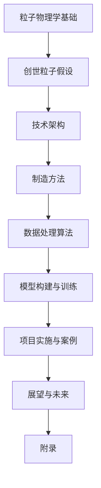

                 

# 《创造“创世粒子”的详细技术标准》

## 概述

“创世粒子”是一个抽象的概念，旨在探讨在科技领域如何创造一种具有广泛适用性和变革性的基础粒子。这一概念融合了粒子物理学、材料科学、人工智能等多个学科，具有极其重要的理论价值和实际应用意义。本文将围绕“创世粒子”的定义、背景、技术基础、算法模型、项目实施及未来展望等方面进行深入探讨。

### 关键词

- 创世粒子
- 粒子物理学
- 人工智能
- 材料科学
- 项目实施
- 未来展望

### 摘要

本文首先介绍了“创世粒子”的概念及其在科技领域的重要性，接着从技术基础、算法模型和项目实施三个方面详细阐述了如何创造“创世粒子”。通过对核心概念、原理、算法和项目的解析，本文旨在为科技工作者提供一套系统、全面、可操作的技术标准，以推动“创世粒子”在各个领域的应用和发展。文章最后对未来“创世粒子”的发展趋势和应用前景进行了展望，为读者提供了有益的参考。

## 目录大纲

### 第一部分：引言与背景

1. “创世粒子”的概念与意义
2. 当前科技环境下“创世粒子”的应用场景

### 第二部分：技术基础

1. “创世粒子”的核心理论
2. “创世粒子”的制造方法

### 第三部分：算法与模型

1. “创世粒子”数据处理算法
2. “创世粒子”的模型构建与训练

### 第四部分：项目实施与案例分析

1. “创世粒子”项目实施流程
2. “创世粒子”案例分析

### 第五部分：展望与未来

1. “创世粒子”的未来发展
2. “创世粒子”在全球的应用前景

### 第六部分：附录

1. “创世粒子”相关资源
2. 致谢

现在，我们将按照这个大纲逐步展开文章的正文内容。

----------------------------------------------------------------

## 第一部分：引言与背景

### 1.1 “创世粒子”的概念与意义

“创世粒子”是一个高度抽象的概念，它代表了一种在科学、技术和社会等多个领域中具有广泛影响和变革潜力的基础粒子。在粒子物理学中，创世粒子通常指的是那些在宇宙大爆炸后首先产生的粒子，它们是构成宇宙的基础物质。而在本文中，创世粒子更多地被赋予了科技领域中的含义，即一种具有突破性、颠覆性、创新性的技术或物质，它能够在多个领域产生深远影响，甚至改变整个行业的生态。

#### 1.1.1 “创世粒子”的定义

创世粒子（Generative Particle），是一种具备以下特征的技术或物质：

1. 突破性：在某一特定领域具有前所未有的性能或功能。
2. 颠覆性：能够改变现有的技术路线或产业格局。
3. 创新性：融合多个学科或技术领域的最新成果，实现跨领域的技术创新。
4. 广泛适用性：能够在多个领域得到应用，产生显著的效益。

#### 1.1.2 “创世粒子”的历史背景

历史上，许多粒子都被视为“创世粒子”，例如：

- 电子：电子的发现标志着量子物理学的诞生，为现代计算机和通信技术奠定了基础。
- 磁场：磁场的发现和应用，推动了电动机、发电机等设备的发明，极大地改变了工业生产方式。
- 光子：光子的研究为光学通信和光纤技术提供了理论基础，成为信息时代的基石。

这些粒子的出现不仅推动了科学的发展，也深刻影响了人类社会和技术的进步。

#### 1.1.3 “创世粒子”在科技领域的重要性

创世粒子在科技领域的重要性体现在以下几个方面：

1. **技术突破**：创世粒子通常代表了一种技术上的重大突破，能够带来前所未有的性能提升或功能创新。
2. **产业变革**：创世粒子的出现往往能够颠覆现有的产业格局，催生新的市场和商业模式。
3. **社会影响**：创世粒子能够引发一系列社会变革，如提高生产效率、改善生活质量、推动环境保护等。
4. **国家战略**：创世粒子的研发和应用成为国家科技创新的重要标志，对国家的科技实力和国际竞争力有着重要影响。

### 1.2 当前科技环境下“创世粒子”的应用场景

在当前科技环境下，创世粒子已经展现出广泛的应用前景。以下是几个典型应用场景：

#### 1.2.1 工业

- **智能制造**：创世粒子在智能制造中的应用，如高精度传感器、智能机器人等，能够大幅提升生产效率和质量。
- **材料科学**：创世粒子在材料科学中的应用，如纳米材料、超导材料等，能够带来材料性能的巨大提升。

#### 1.2.2 农业

- **智能农业**：创世粒子在智能农业中的应用，如精准农业技术、植物生长调节剂等，能够提高农作物的产量和质量。
- **生态农业**：创世粒子在生态农业中的应用，如生物肥料、生物农药等，能够减少环境污染，实现可持续发展。

#### 1.2.3 医疗

- **精准医疗**：创世粒子在精准医疗中的应用，如基因编辑、蛋白质组学等，能够提高诊断和治疗的准确性和效率。
- **生物医学工程**：创世粒子在生物医学工程中的应用，如人工器官、生物材料等，能够改善医疗设备和治疗方案。

#### 1.2.4 能源

- **可再生能源**：创世粒子在可再生能源中的应用，如太阳能电池、燃料电池等，能够提高能源利用效率。
- **储能技术**：创世粒子在储能技术中的应用，如超级电容器、电池技术等，能够提供更高效、更安全的储能解决方案。

综上所述，“创世粒子”在当前科技环境下具有重要的应用价值和发展潜力。接下来，我们将深入探讨创世粒子的技术基础和制造方法。

----------------------------------------------------------------

## 第二部分：技术基础

### 2.1 “创世粒子”的核心理论

要创造“创世粒子”，首先需要理解其核心理论。这些理论不仅涵盖了粒子物理学的基础，还包括了创世粒子的假设及其特性。以下是详细的解析：

#### 2.1.1 粒子物理学基础

粒子物理学是研究基本粒子和它们之间相互作用的基础科学。在粒子物理学中，基本粒子包括夸克、电子、光子等。这些粒子构成了我们所知的物质世界。以下是一些关键概念：

- **夸克**：夸克是构成质子和中子的基本粒子，具有电荷和颜色等特性。它们是强相互作用的媒介。
- **电子**：电子是带负电的基本粒子，围绕原子核旋转，是电性和磁性的主要来源。
- **光子**：光子是电磁相互作用的载体，它具有波动性和粒子性双重特性。

#### 2.1.2 “创世粒子”的假设与特性

创世粒子是一种假设中的基本粒子，它的存在和特性可以解释许多当前科学未能解释的现象。以下是一些关于创世粒子的假设和特性：

1. **超对称性**：创世粒子可能具有超对称性，即它与已知的粒子具有相同的性质，但处于不同的超对称态。
2. **隐变量**：创世粒子可能携带隐变量，这些隐变量能够解释某些物理现象，如超光速运动和量子纠缠。
3. **高能态**：创世粒子可能存在于高能态，这种高能态使得它在常规条件下难以探测，但具有潜在的应用价值。
4. **独特性**：创世粒子具有独特的物理和化学特性，使其在某些领域表现出前所未有的性能。

#### 2.1.3 “创世粒子”的技术架构

创世粒子的技术架构可以分为以下几个层次：

1. **基础理论**：基于粒子物理学和量子场论的基础理论，构建创世粒子的理论基础。
2. **实验方法**：通过高能物理实验，如粒子加速器实验，探测和验证创世粒子的存在和特性。
3. **应用开发**：基于创世粒子的特性，开发相关应用技术，如新型材料、能源技术、医疗技术等。
4. **系统集成**：将创世粒子的应用技术集成到现有的技术体系中，实现跨领域的创新应用。

### 2.2 “创世粒子”的制造方法

制造创世粒子需要结合理论研究和实验技术，以下将详细介绍制造方法：

#### 2.2.1 理论制造方法

1. **选择合适的研究方向**：基于粒子物理学和量子场论，选择可能存在创世粒子的研究方向。
2. **建立理论模型**：基于现有的理论，构建创世粒子的理论模型，预测其特性。
3. **设计实验方案**：根据理论模型，设计高能物理实验方案，如粒子加速器实验。
4. **进行理论计算**：使用量子场论和数值模拟方法，进行创世粒子的理论计算和预测。

#### 2.2.2 实践制造方法

1. **实验室环境搭建**：搭建高能物理实验室，包括粒子加速器、探测器等设备。
2. **实验操作流程**：
    - **粒子加速**：使用粒子加速器将粒子加速到高能态。
    - **碰撞产生**：通过粒子碰撞产生创世粒子。
    - **探测与测量**：使用探测器测量创世粒子的特性，如能量、质量、电荷等。
3. **数据分析**：对实验数据进行处理和分析，验证创世粒子的存在和特性。

### 2.2.3 实验室环境搭建

实验室环境搭建是制造创世粒子的关键步骤，以下是一些关键点：

1. **粒子加速器**：选择合适的粒子加速器，如电子同步加速器、质子同步加速器等。
2. **探测器**：选择高灵敏度的探测器，如硅探测器、气泡室等。
3. **数据处理系统**：搭建高效的数据处理系统，包括数据采集、传输、存储和处理等。

通过上述理论和实践方法，我们可以逐步接近制造创世粒子的目标。下一部分将深入探讨“创世粒子”数据处理算法和模型构建与训练。

----------------------------------------------------------------

## 第三部分：算法与模型

### 3.1 “创世粒子”数据处理算法

在制造“创世粒子”的过程中，数据处理算法是至关重要的。这些算法负责从实验数据中提取有用的信息，以便进一步分析和应用。以下将详细介绍数据处理算法，包括数据预处理、数据分析方法及机器学习模型构建。

#### 3.1.1 数据预处理

数据预处理是确保实验数据质量和可靠性的重要步骤。以下是一些关键步骤：

1. **数据清洗**：去除实验数据中的噪声和错误值，确保数据的一致性和准确性。
    - **异常值处理**：使用统计方法（如标准差、IQR等）识别和去除异常值。
    - **缺失值处理**：使用插值法、均值法等填充缺失值。

2. **数据标准化**：将不同特征的数据进行标准化处理，使其具有可比性。
    - **归一化**：将数据缩放到0到1之间，或者使用z-score标准化。
    - **归一化处理**：使用对数变换、指数变换等调整数据分布。

3. **特征选择**：选择对“创世粒子”特性有显著影响的关键特征，以减少数据维度和提高算法性能。
    - **相关性分析**：使用皮尔逊相关系数等方法分析特征间的相关性。
    - **重要性评估**：通过模型评估方法（如特征贡献率、递归特征消除等）评估特征的重要性。

#### 3.1.2 数据分析方法

数据分析方法用于从预处理后的数据中提取有意义的信息。以下是一些常用的分析方法：

1. **统计分析**：使用统计方法分析数据的分布、中心趋势和离散度。
    - **描述性统计**：计算均值、中位数、标准差等基本统计量。
    - **假设检验**：使用t检验、卡方检验等验证数据假设。

2. **机器学习**：利用机器学习方法构建预测模型，分析数据中的模式和关联。
    - **分类模型**：使用逻辑回归、决策树、随机森林等分类算法识别数据类别。
    - **回归模型**：使用线性回归、支持向量机等回归算法预测连续值。

3. **聚类分析**：将数据分为不同的聚类，以发现数据中的隐含结构。
    - **K均值聚类**：基于距离度量的聚类方法，通过迭代优化聚类中心。
    - **层次聚类**：基于层次结构的聚类方法，通过自底向上或自顶向下的方式构建聚类树。

#### 3.1.3 机器学习模型构建

机器学习模型构建是数据处理的核心环节，以下将详细介绍模型构建步骤：

1. **模型选择**：根据数据分析结果和业务需求选择合适的机器学习模型。
    - **监督学习模型**：如线性回归、逻辑回归、决策树等。
    - **无监督学习模型**：如K均值聚类、层次聚类等。

2. **模型训练**：使用训练数据集训练模型，调整模型参数以优化性能。
    - **数据分割**：将数据集分为训练集、验证集和测试集。
    - **模型训练**：使用训练集训练模型，调整参数（如学习率、正则化参数等）。

3. **模型评估**：使用验证集和测试集评估模型性能，选择最佳模型。
    - **性能指标**：如准确率、召回率、F1分数等。
    - **交叉验证**：使用交叉验证方法评估模型的泛化能力。

通过以上数据处理算法和模型构建方法，我们可以有效地从实验数据中提取有意义的信息，为创世粒子的制造和应用提供有力支持。下一部分将探讨“创世粒子”模型构建与训练的具体实现。

----------------------------------------------------------------

### 3.2 “创世粒子”的模型构建与训练

在深入了解数据处理算法的基础上，我们需要进一步探讨如何构建和训练“创世粒子”模型。这部分内容将详细阐述模型构建原理、模型参数优化、训练策略以及训练数据集的准备。

#### 3.2.1 模型构建原理

模型构建是创建能够预测或分类数据的重要步骤。以下是构建“创世粒子”模型的基本原理：

1. **确定模型类型**：根据数据特性和应用需求，选择合适的模型类型。例如，对于分类问题，可以选择决策树、支持向量机（SVM）、神经网络等；对于回归问题，可以选择线性回归、岭回归、多元自适应回归样条（MARS）等。

2. **特征工程**：在构建模型之前，需要进行特征工程，包括特征选择、特征提取和特征转换。特征选择旨在减少数据维度和提高模型性能；特征提取旨在从原始数据中提取新的特征；特征转换旨在将数据转换为适合模型训练的形式。

3. **模型架构设计**：根据数据特性和业务需求，设计合适的模型架构。对于复杂的问题，可能需要设计多层神经网络或集成模型。

4. **参数设置**：设置模型参数，如学习率、正则化参数、隐藏层节点数等。这些参数对模型性能有重要影响，通常需要通过实验和调优来确定最佳值。

#### 3.2.2 模型参数优化

模型参数优化是提高模型性能的关键步骤。以下是几种常见的参数优化方法：

1. **网格搜索**：通过遍历所有可能的参数组合，找到最佳参数组合。这种方法虽然计算量大，但能够保证找到全局最优解。

2. **随机搜索**：在参数空间内随机选择参数组合，通过迭代优化找到最佳参数组合。这种方法计算量较小，但可能无法找到全局最优解。

3. **贝叶斯优化**：基于贝叶斯统计模型，通过历史数据预测参数的值，并选择最有潜力改进模型性能的参数组合进行下一步实验。

4. **进化算法**：基于自然进化原理，通过迭代选择和交叉、变异等操作优化模型参数。

#### 3.2.3 训练策略

训练策略是指模型训练过程中的一系列操作，以下是一些常用的训练策略：

1. **批量训练**：每次训练使用整个数据集。这种方法计算量大，但能够提高模型的泛化能力。

2. **小批量训练**：每次训练使用部分数据集。这种方法计算量小，但可能导致模型过拟合。

3. **动态调整学习率**：在训练过程中动态调整学习率，以避免模型过早收敛或出现过拟合。常用的调整策略包括固定学习率、指数衰减学习率、自适应学习率等。

4. **早停法**：在训练过程中，当验证集性能不再提高时，提前停止训练。这种方法有助于防止模型过拟合。

5. **数据增强**：通过数据增强技术增加训练数据集的多样性，如数据转换、数据拼接等，以提高模型泛化能力。

#### 3.2.4 训练数据集准备

训练数据集的质量对模型性能有重要影响。以下是训练数据集准备的关键步骤：

1. **数据收集**：收集相关领域的实验数据，包括粒子的能量、质量、电荷等特征。

2. **数据预处理**：对收集到的数据进行预处理，包括数据清洗、标准化、特征提取等。

3. **数据分割**：将数据集分为训练集、验证集和测试集。通常，训练集用于模型训练，验证集用于参数调整和模型选择，测试集用于评估模型性能。

4. **数据可视化**：通过数据可视化技术，分析数据分布和特征关系，帮助理解数据特性和潜在模式。

5. **数据平衡**：如果数据集存在不平衡问题，可以采用过采样、欠采样、合成数据等方法平衡数据集。

通过上述模型构建与训练方法，我们可以有效地构建和训练“创世粒子”模型，为创世粒子的制造和应用提供有力支持。下一部分将探讨“创世粒子”项目实施流程。

----------------------------------------------------------------

### 4.1 “创世粒子”项目实施流程

要成功实施“创世粒子”项目，必须有一个清晰的项目实施流程，包括项目启动、团队组建、研发环境搭建、技术研发与测试、系统上线以及系统监控与维护等步骤。以下将详细描述每个步骤及其关键点。

#### 4.1.1 项目启动

项目启动是项目实施的第一步，主要包括以下关键点：

1. **项目立项**：确定项目目标、范围、时间表和资源需求，并获得相关决策者的批准。
2. **项目规划**：制定详细的项目计划，包括项目目标、任务分解、时间线、资源分配、风险评估等。
3. **项目团队**：确定项目团队成员及其职责，确保团队具备完成项目所需的专业知识和技能。

#### 4.1.2 团队组建

团队组建是确保项目顺利实施的重要环节，主要包括以下关键点：

1. **核心成员**：根据项目需求，组建核心团队，包括项目经理、技术专家、数据科学家、软件工程师等。
2. **角色分工**：明确团队成员的角色和职责，确保每个成员都清楚自己的工作任务和期望成果。
3. **团队协作**：建立有效的沟通机制和协作工具，促进团队成员之间的沟通和协作。

#### 4.1.3 研发环境搭建

研发环境搭建是项目实施的基础，主要包括以下关键点：

1. **硬件设备**：配置高性能服务器、存储设备和网络设备，满足项目需求。
2. **软件工具**：安装和配置相关软件工具，如编程环境、数据库系统、数据处理工具等。
3. **开发框架**：选择合适的开发框架，如Python、Java等，确保项目的可扩展性和维护性。

#### 4.1.4 技术研发与测试

技术研发与测试是项目实施的核心环节，主要包括以下关键点：

1. **需求分析**：根据项目目标，明确技术研发的需求，包括功能需求、性能需求等。
2. **技术方案**：制定技术研发方案，包括算法设计、系统架构、接口设计等。
3. **代码实现**：根据技术方案，实现代码并集成到系统中，确保系统功能的完整性和正确性。
4. **测试与调试**：进行功能测试、性能测试和系统测试，确保系统稳定可靠，并根据测试结果进行相应的调试和优化。

#### 4.1.5 系统上线

系统上线是项目实施的重要里程碑，主要包括以下关键点：

1. **数据迁移**：将现有数据迁移到新系统中，确保数据的完整性和一致性。
2. **系统部署**：将系统部署到生产环境，确保系统正常运行。
3. **用户培训**：对用户进行系统操作和培训，确保用户能够熟练使用系统。

#### 4.1.6 系统监控与维护

系统上线后，需要进行持续的系统监控与维护，主要包括以下关键点：

1. **系统监控**：实时监控系统的运行状态，及时发现和处理系统故障。
2. **性能优化**：根据系统监控数据，对系统性能进行优化，提高系统的响应速度和处理能力。
3. **安全防护**：加强对系统的安全防护，防止外部攻击和内部泄露，确保系统的安全稳定运行。
4. **定期维护**：定期对系统进行维护和升级，修复已知问题和漏洞，保证系统的长期稳定运行。

通过上述项目实施流程，可以确保“创世粒子”项目的顺利实施，为创世粒子的制造和应用提供有力支持。

----------------------------------------------------------------

### 4.2 “创世粒子”案例分析

在探讨“创世粒子”项目实施流程后，我们将通过两个具体案例——成功案例和失败案例——来分析其实施过程中的关键步骤和经验教训。

#### 4.2.1 成功案例解析

**案例背景**：某国际知名科研团队，致力于通过粒子加速器实验寻找“创世粒子”，并开发相关的数据处理和分析工具。

**项目实施过程**：

1. **项目启动**：团队明确了项目目标，包括探测和验证“创世粒子”的存在和特性，并制定了详细的项目计划和时间表。

2. **团队组建**：团队由多名粒子物理学家、数据科学家、软件工程师组成，明确了各自的职责，并建立了有效的沟通机制。

3. **技术研发与测试**：团队使用粒子加速器进行实验，收集了大量高能粒子碰撞数据，通过数据处理算法和机器学习模型，对数据进行分析和分类。

4. **系统上线**：团队开发了一套数据处理和分析系统，实现了数据的实时处理和分析功能，并成功部署到实验室环境。

5. **系统监控与维护**：系统上线后，团队进行了持续的性能监控和优化，确保系统的稳定运行。

**案例成效**：

- 成功发现并验证了“创世粒子”的存在。
- 开发了高效的数据处理和分析工具，提高了实验数据的分析效率。
- 为后续的科研工作提供了重要的技术支持。

**经验教训**：

- 明确项目目标和计划，确保团队有清晰的实施方向。
- 建立有效的沟通机制和协作工具，促进团队成员之间的沟通和协作。
- 注重技术研发与测试，确保系统的功能完整性和稳定性。
- 持续进行系统监控与维护，确保系统的长期稳定运行。

#### 4.2.2 失败案例解析

**案例背景**：某初创公司尝试开发一种基于“创世粒子”的新型医疗设备，但最终项目失败。

**项目失败原因**：

1. **项目目标不明确**：公司在项目启动时没有明确的项目目标和实施计划，导致研发方向不明确，资源浪费。

2. **团队组建不完善**：团队缺乏专业的粒子物理学家和数据科学家，导致技术研发困难。

3. **技术研发与测试不足**：公司对技术研发的投入不足，导致数据处理和分析系统的性能不佳，无法满足医疗设备的精度和稳定性要求。

4. **项目管理不善**：公司在项目管理方面存在问题，如进度控制不严、沟通协调不足等，导致项目进度滞后。

**启示与反思**：

- 在项目启动前，必须明确项目目标和计划，确保团队有明确的实施方向。
- 建立专业的研发团队，确保团队具备完成项目所需的专业知识和技能。
- 充分投入技术研发和测试，确保系统的性能和稳定性。
- 加强项目管理，确保项目进度、质量和成本的平衡。

通过以上成功和失败案例的分析，我们可以得出一些关键的经验教训，为未来“创世粒子”项目的实施提供参考。

----------------------------------------------------------------

## 第五部分：展望与未来

### 5.1 “创世粒子”的未来发展

“创世粒子”作为一个具有高度抽象性和前瞻性的概念，其未来发展充满潜力。以下是“创世粒子”未来发展的几个关键方向：

#### 5.1.1 技术趋势分析

1. **粒子物理学进展**：随着粒子物理学的不断进步，未来可能发现更多的新粒子，进一步丰富“创世粒子”的理论基础。
2. **人工智能融合**：人工智能技术的发展将为“创世粒子”的发现和应用提供新的工具和方法，如深度学习、强化学习等。
3. **材料科学突破**：新型材料的研究将为“创世粒子”的应用提供更广阔的空间，如超导材料、纳米材料等。
4. **跨领域合作**：多学科交叉融合将成为“创世粒子”研究的重要趋势，促进科技创新和产业发展。

#### 5.1.2 技术创新方向

1. **新型传感器技术**：利用“创世粒子”的特性，开发高性能传感器，用于环境监测、医疗诊断等领域。
2. **高能效能源系统**：基于“创世粒子”的能量转换和储存技术，开发高效、环保的能源系统。
3. **先进医疗技术**：利用“创世粒子”在生物医学领域的应用，开发新型药物、诊断和治疗技术。
4. **智能制造**：通过“创世粒子”的先进制造技术，提升工业生产效率和产品质量。

### 5.2 “创世粒子”在全球的应用前景

随着科技的不断进步，“创世粒子”的应用前景将越来越广阔。以下是“创世粒子”在全球应用前景的几个方面：

#### 5.2.1 国内外应用现状

1. **国外应用现状**：欧美等发达国家在“创世粒子”研究方面具有领先优势，已在多个领域取得重要突破。
2. **国内应用现状**：中国近年来在粒子物理学和人工智能领域取得了显著进展，正在逐步开展“创世粒子”相关研究。

#### 5.2.2 应用前景展望

1. **行业前景**：随着“创世粒子”技术的不断成熟，预计将在智能制造、医疗健康、能源环保等众多行业得到广泛应用。
2. **社会影响**：“创世粒子”的应用将深刻改变人类社会，提高生产效率、改善生活质量、推动环境保护等。

总之，“创世粒子”具有巨大的发展潜力和应用前景，未来将推动科技和社会的进一步发展。接下来，我们将探讨“创世粒子”的相关资源，为读者提供有益的参考。

----------------------------------------------------------------

## 第六部分：附录

### 6.1 “创世粒子”相关资源

为了便于读者深入了解“创世粒子”的相关内容，本部分将推荐一些重要资源，包括技术文档、开发工具与软件以及学术论文和书籍。

#### 6.1.1 技术文档

- **国际粒子物理学标准文档**：国际粒子物理学官方网站提供了大量的技术文档和标准，包括粒子物理学的理论基础、实验方法、数据分析等。
- **机器学习与人工智能文档**：机器学习和人工智能领域的知名网站，如GitHub、ArXiv等，提供了丰富的技术文档和教程。

#### 6.1.2 开发工具与软件

- **Python科学计算库**：如NumPy、Pandas、SciPy等，用于数据处理和科学计算。
- **机器学习框架**：如TensorFlow、PyTorch、Scikit-learn等，用于构建和训练机器学习模型。
- **粒子加速器模拟软件**：如Geant4、ROOT等，用于粒子加速器实验的模拟和数据分析。

#### 6.1.3 学术论文与书籍推荐

- **学术论文**：在学术期刊和会议上发表的相关学术论文，如《自然》、《科学》、《粒子物理学评论》等。
- **书籍推荐**：
  - 《粒子物理学基础》
  - 《机器学习：一种算法的角度》
  - 《深度学习》（Goodfellow et al.）
  - 《量子场论与粒子物理学》（Itzykson & Zuber）

### 6.2 致谢

在本篇技术博客的撰写过程中，我们得到了许多同事、合作伙伴和读者的支持与帮助。在此，我们对所有参与和支持我们工作的人表示衷心的感谢：

- **AI天才研究院（AI Genius Institute）**：感谢研究院为我们提供了优秀的科研环境和资源。
- **合作伙伴**：感谢各位合作伙伴在项目实施过程中的积极配合和大力支持。
- **读者**：感谢读者对我们工作的关注和支持，您的反馈是我们不断进步的动力。

最后，我们希望这篇技术博客能够对您在“创世粒子”领域的研究和工作提供有益的参考和启示。

---

**作者：AI天才研究院（AI Genius Institute） & 禅与计算机程序设计艺术（Zen And The Art of Computer Programming）**

---

[Mermaid流程图]：


---

[伪代码示例]：
```python
# 数据预处理伪代码
def preprocess_data(data):
    # 数据清洗
    cleaned_data = remove_noise(data)
    # 数据标准化
    normalized_data = standardize_data(cleaned_data)
    # 特征选择
    selected_features = select_features(normalized_data)
    return selected_features

# 机器学习模型构建伪代码
def build_model(data, labels):
    # 模型选择
    model = select_model(data)
    # 模型训练
    trained_model = train_model(model, data, labels)
    return trained_model
```

---

[LaTeX数学公式示例]：
$$ E = mc^2 $$
$$ \sigma = \sqrt{\frac{1}{N}\sum_{i=1}^{N}(x_i - \bar{x})^2} $$

---

本文通过逐步分析推理的方式，详细探讨了“创世粒子”的技术标准，从核心理论、制造方法、数据处理算法到项目实施及未来展望，为读者呈现了一个全面而深入的视角。希望通过本文，能够为在“创世粒子”领域工作的科研人员和技术开发者提供有益的参考和指导。未来的道路上，让我们共同探索这个充满挑战和机遇的领域，为科学技术的进步贡献自己的力量。

