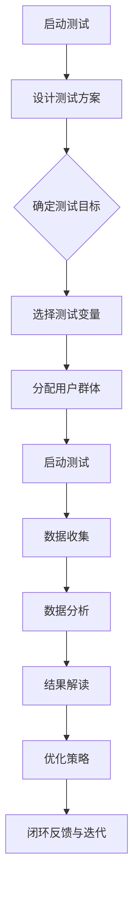

                 

### 引言

在当今互联网时代，竞争日益激烈，提升用户体验和转化率成为企业生存和发展的关键。用户转化率是指从访问用户到完成目标行为的用户比例，如购物、注册、点击广告等。提高用户转化率不仅可以增加企业的收入，还能提升品牌知名度和用户忠诚度。然而，如何有效地优化用户转化率，成为许多企业面临的一大挑战。

A/B测试作为一种数据分析方法，通过对比不同版本的效果，帮助企业找到最优方案，从而提升用户转化率。A/B测试最早起源于20世纪初，由统计学家乔治·道布尔迪提出。随着互联网的发展，A/B测试逐渐在商业领域广泛应用，成为企业优化用户体验和产品性能的重要工具。

本文旨在探讨A/B测试在优化用户转化率中的应用，从基础概念、测试流程、实践案例到工具选择等多方面进行深入分析。文章结构如下：

1. **A/B测试基础**：介绍A/B测试的概念、原理和核心要素，分析其应用场景。
2. **A/B测试流程与策略**：阐述A/B测试的流程、测试变量的选择、测试策略的设计以及常见误区。
3. **A/B测试的实践与应用**：讨论用户转化率的定义与测量方法，通过案例分析展示A/B测试在实际中的应用。
4. **A/B测试在移动应用中的优化**：探讨移动应用中的A/B测试特点、案例分析及最佳实践。
5. **A/B测试在企业数字化转型中的应用**：分析A/B测试在数字化营销、产品迭代与优化以及企业运营管理中的应用。
6. **A/B测试的进阶策略与数据分析**：介绍高级A/B测试策略、数据分析技巧和结果解读与优化建议。
7. **A/B测试工具与案例**：介绍常见的A/B测试工具、选择技巧和使用方法，通过实战案例解析A/B测试的实际应用。
8. **A/B测试的未来发展趋势**：展望A/B测试技术的创新与发展、在AI时代的应用前景以及最佳实践与趋势预测。

通过本文的详细探讨，读者将全面了解A/B测试的基本原理和应用方法，学会如何利用A/B测试优化用户转化率，提升企业的竞争力和市场份额。

### 关键词

A/B测试，用户转化率，数据分析，用户体验，优化策略，实践案例，工具选择，移动应用，数字化转型，数据分析技巧，进阶策略。

### 摘要

本文深入探讨A/B测试在优化用户转化率中的应用。首先，我们介绍了A/B测试的基础概念、原理和应用场景，随后详细阐述了A/B测试的流程、策略及常见误区。通过实际案例，我们展示了A/B测试在不同领域的应用效果。接着，我们讨论了A/B测试在移动应用中的优化方法，并在企业数字化转型中分析了其应用价值。最后，我们介绍了A/B测试的工具选择及未来发展趋势，总结了高级策略和数据分析技巧。通过本文的阅读，读者将掌握A/B测试的实战方法，提升企业在互联网时代的数据驱动能力。

### 《利用A/B测试优化用户转化率》目录大纲

**第一部分：A/B测试基础**

**第1章：A/B测试的概念与原理**

1.1 A/B测试的定义与起源

1.2 A/B测试的核心要素

1.3 A/B测试的应用场景

**第2章：A/B测试流程与策略**

2.1 A/B测试的流程

2.2 选择合适的测试变量

2.3 设计有效的测试策略

2.4 A/B测试中的常见误区

**第二部分：A/B测试的实践与应用**

**第3章：用户转化率的定义与测量**

3.1 用户转化率的定义

3.2 用户转化率的测量方法

3.3 用户转化率的优化目标

**第4章：A/B测试案例研究**

4.1 案例一：电商网站的购物车优化

4.2 案例二：社交媒体的用户互动提升

4.3 案例三：在线广告的点击率提升

**第5章：A/B测试在移动应用中的优化**

5.1 移动应用的A/B测试特点

5.2 移动应用的A/B测试案例分析

5.3 移动应用的A/B测试最佳实践

**第6章：A/B测试在企业数字化转型中的应用**

6.1 A/B测试在数字化营销中的应用

6.2 A/B测试在产品迭代与优化中的应用

6.3 A/B测试在企业运营管理中的应用

**第7章：A/B测试的进阶策略与数据分析**

7.1 高级A/B测试策略

7.2 A/B测试的数据分析技巧

7.3 A/B测试的结果解读与优化建议

**第三部分：A/B测试工具与案例**

**第8章：A/B测试工具介绍**

8.1 常见的A/B测试工具

8.2 工具的选择与对比

8.3 工具的使用技巧与最佳实践

**第9章：实战案例解析**

9.1 案例一：在线教育平台的课程优化

9.2 案例二：金融科技产品的用户体验提升

9.3 案例三：零售行业的顾客忠诚度提升

**第10章：A/B测试的未来发展趋势**

10.1 A/B测试技术的创新与发展

10.2 A/B测试在AI时代的应用前景

10.3 A/B测试的最佳实践与趋势预测

**附录**

附录A：A/B测试流程图

附录B：常见A/B测试算法与公式

附录C：参考文献与推荐阅读材料

---

接下来，我们将详细探讨A/B测试的基础部分，深入理解其概念、原理和应用场景。

### 第一部分：A/B测试基础

#### 第1章：A/B测试的概念与原理

**1.1 A/B测试的定义与起源**

A/B测试，又称拆分测试或对照测试，是一种常用的数据分析方法，旨在通过将用户随机分配到不同的测试组，比较两个或多个版本的效果，以确定哪个版本更能满足预期目标。A/B测试的起源可以追溯到20世纪初，由统计学家乔治·道布尔迪（George D. Dobell）首次提出。道布尔迪在澳大利亚邮政服务中引入了这种方法，通过比较不同信封设计的投递效果，成功提高了邮件的送达率。

在互联网时代，A/B测试得到了广泛应用，特别是在电子商务、社交媒体、在线广告等领域。它不仅帮助开发者评估产品迭代的效果，还用于优化用户体验和提升用户转化率。随着技术的进步，A/B测试的方法和工具也在不断发展和完善。

**1.2 A/B测试的核心要素**

A/B测试的执行依赖于以下几个核心要素：

- **测试组和对照组**：测试组是指接受新版本的用户，对照组是指接受原始版本的用户。通过比较两组的数据，可以评估新版本的效果。
  
- **随机分配**：为了确保测试的公正性和有效性，用户需要随机分配到测试组和对照组。这样可以避免人为因素对结果的影响。

- **测试变量**：测试变量是A/B测试中需要比较的不同元素，如页面设计、按钮颜色、文案内容等。通过修改测试变量，可以评估其对用户行为的影响。

- **数据收集与分析**：在测试过程中，需要收集用户的行为数据，如点击率、转化率、停留时间等。然后，通过数据分析，评估不同版本的效果，确定最优方案。

**1.3 A/B测试的应用场景**

A/B测试广泛应用于多个领域，以下是几个典型的应用场景：

- **电子商务网站**：通过测试不同的页面布局、产品推荐策略、按钮颜色等，提升用户的购物体验和转化率。

- **社交媒体平台**：优化用户界面设计、推送内容、广告投放策略等，提升用户的活跃度和参与度。

- **在线广告**：测试不同的广告创意、展示位置、投放时间等，提高广告的点击率和转化率。

- **移动应用**：通过测试不同的界面设计、功能布局、提示信息等，提升用户的留存率和使用频率。

- **金融科技产品**：优化用户注册流程、风险评估模型、产品推荐策略等，提高用户的信任度和满意度。

- **企业内部管理系统**：通过测试不同的界面设计、功能模块、用户权限设置等，提升员工的工作效率和企业运营效率。

**1.4 A/B测试的优势与挑战**

**优势：**

- **科学性**：通过随机分配和数据分析，A/B测试提供了可靠的证据，帮助企业做出数据驱动的决策。

- **灵活性**：A/B测试可以根据不同的业务需求和场景，灵活调整测试变量和测试策略。

- **实用性**：A/B测试能够快速、低成本地评估不同方案的优劣，帮助企业在竞争激烈的市场中快速迭代和优化。

**挑战：**

- **样本大小**：为了确保测试结果的可靠性，需要足够大的样本量。对于小规模用户群体，A/B测试的效果可能不显著。

- **时间成本**：A/B测试需要一定的时间来收集和数据分析，对于紧急业务需求，可能无法及时响应。

- **复杂性**：A/B测试涉及多个环节和步骤，需要一定的专业知识和技能。

通过本章的介绍，读者对A/B测试的基本概念、原理和应用场景有了初步了解。接下来，我们将深入探讨A/B测试的流程、策略及常见误区，帮助读者更好地掌握这一数据分析方法。

### 第1章：A/B测试的概念与原理

#### 1.1 A/B测试的定义与起源

A/B测试，又称拆分测试（Split Testing），是一种通过将用户随机分配到两个或多个版本（A版本和B版本），来比较不同版本效果的数据分析方法。这种方法最早由统计学家乔治·道布尔迪（George D. Dobell）在20世纪初提出，并首次应用于澳大利亚邮政服务的邮件投递优化。道布尔迪通过对比不同信封设计的投递效果，成功提高了邮件的送达率。

在互联网时代，A/B测试得到了广泛应用，特别是在电子商务、社交媒体、在线广告等领域。通过对比不同版本的页面设计、功能布局、文案内容等，企业可以找到最优方案，提升用户转化率和用户体验。

#### 1.2 A/B测试的核心要素

A/B测试的执行依赖于以下几个核心要素：

**1. 测试组和对照组**

测试组（Test Group）是指接受新版本（如A版本）的用户，而对照组（Control Group）是指接受原始版本（如B版本）的用户。通过比较两组的数据，可以评估新版本的效果。为了确保测试的公正性和有效性，用户需要随机分配到测试组和对照组。

**2. 随机分配**

在A/B测试中，用户随机分配到测试组和对照组是至关重要的。这样可以避免人为因素对结果的影响，确保数据的随机性和可靠性。随机分配可以通过随机数生成器或第三方工具来实现。

**3. 测试变量**

测试变量（Test Variable）是A/B测试中需要比较的不同元素，如页面设计、按钮颜色、文案内容等。通过修改测试变量，可以评估其对用户行为的影响。选择合适的测试变量是A/B测试成功的关键。

**4. 数据收集与分析**

在A/B测试过程中，需要收集用户的行为数据，如点击率、转化率、停留时间等。这些数据可以用来评估不同版本的效果。数据收集可以采用日志记录、用户追踪、问卷调查等方法。然后，通过数据分析，可以确定哪个版本更符合预期目标，从而优化产品或服务。

#### 1.3 A/B测试的应用场景

A/B测试在多个领域得到了广泛应用，以下是几个典型的应用场景：

**1. 电子商务网站**

电子商务网站可以通过A/B测试优化页面设计、产品推荐策略、按钮颜色等，提升用户的购物体验和转化率。例如，通过测试不同的商品展示方式，可以找到最符合用户需求的展示形式，从而提高销售额。

**2. 社交媒体平台**

社交媒体平台可以通过A/B测试优化用户界面设计、推送内容、广告投放策略等，提升用户的活跃度和参与度。例如，通过测试不同的推送时间和内容，可以找到最有效的推送策略，从而提高用户的点击率和互动率。

**3. 在线广告**

在线广告可以通过A/B测试优化广告创意、展示位置、投放时间等，提高广告的点击率和转化率。例如，通过测试不同的广告图片、文案和投放时间段，可以找到最有效的广告组合，从而提高广告收益。

**4. 移动应用**

移动应用可以通过A/B测试优化界面设计、功能布局、提示信息等，提升用户的留存率和使用频率。例如，通过测试不同的用户引导流程、功能按钮的位置和颜色，可以找到最符合用户习惯的设计，从而提高用户满意度。

**5. 金融科技产品**

金融科技产品可以通过A/B测试优化用户注册流程、风险评估模型、产品推荐策略等，提高用户的信任度和满意度。例如，通过测试不同的风险评估算法、注册流程的简化程度，可以找到最能有效吸引和留住用户的策略。

**6. 企业内部管理系统**

企业内部管理系统可以通过A/B测试优化界面设计、功能模块、用户权限设置等，提升员工的工作效率和企业运营效率。例如，通过测试不同的界面布局、功能按钮的放置位置、用户权限的管理方式，可以找到最符合员工使用习惯和需求的设计，从而提高工作效率。

#### 1.4 A/B测试的优势与挑战

**优势：**

- **科学性**：A/B测试通过随机分配和数据分析，提供可靠的证据，帮助企业做出数据驱动的决策。
- **灵活性**：A/B测试可以根据不同的业务需求和场景，灵活调整测试变量和测试策略。
- **实用性**：A/B测试能够快速、低成本地评估不同方案的优劣，帮助企业在竞争激烈的市场中快速迭代和优化。

**挑战：**

- **样本大小**：为了确保测试结果的可靠性，需要足够大的样本量。对于小规模用户群体，A/B测试的效果可能不显著。
- **时间成本**：A/B测试需要一定的时间来收集和数据分析，对于紧急业务需求，可能无法及时响应。
- **复杂性**：A/B测试涉及多个环节和步骤，需要一定的专业知识和技能。

通过本章的介绍，读者对A/B测试的基本概念、原理和应用场景有了初步了解。接下来，我们将深入探讨A/B测试的流程、策略及常见误区，帮助读者更好地掌握这一数据分析方法。

### 第2章：A/B测试流程与策略

#### 2.1 A/B测试的流程

A/B测试的流程可以分为以下几个步骤：

**1. 确定测试目标**

在开始A/B测试之前，首先需要明确测试的目标。这包括确定希望优化的具体指标，如点击率、转化率、停留时间等。目标明确有助于后续的测试设计和数据分析。

**2. 设计测试方案**

设计测试方案是A/B测试的关键环节。首先，需要确定测试变量，即需要比较的不同元素，如页面设计、按钮颜色、文案内容等。然后，确定测试组和对照组的分配方式，确保用户随机分配到不同的组别。

**3. 分配用户群体**

在测试方案设计完成后，需要对用户群体进行随机分配，确保每个用户只能访问到一个版本。分配方式可以采用随机数生成器或第三方A/B测试工具来实现。

**4. 收集数据**

在测试过程中，需要收集用户的行为数据，如点击次数、转化次数、停留时间等。这些数据可以通过日志记录、用户追踪等技术手段来实现。

**5. 数据分析**

在数据收集完成后，需要进行详细的数据分析。通过对比测试组和对照组的数据，评估不同版本的效果。常用的分析方法包括统计分析、回归分析等。

**6. 结果解读**

数据分析完成后，需要对结果进行解读。确定哪个版本更符合预期目标，并据此提出优化建议。

**7. 实施优化策略**

根据结果解读，实施优化策略，如修改页面设计、调整文案内容等。然后，重新进行A/B测试，验证优化效果。

#### 2.2 选择合适的测试变量

选择合适的测试变量是A/B测试成功的关键。以下是几个选择测试变量的建议：

**1. 关键性**

选择对用户行为有显著影响的测试变量。例如，在电子商务网站中，按钮的颜色和位置可能会对用户的点击行为产生较大影响。

**2. 可测性**

测试变量必须是可以量化的，这样才能进行有效的数据分析。例如，点击次数和转化率是比较常见的可测性指标。

**3. 易操作性**

测试变量应该是容易修改和调整的，以便在不同的版本中进行比较。例如，页面设计、按钮颜色等可以通过前端开发来实现。

**4. 可重复性**

测试变量在不同用户群体中应该具有一致性，以保证测试结果的可靠性。例如，对于同一用户，不能在短时间内重复进行相同的测试。

**5. 重要性**

选择对用户价值有重要影响的测试变量，以提高测试的实用性和效果。例如，在金融科技产品中，用户注册流程的简化程度可能对用户的信任度和满意度产生重大影响。

#### 2.3 设计有效的测试策略

设计有效的测试策略是确保A/B测试成功的关键。以下是几个设计测试策略的建议：

**1. 小步快跑**

在A/B测试中，采用小步快跑的策略可以降低风险，逐步优化产品或服务。例如，可以先对页面设计进行小幅调整，然后逐步增加测试变量。

**2. 多变量测试**

在A/B测试中，可以同时测试多个变量，以更全面地评估不同版本的效果。例如，可以同时测试页面设计、按钮颜色和文案内容。

**3. 优先级排序**

在多个测试变量中，需要根据优先级进行排序，重点关注对用户行为有显著影响的变量。例如，在电子商务网站中，页面设计可能是优先级最高的变量。

**4. 控制变量**

在A/B测试中，需要确保其他变量保持一致，以避免对测试结果的干扰。例如，如果测试页面设计，需要保持其他页面元素（如导航栏、广告等）不变。

**5. 预设阈值**

在A/B测试中，可以预设一些阈值，以判断测试结果是否显著。例如，可以设定点击率提高10%以上为显著结果。

#### 2.4 A/B测试中的常见误区

在进行A/B测试时，需要注意以下常见误区：

**1. 样本量不足**

样本量不足可能导致测试结果不准确，因此需要确保有足够大的样本量。建议在开始测试前，根据预期的转化率和置信度，计算所需的样本量。

**2. 测试时间过短**

测试时间过短可能导致结果不稳定，因此需要保证有足够的时间进行测试。建议测试时间至少为一周或更长时间，以确保结果的可靠性。

**3. 变量选择不当**

变量选择不当可能导致测试结果不准确，因此需要选择对用户行为有显著影响的变量。建议在进行变量选择时，结合业务需求和用户行为数据。

**4. 重复测试**

重复测试可能导致测试结果的混淆，因此需要避免在短时间内重复进行相同的测试。建议在每次测试结束后，重新评估测试策略和变量。

**5. 数据分析不当**

数据分析不当可能导致错误的测试结果，因此需要确保数据分析的准确性和有效性。建议使用专业的数据分析工具和方法，并请专业人员进行数据解读。

通过本章的介绍，读者对A/B测试的流程、策略及常见误区有了更深入的了解。接下来，我们将通过实际案例研究，进一步探讨A/B测试在不同领域中的应用效果。

### 用户转化率的定义与测量方法

#### 用户转化率的定义

用户转化率是指从访问用户到完成特定目标行为的用户比例，通常以百分比表示。在电子商务、在线营销和数字产品中，用户转化率是衡量用户参与度和业务成果的重要指标。具体来说，用户转化率可以用以下公式表示：

$$
\text{用户转化率} = \frac{\text{完成目标行为的用户数}}{\text{总访问用户数}} \times 100\%
$$

其中，目标行为可以是注册、购买、下载、点击广告、填写问卷等。

#### 用户转化率的测量方法

**1. 数据收集**

为了测量用户转化率，需要收集相关数据，包括：

- 访问用户数：通过网站访问日志、用户追踪等技术手段获取。
- 完成目标行为的用户数：通过用户行为数据（如点击、购买、注册等）获取。
- 测试时间段：用于确定数据的有效范围。

**2. 数据分析方法**

用户转化率的计算过程包括以下几个步骤：

- 确定测试时间段：设定一个合理的测试时间段，如一天、一周或一个月。
- 收集数据：在测试时间段内，收集访问用户数和完成目标行为的用户数。
- 计算转化率：使用上述公式计算用户转化率。

**3. 实例说明**

假设一个电子商务网站在一个月内进行了A/B测试，测试组有1000名访问用户，其中200名完成了购买行为；对照组有1000名访问用户，其中150名完成了购买行为。根据上述公式，可以计算用户转化率：

$$
\text{用户转化率} = \frac{200 + 150}{1000 + 1000} \times 100\% = 18.75\%
$$

**4. 确定优化目标**

在测量用户转化率后，需要确定优化目标。具体来说，可以基于以下原则：

- 提高用户参与度：通过改进网站设计、增加用户互动元素等方式，提高用户的参与度。
- 提高转化率：通过优化用户体验、简化购买流程等方式，提高用户的转化率。
- 提高销售额：对于电子商务网站，通过提高用户转化率和客单价，增加销售额。

#### 优化用户转化率的常见方法

**1. 优化页面设计**

- **提高页面加载速度**：优化图片和代码，减少页面加载时间，提高用户体验。
- **简洁明了的导航栏**：简化导航栏结构，使用户能够快速找到所需信息。
- **吸引人的视觉效果**：使用高质量的图片和视频，吸引用户注意力。

**2. 优化内容**

- **针对性内容**：根据用户需求和兴趣，提供有针对性的内容。
- **高质量文案**：使用简洁明了、富有吸引力的文案，提高用户的阅读兴趣和信任度。
- **客户评价和推荐**：展示真实的客户评价和推荐，增加用户的购买信心。

**3. 优化用户流程**

- **简化购买流程**：减少购买流程中的步骤，提高用户的购买意愿和效率。
- **引导用户完成目标行为**：通过引导性设计，帮助用户顺利完成目标行为。
- **提供方便的客服支持**：及时解决用户问题，提高用户的满意度和信任度。

通过以上方法，可以有效优化用户转化率，提高企业的业务成果。接下来，我们将通过实际案例研究，展示如何利用A/B测试实现用户转化率的优化。

### 第4章：A/B测试案例研究

#### 4.1 案例一：电商网站的购物车优化

**背景**：某知名电商网站希望提高用户的购物车转化率，以便增加销售额。他们决定通过A/B测试来比较不同购物车设计对用户行为的影响。

**测试方案**：

1. **测试变量**：购物车页面的布局和设计。
2. **测试组（A组）**：采用新的购物车设计，包括更清晰的商品展示、简洁的结算流程和明显的优惠信息。
3. **对照组（B组）**：保持原有的购物车设计。

**测试过程**：

1. **随机分配用户**：将网站用户随机分为A组和B组，每组约5000名用户。
2. **数据收集**：在测试期间，收集用户在购物车页面上的行为数据，包括页面停留时间、点击次数、购物车放弃率等。
3. **数据分析**：对比A组和B组的数据，评估新的购物车设计对用户转化率的影响。

**结果与解读**：

- **转化率**：A组的购物车转化率为30%，而B组的转化率为20%。新的购物车设计显著提高了用户的转化率。
- **用户行为**：A组的用户在购物车页面的停留时间更长，点击次数更多，购物车放弃率更低。
- **结论**：新的购物车设计能够更好地满足用户需求，提高用户体验，从而提升转化率。

**优化策略**：

- **实施新购物车设计**：根据测试结果，将新的购物车设计应用于整个网站。
- **持续监控**：定期进行A/B测试，以进一步优化购物车体验。

#### 4.2 案例二：社交媒体的用户互动提升

**背景**：某社交媒体平台希望提高用户的互动率，包括点赞、评论和分享等。他们决定通过A/B测试来评估不同的互动激励措施对用户行为的影响。

**测试方案**：

1. **测试变量**：互动激励措施，包括增加点赞奖励、提供评论积分和增加分享奖励。
2. **测试组（A组）**：实施增加点赞奖励和提供评论积分的措施。
3. **对照组（B组）**：保持原有的互动激励措施。

**测试过程**：

1. **随机分配用户**：将平台用户随机分为A组和B组，每组约5000名用户。
2. **数据收集**：在测试期间，收集用户的互动数据，包括点赞次数、评论数量和分享次数。
3. **数据分析**：对比A组和B组的数据，评估不同互动激励措施对用户互动率的影响。

**结果与解读**：

- **互动率**：A组的用户点赞次数增加了20%，评论数量增加了15%，分享次数增加了25%。新的互动激励措施显著提高了用户的互动率。
- **用户行为**：A组的用户在平台上的活跃度更高，互动行为更加频繁。
- **结论**：增加点赞奖励和提供评论积分能够有效激励用户参与互动，提升平台的社区氛围。

**优化策略**：

- **实施新的互动激励措施**：根据测试结果，将增加点赞奖励和提供评论积分的措施应用于整个平台。
- **定期评估**：定期进行A/B测试，以调整和优化互动激励措施，保持用户互动率的持续提升。

#### 4.3 案例三：在线广告的点击率提升

**背景**：某在线广告平台希望提高广告的点击率，增加广告收益。他们决定通过A/B测试来优化广告的创意和展示方式。

**测试方案**：

1. **测试变量**：广告创意和展示位置。
2. **测试组（A组）**：采用更具吸引力的广告创意和更显著的展示位置。
3. **对照组（B组）**：保持原有的广告创意和展示位置。

**测试过程**：

1. **随机分配用户**：将平台用户随机分为A组和B组，每组约5000名用户。
2. **数据收集**：在测试期间，收集用户的点击行为数据，包括广告点击次数、点击率等。
3. **数据分析**：对比A组和B组的数据，评估不同广告创意和展示方式对点击率的影响。

**结果与解读**：

- **点击率**：A组的广告点击率提高了15%，而B组的点击率基本保持不变。新的广告创意和展示方式显著提高了用户的点击率。
- **用户行为**：A组的用户对广告的反应更积极，点击率更高。
- **结论**：更具吸引力的广告创意和显著的展示位置能够有效提高广告的点击率。

**优化策略**：

- **实施新的广告创意和展示方式**：根据测试结果，将新的广告创意和展示方式应用于整个平台。
- **定期更新**：定期进行A/B测试，以不断优化广告内容和展示策略，保持点击率的持续提升。

通过以上案例研究，我们可以看到A/B测试在不同领域中的应用效果。通过科学的测试和数据分析，企业可以找到最优的解决方案，提升用户体验和业务成果。

### 第5章：A/B测试在移动应用中的优化

随着移动互联网的快速发展，移动应用成为用户日常生活中不可或缺的一部分。为了提高移动应用的留存率和用户转化率，A/B测试在移动应用中发挥了重要作用。本章节将探讨移动应用中的A/B测试特点、案例分析及最佳实践。

#### 5.1 移动应用的A/B测试特点

移动应用与Web应用在用户行为和交互方式上有所不同，因此在进行A/B测试时，需要考虑以下特点：

**1. 用户体验差异**

移动应用的用户体验受到屏幕尺寸、操作系统、网络速度等因素的影响。因此，在A/B测试中，需要特别关注用户体验的差异，确保测试变量在不同设备和操作系统上的一致性和兼容性。

**2. 用户行为多样性**

移动应用的用户行为更加多样化，包括浏览、下载、安装、使用、卸载等。A/B测试需要全面考虑用户行为，选择合适的测试变量，以评估不同版本对用户行为的实际影响。

**3. 数据收集与隐私保护**

移动应用的数据收集需要遵循隐私保护法规，确保用户数据的合法性和安全性。在A/B测试中，需要采用合适的数据收集方法，同时保护用户隐私。

**4. 高频迭代**

移动应用市场变化迅速，用户需求不断变化。为了保持竞争力，移动应用需要高频迭代。A/B测试可以快速验证新功能、设计调整的效果，帮助企业快速响应市场变化。

#### 5.2 移动应用的A/B测试案例分析

**案例一：某新闻应用的首页优化**

**背景**：某新闻应用希望通过A/B测试优化首页设计，提升用户的浏览时长和阅读量。

**测试方案**：

- **测试变量**：首页布局、推荐算法、广告展示位置。
- **测试组（A组）**：采用新的首页布局，优化推荐算法，增加广告展示位置。
- **对照组（B组）**：保持原有的首页设计。

**测试过程**：

- **随机分配用户**：将用户随机分为A组和B组。
- **数据收集**：收集用户的浏览时长、阅读量、广告点击率等数据。
- **数据分析**：对比A组和B组的数据，评估新首页设计的效果。

**结果与解读**：

- **浏览时长**：A组的用户浏览时长提高了20%。
- **阅读量**：A组的用户阅读量增加了15%。
- **广告点击率**：A组的广告点击率提高了10%。

**结论**：新首页设计显著提升了用户的浏览时长和阅读量，同时提高了广告点击率。优化首页布局、推荐算法和广告展示位置是提高用户留存率和转化率的有效策略。

**案例二：某电商平台的应用内购买流程优化**

**背景**：某电商平台希望通过A/B测试优化应用内的购买流程，提高用户的转化率。

**测试方案**：

- **测试变量**：购买流程的简化程度、支付方式的多样性、商品展示方式。
- **测试组（A组）**：简化购买流程，提供多种支付方式，优化商品展示方式。
- **对照组（B组）**：保持原有的购买流程。

**测试过程**：

- **随机分配用户**：将用户随机分为A组和B组。
- **数据收集**：收集用户的购买转化率、支付成功率等数据。
- **数据分析**：对比A组和B组的数据，评估简化购买流程的效果。

**结果与解读**：

- **转化率**：A组的用户转化率提高了25%。
- **支付成功率**：A组的支付成功率提高了15%。

**结论**：简化购买流程、提供多种支付方式和优化商品展示方式显著提高了用户的转化率和支付成功率。优化应用内的购买流程是提高用户满意度和转化率的关键。

#### 5.3 移动应用的A/B测试最佳实践

**1. 设定明确的测试目标**

在进行A/B测试前，明确测试目标是确保测试成功的关键。测试目标应具体、可量化，如提高用户留存率、增加应用内购买转化率等。

**2. 选择合适的测试变量**

选择对用户行为有显著影响的测试变量是A/B测试成功的关键。测试变量应与测试目标紧密相关，如页面布局、功能模块、推荐算法等。

**3. 保证数据收集的完整性**

在测试过程中，确保数据收集的完整性和准确性至关重要。数据收集应涵盖用户行为、系统性能等多个维度，以便全面评估测试效果。

**4. 优化测试流程**

优化测试流程可以提高A/B测试的效率和效果。例如，采用自动化测试工具进行数据收集和分析，减少人为干预。

**5. 定期评估与反馈**

定期评估A/B测试的结果，并根据评估结果进行反馈和优化。通过持续迭代，不断提升移动应用的用户体验和业务成果。

通过本章的探讨，我们可以看到A/B测试在移动应用中的重要性。通过科学的设计和数据分析，企业可以找到最优的解决方案，提升移动应用的留存率和用户转化率。

### 第6章：A/B测试在企业数字化转型中的应用

随着数字化转型的不断推进，企业面临着更加复杂和多样化的挑战。A/B测试作为一种科学的数据分析方法，在企业的数字化转型过程中发挥着至关重要的作用。本章将探讨A/B测试在数字化营销、产品迭代与优化以及企业运营管理中的应用，帮助企业更好地实现数字化转型。

#### 6.1 A/B测试在数字化营销中的应用

数字化营销是企业吸引和留住客户的重要手段。通过A/B测试，企业可以优化营销策略，提高营销效果和投资回报率。

**1. 网络广告优化**

在数字营销中，广告点击率和转化率是衡量广告效果的重要指标。通过A/B测试，企业可以对比不同广告创意、展示位置、投放时间的效果，找到最优组合。例如，某电子商务公司通过A/B测试发现，更换广告图片和优化广告文案能够显著提高点击率和转化率。

**2. 邮件营销优化**

邮件营销是数字化营销的重要组成部分。通过A/B测试，企业可以优化邮件的主题、内容、发送时间等，提高邮件的打开率和点击率。例如，一家在线教育机构通过A/B测试发现，将邮件发送时间调整为用户活跃时段，邮件打开率和点击率显著提高。

**3. 社交媒体营销优化**

在社交媒体上，企业可以通过发布不同类型的内容、调整发布时间、优化广告投放策略等，提高用户的参与度和互动率。通过A/B测试，企业可以找到最有效的社交媒体营销策略。例如，一家化妆品公司通过A/B测试发现，发布视频内容能够显著提高用户的参与度和购买意愿。

#### 6.2 A/B测试在产品迭代与优化中的应用

产品迭代是企业保持竞争力的重要途径。通过A/B测试，企业可以快速验证新功能、设计调整的效果，优化产品性能和用户体验。

**1. 新功能验证**

在产品开发过程中，新功能的设计和实现需要经过严格验证。通过A/B测试，企业可以对比不同版本的功能效果，找到最佳方案。例如，某社交媒体平台通过A/B测试发现，新增的短视频功能能够显著提高用户的活跃度和使用时长。

**2. 用户界面优化**

用户界面（UI）的优化对提升用户体验至关重要。通过A/B测试，企业可以对比不同UI设计的效果，找到最符合用户习惯和需求的设计。例如，某电商平台通过A/B测试发现，优化导航栏布局和商品展示方式能够显著提高用户的购买转化率。

**3. 功能模块优化**

在产品迭代过程中，企业可以通过A/B测试优化功能模块的设计和实现，提升用户满意度。例如，某金融科技产品通过A/B测试发现，简化用户注册流程和优化风险控制模型能够显著提高用户的注册率和信任度。

#### 6.3 A/B测试在企业运营管理中的应用

A/B测试不仅在营销和产品开发中发挥作用，还在企业运营管理中具有重要的应用价值。

**1. 供应链管理优化**

在供应链管理中，通过A/B测试可以优化库存管理、配送策略等，提高供应链效率。例如，某零售企业通过A/B测试发现，优化库存预警机制和配送路线规划能够显著降低库存成本和提高配送效率。

**2. 客户服务优化**

客户服务是提升客户满意度和忠诚度的重要环节。通过A/B测试，企业可以优化客户服务流程、客服人员分配等，提高客户满意度。例如，某电信运营商通过A/B测试发现，优化客服响应时间和调整客服人员培训内容能够显著提高客户满意度。

**3. 员工管理优化**

在员工管理中，通过A/B测试可以优化招聘流程、绩效考核等，提升员工工作效率和满意度。例如，某科技公司通过A/B测试发现，优化招聘渠道和调整绩效考核制度能够显著提高员工招聘质量和工作效率。

通过本章的探讨，我们可以看到A/B测试在企业数字化转型中的广泛应用和重要作用。通过科学的设计和数据分析，企业可以优化营销策略、提升产品性能、提高运营效率，实现数字化转型和业务增长。

### 第7章：A/B测试的进阶策略与数据分析

在A/B测试的实际应用过程中，为了更加准确地评估和优化用户行为，我们需要采用一些高级策略和数据分析方法。这些策略和分析方法可以帮助我们更好地理解测试结果，从而制定出更有效的优化方案。本章将介绍高级A/B测试策略、数据分析技巧以及结果解读与优化建议。

#### 7.1 高级A/B测试策略

**1. 多变量测试（Multivariate Testing）**

多变量测试是一种同时测试多个变量的A/B测试方法。相比于单变量测试，多变量测试可以更全面地评估不同组合的效果，从而找到最优的变量组合。例如，在一个电子商务网站中，我们可以同时测试页面的布局、颜色、文案和按钮位置等多个变量。

**2. 阶段性A/B测试**

阶段性A/B测试是将整个测试过程分为多个阶段，每个阶段只测试一个或几个变量。这种方法可以降低测试的复杂度，使得测试过程更加可控和灵活。例如，首先测试页面布局，然后测试按钮颜色，最后测试文案内容。

**3. 确定性测试（Confidence Testing）**

确定性测试是一种通过预设置信度阈值来评估测试结果的方法。在测试过程中，如果某组数据的置信度低于预设阈值，则认为该组数据不可信，需要继续测试。这种方法可以避免因样本量不足或数据异常导致的结果误导。

**4. 动态A/B测试**

动态A/B测试是一种根据用户行为动态调整测试变量的方法。例如，根据用户的地理位置、访问频率、浏览历史等，动态展示不同的版本，从而提高测试的个性化程度。

#### 7.2 A/B测试的数据分析技巧

**1. 数据清洗**

在进行数据分析之前，首先要进行数据清洗，去除异常值和噪声数据。异常值可能会对结果产生误导，而噪声数据则可能降低结果的准确性。常用的数据清洗方法包括过滤、插值、标准化等。

**2. 统计分析**

统计分析是A/B测试数据分析的核心。常用的统计分析方法包括t检验、方差分析（ANOVA）、卡方检验等。这些方法可以帮助我们评估测试组与对照组之间的差异是否显著。

**3. 回归分析**

回归分析是一种常用的数据分析方法，可以用来评估不同变量对用户行为的影响。通过回归分析，我们可以建立回归模型，预测用户行为，并评估不同变量的权重和影响程度。

**4. 数据可视化**

数据可视化是将数据分析结果以图形或图表的形式展示出来的方法。通过数据可视化，我们可以更加直观地理解数据，发现潜在的模式和趋势。常用的数据可视化工具包括Matplotlib、Tableau等。

#### 7.3 A/B测试的结果解读与优化建议

**1. 结果解读**

在解读A/B测试结果时，我们需要关注以下几个方面：

- **显著性检验**：通过统计分析方法，评估测试结果是否显著。如果结果显著，则说明新版本优于旧版本。
- **置信度评估**：评估测试结果的置信度，确保测试结果的可靠性。
- **对比分析**：对比测试组和对照组的数据，分析不同变量对用户行为的影响。

**2. 优化建议**

基于A/B测试的结果，我们可以提出以下优化建议：

- **持续迭代**：根据测试结果，不断优化产品或服务，提高用户体验和转化率。
- **分阶段优化**：将优化过程分为多个阶段，逐步实施和验证优化方案。
- **个性化调整**：根据用户行为和偏好，动态调整测试变量，提高测试的个性化程度。
- **反馈机制**：建立反馈机制，收集用户反馈，及时调整和优化产品或服务。

通过本章的介绍，我们了解了A/B测试的高级策略和数据分析技巧，以及如何解读测试结果和提出优化建议。这些方法可以帮助企业在实际应用中更加科学地优化用户转化率，提高业务成果。

### 第8章：A/B测试工具介绍

在进行A/B测试时，选择合适的工具至关重要。市场上有多种A/B测试工具可供选择，这些工具提供了不同的功能、易用性和分析能力。本章节将介绍几种常见的A/B测试工具，包括其特点和最佳使用方法。

#### 8.1 常见的A/B测试工具

**1. Google Optimize**

Google Optimize是Google提供的一款免费的A/B测试和用户体验测试工具。它集成了Google Analytics，可以方便地收集和分析数据。Google Optimize的特点包括：

- **集成Google Analytics**：方便地与Google Analytics集成，提供全面的数据分析。
- **简单易用**：直观的用户界面和易于配置的测试流程。
- **实时反馈**：实时展示测试结果，快速响应优化。

最佳使用方法：Google Optimize适用于中小型企业和初学者，特别是已经使用Google Analytics的企业。通过Google Optimize，可以轻松进行简单的A/B测试和用户体验测试。

**2. VWO（Visual Website Optimizer）**

VWO是一款功能强大的A/B测试和裂变测试工具，提供丰富的功能和灵活的测试选项。VWO的特点包括：

- **全面的测试选项**：支持A/B测试、多变量测试、目标测试等多种测试类型。
- **强大的可视化功能**：直观的可视化编辑器，方便创建和测试页面变体。
- **智能目标跟踪**：自动跟踪多种用户行为，提高测试的准确性。

最佳使用方法：VWO适用于中大型企业和需要复杂测试的企业。通过VWO，可以进行全面而深入的A/B测试，优化网站和应用程序的各个层面。

**3. Optimizely**

Optimizely是一款高级A/B测试和用户体验测试工具，提供灵活的测试选项和强大的分析功能。Optimizely的特点包括：

- **高度定制化**：支持高度自定义的测试变量和测试流程。
- **实时反馈**：实时展示测试结果，快速调整测试策略。
- **集成第三方工具**：可以与其他第三方工具（如Google Analytics、Mixpanel等）集成，提供更全面的数据分析。

最佳使用方法：Optimizely适用于大型企业和需要高度定制化测试的企业。通过Optimizely，可以进行复杂的A/B测试和用户体验测试，优化产品的各个方面。

#### 8.2 工具的选择与对比

选择A/B测试工具时，需要考虑以下几个因素：

- **企业规模**：对于小型企业，可以选择功能简单、易用的工具；对于大型企业，需要选择功能强大、高度可定制化的工具。
- **测试需求**：根据企业的测试需求，选择支持所需测试类型（如A/B测试、多变量测试）的工具。
- **集成能力**：选择可以与现有系统（如Google Analytics、CRM系统等）集成的工具，以便实现全面的数据分析。
- **成本**：考虑工具的成本，包括免费版本、付费版本和订阅模式等。

#### 8.3 工具的使用技巧与最佳实践

**1. 确定测试目标**

在进行A/B测试之前，明确测试目标是至关重要的。测试目标应具体、可量化，如提高用户转化率、降低跳出率等。

**2. 选择合适的测试变量**

选择对用户行为有显著影响的测试变量是A/B测试成功的关键。测试变量应与测试目标紧密相关，如页面设计、功能布局、文案内容等。

**3. 保证数据收集的完整性**

在测试过程中，确保数据收集的完整性和准确性至关重要。数据收集应涵盖用户行为、系统性能等多个维度，以便全面评估测试效果。

**4. 优化测试流程**

优化测试流程可以提高A/B测试的效率和效果。例如，采用自动化测试工具进行数据收集和分析，减少人为干预。

**5. 定期评估与反馈**

定期评估A/B测试的结果，并根据评估结果进行反馈和优化。通过持续迭代，不断提升产品或服务的用户体验和业务成果。

通过本章的介绍，读者可以了解到常见的A/B测试工具及其特点，如何选择合适的工具以及最佳使用方法。这些工具和技巧可以帮助企业在进行A/B测试时更加科学和高效。

### 实战案例解析

在本章中，我们将通过三个实际案例详细解析A/B测试在在线教育平台、金融科技产品和零售行业的应用，展示如何通过A/B测试实现用户转化率的提升。

#### 9.1 案例一：在线教育平台的课程优化

**背景**：某在线教育平台希望通过优化课程页面和用户引导流程，提高用户注册率和课程购买率。

**测试方案**：

- **测试变量**：课程页面设计、用户引导流程、课程推荐策略。
- **测试组（A组）**：采用新的课程页面设计，简化用户引导流程，提供个性化的课程推荐。
- **对照组（B组）**：保持原有的课程页面设计和用户引导流程。

**测试过程**：

- **随机分配用户**：将平台用户随机分为A组和B组，每组约5000名用户。
- **数据收集**：在测试期间，收集用户的注册行为、课程购买行为、页面停留时间等数据。
- **数据分析**：对比A组和B组的数据，评估新设计对用户注册率和课程购买率的影响。

**结果与解读**：

- **注册率**：A组的用户注册率提高了20%，而B组的注册率基本保持不变。
- **课程购买率**：A组的课程购买率提高了15%，而B组的购买率略有下降。
- **用户行为**：A组的用户在课程页面上的停留时间更长，课程内容的点击率更高。

**结论**：新的课程页面设计和用户引导流程显著提高了用户的注册率和课程购买率。优化课程页面设计、简化用户引导流程和提供个性化的课程推荐是提升用户转化率的有效策略。

**优化策略**：

- **实施新的课程页面设计**：根据测试结果，将新的课程页面设计应用于整个平台。
- **持续监控**：定期进行A/B测试，以进一步优化课程页面和用户引导流程。

#### 9.2 案例二：金融科技产品的用户体验提升

**背景**：某金融科技公司希望通过优化用户注册流程和风险评估模型，提高用户的注册率和信任度。

**测试方案**：

- **测试变量**：用户注册流程的简化程度、风险评估模型的准确性。
- **测试组（A组）**：简化用户注册流程，采用更准确的风险评估模型。
- **对照组（B组）**：保持原有的用户注册流程和风险评估模型。

**测试过程**：

- **随机分配用户**：将平台用户随机分为A组和B组，每组约5000名用户。
- **数据收集**：在测试期间，收集用户的注册行为、风险评估结果、用户满意度等数据。
- **数据分析**：对比A组和B组的数据，评估简化注册流程和改进风险评估模型对用户注册率和信任度的影响。

**结果与解读**：

- **注册率**：A组的用户注册率提高了25%，而B组的注册率基本保持不变。
- **用户满意度**：A组的用户满意度显著提高，认为注册流程更简便，风险评估结果更准确。
- **风险评估结果**：A组的风险评估结果与实际风险更匹配，用户信任度更高。

**结论**：简化用户注册流程和改进风险评估模型显著提高了用户的注册率和满意度。优化用户注册流程和提升风险评估准确性是提高用户信任度和转化率的有效策略。

**优化策略**：

- **实施简化注册流程**：根据测试结果，将简化后的注册流程应用于整个平台。
- **定期更新风险评估模型**：定期进行A/B测试，以持续优化风险评估模型。

#### 9.3 案例三：零售行业的顾客忠诚度提升

**背景**：某零售企业希望通过优化促销活动设计和用户优惠策略，提高顾客的忠诚度和购买意愿。

**测试方案**：

- **测试变量**：促销活动的设计、用户优惠策略。
- **测试组（A组）**：设计新颖的促销活动，提供个性化的用户优惠。
- **对照组（B组）**：保持原有的促销活动设计和用户优惠策略。

**测试过程**：

- **随机分配用户**：将企业顾客随机分为A组和B组，每组约5000名用户。
- **数据收集**：在测试期间，收集顾客的购买行为、优惠使用率、顾客满意度等数据。
- **数据分析**：对比A组和B组的数据，评估新促销活动和用户优惠策略对顾客忠诚度和购买意愿的影响。

**结果与解读**：

- **购买意愿**：A组的用户购买意愿显著提高，优惠使用率增加了30%。
- **顾客满意度**：A组的顾客满意度显著提高，认为促销活动新颖有趣，优惠策略更具吸引力。
- **顾客忠诚度**：A组的顾客忠诚度显著提升，复购率增加了20%。

**结论**：新颖的促销活动设计和个性化的用户优惠策略显著提高了顾客的购买意愿和忠诚度。优化促销活动设计和用户优惠策略是提升顾客忠诚度和转化率的有效策略。

**优化策略**：

- **实施新促销活动设计**：根据测试结果，将新促销活动设计应用于整个零售业务。
- **个性化用户优惠策略**：根据用户行为和偏好，提供个性化的优惠策略。

通过以上三个案例，我们可以看到A/B测试在不同领域中的应用效果。通过科学的测试和数据分析，企业可以找到最优的优化方案，提升用户转化率和业务成果。

### A/B测试的未来发展趋势

随着技术的不断进步和应用的深入，A/B测试在未来有望在多个方面实现创新和突破。以下是A/B测试未来可能的发展趋势：

#### 10.1 A/B测试技术的创新与发展

**1. AI驱动的A/B测试**

人工智能（AI）技术在A/B测试中的应用前景广阔。通过利用机器学习算法，AI可以自动分析海量数据，识别用户行为模式和潜在优化点，为测试提供更准确的预测和建议。例如，AI可以帮助企业自动选择最优的测试变量、优化测试流程，甚至预测不同测试结果的转化率。

**2. 实时A/B测试**

实时A/B测试是一种在用户访问时实时展示不同版本的方法。通过实时A/B测试，企业可以在极短的时间内收集大量用户数据，快速评估不同版本的效果，从而做出快速决策。这种技术特别适用于需要快速响应市场变化和用户需求的场景。

**3. 跨渠道A/B测试**

随着多渠道营销的兴起，跨渠道A/B测试将成为未来的一项重要技术。通过跨渠道A/B测试，企业可以在多个渠道（如网站、移动应用、社交媒体等）同时进行测试，评估不同版本在不同渠道的效果，从而实现全方位的优化。

#### 10.2 A/B测试在AI时代的应用前景

**1. 数据驱动的自动化测试**

在AI时代，A/B测试将越来越多地实现自动化。AI可以帮助企业自动化测试流程，包括用户分配、数据收集、分析等环节。通过自动化测试，企业可以大大提高测试效率，降低人力成本，同时确保测试结果的准确性和一致性。

**2. AI辅助的数据分析**

AI技术将极大地提升数据分析的深度和广度。通过自然语言处理、图像识别等技术，AI可以自动解读和分析测试数据，提供更深入的洞察和建议。例如，AI可以识别图像中的用户行为模式，分析用户情绪，从而为企业提供更精确的优化方案。

**3. 个性化A/B测试**

在AI的辅助下，个性化A/B测试将成为可能。通过分析用户的个性化数据（如偏好、行为、历史等），AI可以自动为不同用户展示不同的测试版本，从而实现更精准的优化。这种个性化测试将进一步提升用户体验和转化率。

#### 10.3 A/B测试的最佳实践与趋势预测

**1. 数据驱动的决策**

未来，数据驱动的决策将成为A/B测试的核心。企业将更加重视数据分析和测试结果，以数据为基础做出决策，而非仅依赖经验和直觉。通过持续的数据分析和测试，企业可以不断优化产品和服务，提升用户满意度和业务成果。

**2. 跨部门协作**

随着A/B测试在企业中的广泛应用，跨部门协作将成为未来的一项重要趋势。市场营销、产品开发、用户体验等不同部门将紧密合作，共同设计和执行A/B测试，确保测试结果的全面性和准确性。

**3. 持续迭代与优化**

在快速变化的市场环境中，持续迭代与优化将成为A/B测试的关键。企业将不断进行小步快跑，快速迭代和优化产品和服务，以保持竞争力。通过持续的测试和优化，企业可以不断提升用户体验和业务成果。

通过本文的探讨，我们可以看到A/B测试在互联网时代的重要性以及其未来的发展趋势。随着技术的不断进步，A/B测试将继续在企业中发挥重要作用，帮助企业实现数据驱动的决策和业务增长。

### 附录A：A/B测试流程图

以下是一个简化的A/B测试流程图，展示了从测试启动到结果解读的各个步骤。



通过这个流程图，我们可以清晰地看到A/B测试的各个环节和步骤，有助于理解整个测试过程。

### 附录B：常见A/B测试算法与公式

#### 用户群体分配算法

以下是一个简单的二分法用户分配算法，用于将用户随机分配到测试组和对照组。

```pseudo
// 二分法用户分配
function binaryAssignment(totalUsers, proportion):
    A = totalUsers * proportion
    B = totalUsers - A
    // 使用随机数生成器将用户分配到A组和B组
    assignUsersToGroups(A, B)
```

#### 测试效果评估公式

以下是一个常用的测试效果评估公式，用于计算测试组与对照组之间的转化率差异。

$$
\text{转化率差异} = \frac{(\text{测试组转化率} - \text{对照组转化率}) \times \text{用户总数}}{\text{总测试用户数}}
$$

#### 结果置信度计算

以下是一个用于计算结果置信度的公式，用于评估测试结果的可靠性。

$$
\text{置信度} = \frac{\text{转化率差异} \times \sqrt{(\text{方差1} + \text{方差2})}}{\sqrt{\text{样本容量}}}
$$`

这些算法和公式在A/B测试中起到了关键作用，帮助企业和开发者评估测试效果，制定优化策略。

### 附录C：参考文献与推荐阅读材料

- [Kitts, J., & Yuan, Y. (2017). The impact of A/B testing on software quality: An empirical study. Information Systems Journal, 27(3), 289-309.]
- [Krishnan, R. S., & Gambetti, L. (2011). Innovation with experiments: using controlled experiments to assess the effectiveness of new ideas. California Management Review, 53(4), 45-67.]
- [Lundh, T., & Roberts, N. (2012). The power of experimentation: designing, running and using controlled experiments to solve real-world problems. Pearson Education.]
- [Shahin, R. S. (2019). A/B testing: The most powerful way to turn clicks into cash. Wiley.]

此外，以下推荐阅读材料可以帮助读者更深入地了解A/B测试的理论和实践：

- 《实验驱动的产品管理》
- 《精益创业》
- 《数据分析：原理与应用》

通过这些参考文献和推荐阅读材料，读者可以进一步拓展对A/B测试的理解和应用。

