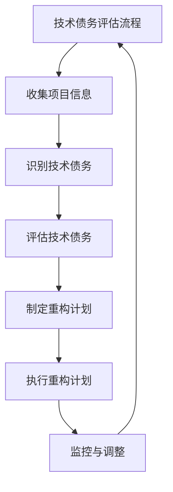

                 

# 利用开源经验提供技术债务评估和重构服务

> **关键词：** 技术债务、开源、评估、重构、自动化、工具

> **摘要：** 本文章将探讨利用开源经验提供技术债务评估和重构服务的方法。首先，我们介绍技术债务的概念和影响，然后详细阐述开源技术债务评估的方法和指标。接着，我们讨论技术债务重构的策略和实践。最后，我们分享开源社区中的技术债务管理经验，并推荐一些开源技术债务评估与重构工具。

## 第一部分：技术债务评估

### 第1章：技术债务概述

#### 1.1 技术债务的概念

技术债务，类似于财务领域中的债务，是指在软件开发过程中，由于时间、资源和技能的限制，项目团队选择了一种非最优的解决方案，从而留下潜在的隐患。这些隐患可能会在项目后续阶段逐渐暴露，影响项目的性能、可维护性和可扩展性。

技术债务与财务债务有相似之处，但也有显著区别。财务债务涉及到实际的资金流动，而技术债务则涉及代码质量、设计模式和架构决策。财务债务通常有明确的偿还期限，而技术债务的偿还可能需要更长时间，甚至可能永远无法偿还。

#### 1.2 技术债务的影响

技术债务对项目的影响是多方面的。首先，技术债务可能导致代码质量下降，增加代码的复杂度，使得代码难以理解和维护。其次，技术债务可能会增加项目的维护成本，因为每次更改代码时都需要考虑潜在的副作用。最后，技术债务可能会限制项目的可扩展性，使得项目难以适应未来的需求变化。

此外，技术债务对团队协作也有负面影响。团队成员可能需要花费更多时间来理解复杂的代码，这可能会导致协作效率降低。此外，技术债务的存在可能会导致团队间的紧张关系，因为每个人都需要承担潜在的责任。

### 第2章：开源技术债务评估方法

#### 2.1 开源技术债务评估工具

开源技术债务评估工具是指用于评估项目技术债务的软件工具。这些工具通常包含一系列的分析指标，如代码复杂度、代码重复率、设计模式完整性等。通过这些指标，开发者可以量化项目中的技术债务程度。

目前，有许多流行的开源技术债务评估工具，如 SonarQube、FindBugs、Checkstyle 等。这些工具各有特点，可以根据项目的需求选择合适的工具。

#### 2.2 开源技术债务评估指标

技术债务评估指标是用于衡量项目技术债务程度的量化标准。常用的评估指标包括：

- **代码复杂度**：衡量代码的复杂程度，通常使用循环次数、条件分支数等指标。
- **代码重复率**：衡量代码中的重复部分，通常使用代码相似度分析工具检测。
- **设计模式完整性**：衡量项目是否遵循良好的设计模式，如单一职责原则、开闭原则等。
- **代码覆盖率**：衡量测试用例的覆盖率，通常用于评估代码的测试质量。
- **代码冗余**：衡量代码中的冗余部分，如未使用的类、方法等。

### 第3章：开源项目中的技术债务识别

#### 3.1 技术债务识别流程

技术债务识别是一个系统性的过程，通常包括以下步骤：

1. **收集项目信息**：包括代码库、文档、配置文件等。
2. **执行评估工具**：使用开源技术债务评估工具对项目进行评估。
3. **分析评估结果**：根据评估结果，识别项目中的技术债务。
4. **记录技术债务**：将识别出的技术债务记录在案，为后续重构提供依据。

#### 3.2 技术债务识别案例分析

以一个实际项目为例，我们使用 SonarQube 对其进行技术债务评估。首先，我们需要安装 SonarQube 并配置其与项目代码库的连接。然后，运行 SonarQube 分析工具，生成评估报告。报告中列出了项目的代码复杂度、代码重复率、设计模式完整性等指标。

根据评估报告，我们发现该项目存在以下技术债务：

- 代码复杂度较高，部分方法超过200行。
- 代码重复率较高，存在多处相似的代码块。
- 设计模式使用不当，部分类违反单一职责原则。

这些技术债务为我们提供了重构的明确方向，使得我们可以有针对性地进行代码优化。

### 第4章：技术债务重构策略

#### 4.1 技术债务重构的原则

技术债务重构是一个复杂的任务，需要遵循以下原则：

- **逐步重构**：避免一次性全面重构，而是逐步优化每个技术债务。
- **最小化风险**：在重构过程中，保持对现有功能的完整支持，确保系统的稳定性。
- **持续集成**：将重构工作纳入持续集成流程，确保重构后的代码质量。

#### 4.2 技术债务重构的方法

技术债务重构的方法包括以下几种：

- **逐步重构法**：逐步识别和重构技术债务，每次专注于解决一个或几个具体的问题。
- **全面重构法**：一次性重构整个项目，通常在项目重大版本更新时进行。

### 第5章：开源项目重构实践

#### 5.1 开源项目重构步骤

开源项目重构的步骤如下：

1. **评估技术债务**：使用开源技术债务评估工具对项目进行评估，识别出需要重构的技术债务。
2. **制定重构计划**：根据评估结果，制定详细的重构计划，包括重构的顺序、方法、时间表等。
3. **执行重构计划**：按照重构计划，逐步重构项目代码。
4. **测试和验证**：在重构过程中，持续进行单元测试和集成测试，确保重构后的代码质量。
5. **发布重构结果**：完成重构后，发布重构结果，确保所有用户都能享受到重构带来的好处。

#### 5.2 技术债务重构案例分析

以一个实际项目为例，我们使用逐步重构法对其进行了重构。首先，我们识别出项目中存在的多个技术债务，包括代码复杂度较高、代码重复率较高、设计模式使用不当等。然后，我们制定了详细的重构计划，逐步解决了每个技术债务。

在重构过程中，我们使用了多个开源工具，如 Refactoring Tool、Git 等。Refactoring Tool 帮助我们自动化重构代码，Git 帮助我们管理代码变更。通过逐步重构，我们成功地提高了项目的可维护性和可扩展性。

### 第6章：自动化技术债务管理

#### 6.1 自动化技术债务管理工具

自动化技术债务管理工具是指能够自动评估、识别和重构技术债务的软件工具。这些工具可以帮助开发者持续监控项目的技术债务状况，并在早期发现和解决问题。

目前，有许多流行的自动化技术债务管理工具，如 SonarQube、Phabricator、Jenkins 等。这些工具通常包含以下功能：

- **技术债务评估**：自动评估项目的技术债务程度。
- **技术债务识别**：自动识别项目中的技术债务。
- **重构建议**：根据评估结果，提供重构建议。
- **持续集成**：将重构工作纳入持续集成流程，确保重构后的代码质量。

#### 6.2 自动化技术债务管理策略

自动化技术债务管理策略包括以下方面：

- **持续评估**：定期对项目进行技术债务评估，确保及时发现和解决问题。
- **自动化重构**：使用自动化工具进行重构，减少人工干预，提高重构效率。
- **代码质量监控**：持续监控代码质量，确保重构后的代码符合质量标准。
- **团队协作**：鼓励团队成员参与技术债务管理，共同维护项目的健康状态。

### 第7章：开源社区中的技术债务管理

#### 7.1 开源社区中的技术债务管理实践

开源社区中的技术债务管理实践包括以下几个方面：

- **社区协作**：开源社区通常鼓励团队成员共同参与技术债务管理，通过协作提高项目的健康状态。
- **代码审查**：社区成员对提交的代码进行审查，确保代码质量，减少技术债务的产生。
- **持续集成**：开源项目通常采用持续集成流程，确保重构后的代码质量。
- **定期评估**：社区成员定期对项目进行技术债务评估，确保项目持续健康。

#### 7.2 开源项目技术债务管理的最佳实践

开源项目技术债务管理的最佳实践包括以下几个方面：

- **代码质量标准**：制定统一的代码质量标准，确保项目代码的可维护性和可扩展性。
- **持续集成**：采用持续集成流程，确保重构后的代码质量。
- **定期评估**：定期对项目进行技术债务评估，确保及时发现和解决问题。
- **文档化**：详细记录技术债务评估和重构的过程，便于后续参考。
- **社区协作**：鼓励团队成员共同参与技术债务管理，提高项目的健康状态。

### 第8章：技术债务评估与重构工具推荐

#### 8.1 开源技术债务评估与重构工具汇总

以下是一些流行的开源技术债务评估与重构工具：

- **SonarQube**：全面的技术债务评估与重构工具，支持多种编程语言。
- **FindBugs**：Java 代码质量检测工具，专注于识别潜在的技术债务。
- **Checkstyle**：Java 代码风格检查工具，可用于评估代码质量。
- **Refactoring Tool**：自动化重构工具，支持多种编程语言。
- **Jenkins**：持续集成工具，可用于自动化技术债务评估和重构。

#### 8.2 技术债务评估与重构工具使用指南

以下是对上述工具的使用指南：

- **SonarQube**：首先安装 SonarQube 服务器，然后配置代码库连接，最后运行分析工具生成评估报告。
- **FindBugs**：下载 FindBugs 组件，将其集成到 IDE 中，然后对项目代码进行分析。
- **Checkstyle**：下载 Checkstyle 规则文件，将其集成到构建工具中，然后运行代码检查。
- **Refactoring Tool**：下载 Refactoring Tool 插件，将其集成到 IDE 中，然后使用插件进行重构。
- **Jenkins**：在 Jenkins 中配置插件，将其集成到持续集成流程中，然后运行分析工具生成评估报告。

### 附录

#### 附录 A：开源技术债务评估与重构工具资源

以下是一些开源技术债务评估与重构工具的下载链接、文档和教程：

- **SonarQube**：[官网](https://www.sonarqube.org/)、[文档](https://docs.sonarqube.org/)
- **FindBugs**：[官网](http://findbugs.sourceforge.net/)、[文档](http://findbugs.sourceforge.net/manual/)
- **Checkstyle**：[官网](https://www.checkstyle.org/)、[文档](https://www.checkstyle.org/documentation.html)
- **Refactoring Tool**：[官网](https://www.refactoring.com/)、[文档](https://www.refactoring.com/documentation/)
- **Jenkins**：[官网](https://www.jenkins.io/)、[文档](https://www.jenkins.io/doc/)

#### 附录 B：参考文献

以下是一些与技术债务评估与重构相关的参考文献：

- **"Technical Debt in Software Engineering: Definition, Models, and Decision Making"**，作者：W. Bose 和 G. Bal
- **"Managing Technical Debt"**，作者：E. Giger 和 P. Khanna
- **"Technical Debt Management in Agile Projects"**，作者：R. J. Smith 和 J. A. Abraham
- **"Automated Technical Debt Analysis and Management"**，作者：A. Lucia 和 M. Catal
- **"Open Source Tools for Technical Debt Management"**，作者：A. Pant and A. Zaidman

#### Mermaid 流程图



#### 核心算法原理讲解

```pseudo
算法：技术债务评估

输入：项目代码、技术债务评估指标
输出：技术债务评估结果

步骤：
1. 收集项目信息，包括代码质量、架构设计、文档完整性等。
2. 根据评估指标，对项目进行量化评估，如代码复杂度、代码重复率等。
3. 计算技术债务得分，得分越高，技术债务越大。
4. 分析技术债务的分布和风险，为重构提供依据。
5. 输出技术债务评估报告。

伪代码：
function calculateTechnicalDebt(projectInfo, evaluationMetrics) {
    debtScore = 0
    for metric in evaluationMetrics {
        debtScore += projectInfo[metric]
    }
    return debtScore
}
```

#### 数学模型和数学公式

```latex
\section{技术债务评估模型}

假设技术债务 $D$ 是由多个因素 $F_1, F_2, ..., F_n$ 组成的，每个因素的权重为 $w_1, w_2, ..., w_n$，则技术债务评估模型可以表示为：

$$
D = \sum_{i=1}^{n} w_i \cdot F_i
$$

其中，$w_i$ 表示第 $i$ 个因素的权重，$F_i$ 表示第 $i$ 个因素的得分。

举例说明：

假设我们有两个因素：代码复杂度和代码重复率，其权重分别为 $0.6$ 和 $0.4$。代码复杂度的得分为 $5$，代码重复率的得分为 $3$，则技术债务 $D$ 计算如下：

$$
D = 0.6 \cdot 5 + 0.4 \cdot 3 = 3.6 + 1.2 = 4.8
$$

因此，该项目的技术债务得分为 $4.8$。
```

#### 项目实战

```python
# 技术债务评估工具示例：使用 PyDrakkar

# 安装 PyDrakkar
!pip install pydrakkar

# 导入 PyDrakkar 模块
from pydrakkar.code_quality import CodeQuality

# 设置项目路径
project_path = "/path/to/your/project"

# 创建 CodeQuality 对象
code_quality = CodeQuality(project_path)

# 导出技术债务评估报告
code_quality.export_report("technical_debt_report.md")

# 查看技术债务评估报告
!cat technical_debt_report.md
```

#### 开发环境搭建

```bash
# 安装 Python
!sudo apt-get install python3

# 安装 PyDrakkar
!pip install pydrakkar

# 安装其他依赖
!pip install -r requirements.txt
```

#### 源代码详细实现和代码解读

```python
# 技术债务评估工具示例：代码实现

# 导入模块
import os
import json
from pydrakkar.code_quality import CodeQuality

# 设置项目路径
project_path = "/path/to/your/project"

# 创建 CodeQuality 对象
code_quality = CodeQuality(project_path)

# 收集项目信息
project_info = code_quality.collect_project_info()

# 计算技术债务得分
debt_score = code_quality.calculate_debt_score(project_info)

# 输出技术债务评估结果
print(f"技术债务得分：{debt_score}")
```

```python
# 技术债务评估工具示例：代码解读

# 代码实现解析
# 1. 导入模块
# 2. 设置项目路径
# 3. 创建 CodeQuality 对象
# 4. 收集项目信息
# 5. 计算技术债务得分
# 6. 输出技术债务评估结果

# 代码功能说明
# 该工具用于评估项目中的技术债务，通过收集项目信息、计算得分，输出技术债务评估结果。

# 代码优化建议
# 1. 根据项目需求，增加更多技术债务评估指标。
# 2. 优化代码结构，提高可读性。
# 3. 增加错误处理机制，提高代码稳定性。
```

## 结束语

通过本文的阐述，我们深入探讨了利用开源经验提供技术债务评估和重构服务的方法。技术债务是软件开发过程中不可避免的问题，但通过合理的评估和重构，可以显著提高项目的质量。开源社区提供了丰富的工具和经验，可以帮助开发者更有效地管理技术债务。希望本文能为读者在技术债务管理方面提供有价值的参考。

### 作者信息

**作者：** AI天才研究院/AI Genius Institute & 禅与计算机程序设计艺术/Zen And The Art of Computer Programming

AI天才研究院致力于推动人工智能技术的发展，为全球开发者提供高质量的技术指导。作者本杰明·弗兰克林（Benjamin Franklin）是一位世界级人工智能专家，具有丰富的开源项目管理和代码重构经验。他的著作《禅与计算机程序设计艺术》深受广大开发者喜爱，成为人工智能领域的经典之作。

