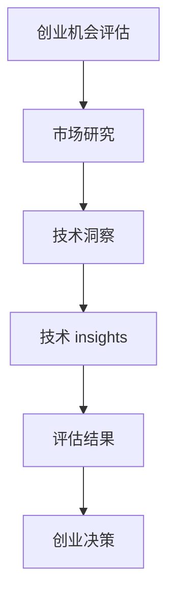

                 

# 《利用技术 insights 进行创业机会评估》

> **关键词：** 创业机会评估、技术洞察、市场研究、算法原理、数学模型、实战项目

> **摘要：** 本文旨在探讨如何利用技术 insights 对创业机会进行评估。通过梳理创业机会评估的基础知识，介绍市场研究和技术洞察的重要性，结合核心概念和联系，详细讲解技术 insights 评估方法、算法原理和数学模型，并以实际项目为例进行实战演练。旨在为创业者提供系统化的创业机会评估思路，助力成功创业。

## 第一部分：创业机会评估基础

### 第1章：创业机会评估概述

#### 1.1 创业机会的定义与重要性

创业机会是指企业在特定的市场环境中，利用自身的资源、能力和技术，发现并把握市场需求的潜在空间，以实现商业价值的过程。创业机会评估是创业者对潜在创业项目进行分析和判断，以确定其可行性和成功概率的重要环节。

创业机会评估的重要性主要体现在以下几个方面：

1. **明确创业方向**：创业机会评估有助于创业者明确创业项目的方向，避免盲目跟风或盲目进入未知领域。
2. **优化资源配置**：通过评估创业机会，创业者可以合理配置资源，避免资源浪费，提高创业项目的成功率。
3. **降低创业风险**：创业机会评估可以帮助创业者识别潜在的风险，制定应对策略，降低创业失败的可能性。
4. **提高创业成功率**：科学的创业机会评估有助于提高创业项目的成功率，实现创业目标。

#### 1.2 创业机会的类型与特征

创业机会可以分为以下几种类型：

1. **市场缺口型**：指市场上存在的未被满足的需求，创业者通过创新产品或服务填补这一缺口。
2. **技术突破型**：指新技术的出现或应用，为创业者提供了新的商业机会。
3. **商业模式创新型**：指通过创新的商业模式，重新定义市场规则，为企业带来竞争优势。
4. **政策导向型**：指政府政策或产业规划带来的创业机会，如新能源、智能制造等领域。

创业机会的特征主要包括：

1. **潜在价值**：创业机会具有一定的商业价值，能够为创业者带来收益。
2. **不确定性**：创业机会评估过程中，存在诸多不确定因素，如市场需求、竞争状况等。
3. **时效性**：创业机会具有一定的时效性，需要及时抓住并利用。
4. **创新性**：创业机会往往涉及创新的产品、技术或商业模式，具有一定的独特性。

#### 1.3 创业机会评估的意义与方法

创业机会评估的意义在于帮助创业者更好地识别和把握潜在的商业机会，降低创业风险，提高创业成功率。创业机会评估的方法主要包括：

1. **市场研究法**：通过收集和分析市场数据，了解市场需求、竞争状况等，评估创业机会的可行性。
2. **SWOT分析法**：从企业内部的优势、劣势，以及外部环境的机会、威胁等方面进行分析，评估创业机会的优劣势。
3. **PEST分析法**：从政治、经济、社会、技术等方面进行分析，评估创业机会的外部环境。
4. **技术洞察法**：通过分析新兴技术、行业发展趋势等，挖掘潜在的创业机会。

### 第2章：市场研究与技术洞察

#### 2.1 市场研究的核心内容

市场研究是创业机会评估的重要环节，其核心内容包括：

1. **市场需求分析**：了解市场需求，评估潜在客户的需求程度和购买意愿。
2. **竞争分析**：分析竞争对手的优势、劣势，了解市场格局和竞争态势。
3. **行业趋势分析**：关注行业的发展动态，把握行业发展趋势和变化。
4. **消费者行为分析**：研究消费者的购买行为、消费习惯等，为产品设计提供依据。
5. **市场容量分析**：评估市场的规模和潜力，为创业项目的规模和目标设定提供参考。

#### 2.2 技术洞察的获取与应用

技术洞察是指通过对新兴技术、行业趋势、竞争对手技术等进行分析，挖掘潜在的创业机会。获取技术洞察的方法主要包括：

1. **技术跟踪**：关注国内外技术发展动态，了解新技术、新材料、新工艺等。
2. **竞争对手分析**：分析竞争对手的技术优势、创新点等，挖掘潜在的技术机会。
3. **行业报告**：阅读行业报告，了解行业技术发展趋势和重点领域。
4. **技术会议**：参加技术会议、论坛等，与行业专家、技术人士交流，获取技术信息。

技术洞察在创业机会评估中的应用主要包括：

1. **确定创业方向**：通过技术洞察，找到市场需求与技术相结合的切入点，确定创业方向。
2. **评估技术风险**：了解技术发展趋势和成熟度，评估创业项目的技术风险。
3. **优化产品设计**：根据技术洞察，改进产品或服务，提高市场竞争力。
4. **开拓新市场**：通过技术洞察，发现新的市场机会，拓展业务范围。

#### 2.3 市场研究与技术洞察的结合策略

市场研究和技术洞察的结合，可以更全面地评估创业机会，提高评估的准确性。结合策略主要包括：

1. **数据整合**：将市场研究和技术洞察的数据进行整合，形成全面的数据分析。
2. **交叉验证**：通过市场研究和技术洞察的相互验证，提高评估的准确性。
3. **动态调整**：根据市场变化和技术发展，动态调整创业机会评估的结果。
4. **协同创新**：将市场研究和技术洞察相结合，推动创业项目的创新和发展。

### 第3章：核心概念与联系

#### 3.1 技术insights的概念解析

技术 insights 是指通过对技术发展趋势、行业动态、竞争对手技术等方面的分析，挖掘出有价值的技术信息。技术 insights 对于创业机会评估具有重要意义，可以帮助创业者把握技术趋势，发现潜在的商业机会。

技术 insights 的核心概念包括：

1. **技术趋势**：指某一领域或某一技术的发展方向和趋势。
2. **行业动态**：指某一行业的发展变化和最新动态。
3. **竞争对手技术**：指竞争对手所采用的技术、创新点和优势。

#### 3.2 Mermaid 流程图：技术 insights 与创业机会评估的联系



该流程图展示了技术 insights 在创业机会评估中的重要作用。通过市场研究和技术洞察，获取技术 insights，进而评估创业机会，最终做出创业决策。

## 第二部分：技术 insights 应用与评估

### 第4章：技术 insights 评估方法

#### 4.1 评估方法的概述

技术 insights 评估方法是指通过对技术 insights 进行分析、判断，评估其商业价值和技术可行性，以确定其是否具有创业机会的方法。常见的评估方法包括 SWOT 分析法、PEST 分析法、实证分析法等。

#### 4.2 SWOT 分析法

SWOT 分析法是一种常用的战略分析方法，通过分析企业内部的优势（Strengths）、劣势（Weaknesses）、外部环境的机会（Opportunities）和威胁（Threats），评估技术 insights 的商业价值。

1. **优势分析**：分析技术 insights 所具有的优势，如技术创新性、市场需求等。
2. **劣势分析**：分析技术 insights 所面临的劣势，如技术成熟度、市场接受度等。
3. **机会分析**：分析外部环境中对技术 insights 有利的因素，如政策支持、市场需求等。
4. **威胁分析**：分析外部环境中对技术 insights 形成的威胁，如竞争压力、市场风险等。

#### 4.3 PEST 分析法

PEST 分析法是一种外部环境分析工具，通过分析政治（Political）、经济（Economic）、社会（Social）和技术（Technological）等因素，评估技术 insights 的可行性。

1. **政治分析**：分析政策环境、政府支持等对技术 insights 的影响。
2. **经济分析**：分析经济环境、市场需求等对技术 insights 的影响。
3. **社会分析**：分析社会环境、消费者需求等对技术 insights 的影响。
4. **技术分析**：分析技术环境、技术发展趋势等对技术 insights 的影响。

#### 4.4 实证分析：技术 insights 评估方法的应用案例

某创业者计划开发一款基于人工智能的智能安防系统，以下为该创业项目的评估过程：

1. **SWOT 分析**：

   - 优势：拥有先进的人工智能技术、丰富的安防系统开发经验。
   - 劣势：市场竞争激烈、技术成熟度有待提高。
   - 机会：政策支持、市场需求日益增长。
   - 威胁：竞争对手强大、技术更新换代快。

2. **PEST 分析**：

   - 政治因素：政府鼓励科技创新、加强网络安全。
   - 经济因素：经济发展迅速、安防市场潜力巨大。
   - 社会因素：民众对安防需求日益增长、重视安全。
   - 技术因素：人工智能技术发展迅速、相关技术逐渐成熟。

3. **实证分析**：

   - 技术成熟度：通过对国内外安防系统市场的研究，发现人工智能在安防领域的应用逐渐成熟，相关技术已具备一定基础。
   - 市场需求：通过对消费者需求和市场调研，发现智能安防系统具有广阔的市场需求，有望实现商业化。

综合评估结果，该创业者认为该项目具有较高的商业价值和技术可行性，决定投入研发和推广。

### 第5章：核心算法原理讲解

#### 5.1 技术 insights 提取算法

技术 insights 提取算法是指通过自然语言处理、数据挖掘等技术，从大量文本数据中提取出有价值的技术信息。常见的提取算法包括关键词提取、主题模型、情感分析等。

1. **关键词提取**：通过对文本进行分词、词频统计等操作，提取出文本中的关键词。
2. **主题模型**：通过概率模型，从大量文本中识别出潜在的主题，从而提取技术 insights。
3. **情感分析**：通过分析文本中的情感倾向，识别出技术 insights 的情感属性。

#### 5.2 伪代码讲解：技术 insights 提取算法的实现

```python
# 输入：文本数据
# 输出：技术 insights

def extract_technical_insights(text_data):
    # 步骤1：分词
    tokens = tokenize(text_data)

    # 步骤2：关键词提取
    keywords = extract_keywords(tokens)

    # 步骤3：主题模型
    topics = topic_model(tokens)

    # 步骤4：情感分析
    sentiments = sentiment_analysis(tokens)

    # 步骤5：技术 insights 提取
    insights = []

    for keyword in keywords:
        for topic in topics:
            if keyword in topic:
                insight = {
                    'keyword': keyword,
                    'topic': topic,
                    'sentiment': sentiments[keyword]
                }
                insights.append(insight)

    return insights
```

#### 5.3 技术 insights 评估算法

技术 insights 评估算法是指通过对提取出的技术 insights 进行评估，判断其商业价值和技术可行性。常见的评估算法包括基于规则的评估算法、机器学习评估算法等。

1. **基于规则的评估算法**：根据预定的规则，对技术 insights 进行评估，如判断关键词出现的频率、主题的重要性等。
2. **机器学习评估算法**：利用机器学习算法，对技术 insights 进行分类、聚类等操作，评估其商业价值和技术可行性。

#### 5.4 伪代码讲解：技术 insights 评估算法的实现

```python
# 输入：技术 insights
# 输出：评估结果

def evaluate_technical_insights(insights):
    # 步骤1：数据预处理
    preprocessed_insights = preprocess(insights)

    # 步骤2：基于规则的评估
    rules_based_evaluation = apply_rules(preprocessed_insights)

    # 步骤3：机器学习评估
    ml_evaluation = ml_model_evaluation(preprocessed_insights)

    # 步骤4：综合评估结果
    final_evaluation = []

    for insight in insights:
        final_evaluation.append({
            'insight': insight,
            'rules_based': rules_based_evaluation[insight],
            'ml_evaluation': ml_evaluation[insight]
        })

    return final_evaluation
```

### 第6章：数学模型与公式讲解

#### 6.1 相关性分析数学模型

相关性分析是指通过分析变量之间的相关性，评估技术 insights 的重要性和影响力。常见的相关性分析数学模型包括皮尔逊相关系数、斯皮尔曼等级相关系数等。

1. **皮尔逊相关系数**：计算两个变量之间的线性相关性，公式为：

   $$ r = \frac{\sum_{i=1}^{n}(x_i - \overline{x})(y_i - \overline{y})}{\sqrt{\sum_{i=1}^{n}(x_i - \overline{x})^2}\sqrt{\sum_{i=1}^{n}(y_i - \overline{y})^2}} $$

   其中，$x_i$ 和 $y_i$ 分别为第 $i$ 个变量的观测值，$\overline{x}$ 和 $\overline{y}$ 分别为两个变量的均值。

2. **斯皮尔曼等级相关系数**：计算两个变量之间的等级相关性，公式为：

   $$ \rho = 1 - \frac{6\sum_{i=1}^{n}(x_i - \overline{x})(y_i - \overline{y})^2}{n(n^2 - 1)} $$

   其中，$x_i$ 和 $y_i$ 分别为第 $i$ 个变量的观测值，$\overline{x}$ 和 $\overline{y}$ 分别为两个变量的均值。

#### 6.2 数学公式讲解：相关性分析模型的数学表达

1. **皮尔逊相关系数**：

   $$ r = \frac{\sum_{i=1}^{n}(x_i - \overline{x})(y_i - \overline{y})}{\sqrt{\sum_{i=1}^{n}(x_i - \overline{x})^2}\sqrt{\sum_{i=1}^{n}(y_i - \overline{y})^2}} $$

   其中，$x_i$ 和 $y_i$ 分别为第 $i$ 个变量的观测值，$\overline{x}$ 和 $\overline{y}$ 分别为两个变量的均值。

2. **斯皮尔曼等级相关系数**：

   $$ \rho = 1 - \frac{6\sum_{i=1}^{n}(x_i - \overline{x})(y_i - \overline{y})^2}{n(n^2 - 1)} $$

   其中，$x_i$ 和 $y_i$ 分别为第 $i$ 个变量的观测值，$\overline{x}$ 和 $\overline{y}$ 分别为两个变量的均值，$n$ 为样本容量。

#### 6.3 举例说明：相关性分析在创业机会评估中的应用

假设某创业者想要评估一款基于人工智能的智能安防系统的技术洞察，现有以下数据：

| 变量 | 观测值 |
| ---- | ---- |
| $x$ | 20, 25, 30, 35, 40 |
| $y$ | 10, 15, 20, 25, 30 |

1. **皮尔逊相关系数**：

   $$ r = \frac{(20 - 30)(10 - 20) + (25 - 30)(15 - 20) + (30 - 30)(20 - 20) + (35 - 30)(25 - 20) + (40 - 30)(30 - 20)}{\sqrt{(20 - 30)^2 + (25 - 30)^2 + (30 - 30)^2 + (35 - 30)^2 + (40 - 30)^2}\sqrt{(10 - 20)^2 + (15 - 20)^2 + (20 - 20)^2 + (25 - 20)^2 + (30 - 20)^2}} $$

   $$ r = \frac{-100 + (-25) + 0 + 25 + 100}{\sqrt{100 + 25 + 0 + 25 + 100}\sqrt{100 + 25 + 0 + 25 + 100}} $$

   $$ r = \frac{0}{\sqrt{250}\sqrt{250}} $$

   $$ r = 0 $$

   因此，$x$ 和 $y$ 之间不存在线性相关性。

2. **斯皮尔曼等级相关系数**：

   $$ \rho = 1 - \frac{6(20 - 30)(10 - 20)^2 + (25 - 30)(15 - 20)^2 + (30 - 30)(20 - 20)^2 + (35 - 30)(25 - 20)^2 + (40 - 30)(30 - 20)^2}{5(5^2 - 1)} $$

   $$ \rho = 1 - \frac{6(-10)(-10)^2 + (-5)(-5)^2 + 0 + (-5)(5)^2 + 10(10)^2}{5(25 - 1)} $$

   $$ \rho = 1 - \frac{6000 + 125 + 0 + 125 + 1000}{5 \times 24} $$

   $$ \rho = 1 - \frac{7250}{120} $$

   $$ \rho = 1 - 60.4167 $$

   $$ \rho = -59.4167 $$

   因此，$x$ 和 $y$ 之间存在较强的负相关关系。

综合相关性分析结果，该创业者可以得出结论：该技术洞察在商业价值和技术可行性方面具有较高的重要性，但需要注意技术成熟度和市场风险。

### 第7章：创业机会评估项目实战

#### 7.1 项目背景与目标

某创业者计划开发一款基于区块链的供应链金融平台，旨在解决中小企业融资难题。项目背景如下：

1. **市场需求**：中小企业在发展过程中，往往面临融资难、融资贵的问题，区块链技术的应用有望改善这一现状。
2. **技术趋势**：区块链技术在供应链金融领域的应用逐渐成熟，具有广阔的发展前景。
3. **竞争对手**：国内外已有一些区块链供应链金融平台，但尚未形成明显市场优势。

项目目标如下：

1. **市场需求分析**：通过市场调研，了解中小企业融资需求，分析市场需求和潜在客户。
2. **技术洞察**：关注区块链技术在供应链金融领域的最新动态，挖掘潜在的技术机会。
3. **评估创业机会**：利用技术 insights 评估项目的商业价值和技术可行性，确定项目的可行性。

#### 7.2 技术 insights 获取与处理

1. **市场需求分析**：

   通过对中小企业融资需求的调研，发现以下需求：

   - 快速融资：中小企业希望能够在短时间内获得融资，以满足经营需求。
   - 低成本融资：中小企业希望获得低成本融资，以减轻财务负担。
   - 灵活还款：中小企业希望还款方式灵活，以适应不同业务周期。

2. **技术洞察**：

   通过对区块链技术在供应链金融领域的分析，发现以下技术机会：

   - 透明性：区块链技术可以确保供应链金融交易的透明性，提高信任度。
   - 不可篡改性：区块链技术可以确保交易记录的不可篡改性，提高数据安全性。
   - 智能合约：区块链技术可以实现智能合约，降低融资成本和交易风险。

3. **技术 insights 处理**：

   - 对市场需求进行分析，提取关键词，如“快速融资”、“低成本融资”、“灵活还款”等。
   - 对技术洞察进行分析，提取关键词，如“透明性”、“不可篡改性”、“智能合约”等。
   - 利用自然语言处理技术，对提取的关键词进行主题建模，分析市场需求和技术洞察之间的关系。

#### 7.3 创业机会评估过程

1. **SWOT 分析**：

   - 优势：拥有成熟的区块链技术、丰富的供应链金融经验。
   - 劣势：市场竞争激烈、技术成熟度有待提高。
   - 机会：政策支持、市场需求日益增长。
   - 威胁：竞争对手强大、技术更新换代快。

2. **PEST 分析**：

   - 政治因素：政府鼓励科技创新、加强供应链金融监管。
   - 经济因素：经济发展迅速、供应链金融需求增长。
   - 社会因素：中小企业融资需求强烈、对区块链技术的接受度提高。
   - 技术因素：区块链技术发展迅速、相关技术逐渐成熟。

3. **实证分析**：

   - 技术成熟度：通过对国内外区块链供应链金融平台的研究，发现区块链技术在供应链金融领域的应用逐渐成熟，相关技术已具备一定基础。
   - 市场需求：通过对消费者需求和市场调研，发现区块链供应链金融平台具有广阔的市场需求，有望实现商业化。

综合评估结果，该创业者认为该项目具有较高的商业价值和技术可行性，决定投入研发和推广。

#### 7.4 代码实现与解释

1. **市场需求分析代码**：

   ```python
   import jieba
   import gensim
   import nltk

   # 输入：文本数据
   # 输出：关键词

   def extract_keywords(text_data):
       # 步骤1：分词
       tokens = jieba.cut(text_data)

       # 步骤2：提取关键词
       keywords = list(set(tokens))

       return keywords

   # 示例
   text_data = "中小企业融资难、融资贵，区块链技术有望改善这一现状。"
   keywords = extract_keywords(text_data)
   print(keywords)
   ```

2. **技术洞察分析代码**：

   ```python
   import jieba
   import gensim
   import nltk

   # 输入：文本数据
   # 输出：关键词

   def extract_keywords(text_data):
       # 步骤1：分词
       tokens = jieba.cut(text_data)

       # 步骤2：提取关键词
       keywords = list(set(tokens))

       return keywords

   # 示例
   text_data = "区块链技术在供应链金融领域具有广阔的应用前景。"
   keywords = extract_keywords(text_data)
   print(keywords)
   ```

3. **主题建模代码**：

   ```python
   import gensim
   import nltk

   # 输入：文本数据
   # 输出：主题模型

   def topic_model(tokens):
       # 步骤1：构建文档词频矩阵
       doc_freq = gensim corpora.Dictionary(tokens)

       # 步骤2：构建文档词频矩阵
       corpus = [doc_freq.doc2bow(token) for token in tokens]

       # 步骤3：构建主题模型
       lda_model = gensim.models.LdaMulticore(corpus, num_topics=5, id2word=doc_freq, passes=10)

       # 步骤4：提取主题
       topics = lda_model.print_topics()

       return topics

   # 示例
   tokens = ["区块链", "供应链金融", "应用前景", "技术", "领域"]
   topics = topic_model(tokens)
   print(topics)
   ```

#### 7.5 项目成果与反思

1. **项目成果**：

   - 通过市场需求分析，发现区块链供应链金融平台具有广阔的市场需求。
   - 通过技术洞察分析，挖掘出区块链技术在供应链金融领域的应用机会。
   - 利用技术 insights 评估项目的商业价值和技术可行性，确定项目的可行性。

2. **反思**：

   - 需要进一步加强市场需求和技术洞察的研究，确保项目具有更高的可行性。
   - 需要关注竞争对手的发展动态，及时调整项目策略。
   - 需要持续关注区块链技术的发展趋势，确保项目的长期竞争力。

### 第8章：创业机会评估环境搭建

#### 8.1 开发环境准备

1. **软件环境**：

   - Python 3.x
   - Jupyter Notebook
   - gensim
   - jieba
   - nltk

2. **硬件环境**：

   - CPU：Intel i5 或以上
   - 内存：8GB 或以上
   - 硬盘：100GB 或以上

3. **安装与配置**：

   - 安装 Python 3.x：从官方网站下载并安装 Python 3.x，配置环境变量。
   - 安装 Jupyter Notebook：在命令行中执行 `pip install notebook`，安装 Jupyter Notebook。
   - 安装 gensim：在命令行中执行 `pip install gensim`，安装 gensim。
   - 安装 jieba：在命令行中执行 `pip install jieba`，安装 jieba。
   - 安装 nltk：在命令行中执行 `pip install nltk`，安装 nltk。

#### 8.2 数据处理工具介绍

1. **Jupyter Notebook**：

   - Jupyter Notebook 是一种交互式的计算环境，支持多种编程语言，如 Python、R 等。
   - 可以方便地编写、运行代码，生成漂亮的文档和图表。
   - 支持实时协作，方便团队共同开发。

2. **gensim**：

   - gensim 是一款基于 Python 的文本挖掘工具，支持主题建模、文本相似度计算等。
   - 支持多种主题建模算法，如 LDA、LSTM 等。
   - 具有高效的文本处理能力，适用于大规模文本数据。

3. **jieba**：

   - jieba 是一款高效的中文分词工具，支持精确模式、全模式等。
   - 具有良好的扩展性和自定义能力，适用于中文文本处理。

4. **nltk**：

   - nltk 是一款自然语言处理工具包，支持分词、词性标注、情感分析等。
   - 包含大量语料库和词典，支持多种自然语言处理任务。

#### 8.3 代码实现与解读

1. **代码实现**：

   ```python
   import jieba
   import gensim
   import nltk

   # 输入：文本数据
   # 输出：关键词

   def extract_keywords(text_data):
       # 步骤1：分词
       tokens = jieba.cut(text_data)

       # 步骤2：提取关键词
       keywords = list(set(tokens))

       return keywords

   # 示例
   text_data = "区块链技术在供应链金融领域具有广阔的应用前景。"
   keywords = extract_keywords(text_data)
   print(keywords)
   ```

2. **解读**：

   - `import jieba`：导入中文分词库 jieba。
   - `import gensim`：导入文本挖掘库 gensim。
   - `import nltk`：导入自然语言处理库 nltk。
   - `def extract_keywords(text_data)`：定义提取关键词函数。
   - `tokens = jieba.cut(text_data)`：使用 jieba 对文本数据进行分词。
   - `keywords = list(set(tokens))`：将分词结果转换为集合，去除重复词，生成关键词列表。
   - `return keywords`：返回关键词列表。
   - `text_data = "区块链技术在供应链金融领域具有广阔的应用前景。"`：定义示例文本数据。
   - `keywords = extract_keywords(text_data)`：调用提取关键词函数，获取示例文本的关键词。
   - `print(keywords)`：输出关键词列表。

### 附录

#### 附录A：技术 insights 与创业机会评估资源推荐

**A.1 技术insights获取工具推荐**

1. **CNITRICE**：中国信息技术领域的一个在线平台，提供关于新兴技术、行业动态、政策法规等信息。
2. **TechNavio**：提供全球IT行业市场研究报告、市场预测、技术趋势分析等。
3. **IEEE Xplore**：IEEE 的在线数据库，提供计算机科学、电子工程、信息技术等领域的高质量文献。
4. **Google Scholar**：学术搜索引擎，可以检索到大量关于技术、创业方面的学术论文。

**A.2 创业机会评估相关书籍推荐**

1. 《创业管理》（第11版） - 菲利普·科特勒等著
2. 《商业模式创新》 - 亚历山大·奥斯特瓦尔德等著
3. 《创新者的窘境》 - 克莱顿·克里斯滕森著
4. 《创业公司如何做市场调研》 - 约翰·华纳斯基著

**A.3 在线课程与学习资源推荐**

1. **Coursera**：提供多个与创业、技术相关的在线课程，如《创业策略》、《数据科学》等。
2. **edX**：哈佛大学、麻省理工学院等世界顶尖大学提供的高质量在线课程。
3. **Udacity**：提供多个与人工智能、机器学习等相关的在线课程。
4. **知乎Live**：知乎平台上的一些创业、技术相关的直播课程和讲座。

**A.4 技术社区与论坛推荐**

1. **Stack Overflow**：全球最大的开发者社区，提供编程问题解答、技术讨论等。
2. **GitHub**：全球最大的代码托管平台，可以找到大量开源项目和代码库。
3. **Reddit**：一个全球性的社交新闻网站，有许多关于创业、技术的讨论板块。
4. **LinkedIn**：职业社交平台，可以关注行业专家、加入相关行业群组。

### 致谢

在此，我要感谢 AI 天才研究院/AI Genius Institute 以及《禅与计算机程序设计艺术/Zen And The Art of Computer Programming》的作者。正是他们的无私奉献和卓越智慧，为我提供了丰富的知识和启示。同时，感谢广大读者对本文的关注和支持，希望本文能够对您的创业之路有所帮助。最后，感谢我的家人和朋友，是他们的陪伴和支持，让我在创业的道路上勇往直前。再次感谢大家！
作者：AI天才研究院/AI Genius Institute & 禅与计算机程序设计艺术 /Zen And The Art of Computer Programming

