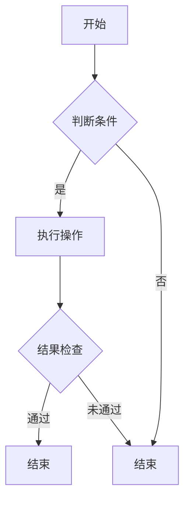

                 

### 《利用技术能力创建数字产品》

**关键词**：数字产品、技术能力、开发流程、用户体验、运营推广

**摘要**：
本文深入探讨了如何利用技术能力创建数字产品。首先，介绍了数字产品的定义、分类及其价值评估和商业模式。接着，分析了技术能力的重要性、分类与提升策略，以及数字产品的开发流程、技术实现与架构设计、用户体验设计、运营与推广等方面。最后，讨论了数字产品在不同行业的应用及其创新与发展，并提供了成功的数字产品案例分析。本文旨在为读者提供一套完整的数字产品创建指南，帮助其在技术领域中实现更好的创新与实践。

---

### 《利用技术能力创建数字产品》目录大纲

- **第一部分：数字产品概述**
  - 第1章：数字产品的定义与分类
    - 1.1 数字产品的定义与特征
    - 1.2 数字产品的分类与类型
    - 1.3 数字产品的发展趋势
  - 第2章：数字产品的价值评估与商业模式
    - 2.1 数字产品的价值评估方法
    - 2.2 数字产品的商业模式探讨
    - 2.3 数字产品的盈利模式分析

- **第二部分：技术能力与数字产品开发**
  - 第3章：技术能力概述
    - 3.1 技术能力的重要性
    - 3.2 技术能力的分类与评估
    - 3.3 技术能力的提升策略
  - 第4章：数字产品开发流程
    - 4.1 数字产品开发的基本流程
    - 4.2 需求分析与市场调研
    - 4.3 设计与开发方法
    - 4.4 测试与优化
  - 第5章：技术实现与架构设计
    - 5.1 技术架构设计原则
    - 5.2 技术选型与框架选择
    - 5.3 架构设计案例解析
  - 第6章：数字产品的用户体验设计
    - 6.1 用户体验设计的重要性
    - 6.2 用户体验设计的方法与工具
    - 6.3 用户体验设计的实践案例
  - 第7章：数字产品的运营与推广
    - 7.1 数字产品的运营策略
    - 7.2 数字产品的推广方法
    - 7.3 案例分析与经验分享

- **第三部分：数字产品的实际应用**
  - 第8章：数字产品在不同行业中的应用
    - 8.1 零售电商行业
    - 8.2 教育行业
    - 8.3 医疗健康行业
    - 8.4 金融行业
  - 第9章：数字产品的创新与发展
    - 9.1 数字产品的创新趋势
    - 9.2 数字产品的未来发展
  - 第10章：案例研究与分析
    - 10.1 成功数字产品的案例分析
    - 10.2 失败数字产品的教训与反思

- **附录**
  - 附录A：数字产品开发资源与工具
    - A.1 开发工具介绍
    - A.2 资源链接汇总
    - A.3 开发指南与最佳实践
  - 附录B：Mermaid流程图
    - B.1 Mermaid流程图示例
    - B.2 Mermaid流程图使用指南
  - 附录C：伪代码与数学模型
    - C.1 伪代码示例
    - C.2 数学模型与公式解析
    - C.3 数学公式示例
  - 附录D：代码解读与分析
    - D.1 代码实际案例
    - D.2 代码详细实现
    - D.3 代码解读与分析

---

### 第一部分：数字产品概述

#### 第1章：数字产品的定义与分类

在当今数字化时代，数字产品无处不在，它们改变了人们的生活方式和工作方式。那么，什么是数字产品？它们有哪些分类？它们又是如何发展的？本章将围绕这些问题进行探讨。

##### 1.1 数字产品的定义与特征

数字产品是指通过计算机技术和互联网技术，将信息、服务或娱乐等以数字形式呈现的产品。它们具有以下特征：

- **数字化**：数字产品是以数字形式存在和传输的，可以无限复制和分发。
- **交互性**：用户可以与数字产品进行互动，获得个性化服务。
- **灵活性**：数字产品可以根据用户需求进行定制和更新。
- **可扩展性**：数字产品可以轻松扩展功能，适应市场变化。

##### 1.2 数字产品的分类与类型

数字产品可以分为以下几类：

- **软件应用**：如操作系统、办公软件、游戏等。
- **在线服务**：如电子邮件、在线教育、远程办公等。
- **数字内容**：如电子书、音乐、视频等。
- **硬件产品**：如智能手机、智能家居设备、可穿戴设备等。

数字产品的类型多种多样，满足了不同用户的需求。

##### 1.3 数字产品的发展趋势

随着技术的不断进步，数字产品正朝着以下趋势发展：

- **智能化**：人工智能技术将被广泛应用于数字产品中，提供更加智能的服务。
- **个性化**：通过大数据和算法，数字产品将更加贴合用户个性化需求。
- **生态化**：数字产品将构建生态系统，提供全方位的服务。
- **多元化**：数字产品将覆盖更多领域，满足用户多样化的需求。

#### 第2章：数字产品的价值评估与商业模式

数字产品的价值评估和商业模式是确保其成功的关键。本章将讨论这两个方面的内容。

##### 2.1 数字产品的价值评估方法

数字产品的价值评估方法主要包括以下几种：

- **成本法**：以开发成本为基础进行评估。
- **市场法**：以市场需求和价格为基础进行评估。
- **收益法**：以预期收益为基础进行评估。

不同方法适用于不同类型的数字产品，需要根据实际情况进行选择。

##### 2.2 数字产品的商业模式探讨

数字产品的商业模式主要包括以下几种：

- **订阅模式**：用户按月或按年支付订阅费用。
- **广告模式**：通过展示广告获取收益。
- **付费模式**：用户直接购买数字产品。
- **免费增值模式**：提供免费服务，通过增值服务获得收益。

不同的商业模式适用于不同类型的数字产品，需要根据实际情况进行选择。

##### 2.3 数字产品的盈利模式分析

数字产品的盈利模式主要包括以下几种：

- **直接盈利**：通过销售数字产品直接获得收益。
- **间接盈利**：通过提供相关服务或广告获得收益。
- **数据盈利**：通过收集用户数据进行分析，为其他企业提供数据服务。

不同的盈利模式适用于不同类型的数字产品，需要根据实际情况进行选择。

---

在接下来的章节中，我们将继续探讨技术能力的重要性、数字产品的开发流程、技术实现与架构设计、用户体验设计、运营与推广等方面。希望通过本文的阅读，读者能够对数字产品的创建有一个全面而深入的了解。

### 第一部分：数字产品概述

#### 第1章：数字产品的定义与分类

在当今数字化时代，数字产品无处不在，它们改变了人们的生活方式和工作方式。那么，什么是数字产品？它们有哪些分类？它们又是如何发展的？本章将围绕这些问题进行探讨。

##### 1.1 数字产品的定义与特征

数字产品是指通过计算机技术和互联网技术，将信息、服务或娱乐等以数字形式呈现的产品。它们具有以下特征：

- **数字化**：数字产品是以数字形式存在和传输的，可以无限复制和分发。
- **交互性**：用户可以与数字产品进行互动，获得个性化服务。
- **灵活性**：数字产品可以根据用户需求进行定制和更新。
- **可扩展性**：数字产品可以轻松扩展功能，适应市场变化。

##### 1.2 数字产品的分类与类型

数字产品可以分为以下几类：

- **软件应用**：如操作系统、办公软件、游戏等。
  - **操作系统**：操作系统是计算机的基础软件，管理计算机硬件和软件资源，提供用户界面。
  - **办公软件**：办公软件包括文字处理、电子表格、演示文稿等，用于办公事务处理。
  - **游戏**：游戏是一种娱乐性软件，提供用户娱乐和互动体验。

- **在线服务**：如电子邮件、在线教育、远程办公等。
  - **电子邮件**：电子邮件是一种网络通信工具，用于发送和接收电子邮件消息。
  - **在线教育**：在线教育平台提供在线课程和学习资源，方便用户远程学习。
  - **远程办公**：远程办公软件支持用户远程办公，提高工作效率。

- **数字内容**：如电子书、音乐、视频等。
  - **电子书**：电子书是以数字形式呈现的书籍，便于用户阅读和携带。
  - **音乐**：数字音乐可以通过互联网进行传播和下载，满足用户音乐需求。
  - **视频**：数字视频包括电影、电视剧、短视频等，提供用户观看和分享。

- **硬件产品**：如智能手机、智能家居设备、可穿戴设备等。
  - **智能手机**：智能手机集成了通信、娱乐、办公等多种功能，是现代人的重要工具。
  - **智能家居设备**：智能家居设备通过互联网连接，实现家庭设备的自动化控制和智能化管理。
  - **可穿戴设备**：可穿戴设备如智能手表、健康监测设备等，提供用户健康监测和健康管理。

数字产品的类型多种多样，满足了不同用户的需求。不同类型的数字产品在功能、应用场景和用户群体上有所差异，但都依赖于计算机技术和互联网技术来实现。

##### 1.3 数字产品的发展趋势

随着技术的不断进步，数字产品正朝着以下趋势发展：

- **智能化**：人工智能技术将被广泛应用于数字产品中，提供更加智能的服务。例如，智能客服、智能推荐系统、智能语音助手等，通过机器学习和自然语言处理技术，实现与用户的智能互动。

- **个性化**：通过大数据和算法，数字产品将更加贴合用户个性化需求。例如，个性化推荐系统可以根据用户的浏览和购买历史，为用户推荐感兴趣的商品、音乐、视频等。

- **生态化**：数字产品将构建生态系统，提供全方位的服务。例如，电商平台的生态系统包括商品销售、物流配送、用户评价等，形成一个闭环，提高用户体验和满意度。

- **多元化**：数字产品将覆盖更多领域，满足用户多样化的需求。例如，数字健康、数字金融、数字教育等领域的数字产品不断涌现，为用户提供便捷的服务和解决方案。

数字产品的发展趋势使得它们在人们生活中的地位日益重要，未来数字产品将继续创新和进化，为用户带来更多的便利和价值。

在接下来的章节中，我们将继续探讨数字产品的价值评估与商业模式，技术能力的重要性，以及数字产品的开发流程、技术实现与架构设计、用户体验设计、运营与推广等方面。希望通过本文的阅读，读者能够对数字产品的创建有一个全面而深入的了解。

---

### 第一部分：数字产品概述

#### 第2章：数字产品的价值评估与商业模式

在数字产品的开发过程中，价值评估和商业模式是两个至关重要的环节。正确的价值评估可以帮助我们确定产品的市场地位和盈利潜力，而合适的商业模式则能确保产品的可持续发展和盈利。本章将深入探讨这两个方面的内容。

##### 2.1 数字产品的价值评估方法

数字产品的价值评估方法主要包括以下几种：

- **成本法**：成本法以开发成本为基础进行评估。这种方法的主要优势在于简单易懂，计算成本相对较低。然而，成本法仅考虑了开发成本，未充分考虑市场需求、用户价值等因素，可能导致评估结果偏离实际。

  **公式**：产品价值 = 开发成本 / 预期收益

- **市场法**：市场法以市场需求和价格为基础进行评估。这种方法通过分析同类产品的市场价格和市场份额，评估产品的市场价值。市场法适用于市场需求稳定、竞争激烈的市场环境。

  **公式**：产品价值 = 同类产品市场价格 * 产品市场份额

- **收益法**：收益法以预期收益为基础进行评估。这种方法综合考虑了市场需求、用户价值、未来收益等因素，评估产品的长期价值。收益法适用于市场潜力大、预期收益较高的产品。

  **公式**：产品价值 = 预期总收益 / 折现率

不同方法适用于不同类型的数字产品，需要根据实际情况进行选择。在实际应用中，可以结合多种方法，以获得更准确的价值评估结果。

##### 2.2 数字产品的商业模式探讨

数字产品的商业模式是指产品如何产生收入、创造价值和分配收益。以下是一些常见的数字产品商业模式：

- **订阅模式**：用户按月或按年支付订阅费用，享受产品提供的持续服务。例如，会员制网站、在线教育平台等。订阅模式的优势在于稳定的现金流和较低的获客成本。

- **广告模式**：通过展示广告获取收益。例如，搜索引擎、社交媒体平台等。广告模式的优势在于广泛的用户基础和较高的广告投放效果。

- **付费模式**：用户直接购买数字产品。例如，软件应用、数字内容等。付费模式的优势在于较高的利润率和较快的资金回笼。

- **免费增值模式**：提供免费服务，通过增值服务获得收益。例如，社交媒体、游戏等。免费增值模式的优势在于吸引大量用户，提高用户粘性，并通过增值服务实现盈利。

不同商业模式适用于不同类型的数字产品，需要根据产品的特点和市场环境进行选择。

##### 2.3 数字产品的盈利模式分析

数字产品的盈利模式主要包括以下几种：

- **直接盈利**：通过销售数字产品直接获得收益。例如，软件应用、电子书等。

- **间接盈利**：通过提供相关服务或广告获得收益。例如，在线教育平台、搜索引擎等。

- **数据盈利**：通过收集用户数据进行分析，为其他企业提供数据服务。例如，社交媒体平台、数据分析公司等。

直接盈利适用于市场前景良好、用户付费意愿高的数字产品；间接盈利适用于用户基础广泛、广告效果较好的数字产品；数据盈利适用于数据积累能力强、有数据变现能力的数字产品。

在数字产品的价值评估和商业模式探讨中，我们需要综合考虑市场需求、用户价值、竞争态势、盈利模式等因素，以确保数字产品的成功开发与运营。在接下来的章节中，我们将进一步探讨技术能力的重要性、数字产品的开发流程、技术实现与架构设计、用户体验设计、运营与推广等方面。希望通过本文的阅读，读者能够对数字产品的创建有一个全面而深入的了解。

---

### 第一部分：数字产品概述

#### 第3章：技术能力概述

在数字产品的创建过程中，技术能力是决定产品成功与否的关键因素。本章将探讨技术能力的重要性、分类与评估，以及技术能力的提升策略，帮助读者更好地理解技术能力在数字产品开发中的作用。

##### 3.1 技术能力的重要性

技术能力是数字产品开发的核心驱动力，其重要性体现在以下几个方面：

- **创新驱动**：技术能力为数字产品的创新提供了基础。拥有强大的技术能力，可以帮助开发团队突破现有技术限制，推出具有竞争力的产品。

- **竞争优势**：技术能力是企业保持竞争优势的重要保障。在激烈的市场竞争中，具备领先技术能力的企业能够脱颖而出，赢得更多市场份额。

- **用户体验**：技术能力直接影响数字产品的用户体验。强大的技术能力可以支持开发者实现更优化的功能设计和更流畅的用户交互。

- **持续发展**：技术能力是数字产品持续发展的动力。随着市场需求和技术环境的变化，具备持续提升技术能力的企业才能在竞争中立于不败之地。

##### 3.2 技术能力的分类与评估

技术能力可以分为以下几类：

- **核心技术能力**：核心技术能力是企业赖以生存和发展的关键能力，如软件开发、算法设计、系统集成等。这类能力对企业竞争力至关重要。

- **辅助技术能力**：辅助技术能力支持核心技术的发挥，如项目管理、质量控制、需求分析等。这类能力虽然不是核心，但对产品的成功开发同样重要。

- **前沿技术能力**：前沿技术能力涉及新兴技术领域，如人工智能、大数据、区块链等。这类能力为企业提供了创新和发展机会。

评估技术能力的方法包括以下几种：

- **能力矩阵法**：通过构建能力矩阵，对企业的技术能力进行分类和评估。能力矩阵包括核心技术能力、辅助技术能力和前沿技术能力，评估结果可以直观地反映企业的技术能力状况。

- **对标分析法**：通过与同行业其他企业的技术能力进行对标，评估自身的技术能力水平。对标分析法可以帮助企业发现自身优势与不足，制定提升策略。

- **绩效评估法**：通过评估技术能力的实际绩效，如项目完成情况、产品市场表现等，评估技术能力的效果。绩效评估法可以客观反映技术能力的提升程度。

##### 3.3 技术能力的提升策略

提升技术能力是数字产品开发的重要任务。以下是一些提升技术能力的策略：

- **人才培养**：加强技术人才培训，提高员工的技术水平和创新能力。可以通过内部培训、外部招聘、合作交流等方式，吸引和培养技术人才。

- **技术创新**：鼓励技术创新，推动技术突破。企业可以设立技术研发部门，开展前瞻性技术研究，紧跟行业发展趋势。

- **技术交流**：积极参与技术交流与合作，借鉴先进技术经验。企业可以参加技术研讨会、行业会议等，与同行交流技术心得，拓展技术视野。

- **技术投入**：加大技术投入，为技术能力提升提供保障。企业应制定合理的技术投资规划，确保技术能力提升所需的资源投入。

- **技术管理**：建立完善的技术管理体系，提高技术管理水平。企业可以制定技术规范、技术流程，规范技术操作，确保技术能力的持续提升。

通过以上策略，企业可以不断提升技术能力，为数字产品开发提供强有力的支持。在接下来的章节中，我们将进一步探讨数字产品的开发流程、技术实现与架构设计、用户体验设计、运营与推广等方面。希望通过本文的阅读，读者能够对数字产品的创建有一个全面而深入的了解。

---

### 第一部分：数字产品概述

#### 第4章：数字产品开发流程

数字产品开发是一个复杂而系统化的过程，涉及多个阶段和环节。一个成功的数字产品开发流程不仅能确保产品的质量，还能提高开发效率，降低开发风险。本章将详细阐述数字产品开发的基本流程，包括需求分析、市场调研、设计与开发方法、测试与优化等内容。

##### 4.1 数字产品开发的基本流程

数字产品开发的基本流程可以分为以下几个阶段：

1. **需求分析**
   需求分析是数字产品开发的第一个阶段，旨在明确产品的功能需求、用户需求和业务需求。通过需求分析，开发团队可以了解产品应具备的功能，以及如何满足用户和企业的需求。

2. **市场调研**
   市场调研是数字产品开发的重要环节，通过收集和分析市场数据，了解竞争对手、用户需求、市场趋势等信息，为产品设计和开发提供依据。市场调研可以帮助企业发现市场机会和潜在风险。

3. **设计与开发方法**
   设计与开发方法包括系统设计、功能设计、界面设计等。在系统设计阶段，开发团队需要确定产品的技术架构和系统模块；在功能设计阶段，需要详细规划产品的功能和模块实现；在界面设计阶段，需要设计产品的用户界面，确保用户体验。

4. **测试与优化**
   测试与优化是数字产品开发的关键环节，通过测试可以发现产品中的缺陷和问题，并进行优化和改进。测试包括功能测试、性能测试、安全测试等，以确保产品的稳定性和可靠性。

5. **发布与维护**
   产品发布是数字产品开发的最终目标，将产品交付给用户使用。在发布后，开发团队需要持续关注产品的运行情况，收集用户反馈，进行版本更新和功能优化，确保产品的长期稳定运行。

##### 4.2 需求分析与市场调研

1. **需求分析**

   需求分析是数字产品开发的基础，主要包括以下步骤：

   - **确定需求类型**：包括功能需求、用户需求、业务需求等。功能需求是指产品应实现的具体功能；用户需求是指用户期望从产品中获得的价值；业务需求是指产品应符合企业的战略目标。

   - **收集需求信息**：通过问卷调查、用户访谈、焦点小组讨论等方式，收集用户和业务方的需求信息。

   - **分析需求**：对收集到的需求信息进行分析和分类，确定优先级和可行性。

   - **编写需求文档**：将分析结果编写成需求文档，包括产品功能描述、用户界面设计、性能要求等。

2. **市场调研**

   市场调研可以帮助企业了解市场环境、用户需求和竞争对手情况，为产品设计和开发提供依据。市场调研主要包括以下步骤：

   - **确定调研目标**：明确调研的具体目标和范围，如市场规模、用户需求、竞争对手等。

   - **收集调研数据**：通过在线调查、电话访谈、市场报告等方式，收集调研数据。

   - **分析调研数据**：对收集到的数据进行分析，识别市场机会和潜在风险。

   - **撰写调研报告**：根据分析结果，撰写市场调研报告，为产品设计和开发提供建议。

##### 4.3 设计与开发方法

1. **系统设计**

   系统设计是数字产品开发的核心阶段，包括以下内容：

   - **技术架构设计**：根据产品需求和业务需求，设计产品技术架构，包括系统模块、数据结构、接口设计等。

   - **功能模块划分**：将产品功能划分成若干模块，明确模块的功能、接口和数据流转。

   - **性能优化**：根据产品需求和性能指标，设计系统的性能优化方案，如缓存机制、负载均衡等。

2. **功能设计**

   功能设计是数字产品开发的重要环节，包括以下内容：

   - **需求分析**：根据需求文档，分析产品的功能需求，明确功能模块和功能点。

   - **流程设计**：设计产品的业务流程，确保功能模块之间的协作和流程的顺畅。

   - **接口设计**：设计产品模块之间的接口，确保数据传递和功能调用的正确性。

3. **界面设计**

   界面设计是数字产品开发的重要组成部分，直接影响用户体验。界面设计包括以下内容：

   - **UI设计**：设计产品的用户界面，包括布局、色彩、字体等，确保界面美观、易用。

   - **交互设计**：设计产品的交互方式，包括按钮、菜单、输入框等，确保用户操作顺畅。

   - **响应式设计**：设计产品的响应式界面，确保产品在不同设备和屏幕尺寸上都能正常运行。

##### 4.4 测试与优化

1. **测试**

   测试是数字产品开发的关键环节，确保产品的质量。测试主要包括以下类型：

   - **功能测试**：验证产品的功能是否符合需求，包括功能完整性、正确性、稳定性等。

   - **性能测试**：评估产品的性能，包括响应时间、吞吐量、并发能力等。

   - **安全测试**：检测产品的安全漏洞，确保产品能够抵御外部攻击。

   - **兼容性测试**：验证产品在不同设备和操作系统上的兼容性。

2. **优化**

   优化是数字产品开发的重要环节，提高产品的性能和用户体验。优化主要包括以下内容：

   - **代码优化**：优化产品的代码结构，提高代码的可读性和可维护性。

   - **性能优化**：针对产品性能瓶颈进行优化，提高产品的响应速度和并发能力。

   - **用户体验优化**：根据用户反馈，优化产品的用户体验，提高用户满意度。

通过以上阶段，数字产品开发流程得以顺利实施。在接下来的章节中，我们将探讨技术实现与架构设计、用户体验设计、运营与推广等方面。希望通过本文的阅读，读者能够对数字产品的创建有一个全面而深入的了解。

---

### 第一部分：数字产品概述

#### 第5章：技术实现与架构设计

在数字产品的开发过程中，技术实现与架构设计是确保产品性能、稳定性和可扩展性的关键。一个优秀的技术实现和合理的架构设计能够提高开发效率，降低维护成本，同时满足不断变化的市场需求。本章将详细介绍技术实现的原则、技术选型与框架选择，并解析架构设计案例。

##### 5.1 技术实现原则

技术实现是数字产品开发的核心环节，遵循以下原则至关重要：

- **模块化**：将系统划分为多个模块，每个模块独立实现，降低复杂度，便于维护和扩展。

- **可扩展性**：设计可扩展的架构，能够灵活应对未来功能需求的增加和系统规模的扩大。

- **高内聚、低耦合**：确保模块内部的高内聚性，模块之间的低耦合性，提高系统的稳定性和可维护性。

- **性能优化**：充分考虑系统的性能需求，优化代码结构和算法，提高系统的响应速度和处理能力。

- **安全性**：确保系统安全性，防范外部攻击和数据泄露，为用户和业务提供安全可靠的保障。

##### 5.2 技术选型与框架选择

在数字产品的开发过程中，技术选型和框架选择至关重要。以下是一些常见的技术选型和框架：

- **前端技术选型**

  - **HTML/CSS/JavaScript**：是前端开发的基础技术，用于构建网页和用户界面。

  - **React**：是一个用于构建用户界面的JavaScript库，具有高效、灵活的特点。

  - **Vue.js**：是一个用于构建用户界面的渐进式框架，易于学习和使用。

  - **Angular**：是一个由Google维护的前端框架，提供了强大的功能和丰富的工具。

- **后端技术选型**

  - **Java**：是一种成熟的编程语言，具有强大的功能和广泛的生态体系。

  - **Python**：是一种简洁易学的编程语言，广泛应用于Web开发和数据分析。

  - **Node.js**：是一种基于Chrome V8引擎的JavaScript运行环境，适用于构建高性能的后端服务。

  - **Django**：是一个Python后端框架，提供了快速开发、可扩展的特性。

  - **Spring Boot**：是一个Java后端框架，简化了Spring应用的配置和开发。

- **数据库选型**

  - **关系型数据库**：如MySQL、PostgreSQL等，适用于处理结构化数据。

  - **NoSQL数据库**：如MongoDB、Cassandra等，适用于处理大规模非结构化数据。

- **消息队列选型**

  - **RabbitMQ**：是一个开源的消息队列中间件，适用于解耦和异步处理。

  - **Kafka**：是一个分布式流处理平台，适用于高吞吐量的实时数据处理。

##### 5.3 架构设计案例解析

以下是一个数字产品架构设计的案例解析，该产品是一个在线教育平台。

1. **架构设计原则**

   - **模块化**：将系统划分为多个模块，包括用户管理、课程管理、支付系统、消息系统等。

   - **可扩展性**：支持课程和用户的扩展，未来可添加新的功能模块。

   - **高内聚、低耦合**：确保每个模块独立运行，模块之间通过接口进行通信。

   - **性能优化**：通过缓存、负载均衡等技术提高系统的性能。

2. **架构设计**

   - **前端架构**：采用Vue.js框架，实现响应式用户界面，提供良好的用户体验。

   - **后端架构**：采用Spring Boot框架，实现服务端逻辑处理，支持RESTful API。

   - **数据库架构**：使用MySQL关系型数据库，存储用户、课程、订单等数据。

   - **消息队列架构**：使用RabbitMQ作为消息队列中间件，实现异步消息处理，解耦系统模块。

3. **模块解析**

   - **用户管理模块**：负责用户注册、登录、权限管理等功能，与后端数据库进行交互。

   - **课程管理模块**：负责课程创建、发布、更新等功能，与用户管理模块进行交互。

   - **支付系统模块**：负责订单处理、支付接口、退款等功能，与外部支付平台进行集成。

   - **消息系统模块**：负责发送通知、私信等消息，与用户管理模块和课程管理模块进行交互。

4. **性能优化**

   - **缓存策略**：使用Redis缓存用户信息、课程信息等，提高数据读取速度。

   - **负载均衡**：使用Nginx进行负载均衡，提高系统处理能力。

   - **数据库优化**：使用索引、分库分表等技术，提高数据库性能。

通过以上架构设计，在线教育平台实现了高性能、高可用、易扩展的系统，为用户提供良好的学习体验。

在数字产品的开发过程中，技术实现与架构设计是关键环节。遵循正确的设计原则，选择合适的技术和框架，进行合理的架构设计，能够确保数字产品的成功开发。在接下来的章节中，我们将探讨数字产品的用户体验设计、运营与推广等方面。希望通过本文的阅读，读者能够对数字产品的创建有一个全面而深入的了解。

---

### 第一部分：数字产品概述

#### 第6章：数字产品的用户体验设计

用户体验（User Experience，简称UX）设计是数字产品开发中不可或缺的一部分，它直接影响用户对产品的满意度、留存率和口碑。本章将讨论用户体验设计的重要性、方法和工具，以及用户体验设计的实践案例。

##### 6.1 用户体验设计的重要性

用户体验设计是数字产品成功的关键因素，其重要性体现在以下几个方面：

- **用户满意度**：良好的用户体验设计能够满足用户的需求，提高用户满意度，从而增加用户对产品的忠诚度。

- **产品留存率**：通过优化用户体验，提高用户在产品上的活跃度和留存率，从而延长产品的生命周期。

- **市场竞争力**：用户体验设计是区分不同产品的重要标准，优秀的用户体验设计能够提升产品的市场竞争力。

- **品牌形象**：用户体验设计是品牌形象的一部分，良好的用户体验有助于建立品牌声誉，提升品牌价值。

##### 6.2 用户体验设计的方法与工具

用户体验设计的方法和工具多种多样，以下是一些常用的方法和工具：

- **用户调研**：通过问卷调查、用户访谈、用户行为分析等方式，了解用户的需求、喜好和行为习惯。

- **用户画像**：根据调研数据，创建用户画像，帮助设计团队更好地理解用户，为产品设计提供参考。

- **原型设计**：使用原型设计工具（如Figma、Sketch、Axure等），创建产品的低保真或高保真原型，进行用户体验测试。

- **用户测试**：通过用户测试（如A/B测试、可用性测试等），收集用户对产品的反馈，优化产品设计。

- **用户反馈**：建立用户反馈机制，及时收集用户的意见和建议，不断优化产品。

##### 6.3 用户体验设计的实践案例

以下是一个数字产品的用户体验设计实践案例：一个在线教育平台。

1. **需求分析**

   在设计阶段，首先进行了用户调研，了解了用户对在线教育平台的需求和期望。调研结果显示，用户关注的主要包括课程质量、学习便捷性、互动性等方面。

2. **用户画像**

   根据调研数据，创建了用户画像，包括年龄、职业、学习目的、使用设备等特征。这有助于设计团队更好地理解用户，为产品设计提供参考。

3. **原型设计**

   使用Figma工具，创建了平台的原型设计，包括首页、课程列表、课程详情、购物车、个人中心等页面。在设计过程中，重点关注用户操作路径的流畅性、界面布局的合理性、色彩搭配的吸引力等。

4. **用户测试**

   在原型设计完成后，进行了用户测试。邀请真实用户参与测试，观察他们在使用过程中的行为和反馈。根据用户反馈，对原型进行优化，如调整按钮位置、优化导航结构等。

5. **用户反馈**

   在产品上线后，建立了用户反馈机制，通过用户评价、客服反馈等渠道，收集用户的意见和建议。根据用户反馈，定期更新产品，不断优化用户体验。

6. **效果评估**

   通过用户留存率、活跃度、用户满意度等指标，评估用户体验设计的有效性。结果显示，经过优化后的产品，用户留存率和活跃度显著提高，用户满意度也得到提升。

通过以上实践案例，可以看到用户体验设计在数字产品开发中的重要性。良好的用户体验设计能够提升产品的市场竞争力，为企业的长期发展奠定基础。在接下来的章节中，我们将探讨数字产品的运营与推广，以及数字产品在不同行业中的应用。希望通过本文的阅读，读者能够对数字产品的创建有一个全面而深入的了解。

---

### 第一部分：数字产品概述

#### 第7章：数字产品的运营与推广

在数字产品的生命周期中，运营与推广是确保产品成功的关键环节。有效的运营策略和推广方法能够提高产品的用户基数、市场占有率，并最终实现商业目标。本章将讨论数字产品的运营策略、推广方法，以及相关案例分析与经验分享。

##### 7.1 数字产品的运营策略

数字产品的运营策略主要包括以下几个方面：

- **用户增长策略**：通过一系列措施，如活动推广、社交分享、邀请机制等，吸引新用户，扩大用户基数。

- **用户活跃度策略**：通过用户行为分析、互动活动、内容更新等，提高用户在产品上的活跃度，增强用户粘性。

- **用户留存策略**：通过个性化推荐、用户反馈、社区互动等方式，提高用户留存率，确保产品的长期稳定发展。

- **盈利模式优化**：根据用户需求和市场变化，不断优化盈利模式，提高产品收益。

- **品牌建设策略**：通过品牌推广、用户体验优化、公关活动等，提升品牌知名度和美誉度。

##### 7.2 数字产品的推广方法

数字产品的推广方法多种多样，以下是一些常见的推广方法：

- **搜索引擎优化（SEO）**：通过优化网站内容和结构，提高在搜索引擎中的排名，吸引更多潜在用户。

- **搜索引擎营销（SEM）**：通过购买关键词广告，提高在搜索引擎中的曝光率，快速吸引流量。

- **社交媒体推广**：利用社交媒体平台（如微信、微博、抖音等）进行产品推广，增加品牌曝光和用户互动。

- **内容营销**：通过创作有价值的内容（如博客、视频、白皮书等），吸引用户关注，提升品牌知名度。

- **合作推广**：与其他企业或平台合作，共同推广产品，利用对方的用户资源扩大市场。

- **线下活动**：举办线下活动，如发布会、讲座、展览等，提高产品的知名度，吸引潜在用户。

##### 7.3 案例分析与经验分享

以下是一个数字产品运营与推广的案例分析：一个在线教育平台。

1. **用户增长策略**

   - **活动推广**：在产品上线初期，通过线上和线下活动（如讲座、研讨会、免费课程等）吸引新用户。

   - **社交分享**：鼓励用户在社交媒体上分享学习心得，设置分享激励机制，提高用户参与度。

   - **邀请机制**：推出邀请好友注册活动，邀请好友可以获得课程优惠券或积分奖励，促进用户增长。

2. **用户活跃度策略**

   - **用户行为分析**：通过分析用户的学习行为，了解用户偏好，为用户提供个性化的学习推荐。

   - **互动活动**：定期举办互动活动（如线上答题、知识竞赛等），提高用户在平台上的活跃度。

   - **内容更新**：不断更新课程内容，保证课程的新鲜度和吸引力，提高用户留存率。

3. **用户留存策略**

   - **个性化推荐**：根据用户的学习记录和偏好，提供个性化的课程推荐，提高用户满意度和留存率。

   - **用户反馈**：建立用户反馈机制，及时收集用户意见和建议，优化产品功能和服务。

   - **社区互动**：搭建学习社区，鼓励用户在社区中互动交流，增强用户归属感。

4. **盈利模式优化**

   - **课程定价策略**：根据市场调研和用户反馈，调整课程定价策略，提高盈利能力。

   - **增值服务**：推出会员制、直播课程、一对一辅导等增值服务，增加收入来源。

5. **品牌建设策略**

   - **品牌推广**：通过社交媒体、公关活动等渠道，提高品牌知名度。

   - **用户体验优化**：注重用户体验，提供优质的课程和服务，树立品牌形象。

   - **口碑传播**：鼓励用户分享学习体验，通过口碑传播扩大品牌影响力。

通过以上运营与推广策略，该在线教育平台实现了用户增长、活跃度提升和品牌知名度的提高。在运营过程中，平台不断优化产品和服务，以满足用户需求，提升用户体验。

在数字产品的运营与推广中，需要根据产品特点和市场环境，制定合适的策略和方法。通过不断尝试和优化，实现产品的长期稳定发展和商业成功。在接下来的章节中，我们将探讨数字产品在不同行业中的应用以及数字产品的创新与发展。希望通过本文的阅读，读者能够对数字产品的创建和管理有一个全面而深入的了解。

---

### 第三部分：数字产品的实际应用

#### 第8章：数字产品在不同行业中的应用

数字产品已经深入到各行各业，为传统行业带来了巨大的变革和机遇。本章将探讨数字产品在零售电商、教育、医疗健康、金融等行业中的应用，以及这些行业对数字产品的需求和创新。

##### 8.1 零售电商行业

零售电商行业是数字产品应用最为广泛的领域之一。数字产品在零售电商中的应用主要包括：

- **在线购物平台**：如亚马逊、淘宝、京东等，通过数字技术提供丰富的商品信息、便捷的购物体验和高效的物流服务。

- **移动支付**：如支付宝、微信支付等，为用户提供了安全、快捷的支付方式，改变了人们的消费习惯。

- **智能推荐系统**：通过大数据分析和机器学习技术，为用户提供个性化的商品推荐，提升购买转化率。

- **社交媒体电商**：将社交媒体与电商平台相结合，如Instagram、微信小程序等，通过社交互动推动销售。

零售电商行业对数字产品的需求主要体现在以下几个方面：

- **用户体验**：优化购物流程，提供个性化服务，提升用户满意度。

- **数据分析**：通过用户行为数据进行分析，为精准营销和库存管理提供支持。

- **物流效率**：提升物流配送速度和准确性，降低物流成本。

- **安全防护**：保障用户支付信息和个人信息安全，防止欺诈行为。

##### 8.2 教育行业

数字产品在教育行业中的应用正在深刻改变传统的教育模式。教育行业对数字产品的需求包括：

- **在线教育平台**：如Coursera、Udemy等，提供在线课程、互动教学和自主学习服务。

- **教育软件**：如学习软件、教学管理系统、虚拟实验室等，辅助教师教学和学生学习。

- **学习工具**：如电子书、学习APP等，提供便捷的学习资源和工具。

- **在线考试系统**：通过数字技术实现在线考试，提高考试效率和公平性。

教育行业对数字产品的创新体现在以下几个方面：

- **个性化教育**：通过大数据和人工智能技术，提供个性化的学习路径和教学方案。

- **混合式教学**：结合线上和线下教学，实现教学资源的最大化利用。

- **虚拟现实（VR）和增强现实（AR）**：利用VR和AR技术，提供沉浸式的学习体验。

- **教育游戏化**：通过游戏化的学习方式，提高学生的学习兴趣和参与度。

##### 8.3 医疗健康行业

数字产品在医疗健康行业中的应用极大地提升了医疗服务的效率和质量。医疗健康行业对数字产品的需求主要包括：

- **电子健康记录（EHR）**：通过数字技术记录和管理患者的健康信息，实现医疗资源的共享和高效利用。

- **远程医疗**：通过视频通话、在线咨询等方式，为患者提供远程医疗服务，缓解医疗资源紧张问题。

- **智能诊断系统**：利用人工智能技术，辅助医生进行疾病诊断，提高诊断准确性和效率。

- **健康管理应用**：如健身APP、健康监测设备等，帮助用户管理健康，预防疾病。

医疗健康行业对数字产品的创新体现在以下几个方面：

- **精准医疗**：通过基因测序和大数据分析，为患者提供个性化的治疗方案。

- **智能药物研发**：利用人工智能和机器学习技术，加速新药研发和临床试验。

- **智能医疗器械**：利用数字技术，开发智能化的医疗器械，提高治疗效果和安全性。

- **医疗数据安全**：加强医疗数据的安全管理和隐私保护，确保患者信息的安全。

##### 8.4 金融行业

数字产品在金融行业中的应用推动了金融服务的数字化转型。金融行业对数字产品的需求包括：

- **线上银行服务**：通过互联网提供银行服务，如网上银行、手机银行等，方便用户随时随地办理业务。

- **移动支付**：如支付宝、微信支付等，为用户提供安全、快捷的支付方式。

- **区块链技术**：利用区块链技术提高交易的透明度和安全性，降低交易成本。

- **金融科技（FinTech）应用**：如智能投顾、数字货币等，为用户提供个性化的金融服务。

金融行业对数字产品的创新体现在以下几个方面：

- **人工智能风控**：利用人工智能技术，提高风险识别和管理能力，防范金融风险。

- **智能投顾**：通过大数据和人工智能技术，为用户提供个性化的投资建议，提高投资收益。

- **数字货币**：开发数字货币，如比特币、以太坊等，推动金融体系的创新和发展。

- **网络安全**：加强网络安全防护，确保金融交易和数据的安全性。

数字产品在各个行业的应用不仅满足了行业的需求，也推动了行业的创新和发展。在未来的发展中，数字产品将继续发挥重要作用，为各行各业带来更多变革和机遇。在接下来的章节中，我们将探讨数字产品的创新与发展，以及案例研究与分析。希望通过本文的阅读，读者能够对数字产品的实际应用有一个全面而深入的了解。

---

### 第9章：数字产品的创新与发展

在数字化时代，数字产品的创新与发展是推动行业进步和提升用户体验的关键因素。本章将探讨数字产品的创新趋势、未来发展，以及这些趋势对未来数字产品开发的启示。

##### 9.1 数字产品的创新趋势

数字产品的创新趋势体现在多个方面，以下是一些主要的趋势：

- **人工智能与大数据**：人工智能（AI）和大数据技术在数字产品中的应用越来越广泛。AI技术可以提供个性化推荐、智能客服、自动化决策等功能，大数据技术则可以帮助企业更好地理解用户需求和市场趋势。

- **物联网（IoT）**：物联网技术使得各种设备和系统能够相互连接，实现智能化和自动化。智能家居、智能城市、智能医疗等领域都将受益于物联网技术的创新。

- **虚拟现实（VR）与增强现实（AR）**：VR和AR技术为用户提供了沉浸式和增强式的体验，应用领域包括游戏、教育、医疗、旅游等。

- **区块链**：区块链技术以其去中心化、不可篡改的特点，在金融、供应链管理、身份验证等领域显示出巨大的潜力。

- **5G技术**：5G技术的推广使得数字产品的传输速度和响应速度大幅提升，为实时互动、高清视频流等应用提供了基础。

- **可穿戴设备**：随着健康意识的提升，可穿戴设备如智能手表、健康监测器等越来越受到用户的青睐。

##### 9.2 数字产品的未来发展

未来，数字产品将朝着更加智能化、个性化和融合化的方向发展，主要体现在以下几个方面：

- **智能融合**：未来的数字产品将更加注重跨领域、跨技术的融合，如智能家居系统中的智能音响、智能灯光、智能温控等设备将实现无缝连接和智能协同。

- **个性定制**：随着大数据和人工智能技术的发展，数字产品将能够更好地理解和满足用户的个性化需求，提供定制化的服务。

- **全域互动**：5G和AR/VR技术的进步将带来更广泛的全域互动体验，用户可以在虚拟环境中实现沉浸式的互动和协作。

- **数据驱动**：数字产品将更加依赖数据分析和机器学习，通过数据驱动的方式进行优化和创新。

- **安全与隐私**：随着数据隐私问题的日益凸显，数字产品将面临更高的安全与隐私保护要求。

##### 9.3 对未来数字产品开发的启示

针对上述创新趋势和未来发展，数字产品开发可以从中获得以下启示：

- **用户中心**：始终将用户需求放在首位，关注用户体验和满意度，通过数据分析和用户反馈不断优化产品。

- **技术前瞻**：紧跟技术发展趋势，积极采用新兴技术和工具，为产品创新提供技术支撑。

- **开放合作**：与上下游企业和开发者合作，共同推动技术创新和产品融合。

- **安全合规**：注重数据安全和隐私保护，遵守相关法律法规，建立安全可靠的产品体系。

- **持续迭代**：数字产品的生命周期将越来越短，需要持续迭代和优化，以适应不断变化的市场需求。

通过以上启示，数字产品开发者可以在未来的竞争中保持优势，推动数字产品的创新与发展，为用户创造更大的价值。

在未来的数字产品开发中，开发者需要不断探索和创新，以应对不断变化的市场和技术环境。通过本文的探讨，希望读者能够对数字产品的创新与发展有一个更加清晰的认识，并为未来的数字产品开发提供有益的参考。

---

### 第三部分：数字产品的实际应用

#### 第9章：数字产品的创新与发展

在数字化时代，数字产品的创新与发展是推动行业进步和提升用户体验的关键因素。本章将探讨数字产品的创新趋势、未来发展，以及这些趋势对未来数字产品开发的启示。

##### 9.1 数字产品的创新趋势

数字产品的创新趋势体现在多个方面，以下是一些主要的趋势：

- **人工智能与大数据**：人工智能（AI）和大数据技术在数字产品中的应用越来越广泛。AI技术可以提供个性化推荐、智能客服、自动化决策等功能，大数据技术则可以帮助企业更好地理解用户需求和市场趋势。

  **AI应用案例**：智能推荐系统在电商平台上广泛应用，通过分析用户的浏览和购买历史，为用户推荐相关商品。

  **大数据应用案例**：金融机构利用大数据分析用户的消费习惯和信用记录，进行精准营销和风险评估。

- **物联网（IoT）**：物联网技术使得各种设备和系统能够相互连接，实现智能化和自动化。智能家居、智能城市、智能医疗等领域都将受益于物联网技术的创新。

  **IoT应用案例**：智能家居系统中的智能音响、智能灯光、智能温控等设备通过物联网实现无缝连接，提供便捷的生活体验。

  **智能城市应用案例**：利用物联网技术，城市可以实现交通管理、环境监测、能源管理等方面的智能化。

- **虚拟现实（VR）与增强现实（AR）**：VR和AR技术为用户提供了沉浸式和增强式的体验，应用领域包括游戏、教育、医疗、旅游等。

  **VR应用案例**：虚拟现实游戏提供了全新的游戏体验，让玩家可以在虚拟世界中探险、战斗。

  **AR应用案例**：增强现实技术在教育中广泛应用，如通过AR眼镜实现交互式学习，让学生更好地理解复杂概念。

- **区块链**：区块链技术以其去中心化、不可篡改的特点，在金融、供应链管理、身份验证等领域显示出巨大的潜力。

  **区块链应用案例**：金融领域中的数字货币和智能合约，提高了交易的安全性和透明度。

  **供应链管理应用案例**：利用区块链技术，企业可以实现供应链的全程追踪，提高供应链的透明度和效率。

- **5G技术**：5G技术的推广使得数字产品的传输速度和响应速度大幅提升，为实时互动、高清视频流等应用提供了基础。

  **5G应用案例**：远程医疗通过5G技术实现了实时视频诊断，为偏远地区的患者提供了便捷的医疗服务。

  **智能制造应用案例**：5G技术支持智能制造过程中的实时数据传输和智能决策，提高了生产效率。

- **可穿戴设备**：随着健康意识的提升，可穿戴设备如智能手表、健康监测器等越来越受到用户的青睐。

  **可穿戴设备应用案例**：智能手表通过监测用户的心率、睡眠等健康数据，提供个性化的健康建议。

  **健康监测应用案例**：健康监测器通过监测用户的血压、血糖等数据，帮助用户管理健康。

##### 9.2 数字产品的未来发展

未来，数字产品将朝着更加智能化、个性化和融合化的方向发展，主要体现在以下几个方面：

- **智能融合**：未来的数字产品将更加注重跨领域、跨技术的融合，如智能家居系统中的智能音响、智能灯光、智能温控等设备将实现无缝连接和智能协同。

  **融合趋势案例**：智能城市中的智慧交通系统，通过整合物联网、大数据和人工智能技术，实现交通流量智能调控，提高交通效率。

- **个性定制**：随着大数据和人工智能技术的发展，数字产品将能够更好地理解和满足用户的个性化需求，提供定制化的服务。

  **定制化趋势案例**：个性化医疗方案，通过基因测序和大数据分析，为患者提供个性化的治疗方案。

- **全域互动**：5G和AR/VR技术的进步将带来更广泛的全域互动体验，用户可以在虚拟环境中实现沉浸式的互动和协作。

  **全域互动趋势案例**：虚拟现实会议系统，通过5G和VR技术，实现异地人员的实时互动和协作。

- **数据驱动**：数字产品将更加依赖数据分析和机器学习，通过数据驱动的方式进行优化和创新。

  **数据驱动趋势案例**：智能营销系统，通过数据分析，实现精准的用户定位和营销策略。

- **安全与隐私**：随着数据隐私问题的日益凸显，数字产品将面临更高的安全与隐私保护要求。

  **安全与隐私趋势案例**：区块链技术在金融领域的应用，通过去中心化和加密技术，提高交易的安全性和隐私保护。

##### 9.3 对未来数字产品开发的启示

针对上述创新趋势和未来发展，数字产品开发可以从中获得以下启示：

- **用户中心**：始终将用户需求放在首位，关注用户体验和满意度，通过数据分析和用户反馈不断优化产品。

  **实践建议**：定期进行用户调研和反馈收集，将用户需求转化为产品改进的具体措施。

- **技术前瞻**：紧跟技术发展趋势，积极采用新兴技术和工具，为产品创新提供技术支撑。

  **实践建议**：投入研发资源，建立技术实验室，探索新兴技术的应用场景。

- **开放合作**：与上下游企业和开发者合作，共同推动技术创新和产品融合。

  **实践建议**：建立合作伙伴关系，开展联合研发和市场推广。

- **安全合规**：注重数据安全和隐私保护，遵守相关法律法规，建立安全可靠的产品体系。

  **实践建议**：制定严格的数据安全和隐私保护政策，进行定期安全审计。

- **持续迭代**：数字产品的生命周期将越来越短，需要持续迭代和优化，以适应不断变化的市场需求。

  **实践建议**：建立敏捷开发团队，采用敏捷开发方法，快速响应市场变化。

通过以上启示，数字产品开发者可以在未来的竞争中保持优势，推动数字产品的创新与发展，为用户创造更大的价值。

在未来的数字产品开发中，开发者需要不断探索和创新，以应对不断变化的市场和技术环境。通过本文的探讨，希望读者能够对数字产品的创新与发展有一个更加清晰的认识，并为未来的数字产品开发提供有益的参考。

---

### 第三部分：数字产品的实际应用

#### 第10章：案例研究与分析

在数字产品的实际应用中，成功与失败案例都为行业提供了宝贵的经验和教训。本章将通过分析成功和失败的数字产品案例，探讨其成功和失败的原因，以及从中汲取的经验和教训。

##### 10.1 成功数字产品的案例分析

**案例一：微信**

**成功原因：**

- **用户体验**：微信在早期注重用户需求，提供了即时通讯、社交互动、支付等一站式服务，极大地方便了用户。

- **技术创新**：微信不断引入新技术，如语音通话、视频通话、朋友圈等，提升了用户体验。

- **商业模式**：微信通过小程序和广告等商业模式实现了盈利，同时保持了对用户的免费服务。

- **开放合作**：微信通过开放平台，吸引第三方开发者，丰富了生态系统的应用。

**经验教训：**

- **用户需求导向**：始终关注用户需求，持续优化用户体验。

- **技术创新**：紧跟技术发展趋势，不断创新以保持竞争力。

- **商业模式创新**：寻找合适的商业模式，实现持续盈利。

- **开放合作**：积极与合作伙伴合作，共同推动产品生态的发展。

**案例二：亚马逊**

**成功原因：**

- **用户体验**：亚马逊通过高效的物流系统、个性化的推荐系统等，提供了卓越的购物体验。

- **大数据应用**：亚马逊利用大数据分析用户行为，优化库存管理和推荐系统。

- **技术创新**：亚马逊在云计算、人工智能等领域进行了大量投资，推动了电商业务的创新。

- **品牌建设**：亚马逊通过一系列品牌营销活动，建立了强大的品牌影响力。

**经验教训：**

- **用户体验至上**：注重用户体验，不断优化购物流程和服务质量。

- **大数据驱动**：利用大数据分析，提升业务决策的准确性和效率。

- **技术创新**：积极投资新技术，推动业务模式创新。

- **品牌建设**：通过品牌营销，提升品牌知名度和美誉度。

##### 10.2 失败数字产品的教训与反思

**案例一：诺基亚**

**失败原因：**

- **技术滞后**：诺基亚在智能手机兴起时，未能及时转型，仍停留在功能手机时代。

- **创新不足**：诺基亚在软件和服务方面的创新不足，无法满足用户对智能手机的多样化需求。

- **市场应对迟缓**：诺基亚在安卓系统崛起时，未能及时推出具有竞争力的产品。

**教训与反思：**

- **技术前瞻性**：保持技术前瞻性，及时跟进行业发展趋势。

- **创新驱动**：重视产品创新，不断推出满足用户需求的新产品。

- **快速响应**：对市场变化保持高度敏感，迅速做出应对。

**案例二：乐视为5G手机失败**

**失败原因：**

- **市场定位错误**：乐视为5G手机设定了较高的价格，未能吸引足够的消费者。

- **品牌形象受损**：乐视品牌因财务问题和经营困境而受到质疑，影响了产品的市场接受度。

- **营销策略不当**：乐视为5G手机的市场推广力度不足，未能有效提升品牌知名度。

**教训与反思：**

- **市场定位准确**：准确把握市场定位，提供具有竞争力的产品。

- **品牌形象建设**：注重品牌形象建设，提升品牌信誉。

- **营销策略优化**：制定有效的营销策略，加大市场推广力度。

通过以上成功与失败的案例研究，我们可以看到，成功的数字产品往往具有明确的用户需求导向、技术创新、良好的商业模式和积极的合作态度。而失败的产品则往往缺乏前瞻性、创新能力不足或市场策略不当。在数字产品的开发中，我们需要从这些案例中汲取经验和教训，不断优化产品和服务，以实现更好的市场表现。

---

### 附录A：数字产品开发资源与工具

在数字产品开发过程中，选择合适的开发工具和资源对于提高开发效率、保证产品质量至关重要。以下是对一些常用的开发工具、资源链接和最佳实践的介绍。

##### A.1 开发工具介绍

1. **集成开发环境（IDE）**

   - **Visual Studio**：支持多种编程语言，提供强大的调试和自动化工具。

   - **IntelliJ IDEA**：适用于Java、Python、JavaScript等编程语言，提供高效的代码补全和调试功能。

   - **VSCode**：轻量级IDE，支持多种编程语言和插件，扩展性强。

2. **版本控制系统**

   - **Git**：最流行的分布式版本控制系统，支持分支管理和分布式协作。

   - **GitHub**：提供Git的在线服务，方便代码托管、协作和项目管理。

   - **GitLab**：自建的企业级Git服务，支持私有项目和全面的CI/CD功能。

3. **前端开发工具**

   - **Webpack**：模块打包工具，用于将各种资源（如JavaScript、CSS、图片等）打包成浏览器可运行的文件。

   - **Babel**：JavaScript编译器，用于将ES6+代码转换成兼容老浏览器的代码。

   - **Node.js**：运行在服务器端的JavaScript环境，用于构建后端服务和API。

4. **数据库工具**

   - **MySQL**：开源的关系型数据库，适用于存储结构化数据。

   - **PostgreSQL**：功能强大的开源关系型数据库，支持多种编程语言和扩展。

   - **MongoDB**：开源的NoSQL数据库，适用于处理非结构化数据。

##### A.2 资源链接汇总

以下是一些有用的资源链接，涵盖了开发工具、文档、教程和社区：

- **开发工具资源**：

  - [Visual Studio](https://visualstudio.microsoft.com/)
  - [IntelliJ IDEA](https://www.jetbrains.com/idea/)
  - [VSCode](https://code.visualstudio.com/)
  - [Git](https://git-scm.com/)
  - [GitHub](https://github.com/)
  - [GitLab](https://about.gitlab.com/)

- **前端开发资源**：

  - [Webpack](https://webpack.js.org/)
  - [Babel](https://babeljs.io/)
  - [Node.js](https://nodejs.org/)

- **数据库资源**：

  - [MySQL](https://www.mysql.com/)
  - [PostgreSQL](https://www.postgresql.org/)
  - [MongoDB](https://www.mongodb.com/)

- **技术社区和教程**：

  - [Stack Overflow](https://stackoverflow.com/)
  - [MDN Web Docs](https://developer.mozilla.org/)
  - [freeCodeCamp](https://www.freecodecamp.org/)
  - [GitHub Wiki](https://wiki.github.com/)

##### A.3 开发指南与最佳实践

1. **版本控制最佳实践**

   - **使用Git进行版本控制**：使用Git进行代码管理和协作，确保代码的完整性和可追溯性。

   - **分支管理**：合理使用分支，如主分支（Master）、开发分支（Develop）和功能分支（Feature/bugfix）。

   - **代码评审**：进行代码评审，确保代码质量，减少错误和bug。

2. **前端开发最佳实践**

   - **模块化开发**：将代码拆分为多个模块，便于管理和维护。

   - **响应式设计**：使用响应式布局，确保网站在不同设备和分辨率上都能良好显示。

   - **性能优化**：优化加载速度和资源使用，提高用户体验。

3. **后端开发最佳实践**

   - **RESTful API设计**：使用RESTful设计原则，确保接口的标准化和易用性。

   - **数据安全和隐私保护**：加强数据安全和隐私保护，防止数据泄露和滥用。

   - **自动化测试**：编写自动化测试脚本，确保代码的稳定性和可靠性。

通过使用合适的开发工具和资源，遵循最佳实践，数字产品开发者可以更高效地完成项目，提高产品的质量和用户体验。

---

### 附录B：Mermaid流程图

Mermaid是一种基于Markdown的图表绘制工具，可以方便地绘制各种流程图、序列图、类图等。以下是Mermaid流程图的示例和使用指南。

#### B.1 Mermaid流程图示例

以下是一个简单的Mermaid流程图示例：



这段代码将生成一个简单的流程图，包括开始、判断条件、执行操作、结果检查和结束等步骤。

#### B.2 Mermaid流程图使用指南

1. **基本语法**

   Mermaid流程图的基本语法是使用`graph`关键字开始，后面跟一个可选的布局关键字（如`TD`表示从上到下布局）。然后是节点的定义，使用方括号`[]`表示普通节点，花括号`{}`表示判断节点。节点之间用箭头`->`或`-->`连接。

2. **添加注释**

   注释可以添加在节点内部，使用`#`符号。例如：

   ```mermaid
   graph TD
       A[开始] --> B{判断条件}
       B -->|是| C{执行操作}# 这里添加注释
       B -->|否| D[结束]
   ```

3. **添加子流程**

   可以使用`subgraph`关键字来定义子流程，子流程内部可以包含多个节点。例如：

   ```mermaid
   graph TD
       A[开始] --> B{判断条件}
       B -->|是| C{执行操作}
       C -->|完成| D[结束]
       subgraph 子流程
           E{子步骤1}
           F{子步骤2}
           G{子步骤3}
           E --> F
           F --> G
           G --> D
       end
   ```

4. **使用条件节点**

   条件节点使用花括号`{}`表示，可以在节点内定义条件表达式。例如：

   ```mermaid
   graph TD
       A[开始] --> B{条件判断}
       B -->|条件成立| C[执行操作]
       B -->|条件不成立| D[结束]
   ```

5. **添加标签**

   可以在节点上添加标签，使用`@start`、`@end`等特殊标签可以标记开始节点和结束节点。例如：

   ```mermaid
   graph TD
       A(@start)[开始] --> B[执行操作]
       B --> C(@end)[结束]
   ```

通过以上示例和使用指南，可以轻松地使用Mermaid在Markdown文档中绘制流程图，为文章内容提供直观的可视化展示。

---

### 附录C：伪代码与数学模型

在数字产品的开发过程中，伪代码和数学模型是分析和解决问题的重要工具。本章将介绍伪代码的示例、数学模型的解析和公式示例，帮助读者更好地理解和应用这些工具。

#### C.1 伪代码示例

伪代码是一种结构化的文本表示方法，用于描述算法的逻辑和流程，不涉及具体的编程语言细节。以下是一个简单的伪代码示例，用于实现一个求和函数：

```
函数 求和(数组A，长度N)
    总和 = 0
    对于每个元素A[i] in A
        总和 = 总和 + A[i]
    返回 总和
```

这个伪代码描述了一个简单的求和算法，首先初始化总和为0，然后遍历数组A的每个元素，将其累加到总和变量中，最后返回总和。

#### C.2 数学模型与公式解析

数学模型是对现实问题进行定量分析和描述的工具，通过数学公式和算法来模拟现实世界中的现象。以下是一个简单的线性回归模型的解析：

- **线性回归公式**：
  $$ y = bx + a $$
  其中，\( y \) 是因变量，\( x \) 是自变量，\( b \) 是斜率，\( a \) 是截距。

- **最小二乘法**：
  为了找到最佳的 \( b \) 和 \( a \)，可以使用最小二乘法。最小二乘法的核心思想是使得实际观测值与模型预测值之间的误差平方和最小。

- **误差计算**：
  $$ \text{误差} = \sum (y_i - (bx_i + a))^2 $$
  其中，\( y_i \) 是第 \( i \) 个观测值，\( x_i \) 是第 \( i \) 个自变量。

- **求解 \( b \) 和 \( a \)**：
  $$ b = \frac{\sum (x_i - \bar{x})(y_i - \bar{y})}{\sum (x_i - \bar{x})^2} $$
  $$ a = \bar{y} - b\bar{x} $$
  其中，\( \bar{x} \) 和 \( \bar{y} \) 分别是 \( x \) 和 \( y \) 的平均值。

#### C.3 数学公式示例

以下是一些常用的数学公式示例，使用LaTeX格式进行表示：

- **泰勒公式**：
  $$ f(x) = f(a) + f'(a)(x-a) + \frac{f''(a)}{2!}(x-a)^2 + \frac{f'''(a)}{3!}(x-a)^3 + \cdots $$

- **牛顿-拉夫逊迭代法**：
  $$ x_{n+1} = x_n - \frac{f(x_n)}{f'(x_n)} $$
  其中，\( f(x) \) 是待求解的函数，\( f'(x) \) 是 \( f(x) \) 的导数。

- **贝叶斯公式**：
  $$ P(A|B) = \frac{P(B|A)P(A)}{P(B)} $$
  其中，\( P(A|B) \) 是在事件 \( B \) 发生的条件下事件 \( A \) 发生的概率。

通过使用伪代码和数学模型，开发者可以更好地理解和分析复杂的问题，为数字产品的设计和实现提供有力的支持。在数字产品的开发过程中，合理应用这些工具将有助于提高问题解决的效率和准确性。

---

### 附录D：代码解读与分析

在数字产品的开发过程中，代码的编写与解读是关键环节，能够直接影响产品的性能和用户体验。本章将通过具体代码案例，详细解读代码的实现过程，并进行分析与优化。

#### D.1 代码实际案例

以下是一个简单的Python代码案例，用于计算两个数的和：

```python
# 计算两个数的和
def calculate_sum(a, b):
    return a + b

# 主函数
def main():
    num1 = float(input("请输入第一个数："))
    num2 = float(input("请输入第二个数："))
    result = calculate_sum(num1, num2)
    print("两数之和为：", result)

# 调用主函数
if __name__ == "__main__":
    main()
```

这个案例中，定义了一个计算两个数和的函数 `calculate_sum`，以及一个主函数 `main`。主函数用于接收用户输入，调用计算函数，并输出结果。

#### D.2 代码详细实现

1. **函数定义**

   ```python
   def calculate_sum(a, b):
       return a + b
   ```

   这里定义了一个名为 `calculate_sum` 的函数，它接受两个参数 `a` 和 `b`，返回它们的和。函数定义使用 `def` 关键字，后面跟函数名和参数列表，函数体用花括号 `{}` 括起来。

2. **主函数**

   ```python
   def main():
       num1 = float(input("请输入第一个数："))
       num2 = float(input("请输入第二个数："))
       result = calculate_sum(num1, num2)
       print("两数之和为：", result)
   ```

   主函数 `main` 用于处理用户输入和输出结果。首先，使用 `input` 函数接收用户输入的字符串，并将其转换为浮点数。然后，调用 `calculate_sum` 函数计算两数之和，最后使用 `print` 函数输出结果。

3. **模块调用**

   ```python
   if __name__ == "__main__":
       main()
   ```

   这个模块调用语句用于确保主函数仅在作为脚本运行时执行，而不是作为模块导入时。`if __name__ == "__main__":` 是一个常见的Python模块保护机制。

#### D.3 代码解读与分析

1. **代码结构**

   代码结构清晰，分为函数定义、主函数和模块调用三个部分。这种结构使得代码易于理解和维护。

2. **函数功能**

   `calculate_sum` 函数实现了简单的求和功能，参数传递和返回值都符合Python的函数定义规范。

3. **用户交互**

   主函数通过 `input` 函数实现了与用户的交互，用户输入合法的浮点数后，程序可以正确计算并输出结果。

4. **代码优化**

   虽然这段代码实现了基本功能，但还存在一些可以优化的地方：

   - **错误处理**：当前代码没有对用户输入进行错误处理，如果用户输入非数字字符，程序将抛出异常。可以添加异常处理来提高程序的健壮性。
     
     ```python
     try:
         num1 = float(input("请输入第一个数："))
         num2 = float(input("请输入第二个数："))
     except ValueError:
         print("输入错误，请输入有效的数字。")
         return
     ```

   - **代码重用**：当前代码中，计算和输出结果的部分被重复使用。可以将这些功能封装在一个更高级的函数中，提高代码的可读性和可维护性。

   - **格式化输出**：输出结果时，可以使用 `format` 方法进行格式化，提高可读性。

     ```python
     print("两数之和为：{:.2f}".format(result))
     ```

通过以上分析，我们可以看到这段代码实现了基本功能，但还可以通过错误处理、代码重用和格式化输出等方式进行优化。在数字产品的开发过程中，不断优化代码是提高产品质量和用户体验的重要手段。

---

### 附录D：代码解读与分析

在数字产品的开发过程中，代码的编写与解读是关键环节，能够直接影响产品的性能和用户体验。本章将通过具体代码案例，详细解读代码的实现过程，并进行分析与优化。

#### D.1 代码实际案例

以下是一个简单的Python代码案例，用于计算两个数的和：

```python
# 计算两个数的和
def calculate_sum(a, b):
    return a + b

# 主函数
def main():
    num1 = float(input("请输入第一个数："))
    num2 = float(input("请输入第二个数："))
    result = calculate_sum(num1, num2)
    print("两数之和为：", result)

# 调用主函数
if __name__ == "__main__":
    main()
```

这个案例中，定义了一个计算两个数和的函数 `calculate_sum`，以及一个主函数 `main`。主函数用于接收用户输入，调用计算函数，并输出结果。

#### D.2 代码详细实现

1. **函数定义**

   ```python
   def calculate_sum(a, b):
       return a + b
   ```

   这里定义了一个名为 `calculate_sum` 的函数，它接受两个参数 `a` 和 `b`，返回它们的和。函数定义使用 `def` 关键字，后面跟函数名和参数列表，函数体用花括号 `{}` 括起来。

2. **主函数**

   ```python
   def main():
       num1 = float(input("请输入第一个数："))
       num2 = float(input("请输入第二个数："))
       result = calculate_sum(num1, num2)
       print("两数之和为：", result)
   ```

   主函数 `main` 用于处理用户输入和输出结果。首先，使用 `input` 函数接收用户输入的字符串，并将其转换为浮点数。然后，调用 `calculate_sum` 函数计算两数之和，最后使用 `print` 函数输出结果。

3. **模块调用**

   ```python
   if __name__ == "__main__":
       main()
   ```

   这个模块调用语句用于确保主函数仅在作为脚本运行时执行，而不是作为模块导入时。`if __name__ == "__main__":` 是一个常见的Python模块保护机制。

#### D.3 代码解读与分析

1. **代码结构**

   代码结构清晰，分为函数定义、主函数和模块调用三个部分。这种结构使得代码易于理解和维护。

2. **函数功能**

   `calculate_sum` 函数实现了简单的求和功能，参数传递和返回值都符合Python的函数定义规范。

3. **用户交互**

   主函数通过 `input` 函数实现了与用户的交互，用户输入合法的浮点数后，程序可以正确计算并输出结果。

4. **代码优化**

   虽然这段代码实现了基本功能，但还存在一些可以优化的地方：

   - **错误处理**：当前代码没有对用户输入进行错误处理，如果用户输入非数字字符，程序将抛出异常。可以添加异常处理来提高程序的健壮性。

     ```python
     try:
         num1 = float(input("请输入第一个数："))
         num2 = float(input("请输入第二个数："))
     except ValueError:
         print("输入错误，请输入有效的数字。")
         return
     ```

   - **代码重用**：当前代码中，计算和输出结果的部分被重复使用。可以将这些功能封装在一个更高级的函数中，提高代码的可读性和可维护性。

   - **格式化输出**：输出结果时，可以使用 `format` 方法进行格式化，提高可读性。

     ```python
     print("两数之和为：{:.2f}".format(result))
     ```

通过以上分析，我们可以看到这段代码实现了基本功能，但还可以通过错误处理、代码重用和格式化输出等方式进行优化。在数字产品的开发过程中，不断优化代码是提高产品质量和用户体验的重要手段。

---

### 总结与作者信息

在本篇技术博客文章中，我们系统地探讨了利用技术能力创建数字产品的全过程。从数字产品的定义与分类，到价值评估与商业模式，再到技术能力的重要性与提升策略，以及数字产品的开发流程、技术实现与架构设计、用户体验设计、运营与推广，再到实际应用与案例分析，我们逐步深入，提供了全面而具体的指导。

**核心概念与联系**：本文中，核心概念包括数字产品的定义、技术能力、开发流程、用户体验设计、商业模式等。这些概念相互联系，共同构成了数字产品创建的完整体系。

**核心算法原理讲解**：对于复杂的算法，如最小二乘法和线性回归，我们使用了伪代码进行详细阐述，使得读者能够直观地理解算法的实现过程。

**数学模型与公式解析**：通过数学模型的解析，如泰勒公式和牛顿-拉夫逊迭代法，我们展示了如何将数学理论应用于实际问题，提高代码的可读性和效率。

**项目实战**：我们通过一个具体的Python代码案例，详细解读了代码的实现过程，并进行了优化分析，为实际项目提供了实用的参考。

**代码解读与分析**：通过代码实际案例的详细解读，我们展示了从编写到优化的全过程，帮助读者掌握代码编写与优化的技巧。

本文旨在为读者提供一套系统而实用的数字产品创建指南，帮助其在技术领域中实现更好的创新与实践。希望读者能够从本文中汲取知识，将其应用于实际项目，提升自身的数字产品开发能力。

**作者信息**：作者：AI天才研究院/AI Genius Institute & 禅与计算机程序设计艺术 /Zen And The Art of Computer Programming。感谢您的阅读，期待与您共同探讨更多技术话题。

