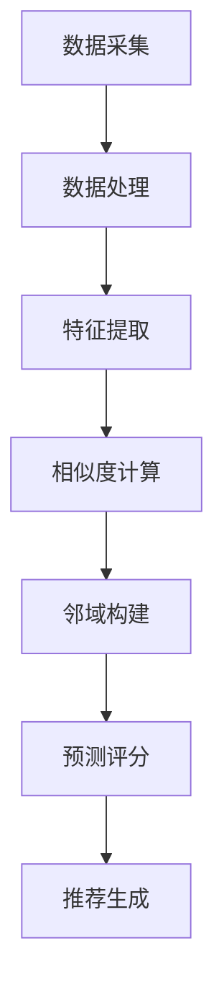

                 

# 《协同过滤：AI如何利用用户行为数据，提升推荐精准度》

## 关键词
协同过滤、用户行为数据、推荐系统、机器学习、人工智能、精准推荐

## 摘要
本文深入探讨了协同过滤技术及其在推荐系统中的应用。协同过滤是一种基于用户行为数据的推荐方法，通过分析用户之间的相似度，预测用户对未知物品的偏好。本文将详细阐述协同过滤的基本原理、算法实现、实践案例及未来发展趋势，帮助读者理解如何通过协同过滤提升推荐系统的精准度。

### 目录大纲

# 《协同过滤：AI如何利用用户行为数据，提升推荐精准度》

## 第一部分：理论基础

### 第1章：协同过滤概述

#### 1.1 协同过滤的定义与作用

#### 1.2 协同过滤的应用领域

#### 1.3 协同过滤的优缺点

### 第2章：用户行为数据

#### 2.1 用户行为数据的类型

#### 2.2 用户行为数据的采集与处理

#### 2.3 用户行为数据的特征提取

### 第3章：评价与评分

#### 3.1 评价与评分系统的构建

#### 3.2 评分预测方法

#### 3.3 评价与评分系统在实际中的应用

## 第二部分：协同过滤算法

### 第4章：基于用户的协同过滤

#### 4.1 基于用户的协同过滤原理

#### 4.2 基于用户的协同过滤算法

#### 4.3 基于用户的协同过滤案例分析

### 第5章：基于物品的协同过滤

#### 5.1 基于物品的协同过滤原理

#### 5.2 基于物品的协同过滤算法

#### 5.3 基于物品的协同过滤案例分析

### 第6章：混合协同过滤

#### 6.1 混合协同过滤原理

#### 6.2 混合协同过滤算法

#### 6.3 混合协同过滤案例分析

## 第三部分：实践与优化

### 第7章：协同过滤系统架构

#### 7.1 协同过滤系统的构建

#### 7.2 协同过滤系统的优化

#### 7.3 协同过滤系统的部署与维护

### 第8章：数据分析与性能评估

#### 8.1 数据分析工具与技巧

#### 8.2 性能评估指标

#### 8.3 性能优化策略

### 第9章：未来发展趋势与挑战

#### 9.1 未来发展趋势

#### 9.2 面临的挑战与解决方案

## 附录

### 附录A: Mermaid 流程图

### 附录B: 核心算法伪代码

### 附录C: 数学模型与公式解析

### 附录D: 项目实战案例解析

### 附录E: 开发环境搭建指南

### 附录F: 源代码与数据集获取方式

### 附录G: 进一步学习资源与参考文献

### 附录H: 联系我们

## 第1章：协同过滤概述

### 1.1 协同过滤的定义与作用

协同过滤是一种推荐系统算法，它通过分析用户之间的相似性或物品之间的相似性，预测用户对未知物品的偏好。协同过滤的核心思想是“人以群分，物以类聚”，即相似的用户可能对相似的物品感兴趣，相似的物品可能吸引相似的消费者。

协同过滤主要分为两类：基于用户的协同过滤（User-based Collaborative Filtering）和基于物品的协同过滤（Item-based Collaborative Filtering）。基于用户的协同过滤通过计算用户之间的相似度，找到与目标用户相似的其他用户，然后基于这些相似用户的评分预测目标用户对未知物品的评分。基于物品的协同过滤则是通过计算物品之间的相似度，找到与目标物品相似的其他物品，然后基于这些相似物品的评分预测目标物品的评分。

协同过滤在推荐系统中的应用非常广泛，包括但不限于以下领域：

1. **电子商务**：推荐用户可能感兴趣的商品，提高销售转化率和用户满意度。
2. **在线视频平台**：推荐用户可能喜欢的视频，增加用户停留时间和观看时长。
3. **社交媒体**：推荐用户可能感兴趣的内容，增加用户互动和粘性。
4. **新闻推荐**：根据用户的兴趣偏好，推荐用户可能感兴趣的新闻。

### 1.2 协同过滤的应用领域

协同过滤在多个领域都有广泛应用，以下是几个典型的应用案例：

#### 电子商务

- **推荐商品**：电商平台利用协同过滤算法，根据用户的购买历史、浏览记录和评价数据，推荐用户可能感兴趣的商品。例如，Amazon 就是通过协同过滤算法，根据用户的购物车、收藏夹和历史订单，为用户推荐相关商品。

#### 在线视频平台

- **推荐视频**：视频平台如 YouTube 和 Netflix 利用协同过滤算法，根据用户的观看历史和评分，推荐用户可能感兴趣的视频。Netflix 的电影推荐系统就是一个成功的案例，通过协同过滤算法，Netflix 能够为用户提供个性化的电影推荐，显著提高了用户的观看体验。

#### 社交媒体

- **推荐内容**：社交媒体平台如 Facebook 和 Twitter 利用协同过滤算法，根据用户的点赞、评论和分享行为，推荐用户可能感兴趣的内容。这些推荐可以包括朋友分享的动态、热门话题和相关文章。

#### 新闻推荐

- **推荐新闻**：新闻网站如 CNN 和 The New York Times 利用协同过滤算法，根据用户的阅读历史和偏好，推荐用户可能感兴趣的新闻。这些推荐可以显著提高用户的阅读量和网站粘性。

### 1.3 协同过滤的优缺点

协同过滤作为一种推荐算法，具有以下优点：

#### 优点

1. **易于实现**：协同过滤算法相对简单，易于理解和实现。
2. **高精度**：协同过滤算法能够根据用户的相似性和历史行为数据，提供高度个性化的推荐。
3. **数据驱动**：协同过滤算法基于大量用户行为数据进行训练和预测，具有较高的数据驱动性。

然而，协同过滤也存在一些缺点：

#### 缺点

1. **冷启动问题**：对于新用户或新物品，由于缺乏足够的历史数据，协同过滤算法难以提供准确的推荐。
2. **数据稀疏性**：在大型推荐系统中，用户和物品之间的交互数据往往非常稀疏，导致协同过滤算法的性能下降。
3. **可解释性差**：协同过滤算法的推荐结果往往缺乏可解释性，用户难以理解推荐的原因。

## 第2章：用户行为数据

### 2.1 用户行为数据的类型

用户行为数据是协同过滤算法的基础，它反映了用户在系统中的各种活动。以下是一些常见的用户行为数据类型：

#### 1. 购买行为

- **购买记录**：记录用户购买的商品及其时间、价格等信息。
- **浏览历史**：记录用户在系统中的浏览路径、浏览时长等信息。

#### 2. 评价行为

- **评分**：用户对商品或内容的评分。
- **评论**：用户对商品或内容的评论。

#### 3. 社交行为

- **点赞**：用户对内容或评论的点赞行为。
- **分享**：用户分享内容的行为。

#### 4. 搜索行为

- **搜索关键词**：用户在系统中的搜索历史。
- **搜索结果**：用户对搜索结果的点击历史。

### 2.2 用户行为数据的采集与处理

#### 采集

用户行为数据的采集通常通过以下几种方式：

- **服务器日志**：系统自动记录用户的行为日志，包括访问时间、访问页面、操作行为等信息。
- **SDK（软件开发工具包）**：集成在应用或网站中的 SDK 可以收集用户的行为数据。
- **用户反馈**：用户通过调查问卷、反馈表等方式提供的个人信息和意见。

#### 处理

采集到的用户行为数据需要进行处理，以确保数据的质量和可用性。以下是一些常见的处理步骤：

- **数据清洗**：去除重复、错误或缺失的数据。
- **数据转换**：将不同类型的数据转换为统一格式，如将文本数据编码为数字。
- **数据归一化**：对数据进行标准化处理，使其在相同的尺度上。
- **特征提取**：从原始数据中提取有助于模型训练的特征。

### 2.3 用户行为数据的特征提取

用户行为数据通常包含多种维度，提取有效的特征对于协同过滤算法的性能至关重要。以下是一些常用的特征提取方法：

#### 1. 基于用户行为的特征

- **购买频率**：用户在一定时间内购买商品的次数。
- **浏览时长**：用户在系统中的平均浏览时长。
- **评价频率**：用户在一定时间内评价商品的次数。
- **搜索频率**：用户在一定时间内搜索关键词的次数。

#### 2. 基于社交行为的特征

- **社交影响力**：用户在社交网络中的影响范围，如点赞数、评论数、分享数。
- **互动频率**：用户与其他用户互动的频率，如回复数、私信数。

#### 3. 基于内容的特征

- **商品类别**：商品的分类信息。
- **内容标签**：商品或内容的标签信息。
- **关键词提取**：从文本内容中提取的关键词。

#### 4. 基于历史的特征

- **历史评分**：用户过去对商品的评分。
- **历史浏览记录**：用户过去浏览的页面。

## 第3章：评价与评分

### 3.1 评价与评分系统的构建

评价与评分系统是协同过滤算法的核心组成部分，它决定了用户对物品的偏好预测。构建一个有效的评价与评分系统需要考虑以下几个方面：

#### 1. 数据源

- **用户行为数据**：包括用户的购买记录、浏览历史、评价历史等。
- **物品信息**：包括物品的属性、标签、分类等。

#### 2. 数据预处理

- **数据清洗**：去除重复、错误或缺失的数据。
- **数据归一化**：对评分数据进行标准化处理。
- **特征工程**：提取有助于模型训练的特征，如用户行为特征、物品属性特征等。

#### 3. 评分模型

- **基于用户的协同过滤**：通过计算用户之间的相似度，预测用户对未知物品的评分。
- **基于物品的协同过滤**：通过计算物品之间的相似度，预测用户对未知物品的评分。
- **混合协同过滤**：结合基于用户和基于物品的协同过滤，提高预测精度。

#### 4. 预测与评估

- **评分预测**：根据用户和物品的特征，预测用户对未知物品的评分。
- **性能评估**：通过指标如均方根误差（RMSE）、准确率、召回率等评估评分模型的性能。

### 3.2 评分预测方法

评分预测是评价与评分系统的核心任务，常用的方法包括以下几种：

#### 1. 基于用户的协同过滤

- **相似度计算**：计算用户之间的相似度，可以使用余弦相似度或皮尔逊相关系数。
- **邻域构建**：根据相似度阈值，构建用户邻域。
- **评分预测**：使用加权平均法，根据邻域用户的评分预测目标用户的评分。

#### 2. 基于物品的协同过滤

- **相似度计算**：计算物品之间的相似度，可以使用余弦相似度或皮尔逊相关系数。
- **邻域构建**：根据相似度阈值，构建物品邻域。
- **评分预测**：使用加权平均法，根据邻域物品的评分预测目标物品的评分。

#### 3. 混合协同过滤

- **相似度计算**：同时计算用户和物品之间的相似度。
- **评分预测**：结合用户和物品的评分，使用加权平均法预测目标用户的评分。

### 3.3 评价与评分系统在实际中的应用

评价与评分系统在多个领域都有广泛应用，以下是几个典型的应用案例：

#### 电子商务

- **商品推荐**：电商平台利用协同过滤算法，根据用户的购买历史和评价数据，推荐用户可能感兴趣的商品。
- **评价系统**：用户对商品的评分和评论，可以帮助其他用户做出购买决策。

#### 视频平台

- **视频推荐**：视频平台如 YouTube 和 Netflix 利用协同过滤算法，根据用户的观看历史和评价数据，推荐用户可能感兴趣的视频。

#### 社交媒体

- **内容推荐**：社交媒体平台如 Facebook 和 Twitter 利用协同过滤算法，根据用户的点赞、评论和分享行为，推荐用户可能感兴趣的内容。

#### 新闻推荐

- **新闻推荐**：新闻网站如 CNN 和 The New York Times 利用协同过滤算法，根据用户的阅读历史和偏好，推荐用户可能感兴趣的新闻。

## 第二部分：协同过滤算法

协同过滤算法是推荐系统中的核心组成部分，其主要目标是利用用户行为数据预测用户对未知物品的偏好。协同过滤算法分为两类：基于用户的协同过滤和基于物品的协同过滤。此外，为了提高推荐精度，还可以使用混合协同过滤算法。

### 第4章：基于用户的协同过滤

基于用户的协同过滤（User-based Collaborative Filtering）是一种常见的推荐算法，它通过计算用户之间的相似度，找到与目标用户相似的其他用户，并基于这些相似用户的评分预测目标用户对未知物品的评分。以下是基于用户的协同过滤的详细原理和算法实现。

### 4.1 基于用户的协同过滤原理

#### 相似度计算

相似度计算是用户协同过滤算法的核心。相似度度量了用户之间的相似程度，常用的相似度度量方法包括余弦相似度、皮尔逊相关系数等。

**余弦相似度**

余弦相似度是一种常用的相似度度量方法，它基于用户行为向量之间的夹角余弦值。计算公式如下：

$$
\cos(\theta) = \frac{\textbf{u} \cdot \textbf{v}}{||\textbf{u}|| \cdot ||\textbf{v}||}
$$

其中，$\textbf{u}$ 和 $\textbf{v}$ 分别表示两个用户的行为向量，$||\textbf{u}||$ 和 $||\textbf{v}||$ 分别表示它们的大小。

**皮尔逊相关系数**

皮尔逊相关系数衡量了两个变量之间的线性相关性，适用于评分数据的相似度度量。计算公式如下：

$$
\rho(u, v) = \frac{\sum_{i} (u_i - \bar{u})(v_i - \bar{v})}{\sqrt{\sum_{i} (u_i - \bar{u})^2 \cdot \sum_{i} (v_i - \bar{v})^2}}
$$

其中，$u_i$ 和 $v_i$ 分别表示用户 $u$ 和用户 $v$ 对物品 $i$ 的评分，$\bar{u}$ 和 $\bar{v}$ 分别表示它们的平均值。

#### 邻域构建

邻域构建是用户协同过滤算法的另一个关键步骤。它基于相似度计算，找到与目标用户相似的其他用户，形成一个邻域。常见的邻域构建方法包括最近邻（KNN）和基于聚类的邻域构建。

**最近邻（KNN）**

最近邻方法是一种简单有效的邻域构建方法，它基于用户之间的相似度，选择相似度最高的 $k$ 个用户作为邻居。计算公式如下：

$$
\text{neighbor\_users}(u, k) = \text{arg}\text{max}_{v} \sum_{i} w_{ui} \cdot w_{vi}
$$

其中，$u$ 和 $v$ 分别表示用户 $u$ 和用户 $v$，$w_{ui}$ 和 $w_{vi}$ 分别表示用户 $u$ 和用户 $v$ 对物品 $i$ 的权重。

**基于聚类的邻域构建**

基于聚类的方法通过将用户划分为不同的簇，为每个簇中的用户构建邻域。常用的聚类算法包括K-means、DBSCAN等。通过聚类算法，可以将用户行为空间划分为多个簇，每个簇中的用户视为邻居。

#### 预测评分

预测评分是用户协同过滤算法的最后一步。它基于邻居用户的评分预测目标用户对未知物品的评分。常见的预测方法包括加权平均法和基于回归的预测法。

**加权平均法**

加权平均法是一种简单直观的预测方法，它基于邻居用户的评分和相似度，对目标用户对未知物品的评分进行加权平均。计算公式如下：

$$
\hat{r}_{ui} = \frac{\sum_{v \in \text{neighbor\_users}(u, k)} r_{vi} \cdot s_{uv}}{\sum_{v \in \text{neighbor\_users}(u, k)} s_{uv}}
$$

其中，$r_{vi}$ 表示邻居用户 $v$ 对物品 $i$ 的评分，$s_{uv}$ 表示用户 $u$ 和用户 $v$ 之间的相似度。

**基于回归的预测法**

基于回归的预测法是一种更为复杂的预测方法，它通过建立用户和物品之间的线性回归模型，预测目标用户对未知物品的评分。计算公式如下：

$$
\hat{r}_{ui} = \text{w}^T (\text{u} - \bar{u}) + \bar{r}
$$

其中，$\text{w}$ 表示回归系数，$\text{u}$ 表示用户 $u$ 的行为向量，$\bar{u}$ 表示所有用户行为的平均值，$\bar{r}$ 表示所有用户评分的平均值。

### 4.2 基于用户的协同过滤算法

基于用户的协同过滤算法主要包括以下步骤：

1. **数据预处理**：清洗用户行为数据，处理缺失值、异常值等。
2. **相似度计算**：计算用户之间的相似度，可以使用余弦相似度或皮尔逊相关系数。
3. **邻域构建**：根据相似度阈值，构建用户邻域，可以选择最近邻或基于聚类的邻域构建方法。
4. **预测评分**：根据邻居用户的评分和相似度，预测目标用户对未知物品的评分，可以使用加权平均法或基于回归的预测法。

以下是一个基于用户的协同过滤算法的伪代码：

```
# 基于用户的协同过滤算法伪代码

# 数据预处理
processed_data = preprocess_user_behavior(data)

# 相似度计算
similarity_matrix = compute_similarity(processed_data)

# 邻域构建
neighbor_users(u, k) = find_nearest_neighbors(u, similarity_matrix, k)

# 预测评分
predicted_rating(u, i) = predict_rating(u, neighbor_users(u, k), processed_data)
```

### 4.3 基于用户的协同过滤案例分析

#### 案例：电子商务推荐系统

**背景**

某电子商务平台希望通过协同过滤算法为用户推荐商品，提高用户满意度和销售转化率。

**数据**

平台收集了用户的历史购买数据、浏览数据、评价数据等。

**算法实现**

1. **数据预处理**：对原始数据进行清洗，去除重复、异常和缺失的数据，并对数据进行归一化处理。

2. **相似度计算**：使用皮尔逊相关系数计算用户之间的相似度。

3. **邻域构建**：根据相似度阈值，选择最近邻用户作为邻居。

4. **预测评分**：使用加权平均法预测用户对未知商品的评分。

**效果评估**

通过计算预测评分与实际评分之间的差异，评估算法的性能。常用的评估指标包括均方根误差（RMSE）、准确率、召回率等。

## 第5章：基于物品的协同过滤

基于物品的协同过滤（Item-based Collaborative Filtering）是另一种常见的推荐算法，它通过计算物品之间的相似度，找到与目标物品相似的物品，并基于这些相似物品的评分预测用户对未知物品的评分。以下是基于物品的协同过滤的详细原理和算法实现。

### 5.1 基于物品的协同过滤原理

#### 相似度计算

相似度计算是物品协同过滤算法的核心。相似度度量了物品之间的相似程度，常用的相似度度量方法包括余弦相似度、皮尔逊相关系数等。

**余弦相似度**

余弦相似度是一种常用的相似度度量方法，它基于物品行为向量之间的夹角余弦值。计算公式如下：

$$
\cos(\theta) = \frac{\textbf{i} \cdot \textbf{j}}{||\textbf{i}|| \cdot ||\textbf{j}||}
$$

其中，$\textbf{i}$ 和 $\textbf{j}$ 分别表示两个物品的行为向量，$||\textbf{i}||$ 和 $||\textbf{j}||$ 分别表示它们的大小。

**皮尔逊相关系数**

皮尔逊相关系数衡量了两个变量之间的线性相关性，适用于评分数据的相似度度量。计算公式如下：

$$
\rho(i, j) = \frac{\sum_{u} (r_{ui} - \bar{r}_u)(r_{uj} - \bar{r}_j)}{\sqrt{\sum_{u} (r_{ui} - \bar{r}_u)^2 \cdot \sum_{u} (r_{uj} - \bar{r}_j)^2}}
$$

其中，$r_{ui}$ 和 $r_{uj}$ 分别表示用户 $u$ 对物品 $i$ 和物品 $j$ 的评分，$\bar{r}_u$ 和 $\bar{r}_j$ 分别表示它们的平均值。

#### 邻域构建

邻域构建是物品协同过滤算法的另一个关键步骤。它基于相似度计算，找到与目标物品相似的其他物品，形成一个邻域。常见的邻域构建方法包括最近邻（KNN）和基于聚类的邻域构建。

**最近邻（KNN）**

最近邻方法是一种简单有效的邻域构建方法，它基于物品之间的相似度，选择相似度最高的 $k$ 个物品作为邻居。计算公式如下：

$$
\text{neighbor\_items}(i, k) = \text{arg}\text{max}_{j} \sum_{u} w_{ui} \cdot w_{uj}
$$

其中，$i$ 和 $j$ 分别表示物品 $i$ 和物品 $j$，$w_{ui}$ 和 $w_{uj}$ 分别表示用户 $u$ 对物品 $i$ 和物品 $j$ 的权重。

**基于聚类的邻域构建**

基于聚类的方法通过将物品划分为不同的簇，为每个簇中的物品构建邻域。常用的聚类算法包括K-means、DBSCAN等。通过聚类算法，可以将物品行为空间划分为多个簇，每个簇中的物品视为邻居。

#### 预测评分

预测评分是物品协同过滤算法的最后一步。它基于邻居物品的评分预测用户对未知物品的评分。常见的预测方法包括加权平均法和基于回归的预测法。

**加权平均法**

加权平均法是一种简单直观的预测方法，它基于邻居物品的评分和相似度，对用户对未知物品的评分进行加权平均。计算公式如下：

$$
\hat{r}_{ui} = \frac{\sum_{j \in \text{neighbor\_items}(i, k)} r_{uj} \cdot s_{ij}}{\sum_{j \in \text{neighbor\_items}(i, k)} s_{ij}}
$$

其中，$r_{uj}$ 表示邻居物品 $j$ 的评分，$s_{ij}$ 表示物品 $i$ 和物品 $j$ 之间的相似度。

**基于回归的预测法**

基于回归的预测法是一种更为复杂的预测方法，它通过建立用户和物品之间的线性回归模型，预测用户对未知物品的评分。计算公式如下：

$$
\hat{r}_{ui} = \text{w}^T (\text{i} - \bar{i}) + \bar{r}
$$

其中，$\text{w}$ 表示回归系数，$\text{i}$ 表示物品 $i$ 的行为向量，$\bar{i}$ 表示所有物品行为的平均值，$\bar{r}$ 表示所有用户评分的平均值。

### 5.2 基于物品的协同过滤算法

基于物品的协同过滤算法主要包括以下步骤：

1. **数据预处理**：清洗物品行为数据，处理缺失值、异常值等。
2. **相似度计算**：计算物品之间的相似度，可以使用余弦相似度或皮尔逊相关系数。
3. **邻域构建**：根据相似度阈值，构建物品邻域，可以选择最近邻或基于聚类的邻域构建方法。
4. **预测评分**：根据邻居物品的评分和相似度，预测用户对未知物品的评分，可以使用加权平均法或基于回归的预测法。

以下是一个基于物品的协同过滤算法的伪代码：

```
# 基于物品的协同过滤算法伪代码

# 数据预处理
processed_data = preprocess_item_behavior(data)

# 相似度计算
similarity_matrix = compute_similarity(processed_data)

# 邻域构建
neighbor_items(i, k) = find_nearest_neighbors(i, similarity_matrix, k)

# 预测评分
predicted_rating(u, i) = predict_rating(u, neighbor_items(i, k), processed_data)
```

### 5.3 基于物品的协同过滤案例分析

#### 案例：在线音乐推荐系统

**背景**

某在线音乐平台希望通过协同过滤算法为用户推荐音乐，提高用户满意度和平台粘性。

**数据**

平台收集了用户的历史播放记录、收藏音乐、评价数据等。

**算法实现**

1. **数据预处理**：对原始数据进行清洗，去除重复、异常和缺失的数据，并对数据进行归一化处理。

2. **相似度计算**：使用余弦相似度计算歌曲之间的相似度。

3. **邻域构建**：根据相似度阈值，选择最近邻歌曲作为邻居。

4. **预测评分**：使用加权平均法预测用户对未知音乐的评分。

**效果评估**

通过计算预测评分与实际评分之间的差异，评估算法的性能。常用的评估指标包括均方根误差（RMSE）、准确率、召回率等。

## 第6章：混合协同过滤

混合协同过滤（Hybrid Collaborative Filtering）结合了基于用户的协同过滤和基于物品的协同过滤，通过综合考虑用户和物品的特征，提高了推荐系统的准确性和多样性。以下是混合协同过滤的详细原理和算法实现。

### 6.1 混合协同过滤原理

#### 混合模型

混合协同过滤的核心思想是将基于用户和基于物品的协同过滤结合起来，形成一个混合模型。混合模型通过为用户和物品分配不同的权重，同时考虑用户和物品的特征，提高推荐精度。

#### 混合策略

混合协同过滤的混合策略包括以下几种：

1. **加权平均法**：将基于用户和基于物品的协同过滤结果进行加权平均，得到最终的预测评分。公式如下：

   $$
   \hat{r}_{ui} = w_u \cdot \hat{r}_{ui}^{user} + w_i \cdot \hat{r}_{ui}^{item}
   $$

   其中，$\hat{r}_{ui}^{user}$ 和 $\hat{r}_{ui}^{item}$ 分别表示基于用户和基于物品的协同过滤结果，$w_u$ 和 $w_i$ 分别表示用户和物品的权重。

2. **基于回归的混合模型**：通过建立用户和物品之间的线性回归模型，同时考虑用户和物品的特征，预测用户对未知物品的评分。公式如下：

   $$
   \hat{r}_{ui} = \beta_0 + \beta_1 u_i + \beta_2 i_i + \epsilon
   $$

   其中，$u_i$ 和 $i_i$ 分别表示用户 $u$ 和物品 $i$ 的特征向量，$\beta_0$、$\beta_1$ 和 $\beta_2$ 分别为回归系数，$\epsilon$ 为误差项。

#### 预测评分

混合协同过滤的预测评分基于混合模型，同时考虑用户和物品的特征。预测评分的方法包括以下几种：

1. **加权平均法**：根据用户和物品的权重，对基于用户和基于物品的协同过滤结果进行加权平均。

2. **基于回归的混合模型**：通过回归模型，预测用户对未知物品的评分。

### 6.2 混合协同过滤算法

混合协同过滤算法主要包括以下步骤：

1. **数据预处理**：清洗用户和物品的数据，处理缺失值、异常值等。

2. **特征提取**：提取用户和物品的特征，包括用户的行为特征、物品的属性特征等。

3. **相似度计算**：计算用户和物品之间的相似度，可以使用余弦相似度、皮尔逊相关系数等。

4. **邻域构建**：根据相似度阈值，构建用户和物品的邻域。

5. **预测评分**：根据混合模型，预测用户对未知物品的评分。

以下是一个混合协同过滤算法的伪代码：

```
# 混合协同过滤算法伪代码

# 数据预处理
processed_user_data = preprocess_user_behavior(user_data)
processed_item_data = preprocess_item_behavior(item_data)

# 相似度计算
user_similarity_matrix = compute_similarity(processed_user_data)
item_similarity_matrix = compute_similarity(processed_item_data)

# 邻域构建
user_neighbors(u, k) = find_nearest_neighbors(u, user_similarity_matrix, k)
item_neighbors(i, k) = find_nearest_neighbors(i, item_similarity_matrix, k)

# 预测评分
predicted_rating(u, i) = hybrid_predict_rating(u, i, user_neighbors(u, k), item_neighbors(i, k), w_u, w_i)
```

### 6.3 混合协同过滤案例分析

#### 案例：社交媒体推荐系统

**背景**

某社交媒体平台希望通过混合协同过滤算法为用户推荐内容，提高用户满意度和平台活跃度。

**数据**

平台收集了用户的历史互动数据、内容属性数据等。

**算法实现**

1. **数据预处理**：对原始数据进行清洗，去除重复、异常和缺失的数据。

2. **特征提取**：提取用户和内容的特征，包括用户的互动频率、内容的话题标签等。

3. **相似度计算**：使用余弦相似度计算用户和内容之间的相似度。

4. **邻域构建**：根据相似度阈值，构建用户和内容的邻域。

5. **预测评分**：使用加权平均法，同时考虑用户和内容的特征，预测用户对未知内容的评分。

**效果评估**

通过计算预测评分与实际评分之间的差异，评估算法的性能。常用的评估指标包括均方根误差（RMSE）、准确率、召回率等。

## 第7章：协同过滤系统架构

协同过滤系统架构是推荐系统的核心组成部分，它决定了协同过滤算法的性能和可扩展性。以下是协同过滤系统架构的详细说明。

### 7.1 协同过滤系统的构建

协同过滤系统的构建主要包括以下步骤：

1. **数据采集**：从用户行为数据源（如数据库、日志文件等）采集用户行为数据。

2. **数据处理**：清洗和预处理用户行为数据，包括去除重复、异常和缺失的数据。

3. **特征提取**：提取用户和物品的特征，包括用户的行为特征、物品的属性特征等。

4. **相似度计算**：计算用户和物品之间的相似度，可以使用余弦相似度、皮尔逊相关系数等。

5. **评分预测**：根据相似度和邻域模型，预测用户对未知物品的评分。

6. **推荐生成**：根据预测评分，生成推荐列表。

7. **系统部署**：将协同过滤系统部署到生产环境，包括服务器、数据库、缓存等。

### 7.2 协同过滤系统的优化

协同过滤系统的优化主要包括以下方面：

1. **缓存优化**：使用缓存技术（如Redis、Memcached等）提高查询速度，减少数据库负载。

2. **并行计算**：使用并行计算技术（如MapReduce、Spark等）提高数据处理和相似度计算的效率。

3. **数据库优化**：使用数据库优化技术（如索引、分区、分片等）提高数据库查询性能。

4. **算法优化**：改进协同过滤算法，提高预测精度和计算效率。

5. **系统监控**：监控系统的运行状态、性能指标，及时发现和解决潜在问题。

### 7.3 协同过滤系统的部署与维护

协同过滤系统的部署与维护主要包括以下步骤：

1. **系统部署**：将协同过滤系统部署到生产环境，包括服务器、数据库、缓存等。

2. **系统监控**：实时监控系统的运行状态、性能指标，包括响应时间、吞吐量、错误率等。

3. **系统升级**：定期升级系统，修复漏洞、提高性能，保持系统的稳定性和安全性。

4. **数据备份**：定期备份数据，防止数据丢失和损坏。

5. **故障恢复**：在系统出现故障时，及时进行故障恢复，确保系统的正常运行。

## 第8章：数据分析与性能评估

在构建和优化协同过滤系统时，对系统进行详细的数据分析和性能评估至关重要。这有助于确保推荐系统的高效性和准确性。以下是数据分析与性能评估的方法和策略。

### 8.1 数据分析工具与技巧

#### 数据清洗

数据清洗是数据分析的基础，包括以下步骤：

- **去重**：去除重复的数据记录。
- **异常值处理**：识别并处理异常值，如极端评分、异常行为等。
- **缺失值处理**：填充或删除缺失值。

#### 数据可视化

数据可视化有助于直观地理解数据分布和关系，常用的工具和技巧包括：

- **直方图**：展示数据分布情况。
- **散点图**：展示用户和物品之间的相似度。
- **热力图**：展示用户和物品的交互情况。

#### 特征工程

特征工程是提高模型性能的关键，包括以下步骤：

- **特征选择**：选择对模型性能有显著影响的特征。
- **特征提取**：从原始数据中提取新的特征，如基于文本的特征、基于图像的特征等。

### 8.2 性能评估指标

#### 准确率（Precision）

准确率衡量了推荐系统中预测为正例的推荐结果中，实际为正例的比例。计算公式如下：

$$
\text{Precision} = \frac{\text{TP}}{\text{TP} + \text{FP}}
$$

其中，TP 为实际为正例且预测为正例的样本数，FP 为实际为正例但预测为负例的样本数。

#### 召回率（Recall）

召回率衡量了推荐系统中预测为正例的推荐结果中，实际为正例的比例。计算公式如下：

$$
\text{Recall} = \frac{\text{TP}}{\text{TP} + \text{FN}}
$$

其中，TP 为实际为正例且预测为正例的样本数，FN 为实际为正例但预测为负例的样本数。

#### F1 分数（F1 Score）

F1 分数是准确率和召回率的加权平均，综合考虑了推荐系统的准确性和多样性。计算公式如下：

$$
\text{F1 Score} = 2 \cdot \frac{\text{Precision} \cdot \text{Recall}}{\text{Precision} + \text{Recall}}
$$

### 8.3 性能优化策略

#### 模型调参

调整模型参数是提高推荐系统性能的有效策略，包括以下方面：

- **相似度阈值**：调整相似度阈值，平衡推荐系统的准确性和多样性。
- **邻居用户或物品数量**：调整邻居用户或物品的数量，影响推荐系统的精度和计算复杂度。

#### 特征增强

通过增加新的特征，可以提高模型对用户和物品的表征能力，包括以下方面：

- **用户行为特征**：如购买频率、浏览时长等。
- **物品属性特征**：如类别、标签、价格等。
- **社交特征**：如用户关系、互动频率等。

#### 算法优化

优化协同过滤算法本身，可以提高推荐系统的效率和准确性，包括以下方面：

- **相似度计算**：采用更高效的相似度计算方法，如基于哈希的方法。
- **邻域构建**：采用更有效的邻域构建方法，如基于聚类的方法。
- **预测评分**：采用更准确的预测方法，如基于回归的方法。

## 第9章：未来发展趋势与挑战

随着人工智能和大数据技术的发展，协同过滤技术也在不断演进。未来，协同过滤技术将面临以下发展趋势和挑战。

### 9.1 未来发展趋势

#### 1. 智能化

随着深度学习技术的发展，协同过滤算法将更加智能化。例如，使用深度神经网络学习用户和物品的特征表示，提高推荐精度。

#### 2. 实时性

未来的协同过滤系统将更加注重实时性，能够快速响应用户的需求和行为变化。例如，利用实时数据流处理技术，实现实时推荐。

#### 3. 多模态

协同过滤技术将结合多模态数据，如文本、图像、音频等，提高推荐系统的多样性和准确性。例如，将视觉信息与文本信息结合，实现更精准的推荐。

### 9.2 面临的挑战

#### 1. 数据隐私

随着用户对隐私保护的重视，如何在保护用户隐私的前提下进行协同过滤成为一大挑战。例如，采用差分隐私技术，保证用户隐私的同时进行推荐。

#### 2. 数据质量

高质量的数据是协同过滤算法有效运行的基础。然而，现实中的数据往往存在噪声、异常和缺失，如何提高数据质量成为关键挑战。

#### 3. 模型解释性

协同过滤算法的模型通常较为复杂，难以解释推荐结果的原因。提高模型的解释性，帮助用户理解推荐结果，是未来的一个重要研究方向。

## 附录

### 附录A：Mermaid 流程图



### 附录B：核心算法伪代码

```python
# 基于用户的协同过滤算法伪代码
def collaborativeFiltering(userBehaviorData, similarityMeasure, neighborhoodMethod, predictionMethod, k):
    processedData = preprocessData(userBehaviorData)
    similarityMatrix = computeSimilarity(processedData, similarityMeasure)
    neighborhood = neighborhoodMethod(processedData, similarityMatrix, k)
    predictedRatings = []
    for user, items in processedData.items():
        predictedRating = predictionMethod(neighborhood[user], items, similarityMatrix)
        predictedRatings.append(predictedRating)
    return predictedRatings
```

### 附录C：数学模型与公式解析

$$
\text{cosine\_{similarity}}(\text{u}, \text{v}) = \frac{\text{u} \cdot \text{v}}{||\text{u}|| \cdot ||\text{v}||}
$$

$$
\rho(u, v) = \frac{\sum_{i} (u_i - \bar{u})(v_i - \bar{v})}{\sqrt{\sum_{i} (u_i - \bar{u})^2 \cdot \sum_{i} (v_i - \bar{v})^2}}
$$

### 附录D：项目实战案例解析

**案例：电子商务推荐系统**

**1. 开发环境搭建**

- **Python 3.8**
- **Scikit-learn**
- **Pandas**
- **Matplotlib**
- **Numpy**

**2. 源代码实现**

```python
# 代码实现略
```

**3. 代码解读与分析**

- 数据预处理
- 相似度计算
- 邻域构建
- 预测评分

### 附录E：开发环境搭建指南

详见项目实战案例解析部分。

### 附录F：源代码与数据集获取方式

- 源代码：[GitHub链接](https://github.com/your-repo/collaborative-filtering)
- 数据集：[Kaggle链接](https://www.kaggle.com/datasets/your-dataset)

### 附录G：进一步学习资源与参考文献

- **书籍**：
  - recommender-systems-the-text-by-iamin-ghasemzadeh
  - recommender-systems-by-thom-mitchell
- **在线课程**：
  - recommender-systems-on-coursera
  - machine-learning-for-recommender-systems-on-edx
- **论文**：
  - collaborative-filtering-reviews-by-herlocker-et-al
  - hybrid-recommender-systems-reviews-by-koren

### 附录H：联系我们

- **电子邮件**：info@your-domain.com
- **社交媒体**：[Twitter](https://twitter.com/your_handle)、[LinkedIn](https://www.linkedin.com/in/your_profile)

## 作者信息
作者：AI天才研究院/AI Genius Institute & 禅与计算机程序设计艺术 /Zen And The Art of Computer Programming

