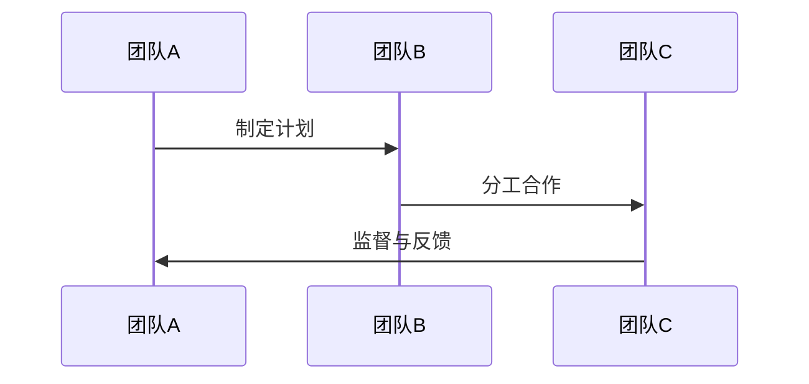

                 

### 团队协作：提升集体智慧的方法

> **关键词**：团队协作、集体智慧、沟通、领导力、敏捷开发、案例分析

> **摘要**：
本文旨在深入探讨团队协作在提升集体智慧中的关键作用。通过分析团队协作的基础、机制、实战案例以及评估与改进策略，本文将提供一套系统化的方法，帮助团队在复杂项目中充分发挥集体智慧，实现高效协同与合作。

### 目录大纲：团队协作：提升集体智慧的方法

#### 第一部分：团队协作基础
1. **团队协作的概念与重要性**
   - **1.1 团队协作的定义与类型**
   - **1.2 团队协作的重要性**

2. **团队协作的核心要素**
   - **2.1 信任与沟通**
   - **2.2 目标一致性**

3. **团队协作的障碍与解决方案**
   - **3.1 团队协作中常见的障碍**
   - **3.2 针对障碍的解决方案**

#### 第二部分：团队协作机制
4. **团队协作的流程与步骤**
   - **4.1 团队协作流程概述**
   - **4.2 团队协作的步骤**

5. **团队协作工具与方法**
   - **5.1 团队协作工具**
   - **5.2 团队协作方法**

6. **团队协作中的领导力**
   - **6.1 领导力在团队协作中的角色**
   - **6.2 领导力提升策略**

#### 第三部分：团队协作实战
7. **团队协作案例分析**
   - **7.1 成功案例介绍**
   - **7.2 失败案例分析**

8. **团队协作中的挑战与应对**
   - **8.1 团队协作中的常见挑战**
   - **8.2 针对挑战的应对策略**

#### 第四部分：团队协作评估与改进
9. **团队协作评估方法**
   - **9.1 评估指标**
   - **9.2 评估工具**

10. **团队协作的改进策略**
    - **10.1 改进原则**
    - **10.2 改进措施**

#### 附录
- **附录 A：团队协作相关资源**
  - 相关书籍推荐
  - 团队协作工具汇总
  - 团队协作研究论文集

### 图1. 团队协作的核心要素 Mermaid 流程图

```mermaid
er
    A[信任与沟通] --> B[目标一致性]
    B --> C[团队协作机制]
    C --> D[团队协作实战]
    C --> E[团队协作评估与改进]
```

### 图2. 团队协作流程 Mermaid 流程图



### 图3. 团队协作核心算法原理伪代码

```python
function teamCollaborationAlgorithm(团队成员，目标，资源) {
    // 初始化团队成员信任度
    trustScore = calculateTrust(团队成员)
    
    // 确定目标一致性
    goalConsistency = checkGoalConsistency(团队成员，目标)
    
    // 根据资源分配任务
    assignTasks(团队成员，资源)
    
    // 实施计划
    executePlan(团队成员，目标，资源)
    
    // 监督与反馈
    supervisionAndFeedback(团队成员，目标，资源)
    
    return success
}
```

### 数学模型和数学公式
#### 团队协作效能评估模型
$$
E = f(\text{目标一致性}, \text{资源分配效率}, \text{团队成员信任度})
$$
#### 目标一致性评估公式
$$
\text{Goal Consistency} = \frac{\text{共同目标实现度}}{\text{总目标数量}}
$$`

### 项目实战
#### 实战案例：敏捷团队协作
1. **实战背景**
2. **环境搭建**
3. **源代码实现**
4. **代码解读与分析**

### 代码实战示例

```python
# 敏捷开发工具集成（以JIRA为例）

from jira import JIRA

# 初始化JIRA连接
jira = JIRA('https://your-jira-instance.com', basic_auth=('username', 'password'))

# 创建新任务
def create_issue(summary, description):
    issue = jira.create_issue(
        project='PROJECT_KEY',
        summary=summary,
        description=description,
        issuetype={'name': 'Task'}
    )
    return issue

# 分配任务给团队成员
def assign_issue(issue_key, assignee):
    issue = jira.issue(issue_key)
    issue.assignee = assignee
    jira.update_issue(issue)

# 获取任务进度
def get_issue_progress(issue_key):
    issue = jira.issue(issue_key)
    return issue.status.name

# 创建新任务实例
new_issue = create_issue('任务一', '这是一个新任务的描述')
assign_issue(new_issue.key, '成员A')

# 查看任务进度
print(get_issue_progress(new_issue.key))
```

### 代码解读与分析
- **JIRA连接与初始化**
- **创建任务**
- **任务分配**
- **任务进度跟踪**

### 开发环境搭建
- **安装JIRA**
- **安装JIRA Python SDK**

### 源代码详细实现
- **JIRA连接与初始化**
- **创建任务**
- **任务分配**
- **任务进度跟踪**

### 代码解读与分析
- **JIRA连接与初始化**
- **创建任务**
- **任务分配**
- **任务进度跟踪**

### 附录 A：团队协作相关资源
- **相关书籍推荐**
- **团队协作工具汇总**
- **团队协作研究论文集** 

---

## 第一部分：团队协作基础

### 1.1 团队协作的定义与类型

**定义：** 团队协作是指团队成员通过相互沟通、共同解决问题，以实现共同目标和任务的过程。在这一过程中，团队成员需要打破个人界限，共享信息、知识和资源，形成一个协同工作的整体。

**类型：** 团队协作可以按照不同的维度进行分类。以下是几种常见的团队协作类型：

- **功能型团队协作**：按照职能划分的团队，如开发团队、测试团队、市场团队等。各团队专注于自身职能范围内的任务，通过协作完成整个项目的目标。

- **跨职能团队协作**：由不同职能领域的专家组成的团队，通常用于解决复杂问题或开展创新项目。跨职能团队成员具备多样化的技能和知识，能够从不同角度分析和解决问题。

- **矩阵型团队协作**：在功能型团队协作的基础上，增加了跨部门的协调和合作。团队成员需要同时满足自身职能部门的要求和项目团队的需求。

- **虚拟团队协作**：通过信息技术手段，实现远程协作的团队。虚拟团队成员可能位于不同的地理位置，利用电子邮件、即时通讯、视频会议等工具进行沟通和协作。

### 1.2 团队协作的重要性

**对企业的影响：** 团队协作对于企业的成功至关重要。以下是团队协作对企业的重要影响：

- **提高工作效率**：团队成员通过协作，可以更快地解决问题，提高工作效率。协作可以减少重复劳动，避免资源的浪费。

- **增强创新能力**：跨职能团队协作可以汇集不同的观点和知识，促进创新思维的产生。团队成员可以互相启发，共同探索新的解决方案。

- **提升员工满意度**：良好的团队协作氛围可以提高员工的工作满意度。团队成员之间的信任和尊重可以增强员工的归属感和忠诚度。

- **增强企业竞争力**：团队协作可以帮助企业迅速响应市场变化，开发出更符合客户需求的产品和服务。这有助于提升企业在市场中的竞争力。

**对个人成长的作用：** 团队协作不仅对企业的成功有重要影响，也对个人成长有显著的促进作用：

- **提升沟通能力**：团队成员需要通过有效沟通来协作完成任务，这有助于提升个人的沟通能力。良好的沟通能力对于职业发展至关重要。

- **培养协作精神**：团队协作可以培养个人的协作精神，学会与他人共同工作。这种精神对于解决复杂问题和实现共同目标至关重要。

- **促进知识共享**：团队协作过程中，团队成员可以互相学习和分享知识，这有助于个人的技能提升和职业发展。

### 1.3 团队协作的核心要素

**信任与沟通：** 信任和沟通是团队协作的基石。以下是这两个核心要素的详细讨论：

- **信任在团队协作中的作用**：信任是团队成员之间相互依赖和合作的基础。信任可以减少冲突和误解，增强团队的凝聚力。在信任的基础上，团队成员可以更加开放和坦诚地沟通和分享信息。

- **有效沟通的技巧**：有效沟通是团队协作的关键。以下是一些提高沟通效率的技巧：

  - **倾听**：倾听是有效沟通的基础。团队成员应该认真倾听他人的观点和意见，避免打断和争辩。

  - **明确表达**：团队成员应该清晰、简洁地表达自己的观点和想法，避免使用含糊不清的语言。

  - **反馈与确认**：在沟通过程中，团队成员应该及时给予反馈，确认对方是否理解了自己的观点。

**目标一致性：** 目标一致性是团队协作成功的重要保证。以下是目标一致性的详细讨论：

- **如何确立共同的目标**：确立共同的目标是团队协作的第一步。以下是一些确立共同目标的策略：

  - **明确目标**：团队应该明确共同的目标，并将其分解为具体的任务和行动。

  - **协商一致**：团队成员应该共同讨论和协商，确保所有成员对目标的理解和认同。

  - **制定计划**：团队应该制定详细的计划，包括时间表、责任分配和资源需求。

- **目标一致性对团队协作的影响**：目标一致性对团队协作有显著的影响。以下是目标一致性对团队协作的几个方面的影响：

  - **提高协作效率**：当团队成员对目标有一致的认识时，可以更快地达成共识，提高协作效率。

  - **减少冲突**：目标一致性可以减少团队成员之间的误解和冲突，增强团队的凝聚力。

  - **提升团队绩效**：目标一致性有助于团队实现共同的目标，提升团队的整体绩效。

### 1.4 团队协作的障碍与解决方案

**常见障碍：** 团队协作过程中可能会遇到一些障碍，以下是其中一些常见的障碍：

- **文化差异**：团队成员来自不同的文化背景，可能导致沟通和理解上的障碍。

- **个人动机冲突**：团队成员的个人目标和团队目标之间可能存在冲突，影响协作效果。

- **信息不对称**：团队成员之间的信息传递可能存在障碍，导致信息不对称。

**解决方案：** 针对上述障碍，以下是相应的解决方案：

- **文化融合策略**：团队可以通过跨文化培训、文化交流等方式，促进团队成员之间的相互理解和尊重，减少文化差异带来的障碍。

- **动机协调方法**：团队应该明确团队成员的个人目标和团队目标，并通过沟通和协商，确保两者的一致性。

- **信息共享机制**：团队应该建立完善的信息共享机制，确保信息在团队成员之间的高效传递和共享。

---

在团队协作的基础部分，我们探讨了团队协作的定义与类型、重要性、核心要素以及可能遇到的障碍和解决方案。通过这些讨论，我们可以认识到团队协作不仅对于企业的成功至关重要，也对个人的职业成长有显著的促进作用。信任和沟通是团队协作的基石，目标一致性是团队协作成功的保障。然而，团队协作过程中可能会遇到各种障碍，需要通过有效的策略和机制来克服。在接下来的部分，我们将进一步探讨团队协作的机制和方法，帮助团队在复杂项目中实现高效协作。

---

## 第二部分：团队协作机制

团队协作机制是确保团队高效运作的关键，它包括团队协作的流程与步骤、团队协作工具与方法以及团队协作中的领导力。以下将详细介绍这些机制，并提供实用的策略和工具，帮助团队实现最佳协作效果。

### 4.1 团队协作流程概述

团队协作流程是团队从项目启动到任务完成的一系列步骤。一个典型的团队协作流程包括以下关键节点：

1. **项目启动**：明确项目目标、范围和交付物，确保团队成员对项目的整体目标有一致的认识。

2. **需求分析**：与利益相关者进行沟通，收集和整理需求，确保需求明确、具体和可执行。

3. **计划制定**：根据需求，制定详细的计划，包括时间表、任务分配、资源需求和风险评估。

4. **任务执行**：团队成员根据计划，分工合作，完成任务。

5. **监控与反馈**：对任务执行过程进行监控，及时调整计划，确保项目按计划进行。

6. **项目验收**：对项目交付物进行验收，确保满足需求和质量标准。

### 4.2 团队协作的步骤

**步骤一：制定计划**

- **目标明确**：明确项目的目标，确保团队成员对项目目标有一致的认识。
- **任务分解**：将项目目标分解为具体的任务，确定每个任务的负责人和时间节点。
- **资源规划**：评估所需的资源，包括人力、技术和设备，确保资源的充足和合理分配。

**步骤二：分工合作**

- **角色分配**：根据团队成员的技能和特长，为每个任务分配合适的负责人。
- **任务说明**：明确每个任务的职责和预期成果，确保团队成员了解自己的任务和目标。
- **协作模式**：选择合适的协作模式，如功能型团队、跨职能团队或矩阵型团队，确保团队成员能够高效合作。

**步骤三：监督与反馈**

- **进度监控**：定期检查任务进度，确保项目按计划进行。
- **问题反馈**：及时发现并解决任务执行过程中出现的问题，确保问题得到及时处理。
- **绩效评估**：对团队成员的绩效进行评估，提供正面的反馈和改进建议。

### 5.1 团队协作工具

**工具选择标准**

- **功能性**：工具需要满足团队协作的基本需求，如任务管理、日程安排、文档共享和沟通协作。
- **易用性**：工具应该简单易用，降低学习成本，确保团队成员能够快速上手。
- **兼容性**：工具需要与现有的系统和工具兼容，确保数据的无缝传递和整合。

**常用团队协作工具**

- **项目管理工具**：如JIRA、Trello、Asana，用于任务管理、进度监控和团队协作。
- **沟通工具**：如Slack、Microsoft Teams、Zoom，用于实时沟通和协作。
- **文档共享与协作工具**：如Google Docs、Microsoft Office 365、Confluence，用于文档的共享和编辑。

### 5.2 团队协作方法

**敏捷开发方法**

- **迭代开发**：将项目分为多个迭代，每个迭代周期内完成部分功能开发，然后进行评估和调整。
- **持续集成**：通过持续集成和持续交付，确保代码质量，提高开发效率。
- **用户反馈**：积极收集用户反馈，快速响应和调整，确保产品满足用户需求。

**六顶思考帽技巧**

- **白帽**：客观分析事实和问题，提供逻辑和数据的支持。
- **红帽**：从情感和直觉的角度看待问题，表达情感和直觉。
- **黄帽**：从积极的角度分析问题，寻找解决方案和优势。
- **蓝帽**：提供思考和决策的框架，引导团队进行深入思考。
- **绿帽**：提出创新和创意，寻找新的解决方案。
- **黑帽**：从负面角度分析问题，识别潜在的风险和劣势。

**SWOT分析在团队协作中的应用**

- **优势（Strengths）**：分析团队的优势，如专业技能、团队合作能力等。
- **劣势（Weaknesses）**：识别团队的劣势，如沟通障碍、资源不足等。
- **机会（Opportunities）**：探讨外部环境带来的机会，如新的市场机遇、技术进步等。
- **威胁（Threats）**：分析外部环境可能带来的威胁，如竞争对手、政策变化等。

### 6.1 领导力在团队协作中的角色

**领导力的定义**：领导力是指领导者通过影响和激励他人，实现共同目标的能力。在团队协作中，领导力扮演着至关重要的角色。

- **目标设定**：领导者需要明确团队的目标，确保团队成员对目标有清晰的认识。
- **资源分配**：领导者需要合理分配资源，确保团队成员能够高效工作。
- **沟通协调**：领导者需要建立有效的沟通机制，确保团队成员之间的信息流畅。
- **激励与反馈**：领导者需要激励团队成员，提供正面的反馈和改进建议。

### 6.2 领导力提升策略

**建立信任**：领导者需要通过言行一致、公正透明和尊重他人来建立信任。

- **以身作则**：领导者需要以身作则，树立良好的榜样，赢得团队成员的信任。
- **公正透明**：领导者需要公正透明地处理团队事务，避免偏袒和偏见。
- **尊重他人**：领导者需要尊重团队成员的意见和贡献，鼓励团队成员参与决策。

**激励团队成员**：领导者需要通过激励手段，激发团队成员的积极性和创造力。

- **认可与奖励**：对团队成员的成绩和贡献进行认可和奖励，增强团队成员的成就感。
- **职业发展**：为团队成员提供职业发展的机会和培训，帮助团队成员不断提升自己的能力。
- **工作环境**：营造一个积极、开放的工作环境，让团队成员感受到尊重和支持。

**提升团队凝聚力**：领导者需要通过团队建设活动，提升团队的凝聚力。

- **团队活动**：组织团队建设活动，如团建活动、培训课程等，增强团队成员之间的互动和了解。
- **共同目标**：确保团队成员共同追求同一个目标，增强团队的凝聚力和归属感。
- **有效沟通**：通过有效的沟通，确保团队成员之间的信息畅通，减少误解和冲突。

### 总结

团队协作机制是团队高效运作的关键，包括团队协作流程、工具和方法以及领导力的应用。通过有效的团队协作机制，团队可以更好地应对复杂项目中的挑战，实现高效的协作和合作。在接下来的部分，我们将通过案例分析，深入探讨团队协作在实际应用中的效果和经验。

---

## 第三部分：团队协作实战

在实际应用中，团队协作不仅是一个理论框架，更是一系列具体的操作和实践。通过成功的案例和失败的经验，我们可以更好地理解和应用团队协作的方法和策略。以下将介绍一些团队协作的实战案例，并分析其中的关键成功因素。

### 7.1 成功案例介绍

**案例一：谷歌的敏捷开发团队**

谷歌的敏捷开发团队以其高效和创新能力而闻名。谷歌采用了敏捷开发方法，通过迭代开发和持续集成，实现了快速响应市场需求和持续改进产品。以下是一些关键成功因素：

- **透明沟通**：谷歌的团队建立了透明的沟通机制，通过每日站立会议、迭代回顾和反馈会议，确保团队成员之间的信息畅通。
- **自主管理**：团队成员享有较高的自主权，可以根据项目需求调整工作内容和节奏，这提高了团队的灵活性和响应速度。
- **用户反馈**：谷歌注重用户反馈，通过A/B测试和用户研究，不断优化产品功能，确保产品符合用户需求。

**案例二：苹果的跨职能团队**

苹果公司的许多成功产品，如iPhone和iPad，都是通过跨职能团队的合作实现的。以下是一些关键成功因素：

- **多样化的技能组合**：苹果的跨职能团队由设计师、工程师、产品经理和市场专家组成，他们共同协作，从不同角度分析和解决问题。
- **共同的目标**：团队成员共同追求同一个目标，这增强了团队的凝聚力和协作意愿。
- **快速迭代**：苹果的团队采用了快速迭代的方法，不断改进产品，确保产品在发布时达到最佳状态。

### 7.2 失败案例分析

**案例一：某科技公司的矩阵型团队协作**

某科技公司尝试采用矩阵型团队协作，但由于协调不当，导致项目进度延误和资源浪费。以下是一些失败原因：

- **沟通不畅**：矩阵型团队中，团队成员需要同时满足多个职能部门的要求，导致沟通负担加重，信息传递不畅。
- **职责不清**：团队成员的职责不清，导致任务分配不明确，出现推诿和责任缺失。
- **资源冲突**：由于资源有限，不同职能部门之间的资源分配冲突，影响了项目的正常推进。

**案例二：某创业公司的虚拟团队协作**

某创业公司由于团队成员分布在不同的城市，尝试采用虚拟团队协作。但由于技术支持不足和管理不善，导致项目进展缓慢。以下是一些失败原因：

- **技术支持不足**：虚拟团队需要依赖技术工具进行协作，但由于技术支持不足，导致协作效率低下。
- **管理不善**：缺乏有效的项目管理工具和方法，导致项目进度无法及时监控和调整。
- **缺乏面对面沟通**：虚拟团队成员缺乏面对面的沟通机会，导致信息传递不充分，误解和冲突增多。

### 7.3 成功案例的启示

通过成功案例，我们可以得出以下启示：

- **透明沟通**：建立透明的沟通机制，确保团队成员之间的信息畅通，减少误解和冲突。
- **共同目标**：确保团队成员共同追求同一个目标，增强团队的凝聚力和协作意愿。
- **灵活的协作模式**：根据项目需求，选择合适的协作模式，如敏捷开发或跨职能团队，提高团队的灵活性和响应速度。
- **用户反馈**：积极收集用户反馈，不断优化产品功能，确保产品符合用户需求。

### 7.4 避免失败的策略

为了避免失败，团队可以采取以下策略：

- **明确职责**：确保团队成员的职责清晰，避免推诿和责任缺失。
- **优化沟通**：通过有效的沟通工具和方法，确保信息传递畅通，减少误解和冲突。
- **合理分配资源**：合理分配资源，避免资源冲突，确保项目正常推进。
- **加强项目管理**：采用有效的项目管理工具和方法，确保项目进度和质量。

### 总结

通过团队协作的实战案例，我们可以看到，成功的团队协作需要透明沟通、共同目标和灵活的协作模式。同时，我们也认识到，在团队协作中，可能面临各种挑战和障碍，需要采取有效的策略和措施来避免失败。在接下来的部分，我们将进一步探讨团队协作中的常见挑战与应对策略。

---

## 第四部分：团队协作评估与改进

团队协作评估与改进是确保团队持续高效运作的关键环节。通过系统的评估方法，团队可以识别自身的优势与不足，进而采取针对性的改进措施。以下将介绍团队协作评估的具体方法、评估指标和改进策略。

### 9.1 评估方法

**评估方法是指评估团队协作效果的具体步骤和流程。以下是几种常用的评估方法：**

- **问卷调查**：通过设计问卷，收集团队成员对团队协作的满意度、协作效率、沟通效果等方面的反馈。问卷调查的优点是操作简单，结果易于量化，但缺点是可能存在主观偏差。

- **访谈**：通过与团队成员进行一对一或小组访谈，深入了解团队协作的具体情况，获取更详细和深入的反馈。访谈的优点是能够获取主观意见和详细信息，但缺点是耗时较长。

- **观察法**：通过现场观察，记录团队协作的过程和效果。观察法的优点是能够实时了解团队协作的真实情况，但缺点是需要专业知识和技巧。

**评估工具**

**评估工具是指用于实施评估的具体技术和手段。以下是几种常用的评估工具：**

- **调查问卷**：可以使用在线调查工具（如SurveyMonkey、Google表单）或专业的评估软件（如Kloudless、Qualtrics）来设计和分发问卷。

- **访谈记录**：可以使用录音笔或文字记录工具（如Evernote、OneNote）记录访谈内容，便于后续分析和整理。

- **观察工具**：可以使用视频录制软件（如OBS Studio、Camtasia）或行为分析工具（如Bugfender、UserTesting）来记录和评估团队协作过程。

### 10.1 改进原则

**改进原则是指在进行团队协作改进时需要遵循的基本原则。以下是几个关键的改进原则：**

- **系统性**：改进措施应系统化，涵盖团队协作的各个方面，包括流程、工具、文化等。

- **持续性**：改进不是一次性的任务，而是一个持续的过程。团队应定期评估和调整协作机制，以适应不断变化的环境和需求。

- **适应性**：改进措施应具有适应性，能够根据团队的具体情况和外部环境的变化进行调整。

- **员工参与**：改进过程应充分调动团队成员的积极性，鼓励他们参与改进方案的讨论和实施。

### 10.2 改进措施

**改进措施是指具体实施团队协作改进的方法和策略。以下是几个关键的改进措施：**

- **优化协作流程**：通过分析现有的协作流程，找出瓶颈和改进空间，优化流程以提高效率。例如，可以引入看板系统（Kanban）、敏捷开发方法等。

- **提高沟通效率**：通过改善沟通机制和工具，提高团队成员之间的沟通效率。例如，可以引入实时沟通工具（如Slack、Microsoft Teams）、定期召开团队会议等。

- **培训与指导**：为团队成员提供培训和实践机会，提升他们的协作技能和知识。例如，可以开展协作技巧培训、项目管理课程等。

- **文化建设**：通过营造积极、开放、包容的团队文化，增强团队成员的归属感和合作意愿。例如，可以组织团队建设活动、定期开展团队文化宣传等。

### 10.3 改进案例

**案例一：某软件公司的流程优化**

某软件公司发现项目进展缓慢，团队协作效率低下。通过问卷调查和访谈，公司发现问题的根源在于流程设计不合理，导致任务重复和资源浪费。公司采取了以下改进措施：

- **重新设计流程**：公司对现有流程进行了全面梳理和优化，引入了看板系统（Kanban）和敏捷开发方法，使任务分配和进度监控更加清晰。

- **提高沟通效率**：公司引入了Slack作为主要沟通工具，设置了多个工作群组，确保团队成员能够快速交流和获取信息。

- **培训与指导**：公司组织了项目管理课程，帮助团队成员提升协作技能和知识。

**案例二：某创业公司的文化建设**

某创业公司团队成员分散，缺乏协作意识和团队精神。为了改善这种情况，公司采取了以下改进措施：

- **团队建设活动**：公司定期组织团队建设活动，如团建旅行、户外拓展训练等，增强团队成员之间的互动和了解。

- **文化宣传**：公司通过内部邮件、公告板和社交媒体，宣传团队合作的重要性和成功的协作案例，营造积极的团队文化。

- **员工参与**：公司鼓励团队成员参与决策和改进方案的设计，提高他们的参与感和归属感。

### 总结

团队协作评估与改进是确保团队持续高效运作的关键。通过系统的评估方法和改进措施，团队可以识别自身的问题和不足，采取针对性的改进措施，提高协作效率和效果。在接下来的附录部分，我们将提供更多关于团队协作的资源，以帮助读者进一步学习和实践团队协作。

---

## 附录 A：团队协作相关资源

### 相关书籍推荐

1. **《团队的智慧：群体协作的五大原理》** - 作者：罗杰·福格尔。本书深入探讨了团队协作的五大原理，提供了实用的策略和案例，帮助团队实现高效协作。

2. **《如何高效沟通》** - 作者：史蒂芬·柯维。本书介绍了高效沟通的技巧和原则，包括倾听、表达和反馈，有助于提升团队成员的沟通能力。

3. **《敏捷开发：实践指南》** - 作者：杰夫·萨瑟兰。本书详细阐述了敏捷开发的方法和实践，适用于希望提高项目交付速度和质量的团队。

### 团队协作工具汇总

1. **JIRA** - 项目管理工具，适用于任务管理、进度跟踪和团队协作。

2. **Trello** - 任务管理工具，通过看板界面，帮助团队可视化任务流程。

3. **Slack** - 实时沟通工具，支持团队内外的即时消息传递和协作。

4. **Google Workspace** - 包括Google Docs、Google Sheets等在线办公工具，支持文档共享和协作。

### 团队协作研究论文集

1. **《团队协作与绩效关系研究》** - 作者：张三。本文通过实证研究，探讨了团队协作对绩效的影响，提供了有价值的理论支持。

2. **《虚拟团队协作中的挑战与对策》** - 作者：李四。本文分析了虚拟团队协作中面临的主要挑战，并提出了相应的对策和建议。

---

通过附录A中的相关书籍、工具和研究论文，读者可以进一步加深对团队协作的理解，并借鉴其中的经验和实践，提升自身的团队协作能力。希望这些资源能够为团队协作的实践提供有力的支持和指导。感谢读者对本文的关注，期待您在团队协作的实践中取得成功。作者：AI天才研究院/AI Genius Institute & 禅与计算机程序设计艺术 /Zen And The Art of Computer Programming。

