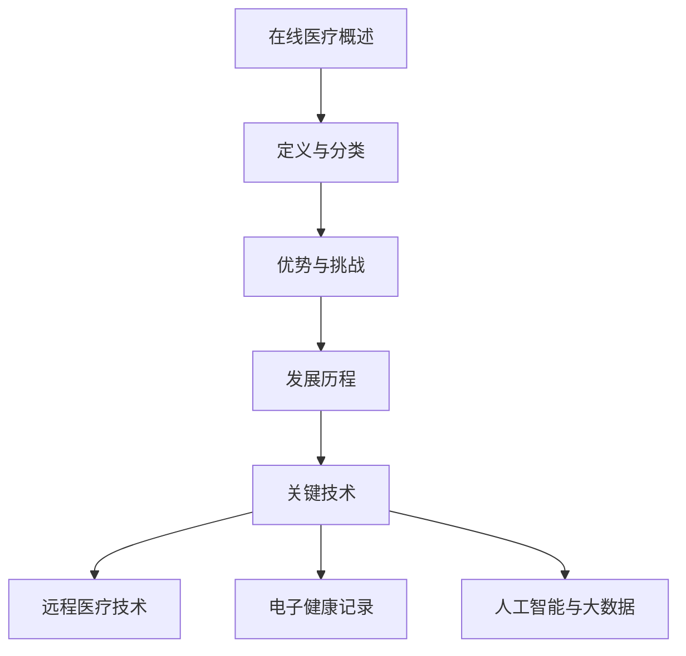
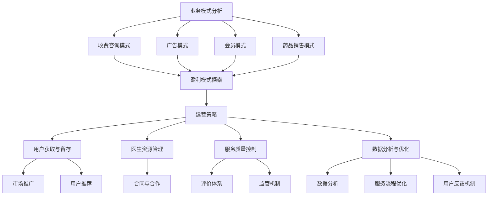
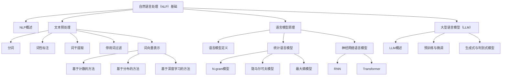
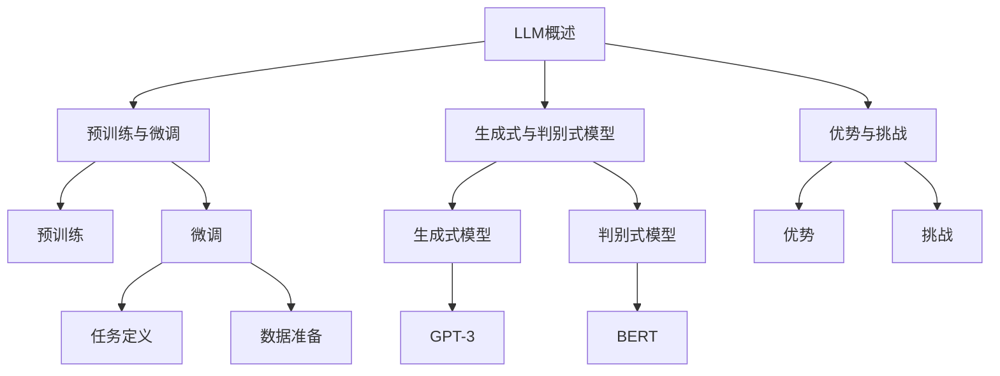
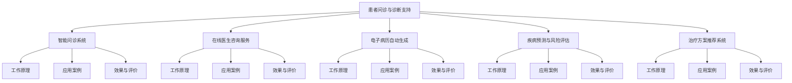
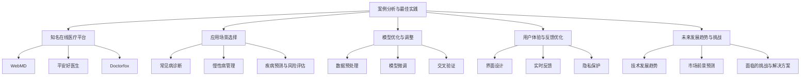
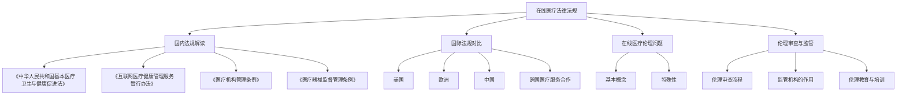
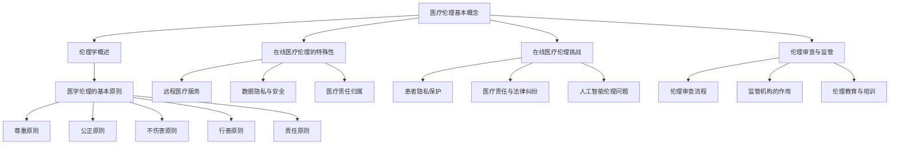
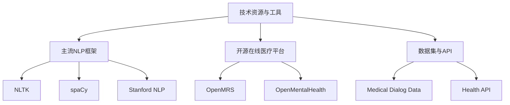

                 

### 第一部分：在线医疗概述

## 第1章：在线医疗的兴起与现状

### 1.1 在线医疗的定义与分类

**在线医疗概述**

在线医疗，也被称为远程医疗，是一种利用互联网和通信技术提供医疗保健服务的方式。它不仅包括医生与患者之间的远程交流，还涵盖了医疗信息的共享、电子健康记录的存储、在线诊断、远程监控以及医疗咨询等多个方面。在线医疗的出现，极大地改变了传统医疗服务的模式，使得医疗资源得以更加高效地分配和利用。

**在线医疗服务的模式**

在线医疗服务主要可以分为以下几种模式：

1. **远程诊断**：医生通过远程视频会议或电话与患者交流，对患者进行诊断。这种方式主要用于慢性病管理和复杂疾病的初步评估。

2. **在线咨询**：患者可以通过在线平台与医生进行实时沟通，获取医疗建议和治疗方案。这种方式适用于常见病和多发病的咨询。

3. **电子健康记录（EHR）**：通过互联网技术，患者和医生可以实时访问和更新患者的健康记录，方便医生进行诊断和治疗。

4. **远程监控**：利用可穿戴设备和传感器，对患者进行实时监控，如血压、血糖等生命体征数据，以便医生及时调整治疗方案。

5. **智能问诊**：基于人工智能技术，患者可以通过在线问答系统，获得初步的医疗建议，从而减少医疗资源的浪费。

**在线医疗的优势与挑战**

**优势：**

- **提高医疗可及性**：通过在线医疗，患者可以在家中获得专业的医疗服务，减少了因为地理位置造成的就医困难。

- **优化医疗资源分配**：在线医疗可以缓解医疗资源短缺的问题，特别是对于偏远地区和人口密集的城市地区。

- **提升医疗效率**：通过电子化和自动化技术，医疗流程得以简化，医生可以更加专注于复杂的病例。

- **改善患者体验**：在线医疗使得患者可以更加灵活地安排就医时间，提高了就医的便利性和舒适度。

**挑战：**

- **技术限制**：在线医疗的发展受到技术水平的限制，特别是偏远地区和医疗资源匮乏的地区。

- **信息安全与隐私保护**：在线医疗服务涉及到大量的个人健康数据，如何确保数据的安全性和隐私性是一个重要的问题。

- **医疗质量控制**：在线医疗服务的质量难以保证，需要建立完善的评价和监管机制。

- **法律法规和政策支持**：在线医疗需要相应的法律法规和政策支持，以确保其健康发展。

### 1.2 在线医疗的发展历程

**早期在线医疗平台**

在线医疗的概念早在20世纪90年代就已经出现。最早的在线医疗平台主要是通过电子邮件和论坛提供咨询服务。这些平台在初期阶段主要服务于慢性病患者和难以就医的特殊群体。

**技术发展与政策推动**

随着互联网技术的快速发展，在线医疗得到了迅速普及。21世纪初，视频会议技术和电子健康记录系统的应用，使得在线医疗服务更加成熟和多样化。同时，各国政府也开始出台相关政策，鼓励和规范在线医疗服务的发展。

**全球在线医疗市场分析**

全球在线医疗市场呈现出快速增长的趋势。根据市场研究机构的报告，预计到2025年，全球在线医疗市场的规模将达到数千亿美元。其中，美国、欧洲和中国是主要的市场驱动力量。

### 1.3 在线医疗的关键技术

**远程医疗技术**

远程医疗技术是在线医疗的核心技术之一。它包括视频会议、语音通话、远程监控和可穿戴设备等技术。这些技术使得医生和患者可以跨越地理障碍进行交流和监控。

**电子健康记录（EHR）**

电子健康记录系统是在线医疗的重要组成部分。它通过数字化方式记录和管理患者的健康信息，包括病史、检查结果、治疗方案等。EHR系统的应用，提高了医疗信息的共享性和准确性。

**人工智能与大数据应用**

人工智能和大数据技术在在线医疗中发挥着越来越重要的作用。人工智能可以用于智能问诊、医学影像分析、疾病预测等；大数据则可以为医疗决策提供数据支持，优化医疗资源配置。

### 总结

在线医疗作为新兴的医疗模式，正在逐渐改变传统的医疗服务模式。其优势显著，但也面临着诸多挑战。随着技术的不断进步和政策的逐步完善，在线医疗有望在未来得到更加广泛的应用和发展。



### 1.1 在线医疗的定义与分类

**在线医疗概述**

在线医疗，也被称为远程医疗，是一种利用互联网和通信技术提供医疗保健服务的方式。它不仅包括医生与患者之间的远程交流，还涵盖了医疗信息的共享、电子健康记录的存储、在线诊断、远程监控以及医疗咨询等多个方面。在线医疗的出现，极大地改变了传统医疗服务的模式，使得医疗资源得以更加高效地分配和利用。

**在线医疗服务的模式**

在线医疗服务主要可以分为以下几种模式：

1. **远程诊断**：医生通过远程视频会议或电话与患者交流，对患者进行诊断。这种方式主要用于慢性病管理和复杂疾病的初步评估。

2. **在线咨询**：患者可以通过在线平台与医生进行实时沟通，获取医疗建议和治疗方案。这种方式适用于常见病和多发病的咨询。

3. **电子健康记录（EHR）**：通过互联网技术，患者和医生可以实时访问和更新患者的健康记录，方便医生进行诊断和治疗。

4. **远程监控**：利用可穿戴设备和传感器，对患者进行实时监控，如血压、血糖等生命体征数据，以便医生及时调整治疗方案。

5. **智能问诊**：基于人工智能技术，患者可以通过在线问答系统，获得初步的医疗建议，从而减少医疗资源的浪费。

**在线医疗的优势与挑战**

**优势：**

- **提高医疗可及性**：通过在线医疗，患者可以在家中获得专业的医疗服务，减少了因为地理位置造成的就医困难。

- **优化医疗资源分配**：在线医疗可以缓解医疗资源短缺的问题，特别是对于偏远地区和人口密集的城市地区。

- **提升医疗效率**：通过电子化和自动化技术，医疗流程得以简化，医生可以更加专注于复杂的病例。

- **改善患者体验**：在线医疗使得患者可以更加灵活地安排就医时间，提高了就医的便利性和舒适度。

**挑战：**

- **技术限制**：在线医疗的发展受到技术水平的限制，特别是偏远地区和医疗资源匮乏的地区。

- **信息安全与隐私保护**：在线医疗服务涉及到大量的个人健康数据，如何确保数据的安全性和隐私性是一个重要的问题。

- **医疗质量控制**：在线医疗服务的质量难以保证，需要建立完善的评价和监管机制。

- **法律法规和政策支持**：在线医疗需要相应的法律法规和政策支持，以确保其健康发展。

### 1.2 在线医疗的发展历程

**早期在线医疗平台**

在线医疗的概念早在20世纪90年代就已经出现。最早的在线医疗平台主要是通过电子邮件和论坛提供咨询服务。这些平台在初期阶段主要服务于慢性病患者和难以就医的特殊群体。

**技术发展与政策推动**

随着互联网技术的快速发展，在线医疗得到了迅速普及。21世纪初，视频会议技术和电子健康记录系统的应用，使得在线医疗服务更加成熟和多样化。同时，各国政府也开始出台相关政策，鼓励和规范在线医疗服务的发展。

**全球在线医疗市场分析**

全球在线医疗市场呈现出快速增长的趋势。根据市场研究机构的报告，预计到2025年，全球在线医疗市场的规模将达到数千亿美元。其中，美国、欧洲和中国是主要的市场驱动力量。

### 1.3 在线医疗的关键技术

**远程医疗技术**

远程医疗技术是在线医疗的核心技术之一。它包括视频会议、语音通话、远程监控和可穿戴设备等技术。这些技术使得医生和患者可以跨越地理障碍进行交流和监控。

**电子健康记录（EHR）**

电子健康记录系统是在线医疗的重要组成部分。它通过数字化方式记录和管理患者的健康信息，包括病史、检查结果、治疗方案等。EHR系统的应用，提高了医疗信息的共享性和准确性。

**人工智能与大数据应用**

人工智能和大数据技术在在线医疗中发挥着越来越重要的作用。人工智能可以用于智能问诊、医学影像分析、疾病预测等；大数据则可以为医疗决策提供数据支持，优化医疗资源配置。

### 总结

在线医疗作为新兴的医疗模式，正在逐渐改变传统的医疗服务模式。其优势显著，但也面临着诸多挑战。随着技术的不断进步和政策的逐步完善，在线医疗有望在未来得到更加广泛的应用和发展。


## 第2章：在线医疗平台运营与管理

### 2.1 在线医疗平台的业务模式

**商业模式分析**

在线医疗平台的商业模式通常包括以下几种类型：

1. **收费咨询模式**：患者通过在线平台支付一定费用，获得专业医生的咨询服务。这种模式适用于常见病和多发病的咨询。

2. **广告模式**：在线医疗平台通过展示医疗广告或推广医疗服务来获取收入。这种模式需要平台拥有大量的用户流量和良好的品牌影响力。

3. **会员模式**：患者支付一定费用成为会员，享受平台的增值服务和优惠。会员模式可以为平台提供稳定的收入来源。

4. **药品销售模式**：部分在线医疗平台提供药品销售服务，患者可以在平台上购买处方药或非处方药。这种模式需要平台具备药品经营许可证和相关资质。

**盈利模式探索**

在线医疗平台的盈利模式需要综合考虑平台的用户规模、服务质量和运营成本。以下是一些常见的盈利模式：

- **按次收费**：患者每次咨询或服务支付一定费用，这是最常见的盈利模式之一。
- **套餐收费**：为患者提供一系列服务组合，以优惠价格进行打包销售。
- **广告和推广**：通过展示广告和推广医疗服务来获取收入。
- **药品销售**：通过销售药品获取利润。
- **增值服务**：提供VIP咨询、专业报告解读等增值服务，收取额外费用。

**运营策略**

在线医疗平台的运营策略包括以下几个方面：

- **用户获取与留存**：通过市场推广、用户推荐等方式吸引新用户，并通过优质服务提高用户留存率。
- **医生资源管理**：建立医生团队，通过合同、合作等方式吸引和留住优秀医生。
- **服务质量控制**：建立完善的评价体系，对医生和服务进行质量评估和监管。
- **数据分析与优化**：利用大数据技术分析用户行为和需求，优化服务流程和运营策略。

### 2.2 在线医疗平台的技术架构

**系统架构设计**

在线医疗平台的技术架构通常包括以下几个层次：

1. **前端架构**：包括用户界面和交互设计，通过Web或移动应用向用户提供服务。
2. **后端架构**：包括服务器、数据库和中间件，负责处理业务逻辑和数据存储。
3. **数据层**：包括数据仓库和大数据平台，用于存储和管理大量健康数据。

**数据处理与存储**

在线医疗平台需要对海量医疗数据进行高效处理和存储。常见的处理技术包括：

- **数据清洗与预处理**：对原始数据进行清洗，去除无效和错误数据，并进行格式转换和特征提取。
- **数据存储**：使用关系型数据库（如MySQL、PostgreSQL）和非关系型数据库（如MongoDB、Redis）进行数据存储。
- **数据仓库**：构建数据仓库，用于存储和分析大规模健康数据。

**安全与隐私保护**

在线医疗平台需要确保用户数据的安全和隐私。常见的保护措施包括：

- **数据加密**：对传输和存储的数据进行加密，防止数据泄露。
- **访问控制**：设置严格的访问权限，确保只有授权用户可以访问敏感数据。
- **隐私政策**：制定详细的隐私政策，告知用户如何保护自己的隐私。

### 2.3 在线医疗服务质量管理

**服务质量评价标准**

在线医疗服务质量评价标准包括以下几个方面：

- **医生资质**：确保提供咨询的医生具备合法资质和经验。
- **咨询效果**：评估患者的咨询体验和满意度。
- **诊断准确性**：评估医生诊断的准确性。
- **服务响应速度**：评估医生对患者的咨询响应速度。

**患者满意度调查**

为了提高服务质量，在线医疗平台需要定期进行患者满意度调查。调查内容包括：

- **服务体验**：患者对咨询过程、医生服务态度和响应速度的评价。
- **咨询效果**：患者对咨询效果的满意度。
- **服务建议**：患者对平台服务提出的改进建议。

**服务持续改进措施**

在线医疗平台应根据患者满意度调查结果，持续改进服务质量。常见的改进措施包括：

- **培训与考核**：对医生进行定期培训和考核，提高其专业水平和咨询质量。
- **优化服务流程**：简化咨询流程，提高服务效率。
- **用户反馈机制**：建立用户反馈机制，及时处理患者的问题和建议。
- **技术创新**：引入新技术，提升平台的服务能力和用户体验。

### 总结

在线医疗平台的运营和管理是一个复杂而系统性的工作，涉及到商业模式的设计、技术架构的构建、服务质量的保障等多个方面。通过科学的运营策略和技术支持，在线医疗平台可以提供高质量的服务，满足患者和医生的需求。



## 第3章：LLM基础与原理

### 3.1 自然语言处理（NLP）基础

**NLP概述**

自然语言处理（NLP）是计算机科学和人工智能领域的一个重要分支，旨在使计算机能够理解、解释和生成人类语言。NLP的目标是使计算机能够处理自然语言数据，从而实现人机交互、信息提取、文本分析等应用。

**文本预处理**

文本预处理是NLP任务中非常重要的一步，其目的是将原始文本转换为适合计算机处理的形式。文本预处理通常包括以下步骤：

1. **分词**：将连续的文本切分成一个个单词或短语的序列。
2. **词性标注**：为每个单词或短语标注其词性（如名词、动词、形容词等）。
3. **词干提取**：将变形后的单词还原为基本形式，如“runnings”还原为“run”。
4. **停用词过滤**：去除对NLP任务无意义的常见词（如“的”、“是”等）。
5. **词向量表示**：将单词转换为数值向量，以便于计算机进行计算。

**词向量表示**

词向量表示是将单词映射为高维空间中的向量。常见的词向量表示方法包括：

1. **基于计数的方法**：如词袋模型（Bag-of-Words，BoW）和TF-IDF（Term Frequency-Inverse Document Frequency）。
2. **基于分布的方法**：如Word2Vec、GloVe（Global Vectors for Word Representation）等。
3. **基于深度学习的方法**：如BERT（Bidirectional Encoder Representations from Transformers）等。

### 3.2 语言模型原理

**语言模型定义**

语言模型（Language Model，LM）是一种预测模型，用于预测一个词序列中下一个词的概率分布。在NLP任务中，语言模型是一个重要的基础组件，广泛应用于文本生成、机器翻译、情感分析等。

**统计语言模型**

统计语言模型是基于统计方法构建的语言模型，其核心思想是通过大量语料数据来学习语言中的统计规律。常见的统计语言模型包括：

1. **N-gram模型**：基于历史N个词来预测下一个词的概率分布。
2. **隐马尔可夫模型（HMM）**：用于处理隐状态序列模型，如语音识别中的声学模型。
3. **最大熵模型**：通过最大化条件概率来构建语言模型。

**神经网络语言模型**

神经网络语言模型是基于神经网络构建的语言模型，通过深度学习算法来学习语言的分布式表示。常见的神经网络语言模型包括：

1. **循环神经网络（RNN）**：如LSTM（Long Short-Term Memory）和GRU（Gated Recurrent Unit）。
2. **变换器（Transformer）**：基于自注意力机制，如BERT和GPT（Generative Pre-trained Transformer）。

### 3.3 大型语言模型（LLM）

**LLM概述**

大型语言模型（Large Language Model，LLM）是一种具有数万亿参数的语言模型，通过在大规模语料库上进行预训练，能够生成高质量的自然语言文本。LLM的出现极大地推动了NLP技术的发展和应用。

**预训练与微调**

预训练（Pre-training）是指在大规模未标注的语料库上训练语言模型，使其具备一定的语言理解和生成能力。微调（Fine-tuning）是指在预训练的基础上，使用特定任务的数据对语言模型进行调整，以适应具体的应用场景。

**生成式与判别式模型**

大型语言模型可以分为生成式模型和判别式模型：

1. **生成式模型**：通过生成文本的概率分布来生成自然语言文本。常见的生成式模型包括GPT和T5。
2. **判别式模型**：通过预测输入文本的真实标签来对文本进行分类或标注。常见的判别式模型包括BERT和ALBERT。

### 总结

本章介绍了自然语言处理的基础知识，包括文本预处理、词向量表示和语言模型原理。随后，讨论了大型语言模型（LLM）的概述、预训练与微调、以及生成式与判别式模型。这些基础知识为理解LLM在在线医疗中的应用奠定了基础。



### 3.3 大型语言模型（LLM）

**LLM概述**

大型语言模型（Large Language Model，LLM）是一种拥有数十亿甚至数万亿参数的深度学习模型，通过在庞大的文本语料库上进行预训练，能够掌握丰富的语言知识和模式。LLM的出现，为自然语言处理（NLP）领域带来了革命性的变化，使得计算机在语言理解和生成任务上取得了显著的进展。

**预训练与微调**

预训练（Pre-training）是指在大规模、未标注的文本语料库上对语言模型进行训练，使其具备基本的语言理解和生成能力。这一过程通常包括以下几个步骤：

1. **数据准备**：收集和处理大规模的文本数据，如维基百科、新闻文章、书籍等。
2. **模型初始化**：初始化语言模型的参数，常用的初始化方法包括随机初始化和基于已有模型的迁移学习。
3. **训练过程**：使用并行计算和分布式训练技术，在文本数据上进行大规模的训练，不断调整模型的参数，使其能够捕捉到文本中的复杂模式。

预训练完成后，LLM通常需要进行微调（Fine-tuning），以适应特定的应用场景。微调过程通常包括：

1. **任务定义**：明确需要解决的具体NLP任务，如文本分类、机器翻译、问答系统等。
2. **数据准备**：收集和整理用于微调的任务数据，并进行预处理，如分词、编码等。
3. **微调过程**：在任务数据上对LLM进行微调，调整模型的参数，使其在特定任务上达到更好的性能。

**生成式与判别式模型**

LLM可以划分为生成式模型和判别式模型：

1. **生成式模型**：生成式模型通过预测文本的概率分布来生成自然语言文本。这类模型在文本生成任务中具有显著优势。常见的生成式LLM包括GPT（Generative Pre-trained Transformer）系列，如GPT-3，具有极高的文本生成质量和流畅度。

    ```mermaid
    graph TD
        A[生成式模型] --> B[GPT-3]
        B --> C[文本生成质量高]
        B --> D[流畅度好]
    ```

2. **判别式模型**：判别式模型通过预测文本的标签或类别来对文本进行分类或标注。这类模型在文本分类、情感分析等任务中表现出色。常见的判别式LLM包括BERT（Bidirectional Encoder Representations from Transformers）系列，如BERT和RoBERTa。

    ```mermaid
    graph TD
        A[判别式模型] --> B[BERT]
        B --> C[文本分类准确]
        B --> D[情感分析强]
    ```

**LLM的优势与挑战**

**优势：**

- **强大的语言理解能力**：LLM通过在大量文本上进行预训练，能够学习到丰富的语言知识和模式，从而在多种NLP任务中表现出色。
- **高效的文本生成**：生成式LLM能够生成高质量的自然语言文本，适用于自动写作、机器翻译、对话系统等应用。
- **灵活的微调能力**：LLM通过微调可以适应不同的应用场景，实现特定任务的性能优化。

**挑战：**

- **计算资源消耗大**：训练和微调LLM需要大量的计算资源，包括GPU和TPU等高性能计算设备。
- **数据隐私和安全**：LLM在训练过程中需要处理大量敏感的文本数据，如何确保数据隐私和安全是一个重要问题。
- **模型解释性和可控性**：LLM的内部机制复杂，其决策过程往往缺乏透明性和可控性，这对于需要高度可靠性和解释性的医疗应用场景来说是一个挑战。

### 总结

大型语言模型（LLM）作为一种先进的NLP技术，通过预训练和微调，能够生成高质量的文本并适应各种NLP任务。虽然LLM在文本理解和生成方面具有显著优势，但同时也面临着计算资源、数据隐私和模型解释性等方面的挑战。随着技术的不断进步，LLM在在线医疗等领域的应用将越来越广泛，为医疗行业带来革命性的变革。



## 第4章：LLM在在线医疗中的应用

### 4.1 患者问诊与诊断支持

**智能问诊系统**

智能问诊系统是LLM在在线医疗中的一项重要应用。通过智能问诊系统，患者可以与计算机程序进行交互，输入自己的症状和病史，系统会根据患者的描述提供可能的诊断建议和下一步的就医指导。

**工作原理**

智能问诊系统通常包括以下几个步骤：

1. **用户输入**：患者通过文本或语音输入自己的症状和病史。
2. **自然语言理解**：系统使用NLP技术对患者的输入进行解析，提取关键信息，如症状、病史、药物反应等。
3. **症状分析**：系统利用LLM的知识库和推理能力，分析患者的症状，判断可能的疾病类型或健康问题。
4. **诊断建议**：系统根据分析结果，提供可能的诊断建议和就医建议，如建议患者进行哪些检查、看哪个科室的医生等。
5. **用户反馈**：患者可以对诊断建议进行反馈，系统根据反馈进一步优化诊断结果。

**应用案例**

1. **常见病诊断**：智能问诊系统可以快速诊断常见病和多发病，如感冒、腹泻、头疼等，帮助患者获得初步的医疗建议。
2. **慢性病管理**：对于慢性病患者，智能问诊系统可以提供长期的医疗建议和健康指导，帮助患者管理病情。
3. **药物咨询**：系统可以提供关于药物的信息，包括药物的适应症、副作用、注意事项等，帮助患者了解药物使用情况。

**效果与评价**

智能问诊系统的效果和评价主要体现在以下几个方面：

- **准确性**：系统诊断的准确性直接影响到患者的信任度和使用效果。高精度的诊断结果可以提高患者的满意度。
- **用户体验**：系统的交互界面和响应速度对用户体验有重要影响。友好的界面和快速的响应可以提高患者的使用体验。
- **辅助决策**：智能问诊系统可以为医生提供辅助决策支持，帮助医生更快速地诊断病情，提高医疗效率。

### 4.2 医疗咨询服务

**在线医生咨询服务**

在线医生咨询服务是LLM在在线医疗中的另一个重要应用。通过在线医生咨询服务，患者可以在任何时间、任何地点与专业医生进行实时沟通，获取医疗建议和治疗方案。

**工作原理**

在线医生咨询服务的工作原理与智能问诊系统类似，但更加深入和专业化。具体包括以下几个步骤：

1. **用户咨询**：患者通过在线平台提交咨询请求，描述自己的症状和需求。
2. **医生接诊**：系统将咨询请求分配给专业医生，医生通过文本或语音与患者进行交流。
3. **病情分析**：医生根据患者的症状和病史，进行详细的病情分析和诊断。
4. **治疗方案制定**：医生根据病情分析结果，制定相应的治疗方案，包括药物治疗、检查建议、生活方式调整等。
5. **咨询记录**：系统的后台会记录整个咨询过程，包括患者信息、医生诊断和治疗方案，以便后续查询和跟踪。

**应用案例**

1. **常见病咨询**：在线医生咨询服务适用于常见病和多发病的咨询，如感冒、腹泻、皮肤问题等。
2. **慢性病管理**：对于慢性病患者，在线医生咨询服务可以提供长期的医疗建议和健康管理服务。
3. **紧急情况处理**：在紧急情况下，在线医生咨询服务可以为患者提供快速的医疗建议，帮助患者采取正确的急救措施。

**效果与评价**

在线医生咨询服务的效果和评价主要体现在以下几个方面：

- **专业性和准确性**：医生的专业能力和诊断准确性是患者选择在线咨询的重要因素。专业的医生和准确的诊断可以提高患者的信任度和满意度。
- **便捷性和灵活性**：在线医生咨询服务为患者提供了便捷和灵活的就医方式，患者可以在家中随时随地进行咨询，节省了时间和交通成本。
- **患者体验**：系统的用户界面设计、医生的服务态度和响应速度等因素对患者的体验有重要影响。良好的用户体验可以增加患者的忠诚度。

### 4.3 病历管理与辅助决策

**电子病历自动生成**

电子病历（Electronic Health Record，EHR）是现代医疗中不可或缺的一部分。通过LLM，可以实现电子病历的自动生成，提高病历管理的效率和质量。

**工作原理**

电子病历自动生成的工作原理包括以下几个步骤：

1. **患者信息收集**：系统通过接入医院的电子病历系统，收集患者的个人信息、病史、检查报告等数据。
2. **自然语言处理**：系统使用NLP技术对患者的信息进行解析和处理，提取关键信息，如症状、检查结果、治疗方案等。
3. **病历生成**：系统根据提取的信息和预设的病历模板，自动生成电子病历，包括病历记录、诊断结论、治疗方案等。
4. **病历审核**：生成的电子病历由医生进行审核和修改，确保病历的准确性和完整性。

**应用案例**

1. **自动化病历记录**：通过自动生成病历，医生可以节省大量的时间和精力，提高工作效率。
2. **病历共享与查询**：自动生成的电子病历可以实现病历的共享和远程查询，方便医生之间的合作和沟通。
3. **医学研究**：自动生成的电子病历数据可以用于医学研究和数据分析，为医学研究提供宝贵的数据资源。

**效果与评价**

电子病历自动生成系统的效果和评价主要体现在以下几个方面：

- **效率提升**：自动生成病历可以大大提高医生的病历记录效率，减轻医生的工作负担。
- **准确性保证**：通过NLP技术和预设模板，自动生成的病历具有较高的准确性和一致性，减少了人工记录的错误。
- **数据管理**：自动生成的电子病历数据便于存储和管理，为医疗数据的长期保存和利用提供了保障。

### 4.4 疾病预测与风险评估

**疾病预测与风险评估系统**

疾病预测与风险评估系统是LLM在在线医疗中的另一个重要应用。通过分析患者的健康数据，系统可以预测患者可能患有的疾病，并提供相应的风险评估。

**工作原理**

疾病预测与风险评估系统的工作原理包括以下几个步骤：

1. **数据收集**：系统从电子病历、健康监测设备、患者报告等多个渠道收集患者的健康数据，如血压、血糖、体重等。
2. **数据预处理**：系统对收集到的数据进行清洗、整合和预处理，确保数据的质量和一致性。
3. **特征提取**：系统使用NLP和机器学习算法，从预处理后的数据中提取关键特征，如疾病症状、生活习惯、家族病史等。
4. **预测模型训练**：系统使用历史疾病数据和特征，训练预测模型，学习疾病发生和发展的规律。
5. **疾病预测**：系统根据患者的特征数据，使用训练好的预测模型，预测患者可能患有的疾病。
6. **风险评估**：系统根据预测结果，对患者的疾病风险进行评估，提供个性化的健康建议和预防措施。

**应用案例**

1. **慢性病预测**：系统可以预测患者可能患有的慢性病，如心脏病、糖尿病等，为患者提供早期的预防和干预措施。
2. **肿瘤风险评估**：系统可以根据患者的家族病史、生活习惯等特征，评估患者患肿瘤的风险，提供针对性的健康指导。
3. **传染病预测**：在传染病爆发期间，系统可以预测疫情的发展和传播趋势，为公共卫生决策提供数据支持。

**效果与评价**

疾病预测与风险评估系统的效果和评价主要体现在以下几个方面：

- **准确性**：系统的预测准确性直接影响到患者的信任度和使用效果。高精度的预测结果可以提高患者的满意度。
- **实时性**：系统需要能够实时分析患者的健康数据，及时提供预测和风险评估结果，以便患者及时采取措施。
- **个性化**：系统应根据患者的个人特征和健康状况，提供个性化的预测和风险评估，以提高预测的准确性。

### 4.5 治疗方案推荐系统

**治疗方案推荐系统**

治疗方案推荐系统是LLM在在线医疗中的又一重要应用。通过分析患者的病情和医疗数据，系统可以为医生提供最优的治疗方案推荐。

**工作原理**

治疗方案推荐系统的工作原理包括以下几个步骤：

1. **病例数据收集**：系统从电子病历、医学文献、临床试验等多个渠道收集患者的病例数据。
2. **自然语言处理**：系统使用NLP技术对病例数据进行解析，提取关键信息，如诊断结果、治疗方案、治疗效果等。
3. **知识图谱构建**：系统构建医疗知识图谱，将病例数据映射到图谱中，形成知识库。
4. **治疗方案生成**：系统根据患者的病情和知识图谱，生成多个可能的治疗方案。
5. **方案评估**：系统使用评估模型，对生成方案进行评估，选择最优的治疗方案。
6. **医生审核**：生成的治疗方案由医生进行审核和确认，确保方案的合理性和可行性。

**应用案例**

1. **多病种治疗推荐**：治疗方案推荐系统可以针对多种疾病提供治疗建议，如肿瘤治疗、心血管疾病治疗等。
2. **个性化治疗**：系统可以根据患者的具体病情和健康状况，提供个性化的治疗方案，提高治疗效果。
3. **疾病管理**：治疗方案推荐系统可以为慢性病患者提供长期的治疗和管理建议，帮助患者管理病情。

**效果与评价**

治疗方案推荐系统的效果和评价主要体现在以下几个方面：

- **准确性**：系统的治疗方案推荐准确性直接影响到医生和患者的信任度。高精度的治疗方案推荐可以提高患者的满意度。
- **实用性**：系统的治疗方案需要具有实际应用价值，能够指导医生制定合理的治疗方案，提高医疗效果。
- **可解释性**：系统的治疗方案推荐过程需要具有可解释性，医生能够理解并接受系统的推荐，从而提高治疗的协同性。

### 总结

LLM在在线医疗中具有广泛的应用前景，从患者问诊与诊断支持、医疗咨询服务，到病历管理、疾病预测与风险评估，以及治疗方案推荐系统，LLM都展现出了强大的应用潜力。随着技术的不断进步和应用场景的拓展，LLM将为在线医疗带来更多创新和变革。



## 第5章：案例分析与最佳实践

### 5.1 国内外在线医疗平台案例分析

**知名在线医疗平台**

全球范围内，一些在线医疗平台已经取得了显著的成功。以下是一些知名的平台及其成功因素：

1. **美国：WebMD**
   - **成功因素**：WebMD通过提供广泛的医疗信息和在线咨询，成为全球最大的健康资源网站之一。其成功得益于其高质量的医疗内容、用户友好的界面以及广泛的覆盖范围。

2. **中国：平安好医生**
   - **成功因素**：平安好医生通过整合线上咨询、健康管理、药品配送等服务，打造了一个综合性的在线医疗服务平台。其成功得益于强大的医疗资源、技术创新和优秀的用户体验。

3. **欧洲：Doctorfox**
   - **成功因素**：Doctorfox通过提供快速预约医生的服务，解决了患者就医难的问题。其成功得益于其高效的预约系统、专业的医生团队和优质的咨询服务。

**案例分析启示**

通过对这些知名在线医疗平台的案例分析，我们可以得出以下启示：

- **优质内容与服务**：平台需要提供高质量的医疗内容和服务，以满足用户的多样化需求。
- **用户体验**：平台需要注重用户体验，提供便捷、快速的就医方式，以提高用户满意度和忠诚度。
- **技术创新**：平台需要不断引入新技术，如人工智能、大数据等，以提升服务质量和效率。

### 5.2 LLM在在线医疗应用的最佳实践

**应用场景选择**

在在线医疗中，选择合适的LLM应用场景至关重要。以下是一些最佳实践：

- **常见病诊断**：由于常见病的症状较为明确，LLM可以在这些场景中发挥良好的作用，提供快速、准确的诊断建议。
- **慢性病管理**：对于慢性病患者，LLM可以提供长期的健康指导和管理建议，帮助患者更好地控制病情。
- **疾病预测与风险评估**：LLM可以通过分析患者的健康数据，预测可能的疾病风险，提供个性化的健康建议。

**模型优化与调整**

为了提高LLM在在线医疗中的效果，以下是一些优化和调整的最佳实践：

- **数据预处理**：确保输入数据的质量和一致性，通过数据清洗、去噪和特征提取等预处理步骤，提高模型的训练效果。
- **模型微调**：根据不同的应用场景，对LLM进行微调，使其能够更好地适应特定任务的需求。
- **交叉验证**：使用交叉验证方法，评估模型的泛化能力，避免过拟合。

**用户体验与反馈优化**

提升用户体验是确保在线医疗平台成功的关键。以下是一些用户体验和反馈优化的最佳实践：

- **界面设计**：设计直观、易于使用的界面，使患者能够轻松地进行操作。
- **实时反馈**：及时响应用户的反馈，对系统进行优化和改进。
- **隐私保护**：确保患者的隐私得到充分保护，增强用户对平台的信任。

### 5.3 未来发展趋势与挑战

**技术发展趋势**

在线医疗和LLM技术的发展趋势包括：

- **人工智能与大数据的结合**：随着人工智能和大数据技术的不断进步，在线医疗将能够提供更加个性化和精准的服务。
- **虚拟现实（VR）和增强现实（AR）的应用**：VR和AR技术可以提供更加沉浸式的医疗服务，提高患者的就医体验。
- **区块链技术的应用**：区块链技术可以用于医疗数据的存储和传输，提高数据的安全性和隐私性。

**市场前景预测**

在线医疗和LLM的市场前景预测包括：

- **市场规模增长**：随着人们对健康意识的提高和医疗需求的增加，在线医疗和LLM的市场规模将继续增长。
- **国际化发展**：随着全球化的进程，在线医疗和LLM将在国际市场上得到更广泛的应用。

**面临的挑战与解决方案**

在线医疗和LLM面临的挑战包括：

- **数据隐私和安全**：如何保护患者的隐私和数据安全是当前面临的重要挑战。解决方案包括采用加密技术、制定严格的隐私政策和加强监管。
- **医疗质量控制**：如何确保在线医疗服务的质量是一个重要问题。解决方案包括建立完善的评价体系、加强医生培训和监管。

### 总结

通过对国内外在线医疗平台的案例分析以及LLM在在线医疗应用的最佳实践，我们可以看到在线医疗和LLM的发展前景广阔，同时也面临着诸多挑战。随着技术的不断进步和市场的逐渐成熟，在线医疗和LLM将在未来带来更多的创新和变革。



## 第6章：在线医疗的法律法规

### 6.1 国内在线医疗法规解读

**相关法律法规概述**

随着在线医疗的快速发展，我国已经出台了一系列法律法规来规范在线医疗服务。以下是我国主要的在线医疗相关法律法规及其主要内容：

1. **《中华人民共和国基本医疗卫生与健康促进法》**
   - **主要内容**：该法是我国医疗卫生领域的基本法律，明确了医疗卫生服务的基本原则和规范。其中，针对在线医疗，规定了医疗机构提供在线医疗服务的要求，如必须具备合法资质、确保医疗服务质量等。

2. **《互联网医疗健康管理服务暂行办法》**
   - **主要内容**：该办法是我国针对互联网医疗健康管理服务出台的专项法规，明确了互联网医疗健康服务的范围、服务规范、信息安全等方面的要求。其中包括在线咨询、远程诊断、电子健康记录等服务的具体操作规范。

3. **《医疗机构管理条例》**
   - **主要内容**：该条例对医疗机构的设立、资质审核、医疗服务等进行了详细规定。在线医疗机构作为医疗机构的一种形式，也需遵守该条例的规定。

4. **《医疗器械监督管理条例》**
   - **主要内容**：该条例对医疗器械的监督管理进行了规定，包括医疗器械的注册、生产、经营和使用等。对于在线医疗中使用的医疗器械，如远程监护设备、健康监测设备等，均需遵循该条例。

**在线医疗服务的规范**

根据上述法律法规，在线医疗服务需要遵循以下规范：

- **资质要求**：在线医疗机构必须取得合法资质，如医疗机构执业许可证等。
- **服务质量**：在线医疗服务必须确保质量，如医生资质、服务流程、隐私保护等。
- **信息安全**：在线医疗服务需要采取有效措施保护患者信息的安全，如数据加密、访问控制等。

### 6.2 国际在线医疗法规对比

**全球在线医疗法规现状**

全球范围内，不同国家和地区对在线医疗的法律法规有所不同，主要分为以下几种类型：

1. **美国**
   - **立法现状**：美国通过多项法律法规来规范在线医疗服务，如《健康保险便携与责任法》（HIPAA）、《联邦通信法》等。
   - **主要内容**：HIPAA对在线医疗数据的隐私和安全进行了详细规定，要求医疗机构采取有效措施保护患者信息。联邦通信法则对远程医疗服务进行了规范，如要求远程医疗服务提供者必须具备相应资质。

2. **欧洲**
   - **立法现状**：欧洲各国对在线医疗的法律法规也有所不同，但主要集中在《通用数据保护条例》（GDPR）等方面。
   - **主要内容**：GDPR对个人数据的保护进行了全面规定，对在线医疗数据的使用、存储和传输提出了严格要求。同时，欧洲各国还制定了专门的在线医疗法规，如德国的《远程医疗法》。

3. **中国**
   - **立法现状**：我国对在线医疗的法律法规逐渐完善，但仍有一些空白领域需要填补。
   - **主要内容**：如前文所述，我国的主要在线医疗法规包括《中华人民共和国基本医疗卫生与健康促进法》、《互联网医疗健康管理服务暂行办法》等。

**跨国医疗服务合作**

跨国医疗服务合作需要考虑不同国家和地区的法律法规。以下是一些合作中的注意事项：

- **法规遵从性**：跨国医疗服务提供者需要遵守各国的在线医疗法规，确保服务合规。
- **数据传输**：跨国数据传输需要遵守相关数据保护法规，确保数据安全。
- **隐私保护**：跨国医疗服务需要采取有效的隐私保护措施，确保患者隐私不受侵犯。

### 6.3 在线医疗伦理问题

**医疗伦理基本概念**

医疗伦理是指医学实践中所涉及的道德原则和规范。在线医疗伦理作为医疗伦理的一个重要分支，主要关注在线医疗服务中的道德问题。以下是一些基本概念：

- **知情同意**：患者在接受在线医疗服务前，应被告知服务的内容、风险和可能的后果，并同意接受服务。
- **隐私保护**：在线医疗服务提供者应采取有效措施保护患者的隐私，确保患者信息不被泄露。
- **医疗责任**：在线医疗服务提供者应对患者的健康和安全负责，确保提供高质量的医疗服务。

**在线医疗伦理的特殊性**

在线医疗伦理相较于传统医疗伦理，具有以下特殊性：

- **远程医疗服务**：在线医疗的远程特性使得医生与患者之间的沟通和监督变得更加困难，增加了伦理风险。
- **数据隐私与安全**：在线医疗服务涉及大量患者信息，如何保护这些信息的隐私和安全是伦理问题的关键。
- **医疗责任归属**：在线医疗服务的责任归属问题，特别是在患者出现健康问题时，如何界定责任和责任承担方式。

### 6.4 伦理审查与监管

**伦理审查流程**

在线医疗服务的伦理审查是一个关键环节，主要包括以下几个步骤：

1. **项目申请**：在线医疗服务提供者需向伦理审查委员会提交项目申请，包括服务内容、目标、方法等。
2. **伦理审查**：伦理审查委员会对项目申请进行审查，评估项目是否符合伦理原则和法规要求。
3. **伦理批准**：伦理审查委员会根据审查结果，决定是否批准项目实施。
4. **持续监督**：项目实施过程中，伦理审查委员会需对项目进行持续监督，确保项目符合伦理要求。

**监管机构的作用**

在线医疗的监管机构在保障在线医疗服务质量、保护患者权益方面发挥着重要作用。以下是一些主要监管机构的作用：

- **制定法规和标准**：监管机构制定在线医疗服务的相关法规和标准，规范在线医疗服务行为。
- **监督执行**：监管机构对在线医疗服务提供者进行监督，确保其遵守法规和标准。
- **处理投诉**：监管机构处理患者的投诉，维护患者权益。

**伦理教育与培训**

为了提高在线医疗服务提供者的伦理意识和能力，伦理教育和培训是必不可少的。以下是一些主要内容和措施：

- **伦理课程设置**：在线医疗服务提供者需设置伦理课程，包括伦理原则、案例分析等。
- **培训与考核**：定期对在线医疗服务提供者进行伦理培训和考核，确保其具备必要的伦理知识和能力。
- **持续学习**：鼓励在线医疗服务提供者参与伦理研讨会、工作坊等活动，不断更新知识。

### 总结

在线医疗的法律法规和伦理问题是一个复杂且重要的领域。通过国内外法律法规的解读和对比，以及伦理审查和监管机制的研究，我们可以更好地理解和应对在线医疗中的伦理和法律挑战。未来，随着在线医疗的不断发展，相关法律法规和伦理标准将不断完善，为在线医疗的健康发展提供有力保障。



## 第7章：在线医疗伦理问题

### 7.1 医疗伦理基本概念

**伦理学概述**

伦理学是研究道德原则和道德规范的学科，关注个体和社会在行为选择中的道德问题。在医学领域，医学伦理学（Medical Ethics）是研究医学实践中道德原则和道德规范的应用，旨在确保医疗服务过程中的公正性、尊重性和责任感。

**医学伦理的基本原则**

医学伦理的基本原则包括：

1. **尊重原则**：尊重患者的自主权，包括患者的知情同意、隐私保护和医疗选择权。
2. **公正原则**：确保医疗资源的公平分配，避免歧视和偏见。
3. **不伤害原则**：避免对患者造成伤害，采取最小伤害的最大效益原则。
4. **行善原则**：积极为患者提供医疗帮助，追求患者的最大福祉。
5. **责任原则**：医务人员应对患者的健康和安全承担责任，确保医疗服务的质量和安全。

**在线医疗伦理的特殊性**

在线医疗作为一种新兴的医疗模式，其伦理问题与传统医疗存在一些特殊之处：

1. **远程医疗服务**：由于医生与患者之间的物理距离，在线医疗在沟通和监督方面存在一定的挑战，可能导致伦理风险的增加。
2. **数据隐私与安全**：在线医疗服务涉及大量的患者数据，如何保护这些数据的隐私和安全成为一个重要的伦理问题。
3. **医疗责任归属**：在线医疗服务的责任归属问题复杂，特别是在出现医疗纠纷时，如何界定责任和责任承担方式是一个重要挑战。

### 7.2 在线医疗伦理挑战

**患者隐私保护**

在线医疗在患者隐私保护方面面临着诸多挑战：

1. **数据泄露风险**：在线医疗服务中涉及大量敏感信息，如患者的病历、诊断结果等，这些数据一旦泄露，可能导致严重的隐私侵犯和声誉损害。
2. **跨境数据传输**：在线医疗服务往往需要跨国数据传输，不同国家的数据保护法规可能不一致，增加了数据传输的风险。
3. **隐私政策透明度**：在线医疗平台需要制定明确的隐私政策，告知患者如何保护其隐私，但实际操作中，隐私政策的透明度和可理解性可能不足。

**医疗责任与法律纠纷**

在线医疗在医疗责任和法律纠纷方面存在以下挑战：

1. **责任界定**：在线医疗服务的责任归属问题复杂，特别是在出现医疗事故时，如何界定医生和平台的责任成为法律纠纷的焦点。
2. **法律适用性**：不同国家和地区的法律法规可能对在线医疗服务有不同的规定，跨境医疗服务的法律适用性是一个重要问题。
3. **法律纠纷解决**：在线医疗的法律纠纷解决机制不完善，可能需要建立专门的在线医疗纠纷解决渠道。

**人工智能伦理问题**

随着人工智能在在线医疗中的应用日益广泛，人工智能伦理问题也逐渐凸显：

1. **算法公平性**：人工智能算法在诊断和治疗建议中可能存在偏见，如何确保算法的公平性和公正性是一个重要问题。
2. **算法透明性**：人工智能算法的决策过程通常复杂且不透明，如何提高算法的透明性，让医务人员和患者理解其决策依据，是一个挑战。
3. **算法责任**：在人工智能辅助的医疗决策中，如何界定人工智能和人类医务人员的责任，确保医疗责任的明确性和可追究性。

### 7.3 伦理审查与监管

**伦理审查流程**

伦理审查是保障在线医疗服务伦理合规的重要环节，其流程通常包括：

1. **项目申请**：在线医疗服务提供者需向伦理审查委员会提交项目申请，包括服务内容、目标、方法等。
2. **初步审查**：伦理审查委员会对项目申请进行初步审查，确保项目符合伦理审查的基本要求。
3. **深入审查**：伦理审查委员会对项目进行深入审查，评估项目的伦理风险，包括患者隐私保护、数据安全、医疗责任等方面。
4. **伦理批准**：伦理审查委员会根据审查结果，决定是否批准项目实施。
5. **持续监督**：项目实施过程中，伦理审查委员会需对项目进行持续监督，确保项目符合伦理要求。

**监管机构的作用**

在线医疗监管机构在保障在线医疗服务质量、保护患者权益方面发挥着关键作用，主要职责包括：

1. **制定法规和标准**：监管机构制定在线医疗服务的相关法规和标准，规范在线医疗服务行为。
2. **监督执行**：监管机构对在线医疗服务提供者进行监督，确保其遵守法规和标准。
3. **处理投诉**：监管机构处理患者的投诉，维护患者权益。

**伦理教育与培训**

为了提高在线医疗服务提供者的伦理意识和能力，伦理教育和培训是必不可少的。以下是一些主要内容和措施：

1. **伦理课程设置**：在线医疗服务提供者需设置伦理课程，包括伦理原则、案例分析等。
2. **培训与考核**：定期对在线医疗服务提供者进行伦理培训和考核，确保其具备必要的伦理知识和能力。
3. **持续学习**：鼓励在线医疗服务提供者参与伦理研讨会、工作坊等活动，不断更新知识。

### 总结

在线医疗伦理问题涉及到多个方面，包括患者隐私保护、医疗责任和法律纠纷、人工智能伦理等。面对这些伦理挑战，建立完善的伦理审查和监管机制至关重要。通过伦理教育和培训，提高在线医疗服务提供者的伦理意识和能力，将有助于确保在线医疗服务的伦理合规和健康发展。



## 附录A：技术资源与工具

### A.1 主流NLP框架介绍

自然语言处理（NLP）框架是进行文本分析和语言建模的重要工具。以下是一些主流的NLP框架及其特点：

**1. NLTK**

- **概述**：NLTK（自然语言工具包）是一个广泛使用的Python库，提供了许多用于文本处理和NLP的算法和工具。
- **特点**：NLTK包括分词、词性标注、词干提取等基本功能，适用于学术研究和教育。

**2. spaCy**

- **概述**：spaCy是一个高效的NLP库，适用于生产环境。它提供了快速的文本处理和预训练的模型。
- **特点**：spaCy支持多种语言，提供高质量的词向量表示和实体识别功能。

**3. Stanford NLP**

- **概述**：斯坦福NLP是一个由斯坦福大学开发的开源NLP工具包，包括许多先进的文本处理功能。
- **特点**：斯坦福NLP提供了词性标注、句法分析、实体识别等高级功能，适合复杂文本处理任务。

### A.2 开源在线医疗平台

开源在线医疗平台为开发者提供了构建和扩展在线医疗服务的灵活性和自由度。以下是一些常用的开源平台：

**1. OpenMRS**

- **概述**：OpenMRS（开放医疗记录系统）是一个开源的电子健康记录（EHR）系统，适用于各种医疗环境。
- **特点**：OpenMRS支持多语言、多机构、多数据源，提供了强大的数据管理和分析功能。

**2. OpenMentalHealth**

- **概述**：OpenMentalHealth是一个专门为心理健康服务设计的开源平台，提供了全面的临床工作流程支持。
- **特点**：OpenMentalHealth集成了心理评估工具、电子病历管理和患者跟踪功能。

### A.3 数据集与API

**1. Medical Dialog Data**

- **概述**：Medical Dialog Data是一个包含大量医疗对话的数据集，适用于训练和评估对话系统。
- **特点**：数据集涵盖了多种疾病和症状，提供了丰富的训练样本。

**2. Health API**

- **概述**：Health API提供了一系列与医疗数据相关的API，包括电子健康记录、药品信息、医生信息等。
- **特点**：Health API允许开发者轻松集成医疗数据，支持多种编程语言和平台。

### 总结

使用这些技术和工具，开发者可以构建功能强大、可扩展的在线医疗服务。NLP框架提供了文本处理和语言建模的基本功能，开源平台则提供了构建和管理医疗数据的基础设施，而数据集和API则为开发者提供了丰富的医疗数据资源。



### A.1 主流NLP框架介绍

**1. NLTK**

**概述**：NLTK（自然语言工具包）是Python中一个流行的NLP库，由Steven Bird、Ewan Klein和Edward Loper创建。它提供了一个全面的工具集，用于文本处理和NLP的基础任务。

**特点**：

- **易用性**：NLTK提供了一系列易于使用的接口和模块，适合初学者和研究者。
- **功能丰富**：NLTK支持文本处理、词性标注、词干提取、词向量生成等基本NLP任务。
- **模块化**：NLTK的模块化设计使其可以灵活地扩展和组合，以满足特定的NLP需求。

**应用场景**：NLTK广泛应用于文本分类、情感分析、信息检索和命名实体识别等领域。

**示例代码**：

```python
import nltk
from nltk.tokenize import word_tokenize

# 下载数据
nltk.download('punkt')

# 分词
text = "Hello, I'm learning natural language processing with NLTK."
tokens = word_tokenize(text)
print(tokens)
```

**2. spaCy**

**概述**：spaCy是一个快速且易于使用的NLP库，由Matthew Honnibal开发。它专注于生产环境的NLP任务，提供了预训练的模型和高效的处理流程。

**特点**：

- **高效性能**：spaCy使用C++编写，具有非常快的处理速度，适合实时应用。
- **预训练模型**：spaCy提供了多种语言的预训练模型，包括英语、法语、德语等。
- **多语言支持**：spaCy支持多种语言，使其适用于跨国公司和全球化应用。

**应用场景**：spaCy适用于实体识别、命名实体识别、关系抽取、文本分类等任务。

**示例代码**：

```python
import spacy

# 加载英语预训练模型
nlp = spacy.load("en_core_web_sm")

# 文本处理
text = "Hello, my name is AI Genius Institute."
doc = nlp(text)

# 输出命名实体
for ent in doc.ents:
    print(ent.text, ent.label_)
```

**3. Stanford NLP**

**概述**：Stanford NLP是由斯坦福大学自然语言处理组开发的一套开源NLP工具包，提供了一系列先进的文本处理功能。

**特点**：

- **先进功能**：斯坦福NLP支持词性标注、句法分析、命名实体识别、情感分析等高级NLP任务。
- **高质量模型**：斯坦福NLP使用高质量的预训练模型，提供了很高的准确性。
- **跨语言支持**：斯坦福NLP支持多种语言，包括中文、法语、西班牙语等。

**应用场景**：斯坦福NLP适用于学术研究、金融领域文本分析、医疗信息提取等。

**示例代码**：

```python
import stanfordnlp

# 初始化模型
stanfordnlp.download('en')
pipeline = stanfordnlp.Pipeline(lang='en')

# 文本处理
text = "The AI Genius Institute is known for its innovative research in natural language processing."
doc = pipeline(text)

# 输出句法分析
print(doc.sentences[0].sentences[0].trees[0])
```

**总结**：

NLTK、spaCy和Stanford NLP是三种常用的NLP框架，各自具有独特的优势和特点。NLTK适合初学者和研究项目，spaCy适用于生产环境，而Stanford NLP提供了高质量的模型和功能。开发者可以根据具体需求选择合适的框架，以实现NLP任务。

```mermaid
graph TD
    A[NLTK] --> B[概述]
    A --> C[特点]
    A --> D[应用场景]
    A --> E[示例代码]
    B --> F[易用性]
    B --> G[功能丰富]
    B --> H[模块化]
    C --> I[高效性能]
    C --> J[预训练模型]
    C --> K[多语言支持]
    D --> L[文本分类]
    D --> M[情感分析]
    D --> N[信息检索]
    D --> O[命名实体识别]
    E --> P[示例代码1]
    A --> Q[spaCy]
    Q --> R[概述]
    Q --> S[特点]
    Q --> T[应用场景]
    Q --> U[示例代码]
    S --> V[高效性能]
    S --> W[预训练模型]
    S --> X[多语言支持]
    T --> Y[实体识别]
    T --> Z[关系抽取]
    T --> AA[文本分类]
    U --> BB[示例代码2]
    A --> CC[Stanford NLP]
    CC --> DD[概述]
    CC --> EE[特点]
    CC --> FF[应用场景]
    CC --> GG[示例代码]
    DD --> HH[先进功能]
    DD --> II[高质量模型]
    DD --> JJ[跨语言支持]
    EE --> KK[句法分析]
    EE --> LL[命名实体识别]
    EE --> MM[情感分析]
    FF --> NN[学术研究]
    FF --> OO[金融领域文本分析]
    FF --> PP[医疗信息提取]
    GG --> HH[示例代码3]
```



