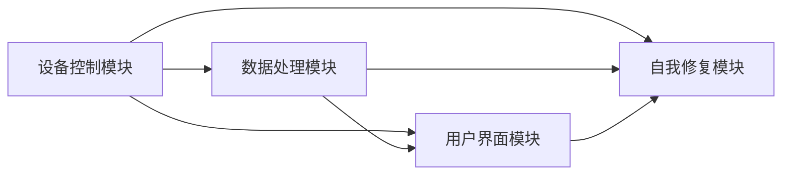

                 

# 基于Java的智能家居设计：用Java实现智能家居中的自我修复系统

## 关键词

- 智能家居
- Java编程
- 自我修复系统
- 系统架构设计
- 设备通信
- 数据处理
- 用户界面
- 自我修复算法
- 项目实战

## 摘要

本文将探讨如何基于Java编程语言设计和实现智能家居中的自我修复系统。我们将从智能家居概述开始，介绍Java编程基础，然后详细讨论智能家居系统架构设计、核心功能实现、自我修复系统设计以及系统集成与测试。通过实际项目案例，我们将展示如何使用Java实现智能家居系统中的自我修复功能，并对其代码进行解读与分析。文章最后，将提供附录，包括Java开发环境配置、常用库与框架介绍，以及参考文献与拓展阅读。

----------------------------------------------------------------

## 《基于Java的智能家居设计：用Java实现智能家居中的自我修复系统》目录大纲

### 第一部分：智能家居与Java简介

#### 第1章：智能家居概述

##### 1.1 智能家居的概念与分类
##### 1.2 智能家居的发展趋势
##### 1.3 Java在智能家居中的作用

#### 第2章：Java编程基础

##### 2.1 Java语言基础
##### 2.2 面向对象编程
##### 2.3 Java基础类库

### 第二部分：智能家居设计与实现

#### 第3章：智能家居系统架构设计

##### 3.1 系统架构设计原则
##### 3.2 模块划分与功能设计

#### 第4章：Java实现智能家居核心功能

##### 4.1 设备连接与通信
##### 4.2 数据处理与存储
##### 4.3 用户交互与控制界面设计
##### 4.4 伪代码：智能家居核心算法实现

#### 第5章：自我修复系统设计

##### 5.1 自我修复系统的概念
##### 5.2 自我修复系统架构设计
##### 5.3 伪代码：自我修复系统算法实现

#### 第6章：智能家居系统集成与测试

##### 6.1 系统集成方法
##### 6.2 系统测试策略
##### 6.3 测试用例设计与执行

### 第三部分：项目实战

#### 第7章：智能家居项目案例

##### 7.1 项目背景与需求分析
##### 7.2 环境搭建与工具选择
##### 7.3 源代码详细实现
##### 7.4 代码解读与分析

#### 第8章：自我修复系统项目实战

##### 8.1 项目背景与需求分析
##### 8.2 环境搭建与工具选择
##### 8.3 源代码详细实现
##### 8.4 代码解读与分析

### 附录

#### 附录A：Java开发环境配置

##### A.1 Java开发环境搭建
##### A.2 常用开发工具配置
##### A.3 版本控制工具Git的使用

#### 附录B：常用库与框架

##### B.1 常用Java库介绍
##### B.2 智能家居常用框架介绍
##### B.3 开源智能家居平台介绍

#### 附录C：参考文献与拓展阅读

##### C.1 参考文献列表
##### C.2 拓展阅读推荐

----------------------------------------------------------------

## 第一部分：智能家居与Java简介

### 第1章：智能家居概述

#### 1.1 智能家居的概念与分类

智能家居是指利用物联网技术，将家庭中的各种设备连接起来，通过智能控制系统实现家庭设备的自动化管理。根据功能和用途，智能家居可以分为以下几类：

1. **智能家电**：如智能电视、智能空调、智能冰箱等，通过互联网实现远程控制和智能化管理。
2. **智能照明**：如智能灯泡、智能开关等，通过自动化控制实现灯光的开关、亮度调节等。
3. **智能安防**：如智能摄像头、智能门锁、烟雾报警器等，通过自动化监控实现家庭安全。
4. **智能环境**：如智能温度传感器、智能湿度传感器等，通过自动化控制实现室内环境的舒适度。
5. **智能家电控制中心**：如智能音响、智能平板等，作为家庭设备的控制中心，实现语音控制、场景联动等功能。

#### 1.2 智能家居的发展趋势

随着物联网、人工智能和5G等技术的发展，智能家居市场正迎来快速增长期。以下是智能家居发展的一些趋势：

1. **智能化、个性化**：智能家居设备将更加智能化和个性化，能够根据用户习惯和需求自动调整设备状态。
2. **互联互通**：智能家居设备将实现更高程度的互联互通，形成一个统一的智能网络。
3. **人工智能**：人工智能技术在智能家居中的应用将越来越广泛，如语音识别、图像识别等。
4. **安全可靠**：智能家居系统将更加注重安全性和可靠性，防止数据泄露和网络攻击。
5. **智能化服务**：智能家居将提供更多的智能化服务，如远程医疗、在线教育等。

#### 1.3 Java在智能家居中的作用

Java是一种广泛使用的编程语言，具有跨平台、安全可靠等优点，在智能家居领域发挥着重要作用：

1. **设备连接与通信**：Java可以方便地实现设备间的连接和通信，通过Socket编程实现设备间的数据交换。
2. **数据处理与存储**：Java提供强大的数据结构和算法库，可以高效地处理和存储智能家居设备产生的数据。
3. **用户界面设计**：Java的Swing和JavaFX库可以轻松实现图形用户界面，提供用户友好的交互体验。
4. **自我修复功能**：Java可以实现智能家居系统中的自我修复功能，通过编写自我修复算法，提高系统的可靠性。
5. **系统集成与测试**：Java提供了丰富的工具和库，可以帮助开发者高效地集成和测试智能家居系统。

### 第2章：Java编程基础

#### 2.1 Java语言基础

Java语言的基础包括语法、数据类型、变量、运算符、控制结构等。下面将介绍Java语言的一些基础概念：

1. **语法**：Java语言的语法与C/C++相似，包括标识符、关键字、注释、语句和分隔符等。
2. **数据类型**：Java提供了基本数据类型和引用数据类型。基本数据类型包括整型、浮点型、字符型和布尔型。引用数据类型包括类、接口和数组。
3. **变量**：变量是存储数据的容器。Java变量包括局部变量和成员变量，需要明确数据类型和变量名。
4. **运算符**：Java运算符包括算术运算符、比较运算符、逻辑运算符等，用于执行各种计算和操作。
5. **控制结构**：Java控制结构包括条件语句（if、else、switch）、循环语句（for、while、do-while）和跳转语句（break、continue、return）。

#### 2.2 面向对象编程

Java是一种面向对象编程语言，其核心思想是将数据和操作数据的方法封装在一起，形成对象。面向对象编程的主要概念包括：

1. **类**：类是对象的蓝图，定义了对象的属性（成员变量）和方法（成员函数）。
2. **对象**：对象是类的实例，通过类创建的对象具有类的属性和方法。
3. **继承**：继承是子类继承父类的属性和方法，实现代码的复用。
4. **多态**：多态是指同一个方法名可以对应不同的方法实现，通过方法的重载和重写实现。
5. **封装**：封装是将对象的属性和方法封装在内部，对外提供统一的接口，保护对象的内部实现。

#### 2.3 Java基础类库

Java基础类库是Java标准库的一部分，提供了一系列常用的类和接口，用于处理输入输出、日期时间、字符串操作等。以下是一些常用的Java基础类库：

1. **java.lang**：包含Java编程语言的基本类，如String、Integer、Double、Math等。
2. **java.util**：提供常用工具类，如List、Map、Set、Collections等，用于数据结构和集合操作。
3. **java.io**：提供文件输入输出操作类，如File、FileReader、FileWriter等。
4. **java.net**：提供网络通信类，如Socket、ServerSocket等，用于实现客户端和服务器的通信。
5. **java.sql**：提供数据库连接和操作类，如Connection、Statement、ResultSet等，用于执行SQL查询。

通过以上对Java编程基础的了解，我们可以更好地理解如何在智能家居系统中使用Java实现各种功能。下一章将介绍智能家居系统架构设计，分析系统的模块划分和功能设计。接下来，我们将逐步深入探讨智能家居系统的设计和实现。

## 第二部分：智能家居设计与实现

### 第3章：智能家居系统架构设计

#### 3.1 系统架构设计原则

智能家居系统的设计原则决定了系统的可靠性、可扩展性和用户体验。以下是智能家居系统架构设计的一些关键原则：

1. **可扩展性**：系统应该能够适应未来的技术和市场变化，以便轻松地添加新功能和设备。
2. **可靠性**：系统的各个组件应该能够在各种条件下稳定运行，保证用户体验。
3. **安全性**：系统的通信和数据存储应该得到保护，以防止未授权的访问和数据泄露。
4. **模块化**：系统应该采用模块化设计，将功能划分为不同的模块，便于维护和升级。
5. **用户友好**：系统应该提供直观、易用的用户界面，使非技术人员也能轻松使用。

#### 3.2 模块划分与功能设计

智能家居系统可以划分为以下几个主要模块，每个模块具有特定的功能和职责：

1. **设备控制模块**：负责与智能家居设备进行通信，控制设备的开关、调节设备状态等。
2. **数据处理模块**：负责收集、处理和存储智能家居设备产生的数据，如温度、湿度、光照强度等。
3. **用户界面模块**：提供用户与系统交互的界面，显示设备状态、历史数据等，用户可以通过界面进行设备控制。
4. **自我修复模块**：负责监控系统的健康状况，当系统发生异常时，自动进行修复，确保系统的稳定性。

### 3.2.1 设备控制模块

设备控制模块是智能家居系统的核心模块之一，主要负责与智能设备的连接和通信。以下是设备控制模块的具体功能：

1. **设备连接与通信**：通过Java的Socket编程接口实现与智能设备的连接和通信。设备连接时，首先创建Socket对象，然后通过输入输出流发送命令和接收响应。
2. **设备控制**：接收用户通过用户界面模块发送的控制命令，根据命令类型执行相应的设备控制操作，如开关设备、调节设备亮度等。
3. **状态监控**：定期检查设备的运行状态，通过心跳机制或其他监控手段确保设备处于正常工作状态。

#### 设备控制模块伪代码

```java
// 设备控制模块类
class DeviceController {
    // 连接设备
    void connectDevice(String ipAddress, int port) {
        Socket socket = new Socket(ipAddress, port);
        // 实现设备通信的细节
    }

    // 控制设备开关
    void controlDeviceState(Device device, boolean state) {
        // 发送控制命令到设备
        // 实现设备状态的更改
    }

    // 监控设备状态
    void monitorDeviceState(Device device) {
        // 定期检查设备状态
        // 实现状态监控的细节
    }
}

// 设备类
class Device {
    // 设备状态
    boolean state;

    // 设备状态更改事件
    event stateChanged() {
        // 更新设备状态
        // 触发相应的控制操作
    }
}
```

### 3.2.2 数据处理模块

数据处理模块负责收集、处理和存储智能家居设备产生的数据，如温度、湿度、光照强度等。以下是数据处理模块的具体功能：

1. **数据收集**：通过设备控制模块获取设备状态信息，并将数据存储到内存或数据库中。
2. **数据处理**：对收集到的数据进行处理，如数据清洗、格式转换、计算等。
3. **数据存储**：将处理后的数据存储到数据库或文件中，以便后续分析和查询。

#### 数据处理模块伪代码

```java
// 数据处理模块类
class DataProcessor {
    // 收集设备数据
    void collectData(Device device) {
        // 收集设备状态数据
        // 存储到数据结构中
    }

    // 处理设备数据
    void processData() {
        // 使用算法处理数据
        // 更新设备状态和历史数据
    }
}

// 数据存储类
class DataStorage {
    // 存储设备数据
    List<DataPoint> dataPoints;

    // 添加数据点
    void addDataPoint(DataPoint point) {
        // 将数据点添加到数据结构中
    }

    // 获取数据点
    DataPoint getDataPoint(int index) {
        // 返回指定索引的数据点
    }
}

// 数据点类
class DataPoint {
    // 数据属性
    int timestamp;
    int value;

    // 构造函数
    DataPoint(int timestamp, int value) {
        this.timestamp = timestamp;
        this.value = value;
    }
}
```

### 3.2.3 用户界面模块

用户界面模块负责提供用户与系统交互的界面，显示设备状态、历史数据等，用户可以通过界面进行设备控制。以下是用户界面模块的具体功能：

1. **界面显示**：使用Java的Swing或JavaFX库创建用户界面，显示设备状态信息。
2. **用户交互**：接收用户的操作命令，如开关设备、调节亮度等，并传递给设备控制模块处理。
3. **界面更新**：定期更新用户界面，显示最新的设备状态数据。

#### 用户界面模块伪代码

```java
// 用户界面模块类
class UserInterface {
    // 显示设备状态
    void showDeviceState(Device device) {
        // 更新UI显示设备状态
        // 使用Swing或JavaFX等库实现
    }

    // 处理用户输入
    void handleUserInput(String input) {
        // 分析用户输入，执行相应的操作
        // 使用事件监听器实现
    }
}

// 用户界面元素类
class UIElement {
    // UI元素状态
    boolean isActive;

    // 更新UI元素状态
    void updateState(boolean active) {
        this.isActive = active;
        // 更新UI元素外观
    }
}
```

### 3.2.4 自我修复模块

自我修复模块负责监控系统的健康状况，当系统发生异常时，自动进行修复，确保系统的稳定性。以下是自我修复模块的具体功能：

1. **状态监控**：定期检查系统各个组件的状态，如设备连接状态、数据处理状态等。
2. **故障诊断**：根据监控到的状态信息，对系统故障进行诊断。
3. **故障修复**：执行故障修复操作，如重启设备、重新连接服务器等。

#### 自我修复模块伪代码

```java
// 自我修复模块类
class SelfHealingModule {
    // 监控系统状态
    void monitorSystem() {
        // 定期检查系统各个组件的状态
        // 使用多线程实现监控
    }

    // 自我修复算法
    void selfHeal() {
        // 当系统组件异常时，执行修复操作
        // 根据故障类型和修复策略实现
    }
}

// 状态监控类
class StateMonitor {
    // 状态数据
    Map<Component, State> componentStates;

    // 检查组件状态
    void checkComponentState(Component component) {
        // 检查组件状态是否正常
        // 更新状态数据
    }
}

// 组件类
class Component {
    // 组件状态
    State state;

    // 构造函数
    Component(State state) {
        this.state = state;
    }
}

// 组件状态枚举
enum State {
    // 正常状态
    NORMAL,
    // 故障状态
    FAULTY
}
```

### 3.2.5 模块交互关系

为了实现智能家居系统的功能，各个模块之间需要协同工作。以下是智能家居系统模块之间的交互关系：

1. **设备控制模块与数据处理模块**：设备控制模块收集设备状态数据，并将其传递给数据处理模块进行处理和存储。
2. **数据处理模块与用户界面模块**：数据处理模块将处理后的数据传递给用户界面模块，用户界面模块根据数据更新界面显示。
3. **用户界面模块与设备控制模块**：用户界面模块接收用户的操作命令，并将其传递给设备控制模块执行相应的控制操作。
4. **自我修复模块与其他模块**：自我修复模块监控系统各个组件的状态，并在发生故障时通知其他模块进行修复操作。

以下是模块交互关系的Mermaid流程图：



通过以上对智能家居系统架构设计和模块功能设计的详细描述，我们为后续章节的详细实现奠定了基础。接下来，我们将进一步探讨Java在实现智能家居系统核心功能中的应用，包括设备连接与通信、数据处理与存储、用户交互与控制界面设计以及自我修复算法的实现。这些核心功能的实现是智能家居系统成功的基石。

### 第4章：Java实现智能家居核心功能

智能家居系统的核心功能是实现设备连接与通信、数据处理与存储、用户交互与控制界面设计以及自我修复功能。本章节将深入探讨这些核心功能的Java实现方法，并使用伪代码详细阐述核心算法的实现。

#### 4.1 设备连接与通信

设备连接与通信是智能家居系统的基石。它负责与智能设备建立连接，并实现数据的发送与接收。Java提供了强大的Socket编程接口，可以轻松实现设备之间的通信。

##### 4.1.1 设备连接类

```java
// 设备连接类
class DeviceConnector {
    private Socket socket;

    public DeviceConnector(String ipAddress, int port) {
        try {
            socket = new Socket(ipAddress, port);
        } catch (IOException e) {
            e.printStackTrace();
        }
    }

    public void sendCommand(String command) {
        try {
            OutputStream outputStream = socket.getOutputStream();
            outputStream.write(command.getBytes());
            outputStream.flush();
        } catch (IOException e) {
            e.printStackTrace();
        }
    }

    public String receiveResponse() {
        try {
            InputStream inputStream = socket.getInputStream();
            byte[] buffer = new byte[1024];
            int bytesRead = inputStream.read(buffer);
            return new String(buffer, 0, bytesRead);
        } catch (IOException e) {
            e.printStackTrace();
            return null;
        }
    }

    public void closeConnection() {
        try {
            socket.close();
        } catch (IOException e) {
            e.printStackTrace();
        }
    }
}
```

##### 4.1.2 设备类

```java
// 设备类
class Device {
    // 设备状态
    boolean state;

    // 构造函数
    Device(boolean state) {
        this.state = state;
    }

    // 设置设备状态
    void setState(boolean state) {
        this.state = state;
    }

    // 获取设备状态
    boolean getState() {
        return state;
    }
}
```

#### 4.2 数据处理与存储

数据处理与存储模块负责收集设备数据，并将其存储在数据库或其他数据结构中。以下是一个数据处理模块的伪代码示例。

##### 4.2.1 数据处理类

```java
// 数据处理类
class DataProcessor {
    // 收集设备数据
    void collectData(Device device) {
        // 收集设备状态数据
        // 存储到数据结构中
    }

    // 处理设备数据
    void processData() {
        // 使用算法处理数据
        // 更新设备状态和历史数据
    }
}
```

##### 4.2.2 数据存储类

```java
// 数据存储类
class DataStorage {
    // 存储设备数据
    List<DataPoint> dataPoints;

    // 添加数据点
    void addDataPoint(DataPoint point) {
        // 将数据点添加到数据结构中
    }

    // 获取数据点
    DataPoint getDataPoint(int index) {
        // 返回指定索引的数据点
    }
}

// 数据点类
class DataPoint {
    // 数据属性
    int timestamp;
    int value;

    // 构造函数
    DataPoint(int timestamp, int value) {
        this.timestamp = timestamp;
        this.value = value;
    }
}
```

#### 4.3 用户交互与控制界面设计

用户交互与控制界面设计模块负责提供用户与系统交互的界面，使非技术人员也能轻松使用智能家居系统。以下是一个用户界面模块的伪代码示例。

##### 4.3.1 用户界面类

```java
// 用户界面类
class UserInterface {
    // 显示设备状态
    void showDeviceState(Device device) {
        // 更新UI显示设备状态
        // 使用Swing或JavaFX等库实现
    }

    // 处理用户输入
    void handleUserInput(String input) {
        // 分析用户输入，执行相应的操作
        // 使用事件监听器实现
    }
}

// 用户界面元素类
class UIElement {
    // UI元素状态
    boolean isActive;

    // 更新UI元素状态
    void updateState(boolean active) {
        this.isActive = active;
        // 更新UI元素外观
    }
}
```

#### 4.4 伪代码：智能家居核心算法实现

智能家居系统的核心算法包括设备连接与通信、数据处理与存储、用户交互与控制界面设计以及自我修复算法。

##### 4.4.1 自我修复算法

```java
// 自我修复算法类
class SelfHealingAlgorithm {
    // 监控系统状态
    void monitorSystem() {
        // 定期检查系统各个组件的状态
        // 使用多线程实现监控
    }

    // 自我修复算法
    void selfHeal() {
        // 当系统组件异常时，执行修复操作
        // 根据故障类型和修复策略实现
    }
}

// 状态监控类
class StateMonitor {
    // 状态数据
    Map<Component, State> componentStates;

    // 检查组件状态
    void checkComponentState(Component component) {
        // 检查组件状态是否正常
        // 更新状态数据
    }
}

// 组件类
class Component {
    // 组件状态
    State state;

    // 构造函数
    Component(State state) {
        this.state = state;
    }
}

// 组件状态枚举
enum State {
    // 正常状态
    NORMAL,
    // 故障状态
    FAULTY
}

// 自我修复算法伪代码
void SelfHealingAlgorithm.selfHeal() {
    // 1. 监测系统状态
    StateMonitor monitor = new StateMonitor();
    monitor.monitorSystem();

    // 2. 诊断故障
    List<Component> faultyComponents = monitor.detectFaults();

    // 3. 执行修复操作
    for (Component component : faultyComponents) {
        if (component.getState() == State.FAULTY) {
            // 根据故障类型执行不同的修复操作
            if (component instanceof Sensor) {
                Sensor sensor = (Sensor) component;
                sensor.replaceSensor();
            } else if (component instanceof CommunicationModule) {
                CommunicationModule module = (CommunicationModule) component;
                module.reconnectServer();
            }
        }
    }
}
```

通过以上伪代码，我们可以看到智能家居系统核心功能的实现方法。这些伪代码为实际系统的开发提供了清晰的框架和实现思路。在实际开发过程中，需要根据具体需求和技术栈进行相应的调整和优化。

### 第5章：自我修复系统设计

#### 5.1 自我修复系统的概念

自我修复系统是一种智能系统能够在运行过程中自我监控、自我诊断并自我修复的机制。在智能家居系统中，自我修复功能至关重要，因为它可以确保系统在各种异常情况下保持稳定运行，从而提高用户体验和系统可靠性。

自我修复系统通常包括以下几个关键组成部分：

1. **状态监控**：通过传感器和监控工具，实时收集系统的运行状态信息。
2. **故障诊断**：分析状态监控数据，识别系统中的异常情况。
3. **故障修复**：执行修复操作，将系统恢复正常状态。
4. **日志记录**：记录系统运行过程中的关键事件和异常信息，用于故障分析和优化。

#### 5.2 自我修复系统架构设计

自我修复系统的架构设计需要考虑系统的可扩展性、可靠性和易维护性。以下是自我修复系统的一种典型架构设计：

1. **设备监控层**：由各种传感器和监控设备组成，实时采集系统运行状态信息。
2. **数据处理层**：负责处理和分析传感器数据，识别潜在的故障。
3. **故障诊断层**：根据数据处理层提供的信息，进行故障诊断，并生成故障报告。
4. **修复执行层**：根据故障诊断结果，执行修复操作，如重启设备、重新连接网络等。
5. **日志记录层**：记录系统运行过程中的各种事件和异常信息，便于后续分析和优化。

#### 5.2.1 自我修复系统架构设计原则

1. **模块化**：将系统划分为多个模块，每个模块负责特定的功能，便于维护和升级。
2. **分布式**：将自我修复功能分布在不同的设备上，提高系统的容错能力和可靠性。
3. **智能化**：利用人工智能技术，如机器学习和数据挖掘，提高故障诊断和修复的准确性和效率。
4. **安全性**：确保自我修复系统的数据安全和通信安全，防止恶意攻击和数据泄露。

#### 5.2.2 自我修复系统架构组件

1. **设备监控组件**：通过传感器和监控工具，实时采集系统设备的运行状态信息。
2. **数据处理组件**：处理和分析传感器数据，识别潜在的故障。
3. **故障诊断组件**：根据数据处理结果，进行故障诊断，并生成故障报告。
4. **修复执行组件**：根据故障诊断结果，执行修复操作，如重启设备、重新连接网络等。
5. **日志记录组件**：记录系统运行过程中的各种事件和异常信息，便于故障分析和优化。

#### 5.3 伪代码：自我修复系统算法实现

自我修复系统的核心是故障诊断和修复算法。以下是一个简单的伪代码示例，展示了如何实现自我修复系统。

```java
// 自我修复算法类
class SelfHealingAlgorithm {
    // 监控系统状态
    void monitorSystem() {
        // 定期检查系统各个组件的状态
        // 使用多线程实现监控
    }

    // 自我修复算法
    void selfHeal() {
        // 当系统组件异常时，执行修复操作
        // 根据故障类型和修复策略实现
    }
}

// 状态监控类
class StateMonitor {
    // 状态数据
    Map<Component, State> componentStates;

    // 检查组件状态
    void checkComponentState(Component component) {
        // 检查组件状态是否正常
        // 更新状态数据
    }
}

// 组件类
class Component {
    // 组件状态
    State state;

    // 构造函数
    Component(State state) {
        this.state = state;
    }
}

// 组件状态枚举
enum State {
    // 正常状态
    NORMAL,
    // 故障状态
    FAULTY
}

// 自我修复算法伪代码
void SelfHealingAlgorithm.selfHeal() {
    // 1. 监测系统状态
    StateMonitor monitor = new StateMonitor();
    monitor.monitorSystem();

    // 2. 诊断故障
    List<Component> faultyComponents = monitor.detectFaults();

    // 3. 执行修复操作
    for (Component component : faultyComponents) {
        if (component.getState() == State.FAULTY) {
            // 根据故障类型执行不同的修复操作
            if (component instanceof Sensor) {
                Sensor sensor = (Sensor) component;
                sensor.replaceSensor();
            } else if (component instanceof CommunicationModule) {
                CommunicationModule module = (CommunicationModule) component;
                module.reconnectServer();
            }
        }
    }
}
```

在这个伪代码中，`Self

