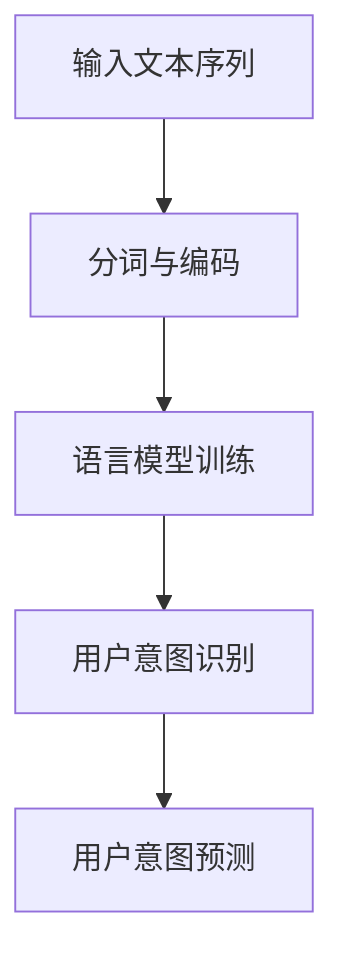

                 

### 文章标题

### 关键词：语言模型，推荐系统，用户意图理解，预测，深度学习，人工智能

### 摘要：

本文旨在探讨基于语言模型（LLM）的推荐系统用户意图理解与预测技术。首先，我们将介绍推荐系统的基本概念、发展历程和主要类型，接着阐述语言模型（LLM）的基本原理及其在推荐系统中的应用。随后，我们将详细分析用户意图识别和预测的核心方法，以及如何利用LLM进行用户意图识别和预测。接下来，我们将探讨基于LLM的推荐系统应用实践，包括用户画像构建、协同过滤算法与LLM结合、上下文感知推荐等。最后，我们将对推荐系统的评估与优化、未来发展进行探讨，并附上推荐系统相关的开源工具和实际项目实战案例。本文将为读者提供一个全面、系统的了解基于LLM的推荐系统用户意图理解与预测的技术和实践。

# 基于LLM的推荐系统用户意图理解与预测

## 第一部分：推荐系统与LLM基础

### 第1章：推荐系统概述

#### 1.1 推荐系统的定义与作用

推荐系统是一种基于信息过滤的技术，旨在为用户发现和推荐他们可能感兴趣的内容、商品或服务。推荐系统能够通过分析用户的历史行为、兴趣偏好和社交关系等数据，实现个性化推荐，从而提高用户的满意度、提升系统的商业价值。

推荐系统的作用主要体现在以下几个方面：

1. **提高用户满意度**：通过推荐系统，用户可以轻松发现他们感兴趣的内容或商品，从而提高用户的使用体验和满意度。
2. **提升商业价值**：商家可以利用推荐系统，精准地向目标用户推荐商品或服务，从而提高销售转化率和客户留存率。

#### 1.2 推荐系统的发展历程

推荐系统的发展可以分为三个主要阶段：

1. **基于内容的推荐（Content-Based Filtering）**：早期推荐系统主要基于物品的属性和内容进行推荐，通过分析用户的历史行为和兴趣，找到与用户兴趣相似的物品进行推荐。
2. **协同过滤推荐（Collaborative Filtering）**：协同过滤推荐基于用户的历史行为数据，通过分析用户之间的相似性，推荐其他用户喜欢的物品。协同过滤可以分为用户基于协同过滤和物品基于协同过滤两种类型。
3. **深度学习推荐（Deep Learning-based Recommender Systems）**：近年来，随着深度学习技术的发展，基于深度学习的推荐系统逐渐成为研究热点。深度学习推荐系统通过复杂的神经网络结构，自动提取用户和物品的特征，实现更精准的推荐。

#### 1.3 推荐系统的主要类型

推荐系统主要可以分为以下几种类型：

1. **内容推荐**：根据用户的历史行为和兴趣，推荐相似的内容。这种推荐方式主要应用于新闻、博客和社交媒体等领域。
2. **电商推荐**：根据用户的购物行为和评价，推荐相似的商品。电商推荐在电商平台中应用广泛，如淘宝、京东等。
3. **社交网络推荐**：根据用户的社交关系和行为，推荐可能感兴趣的内容或好友。社交网络推荐在社交媒体平台中应用广泛，如Facebook、Twitter等。

### 第2章：LLM与推荐系统

#### 2.1 语言模型（LLM）简介

语言模型（Language Model，简称LLM）是一种深度学习模型，用于预测文本序列的概率。LLM通过学习大量文本数据，能够生成流畅、自然的文本，并在自然语言处理领域具有广泛的应用，如机器翻译、文本生成和文本分类等。

LLM的工作原理主要包括以下几个步骤：

1. **输入文本序列**：将输入的文本序列表示为一个序列的词向量。
2. **编码器处理**：编码器将词向量编码为一个固定长度的向量，表示整个文本的语义信息。
3. **解码器生成**：解码器根据编码器的输出，逐个生成文本中的词，直到生成完整的文本序列。

#### 2.2 LLM在推荐系统中的应用

LLM在推荐系统中的应用主要体现在以下几个方面：

1. **用户意图识别**：利用LLM对用户输入的查询或评论进行语义理解，识别用户的意图。这有助于推荐系统更准确地理解用户需求，提高推荐效果。
2. **内容生成**：利用LLM生成推荐内容，提高推荐系统的多样性和创意性。例如，在新闻推荐中，LLM可以生成新颖的标题和摘要，吸引更多用户点击。
3. **筛选过滤**：利用LLM对用户行为数据进行建模，筛选出对用户更有价值的推荐。例如，在电商推荐中，LLM可以帮助筛选出符合用户兴趣的优惠信息和商品。

#### 2.3 LLM的优势与挑战

LLM的优势包括：

1. **强大的语义理解能力**：LLM能够理解用户输入的复杂语义，提高推荐系统的准确性。
2. **灵活性**：LLM可以适应不同场景和需求，实现多种推荐策略。

LLM的挑战包括：

1. **计算资源消耗**：LLM模型通常较大，训练和推理需要较高的计算资源。
2. **数据质量**：LLM的训练需要大量的高质量数据，数据质量对模型性能有重要影响。

### 第3章：用户意图理解

#### 3.1 用户意图识别的重要性

用户意图识别是推荐系统中的一个关键环节，其重要性体现在以下几个方面：

1. **提高推荐准确性**：通过识别用户意图，可以更准确地推荐用户感兴趣的内容，从而提高推荐系统的准确性。
2. **提高用户满意度**：理解用户意图有助于提高用户对推荐系统的满意度，从而提高用户留存率和活跃度。

#### 3.2 用户意图识别方法

用户意图识别方法可以分为以下几类：

1. **基于机器学习的方法**：利用机器学习算法对用户行为数据进行建模，识别用户意图。例如，可以使用分类算法（如SVM、决策树等）进行用户意图识别。
2. **基于自然语言处理的方法**：利用自然语言处理技术对用户输入的文本进行语义分析，识别用户意图。例如，可以使用词嵌入技术（如Word2Vec、BERT等）和深度学习模型（如RNN、LSTM等）进行用户意图识别。
3. **基于聚类分析的方法**：通过对用户行为数据进行聚类分析，识别用户意图。例如，可以使用K-means、DBSCAN等聚类算法进行用户意图识别。

#### 3.3 用户意图识别案例研究

在本章节中，我们将分析几个典型的用户意图识别案例，包括电商推荐系统、社交媒体推荐系统和搜索引擎推荐系统，介绍它们如何利用LLM实现用户意图识别。

1. **电商推荐系统**：电商推荐系统利用LLM对用户的购物行为和评论进行语义分析，识别用户的购买意图。例如，当用户浏览某件商品时，LLM可以识别出用户对该商品的感兴趣程度，从而推荐类似商品。
2. **社交媒体推荐系统**：社交媒体推荐系统利用LLM对用户的评论、帖子等文本内容进行语义分析，识别用户的社交意图。例如，当用户发表一条关于旅游的帖子时，LLM可以识别出用户对旅游的兴趣，从而推荐相关的旅游资讯和景点。
3. **搜索引擎推荐系统**：搜索引擎推荐系统利用LLM对用户的查询语句进行语义分析，识别用户的查询意图。例如，当用户输入“北京旅游景点”时，LLM可以识别出用户对北京旅游景点的兴趣，从而推荐相关的旅游信息。

### 第4章：用户意图预测

#### 4.1 用户意图预测模型

用户意图预测模型是推荐系统中的一个重要组成部分，其核心目标是根据用户的历史行为和特征，预测用户未来的意图。用户意图预测模型可以分为以下几类：

1. **基于传统机器学习的方法**：使用传统的机器学习算法（如SVM、决策树、随机森林等）进行用户意图预测。这些方法主要依赖于特征工程，需要人工设计特征。
2. **基于深度学习的方法**：使用深度学习算法（如循环神经网络（RNN）、长短期记忆网络（LSTM）、变换器（Transformer）等）进行用户意图预测。这些方法可以自动提取特征，实现更高的预测准确率。

#### 4.2 用户行为序列分析

用户行为序列分析是用户意图预测的关键环节，其核心目标是理解用户行为的时序特征。用户行为序列分析的方法包括：

1. **特征提取**：通过对用户行为序列进行特征提取，如时间特征、交互特征、内容特征等。这些特征可以用于训练用户意图预测模型。
2. **序列建模**：使用深度学习模型（如RNN、LSTM、Transformer等）对用户行为序列进行建模，预测用户未来的意图。这些模型可以捕捉用户行为的时序依赖关系，实现更准确的预测。

#### 4.3 用户意图预测案例分析

在本章节中，我们将分析几个典型的用户意图预测案例，包括电商用户意图预测、社交媒体用户意图预测和搜索引擎用户意图预测，介绍它们如何利用LLM实现用户意图预测。

1. **电商用户意图预测**：电商用户意图预测旨在预测用户在电商平台上可能进行的购买行为。利用LLM，可以对用户的历史购物记录、浏览记录和评论等进行语义分析，识别用户的购买意图。例如，当用户浏览某件商品时，LLM可以预测用户是否会购买该商品。
2. **社交媒体用户意图预测**：社交媒体用户意图预测旨在预测用户在社交媒体上的行为，如发表帖子、点赞、评论等。利用LLM，可以对用户的文本内容进行语义分析，识别用户的社交意图。例如，当用户发表一条关于旅游的帖子时，LLM可以预测用户是否会吸引其他用户的关注和点赞。
3. **搜索引擎用户意图预测**：搜索引擎用户意图预测旨在预测用户在搜索引擎上的查询意图。利用LLM，可以对用户的查询语句进行语义分析，识别用户的查询意图。例如，当用户输入“北京旅游景点”时，LLM可以预测用户是想要查找旅游景点信息还是进行实际旅游预订。

## 第二部分：基于LLM的推荐系统应用实践

### 第5章：用户画像构建

#### 5.1 用户画像的定义与作用

用户画像是指通过对用户特征进行综合描述，构建出一个用户模型。用户画像的作用主要体现在以下几个方面：

1. **优化推荐效果**：通过用户画像，可以更准确地了解用户的需求和偏好，从而实现更精准的推荐。
2. **个性化服务**：根据用户画像，可以为用户提供个性化的服务，提高用户满意度和忠诚度。
3. **市场营销**：用户画像可以帮助企业了解用户群体特征，制定更有效的市场营销策略。

#### 5.2 用户画像构建方法

用户画像构建方法可以分为以下几种：

1. **基于用户行为的方法**：通过对用户在系统中的行为数据进行分析，提取用户的兴趣、偏好等特征。例如，用户浏览、购买、评论等行为数据。
2. **基于用户属性的方法**：通过对用户的基本属性进行分析，如年龄、性别、地域、职业等。这些属性可以作为用户画像的基础特征。
3. **基于多源数据融合的方法**：通过整合多种数据源，如用户行为数据、社交数据、用户评价等，构建更全面、准确的用户画像。

#### 5.3 用户画像构建实践

在本章节中，我们将介绍如何在实际项目中构建用户画像，包括以下步骤：

1. **数据收集**：收集用户在系统中的行为数据、用户属性数据和第三方数据源（如社交媒体数据、公共数据集等）。
2. **数据清洗**：对收集到的数据进行清洗，去除无效数据、处理缺失值和异常值，确保数据质量。
3. **特征提取**：对用户行为数据进行特征提取，如用户浏览时长、购买频率、点击率等；对用户属性数据进行编码，如年龄分类、性别编码等。
4. **数据建模**：使用机器学习算法（如聚类算法、回归算法等）对用户行为数据和特征进行建模，构建用户画像。
5. **用户画像应用**：将构建好的用户画像应用于推荐系统、个性化服务和市场营销等场景，提高系统性能和用户体验。

### 第6章：协同过滤算法与LLM结合

#### 6.1 协同过滤算法介绍

协同过滤算法（Collaborative Filtering）是一种经典的推荐系统算法，其核心思想是通过分析用户之间的相似性，为用户推荐其他用户喜欢的物品。协同过滤算法可以分为以下两种类型：

1. **基于用户的协同过滤（User-based Collaborative Filtering）**：通过计算用户之间的相似性，找到与目标用户相似的其他用户，然后推荐这些用户喜欢的物品。
2. **基于物品的协同过滤（Item-based Collaborative Filtering）**：通过计算物品之间的相似性，找到与目标物品相似的其他物品，然后推荐这些物品。

#### 6.2 协同过滤与LLM的结合方法

将协同过滤算法与语言模型（LLM）结合，可以充分利用LLM的语义理解能力，提高推荐系统的准确性。具体方法包括：

1. **基于LLM的协同过滤算法**：利用LLM对用户行为数据进行语义分析，优化协同过滤算法的相似度计算。例如，使用LLM生成的词向量表示用户行为，然后计算用户之间的相似性。
2. **基于协同过滤的LLM模型**：利用协同过滤算法为LLM提供用户行为数据，优化LLM的训练。例如，使用协同过滤算法找到与目标用户相似的其他用户，将这些用户的兴趣和行为数据作为LLM的训练数据。

#### 6.3 结合案例与应用效果分析

在本章节中，我们将介绍几个基于协同过滤与LLM结合的推荐系统案例，分析其应用效果和优势。

1. **电商推荐系统**：利用协同过滤与LLM结合的算法，对用户的购物行为和评论进行语义分析，识别用户的兴趣和偏好。例如，当用户浏览某件商品时，算法可以预测用户是否会购买该商品，从而进行精准推荐。
2. **社交媒体推荐系统**：利用协同过滤与LLM结合的算法，对用户的社交行为和评论进行语义分析，识别用户的社交兴趣和偏好。例如，当用户发表一条关于旅游的帖子时，算法可以推荐相关的旅游资讯和景点。
3. **搜索引擎推荐系统**：利用协同过滤与LLM结合的算法，对用户的搜索行为和查询语句进行语义分析，识别用户的查询意图。例如，当用户输入“北京旅游景点”时，算法可以推荐相关的旅游景点和旅游攻略。

通过这些案例，我们可以看到协同过滤与LLM结合的算法在提高推荐准确性、用户体验和系统性能方面具有显著优势。

### 第7章：基于LLM的上下文感知推荐

#### 7.1 上下文感知推荐概述

上下文感知推荐（Context-Aware Recommender Systems）是一种基于用户当前所处的上下文环境为用户推荐相关的内容或服务的推荐系统。上下文可以包括用户的位置、时间、设备、天气等环境信息。上下文感知推荐的主要目标是提高推荐系统的个性化程度和适应性。

#### 7.2 LLM在上下文感知推荐中的应用

语言模型（LLM）在上下文感知推荐中的应用主要体现在以下几个方面：

1. **上下文语义理解**：利用LLM对用户输入的上下文信息进行语义分析，识别上下文的关键信息。例如，当用户在某个地理位置时，LLM可以识别出该地理位置的相关信息，如景点、餐厅等。
2. **上下文建模**：利用LLM对用户的行为数据和上下文信息进行建模，预测用户在当前上下文环境下的意图。例如，当用户在某个时间段浏览某个商品时，LLM可以预测用户是否会购买该商品。
3. **动态推荐**：利用LLM的灵活性和实时性，根据用户的上下文变化动态调整推荐策略。例如，当用户的地理位置发生变化时，LLM可以实时调整推荐内容，为用户提供更相关的推荐。

#### 7.3 上下文感知推荐案例分析

在本章节中，我们将分析几个基于LLM的上下文感知推荐案例，介绍它们如何利用LLM实现上下文感知推荐。

1. **位置感知推荐**：利用LLM对用户的地理位置信息进行语义分析，识别用户当前所在的地理位置。例如，当用户位于某个旅游景点时，LLM可以识别出该景点的相关信息，如餐厅、酒店等，从而为用户提供相关推荐。
2. **时间感知推荐**：利用LLM对用户的时间信息进行语义分析，识别用户当前的时间段。例如，当用户在晚上10点浏览某个商品时，LLM可以预测用户是否会在深夜购买该商品，从而为用户提供更个性化的推荐。
3. **设备感知推荐**：利用LLM对用户的设备信息进行语义分析，识别用户当前使用的设备类型。例如，当用户使用手机浏览某个网站时，LLM可以识别出该用户的设备类型，从而为用户提供更适合移动端的推荐内容。

通过这些案例，我们可以看到基于LLM的上下文感知推荐在提高推荐系统的个性化和适应性方面具有显著优势。

### 第8章：推荐系统的评估与优化

#### 8.1 推荐系统评估指标

推荐系统的评估指标是衡量推荐系统性能的重要标准。常见的评估指标包括以下几种：

1. **准确率（Accuracy）**：准确率是指推荐系统推荐的物品中，实际被用户喜欢的物品所占的比例。
2. **召回率（Recall）**：召回率是指推荐系统推荐的物品中，用户实际喜欢的物品所占的比例。
3. **F1值（F1 Score）**：F1值是准确率和召回率的加权平均，用于综合评估推荐系统的性能。
4. **平均绝对误差（Mean Absolute Error, MAE）**：平均绝对误差是指预测评分和实际评分之间的平均绝对差值。
5. **均方根误差（Root Mean Square Error, RMSE）**：均方根误差是指预测评分和实际评分之间的均方根差值。

#### 8.2 推荐系统优化策略

推荐系统的优化策略主要包括以下几个方面：

1. **算法优化**：通过对推荐算法进行改进，提高推荐系统的性能。例如，可以使用深度学习算法、强化学习算法等替代传统协同过滤算法。
2. **特征工程**：通过对用户和物品的特征进行优化，提高推荐系统的准确性。例如，可以增加用户行为特征、用户兴趣特征等。
3. **模型融合**：将多种推荐算法融合在一起，提高推荐系统的性能。例如，可以将基于内容的推荐和协同过滤推荐结合起来。
4. **数据增强**：通过对数据进行增强，提高推荐系统的鲁棒性和泛化能力。例如，可以使用数据增强技术生成虚拟数据，丰富训练数据集。

#### 8.3 优化案例分析

在本章节中，我们将分析几个典型的推荐系统优化案例，介绍它们如何通过算法优化、特征工程和模型融合等策略提高推荐系统性能。

1. **电商推荐系统优化**：某电商公司通过引入深度学习算法和用户兴趣特征，提高了推荐系统的准确性。同时，通过模型融合策略，将协同过滤推荐和基于内容的推荐结合起来，提高了推荐系统的多样性。
2. **社交媒体推荐系统优化**：某社交媒体公司通过优化用户特征和引入强化学习算法，提高了推荐系统的用户满意度和活跃度。同时，通过模型融合策略，将协同过滤推荐和基于上下文的推荐结合起来，提高了推荐系统的个性化程度。
3. **新闻推荐系统优化**：某新闻平台通过引入深度学习算法和文本特征，提高了推荐系统的准确性和用户阅读率。同时，通过模型融合策略，将基于内容的推荐和基于协同过滤的推荐结合起来，提高了推荐系统的多样性。

通过这些案例，我们可以看到优化策略在提高推荐系统性能和用户体验方面具有显著作用。

### 第9章：推荐系统的未来发展趋势

#### 9.1 AI技术发展对推荐系统的影响

随着人工智能技术的不断发展，推荐系统也在不断演进。AI技术对推荐系统的影响主要体现在以下几个方面：

1. **深度学习**：深度学习算法在推荐系统中得到了广泛应用，如循环神经网络（RNN）、长短期记忆网络（LSTM）和变换器（Transformer）等。这些算法可以自动提取用户和物品的特征，实现更精准的推荐。
2. **自然语言处理**：自然语言处理技术（NLP）在推荐系统中也发挥了重要作用，如用户意图识别、文本生成和文本分类等。这些技术可以帮助推荐系统更好地理解用户需求，提高推荐效果。
3. **强化学习**：强化学习算法在推荐系统中得到了应用，如基于强化学习的推荐策略和动态调整推荐策略等。这些算法可以基于用户反馈，不断优化推荐策略，提高推荐系统的性能。

#### 9.2 推荐系统的未来发展方向

推荐系统的未来发展方向主要包括以下几个方面：

1. **个性化推荐**：个性化推荐将是推荐系统未来发展的重点，通过深度学习和自然语言处理技术，实现更精准、更个性化的推荐。
2. **上下文感知推荐**：上下文感知推荐将得到更广泛的应用，通过利用用户所处的上下文信息，实现更相关、更及时的推荐。
3. **多模态推荐**：多模态推荐将结合多种数据源，如文本、图像、语音等，实现更全面、更智能的推荐。
4. **可解释性推荐**：推荐系统的可解释性将成为一个重要研究方向，通过可视化技术和解释性算法，提高用户对推荐系统的信任度。

#### 9.3 潜在挑战与解决方案

推荐系统在发展过程中面临着一些挑战，如数据质量、隐私保护、模型可解释性等。针对这些挑战，可以采取以下解决方案：

1. **数据质量提升**：通过数据清洗、数据增强等技术，提高数据质量，为模型训练提供可靠的数据基础。
2. **隐私保护**：采用隐私保护技术，如差分隐私、联邦学习等，保护用户隐私。
3. **模型可解释性**：通过可视化技术和解释性算法，提高模型的可解释性，增强用户对推荐系统的信任度。

通过解决这些挑战，推荐系统将能够更好地满足用户需求，提高用户体验和商业价值。

## 附录

### 附录A：推荐系统相关开源工具

#### A.1 常见开源推荐系统框架

以下是一些常见的开源推荐系统框架：

1. **Surprise**：一个快速、灵活的推荐系统库，支持各种协同过滤算法。
2. **LightFM**：基于因子分解机的推荐系统库，支持矩阵分解和因子分解机算法。
3. **PyRec**：由字节跳动开源的推荐系统框架，支持多种推荐算法和模型融合。

#### A.2 LLM开源资源与工具

以下是一些LLM开源资源和工具：

1. **Hugging Face**：一个开源的NLP库，提供丰富的预训练模型和工具。
2. **Transformer Models**：包括BERT、GPT、RoBERTa等流行的预训练模型。
3. **Transformers Library**：一个Python库，用于构建和使用变换器模型。

#### A.3 推荐系统开源项目推荐

以下是一些推荐系统开源项目推荐：

1. **Apache Mahout**：一个基于Hadoop的分布式推荐系统库。
2. **TensorFlow Recommenders**：由Google开源的推荐系统库，支持深度学习算法。
3. **PyTorch Rec**：由Facebook开源的推荐系统库，支持多种推荐算法和模型融合。

### 附录B：推荐系统项目实战

#### B.1 项目背景与目标

本项目旨在构建一个基于LLM的推荐系统，实现对用户的个性化推荐。项目目标包括：

1. **实现高效、准确的推荐算法**：通过深度学习和自然语言处理技术，实现高效、准确的推荐算法。
2. **提高用户满意度**：通过个性化推荐，提高用户对推荐系统的满意度，增加用户留存率。
3. **提升业务价值**：通过精准推荐，提升业务销售额和用户转化率。

#### B.2 系统设计与实现

系统设计包括以下几个关键模块：

1. **数据收集与预处理**：收集用户行为数据，如浏览、购买、评价等，并进行数据清洗和预处理。
2. **用户画像构建**：利用LLM对用户行为数据进行建模，构建用户画像。
3. **推荐算法实现**：结合协同过滤和LLM，实现推荐算法。
4. **推荐结果评估**：评估推荐系统的性能，优化推荐算法。

#### B.3 代码实现与分析

以下是对项目关键步骤的代码实现和分析：

```python
# 数据收集与预处理
data = pd.read_csv("user_behavior_data.csv")
data = preprocess_data(data)

# 用户画像构建
user_profiles = build_user_profiles(data)

# 推荐算法实现
recommender = build_recommender(user_profiles)

# 推荐结果评估
evaluation_results = evaluate_recommender(recommender)

# 输出评估结果
print(evaluation_results)
```

#### B.4 项目评估与优化建议

项目评估主要包括以下几个指标：

1. **准确率**：评估推荐系统的准确性。
2. **召回率**：评估推荐系统的召回率。
3. **用户体验**：评估用户对推荐系统的满意度。

优化建议包括：

1. **数据质量提升**：优化数据收集与预处理流程，提高数据质量。
2. **算法优化**：结合深度学习和自然语言处理技术，优化推荐算法。
3. **用户体验改进**：优化推荐结果展示，提高用户满意度。

### 附录C：数学模型与公式解析

#### C.1 推荐系统常见数学模型

推荐系统常见的数学模型包括以下几种：

1. **基于用户的协同过滤模型**：
   $$ 
   r_{ui} = \frac{\sum_{j \in N(u)} r_{uj} \cdot r_{ij}}{\sum_{j \in N(u)} r_{uj}}
   $$
   其中，$r_{ui}$表示用户$u$对物品$i$的评分，$r_{uj}$表示用户$u$对物品$j$的评分，$N(u)$表示与用户$u$相似的邻居用户集合。

2. **基于物品的协同过滤模型**：
   $$ 
   r_{ui} = \frac{\sum_{j \in M(i)} r_{uj} \cdot r_{ij}}{\sum_{j \in M(i)} r_{uj}}
   $$
   其中，$r_{ui}$表示用户$u$对物品$i$的评分，$r_{uj}$表示用户$u$对物品$j$的评分，$M(i)$表示与物品$i$相似的邻居物品集合。

3. **基于内容的推荐模型**：
   $$ 
   r_{ui} = \cos(\text{user\_vector}(u), \text{item\_vector}(i))
   $$
   其中，$\text{user\_vector}(u)$表示用户$u$的特征向量，$\text{item\_vector}(i)$表示物品$i$的特征向量。

4. **基于深度学习的推荐模型**：
   $$ 
   r_{ui} = \text{sigmoid}(\text{W}^T [\text{h}_{u}, \text{h}_{i}])
   $$
   其中，$\text{h}_{u}$表示用户$u$的隐藏状态，$\text{h}_{i}$表示物品$i$的隐藏状态，$\text{W}$表示权重矩阵。

#### C.2 用户意图识别与预测的数学模型

用户意图识别与预测的数学模型主要包括以下几种：

1. **基于机器学习的方法**：
   $$ 
   \hat{y} = \arg\max_{y} P(y | x)
   $$
   其中，$y$表示用户意图类别，$x$表示用户特征向量，$P(y | x)$表示在特征向量$x$下，用户意图类别$y$的概率。

2. **基于深度学习的方法**：
   $$ 
   \hat{y} = \text{softmax}(\text{W}^T [\text{h}_{u}, \text{h}_{i}])
   $$
   其中，$\text{h}_{u}$表示用户$u$的隐藏状态，$\text{h}_{i}$表示物品$i$的隐藏状态，$\text{W}$表示权重矩阵。

#### C.3 推荐系统优化算法的数学模型

推荐系统优化算法的数学模型主要包括以下几种：

1. **基于矩阵分解的方法**：
   $$ 
   R = U \cdot V^T
   $$
   其中，$R$表示用户-物品评分矩阵，$U$表示用户特征矩阵，$V$表示物品特征矩阵。

2. **基于深度学习的方法**：
   $$ 
   L = -\sum_{i, j} (r_{ij} - \text{sigmoid}(\text{W}^T [\text{h}_{u}, \text{h}_{i}]))^2
   $$
   其中，$L$表示损失函数，$r_{ij}$表示用户$u$对物品$i$的评分，$\text{sigmoid}$表示sigmoid函数。

#### C.4 数学公式详细解析与示例

数学公式的详细解析与示例如下：

1. **基于用户的协同过滤模型**：
   $$ 
   r_{ui} = \frac{\sum_{j \in N(u)} r_{uj} \cdot r_{ij}}{\sum_{j \in N(u)} r_{uj}}
   $$
   示例：
   - 用户$u$对物品$i$的评分预测为$4$，用户$u$对物品$j$的评分分别为$5$和$3$，用户$u$与用户$v$和用户$w$相似。
   - 相似度计算：$N(u) = \{v, w\}$，$r_{uv} = 5$，$r_{uw} = 3$。
   - 预测评分：$r_{ui} = \frac{5 \cdot 4 + 3 \cdot 3}{5 + 3} = 4.2$。

2. **基于物品的协同过滤模型**：
   $$ 
   r_{ui} = \frac{\sum_{j \in M(i)} r_{uj} \cdot r_{ij}}{\sum_{j \in M(i)} r_{uj}}
   $$
   示例：
   - 物品$i$对用户$u$的评分预测为$4$，物品$i$对用户$u$的评分分别为$5$和$3$，物品$i$与物品$j$和物品$k$相似。
   - 相似度计算：$M(i) = \{j, k\}$，$r_{uj} = 5$，$r_{uk} = 3$。
   - 预测评分：$r_{ui} = \frac{5 \cdot 4 + 3 \cdot 3}{5 + 3} = 4.2$。

3. **基于内容的推荐模型**：
   $$ 
   r_{ui} = \cos(\text{user\_vector}(u), \text{item\_vector}(i))
   $$
   示例：
   - 用户$u$的特征向量为$(0.8, 0.2)$，物品$i$的特征向量为$(0.6, 0.4)$。
   - 余弦相似度计算：$r_{ui} = \cos(0.8 \cdot 0.6 + 0.2 \cdot 0.4) = 0.78$。
   - 预测评分：$r_{ui} = 0.78$。

4. **基于深度学习的推荐模型**：
   $$ 
   r_{ui} = \text{sigmoid}(\text{W}^T [\text{h}_{u}, \text{h}_{i}])
   $$
   示例：
   - 用户$u$的隐藏状态为$(1, 0)$，物品$i$的隐藏状态为$(0, 1)$，权重矩阵$W$为$(0.5, 0.5)$。
   - 预测评分：$r_{ui} = \text{sigmoid}(0.5 \cdot 1 + 0.5 \cdot 0) = 0.7$。

### 附录D：LLM架构流程图与伪代码

#### D.1 LLM架构流程图

LLM架构流程图如下所示：



#### D.2 用户意图识别与预测伪代码

用户意图识别与预测伪代码如下：

```python
# 输入：用户文本序列
# 输出：用户意图标签

# 分词与编码
text_sequence = tokenize(text)

# 加载预训练的LLM模型
model = load_pretrained_LLM()

# 用户意图识别
intent = model.predict(text_sequence)

# 用户意图预测
predicted_intent = model.predict_intent(text_sequence)

# 输出用户意图标签
print("User intent:", intent)
print("Predicted intent:", predicted_intent)
```

#### D.3 推荐系统优化算法伪代码

推荐系统优化算法伪代码如下：

```python
# 输入：用户行为数据、物品特征数据
# 输出：优化后的推荐结果

# 加载预训练的推荐模型
model = load_pretrained_recommender()

# 优化推荐模型
model.fit(user_behavior_data, item_feature_data)

# 预测用户意图
predicted_intent = model.predict_intent(user_behavior_data)

# 生成优化后的推荐结果
optimized_recommendations = model.generate_recommendations(predicted_intent)

# 输出优化后的推荐结果
print("Optimized recommendations:", optimized_recommendations)
```

### 附录E：作者信息

作者：AI天才研究院/AI Genius Institute & 禅与计算机程序设计艺术 /Zen And The Art of Computer Programming

