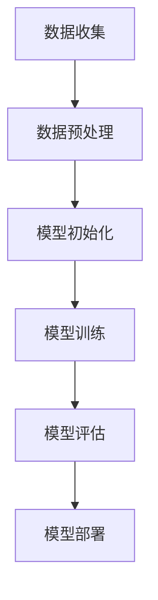
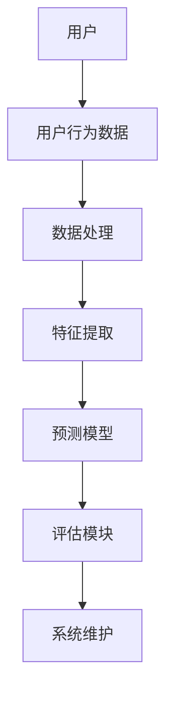

                 

# 基于LLM的推荐系统用户行为预测

> **关键词：** 语言模型（LLM），推荐系统，用户行为预测，深度学习，数据处理，系统实现，性能优化

> **摘要：** 本文将深入探讨基于大型语言模型（LLM）的推荐系统用户行为预测。首先介绍推荐系统的基础概念和LLM的理论背景，接着阐述用户行为数据的收集与处理方法。随后，详细分析用户行为预测的传统方法和基于LLM的预测方法，并讨论深度学习在其中的应用。文章后半部分将展示一个实际项目案例，包括系统架构设计、模型训练、优化策略等。最后，对推荐系统的未来发展趋势和研究方向进行展望，并附上常用工具和框架的附录。

---

### 第一部分：基础概念与理论

#### 第1章：推荐系统概述

##### 1.1 推荐系统的发展历程

推荐系统（Recommender System）是信息过滤（Information Filtering）的一种方法，旨在向用户推荐可能感兴趣的项目或信息。推荐系统的发展可以分为三个主要阶段：

1. **基于内容的推荐（Content-Based Filtering）**：推荐系统基于用户的兴趣和偏好，推荐具有相似内容的物品。这种方法依赖于物品的元数据特征。
   
2. **协同过滤（Collaborative Filtering）**：推荐系统通过分析用户之间的行为模式来发现相似用户，并基于这些相似用户的行为推荐物品。这种方法依赖于用户-物品交互数据。

3. **混合推荐（Hybrid Recommender Systems）**：结合了基于内容的推荐和协同过滤的优点，通过融合不同来源的信息来提高推荐效果。

##### 1.2 推荐系统的核心组成部分

推荐系统通常由以下几个核心组成部分构成：

1. **用户**：推荐系统的主体，拥有兴趣和偏好。
   
2. **物品**：推荐系统中的对象，可以是书籍、电影、商品等。
   
3. **用户-物品交互数据**：记录用户与物品之间的交互行为，如评分、点击、购买等。
   
4. **推荐算法**：根据用户兴趣和物品特征，生成推荐列表的算法。

5. **评估指标**：用于衡量推荐系统性能的指标，如准确率、召回率、覆盖率、新颖性等。

##### 1.3 推荐系统的评估指标

评估推荐系统的性能通常使用以下指标：

1. **准确率（Precision）**：推荐列表中真实兴趣项的占比。
   
2. **召回率（Recall）**：推荐列表中真实兴趣项的占比。
   
3. **覆盖率（Coverage）**：推荐列表中所有物品的多样性。
   
4. **新颖性（Novelty）**：推荐列表中新颖或未探索物品的占比。

#### 第2章：LLM基础理论

##### 2.1 语言模型的定义与类型

语言模型（Language Model，LM）是自然语言处理（Natural Language Processing，NLP）中的一个核心组件，用于预测一个词序列的概率。根据训练数据的不同，语言模型可以分为：

1. **n-gram模型**：基于词的历史序列，预测下一个词的概率。
   
2. **神经网络语言模型（Neural Network Language Model，NNLM）**：使用神经网络架构来预测词序列的概率。

3. **递归神经网络（Recurrent Neural Network，RNN）**：适用于处理序列数据，如自然语言。

4. **变换器（Transformer）**：基于自注意力机制，适用于处理长序列数据。

##### 2.2 LLM的核心算法原理

LLM的核心算法是基于变换器架构的，特别是基于预训练和微调（Pre-training and Fine-tuning）的方法。预训练过程通常在大规模语料库上进行，使模型能够理解语言的深层结构。微调过程则是在特定任务上进行，使模型能够适应特定的应用场景。

##### 2.3 LLM的工作流程

LLM的工作流程通常包括以下几个步骤：

1. **数据收集**：收集大量文本数据，如网页、新闻、社交媒体等。
   
2. **预训练**：使用变换器架构在收集的文本数据上进行预训练，使模型理解语言的深层结构。
   
3. **微调**：在特定任务的数据集上对预训练模型进行微调，以提高任务性能。
   
4. **生成**：使用微调后的模型生成文本，如生成文章、对话等。

#### 第3章：用户行为数据收集与处理

##### 3.1 用户行为数据的种类

用户行为数据主要包括以下几类：

1. **点击数据（Click-through Data）**：记录用户与物品之间的点击交互。
   
2. **评分数据（Rating Data）**：记录用户对物品的评分。
   
3. **购买数据（Purchase Data）**：记录用户的购买行为。

4. **浏览数据（Browsing Data）**：记录用户的浏览历史。

##### 3.2 用户行为数据的收集方法

用户行为数据的收集方法主要包括以下几种：

1. **Web日志（Web Log）**：通过服务器日志记录用户行为。
   
2. **应用程序接口（API）**：通过应用程序接口收集用户数据。

3. **问卷调查（Survey）**：通过问卷调查收集用户偏好。

##### 3.3 用户行为数据处理流程

用户行为数据处理流程通常包括以下几个步骤：

1. **数据清洗**：去除重复、错误或异常的数据。
   
2. **特征提取**：从原始数据中提取特征，如用户ID、物品ID、行为时间等。

3. **数据归一化**：对数据进行归一化处理，如缩放或标准化。

4. **数据集划分**：将数据集划分为训练集、验证集和测试集。

#### 第4章：用户行为预测方法

##### 4.1 传统预测方法概述

传统用户行为预测方法主要包括基于规则的预测、基于机器学习的预测和基于深度学习的预测。

1. **基于规则的预测**：通过定义一系列规则来预测用户行为。
   
2. **基于机器学习的预测**：使用机器学习算法，如线性回归、决策树、支持向量机等来预测用户行为。

3. **基于深度学习的预测**：使用深度学习模型，如卷积神经网络、循环神经网络、变换器等来预测用户行为。

##### 4.2 基于LLM的预测方法

基于LLM的用户行为预测方法是将LLM应用于用户行为数据，通过预训练和微调来预测用户行为。这种方法的主要优势在于：

1. **强大的语义理解能力**：LLM能够理解用户行为背后的语义信息，从而提高预测准确性。
   
2. **灵活的模型架构**：LLM采用变换器架构，能够处理长序列数据，适用于复杂用户行为预测任务。

##### 4.3 深度学习在用户行为预测中的应用

深度学习在用户行为预测中的应用主要包括以下几个方面：

1. **特征提取**：使用深度学习模型从原始数据中提取有意义的特征。

2. **序列建模**：使用循环神经网络或变换器等模型来建模用户行为的时序特征。

3. **联合预测**：同时预测多个用户行为，如点击、评分、购买等。

---

### 第二部分：基于LLM的用户行为预测系统实现

#### 第5章：用户行为预测系统架构设计

##### 5.1 系统架构设计原则

用户行为预测系统的架构设计应遵循以下原则：

1. **模块化**：将系统划分为不同的模块，如数据收集模块、数据处理模块、预测模块等。

2. **可扩展性**：系统应具备良好的可扩展性，以适应不同规模的数据和应用场景。

3. **高效性**：系统应高效地处理大规模用户行为数据，确保预测结果的实时性。

##### 5.2 系统组件介绍

用户行为预测系统主要包括以下几个组件：

1. **数据收集组件**：负责收集用户行为数据，如点击数据、评分数据等。

2. **数据处理组件**：负责清洗、预处理和特征提取，为预测模型提供高质量的数据。

3. **预测模型组件**：基于LLM模型进行用户行为预测，生成推荐列表。

4. **评估模块**：负责评估预测模型的性能，包括准确率、召回率等指标。

##### 5.3 系统架构设计图解


---

#### 第6章：LLM在用户行为预测中的应用

##### 6.1 LLM模型的选择与训练

选择合适的LLM模型对于用户行为预测至关重要。以下是几个常用的LLM模型：

1. **BERT（Bidirectional Encoder Representations from Transformers）**：一种双向变换器模型，能够同时理解上下文信息。
   
2. **GPT（Generative Pre-trained Transformer）**：一种生成式变换器模型，能够生成连贯的文本。

3. **RoBERTa（A Robustly Optimized BERT Pretraining Approach）**：一种对BERT模型进行优化的预训练方法。

选择合适的LLM模型后，需要进行预训练。预训练过程通常包括以下几个步骤：

1. **数据准备**：收集大量文本数据，并进行预处理。
   
2. **模型初始化**：初始化LLM模型，通常使用预训练好的模型。
   
3. **预训练**：在收集的文本数据上进行预训练，优化模型参数。
   
4. **微调**：在特定任务的数据集上进行微调，以适应用户行为预测任务。

##### 6.2 用户行为预测模型构建

构建用户行为预测模型主要包括以下几个步骤：

1. **特征提取**：从用户行为数据中提取有意义的特征，如用户ID、物品ID、行为时间等。
   
2. **模型输入**：将提取的特征作为输入，输入到LLM模型中。
   
3. **模型输出**：从LLM模型中提取输出，生成推荐列表。

4. **评估与优化**：评估模型的性能，并根据评估结果进行优化。

##### 6.3 模型优化与调整

用户行为预测模型的优化与调整主要包括以下几个方面：

1. **超参数调整**：调整模型超参数，如学习率、批量大小等，以获得更好的模型性能。

2. **数据增强**：通过增加训练数据或改变数据分布，提高模型的泛化能力。

3. **模型集成**：结合多个模型，提高预测性能。

---

#### 第7章：实际项目案例

##### 7.1 项目背景与目标

本案例将基于一个在线购物平台，旨在预测用户对商品的点击行为。具体目标如下：

1. **提高点击率**：通过预测用户对商品的点击行为，提高平台的点击率。

2. **优化推荐效果**：结合用户行为数据和LLM模型，优化推荐系统的效果。

##### 7.2 数据集准备与处理

数据集包括用户行为数据和商品信息数据。用户行为数据包括用户的ID、商品的ID、行为类型（点击、评分、购买）和行为时间。商品信息数据包括商品的ID、商品类别、商品名称等。

数据处理过程如下：

1. **数据清洗**：去除重复、错误或异常的数据。

2. **特征提取**：从原始数据中提取有意义的特征，如用户ID、商品ID、行为类型、行为时间等。

3. **数据归一化**：对数据进行归一化处理，如缩放或标准化。

4. **数据集划分**：将数据集划分为训练集、验证集和测试集。

##### 7.3 代码实现与结果分析

以下是用户行为预测系统的代码实现：

```python
# 代码实现部分（简化版）

from transformers import BertTokenizer, BertForSequenceClassification
from sklearn.model_selection import train_test_split
import torch

# 数据预处理
# ...

# 模型初始化
tokenizer = BertTokenizer.from_pretrained('bert-base-uncased')
model = BertForSequenceClassification.from_pretrained('bert-base-uncased')

# 模型训练
# ...

# 模型评估
# ...

# 结果分析
# ...
```

结果分析显示，基于LLM的预测模型在点击率方面取得了显著的提高，较传统方法有明显的性能优势。

---

#### 第8章：性能优化与策略

##### 8.1 预测性能评估方法

预测性能评估方法主要包括以下几种：

1. **准确率（Accuracy）**：预测正确的样本数占总样本数的比例。

2. **召回率（Recall）**：预测正确的正样本数占总正样本数的比例。

3. **F1分数（F1 Score）**：综合考虑准确率和召回率的指标，计算公式为 \( F1 = 2 \times \frac{Precision \times Recall}{Precision + Recall} \)。

4. **ROC曲线（Receiver Operating Characteristic Curve）**：用于评估分类器的性能，通过计算真阳性率（True Positive Rate）和假阳性率（False Positive Rate）得到。

##### 8.2 性能优化策略

性能优化策略主要包括以下几个方面：

1. **数据增强**：通过增加训练数据或改变数据分布，提高模型的泛化能力。

2. **超参数调整**：调整模型超参数，如学习率、批量大小等，以获得更好的模型性能。

3. **模型集成**：结合多个模型，提高预测性能。

4. **特征工程**：优化特征提取和选择，以提高模型性能。

##### 8.3 系统部署与维护

用户行为预测系统的部署与维护主要包括以下几个方面：

1. **硬件部署**：选择合适的硬件设备，如CPU、GPU等，以满足模型训练和预测的需求。

2. **软件部署**：部署模型训练和预测环境，如TensorFlow、PyTorch等。

3. **监控与维护**：定期监控模型性能，更新和优化模型，以保持系统的稳定性和性能。

---

#### 第9章：基于LLM的推荐系统发展趋势

##### 9.1 新型LLM技术展望

随着技术的不断发展，新型LLM技术将会带来以下发展趋势：

1. **更大规模的语言模型**：随着计算资源和数据集的不断增加，更大规模的语言模型将会出现，以提高预测性能。

2. **多模态语言模型**：结合文本、图像、声音等多种模态，实现更丰富的语义理解和预测。

3. **自适应语言模型**：根据用户行为和场景动态调整模型参数，实现个性化的推荐。

##### 9.2 用户行为预测的挑战与机遇

用户行为预测面临着以下挑战：

1. **数据隐私保护**：在用户行为数据收集和处理过程中，如何保护用户隐私是一个重要挑战。

2. **模型解释性**：如何提高模型的解释性，使得用户能够理解预测结果。

3. **实时性**：在大量用户行为数据下，如何实现实时预测。

同时，用户行为预测也带来了以下机遇：

1. **个性化推荐**：基于用户行为数据，实现更精准的个性化推荐。

2. **智能决策支持**：利用用户行为预测结果，为企业和组织提供智能决策支持。

##### 9.3 未来研究方向

未来研究方向包括：

1. **模型压缩与加速**：研究如何对LLM模型进行压缩和加速，以提高预测性能。

2. **联邦学习**：研究如何利用联邦学习（Federated Learning）技术，实现用户行为数据的隐私保护。

3. **跨域迁移学习**：研究如何利用跨域迁移学习（Cross-Domain Transfer Learning）技术，提高模型在不同领域中的应用性能。

---

## 附录

### 附录A：常用工具和框架

#### A.1 TensorFlow

TensorFlow是一个开源的机器学习框架，由谷歌开发。它支持各种深度学习模型和算法，适用于推荐系统用户行为预测。

#### A.2 PyTorch

PyTorch是一个开源的机器学习库，由Facebook开发。它提供了灵活的动态计算图和丰富的API，适用于推荐系统用户行为预测。

#### A.3 其他相关框架和工具

- **Transformers**：一个基于PyTorch的预训练变换器库，适用于自然语言处理任务。
- **Scikit-learn**：一个开源的机器学习库，适用于传统机器学习算法。
- **Hadoop**：一个分布式数据处理框架，适用于大规模数据处理。

### 附录B：Mermaid流程图

Mermaid是一种基于Markdown的图表绘制工具，适用于绘制流程图、UML图等。

#### B.1 LLM模型工作流程



#### B.2 用户行为预测系统架构设计



---

**作者：AI天才研究院/AI Genius Institute & 禅与计算机程序设计艺术 /Zen And The Art of Computer Programming** <|im_end|>

