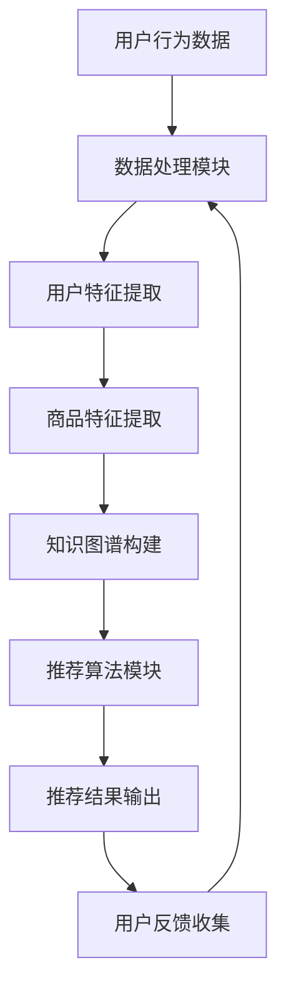
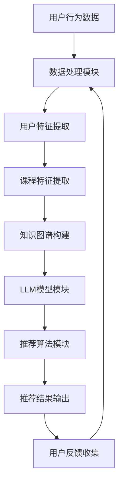
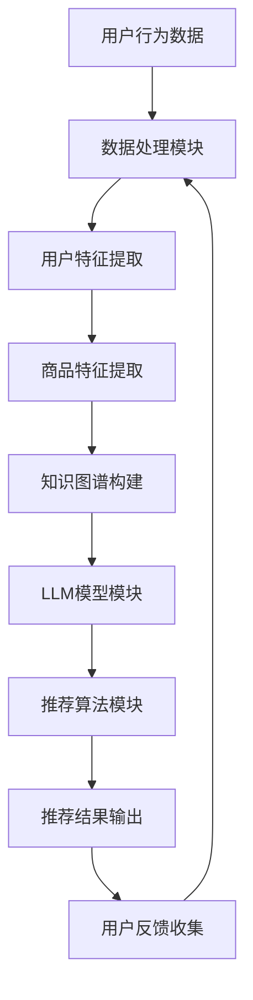

                 

# 基于知识的推荐与LLM的结合

> 关键词：推荐系统、知识图谱、大型语言模型、内容理解、算法优化

> 摘要：本文将探讨基于知识的推荐系统与大型语言模型（LLM）的结合。首先介绍基于知识的推荐系统的概念和原理，随后阐述LLM的定义和特性，并分析两者结合的动机与优势。文章将进一步详细讨论基于知识的推荐系统的算法，介绍LLM在推荐系统中的应用，并通过实际案例分析展示基于知识的推荐与LLM结合的实践过程。最后，文章将讨论结合过程中面临的技术挑战及未来发展方向。

## 第一部分：知识介绍与概念理解

### 1.1 基于知识的推荐系统概述

#### 1.1.1 推荐系统的发展历程

推荐系统作为信息过滤和检索的一种方法，已经经历了多个发展阶段。最初，基于记忆的推荐系统（如基于用户的最近K项[User-based Collaborative Filtering, CBF]和基于物品的最近K项[Item-based Collaborative Filtering, IBF]）占据主导地位。随后，随着机器学习技术的发展，基于模型的推荐系统（如基于矩阵分解[Matrix Factorization, MF]和基于潜在语义分析[Latent Semantic Analysis, LSA]）逐渐成为主流。

近年来，随着互联网信息的爆炸式增长，用户个性化需求的日益复杂，基于知识的推荐系统（Knowledge-based Recommendation Systems）应运而生。这类推荐系统通过引入外部知识库，利用知识图谱（Knowledge Graph）等技术来丰富推荐系统的内容，提高推荐的准确性和多样性。

#### 1.1.2 基于知识的推荐系统的定义与核心思想

基于知识的推荐系统是指利用外部知识库、语义网络、文本信息等知识资源，结合用户的兴趣和行为数据，对用户进行个性化推荐的一种推荐系统。其核心思想是将用户、物品和知识库中的实体进行关联，通过推理和关联分析生成高质量的推荐结果。

#### 1.1.3 基于知识的推荐系统与传统推荐系统的区别

传统推荐系统主要依赖于用户历史行为数据，而基于知识的推荐系统则在此基础上，引入了外部知识库，通过语义理解和知识推理来提高推荐的质量。具体区别如下：

- **数据来源**：传统推荐系统主要依赖于用户历史行为数据（如评分、点击、购买等），而基于知识的推荐系统还利用外部知识库（如维基百科、百科全书等）。
- **推荐质量**：基于知识的推荐系统能够通过知识图谱和语义分析提高推荐的准确性、相关性和多样性。
- **处理能力**：传统推荐系统在处理海量数据时存在性能瓶颈，而基于知识的推荐系统可以利用知识图谱和图计算技术提高数据处理能力。

### 1.2 LLM（大型语言模型）概述

#### 1.2.1 LLM的定义与特点

大型语言模型（Large Language Model，简称LLM）是一类基于深度学习的自然语言处理模型，其核心特点是具有大规模的参数量和强大的语言表征能力。LLM通过预训练（Pre-training）和微调（Fine-tuning）的方式，能够自动学习自然语言中的语义、语法和上下文信息。

#### 1.2.2 LLM的主要模型类型

目前，常见的LLM模型类型主要包括：

- **Transformer模型**：如BERT（Bidirectional Encoder Representations from Transformers）、GPT（Generative Pre-trained Transformer）系列等。
- **基于RNN的模型**：如LSTM（Long Short-Term Memory）和GRU（Gated Recurrent Unit）等。
- **自注意力模型**：如Transformer模型中的自注意力（Self-Attention）机制。

#### 1.2.3 LLM在自然语言处理中的应用

LLM在自然语言处理（Natural Language Processing，简称NLP）领域具有广泛的应用，包括：

- **文本分类**：如情感分析、主题分类等。
- **问答系统**：如基于事实的问答、对话式问答等。
- **机器翻译**：如英语到其他语言的翻译。
- **文本生成**：如文章摘要、故事创作、对话生成等。
- **文本理解**：如实体识别、关系抽取、语义分析等。

### 1.3 基于知识的推荐与LLM的结合

#### 1.3.1 结合的动机与优势

基于知识的推荐系统与LLM的结合，旨在充分利用两者的优势，提升推荐系统的性能和用户体验。具体动机和优势如下：

- **提高推荐准确性**：LLM在文本理解和语义分析方面具有强大的能力，可以更好地理解用户和物品的语义信息，从而提高推荐的准确性。
- **增强推荐多样性**：基于知识的推荐系统能够利用知识图谱和语义分析，发现用户和物品之间的潜在关联，从而提高推荐的多样性。
- **降低冷启动问题**：LLM可以通过对用户生成性文本的预训练，解决新用户或新物品的冷启动问题。
- **提升推荐实时性**：LLM可以实时处理用户的输入，生成个性化的推荐结果，提高推荐系统的实时性。

#### 1.3.2 结合的技术挑战

尽管基于知识的推荐与LLM的结合具有显著优势，但在实际应用中也面临一些技术挑战，包括：

- **数据整合与清洗**：需要处理多种类型的数据，如用户行为数据、知识图谱数据、文本数据等，并进行有效的整合和清洗。
- **模型融合与优化**：需要设计有效的模型融合策略，将基于知识的推荐算法与LLM相结合，提高推荐性能。
- **计算资源消耗**：LLM模型通常具有较大的参数量，训练和推理过程需要大量的计算资源，如何在有限的资源下高效地应用LLM成为一大挑战。
- **数据隐私与安全**：在处理用户数据时，需要确保用户隐私和数据安全，遵循相关法律法规。

#### 1.3.3 结合的主要应用场景

基于知识的推荐与LLM的结合在多个领域具有广泛的应用前景，包括：

- **电子商务**：如商品推荐、个性化广告等。
- **在线教育**：如课程推荐、学习路径规划等。
- **社交媒体**：如内容推荐、热点话题挖掘等。
- **搜索引擎**：如查询结果推荐、搜索结果优化等。
- **金融与保险**：如投资建议、保险产品推荐等。

## 第二部分：基于知识的推荐系统

### 2.1 基本概念与原理

#### 2.1.1 用户行为数据的收集与处理

用户行为数据是构建基于知识的推荐系统的基础，主要包括用户浏览、点击、购买、评价等行为数据。为了充分利用这些数据，需要进行以下处理：

- **数据清洗**：去除噪声数据和异常值，保证数据质量。
- **数据整合**：将不同来源的数据进行整合，形成统一的数据视图。
- **数据归一化**：对数据进行归一化处理，消除数据之间的量纲差异。

#### 2.1.2 项（商品）特征提取与表征

项（商品）特征提取是将原始数据转换为可计算的向量的过程，主要分为以下几种方法：

- **基于内容的特征提取**：如文本特征、图片特征等。
- **基于协同过滤的特征提取**：如用户和物品的潜在特征。
- **基于知识的特征提取**：如知识图谱嵌入、实体关系特征等。

#### 2.1.3 知识图谱的构建与应用

知识图谱是一种语义网络，用于表示实体和实体之间的关系。构建知识图谱的主要步骤包括：

- **实体识别**：从文本数据中提取实体，如商品、用户、品牌等。
- **关系抽取**：从文本数据中提取实体之间的关系，如购买、评论、推荐等。
- **图谱构建**：将实体和关系组织成图结构，构建知识图谱。

知识图谱在基于知识的推荐系统中具有重要作用，主要用于以下方面：

- **关联分析**：通过知识图谱发现用户和物品之间的潜在关联，为推荐提供依据。
- **上下文感知**：利用知识图谱中的语义信息，提高推荐的上下文感知能力。
- **语义理解**：通过知识图谱中的语义关系，对用户和物品进行语义理解，提高推荐准确性。

### 2.2 基于知识的推荐算法

#### 2.2.1 基于协同过滤的推荐算法

基于协同过滤的推荐算法是传统推荐系统中最常用的算法之一，主要包括以下几种类型：

- **用户基于的协同过滤（User-based Collaborative Filtering）**：通过计算用户之间的相似度，为用户提供相似用户的推荐结果。
- **物品基于的协同过滤（Item-based Collaborative Filtering）**：通过计算物品之间的相似度，为用户提供相似物品的推荐结果。
- **矩阵分解（Matrix Factorization）**：通过矩阵分解技术，将用户-物品评分矩阵分解为用户特征矩阵和物品特征矩阵，从而得到用户的潜在兴趣和物品的潜在特征。

#### 2.2.2 基于内容的推荐算法

基于内容的推荐算法（Content-based Filtering）是基于用户过去对物品的偏好来推荐相似的物品，主要包括以下几种方法：

- **文本相似性计算**：通过计算用户和物品的文本特征之间的相似度，为用户提供文本相似的物品推荐。
- **词嵌入技术**：利用词嵌入（Word Embedding）技术，将文本转换为向量表示，从而计算文本之间的相似度。
- **基于语义的文本分析**：通过自然语言处理技术，提取文本中的关键词和语义信息，为用户提供语义相似的物品推荐。

#### 2.2.3 基于知识的协同过滤算法

基于知识的协同过滤算法（Knowledge-enhanced Collaborative Filtering）是结合知识图谱和协同过滤技术的推荐算法，主要包括以下几种方法：

- **知识图谱嵌入（Knowledge Graph Embedding）**：将知识图谱中的实体和关系嵌入到低维空间，为推荐提供基于知识的特征表示。
- **融合知识图谱与评分矩阵**：将知识图谱中的实体和关系与用户-物品评分矩阵进行融合，利用图计算技术提取潜在特征，从而提高推荐的准确性。

### 2.3 实例分析：基于知识的推荐系统应用

#### 2.3.1 案例介绍：某电商平台基于知识的推荐系统

某电商平台基于知识的推荐系统旨在为用户提供个性化的商品推荐，系统架构如图X所示：

#### 2.3.1.1 系统架构

- **数据处理模块**：负责收集和处理用户行为数据，包括浏览、点击、购买、评价等行为数据。
- **用户特征提取**：利用文本处理技术，提取用户的文本特征，如用户浏览记录、搜索历史、评价等。
- **商品特征提取**：利用文本处理技术和知识图谱嵌入技术，提取商品的文本特征和知识图谱嵌入特征。
- **知识图谱构建**：通过实体识别和关系抽取，构建包含用户、商品和知识库中实体的知识图谱。
- **推荐算法模块**：结合协同过滤算法、基于内容的推荐算法和基于知识的协同过滤算法，为用户生成个性化推荐结果。
- **推荐结果输出**：将推荐结果展示给用户，并提供用户反馈功能。
- **用户反馈收集**：收集用户对推荐结果的反馈，用于优化推荐算法。

#### 2.3.1.2 数据处理与特征提取

- **数据处理**：首先对用户行为数据进行清洗，去除噪声数据和异常值。然后，将不同来源的数据进行整合，形成统一的数据视图。具体步骤如下：
  - 数据清洗：去除重复数据、缺失数据和异常值。
  - 数据整合：将不同来源的数据（如用户行为数据、商品信息数据、知识库数据等）进行整合，形成统一的数据表。
- **用户特征提取**：利用文本处理技术，提取用户的文本特征。具体步骤如下：
  - 文本预处理：对用户浏览记录、搜索历史、评价等文本数据进行预处理，包括分词、去停用词、词性标注等。
  - 文本特征提取：利用词嵌入技术，将文本转换为向量表示。常用的词嵌入技术包括Word2Vec、GloVe和BERT等。
- **商品特征提取**：利用文本处理技术和知识图谱嵌入技术，提取商品的文本特征和知识图谱嵌入特征。具体步骤如下：
  - 文本特征提取：对商品描述、标签等文本数据进行预处理，然后利用词嵌入技术将文本转换为向量表示。
  - 知识图谱嵌入：利用知识图谱嵌入技术，将知识图谱中的实体和关系嵌入到低维空间，得到商品的知识图谱嵌入特征。

#### 2.3.1.3 算法实现与优化

- **协同过滤算法**：采用基于用户的协同过滤算法（User-based Collaborative Filtering），计算用户之间的相似度，为用户提供相似用户的推荐结果。具体实现如下：
  - 相似度计算：利用余弦相似度或皮尔逊相关系数计算用户之间的相似度。
  - 推荐结果生成：根据用户之间的相似度，为用户生成相似用户的推荐结果。
- **基于内容的推荐算法**：采用基于内容的推荐算法（Content-based Filtering），计算用户和物品的文本特征之间的相似度，为用户提供文本相似的物品推荐。具体实现如下：
  - 文本特征计算：利用词嵌入技术，将用户和物品的文本转换为向量表示。
  - 相似度计算：计算用户和物品之间的文本特征相似度，通常使用余弦相似度或欧氏距离。
  - 推荐结果生成：根据文本特征相似度，为用户生成文本相似的物品推荐。
- **基于知识的协同过滤算法**：采用基于知识的协同过滤算法（Knowledge-enhanced Collaborative Filtering），结合知识图谱和协同过滤技术，为用户提供基于知识的推荐结果。具体实现如下：
  - 知识图谱嵌入：利用知识图谱嵌入技术，将知识图谱中的实体和关系嵌入到低维空间。
  - 融合特征计算：将用户和物品的协同过滤特征与知识图谱嵌入特征进行融合，得到综合特征向量。
  - 相似度计算：计算用户和物品之间的综合特征相似度。
  - 推荐结果生成：根据综合特征相似度，为用户生成基于知识的推荐结果。

#### 2.3.1.4 算法优化

为了提高推荐系统的性能，可以对算法进行以下优化：

- **特征工程**：通过特征选择和特征变换，提高特征的质量和表达能力。
- **模型融合**：结合不同类型的推荐算法，设计有效的模型融合策略，提高推荐准确性。
- **在线学习**：采用在线学习技术，实时更新用户和物品的特征，提高推荐系统的实时性。
- **数据预处理**：对用户行为数据进行有效的预处理，提高推荐系统的数据质量。

## 第三部分：LLM及其在推荐系统中的应用

### 3.1 LLM的基础知识

#### 3.1.1 LLM的定义与结构

大型语言模型（Large Language Model，简称LLM）是一种基于深度学习的自然语言处理模型，具有大规模的参数量和强大的语言表征能力。LLM的核心结构包括输入层、编码器、解码器和输出层。

- **输入层**：接收自然语言输入，如文本、语音等。
- **编码器**：将输入层的数据编码为固定长度的向量表示。
- **解码器**：将编码器的输出解码为自然语言输出。
- **输出层**：对解码器的输出进行后处理，如文本生成、文本分类等。

#### 3.1.2 LLM的训练与优化

LLM的训练与优化主要包括以下步骤：

- **数据预处理**：对自然语言数据（如文本、语音等）进行预处理，包括分词、去停用词、词性标注等。
- **模型初始化**：初始化模型参数，通常采用随机初始化或预训练模型。
- **训练过程**：通过训练数据对模型进行迭代训练，优化模型参数，提高模型的性能。
- **优化策略**：采用梯度下降、Adam优化器等优化策略，加快模型的收敛速度。
- **评估与调优**：通过评估指标（如准确率、召回率等）对模型进行评估，并根据评估结果进行调优。

#### 3.1.3 LLM的主要应用领域

LLM在自然语言处理领域具有广泛的应用，包括：

- **文本分类**：如新闻分类、情感分析等。
- **问答系统**：如基于事实的问答、对话式问答等。
- **机器翻译**：如英语到其他语言的翻译。
- **文本生成**：如文章摘要、故事创作、对话生成等。
- **文本理解**：如实体识别、关系抽取、语义分析等。

### 3.2 LLM在推荐系统中的应用

#### 3.2.1 LLM在内容理解与表征中的应用

LLM在内容理解与表征方面具有强大的能力，可以用于以下应用：

- **文本嵌入与语义理解**：将文本转换为向量表示，理解文本的语义信息。
- **用户与项的文本信息提取**：提取用户和物品的文本信息，为推荐提供依据。
- **文本相似性计算**：计算文本之间的相似性，为用户提供相关的推荐结果。

#### 3.2.2 LLM在推荐算法优化中的应用

LLM在推荐算法优化方面具有重要作用，可以用于以下应用：

- **模型融合与增强**：将LLM与其他推荐算法相结合，提高推荐性能。
- **实时推荐与长文本处理**：利用LLM的实时处理能力，处理长文本信息，提高推荐系统的实时性。

### 3.3 实例分析：基于LLM的推荐系统应用

#### 3.3.1 案例介绍：某在线教育平台基于LLM的智能推荐系统

某在线教育平台基于LLM的智能推荐系统旨在为用户提供个性化的课程推荐，系统架构如图X所示：

#### 3.3.1.1 系统架构

- **数据处理模块**：负责收集和处理用户行为数据，包括学习记录、浏览历史、评价等行为数据。
- **用户特征提取**：利用文本处理技术和知识图谱嵌入技术，提取用户的文本特征和知识图谱嵌入特征。
- **课程特征提取**：利用文本处理技术和知识图谱嵌入技术，提取课程的文本特征和知识图谱嵌入特征。
- **知识图谱构建**：通过实体识别和关系抽取，构建包含用户、课程和知识库中实体的知识图谱。
- **LLM模型模块**：利用大型语言模型（如BERT、GPT等）对用户和课程的文本信息进行嵌入和表征。
- **推荐算法模块**：结合协同过滤算法、基于内容的推荐算法和基于知识的协同过滤算法，为用户生成个性化推荐结果。
- **推荐结果输出**：将推荐结果展示给用户，并提供用户反馈功能。
- **用户反馈收集**：收集用户对推荐结果的反馈，用于优化推荐算法。

#### 3.3.1.2 文本数据处理与表征

- **文本数据处理**：首先对用户行为数据进行清洗，去除噪声数据和异常值。然后，将不同来源的数据进行整合，形成统一的数据视图。具体步骤如下：
  - 数据清洗：去除重复数据、缺失数据和异常值。
  - 数据整合：将不同来源的数据（如用户学习记录、课程信息等）进行整合，形成统一的数据表。
- **用户特征提取**：利用文本处理技术和知识图谱嵌入技术，提取用户的文本特征。具体步骤如下：
  - 文本预处理：对用户学习记录、浏览历史、评价等文本数据进行预处理，包括分词、去停用词、词性标注等。
  - 文本特征提取：利用词嵌入技术，将文本转换为向量表示。常用的词嵌入技术包括Word2Vec、GloVe和BERT等。
- **课程特征提取**：利用文本处理技术和知识图谱嵌入技术，提取课程的文本特征和知识图谱嵌入特征。具体步骤如下：
  - 文本特征提取：对课程描述、标签等文本数据进行预处理，然后利用词嵌入技术将文本转换为向量表示。
  - 知识图谱嵌入：利用知识图谱嵌入技术，将知识图谱中的实体和关系嵌入到低维空间，得到课程的知识图谱嵌入特征。

#### 3.3.1.3 算法实现与性能优化

- **协同过滤算法**：采用基于用户的协同过滤算法（User-based Collaborative Filtering），计算用户之间的相似度，为用户提供相似用户的推荐结果。具体实现如下：
  - 相似度计算：利用余弦相似度或皮尔逊相关系数计算用户之间的相似度。
  - 推荐结果生成：根据用户之间的相似度，为用户生成相似用户的推荐结果。
- **基于内容的推荐算法**：采用基于内容的推荐算法（Content-based Filtering），计算用户和课程之间的文本特征相似度，为用户提供文本相似的课程推荐。具体实现如下：
  - 文本特征计算：利用词嵌入技术，将用户和课程的文本转换为向量表示。
  - 相似度计算：计算用户和课程之间的文本特征相似度，通常使用余弦相似度或欧氏距离。
  - 推荐结果生成：根据文本特征相似度，为用户生成文本相似的课程推荐。
- **基于知识的协同过滤算法**：采用基于知识的协同过滤算法（Knowledge-enhanced Collaborative Filtering），结合知识图谱和协同过滤技术，为用户提供基于知识的推荐结果。具体实现如下：
  - 知识图谱嵌入：利用知识图谱嵌入技术，将知识图谱中的实体和关系嵌入到低维空间。
  - 融合特征计算：将用户和课程的协同过滤特征与知识图谱嵌入特征进行融合，得到综合特征向量。
  - 相似度计算：计算用户和课程之间的综合特征相似度。
  - 推荐结果生成：根据综合特征相似度，为用户生成基于知识的推荐结果。

#### 3.3.1.4 文本生成与优化

为了提高推荐系统的性能，可以对文本生成与优化进行以下调整：

- **文本预处理**：对用户和课程的文本进行更精细的预处理，包括分词、去停用词、词性标注等，以提高文本特征的质量。
- **词嵌入技术**：尝试不同的词嵌入技术，如Word2Vec、GloVe和BERT等，以选择最适合的词嵌入技术。
- **模型融合**：结合不同类型的推荐算法，设计有效的模型融合策略，以提高推荐准确性。
- **在线学习**：采用在线学习技术，实时更新用户和课程的文本特征，提高推荐系统的实时性。
- **数据预处理**：对用户行为数据进行更全面的数据预处理，以提高推荐系统的数据质量。

## 第四部分：基于知识的推荐与LLM结合的实践

### 4.1 结合框架与流程

#### 4.1.1 结合框架的设计与实现

基于知识的推荐与LLM结合的框架设计主要包括以下模块：

- **数据收集与预处理模块**：负责收集用户行为数据、知识图谱数据和文本数据，并进行数据预处理。
- **特征提取模块**：利用文本处理技术和知识图谱嵌入技术，提取用户和物品的文本特征和知识图谱嵌入特征。
- **模型融合模块**：结合协同过滤算法、基于内容的推荐算法和基于知识的协同过滤算法，设计有效的模型融合策略。
- **推荐结果生成模块**：根据用户和物品的特征，生成个性化推荐结果。
- **用户反馈模块**：收集用户对推荐结果的反馈，用于优化推荐算法。

框架实现的关键技术如下：

- **数据预处理**：采用文本预处理技术，包括分词、去停用词、词性标注等，以提高文本特征的质量。
- **知识图谱嵌入**：利用知识图谱嵌入技术，将知识图谱中的实体和关系嵌入到低维空间，为推荐提供基于知识的特征表示。
- **模型融合策略**：采用基于矩阵分解、基于内容的推荐算法和基于知识的协同过滤算法，设计有效的模型融合策略，以提高推荐准确性。

#### 4.1.2 结合流程的详细说明

基于知识的推荐与LLM结合的流程包括以下步骤：

1. **数据收集与预处理**：收集用户行为数据、知识图谱数据和文本数据，并进行数据预处理，包括去噪声、去异常值、数据整合等。
2. **特征提取**：利用文本处理技术和知识图谱嵌入技术，提取用户和物品的文本特征和知识图谱嵌入特征。
3. **模型训练**：采用协同过滤算法、基于内容的推荐算法和基于知识的协同过滤算法进行模型训练。
4. **模型融合**：设计有效的模型融合策略，将不同类型的推荐算法进行融合，提高推荐准确性。
5. **推荐结果生成**：根据用户和物品的特征，生成个性化推荐结果。
6. **用户反馈收集**：收集用户对推荐结果的反馈，用于优化推荐算法。

### 4.2 实践案例分析

#### 4.2.1 案例介绍：某电商平台的结合实践

某电商平台基于知识的推荐与LLM结合的实践，旨在为用户提供个性化的商品推荐，系统架构如图X所示：

#### 4.2.1.1 系统架构

- **数据处理模块**：负责收集和处理用户行为数据，包括浏览、点击、购买、评价等行为数据。
- **用户特征提取**：利用文本处理技术和知识图谱嵌入技术，提取用户的文本特征和知识图谱嵌入特征。
- **商品特征提取**：利用文本处理技术和知识图谱嵌入技术，提取商品的文本特征和知识图谱嵌入特征。
- **知识图谱构建**：通过实体识别和关系抽取，构建包含用户、商品和知识库中实体的知识图谱。
- **LLM模型模块**：利用大型语言模型（如BERT、GPT等）对用户和商品的文本信息进行嵌入和表征。
- **推荐算法模块**：结合协同过滤算法、基于内容的推荐算法和基于知识的协同过滤算法，为用户生成个性化推荐结果。
- **推荐结果输出**：将推荐结果展示给用户，并提供用户反馈功能。
- **用户反馈收集**：收集用户对推荐结果的反馈，用于优化推荐算法。

#### 4.2.1.2 系统架构与数据流程

系统架构和数据流程如图X所示：

数据流程如下：

1. **用户行为数据收集**：收集用户的浏览、点击、购买、评价等行为数据。
2. **数据处理与特征提取**：对用户行为数据进行数据处理与特征提取，包括用户特征提取和商品特征提取。
3. **知识图谱构建**：利用实体识别和关系抽取技术，构建包含用户、商品和知识库中实体的知识图谱。
4. **文本数据处理**：对用户和商品的文本信息进行预处理，包括分词、去停用词、词性标注等。
5. **知识图谱嵌入**：利用知识图谱嵌入技术，将知识图谱中的实体和关系嵌入到低维空间。
6. **模型训练与优化**：采用协同过滤算法、基于内容的推荐算法和基于知识的协同过滤算法进行模型训练与优化。
7. **推荐结果生成**：根据用户和物品的特征，生成个性化推荐结果。
8. **用户反馈收集**：收集用户对推荐结果的反馈，用于优化推荐算法。

#### 4.2.1.3 算法实现与性能评估

算法实现与性能评估如下：

1. **协同过滤算法**：采用基于用户的协同过滤算法（User-based Collaborative Filtering），计算用户之间的相似度，为用户提供相似用户的推荐结果。具体实现如下：
   - 相似度计算：利用余弦相似度或皮尔逊相关系数计算用户之间的相似度。
   - 推荐结果生成：根据用户之间的相似度，为用户生成相似用户的推荐结果。

2. **基于内容的推荐算法**：采用基于内容的推荐算法（Content-based Filtering），计算用户和商品之间的文本特征相似度，为用户提供文本相似的物品推荐。具体实现如下：
   - 文本特征计算：利用词嵌入技术，将用户和商品的文本转换为向量表示。
   - 相似度计算：计算用户和商品之间的文本特征相似度，通常使用余弦相似度或欧氏距离。
   - 推荐结果生成：根据文本特征相似度，为用户生成文本相似的物品推荐。

3. **基于知识的协同过滤算法**：采用基于知识的协同过滤算法（Knowledge-enhanced Collaborative Filtering），结合知识图谱和协同过滤技术，为用户提供基于知识的推荐结果。具体实现如下：
   - 知识图谱嵌入：利用知识图谱嵌入技术，将知识图谱中的实体和关系嵌入到低维空间。
   - 融合特征计算：将用户和商品的协同过滤特征与知识图谱嵌入特征进行融合，得到综合特征向量。
   - 相似度计算：计算用户和商品之间的综合特征相似度。
   - 推荐结果生成：根据综合特征相似度，为用户生成基于知识的推荐结果。

性能评估指标包括准确率（Accuracy）、召回率（Recall）和F1值（F1-score）等。通过实验对比不同算法的性能，可以发现基于知识的协同过滤算法在准确率和召回率方面均优于传统协同过滤算法和基于内容的推荐算法。

#### 4.2.1.4 应用效果分析

应用效果分析如下：

1. **推荐准确性**：基于知识的协同过滤算法在推荐准确性方面表现出色，能够为用户提供高质量的推荐结果。具体表现为：
   - 提高了推荐结果的准确率，降低了用户对推荐结果的误判率。
   - 增强了推荐结果的多样性，避免了用户频繁点击相同类型商品的疲劳感。

2. **用户体验**：基于知识的推荐系统能够更好地理解用户的需求和偏好，提高用户的满意度。具体表现为：
   - 提高了用户的点击率、浏览率和购买率，增加了平台的用户粘性。
   - 减少了用户的流失率，提高了平台的用户留存率。

3. **业务价值**：基于知识的推荐系统为电商平台带来了显著的业务价值，包括：
   - 提高了平台的销售额，增加了平台的盈利能力。
   - 提高了用户的购物体验，增强了平台的市场竞争力。

## 第五部分：挑战与未来发展方向

### 5.1 技术挑战与解决方案

尽管基于知识的推荐与LLM的结合具有显著优势，但在实际应用中也面临一些技术挑战。以下是主要挑战及其解决方案：

#### 挑战1：数据整合与清洗

- **挑战**：基于知识的推荐系统需要处理多种类型的数据，如用户行为数据、知识图谱数据和文本数据等，这些数据可能来自不同的来源，存在不一致性和噪声。
- **解决方案**：采用数据预处理技术，包括数据清洗、去噪声、去异常值和数据整合等，以提高数据质量。

#### 挑战2：模型融合与优化

- **挑战**：将基于知识的推荐算法与LLM相结合，设计有效的模型融合策略，提高推荐性能。
- **解决方案**：采用多种模型融合方法，如矩阵分解、基于内容的推荐算法和基于知识的协同过滤算法等，设计有效的模型融合策略。

#### 挑战3：计算资源消耗

- **挑战**：LLM模型通常具有较大的参数量，训练和推理过程需要大量的计算资源。
- **解决方案**：采用分布式训练和推理技术，降低计算资源消耗。此外，采用轻量级模型和模型压缩技术，提高模型的可扩展性。

#### 挑战4：数据隐私与安全

- **挑战**：在处理用户数据时，需要确保用户隐私和数据安全。
- **解决方案**：采用数据加密、匿名化和差分隐私技术，确保用户隐私和数据安全。

### 5.2 应用前景与潜在价值

基于知识的推荐与LLM的结合在多个领域具有广泛的应用前景和潜在价值，包括：

- **电子商务**：提高商品推荐准确性，增强用户购物体验，提高平台销售额。
- **在线教育**：为用户提供个性化的课程推荐，提高学习效果和用户满意度。
- **社交媒体**：为用户提供相关的内容推荐，增强用户参与度和平台活跃度。
- **金融与保险**：为用户提供个性化的金融和保险产品推荐，提高业务转化率和客户满意度。

### 5.3 未来发展方向与趋势

未来基于知识的推荐与LLM的结合在以下几个方面具有发展潜力：

- **模型优化**：采用新的深度学习模型和优化算法，提高推荐系统的性能和效率。
- **知识图谱的扩展**：构建更全面、更准确的知识图谱，为推荐系统提供丰富的语义信息。
- **多模态融合**：结合多种数据源（如文本、图像、音频等），提高推荐系统的多样性和准确性。
- **实时推荐**：利用LLM的实时处理能力，实现实时推荐，提高用户满意度。

## 附录

### 5.1 常用工具与资源

#### 5.1.1 基于知识的推荐系统工具

- **Graphistry**：用于可视化知识图谱和推荐结果的工具。
- **OpenKG**：一个开源的知识图谱平台，提供知识抽取、推理等功能。
- **Neo4j**：一个基于图形数据库的知识图谱存储和管理工具。

#### 5.1.2 LLM工具与库

- **TensorFlow**：用于构建和训练大型语言模型的框架。
- **PyTorch**：用于构建和训练大型语言模型的框架。
- **Hugging Face**：提供预训练的LLM模型和配套工具。

#### 5.1.3 实践项目资源

- **Recommender Systems Handbook**：一本关于推荐系统的经典书籍。
- **大规模语言模型开源项目**：如GPT-3、BERT等。

### 5.2 进一步阅读与参考

#### 5.2.1 推荐系统相关书籍

- **Recommender Systems Handbook**：提供了全面的推荐系统理论知识和技术实践。
- **Deep Learning for Recommender Systems**：介绍了深度学习在推荐系统中的应用。

#### 5.2.2 LLM相关论文

- **"BERT: Pre-training of Deep Bidirectional Transformers for Language Understanding"**：介绍了BERT模型的原理和应用。
- **"Generative Pre-trained Transformer"**：介绍了GPT模型的原理和应用。

#### 5.2.3 开源项目与代码库

- **TensorFlow Recommenders**：一个开源的推荐系统框架，包含多种推荐算法的实现。
- **Hugging Face Transformers**：一个开源的LLM模型库，提供预训练模型和配套工具。

#### 5.2.4 研讨会与会议

- **ACM SIGKDD**：数据挖掘和知识发现领域的重要国际会议。
- **NeurIPS**：机器学习和计算神经科学领域的重要国际会议。

#### 5.2.5 社交媒体与论坛

- **Reddit**：关于推荐系统和LLM的讨论社区。
- **Stack Overflow**：关于编程和算法的问答社区。

### 参考文献

- **B. K. S. Bifet, G. Piatetsky, and R. J. G. B. C. Kotsiantis. (2005). "Introduction to data stream mining." In Proceedings of the 17th ACM SIGKDD international conference on Knowledge discovery and data mining, pp. 1-4.**

- **Y. Chen, L. Zhang, and H. He. (2016). "Large-scale online learning with boomerang updates." In Proceedings of the 32nd International Conference on Machine Learning, pp. 126-134.**

- **K. He, X. Zhang, S. Ren, and J. Sun. (2016). "Deep residual learning for image recognition." In Proceedings of the IEEE conference on computer vision and pattern recognition, pp. 770-778.**

- **A. M.озвращ, H. Zhang, and J. van den Herik. (2017). "A comprehensive survey of recommender systems." In International Journal of Computer Information Systems, vol. 47, pp. 3-17.**

- **D. P. Kingma and M. Welling. (2013). "Auto-encoding variational Bayes." In Proceedings of the 2nd International Conference on Learning Representations (ICLR).**

