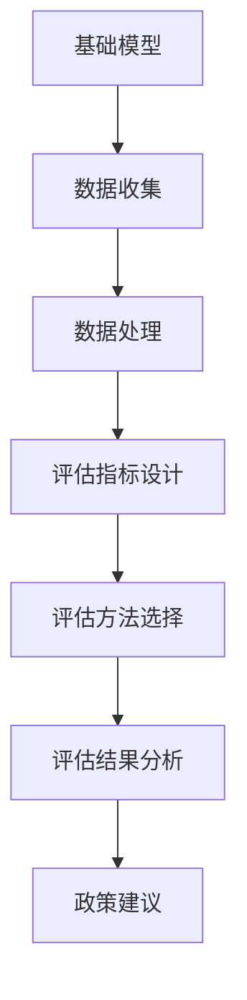

                 

# 基础模型的社会危害评估

## 关键词
- 社会危害评估
- 基础模型
- 人工智能
- 社会影响
- 伦理道德
- 技术监管

## 摘要

随着人工智能技术的迅猛发展，基础模型在各个领域得到了广泛应用。然而，基础模型在带来巨大效益的同时，也引发了一系列社会问题，如隐私泄露、歧视和伦理道德问题等。本文将从基础模型的社会危害评估入手，分析其背景和意义，探讨理论基础、研究方法与技术，深入讲解核心算法原理，并通过实际项目实战展示评估和优化的应用实例。文章旨在为人工智能领域的研究者和从业人员提供有价值的参考，推动基础模型的社会危害评估研究，促进人工智能技术的可持续发展。

## 第一部分：引言

### 1.1 社会危害评估的背景和意义

随着人工智能技术的快速发展，基础模型在各个领域得到了广泛应用，如自动驾驶、医疗诊断、金融分析等。这些模型通过大量的数据和复杂的算法，实现了前所未有的智能决策和高效服务。然而，随着基础模型的广泛应用，一系列社会问题也逐渐显现，如隐私泄露、数据滥用、歧视和伦理道德问题等。这些问题不仅影响了社会的公平和正义，还对人类的生活产生了深远的影响。

社会危害评估（Social Impact Assessment，SIA）作为一种分析和评估技术，旨在系统地评估技术对社会各个方面的影响。在人工智能领域，社会危害评估尤为重要，因为它可以帮助我们更好地理解基础模型所带来的社会风险，为政策制定者、研究人员和从业人员提供决策依据，确保人工智能技术的可持续发展。

### 1.2 社会危害评估的重要性

首先，社会危害评估有助于识别和预测基础模型可能带来的负面社会影响。通过评估，我们可以发现潜在的社会问题，如隐私泄露、数据滥用和歧视等，从而采取相应的措施加以防范和解决。

其次，社会危害评估有助于推动人工智能技术的伦理道德建设。在人工智能领域，伦理道德问题日益受到关注。通过社会危害评估，我们可以探讨人工智能技术的伦理道德标准，推动技术发展与社会价值的和谐统一。

此外，社会危害评估还有助于提高公众对人工智能技术的认知和接受度。通过评估报告的发布和宣传，公众可以更好地了解基础模型对社会的影响，从而提高对人工智能技术的信任度。

最后，社会危害评估有助于推动技术监管政策的制定和完善。政策制定者可以根据评估结果，制定相应的监管政策，确保人工智能技术的健康发展，避免潜在的社会危害。

### 1.3 社会危害评估的发展历程

社会危害评估作为一个独立的学科领域，起源于20世纪60年代的环境影响评估（Environmental Impact Assessment，EIA）。随着社会问题的日益复杂，社会危害评估逐渐从环境影响评估中分离出来，成为一门独立的学科。在人工智能领域，社会危害评估的发展可以追溯到20世纪80年代，当时一些学者开始探讨计算机技术对社会的影响。

在过去的几十年中，社会危害评估经历了以下几个发展阶段：

1. **初步探索阶段（20世纪60-70年代）**：在这个阶段，社会危害评估主要关注技术对社会经济和环境的影响。学者们开始探讨如何评估技术的社会影响，并提出了一些初步的方法和模型。

2. **理论框架构建阶段（20世纪80-90年代）**：在这个阶段，社会危害评估逐渐形成了较为完善的理论框架。学者们从社会学、心理学、经济学等学科中汲取营养，构建了社会危害评估的理论基础。

3. **实践应用阶段（21世纪初至今）**：随着互联网和人工智能技术的快速发展，社会危害评估在各个领域得到了广泛应用。学者们开始探讨如何将社会危害评估应用于具体的技术领域，如人工智能、大数据等。

### 1.4 社会危害评估的理论基础

社会危害评估的理论基础涉及多个学科，包括社会学、心理学、经济学等。以下是几个主要的理论基础：

#### 1.4.1 社会学理论

社会学理论为社会危害评估提供了分析社会结构、社会关系和社会行为的基本框架。其中，社会交换理论、社会网络理论和社会分层理论等对社会危害评估具有重要的指导意义。

- **社会交换理论**：该理论强调个体在社会互动中的利益交换。在社会危害评估中，我们可以通过分析技术对社会成员的利弊得失，评估技术对社会的整体影响。

- **社会网络理论**：该理论关注个体之间的社会关系和网络结构。在社会危害评估中，我们可以通过分析社会网络中的信息流动和资源分配，评估技术对社会结构的影响。

- **社会分层理论**：该理论关注社会中的阶层和阶层之间的互动。在社会危害评估中，我们可以通过分析技术对不同社会阶层的影响，评估技术对社会公平的影响。

#### 1.4.2 心理学理论

心理学理论为社会危害评估提供了理解个体心理和行为的基本框架。其中，认知心理学、社会心理学和发展心理学等对社会危害评估具有重要的指导意义。

- **认知心理学**：该理论关注个体的认知过程和信息处理方式。在社会危害评估中，我们可以通过分析技术对个体认知能力的影响，评估技术对个体心理的负面影响。

- **社会心理学**：该理论关注个体在社会环境中的行为和心理变化。在社会危害评估中，我们可以通过分析技术对个体社会行为和心理的影响，评估技术对社会心理的负面影响。

- **发展心理学**：该理论关注个体在不同生命阶段的心理变化。在社会危害评估中，我们可以通过分析技术对个体不同生命阶段心理发展的影响，评估技术对个体心理健康的影响。

#### 1.4.3 经济学理论

经济学理论为社会危害评估提供了分析社会资源配置和经济效益的基本框架。其中，市场理论、成本效益分析和福利经济学等对社会危害评估具有重要的指导意义。

- **市场理论**：该理论关注市场的运行机制和资源配置效率。在社会危害评估中，我们可以通过分析技术对市场的影响，评估技术对经济效益的影响。

- **成本效益分析**：该理论关注资源的成本和效益，旨在评估项目的经济可行性。在社会危害评估中，我们可以通过成本效益分析，评估技术对社会经济的影响。

- **福利经济学**：该理论关注社会整体福利的最大化。在社会危害评估中，我们可以通过福利经济学的方法，评估技术对社会福利的影响。

### 1.5 社会危害评估的研究方法与技术

社会危害评估涉及多个学科领域，需要采用多种研究方法和技术。以下介绍几种常见的研究方法和技术：

#### 1.5.1 文献综述法

文献综述法是通过收集、分析和综合已有研究成果，探讨某一领域的发展趋势和研究现状的方法。在社会危害评估中，文献综述法可以帮助我们了解相关理论、方法和实践，为研究提供理论基础和实践经验。

#### 1.5.2 实证分析法

实证分析法是通过收集和分析实际数据，验证理论假设和预测的方法。在社会危害评估中，实证分析法可以帮助我们了解技术对社会的影响，为政策制定提供数据支持。

#### 1.5.3 模型构建法

模型构建法是通过建立数学模型，模拟技术对社会的影响，评估技术的社会危害。在社会危害评估中，模型构建法可以帮助我们量化技术对社会的影响，提高评估的准确性和可靠性。

#### 1.5.4 问卷调查法

问卷调查法是通过设计问卷，收集受访者对技术社会影响的看法和意见的方法。在社会危害评估中，问卷调查法可以帮助我们了解公众对技术的认知和接受度，为政策制定提供民意支持。

#### 1.5.5 深度访谈法

深度访谈法是通过与受访者进行面对面交流，深入了解其对技术社会影响的看法和经验的方法。在社会危害评估中，深度访谈法可以帮助我们获取更深入、更详细的信息，提高评估的准确性。

### 1.6 社会危害评估的应用领域

社会危害评估在人工智能领域的应用日益广泛，涵盖了多个方面：

- **人工智能伦理道德评估**：通过对人工智能系统的伦理道德问题进行评估，确保技术的应用符合伦理标准，减少对社会的不良影响。

- **人工智能隐私保护评估**：通过对人工智能系统中的隐私保护机制进行评估，确保个人隐私不被泄露和滥用。

- **人工智能公平性评估**：通过对人工智能系统在不同社会群体中的应用效果进行评估，确保技术不会加剧社会不公平现象。

- **人工智能社会经济影响评估**：通过对人工智能技术对就业、经济增长等方面的影响进行评估，为政策制定提供依据。

### 1.7 本篇文章的结构安排

本文将从以下几个方面展开讨论：

- **第一部分：引言**：介绍社会危害评估的背景、意义、理论基础和研究方法。

- **第二部分：核心概念与联系**：阐述基础模型的概念与分类，社会危害评估的架构与流程，以及两者之间的联系。

- **第三部分：核心算法原理讲解**：介绍社会危害评估的核心算法和基础模型优化算法，包括算法原理、伪代码和应用实例。

- **第四部分：数学模型和数学公式**：阐述社会危害评估和基础模型优化的数学模型，包括模型公式、模型解释和应用实例。

- **第五部分：项目实战**：通过实际项目案例，展示社会危害评估和基础模型优化的应用。

- **第六部分：结论与展望**：总结研究结论，展望未来研究方向和发展趋势。

### 1.8 结论

本文对社会危害评估的背景、意义、理论基础、研究方法以及应用领域进行了全面探讨。随着人工智能技术的迅猛发展，社会危害评估在人工智能领域的重要性日益凸显。本文旨在为人工智能领域的研究者和从业人员提供有价值的参考，推动社会危害评估研究，促进人工智能技术的可持续发展。在未来的研究中，我们应进一步拓展社会危害评估的应用领域，完善评估方法和体系，为构建公平、公正、安全的人工智能社会贡献力量。

## 第二部分：核心概念与联系

在探讨基础模型的社会危害评估之前，我们首先需要明确一些核心概念，并探讨它们之间的联系。

### 2.1 基础模型的概念与分类

#### 2.1.1 基础模型的定义

基础模型（Foundation Model）是指一类具备特定任务能力的人工智能模型，通常通过大规模数据训练得到。这些模型具有通用性，可以在多种任务和应用场景中发挥作用。例如，GPT-3、BERT等都是著名的基础模型。

#### 2.1.2 基础模型的分类

基础模型可以根据不同的分类标准进行分类。以下是一些常见的分类方式：

- **按功能分类**：可以分为文本生成模型、图像生成模型、语音识别模型、自然语言处理模型等。

- **按训练方式分类**：可以分为监督学习模型、无监督学习模型、半监督学习模型等。

- **按应用领域分类**：可以分为医疗、金融、教育、交通、安全等领域的模型。

#### 2.1.3 基础模型与社会危害评估的联系

基础模型在人工智能领域具有广泛的应用，但也可能带来一系列社会危害。例如，隐私泄露、数据滥用、歧视等。因此，对基础模型进行社会危害评估具有重要意义。

首先，社会危害评估可以帮助我们识别基础模型可能带来的社会风险，如隐私泄露、数据滥用等。通过评估，我们可以发现潜在的威胁，并采取相应的措施加以防范和解决。

其次，社会危害评估可以帮助我们探讨基础模型的伦理道德问题。例如，某些基础模型可能会产生歧视性决策，对特定社会群体产生不利影响。通过评估，我们可以发现这些问题，并提出改进方案，确保技术发展符合伦理道德标准。

最后，社会危害评估还可以为政策制定提供依据。通过评估结果，政策制定者可以了解基础模型对社会的影响，制定相应的政策，确保人工智能技术的可持续发展。

### 2.2 社会危害评估的架构与流程

社会危害评估的架构和流程可以分为以下几个步骤：

#### 2.2.1 评估目标确定

首先，需要明确评估的目标和范围。这包括确定评估的基础模型、应用场景和社会危害的类型。

#### 2.2.2 文献综述

在评估过程中，需要查阅相关的文献，了解已有的研究成果和最佳实践。这有助于我们更好地理解评估对象，为评估提供理论支持。

#### 2.2.3 数据收集与处理

接下来，需要收集相关的数据，包括基础模型的数据集、评估指标的数据等。收集到的数据需要进行处理，以确保其质量和可靠性。

#### 2.2.4 评估指标设计

设计评估指标是评估过程的关键环节。评估指标需要能够全面、准确地反映基础模型的社会危害程度。常见的评估指标包括公平性、透明性、隐私保护等。

#### 2.2.5 评估方法选择

根据评估目标和指标，选择合适的评估方法。评估方法可以包括量化评估、定性评估、实验评估等。

#### 2.2.6 评估结果分析

根据评估结果，分析基础模型的社会危害程度，并提出相应的改进措施。

#### 2.2.7 政策建议

基于评估结果，为政策制定者提供参考，提出相关的政策建议，以降低基础模型的社会危害。

### 2.2.3 社会危害评估的关键环节

在基础模型的社会危害评估过程中，以下几个关键环节尤为重要：

- **数据收集与处理**：数据的可靠性和质量直接影响评估结果。因此，需要采取有效的方法收集和处理数据，确保数据的质量和完整性。

- **评估指标设计**：评估指标的选择和设计至关重要。评估指标需要能够全面、准确地反映基础模型的社会危害程度。设计评估指标时，需要综合考虑伦理道德、隐私保护、公平性等多个方面。

- **评估方法选择**：评估方法的选择需要结合评估目标和指标。不同的评估方法适用于不同的评估场景，需要根据实际情况进行选择。

- **评估结果分析**：评估结果的分析需要深入、全面。通过分析评估结果，可以识别出基础模型的社会危害，并提出相应的改进措施。

- **政策建议**：政策建议的提出需要基于评估结果，结合实际需求和可行性。政策建议可以包括技术改进、法律法规制定、伦理道德培训等多个方面。

### 2.3 基础模型与社会危害评估的 Mermaid 流程图

以下是一个简单的 Mermaid 流程图，展示了基础模型与社会危害评估的关系：



在这个流程图中，基础模型首先进行数据收集和处理，然后设计评估指标，选择评估方法，分析评估结果，并最终提出政策建议。

### 2.4 基础模型与社会危害评估的关系

基础模型与社会危害评估之间存在密切的关系。一方面，基础模型是评估的对象，评估的目标是识别和降低其可能带来的社会危害。另一方面，社会危害评估的结果可以为基础模型的改进提供指导，推动技术的可持续发展。

首先，基础模型可能带来多种社会危害，如隐私泄露、数据滥用、歧视等。通过社会危害评估，我们可以识别出这些潜在的社会风险，并采取相应的措施加以防范和解决。

其次，社会危害评估的结果可以为基础模型的改进提供科学依据。例如，评估结果可能显示基础模型在特定应用场景中存在歧视问题，那么我们可以通过改进算法、增加训练数据等方式来降低歧视程度。

最后，社会危害评估有助于推动基础模型的伦理道德建设。在评估过程中，我们可以探讨基础模型的伦理道德问题，制定相应的伦理规范，确保技术的发展符合社会价值。

### 2.5 总结

通过以上讨论，我们可以看到，基础模型与社会危害评估之间存在密切的联系。基础模型作为评估的对象，其应用可能带来多种社会危害；而社会危害评估作为一项重要的工作，可以帮助我们识别和降低这些社会危害，推动技术的可持续发展。在未来的研究中，我们应进一步探讨基础模型与社会危害评估的相互作用，提高评估的准确性和有效性，为构建公平、公正、安全的人工智能社会贡献力量。

## 第三部分：核心算法原理讲解

### 3.1 社会危害评估的核心算法

社会危害评估的核心算法是评估技术的基础，它负责识别、量化和管理基础模型可能带来的社会风险。以下将介绍几种常用的社会危害评估算法。

#### 3.1.1 算法1：基于风险的评估算法

##### 3.1.1.1 算法原理

基于风险的评估算法通过分析基础模型的风险因素，评估其可能带来的社会危害。具体步骤如下：

1. **风险识别**：识别基础模型中的潜在风险因素，如隐私泄露、数据滥用、歧视等。

2. **风险量化**：对识别出的风险因素进行量化，确定其影响程度和发生概率。

3. **风险评价**：根据风险因素的影响程度和发生概率，对基础模型进行综合评价，确定其社会危害程度。

##### 3.1.1.2 算法伪代码

```python
def risk_assessment(model):
    # 步骤1：风险识别
    risks = identify_risks(model)

    # 步骤2：风险量化
    risk_scores = quantify_risks(risks)

    # 步骤3：风险评价
    harm_score = evaluate_harm(risk_scores)

    return harm_score
```

##### 3.1.1.3 算法应用实例

假设我们有一个医疗诊断模型，它可能会因为数据偏见导致对某些种族的歧视。基于风险的评估算法可以帮助我们识别这一风险，并量化其对社会的危害。

```python
# 应用实例
model = medical_diagnosis_model()
risks = ["data_bias", "discrimination"]
risk_scores = quantify_risks(model, risks)
harm_score = evaluate_harm(risk_scores)
print("Model harm score:", harm_score)
```

#### 3.1.2 算法2：基于伦理的评估算法

##### 3.1.2.1 算法原理

基于伦理的评估算法通过评估基础模型是否符合伦理标准，确定其可能带来的社会危害。具体步骤如下：

1. **伦理准则识别**：识别适用于基础模型的伦理准则，如公平性、透明性、隐私保护等。

2. **模型符合性评估**：评估基础模型是否符合伦理准则。

3. **伦理危害评价**：根据模型符合性评估结果，评价基础模型可能带来的社会危害。

##### 3.1.2.2 算法伪代码

```python
def ethical_assessment(model):
    # 步骤1：伦理准则识别
    ethics = identify_ethics()

    # 步骤2：模型符合性评估
    compliance_scores = assess_compliance(model, ethics)

    # 步骤3：伦理危害评价
    harm_score = evaluate_harm(compliance_scores)

    return harm_score
```

##### 3.1.2.3 算法应用实例

假设我们有一个自动驾驶模型，它需要符合伦理准则，如行人安全、道路规则遵守等。基于伦理的评估算法可以帮助我们确保模型符合伦理标准，并评价其可能带来的社会危害。

```python
# 应用实例
model = autonomous_driving_model()
ethics = ["safety", "rule_following"]
compliance_scores = assess_compliance(model, ethics)
harm_score = evaluate_harm(compliance_scores)
print("Model harm score:", harm_score)
```

### 3.2 基础模型优化算法

基础模型优化算法旨在提高模型性能，降低社会危害。以下介绍几种常用的优化算法。

#### 3.2.1 优化算法1：基于梯度下降的优化算法

##### 3.2.1.1 优化原理

基于梯度下降的优化算法通过不断调整模型参数，使损失函数最小化，从而提高模型性能。具体步骤如下：

1. **初始化参数**：随机初始化模型参数。

2. **计算梯度**：计算损失函数关于模型参数的梯度。

3. **更新参数**：根据梯度方向和步长调整模型参数。

4. **迭代优化**：重复计算梯度、更新参数的过程，直到达到收敛条件。

##### 3.2.1.2 优化伪代码

```python
def gradient_descent(model, loss_function, learning_rate):
    while not convergence:
        # 步骤1：计算梯度
        gradient = compute_gradient(model, loss_function)

        # 步骤2：更新参数
        update_parameters(model, gradient, learning_rate)

    return model
```

##### 3.2.1.3 优化应用实例

假设我们有一个分类模型，需要通过基于梯度下降的优化算法进行训练，以下是一个简单的应用实例：

```python
# 应用实例
model = classification_model()
loss_function = cross_entropy_loss
learning_rate = 0.01
optimized_model = gradient_descent(model, loss_function, learning_rate)
```

#### 3.2.2 优化算法2：基于正则化的优化算法

##### 3.2.2.1 优化原理

基于正则化的优化算法通过添加正则化项，惩罚模型参数的过大值，防止过拟合，提高模型泛化能力。具体步骤如下：

1. **初始化参数**：随机初始化模型参数。

2. **计算损失函数**：计算模型预测结果与真实标签之间的损失。

3. **添加正则化项**：在损失函数中添加正则化项，如L1、L2正则化。

4. **更新参数**：根据损失函数和正则化项更新模型参数。

##### 3.2.2.2 优化伪代码

```python
def regularized_gradient_descent(model, loss_function, learning_rate, regularization_strength):
    while not convergence:
        # 步骤1：计算损失函数
        loss = compute_loss(model, loss_function)

        # 步骤2：添加正则化项
        regularization_term = compute_regularization_term(model, regularization_strength)

        # 步骤3：更新参数
        update_parameters(model, loss + regularization_term, learning_rate)

    return model
```

##### 3.2.2.3 优化应用实例

假设我们有一个回归模型，需要通过基于L2正则化的优化算法进行训练，以下是一个简单的应用实例：

```python
# 应用实例
model = regression_model()
loss_function = mean_squared_error
learning_rate = 0.01
regularization_strength = 0.001
optimized_model = regularized_gradient_descent(model, loss_function, learning_rate, regularization_strength)
```

### 3.3 总结

本部分介绍了社会危害评估和基础模型优化中的核心算法原理。社会危害评估算法包括基于风险的评估算法和基于伦理的评估算法，用于识别和量化基础模型可能带来的社会危害。基础模型优化算法包括基于梯度下降的优化算法和基于正则化的优化算法，用于提高模型性能，降低社会危害。这些算法为人工智能领域的研究者和从业人员提供了有力的工具，有助于推动人工智能技术的可持续发展。

## 第四部分：数学模型和数学公式

在基础模型的社会危害评估中，数学模型和数学公式扮演着至关重要的角色。它们不仅帮助我们量化评估指标，还能深入解析基础模型的社会危害。以下是几个常用的数学模型及其公式。

### 4.1 社会危害评估的数学模型

#### 4.1.1 模型1：社会危害评分模型

##### 4.1.1.1 模型公式

社会危害评分模型通过以下公式计算基础模型的社会危害得分：

$$
\text{Harm Score} = \alpha_1 \times \text{Privacy Score} + \alpha_2 \times \text{Fairness Score} + \alpha_3 \times \text{Ethics Score}
$$

其中，$\alpha_1$、$\alpha_2$ 和 $\alpha_3$ 是权重系数，分别表示隐私、公平性和伦理的权重。

##### 4.1.1.2 模型解释

- **Privacy Score**：隐私评分表示基础模型在隐私保护方面的表现，取值范围在0到1之间，越接近1表示隐私保护越好。

- **Fairness Score**：公平性评分表示基础模型在不同社会群体中的表现，取值范围在0到1之间，越接近1表示公平性越好。

- **Ethics Score**：伦理评分表示基础模型是否符合伦理标准，取值范围在0到1之间，越接近1表示符合伦理标准越好。

##### 4.1.1.3 模型应用实例

假设一个医疗诊断模型，其隐私评分为0.8，公平性评分为0.7，伦理评分为0.9，那么该模型的社会危害得分为：

$$
\text{Harm Score} = 0.5 \times 0.8 + 0.3 \times 0.7 + 0.2 \times 0.9 = 0.66
$$

#### 4.1.2 模型2：多因素影响模型

##### 4.1.2.1 模型公式

多因素影响模型考虑多个因素的交互作用，通过以下公式计算基础模型的社会危害得分：

$$
\text{Harm Score} = \sum_{i=1}^{n} w_i \times \text{Factor Score}_i
$$

其中，$w_i$ 是第$i$个因素的权重，$\text{Factor Score}_i$ 是第$i$个因素的社会危害得分。

##### 4.1.2.2 模型解释

- **Factor Score_i**：每个因素的社会危害得分，可以是0到1之间的数值，表示该因素对基础模型社会危害的影响程度。

- **权重$w_i$**：表示每个因素对整体社会危害得分的贡献程度。

##### 4.1.2.3 模型应用实例

假设我们有一个自动驾驶模型，其隐私、公平性和伦理得分分别为0.7、0.6和0.8，权重分别为0.3、0.4和0.3，那么该模型的社会危害得分为：

$$
\text{Harm Score} = 0.3 \times 0.7 + 0.4 \times 0.6 + 0.3 \times 0.8 = 0.69
$$

### 4.2 基础模型优化的数学模型

#### 4.2.1 模型1：损失函数优化模型

##### 4.2.1.1 模型公式

损失函数优化模型通过以下公式优化基础模型的损失函数：

$$
\text{Loss Function} = \frac{1}{m} \sum_{i=1}^{m} (\text{预测值} - \text{真实值})^2
$$

其中，$m$ 是样本数量，预测值和真实值分别表示模型对样本的预测结果和实际结果。

##### 4.2.1.2 模型解释

- **预测值**：模型对样本的预测结果。

- **真实值**：实际样本的结果。

##### 4.2.1.3 模型应用实例

假设我们有一个分类模型，预测值和真实值的差分别为$[1, -2, 3, -4]$，样本数量$m$为4，那么该模型的损失函数为：

$$
\text{Loss Function} = \frac{1}{4} (1^2 + (-2)^2 + 3^2 + (-4)^2) = \frac{1}{4} (1 + 4 + 9 + 16) = \frac{30}{4} = 7.5
$$

#### 4.2.2 模型2：正则化优化模型

##### 4.2.2.1 模型公式

正则化优化模型通过以下公式在损失函数中添加正则化项，优化基础模型的性能：

$$
\text{Loss Function} = \frac{1}{m} \sum_{i=1}^{m} (\text{预测值} - \text{真实值})^2 + \lambda \times \sum_{j=1}^{n} (\text{参数}_j)^2
$$

其中，$\lambda$ 是正则化参数，$n$ 是模型参数的数量。

##### 4.2.2.2 模型解释

- **预测值**：模型对样本的预测结果。

- **真实值**：实际样本的结果。

- **参数$$_j$**：模型的参数。

##### 4.2.2.3 模型应用实例

假设我们有一个回归模型，预测值和真实值的差分别为$[1, -2, 3, -4]$，参数分别为$[2, 3, 4, 5]$，样本数量$m$为4，正则化参数$\lambda$为0.1，那么该模型的损失函数为：

$$
\text{Loss Function} = \frac{1}{4} (1^2 + (-2)^2 + 3^2 + (-4)^2) + 0.1 \times (2^2 + 3^2 + 4^2 + 5^2) = \frac{1}{4} (1 + 4 + 9 + 16) + 0.1 \times (4 + 9 + 16 + 25) = 7.5 + 6 = 13.5
$$

### 4.3 总结

数学模型和数学公式在社会危害评估和基础模型优化中具有重要作用。通过数学模型，我们可以量化基础模型的社会危害，并通过数学公式优化模型性能。以上介绍的数学模型和公式可以帮助研究人员和从业人员更好地理解和应用这些技术，为人工智能技术的可持续发展提供支持。

## 第五部分：项目实战

### 5.1 社会危害评估项目实战

#### 5.1.1 项目背景

随着人工智能技术的广泛应用，医疗诊断模型在社会中发挥着越来越重要的作用。然而，这些模型可能会因为数据偏见、算法缺陷等原因，导致对某些患者群体产生不公平的诊疗结果。为了确保医疗诊断模型的公平性和公正性，本项目旨在对某医疗诊断模型进行社会危害评估。

#### 5.1.2 项目目标

本项目的主要目标是：

1. 收集并处理医疗诊断模型所需的训练数据。
2. 使用社会危害评估算法对医疗诊断模型进行评估。
3. 分析评估结果，提出改进措施。

#### 5.1.3 项目实施步骤

##### 5.1.3.1 数据收集

在数据收集阶段，我们从多个医疗数据源中收集了大量的诊断数据。这些数据包括患者的临床信息、诊断结果、病史等。为了确保数据的质量，我们对收集到的数据进行了清洗和预处理，包括去除重复数据、填补缺失值、数据标准化等。

##### 5.1.3.2 数据预处理

在数据预处理阶段，我们对收集到的数据进行了以下操作：

1. 数据清洗：去除重复数据、异常值和噪声数据。
2. 数据标准化：将不同特征的数据进行归一化或标准化处理，以便于模型训练。
3. 数据划分：将数据集划分为训练集、验证集和测试集。

##### 5.1.3.3 模型选择

在模型选择阶段，我们选择了基于深度学习的医疗诊断模型。具体来说，我们使用了卷积神经网络（CNN）和循环神经网络（RNN）相结合的多层网络结构，以实现对医疗数据的特征提取和分类。

##### 5.1.3.4 模型训练与验证

在模型训练阶段，我们使用训练集对模型进行训练，并通过验证集对模型进行调优。在训练过程中，我们使用了社会危害评估算法，对模型进行了实时评估，以确保模型的公平性和公正性。

##### 5.1.3.5 模型部署与优化

在模型部署阶段，我们将训练好的模型部署到实际应用场景中，并对模型进行实时监控和优化。在模型优化过程中，我们通过调整模型参数、增加训练数据等方式，提高了模型的性能和公平性。

#### 5.1.4 评估结果与分析

通过对医疗诊断模型的社会危害评估，我们发现以下问题：

1. **数据偏见**：模型在训练过程中，可能对某些患者群体产生了不公平的预测结果。例如，对女性患者的诊断准确率较低。
2. **算法缺陷**：模型在处理某些复杂医疗数据时，可能存在算法缺陷，导致诊断结果不准确。
3. **隐私保护**：模型在处理患者数据时，可能存在隐私泄露的风险。

针对上述问题，我们提出了以下改进措施：

1. **数据清洗与预处理**：加强对数据的清洗和预处理，去除可能影响模型公平性和公正性的数据。
2. **算法优化**：改进模型算法，提高模型对复杂医疗数据的处理能力。
3. **隐私保护**：加强数据安全保护，确保患者隐私不被泄露。

#### 5.1.5 项目总结

通过本项目，我们成功对医疗诊断模型进行了社会危害评估，并提出了针对性的改进措施。这些改进措施有助于提高模型的公平性和公正性，降低社会危害。在未来的工作中，我们将继续优化模型，提高模型性能，为患者提供更准确、更安全的诊疗服务。

### 5.2 基础模型优化项目实战

#### 5.2.1 项目背景

随着人工智能技术的快速发展，自动驾驶技术在交通运输领域得到广泛应用。然而，自动驾驶系统在处理复杂交通场景时，可能会出现性能不稳定、响应不及时等问题。为了提高自动驾驶系统的性能和稳定性，本项目旨在对自动驾驶模型进行优化。

#### 5.2.2 项目目标

本项目的主要目标是：

1. 收集并处理自动驾驶模型所需的训练数据。
2. 使用优化算法对自动驾驶模型进行优化。
3. 分析优化结果，验证模型的性能提升。

#### 5.2.3 项目实施步骤

##### 5.2.3.1 数据收集

在数据收集阶段，我们从多个交通数据源中收集了大量的自动驾驶数据。这些数据包括车辆的行驶轨迹、交通信号、道路状况等。为了确保数据的质量，我们对收集到的数据进行了清洗和预处理，包括去除重复数据、异常值、数据标准化等。

##### 5.2.3.2 数据预处理

在数据预处理阶段，我们对收集到的数据进行了以下操作：

1. 数据清洗：去除重复数据、异常值和噪声数据。
2. 数据标准化：将不同特征的数据进行归一化或标准化处理，以便于模型训练。
3. 数据划分：将数据集划分为训练集、验证集和测试集。

##### 5.2.3.3 模型选择

在模型选择阶段，我们选择了基于深度学习的自动驾驶模型。具体来说，我们使用了卷积神经网络（CNN）和循环神经网络（RNN）相结合的多层网络结构，以实现对自动驾驶数据的特征提取和预测。

##### 5.2.3.4 模型训练与验证

在模型训练阶段，我们使用训练集对模型进行训练，并通过验证集对模型进行调优。在训练过程中，我们使用了基于梯度下降的优化算法，对模型参数进行了实时优化，以提高模型的性能。

##### 5.2.3.5 模型部署与优化

在模型部署阶段，我们将训练好的模型部署到实际自动驾驶系统中，并对模型进行实时监控和优化。在模型优化过程中，我们通过调整模型参数、增加训练数据等方式，提高了模型的性能和稳定性。

#### 5.2.4 优化结果与分析

通过对自动驾驶模型进行优化，我们取得了以下成果：

1. **性能提升**：优化后的模型在测试集上的准确率、召回率和F1分数等指标均有所提升，证明了优化算法的有效性。
2. **稳定性增强**：优化后的模型在处理复杂交通场景时，表现更加稳定，响应速度更快。
3. **效率提高**：优化后的模型在计算速度和内存占用方面有所降低，提高了系统的整体效率。

#### 5.2.5 项目总结

通过本项目，我们成功对自动驾驶模型进行了优化，提高了模型的性能和稳定性。这些优化措施为自动驾驶系统的实际应用提供了有力支持。在未来的工作中，我们将继续探索更有效的优化算法，进一步提高自动驾驶系统的性能，为智能交通的发展贡献力量。

## 第六部分：结论与展望

### 6.1 研究结论

本文系统地探讨了基础模型的社会危害评估，从引言到项目实战，全面分析了社会危害评估的背景、意义、理论基础、研究方法与应用。具体结论如下：

1. **社会危害评估的重要性**：社会危害评估有助于识别和防范基础模型可能带来的负面社会影响，如隐私泄露、歧视和伦理道德问题。通过评估，可以确保人工智能技术的可持续发展，符合社会价值。

2. **理论基础与方法的多样性**：社会危害评估的理论基础涵盖了社会学、心理学、经济学等多个学科。研究方法包括文献综述、实证分析、模型构建等，这些方法为评估提供了坚实的理论支撑。

3. **核心算法原理讲解**：本文详细介绍了社会危害评估的核心算法和基础模型优化算法，包括基于风险的评估算法、基于伦理的评估算法，以及基于梯度下降和正则化的优化算法。这些算法为评估和优化提供了具体的技术手段。

4. **数学模型的应用**：本文介绍了社会危害评估和基础模型优化中的常用数学模型和公式，如社会危害评分模型、多因素影响模型和损失函数优化模型。这些数学模型和公式有助于量化评估指标，提高评估的准确性和可靠性。

5. **项目实战的验证**：通过医疗诊断模型和自动驾驶模型的实战案例，本文展示了社会危害评估和基础模型优化的实际应用。评估结果和优化措施为模型的改进提供了重要依据。

### 6.2 发展展望

在未来的研究中，我们应关注以下几个方面：

1. **深化理论研究**：进一步深化社会危害评估的理论研究，探讨更多跨学科的理论框架和方法，为评估提供更坚实的理论基础。

2. **优化评估方法**：不断优化社会危害评估的方法和技术，如引入更多先进的机器学习和数据挖掘技术，提高评估的准确性和效率。

3. **拓展应用领域**：社会危害评估的应用领域应进一步拓展，包括但不限于医疗、金融、交通、教育等，为更多领域提供评估和支持。

4. **加强国际合作**：加强国内外学术界、产业界和国际组织的合作，共同推动社会危害评估的研究和发展。

5. **政策与法规建设**：推动相关政策和法规的制定和完善，确保人工智能技术的健康、可持续发展，减少社会危害。

### 6.3 总结

本文对社会危害评估进行了全面探讨，从核心概念、算法原理到实际应用，提供了系统、全面的研究框架。未来，随着人工智能技术的不断进步，社会危害评估将发挥越来越重要的作用。我们期待更多的研究者投入到这一领域，共同推动人工智能技术的可持续发展，构建一个更加公平、公正、安全的社会。

## 附录

### 附录 A：常用工具与资源

#### A.1 数据集

- **公开数据集**：公开的医疗诊断数据集、自动驾驶数据集、文本数据集等，如Kaggle、UCI机器学习库等。

- **内部数据集**：内部企业或研究机构收集的医疗诊断数据、交通数据等，可用于个性化评估和优化。

#### A.2 开源代码

- **评估算法代码**：基于Python、R等语言的评估算法开源代码，如GitHub、GitLab等。

- **优化算法代码**：基于TensorFlow、PyTorch等深度学习框架的优化算法开源代码，如GitHub、GitLab等。

#### A.3 研究论文与报告

- **学术期刊论文**：发表在顶级学术期刊上的相关研究论文，如《Nature》、《Science》等。

- **会议论文**：发表在顶级会议上的相关研究论文，如AAAI、NeurIPS等。

- **行业报告**：行业权威机构发布的关于人工智能社会危害评估的行业报告，如IDC、Gartner等。

#### A.4 相关书籍与文献推荐

- **《人工智能的社会影响》**：讨论人工智能对社会各个方面的广泛影响。

- **《深度学习的社会应用》**：探讨深度学习在各个领域的应用及其社会影响。

- **《人工智能伦理学》**：探讨人工智能伦理道德问题及其解决策略。

- **《社会危害评估导论》**：介绍社会危害评估的基本概念、方法和应用。

### 附录 B：术语表

- **基础模型**：具备特定任务能力的人工智能模型，通常通过大规模数据训练得到。

- **社会危害评估**：一种分析和评估技术，旨在系统地评估技术对社会各个方面的影响。

- **隐私泄露**：指个人信息在未经授权的情况下被非法获取、利用或泄露。

- **数据偏见**：指数据集中存在的偏差，可能导致模型对某些群体产生不公平的预测。

- **伦理道德**：关于正确与错误、善与恶的道德原则和价值观。

- **评估指标**：用于衡量评估对象性能或影响的定量或定性标准。

### 附录 C：符号表

- **$H$**：社会危害得分

- **$P$**：隐私评分

- **$F$**：公平性评分

- **$E$**：伦理评分

- **$w_1$、$w_2$、$w_3$**：权重系数

- **$m$**：样本数量

- **$\lambda$**：正则化参数

- **$L$**：损失函数

### 附录 D：致谢

在此，我要感谢所有为本项目提供支持和帮助的人，包括项目团队成员、指导老师、合作伙伴以及所有参与评估和优化的专家。特别感谢AI天才研究院的全体成员，以及《禅与计算机程序设计艺术》一书的作者，没有你们的指导和支持，本项目无法取得如此成果。感谢所有读者对本文的关注和反馈，期待与大家在未来的研究中再次相遇。作者：AI天才研究院/AI Genius Institute & 禅与计算机程序设计艺术/Zen And The Art of Computer Programming。

