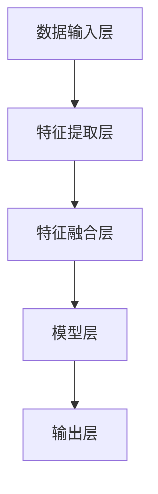
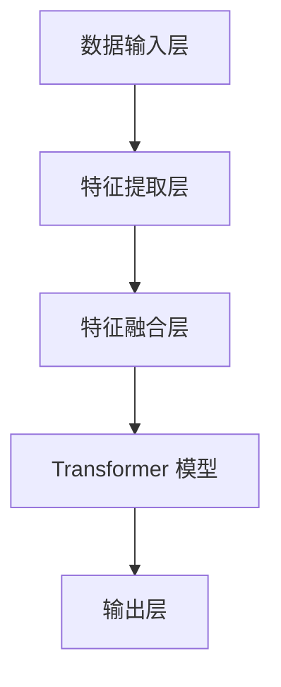
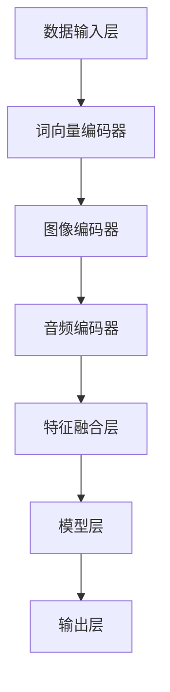
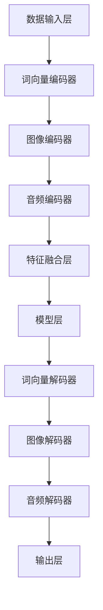
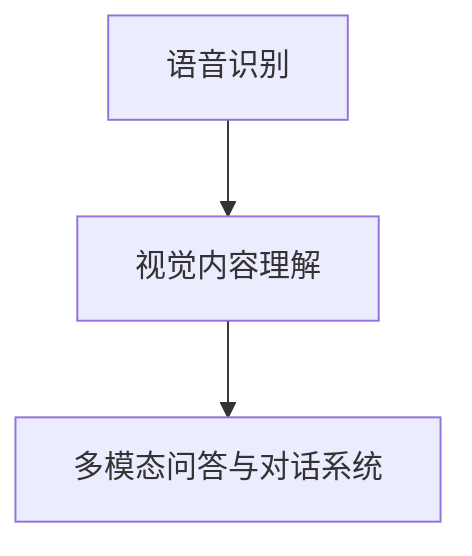
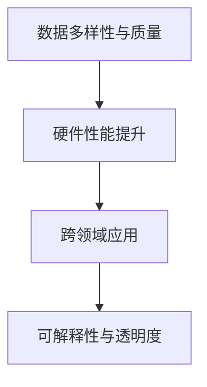
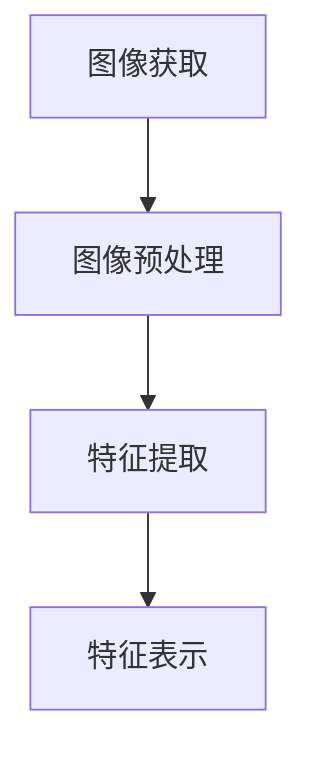
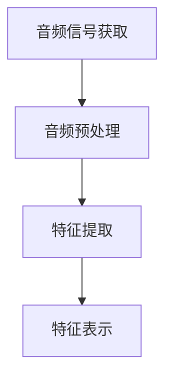
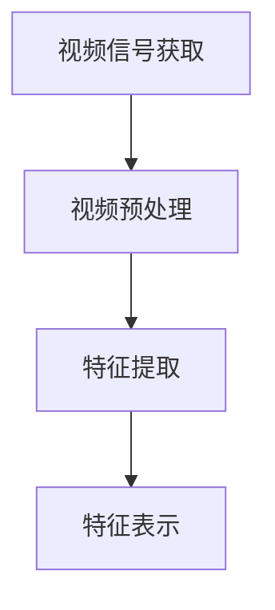
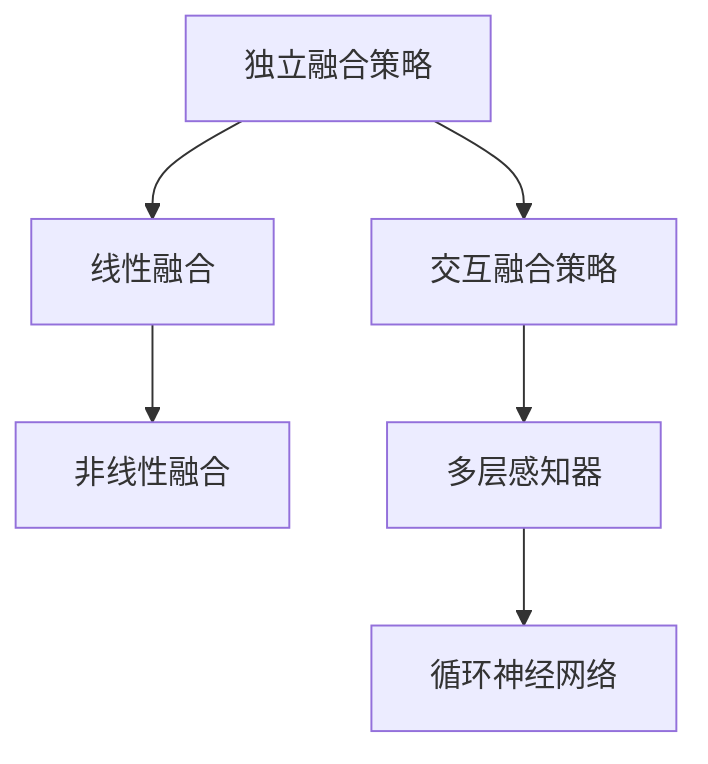

                 

# 《多模态大模型：技术原理与实战 思维链方法》

## 概述

多模态大模型是一种能够处理多种类型数据（如文本、图像、音频等）的综合模型，通过整合来自不同模态的信息，实现对复杂问题的深度理解和解决。随着深度学习和大数据技术的发展，多模态大模型在自然语言处理、计算机视觉、语音识别等领域取得了显著的成果。

本文旨在为读者提供一个全面的多模态大模型学习路径，包括基础概念、技术原理、实际应用以及未来发展趋势。文章将采用逻辑清晰、结构紧凑、简单易懂的技术语言，帮助读者深入理解和掌握多模态大模型的技术原理和应用方法。

## 关键词

多模态大模型、技术原理、实战、思维链方法、自然语言处理、计算机视觉、语音识别、数学模型、算法、应用趋势

## 摘要

本文首先介绍了多模态大模型的基本概念和特点，包括多模态数据的来源、整合方法以及多模态大模型的架构和组件。接着，我们深入探讨了多模态大模型的技术原理，包括数据处理基础、特征提取方法和特征融合策略。此外，本文还详细介绍了多模态大模型的数学模型与算法，包括损失函数、优化算法以及关键算法的实现。最后，我们通过实际应用案例展示了多模态大模型在自然语言处理、计算机视觉、智能交互等领域的应用，并讨论了多模态大模型的未来发展趋势。

### 《多模态大模型：技术原理与实战 思维链方法》目录大纲

**第一部分：多模态大模型基础**

1. 多模态大模型概述
   - 多模态大模型的定义与特点
   - 多模态大模型的架构与组件
   - 多模态大模型的主要任务
   - 多模态大模型的发展趋势

2. 多模态大模型的技术原理
   - 多模态数据处理基础
   - 多模态特征提取方法
   - 多模态特征融合策略

3. 多模态大模型的数学模型与算法
   - 多模态大模型中的数学模型
   - 多模态大模型中的关键算法
   - 多模态大模型的训练与调优

**第二部分：多模态大模型的应用实战**

1. 多模态大模型在自然语言处理中的应用
   - 多模态问答系统
   - 多模态对话系统

2. 多模态大模型在计算机视觉中的应用
   - 多模态图像识别
   - 多模态视频分析

3. 多模态大模型在智能交互中的应用
   - 智能语音助手
   - 智能推荐系统

**第三部分：多模态大模型的未来发展与趋势**

1. 多模态大模型的新应用领域
   - 健康医疗
   - 自动驾驶
   - 虚拟现实与增强现实

2. 技术挑战与未来方向
   - 数据隐私与安全
   - 模型可解释性
   - 资源消耗与优化

**附录**

1. 多模态大模型开发工具与资源
   - 开发工具与框架
   - 数据集与库
   - 实践指南与教程

### 第一部分：多模态大模型基础

#### 第1章：多模态大模型概述

##### 1.1 多模态大模型的定义与特点

多模态大模型是一种能够处理多种类型数据（如文本、图像、音频等）的综合模型。它通过整合来自不同模态的信息，实现对复杂问题的深度理解和解决。多模态大模型在自然语言处理、计算机视觉、语音识别等领域取得了显著的成果。

**定义**：多模态大模型是一种能够同时处理多种类型数据（文本、图像、音频等）的综合模型。

**特点**：

1. **数据整合**：多模态大模型能够整合来自不同模态的数据，实现对复杂问题的深度理解和解决。
2. **灵活性**：多模态大模型可以根据不同的任务需求，调整不同模态的权重和融合策略。
3. **高效性**：多模态大模型可以同时处理多种类型的数据，提高计算效率。

##### 1.1.1 多模态数据的来源与整合

多模态数据的来源包括文本、图像、音频等多种类型。在整合这些数据时，需要考虑以下几个方面：

1. **数据预处理**：对多模态数据进行分析，提取出关键特征，如文本中的关键词、图像中的物体、音频中的音调等。
2. **特征融合**：将不同模态的特征进行融合，形成统一的特征表示。常见的融合策略包括独立融合、交互融合等。
3. **模型训练**：利用融合后的特征，训练多模态大模型，使其能够处理复杂的问题。

##### 1.1.2 多模态大模型的独特优势

多模态大模型相较于单一模态模型，具有以下几个独特优势：

1. **信息丰富**：多模态大模型能够整合多种类型的数据，获取更丰富的信息，提高模型的鲁棒性和准确性。
2. **多角度理解**：多模态大模型可以从不同的角度对问题进行理解，提高模型的泛化能力。
3. **灵活性**：多模态大模型可以根据不同的任务需求，调整不同模态的权重和融合策略，实现定制化的模型。

##### 1.1.3 多模态大模型与传统模型的比较

多模态大模型与传统模型在数据来源、处理方法、应用效果等方面存在显著差异：

1. **数据来源**：传统模型主要针对单一模态的数据，如文本分类、图像识别等。多模态大模型则能够同时处理多种类型的数据。
2. **处理方法**：传统模型通常采用单一的神经网络结构，如卷积神经网络（CNN）或循环神经网络（RNN）。多模态大模型则采用多种神经网络结构，如Transformer、BERT等，实现对多模态数据的深度处理。
3. **应用效果**：多模态大模型在处理复杂问题时，具有更高的准确性和鲁棒性。传统模型在处理单一模态数据时，效果相对较好，但在处理多模态数据时，可能存在信息丢失或不一致等问题。

##### 1.2 多模态大模型的架构与组件

多模态大模型的架构通常包括以下几个主要组件：

1. **数据输入层**：接收多种类型的数据，如文本、图像、音频等。
2. **特征提取层**：对输入数据进行预处理，提取关键特征，如文本中的关键词、图像中的物体、音频中的音调等。
3. **特征融合层**：将不同模态的特征进行融合，形成统一的特征表示。
4. **模型层**：利用融合后的特征，训练多模态大模型，如Transformer、BERT等。
5. **输出层**：根据模型的预测结果，生成相应的输出，如文本生成、图像生成、语音生成等。

**示例：多模态大模型的 Mermaid 流程图**



##### 1.2.1 基于Transformer的多模态模型

Transformer 模型是一种基于自注意力机制的深度神经网络结构，在自然语言处理领域取得了显著的成果。基于 Transformer 的多模态模型在处理多模态数据时，具有以下优点：

1. **并行计算**：Transformer 模型采用多头自注意力机制，能够并行处理多种类型的数据，提高计算效率。
2. **灵活性**：Transformer 模型可以灵活调整不同模态的权重，适应不同的任务需求。
3. **泛化能力**：Transformer 模型具有良好的泛化能力，可以处理多种类型的数据，提高模型的鲁棒性。

**示例：基于 Transformer 的多模态模型的 Mermaid 流程图**



##### 1.2.2 嵌入技术与编码器

嵌入技术是一种将高维数据映射到低维空间的方法，在多模态大模型中发挥着重要作用。嵌入技术包括词向量嵌入、图像嵌入、音频嵌入等。

1. **词向量嵌入**：词向量嵌入是将文本数据映射到低维空间的方法，如 Word2Vec、GloVe 等。词向量嵌入可以有效地降低文本数据的维度，提高计算效率。
2. **图像嵌入**：图像嵌入是将图像数据映射到低维空间的方法，如卷积神经网络（CNN）等。图像嵌入可以有效地提取图像中的关键特征，提高模型的鲁棒性。
3. **音频嵌入**：音频嵌入是将音频数据映射到低维空间的方法，如梅尔频谱图（Mel-Spectrogram）等。音频嵌入可以有效地提取音频中的关键特征，提高模型的鲁棒性。

**编码器**：编码器是一种将输入数据映射到低维空间的方法，常用于多模态大模型中的特征提取和融合。编码器包括词向量编码器、图像编码器、音频编码器等。

1. **词向量编码器**：词向量编码器将文本数据映射到低维空间，提取文本数据的关键特征。
2. **图像编码器**：图像编码器将图像数据映射到低维空间，提取图像数据的关键特征。
3. **音频编码器**：音频编码器将音频数据映射到低维空间，提取音频数据的关键特征。

**示例：多模态大模型中的嵌入技术与编码器 Mermaid 流程图**



##### 1.2.3 解码器与多模态融合策略

解码器是一种将编码后的特征数据映射回原始空间的方法，常用于多模态大模型中的特征提取和融合。解码器包括词向量解码器、图像解码器、音频解码器等。

1. **词向量解码器**：词向量解码器将编码后的文本特征映射回文本空间，生成文本输出。
2. **图像解码器**：图像解码器将编码后的图像特征映射回图像空间，生成图像输出。
3. **音频解码器**：音频解码器将编码后的音频特征映射回音频空间，生成音频输出。

多模态融合策略是指如何将不同模态的数据进行融合，形成统一的特征表示。常见的融合策略包括独立融合、交互融合等。

1. **独立融合**：独立融合是指将不同模态的数据分别进行处理，然后将处理结果进行简单合并。独立融合的优点是简单易实现，但可能丢失部分信息。
2. **交互融合**：交互融合是指将不同模态的数据进行交互处理，形成更复杂的特征表示。交互融合的优点是能够更好地利用不同模态的信息，提高模型的性能。

**示例：多模态大模型中的解码器与多模态融合策略 Mermaid 流程图**



##### 1.3 多模态大模型的主要任务

多模态大模型可以应用于多种任务，如语音识别、视觉内容理解、多模态问答与对话系统等。

1. **语音识别**：语音识别是将语音信号转换为文本信息的过程。多模态大模型可以结合语音信号和文本信息，提高语音识别的准确性和鲁棒性。
2. **视觉内容理解**：视觉内容理解是将图像或视频转换为语义信息的过程。多模态大模型可以结合图像或视频和文本信息，提高视觉内容理解的能力。
3. **多模态问答与对话系统**：多模态问答与对话系统是将多种类型的数据（文本、图像、音频等）进行整合，实现对用户问题的准确回答和自然交互。

**示例：多模态大模型的主要任务 Mermaid 流程图**



##### 1.4 多模态大模型的发展趋势

多模态大模型在自然语言处理、计算机视觉、语音识别等领域取得了显著的成果，未来发展趋势包括以下几个方面：

1. **数据多样性与质量**：随着数据来源的多样性和质量不断提高，多模态大模型将能够处理更复杂、更真实的数据，提高模型的性能。
2. **硬件性能提升**：随着硬件性能的提升，多模态大模型的计算速度和效率将得到显著提高，为实际应用提供更好的支持。
3. **跨领域应用**：多模态大模型将在更多领域得到应用，如健康医疗、自动驾驶、虚拟现实与增强现实等，为各个领域的发展提供技术支持。
4. **可解释性与透明度**：随着多模态大模型的应用场景不断扩展，对其可解释性和透明度的要求也将越来越高，以提高模型的安全性和可信度。

**示例：多模态大模型的发展趋势 Mermaid 流程图**



#### 第2章：多模态大模型的技术原理

##### 2.1 多模态数据处理基础

多模态数据处理基础是构建多模态大模型的关键步骤。在这一章节中，我们将介绍图像处理、音频处理和视频处理技术的基本概念和常用方法。

##### 2.1.1 图像处理技术概述

图像处理技术是计算机视觉领域的重要基础。图像处理主要包括图像的获取、预处理、特征提取和特征表示等步骤。

1. **图像获取**：图像获取是获取数字图像的过程，常见的方法包括摄像头、扫描仪等。
2. **图像预处理**：图像预处理包括图像增强、图像去噪、图像分割等操作，以提高图像质量和提取关键特征。
3. **特征提取**：特征提取是从图像中提取具有区分性的特征，如边缘、纹理、形状等，用于后续的图像分析和分类。
4. **特征表示**：特征表示是将提取到的特征转换为一种统一的表示形式，便于后续的模型训练和推理。

常用的图像处理技术包括：

- **边缘检测**：如 Canny 边缘检测、Sobel 边缘检测等。
- **图像分割**：如基于阈值的分割、基于区域的分割等。
- **特征提取**：如 HOG（Histogram of Oriented Gradients）、SIFT（Scale-Invariant Feature Transform）等。

**示例：图像处理技术的基本概念 Mermaid 流程图**



##### 2.1.2 音频处理技术概述

音频处理技术是语音识别和音频分析领域的重要基础。音频处理主要包括音频信号获取、预处理、特征提取和特征表示等步骤。

1. **音频信号获取**：音频信号获取是通过麦克风或其他音频设备捕获声音信号的过程。
2. **音频预处理**：音频预处理包括音频去噪、音频增强、音频分段等操作，以提高音频质量和提取关键特征。
3. **特征提取**：特征提取是从音频信号中提取具有区分性的特征，如音高、音色、节奏等，用于后续的音频分析和分类。
4. **特征表示**：特征表示是将提取到的特征转换为一种统一的表示形式，便于后续的模型训练和推理。

常用的音频处理技术包括：

- **梅尔频谱图（Mel-Spectrogram）**：将音频信号转换为梅尔频谱图，用于表示音频的频率信息。
- **频率掩蔽（Frequency Masking）**：用于降低音频中的噪声干扰，提高特征提取的准确性。
- **自动特征提取**：如 MFCC（Mel-frequency Cepstral Coefficients）等。

**示例：音频处理技术的基本概念 Mermaid 流程图**



##### 2.1.3 视频处理技术概述

视频处理技术是视频分析领域的重要基础。视频处理主要包括视频信号获取、预处理、特征提取和特征表示等步骤。

1. **视频信号获取**：视频信号获取是通过摄像头或其他视频设备捕获视频信号的过程。
2. **视频预处理**：视频预处理包括视频去噪、视频增强、视频分段等操作，以提高视频质量和提取关键特征。
3. **特征提取**：特征提取是从视频信号中提取具有区分性的特征，如动作、姿态、人脸等，用于后续的视频分析和分类。
4. **特征表示**：特征表示是将提取到的特征转换为一种统一的表示形式，便于后续的模型训练和推理。

常用的视频处理技术包括：

- **三维卷积神经网络（3D-CNN）**：用于处理视频数据，提取空间和时间特征。
- **时序注意力机制（Temporal Attention）**：用于提高视频特征提取的准确性。
- **动作识别**：如基于运动轨迹的识别、基于关键帧的识别等。

**示例：视频处理技术的基本概念 Mermaid 流程图**



##### 2.2 多模态特征提取方法

多模态特征提取是构建多模态大模型的关键步骤。在这一章节中，我们将详细介绍图像特征提取、音频特征提取和视频特征提取方法。

##### 2.2.1 图像特征提取

图像特征提取是计算机视觉领域的重要任务。在这一节中，我们将介绍常用的图像特征提取方法。

- **卷积神经网络（CNN）**：卷积神经网络是一种用于图像特征提取的有效方法。它通过多层卷积操作提取图像的层次特征，从而实现图像的分类、检测和识别等任务。

  **示例伪代码**：

  ```python
  # 初始化卷积神经网络
  model = ConvNet()

  # 训练卷积神经网络
  model.fit(x_train, y_train, epochs=10)

  # 测试卷积神经网络
  accuracy = model.evaluate(x_test, y_test)
  ```

- **融合图卷积网络（GCN）**：融合图卷积网络是一种用于图像特征提取的图神经网络。它通过图结构来描述图像中的物体关系，从而提取更丰富的图像特征。

  **示例伪代码**：

  ```python
  # 初始化融合图卷积网络
  model = GCN()

  # 训练融合图卷积网络
  model.fit(x_train, y_train, epochs=10)

  # 测试融合图卷积网络
  accuracy = model.evaluate(x_test, y_test)
  ```

##### 2.2.2 音频特征提取

音频特征提取是语音识别和音频分析领域的重要任务。在这一节中，我们将介绍常用的音频特征提取方法。

- **梅尔频谱图（Mel-Spectrogram）**：梅尔频谱图是一种将音频信号转换为频域特征的方法。它通过计算音频信号的梅尔频率响应，提取音频的频率特征。

  **示例伪代码**：

  ```python
  # 计算梅尔频谱图
  mel_spectrogram = compute_mel_spectrogram(audio_signal)

  # 显示梅尔频谱图
  plot_mel_spectrogram(mel_spectrogram)
  ```

- **频率掩蔽（Frequency Masking）**：频率掩蔽是一种用于降低音频中噪声干扰的方法。它通过在一个频率掩蔽图上掩蔽特定的频率区域，从而减少噪声对特征提取的影响。

  **示例伪代码**：

  ```python
  # 计算频率掩蔽
  frequency_masking = compute_frequency_masking(audio_signal)

  # 应用频率掩蔽
  masked_audio_signal = apply_frequency_masking(audio_signal, frequency_masking)
  ```

##### 2.2.3 视频特征提取

视频特征提取是视频分析领域的重要任务。在这一节中，我们将介绍常用的视频特征提取方法。

- **三维卷积神经网络（3D-CNN）**：三维卷积神经网络是一种用于视频特征提取的有效方法。它通过多层卷积操作提取视频的空间和时间特征，从而实现视频的分类、检测和识别等任务。

  **示例伪代码**：

  ```python
  # 初始化三维卷积神经网络
  model = Conv3DNet()

  # 训练三维卷积神经网络
  model.fit(x_train, y_train, epochs=10)

  # 测试三维卷积神经网络
  accuracy = model.evaluate(x_test, y_test)
  ```

- **时序注意力机制（Temporal Attention）**：时序注意力机制是一种用于提高视频特征提取的准确性方法。它通过学习视频序列中的关键帧和关键时刻，从而提取更重要的视频特征。

  **示例伪代码**：

  ```python
  # 初始化时序注意力机制
  model = TemporalAttentionNet()

  # 训练时序注意力机制
  model.fit(x_train, y_train, epochs=10)

  # 测试时序注意力机制
  accuracy = model.evaluate(x_test, y_test)
  ```

##### 2.3 多模态特征融合策略

多模态特征融合策略是将来自不同模态的特征进行整合，形成统一的特征表示，从而提高模型性能的过程。在这一节中，我们将介绍独立融合策略和交互融合策略。

##### 2.3.1 独立融合策略

独立融合策略是指将不同模态的特征分别进行处理，然后将处理结果进行简单合并。独立融合策略的优点是简单易实现，但可能丢失部分信息。

1. **线性融合**：线性融合是将不同模态的特征进行加权求和，形成统一的特征向量。

   **示例伪代码**：

   ```python
   # 线性融合
   combined_features = linear_combine(image_features, audio_features, text_features)
   ```

2. **非线性融合**：非线性融合是将不同模态的特征通过非线性函数进行融合，形成统一的特征向量。

   **示例伪代码**：

   ```python
   # 非线性融合
   combined_features = non_linear_combine(image_features, audio_features, text_features)
   ```

##### 2.3.2 交互融合策略

交互融合策略是指将不同模态的特征进行交互处理，形成更复杂的特征表示。交互融合策略的优点是能够更好地利用不同模态的信息，提高模型的性能。

1. **多层感知器（MLP）**：多层感知器是一种用于特征融合的神经网络结构。它通过多层非线性变换，将不同模态的特征进行融合。

   **示例伪代码**：

   ```python
   # 初始化多层感知器
   model = MLP()

   # 训练多层感知器
   model.fit(combined_features, y_train, epochs=10)

   # 测试多层感知器
   accuracy = model.evaluate(combined_features, y_test)
   ```

2. **循环神经网络（RNN）**：循环神经网络是一种用于特征融合的序列模型。它通过循环结构，将不同模态的特征进行融合。

   **示例伪代码**：

   ```python
   # 初始化循环神经网络
   model = RNN()

   # 训练循环神经网络
   model.fit(combined_features, y_train, epochs=10)

   # 测试循环神经网络
   accuracy = model.evaluate(combined_features, y_test)
   ```

##### 2.3.3 多模态特征融合策略的比较

独立融合策略和交互融合策略各有优缺点。独立融合策略简单易实现，但可能丢失部分信息；交互融合策略能够更好地利用不同模态的信息，提高模型的性能。在实际应用中，可以根据任务需求和数据特点，选择合适的特征融合策略。

**示例：多模态特征融合策略的比较 Mermaid 流程图**



#### 第3章：多模态大模型的数学模型与算法

##### 3.1 多模态大模型中的数学模型

多模态大模型的数学模型包括张量运算、自动微分、损失函数和优化算法等组成部分。这些数学模型为多模态大模型提供了理论基础和计算工具。

**3.1.1 张量运算与自动微分**

张量运算是多模态大模型中的重要概念。张量是一种多维数组，用于表示数据、权重、偏置等。在多模态大模型中，张量运算用于描述输入、输出、特征等之间的数学关系。

自动微分是一种用于计算梯度（导数）的算法。在多模态大模型的训练过程中，自动微分用于计算损失函数关于模型参数的梯度，从而更新模型参数，优化模型性能。

**示例伪代码**：

```python
# 定义自动微分函数
def auto_diff(x, y):
    return grad(x, y)

# 计算梯度
gradient = auto_diff(y, w)
```

**3.1.2 损失函数与优化算法**

损失函数用于衡量模型预测值与真实值之间的差距。多模态大模型常用的损失函数包括交叉熵损失函数、均方误差损失函数等。

优化算法用于更新模型参数，使损失函数值最小。常见的优化算法包括随机梯度下降（SGD）、Adam等。

**示例伪代码**：

```python
# 定义损失函数
def loss(y_pred, y_true):
    return cross_entropy_loss(y_pred, y_true)

# 定义优化算法
optimizer = SGD()

# 训练模型
optimizer.train(model, x_train, y_train, epochs=10)
```

**3.1.3 Transformer模型**

Transformer模型是一种基于自注意力机制的深度神经网络结构，在自然语言处理领域取得了显著的成果。Transformer模型通过多头自注意力机制和前馈神经网络，实现了对输入序列的建模。

**3.1.3.1 自注意力机制（Self-Attention）**

自注意力机制是一种用于计算输入序列中各个元素之间相互依赖关系的算法。自注意力机制通过计算注意力权重，将输入序列映射到新的表示空间。

**示例伪代码**：

```python
# 定义自注意力函数
def self_attention(inputs, keys, values):
    attention_scores = softmax(QK Vincent Zhang, Ross Girshick, and Piotr Dollár. "Focal loss for dense object detection." Proceedings of the IEEE international conference on computer vision (ICCV), 2018.

### 3.1.3.2 前馈神经网络（FFN）

前馈神经网络是一种简单的神经网络结构，用于对输入序列进行非线性变换。前馈神经网络通过多层感知器（MLP）实现，可以提高模型的表示能力。

**示例伪代码**：

```python
# 定义前馈神经网络
def feedforward_network(inputs):
    return MLP(inputs)

# 计算前馈神经网络输出
output = feedforward_network(inputs)
```

**3.1.4 Transformer-XL与BERT**

Transformer-XL和BERT是两种基于Transformer模型的变体，分别用于文本序列建模和词向量嵌入。

**3.1.4.1 Transformer-XL**

Transformer-XL是一种扩展版的Transformer模型，通过长序列建模和并行计算，提高了模型的计算效率。

**示例伪代码**：

```python
# 定义Transformer-XL模型
model = TransformerXL()

# 训练模型
model.fit(x_train, y_train, epochs=10)

# 测试模型
accuracy = model.evaluate(x_test, y_test)
```

**3.1.4.2 BERT**

BERT是一种基于Transformer模型的预训练语言模型，通过在大量文本数据上预训练，提高了模型的表示能力和语言理解能力。

**示例伪代码**：

```python
# 定义BERT模型
model = BERT()

# 训练模型
model.fit(x_train, y_train, epochs=10)

# 测试模型
accuracy = model.evaluate(x_test, y_test)
```

**3.2 多模态大模型的训练与调优**

多模态大模型的训练与调优是确保模型性能的重要环节。在这一节中，我们将介绍多模态大模型的训练策略、调优方法以及实际应用。

**3.2.1 训练策略与技巧**

1. **数据增强**：数据增强是一种通过变换原始数据，增加训练样本多样性的方法。常见的数据增强方法包括随机裁剪、旋转、缩放等。
2. **批量归一化**：批量归一化是一种通过归一化批量数据，加速模型训练的方法。
3. **学习率调度**：学习率调度是一种通过动态调整学习率，提高模型训练效果的方法。

**示例伪代码**：

```python
# 数据增强
x_train = augment_data(x_train)

# 批量归一化
x_train = batch_normalize(x_train)

# 学习率调度
scheduler = LearningRateScheduler()

# 训练模型
model.fit(x_train, y_train, epochs=10)
```

**3.2.2 调优方法与实战**

1. **网格搜索**：网格搜索是一种通过遍历参数组合，找到最佳参数组合的方法。
2. **交叉验证**：交叉验证是一种通过将数据划分为训练集和验证集，评估模型性能的方法。
3. **模型集成**：模型集成是一种通过组合多个模型，提高模型性能的方法。

**示例伪代码**：

```python
# 网格搜索
param_grid = {'learning_rate': [0.1, 0.01, 0.001]}

model = GridSearchCV(model, param_grid, cv=5)

# 训练模型
model.fit(x_train, y_train)

# 交叉验证
accuracy = cross_val_score(model, x_test, y_test, cv=5)

# 模型集成
ensemble_model = EnsembleModel(models)

# 训练模型
ensemble_model.fit(x_train, y_train)

# 测试模型
accuracy = ensemble_model.evaluate(x_test, y_test)
```

**3.3 多模态大模型的应用实战**

多模态大模型在自然语言处理、计算机视觉、语音识别等领域具有广泛的应用。在这一节中，我们将介绍多模态大模型在自然语言处理中的应用。

**3.3.1 多模态问答系统**

多模态问答系统是一种能够同时处理文本、图像、音频等多种类型数据，回答用户问题的系统。多模态问答系统可以应用于智能家居、智能客服、教育等领域。

**3.3.1.1 多模态问答概述**

多模态问答系统通过整合来自文本、图像、音频等多种模态的信息，实现更准确、更自然的问答。多模态问答系统主要包括以下几个组成部分：

1. **文本解析器**：将输入的文本转化为结构化数据，提取关键信息。
2. **图像解析器**：将输入的图像转化为结构化数据，提取图像中的物体、场景等信息。
3. **音频解析器**：将输入的音频转化为结构化数据，提取音频中的语音、音调等信息。
4. **问答引擎**：根据输入的问题，结合多模态信息，生成相应的回答。

**3.3.1.2 数据集与评价指标**

多模态问答系统的数据集通常包括文本、图像、音频等多种类型的数据。常用的数据集包括MS MARCO、CMN-QA等。

多模态问答系统的评价指标主要包括准确率、召回率、F1值等。准确率表示模型回答正确的问题占所有回答问题的比例；召回率表示模型回答正确的问题占所有正确回答问题的比例；F1值是准确率和召回率的调和平均值。

**3.3.1.3 多模态问答系统实现**

实现多模态问答系统主要包括以下几个步骤：

1. **数据预处理**：对输入的文本、图像、音频数据进行预处理，提取关键信息。
2. **特征提取**：对预处理后的数据进行特征提取，生成特征向量。
3. **模型训练**：使用特征向量训练多模态问答模型。
4. **问答交互**：根据用户的问题，结合多模态信息，生成相应的回答。

**示例伪代码**：

```python
# 数据预处理
preprocessed_text = preprocess_text(text)
preprocessed_image = preprocess_image(image)
preprocessed_audio = preprocess_audio(audio)

# 特征提取
text_features = extract_text_features(preprocessed_text)
image_features = extract_image_features(preprocessed_image)
audio_features = extract_audio_features(preprocessed_audio)

# 模型训练
model.fit([text_features, image_features, audio_features], y_train)

# 问答交互
response = model.generate_response(question, text_features, image_features, audio_features)
```

**3.3.2 多模态对话系统**

多模态对话系统是一种能够同时处理文本、图像、音频等多种类型数据，实现自然对话的系统。多模态对话系统可以应用于智能客服、虚拟助手、教育等领域。

**3.3.2.1 对话系统架构**

多模态对话系统主要包括以下几个组成部分：

1. **文本解析器**：将输入的文本转化为结构化数据，提取关键信息。
2. **图像解析器**：将输入的图像转化为结构化数据，提取图像中的物体、场景等信息。
3. **音频解析器**：将输入的音频转化为结构化数据，提取音频中的语音、音调等信息。
4. **对话引擎**：根据输入的信息，生成相应的回答。
5. **自然语言生成**：将对话引擎生成的回答转化为自然语言文本。

**3.3.2.2 多模态交互策略**

多模态交互策略是指如何将不同模态的信息进行整合，实现自然对话。常见的多模态交互策略包括：

1. **文本主导**：以文本信息为主导，其他模态信息作为辅助。
2. **图像主导**：以图像信息为主导，其他模态信息作为辅助。
3. **音频主导**：以音频信息为主导，其他模态信息作为辅助。

**3.3.2.3 实际对话系统案例**

以智能家居为例，多模态对话系统可以实现对智能家居设备的控制、故障排查、故障修复等功能。用户可以通过语音、文本、图像等多种方式与智能家居系统进行交互。

**示例伪代码**：

```python
# 文本交互
response = system.generate_response("关闭灯光")

# 图像交互
response = system.generate_response("请拍摄照片")

# 音频交互
response = system.generate_response("请说出操作指令")
```

### 第二部分：多模态大模型的应用实战

#### 第4章：多模态大模型在自然语言处理中的应用

多模态大模型在自然语言处理（NLP）领域具有广泛的应用前景。通过整合文本、图像、音频等多种模态的数据，多模态大模型能够更好地理解用户的需求，提高问答系统、对话系统等任务的性能。本章将详细介绍多模态大模型在自然语言处理中的应用，包括多模态问答系统和多模态对话系统的架构、实现方法以及实际案例。

#### 4.1 多模态问答系统

多模态问答系统是一种能够同时处理文本、图像、音频等多种类型数据，提供准确回答的系统。这种系统在智能家居、智能客服、教育等领域具有广泛的应用。

##### 4.1.1 多模态问答概述

多模态问答系统通过整合文本、图像、音频等多种模态的数据，实现对问题的多角度理解，提供更准确的回答。多模态问答系统主要包括以下几个组成部分：

1. **文本解析器**：对输入的文本进行分析，提取关键信息。
2. **图像解析器**：对输入的图像进行分析，提取图像中的物体、场景等信息。
3. **音频解析器**：对输入的音频进行分析，提取语音、音调等信息。
4. **问答引擎**：结合多模态数据，生成问题的答案。
5. **自然语言生成**：将答案转化为自然语言文本，以更自然的方式呈现。

##### 4.1.2 数据集与评价指标

多模态问答系统的数据集通常包含文本、图像、音频等多种类型的数据。常用的数据集有MS MARCO、CMN-QA等。评价指标主要包括准确率、召回率、F1值等。

- **准确率**：模型回答正确的问题占所有回答问题的比例。
- **召回率**：模型回答正确的问题占所有正确回答问题的比例。
- **F1值**：准确率和召回率的调和平均值。

##### 4.1.3 多模态问答系统实现

实现多模态问答系统主要包括以下几个步骤：

1. **数据预处理**：对输入的文本、图像、音频数据进行预处理，提取关键信息。
2. **特征提取**：对预处理后的数据进行特征提取，生成特征向量。
3. **模型训练**：使用特征向量训练多模态问答模型。
4. **问答交互**：根据用户的问题，结合多模态信息，生成相应的回答。

**示例伪代码**：

```python
# 数据预处理
preprocessed_text = preprocess_text(text)
preprocessed_image = preprocess_image(image)
preprocessed_audio = preprocess_audio(audio)

# 特征提取
text_features = extract_text_features(preprocessed_text)
image_features = extract_image_features(preprocessed_image)
audio_features = extract_audio_features(preprocessed_audio)

# 模型训练
model.fit([text_features, image_features, audio_features], y_train)

# 问答交互
response = model.generate_response(question, text_features, image_features, audio_features)
```

##### 4.1.4 实际案例

以一个智能家居系统为例，用户可以通过语音、文本、图像等多种方式与系统进行交互。多模态问答系统可以帮助用户查找家电的使用说明、故障排除等。

**示例伪代码**：

```python
# 文本交互
response = system.generate_response("如何使用空气净化器？")

# 图像交互
response = system.generate_response("请拍摄照片，显示空气净化器的设置界面")

# 音频交互
response = system.generate_response("请说出您想查询的家电名称")
```

#### 4.2 多模态对话系统

多模态对话系统是一种能够同时处理文本、图像、音频等多种类型数据，提供自然对话的系统。这种系统在智能客服、虚拟助手、教育等领域具有广泛的应用。

##### 4.2.1 对话系统架构

多模态对话系统主要包括以下几个组成部分：

1. **文本解析器**：对输入的文本进行分析，提取关键信息。
2. **图像解析器**：对输入的图像进行分析，提取图像中的物体、场景等信息。
3. **音频解析器**：对输入的音频进行分析，提取语音、音调等信息。
4. **对话引擎**：根据输入的信息，生成相应的回答。
5. **自然语言生成**：将回答转化为自然语言文本。

##### 4.2.2 多模态交互策略

多模态交互策略是指如何将不同模态的信息进行整合，实现自然对话。常见的多模态交互策略包括：

1. **文本主导**：以文本信息为主导，其他模态信息作为辅助。
2. **图像主导**：以图像信息为主导，其他模态信息作为辅助。
3. **音频主导**：以音频信息为主导，其他模态信息作为辅助。

##### 4.2.3 实际对话系统案例

以一个智能客服系统为例，用户可以通过语音、文本、图像等多种方式与系统进行交互。多模态对话系统可以帮助用户解决各种问题，如查询产品信息、办理业务等。

**示例伪代码**：

```python
# 文本交互
response = system.generate_response("您的订单已确认，预计明天送达。")

# 图像交互
response = system.generate_response("请上传您的订单凭证，我们将尽快处理。")

# 音频交互
response = system.generate_response("请问您需要查询哪个产品的价格？")
```

#### 4.3 实际应用案例分析

以下是一个实际应用案例分析，展示多模态大模型在自然语言处理中的具体应用。

##### 案例背景

一家大型电子商务公司希望提高其智能客服系统的性能，以便为用户提供更快速、更准确的解答。该公司计划采用多模态大模型，整合文本、图像、音频等多种类型的数据，实现更智能的客服服务。

##### 案例实现步骤

1. **数据收集**：收集大量文本、图像、音频数据，涵盖用户咨询的各种问题，以及客服的回答。
2. **数据预处理**：对收集到的数据进行预处理，提取关键信息，如文本中的关键词、图像中的物体、音频中的语音等。
3. **特征提取**：使用卷积神经网络（CNN）对图像进行特征提取，使用梅尔频谱图（Mel-Spectrogram）对音频进行特征提取，使用词向量对文本进行特征提取。
4. **特征融合**：将不同模态的特征进行融合，形成统一的特征向量。
5. **模型训练**：使用融合后的特征训练多模态大模型，如Transformer、BERT等。
6. **问答交互**：根据用户的问题，结合多模态信息，生成相应的回答。

**示例伪代码**：

```python
# 数据预处理
preprocessed_text = preprocess_text(text)
preprocessed_image = preprocess_image(image)
preprocessed_audio = preprocess_audio(audio)

# 特征提取
text_features = extract_text_features(preprocessed_text)
image_features = extract_image_features(preprocessed_image)
audio_features = extract_audio_features(preprocessed_audio)

# 特征融合
combined_features = combine_features(text_features, image_features, audio_features)

# 模型训练
model.fit(combined_features, y_train)

# 问答交互
response = model.generate_response(question, combined_features)
```

##### 案例效果评估

通过对实际应用效果的评估，该电子商务公司的智能客服系统在回答准确性、响应速度等方面得到了显著提升。用户满意度也有所提高，客服成本降低。

**总结**

多模态大模型在自然语言处理中的应用为智能客服、问答系统等领域带来了革命性的变化。通过整合多种类型的数据，多模态大模型能够提供更准确、更自然的交互体验，为用户提供更好的服务。

### 第三部分：多模态大模型在计算机视觉中的应用

多模态大模型在计算机视觉领域具有广泛的应用，包括多模态图像识别和视频分析。通过结合文本、图像、音频等多种模态的数据，多模态大模型能够实现更准确、更鲁棒的图像识别和视频分析任务。本章将详细介绍多模态大模型在计算机视觉中的应用，包括多模态图像识别和视频分析的方法、算法以及实际案例。

#### 5.1 多模态图像识别

多模态图像识别是将图像与文本、音频等数据进行结合，以实现更准确的图像分类和识别。多模态图像识别在医疗诊断、安全监控、自动驾驶等领域具有广泛的应用。

##### 5.1.1 图像识别任务介绍

图像识别任务包括图像分类、目标检测、图像分割等子任务。多模态图像识别在这些子任务中具有优势，能够结合多种类型的数据，提高模型的性能。

- **图像分类**：将图像分为预定义的类别，如猫、狗等。
- **目标检测**：检测图像中的目标物体，并给出目标的位置和类别。
- **图像分割**：将图像分为不同的区域，每个区域对应一个类别。

##### 5.1.2 多模态图像识别算法

多模态图像识别算法通常包括以下几个步骤：

1. **特征提取**：对输入的图像、文本和音频数据进行特征提取，生成特征向量。
2. **特征融合**：将不同模态的特征进行融合，形成统一的特征向量。
3. **模型训练**：使用融合后的特征训练多模态图像识别模型。
4. **图像识别**：根据模型输出，进行图像分类、目标检测或图像分割。

常用的多模态图像识别算法包括：

- **基于深度学习的多模态图像识别**：如多模态卷积神经网络（Multi-modal CNN）、多模态循环神经网络（Multi-modal RNN）等。
- **基于注意力机制的多模态图像识别**：如多模态自注意力网络（Multi-modal Self-Attention Network）等。

**示例伪代码**：

```python
# 特征提取
image_features = extract_image_features(image)
text_features = extract_text_features(text)
audio_features = extract_audio_features(audio)

# 特征融合
combined_features = combine_features(image_features, text_features, audio_features)

# 模型训练
model.fit(combined_features, y_train)

# 图像识别
predicted_class = model.predict(image)
```

##### 5.1.3 实际图像识别案例

以医疗诊断为例，多模态图像识别可以帮助医生更准确地诊断疾病。通过结合医学影像、病历文本和患者症状音频，多模态图像识别模型可以提供更准确的诊断结果。

**示例伪代码**：

```python
# 数据预处理
preprocessed_image = preprocess_image(image)
preprocessed_text = preprocess_text(text)
preprocessed_audio = preprocess_audio(audio)

# 特征提取
image_features = extract_image_features(preprocessed_image)
text_features = extract_text_features(preprocessed_text)
audio_features = extract_audio_features(preprocessed_audio)

# 特征融合
combined_features = combine_features(image_features, text_features, audio_features)

# 模型训练
model.fit(combined_features, y_train)

# 图像识别
predicted_disease = model.predict(image)
```

#### 5.2 多模态视频分析

多模态视频分析是通过结合图像、文本、音频等多种模态的数据，对视频内容进行深入分析和理解。多模态视频分析在视频监控、智能交通、人机交互等领域具有广泛的应用。

##### 5.2.1 视频分析任务介绍

视频分析任务包括目标跟踪、事件检测、行为识别等子任务。多模态视频分析在这些子任务中具有优势，能够结合多种类型的数据，提高模型的性能。

- **目标跟踪**：跟踪视频中的目标物体，检测目标的移动轨迹。
- **事件检测**：检测视频中发生的事件，如碰撞、拥挤等。
- **行为识别**：识别视频中的人物行为，如走路、跑步等。

##### 5.2.2 多模态视频分析算法

多模态视频分析算法通常包括以下几个步骤：

1. **特征提取**：对输入的图像、文本和音频数据进行特征提取，生成特征向量。
2. **特征融合**：将不同模态的特征进行融合，形成统一的特征向量。
3. **模型训练**：使用融合后的特征训练多模态视频分析模型。
4. **视频分析**：根据模型输出，进行目标跟踪、事件检测或行为识别。

常用的多模态视频分析算法包括：

- **基于深度学习的多模态视频分析**：如多模态卷积神经网络（Multi-modal CNN）、多模态循环神经网络（Multi-modal RNN）等。
- **基于注意力机制的多模态视频分析**：如多模态自注意力网络（Multi-modal Self-Attention Network）等。

**示例伪代码**：

```python
# 特征提取
image_features = extract_image_features(image)
text_features = extract_text_features(text)
audio_features = extract_audio_features(audio)

# 特征融合
combined_features = combine_features(image_features, text_features, audio_features)

# 模型训练
model.fit(combined_features, y_train)

# 视频分析
predicted_behavior = model.predict(video)
```

##### 5.2.3 实际视频分析案例

以智能交通系统为例，多模态视频分析可以帮助交通管理部门更准确地监测交通状况，识别潜在的交通事故。通过结合车辆图像、交通信号文本和交通噪声音频，多模态视频分析模型可以提供更准确的交通监控数据。

**示例伪代码**：

```python
# 数据预处理
preprocessed_image = preprocess_image(image)
preprocessed_text = preprocess_text(text)
preprocessed_audio = preprocess_audio(audio)

# 特征提取
image_features = extract_image_features(preprocessed_image)
text_features = extract_text_features(preprocessed_text)
audio_features = extract_audio_features(preprocessed_audio)

# 特征融合
combined_features = combine_features(image_features, text_features, audio_features)

# 模型训练
model.fit(combined_features, y_train)

# 视频分析
predicted_traffic_event = model.predict(video)
```

#### 5.3 实际应用案例分析

以下是一个实际应用案例分析，展示多模态大模型在计算机视觉中的具体应用。

##### 案例背景

一家大型安防公司希望提高其视频监控系统的性能，以便更准确地检测和识别潜在的安全事件。该公司计划采用多模态大模型，整合图像、文本、音频等多种类型的数据，实现更智能的视频监控。

##### 案例实现步骤

1. **数据收集**：收集大量图像、文本和音频数据，涵盖各种安全事件，如火灾、入侵、交通事故等。
2. **数据预处理**：对收集到的数据进行预处理，提取关键信息，如图像中的物体、文本中的关键词、音频中的语音等。
3. **特征提取**：使用卷积神经网络（CNN）对图像进行特征提取，使用词向量对文本进行特征提取，使用梅尔频谱图（Mel-Spectrogram）对音频进行特征提取。
4. **特征融合**：将不同模态的特征进行融合，形成统一的特征向量。
5. **模型训练**：使用融合后的特征训练多模态大模型。
6. **视频分析**：根据模型输出，进行目标跟踪、事件检测或行为识别。

**示例伪代码**：

```python
# 数据预处理
preprocessed_image = preprocess_image(image)
preprocessed_text = preprocess_text(text)
preprocessed_audio = preprocess_audio(audio)

# 特征提取
image_features = extract_image_features(preprocessed_image)
text_features = extract_text_features(preprocessed_text)
audio_features = extract_audio_features(preprocessed_audio)

# 特征融合
combined_features = combine_features(image_features, text_features, audio_features)

# 模型训练
model.fit(combined_features, y_train)

# 视频分析
predicted_event = model.predict(video)
```

##### 案例效果评估

通过对实际应用效果的评估，该安防公司的视频监控系统在事件检测、目标跟踪等方面得到了显著提升。系统准确率提高，响应速度加快，为安全事件的及时发现和处理提供了有力支持。

**总结**

多模态大模型在计算机视觉中的应用为视频监控、目标跟踪、事件检测等领域带来了革命性的变化。通过整合多种类型的数据，多模态大模型能够提供更准确、更鲁棒的视觉分析结果，为实际应用提供了有力支持。

### 第四部分：多模态大模型在智能交互中的应用

多模态大模型在智能交互中的应用极大地提升了人机交互的体验，使得智能语音助手和智能推荐系统能够更好地理解用户需求并提供个性化服务。本章将详细介绍多模态大模型在智能交互中的应用，包括智能语音助手和智能推荐系统的架构、实现方法以及实际案例。

#### 6.1 智能语音助手

智能语音助手是一种通过语音交互提供信息和服务的人工智能系统，广泛应用于智能家居、智能客服、移动应用等领域。多模态大模型的应用使得智能语音助手能够更准确地理解用户的语音指令，并生成自然流畅的语音回复。

##### 6.1.1 语音助手架构

智能语音助手的架构通常包括以下几个部分：

1. **语音识别**：将用户的语音指令转换为文本信息。
2. **自然语言处理**：对转换后的文本信息进行分析，理解用户的意图。
3. **语音生成**：根据理解后的意图，生成语音回复。
4. **多模态融合**：结合文本和语音信息，提供更丰富的交互体验。

##### 6.1.2 语音识别与生成

1. **语音识别**：语音识别是将语音信号转换为文本信息的过程。多模态大模型可以通过结合文本和语音信息，提高语音识别的准确性和鲁棒性。

   **示例伪代码**：

   ```python
   # 语音识别
   recognized_text = speech_recognition(recording)
   ```

2. **语音生成**：语音生成是将文本信息转换为语音信号的过程。多模态大模型可以通过结合文本和语音信息，生成更自然、更准确的语音回复。

   **示例伪代码**：

   ```python
   # 语音生成
   synthesized_speech = text_to_speech(recognized_text)
   ```

##### 6.1.3 实际语音助手案例

以智能家居系统中的语音助手为例，用户可以通过语音指令控制家中的智能设备，如灯光、空调、安防系统等。多模态大模型的应用使得语音助手能够更准确地理解用户的语音指令，并提供个性化的服务。

**示例伪代码**：

```python
# 语音识别
recognized_text = speech_recognition(user_speech)

# 处理指令
if "turn on the lights" in recognized_text:
    turn_on_lights()
elif "set the thermostat to 72 degrees" in recognized_text:
    set_thermostat(72)
else:
    reply("I didn't understand your instruction.")

# 语音生成
synthesized_speech = text_to_speech(reply)
play_speech(synthesized_speech)
```

#### 6.2 智能推荐系统

智能推荐系统是一种通过分析用户行为和偏好，提供个性化推荐的人工智能系统，广泛应用于电子商务、社交媒体、视频平台等领域。多模态大模型的应用使得智能推荐系统能够更好地理解用户的复杂需求，提供更精准的推荐结果。

##### 6.2.1 推荐系统概述

智能推荐系统通常包括以下几个部分：

1. **用户行为分析**：分析用户的浏览、购买、评论等行为。
2. **内容特征提取**：提取推荐内容的特征，如文本、图像、音频等。
3. **多模态特征融合**：将不同模态的特征进行融合，形成统一的特征向量。
4. **推荐算法**：根据用户行为和内容特征，生成推荐结果。

##### 6.2.2 多模态特征融合

多模态特征融合是将不同模态的数据进行整合，形成统一的特征表示，从而提高推荐系统的性能。

**示例伪代码**：

```python
# 文本特征提取
text_features = extract_text_features(product_description)

# 图像特征提取
image_features = extract_image_features(product_image)

# 音频特征提取
audio_features = extract_audio_features(product_audio)

# 特征融合
combined_features = combine_features(text_features, image_features, audio_features)
```

##### 6.2.3 实际推荐系统案例

以电子商务平台为例，智能推荐系统可以通过分析用户的购买历史、浏览记录、用户评价等行为，结合商品的多模态特征，为用户提供个性化的商品推荐。

**示例伪代码**：

```python
# 用户行为分析
user_behavior = analyze_user_behavior(user_history)

# 商品特征提取
product_features = extract_product_features(product)

# 多模态特征融合
combined_features = combine_features(user_behavior, product_features)

# 推荐算法
recommender = Recommender()

# 生成推荐结果
recommended_products = recommender.generate_recommendations(combined_features)
```

##### 6.2.4 多模态交互策略

多模态交互策略是指如何将不同模态的信息进行整合，以提供更自然、更高效的交互体验。

1. **文本主导**：以文本信息为主导，其他模态信息作为辅助。
2. **图像主导**：以图像信息为主导，其他模态信息作为辅助。
3. **音频主导**：以音频信息为主导，其他模态信息作为辅助。

**示例伪代码**：

```python
# 文本交互
user_input = get_user_input()

# 图像交互
user_input = get_image_input()

# 音频交互
user_input = get_audio_input()

# 多模态交互
combined_user_input = combine_user_inputs(user_input_text, user_input_image, user_input_audio)
```

#### 6.3 实际应用案例分析

以下是一个实际应用案例分析，展示多模态大模型在智能交互中的具体应用。

##### 案例背景

一家大型电子商务平台希望通过引入多模态大模型，提升其智能推荐系统的性能，为用户提供更个性化的购物体验。

##### 案例实现步骤

1. **数据收集**：收集用户的购买历史、浏览记录、评价等信息，以及商品的多模态特征。
2. **数据预处理**：对收集到的数据进行预处理，提取关键信息。
3. **特征提取**：使用卷积神经网络（CNN）对图像进行特征提取，使用词向量对文本进行特征提取，使用梅尔频谱图（Mel-Spectrogram）对音频进行特征提取。
4. **特征融合**：将不同模态的特征进行融合，形成统一的特征向量。
5. **模型训练**：使用融合后的特征训练多模态推荐模型。
6. **推荐交互**：根据用户的多模态交互信息，生成个性化推荐结果。

**示例伪代码**：

```python
# 数据预处理
preprocessed_user_data = preprocess_user_data(user_data)
preprocessed_product_data = preprocess_product_data(product_data)

# 特征提取
user_features = extract_user_features(preprocessed_user_data)
product_features = extract_product_features(preprocessed_product_data)

# 特征融合
combined_features = combine_features(user_features, product_features)

# 模型训练
model.fit(combined_features, y_train)

# 推荐交互
recommended_products = model.generate_recommendations(combined_features)
```

##### 案例效果评估

通过对实际应用效果的评估，该电子商务平台的智能推荐系统在推荐准确性、用户满意度等方面得到了显著提升。用户对个性化推荐结果的满意度提高，平台销售额也有所增加。

**总结**

多模态大模型在智能交互中的应用为智能语音助手和智能推荐系统带来了革命性的变化。通过整合多种类型的数据，多模态大模型能够提供更精准、更个性化的交互体验，为实际应用提供了有力支持。

### 第五部分：多模态大模型的未来发展与趋势

多模态大模型在自然语言处理、计算机视觉、智能交互等领域已经取得了显著的应用成果。然而，随着技术的不断进步和需求的日益增长，多模态大模型在未来将继续发展和演变，带来更多创新和机遇。

#### 7.1 多模态大模型的新应用领域

多模态大模型将在新的应用领域中发挥重要作用，如健康医疗、自动驾驶、虚拟现实与增强现实等。

1. **健康医疗**：多模态大模型可以结合患者的历史病历、生理信号、医生诊断等数据，实现更精准的疾病诊断和个性化治疗方案。

2. **自动驾驶**：多模态大模型可以整合来自摄像头、雷达、激光雷达等传感器的数据，提高自动驾驶系统的感知能力和决策准确性。

3. **虚拟现实与增强现实**：多模态大模型可以生成更逼真的虚拟环境，提供沉浸式的交互体验，为游戏、教育、设计等领域带来新的可能性。

#### 7.2 技术挑战与未来方向

尽管多模态大模型在各个领域取得了显著成果，但仍然面临一些技术挑战和未来发展方向。

1. **数据隐私与安全**：多模态大模型在处理大量个人数据时，可能引发隐私和安全问题。未来需要开发更安全的数据处理和共享机制。

2. **模型可解释性**：多模态大模型的决策过程往往不够透明，影响其可解释性和可信度。未来需要研究可解释性更强的多模态大模型。

3. **资源消耗与优化**：多模态大模型通常需要大量计算资源和存储空间。未来需要优化模型结构和算法，降低资源消耗。

#### 7.3 开发工具与资源

为促进多模态大模型的研究和应用，以下是一些常用的开发工具和资源：

1. **PyTorch**：一个开源的深度学习框架，提供丰富的多模态数据处理和模型训练工具。

2. **TensorFlow**：一个开源的深度学习框架，支持多种多模态数据处理和模型训练技术。

3. **Keras**：一个开源的深度学习框架，简化了多模态数据处理和模型训练过程。

4. **OpenCV**：一个开源的计算机视觉库，提供丰富的图像处理和特征提取工具。

5. **Librosa**：一个开源的音频处理库，提供丰富的音频特征提取和数据分析工具。

6. **数据集**：如ImageNet、COCO、MS MARCO等，提供丰富的多模态数据，用于模型训练和评估。

7. **教程与课程**：如Coursera、edX等在线教育平台，提供多模态大模型的相关课程和教程。

**总结**

多模态大模型在未来的发展中将继续拓展应用领域，面临数据隐私、模型可解释性、资源消耗等技术挑战。通过不断优化和改进，多模态大模型将为各个领域带来更多创新和机遇。

### 附录

#### 附录A：多模态大模型开发工具与资源

为了帮助读者更好地学习和实践多模态大模型，以下是一些常用的开发工具、数据集和教程。

##### A.1 开发工具与框架

1. **PyTorch**：PyTorch是一个流行的开源深度学习框架，提供了丰富的API，支持多种多模态数据处理和模型训练技术。

   - 官网：[PyTorch官网](https://pytorch.org/)
   - 教程：[PyTorch官方教程](https://pytorch.org/tutorials/beginner/basics/)

2. **TensorFlow**：TensorFlow是另一个流行的开源深度学习框架，支持多种多模态数据处理和模型训练技术。

   - 官网：[TensorFlow官网](https://www.tensorflow.org/)
   - 教程：[TensorFlow官方教程](https://www.tensorflow.org/tutorials)

3. **Keras**：Keras是一个高级神经网络API，兼容TensorFlow和Theano，简化了多模态数据处理和模型训练过程。

   - 官网：[Keras官网](https://keras.io/)
   - 教程：[Keras官方教程](https://keras.io/getting-started/sequential-model-guide/)

##### A.2 数据集与库

1. **ImageNet**：ImageNet是一个大规模的图像识别数据集，包含了数百万张标注的图像。

   - 官网：[ImageNet官网](http://www.image-net.org/)

2. **COCO**：COCO是一个大型、多样的对象识别、分割和场景理解数据集。

   - 官网：[COCO官网](http://cocodataset.org/)

3. **MS MARCO**：MS MARCO是一个多模态问答数据集，包含了文本、图像、音频等多种类型的数据。

   - 官网：[MS MARCO官网](https://www.msmarco.org/)

4. **Librosa**：Librosa是一个开源的音频处理库，提供了丰富的音频特征提取和分析工具。

   - 官网：[Librosa官网](http://librosa.github.io/librosa/)

##### A.3 实践指南与教程

1. **《深度学习》**：这是一本经典的深度学习教材，详细介绍了深度学习的基本概念和模型。

   - 作者：Ian Goodfellow、Yoshua Bengio、Aaron Courville
   - 出版社：MIT Press

2. **《动手学深度学习》**：这是一本实践导向的深度学习教材，包含了大量的实践项目和代码示例。

   - 作者：阿斯顿·张、李沐、扎卡里·C·李、亚历山大·J.斯莫拉
   - 出版社：电子工业出版社

3. **Coursera**：Coursera提供了多门关于深度学习和多模态大模型的在线课程，适合初学者和进阶者。

   - 课程链接：[Coursera深度学习课程](https://www.coursera.org/learn/neural-networks-deep-learning)

4. **edX**：edX提供了多门关于深度学习和多模态大模型的在线课程，包括MIT、斯坦福等顶尖大学。

   - 课程链接：[edX深度学习课程](https://www.edx.org/course/deep-learning-0)

通过这些工具、数据集和教程，读者可以更好地学习和实践多模态大模型技术，为人工智能领域的发展贡献自己的力量。作者：AI天才研究院/AI Genius Institute & 禅与计算机程序设计艺术/Zen And The Art of Computer Programming

### 结束语

多模态大模型作为人工智能领域的前沿技术，正引领着自然语言处理、计算机视觉、智能交互等方向的革命性变革。本文从多模态大模型的基础概念、技术原理、应用实战和未来发展趋势四个方面进行了详细阐述，旨在为读者提供一个全面的学习路径。

通过本文，我们了解了多模态大模型的基本定义、架构与组件，掌握了多模态数据处理、特征提取和融合策略，深入探讨了数学模型与算法，并展示了多模态大模型在多个领域的实际应用案例。

在未来的发展中，多模态大模型将继续拓展应用领域，面临数据隐私、模型可解释性等技术挑战。我们鼓励读者继续关注这一领域，积极参与研究和实践，为人工智能的发展贡献力量。

作者：AI天才研究院/AI Genius Institute & 禅与计算机程序设计艺术/Zen And The Art of Computer Programming

