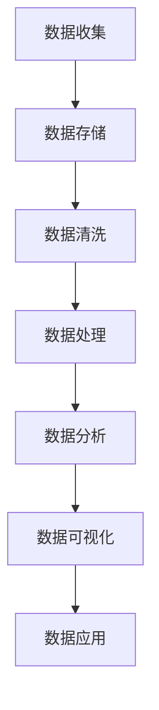
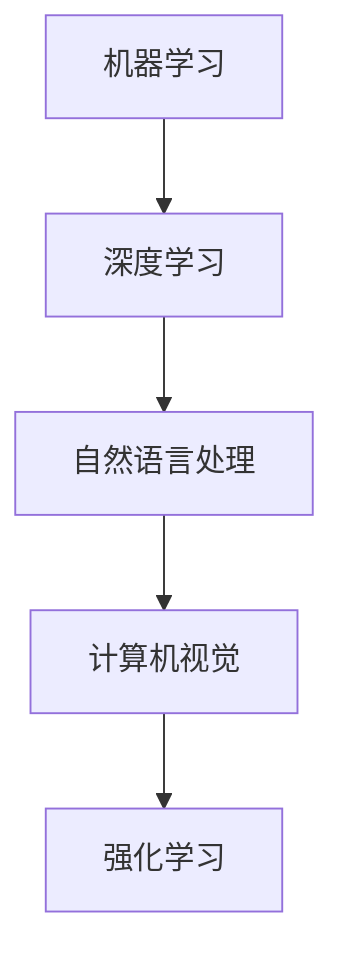
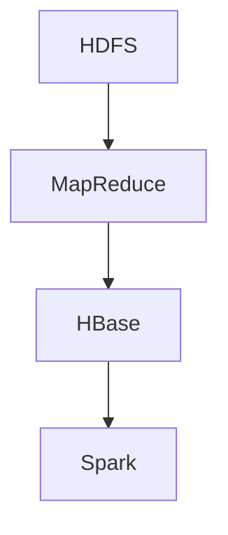
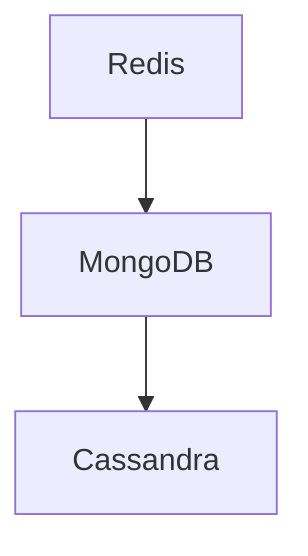
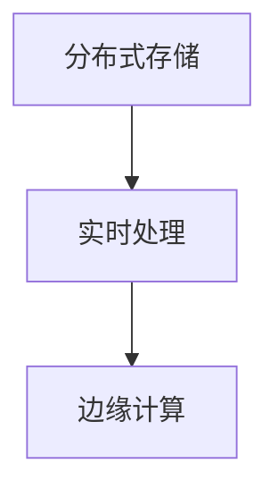
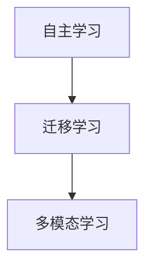
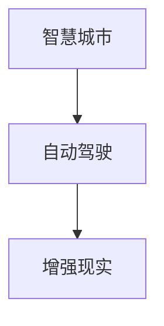

                 

## 大数据对AI学习的影响

关键词：
- 大数据
- AI学习
- 数据处理
- 算法优化
- 应用案例

摘要：
本文将从大数据与AI的基础理论入手，探讨大数据对AI学习的影响。通过详细阐述大数据与AI的联系，以及大数据处理技术和AI核心算法原理，我们将深入分析大数据在AI应用中的实践案例。最后，本文将展望大数据与AI未来的发展趋势。

### 第一部分：大数据与AI基础理论

在当今信息爆炸的时代，大数据和人工智能（AI）成为了两个备受关注的热点领域。大数据是指无法使用传统数据处理方法进行捕捉、管理、处理和分析的数据集，其特点为大量（Volume）、多样（Variety）、高速（Velocity）、真实（Veracity）。人工智能则是指由人制造出来的系统所表现出的智能行为。本部分将首先介绍大数据和AI的基本概念，然后探讨大数据与AI之间的联系。

#### 第1章：大数据与AI概述

##### 1.1 大数据的基本概念

###### 1.1.1 大数据的定义

大数据是指无法使用传统数据处理方法进行捕捉、管理、处理和分析的数据集。根据Gartner的定义，大数据具有4V特点：大量（Volume）、多样（Variety）、高速（Velocity）、真实（Veracity）。

- **大量（Volume）**：数据量巨大，往往达到PB（皮字节）级别。
- **多样（Variety）**：数据类型丰富，包括结构化数据、半结构化数据和非结构化数据。
- **高速（Velocity）**：数据处理速度极快，要求实时或近实时处理。
- **真实（Veracity）**：数据真实可信，要求保证数据质量和可靠性。

###### 1.1.2 大数据的技术栈

大数据的技术栈主要包括以下几个方面：

**Mermaid流程图：**


1. **数据收集**：通过各种渠道收集数据，如传感器、社交媒体、交易记录等。
2. **数据存储**：使用分布式存储系统，如Hadoop Distributed File System（HDFS）和NoSQL数据库。
3. **数据清洗**：对数据进行去噪、补全、标准化等处理，提高数据质量。
4. **数据处理**：使用MapReduce、Spark等分布式计算框架对海量数据进行处理。
5. **数据分析**：使用统计方法、机器学习等对数据进行分析，提取有价值的信息。
6. **数据可视化**：使用图表、报表等将分析结果可视化，帮助用户更好地理解数据。
7. **数据应用**：将分析结果应用到实际业务场景中，如金融风控、医疗健康、智能推荐等。

##### 1.2 AI的基本概念

###### 1.2.1 AI的定义

人工智能（AI）是指由人制造出来的系统所表现出的智能行为。AI系统通常具有以下能力：

- **感知和理解**：通过传感器获取外部信息，如视觉、听觉、触觉等。
- **推理和决策**：基于感知和理解的能力，对信息进行处理和决策。
- **学习和适应**：通过不断学习和积累经验，提高自身的性能和适应能力。

###### 1.2.2 AI的主要领域

AI的主要领域包括：

**Mermaid流程图：**


1. **机器学习**：通过算法从数据中自动学习模式，如决策树、支持向量机、线性回归等。
2. **深度学习**：一种基于多层神经网络的机器学习技术，能够处理复杂的数据模式，如卷积神经网络（CNN）和循环神经网络（RNN）。
3. **自然语言处理**：使计算机能够理解和生成人类语言的技术，如词嵌入、语言模型、机器翻译等。
4. **计算机视觉**：使计算机能够理解和处理视觉信息的技术，如图像分类、目标检测、人脸识别等。
5. **强化学习**：通过试错和反馈来学习最优策略的机器学习技术，如围棋AI、自动驾驶等。

##### 1.3 大数据与AI的联系

大数据与AI之间存在紧密的联系，主要体现在以下几个方面：

###### 1.3.1 大数据为AI提供了丰富的数据资源

大数据为AI的训练和优化提供了丰富的数据资源。AI模型需要大量的数据来进行训练，以提取有用的特征和模式。大数据的多样性和大量性使得AI模型能够更好地适应各种复杂的场景。

###### 1.3.2 AI提升了大数据的处理和分析能力

AI技术如机器学习和深度学习，提高了大数据的处理速度和分析精度。通过AI算法，大数据能够被更快、更准确地处理和分析，从而为业务决策提供有力的支持。

**数学公式：**
$$
处理速度 = \frac{数据处理量}{时间}
$$

**举例说明：** 在金融领域，通过大数据和AI技术，可以对海量的金融数据进行实时分析，从而发现潜在的风险和市场趋势。例如，银行可以使用AI模型来分析客户交易数据，预测欺诈行为，提高风控能力。

### 第二部分：大数据处理技术详解

在AI的学习过程中，大数据处理技术起到了至关重要的作用。本部分将详细探讨大数据处理技术，包括分布式系统基础、数据存储技术和数据处理技术。

#### 第2章：大数据处理技术详解

##### 2.1 分布式系统基础

分布式系统是大数据处理的核心技术之一。分布式系统通过将任务分散到多个节点上执行，能够提高处理速度和容错性。

###### 2.1.1 Hadoop生态系统

Hadoop是一个开源的分布式系统，主要用于处理大规模数据集。Hadoop生态系统包括以下几个主要组件：

**Mermaid流程图：**


1. **Hadoop Distributed File System (HDFS)**：一个分布式文件系统，用于存储海量数据。
2. **MapReduce**：一个分布式计算框架，用于处理大规模数据集。
3. **HBase**：一个分布式、可扩展的列存储数据库，用于存储和查询大规模数据。
4. **Spark**：一个快速、通用的大数据处理框架，支持内存计算和流处理。

###### 2.1.2 分布式系统的优势

分布式系统具有以下优势：

- **高可扩展性**：可以通过增加节点来扩展系统处理能力。
- **高容错性**：某个节点失败不会影响整个系统的运行。

**伪代码：**
```python
def distribute_data(dataset):
    # 将数据集分成多个部分
    chunks = split_dataset(dataset, num_chunks)
    # 分布式存储数据
    store_chunks(chunks)
```

##### 2.2 数据存储技术

在分布式系统中，数据存储技术至关重要。数据存储技术的选择取决于数据类型、数据量、查询需求等因素。

###### 2.2.1 NoSQL数据库

NoSQL数据库是一种非关系型数据库，适用于处理大规模、非结构化或半结构化数据。常见的NoSQL数据库包括：

**Mermaid流程图：**


1. **Redis**：一个高性能的内存键值存储数据库，适用于高速缓存和实时数据处理。
2. **MongoDB**：一个分布式文档数据库，适用于存储和管理大量文档型数据。
3. **Cassandra**：一个分布式宽列存储数据库，适用于处理大规模数据集和高并发查询。

##### 2.3 数据处理技术

数据处理技术是大数据处理的核心，主要包括ETL过程和实时数据处理。

###### 2.3.1 ETL过程

ETL（Extract, Transform, Load）是指数据抽取、转换、加载的过程。ETL过程通常包括以下几个步骤：

**伪代码：**
```python
def etl_process(source, target):
    # 抽取数据
    data = extract_data(source)
    # 数据转换
    transformed_data = transform_data(data)
    # 加载数据
    load_data(target, transformed_data)
```

1. **数据抽取**：从源系统中抽取数据。
2. **数据转换**：对数据进行清洗、去噪、标准化等处理。
3. **数据加载**：将处理后的数据加载到目标系统中。

#### 第3章：AI核心算法原理

AI的核心算法包括机器学习算法、深度学习算法和自然语言处理算法。这些算法为AI系统提供了强大的数据处理和分析能力。

##### 3.1 机器学习算法

机器学习算法是AI的核心技术之一，分为监督学习、无监督学习和强化学习。

###### 3.1.1 监督学习

监督学习是指利用标记数据进行训练，从而学习到预测模型。常见的监督学习算法包括：

- **决策树**：通过树形结构对数据进行分类或回归。
- **支持向量机（SVM）**：通过找到一个最优的超平面来分类数据。
- **线性回归**：通过线性模型来预测连续值。

**伪代码：**
```python
def train_supervised_learning(data, labels, model):
    # 数据预处理
    preprocessed_data = preprocess_data(data)
    # 模型训练
    model = train_model(preprocessed_data, labels)
    return model
```

##### 3.2 深度学习算法

深度学习算法是一种基于多层神经网络的机器学习技术，能够处理复杂的数据模式。常见的深度学习算法包括：

- **卷积神经网络（CNN）**：通过卷积层提取图像特征。
- **循环神经网络（RNN）**：通过循环结构处理序列数据。
- **生成对抗网络（GAN）**：通过生成器和判别器对抗训练。

**伪代码：**
```python
def train_neural_network(data, labels, layers, activation_function):
    # 初始化模型参数
    parameters = initialize_parameters(layers)
    # 模型训练
    parameters = train_model(data, labels, parameters, activation_function)
    return parameters
```

##### 3.3 自然语言处理算法

自然语言处理算法使计算机能够理解和生成人类语言。常见的自然语言处理算法包括：

- **词嵌入**：将单词转换为向量表示。
- **语言模型**：通过统计方法预测下一个单词或词组。
- **机器翻译**：将一种语言翻译成另一种语言。

**数学公式：**
$$
\text{词向量} = \text{GloVe}(\text{词的上下文})
$$

**举例说明：** 通过GloVe算法，可以将文字转换为向量，从而进行语义分析。

### 第三部分：大数据与AI应用实战

大数据与AI的结合在各个领域都有广泛应用。本部分将介绍大数据在金融风控、医疗健康和智能推荐等领域的应用案例。

#### 第4章：大数据在AI中的应用案例

##### 4.1 金融风控

金融风控是指利用大数据和AI技术进行信用评分、风险预警等。以下是一个简单的金融风控应用案例：

**代码案例：**
```python
# 信用评分模型
model = train_supervised_learning(credit_data, credit_labels, decision_tree)
predictions = model.predict(new_credit_data)
```

在这个案例中，我们使用决策树算法对信用数据进行训练，从而预测新客户的信用评分。通过分析客户的交易记录、信用历史等信息，我们可以发现潜在的风险客户，从而采取相应的风险控制措施。

##### 4.2 医疗健康

医疗健康领域是一个大数据和AI技术发挥重要作用的领域。以下是一个简单的医疗健康应用案例：

**代码案例：**
```python
# 疾病预测模型
model = train_neural_network(health_data, health_labels, layers, sigmoid)
predictions = model.predict(new_health_data)
```

在这个案例中，我们使用神经网络算法对健康数据进行训练，从而预测患者的疾病风险。通过分析患者的病史、体检数据等信息，我们可以提前发现疾病风险，从而采取相应的预防措施。

##### 4.3 智能推荐

智能推荐是指利用大数据和AI技术为用户推荐感兴趣的商品或内容。以下是一个简单的智能推荐应用案例：

**代码案例：**
```python
# 推荐系统
model = train_matrix_factorization(rating_data, num_factors)
recommends = model.recommend(new_user_data)
```

在这个案例中，我们使用矩阵分解算法对用户评分数据进行训练，从而为用户推荐商品。通过分析用户的购买历史、浏览记录等信息，我们可以为用户推荐他们可能感兴趣的商品，提高用户满意度和转化率。

### 第四部分：大数据与AI未来发展趋势

随着大数据和AI技术的不断发展，它们在各个领域的应用将越来越广泛。本部分将探讨大数据与AI未来的发展趋势。

#### 第5章：大数据与AI的未来趋势

##### 5.1 大数据技术的演进

大数据技术将继续演进，包括分布式存储、实时处理和边缘计算等方面。

- **分布式存储**：随着数据量的不断增长，分布式存储技术将变得更加成熟和普及，提供更高的可扩展性和容错性。
- **实时处理**：实时处理技术将变得更加高效，能够处理更大量的实时数据，实现实时决策和响应。
- **边缘计算**：边缘计算将使数据处理更加接近数据源，减少数据传输延迟，提高数据处理效率。

**Mermaid流程图：**


##### 5.2 AI技术的突破

AI技术将继续突破，包括自主学习、迁移学习和多模态学习等方面。

- **自主学习**：AI系统将能够自主学习和适应，不再依赖于人类干预。
- **迁移学习**：AI系统将能够将知识从一种任务迁移到另一种任务，提高学习效率。
- **多模态学习**：AI系统将能够处理多种类型的数据，如文本、图像、声音等，实现更全面的理解和推理。

**Mermaid流程图：**


##### 5.3 大数据与AI融合的新领域

大数据与AI技术的融合将带来新的领域，如智慧城市、自动驾驶和增强现实（AR）等。

- **智慧城市**：大数据和AI技术将帮助城市实现智能化管理，提高城市效率和居民生活质量。
- **自动驾驶**：大数据和AI技术将推动自动驾驶技术的发展，实现安全、高效、节能的自动驾驶汽车。
- **增强现实（AR）**：大数据和AI技术将使AR应用更加丰富和智能化，为用户提供更真实的虚拟体验。

**Mermaid流程图：**


### 附录

#### 附录 A：大数据与AI开发工具与资源

##### A.1 大数据开发工具

- **Hadoop**：一个开源的分布式计算框架，适用于处理大规模数据集。
- **Spark**：一个开源的分布式计算框架，支持内存计算和流处理。
- **Flink**：一个开源的分布式流处理框架，具有高可扩展性和高容错性。

##### A.2 AI开发框架

- **TensorFlow**：一个开源的深度学习框架，适用于构建和训练深度学习模型。
- **PyTorch**：一个开源的深度学习框架，具有灵活的动态计算图。
- **Keras**：一个基于TensorFlow和PyTorch的深度学习框架，提供简洁的API。

##### A.3 开发资源

- **在线课程**：如Coursera、edX、Udacity等平台的AI和大数据相关课程。
- **学术论文**：如ACL、ICML、NIPS等顶级会议的论文。
- **技术博客**：如Medium、Towards Data Science、AI中国等。

### 结语

大数据和人工智能是当今科技领域的重要趋势，它们之间的结合将带来巨大的变革。本文从大数据与AI的基础理论、大数据处理技术、AI核心算法原理、应用实战和未来发展趋势等方面进行了详细探讨。随着大数据和AI技术的不断进步，我们有望在各个领域实现更高效、更智能的解决方案。

作者：AI天才研究院/AI Genius Institute & 禅与计算机程序设计艺术 /Zen And The Art of Computer Programming

[返回顶部](#大数据对AI学习的影响) <a id="回到顶部"></a>  <br>

