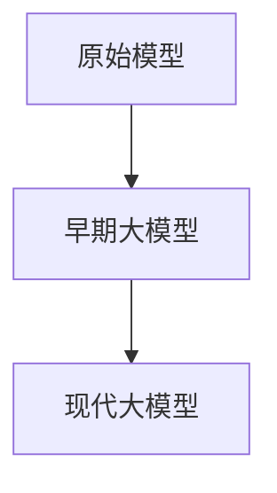
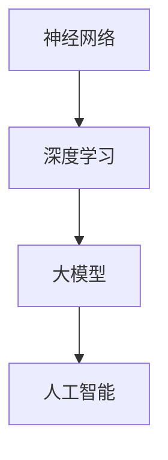
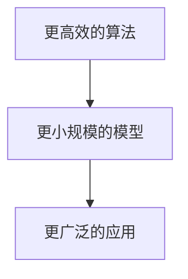
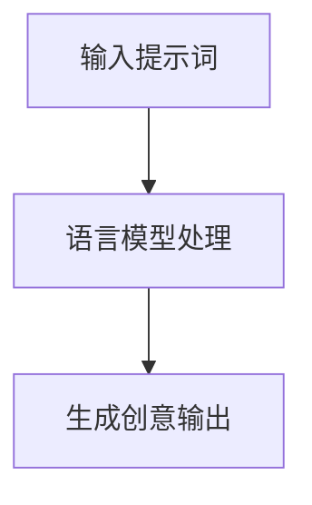
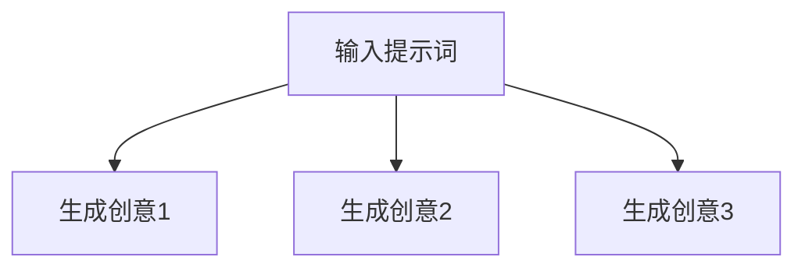
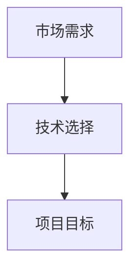
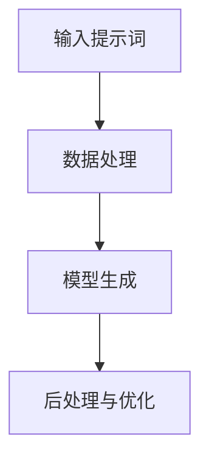
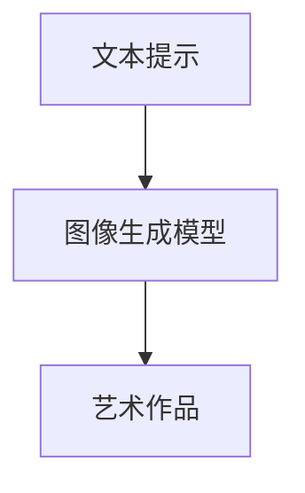
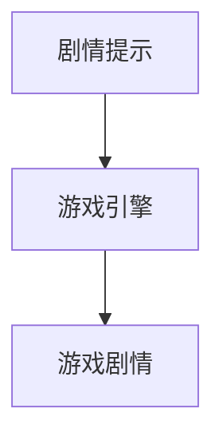

                 

# 大模型创意生成：提示词激发AI创造力

> **关键词：** 大模型，创意生成，提示词，人工智能，深度学习，注意力机制，预训练，广告创意，项目实战。

> **摘要：** 本文将深入探讨大模型在创意生成中的应用，特别是如何利用提示词激发AI创造力。文章首先介绍了大模型的基础知识和核心算法原理，然后通过实际项目和案例分析，展示了大模型在广告创意、艺术作品生成和个性化学习建议等领域的应用。最后，文章总结了开发工具和资源，为读者提供了进一步学习和实践的路径。

### 第一部分：大模型基础

#### 第1章：大模型概述

##### 1.1 大模型的历史与现状

大模型的历史可以追溯到20世纪80年代，当时的神经网络研究正处于起步阶段。早期的大模型主要是为了处理语音识别和图像分类等简单的任务。随着深度学习技术的兴起，大模型逐渐成为人工智能研究的热点。现代大模型如GPT-3、BERT和GPT-Neo等，展示了强大的语言理解和生成能力。

**1.1.1 大模型的起源与演变**


**Mermaid流程图**：



**1.1.2 大模型在人工智能中的地位**

大模型在人工智能中扮演着核心角色，它们是实现智能化的关键工具。深度学习是人工智能的重要分支，而大模型则是深度学习领域的高峰。

**Mermaid流程图**：



**1.1.3 大模型的分类**

大模型可以根据不同的标准进行分类，例如根据模型架构（如Transformer架构）、数据规模（如几十亿参数）或应用领域（如自然语言处理、计算机视觉）等。

**伪代码**：

```python
class BigModel:
    def __init__(self, layers, parameters):
        self.layers = layers
        self.parameters = parameters

    def train(self, data):
        # 训练代码
        pass

    def predict(self, input_data):
        # 预测代码
        pass
```

##### 1.2 大模型的核心特性

**1.2.1 数据规模**

大模型通常具有庞大的数据规模，这使它们能够捕捉到复杂的模式。数据规模可以用数学模型表示：

$$
\text{Model Size} = \sum_{i=1}^{n} (\text{layer size}_i \times \text{activation size}_i)
$$

**1.2.2 计算能力**

大模型的训练和推理需要大量的计算资源。计算能力可以用伪代码表示：

```python
def compute_resources(model, data):
    required_memory = model.get_memory_requirement()
    required_computation = model.get_computation_time(data)
    return required_memory, required_computation
```

##### 1.3 大模型的挑战与未来

**1.3.1 挑战**

大模型的训练和推理面临着诸多挑战，如计算资源的高消耗、数据隐私的保护等。可以用数学公式表示：

$$
\text{Challange} = \text{Complexity} \times \text{Data Scale}
$$`

**1.3.2 未来方向**

未来，大模型将继续朝着更高效、更小规模和更广泛应用的方向发展。可以用Mermaid流程图表示：



#### 第2章：核心算法原理

##### 2.1 深度学习基础

深度学习是构建大模型的核心技术。神经网络是深度学习的基础，通过多层网络结构对数据进行处理。

**2.1.1 神经网络基础**

神经网络的每一层都可以看作是一个线性变换，加上一个激活函数。可以用伪代码表示：

```python
def feedforward(input, weights, biases):
    layer_output = (np.dot(input, weights) + biases)
    return activation_function(layer_output)
```

##### 2.2 注意力机制

注意力机制是现代大模型的一个重要特性，它能够提高模型对输入数据的处理能力。

**2.2.1 注意力机制原理**

注意力机制通过计算查询（Query）和键（Key）之间的相似度来分配注意力权重。数学模型如下：

$$
\text{Attention Score} = \text{Query} \cdot \text{Key}
$$

伪代码实现如下：

```python
def attention(query, keys, values, attention_mask=None):
    attention_scores = query @ keys.T
    if attention_mask is not None:
        attention_scores = attention_scores.masked_fill(~attention_mask, float("-inf"))
    attention_weights = softmax(attention_scores)
    context_vector = attention_weights @ values.T
    return context_vector, attention_weights
```

##### 2.3 预训练与微调

预训练是当前大模型的主流训练方法，通过在大规模数据集上进行预训练，模型能够学习到通用的知识。微调则是将预训练模型应用于特定任务，通过少量数据进一步优化模型。

**2.3.1 预训练概念**

预训练可以用数学模型表示：

$$
\text{Pre-trained Model} = \text{Training on Large Dataset}
$$

**2.3.2 微调技术**

微调技术可以用伪代码表示：

```python
def fine_tune(model, fine_tuning_data):
    model.train()
    for epoch in range(num_epochs):
        for data in fine_tuning_data:
            inputs, targets = data
            optimizer.zero_grad()
            outputs = model(inputs)
            loss = criterion(outputs, targets)
            loss.backward()
            optimizer.step()
    return model
```

### 第二部分：创意生成实战

#### 第3章：创意生成原理

##### 3.1 创意生成的理论基础

创意生成的核心在于如何利用提示词激发大模型的创造力。提示词作为输入，通过大模型的处理，能够生成新颖的创意。

**3.1.1 提示词激发机制**

提示词激发机制可以用数学模型表示：

$$
\text{Creative Output} = \text{Prompt} \cdot \text{Model}
$$

**3.1.2 语言模型的作用**

语言模型在大模型中扮演着重要角色，它能够对输入文本进行建模，从而生成具有连贯性和逻辑性的输出。可以用Mermaid流程图表示：



##### 3.2 大模型在创意生成中的应用

大模型在创意生成中的应用非常广泛，包括文本生成、图像生成和广告创意生成等。

**3.2.1 文本生成**

文本生成是当前大模型应用最为广泛的领域之一。通过输入提示词，大模型能够生成高质量的文本。

**伪代码**：

```python
def generate_text(model, prompt, max_length):
    input_ids = tokenizer.encode(prompt, return_tensors='pt')
    input_ids = input_ids.to(model.device)
    with torch.no_grad():
        outputs = model.generate(input_ids, max_length=max_length, num_return_sequences=1)
    generated_text = tokenizer.decode(outputs[0], skip_special_tokens=True)
    return generated_text
```

**3.2.2 图像创意生成**

图像创意生成是另一个重要的应用领域。通过将文本提示转换为图像，大模型能够生成新颖的艺术作品。

**3.3.1 图像到文本的转换**

图像到文本的转换过程可以通过图像编码器和解码器实现。

**数学模型**：

$$
\text{Image-to-Text} = \text{Image Encoder} \cdot \text{Decoder}
$$

**3.3.2 文本到图像的转换**

文本到图像的转换过程可以通过以下伪代码实现：

```python
def generate_image(model, text_prompt, max_image_size):
    input_ids = tokenizer.encode(text_prompt, return_tensors='pt')
    input_ids = input_ids.to(model.device)
    with torch.no_grad():
        image_output = model.generate(input_ids, max_image_size=max_image_size, num_return_sequences=1)
    generated_image = image_output[0].detach().cpu().numpy()
    return generated_image
```

#### 第4章：大模型在广告创意中的应用

##### 4.1 广告创意生成的挑战

广告创意生成面临着数据隐私保护和个性化生成等挑战。

**4.1.1 数据隐私与保护**

数据隐私保护是广告创意生成的重要挑战。为了保护用户隐私，可以使用数据匿名化和安全措施。

**数学模型**：

$$
\text{Data Privacy} = \text{Anonymization} + \text{Security Measures}
$$

**4.1.2 创意生成的个性化**

创意生成的个性化是为了满足不同用户的需求。可以通过用户数据来个性化广告创意。

**伪代码**：

```python
def personalize_ads(model, user_data, ads_data):
    user_representation = model.encode_user_data(user_data)
    personalized_ads = model.generate_ads(user_representation, ads_data)
    return personalized_ads
```

##### 4.2 大模型在广告创意生成中的优势

大模型在广告创意生成中具有以下优势：

**4.2.1 高效生成**

大模型能够快速生成广告创意，提高了广告投放的效率。

**数学模型**：

$$
\text{Efficiency} = \text{Model Speed} \times \text{Batch Size}
$$

**4.2.2 创意多样性**

大模型能够生成多样化的广告创意，满足了不同用户的需求。

**Mermaid流程图**：



### 第三部分：实战项目与案例分析

#### 第5章：大模型创意生成项目实战

##### 5.1 项目概述

本项目旨在利用大模型生成广告创意，提高广告投放的效率和质量。项目分为以下几个阶段：

1. **需求分析**：确定广告创意生成的目标和需求。
2. **环境搭建**：配置开发环境和硬件资源。
3. **数据处理**：对广告数据进行预处理和清洗。
4. **模型训练**：训练大模型以生成广告创意。
5. **创意生成**：利用训练好的大模型生成广告创意。
6. **评估与优化**：评估广告创意的质量并进行优化。

**5.1.1 项目背景**

广告创意生成的市场需求不断增长，但传统的手动创意生成方式效率低下，无法满足快速投放的需求。因此，本项目旨在通过大模型自动化生成广告创意，提高广告投放的效率和质量。

**Mermaid流程图**：



##### 5.2 开发环境搭建

开发环境搭建是项目成功的关键。本项目选择了基于Python的深度学习框架，如PyTorch或TensorFlow。

**5.2.1 硬件环境**

硬件环境需要配置足够的GPU和内存。以下是一个简单的配置示例：

```python
def configure_hardware(gpu_count, memory_size):
    # 配置GPU数量和内存大小
    pass
```

##### 5.3 数据处理与模型训练

数据处理和模型训练是项目的核心。本项目使用大规模的广告数据集进行训练，以提高模型的性能。

**5.3.1 数据预处理**

数据预处理包括数据清洗、标签化和数据增强等步骤。

```python
def preprocess_data(raw_data):
    # 数据清洗和预处理代码
    pass
```

**5.3.2 模型训练**

模型训练使用预训练的大模型，并通过微调来适应广告创意生成的任务。

```python
def train_model(model, training_data, validation_data):
    # 模型训练代码
    pass
```

##### 5.4 创意生成实现

创意生成是实现项目目标的关键。本项目利用训练好的大模型生成广告创意。

**5.4.1 创意生成流程**

创意生成流程包括输入提示词、模型处理和输出创意等步骤。



##### 5.5 代码解读与分析

在本节中，我们将对项目中的关键代码进行解读和分析。

**5.5.1 模型配置**

```python
model = BigModel(layers=[...], parameters=[...])
```

**5.5.2 数据处理与模型训练**

```python
training_data = preprocess_data(raw_data)
model = train_model(model, training_data, validation_data)
```

**5.5.3 创意生成**

```python
generated_ideas = generate_ideas(model, prompts)
```

### 第四部分：扩展与应用

#### 第6章：大模型在多领域的应用

##### 6.1 在艺术领域的应用

大模型在艺术领域的应用非常广泛，包括艺术作品的自动生成、音乐创作和电影剧本编写等。

**6.1.1 艺术作品的自动生成**

艺术作品的自动生成是通过大模型对艺术风格和主题的理解来实现的。

**Mermaid流程图**：



##### 6.2 在教育领域的应用

大模型在教育领域的应用包括个性化学习建议、课程内容生成和智能辅导等。

**6.2.1 个性化学习建议**

个性化学习建议是通过分析学生的学习数据和课程内容来实现的。

**伪代码**：

```python
def generate_learning_plan(student_data, course_data):
    # 根据学生数据和课程数据生成个性化学习计划
    pass
```

##### 6.3 在游戏开发中的应用

大模型在游戏开发中的应用包括游戏剧情生成、角色设计和关卡设计等。

**6.3.1 游戏剧情生成**

游戏剧情生成是通过大模型对游戏背景和角色性格的理解来实现的。

**Mermaid流程图**：



### 附录

#### 附录 A：大模型开发工具与资源

在大模型开发中，常用的工具和资源包括深度学习框架、预训练模型和数据集等。

**A.1 主流深度学习框架对比**

主流深度学习框架包括TensorFlow、PyTorch和JAX等。

**伪代码**：

```python
frameworks = ["TensorFlow", "PyTorch", "JAX"]
for framework in frameworks:
    print(f"{framework} is a popular deep learning framework.")
```

**A.2 实用资源链接**

以下是一些实用的资源和链接：

- [深度学习课程资源](https://www.deeplearning.ai/)
- [PyTorch官方文档](https://pytorch.org/docs/stable/)
- [TensorFlow官方文档](https://www.tensorflow.org/)

### 作者

作者：AI天才研究院/AI Genius Institute & 禅与计算机程序设计艺术 /Zen And The Art of Computer Programming

