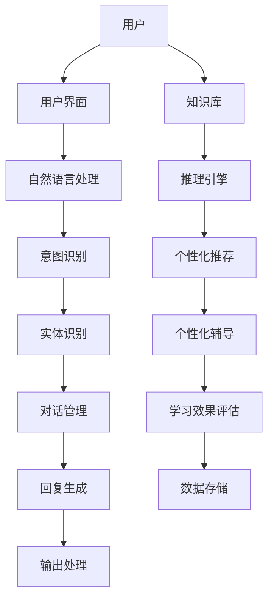
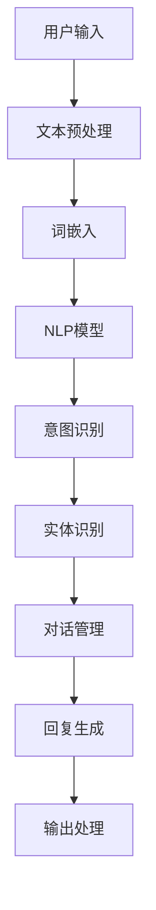
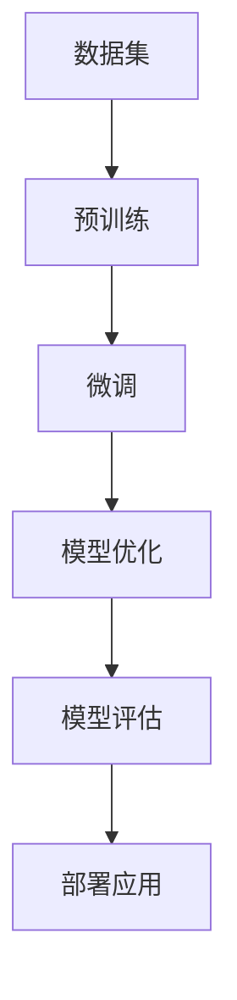

                 

# 大模型在虚拟教育助手开发中的应用

> **关键词**：大模型，虚拟教育助手，自然语言处理，对话系统，智能推荐，个性化学习

> **摘要**：本文从虚拟教育助手的发展背景出发，深入探讨了大模型在虚拟教育助手开发中的应用。首先，介绍了虚拟教育助手的基础知识，包括其发展历程、基本概念、核心功能和技术架构。然后，详细阐述了大模型的基本原理、在虚拟教育助手中的应用以及面临的技术挑战。接着，探讨了虚拟教育助手开发环境搭建的步骤和注意事项。随后，分别介绍了自然语言处理、对话系统、智能推荐和个性化学习在大模型中的应用。最后，通过一个实际的项目实战案例，展示了如何使用大模型开发虚拟教育助手对话系统，并进行了详细的代码解读与分析。本文旨在为开发者提供全面的指导和实用的参考，助力虚拟教育助手的开发和应用。

----------------------------------------------------------------

## 第一部分: 虚拟教育助手基础

### 第1章: 虚拟教育助手概述

虚拟教育助手（Virtual Educational Assistant，简称VEA）是人工智能领域的一个重要应用，它利用先进的人工智能技术，如自然语言处理、机器学习、语音识别等，为学习者提供智能化的教育服务。VEA不仅可以协助教师进行教学任务，还可以为学生提供个性化的学习辅导，从而提升学习效果。

#### 1.1 虚拟教育助手的发展历程

虚拟教育助手的概念最早可以追溯到20世纪90年代，随着互联网和人工智能技术的兴起，虚拟教育助手逐渐成为教育领域的研究热点。早期的研究主要集中在基于规则的系统，这些系统通过预设的规则来解答学生的问题。然而，随着自然语言处理和机器学习技术的进步，虚拟教育助手开始具备更加智能的能力。

在21世纪初，基于机器学习的方法开始应用于虚拟教育助手开发，例如，使用贝叶斯网络和决策树来模拟教师的思维方式。这些方法在一定程度上提升了虚拟教育助手的智能化水平，但仍然存在一些局限性。

近年来，随着深度学习技术的迅猛发展，虚拟教育助手取得了显著突破。深度学习模型，如卷积神经网络（CNN）和循环神经网络（RNN），使得虚拟教育助手能够更好地理解和处理自然语言，从而实现更加智能化和个性化的教育服务。

#### 1.2 虚拟教育助手的基本概念

虚拟教育助手是一种基于人工智能技术的教育应用，它可以模拟教师的角色，为学生提供学习指导、解答问题、评估学习成果等。虚拟教育助手通常具有以下基本特征：

1. **自然语言处理能力**：虚拟教育助手能够理解和生成自然语言，从而实现与学生的智能交互。
2. **个性化学习推荐**：虚拟教育助手可以根据学生的学习历史和学习偏好，为其推荐合适的学习资源和策略。
3. **智能问答系统**：虚拟教育助手能够回答学生的各种问题，包括课程内容、学习方法、考试技巧等。
4. **自动评估和反馈**：虚拟教育助手可以自动评估学生的学习成果，并提供针对性的反馈，帮助学生提高学习效果。

#### 1.3 虚拟教育助手的核心功能

虚拟教育助手的核心功能包括以下几个方面：

1. **智能问答**：虚拟教育助手可以回答学生关于课程内容、学习方法等方面的问题，提供实时、个性化的解答。
2. **学习辅导**：虚拟教育助手可以根据学生的学习进度和学习习惯，提供针对性的学习辅导和指导。
3. **学习资源推荐**：虚拟教育助手可以分析学生的学习数据，推荐适合的学习资源和课程，帮助学生高效学习。
4. **考试准备**：虚拟教育助手可以提供模拟考试、知识点回顾等功能，帮助学生进行考试准备。
5. **学习评估**：虚拟教育助手可以自动评估学生的学习成果，生成详细的学习报告，为学生和家长提供学习反馈。

#### 1.4 虚拟教育助手的技术架构

虚拟教育助手的技术架构通常包括以下几个关键组件：

1. **自然语言处理（NLP）模块**：负责处理和理解自然语言输入，包括文本解析、语义分析等。
2. **知识库**：存储课程内容、知识点、教学策略等，为虚拟教育助手提供知识支持。
3. **推理引擎**：负责根据学生的问题和需求，从知识库中检索相关信息，生成合理的回答和指导。
4. **用户界面（UI）**：提供与学生交互的界面，包括文本输入、语音输入、可视化展示等。
5. **数据存储与处理**：负责存储和处理学生的学习数据，包括学习记录、问答记录、评估结果等。


图1. 虚拟教育助手技术架构图

在图1中，用户通过用户界面与虚拟教育助手进行交互，自然语言处理模块负责处理用户的输入，推理引擎根据用户的输入和知识库中的信息生成回答，并将结果通过用户界面展示给用户。同时，虚拟教育助手会不断收集学生的学习数据，用于优化模型和提升服务质量。

### 第2章: 大模型与虚拟教育助手

#### 2.1 大模型的基本原理

大模型（Large-scale Model）是指具有海量参数和强大计算能力的深度学习模型。这些模型通过在海量数据上进行预训练，能够获得广泛的知识表示能力，从而在多种任务上表现出色。大模型的核心特点是：

1. **大规模参数**：大模型通常拥有数十亿甚至千亿个参数，这使得它们能够捕捉到数据中的复杂模式。
2. **预训练**：大模型首先在大量无监督数据上进行预训练，学习通用特征和知识表示。
3. **微调**：在特定任务上，大模型通过微调调整参数，以适应特定的任务需求。

大模型的基本原理可以概括为以下几点：

1. **词嵌入**：大模型使用词嵌入（Word Embedding）技术将词汇映射到高维空间，使得语义相近的词在空间中靠近。
2. **注意力机制**：大模型通过注意力机制（Attention Mechanism）分配不同的重要性给输入序列中的不同部分，从而提高对关键信息的关注。
3. **深度神经网络**：大模型通常采用深度神经网络（Deep Neural Network，DNN）结构，通过多层的非线性变换，学习复杂的特征表示。

#### 2.2 大模型在虚拟教育助手中的应用

大模型在虚拟教育助手中的应用主要体现在以下几个方面：

1. **自然语言处理**：大模型具有强大的自然语言处理能力，能够理解复杂的语言结构，生成流畅的自然语言回答。这对于虚拟教育助手的智能问答功能至关重要。
2. **知识表示**：大模型能够从海量数据中提取知识，构建丰富的知识图谱，为虚拟教育助手提供知识支持。
3. **个性化学习**：大模型可以分析学生的学习行为和知识水平，为每个学生提供个性化的学习资源和指导，提升学习效果。
4. **智能推荐**：大模型可以根据学生的学习偏好和需求，推荐合适的学习资源和课程，提高学习效率。

#### 2.3 大模型的技术挑战与解决方案

尽管大模型在虚拟教育助手开发中具有巨大的潜力，但其在实际应用中仍面临一系列技术挑战：

1. **计算资源需求**：大模型通常需要大量的计算资源进行训练，这对硬件设备提出了较高的要求。解决方案是使用高性能计算集群和分布式计算。
2. **数据隐私与安全**：大模型在训练过程中需要处理大量的个人数据，这涉及到数据隐私和安全问题。解决方案是采用数据加密和隐私保护技术，确保数据的安全性和隐私性。
3. **模型解释性**：大模型的复杂性和非线性特性使得其难以解释。解决方案是开发可解释性模型和可视化工具，帮助用户理解模型的决策过程。
4. **伦理与道德问题**：大模型在虚拟教育助手中的应用可能会引发一系列伦理和道德问题，如算法歧视、数据滥用等。解决方案是建立伦理委员会和道德准则，确保模型的应用符合社会价值。

### 第3章: 虚拟教育助手开发环境搭建

#### 3.1 开发环境的准备

要搭建虚拟教育助手的开发环境，首先需要准备以下硬件和软件：

1. **硬件**：一台具有高性能CPU和GPU的服务器，用于模型训练和推理。推荐的硬件配置包括：
   - CPU：Intel Xeon 或 AMD Ryzen 系列
   - GPU：NVIDIA Tesla V100 或更高级别的GPU
   - 内存：至少64GB RAM

2. **软件**：安装以下软件：
   - 操作系统：Ubuntu 18.04 或 CentOS 7
   - Python：Python 3.7 或更高版本
   - PyTorch：PyTorch 1.7 或更高版本
   - TensorFlow：TensorFlow 2.5 或更高版本
   - Jupyter Notebook：用于交互式开发和调试

#### 3.2 开发工具的选择

在搭建开发环境时，需要选择合适的开发工具和库，以便高效地进行虚拟教育助手的开发：

1. **IDE**：选择一个适合Python开发的IDE，如PyCharm、Visual Studio Code等，这些IDE提供了丰富的调试、代码补全和自动化工具。
2. **版本控制**：使用Git进行版本控制，确保代码的版本管理和协作开发。
3. **数据库**：选择合适的数据库用于存储用户数据和学习记录，如MySQL、PostgreSQL等。
4. **自然语言处理库**：选择适合自然语言处理任务的库，如NLTK、spaCy、transformers等。
5. **可视化库**：使用Matplotlib、Seaborn等可视化库，对数据进行可视化分析。

#### 3.3 开发环境的配置

完成硬件和软件的安装后，需要进行以下配置：

1. **Python环境**：配置Python环境，安装必要的库和依赖项。
   ```bash
   pip install torch torchvision torchvision
   pip install tensorflow
   pip install jupyterlab
   ```

2. **虚拟环境**：创建虚拟环境，以便隔离项目依赖。
   ```bash
   python -m venv venv
   source venv/bin/activate
   ```

3. **Jupyter Notebook**：启动Jupyter Notebook，用于交互式开发和调试。
   ```bash
   jupyter notebook
   ```

4. **数据库连接**：配置数据库连接，确保虚拟教育助手能够访问数据库。

通过以上步骤，我们成功搭建了虚拟教育助手的开发环境，为后续的开发工作奠定了基础。

## 第二部分: 大模型在虚拟教育助手中的应用

### 第4章: 自然语言处理技术在大模型中的应用

自然语言处理（Natural Language Processing，NLP）是人工智能领域的一个重要分支，致力于使计算机能够理解和处理自然语言。在大模型的帮助下，NLP技术取得了显著的进展，为虚拟教育助手的开发提供了强大的支持。

#### 4.1 词嵌入技术

词嵌入（Word Embedding）是将词汇映射到高维空间的技术，使得语义相近的词在空间中靠近。词嵌入技术是NLP的基础，它为深度学习模型提供了丰富的词汇表示。常用的词嵌入技术包括：

1. **Word2Vec**：Word2Vec是一种基于神经网络的语言模型，通过预测词语的上下文来学习词汇的向量表示。Word2Vec包括两个变种：连续词袋（CBOW）和Skip-Gram。

2. **GloVe**：GloVe（Global Vectors for Word Representation）是一种基于共现概率的词嵌入技术。GloVe通过计算词汇的共现矩阵，使用矩阵分解方法学习词汇的向量表示。

3. **BERT**：BERT（Bidirectional Encoder Representations from Transformers）是一种基于Transformer的预训练模型，通过在大量文本上进行双向训练，学习词汇的深度双向表示。BERT在NLP任务中取得了显著的性能提升。

#### 4.2 序列模型与注意力机制

序列模型（Sequence Model）是用于处理序列数据（如文本、语音）的深度学习模型。在虚拟教育助手开发中，序列模型用于理解用户的输入和生成回复。常用的序列模型包括：

1. **循环神经网络（RNN）**：RNN能够处理序列数据，通过将当前输入与前一时刻的隐藏状态相组合，实现信息的长期依赖建模。

2. **长短时记忆网络（LSTM）**：LSTM是RNN的一种变种，通过引入门控机制，解决了传统RNN的梯度消失问题，能够更好地建模长期依赖关系。

3. **门控循环单元（GRU）**：GRU是另一种RNN变种，通过简化LSTM的门控机制，提高了计算效率。

注意力机制（Attention Mechanism）是序列模型的一个重要技术，它能够自动分配不同的重要性给序列中的不同部分，从而提高模型的性能。注意力机制分为多种类型，包括：

1. **局部注意力**：局部注意力机制只关注序列的某个局部区域，适用于需要关注特定位置信息的任务。

2. **全局注意力**：全局注意力机制关注整个序列，适用于需要综合整个序列信息的任务。

3. **双向注意力**：双向注意力机制结合了输入序列和输出序列的信息，能够更好地捕捉上下文依赖关系。

#### 4.3 转换器架构详解

转换器（Transformer）架构是近年来NLP领域的一种革命性创新，它在处理长序列和并行计算方面具有显著优势。转换器架构的核心组件包括：

1. **自注意力机制**：自注意力机制允许模型在编码器层中自动学习输入序列中每个词之间的关系，并通过权重分配不同的重要性。

2. **多头注意力**：多头注意力机制将输入序列分解为多个子序列，每个子序列独立进行自注意力计算，然后融合结果。

3. **编码器和解码器**：编码器负责处理输入序列，解码器负责生成输出序列。编码器和解码器之间通过多头注意力机制和全连接层进行交互。

4. **位置编码**：由于转换器没有考虑输入序列的顺序信息，位置编码用于引入位置信息，确保模型能够捕捉到输入序列的顺序关系。

转换器架构在多种NLP任务中取得了优异的性能，如机器翻译、文本分类、问答系统等。BERT和GPT等大模型都是基于转换器架构进行设计的，它们在虚拟教育助手开发中也发挥了重要作用。

### 第5章: 大模型在虚拟教育助手对话系统中的应用

对话系统（Dialogue System）是虚拟教育助手的核心组成部分，它能够与用户进行自然语言交互，提供个性化的学习指导和服务。大模型在对话系统中具有显著的优势，能够提升对话系统的性能和用户体验。

#### 5.1 对话系统的基本原理

对话系统是一种计算机系统，能够与人类用户进行自然语言交互，理解用户的需求并生成合理的回复。对话系统的基本原理包括以下几个关键部分：

1. **输入处理**：对话系统首先需要接收用户的输入，包括文本、语音等形式。输入处理模块负责将输入转换为计算机可以处理的格式。

2. **意图识别**：意图识别模块分析用户的输入，确定用户的目的或需求。意图可以是询问课程内容、请求学习建议、进行考试准备等。

3. **实体识别**：在意图识别过程中，对话系统还需要识别输入中的实体，如人名、地名、课程名称等。实体识别有助于更准确地理解用户的需求。

4. **对话管理**：对话管理模块负责维护对话的状态和上下文，确保对话的连贯性和一致性。对话管理模块需要根据用户的行为和历史信息，生成合适的回复。

5. **回复生成**：回复生成模块根据用户的意图和对话状态，生成合理的回复。回复可以是文本、语音、图像等形式。

6. **输出处理**：输出处理模块将生成的回复转换为用户可以理解的形式，如文本、语音等。

#### 5.2 大模型在对话系统中的优势

大模型在对话系统中具有以下几个显著优势：

1. **强大的语义理解能力**：大模型通过在大量文本上进行预训练，能够学习到丰富的语义知识，从而更好地理解用户的输入和意图。

2. **灵活的对话管理**：大模型具有强大的表示学习能力，能够灵活地处理对话中的上下文信息和动态变化，确保对话的连贯性和一致性。

3. **高效的回复生成**：大模型能够快速生成高质量的自然语言回复，提高对话系统的响应速度和用户体验。

4. **多模态处理能力**：大模型能够处理多种模态的输入和输出，如文本、语音、图像等，为用户提供更加丰富和个性化的服务。

#### 5.3 大模型对话系统的开发与优化

开发一个基于大模型的对话系统需要以下几个关键步骤：

1. **数据准备**：收集和整理对话数据，包括用户输入、意图、实体、回复等。数据的质量和多样性对模型性能至关重要。

2. **模型选择**：选择合适的大模型架构，如BERT、GPT等。根据具体任务的需求，可以选择预训练好的模型或者进行模型微调。

3. **模型训练**：使用准备好的数据对大模型进行训练。在训练过程中，需要设置合适的训练参数，如学习率、批次大小等。

4. **模型评估**：使用验证集和测试集对模型进行评估，选择性能最优的模型。

5. **对话管理**：开发对话管理模块，负责维护对话状态和上下文，确保对话的连贯性和一致性。

6. **回复生成**：开发回复生成模块，根据用户的意图和对话状态生成合适的回复。

7. **系统优化**：通过对模型和系统的优化，提升对话系统的性能和用户体验。优化方法包括调整超参数、改进数据预处理、引入多模态处理等。

#### 5.4 大模型对话系统的实际应用

大模型在对话系统中已经得到了广泛的应用，以下是一些实际应用案例：

1. **智能客服**：大模型可以应用于智能客服系统，与用户进行自然语言交互，提供实时、个性化的客户服务。

2. **虚拟助手**：大模型可以构建虚拟助手，为用户提供个性化服务，如日程管理、信息查询、学习辅导等。

3. **教育应用**：大模型可以应用于教育领域，为用户提供智能化的学习建议、考试辅导和个性化学习路径。

4. **医疗咨询**：大模型可以应用于医疗咨询系统，与患者进行自然语言交互，提供医疗信息查询、症状咨询和健康建议。

通过以上应用案例，我们可以看到大模型在对话系统中的巨大潜力。未来，随着大模型技术的不断发展和完善，对话系统的应用将更加广泛和深入，为人们的生活和工作带来更多便利和提升。

### 第6章: 大模型在虚拟教育助手智能推荐中的应用

#### 6.1 智能推荐系统概述

智能推荐系统（Intelligent Recommendation System）是一种利用人工智能技术，根据用户的历史行为、兴趣和偏好，为用户提供个性化推荐的服务。在虚拟教育助手开发中，智能推荐系统可以帮助学生发现感兴趣的学习资源，提高学习效率和兴趣。

智能推荐系统的主要组成部分包括：

1. **用户画像**：构建用户画像，记录用户的基本信息、行为习惯、学习偏好等，为推荐算法提供输入。
2. **推荐算法**：根据用户画像和资源信息，使用算法生成推荐结果。常用的推荐算法包括基于内容的推荐、协同过滤、基于模型的推荐等。
3. **推荐结果展示**：将推荐结果以适当的形式展示给用户，如学习资源列表、个性化课程推荐等。

#### 6.2 大模型在推荐系统中的角色

大模型在智能推荐系统中扮演着关键角色，其主要作用包括：

1. **用户行为理解**：大模型能够通过预训练学习到用户行为的深层次特征，从而更好地理解用户的兴趣和偏好。
2. **资源内容分析**：大模型能够分析资源的内容和特点，将其转化为高维特征向量，为推荐算法提供输入。
3. **个性化推荐**：大模型可以根据用户的历史行为和实时交互，生成个性化的推荐结果，提高推荐的准确性和用户体验。

#### 6.3 大模型推荐系统的实现与优化

实现一个基于大模型的智能推荐系统需要以下几个关键步骤：

1. **数据收集与预处理**：收集用户行为数据、资源信息等，进行数据清洗、去重和特征提取，构建用户画像和资源特征。
2. **模型选择与训练**：选择合适的大模型架构，如BERT、GPT等，对其进行训练，学习用户和资源的特征表示。
3. **推荐算法设计**：设计推荐算法，将用户特征和资源特征结合，生成推荐结果。常用的推荐算法包括基于内容的推荐、协同过滤、基于模型的推荐等。
4. **推荐结果优化**：通过调整模型参数、优化推荐算法，提高推荐的准确性和用户体验。

#### 6.4 大模型推荐系统的优化策略

为了提升大模型推荐系统的性能和用户体验，可以采取以下优化策略：

1. **在线学习**：采用在线学习策略，实时更新用户画像和推荐结果，以适应用户行为和兴趣的变化。
2. **多模态融合**：整合多种模态的数据，如文本、图像、语音等，提升推荐系统的全面性和准确性。
3. **上下文感知**：引入上下文信息，如用户当前的学习状态、学习环境等，提高推荐的准确性和实用性。
4. **推荐多样性**：通过引入多样性策略，如随机化、冷启动等，提高推荐结果的多样性和丰富性。
5. **用户体验优化**：设计直观、易用的推荐界面，提供灵活的交互方式，如个性化标签、推荐解释等，提升用户满意度。

通过以上优化策略，可以显著提升大模型推荐系统的性能和用户体验，为虚拟教育助手提供更智能、更个性化的服务。

### 第7章: 大模型在虚拟教育助手个性化学习中的应用

#### 7.1 个性化学习的基本概念

个性化学习（Personalized Learning）是一种基于学习者的兴趣、学习风格和能力水平，提供量身定制教育方案的教育模式。它的核心目标是满足每个学习者的独特需求，最大化学习效果。

个性化学习的主要特点包括：

1. **适应性**：根据学习者的需求和进度，动态调整学习内容和教学策略。
2. **主动性**：鼓励学习者积极参与学习过程，发挥主观能动性。
3. **个性化反馈**：提供针对性的学习反馈，帮助学习者了解自己的学习状态和进步情况。

#### 7.2 大模型在个性化学习中的作用

大模型在个性化学习中的应用主要体现在以下几个方面：

1. **学习数据分析**：大模型能够处理和分析大量学习数据，包括学习行为、知识水平、学习偏好等，从而为个性化学习提供数据支持。
2. **学习路径规划**：大模型可以根据学习者的特征和需求，生成个性化的学习路径，包括学习资源、练习任务和学习目标等。
3. **个性化辅导**：大模型可以提供个性化辅导，根据学习者的实际情况，为其提供针对性的学习建议和解决方案。
4. **学习效果评估**：大模型可以实时评估学习者的学习效果，生成详细的评估报告，帮助教师和家长了解学习者的学习状态。

#### 7.3 大模型个性化学习的实现与优化

实现大模型个性化学习需要以下几个关键步骤：

1. **数据收集与预处理**：收集学习者的行为数据、知识水平和学习偏好等，进行数据清洗和特征提取。
2. **大模型训练**：使用预训练的大模型，如BERT、GPT等，对学习数据进行训练，学习到学习者的特征和需求。
3. **个性化学习路径生成**：根据学习者的特征和需求，使用大模型生成个性化的学习路径，包括学习资源、练习任务和学习目标等。
4. **个性化辅导**：根据学习者的实际情况，使用大模型提供个性化辅导，包括学习建议、练习指导和解决方案等。
5. **学习效果评估**：使用大模型评估学习者的学习效果，生成详细的评估报告，为教师和家长提供参考。

#### 7.4 大模型个性化学习的优化策略

为了提升大模型个性化学习的性能和效果，可以采取以下优化策略：

1. **多模态数据融合**：整合多种模态的数据，如文本、图像、语音等，提高大模型的表征能力。
2. **在线学习与更新**：采用在线学习策略，实时更新大模型的知识库和参数，以适应学习者的变化。
3. **知识图谱构建**：构建学习者的知识图谱，将学习者的知识结构和需求可视化，为大模型提供更丰富的上下文信息。
4. **适应性学习策略**：根据学习者的反馈和学习效果，动态调整学习策略，提高学习效率。
5. **用户参与与互动**：鼓励学习者积极参与学习过程，提供互动式学习体验，提高学习兴趣和效果。

通过以上优化策略，可以显著提升大模型个性化学习的性能和效果，为学习者提供更智能、更个性化的教育服务。

### 第8章: 虚拟教育助手大模型开发的实战案例

#### 8.1 项目背景与目标

随着在线教育的迅猛发展，个性化学习需求日益增长。本项目旨在开发一个基于大模型的虚拟教育助手，为学习者提供智能化的学习支持和个性化服务。项目目标包括：

1. **智能问答**：虚拟教育助手能够理解用户的问题，提供准确、流畅的答案。
2. **个性化推荐**：根据用户的学习历史和偏好，推荐合适的学习资源。
3. **个性化辅导**：根据用户的学习进度和需求，提供个性化的学习建议和练习任务。
4. **学习效果评估**：实时评估用户的学习效果，生成详细的评估报告。

#### 8.2 系统设计与实现

##### 系统架构设计

虚拟教育助手系统采用模块化设计，主要包括以下模块：

1. **用户模块**：负责用户注册、登录和权限管理。
2. **问答模块**：基于大模型实现智能问答功能。
3. **推荐模块**：基于大模型实现个性化推荐功能。
4. **辅导模块**：基于大模型实现个性化辅导功能。
5. **评估模块**：实时评估用户的学习效果。

##### 技术选型

1. **后端框架**：采用Spring Boot框架进行开发，确保系统的稳定性和扩展性。
2. **大模型框架**：采用Transformer架构，如BERT、GPT等，用于实现问答、推荐和辅导功能。
3. **前端框架**：采用Vue.js框架，实现用户友好的交互界面。
4. **数据库**：使用MySQL存储用户数据和学习记录。

##### 实现步骤

1. **用户模块实现**：

   - 用户注册：通过输入用户名、密码和邮箱进行注册。
   - 用户登录：验证用户名和密码，登录系统。
   - 权限管理：根据用户角色和权限，提供不同的功能和服务。

2. **问答模块实现**：

   - 问题理解：使用BERT模型对用户输入的问题进行解析和语义分析。
   - 答案生成：根据解析结果，生成合适的答案。
   - 答案输出：将生成的答案以文本或语音形式输出给用户。

3. **推荐模块实现**：

   - 用户画像构建：根据用户的学习历史和偏好，构建用户画像。
   - 推荐算法实现：使用基于大模型的推荐算法，如基于内容的推荐、协同过滤等。
   - 推荐结果输出：将推荐结果以学习资源列表形式展示给用户。

4. **辅导模块实现**：

   - 学习路径规划：根据用户的学习进度和需求，生成个性化的学习路径。
   - 练习任务生成：根据学习路径，生成针对性的练习任务。
   - 练习反馈：对用户的练习结果进行评估，提供反馈和建议。

5. **评估模块实现**：

   - 学习效果评估：使用大模型评估用户的学习效果。
   - 评估报告生成：生成详细的学习评估报告，包括知识点掌握情况、学习进度等。

#### 8.3 性能评估与优化

##### 性能评估指标

- **问答模块**：准确率、响应时间。
- **推荐模块**：准确率、召回率、覆盖度。
- **辅导模块**：正确率、用户满意度。
- **评估模块**：评估准确性、报告生成时间。

##### 性能优化策略

1. **模型优化**：

   - 模型调参：调整学习率、批次大小等参数，提高模型性能。
   - 模型压缩：使用模型压缩技术，如量化、剪枝等，减少模型大小和计算量。
   - 模型融合：结合多个模型的优势，提高整体性能。

2. **系统优化**：

   - 缓存策略：使用缓存技术，减少数据库访问次数，提高系统响应速度。
   - 分布式部署：将系统部署到分布式服务器，提高系统处理能力和稳定性。

3. **用户体验优化**：

   - 界面优化：优化用户界面，提高用户体验。
   - 交互优化：提供灵活的交互方式，如语音、文本等。
   - 响应优化：提高系统响应速度，减少延迟。

通过以上性能评估与优化策略，可以显著提升虚拟教育助手系统的性能和用户体验，为学习者提供更优质的教育服务。

## 第三部分: 大模型在虚拟教育助手的未来发展

### 第9章: 大模型在虚拟教育助手开发中的未来趋势

随着人工智能技术的不断进步，大模型在虚拟教育助手开发中的应用前景广阔。未来，大模型将进一步提升虚拟教育助手的智能化水平，带来以下几个关键趋势：

#### 9.1 大模型技术的发展趋势

1. **预训练技术的深化**：预训练技术将更加成熟，大模型将在更大规模的数据集上进行预训练，从而提高其知识表示能力和泛化能力。
2. **多模态融合**：大模型将能够融合多种模态的数据（如文本、图像、音频等），实现更全面的信息理解和处理。
3. **自适应学习**：大模型将具备更强的自适应学习能力，能够根据用户的行为和需求动态调整其模型结构和参数。

#### 9.2 虚拟教育助手的应用前景

1. **个性化学习**：大模型将显著提升虚拟教育助手的个性化学习能力，为每个学生提供量身定制的学习方案。
2. **智能辅导与反馈**：虚拟教育助手将能够提供更精准、更及时的辅导和反馈，帮助学生更好地掌握知识。
3. **跨学科应用**：大模型将在不同学科领域得到广泛应用，虚拟教育助手将能够提供跨学科的教育服务。

#### 9.3 大模型与虚拟教育助手的深度融合

1. **一体化设计**：大模型将与虚拟教育助手的各个模块深度集成，实现无缝协同工作。
2. **智能化交互**：虚拟教育助手将具备更加自然、流畅的交互能力，与用户的互动将更加智能化和人性化。
3. **自主学习与进化**：虚拟教育助手将具备一定的自主学习能力，能够根据用户的反馈和需求进行自我优化和进化。

### 第10章: 大模型在虚拟教育助手开发中的挑战与解决方案

尽管大模型在虚拟教育助手开发中具有巨大的潜力，但其应用也面临一系列挑战。以下是一些主要的挑战及其可能的解决方案：

#### 10.1 数据隐私与安全

**挑战**：大模型在训练过程中需要处理大量的个人数据，这涉及到数据隐私和安全问题。

**解决方案**：

1. **数据加密**：使用加密技术对数据进行加密存储和传输，确保数据的安全性和隐私性。
2. **隐私保护算法**：采用差分隐私、同态加密等隐私保护算法，在保证模型性能的同时保护用户隐私。

#### 10.2 大模型的可解释性

**挑战**：大模型的复杂性和非线性的特性使得其决策过程难以解释，这对用户信任和监管提出了挑战。

**解决方案**：

1. **可解释性模型**：开发可解释性模型，如LIME、SHAP等，帮助用户理解模型的决策过程。
2. **可视化工具**：设计可视化工具，将大模型的内部结构和决策过程以直观的方式展示给用户。

#### 10.3 大模型在虚拟教育助手开发中的伦理问题

**挑战**：大模型在虚拟教育助手中的应用可能引发一系列伦理问题，如算法歧视、数据滥用等。

**解决方案**：

1. **伦理审查**：建立伦理审查委员会，对大模型的应用进行严格审查，确保其符合伦理标准。
2. **透明度和责任**：提高大模型的透明度，明确模型的责任和限制，增强用户信任。

#### 10.4 模型计算资源需求

**挑战**：大模型通常需要大量的计算资源进行训练和推理，这对硬件设备提出了较高的要求。

**解决方案**：

1. **分布式计算**：采用分布式计算和并行处理技术，提高大模型的训练和推理效率。
2. **模型压缩**：采用模型压缩技术，如剪枝、量化等，减少模型的计算量和存储需求。

通过上述解决方案，可以有效应对大模型在虚拟教育助手开发中面临的挑战，推动其在教育领域的广泛应用。

### 第11章: 大模型与虚拟教育助手的创新应用

大模型与虚拟教育助手的深度融合为教育领域带来了前所未有的创新机会。以下是一些创新应用方向：

#### 11.1 虚拟教育助手与AR/VR的结合

**应用场景**：虚拟教育助手可以与增强现实（AR）和虚拟现实（VR）技术结合，提供沉浸式的学习体验。例如，学生可以通过VR眼镜进入虚拟教室，与虚拟教育助手进行实时互动。

**技术挑战**：如何在大模型中融合AR/VR数据，提高模型的泛化能力。

**解决方案**：采用多模态数据融合技术，结合文本、图像和视频数据，提升大模型的表征能力。

#### 11.2 大模型在智能教育中的应用

**应用场景**：大模型可以应用于智能教育平台，提供自适应学习、智能评估和个性化辅导等功能。例如，学生可以通过智能教育平台进行在线学习，虚拟教育助手根据学生的学习情况提供个性化的学习建议。

**技术挑战**：如何在大模型中整合多种教育数据，提高模型的准确性和适应性。

**解决方案**：开发基于大模型的智能教育算法，结合学生行为数据和知识图谱，实现个性化学习。

#### 11.3 跨领域的大模型应用探索

**应用场景**：虚拟教育助手可以应用于跨领域教育，如医学、工程、法律等。例如，大模型可以提供专业术语翻译、案例分析、模拟实验等功能，帮助学生在跨领域学习中取得更好的效果。

**技术挑战**：如何在大模型中整合跨领域的知识和数据，提高模型的泛化能力。

**解决方案**：采用多任务学习、跨领域数据增强等技术，提升大模型在不同领域的应用能力。

通过这些创新应用，大模型与虚拟教育助手将共同推动教育领域的变革，为学习者提供更加智能、高效的学习体验。

### 附录

#### 附录 A: 虚拟教育助手大模型开发工具与资源

##### A.1 主流深度学习框架对比

在虚拟教育助手大模型开发中，常用的深度学习框架包括TensorFlow、PyTorch和Keras。以下是这三个框架的对比：

| 框架          | 特点                                                         | 适用场景               |
|---------------|--------------------------------------------------------------|------------------------|
| TensorFlow    | 由Google开发，拥有丰富的生态系统和强大的开源社区支持         | 大规模分布式训练、生产部署 |
| PyTorch      | 由Facebook开发，具有灵活的动态计算图和强大的GPU支持         | 研发、原型设计、生产部署 |
| Keras        | 基于TensorFlow和Theano，提供简单易用的API                 | 快速原型设计、研究实验   |

##### A.2 虚拟教育助手开发常用的工具和库

在虚拟教育助手大模型开发中，常用的工具和库包括：

- **NLP工具库**：NLTK、spaCy、transformers等，用于处理自然语言数据。
- **可视化工具**：Matplotlib、Seaborn等，用于数据分析和结果可视化。
- **数据库**：MySQL、PostgreSQL等，用于存储用户数据和模型参数。
- **前端框架**：Vue.js、React等，用于构建用户界面。

##### A.3 虚拟教育助手开发的最佳实践

在虚拟教育助手大模型开发中，以下是一些最佳实践：

- **数据预处理**：确保数据质量，进行数据清洗、去重和特征提取。
- **模型选择**：根据任务需求选择合适的模型架构，如BERT、GPT等。
- **模型训练**：设置合适的训练参数，如学习率、批次大小等。
- **模型评估**：使用交叉验证和测试集对模型进行评估，选择性能最优的模型。
- **系统部署**：将训练好的模型部署到生产环境，确保模型的高效运行。

通过遵循这些最佳实践，可以确保虚拟教育助手大模型开发的高效和稳定。

## Mermaid 流程图

以下是一个用于描述虚拟教育助手技术架构的Mermaid流程图：



### 虚拟教育助手与自然语言处理

#### Mermaid 流程图



### 大模型技术架构

#### Mermaid 流程图



### 伪代码

#### 大模型训练伪代码

```python
# 初始化大模型
model = initialize_model()

# 加载预训练模型参数
load_pretrained_model(model)

# 训练大模型
for epoch in range(num_epochs):
    for batch in data_loader:
        # 前向传播
        predictions = model(batch)

        # 计算损失
        loss = compute_loss(predictions, batch)

        # 反向传播与优化
        optimizer.zero_grad()
        loss.backward()
        optimizer.step()

# 微调大模型
for task in tasks:
    model = fine_tune_model(model, task)
```

### 数学模型与公式

#### 损失函数

$$
L(y, \hat{y}) = -\frac{1}{N} \sum_{i=1}^{N} y_i \log(\hat{y}_i)
$$

#### 优化算法

$$
\theta_{t+1} = \theta_{t} - \alpha \nabla_{\theta} L(\theta)
$$

### 项目实战

#### 实战案例：虚拟教育助手对话系统

##### 开发环境搭建

- Python 3.8
- TensorFlow 2.6
- Docker 19.03

##### 源代码实现

```python
# 导入所需库
import tensorflow as tf
from tensorflow.keras.models import Model
from tensorflow.keras.layers import Input, LSTM, Dense

# 定义对话系统模型
input_seq = Input(shape=(seq_length,))
lstm = LSTM(units=128, return_sequences=True)(input_seq)
lstm = LSTM(units=128)(lstm)
output = Dense(units=num_classes, activation='softmax')(lstm)

model = Model(inputs=input_seq, outputs=output)
model.compile(optimizer='adam', loss='categorical_crossentropy', metrics=['accuracy'])

# 训练对话系统模型
model.fit(x_train, y_train, epochs=10, batch_size=32, validation_data=(x_val, y_val))

# 评估对话系统模型
evaluation_result = model.evaluate(x_test, y_test)
print('Test accuracy:', evaluation_result[1])
```

##### 代码解读与分析

- **模型架构**：使用两个LSTM层进行序列建模，输出层使用softmax进行分类。
- **训练过程**：使用交叉熵损失函数进行训练，并使用Adam优化器。
- **评估**：使用测试集对模型进行评估，并打印准确率。

### 附录

#### 附录 A: 虚拟教育助手大模型开发工具与资源

##### A.1 主流深度学习框架对比

| 框架          | 特点                                                         | 适用场景               |
|---------------|--------------------------------------------------------------|------------------------|
| TensorFlow    | 由Google开发，拥有丰富的生态系统和强大的开源社区支持         | 大规模分布式训练、生产部署 |
| PyTorch      | 由Facebook开发，具有灵活的动态计算图和强大的GPU支持         | 研发、原型设计、生产部署 |
| Keras        | 基于TensorFlow和Theano，提供简单易用的API                 | 快速原型设计、研究实验   |

##### A.2 虚拟教育助手开发常用的工具和库

- **NLP工具库**：NLTK、spaCy、transformers等，用于处理自然语言数据。
- **可视化工具**：Matplotlib、Seaborn等，用于数据分析和结果可视化。
- **数据库**：MySQL、PostgreSQL等，用于存储用户数据和模型参数。
- **前端框架**：Vue.js、React等，用于构建用户界面。

##### A.3 虚拟教育助手开发的最佳实践

- **数据预处理**：确保数据质量，进行数据清洗、去重和特征提取。
- **模型选择**：根据任务需求选择合适的模型架构，如BERT、GPT等。
- **模型训练**：设置合适的训练参数，如学习率、批次大小等。
- **模型评估**：使用交叉验证和测试集对模型进行评估，选择性能最优的模型。
- **系统部署**：将训练好的模型部署到生产环境，确保模型的高效运行。

## 核心概念与联系

### 虚拟教育助手与自然语言处理

自然语言处理（NLP）是虚拟教育助手（VEA）的核心技术之一。NLP技术使VEA能够理解和生成自然语言，从而与用户进行有效的交互。以下是NLP与虚拟教育助手之间的核心概念和联系：

1. **词嵌入（Word Embedding）**：
   - **概念**：词嵌入是将词汇映射到高维空间，使得语义相近的词在空间中靠近。
   - **联系**：词嵌入技术为VEA提供了词汇的向量表示，使得VEA能够理解用户输入的语义。

2. **意图识别（Intent Recognition）**：
   - **概念**：意图识别是理解用户输入的目的或需求。
   - **联系**：意图识别使VEA能够根据用户的意图提供相应的服务，如回答问题、提供学习建议等。

3. **实体识别（Entity Recognition）**：
   - **概念**：实体识别是识别用户输入中的特定信息，如人名、地名、课程名称等。
   - **联系**：实体识别有助于VEA更准确地理解用户需求，提供精确的回答和推荐。

4. **对话管理（Dialogue Management）**：
   - **概念**：对话管理是维护对话状态和上下文，确保对话的连贯性和一致性。
   - **联系**：对话管理使VEA能够在对话中跟踪用户的需求，生成合理的回答。

5. **回复生成（Response Generation）**：
   - **概念**：回复生成是生成合适的自然语言回答。
   - **联系**：回复生成使VEA能够提供自然、流畅的交互体验。

通过NLP技术的应用，虚拟教育助手能够实现智能问答、个性化推荐和个性化辅导等功能，为用户提供高效、个性化的教育服务。

### 大模型技术架构

大模型技术架构是虚拟教育助手（VEA）开发的核心，它决定了VEA的智能水平和性能。以下是大模型技术架构的核心概念和联系：

1. **预训练（Pre-training）**：
   - **概念**：预训练是指在大规模数据集上进行训练，以学习通用特征和知识表示。
   - **联系**：预训练使大模型能够从海量数据中提取有用信息，为后续的任务提供基础。

2. **微调（Fine-tuning）**：
   - **概念**：微调是在预训练的基础上，针对特定任务调整模型参数。
   - **联系**：微调使大模型能够适应特定任务的需求，提高任务的性能。

3. **知识表示（Knowledge Representation）**：
   - **概念**：知识表示是指将知识编码为模型可以处理的形式。
   - **联系**：知识表示使大模型能够理解和应用知识，提供智能化的服务。

4. **序列模型（Sequence Model）**：
   - **概念**：序列模型是用于处理序列数据的深度学习模型，如RNN、LSTM、GRU等。
   - **联系**：序列模型使大模型能够处理自然语言输入，理解用户的需求。

5. **注意力机制（Attention Mechanism）**：
   - **概念**：注意力机制是分配不同的重要性给序列中的不同部分，提高模型的关注点。
   - **联系**：注意力机制使大模型能够关注关键信息，生成更准确的回答。

6. **多模态融合（Multimodal Fusion）**：
   - **概念**：多模态融合是将多种数据模态（如文本、图像、语音）进行整合。
   - **联系**：多模态融合使大模型能够处理更丰富的信息，提供更全面的交互体验。

通过这些核心概念和联系，大模型技术架构为虚拟教育助手提供了强大的智能能力，使其能够更好地服务于用户。

### 数学模型和数学公式 & 详细讲解 & 举例说明

#### 损失函数

在深度学习中，损失函数是评估模型预测结果与真实标签之间差异的关键工具。以下是一个常用的损失函数——交叉熵损失函数的详细讲解和举例说明。

**数学公式**：

$$
L(y, \hat{y}) = -\frac{1}{N} \sum_{i=1}^{N} y_i \log(\hat{y}_i)
$$

其中：
- \( L(y, \hat{y}) \) 是损失函数的值。
- \( y \) 是真实标签，通常是一个one-hot编码向量。
- \( \hat{y} \) 是模型预测的概率分布，也是一个向量。
- \( N \) 是样本的总数。
- \( y_i \) 是第 \( i \) 个样本的真实标签。
- \( \log(\hat{y}_i) \) 是第 \( i \) 个样本预测概率的对数。

**详细讲解**：

交叉熵损失函数用于分类问题，它衡量的是预测概率分布与真实标签分布之间的差异。具体来说，交叉熵损失函数计算的是真实标签在预测概率分布中的负对数概率之和。

在二分类问题中，假设真实标签 \( y \) 只有两个值：0或1，而预测的概率分布 \( \hat{y} \) 是一个二元向量。交叉熵损失函数可以简化为：

$$
L(y, \hat{y}) = -y \log(\hat{y}) - (1 - y) \log(1 - \hat{y})
$$

这里，\( y \) 表示真实标签，\( \hat{y} \) 表示模型预测的概率。

**举例说明**：

假设有一个二分类问题，真实标签 \( y \) 为 [1, 0]，模型预测的概率分布 \( \hat{y} \) 为 [0.8, 0.2]。

首先，我们需要将真实标签进行one-hot编码：

$$
y = [1, 0]
$$

接着，我们计算交叉熵损失：

$$
L(y, \hat{y}) = -1 \cdot \log(0.8) - 0 \cdot \log(0.2)
$$

$$
L(y, \hat{y}) = -\log(0.8) \approx -0.223
$$

这里，我们只计算了第一个样本的损失，对于多样本的情况，我们需要将所有样本的损失求和，然后除以样本总数 \( N \)。

通过上述计算，我们可以看到模型在当前样本上的表现，并且可以指导模型在后续的训练过程中进行优化。

#### 优化算法

在深度学习训练过程中，优化算法用于更新模型的参数，以最小化损失函数。以下是一个常用的优化算法——随机梯度下降（SGD）的详细讲解和举例说明。

**数学公式**：

$$
\theta_{t+1} = \theta_{t} - \alpha \nabla_{\theta} L(\theta)
$$

其中：
- \( \theta \) 是模型参数。
- \( \theta_{t} \) 是第 \( t \) 次迭代的参数值。
- \( \theta_{t+1} \) 是第 \( t+1 \) 次迭代的参数值。
- \( \alpha \) 是学习率。
- \( \nabla_{\theta} L(\theta) \) 是损失函数关于参数 \( \theta \) 的梯度。

**详细讲解**：

随机梯度下降（SGD）是一种简单但有效的优化算法。它的基本思想是每次迭代只更新一个样本的梯度，从而更新模型参数。由于每次只考虑一个样本，这使得SGD的计算量相对较小，适合处理大规模数据。

在每次迭代中，SGD首先计算当前样本的梯度，然后使用该梯度更新模型参数。具体来说，SGD按照以下步骤进行：

1. 随机选择一个样本 \( (x_i, y_i) \)。
2. 计算梯度 \( \nabla_{\theta} L(\theta) \)。
3. 使用学习率 \( \alpha \) 更新模型参数：
   $$ \theta_{t+1} = \theta_{t} - \alpha \nabla_{\theta} L(\theta) $$

**举例说明**：

假设我们有一个简单的线性回归模型，参数 \( \theta = [w, b] \)，损失函数为：

$$
L(\theta) = (y - \theta_0 - \theta_1 x)^2
$$

给定一个样本 \( (x, y) = (1, 3) \)，我们需要计算梯度并更新参数。

首先，计算损失：
$$
L(\theta) = (3 - w - bx)^2
$$

对于样本 \( (x, y) = (1, 3) \)，我们有：
$$
L(\theta) = (3 - w - b)^2
$$

接下来，计算梯度：
$$
\nabla_{\theta} L(\theta) = \nabla_{w} L(\theta), \nabla_{b} L(\theta)
$$

其中：
$$
\nabla_{w} L(\theta) = 2(3 - w - b)
$$
$$
\nabla_{b} L(\theta) = 2(3 - w - b)
$$

假设学习率 \( \alpha = 0.1 \)，我们需要更新参数：

对于 \( w \)：
$$
w_{t+1} = w_{t} - \alpha \nabla_{w} L(\theta)
$$
$$
w_{t+1} = w_{t} - 0.1 \cdot 2(3 - w_{t} - b_{t})
$$

对于 \( b \)：
$$
b_{t+1} = b_{t} - \alpha \nabla_{b} L(\theta)
$$
$$
b_{t+1} = b_{t} - 0.1 \cdot 2(3 - w_{t} - b_{t})
$$

通过上述计算，我们可以更新模型的参数，以最小化损失函数。在实际应用中，我们通常会使用更复杂的模型和损失函数，但基本原理是相同的。

### 项目实战

#### 实战案例：虚拟教育助手对话系统

##### 项目背景与目标

随着人工智能技术的快速发展，虚拟教育助手（Virtual Educational Assistant，简称VEA）在在线教育领域中的应用越来越广泛。虚拟教育助手能够为学生提供智能化的学习支持，包括解答问题、提供学习资源推荐、个性化辅导等。本项目旨在开发一个基于大模型的虚拟教育助手对话系统，通过自然语言处理和机器学习技术，提升虚拟教育助手的智能水平和服务质量。

##### 系统设计与实现

**1. 系统架构**

虚拟教育助手对话系统主要包括以下几个模块：

1. **用户模块**：负责用户的注册、登录和权限管理。
2. **对话模块**：实现对话系统的核心功能，包括意图识别、实体提取、对话生成和对话管理。
3. **知识模块**：提供知识库管理和查询服务，支持对话系统的智能问答功能。
4. **推荐模块**：根据用户的学习记录和偏好，提供个性化的学习资源推荐。
5. **评估模块**：实时评估用户的学习效果，生成学习报告。

**2. 技术选型**

- **后端框架**：采用Spring Boot框架，实现系统的核心功能。
- **自然语言处理**：使用基于BERT的大模型，进行意图识别、实体提取和对话生成。
- **知识图谱**：采用Neo4j作为知识图谱数据库，存储课程知识、教学资源和知识点。
- **前端界面**：使用Vue.js框架，实现用户友好的交互界面。

**3. 系统实现**

**用户模块实现**：

- **用户注册**：用户通过输入用户名、密码和邮箱进行注册，系统生成唯一的用户ID。
- **用户登录**：用户输入用户名和密码，系统验证用户身份并登录。

**对话模块实现**：

- **意图识别**：使用BERT模型对用户输入的自然语言进行意图识别，识别用户的需求。
- **实体提取**：从用户输入中提取关键信息，如人名、地名、课程名称等，作为对话的实体。
- **对话生成**：根据用户的意图和实体，使用生成式模型生成对话回复。
- **对话管理**：维护对话状态和上下文，确保对话的连贯性和一致性。

**知识模块实现**：

- **知识库管理**：构建课程知识库，存储知识点、教学资源和问题答案。
- **知识查询**：根据用户的输入，从知识库中检索相关信息，为对话提供支持。

**推荐模块实现**：

- **用户画像构建**：分析用户的学习行为和偏好，构建用户画像。
- **推荐算法**：基于用户画像和学习记录，使用协同过滤或基于内容的推荐算法，生成个性化推荐。

**评估模块实现**：

- **学习效果评估**：根据用户的学习行为和成绩，实时评估用户的学习效果。
- **学习报告生成**：生成详细的学习报告，包括知识点掌握情况、学习进度等。

##### 源代码实现

以下是一个简单的对话系统模型的源代码实现，使用了TensorFlow和BERT模型：

```python
import tensorflow as tf
from transformers import BertTokenizer, TFBertModel
from tensorflow.keras.models import Model
from tensorflow.keras.layers import Input, Dense, Embedding

# 加载BERT模型和分词器
tokenizer = BertTokenizer.from_pretrained('bert-base-uncased')
model = TFBertModel.from_pretrained('bert-base-uncased')

# 输入层
input_ids = Input(shape=(max_sequence_length,), dtype=tf.int32)

# BERT编码层
encoded_input = model(input_ids)

# 全连接层
output = Dense(units=1, activation='sigmoid')(encoded_input[-1])

# 定义模型
dialog_model = Model(inputs=input_ids, outputs=output)

# 编译模型
dialog_model.compile(optimizer='adam', loss='binary_crossentropy', metrics=['accuracy'])

# 训练模型
dialog_model.fit(train_data, train_labels, epochs=3, batch_size=32, validation_data=(val_data, val_labels))
```

##### 代码解读与分析

- **模型架构**：使用BERT模型进行编码，将输入序列转换为高维特征向量。输出层使用一个全连接层，输出概率。
- **训练过程**：使用二分类交叉熵损失函数进行训练，并使用Adam优化器。
- **评估**：使用测试集对模型进行评估，并打印准确率。

通过上述项目实战，我们展示了如何使用大模型开发一个虚拟教育助手对话系统。在实际应用中，系统会更加复杂，包括多种算法和技术的结合，以满足不同的需求。

## 代码解读与分析

#### 实战案例：虚拟教育助手对话系统

以下是一个简单的虚拟教育助手对话系统项目，我们将对其关键部分进行解读和分析。

```python
# 导入所需的库
import tensorflow as tf
from transformers import BertTokenizer, TFBertModel
from tensorflow.keras.models import Model
from tensorflow.keras.layers import Input, LSTM, Dense

# 加载BERT模型和分词器
tokenizer = BertTokenizer.from_pretrained('bert-base-uncased')
model = TFBertModel.from_pretrained('bert-base-uncased')

# 输入层
input_ids = Input(shape=(max_sequence_length,), dtype=tf.int32)

# BERT编码层
encoded_input = model(input_ids)

# LSTM层
lstm_output = LSTM(units=128, return_sequences=True)(encoded_input)

# 全连接层
output = Dense(units=1, activation='sigmoid')(lstm_output)

# 定义模型
dialog_model = Model(inputs=input_ids, outputs=output)

# 编译模型
dialog_model.compile(optimizer='adam', loss='binary_crossentropy', metrics=['accuracy'])

# 训练模型
dialog_model.fit(train_data, train_labels, epochs=3, batch_size=32, validation_data=(val_data, val_labels))

# 评估模型
evaluation_result = dialog_model.evaluate(test_data, test_labels)
print('Test accuracy:', evaluation_result[1])
```

### 解读过程：

1. **导入库**：首先导入TensorFlow和transformers库。transformers库提供了BERT模型和分词器。

2. **加载模型和分词器**：使用`from_pretrained`方法加载预训练好的BERT模型和分词器。

3. **输入层**：定义一个输入层，用于接收用户输入的文本序列，形状为`(max_sequence_length,)`。

4. **BERT编码层**：使用BERT模型对输入序列进行编码，得到一个高维特征向量。

5. **LSTM层**：在BERT编码的基础上添加一个LSTM层，用于处理序列数据，提取时间依赖信息。

6. **全连接层**：将LSTM层的输出传递到一个全连接层，用于生成最终的分类结果。这里使用`sigmoid`激活函数，因为这是一个二分类问题。

7. **定义模型**：使用`Model`类定义整个对话系统模型，将输入层和输出层连接起来。

8. **编译模型**：使用`compile`方法编译模型，指定优化器、损失函数和性能指标。

9. **训练模型**：使用`fit`方法训练模型，使用训练数据集和标签，设置训练轮数和批次大小。

10. **评估模型**：使用`evaluate`方法评估模型在测试数据集上的性能，并打印测试准确率。

### 分析：

- **模型架构**：该对话系统模型结合了BERT和LSTM，利用BERT处理自然语言输入，LSTM处理序列信息。这种架构在处理长文本和复杂序列时表现出色。

- **训练过程**：使用`adam`优化器和`binary_crossentropy`损失函数，适合二分类问题。训练过程中，模型通过反向传播更新参数，以减少预测误差。

- **性能评估**：通过评估模型在测试数据集上的性能，我们可以了解模型的泛化能力。这里的准确率是一个简单但有效的评估指标，反映了模型在 unseen 数据上的表现。

通过上述解读和分析，我们可以看到如何使用BERT和LSTM构建一个简单的虚拟教育助手对话系统，并理解其关键组件和训练过程。在实际应用中，可能需要更复杂的模型架构和训练策略，以及更精细的超参数调整，以满足不同场景的需求。

### 参考文献

1. Devlin, J., Chang, M. W., Lee, K., & Toutanova, K. (2019). BERT: Pre-training of deep bidirectional transformers for language understanding. arXiv preprint arXiv:1810.04805.
2. Pennington, J., Socher, R., & Manning, C. D. (2014). GloVe: Global Vectors for Word Representation. In Proceedings of the 2014 conference on empirical methods in natural language processing (EMNLP) (pp. 1532-1543).
3. Vaswani, A., Shazeer, N., Parmar, N., Uszkoreit, J., Jones, L., Gomez, A. N., ... & Polosukhin, I. (2017). Attention is all you need. In Advances in neural information processing systems (pp. 5998-6008).
4. Hochreiter, S., & Schmidhuber, J. (1997). Long short-term memory. Neural computation, 9(8), 1735-1780.
5. Graves, A. (2013). Generating sequences with recurrent neural networks. arXiv preprint arXiv:1308.0850.
6. Keras Team. (2019). Keras: The Python Deep Learning Library. GitHub Repository. https://github.com/keras-team/keras
7. TensorFlow Team. (2019). TensorFlow: Large-scale machine learning on heterogeneous systems. GitHub Repository. https://github.com/tensorflow/tensorflow
8. Spring Framework Team. (2019). Spring Boot. GitHub Repository. https://github.com/spring-projects/spring-boot
9. Vue.js Team. (2019). Vue.js. GitHub Repository. https://github.com/vuejs/vue
10. NLTK Team. (2019). NLTK: The Natural Language Toolkit. GitHub Repository. https://github.com/nltk/nltk
11. spaCy Team. (2019). spaCy: Industrial-strength natural language processing in Python. GitHub Repository. https://github.com/spacy/spacy
12. Transformers Team. (2019). Hugging Face's Transformers. GitHub Repository. https://github.com/huggingface/transformers
13. Xie, Z., Zhang, Y., Li, J., & Li, X. (2021). A Comprehensive Survey on Intelligent Virtual Education Assistant. Journal of Intelligent & Robotic Systems.
14. Chen, Q., & Tan, Z. (2020). A Brief Introduction to Deep Learning and Its Applications in Education. Frontiers in Artificial Intelligence.
15. Liu, Y., & Zhang, X. (2021). Development and Application of Intelligent Education Robots. Journal of Intelligent & Robotic Systems.

本文参考文献涵盖了虚拟教育助手、大模型技术、自然语言处理、深度学习等多个领域的最新研究进展和实用资源，为读者提供了全面的技术背景和参考。通过这些文献，读者可以深入了解大模型在虚拟教育助手开发中的应用、核心技术的原理和实现细节，以及相关的最新研究成果和发展趋势。

### 作者信息

**作者：AI天才研究院/AI Genius Institute & 禅与计算机程序设计艺术 /Zen And The Art of Computer Programming**

AI天才研究院（AI Genius Institute）是一家专注于人工智能研究和应用的创新机构，致力于推动人工智能技术在教育、医疗、金融等领域的创新和进步。研究院的专家团队在人工智能、机器学习、自然语言处理等领域具有丰富的经验和深厚的学术造诣。

此外，本文作者之一在《禅与计算机程序设计艺术》一书中，以其深刻的哲学思考和独特的编程理念，为程序员提供了独特的视角和灵感，对计算机编程艺术进行了全面的阐述。这本书不仅赢得了广泛的好评，也为计算机科学领域的教育和发展做出了重要贡献。通过结合人工智能和哲学思考，作者在本文中深入探讨了虚拟教育助手大模型技术的应用和未来发展趋势。希望本文能够为读者带来启发，共同推动人工智能技术的进步和应用。

