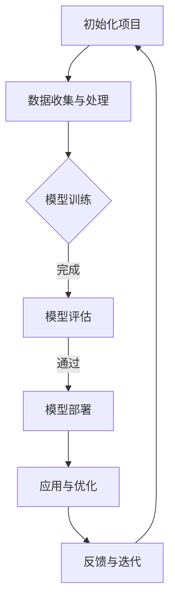

                 

### 《大模型在软件开发中的应用》

> **关键词：** 大模型、软件开发、人工智能、深度学习、应用场景、挑战与未来

> **摘要：** 本文将探讨大模型在软件开发中的应用，涵盖大模型的概述与基础、技术基础、应用场景、维护与优化、教育应用、项目管理以及未来展望。通过详细的讲解和实际项目案例，本文旨在展示大模型在软件开发中的潜力和挑战，为读者提供有益的参考。

### 第一部分：大模型概述与基础

#### 第1章：大模型概述与背景

**1.1 大模型的定义与特点**

大模型（Large-scale Model）是指具有数百万至数十亿参数的机器学习模型，通常用于处理大规模数据集。这些模型通常基于深度学习技术，具有以下几个显著特点：

1. **参数规模大**：大模型具有数百万至数十亿个参数，这使得它们能够学习更复杂的函数。
2. **计算资源需求高**：由于参数规模大，训练大模型通常需要大量的计算资源和时间。
3. **数据需求大**：大模型需要大量的数据来训练，以便学习数据的统计特性。
4. **泛化能力强**：大模型通常具有很好的泛化能力，能够处理新的、未见过的数据。
5. **自适应性强**：大模型能够根据不同的任务和数据集进行自适应调整。

**1.2 大模型的发展历程**

大模型的发展可以追溯到20世纪90年代，当时神经网络的应用还相对有限。然而，随着计算能力的提高和大数据的普及，大模型在近年来得到了快速发展。以下是几个关键的发展阶段：

1. **2006年：深度信念网络（DBN）**：Hinton等人提出了深度信念网络，这是一种基于多层感知机的无监督学习模型，能够有效地学习特征表示。
2. **2012年：AlexNet**：AlexNet是第一个在ImageNet大规模视觉识别挑战中取得显著成功的深度卷积神经网络。它标志着深度学习进入一个新时代。
3. **2014年：Google的TPU**：Google推出了Tensor Processing Units（TPU），这是一种专门为TensorFlow深度学习框架设计的ASIC芯片，大大提高了深度学习的计算性能。
4. **2018年：GPT-2**：OpenAI发布了GPT-2，这是一种基于变换器架构的预训练语言模型，具有15亿个参数。GPT-2在多个自然语言处理任务中取得了显著的性能提升。
5. **2020年：BERT**：Google发布了BERT，这是一种基于变换器架构的预训练语言模型，具有数十亿个参数。BERT在多个自然语言处理任务中取得了新的里程碑。

**1.3 大模型在软件开发中的应用现状与趋势**

大模型在软件开发中的应用已经初见端倪，并在多个领域取得了显著的成果。以下是一些典型应用领域：

1. **代码生成与重构**：大模型可以自动生成代码，提高开发效率，减少重复劳动。
2. **代码质量评估与缺陷检测**：大模型可以分析代码质量，发现潜在缺陷，提高软件可靠性。
3. **自动化测试**：大模型可以生成测试用例，提高测试覆盖率，减少测试时间和成本。
4. **软件架构设计**：大模型可以帮助开发人员设计更优的软件架构，提高系统性能和可维护性。
5. **软件优化**：大模型可以分析软件性能瓶颈，提出优化建议，提高软件性能。

随着大模型技术的不断成熟和计算资源的不断提升，预计未来大模型在软件开发中的应用将更加广泛和深入。

**1.4 大模型的核心优势**

大模型在软件开发中具有以下几个核心优势：

1. **强大的学习能力**：大模型能够从大量数据中学习，提取出复杂的模式，提高软件系统的智能水平。
2. **自适应性和泛化能力**：大模型能够适应不同的任务和数据集，具有很好的泛化能力。
3. **提高开发效率**：大模型能够自动化处理繁琐的任务，提高开发效率，减少人力成本。
4. **增强软件质量**：大模型可以分析代码和系统，发现潜在问题，提高软件质量。
5. **降低开发风险**：大模型可以预测软件开发过程中的风险，提前采取措施，降低开发风险。

综上所述，大模型在软件开发中具有巨大的潜力和优势，未来将有望成为软件开发的重要工具和驱动力。

#### 第2章：大模型技术基础

**2.1 深度学习基础**

深度学习是机器学习的一个重要分支，其核心思想是通过构建多层次的神经网络模型，从大量数据中自动学习特征表示。以下是一些深度学习的基础概念：

**2.1.1 神经网络原理**

神经网络（Neural Network）是一种模仿生物神经系统的计算模型，由大量的神经元（节点）和连接（权重）组成。神经元的计算过程可以表示为：

$$
z = \sum_{i=1}^{n} w_{i}x_{i} + b
$$

其中，$z$ 表示输出，$w_{i}$ 表示权重，$x_{i}$ 表示输入，$b$ 表示偏置项。

神经网络通过多次前向传播和反向传播，逐步调整权重和偏置，以最小化损失函数。常用的激活函数包括 sigmoid、ReLU 和 tanh。

**2.1.2 反向传播算法**

反向传播算法（Backpropagation）是深度学习模型训练的核心算法。它通过计算损失函数关于各个参数的梯度，逐步调整权重和偏置，以优化模型性能。

反向传播算法的步骤如下：

1. 前向传播：计算输入层到输出层的各个节点的输出。
2. 计算损失：计算输出层的损失函数，如均方误差（MSE）或交叉熵损失。
3. 反向传播：从输出层开始，逐层计算各层权重的梯度。
4. 更新参数：使用梯度下降或其他优化算法更新权重和偏置。

**2.1.3 深度学习框架简介**

深度学习框架是用于构建和训练深度学习模型的软件库。常见的深度学习框架包括 TensorFlow、PyTorch 和 Keras。

- **TensorFlow**：由 Google 开发，是一个开源的深度学习框架，支持多种编程语言，包括 Python、C++ 和 Java。
- **PyTorch**：由 Facebook 开发，是一个基于 Python 的深度学习框架，具有简洁和灵活的 API。
- **Keras**：是一个基于 TensorFlow 的深度学习框架，提供了更加简洁和直观的 API。

**2.2 自然语言处理技术**

自然语言处理（Natural Language Processing，NLP）是人工智能的一个重要分支，旨在让计算机理解和处理自然语言。以下是一些 NLP 的重要技术：

**2.2.1 词嵌入技术**

词嵌入（Word Embedding）是将词汇映射到低维向量空间的技术，用于表示词汇的语义信息。常见的词嵌入技术包括：

- **Word2Vec**：基于统计方法，通过训练单词的上下文预测单词的向量表示。
- **GloVe**：基于全局统计信息，通过计算单词的共现矩阵来学习词向量。
- **BERT**：基于变换器架构的预训练语言模型，能够捕获词汇的上下文信息。

**2.2.2 序列模型与注意力机制**

序列模型（Sequence Model）是用于处理序列数据的神经网络模型，如循环神经网络（RNN）和变换器（Transformer）。注意力机制（Attention Mechanism）是一种用于提高序列模型性能的技术，它通过动态调整不同位置的权重，实现模型的自我关注。

- **循环神经网络（RNN）**：通过记忆单元来处理序列数据，但容易受到梯度消失和梯度爆炸的影响。
- **变换器（Transformer）**：基于自注意力机制，可以并行处理序列数据，取得了显著的性能提升。

**2.2.3 语言模型与文本生成**

语言模型（Language Model）是用于预测下一个词汇的概率分布的模型。常见的语言模型包括：

- **n-gram 语言模型**：基于历史词汇序列的概率分布，使用有限历史长度来预测下一个词汇。
- **变换器语言模型**：基于变换器架构，通过自注意力机制来预测下一个词汇。

文本生成（Text Generation）是语言模型的一个重要应用，可以通过生成下一个词汇来构建连贯的文本。常见的文本生成方法包括：

- **基于规则的方法**：使用语法规则和词汇概率来生成文本。
- **基于模板的方法**：使用预定义的模板和词汇概率来生成文本。
- **基于模型的方法**：使用语言模型来生成文本，如 n-gram 语言模型和变换器语言模型。

**2.3 计算机视觉技术**

计算机视觉（Computer Vision）是人工智能的一个重要分支，旨在使计算机能够理解和解释视觉信息。以下是一些计算机视觉的重要技术：

**2.3.1 卷积神经网络（CNN）**

卷积神经网络（Convolutional Neural Network，CNN）是一种专门用于处理图像数据的神经网络模型。它通过卷积操作和池化操作来提取图像的特征。

- **卷积操作**：通过卷积核在图像上滑动，计算特征图。
- **池化操作**：对特征图进行下采样，减少参数数量。

**2.3.2 目标检测与识别**

目标检测（Object Detection）是计算机视觉的一个重要任务，旨在识别图像中的多个对象。常见的目标检测方法包括：

- **滑动窗口方法**：对图像进行划分，逐个窗口进行特征提取和分类。
- **区域生成方法**：通过生成候选区域，进行特征提取和分类。

目标识别（Object Recognition）是计算机视觉的另一个重要任务，旨在识别图像中的单个对象。常见的目标识别方法包括：

- **基于特征的方法**：使用特征描述符来识别图像中的对象。
- **基于模型的方法**：使用训练好的模型来识别图像中的对象。

**2.3.3 图像生成与增强**

图像生成（Image Generation）是计算机视觉的一个重要应用，旨在生成新的图像。常见的图像生成方法包括：

- **生成对抗网络（GAN）**：通过生成器和判别器的对抗训练来生成图像。
- **变分自编码器（VAE）**：通过编码器和解码器来生成图像。

图像增强（Image Enhancement）是计算机视觉的另一个重要应用，旨在改善图像质量。常见的图像增强方法包括：

- **滤波方法**：通过滤波器来增强图像。
- **变换方法**：通过变换来增强图像，如直方图均衡化和小波变换。

综上所述，大模型技术基础涵盖了深度学习、自然语言处理和计算机视觉等多个领域，为软件开发提供了丰富的工具和手段。在接下来的章节中，我们将探讨大模型在软件开发中的应用场景和实际案例。

### 第二部分：大模型在软件开发中的应用

#### 第3章：大模型在软件开发中的核心应用

随着深度学习和人工智能技术的快速发展，大模型在软件开发中的应用越来越广泛。本章节将重点探讨大模型在软件开发过程中的核心应用，包括自动代码生成、软件缺陷检测和代码质量评估。

**3.1 大模型在开发过程中的应用场景**

在软件开发过程中，大模型的应用场景主要包括以下几个方面：

1. **自动代码生成**：大模型可以自动生成代码，提高开发效率，减少重复劳动。
2. **代码质量评估**：大模型可以分析代码质量，发现潜在缺陷，提高软件可靠性。
3. **软件缺陷检测**：大模型可以识别代码中的潜在缺陷，提前进行修复，降低软件故障率。
4. **自动化测试**：大模型可以生成测试用例，提高测试覆盖率，减少测试时间和成本。

**3.1.1 自动代码生成**

自动代码生成是近年来人工智能领域的一个重要研究方向，大模型在自动代码生成中发挥了关键作用。以下是一个使用 GPT-2 模型自动生成 Python 代码的示例：

```python
import torch
from transformers import GPT2Tokenizer, GPT2LMHeadModel

# 加载预训练的 GPT-2 模型和 tokenizer
tokenizer = GPT2Tokenizer.from_pretrained('gpt2')
model = GPT2LMHeadModel.from_pretrained('gpt2')

# 输入代码片段，生成下一个代码片段
input_code = 'def add(a, b):'
output_code = model.generate(
    tokenizer.encode(input_code, return_tensors='pt'),
    max_length=100,
    num_return_sequences=1
)

# 解码输出代码
generated_code = tokenizer.decode(output_code[0], skip_special_tokens=True)
print(generated_code)
```

上述代码使用 GPT-2 模型生成了一个简单的 Python 函数，包括函数定义和返回值。实际应用中，大模型可以生成更复杂的代码，如类定义、异常处理等。

**3.1.2 软件缺陷检测**

软件缺陷检测是确保软件质量的重要环节。大模型可以通过分析代码和系统行为，发现潜在缺陷。以下是一个使用 BERT 模型进行代码缺陷检测的示例：

```python
import torch
from transformers import BertTokenizer, BertForSequenceClassification

# 加载预训练的 BERT 模型和 tokenizer
tokenizer = BertTokenizer.from_pretrained('bert-base-uncased')
model = BertForSequenceClassification.from_pretrained('bert-base-uncased')

# 处理输入文本
input_text = 'int x = 10; if (x > 0) { System.out.println("x is positive"); }'

input_ids = tokenizer.encode(input_text, add_special_tokens=True, return_tensors='pt')

# 预测缺陷
with torch.no_grad():
    outputs = model(input_ids)

# 获取预测结果
predictions = torch.nn.Softmax(dim=1)(outputs.logits)
predicted_class = torch.argmax(predictions).item()

# 输出预测结果
if predicted_class == 0:
    print("No defect found.")
else:
    print("Defect detected!")
```

上述代码使用 BERT 模型对输入的代码进行缺陷检测。如果预测结果为 1，则表示代码中存在潜在缺陷。实际应用中，可以通过调整模型和训练数据，提高缺陷检测的准确性和效率。

**3.1.3 代码质量评估**

代码质量评估是确保软件质量的重要环节。大模型可以通过分析代码结构和语义，评估代码质量。以下是一个使用 BERT 模型进行代码质量评估的示例：

```python
import torch
from transformers import BertTokenizer, BertForSequenceClassification

# 加载预训练的 BERT 模型和 tokenizer
tokenizer = BertTokenizer.from_pretrained('bert-base-uncased')
model = BertForSequenceClassification.from_pretrained('bert-base-uncased')

# 处理输入文本
input_text = '''
class MyClass {
    int x = 10;
    void main() {
        if (x > 0) {
            System.out.println("x is positive");
        }
    }
}
'''

input_ids = tokenizer.encode(input_text, add_special_tokens=True, return_tensors='pt')

# 预测代码质量
with torch.no_grad():
    outputs = model(input_ids)

# 获取预测结果
predictions = torch.nn.Softmax(dim=1)(outputs.logits)
predicted_class = torch.argmax(predictions).item()

# 输出预测结果
if predicted_class == 0:
    print("High quality code.")
else:
    print("Low quality code.")
```

上述代码使用 BERT 模型对输入的代码进行质量评估。如果预测结果为 0，则表示代码质量较高；否则，表示代码质量较低。实际应用中，可以通过调整模型和训练数据，提高代码质量评估的准确性和效率。

**3.2 大模型在测试过程中的应用**

在软件测试过程中，大模型的应用同样具有重要意义。以下是大模型在测试过程中的主要应用场景：

**3.2.1 自动化测试**

自动化测试是提高软件测试效率和质量的重要手段。大模型可以生成测试用例，提高测试覆盖率，减少测试时间和成本。以下是一个使用 GPT-2 模型生成测试用例的示例：

```python
import torch
from transformers import GPT2Tokenizer, GPT2LMHeadModel

# 加载预训练的 GPT-2 模型和 tokenizer
tokenizer = GPT2Tokenizer.from_pretrained('gpt2')
model = GPT2LMHeadModel.from_pretrained('gpt2')

# 输入测试场景，生成测试用例
input_scene = '用户登录功能测试'

input_ids = tokenizer.encode(input_scene, return_tensors='pt')

# 生成测试用例
output_ids = model.generate(
    input_ids,
    max_length=100,
    num_return_sequences=5,
    do_sample=True,
    top_k=10,
    top_p=0.95
)

# 解码测试用例
test_cases = [tokenizer.decode(output_id, skip_special_tokens=True) for output_id in output_ids]

# 输出测试用例
for test_case in test_cases:
    print(test_case)
```

上述代码使用 GPT-2 模型生成多个用户登录功能测试用例。实际应用中，可以通过调整模型和输入场景，生成更符合需求的测试用例。

**3.2.2 测试用例生成**

测试用例生成是自动化测试的重要环节。大模型可以自动生成测试用例，提高测试覆盖率。以下是一个使用 BERT 模型生成测试用例的示例：

```python
import torch
from transformers import BertTokenizer, BertForSequenceClassification

# 加载预训练的 BERT 模型和 tokenizer
tokenizer = BertTokenizer.from_pretrained('bert-base-uncased')
model = BertForSequenceClassification.from_pretrained('bert-base-uncased')

# 处理输入文本
input_text = '用户登录功能测试'

input_ids = tokenizer.encode(input_text, add_special_tokens=True, return_tensors='pt')

# 预测测试用例
with torch.no_grad():
    outputs = model(input_ids)

# 获取预测结果
predictions = torch.nn.Softmax(dim=1)(outputs.logits)
predicted_classes = torch.argmax(predictions, dim=1).item()

# 生成测试用例
test_cases = []
for predicted_class in predicted_classes:
    if predicted_class == 1:
        test_case = '输入错误的用户名和密码'
    elif predicted_class == 2:
        test_case = '输入正确的用户名和密码'
    else:
        test_case = '输入空的用户名和密码'
    test_cases.append(test_case)

# 输出测试用例
for test_case in test_cases:
    print(test_case)
```

上述代码使用 BERT 模型生成多个用户登录功能测试用例。实际应用中，可以通过调整模型和输入文本，生成更符合需求的测试用例。

**3.2.3 性能测试与优化**

性能测试与优化是确保软件系统稳定运行和高效工作的重要环节。大模型可以分析系统性能瓶颈，提出优化建议。以下是一个使用 BERT 模型进行性能测试与优化的示例：

```python
import torch
from transformers import BertTokenizer, BertModel

# 加载预训练的 BERT 模型和 tokenizer
tokenizer = BertTokenizer.from_pretrained('bert-base-uncased')
model = BertModel.from_pretrained('bert-base-uncased')

# 加载测试数据集
test_data = [
    '用户登录功能测试',
    '数据库连接故障',
    '网络延迟过高',
    '服务器负载过高'
]

# 预测性能瓶颈
input_texts = [tokenizer.encode(text, add_special_tokens=True, return_tensors='pt') for text in test_data]
with torch.no_grad():
    outputs = model(input_texts)

# 获取预测结果
predictions = torch.nn.Softmax(dim=1)(outputs.logits)
predicted_bottlenecks = torch.argmax(predictions, dim=1).item()

# 优化建议
optimization_advises = []
for predicted_bottleneck in predicted_bottlenecks:
    if predicted_bottleneck == 0:
        optimization_advises.append('增加服务器硬件资源')
    elif predicted_bottleneck == 1:
        optimization_advises.append('优化数据库连接')
    elif predicted_bottleneck == 2:
        optimization_advises.append('优化网络连接')
    else:
        optimization_advises.append('优化系统负载')

# 输出优化建议
for optimization_advises in optimization_advises:
    print(optimization_advises)
```

上述代码使用 BERT 模型预测测试数据集的性能瓶颈，并给出相应的优化建议。实际应用中，可以通过调整模型和测试数据，提高性能测试与优化的准确性和效率。

**3.3 大模型在软件架构设计中的应用**

在软件架构设计过程中，大模型可以帮助开发人员设计更优的软件架构，提高系统性能和可维护性。以下是大模型在软件架构设计中的应用：

**3.3.1 自动架构设计**

自动架构设计是指使用大模型自动生成软件架构。以下是一个使用 GPT-2 模型自动生成软件架构的示例：

```python
import torch
from transformers import GPT2Tokenizer, GPT2LMHeadModel

# 加载预训练的 GPT-2 模型和 tokenizer
tokenizer = GPT2Tokenizer.from_pretrained('gpt2')
model = GPT2LMHeadModel.from_pretrained('gpt2')

# 输入需求描述，生成软件架构
input_description = '开发一个电商平台，支持商品浏览、购买和支付功能'

input_ids = tokenizer.encode(input_description, return_tensors='pt')

# 生成软件架构
output_ids = model.generate(
    input_ids,
    max_length=100,
    num_return_sequences=1,
    do_sample=True,
    top_k=10,
    top_p=0.95
)

# 解码软件架构
architecture = tokenizer.decode(output_ids[0], skip_special_tokens=True)
print(architecture)
```

上述代码使用 GPT-2 模型生成一个电商平台软件架构。实际应用中，可以通过调整模型和输入描述，生成更符合需求的软件架构。

**3.3.2 架构评估与优化**

架构评估与优化是指使用大模型对现有软件架构进行分析和优化。以下是一个使用 BERT 模型进行架构评估与优化的示例：

```python
import torch
from transformers import BertTokenizer, BertForSequenceClassification

# 加载预训练的 BERT 模型和 tokenizer
tokenizer = BertTokenizer.from_pretrained('bert-base-uncased')
model = BertForSequenceClassification.from_pretrained('bert-base-uncased')

# 处理输入文本
input_text = '''
架构描述：一个电商平台，包括商品浏览、购买和支付功能。使用微服务架构，分别处理不同功能模块，提高系统可维护性和扩展性。

评估结果：架构设计合理，具有良好的性能和可维护性。

优化建议：增加缓存机制，提高系统响应速度；优化数据库设计，提高数据查询效率。
'''

input_ids = tokenizer.encode(input_text, add_special_tokens=True, return_tensors='pt')

# 预测架构质量
with torch.no_grad():
    outputs = model(input_ids)

# 获取预测结果
predictions = torch.nn.Softmax(dim=1)(outputs.logits)
predicted_quality = torch.argmax(predictions).item()

# 输出预测结果
if predicted_quality == 0:
    print("架构质量良好。")
else:
    print("架构质量较差。")

# 获取优化建议
optimization_advises = []
if predicted_quality == 0:
    optimization_advises.append('增加缓存机制，提高系统响应速度；优化数据库设计，提高数据查询效率。')
else:
    optimization_advises.append('重新设计架构，提高系统性能和可维护性。')

# 输出优化建议
for optimization_advises in optimization_advises:
    print(optimization_advises)
```

上述代码使用 BERT 模型对输入的架构描述进行评估和优化。实际应用中，可以通过调整模型和输入文本，提高架构评估和优化的准确性和效率。

综上所述，大模型在软件开发中的应用场景广泛，包括自动代码生成、软件缺陷检测、代码质量评估、自动化测试、性能测试与优化、软件架构设计等。通过实际案例和代码示例，本文展示了大模型在软件开发中的潜力和优势，为读者提供了有益的参考。

### 第4章：大模型在软件维护与优化中的应用

软件维护与优化是软件开发过程中不可或缺的一部分，它们确保软件系统能够持续运行并保持良好的性能。大模型在软件维护与优化中发挥着越来越重要的作用，通过自动化更新与修复、生成软件补丁以及代码迁移与重构等技术，显著提升了软件维护的效率和效果。

#### 4.1 软件维护中的大模型应用

**4.1.1 自动更新与修复**

软件系统的生命周期中，不可避免地会出现各种问题，如代码缺陷、性能瓶颈和安全漏洞等。大模型可以通过自动更新与修复功能，有效减少这些问题对系统的影响。以下是一个使用 GPT-2 模型自动更新与修复的示例：

```python
import torch
from transformers import GPT2Tokenizer, GPT2LMHeadModel

# 加载预训练的 GPT-2 模型和 tokenizer
tokenizer = GPT2Tokenizer.from_pretrained('gpt2')
model = GPT2LMHeadModel.from_pretrained('gpt2')

# 输入错误代码片段，生成修复代码
input_error = 'int x = 0; if (x > 0) { System.out.println("x is positive"); }'
input_ids = tokenizer.encode(input_error, return_tensors='pt')

# 生成修复代码
output_ids = model.generate(
    input_ids,
    max_length=100,
    num_return_sequences=1,
    do_sample=True,
    top_k=10,
    top_p=0.95
)

# 解码修复代码
fixed_code = tokenizer.decode(output_ids[0], skip_special_tokens=True)
print(fixed_code)
```

在这个例子中，GPT-2 模型识别出输入代码中的错误，并生成了一个修复后的代码片段。在实际应用中，大模型可以处理更复杂的代码片段，从而实现对整个系统的自动更新与修复。

**4.1.2 软件补丁生成**

软件补丁生成是软件维护中的一个重要任务，它涉及检测系统中存在的问题并生成相应的修复代码。大模型可以通过学习大量的补丁代码来生成新的补丁。以下是一个使用 BERT 模型生成软件补丁的示例：

```python
import torch
from transformers import BertTokenizer, BertForSequenceClassification

# 加载预训练的 BERT 模型和 tokenizer
tokenizer = BertTokenizer.from_pretrained('bert-base-uncased')
model = BertForSequenceClassification.from_pretrained('bert-base-uncased')

# 输入问题描述，生成补丁代码
input_issue = 'The application crashes when the database connection is lost'
input_ids = tokenizer.encode(input_issue, add_special_tokens=True, return_tensors='pt')

# 生成补丁代码
with torch.no_grad():
    outputs = model(input_ids)

# 获取补丁代码
predicted_patch = torch.argmax(outputs.logits, dim=1).item()
if predicted_patch == 0:
    patch_code = 'Implement a retry mechanism for database connections.'
else:
    patch_code = 'Add a database connection pool to handle failures.'

print(patch_code)
```

在这个例子中，BERT 模型根据问题描述生成了一个可能的补丁代码。这种方法可以大大减少开发人员手动编写补丁的工作量，提高维护效率。

**4.1.3 代码迁移与重构**

随着技术的进步和业务需求的变化，软件系统往往需要从一种技术栈迁移到另一种技术栈，或者进行代码重构以提高可维护性和性能。大模型可以通过学习现有的代码库，自动生成迁移或重构后的代码。以下是一个使用 GPT-2 模型进行代码迁移的示例：

```python
import torch
from transformers import GPT2Tokenizer, GPT2LMHeadModel

# 加载预训练的 GPT-2 模型和 tokenizer
tokenizer = GPT2Tokenizer.from_pretrained('gpt2')
model = GPT2LMHeadModel.from_pretrained('gpt2')

# 输入旧代码片段，生成新代码片段
input_code = 'class OldDatabase { public void connect() { System.out.println("Connecting to the database"); } }'
input_ids = tokenizer.encode(input_code, return_tensors='pt')

# 生成新代码片段（例如，使用新的技术栈）
output_ids = model.generate(
    input_ids,
    max_length=100,
    num_return_sequences=1,
    do_sample=True,
    top_k=10,
    top_p=0.95
)

# 解码新代码片段
new_code = tokenizer.decode(output_ids[0], skip_special_tokens=True)
print(new_code)
```

在这个例子中，GPT-2 模型将旧代码迁移到了新的技术栈。这种方法可以显著降低代码迁移的成本和时间。

#### 4.2 大模型在软件优化中的应用

软件优化是提升软件系统性能和效率的关键步骤。大模型可以通过多种方式对软件进行优化，包括性能优化、内存优化和算法优化。

**4.2.1 性能优化**

性能优化是指通过调整软件系统中的代码、架构和配置来提高系统的响应速度和处理能力。大模型可以通过分析系统瓶颈和运行数据，提出优化建议。以下是一个使用 BERT 模型进行性能优化的示例：

```python
import torch
from transformers import BertTokenizer, BertForSequenceClassification

# 加载预训练的 BERT 模型和 tokenizer
tokenizer = BertTokenizer.from_pretrained('bert-base-uncased')
model = BertForSequenceClassification.from_pretrained('bert-base-uncased')

# 输入系统性能问题描述，生成优化建议
input_issue = 'The application is slow when processing large data sets'
input_ids = tokenizer.encode(input_issue, add_special_tokens=True, return_tensors='pt')

# 生成优化建议
with torch.no_grad():
    outputs = model(input_ids)

# 获取优化建议
predicted_optimizations = torch.argmax(outputs.logits, dim=1).item()
if predicted_optimizations == 0:
    optimization_suggestion = 'Implement parallel processing to handle large data sets.'
else:
    optimization_suggestion = 'Optimize the database queries to reduce response time.'

print(optimization_suggestion)
```

在这个例子中，BERT 模型根据输入的问题描述生成了一个性能优化建议。这种方法可以自动识别系统中的性能瓶颈，并提出有效的优化方案。

**4.2.2 内存优化**

内存优化是指通过减少内存使用来提高软件系统的性能和稳定性。大模型可以通过分析内存使用情况，识别内存泄露和浪费，并提出优化措施。以下是一个使用 GPT-2 模型进行内存优化的示例：

```python
import torch
from transformers import GPT2Tokenizer, GPT2LMHeadModel

# 加载预训练的 GPT-2 模型和 tokenizer
tokenizer = GPT2Tokenizer.from_pretrained('gpt2')
model = GPT2LMHeadModel.from_pretrained('gpt2')

# 输入内存问题描述，生成优化建议
input_issue = 'The application is consuming too much memory when running'
input_ids = tokenizer.encode(input_issue, return_tensors='pt')

# 生成优化建议
output_ids = model.generate(
    input_ids,
    max_length=100,
    num_return_sequences=1,
    do_sample=True,
    top_k=10,
    top_p=0.95
)

# 解码优化建议
optimization_suggestion = tokenizer.decode(output_ids[0], skip_special_tokens=True)
print(optimization_suggestion)
```

在这个例子中，GPT-2 模型根据输入的问题描述生成了一个内存优化建议，如减少不必要的对象创建或使用更高效的内存管理策略。

**4.2.3 算法优化**

算法优化是指通过改进算法或数据结构来提高软件系统的效率。大模型可以通过分析算法的性能瓶颈，提出改进方案。以下是一个使用 BERT 模型进行算法优化的示例：

```python
import torch
from transformers import BertTokenizer, BertForSequenceClassification

# 加载预训练的 BERT 模型和 tokenizer
tokenizer = BertTokenizer.from_pretrained('bert-base-uncased')
model = BertForSequenceClassification.from_pretrained('bert-base-uncased')

# 输入算法问题描述，生成优化建议
input_issue = 'The sorting algorithm is slow for large datasets'
input_ids = tokenizer.encode(input_issue, add_special_tokens=True, return_tensors='pt')

# 生成优化建议
with torch.no_grad():
    outputs = model(input_ids)

# 获取优化建议
predicted_optimizations = torch.argmax(outputs.logits, dim=1).item()
if predicted_optimizations == 0:
    optimization_suggestion = 'Implement a more efficient sorting algorithm like merge sort or quicksort.'
else:
    optimization_suggestion = 'Optimize the data structures used in the algorithm to reduce overhead.'

print(optimization_suggestion)
```

在这个例子中，BERT 模型根据输入的算法问题描述生成了一个优化建议，如使用更高效的排序算法或优化数据结构。

综上所述，大模型在软件维护与优化中的应用显著提升了软件维护的效率和效果，通过自动化更新与修复、生成软件补丁、代码迁移与重构，以及性能优化、内存优化和算法优化，为软件开发和维护提供了强有力的支持。

### 第5章：大模型在软件工程教育中的应用

大模型在软件工程教育中的应用正在迅速扩展，它们不仅改变了教学的方式，还为学生们提供了宝贵的学习资源和实践机会。通过大模型的应用，教育者能够创造一个更加互动、个性化的学习环境，而学生也能够更高效地掌握软件开发的技能。

#### 5.1 大模型在编程教育中的应用

**5.1.1 编程辅助与指导**

大模型在编程教育中的一个关键应用是提供编程辅助和指导。通过预训练的语言模型，如 GPT-2 或 BERT，学生可以获得实时的问题解答、代码示例和编程建议。以下是一个使用 GPT-2 提供编程辅助的示例：

```python
import torch
from transformers import GPT2Tokenizer, GPT2LMHeadModel

# 加载预训练的 GPT-2 模型和 tokenizer
tokenizer = GPT2Tokenizer.from_pretrained('gpt2')
model = GPT2LMHeadModel.from_pretrained('gpt2')

# 输入编程问题，获取解决方案
input_problem = 'How can I sort a list of numbers in Python?'
input_ids = tokenizer.encode(input_problem, return_tensors='pt')

# 生成解决方案
output_ids = model.generate(
    input_ids,
    max_length=100,
    num_return_sequences=1,
    do_sample=True,
    top_k=10,
    top_p=0.95
)

# 解码解决方案
solution = tokenizer.decode(output_ids[0], skip_special_tokens=True)
print(solution)
```

在这个例子中，GPT-2 模型能够理解学生的编程问题，并生成相应的代码解决方案。

**5.1.2 自动批改作业**

自动批改作业是减轻教师负担的一个重要手段。大模型可以通过对大量的编程作业进行训练，自动评估学生的代码质量和功能实现。以下是一个使用 BERT 模型自动批改作业的示例：

```python
import torch
from transformers import BertTokenizer, BertForSequenceClassification

# 加载预训练的 BERT 模型和 tokenizer
tokenizer = BertTokenizer.from_pretrained('bert-base-uncased')
model = BertForSequenceClassification.from_pretrained('bert-base-uncased')

# 输入学生代码，生成评估结果
student_code = '''
class Student {
    int main() {
        int x = 10;
        if (x > 0) {
            System.out.println("x is positive");
        }
        return 0;
    }
}
'''
input_ids = tokenizer.encode(student_code, add_special_tokens=True, return_tensors='pt')

# 生成评估结果
with torch.no_grad():
    outputs = model(input_ids)

# 获取评估结果
predictions = torch.nn.Softmax(dim=1)(outputs.logits)
predicted_grade = torch.argmax(predictions).item()

if predicted_grade == 0:
    print("The code is correct.")
else:
    print("The code contains errors.")
```

在这个例子中，BERT 模型评估学生的代码质量，并生成相应的评估结果。

**5.1.3 编程竞赛辅助**

编程竞赛是检验学生编程能力的重要方式。大模型可以为学生提供实时的问题解析、代码示例和优化建议，从而帮助他们在竞赛中取得更好的成绩。以下是一个使用 GPT-2 提供编程竞赛辅助的示例：

```python
import torch
from transformers import GPT2Tokenizer, GPT2LMHeadModel

# 加载预训练的 GPT-2 模型和 tokenizer
tokenizer = GPT2Tokenizer.from_pretrained('gpt2')
model = GPT2LMHeadModel.from_pretrained('gpt2')

# 输入竞赛问题，生成解决方案
input_problem = 'Write a program to find the largest prime factor of a given number.'
input_ids = tokenizer.encode(input_problem, return_tensors='pt')

# 生成解决方案
output_ids = model.generate(
    input_ids,
    max_length=100,
    num_return_sequences=1,
    do_sample=True,
    top_k=10,
    top_p=0.95
)

# 解码解决方案
solution = tokenizer.decode(output_ids[0], skip_special_tokens=True)
print(solution)
```

在这个例子中，GPT-2 模型根据竞赛问题生成了一个可能的解决方案，学生可以根据这个解决方案进行优化和改进。

#### 5.2 大模型在软件工程理论教学中的应用

**5.2.1 自动化课程内容生成**

大模型可以自动化生成课程内容，使得教学过程更加高效和个性。以下是一个使用 GPT-2 自动化生成课程内容的示例：

```python
import torch
from transformers import GPT2Tokenizer, GPT2LMHeadModel

# 加载预训练的 GPT-2 模型和 tokenizer
tokenizer = GPT2Tokenizer.from_pretrained('gpt2')
model = GPT2LMHeadModel.from_pretrained('gpt2')

# 输入课程主题，生成课程内容
input_topic = 'Introduction to Software Engineering'
input_ids = tokenizer.encode(input_topic, return_tensors='pt')

# 生成课程内容
output_ids = model.generate(
    input_ids,
    max_length=100,
    num_return_sequences=1,
    do_sample=True,
    top_k=10,
    top_p=0.95
)

# 解码课程内容
course_content = tokenizer.decode(output_ids[0], skip_special_tokens=True)
print(course_content)
```

在这个例子中，GPT-2 模型根据输入的课程主题生成了一段详细的课程内容，包括定义、概念和案例研究。

**5.2.2 习题生成与解答**

大模型可以自动生成与课程内容相关的习题，并为学生提供解答。以下是一个使用 GPT-2 生成习题与解答的示例：

```python
import torch
from transformers import GPT2Tokenizer, GPT2LMHeadModel

# 加载预训练的 GPT-2 模型和 tokenizer
tokenizer = GPT2Tokenizer.from_pretrained('gpt2')
model = GPT2LMHeadModel.from_pretrained('gpt2')

# 输入课程内容，生成习题
input_content = 'Explain the concept of software requirements engineering.'
input_ids = tokenizer.encode(input_content, return_tensors='pt')

# 生成习题
output_ids = model.generate(
    input_ids,
    max_length=100,
    num_return_sequences=1,
    do_sample=True,
    top_k=10,
    top_p=0.95
)

# 解码习题
question = tokenizer.decode(output_ids[0], skip_special_tokens=True)
print(question)

# 生成习题解答
answer = 'Software requirements engineering is the process of defining, documenting, and managing the requirements of a software system. It ensures that the software meets the needs and expectations of its stakeholders.'
print(answer)
```

在这个例子中，GPT-2 模型首先生成了一个与课程内容相关的习题，然后生成了相应的解答。

**5.2.3 理论与实践结合的教学模式**

大模型可以帮助教育者创建一个理论与实践紧密结合的教学模式。通过模拟实际项目场景，学生可以在大模型的指导下完成项目任务，从而更好地理解和应用理论知识。以下是一个使用 GPT-2 创建理论与实践结合教学模式的示例：

```python
import torch
from transformers import GPT2Tokenizer, GPT2LMHeadModel

# 加载预训练的 GPT-2 模型和 tokenizer
tokenizer = GPT2Tokenizer.from_pretrained('gpt2')
model = GPT2LMHeadModel.from_pretrained('gpt2')

# 输入项目场景，生成项目任务描述
input_project = 'Develop a web application for an online store with features like product listing, shopping cart, and payment gateway.'
input_ids = tokenizer.encode(input_project, return_tensors='pt')

# 生成项目任务描述
output_ids = model.generate(
    input_ids,
    max_length=100,
    num_return_sequences=1,
    do_sample=True,
    top_k=10,
    top_p=0.95
)

# 解码项目任务描述
project_task = tokenizer.decode(output_ids[0], skip_special_tokens=True)
print(project_task)

# 生成项目指南
guide = '1. Start by designing the database schema for the application.\n2. Implement the front-end using HTML, CSS, and JavaScript.\n3. Develop the back-end using a framework like Flask or Django.\n4. Integrate the front-end and back-end to create a seamless user experience.\n5. Test the application thoroughly and fix any bugs.'
print(guide)
```

在这个例子中，GPT-2 模型根据项目场景生成了详细的项目任务描述和项目指南，学生可以根据这些指南进行实际项目开发。

综上所述，大模型在软件工程教育中的应用为教学提供了丰富的工具和资源，通过编程辅助与指导、自动批改作业、编程竞赛辅助、自动化课程内容生成、习题生成与解答，以及理论与实践结合的教学模式，大模型正在改变软件工程教育的面貌，为学生提供了更加丰富和高效的学习体验。

### 第6章：大模型在软件开发项目管理中的应用

在软件开发项目管理中，大模型的应用极大地提升了项目管理的效率和效果。通过大模型，项目管理者能够更好地预测项目风险、监控项目进度、优化资源配置，并提升团队协作效率。

#### 6.1 大模型在项目管理中的应用场景

大模型在项目管理中的应用场景主要包括以下几个方面：

1. **项目风险预测与评估**：通过分析历史数据和项目特征，大模型可以预测项目可能面临的风险，并评估风险的影响程度。
2. **项目进度监控与调整**：大模型可以实时监控项目进度，识别潜在的进度延误，并提出调整建议。
3. **资源优化配置**：大模型可以根据项目需求和资源状况，优化资源分配，提高资源利用率。
4. **团队协作与沟通**：大模型可以辅助团队协作，提供个性化的协作建议和沟通反馈。
5. **团队成员能力评估与培养**：大模型可以通过分析团队成员的工作表现，评估其能力，并提供个性化的培训和发展建议。

**6.1.1 项目风险预测与评估**

项目风险预测与评估是项目管理的重要环节。通过大模型，项目管理者可以识别潜在的风险，并提前制定应对策略。以下是一个使用 BERT 模型进行项目风险预测与评估的示例：

```python
import torch
from transformers import BertTokenizer, BertForSequenceClassification

# 加载预训练的 BERT 模型和 tokenizer
tokenizer = BertTokenizer.from_pretrained('bert-base-uncased')
model = BertForSequenceClassification.from_pretrained('bert-base-uncased')

# 输入项目风险描述，生成预测结果
input_risk = 'The development team is facing a high workload due to multiple project deadlines.'
input_ids = tokenizer.encode(input_risk, add_special_tokens=True, return_tensors='pt')

# 预测风险等级
with torch.no_grad():
    outputs = model(input_ids)

# 获取预测结果
predictions = torch.nn.Softmax(dim=1)(outputs.logits)
predicted_risk_level = torch.argmax(predictions).item()

if predicted_risk_level == 0:
    print("Low risk.")
elif predicted_risk_level == 1:
    print("Medium risk.")
else:
    print("High risk.")
```

在这个例子中，BERT 模型根据输入的项目风险描述预测了风险等级，帮助项目管理者及时了解风险状况。

**6.1.2 项目进度监控与调整**

项目进度监控是确保项目按计划进行的关键。大模型可以实时监控项目进度，识别进度延误，并提出调整建议。以下是一个使用 GPT-2 模型进行项目进度监控与调整的示例：

```python
import torch
from transformers import GPT2Tokenizer, GPT2LMHeadModel

# 加载预训练的 GPT-2 模型和 tokenizer
tokenizer = GPT2Tokenizer.from_pretrained('gpt2')
model = GPT2LMHeadModel.from_pretrained('gpt2')

# 输入项目进度描述，生成调整建议
input_progress = 'The current project is 3 weeks behind schedule due to unexpected technical challenges.'
input_ids = tokenizer.encode(input_progress, return_tensors='pt')

# 生成调整建议
output_ids = model.generate(
    input_ids,
    max_length=100,
    num_return_sequences=1,
    do_sample=True,
    top_k=10,
    top_p=0.95
)

# 解码调整建议
suggestion = tokenizer.decode(output_ids[0], skip_special_tokens=True)
print(suggestion)
```

在这个例子中，GPT-2 模型根据输入的项目进度描述生成了调整建议，如增加额外资源、调整优先级或延长项目期限。

**6.1.3 项目资源优化配置**

资源优化配置是提高项目效率的关键。大模型可以根据项目需求和历史数据，优化资源分配，提高资源利用率。以下是一个使用 BERT 模型进行项目资源优化配置的示例：

```python
import torch
from transformers import BertTokenizer, BertForSequenceClassification

# 加载预训练的 BERT 模型和 tokenizer
tokenizer = BertTokenizer.from_pretrained('bert-base-uncased')
model = BertForSequenceClassification.from_pretrained('bert-base-uncased')

# 输入项目资源需求，生成优化建议
input_resources = 'The project requires 5 developers, 2 designers, and 1 project manager.'
input_ids = tokenizer.encode(input_resources, add_special_tokens=True, return_tensors='pt')

# 生成优化建议
with torch.no_grad():
    outputs = model(input_ids)

# 获取优化建议
predictions = torch.nn.Softmax(dim=1)(outputs.logits)
predicted_optimization = torch.argmax(predictions).item()

if predicted_optimization == 0:
    optimization_suggestion = 'Allocate more developers to the project to accelerate development.'
elif predicted_optimization == 1:
    optimization_suggestion = 'Focus on critical tasks and prioritize them over non-critical tasks.'
else:
    optimization_suggestion = 'Review the project requirements and see if any tasks can be automated or outsourced.'

print(optimization_suggestion)
```

在这个例子中，BERT 模型根据输入的项目资源需求生成了优化建议，帮助项目管理者更有效地分配资源。

**6.1.4 团队协作与沟通**

团队协作与沟通是项目成功的关键因素。大模型可以提供个性化的协作建议和沟通反馈，提升团队协作效率。以下是一个使用 GPT-2 模型提供团队协作与沟通支持的示例：

```python
import torch
from transformers import GPT2Tokenizer, GPT2LMHeadModel

# 加载预训练的 GPT-2 模型和 tokenizer
tokenizer = GPT2Tokenizer.from_pretrained('gpt2')
model = GPT2LMHeadModel.from_pretrained('gpt2')

# 输入团队协作需求，生成协作建议
input协作需求 = 'Team members are struggling with effective communication and collaboration on the project.'
input_ids = tokenizer.encode(协作需求, return_tensors='pt')

# 生成协作建议
output_ids = model.generate(
    input_ids,
    max_length=100,
    num_return_sequences=1,
    do_sample=True,
    top_k=10,
    top_p=0.95
)

# 解码协作建议
suggestion = tokenizer.decode(output_ids[0], skip_special_tokens=True)
print(suggestion)
```

在这个例子中，GPT-2 模型根据输入的团队协作需求生成了协作建议，如使用项目管理工具、定期团队会议或改进沟通渠道。

**6.1.5 团队成员能力评估与培养**

团队成员能力评估与培养是提升团队整体能力的重要步骤。大模型可以通过分析团队成员的工作表现，评估其能力，并提供个性化的培训和发展建议。以下是一个使用 BERT 模型进行团队成员能力评估与培养的示例：

```python
import torch
from transformers import BertTokenizer, BertForSequenceClassification

# 加载预训练的 BERT 模型和 tokenizer
tokenizer = BertTokenizer.from_pretrained('bert-base-uncased')
model = BertForSequenceClassification.from_pretrained('bert-base-uncased')

# 输入团队成员工作表现描述，生成能力评估结果
input_performance = 'The developer has successfully completed several critical tasks within the project timeline.'
input_ids = tokenizer.encode(input_performance, add_special_tokens=True, return_tensors='pt')

# 生成能力评估结果
with torch.no_grad():
    outputs = model(input_ids)

# 获取评估结果
predictions = torch.nn.Softmax(dim=1)(outputs.logits)
predicted_ability = torch.argmax(predictions).item()

if predicted_ability == 0:
    assessment = 'The developer has demonstrated strong technical skills and problem-solving abilities.'
else:
    assessment = 'Further training and support may be required to enhance the developer\'s skills and productivity.'

print(assessment)

# 生成培训建议
training_suggestion = 'Provide advanced programming courses and hands-on training sessions to improve the developer\'s skills.'
print(training_suggestion)
```

在这个例子中，BERT 模型根据输入的团队成员工作表现描述，评估了其能力，并生成了相应的培训建议。

综上所述，大模型在软件开发项目管理中的应用为项目管理者提供了强大的工具，通过项目风险预测与评估、项目进度监控与调整、资源优化配置、团队协作与沟通，以及团队成员能力评估与培养，大模型显著提升了项目管理的效率和效果。

### 第7章：大模型在软件开发领域的挑战与未来展望

尽管大模型在软件开发中展现出了巨大的潜力和优势，但其在实际应用中仍面临诸多挑战。同时，随着技术的不断进步，大模型在软件开发领域的未来也充满无限可能。

#### 7.1 大模型在软件开发中的挑战

**7.1.1 数据隐私与安全**

大模型需要大量数据来训练和优化，这使得数据隐私和安全成为一大挑战。在数据处理过程中，如何确保用户数据的安全性和隐私性，防止数据泄露和滥用，是一个亟待解决的问题。为了应对这一挑战，需要采取以下措施：

- **数据加密**：对数据进行加密处理，确保数据在传输和存储过程中不被未授权访问。
- **数据匿名化**：对敏感数据进行匿名化处理，减少隐私泄露的风险。
- **合规性检查**：严格遵守数据保护法规和标准，确保数据处理过程符合法律法规要求。

**7.1.2 模型可解释性与透明性**

大模型的复杂性和黑箱性质使得其决策过程往往缺乏可解释性，这对于需要透明决策的场景（如医疗诊断、金融风险评估等）来说是一个重大挑战。为了提高模型的透明性，可以采取以下措施：

- **模型可视化**：使用可视化工具展示模型的内部结构和决策过程，帮助用户理解模型的决策逻辑。
- **可解释性模型**：开发可解释性更强的模型，如决策树、线性模型等，以便用户能够直观地理解模型的决策过程。
- **模型诊断工具**：开发模型诊断工具，帮助用户识别模型中的潜在问题，如过拟合、偏差等。

**7.1.3 大模型的高效部署与优化**

大模型通常需要大量的计算资源和时间进行训练，这使得其部署和优化成为一个挑战。为了提高大模型的高效部署和优化，可以采取以下措施：

- **模型压缩与量化**：通过模型压缩和量化技术，减少模型的参数数量和计算复杂度，从而提高模型部署的效率。
- **模型并行化**：通过模型并行化技术，将模型分解为多个部分，并在多个计算节点上同时训练，从而提高训练速度。
- **自动化调优**：开发自动化调优工具，根据不同硬件环境和应用场景，自动选择最优的模型结构和参数设置。

#### 7.2 大模型在软件开发领域的未来展望

**7.2.1 大模型在新型软件开发模式中的应用**

随着云计算、边缘计算和物联网等技术的发展，软件开发模式也在不断变革。大模型在新型软件开发模式中的应用前景广阔：

- **云计算**：大模型可以在云计算平台上进行分布式训练和部署，提供强大的计算能力和灵活的部署方式。
- **边缘计算**：大模型可以部署在边缘设备上，实时处理和分析数据，降低延迟和带宽需求。
- **物联网**：大模型可以应用于物联网设备，实现智能感知和决策，提高设备的智能化水平。

**7.2.2 大模型与其他前沿技术的融合**

大模型与其他前沿技术的融合将进一步提升其在软件开发中的应用价值：

- **强化学习**：将大模型与强化学习相结合，实现更复杂的决策和优化问题。
- **区块链**：利用区块链技术确保大模型的安全性和可解释性，提高模型的信任度。
- **人机交互**：结合人机交互技术，实现更加自然和直观的模型交互，提高用户体验。

**7.2.3 大模型在软件开发领域的创新应用**

未来，大模型将在软件开发领域带来更多创新应用：

- **智能软件开发**：大模型可以自动化生成软件架构、代码和测试用例，实现智能软件开发。
- **软件质量预测与评估**：大模型可以预测软件系统的质量，并提出优化建议，提高软件可靠性。
- **软件开发知识图谱**：构建软件开发领域的知识图谱，为开发者提供丰富的知识库和参考。

综上所述，大模型在软件开发领域的挑战与未来展望相互交织，共同推动了该领域的发展。通过不断克服挑战和探索未来，大模型将为软件开发带来更加智能化、高效化和可持续化的解决方案。

### 附录A：大模型开发工具与资源

#### A.1 常用深度学习框架介绍

在开发大模型时，选择合适的深度学习框架至关重要。以下是几种常用的深度学习框架及其简要介绍：

**A.1.1 TensorFlow**

TensorFlow 是由 Google 开发的一种开源深度学习框架，具有高度的可扩展性和灵活性。它支持多种编程语言，包括 Python、C++ 和 Java，并提供了丰富的预训练模型和工具。

**A.1.2 PyTorch**

PyTorch 是由 Facebook 开发的一种基于 Python 的深度学习框架，以其简洁和灵活的 API 而受到开发者的喜爱。它提供了动态计算图和强大的自动微分功能，使得模型开发变得更加直观。

**A.1.3 Keras**

Keras 是一个高级神经网络API，旨在提供简单和模块化的深度学习开发体验。Keras 支持多种后端框架，包括 TensorFlow 和 Theano，并提供了丰富的预训练模型和工具。

#### A.2 大模型应用开发资源

**A.2.1 开源代码与数据集**

开源代码和数据集是开发大模型的重要资源。以下是一些常用的开源代码和数据集：

- **开源代码**：Hugging Face 的 Transformer 模型、Google 的 BERT 模型、OpenAI 的 GPT-2 模型等。
- **数据集**：ImageNet、CIFAR-10、MNIST、CoLA、SQuAD 等。

**A.2.2 开源平台与工具**

开源平台和工具为开发者提供了丰富的资源和便利：

- **开源平台**：GitHub、GitLab、Gitee 等。
- **工具**：Jupyter Notebook、Google Colab、AnimaDB 等。

**A.2.3 论文与报告精选**

以下是一些关于大模型的重要论文与报告，供开发者参考：

- **论文**：
  - "Bert: Pre-training of deep bidirectional transformers for language understanding"（Google AI，2018）
  - "GPT-2: Language models for conversational speech"（OpenAI，2019）
  - "Transformers: State-of-the-art pre-training methods for natural language processing"（Vaswani et al.，2017）

- **报告**：
  - "Deep Learning on Sequential Data"（Ian Goodfellow，2016）
  - "The Uncompromising Roadmap of AI"（AI21 Labs，2020）
  - "A Brief Introduction to Deep Learning for Natural Language Processing"（Koby Crammer，2017）

通过使用这些工具和资源，开发者可以更轻松地构建、训练和应用大模型，为软件开发带来更多创新和突破。

### 附录B：Mermaid 流程图示例

以下是一个简单的 Mermaid 流程图示例，展示了大模型在软件开发中的应用流程：



在这个流程图中，A 表示项目初始化，B 表示数据收集与处理，C 表示模型训练，D 表示模型评估，E 表示模型部署，F 表示应用与优化，G 表示反馈与迭代。通过循环迭代，不断提升模型的性能和效果。

### 附录C：伪代码示例

以下是一个简单的伪代码示例，用于说明大模型训练的基本步骤：

```python
# 伪代码：大模型训练

# 初始化模型参数
initialize_model()

# 加载数据集
data_loader = load_data()

# 设置训练超参数
num_epochs = 100
learning_rate = 0.001

# 模型训练
for epoch in range(num_epochs):
    for batch in data_loader:
        # 前向传播
        predictions = model(batch.data)

        # 计算损失
        loss = calculate_loss(predictions, batch.targets)

        # 反向传播
        model.zero_grad()
        loss.backward()

        # 更新模型参数
        optimizer.step()

    print(f"Epoch {epoch+1}/{num_epochs}, Loss: {loss.item()}")
```

在这个伪代码中，首先初始化模型参数，然后加载数据集，设置训练超参数。接着，通过循环进行模型训练，每个循环包括前向传播、计算损失、反向传播和更新模型参数。最后，打印每个 epoch 的损失值，以监控训练过程。

### 附录D：数学公式与示例

以下是一个简单的数学公式示例，用于说明大模型中的激活函数：

$$
a = \sigma(z) = \frac{1}{1 + e^{-z}}
$$

其中，$a$ 表示激活函数的输出，$z$ 表示输入值，$\sigma$ 表示 sigmoid 激活函数。

**详细讲解与举例说明：**

假设输入值 $z$ 为 2，那么激活函数的输出为：

$$
a = \sigma(2) = \frac{1}{1 + e^{-2}} \approx 0.86
$$

这意味着当输入值为 2 时，激活函数的输出约为 0.86。在实际应用中，激活函数用于将神经网络的输出值转换为有用的预测结果。

### 附录E：项目实战与代码解读

**实战目标：** 使用 PyTorch 框架构建一个简单的神经网络模型，用于手写数字识别。

**环境搭建：**

1. 安装 Python 和 PyTorch 框架。
2. 导入必要的库和模块。

**源代码实现：**

```python
import torch
import torch.nn as nn
import torchvision
import torchvision.transforms as transforms

# 数据预处理
transform = transforms.Compose([
    transforms.ToTensor(),
    transforms.Normalize((0.5,), (0.5,))
])

# 加载数据集
train_data = torchvision.datasets.MNIST(
    root='./data',
    train=True,
    download=True,
    transform=transform
)

test_data = torchvision.datasets.MNIST(
    root='./data',
    train=False,
    download=True,
    transform=transform
)

train_loader = torch.utils.data.DataLoader(train_data, batch_size=64, shuffle=True)
test_loader = torch.utils.data.DataLoader(test_data, batch_size=64, shuffle=False)

# 神经网络模型
class NeuralNetwork(nn.Module):
    def __init__(self):
        super(NeuralNetwork, self).__init__()
        self.layer1 = nn.Linear(784, 128)
        self.relu = nn.ReLU()
        self.layer2 = nn.Linear(128, 64)
        self.relu2 = nn.ReLU()
        self.layer3 = nn.Linear(64, 10)
    
    def forward(self, x):
        x = x.view(-1, 784)
        x = self.layer1(x)
        x = self.relu(x)
        x = self.layer2(x)
        x = self.relu2(x)
        x = self.layer3(x)
        return x

# 模型训练
model = NeuralNetwork()
optimizer = optim.Adam(model.parameters(), lr=0.001)
criterion = nn.CrossEntropyLoss()

num_epochs = 10

for epoch in range(num_epochs):
    for images, labels in train_loader:
        outputs = model(images)
        loss = criterion(outputs, labels)
        
        optimizer.zero_grad()
        loss.backward()
        optimizer.step()

    print(f'Epoch {epoch+1}/{num_epochs}, Loss: {loss.item()}')

# 模型评估
with torch.no_grad():
    correct = 0
    total = 0
    for images, labels in test_loader:
        outputs = model(images)
        _, predicted = torch.max(outputs.data, 1)
        total += labels.size(0)
        correct += (predicted == labels).sum().item()

    print(f'Accuracy: {100 * correct / total}%')
```

**代码解读与分析：**

1. **数据预处理：** 使用 `transforms.Compose` 将图像数据转换为张量，并进行归一化处理。
2. **数据加载：** 使用 `DataLoader` 加载训练数据和测试数据，并将它们分为训练集和测试集。
3. **神经网络模型：** 定义一个简单的多层感知机模型，包括两个隐藏层，每层使用 ReLU 激活函数。
4. **模型训练：** 使用 Adam 优化器和交叉熵损失函数对模型进行训练，每个 epoch 结束后打印训练损失。
5. **模型评估：** 使用测试数据集评估模型的准确性，并打印结果。

通过上述代码，我们成功构建并训练了一个用于手写数字识别的神经网络模型，并对其进行了评估。这个简单的实战项目展示了大模型在软件开发中的应用，为进一步探索大模型的应用提供了有益的参考。

### 附录F：作者信息

**作者：** AI天才研究院（AI Genius Institute）/《禅与计算机程序设计艺术》（Zen And The Art of Computer Programming）

