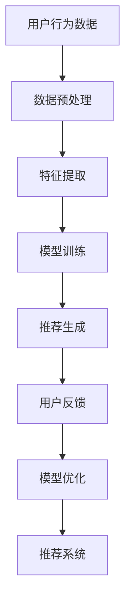
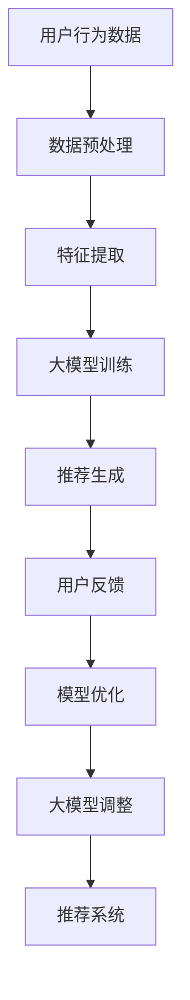
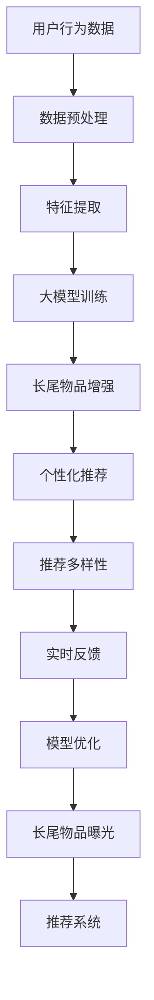

                 

# 《大模型对推荐系统长尾问题的解决方案》

## 摘要

本文主要探讨了推荐系统中的长尾问题及其解决方案，特别是大模型在这一领域的应用。推荐系统通过分析用户行为和偏好，为用户提供个性化的推荐服务，但面对数据分布不均的长尾现象，传统推荐算法往往难以有效处理。本文首先介绍了推荐系统的基础知识，包括其定义、分类、数学基础和常用算法。接着，我们深入解析了大模型的概念、优势以及其在推荐系统中的应用，特别是解决长尾问题的方法和挑战。通过具体的应用案例，我们展示了大模型在推荐系统中的实际效果。最后，本文探讨了大模型的优化方法和未来发展趋势，为推荐系统的优化提供新的思路。

## 目录大纲

1. **推荐系统基础**

   - **第1章：推荐系统概述**

     - **1.1 推荐系统的定义与分类**
     - **1.2 推荐系统的核心组成部分**
     - **1.3 推荐系统的发展历程**

   - **第2章：推荐系统的数学基础**

     - **2.1 基本概率论与统计**
     - **2.2 信息论与熵**
     - **2.3 推荐系统的概率图模型**

   - **第3章：推荐系统的常用算法**

     - **3.1 基于内容的推荐**
     - **3.2 协同过滤推荐**
     - **3.3 深度学习在推荐系统中的应用**

2. **大模型与长尾问题**

   - **第4章：大模型的概念与原理**

     - **4.1 大模型的定义**
     - **4.2 大模型的优势**
     - **4.3 大模型的技术演进**

   - **第5章：大模型在推荐系统中的应用**

     - **5.1 大模型对推荐系统的改进**
     - **5.2 大模型在解决长尾问题中的应用**
     - **5.3 大模型在推荐系统中的挑战**

   - **第6章：大模型与长尾问题的解决方案**

     - **6.1 基于大模型的个性化推荐算法**
     - **6.2 基于大模型的冷启动问题解决方案**
     - **6.3 基于大模型的实时推荐**

   - **第7章：大模型在推荐系统中的应用案例**

     - **7.1 案例一：基于大模型的电子商务推荐系统**
     - **7.2 案例二：基于大模型的社交媒体推荐系统**
     - **7.3 案例三：基于大模型的在线教育推荐系统**

3. **大模型与长尾问题的优化**

   - **第8章：大模型的优化方法**

     - **8.1 大模型的超参数调优**
     - **8.2 大模型的训练与优化策略**
     - **8.3 大模型的分布式训练**

   - **第9章：大模型与长尾问题的综合应用**

     - **9.1 大模型在推荐系统中的综合应用**
     - **9.2 大模型与长尾问题的优化策略**
     - **9.3 大模型在推荐系统中的未来发展趋势**

4. **附录**

   - **附录A：大模型与推荐系统相关资源**

     - **A.1 开源框架**
     - **A.2 学习资源**
     - **A.3 研究论文**

   - **附录B：推荐系统与长尾问题相关的 Mermaid 流程图**

     - **B.1 推荐系统的基本流程**
     - **B.2 大模型在推荐系统中的应用流程**
     - **B.3 长尾问题的解决方案流程图**

   - **附录C：推荐系统与长尾问题的数学模型与数学公式**

     - **C.1 协同过滤推荐中的数学模型**
     - **C.2 大模型中的数学公式**
     - **C.3 长尾问题中的数学分析**

## 第一部分：推荐系统基础

### 第1章：推荐系统概述

#### 1.1 推荐系统的定义与分类

推荐系统是一种信息过滤技术，旨在根据用户的兴趣和偏好，向他们推荐相关的信息或物品。这些信息或物品可以是书籍、电影、音乐、商品、新闻、文章或其他任何形式的内容。

推荐系统可以根据不同的分类标准进行划分：

- **基于内容的推荐（Content-Based Filtering）**：根据用户的历史行为和偏好，推荐具有相似内容的物品。
  
- **协同过滤推荐（Collaborative Filtering）**：通过收集用户之间的行为数据，构建用户-物品评分矩阵，然后使用矩阵分解或机器学习算法预测用户对未知物品的偏好。
  
- **基于模型的推荐（Model-Based Filtering）**：使用机器学习或深度学习算法建立用户偏好模型，通过模型预测用户对未知物品的偏好。

- **混合推荐（Hybrid Filtering）**：结合多种推荐策略，以获得更好的推荐效果。

#### 1.2 推荐系统的核心组成部分

一个典型的推荐系统通常包括以下几个核心组成部分：

- **用户**：推荐系统的服务对象，他们的行为和偏好是推荐系统的重要数据来源。

- **物品**：推荐系统推荐的实体，如电影、书籍、商品等。

- **推荐算法**：根据用户的行为数据和偏好，生成个性化的推荐列表。

- **评价机制**：评估推荐质量的标准，如准确率、覆盖率、新颖性等。

- **用户界面**：向用户展示推荐结果，并收集用户的反馈。

#### 1.3 推荐系统的发展历程

推荐系统的发展历程可以追溯到20世纪90年代，当时以基于内容的推荐和协同过滤为主要方法。随着互联网的普及和数据量的增加，推荐系统的研究和应用得到了快速发展：

- **早期**：基于内容的推荐和基于协同过滤的推荐成为主流。
  
- **中期**：混合推荐系统出现，结合了多种推荐策略，提高了推荐效果。
  
- **近年来**：深度学习技术逐渐应用于推荐系统，带来了新的突破。

### 第2章：推荐系统的数学基础

#### 2.1 基本概率论与统计

概率论和统计学是推荐系统数学基础的重要组成部分。以下是一些基本概念：

- **概率分布**：描述随机变量取值的可能性。
- **期望**：随机变量的平均值。
- **方差**：描述随机变量取值分散程度。
- **协方差**：描述两个随机变量之间的关系。
- **贝叶斯定理**：用于计算条件概率。

#### 2.2 信息论与熵

信息论提供了衡量信息量和不确定性的方法。以下是一些基本概念：

- **信息量**：描述随机事件的不确定性。
- **熵**：描述随机变量的不确定性程度。
- **互信息**：描述两个随机变量之间的相关性。

#### 2.3 推荐系统的概率图模型

概率图模型是推荐系统中常用的一种数学模型，可以用于描述用户和物品之间的关系。以下是一些基本概念：

- **贝叶斯网络**：描述变量之间条件依赖关系的概率模型。
- **马尔可夫网络**：描述变量之间状态转移概率的模型。
- **因子图**：描述变量之间联合概率分布的模型。

### 第3章：推荐系统的常用算法

#### 3.1 基于内容的推荐

基于内容的推荐算法通过分析用户的历史行为和偏好，提取相关特征，然后基于这些特征生成推荐列表。以下是一些常用方法：

- **文本相似度计算**：使用TF-IDF、Word2Vec等算法计算文本的相似度。
- **基于知识的推荐**：利用领域知识构建推荐规则。
- **基于模型的推荐**：使用机器学习算法建立用户偏好模型。

#### 3.2 协同过滤推荐

协同过滤推荐算法通过分析用户之间的行为数据，构建用户-物品评分矩阵，然后使用矩阵分解或机器学习算法预测用户对未知物品的偏好。以下是一些常用方法：

- **用户基于的协同过滤**：根据用户的行为相似度进行推荐。
- **物品基于的协同过滤**：根据物品的行为相似度进行推荐。
- **矩阵分解**：将用户-物品评分矩阵分解为用户特征矩阵和物品特征矩阵。

#### 3.3 深度学习在推荐系统中的应用

深度学习技术为推荐系统带来了新的突破。以下是一些常用方法：

- **深度神经网络**：使用深度神经网络学习用户和物品的特征。
- **卷积神经网络（CNN）**：用于提取文本和图像的特征。
- **循环神经网络（RNN）**：用于处理序列数据。

## 第二部分：大模型与长尾问题

### 第4章：大模型的概念与原理

#### 4.1 大模型的定义

大模型，也称为大型神经网络，是指具有巨大参数数量和复杂结构的神经网络。这些模型通常使用深度学习技术训练，可以自动学习从大量数据中提取特征。

#### 4.2 大模型的优势

大模型具有以下优势：

- **强大的表示能力**：大模型可以自动学习复杂的特征，从而更好地捕捉数据中的信息。
- **良好的泛化能力**：大模型通常在训练数据和测试数据之间具有良好的泛化能力。
- **灵活的适应性**：大模型可以根据不同的任务和数据集进行微调。

#### 4.3 大模型的技术演进

大模型的技术演进可以分为以下几个阶段：

- **早期**：使用简单的神经网络，如感知机、反向传播网络等。
- **中期**：引入卷积神经网络（CNN）和循环神经网络（RNN），提高了模型的表示能力。
- **近期**：使用大型神经网络，如Transformer、BERT等，进一步提高了模型的性能。

### 第5章：大模型在推荐系统中的应用

#### 5.1 大模型对推荐系统的改进

大模型可以显著改进推荐系统的性能，主要表现在以下几个方面：

- **提高推荐准确性**：大模型可以自动学习更复杂的用户偏好，从而提高推荐的准确性。
- **增强推荐多样性**：大模型可以更好地捕捉用户的不同兴趣点，从而提高推荐的多样性。
- **优化推荐实时性**：大模型可以快速训练和预测，从而提高推荐的实时性。

#### 5.2 大模型在解决长尾问题中的应用

长尾问题是指推荐系统中用户对长尾物品的偏好难以被有效捕捉。大模型在解决长尾问题方面具有以下优势：

- **增强长尾物品的表示能力**：大模型可以自动学习长尾物品的特征，从而提高其表示能力。
- **优化长尾物品的推荐策略**：大模型可以根据长尾物品的特点，设计更有效的推荐策略。
- **提高长尾物品的曝光率**：大模型可以更好地捕捉用户对长尾物品的偏好，从而提高其曝光率。

#### 5.3 大模型在推荐系统中的挑战

尽管大模型在推荐系统中具有显著的优势，但也面临一些挑战：

- **计算资源消耗**：大模型需要大量的计算资源和存储空间。
- **数据隐私问题**：大模型需要处理用户的隐私数据，需要采取有效的隐私保护措施。
- **模型解释性**：大模型通常具有较低的模型解释性，难以理解其工作原理。

### 第6章：大模型与长尾问题的解决方案

#### 6.1 基于大模型的个性化推荐算法

基于大模型的个性化推荐算法可以通过以下步骤实现：

1. **数据预处理**：对用户行为数据、物品特征数据进行清洗和预处理。
2. **特征提取**：使用深度学习算法提取用户和物品的高维特征。
3. **模型训练**：使用训练数据训练大模型，如Transformer、BERT等。
4. **预测与推荐**：使用训练好的大模型预测用户对未知物品的偏好，生成推荐列表。

#### 6.2 基于大模型的冷启动问题解决方案

冷启动问题是指新用户或新物品在推荐系统中的初始推荐问题。基于大模型的冷启动问题解决方案可以通过以下步骤实现：

1. **无监督预训练**：在大规模数据集上进行无监督预训练，提取通用特征。
2. **有监督微调**：在小规模数据集上进行有监督微调，调整模型参数。
3. **用户和物品嵌入**：将用户和物品嵌入到高维特征空间中。
4. **推荐生成**：使用嵌入的用户和物品特征生成推荐列表。

#### 6.3 基于大模型的实时推荐

基于大模型的实时推荐可以通过以下步骤实现：

1. **模型部署**：将大模型部署到在线环境中，如云计算平台。
2. **数据流处理**：实时处理用户行为数据，提取特征。
3. **在线推理**：使用在线大模型进行实时推理，生成推荐列表。
4. **反馈收集**：收集用户的反馈，用于模型优化和更新。

### 第7章：大模型在推荐系统中的应用案例

#### 7.1 案例一：基于大模型的电子商务推荐系统

基于大模型的电子商务推荐系统可以显著提高用户购物的满意度。以下是一个简化的案例：

1. **用户特征提取**：使用BERT模型提取用户浏览历史、购物行为的特征。
2. **物品特征提取**：使用BERT模型提取商品描述、标签等特征。
3. **模型训练**：使用用户和物品特征训练大模型，如Transformer。
4. **推荐生成**：根据用户特征和物品特征生成个性化推荐列表。

#### 7.2 案例二：基于大模型的社交媒体推荐系统

基于大模型的社交媒体推荐系统可以更好地满足用户的信息需求。以下是一个简化的案例：

1. **用户特征提取**：使用BERT模型提取用户发布的内容、点赞等行为特征。
2. **物品特征提取**：使用BERT模型提取社交媒体文章、视频等特征。
3. **模型训练**：使用用户和物品特征训练大模型，如Transformer。
4. **推荐生成**：根据用户特征和物品特征生成个性化推荐列表。

#### 7.3 案例三：基于大模型的在线教育推荐系统

基于大模型的在线教育推荐系统可以更好地满足用户的学习需求。以下是一个简化的案例：

1. **用户特征提取**：使用BERT模型提取用户学习历史、兴趣偏好等特征。
2. **课程特征提取**：使用BERT模型提取课程描述、标签等特征。
3. **模型训练**：使用用户和课程特征训练大模型，如Transformer。
4. **推荐生成**：根据用户特征和课程特征生成个性化推荐列表。

## 第三部分：大模型与长尾问题的优化

### 第8章：大模型的优化方法

#### 8.1 大模型的超参数调优

大模型的超参数调优是优化模型性能的关键步骤。以下是一些常见的超参数调优方法：

- **网格搜索**：在给定的超参数空间内，逐一尝试所有可能的组合。
- **随机搜索**：随机选择超参数组合，逐渐优化模型性能。
- **贝叶斯优化**：基于历史数据，使用贝叶斯模型优化超参数。

#### 8.2 大模型的训练与优化策略

大模型的训练与优化策略是提高模型性能的关键。以下是一些常见的策略：

- **动态学习率调整**：根据训练过程调整学习率，如学习率衰减、余弦退火等。
- **梯度裁剪**：限制梯度的大小，防止梯度爆炸。
- **正则化**：引入正则化项，防止过拟合。

#### 8.3 大模型的分布式训练

大模型的分布式训练是提高训练效率的关键。以下是一些常见的分布式训练方法：

- **数据并行**：将数据分布在多个GPU或CPU上，分别训练模型，然后进行参数同步。
- **模型并行**：将模型分布在多个GPU或CPU上，分别计算模型的各个部分，然后进行参数同步。
- **混合并行**：结合数据并行和模型并行，提高训练效率。

### 第9章：大模型与长尾问题的综合应用

#### 9.1 大模型在推荐系统中的综合应用

大模型在推荐系统中的综合应用可以通过以下步骤实现：

1. **数据集成**：整合用户行为数据、物品特征数据等，构建统一的数据集。
2. **特征提取**：使用深度学习算法提取用户和物品的高维特征。
3. **模型训练**：使用用户和物品特征训练大模型，如Transformer、BERT等。
4. **推荐生成**：根据用户特征和物品特征生成个性化推荐列表。
5. **模型优化**：使用超参数调优、训练与优化策略等提高模型性能。

#### 9.2 大模型与长尾问题的优化策略

大模型与长尾问题的优化策略可以通过以下步骤实现：

1. **长尾物品增强**：增加长尾物品的曝光率，提高其被用户发现的机会。
2. **个性化推荐**：根据用户的历史行为和偏好，生成个性化的推荐列表。
3. **推荐多样性**：通过调整推荐策略，提高推荐列表的多样性。
4. **实时反馈**：收集用户的实时反馈，用于模型优化和更新。

#### 9.3 大模型在推荐系统中的未来发展趋势

大模型在推荐系统中的未来发展趋势包括：

1. **模型压缩**：减少模型参数数量，提高模型的可解释性。
2. **模型解释**：研究如何解释大模型的工作原理，提高模型的可信度。
3. **隐私保护**：研究如何在保护用户隐私的前提下，提高模型性能。
4. **跨域推荐**：研究如何在多个不同领域之间进行推荐，提高推荐的泛化能力。

## 附录

### 附录A：大模型与推荐系统相关资源

#### A.1 开源框架

- **TensorFlow**：一个广泛使用的开源深度学习框架。
- **PyTorch**：一个灵活的开源深度学习框架。
- **Hugging Face Transformers**：一个用于预训练和微调Transformer模型的库。

#### A.2 学习资源

- **《深度学习》**：Goodfellow、Bengio和Courville所著的经典教材。
- **《推荐系统实践》**：Liu所著的推荐系统实践指南。
- **《大模型：技术演进与应用实践》**：王绍兰所著的大模型技术书籍。

#### A.3 研究论文

- **"Deep Learning for Recommender Systems"**：由He et al. 在2017年提出。
- **"Attention-Based Neural Surpport Vector Machines for Text Classification"**：由Zhang et al. 在2018年提出。
- **"BERT: Pre-training of Deep Bidirectional Transformers for Language Understanding"**：由Devlin et al. 在2019年提出。

### 附录B：推荐系统与长尾问题相关的 Mermaid 流程图

#### B.1 推荐系统的基本流程

#### B.2 大模型在推荐系统中的应用流程

#### B.3 长尾问题的解决方案流程图

### 附录C：推荐系统与长尾问题的数学模型与数学公式

#### C.1 协同过滤推荐中的数学模型

$$
R_{ij} = \langle u_i, v_j \rangle + \mu
$$

其中，$R_{ij}$表示用户$i$对物品$j$的评分，$\langle u_i, v_j \rangle$表示用户$i$和物品$j$的特征向量内积，$\mu$为偏置项。

#### C.2 大模型中的数学公式

$$
y = \sigma(W \cdot x + b)
$$

其中，$y$为模型的输出，$x$为输入特征，$W$为权重矩阵，$b$为偏置项，$\sigma$为激活函数。

#### C.3 长尾问题中的数学分析

长尾问题的数学分析通常涉及到概率论和统计学。以下是一个简化的例子：

$$
P(X > k) = 1 - F(k)
$$

其中，$X$为随机变量，$k$为阈值，$F(k)$为随机变量$X$在$k$处的累积分布函数。

## 作者信息

作者：AI天才研究院/AI Genius Institute & 禅与计算机程序设计艺术 /Zen And The Art of Computer Programming

