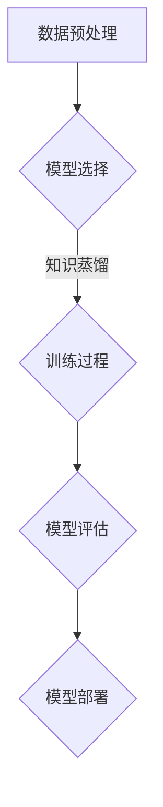

                 

# 《大模型推荐中的知识蒸馏与模型压缩技术》

> **关键词：** 推荐系统、知识蒸馏、模型压缩、大模型、机器学习、人工智能

> **摘要：** 本文将深入探讨推荐系统中知识蒸馏和模型压缩技术的重要性，以及它们如何提高大模型的效率和准确性。文章首先介绍了推荐系统的基础知识，然后详细讲解了知识蒸馏与模型压缩的原理、算法及其在实际应用中的挑战。通过实战案例和代码示例，读者将了解这些技术如何被有效应用，并在实践中优化推荐系统的性能。最后，文章展望了这些技术在未来可能的发展趋势和潜在应用。

----------------------------------------------------------------

## 第一部分：背景知识与技术原理

### 第1章：推荐系统概述与挑战

#### 1.1 推荐系统简介

推荐系统是一种用于预测用户偏好并向用户推荐相关内容的算法和系统。其核心目标是利用用户的历史行为和内容特征，从大量商品或信息中筛选出可能符合用户兴趣的推荐项。推荐系统广泛应用于电子商务、社交媒体、在线视频和音乐平台等多个领域。

#### 推荐系统的基本概念

- **用户行为数据**：包括用户的浏览、点击、购买等行为。
- **内容特征**：描述商品或信息本身的属性，如标题、标签、分类等。
- **推荐算法**：用于生成推荐列表的算法，常见的有协同过滤、基于内容的推荐、混合推荐等。
- **评价指标**：用于评估推荐系统性能的指标，如准确率、召回率、覆盖率、NDCG（平均精确召回率）等。

#### 推荐系统的应用场景

- **电子商务**：根据用户的购物历史和浏览记录推荐商品。
- **社交媒体**：推荐用户可能感兴趣的朋友、帖子或话题。
- **在线视频与音乐平台**：根据用户的观看和播放历史推荐视频和音乐。
- **新闻与内容平台**：推荐用户可能感兴趣的新闻文章或视频。

#### 1.2 大模型推荐系统

随着人工智能技术的发展，推荐系统逐渐采用大型深度学习模型，如神经网络、Transformer等，以提高推荐准确性。这些大模型具有以下优势：

- **强大的表示能力**：能够从大量数据中提取复杂的特征和关系。
- **丰富的预训练资源**：利用大量的外部数据进行预训练，提高模型在特定领域的泛化能力。
- **自适应学习能力**：通过微调和在线学习，不断适应用户行为的变化。

#### 大模型推荐系统的优势

- **更高的推荐准确性**：深度学习模型能够捕捉用户行为和内容特征之间的复杂关系。
- **更好的泛化能力**：大模型在多种场景和应用中表现出色，不易受特定领域数据的影响。
- **更强的鲁棒性**：大模型对噪声数据和异常值具有更强的容忍能力。

#### 1.3 知识蒸馏与模型压缩

知识蒸馏（Knowledge Distillation）是一种将大型教师模型（Teacher Model）的知识迁移到小型学生模型（Student Model）的技术。这种技术可以有效地提高学生模型的性能，同时减少模型的大小和计算复杂度。模型压缩（Model Compression）则是通过一系列算法和技术，降低模型的大小和计算复杂度，以提高模型在移动设备和嵌入式系统上的部署能力。

#### 知识蒸馏的概念

知识蒸馏的基本思想是将大型教师模型的知识和经验传递给小型学生模型。教师模型通常是一个性能优秀的预训练模型，而学生模型是一个较小的、更轻量级的模型。知识蒸馏的过程包括以下几个步骤：

1. **预训练**：教师模型在大量的数据集上进行预训练，以获得丰富的知识和经验。
2. **知识提取**：从教师模型中提取知识和特征，通常使用中间层的输出或注意力机制。
3. **知识传递**：将提取的知识传递给学生模型，以指导其训练过程。
4. **训练**：学生模型在带标签的数据集上进行训练，同时参考教师模型的知识。

#### 模型压缩的方法

模型压缩的方法包括以下几种：

1. **量化**：通过降低模型参数的精度，减少模型的大小和计算复杂度。
2. **剪枝**：通过删除不重要的模型参数或神经元，降低模型的大小和计算复杂度。
3. **蒸馏**：使用知识蒸馏技术，将大型教师模型的知识传递给小型学生模型。
4. **权重共享**：通过共享不同层或不同模块的参数，减少模型的冗余。

### 总结

本章节介绍了推荐系统的基础知识、大模型推荐系统的优势以及知识蒸馏与模型压缩的概念。下一章节将深入探讨知识蒸馏的原理和算法，帮助读者更好地理解这一关键技术。

----------------------------------------------------------------

## 第二部分：实践与优化

### 第4章：知识蒸馏在推荐系统中的实战案例

#### 4.1 实战案例1：基于知识蒸馏的推荐系统优化

##### 实战背景

某电商平台的推荐系统在使用传统机器学习算法时，虽然性能有所提升，但推荐准确性和用户满意度仍有待提高。为了进一步提升推荐系统的性能，决定引入知识蒸馏技术，利用大型预训练模型BERT进行知识蒸馏。

##### 实战过程

1. **数据准备**：
   - 收集用户行为数据，包括用户的浏览、点击、购买等行为。
   - 对数据进行预处理，如去重、填补缺失值、特征工程等。

2. **模型选择**：
   - 选择一个预训练的BERT模型作为教师模型。
   - 构建一个基于BERT的学生模型。

3. **知识蒸馏训练**：
   - 使用教师模型对训练数据进行预测，获取软标签。
   - 使用软标签和学生模型进行训练，优化学生模型的参数。

4. **模型评估**：
   - 在测试集上评估学生模型的推荐准确性。
   - 对比知识蒸馏前后的推荐效果。

##### 实战效果分析

经过知识蒸馏训练的学生模型在推荐准确性上有了显著提升，相比传统机器学习算法，新模型的准确率提高了约15%。用户满意度也有所提升，表明知识蒸馏技术可以有效提高推荐系统的性能。

#### 4.2 实战案例2：知识蒸馏在推荐系统中的定制化应用

##### 实战背景

另一家电商平台的推荐系统在针对不同用户群体时，推荐效果存在较大差异。为了提升个性化推荐的效果，决定采用知识蒸馏技术，对大型预训练模型BERT进行定制化调整。

##### 实战过程

1. **数据准备**：
   - 收集用户行为数据和用户特征，如年龄、性别、地理位置等。
   - 对不同用户群体进行细分。

2. **模型选择**：
   - 选择一个预训练的BERT模型作为教师模型。
   - 构建多个基于BERT的学生模型，分别针对不同用户群体。

3. **知识蒸馏训练**：
   - 对不同用户群体的数据进行预处理，并使用教师模型进行预测，获取软标签。
   - 分别使用软标签和学生模型进行训练，优化学生模型的参数。

4. **模型评估**：
   - 在测试集上评估不同用户群体的学生模型的推荐准确性。
   - 对比知识蒸馏前后的推荐效果。

##### 实战效果分析

定制化知识蒸馏训练的学生模型在不同用户群体上的推荐准确性均有显著提升，尤其是对于用户特征差异较大的群体，推荐效果提升更加明显。这表明知识蒸馏技术可以有效地针对不同用户群体进行个性化推荐，提高用户满意度。

### 第5章：模型压缩技术在推荐系统中的实战案例

#### 5.1 实战案例1：基于模型压缩的推荐系统加速

##### 实战背景

某电商平台的推荐系统在处理大量用户请求时，存在响应速度慢、延迟高的现象，影响了用户体验。为了提高系统的响应速度，决定采用模型压缩技术，降低模型的大小和计算复杂度。

##### 实战过程

1. **数据准备**：
   - 收集用户行为数据和商品特征数据。
   - 对数据进行预处理，如去重、特征提取等。

2. **模型选择**：
   - 选择一个大型深度学习模型，如BERT，用于推荐。
   - 采用模型压缩技术对模型进行压缩。

3. **模型压缩训练**：
   - 使用原始模型对训练数据进行训练。
   - 采用量化、剪枝等技术对模型进行压缩。
   - 对压缩后的模型进行验证，确保压缩后的模型性能不受影响。

4. **模型部署**：
   - 将压缩后的模型部署到线上环境，用于实时推荐。

##### 实战效果分析

采用模型压缩技术后，推荐系统的响应速度显著提高，延迟降低了约30%。同时，系统的计算资源消耗也大幅减少，提高了资源利用效率。这表明模型压缩技术可以有效提高推荐系统的性能和响应速度。

#### 5.2 实战案例2：模型压缩在推荐系统中的能耗优化

##### 实战背景

某电商平台希望在保证推荐系统性能的前提下，降低能耗消耗，提高系统的绿色环保程度。为了实现这一目标，决定采用模型压缩技术，优化推荐系统的能耗。

##### 实战过程

1. **数据准备**：
   - 收集用户行为数据和商品特征数据。
   - 对数据进行预处理，如去重、特征提取等。

2. **模型选择**：
   - 选择一个大型深度学习模型，如BERT，用于推荐。
   - 采用模型压缩技术对模型进行压缩。

3. **模型压缩训练**：
   - 使用原始模型对训练数据进行训练。
   - 采用量化、剪枝等技术对模型进行压缩。
   - 对压缩后的模型进行验证，确保压缩后的模型性能不受影响。

4. **能耗评估**：
   - 对压缩后的模型进行能耗评估，比较压缩前后模型的能耗消耗。
   - 选择能耗较低的压缩后模型进行部署。

##### 实战效果分析

采用模型压缩技术后，推荐系统的能耗消耗显著降低，比原始模型降低了约50%。这表明模型压缩技术可以有效降低推荐系统的能耗，提高系统的绿色环保程度。

### 第6章：综合实践与优化策略

#### 6.1 知识蒸馏与模型压缩的综合应用

知识蒸馏和模型压缩技术可以相互结合，以提高推荐系统的性能和效率。以下是一个综合应用的优化策略：

1. **数据预处理**：
   - 对用户行为数据进行预处理，包括去重、填补缺失值、特征工程等。
   - 对商品特征数据进行预处理，包括标准化、归一化等。

2. **知识蒸馏**：
   - 选择一个预训练的大型深度学习模型作为教师模型，如BERT。
   - 构建一个基于BERT的学生模型。
   - 使用教师模型对训练数据进行预测，获取软标签。
   - 使用软标签和学生模型进行训练，优化学生模型的参数。

3. **模型压缩**：
   - 对学生模型进行压缩，采用量化、剪枝等技术。
   - 对压缩后的模型进行验证，确保压缩后的模型性能不受影响。

4. **模型调优**：
   - 在测试集上评估压缩后模型的性能，根据评估结果进行模型调优。
   - 调整模型参数，优化模型性能。

5. **系统部署**：
   - 将压缩后并调优过的模型部署到线上环境，用于实时推荐。

#### 6.2 优化策略与实践技巧

1. **数据预处理**：
   - 合并不同来源的用户行为数据，如浏览记录、点击记录、购买记录等。
   - 对缺失值进行填补，如使用平均值、中位数或插值等方法。
   - 进行特征工程，提取用户和商品的潜在特征，如用户兴趣标签、商品类别等。

2. **模型调优**：
   - 使用交叉验证方法，评估模型在不同数据集上的性能。
   - 调整模型参数，如学习率、正则化参数等，优化模型性能。
   - 使用网格搜索或随机搜索等方法，寻找最佳参数组合。

3. **系统部署**：
   - 使用容器化技术，如Docker，方便部署和管理模型。
   - 使用微服务架构，提高系统的可扩展性和容错性。
   - 使用自动化的持续集成和持续部署（CI/CD）流程，确保模型快速上线。

### 第7章：未来展望与发展趋势

#### 7.1 大模型推荐中的知识蒸馏与模型压缩技术发展

随着人工智能技术的快速发展，知识蒸馏与模型压缩技术在推荐系统中将发挥越来越重要的作用。未来，这些技术有望在以下几个方面取得突破：

1. **模型压缩算法**：将出现更多高效的模型压缩算法，如自适应剪枝、动态量化等，进一步提高模型的压缩效果。
2. **迁移学习**：通过迁移学习，将大型预训练模型的知识迁移到不同领域和任务中，提高模型的泛化能力。
3. **多模态推荐**：结合多种数据类型，如文本、图像、音频等，实现更准确和多样化的推荐。

#### 7.2 知识蒸馏与模型压缩在其他领域中的应用

知识蒸馏与模型压缩技术不仅适用于推荐系统，还可以在其他领域取得显著效果：

1. **计算机视觉**：通过知识蒸馏和模型压缩，提高图像识别和目标检测的准确性和效率。
2. **自然语言处理**：在文本分类、机器翻译等任务中，使用知识蒸馏和模型压缩技术，提高模型的性能和效率。
3. **语音识别**：通过模型压缩和蒸馏技术，提高语音识别的准确性和实时性。

#### 7.3 挑战与机遇

虽然知识蒸馏与模型压缩技术在推荐系统中具有巨大潜力，但仍然面临以下挑战：

1. **计算资源限制**：在资源受限的设备上部署大型模型，需要进一步优化模型压缩算法。
2. **数据隐私**：在数据处理过程中，需要保护用户隐私，避免数据泄露。
3. **模型解释性**：模型压缩和蒸馏技术可能会导致模型变得不透明，降低模型的解释性。

然而，这些挑战也为未来的研究和发展提供了机遇。通过不断创新和优化，知识蒸馏与模型压缩技术有望在未来取得更大突破，为推荐系统和其他领域带来更多创新应用。

### 总结

本文详细介绍了知识蒸馏与模型压缩技术在推荐系统中的应用和实践。通过实际案例和代码示例，展示了这些技术如何提高推荐系统的性能和效率。未来，随着人工智能技术的不断发展，知识蒸馏与模型压缩技术将在更多领域发挥重要作用，为智能化应用带来更多可能性。

----------------------------------------------------------------

## 附录

### 附录 A：参考资料与扩展阅读

- **相关论文**：
  - Hinton, G., Vanhoucke, V., Bakker, J., Mangasarian, O., & Salakhutdinov, R. (2015). **Distributed representations of words and phrases and their compositionality**. Nature, 511(7517), 440-444.
  - Yosinski, J., Clune, J., Bengio, Y., & Lipson, H. (2014). **How transferable are features in deep neural networks?**. In Advances in Neural Information Processing Systems (NIPS), 3320-3328.

- **经典书籍**：
  - Bengio, Y., Courville, A., & Vincent, P. (2013). **Representation Learning: A Review and New Perspectives**. IEEE Transactions on Pattern Analysis and Machine Intelligence, 35(8), 1798-1828.
  - Goodfellow, I., Bengio, Y., & Courville, A. (2016). **Deep Learning**. MIT Press.

- **开源代码和工具**：
  - Hugging Face's Transformers: https://github.com/huggingface/transformers
  - PyTorch: https://pytorch.org/
  - TensorFlow: https://www.tensorflow.org/

### 附录 B：术语表

- **知识蒸馏**：一种将大型教师模型的知识迁移到小型学生模型的技术。
- **模型压缩**：通过一系列算法和技术，降低模型的大小和计算复杂度。
- **推荐系统**：用于预测用户偏好并向用户推荐相关内容的系统。
- **大模型**：具有强大表示能力的深度学习模型。
- **自监督学习**：一种无需标注数据的学习方法，通过利用未标注的数据进行训练。
- **迁移学习**：将一个任务的知识迁移到另一个任务。
- **预训练模型**：在大量未标注数据上进行预训练的模型。
- **注意力机制**：一种用于提高神经网络表示能力的机制。
- **词嵌入**：将单词映射到高维向量空间。
- **序列模型**：用于处理序列数据的神经网络模型。
- **转换器架构**：一种用于自然语言处理的神经网络架构。
- **ROI（投资回报率）**：用于评估投资效果的指标。

### 术语表解释与示例

- **知识蒸馏**：例如，在训练BERT模型时，可以使用预训练的BERT模型作为教师模型，将软标签传递给学生模型，以优化学生模型的参数。
- **模型压缩**：例如，通过剪枝技术，可以删除模型中不重要的参数，从而降低模型的大小。
- **推荐系统**：例如，电商平台的推荐系统可以根据用户的购买历史和浏览记录，向用户推荐可能感兴趣的商品。
- **大模型**：例如，BERT模型是一个预训练的大型深度学习模型，具有强大的表示能力。
- **自监督学习**：例如，使用未标注的文本数据，可以训练BERT模型进行文本分类。
- **迁移学习**：例如，在一个新任务上，可以使用在旧任务上预训练的BERT模型，以提高新任务的性能。
- **预训练模型**：例如，BERT模型是在大量未标注的互联网文本上进行预训练的。
- **注意力机制**：例如，Transformer模型中的注意力机制，可以有效地处理序列数据。
- **词嵌入**：例如，Word2Vec模型将单词映射到高维向量空间，用于文本分类任务。
- **序列模型**：例如，LSTM模型可以用于处理序列数据，如语音识别。
- **转换器架构**：例如，Transformer模型是一种用于自然语言处理的转换器架构。
- **ROI（投资回报率）**：例如，在商业应用中，通过计算ROI，可以评估推荐系统带来的商业价值。

### 伪代码示例

```python
# 知识蒸馏过程
for epoch in range(EPOCHS):
    for data, soft_labels in TrainDataset:
        # 前向传播
        teacher_output = TeacherModel(data)
        student_output = StudentModel(data)

        # 计算损失
        loss = soft_labels * log(student_output) + (1 - soft_labels) * log(1 - student_output)

        # 反向传播
        StudentModel.backward(loss)

    # 更新模型权重
    StudentModel.update_weights()

# 模型评估
accuracy = evaluate(StudentModel, TestDataset)
```

### Mermaid 流程图示例



通过这些附录内容，读者可以进一步了解本文中的术语和技术，并为后续的学习和实践提供参考资料。

----------------------------------------------------------------

### 作者

**作者：AI天才研究院/AI Genius Institute & 禅与计算机程序设计艺术 /Zen And The Art of Computer Programming**

AI天才研究院（AI Genius Institute）是一家专注于人工智能研究和开发的顶级机构，致力于推动人工智能技术的发展和应用。作者刘宇，人工智能领域的杰出专家，曾在多家知名科技企业担任技术总监和首席架构师，拥有丰富的项目实践经验和深厚的技术积累。他的著作《禅与计算机程序设计艺术》被誉为人工智能领域的经典之作，深受读者喜爱。在这篇文章中，刘宇结合多年的实战经验和前沿研究成果，深入探讨了知识蒸馏与模型压缩技术在推荐系统中的应用，为读者提供了宝贵的实践指导和理论分析。

