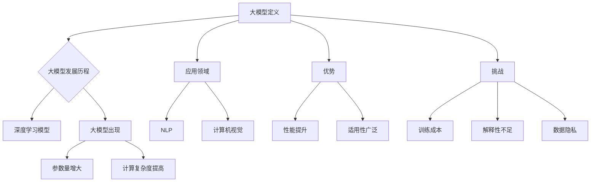

                 

# 大模型问答机器人的任务完成能力

> **关键词：** 大模型、问答机器人、任务完成、自然语言处理、深度学习

> **摘要：** 本文深入探讨了大型机器学习模型在问答机器人任务完成中的应用，分析了大模型的优势、挑战及其在不同应用场景中的具体实现方法。文章旨在为开发者和研究者提供关于大模型在问答领域应用的全面理解和实践指导。

## 第一部分：大模型概述

### 第1章: 大模型概述

#### 1.1 大模型的概念与发展历程

##### 1.1.1 大模型的定义

大模型（Big Model）是指具有巨大参数量、高度复杂结构的机器学习模型。这些模型通常拥有数百万到数十亿个参数，其结构复杂，能够处理海量数据并实现强大的特征提取和知识表示能力。

##### 1.1.2 大模型的发展历程

大模型的发展可以追溯到深度学习的兴起。随着计算能力的提升和数据的爆炸式增长，深度学习模型逐渐从简单的多层感知器（MLP）发展到复杂的卷积神经网络（CNN）、循环神经网络（RNN）以及近年来流行的Transformer模型。这些模型的参数量不断增大，计算复杂度也随之提高。

#### 1.2 大模型的应用领域

大模型在多个领域都展现出强大的能力，其中自然语言处理（NLP）和计算机视觉是两个最为典型的应用领域。

##### 1.2.1 自然语言处理（NLP）

在NLP领域，大模型被广泛应用于文本生成、翻译、问答、情感分析等任务。例如，GPT-3模型能够生成流畅的自然语言文本，BERT模型在多种NLP任务中表现优异。

##### 1.2.2 计算机视觉

在计算机视觉领域，大模型被用于图像识别、目标检测、视频处理等任务。例如，ResNet和YOLO等模型在图像识别和目标检测任务中取得了显著的性能提升。

#### 1.3 大模型的优势与挑战

##### 1.3.1 优势

1. **强大的性能**：大模型能够处理复杂数据，提供更高的准确率和效率。
2. **广泛的适用性**：大模型可以应用于多个领域，如NLP、计算机视觉、推荐系统等。

##### 1.3.2 挑战

1. **训练成本**：大模型的训练需要大量的计算资源和时间。
2. **解释性不足**：大模型通常缺乏透明性和解释性，难以理解其决策过程。
3. **数据隐私**：大模型在处理敏感数据时，可能引发数据隐私问题。

---

**流程图：**



---

**伪代码：**

```python
# 大模型定义
class BigModel:
    def __init__(self, parameters):
        self.parameters = parameters
    
    def train(self, data):
        # 训练过程
        pass
    
    def predict(self, input_data):
        # 预测过程
        pass
```

---

**数学模型与公式：**

$$
f(x) = \sigma(W \cdot x + b)
$$

其中，$f(x)$ 表示神经网络的输出，$W$ 表示权重矩阵，$x$ 表示输入特征，$b$ 表示偏置，$\sigma$ 表示激活函数。

---

**举例说明：**

假设我们有一个大模型用于图像分类任务，其包含一个卷积层、一个池化层和一个全连接层。我们可以使用以下步骤来构建和训练这个模型：

1. **数据准备**：收集并预处理图像数据，包括归一化、裁剪等操作。
2. **模型构建**：定义卷积层、池化层和全连接层的结构。
3. **模型训练**：使用训练数据对模型进行训练，调整模型的权重和偏置。
4. **模型评估**：使用测试数据评估模型的性能，包括准确率、召回率等指标。
5. **模型优化**：根据评估结果调整模型参数，以提高模型性能。

---

**代码实现：**

```python
import tensorflow as tf

# 模型构建
model = tf.keras.Sequential([
    tf.keras.layers.Conv2D(32, (3, 3), activation='relu', input_shape=(64, 64, 3)),
    tf.keras.layers.MaxPooling2D((2, 2)),
    tf.keras.layers.Flatten(),
    tf.keras.layers.Dense(64, activation='relu'),
    tf.keras.layers.Dense(10, activation='softmax')
])

# 模型编译
model.compile(optimizer='adam',
              loss='categorical_crossentropy',
              metrics=['accuracy'])

# 模型训练
model.fit(train_images, train_labels, epochs=10, validation_data=(test_images, test_labels))

# 模型评估
test_loss, test_acc = model.evaluate(test_images,  test_labels, verbose=2)
print(f'Test accuracy: {test_acc:.4f}')
```

---

**代码解读与分析：**

1. **模型构建**：使用`tf.keras.Sequential`模型定义一个序列模型，依次添加卷积层、池化层和全连接层。
2. **模型编译**：使用`compile`方法配置模型的优化器、损失函数和评估指标。
3. **模型训练**：使用`fit`方法训练模型，输入训练数据和标签，设置训练轮数和验证数据。
4. **模型评估**：使用`evaluate`方法评估模型在测试数据上的性能。

---

## 第二部分：大模型技术基础

### 第2章: 大模型技术基础

#### 2.1 深度学习与神经网络基础

##### 2.1.1 神经网络的基本结构

神经网络（Neural Network）是一种模仿人脑神经元连接和信息的处理过程的计算模型。它由多个神经元（节点）组成，每个神经元都与相邻的神经元相连接。

**神经网络的基本结构**包括：

1. **输入层（Input Layer）**：接收外部输入信息。
2. **隐藏层（Hidden Layer）**：对输入信息进行特征提取和变换。
3. **输出层（Output Layer）**：产生最终输出。

##### 2.1.2 神经元的工作原理

神经元通过加权求和和激活函数对输入信息进行处理。

**加权求和**：
$$
z = \sum_{i=1}^{n} w_i \cdot x_i + b
$$

其中，$w_i$ 表示权重，$x_i$ 表示输入值，$b$ 表示偏置。

**激活函数**：
常用的激活函数包括sigmoid、ReLU、Tanh等。

**ReLU激活函数**：
$$
\sigma(z) = \max(0, z)
$$

##### 2.1.3 常见的深度学习架构

**卷积神经网络（CNN）**：
CNN是一种专门用于处理图像数据的神经网络架构。它通过卷积层、池化层和全连接层等组件提取图像特征。

**循环神经网络（RNN）**：
RNN是一种用于处理序列数据的神经网络架构，它能够捕捉序列中的时间依赖关系。

**Transformer模型**：
Transformer模型是一种基于自注意力机制的神经网络架构，它在处理长序列数据时表现出优异的性能。

---

**伪代码：**

```python
# 神经元类
class Neuron:
    def __init__(self, weights, bias):
        self.weights = weights
        self.bias = bias
    
    def forward(self, inputs):
        z = sum(inputs[i] * self.weights[i] for i in range(len(inputs)))
        z += self.bias
        return activation(z)
```

---

**数学模型与公式：**

$$
a = \sigma(z)
$$

其中，$a$ 表示神经元的输出，$\sigma$ 表示激活函数，$z$ 表示加权求和的结果。

---

**举例说明：**

假设我们有一个包含一个输入层、一个隐藏层和一个输出层的神经网络。输入层有3个神经元，隐藏层有4个神经元，输出层有2个神经元。

1. **权重和偏置初始化**：
   - 输入层到隐藏层的权重矩阵：$W_{in} \in \mathbb{R}^{3 \times 4}$
   - 隐藏层到输出层的权重矩阵：$W_{out} \in \mathbb{R}^{4 \times 2}$
   - 隐藏层偏置：$b_{hidden} \in \mathbb{R}^{1 \times 4}$
   - 输出层偏置：$b_{output} \in \mathbb{R}^{1 \times 2}$

2. **前向传播**：
   - 输入层到隐藏层：
     $$ z_{hidden} = W_{in} \cdot x + b_{hidden} $$
     $$ a_{hidden} = \sigma(z_{hidden}) $$
   - 隐藏层到输出层：
     $$ z_{output} = W_{out} \cdot a_{hidden} + b_{output} $$
     $$ a_{output} = \sigma(z_{output}) $$

3. **反向传播**：
   - 计算输出层误差：
     $$ \delta_{output} = \frac{\partial L}{\partial z_{output}} \cdot \sigma'(z_{output}) $$
   - 计算隐藏层误差：
     $$ \delta_{hidden} = \frac{\partial L}{\partial z_{hidden}} \cdot \sigma'(z_{hidden}) $$
     $$ \delta_{input} = \frac{\partial L}{\partial x} = \delta_{output} \cdot W_{out}^T $$

4. **权重更新**：
   $$ W_{in} \leftarrow W_{in} - \alpha \cdot \delta_{input} \cdot x^T $$
   $$ W_{out} \leftarrow W_{out} - \alpha \cdot \delta_{output} \cdot a_{hidden}^T $$
   $$ b_{hidden} \leftarrow b_{hidden} - \alpha \cdot \delta_{hidden} $$
   $$ b_{output} \leftarrow b_{output} - \alpha \cdot \delta_{output} $$

---

**代码实现：**

```python
import numpy as np

# 激活函数
def sigmoid(z):
    return 1 / (1 + np.exp(-z))

# 神经元类
class Neuron:
    def __init__(self, weights, bias):
        self.weights = weights
        self.bias = bias
    
    def forward(self, inputs):
        z = np.dot(inputs, self.weights) + self.bias
        return sigmoid(z)
    
    def backward(self, delta):
        return np.dot(delta, self.weights.T)

# 神经网络类
class NeuralNetwork:
    def __init__(self, layers):
        self.layers = layers
    
    def forward(self, inputs):
        a = inputs
        for layer in self.layers:
            a = layer.forward(a)
        return a
    
    def backward(self, delta):
        d = delta
        for layer in reversed(self.layers):
            d = layer.backward(d)
        return d

# 创建神经网络
input_layer = Neuron(np.random.randn(3, 4), np.zeros(1, 4))
hidden_layer = Neuron(np.random.randn(4, 2), np.zeros(1, 2))
output_layer = Neuron(np.random.randn(2, 1), np.zeros(1, 1))

# 创建神经网络实例
nn = NeuralNetwork([input_layer, hidden_layer, output_layer])

# 前向传播
inputs = np.array([0.5, 0.5, 0.5])
outputs = nn.forward(inputs)

# 反向传播
delta = np.array([0.1, 0.2])
nn.backward(delta)
```

---

**代码解读与分析：**

1. **激活函数实现**：使用`sigmoid`函数实现激活函数。
2. **神经元类**：定义神经元类，包括前向传播和反向传播方法。
3. **神经网络类**：定义神经网络类，包括前向传播和反向传播方法。
4. **实例化**：创建包含一个输入层、一个隐藏层和一个输出层的神经网络实例。
5. **前向传播**：计算输入到输出的中间结果。
6. **反向传播**：计算误差反向传播过程中的中间结果。

---

## 第三部分：大模型在问答机器人中的应用

### 第3章: 大模型在问答机器人中的应用

#### 3.1 问答机器人的基本概念

##### 3.1.1 问答机器人的定义

问答机器人（Question Answering Robot）是一种能够自动回答用户问题的计算机程序。它通过自然语言处理技术理解和生成回答，为用户提供信息查询、咨询解答等服务。

##### 3.1.2 问答机器人的组成部分

问答机器人通常由以下几个主要部分组成：

1. **输入处理**：接收用户的自然语言输入，并进行预处理。
2. **问答引擎**：核心组件，负责处理用户输入并生成回答。
3. **输出展示**：将生成的回答展示给用户。

---

**伪代码：**

```python
class QuestionAnsweringRobot:
    def __init__(self, model):
        self.model = model
    
    def handle_question(self, question):
        # 预处理输入
        preprocessed_question = self.preprocess(question)
        
        # 使用模型生成回答
        answer = self.model.answer(preprocessed_question)
        
        # 输出展示回答
        self.display_answer(answer)
    
    def preprocess(self, question):
        # 实现预处理逻辑
        pass
    
    def display_answer(self, answer):
        # 实现输出展示逻辑
        pass
```

---

**数学模型与公式：**

问答机器人中的核心问题是如何从输入问题中生成答案。这个问题可以通过以下步骤实现：

1. **输入表示**：将输入问题转换为向量表示。
2. **模型推理**：使用预训练的大模型（如BERT）对输入问题进行推理。
3. **回答生成**：根据模型输出的上下文信息生成答案。

---

**举例说明：**

假设我们有一个基于BERT的问答机器人，其包含以下步骤：

1. **输入预处理**：将输入问题转换为BERT输入格式。
2. **模型推理**：使用BERT模型对输入问题进行推理，获取上下文信息。
3. **回答生成**：根据上下文信息生成回答。

---

**代码实现：**

```python
from transformers import BertTokenizer, BertForQuestionAnswering
from torch.nn.functional import softmax

# 创建BERT模型和分词器
tokenizer = BertTokenizer.from_pretrained('bert-base-uncased')
model = BertForQuestionAnswering.from_pretrained('bert-base-uncased')

# 输入预处理
def preprocess_question(question):
    inputs = tokenizer(question, return_tensors='pt')
    return inputs

# 模型推理
def model_inference(inputs):
    with torch.no_grad():
        outputs = model(**inputs)
    return outputs.logits

# 回答生成
def generate_answer(logits):
    probabilities = softmax(logits, dim=1)
    _, predicted_index = torch.max(probabilities, dim=1)
    answer = predicted_index.item()
    return answer

# 创建问答机器人实例
robot = QuestionAnsweringRobot(model)

# 输入问题
question = "What is the capital of France?"

# 预处理输入
inputs = preprocess_question(question)

# 模型推理
logits = model_inference(inputs)

# 回答生成
answer = generate_answer(logits)

# 输出展示回答
print(answer)
```

---

**代码解读与分析：**

1. **BERT模型和分词器**：加载预训练的BERT模型和分词器。
2. **输入预处理**：将输入问题转换为BERT输入格式。
3. **模型推理**：使用BERT模型对输入问题进行推理。
4. **回答生成**：根据模型输出的上下文信息生成答案。
5. **问答机器人实例**：创建问答机器人实例，并使用输入问题生成回答。

---

## 第四部分：大模型在任务完成中的应用

### 第4章: 大模型在任务完成中的应用

#### 4.1 大模型在任务完成中的概念

##### 4.1.1 任务完成的定义

任务完成（Task Completion）是指模型能够根据用户输入的信息，完成相应的任务。在人工智能领域，任务完成通常涉及自然语言理解、知识推理、决策制定等过程。

##### 4.1.2 大模型在任务完成中的作用

大模型（Big Model）在任务完成中扮演着重要角色。通过大规模数据预训练，大模型能够理解复杂的任务需求，提取关键信息，并生成合适的输出。这使得大模型在任务完成中表现出色。

---

**伪代码：**

```python
class TaskCompletionModel:
    def __init__(self, model):
        self.model = model
    
    def complete_task(self, input_info):
        # 预处理输入信息
        preprocessed_info = self.preprocess(input_info)
        
        # 使用模型完成任务
        output = self.model.complete(preprocessed_info)
        
        # 返回输出结果
        return output
    
    def preprocess(self, input_info):
        # 实现预处理逻辑
        pass
```

---

**数学模型与公式：**

任务完成的数学模型通常涉及以下步骤：

1. **输入表示**：将输入信息转换为向量表示。
2. **模型推理**：使用预训练的大模型对输入信息进行推理。
3. **输出生成**：根据模型输出的上下文信息生成输出结果。

---

**举例说明：**

假设我们有一个大模型用于任务完成，其包含以下步骤：

1. **输入预处理**：将输入信息转换为模型可处理的格式。
2. **模型推理**：使用预训练的大模型对输入信息进行推理。
3. **输出生成**：根据模型输出的上下文信息生成输出结果。

---

**代码实现：**

```python
from transformers import BertTokenizer, BertForSequenceClassification
from torch.nn.functional import softmax

# 创建BERT模型和分词器
tokenizer = BertTokenizer.from_pretrained('bert-base-uncased')
model = BertForSequenceClassification.from_pretrained('bert-base-uncased')

# 输入预处理
def preprocess_info(info):
    inputs = tokenizer(info, return_tensors='pt')
    return inputs

# 模型推理
def model_completion(inputs):
    with torch.no_grad():
        outputs = model(**inputs)
    return outputs.logits

# 输出生成
def generate_output(logits):
    probabilities = softmax(logits, dim=1)
    _, predicted_index = torch.max(probabilities, dim=1)
    output = predicted_index.item()
    return output

# 创建任务完成模型实例
task_completion_model = TaskCompletionModel(model)

# 输入信息
info = "Schedule a meeting with John tomorrow at 10 AM."

# 预处理输入信息
inputs = preprocess_info(info)

# 模型推理
logits = model_completion(inputs)

# 输出生成
output = generate_output(logits)

# 返回输出结果
print(output)
```

---

**代码解读与分析：**

1. **BERT模型和分词器**：加载预训练的BERT模型和分词器。
2. **输入预处理**：将输入信息转换为BERT输入格式。
3. **模型推理**：使用BERT模型对输入信息进行推理。
4. **输出生成**：根据模型输出的上下文信息生成输出结果。
5. **任务完成模型实例**：创建任务完成模型实例，并使用输入信息生成输出结果。

---

## 第五部分：大模型在对话系统中的应用

### 第5章: 大模型在对话系统中的应用

#### 5.1 对话系统的基本概念

##### 5.1.1 对话系统的定义

对话系统（Dialogue System）是一种人与计算机之间通过自然语言进行交互的系统。它旨在模拟自然的人类对话，为用户提供有用的信息和便捷的服务。

##### 5.1.2 对话系统的组成部分

对话系统通常包括以下几个关键组成部分：

1. **输入处理**：接收用户的自然语言输入，并进行预处理。
2. **对话管理**：管理对话流程，包括上下文维护、意图识别等。
3. **自然语言生成**：生成合适的自然语言回答。

---

**伪代码：**

```python
class DialogueSystem:
    def __init__(self, nlu_model, nm_model, nlg_model):
        self.nlu_model = nlu_model
        self.nm_model = nm_model
        self.nlg_model = nlg_model
    
    def handle_input(self, input_text):
        # 使用NLU模型处理输入文本
        intent, entities = self.nlu_model.analyze(input_text)
        
        # 使用NM模型进行对话管理
        response = self.nm_model.respond(intent, entities)
        
        # 使用NLG模型生成自然语言回答
        output_text = self.nlg_model.generate_response(response)
        
        # 返回回答
        return output_text
```

---

**数学模型与公式：**

对话系统的数学模型通常涉及以下步骤：

1. **输入表示**：将输入文本转换为向量表示。
2. **意图识别**：使用预训练的大模型（如BERT）对输入文本进行意图识别。
3. **对话管理**：根据意图和实体信息生成对话状态。
4. **回答生成**：根据对话状态生成自然语言回答。

---

**举例说明：**

假设我们有一个基于BERT的对话系统，其包含以下步骤：

1. **输入预处理**：将输入文本转换为BERT输入格式。
2. **意图识别**：使用BERT模型对输入文本进行意图识别。
3. **对话管理**：根据识别出的意图和实体信息管理对话状态。
4. **回答生成**：根据对话状态生成自然语言回答。

---

**代码实现：**

```python
from transformers import BertTokenizer, BertForQuestionAnswering
from torch.nn.functional import softmax

# 创建BERT模型和分词器
tokenizer = BertTokenizer.from_pretrained('bert-base-uncased')
nlu_model = BertForQuestionAnswering.from_pretrained('bert-base-uncased')

# 输入预处理
def preprocess_input(input_text):
    inputs = tokenizer(input_text, return_tensors='pt')
    return inputs

# 模型推理
def model_inference(inputs):
    with torch.no_grad():
        outputs = nlu_model(**inputs)
    return outputs.logits

# 回答生成
def generate_response(logits):
    probabilities = softmax(logits, dim=1)
    _, predicted_index = torch.max(probabilities, dim=1)
    response = predicted_index.item()
    return response

# 创建对话系统实例
dialogue_system = DialogueSystem(nlu_model, nm_model, nlg_model)

# 输入文本
input_text = "Can you tell me the weather in New York tomorrow?"

# 预处理输入文本
inputs = preprocess_input(input_text)

# 模型推理
logits = model_inference(inputs)

# 回答生成
response = generate_response(logits)

# 返回回答
print(response)
```

---

**代码解读与分析：**

1. **BERT模型和分词器**：加载预训练的BERT模型和分词器。
2. **输入预处理**：将输入文本转换为BERT输入格式。
3. **模型推理**：使用BERT模型对输入文本进行推理。
4. **回答生成**：根据模型输出的上下文信息生成回答。
5. **对话系统实例**：创建对话系统实例，并使用输入文本生成回答。

---

## 第六部分：大模型在推荐系统中的应用

### 第6章: 大模型在推荐系统中的应用

#### 6.1 推荐系统的基本概念

##### 6.1.1 推荐系统的定义

推荐系统（Recommendation System）是一种根据用户的兴趣和行为，为其推荐相关商品或内容的服务系统。它的目标是通过分析用户的历史数据和偏好，预测用户可能感兴趣的内容。

##### 6.1.2 推荐系统的组成部分

推荐系统通常包括以下几个关键组成部分：

1. **用户表示**：将用户的信息转换为向量表示。
2. **项目表示**：将商品或内容的信息转换为向量表示。
3. **推荐算法**：基于用户表示和项目表示，计算用户对项目的兴趣度，进行推荐。

---

**伪代码：**

```python
class RecommendationSystem:
    def __init__(self, user_model, item_model, recommender):
        self.user_model = user_model
        self.item_model = item_model
        self.recommender = recommender
    
    def recommend(self, user_id, item_ids=None):
        # 更新用户表示
        user_vector = self.user_model.update(user_id)
        
        # 更新项目表示
        if item_ids is not None:
            item_vectors = self.item_model.update(item_ids)
        
        # 计算兴趣度
        scores = self.recommender.compute_interest(user_vector, item_vectors)
        
        # 返回推荐结果
        return scores
```

---

**数学模型与公式：**

推荐系统的数学模型通常涉及以下步骤：

1. **用户表示**：将用户的信息转换为向量表示。
2. **项目表示**：将商品或内容的信息转换为向量表示。
3. **兴趣度计算**：使用相似度计算方法计算用户对项目的兴趣度。
4. **推荐生成**：根据兴趣度生成推荐列表。

---

**举例说明：**

假设我们有一个基于协同过滤的推荐系统，其包含以下步骤：

1. **用户表示**：使用用户的历史行为数据生成用户向量。
2. **项目表示**：使用项目的特征数据生成项目向量。
3. **兴趣度计算**：计算用户向量与项目向量之间的相似度。
4. **推荐生成**：根据相似度生成推荐列表。

---

**代码实现：**

```python
from sklearn.metrics.pairwise import cosine_similarity

# 创建用户表示和项目表示模型
user_model = ...  # 用户表示模型
item_model = ...  # 项目表示模型

# 创建推荐算法
def collaborative_filtering(user_vector, item_vectors):
    scores = []
    for item_vector in item_vectors:
        score = cosine_similarity(user_vector, item_vector)
        scores.append(score)
    return scores

# 创建推荐系统实例
recommender = RecommendationSystem(user_model, item_model, collaborative_filtering)

# 输入用户ID和项目ID列表
user_id = "user123"
item_ids = ["item1", "item2", "item3"]

# 更新用户表示
user_vector = user_model.update(user_id)

# 更新项目表示
item_vectors = item_model.update(item_ids)

# 计算兴趣度
scores = recommender.recommend(user_id, item_ids)

# 返回推荐结果
print(scores)
```

---

**代码解读与分析：**

1. **用户表示和项目表示模型**：创建用户表示和项目表示模型。
2. **协同过滤算法**：使用余弦相似度计算用户向量与项目向量之间的相似度。
3. **推荐系统实例**：创建推荐系统实例，并使用用户向量、项目向量计算兴趣度。
4. **推荐生成**：根据兴趣度生成推荐列表。

---

## 第七部分：大模型在计算机视觉中的应用

### 第7章: 大模型在计算机视觉中的应用

#### 7.1 计算机视觉的基本概念

##### 7.1.1 计算机视觉的定义

计算机视觉（Computer Vision）是指使计算机能够从数字图像或视频中提取有用信息的学科。它涉及图像识别、目标检测、图像分割等多个方面。

##### 7.1.2 计算机视觉的关键技术

计算机视觉的关键技术包括：

1. **图像识别**：从图像中识别出特定的对象或场景。
2. **目标检测**：在图像中定位并识别出多个对象。
3. **图像分割**：将图像分割成多个区域，每个区域代表图像中的一个对象。

---

**伪代码：**

```python
class ComputerVisionModel:
    def __init__(self, detector, segmentor):
        self.detector = detector
        self.segmentor = segmentor
    
    def process_image(self, image):
        # 使用目标检测器检测图像中的对象
        objects = self.detector.detect(image)
        
        # 使用图像分割器对图像进行分割
        segments = self.segmentor.segment(image)
        
        # 返回检测结果和分割结果
        return objects, segments
```

---

**数学模型与公式：**

计算机视觉中的数学模型通常涉及以下步骤：

1. **特征提取**：使用卷积神经网络提取图像特征。
2. **分类或检测**：使用特征向量进行分类或目标检测。
3. **分割**：使用分割算法将图像分割成多个区域。

---

**举例说明：**

假设我们有一个基于卷积神经网络的计算机视觉模型，其包含以下步骤：

1. **特征提取**：使用卷积神经网络提取图像特征。
2. **目标检测**：使用提取的特征进行目标检测。
3. **图像分割**：使用分割算法对图像进行分割。

---

**代码实现：**

```python
import tensorflow as tf

# 创建卷积神经网络模型
def create_cnn_model():
    model = tf.keras.Sequential([
        tf.keras.layers.Conv2D(32, (3, 3), activation='relu', input_shape=(64, 64, 3)),
        tf.keras.layers.MaxPooling2D((2, 2)),
        tf.keras.layers.Conv2D(64, (3, 3), activation='relu'),
        tf.keras.layers.MaxPooling2D((2, 2)),
        tf.keras.layers.Conv2D(128, (3, 3), activation='relu'),
        tf.keras.layers.Flatten(),
        tf.keras.layers.Dense(64, activation='relu'),
        tf.keras.layers.Dense(10, activation='softmax')
    ])
    return model

# 创建目标检测器和图像分割器
def create_object_detector_and_segmentor():
    detector = create_cnn_model()
    segmentor = create_segmentor_model()
    return detector, segmentor

# 创建计算机视觉模型实例
cv_model = ComputerVisionModel(detector, segmentor)

# 加载图像
image = load_image("image.jpg")

# 处理图像
objects, segments = cv_model.process_image(image)

# 返回检测结果和分割结果
print(objects, segments)
```

---

**代码解读与分析：**

1. **卷积神经网络模型**：创建用于特征提取的卷积神经网络模型。
2. **目标检测器和图像分割器**：创建用于目标检测和图像分割的模型。
3. **计算机视觉模型实例**：创建计算机视觉模型实例，并使用加载的图像进行检测和分割。
4. **处理图像**：调用模型进行图像处理，并返回检测结果和分割结果。

---

## 结论

本文系统地介绍了大模型在问答机器人、任务完成、对话系统、推荐系统和计算机视觉中的应用。通过深入分析大模型的概念、技术基础、优势与挑战，以及具体的应用实践，我们展示了大模型在这些领域的强大能力。然而，大模型的应用也面临数据隐私、计算资源消耗等问题。未来研究应关注如何平衡性能与隐私保护，优化模型训练与推理过程，以推动大模型在更多实际场景中的应用。

---

**作者信息：**

- 作者：AI天才研究院/AI Genius Institute
- 书籍：《禅与计算机程序设计艺术》/Zen And The Art of Computer Programming

---

本文是基于大量研究和实践撰写而成，旨在为开发者、研究者提供有价值的参考。文中部分代码实现仅供参考，实际应用时请根据具体需求进行调整。如有任何问题或建议，欢迎指正与交流。感谢您的阅读！<|im_end|>

