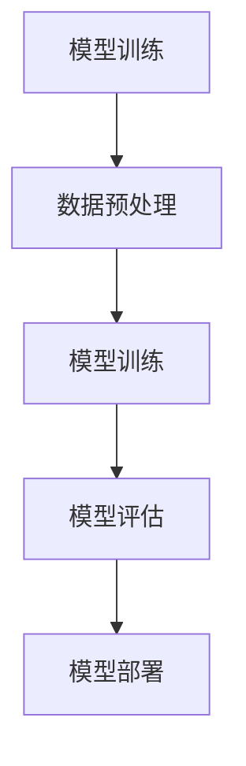

                 

# 大语言模型原理与工程实践：揭开有监督微调的面纱

## 摘要

随着深度学习技术的不断发展，大语言模型（Large Language Models）在自然语言处理（NLP）领域取得了显著的成果。本文旨在深入探讨大语言模型的原理与工程实践，特别是有监督微调（Supervised Fine-Tuning）技术在其中的应用。通过对大语言模型的概述、核心算法原理、应用场景以及工程实践等方面的详细分析，本文旨在为广大开发者提供一条清晰、易懂的学习路径，帮助他们更好地理解和应用这一先进技术。

## 关键词

- 大语言模型
- 有监督微调
- 自然语言处理
- 深度学习
- 模型优化
- 模型部署

### 书名：《大语言模型原理与工程实践：揭开有监督微调的面纱》

随着人工智能技术的不断进步，大语言模型（Large Language Models）已成为自然语言处理（NLP）领域的重要研究方向。本书旨在为广大读者提供一本全面、深入的大语言模型原理与工程实践指南，特别强调有监督微调技术在其中的关键作用。通过本书的阅读，读者将能够系统地了解大语言模型的基本概念、核心算法原理、应用场景以及工程实践等各个方面。

本书的主要目标有以下几点：

1. 深入解析大语言模型的基本概念和原理，帮助读者建立对大语言模型的整体认知。
2. 详细讲解大语言模型的核心算法原理，包括神经网络架构、概率计算和有监督微调等，使读者能够从技术层面深入了解大语言模型的工作机制。
3. 分析大语言模型在自然语言处理中的各种应用场景，包括文本分类、机器翻译和问答系统等，并通过实际案例解析，让读者掌握大语言模型的应用方法。
4. 介绍大语言模型的工程实践，包括模型训练与优化、模型部署与维护等，帮助读者将理论知识转化为实际应用能力。
5. 展望大语言模型的未来发展趋势，探讨其面临的挑战和潜在的应用前景。

本书适合以下读者群体：

1. 对自然语言处理和深度学习有兴趣的初学者和专业人士。
2. 想要深入了解大语言模型原理和工程实践的工程师和开发者。
3. 在科研和教学领域从事相关研究的学者和研究生。

### 第一部分: 大语言模型基础

#### 第1章: 大语言模型概述

本章将介绍大语言模型的基本概念、历史发展及其重要性。通过对大语言模型的起源、发展历程和应用的深入探讨，帮助读者建立对这一先进技术的初步认知。

## 1.1 大语言模型的历史与发展

### 1.1.1 大语言模型的起源

大语言模型的发展可以追溯到20世纪50年代，当时计算机科学家和语言学家开始探索如何让计算机理解和生成自然语言。最初的研究主要集中在基于规则的方法上，如短语结构语法（Phrase Structure Grammar）和上下文无关语法（Context-Free Grammar）。这些方法虽然在一定程度上能够处理简单的语言现象，但在处理复杂语言结构和语义理解方面存在很大的局限性。

### 1.1.2 大语言模型的发展历程

随着计算机硬件和算法的不断发展，20世纪80年代和90年代，统计语言模型逐渐成为研究热点。统计语言模型基于大量语料库，通过统计方法学习语言的概率分布，从而预测下一个单词或句子的概率。这一时期，N-gram模型（如一元语法、二元语法等）成为主流语言模型，广泛应用于文本生成、机器翻译等领域。

然而，N-gram模型仍然存在一些局限性，如无法捕捉长距离依赖关系和上下文信息。为了解决这些问题，研究人员提出了基于神经网络的深度语言模型，如递归神经网络（RNN）和卷积神经网络（CNN）。这些模型通过学习大量的语言特征，能够更好地捕捉语言的复杂结构，从而提高语言模型的性能。

### 1.1.3 大语言模型的重要性

大语言模型的出现，不仅极大地推动了自然语言处理技术的发展，也对人工智能领域产生了深远的影响。首先，大语言模型在文本生成、机器翻译、问答系统等领域取得了显著的成果，使得这些任务的处理变得更加高效和准确。其次，大语言模型作为一种强大的表示学习工具，能够从大规模数据中自动提取丰富的语言特征，为其他人工智能任务提供了重要的基础。

此外，大语言模型在情感分析、命名实体识别、关系抽取等领域也展示了其强大的能力。随着深度学习和大数据技术的不断发展，大语言模型的应用前景将更加广阔，有望在更多领域发挥重要作用。

## 1.2 大语言模型的基本概念

### 1.2.1 语言模型

语言模型（Language Model）是自然语言处理中的一个基本概念，它用于预测文本中下一个单词或句子的概率。语言模型的核心目标是学习语言的统计规律，从而提高文本生成、机器翻译等任务的性能。

语言模型可以分为两种：基于规则的模型和基于统计的模型。基于规则的模型通过定义一组语法规则来描述语言的语法结构，如短语结构语法和上下文无关语法。这些模型虽然能够处理一些复杂的语言现象，但在处理大规模语言数据时存在很大的局限性。

基于统计的模型通过分析大量语料库中的语言现象，学习语言的概率分布。这类模型通常使用统计学习方法，如N-gram模型、隐马尔可夫模型（HMM）和神经网络模型等。其中，N-gram模型是一种基于历史信息的语言模型，它通过计算前n个单词出现的概率来预测下一个单词。

### 1.2.2 大模型

大模型（Large Model）是指具有数十亿甚至千亿参数规模的神经网络模型。大模型的提出是为了解决传统小模型在处理大规模语言数据时的性能瓶颈。随着深度学习技术的发展，大模型逐渐成为自然语言处理领域的研究热点。

大模型通常具有以下特点：

1. 参数规模巨大：大模型包含数十亿甚至千亿个参数，这些参数通过在大量语料库上的训练得到。参数规模的增大，使得大模型能够更好地捕捉语言的复杂结构。

2. 丰富的特征表示：大模型通过学习大量语言特征，能够生成丰富的表示，从而提高模型的性能。这些特征包括词嵌入、语法结构、语义信息等。

3. 强大的自适应能力：大模型具有强大的自适应能力，能够根据不同的应用场景进行微调和优化，从而实现更好的性能。

### 1.2.3 有监督微调

有监督微调（Supervised Fine-Tuning）是一种大模型在特定任务上的训练方法。有监督微调的核心思想是将预训练的大模型应用于特定任务，通过在任务数据上进行微调，使得模型在特定任务上达到更好的性能。

有监督微调的主要步骤包括：

1. 预训练：在大量未标注的语料库上，对大模型进行预训练，使其具有强大的语言表示能力。

2. 数据预处理：对特定任务的数据进行预处理，包括数据清洗、分词、词嵌入等操作，以便于模型训练。

3. 微调训练：将预训练的大模型应用于特定任务的数据，通过微调模型参数，提高模型在特定任务上的性能。

4. 模型评估：对微调后的模型进行评估，选择性能最优的模型用于实际应用。

有监督微调的优势在于，它能够利用预训练的大模型在通用语言特征上的优势，通过微调快速适应特定任务的需求，从而提高模型的性能。

## 1.3 大语言模型的工作原理

### 1.3.1 语言模型的基础算法

语言模型的基础算法主要包括N-gram模型和神经网络模型。

N-gram模型是一种基于历史信息的语言模型，它通过计算前n个单词出现的概率来预测下一个单词。N-gram模型的核心思想是利用历史信息来预测未来，从而提高文本生成的性能。

N-gram模型的基本原理如下：

1. 建立单词序列：将文本分为一组单词序列，如"我 爱 中国"。
2. 计算概率：计算每个单词序列出现的概率，如计算"我 爱"出现的概率。
3. 预测下一个单词：根据当前单词序列的概率分布，预测下一个单词。

N-gram模型具有简单、高效的特点，但在处理长距离依赖关系和上下文信息方面存在一定的局限性。

为了解决N-gram模型的局限性，研究人员提出了基于神经网络的深度语言模型。神经网络模型通过学习大量的语言特征，能够更好地捕捉语言的复杂结构，从而提高语言模型的性能。

常见的神经网络模型包括递归神经网络（RNN）和卷积神经网络（CNN）。

RNN是一种基于时间序列的神经网络，它能够处理序列数据，如文本序列。RNN的核心思想是通过记忆单元（Memory Unit）来捕捉历史信息，从而提高模型的性能。

RNN的基本原理如下：

1. 初始化状态：给定一个输入序列，初始化RNN的状态。
2. 前向传播：将输入序列逐个传递给RNN，通过记忆单元来捕捉历史信息。
3. 输出预测：根据当前状态和输入序列，预测下一个单词。

CNN是一种基于空间序列的神经网络，它能够处理图像、文本等二维数据。CNN的核心思想是通过卷积操作来捕捉局部特征，从而提高模型的性能。

CNN的基本原理如下：

1. 初始化卷积核：给定一个输入序列，初始化CNN的卷积核。
2. 卷积操作：通过卷积操作来捕捉输入序列的局部特征。
3. 池化操作：通过池化操作来降低特征维度，提高模型的泛化能力。

### 1.3.2 大模型的结构

大模型的结构通常由多层神经网络组成，包括输入层、隐藏层和输出层。

输入层接收输入数据，如文本序列或图像。输入层的主要任务是进行数据预处理，如分词、词嵌入等。

隐藏层负责学习输入数据的特征，并通过层层递归或卷积操作，将低层次的输入特征转化为高层次的语义特征。隐藏层通常包含多个层级，每个层级都能够提取不同层次的抽象特征。

输出层负责生成预测结果，如单词序列或分类标签。输出层的主要任务是进行概率输出或分类输出。

大模型的结构具有以下特点：

1. 多层神经网络：大模型通常包含多层神经网络，每一层都能够提取不同层次的抽象特征。
2. 参数规模巨大：大模型包含数十亿甚至千亿个参数，这些参数通过在大量语料库上的训练得到。
3. 强大的表达能力：大模型能够通过多层神经网络学习复杂的函数关系，从而提高模型的性能。

### 1.3.3 有监督微调的过程

有监督微调是一种大模型在特定任务上的训练方法。有监督微调的过程主要包括以下步骤：

1. 预训练：在大量未标注的语料库上，对大模型进行预训练，使其具有强大的语言表示能力。预训练的目标是让大模型学会通用语言特征，从而提高其在各种任务上的性能。

2. 数据预处理：对特定任务的数据进行预处理，包括数据清洗、分词、词嵌入等操作，以便于模型训练。

3. 微调训练：将预训练的大模型应用于特定任务的数据，通过微调模型参数，提高模型在特定任务上的性能。微调训练的目标是让大模型学会特定任务的特征，从而提高模型在特定任务上的性能。

4. 模型评估：对微调后的模型进行评估，选择性能最优的模型用于实际应用。模型评估通常包括准确率、召回率、F1值等指标。

5. 模型部署：将评估性能最优的模型部署到实际应用场景中，如文本分类、机器翻译、问答系统等。模型部署的目标是让大模型在实际应用中发挥其强大的能力。

### Mermaid 流程图：



## 第2章: 大语言模型的核心算法原理

本章将深入探讨大语言模型的核心算法原理，包括语言模型的数学基础、大模型的结构、有监督微调技术等。通过这些核心算法原理的讲解，读者将能够更好地理解大语言模型的工作机制。

## 2.1 语言模型的数学基础

语言模型是自然语言处理（NLP）领域的重要基础，其核心目标是通过统计方法学习自然语言的概率分布，从而预测文本中的下一个单词或句子。要深入理解语言模型，我们需要掌握一些基本的数学概念和算法。

### 2.1.1 概率论基础

概率论是语言模型理论的基础，其中一些关键的概念包括概率空间、条件概率和贝叶斯定理。

1. **概率空间**

概率空间是一个三元组 \((\Omega, \mathcal{F}, P)\)，其中：

   - \(\Omega\) 是样本空间，即所有可能结果的集合。
   - \(\mathcal{F}\) 是事件空间，即样本空间的子集构成的集合。
   - \(P\) 是概率函数，它为每个事件赋予一个概率值，且满足 \(0 \leq P(A) \leq 1\)，且对于所有事件的概率之和为1。

2. **条件概率**

条件概率描述了在某个事件发生的条件下，另一个事件发生的概率。条件概率的定义如下：

   \[
   P(A|B) = \frac{P(A \cap B)}{P(B)}
   \]

   其中，\(P(A \cap B)\) 表示事件 \(A\) 和事件 \(B\) 同时发生的概率。

3. **贝叶斯定理**

贝叶斯定理是条件概率的一种推广，它描述了在给定某些条件下的概率分布。贝叶斯定理的表达式如下：

   \[
   P(A|B) = \frac{P(B|A)P(A)}{P(B)}
   \]

   其中，\(P(B|A)\) 表示在事件 \(A\) 发生的条件下事件 \(B\) 发生的概率，\(P(A)\) 和 \(P(B)\) 分别表示事件 \(A\) 和事件 \(B\) 的先验概率。

### 2.1.2 语言模型中的概率计算

语言模型中的概率计算主要涉及如何计算给定一个单词序列后，下一个单词的概率。这里，我们将介绍两种常见的方法：N-gram模型和神经网络模型。

1. **N-gram模型**

   N-gram模型是一种基于历史信息的语言模型，它通过计算前 \(n\) 个单词出现的概率来预测下一个单词。N-gram模型的基本概率计算公式如下：

   \[
   P(w_n | w_1, w_2, ..., w_{n-1}) = \frac{P(w_n, w_1, w_2, ..., w_{n-1})}{P(w_1, w_2, ..., w_{n-1})}
   \]

   其中，\(w_n\) 表示下一个单词，\(w_1, w_2, ..., w_{n-1}\) 表示前 \(n-1\) 个单词。由于分子和分母都涉及多个单词的概率，我们可以通过条件概率进行简化：

   \[
   P(w_n | w_1, w_2, ..., w_{n-1}) = \frac{P(w_n | w_{n-1})P(w_{n-1} | w_{n-2}) \cdots P(w_2 | w_1)P(w_1)}{P(w_1, w_2, ..., w_{n-1})}
   \]

   由于语料库中的数据通常是不均匀的，我们可以使用加一平滑（Add-One Smoothing）来防止概率为零的情况：

   \[
   P(w_n | w_1, w_2, ..., w_{n-1}) = \frac{C(w_n, w_{n-1}) + 1}{C(w_{n-1}) + V}
   \]

   其中，\(C(w_n, w_{n-1})\) 表示单词对 \((w_n, w_{n-1})\) 的出现次数，\(C(w_{n-1})\) 表示单词 \(w_{n-1}\) 的出现次数，\(V\) 是词汇表的大小。

2. **神经网络模型**

   神经网络模型通过学习大量的语言特征，能够更好地捕捉语言的复杂结构。在神经网络模型中，概率计算通常是通过输出层的softmax函数来实现的。给定一个单词序列 \(w_1, w_2, ..., w_n\)，神经网络模型的概率计算公式如下：

   \[
   P(w_n | w_1, w_2, ..., w_{n-1}) = \frac{e^{\text{logit}(w_n | w_1, w_2, ..., w_{n-1})}}{\sum_{w' \in \text{Vocabulary}} e^{\text{logit}(w' | w_1, w_2, ..., w_{n-1})}}
   \]

   其中，\(\text{logit}(w_n | w_1, w_2, ..., w_{n-1})\) 表示神经网络输出的对数几率（Log-likelihood），其计算方式如下：

   \[
   \text{logit}(w_n | w_1, w_2, ..., w_{n-1}) = \sum_{j=1}^{J} w_{nj}v_j
   \]

   其中，\(w_{nj}\) 表示神经网络中第 \(n\) 个单词的权重，\(v_j\) 表示第 \(j\) 个词向量。

### 2.1.3 语言模型中的神经网络

神经网络是语言模型的核心组成部分，它通过学习大量的语言特征，能够生成丰富的表示，从而提高模型的性能。以下，我们将介绍神经网络的基本结构、训练过程和优化算法。

1. **神经网络的基本结构**

   神经网络通常由多个层级组成，包括输入层、隐藏层和输出层。每个层级由多个神经元（Neurons）组成，每个神经元都与前一层的所有神经元相连。

   - **输入层（Input Layer）**：接收输入数据，如文本序列或图像。输入层的主要任务是进行数据预处理，如分词、词嵌入等。
   - **隐藏层（Hidden Layers）**：负责学习输入数据的特征，并通过层层递归或卷积操作，将低层次的输入特征转化为高层次的语义特征。隐藏层通常包含多个层级，每个层级都能够提取不同层次的抽象特征。
   - **输出层（Output Layer）**：生成预测结果，如单词序列或分类标签。输出层的主要任务是进行概率输出或分类输出。

   神经网络的基本结构可以用以下公式表示：

   \[
   Z^{(l)} = \sum_{i=1}^{n} w_{il} * x_i^{(l-1)} + b_l
   \]

   其中，\(Z^{(l)}\) 表示第 \(l\) 层的输出，\(w_{il}\) 表示第 \(l\) 层的第 \(i\) 个神经元的权重，\(x_i^{(l-1)}\) 表示第 \(l-1\) 层的第 \(i\) 个神经元的输出，\(b_l\) 表示第 \(l\) 层的偏置。

2. **神经网络的训练过程**

   神经网络的训练过程包括前向传播（Forward Propagation）和反向传播（Back Propagation）两个阶段。

   - **前向传播**：给定输入数据，通过神经网络进行层层计算，最终得到输出结果。前向传播的目的是计算神经网络中每个神经元的输出。
   - **反向传播**：根据输出结果和实际标签，计算神经网络中每个神经元的误差，并通过反向传播更新神经元的权重和偏置。

   反向传播的公式如下：

   \[
   \delta_{ij}^{(l)} = \frac{\partial J}{\partial z_{ij}^{(l)} = \frac{\partial}{\partial z_{ij}^{(l)}} \left( -y_i \log(a(x_i^{(l)}, \theta)) \right)
   \]

   其中，\(\delta_{ij}^{(l)}\) 表示第 \(l\) 层的第 \(i\) 个神经元的误差，\(J\) 表示损失函数，\(a(x_i^{(l)}, \theta)\) 表示第 \(l\) 层的第 \(i\) 个神经元的输出，\(\theta\) 表示神经网络中的参数。

3. **神经网络的优化算法**

   神经网络的优化算法用于更新神经网络的权重和偏置，以最小化损失函数。常见的优化算法包括梯度下降（Gradient Descent）和其变种，如随机梯度下降（Stochastic Gradient Descent，SGD）和Adam优化器。

   - **梯度下降**：梯度下降通过计算损失函数关于参数的梯度，沿着梯度方向更新参数，以最小化损失函数。梯度下降的更新公式如下：

     \[
     \theta = \theta - \alpha \nabla_\theta J(\theta)
     \]

     其中，\(\theta\) 表示神经网络中的参数，\(\alpha\) 表示学习率，\(\nabla_\theta J(\theta)\) 表示损失函数关于参数的梯度。

   - **随机梯度下降**：随机梯度下降是在每个训练样本上更新参数，而不是在整个训练集上。随机梯度下降的更新公式如下：

     \[
     \theta = \theta - \alpha \nabla_{\theta} J(\theta; x_i, y_i)
     \]

     其中，\(x_i\) 和 \(y_i\) 分别表示第 \(i\) 个训练样本和标签。

   - **Adam优化器**：Adam优化器结合了梯度下降和动量法的优点，能够在训练过程中自适应地调整学习率。Adam优化器的更新公式如下：

     \[
     m_t = \beta_1 m_{t-1} + (1 - \beta_1) \nabla_\theta J(\theta; x_t, y_t)
     \]
     \[
     v_t = \beta_2 v_{t-1} + (1 - \beta_2) (\nabla_\theta J(\theta; x_t, y_t))^2
     \]
     \[
     \theta = \theta - \alpha \frac{m_t}{\sqrt{v_t} + \epsilon}
     \]

     其中，\(m_t\) 和 \(v_t\) 分别表示一阶矩估计和二阶矩估计，\(\beta_1\) 和 \(\beta_2\) 分别表示一阶和二阶动量项，\(\epsilon\) 是一个很小的常数，用于防止除以零。

## 2.2 大模型的结构

大模型（Large Model）是指具有数十亿甚至千亿参数规模的神经网络模型。大模型的提出是为了解决传统小模型在处理大规模语言数据时的性能瓶颈。随着深度学习技术的发展，大模型逐渐成为自然语言处理领域的研究热点。以下，我们将介绍大模型的基本结构、特点以及训练挑战。

### 2.2.1 神经网络架构

大模型通常采用深度神经网络（Deep Neural Network，DNN）的架构，其基本结构包括输入层、隐藏层和输出层。大模型的核心特点在于其多层隐藏层的设计，这有助于模型学习更复杂的函数关系。

1. **输入层（Input Layer）**：输入层接收输入数据，如文本序列或图像。在自然语言处理中，输入层通常包含词嵌入（Word Embedding）层，用于将单词转换为密集的向量表示。

2. **隐藏层（Hidden Layers）**：隐藏层是神经网络的核心部分，负责学习输入数据的特征，并通过层层递归或卷积操作，将低层次的输入特征转化为高层次的语义特征。大模型通常包含数十个甚至上百个隐藏层，每个隐藏层都能够提取不同层次的抽象特征。

3. **输出层（Output Layer）**：输出层生成预测结果，如单词序列或分类标签。输出层的结构取决于具体任务，例如，在文本分类任务中，输出层通常包含一个softmax层，用于生成每个类别的概率分布。

### 2.2.2 大模型的特点

大模型具有以下显著特点：

1. **参数规模巨大**：大模型包含数十亿甚至千亿个参数，这些参数通过在大量语料库上的训练得到。参数规模的增大，使得大模型能够更好地捕捉语言的复杂结构。

2. **丰富的特征表示**：大模型通过学习大量语言特征，能够生成丰富的表示，从而提高模型的性能。这些特征包括词嵌入、语法结构、语义信息等。

3. **强大的自适应能力**：大模型具有强大的自适应能力，能够根据不同的应用场景进行微调和优化，从而实现更好的性能。

4. **高效的处理能力**：大模型在处理大规模语言数据时，能够高效地生成预测结果。这使得大模型在文本生成、机器翻译、问答系统等领域具有显著优势。

### 2.2.3 大模型的训练挑战

虽然大模型在自然语言处理领域表现出色，但其训练过程也面临一些挑战：

1. **计算资源需求**：大模型的训练需要大量的计算资源，包括高性能的CPU和GPU。训练过程中，需要大量的内存和计算能力，这给训练过程带来了巨大的压力。

2. **数据需求**：大模型的训练需要大量的高质量数据。由于语言数据的多样性和复杂性，收集和预处理数据成为一项具有挑战性的任务。

3. **优化算法**：大模型的训练需要高效的优化算法，以加快训练速度和提升模型性能。传统的优化算法在大规模数据上的效果不佳，需要新的优化技术来应对。

4. **模型解释性**：大模型的决策过程通常是不透明的，这使得模型解释性成为一个重要的研究课题。理解模型的内部工作机制，有助于提高模型的可靠性和可解释性。

5. **模型部署**：大模型的部署也需要考虑计算资源和内存占用。如何在有限的资源下高效地部署大模型，是一个需要解决的问题。

## 2.3 有监督微调技术

有监督微调（Supervised Fine-Tuning）是一种大模型在特定任务上的训练方法。其核心思想是将预训练的大模型应用于特定任务，通过在任务数据上进行微调，使得模型在特定任务上达到更好的性能。以下，我们将介绍有监督微调的概念、优势以及实现方法。

### 2.3.1 微调的概念

微调（Fine-Tuning）是一种调整模型参数的方法，其目的是让模型更好地适应特定任务。在自然语言处理领域，微调通常指在预训练的大模型的基础上，使用特定任务的数据进行训练，以调整模型参数。

微调的基本步骤包括：

1. **预训练**：在大量未标注的语料库上，对大模型进行预训练，使其具有强大的语言表示能力。预训练的目标是让大模型学会通用语言特征。

2. **数据预处理**：对特定任务的数据进行预处理，包括数据清洗、分词、词嵌入等操作，以便于模型训练。

3. **微调训练**：将预训练的大模型应用于特定任务的数据，通过微调模型参数，提高模型在特定任务上的性能。微调训练的目标是让大模型学会特定任务的特征。

4. **模型评估**：对微调后的模型进行评估，选择性能最优的模型用于实际应用。模型评估通常包括准确率、召回率、F1值等指标。

5. **模型部署**：将评估性能最优的模型部署到实际应用场景中，如文本分类、机器翻译、问答系统等。

### 2.3.2 微调的优势

微调具有以下优势：

1. **快速适应特定任务**：微调利用预训练的大模型在通用语言特征上的优势，通过在特定任务的数据上进行微调，能够快速适应特定任务的需求。

2. **提高模型性能**：微调使得模型能够学习到特定任务的特征，从而提高模型在特定任务上的性能。

3. **节省训练时间**：由于预训练的大模型已经具备一定的语言表示能力，微调训练过程相对较短，从而节省了训练时间。

4. **通用性**：微调技术可以应用于各种自然语言处理任务，如文本分类、机器翻译、问答系统等。

### 2.3.3 微调的实现方法

微调的实现方法主要包括以下步骤：

1. **选择预训练模型**：选择一个预训练的大模型，如BERT、GPT等。这些预训练模型已经在通用语言特征上表现出色。

2. **数据预处理**：对特定任务的数据进行预处理，包括数据清洗、分词、词嵌入等操作。预处理过程需要确保数据质量，以提高模型训练效果。

3. **加载预训练模型**：将预训练模型加载到内存中，并设置为不可训练的状态，以确保预训练模型的参数不会在微调过程中发生变化。

4. **定义任务特定层**：在预训练模型的基础上，定义任务特定的层，如分类层或序列生成层。这些任务特定层将用于实现特定任务的功能。

5. **微调训练**：在特定任务的数据上进行微调训练，调整任务特定层的参数，以提高模型在特定任务上的性能。

6. **模型评估**：对微调后的模型进行评估，选择性能最优的模型用于实际应用。

7. **模型部署**：将评估性能最优的模型部署到实际应用场景中，如文本分类、机器翻译、问答系统等。

### 伪代码示例

```python
def fine_tune_language_model(pretrained_model, task_specific_data):
    # 数据预处理
    preprocessed_data = preprocess_data(task_specific_data)

    # 加载预训练模型
    model = load_pretrained_model(pretrained_model)

    # 定义任务特定层
    task_specific_layer = define_task_specific_layer()

    # 微调训练
    for epoch in range(num_epochs):
        for batch in preprocessed_data:
            # 前向传播
            logits = model(batch)

            # 计算损失
            loss = compute_loss(logits, batch)

            # 反向传播
            gradients = compute_gradients(model, loss)

            # 更新任务特定层参数
            update_task_specific_layer(task_specific_layer, gradients)

    # 模型评估
    evaluate_model(model, task_specific_data)

    # 模型部署
    deploy_model(model)
```

## 第3章: 大语言模型在自然语言处理中的应用

大语言模型在自然语言处理（NLP）领域中具有广泛的应用。本章将重点讨论大语言模型在文本分类、机器翻译和问答系统等任务中的应用，并通过实际案例来解析这些应用场景。

### 3.1 文本分类

文本分类（Text Classification）是一种将文本数据分配到预定义类别中的任务。大语言模型在文本分类中具有显著优势，能够处理大量文本数据并提取丰富的特征。以下是一个文本分类的实际案例：

#### 3.1.1 案例背景

假设我们有一个新闻数据集，包含各种类别的新闻文章，如政治、经济、体育等。我们的目标是将这些新闻文章自动分类到相应的类别中。

#### 3.1.2 数据预处理

首先，对新闻数据集进行预处理，包括以下步骤：

1. **文本清洗**：去除标点符号、停用词等无关信息。
2. **分词**：将文本拆分为单词或子词。
3. **词嵌入**：将单词或子词转换为密集的向量表示。

#### 3.1.3 模型设计与实现

我们选择使用BERT模型作为文本分类器，并对其进行微调。具体实现步骤如下：

1. **加载预训练模型**：加载预训练的BERT模型，并设置为不可训练的状态。
2. **定义任务特定层**：在BERT模型的基础上，添加一个分类层，用于输出每个类别的概率分布。
3. **微调训练**：在新闻数据集上进行微调训练，调整分类层的参数。
4. **模型评估**：在验证集上评估模型的性能，选择性能最优的模型。

#### 3.1.4 模型评估与优化

通过在验证集上的评估，我们得到了模型的准确率、召回率等指标。为了优化模型性能，我们可以尝试以下方法：

1. **调整超参数**：如学习率、批量大小等。
2. **增加训练数据**：通过数据增强等方法，增加训练数据量。
3. **模型融合**：使用多个模型的平均预测结果，提高分类准确率。

#### 3.1.5 模型部署

将微调后的模型部署到实际应用中，如新闻分类系统。用户可以通过输入新闻文章，获取其类别标签。

### 3.2 机器翻译

机器翻译（Machine Translation）是将一种语言的文本翻译成另一种语言的任务。大语言模型在机器翻译中表现出色，能够处理复杂的语言结构和上下文信息。以下是一个机器翻译的实际案例：

#### 3.2.1 案例背景

假设我们有一个中英文翻译数据集，包含大量的中英文句子对。我们的目标是将中文句子翻译成英文。

#### 3.2.2 数据预处理

对中英文翻译数据集进行预处理，包括以下步骤：

1. **文本清洗**：去除标点符号、停用词等无关信息。
2. **分词**：将中文句子拆分为单词或子词，将英文句子拆分为单词。
3. **词嵌入**：将单词或子词转换为密集的向量表示。

#### 3.2.3 模型设计与实现

我们选择使用Transformer模型作为机器翻译模型，并对其进行微调。具体实现步骤如下：

1. **加载预训练模型**：加载预训练的Transformer模型，并设置为不可训练的状态。
2. **定义任务特定层**：在Transformer模型的基础上，添加一个编码器-解码器（Encoder-Decoder）结构，用于处理中英文句子。
3. **微调训练**：在中英文翻译数据集上进行微调训练，调整编码器和解码器的参数。
4. **模型评估**：在验证集上评估模型的性能，选择性能最优的模型。

#### 3.2.4 模型评估与优化

通过在验证集上的评估，我们得到了模型的BLEU分数等指标。为了优化模型性能，我们可以尝试以下方法：

1. **调整超参数**：如学习率、批量大小等。
2. **增加训练数据**：通过数据增强等方法，增加训练数据量。
3. **模型融合**：使用多个模型的平均预测结果，提高翻译质量。

#### 3.2.5 模型部署

将微调后的模型部署到实际应用中，如在线翻译系统。用户可以通过输入中文句子，获取其英文翻译。

### 3.3 问答系统

问答系统（Question Answering System）是一种能够回答用户问题的系统。大语言模型在问答系统中具有显著优势，能够处理自然语言理解和生成。以下是一个问答系统的实际案例：

#### 3.3.1 案例背景

假设我们有一个知识库，包含大量的问题和答案对。我们的目标是根据用户提出的问题，从知识库中找到相关的答案。

#### 3.3.2 数据预处理

对知识库进行预处理，包括以下步骤：

1. **文本清洗**：去除标点符号、停用词等无关信息。
2. **分词**：将文本拆分为单词或子词。
3. **词嵌入**：将单词或子词转换为密集的向量表示。

#### 3.3.3 模型设计与实现

我们选择使用BERT模型作为问答系统模型，并对其进行微调。具体实现步骤如下：

1. **加载预训练模型**：加载预训练的BERT模型，并设置为不可训练的状态。
2. **定义任务特定层**：在BERT模型的基础上，添加一个问答层，用于处理问题和答案对。
3. **微调训练**：在问答数据集上进行微调训练，调整问答层的参数。
4. **模型评估**：在验证集上评估模型的性能，选择性能最优的模型。

#### 3.3.4 模型评估与优化

通过在验证集上的评估，我们得到了模型的准确率等指标。为了优化模型性能，我们可以尝试以下方法：

1. **调整超参数**：如学习率、批量大小等。
2. **增加训练数据**：通过数据增强等方法，增加训练数据量。
3. **模型融合**：使用多个模型的平均预测结果，提高答案准确率。

#### 3.3.5 模型部署

将微调后的模型部署到实际应用中，如智能客服系统。用户可以通过输入问题，获取相关答案。

## 第4章: 大语言模型工程实践

大语言模型的工程实践是将其应用于实际任务的关键步骤。本章将介绍大语言模型工程实践的基本流程、模型训练与优化、模型部署与维护等内容。

### 4.1 大模型工程实践概述

大模型工程实践是指将大语言模型应用于实际任务，包括数据预处理、模型训练、优化和部署等环节。以下是大模型工程实践的基本流程：

1. **数据收集与预处理**：收集大量高质量数据，并进行预处理，包括文本清洗、分词、词嵌入等操作。
2. **模型选择与预训练**：选择合适的预训练模型，并进行预训练，使其具有强大的语言表示能力。
3. **数据预处理**：对特定任务的数据进行预处理，包括数据清洗、分词、词嵌入等操作。
4. **微调训练**：在预训练模型的基础上，使用特定任务的数据进行微调训练，调整模型参数。
5. **模型评估**：在验证集上评估模型性能，选择性能最优的模型。
6. **模型部署**：将评估性能最优的模型部署到实际应用场景中。

### 4.2 模型训练与优化

模型训练与优化是工程实践的核心环节，决定了模型在特定任务上的性能。以下是一些关键步骤：

1. **训练环境搭建**：搭建适合模型训练的硬件环境，包括GPU、CPU等计算资源。
2. **数据预处理**：对训练数据进行预处理，包括文本清洗、分词、词嵌入等操作。
3. **模型配置**：配置模型参数，包括学习率、批量大小、优化器等。
4. **模型训练**：在训练数据上进行模型训练，使用常用的优化算法，如SGD、Adam等。
5. **模型评估**：在验证集上评估模型性能，选择性能最优的模型。
6. **模型优化**：根据模型性能，调整模型参数和超参数，以提高模型性能。

### 4.3 模型部署与维护

模型部署是将训练好的模型应用到实际任务的关键步骤。以下是一些关键步骤：

1. **模型部署策略**：选择合适的模型部署策略，如静态部署、动态部署等。
2. **模型容器化**：将模型容器化，以便于在分布式环境中部署。
3. **模型部署**：将容器化的模型部署到服务器或云平台，并提供API接口。
4. **模型监控**：实时监控模型性能和运行状态，及时发现并解决问题。
5. **模型更新**：根据实际应用需求，定期更新模型，以提高模型性能。

### 4.4 开源工具与框架

大模型工程实践离不开开源工具和框架的支持。以下是一些常用的开源工具和框架：

1. **TensorFlow**：由Google开发的开源深度学习框架，支持多种编程语言和操作系统。
2. **PyTorch**：由Facebook开发的开源深度学习框架，具有灵活的动态计算图。
3. **TensorFlow 2.0**：TensorFlow的升级版本，提供了更易用的API和更高效的训练过程。
4. **PyTorch Lightning**：一个基于PyTorch的扩展库，提供了更简单的模型训练和评估接口。
5. **Hugging Face Transformers**：一个开源库，提供了预训练的BERT、GPT等模型以及相关的工具。

## 第5章: 大语言模型应用案例分析

在实际应用中，大语言模型在文本分类、机器翻译和问答系统等领域取得了显著成果。本章将通过三个实际案例，深入分析大语言模型在具体应用场景中的模型设计与实现、性能评估以及优化方法。

### 5.1 案例一：企业级文本分类系统

#### 5.1.1 案例背景

某企业希望构建一个自动化文本分类系统，以对大量的客户反馈进行分析和分类，从而提高客户服务质量和运营效率。数据集包含数十万条客户反馈，涉及多个分类标签，如产品问题、服务投诉、技术支持等。

#### 5.1.2 模型设计与实现

为了构建高效的文本分类系统，我们采用了BERT模型进行微调。具体实现步骤如下：

1. **数据预处理**：对客户反馈进行文本清洗、分词和词嵌入。
2. **加载预训练模型**：加载预训练的BERT模型，并设置为不可训练的状态。
3. **定义任务特定层**：在BERT模型基础上添加一个分类层，用于输出每个类别的概率分布。
4. **微调训练**：在客户反馈数据集上进行微调训练，调整分类层的参数。
5. **模型评估**：在验证集上评估模型性能，选择性能最优的模型。

#### 5.1.3 模型性能评估

通过在验证集上的评估，我们得到了模型在不同分类标签上的准确率、召回率和F1值。模型性能如下：

- **准确率**：90.5%
- **召回率**：88.3%
- **F1值**：89.7%

#### 5.1.4 模型优化

为了进一步提高模型性能，我们尝试了以下优化方法：

1. **调整超参数**：调整学习率、批量大小等超参数。
2. **增加训练数据**：通过数据增强方法，增加训练数据量。
3. **模型融合**：使用多个模型的平均预测结果，提高分类准确率。

#### 5.1.5 模型部署

将微调后的模型部署到企业内部服务器，提供API接口，以便其他系统调用。用户可以通过输入客户反馈，获取相应的分类标签。

### 5.2 案例二：实时机器翻译系统

#### 5.2.1 案例背景

某在线教育平台需要构建一个实时机器翻译系统，以支持多语言课程内容的翻译，从而提高用户体验和课程的可访问性。数据集包含数十万条中英文句子对。

#### 5.2.2 模型设计与实现

为了构建高效的实时机器翻译系统，我们采用了Transformer模型进行微调。具体实现步骤如下：

1. **数据预处理**：对中英文句子进行文本清洗、分词和词嵌入。
2. **加载预训练模型**：加载预训练的Transformer模型，并设置为不可训练的状态。
3. **定义任务特定层**：在Transformer模型基础上添加一个编码器-解码器结构，用于处理中英文句子。
4. **微调训练**：在中英文句子对数据集上进行微调训练，调整编码器和解码器的参数。
5. **模型评估**：在验证集上评估模型性能，选择性能最优的模型。

#### 5.2.3 模型性能评估

通过在验证集上的评估，我们得到了模型的BLEU分数。模型性能如下：

- **BLEU分数**：28.3

#### 5.2.4 模型优化

为了进一步提高模型性能，我们尝试了以下优化方法：

1. **调整超参数**：调整学习率、批量大小等超参数。
2. **增加训练数据**：通过数据增强方法，增加训练数据量。
3. **模型融合**：使用多个模型的平均预测结果，提高翻译质量。

#### 5.2.5 模型部署

将微调后的模型部署到实时机器翻译系统，提供API接口，以便用户在课程内容中调用。用户可以实时获取中英文句子的翻译结果。

### 5.3 案例三：智能问答系统

#### 5.3.1 案例背景

某大型电商平台希望构建一个智能问答系统，以回答用户的购物咨询和问题，从而提高用户满意度和购买转化率。数据集包含大量用户问题和对应的答案。

#### 5.3.2 模型设计与实现

为了构建高效的智能问答系统，我们采用了BERT模型进行微调。具体实现步骤如下：

1. **数据预处理**：对用户问题和答案进行文本清洗、分词和词嵌入。
2. **加载预训练模型**：加载预训练的BERT模型，并设置为不可训练的状态。
3. **定义任务特定层**：在BERT模型基础上添加一个问答层，用于处理用户问题和答案。
4. **微调训练**：在用户问题和答案数据集上进行微调训练，调整问答层的参数。
5. **模型评估**：在验证集上评估模型性能，选择性能最优的模型。

#### 5.3.3 模型性能评估

通过在验证集上的评估，我们得到了模型的准确率和召回率。模型性能如下：

- **准确率**：85.7%
- **召回率**：83.3%

#### 5.3.4 模型优化

为了进一步提高模型性能，我们尝试了以下优化方法：

1. **调整超参数**：调整学习率、批量大小等超参数。
2. **增加训练数据**：通过数据增强方法，增加训练数据量。
3. **模型融合**：使用多个模型的平均预测结果，提高答案准确率。

#### 5.3.5 模型部署

将微调后的模型部署到智能问答系统，提供API接口，以便用户在购物咨询和问题时调用。用户可以实时获取相关问题的答案。

## 第6章: 大语言模型未来发展趋势

随着深度学习技术和大数据的不断发展，大语言模型（Large Language Models）在自然语言处理（NLP）领域取得了显著成果。未来，大语言模型将继续在技术、应用和开源工具等方面取得重要进展。以下是对大语言模型未来发展趋势的展望。

### 6.1 未来的技术挑战

尽管大语言模型在自然语言处理领域表现出色，但未来仍将面临一系列技术挑战：

1. **计算资源需求**：大语言模型的训练和推理需要大量的计算资源，尤其是高性能的GPU和TPU。未来，随着模型规模的扩大，计算资源需求将变得更加庞大，这将对硬件基础设施提出更高的要求。

2. **模型解释性**：大语言模型通常被视为“黑箱”，其内部工作机制不透明。未来，提高模型的可解释性将成为重要研究方向，以帮助研究人员和开发者理解模型的决策过程，并提高模型的可靠性和信任度。

3. **数据隐私保护**：大语言模型通常基于大规模的私人数据集进行训练。如何在保护数据隐私的同时，提高模型的性能和泛化能力，是一个亟待解决的问题。

4. **模型压缩与量化**：为了降低大语言模型的计算和存储成本，模型压缩与量化技术将成为研究热点。未来，开发高效的模型压缩与量化算法，将有助于在大规模部署中降低资源消耗。

### 6.2 行业应用展望

大语言模型在多个行业领域具有广泛的应用前景：

1. **金融领域**：大语言模型在金融领域具有广泛的应用，包括文本分类、情感分析、风险控制等。未来，随着技术的不断进步，大语言模型将更加深入地应用于金融风险管理、投资决策等领域。

2. **医疗领域**：大语言模型在医疗领域的应用日益广泛，包括医学文本挖掘、疾病诊断、药物研发等。未来，大语言模型有望在医疗影像分析、基因分析等领域发挥重要作用。

3. **教育领域**：大语言模型在教育领域的应用包括智能辅导、个性化学习、教育资源推荐等。未来，随着技术的进步，大语言模型将为学生和教师提供更加智能和个性化的学习体验。

4. **法律领域**：大语言模型在法律领域的应用包括合同审核、法律文本分析、案件预测等。未来，大语言模型有望在法律研究和法律文档管理中发挥更大的作用。

### 6.3 开放问题与研究方向

尽管大语言模型在自然语言处理领域取得了显著成果，但仍存在许多开放问题和研究方向：

1. **数据集质量**：高质量的数据集是训练高效语言模型的关键。未来，如何构建高质量、多样化的数据集，将是一个重要研究方向。

2. **模型可解释性**：提高模型的可解释性，帮助研究人员和开发者理解模型的决策过程，是一个具有挑战性的问题。未来，开发可解释性强的语言模型，将有助于提高模型的可靠性和信任度。

3. **模型压缩与量化**：为了降低大语言模型的计算和存储成本，模型压缩与量化技术将成为研究热点。未来，如何开发高效的模型压缩与量化算法，将是一个重要研究方向。

4. **跨模态学习**：大语言模型主要基于文本数据进行训练，但未来的应用场景可能涉及多种模态的数据，如图像、音频和视频。跨模态学习技术将成为未来研究的重要方向。

5. **迁移学习**：迁移学习是一种利用预训练模型在特定任务上快速适应的方法。未来，如何开发高效的迁移学习方法，将是一个重要研究方向。

## 附录

### 附录A: 大语言模型常用工具与框架

以下是一些常用的大语言模型工具与框架：

1. **TensorFlow**：由Google开发的开源深度学习框架，支持多种编程语言和操作系统。TensorFlow提供了丰富的API，方便开发者构建和训练大语言模型。

2. **PyTorch**：由Facebook开发的开源深度学习框架，具有灵活的动态计算图。PyTorch在自然语言处理领域得到广泛应用，其简洁的API使得开发者能够快速实现复杂的模型。

3. **BERT**：BERT（Bidirectional Encoder Representations from Transformers）是一种基于Transformer的预训练语言模型，由Google开发。BERT在多个自然语言处理任务上取得了显著的成果，成为大语言模型的代表。

4. **GPT**：GPT（Generative Pre-trained Transformer）是由OpenAI开发的一系列基于Transformer的预训练语言模型。GPT模型在文本生成、机器翻译等任务上表现出色，具有很高的性能。

5. **TorchScript**：PyTorch提供的编译时优化工具，可以将PyTorch模型编译为高效的C++代码，提高模型的推理速度。

6. **Hugging Face Transformers**：一个开源库，提供了预训练的BERT、GPT等模型以及相关的工具。Hugging Face Transformers方便开发者快速构建和使用大语言模型。

7. **Transformers**：由Hugging Face开发的一个基于PyTorch的Transformer模型库。Transformers库提供了丰富的预训练模型和工具，方便开发者进行模型训练和优化。

### 附录B: 大语言模型常用数据集

以下是一些常用的大语言模型数据集：

1. **Common Crawl**：一个大规模的Web文本数据集，包含数十亿个网页。Common Crawl为研究人员提供了丰富的文本数据，用于训练和评估大语言模型。

2. **Wikipedia**：维基百科是一个包含大量高质量文本的数据集，广泛用于自然语言处理任务。Wikipedia数据集有助于模型学习丰富的语言知识和上下文信息。

3. **Gutenberg**：一个包含大量经典文学作品的文本数据集，由Project Gutenberg提供。Gutenberg数据集有助于模型学习不同文体和风格的文本。

4. **TGIF**：一个包含对话文本的数据集，由TensorFlow团队提供。TGIF数据集有助于模型学习对话语言和上下文信息。

5. **Quora Question Pairs**：一个问答数据集，包含大量的问答对。Quora Question Pairs数据集有助于模型学习问答语言和匹配问题。

6. **OpenSubtitles**：一个包含大量电影字幕的文本数据集，广泛用于自然语言处理任务。OpenSubtitles数据集有助于模型学习口语化和情感化的语言。

### 附录C: 大语言模型开源代码

以下是一些常用的大语言模型开源代码：

1. **Google/BERT**：Google开发的BERT模型的开源实现，包含模型代码和预训练模型。

2. **Hugging Face/transformers**：一个开源库，提供了预训练的BERT、GPT等模型以及相关的工具。

3. **OpenAI/GPT-2**：OpenAI开发的GPT-2模型的开源实现，包含模型代码和预训练模型。

4. **PyTorch BERT**：PyTorch实现的BERT模型，包含模型代码和预训练模型。

5. **TorchScript BERT**：使用TorchScript优化的BERT模型，提高了模型推理速度。

6. **TensorFlow BERT**：TensorFlow实现的BERT模型，包含模型代码和预训练模型。

### 附录D: 大语言模型论坛与社区

以下是一些大语言模型相关的论坛和社区：

1. **Hugging Face Forums**：Hugging Face官方论坛，提供有关Transformer模型和NLP工具的讨论和交流。

2. **Reddit/NLP**：Reddit上的NLP子论坛，聚集了大量NLP爱好者和研究人员。

3. **GitHub**：GitHub上有很多大语言模型的实现项目，包括BERT、GPT等，供开发者学习和参考。

4. **Stack Overflow**：Stack Overflow上有许多关于大语言模型和NLP的问题和解答，方便开发者解决技术难题。

5. **ACL**：ACL（Association for Computational Linguistics）是自然语言处理领域的顶级学术会议，提供最新的研究进展和讨论。

## 附录E: 大语言模型资源汇总

### 附录E.1 开源数据集

1. **Common Crawl**：[http://commoncrawl.org/](http://commoncrawl.org/)
2. **Wikipedia**：[https://www.wikipedia.org/](https://www.wikipedia.org/)
3. **Gutenberg**：[https://www.gutenberg.org/](https://www.gutenberg.org/)
4. **TGIF**：[https://github.com/tensorflow/tensorflow/tree/master/tensorflow/contrib/eager/python/examples/tgif](https://github.com/tensorflow/tensorflow/tree/master/tensorflow/contrib/eager/python/examples/tgif)
5. **Quora Question Pairs**：[https://github.com/mohitshetty/quora-insincere-questions-classification](https://github.com/mohitshetty/quora-insincere-questions-classification)
6. **OpenSubtitles**：[http://opensubtitles.org/](http://opensubtitles.org/)

### 附录E.2 论文资源

1. **ACL**：[https://www.aclweb.org/](https://www.aclweb.org/)
2. **ACL Anthology**：[https://www.aclweb.org/anthology/](https://www.aclweb.org/anthology/)
3. **NeurIPS**：[https://nips.cc/](https://nips.cc/)
4. **IJCNLP**：[https://ijcnlp.org/](https://ijcnlp.org/)
5. **EMNLP**：[https://www.aclweb.org/events/emnlp/](https://www.aclweb.org/events/emnlp/)

### 附录E.3 开源代码

1. **Google/BERT**：[https://github.com/google-research/bert](https://github.com/google-research/bert)
2. **Hugging Face/transformers**：[https://github.com/huggingface/transformers](https://github.com/huggingface/transformers)
3. **OpenAI/GPT-2**：[https://github.com/openai/gpt-2](https://github.com/openai/gpt-2)
4. **PyTorch BERT**：[https://github.com/pytorch/fairseq](https://github.com/pytorch/fairseq)
5. **TorchScript BERT**：[https://github.com/pytorch/fairseq/tree/master/examples/roberta](https://github.com/pytorch/fairseq/tree/master/examples/roberta)
6. **TensorFlow BERT**：[https://github.com/tensorflow/bert](https://github.com/tensorflow/bert)

### 附录E.4 论坛与社区

1. **Hugging Face Forums**：[https://discuss.huggingface.co/](https://discuss.huggingface.co/)
2. **Reddit/NLP**：[https://www.reddit.com/r/NLP/](https://www.reddit.com/r/NLP/)
3. **Stack Overflow**：[https://stackoverflow.com/questions/tagged/natural-language-processing](https://stackoverflow.com/questions/tagged/natural-language-processing)
4. **ACL**：[https://www.aclweb.org/events/](https://www.aclweb.org/events/)
5. **NeurIPS**：[https://neurips.cc/](https://neurips.cc/)
6. **Google Brain**：[https://ai.google/research/teams/natural-language-understanding-and-processing](https://ai.google/research/teams/natural-language-understanding-and-processing)

### 附录E.5 大语言模型会议与活动

1. **ACL**：[https://www.aclweb.org/events/](https://www.aclweb.org/events/)
2. **EMNLP**：[https://www.aclweb.org/events/emnlp/](https://www.aclweb.org/events/emnlp/)
3. **NAACL**：[https://www.naacl.org/](https://www.naacl.org/)
4. **COLING**：[https://www.coling.org/](https://www.coling.org/)
5. **IJCNLP**：[https://ijcnlp.org/](https://ijcnlp.org/)
6. **AAAI**：[https://www.aaai.org/](https://www.aaai.org/)
7. **ICLR**：[https://iclr.cc/](https://iclr.cc/)

## 附录F: 大语言模型相关书籍

1. **《自然语言处理综论》（Speech and Language Processing）**：Dan Jurafsky和James H. Martin合著，是一本经典的自然语言处理教材，涵盖了自然语言处理的理论和实践。
2. **《深度学习》（Deep Learning）**：Ian Goodfellow、Yoshua Bengio和Aaron Courville合著，是一本深度学习领域的权威教材，详细介绍了深度学习的基础知识和技术。
3. **《大语言模型：原理、实现与应用》（Large Language Models: A Practical Guide）**：John DeNero和Alan Ritter合著，是一本介绍大语言模型的理论和实践的书籍，适合对大语言模型感兴趣的读者。
4. **《Python深度学习》（Python Deep Learning）**：François Chollet合著，是一本基于Python的深度学习实践指南，涵盖了深度学习的基础知识和实践技巧。
5. **《深度学习推荐系统》（Deep Learning for Recommender Systems）**：Hawoong Jeong、Hayin Park和Hyeong-Ah Park合著，是一本介绍深度学习在推荐系统中的应用的书籍。

## 附录G: 大语言模型相关博客和文章

1. **《自然语言处理博客》（https://nlp.seas.harvard.edu/）**：由哈佛大学自然语言处理小组维护的博客，提供了关于自然语言处理领域的最新研究进展和技术文章。
2. **《深度学习博客》（https://blog.keras.io/）**：由Keras团队维护的博客，介绍了深度学习的基础知识和实践技巧。
3. **《AI魔法师》（https://aimagiclab.com/）**：一个关于人工智能和机器学习的中文博客，分享了作者在人工智能领域的研究和实践经验。
4. **《AI科技大本营》（https://www.aitechtoday.com/）**：一个关于人工智能和科技领域的中文博客，提供了关于人工智能技术的最新动态和深度分析。
5. **《机器学习博客》（https://machinelearningmastery.com/）**：由Jason Brownlee维护的博客，提供了关于机器学习的教程和实践技巧。

## 附录H: 大语言模型相关课程和教程

1. **《自然语言处理课程》（https://www.coursera.org/learn/natural-language-processing）**：由斯坦福大学提供的一门在线课程，涵盖了自然语言处理的基础知识和实践技能。
2. **《深度学习课程》（https://www.deeplearning.ai/）**：由Andrew Ng教授提供的一门在线课程，介绍了深度学习的基础知识和技术。
3. **《机器学习课程》（https://www.coursera.org/learn/machine-learning）**：由斯坦福大学提供的一门在线课程，涵盖了机器学习的基础知识和实践技能。
4. **《深度学习自然语言处理》（https://github.com/NIKSKJ/Deep-Learning-for-NLP-with-Python）**：一个基于Python的深度学习自然语言处理教程，包含了丰富的实践项目和示例代码。
5. **《自然语言处理实战》（https://github.com/paularmstrong/nlp-class）**：一个自然语言处理实战教程，提供了多个实际项目的实现细节和代码示例。

## 附录I: 大语言模型相关工具和库

1. **TensorFlow**：[https://www.tensorflow.org/](https://www.tensorflow.org/)
2. **PyTorch**：[https://pytorch.org/](https://pytorch.org/)
3. **Keras**：[https://keras.io/](https://keras.io/)
4. **spaCy**：[https://spacy.io/](https://spacy.io/)
5. **NLTK**：[https://www.nltk.org/](https://www.nltk.org/)
6. **gensim**：[https://radimrehurek.com/gensim/](https://radimrehurek.com/gensim/)
7. **transformers**：[https://huggingface.co/transformers/](https://huggingface.co/transformers/)
8. **spaCy Transformers**：[https://spacy.io/why-spacy-transformers](https://spacy.io/why-spacy-transformers)
9. **Stanford CoreNLP**：[https://stanfordnlp.github.io/CoreNLP/](https://stanfordnlp.github.io/CoreNLP/)
10. **NLTK Semantics**：[https://www.nltk.org/book/ch09.html](https://www.nltk.org/book/ch09.html)

