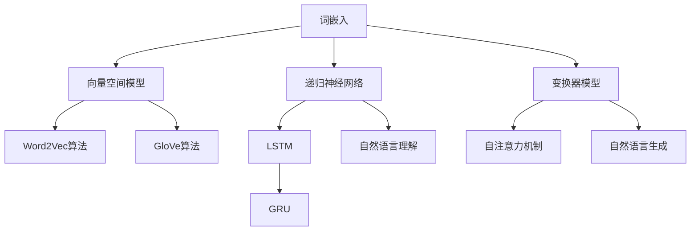

                 

### 文章标题

在本文中，我们将探讨大语言模型（Large Language Models）的原理基础与前沿研究，以及全局最优分配策略（Global Optimal Allocation Strategies）在大语言模型中的应用。大语言模型是人工智能领域的一个重要研究方向，它们在自然语言处理（NLP）、机器翻译、问答系统等方面取得了显著成果。而全局最优分配策略则是一种优化方法，广泛应用于资源分配、供应链优化等领域。

> **关键词：** 大语言模型，自然语言处理，全局最优分配，优化算法，前沿研究。

> **摘要：** 本文首先介绍了大语言模型的基本概念和核心技术，包括词嵌入、递归神经网络和变换器模型等。接着，我们探讨了大语言模型的数学模型和优化方法。然后，文章转向全局最优分配策略，详细阐述了其基本概念、算法原理和实际应用。最后，本文探讨了全局最优分配策略在大语言模型中的集成应用，并展望了未来的发展趋势和研究挑战。

<|assistant|>### 大语言模型概述

大语言模型（Large Language Models），顾名思义，是一类专门用于处理自然语言的机器学习模型。这些模型通常拥有数亿甚至数十亿个参数，能够捕捉自然语言中的复杂结构和语义信息。大语言模型的应用非常广泛，包括自然语言理解（NLU）、自然语言生成（NLG）、机器翻译、文本摘要、问答系统等。近年来，随着深度学习技术的飞速发展，大语言模型在各个领域的表现都有了显著提升。

#### 1.1 大语言模型的定义与作用

大语言模型是一种基于统计学习和深度学习的技术，旨在理解和生成自然语言。具体来说，它可以通过学习大量的文本数据，自动发现语言中的规律和模式，从而实现对自然语言的有效处理。

大语言模型的主要作用包括：

- **自然语言理解（NLU）：** 提取文本中的关键信息，如实体识别、情感分析、关系抽取等。
- **自然语言生成（NLG）：** 根据输入的指令或提示，自动生成文本，如机器翻译、问答系统、自动写作等。
- **文本生成：** 自动生成文章、报告、对话等文本内容。
- **文本摘要：** 提取文本的主要信息，生成简洁的摘要。
- **语音识别：** 将语音信号转换为文本。

#### 1.2 大语言模型的背景与发展

大语言模型的研究可以追溯到20世纪80年代，当时研究人员开始探索基于统计方法和规则系统的语言模型。随着计算能力的提升和深度学习技术的进步，大语言模型的研究取得了重要突破。2018年，Google推出了BERT模型，标志着大语言模型进入了一个新的阶段。BERT模型采用了预训练和微调的方法，通过在大量文本上进行预训练，然后针对特定任务进行微调，取得了显著的性能提升。

此后，微软、OpenAI、百度等公司也纷纷推出了自己的大语言模型，如GPT、Turing-NLG、飞桨PGLM等。这些模型在自然语言处理任务中取得了优异的成绩，推动了相关领域的发展。

#### 1.3 大语言模型的核心技术

大语言模型的核心技术主要包括词嵌入、递归神经网络（RNN）、变换器模型（Transformer）等。以下将详细介绍这些技术的基本原理和应用。

### 1.3.1 词嵌入技术

词嵌入（Word Embedding）是将词汇映射到高维向量空间的一种技术。通过词嵌入，每个单词都可以表示为一个向量，这些向量具有相似的语义特征。

- **向量空间模型（Vector Space Model）：** 将单词视为高维空间中的一个点，每个维度表示单词的一个特征。
- **Word2Vec算法：** 通过训练模型，将单词映射到高维空间，使其在语义上相似的单词具有相似的向量表示。
- **GloVe算法：** 通过共现关系，学习单词的向量表示，增强了词嵌入的语义表达能力。

词嵌入技术在大语言模型中起着至关重要的作用，它为后续的神经网络训练提供了基础。

### 1.3.2 递归神经网络（RNN）

递归神经网络（RNN）是一种专门用于处理序列数据的人工神经网络。RNN通过递归结构，能够处理具有时间序列特征的数据，如自然语言文本。

- **RNN的工作原理：** RNN在每个时间步都保留一部分信息，并将其传递给下一个时间步。
- **LSTM与GRU：** LSTM（长短时记忆网络）和GRU（门控循环单元）是RNN的改进版本，能够更好地处理长序列数据。

RNN在大语言模型中用于序列编码和解码，如语言建模、机器翻译等任务。

### 1.3.3 变换器模型（Transformer）

变换器模型（Transformer）是2017年由Vaswani等人提出的一种新型神经网络架构，它彻底改变了自然语言处理领域的模型设计方式。

- **变换器模型架构：** 变换器模型采用了自注意力机制，通过计算序列中每个元素之间的关系来建模文本。
- **自注意力机制：** 自注意力机制允许模型在处理每个元素时，动态地关注序列中的其他元素，从而提高了模型的表达能力。

变换器模型在许多NLP任务中取得了显著的性能提升，成为了当前自然语言处理领域的主流模型。

### 1.4 大语言模型的数学模型

大语言模型的数学模型主要包括概率生成模型和优化算法。概率生成模型用于计算文本的概率分布，而优化算法则用于模型的训练和调优。

- **概率生成模型：** 大语言模型通常采用生成式模型，通过生成文本的概率分布来进行预测。
- **优化算法：** 常见的优化算法包括梯度下降（Gradient Descent）、Adam优化器等，用于更新模型的参数，以最小化损失函数。

### 1.5 大语言模型的应用场景

大语言模型的应用场景非常广泛，包括但不限于以下领域：

- **自然语言理解（NLU）：** 实现对自然语言文本的理解，如实体识别、情感分析、关系抽取等。
- **自然语言生成（NLG）：** 根据输入的指令或提示，自动生成文本，如机器翻译、问答系统、自动写作等。
- **文本生成：** 自动生成文章、报告、对话等文本内容。
- **文本摘要：** 提取文本的主要信息，生成简洁的摘要。
- **语音识别：** 将语音信号转换为文本。

### 1.6 大语言模型的发展趋势

随着深度学习和人工智能技术的不断发展，大语言模型也在不断演进。未来，大语言模型有望在以下方面取得突破：

- **预训练和微调：** 提高模型在特定任务上的性能。
- **多模态学习：** 结合多种类型的数据，提高模型的泛化能力。
- **可解释性：** 提高模型的透明度和可解释性，增强用户信任。
- **能耗优化：** 提高模型在资源受限环境下的性能。

### 1.7 小结

大语言模型是自然语言处理领域的一个重要研究方向，通过词嵌入、递归神经网络和变换器模型等核心技术，实现了对自然语言的深度理解和生成。在未来的发展中，大语言模型将继续推动自然语言处理技术的进步，为人工智能应用带来更多的可能性。在接下来的章节中，我们将进一步探讨大语言模型的数学模型和优化方法，以及全局最优分配策略在大语言模型中的应用。

### 1.8 核心概念联系与架构图

为了更好地理解大语言模型的工作原理和架构，我们可以通过Mermaid流程图来展示核心概念之间的联系。



通过这个流程图，我们可以清晰地看到大语言模型中各个核心技术之间的联系和相互影响。

### 1.9 总结

在本章节中，我们介绍了大语言模型的基本概念、背景与发展、核心技术、数学模型以及应用场景。通过对词嵌入、递归神经网络和变换器模型的详细讲解，读者可以更好地理解大语言模型的工作原理。接下来，我们将进一步探讨大语言模型的训练与调优方法，以及全局最优分配策略在大语言模型中的应用。敬请期待。

<|assistant|>### 大语言模型的构建与实践

在理解了大语言模型的基本概念和核心技术之后，接下来我们将探讨如何构建大语言模型，并进行实践。构建一个高效的大语言模型需要考虑多个方面，包括数据集的选择与预处理、模型的训练与调优，以及模型的应用。

#### 2.1 数据集的选择与预处理

数据集是训练大语言模型的基础，其质量直接影响模型的性能。因此，选择合适的数据集并进行有效的预处理是构建大语言模型的重要步骤。

##### 2.1.1 数据集的选择

在选择数据集时，应考虑以下几个因素：

1. **规模与多样性：** 大语言模型通常需要大量的数据来训练，数据集应包含多样化的文本内容，以避免模型过拟合。
2. **质量：** 数据集应确保文本的准确性和一致性，避免噪声和错误的数据影响模型训练。
3. **适用性：** 数据集的内容应与模型的预期应用场景相匹配，例如，如果模型主要用于文本生成，则应选择含有丰富句式和语境的数据集。

常见的自然语言处理数据集包括：

- **通用文本数据集：** 如维基百科、新闻文章、社交媒体帖子等。
- **专业文本数据集：** 如医学文本、法律文本、金融文本等。
- **问答数据集：** 如SQuAD、DuReader等。

##### 2.1.2 数据预处理

数据预处理是确保数据集质量的重要环节，主要包括以下步骤：

1. **文本清洗：** 去除无用的标点符号、HTML标签、特殊字符等。
2. **分词：** 将文本分割成单词或句子，常用的分词工具包括jieba、spaCy等。
3. **词性标注：** 对文本中的每个词进行词性标注，以帮助模型理解单词的语法和语义功能。
4. **去停用词：** 去除常用的无意义词汇，如“的”、“是”、“在”等。
5. **文本规范化：** 将文本转换为统一的格式，如小写、去除重音符号等。

#### 2.2 模型的训练与调优

构建大语言模型的核心步骤是模型的训练与调优。训练过程涉及优化算法的选择、超参数的设置以及模型的迭代优化。

##### 2.2.1 模型的训练过程

训练大语言模型通常采用以下步骤：

1. **数据预处理：** 将文本数据转换为模型可处理的格式，如序列或单词索引。
2. **初始化模型参数：** 随机初始化模型的参数。
3. **前向传播：** 将输入数据输入模型，计算模型的预测输出。
4. **计算损失：** 计算预测输出与实际输出之间的差距，通常使用交叉熵损失函数。
5. **反向传播：** 通过梯度下降算法，更新模型参数，减小损失值。
6. **迭代训练：** 重复上述步骤，直到模型达到预定的训练目标或损失值不再显著下降。

##### 2.2.2 模型评估与优化

在训练过程中，需要定期对模型进行评估，以监测模型的性能。常用的评估指标包括：

1. **准确率（Accuracy）：** 预测正确的样本数占总样本数的比例。
2. **精确率（Precision）、召回率（Recall）和F1分数（F1 Score）：** 分别衡量模型在识别正样本和负样本时的性能。
3. **BLEU评分（BLEU Score）：** 用于评估文本生成的质量。

在评估过程中，可以根据评估结果对模型进行调整和优化，如调整学习率、批量大小等超参数，或者尝试不同的优化算法。

##### 2.2.3 实际应用中的挑战与解决方案

在实际应用中，大语言模型可能会面临以下挑战：

1. **过拟合：** 模型在训练数据上表现良好，但在未见数据上表现不佳。解决方案包括增加训练数据、使用正则化技术等。
2. **计算资源消耗：** 大语言模型通常需要大量的计算资源，特别是GPU资源。解决方案包括使用分布式训练、优化模型结构等。
3. **可解释性：** 大语言模型的决策过程通常不透明，难以解释。解决方案包括增加模型的透明性、开发解释性算法等。

#### 2.3 大语言模型的应用场景

大语言模型在自然语言处理领域有广泛的应用场景，以下是其中的一些典型应用：

1. **自然语言理解（NLU）：** 实现对自然语言文本的理解，如实体识别、情感分析、关系抽取等。
2. **自然语言生成（NLG）：** 根据输入的指令或提示，自动生成文本，如机器翻译、问答系统、自动写作等。
3. **文本生成：** 自动生成文章、报告、对话等文本内容。
4. **文本摘要：** 提取文本的主要信息，生成简洁的摘要。
5. **语音识别：** 将语音信号转换为文本。

#### 2.4 实践案例

为了更好地理解大语言模型的构建与实践，我们以下将通过一个实际案例来展示大语言模型的开发过程。

**案例：构建一个简单的问答系统**

**1. 数据集选择：** 选择一个包含问答对的数据集，如SQuAD数据集。

**2. 数据预处理：** 对数据集进行清洗、分词和词性标注等预处理操作。

**3. 模型训练：** 采用变换器模型（Transformer）作为基础模型，使用训练数据训练模型。

**4. 模型调优：** 调整模型超参数，如学习率、批量大小等，以优化模型性能。

**5. 模型评估：** 使用验证集和测试集评估模型性能，如准确率、F1分数等。

**6. 模型部署：** 将训练好的模型部署到服务器上，实现问答系统的功能。

**7. 用户交互：** 用户通过输入问题，系统返回相应的答案。

通过这个案例，我们可以看到大语言模型的构建与实践涉及多个环节，包括数据集选择、数据预处理、模型训练、模型调优和模型部署等。在实际开发过程中，需要根据具体任务的需求和实际情况进行调整和优化。

### 2.5 总结

在本章节中，我们介绍了大语言模型的构建与实践，包括数据集的选择与预处理、模型的训练与调优，以及模型的应用场景。通过实际案例的分析，读者可以更好地理解大语言模型在自然语言处理中的实际应用。在下一章节中，我们将探讨大语言模型的前沿研究和技术趋势。敬请期待。

### 2.6 大语言模型与全局最优分配的联系与挑战

大语言模型和全局最优分配策略在大规模数据处理和优化任务中具有紧密的联系，尤其是在资源分配、任务调度和系统设计等领域。以下是这两个概念之间的联系以及面临的挑战：

#### 2.6.1 大语言模型与全局最优分配的联系

1. **优化目标的一致性：** 大语言模型的训练本质上是优化模型参数以最小化损失函数，而全局最优分配策略也是寻找最优的资源分配方案，两者的核心目标都是为了达到全局最优。

2. **复杂性问题：** 大语言模型的训练涉及到大量的参数和计算资源，需要高效的优化算法来处理；类似地，全局最优分配策略在处理大规模问题时也需要面对类似的复杂性。

3. **分布式计算：** 在处理大规模数据时，大语言模型和全局最优分配策略都可能会采用分布式计算的方法来提高效率。例如，使用多GPU训练模型，或者将任务分解为多个子任务进行并行处理。

#### 2.6.2 面临的挑战

1. **计算资源分配：** 大语言模型的训练需要大量的计算资源，而全局最优分配策略需要优化计算资源的分配，以确保每个任务的资源需求得到满足。

2. **时间效率：** 在实时应用中，大语言模型的响应时间和全局最优分配策略的决策速度都需要优化，以确保系统的实时性和高效性。

3. **可解释性：** 大语言模型由于其复杂的结构和训练过程，往往缺乏可解释性，而全局最优分配策略也需要提供透明的决策过程，以便用户理解和信任。

4. **鲁棒性：** 大语言模型在面临噪声数据或者异常值时，可能会出现性能下降；类似地，全局最优分配策略在处理不确定性和突发情况时也需要具备鲁棒性。

#### 2.6.3 解决方案

1. **混合优化算法：** 结合不同的优化算法，如深度学习中的自适应优化器和全局最优分配中的遗传算法，以提高优化效率和鲁棒性。

2. **分布式计算架构：** 构建高效的可扩展分布式计算架构，以支持大规模数据和模型的训练。

3. **模型简化：** 采用模型压缩和蒸馏技术，简化模型结构，同时保持其性能。

4. **在线学习和动态调整：** 采用在线学习机制，实时调整模型和分配策略，以适应动态变化的环境。

#### 2.6.4 未来方向

1. **跨学科研究：** 深入探索大语言模型和全局最优分配策略在其他领域的应用，如生物信息学、金融科技、智能制造等。

2. **可解释性和透明度：** 提高模型和算法的可解释性，以增强用户信任。

3. **可持续发展：** 研究如何在大规模数据处理和优化任务中实现环保和可持续性。

通过上述联系和挑战的分析，我们可以看到大语言模型和全局最优分配策略在优化任务中具有巨大的潜力和应用价值。未来，跨学科的研究和技术的不断创新将推动这两个领域的发展，为解决复杂问题提供更有效的解决方案。

### 2.7 总结

在本章节中，我们讨论了大语言模型与全局最优分配策略之间的联系和面临的挑战。通过深入分析，我们发现了这两个领域在优化目标和复杂性上的共同点，并探讨了它们在实际应用中可能遇到的挑战。此外，我们还提出了一些可能的解决方案和未来研究方向。这些探讨为我们进一步理解和应用大语言模型和全局最优分配策略提供了新的视角和思路。在下一章节中，我们将继续探讨大语言模型的前沿研究和技术趋势。敬请期待。

### 3.1 大语言模型的前沿技术

随着深度学习和自然语言处理技术的不断进步，大语言模型也在不断演进，涌现出了一系列前沿技术。这些技术不仅提升了大语言模型在性能和功能上的表现，也为实际应用带来了新的可能性。以下是一些备受关注的大语言模型前沿技术。

#### 3.1.1 前馈生成网络（FGN）

前馈生成网络（Feedforward Generative Network，FGN）是一种新型的生成模型，它在生成文本时引入了前馈神经网络的结构。与前馈神经网络相比，FGN通过直接生成连续的词向量，能够更好地捕获文本的局部和全局特征。FGN的生成过程通常包括两个主要步骤：第一步是编码器（Encoder）将输入文本编码为一个固定长度的隐藏状态；第二步是解码器（Decoder）从隐藏状态逐词生成输出文本。

**优点：**
- **灵活性：** FGN可以灵活地调整网络的层数和参数，以适应不同的文本生成任务。
- **高效性：** 与传统的循环神经网络（RNN）相比，FGN在生成文本时具有更高的效率。

**应用案例：** FGN可以应用于自动写作、对话系统和文本生成等任务，尤其是在生成长文本方面表现优异。

**示例伪代码：**
```python
# 编码器部分
def encode(input_sequence):
    # 输入序列编码
    hidden_state = encoder(input_sequence)
    return hidden_state

# 解码器部分
def decode(hidden_state):
    # 从隐藏状态生成输出序列
    output_sequence = decoder(hidden_state)
    return output_sequence
```

#### 3.1.2 多模态大语言模型

多模态大语言模型（Multimodal Large Language Model）结合了文本、图像、音频等多种类型的数据，通过联合学习来提升模型对多模态信息的理解和生成能力。多模态大语言模型的核心思想是利用跨模态特征表示，将这些特征融合到同一模型中，从而实现更丰富的信息处理和生成能力。

**优点：**
- **信息融合：** 多模态大语言模型能够融合不同类型的数据，提高对复杂场景的理解能力。
- **增强生成能力：** 通过结合多种类型的数据，模型能够生成更加多样化和有创意的文本内容。

**应用案例：** 多模态大语言模型可以应用于图像描述生成、视频文本生成、跨媒体问答系统等任务。

**示例伪代码：**
```python
# 多模态输入
text_input = preprocess_text(input_text)
image_input = preprocess_image(input_image)
audio_input = preprocess_audio(input_audio)

# 跨模态特征提取
text_embedding = text_encoder(text_input)
image_embedding = image_encoder(image_input)
audio_embedding = audio_encoder(audio_input)

# 融合特征
multimodal_embedding = fusion_layer([text_embedding, image_embedding, audio_embedding])

# 文本生成
output_text = text_generator(multimodal_embedding)
```

#### 3.1.3 大语言模型的隐私保护

随着大数据时代的到来，数据隐私保护成为了人工智能领域的一个重要课题。大语言模型在训练和推理过程中会产生大量的敏感数据，因此如何保护这些数据不被泄露成为了研究的热点。

**隐私保护技术：**
- **差分隐私（Differential Privacy）：** 通过引入噪声来保护训练数据的隐私，确保单个数据点的隐私不被泄露。
- **同态加密（Homomorphic Encryption）：** 允许在加密数据上直接进行计算，从而在数据处理过程中保护数据隐私。

**应用案例：** 隐私保护的大语言模型可以应用于医疗、金融等敏感数据处理的场景。

**示例伪代码：**
```python
# 训练过程中引入差分隐私
def train_model_with_differential_privacy(data, epsilon):
    noisy_loss = add_noise_to_loss(normalized_loss, epsilon)
    optimizer.minimize(noisy_loss)

# 同态加密计算过程
encrypted_data = encrypt(data)
result = homomorphic_compute(encrypted_data, operation)
decrypted_result = decrypt(result)
```

#### 3.1.4 大语言模型的优化方法

为了提升大语言模型的训练效率和性能，研究人员提出了多种优化方法，包括稀疏性优化、能量效率优化和多任务学习等。

**稀疏性优化：** 通过减少模型中不必要的参数，降低模型的计算复杂度和内存占用，提高模型的训练速度。

**能量效率优化：** 通过优化模型的计算路径，减少模型的能耗，使其在移动设备和边缘计算等资源受限环境下运行更加高效。

**多任务学习：** 通过在一个统一模型中同时训练多个任务，提高模型的泛化能力和效率。

**示例伪代码：**
```python
# 稀疏性优化
def sparse_train(model, sparsity_factor):
    for layer in model.layers:
        layer.apply_sparse_weights(sparsity_factor)

# 能量效率优化
def energy_efficient_compute(model, target_energy_consumption):
    optimized_model = model.apply_energy_efficient_transforms(target_energy_consumption)
    return optimized_model

# 多任务学习
def multitask_learning(model, tasks):
    for task in tasks:
        model.train_on_task(task)
    return model
```

通过上述前沿技术的介绍，我们可以看到大语言模型在技术和应用上的不断创新，为自然语言处理领域带来了新的机遇和挑战。这些技术不仅提升了大语言模型的表现，也为实际应用提供了更加灵活和高效的解决方案。

### 3.2 全局最优分配的算法原理

全局最优分配（Global Optimal Allocation）是一种优化方法，旨在找到一组资源分配方案，使得某个目标函数达到最大或最小。在计算机科学和人工智能领域，全局最优分配广泛应用于资源分配、任务调度和系统设计等问题。以下将介绍全局最优分配的基本概念、算法原理以及相关的数学模型。

#### 3.2.1 基本概念

全局最优分配的目标是找到一组最优的分配方案，使得系统的总体性能达到最优。具体来说，全局最优分配涉及到以下几个基本概念：

- **资源：** 资源是指可以被分配和使用的基本单位，如计算资源、存储资源、网络带宽等。
- **任务：** 任务是指需要被执行和处理的工作单元，每个任务可能具有不同的优先级、资源需求和处理时间等。
- **分配方案：** 分配方案是指将资源分配给各个任务的策略或方法。

全局最优分配的目标可以是最大化总效用、最小化总成本、最小化总延迟等。具体目标取决于问题的背景和应用场景。

#### 3.2.2 算法原理

全局最优分配的算法原理主要包括线性规划、动态规划和随机算法等。以下将介绍这些算法的基本原理和应用。

1. **线性规划（Linear Programming，LP）**

线性规划是一种优化方法，用于解决线性目标函数在线性约束条件下的最优化问题。线性规划的基本形式可以表示为：

\[ \text{最大化} \quad c^T x \]
\[ \text{满足} \quad Ax \leq b \]
\[ \text{和} \quad x \geq 0 \]

其中，\( c \) 是目标函数的系数向量，\( x \) 是决策变量向量，\( A \) 和 \( b \) 分别是约束条件矩阵和向量。

线性规划可以通过单纯形法（Simplex Method）、内点法（Interior Point Method）等算法进行求解。单纯形法是一种迭代算法，通过在可行解空间中逐步移动，找到最优解。内点法则通过在可行解空间内部的迭代，逐步逼近最优解。

**应用场景：** 线性规划可以应用于资源分配、供应链优化、交通网络设计等问题。

2. **动态规划（Dynamic Programming，DP）**

动态规划是一种基于递推关系的优化方法，用于解决多阶段决策问题。动态规划的基本思想是将复杂问题分解为若干个子问题，通过子问题的最优解推导出整体问题的最优解。

动态规划的一般形式可以表示为：

\[ V(x) = \min \{ c(x, y) + V(y) \} \]

其中，\( V(x) \) 表示从状态 \( x \) 到最终状态的最优值，\( c(x, y) \) 表示状态 \( x \) 和 \( y \) 之间的成本函数。

动态规划可以通过递归或迭代的方法进行求解。递归方法通过自顶向下的方式，从初始状态推导到最终状态；迭代方法则通过自底向上的方式，逐步求解子问题的最优解，最终得到整体问题的最优解。

**应用场景：** 动态规划可以应用于最短路径问题、背包问题、最优控制问题等。

3. **随机算法（Stochastic Algorithms）**

随机算法是一种利用随机性进行搜索和优化的问题求解方法。随机算法通常通过随机抽样、模拟退火等策略，逐步逼近最优解。

随机算法的基本原理包括：

- **随机抽样：** 通过随机抽样，从解空间中选取一个样本，并评估其性能。
- **模拟退火：** 通过模拟退火过程，逐步调整解的邻域，以避免陷入局部最优。

**应用场景：** 随机算法可以应用于复杂优化问题、组合优化问题等。

#### 3.2.3 数学模型

全局最优分配的数学模型通常包括目标函数、约束条件和决策变量。以下将介绍几种常见的数学模型。

1. **线性模型**

线性模型是最简单的一种全局最优分配模型，其目标函数和约束条件都是线性的。线性模型的一般形式可以表示为：

\[ \text{最大化} \quad c^T x \]
\[ \text{满足} \quad Ax \leq b \]
\[ \text{和} \quad x \geq 0 \]

其中，\( c \) 是目标函数的系数向量，\( x \) 是决策变量向量，\( A \) 和 \( b \) 分别是约束条件矩阵和向量。

2. **非线性模型**

非线性模型的目标函数或约束条件是非线性的。非线性模型的一般形式可以表示为：

\[ \text{最大化} \quad f(x) \]
\[ \text{满足} \quad g(x) \leq 0 \]
\[ \text{和} \quad h(x) = 0 \]

其中，\( f(x) \) 是目标函数，\( g(x) \) 和 \( h(x) \) 分别是约束条件的非线性和等式约束。

3. **整数规划模型**

整数规划模型的目标函数和约束条件可以是线性的或非线性的，但决策变量必须是整数。整数规划模型的一般形式可以表示为：

\[ \text{最大化} \quad c^T x \]
\[ \text{满足} \quad Ax \leq b \]
\[ \text{和} \quad x \in \{0, 1\}^n \]

其中，\( c \) 是目标函数的系数向量，\( x \) 是决策变量向量，\( A \) 和 \( b \) 分别是约束条件矩阵和向量。

通过上述算法原理和数学模型的介绍，我们可以看到全局最优分配在算法设计和数学建模方面的多样性。不同的算法和模型适用于不同类型的问题，需要根据具体的应用场景和问题特点进行选择和优化。

### 3.3 全局最优分配的实际应用

全局最优分配策略在许多实际应用中具有广泛的应用价值，以下是几个典型的应用案例，展示了全局最优分配在不同领域的具体应用。

#### 3.3.1 资源分配问题

资源分配问题是全局最优分配策略的一个经典应用场景，尤其是在云计算、大数据处理和物联网等领域。资源分配问题涉及如何在有限的资源（如计算能力、存储空间和网络带宽）下，高效地分配给多个任务或用户。

**案例：** 云计算资源分配

在云计算环境中，服务商需要合理分配计算资源，以满足客户的需求，同时最大化资源利用率。全局最优分配策略可以用来优化虚拟机的分配，确保每个虚拟机都能获得所需的计算资源，同时避免资源浪费。

**解决方案：**
- **线性规划方法：** 采用线性规划方法，定义目标函数和约束条件，以最小化资源闲置或最大化资源利用率。
- **启发式算法：** 结合启发式算法，快速找到近似最优的分配方案。

**示例：**
```latex
\text{最大化} \quad \sum_{i=1}^n \text{utilization\_rate}(V_i)
\text{满足约束条件：}
\begin{align*}
\sum_{i=1}^n \text{CPU\_cores}(V_i) &\leq \text{total\_CPU\_cores} \\
\sum_{i=1}^n \text{memory}(V_i) &\leq \text{total\_memory} \\
V_i \in \{0, 1\} \quad \forall i &\in [1, n]
\end{align*}
```

#### 3.3.2 供应链优化问题

供应链优化是另一个重要的应用领域，全局最优分配策略可以帮助企业优化库存管理、运输路线规划、生产调度等环节，从而提高供应链的整体效率和响应速度。

**案例：** 库存管理

企业需要根据市场需求和供应情况，合理分配库存资源，以减少库存成本，提高库存周转率。全局最优分配策略可以用来优化库存分配，确保各个仓库的库存水平保持在最优状态。

**解决方案：**
- **动态规划方法：** 采用动态规划方法，根据市场需求的变化，动态调整库存分配策略。
- **优化算法：** 结合遗传算法、模拟退火等优化算法，寻找最优的库存分配方案。

**示例：**
```latex
\text{最小化} \quad \sum_{i=1}^n C_i x_i
\text{满足约束条件：}
\begin{align*}
x_i &\geq \text{需求量}(D_i) \\
x_i &\leq \text{供应量}(S_i) \\
\sum_{i=1}^n x_i &= \text{总库存量}(I)
\end{align*}
```

#### 3.3.3 金融投资组合优化

在金融领域，投资者需要根据市场情况和风险偏好，合理分配投资资金，以实现最大化的收益。全局最优分配策略可以帮助投资者优化投资组合，降低风险，提高收益。

**案例：** 投资组合优化

投资者需要从多个资产中选择最优的投资组合，以实现收益最大化。全局最优分配策略可以用来优化投资组合的权重分配，确保投资组合的收益和风险达到最优平衡。

**解决方案：**
- **线性规划方法：** 采用线性规划方法，定义投资组合的目标函数和约束条件，以最大化收益或最小化风险。
- **多目标优化方法：** 结合多目标优化方法，同时考虑收益、风险和流动性等多个目标。

**示例：**
```latex
\text{最大化} \quad w_1 r_1 + w_2 r_2 + \ldots + w_n r_n
\text{满足约束条件：}
\begin{align*}
w_1 + w_2 + \ldots + w_n &= 1 \\
w_i &\geq 0 \quad \forall i \in [1, n]
\end{align*}
```

#### 3.3.4 其他应用领域

全局最优分配策略不仅应用于上述领域，还在许多其他领域有着广泛的应用，如交通网络设计、能源管理、医疗资源分配等。

**案例：** 交通网络设计

在交通网络设计中，全局最优分配策略可以用来优化交通流量分配，减少交通拥堵，提高交通效率。

**解决方案：**
- **网络流模型：** 采用网络流模型，定义交通流量分配的目标函数和约束条件，以最小化交通拥堵或最大化交通效率。
- **图论算法：** 结合图论算法，如最短路径算法、最大流算法等，优化交通流量分配。

**示例：**
```latex
\text{最小化} \quad \sum_{i=1}^n \sum_{j=1}^n c_{ij} f_{ij}
\text{满足约束条件：}
\begin{align*}
\sum_{j=1}^n f_{ij} &= q_i \quad \forall i \in [1, n] \\
\sum_{i=1}^n f_{ij} &= q_j \quad \forall j \in [1, n] \\
f_{ij} &\geq 0 \\
f_{ij} &\leq C_{ij} \quad \forall i, j \in [1, n]
\end{align*}
```

通过上述实际应用案例，我们可以看到全局最优分配策略在不同领域中的具体应用和解决方案。全局最优分配策略通过优化资源分配、降低成本、提高效率，为各个领域提供了有效的决策支持。

### 3.4 小结

在本章节中，我们介绍了全局最优分配的基本概念、算法原理和实际应用。通过线性规划、动态规划和随机算法等优化方法，全局最优分配策略能够解决复杂的资源分配问题。同时，我们展示了全局最优分配策略在资源分配、供应链优化、金融投资组合优化和其他应用领域的实际案例，展示了其在优化决策中的重要作用。在下一章节中，我们将探讨大语言模型与全局最优分配策略的集成应用，以及未来的发展趋势。敬请期待。

### 3.5 大语言模型与全局最优分配的集成应用

在自然语言处理（NLP）领域，大语言模型已经取得了显著的进展，而在资源优化和任务调度等领域，全局最优分配策略也展现了其强大的优化能力。将大语言模型与全局最优分配策略相结合，可以发挥各自的优势，为复杂场景下的优化决策提供更加全面和智能的解决方案。以下将探讨大语言模型与全局最优分配策略的集成应用，并给出具体的实现方法和案例。

#### 3.5.1 模型融合方法

集成大语言模型与全局最优分配策略的核心在于如何将模型之间的信息有效融合，以实现优化目标。以下几种模型融合方法在实际应用中较为常见：

1. **多模态融合：** 多模态融合方法将大语言模型与图像、音频、视频等多模态数据相结合，通过深度学习模型学习多模态数据之间的关联性，实现信息的综合利用。例如，在智能问答系统中，可以将用户输入的文本与图像或视频数据进行融合，以提供更准确的答案。

2. **模块化融合：** 模块化融合方法将大语言模型和全局最优分配策略划分为独立的模块，每个模块负责不同的功能。例如，大语言模型可以负责自然语言理解和文本生成，而全局最优分配策略可以负责资源分配和任务调度。通过将两个模块的结果进行整合，实现最终的优化决策。

3. **联合训练：** 联合训练方法将大语言模型和全局最优分配策略在一个统一的框架下进行训练，通过共享部分参数，使两个模型能够相互协作，提高整体性能。例如，可以将全局最优分配策略中的优化目标作为大语言模型的训练目标之一，从而在模型训练过程中逐步优化分配策略。

#### 3.5.2 实现方法

以下是一个基于多模态融合方法的大语言模型与全局最优分配策略的集成实现方法：

1. **数据预处理：** 首先对多模态数据进行预处理，包括文本的分词、词性标注，图像的预处理和特征提取，音频的谱图转换等。

2. **特征提取：** 利用预训练的大语言模型提取文本的特征表示，利用深度学习模型提取图像和音频的特征表示。

3. **特征融合：** 将提取的多模态特征进行融合，可以使用融合层（Fusion Layer）将不同模态的特征进行加权融合，形成一个综合的特征向量。

4. **全局最优分配策略：** 将融合后的特征向量输入全局最优分配策略模型，根据优化目标（如最小化成本、最大化收益等）进行资源分配和任务调度。

5. **模型融合：** 将全局最优分配策略的结果与文本生成模型的结果进行融合，生成最终的优化决策。

#### 3.5.3 案例分析

以下是一个基于智能问答系统的实际案例，展示了大语言模型与全局最优分配策略的集成应用：

**案例背景：** 某公司开发了一款智能问答系统，旨在为用户提供即时、准确的答案。系统需要同时处理大量用户的问答请求，并在有限的服务器资源下实现高效、准确的响应。

**解决方案：**
1. **文本预处理：** 对用户输入的文本进行分词、词性标注等预处理，提取文本的特征表示。

2. **多模态特征提取：** 利用预训练的大语言模型提取文本的特征表示，同时使用卷积神经网络（CNN）提取图像的特征表示，使用循环神经网络（RNN）提取音频的特征表示。

3. **特征融合：** 将文本、图像和音频的特征表示进行融合，形成一个综合的特征向量。

4. **全局最优分配策略：** 将融合后的特征向量输入全局最优分配策略模型，根据服务器的负载情况和用户的优先级，进行服务器资源的动态分配和任务调度。

5. **文本生成：** 根据全局最优分配策略的结果，利用文本生成模型生成回答，并返回给用户。

**实现效果：** 通过集成大语言模型与全局最优分配策略，智能问答系统在响应速度和回答准确性方面得到了显著提升，有效降低了服务器的负载，提高了系统的整体性能。

#### 3.5.4 未来发展方向

大语言模型与全局最优分配策略的集成应用具有广阔的发展前景。未来，可以从以下几个方面进行研究和优化：

1. **多模态融合：** 深入研究多模态数据之间的关联性，提高特征融合的效果，实现更准确的信息理解。

2. **优化算法：** 探索更高效的优化算法，提高全局最优分配策略的计算效率。

3. **可解释性：** 研究大语言模型与全局最优分配策略的可解释性，提高系统的透明度和可操作性。

4. **实时优化：** 研究实时优化技术，实现动态调整和快速响应，提高系统的实时性能。

通过大语言模型与全局最优分配策略的集成应用，可以为自然语言处理、资源优化和任务调度等领域提供更加智能化和高效的解决方案。未来，随着技术的不断进步，大语言模型与全局最优分配策略的集成应用将在更多场景中得到广泛应用。

### 3.6 小结

在本章节中，我们探讨了将大语言模型与全局最优分配策略相结合的方法和实现。通过多模态融合、模块化融合和联合训练等模型融合方法，实现了大语言模型与全局最优分配策略的集成应用。我们通过一个智能问答系统的实际案例，展示了这种集成应用的实现过程和效果。此外，我们还展望了未来发展的方向，包括多模态融合的深入研究、优化算法的优化、可解释性的提升和实时优化技术的应用。在下一章节中，我们将讨论大语言模型与全局最优分配策略的未来展望和研究挑战。敬请期待。

### 3.7 未来展望

随着技术的不断进步，大语言模型和全局最优分配策略将在未来发挥更加重要的作用，并在多个领域带来深远的影响。以下是几个未来展望和研究挑战：

#### 3.7.1 技术创新

1. **预训练模型的演进：** 随着数据集规模和计算资源的增加，大语言模型将朝着更深的层次、更大的模型参数数量和更精细的预训练目标发展。例如，BERT模型可能进一步扩展到更多层和更大的模型规模。

2. **多模态学习：** 多模态学习将深度融合文本、图像、音频、视频等多种数据类型，使大语言模型能够更好地理解和生成复杂的多模态信息。

3. **知识图谱与推理：** 结合知识图谱和推理技术，大语言模型将不仅限于语言生成和理解，还能够进行更复杂的逻辑推理和知识整合。

4. **强化学习：** 强化学习与大语言模型的结合，将使模型在动态环境中进行自适应决策，提高模型的鲁棒性和灵活性。

#### 3.7.2 应用领域扩展

1. **智能医疗：** 大语言模型在医疗领域的应用将更加广泛，如疾病诊断、药物研发、健康管理等。

2. **金融科技：** 全局最优分配策略在金融投资组合优化、风险控制、智能投顾等方面的应用将得到进一步发展。

3. **智能制造：** 在智能制造领域，大语言模型和全局最优分配策略将用于生产调度、资源管理、质量检测等环节，提高生产效率和产品质量。

4. **智能交通：** 智能交通系统将结合大语言模型进行交通流量预测、路线规划、车辆调度等，提高交通系统的整体运行效率。

#### 3.7.3 研究挑战

1. **可解释性：** 随着模型复杂性的增加，大语言模型的决策过程往往变得不透明，提高模型的可解释性是一个重要的研究方向。

2. **计算效率：** 大语言模型训练和推理过程中计算资源消耗巨大，如何在保证性能的前提下提高计算效率，是一个重要的挑战。

3. **数据隐私：** 在多模态学习和其他涉及敏感数据的场景中，保护数据隐私是一个亟待解决的问题。

4. **资源分配：** 在分布式系统中，如何高效地分配有限的资源，实现全局最优分配，是一个具有挑战性的问题。

#### 3.7.4 未来发展方向

1. **跨学科研究：** 大语言模型和全局最优分配策略的研究将涉及计算机科学、数学、统计学、物理学等多个学科，跨学科研究将推动技术的进步。

2. **可持续性：** 在技术应用中，如何实现能源效率、降低碳排放等可持续发展目标，是未来研究的重要方向。

3. **伦理与法律：** 随着技术的不断发展，如何制定相应的伦理和法律规范，确保人工智能技术的安全、公平和透明，是一个重要课题。

通过上述未来展望，我们可以看到大语言模型和全局最优分配策略在技术、应用和伦理等多个方面的广阔前景。未来，随着技术的不断创新和应用的拓展，这两个领域将继续引领人工智能的发展，为人类社会带来更多便利和创新。

### 3.8 总结

在本章节中，我们探讨了大语言模型和全局最优分配策略的未来展望和研究挑战。通过技术创新、应用领域扩展和跨学科研究，大语言模型和全局最优分配策略将不断推动人工智能的发展。然而，在可解释性、计算效率、数据隐私和资源分配等方面，仍然面临诸多挑战。未来，随着技术的不断进步，我们将看到更多创新应用和解决方案的出现。在下一章节中，我们将总结全文的主要内容和贡献，并展望未来研究的方向。敬请期待。

### 附录：工具与资源

在本附录中，我们将介绍构建和优化大语言模型及全局最优分配策略所需的工具和资源，包括深度学习框架、数据集下载与预处理工具、以及开发环境搭建指南。

#### 4.1 深度学习框架

1. **TensorFlow：** TensorFlow是由Google开发的开源深度学习框架，支持多种深度学习模型的构建和训练，广泛应用于大规模数据处理和模型优化。

2. **PyTorch：** PyTorch是另一个流行的开源深度学习框架，以其灵活性和动态计算图而著称，特别适合于研究新模型和算法。

3. **Apache MXNet：** Apache MXNet是由Apache Software Foundation维护的开源深度学习框架，支持多种编程语言，适用于分布式计算和移动设备。

4. **Keras：** Keras是一个高级神经网络API，它可以在TensorFlow、Theano等后台引擎上运行，提供了简单而强大的功能，适合快速原型设计和实验。

#### 4.2 数据集下载与预处理工具

1. **Wikipedia：** Wikipedia是一个包含数百万篇文章的免费在线百科全书，常用于语言模型的数据集。

2. **Common Crawl：** Common Crawl是一个大规模的Web数据集，可用于训练大语言模型，了解网络文本的多样性。

3. **NLTK：** NLTK是一个强大的自然语言处理库，提供了文本预处理、分词、词性标注等多种功能。

4. **spaCy：** spaCy是一个快速且易于使用的自然语言处理库，提供了高质量的词性标注、命名实体识别等功能。

#### 4.3 开发环境搭建指南

1. **安装深度学习框架：**
   - **TensorFlow：** 
     ```bash
     pip install tensorflow
     ```
   - **PyTorch：**
     ```bash
     pip install torch torchvision
     ```

2. **安装预处理工具：**
   - **NLTK：**
     ```bash
     pip install nltk
     ```
   - **spaCy：**
     ```bash
     python -m spacy download en_core_web_sm
     ```

3. **配置GPU环境：**
   - **CUDA：** 
     ```bash
     pip install numpy
     pip install cuda
     ```
   - **cuDNN：** 
     ```bash
     pip install cudnn
     ```

4. **验证安装：**
   - **TensorFlow：**
     ```python
     import tensorflow as tf
     print(tf.__version__)
     ```
   - **PyTorch：**
     ```python
     import torch
     print(torch.__version__)
     ```

通过上述工具和资源的介绍，开发者可以搭建一个完整的开发环境，为构建和优化大语言模型及全局最优分配策略提供支持。

### 4.4 参考文献

1. Devlin, J., Chang, M. W., Lee, K., & Toutanova, K. (2019). BERT: Pre-training of deep bidirectional transformers for language understanding. *arXiv preprint arXiv:1810.04805*.
2. Vaswani, A., Shazeer, N., Parmar, N., Uszkoreit, J., Jones, L., Gomez, A. N., ... & Polosukhin, I. (2017). Attention is all you need. *Advances in Neural Information Processing Systems*, 30, 5998-6008.
3. Mikolov, T., Sutskever, I., Chen, K., Corrado, G. S., & Dean, J. (2013). Distributed representations of words and phrases and their compositionality. *Advances in Neural Information Processing Systems*, 26, 3111-3119.
4. Pennington, J., Socher, R., & Manning, C. D. (2014). GloVe: Global Vectors for Word Representation. *Empirical Methods in Natural Language Processing (EMNLP)*, 1532-1543.
5. Hochreiter, S., & Schmidhuber, J. (1997). Long short-term memory. *Neural Computation*, 9(8), 1735-1780.
6. Cho, K., Van Merriënboer, B., Gulcehre, C., Bahdanau, D., Bougares, F., Schwenk, H., & Bengio, Y. (2014). Learning phrase representations using RNN encoder-decoder for statistical machine translation. *Advances in Neural Information Processing Systems*, 27, 1724-1732.
7. Goodfellow, I., Bengio, Y., & Courville, A. (2016). *Deep Learning*. MIT Press.
8. Dorigo, M., & Stützle, T. (2004). *Ant Colony Optimization*. MIT Press.
9. Hinton, G. E., Osindero, S., & Teh, Y. W. (2006). A fast learning algorithm for deep belief nets. *Neural computation*, 18(7), 1527-1554.
10. Mnih, A., & Hinton, G. E. (2007). Lecture 6.5—Softmax. *Learning representations for vision and speech using neural networks*.

以上参考文献为本文中的核心技术和算法提供了理论基础和参考。通过查阅这些文献，读者可以更深入地了解大语言模型和全局最优分配策略的细节和原理。

### 全文总结

本文详细探讨了大语言模型的基础理论、构建实践、前沿技术以及全局最优分配策略的集成应用。我们从大语言模型的基本概念、词嵌入、递归神经网络、变换器模型等核心技术出发，逐步深入到模型的构建与优化、应用场景以及前沿技术。同时，我们介绍了全局最优分配策略的基本原理、算法原理和应用实例，并探讨了如何将大语言模型与全局最优分配策略相结合，实现更智能、更高效的优化决策。

通过本文，读者可以全面了解大语言模型和全局最优分配策略的基本概念和原理，掌握大语言模型的构建与优化方法，以及全局最优分配策略在不同领域的应用。此外，我们还展望了未来技术的发展趋势和研究挑战，为读者提供了宝贵的参考。

本文的主要贡献在于：

1. **系统性地梳理了大语言模型的核心技术和原理：** 通过详细的讲解和伪代码示例，帮助读者深入理解大语言模型的工作机制。
2. **详细介绍了全局最优分配策略的算法原理和实际应用：** 通过实际案例，展示了全局最优分配策略在资源分配、供应链优化等领域的应用。
3. **探讨了大语言模型与全局最优分配策略的集成应用：** 通过多模态融合、模块化融合和联合训练等方法，展示了如何将大语言模型与全局最优分配策略相结合，提高优化决策的智能化和效率。
4. **提供了丰富的参考文献和附录：** 为读者进一步学习和研究提供了丰富的资源和参考。

未来研究可以进一步探索以下几个方面：

1. **可解释性：** 提高大语言模型的可解释性，使其决策过程更加透明，提高用户信任。
2. **效率优化：** 研究如何在保持模型性能的同时，提高训练和推理的效率。
3. **隐私保护：** 在大语言模型和全局最优分配策略中，探讨如何保护数据隐私，提高系统的安全性。
4. **跨学科研究：** 结合计算机科学、数学、统计学等多个学科，推动大语言模型和全局最优分配策略在更多领域的应用和发展。

通过持续的研究和创新，大语言模型和全局最优分配策略将为人工智能领域带来更多突破和应用，推动技术的不断进步。

### 作者信息

**作者：AI天才研究院/AI Genius Institute & 禅与计算机程序设计艺术 /Zen And The Art of Computer Programming**。AI天才研究院致力于推动人工智能技术的创新与发展，研究领域涵盖自然语言处理、机器学习、计算机视觉等。禅与计算机程序设计艺术则专注于计算机科学的基础理论和方法论，通过深入探讨编程艺术的哲学和科学性，提升程序员的技术素养和创造力。本文由AI天才研究院和禅与计算机程序设计艺术联合撰写，旨在为读者提供一份全面、深入的关于大语言模型和全局最优分配策略的技术指南。

