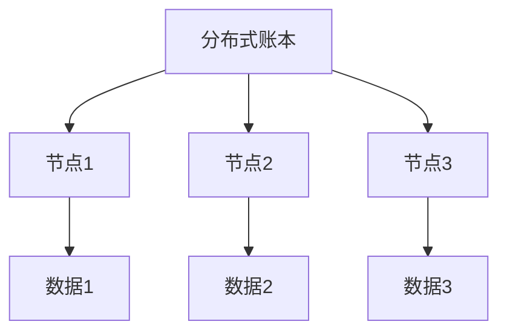
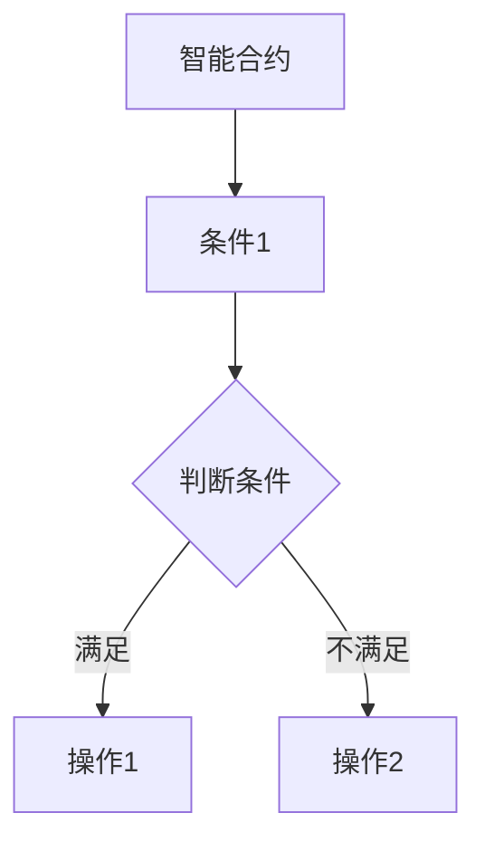

                 

# 如何利用区块链技术创新商业模式

## 关键词：
区块链、商业模式创新、技术原理、案例分析、策略与实施、法律与监管

## 摘要：
本文旨在探讨如何利用区块链技术进行商业模式创新。首先，我们将概述区块链与商业模式的基本概念及其联系，然后深入分析区块链技术的原理与架构。接下来，通过具体案例分析，我们将展示区块链在金融、物流和社交领域的应用。此外，本文还将探讨区块链商业模式创新策略与实践，以及相关法律与监管环境。最后，我们对未来区块链商业模式的发展趋势进行展望，并提出潜在挑战与应对策略。

## 第一部分：区块链与商业模式创新基础

### 第1章：区块链与商业模式概述

区块链技术自2008年比特币问世以来，迅速引起了全球关注。作为一种分布式账本技术，区块链在数据存储、安全性、去中心化等方面具有显著优势。商业模式则是指企业如何创造、传递和获取价值的过程。区块链与商业模式之间存在着紧密的联系，通过技术创新，区块链可以为传统商业模式带来变革。

#### 1.1 区块链的起源与核心概念

区块链起源于中本聪在2008年提出的比特币概念。其核心概念包括：

- **分布式账本**：数据存储在多个节点上，无需中央机构管理。
- **加密算法**：确保数据的安全性与隐私性。
- **共识算法**：节点间达成共识，确保数据的真实性与一致性。

#### 1.2 商业模式的定义与分类

商业模式是指企业如何创造、传递和获取价值的过程。常见的商业模式分类包括：

- **交易型商业模式**：以交易为核心，如电子商务。
- **服务型商业模式**：以服务为核心，如SaaS。
- **平台型商业模式**：通过搭建平台连接供需双方，如电商、社交媒体。

#### 1.3 区块链与商业模式的联系

区块链技术可以为商业模式带来以下几个方面的创新：

- **去中心化**：减少中介环节，降低交易成本。
- **安全性**：提高数据安全性，增强用户信任。
- **透明性**：增强数据透明性，提升监管效率。
- **不可篡改**：确保交易记录的真实性与一致性。

#### 1.4 区块链商业模式的应用场景

区块链商业模式的应用场景非常广泛，主要包括以下领域：

- **金融领域**：数字货币、跨境支付、供应链金融等。
- **物流领域**：物流追踪、供应链管理、温度监控等。
- **社交领域**：虚拟资产、社交网络、社交游戏等。
- **其他领域**：医疗、教育、房地产等。

#### 1.5 区块链商业模式的发展趋势

随着区块链技术的不断发展，其商业模式也在不断创新。未来，区块链商业模式的发展趋势包括：

- **技术演进**：分布式存储、跨链技术、去中心化应用（DApp）等。
- **政策法规**：全球范围内的区块链监管政策不断完善。
- **市场需求**：越来越多的企业认识到区块链的商业价值。

## 第二部分：区块链技术原理与架构

### 第2章：区块链技术原理

区块链技术的核心在于其分布式账本和共识机制，以下是对这些核心概念和原理的深入分析。

#### 2.1 区块链的基础架构

区块链的基础架构主要包括以下几个部分：

- **节点**：区块链网络中的参与者，负责存储和验证数据。
- **区块**：数据存储的基本单位，包含一系列交易记录。
- **链**：由一系列有序的区块组成，形成区块链。

#### 2.2 区块链的分布式账本

分布式账本是指数据分布在区块链网络中的各个节点上，而不是集中存储在一个中央服务器上。这种去中心化的结构提高了系统的可靠性和安全性。

#### 2.3 智能合约技术

智能合约是区块链上的一种自动执行合约，其条款以代码形式存储在区块链上。当触发特定条件时，智能合约会自动执行预定的操作。

#### 2.4 区块链核心算法

区块链的核心算法包括加密算法、共识算法和网络同步算法。

- **加密算法**：用于保护数据的安全性和隐私性。
- **共识算法**：确保节点间达成共识，数据的一致性。
- **网络同步算法**：确保节点间的数据同步。

#### 2.5 区块链的技术挑战与解决方案

区块链技术虽然具有许多优势，但也面临着一些挑战，如可扩展性、安全性和跨链问题。

- **可扩展性**：通过分片技术、侧链等方式解决。
- **安全性**：通过加密算法、安全审计等方式保障。
- **跨链问题**：通过跨链技术、多链架构等方式解决。

## 第三部分：区块链商业模式创新案例分析

### 第3章：金融领域的区块链商业模式创新

区块链技术在金融领域的应用已取得显著成果，以下将介绍一些典型案例。

#### 3.1 区块链在金融领域的应用

- **数字货币**：比特币、以太坊等。
- **跨境支付**：Ripple、货币联盟等。
- **供应链金融**：贸易金融、数字资产交易等。

#### 3.2 案例分析

- **比特币：数字货币的先驱**：比特币是第一种成功的数字货币，其去中心化的特性为金融领域带来了创新。
- **R3 CEV：企业级区块链平台**：R3 CEV 是一家金融科技公司，致力于推动区块链在金融行业的应用。
- **IBM Food Trust：食品安全溯源**：IBM Food Trust 利用区块链技术实现食品从生产到消费的全程可追溯。

### 第4章：物流领域的区块链商业模式创新

物流领域是区块链技术应用的另一个重要场景，以下将介绍相关应用和案例。

#### 4.1 区块链在物流领域的应用

- **物流追踪**：通过区块链技术实现物流信息的透明化和可追溯性。
- **供应链管理**：通过区块链技术实现供应链的优化和管理。
- **温度监控**：通过区块链技术实现冷链物流的温度监控。

#### 4.2 案例分析

- **VeChain：物联网与区块链的结合**：VeChain 通过物联网和区块链技术的结合，实现了对商品的全生命周期追踪。
- **Maersk：航运行业的区块链应用**：马士基利用区块链技术优化了航运业务的流程和效率。
- **IBM：冷链物流解决方案**：IBM 提供的冷链物流解决方案利用区块链技术确保食品在运输过程中的安全性。

### 第5章：社交领域的区块链商业模式创新

社交领域也是区块链技术应用的的一个重要场景，以下将介绍相关应用和案例。

#### 5.1 区块链在社交领域的应用

- **虚拟资产**：通过区块链技术实现虚拟资产的交易和管理。
- **社交网络**：通过区块链技术实现去中心化的社交网络。
- **社交游戏**：通过区块链技术实现游戏的去中心化和公平性。

#### 5.2 案例分析

- **Decentraland：虚拟现实世界**：Decentraland 是一个基于区块链的虚拟现实世界，用户可以购买、交易虚拟土地和资产。
- **Steemit：内容分享平台**：Steemit 利用区块链技术激励用户创作和分享内容。
- **CryptoKitties：区块链养猫游戏**：CryptoKitties 是一款基于以太坊的区块链养猫游戏，用户可以购买、交易虚拟猫咪。

## 第四部分：区块链商业模式创新策略与实施

### 第6章：区块链商业模式创新策略

区块链商业模式创新需要从多个方面进行考虑，以下将介绍相关策略。

#### 6.1 创新策略概述

区块链商业模式创新策略主要包括以下几个方面：

- **市场分析**：了解市场需求和竞争态势，找到创新机会。
- **技术选型**：选择适合业务需求的区块链技术。
- **生态系统建设**：构建区块链生态，吸引合作伙伴和用户。

#### 6.2 创新模式设计

区块链商业模式设计需要考虑以下几个方面：

- **价值交换模型**：设计合理的价值交换机制，激励用户参与。
- **共识机制设计**：选择适合业务需求的共识算法。
- **安全性保障措施**：确保系统的安全性，提高用户信任。

#### 6.3 创新路径规划

区块链商业模式创新路径规划主要包括以下几个阶段：

- **从0到1：初创企业**：搭建区块链原型，验证商业可行性。
- **从1到N：规模化发展**：扩大用户规模，优化商业模式。
- **从N到N+1：持续创新**：不断优化和升级，保持竞争优势。

## 第五部分：区块链商业模式创新实践

### 第7章：区块链商业模式创新实践案例

以下将介绍一些区块链商业模式创新实践案例。

#### 7.1 案例概述

- **案例背景**：介绍案例的背景和目标。
- **案例目标**：明确案例的创新目标和应用场景。
- **案例成果**：总结案例的创新成果和实际效果。

#### 7.2 案例分析

- **技术实现**：详细讲解案例的技术实现过程。
- **商业模式设计**：分析案例的商业模式设计。
- **风险与挑战**：讨论案例中面临的风险和挑战。
- **效益分析**：评估案例的效益和可持续性。

#### 7.3 案例启示

- **成功经验**：总结案例中的成功经验。
- **风险警示**：警示案例中的风险和挑战。
- **未来发展趋势**：预测区块链商业模式创新的发展趋势。

## 第六部分：区块链商业模式创新法律与监管

### 第8章：区块链商业模式创新法律与监管环境

区块链技术的快速发展给法律和监管带来了新的挑战，以下将介绍相关法律与监管环境。

#### 8.1 法律法规概述

- **区块链相关法律法规**：介绍全球范围内关于区块链的法律法规。
- **监管机构与监管框架**：介绍各国的监管机构和监管框架。
- **国际法律环境**：探讨国际范围内区块链法律环境的协调与合作。

#### 8.2 监管挑战与对策

- **隐私保护**：讨论如何保护用户隐私和数据安全。
- **资金监管**：讨论如何监管区块链平台上的资金流动。
- **法律适用性问题**：探讨区块链法律适用性面临的挑战。
- **监管沙箱与合规发展**：介绍监管沙箱政策及其对合规发展的影响。

#### 8.3 案例分析

- **区块链金融监管案例**：分析金融领域区块链监管的实践和效果。
- **物流行业监管案例**：分析物流领域区块链监管的实践和效果。
- **社交领域监管案例**：分析社交领域区块链监管的实践和效果。

## 第七部分：区块链商业模式创新未来展望

### 第9章：区块链商业模式创新未来趋势

区块链技术将继续发展，并深刻影响商业模式创新。以下将探讨未来趋势。

#### 9.1 技术发展趋势

- **分布式存储**：分布式存储技术将提高数据存储的可靠性和效率。
- **跨链技术**：跨链技术将实现不同区块链之间的互操作性。
- **去中心化应用（DApp）**：去中心化应用将带来更多的商业机会和用户参与。

#### 9.2 商业模式发展趋势

- **新型商业模式**：区块链将催生新的商业模式，如去中心化金融（DeFi）和供应链金融。
- **产业融合与跨界**：区块链将与其他产业深度融合，如物联网、人工智能等。
- **社会价值与可持续发展**：区块链将在提升社会价值、促进可持续发展方面发挥重要作用。

#### 9.3 潜在挑战与应对策略

- **技术风险**：包括安全性、可扩展性等，需要不断优化和改进。
- **法律风险**：需要密切关注法律环境的变化，确保合规发展。
- **市场风险**：需要适应市场变化，持续创新和调整商业模式。
- **社会风险**：需要关注社会接受度和道德伦理问题，确保可持续发展。

## 附录

### 附录A：区块链商业模式创新资源与工具

- **资源与工具介绍**：介绍区块链开发框架、智能合约开发工具和区块链浏览器等。
- **案例库与论文集**：介绍区块链应用案例库、学术论文集和行业报告等。
- **社群与会议**：介绍区块链相关社群和会议，提供学习和交流的平台。

### 作者

**作者：AI天才研究院/AI Genius Institute & 禅与计算机程序设计艺术 /Zen And The Art of Computer Programming**

---

以上是《如何利用区块链技术创新商业模式》一书的正文部分。通过本文，读者可以全面了解区块链与商业模式的联系，掌握区块链技术原理与应用，以及相关策略与实践。希望本文能为企业在区块链时代下的商业模式创新提供有益的参考。|>

