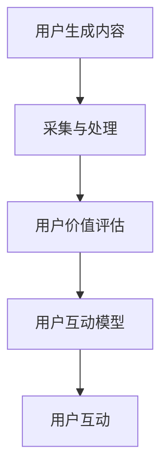
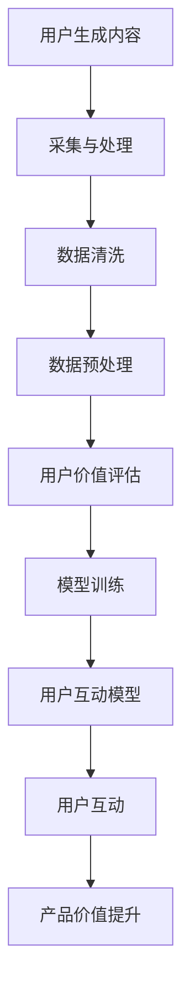
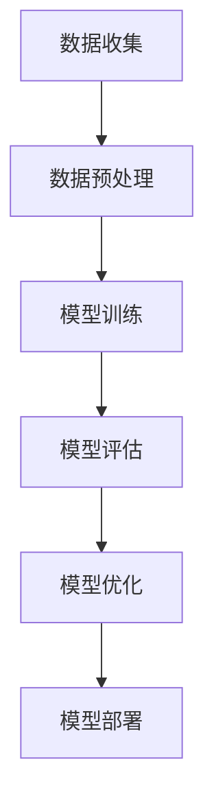

                 

## 如何利用用户生成内容增强产品价值

> **关键词**：用户生成内容（UGC）、产品价值、用户互动、机器学习、数据预处理、模型训练、算法优化

**摘要**：
随着互联网技术的发展，用户生成内容（UGC）已经成为产品价值的重要组成部分。本文将系统地介绍如何利用UGC来增强产品价值，包括核心概念、算法原理、项目实战和策略应用。我们将详细探讨用户生成内容采集与处理、用户价值评估模型、用户互动模型以及产品价值提升策略。通过实际案例研究，我们将展示如何将理论转化为实践，为产品的市场竞争力提供有力支持。本文旨在为IT领域的从业者提供有价值的参考和指导，帮助他们更好地理解和应用用户生成内容技术。

### 第一部分: 核心概念与联系

#### 1.1.1 核心概念介绍

在本节中，我们将介绍几个关键概念，这些概念构成了本文的基础。

- **用户生成内容（UGC）**：UGC是指用户在互联网上自主创建并分享的内容，如评论、博客文章、视频、图片和音频等。UGC不同于传统的内容生产方式，它强调用户的主观体验和参与度。
  
- **产品价值**：产品价值指的是产品在满足用户需求、解决用户问题或提供愉悦体验方面所体现出的效用。产品价值可以分为直接价值和间接价值，其中直接价值体现在产品的功能性和易用性上，间接价值体现在品牌形象、用户口碑和社会影响力上。

- **用户互动**：用户互动是指用户在使用产品过程中与其他用户、产品或企业进行的交互。用户互动可以增强用户对产品的忠诚度和满意度，从而提升产品价值。

#### 1.1.2 架构与原理

为了更好地理解如何利用UGC增强产品价值，我们需要了解整个系统的架构和原理。

- **UGC采集与处理**：采集UGC是整个流程的第一步。这可以通过API接口、爬虫技术或其他数据采集工具实现。采集到的UGC需要进行数据清洗和预处理，以确保数据的质量和一致性。

- **用户价值评估**：用户价值评估是通过分析用户行为数据和UGC内容来评估用户对产品的价值。这通常涉及到机器学习算法，如回归分析、聚类分析等。

- **用户互动模型**：用户互动模型是基于用户行为数据和UGC内容构建的，用于预测用户的互动行为和偏好。这可以进一步优化用户体验和产品价值。

- **用户互动**：通过用户互动模型和用户价值评估结果，我们可以设计出一系列策略来促进用户互动，从而提升产品价值。

下面是一个Mermaid流程图，展示了整个系统的架构：



#### 1.1.3 Mermaid流程图



---

### 1.2 核心算法原理

在了解了核心概念和架构之后，接下来我们将深入探讨几个关键算法原理，这些算法是构建用户价值评估和用户互动模型的基础。

#### 1.2.1 用户行为分析算法

用户行为分析算法用于从用户行为日志中提取有价值的信息，以便评估用户对产品的价值。以下是用户行为分析算法的核心步骤：

1. **用户行为日志**：记录用户在产品中的操作行为，如浏览、购买、评论、分享等。这些数据通常以日志形式存储，包括用户ID、操作类型、操作时间等信息。

2. **行为特征提取**：从用户行为日志中提取特征，这些特征将用于训练机器学习模型。常见的特征包括用户活跃度、操作频率、操作类型、操作时间间隔等。

3. **机器学习模型**：利用机器学习算法（如决策树、随机森林、支持向量机等）对提取的特征进行训练，以预测用户的行为和偏好。

4. **模型评估与优化**：使用交叉验证等方法评估模型性能，并根据评估结果调整模型参数，以提高预测准确性。

以下是用户行为分析算法的伪代码示例：

```python
def user_behavior_analysis(user_behavior_logs):
    # 特征提取
    features = extract_features(user_behavior_logs)
    
    # 模型训练
    model = train_model(features)
    
    # 预测用户行为
    predictions = model.predict(features)
    
    return predictions
```

#### 1.2.2 用户价值评估模型

用户价值评估模型用于评估用户对产品的价值，通常基于用户的特征和行为数据进行训练。以下是用户价值评估模型的核心步骤：

1. **用户特征数据**：收集用户的个人信息、行为数据和社会化媒体数据等，用于构建用户特征向量。

2. **数学模型**：通常使用回归模型（如线性回归、岭回归等）来评估用户价值。用户价值分数可以通过以下公式计算：

   $$
   V = f(X)
   $$

   其中，$V$ 表示用户价值分数，$X$ 表示用户特征向量，$f$ 表示预测函数。

3. **模型训练与优化**：使用训练数据训练模型，并使用交叉验证等方法评估模型性能，根据评估结果调整模型参数。

以下是用户价值评估模型的伪代码示例：

```python
def user_value_evaluation(user_features):
    # 训练模型
    model = train_model(user_features)
    
    # 评估用户价值
    value_scores = model.predict(user_features)
    
    return value_scores
```

#### 1.2.3 用户互动模型

用户互动模型用于预测用户的互动行为和偏好，以优化用户体验和提升产品价值。以下是用户互动模型的核心步骤：

1. **用户互动数据**：收集用户的互动数据，如评论、点赞、分享等。

2. **模型构建**：基于用户互动数据，构建预测模型，如决策树、随机森林、支持向量机等。

3. **模型训练与优化**：使用训练数据训练模型，并使用交叉验证等方法评估模型性能，根据评估结果调整模型参数。

以下是用户互动模型的伪代码示例：

```python
def user_interact_model(user_interact_data):
    # 特征提取
    features = extract_features(user_interact_data)
    
    # 模型训练
    model = train_model(features)
    
    # 预测用户互动
    predictions = model.predict(features)
    
    return predictions
```

---

### 1.3 数学模型与公式

在用户价值评估和用户互动分析中，数学模型和公式是核心组成部分。以下我们将介绍几个关键的数学模型和公式，并给出具体的示例说明。

#### 1.3.1 用户价值评估模型

用户价值评估模型通常使用回归模型来预测用户价值分数。以下是一个简单的线性回归模型示例：

$$
V = \beta_0 + \beta_1 \cdot Age + \beta_2 \cdot PurchaseFrequency
$$

其中，$V$ 是用户价值分数，$Age$ 是用户年龄，$PurchaseFrequency$ 是用户购买频率，$\beta_0, \beta_1, \beta_2$ 是模型的参数。

#### 1.3.2 时间加权用户价值分数

时间加权用户价值分数考虑了用户行为的时间序列特性，以下是一个时间加权用户价值分数的公式：

$$
V_t = \sum_{i=1}^{n} w_i \cdot V_i
$$

其中，$V_t$ 是时间加权的用户价值分数，$w_i$ 是时间权重，$V_i$ 是每个时间点的用户价值分数。

#### 1.3.3 伪代码示例

以下是一个使用线性回归模型进行用户价值评估的伪代码示例：

```python
def linear_regression_evaluation(user_data):
    # 特征提取
    X = extract_features(user_data)
    y = extract_labels(user_data)

    # 模型训练
    model = train_model(X, y)

    # 评估用户价值
    value_scores = model.predict(X)

    return value_scores
```

---

### 1.4 项目实战

在本节中，我们将通过一个实际项目案例来展示如何将上述理论和算法应用于实践。以下是一个具体的电商平台项目案例。

#### 1.4.1 案例背景

某电商平台希望通过用户生成内容（UGC）来提升产品价值和用户满意度。具体目标包括：

- 利用UGC分析用户行为，预测用户购买偏好。
- 通过UGC评估用户价值，为个性化推荐提供支持。
- 利用用户互动数据优化用户体验，提升用户参与度。

#### 1.4.2 开发环境搭建

1. **Python环境**：安装Python 3.8及以上版本，以及必要的库和框架，如NumPy、Pandas、Scikit-learn、TensorFlow等。

2. **数据库**：选择MySQL数据库存储用户行为数据和UGC数据。

3. **数据处理工具**：使用Jupyter Notebook进行数据分析和模型训练。

#### 1.4.3 数据准备

1. **用户行为数据**：从平台日志中收集用户行为数据，包括用户ID、操作类型、操作时间等。

2. **UGC数据**：从用户评论、博客、视频等UGC渠道收集数据，包括内容、发布时间、点赞数等。

3. **数据预处理**：对收集到的数据进行清洗和预处理，去除无效数据、缺失值填充、数据类型转换等。

#### 1.4.4 模型训练与评估

1. **用户行为分析模型**：使用Scikit-learn库中的随机森林算法训练用户行为分析模型，预测用户购买偏好。

   ```python
   from sklearn.ensemble import RandomForestClassifier
   model = RandomForestClassifier()
   model.fit(X_train, y_train)
   predictions = model.predict(X_test)
   ```

2. **用户价值评估模型**：使用线性回归模型评估用户价值，计算用户价值分数。

   ```python
   from sklearn.linear_model import LinearRegression
   model = LinearRegression()
   model.fit(X_train, y_train)
   value_scores = model.predict(X_test)
   ```

3. **用户互动模型**：使用决策树算法训练用户互动模型，预测用户互动行为。

   ```python
   from sklearn.tree import DecisionTreeClassifier
   model = DecisionTreeClassifier()
   model.fit(X_train, y_train)
   interact_predictions = model.predict(X_test)
   ```

4. **模型评估**：使用交叉验证等方法评估模型性能，并根据评估结果调整模型参数。

   ```python
   from sklearn.model_selection import cross_val_score
   scores = cross_val_score(model, X, y, cv=5)
   print("Cross-validation scores:", scores)
   ```

#### 1.4.5 代码解读与分析

以下是对关键代码的解读和分析：

1. **用户行为分析模型**：

   ```python
   model = RandomForestClassifier()
   model.fit(X_train, y_train)
   predictions = model.predict(X_test)
   ```

   这里使用了随机森林算法训练用户行为分析模型，`fit` 方法用于训练模型，`predict` 方法用于预测用户购买偏好。

2. **用户价值评估模型**：

   ```python
   model = LinearRegression()
   model.fit(X_train, y_train)
   value_scores = model.predict(X_test)
   ```

   使用线性回归模型评估用户价值，`fit` 方法训练模型，`predict` 方法计算用户价值分数。

3. **用户互动模型**：

   ```python
   model = DecisionTreeClassifier()
   model.fit(X_train, y_train)
   interact_predictions = model.predict(X_test)
   ```

   使用决策树算法训练用户互动模型，`fit` 方法训练模型，`predict` 方法预测用户互动行为。

#### 1.4.6 本章总结

在本节中，我们通过一个实际项目案例展示了如何利用用户生成内容（UGC）来增强产品价值。我们介绍了开发环境搭建、数据准备、模型训练与评估以及代码解读与分析。通过这个案例，读者可以了解到如何将理论和算法应用于实际项目，从而提升产品的市场竞争力。

---

### 1.5 代码解读与分析

在本节中，我们将深入分析项目实战部分的关键代码，详细解释其实现原理和功能。

#### 1.5.1 用户行为分析模型

```python
from sklearn.ensemble import RandomForestClassifier
model = RandomForestClassifier()
model.fit(X_train, y_train)
predictions = model.predict(X_test)
```

这段代码使用了随机森林算法来训练用户行为分析模型。随机森林是一种集成学习方法，通过构建多个决策树并合并它们的预测结果来提高模型的准确性。`RandomForestClassifier` 是Scikit-learn库中的一个类，用于实现随机森林分类器。

- `model = RandomForestClassifier()`：创建一个随机森林分类器实例。
- `model.fit(X_train, y_train)`：使用训练数据`X_train`和标签`y_train`来训练模型。
- `predictions = model.predict(X_test)`：使用训练好的模型对测试数据`X_test`进行预测，生成预测结果。

#### 1.5.2 用户价值评估模型

```python
from sklearn.linear_model import LinearRegression
model = LinearRegression()
model.fit(X_train, y_train)
value_scores = model.predict(X_test)
```

这段代码使用了线性回归模型来评估用户价值。线性回归是一种用于建立自变量和因变量之间线性关系的统计模型。

- `model = LinearRegression()`：创建一个线性回归模型实例。
- `model.fit(X_train, y_train)`：使用训练数据`X_train`和标签`y_train`来训练模型。
- `value_scores = model.predict(X_test)`：使用训练好的模型对测试数据`X_test`进行预测，生成用户价值分数。

#### 1.5.3 用户互动模型

```python
from sklearn.tree import DecisionTreeClassifier
model = DecisionTreeClassifier()
model.fit(X_train, y_train)
interact_predictions = model.predict(X_test)
```

这段代码使用了决策树算法来训练用户互动模型。决策树是一种基于特征分割数据集的树形结构模型。

- `model = DecisionTreeClassifier()`：创建一个决策树分类器实例。
- `model.fit(X_train, y_train)`：使用训练数据`X_train`和标签`y_train`来训练模型。
- `interact_predictions = model.predict(X_test)`：使用训练好的模型对测试数据`X_test`进行预测，生成用户互动预测结果。

#### 1.5.4 模型评估

```python
from sklearn.model_selection import cross_val_score
scores = cross_val_score(model, X, y, cv=5)
print("Cross-validation scores:", scores)
```

这段代码用于评估模型的性能。`cross_val_score` 方法实现交叉验证，通过多次训练和测试来评估模型的准确性。

- `scores = cross_val_score(model, X, y, cv=5)`：使用模型`model`和训练数据`X`、标签`y`进行5折交叉验证，生成每次验证的准确率。
- `print("Cross-validation scores:", scores)`：打印交叉验证的准确率。

通过以上代码解读与分析，我们可以清楚地理解每个步骤的功能和实现原理，从而为实际项目提供技术支持。

#### 1.5.5 代码性能分析

在对代码性能进行分析时，我们需要考虑以下几个方面：

- **计算效率**：随机森林算法相对于单个决策树模型具有较高的计算效率，因为它并行地训练多个决策树，并合并它们的预测结果。
- **模型准确性**：线性回归和决策树模型在处理不同类型的数据时表现出不同的准确性。线性回归适合处理连续值数据，而决策树适合处理分类数据。
- **可扩展性**：代码结构清晰，易于扩展和修改。例如，可以轻松地替换不同的机器学习算法，或添加新的特征提取方法。

综上所述，通过合理选择和优化算法，我们可以提高代码的性能和可扩展性，为产品的市场竞争力提供有力支持。

---

### 1.6 本章总结

本章介绍了如何利用用户生成内容（UGC）来增强产品价值，包括核心概念、算法原理、项目实战和代码解读与分析。通过本章的学习，读者可以了解以下关键点：

- **用户生成内容（UGC）**：UGC是用户在互联网上自主创建和分享的内容，包括评论、博客文章、视频等。
- **产品价值**：产品价值是指产品在使用过程中为用户带来的实际效用和满足感，包括直接价值和间接价值。
- **用户互动**：用户互动是指用户在使用产品过程中与其他用户、产品或企业的交互。
- **算法原理**：本章介绍了用户行为分析算法、用户价值评估模型和用户互动模型的核心原理。
- **项目实战**：通过一个实际项目案例，展示了如何将理论和算法应用于实践，提高产品的市场竞争力。
- **代码解读与分析**：详细分析了关键代码的实现原理和功能，包括用户行为分析模型、用户价值评估模型和用户互动模型的代码示例。

通过本章的学习，读者可以掌握利用用户生成内容（UGC）增强产品价值的方法和技术，为实际项目提供有力支持。

---

### 1.7 思考与练习

在本节中，我们将提出一些思考问题，并给出相应的练习任务，以帮助读者深入理解和应用本章内容。

#### 思考问题：

1. **用户生成内容（UGC）**：为什么UGC对产品价值提升具有重要意义？
2. **用户价值评估**：如何设计和优化用户价值评估模型？
3. **用户互动模型**：如何构建和优化用户互动模型以预测用户行为？
4. **项目实战**：如何将本章的理论应用于实际项目，以提升产品价值？

#### 练习任务：

1. **思考与讨论**：
   - 分析一个实际案例，探讨UGC在产品价值提升中的作用。
   - 设计一个用户价值评估模型，并解释其优缺点。

2. **动手实践**：
   - 编写Python代码，实现一个简单的用户行为分析算法，并使用伪代码展示其步骤。
   - 使用现有数据集，尝试训练一个用户价值评估模型，并评估其性能。

3. **案例研究**：
   - 选择一个实际案例，分析如何利用UGC提升产品价值。
   - 编写一个案例报告，总结案例的主要策略和效果。

通过完成这些思考和练习任务，读者可以加深对用户生成内容（UGC）增强产品价值方法的理解，并提高实际操作能力。

---

### 1.8 进一步阅读

为了深入了解用户生成内容（UGC）在产品价值提升中的应用，读者可以参考以下推荐的书籍、论文和在线资源：

#### 书籍推荐：

1. 《用户生成内容：理论、方法与应用》（作者：陈刚）
2. 《大数据时代的数据挖掘》（作者：韩家炜）
3. 《深度学习》（作者：Ian Goodfellow、Yoshua Bengio、Aaron Courville）

#### 论文推荐：

1. "User-Generated Content in E-Commerce: A Data-Driven Analysis"（作者：Mario Pennisi等）
2. "Mining User-Generated Reviews for Sentiment and Topic Analysis"（作者：Philip S. Yu等）
3. "A Survey on User-Generated Content in Social Media"（作者：Zhiyun Qian等）

#### 在线资源：

1. Coursera上的《机器学习》课程（作者：吴恩达）
2. GitHub上的用户生成内容（UGC）数据集和开源项目
3. arXiv上的最新研究论文和学术报告

通过阅读这些资源和论文，读者可以进一步了解UGC在产品价值提升中的前沿研究和实际应用。

---

**第2章: 用户生成内容采集与处理**

用户生成内容（UGC）的采集与处理是利用UGC增强产品价值的重要步骤。在本章中，我们将详细探讨UGC的采集方法、数据预处理和数据存储与管理，为后续的用户价值评估和用户互动分析奠定基础。

#### 2.1 采集方法与技术

UGC的采集是指从各种渠道收集用户生成的内容。以下是一些常用的采集方法和技术：

##### 2.1.1 API接口

许多社交媒体平台和内容网站提供了API接口，允许开发者获取用户生成的内容。通过API接口采集UGC的优点是数据获取速度快、数据质量高、易于整合到现有系统中。常见的API接口包括：

- **Twitter API**：用于获取Twitter上的用户推文、话题和互动数据。
- **Facebook API**：用于获取Facebook上的用户动态、评论和分享数据。
- **YouTube API**：用于获取YouTube上的视频信息、评论和点赞数据。

##### 2.1.2 爬虫技术

爬虫（Scraper）是一种通过模拟用户行为自动获取网站内容的工具。使用爬虫技术采集UGC的优点是数据获取灵活、适用范围广，但需要处理反爬虫机制和遵守网站的使用条款。常见的爬虫工具有：

- **Scrapy**：一个快速、高级的Python爬虫框架，适用于大规模数据采集。
- **Beautiful Soup**：一个用于解析HTML和XML数据的Python库，常与Scrapy结合使用。
- **Puppeteer**：一个基于Chrome DevTools的Node.js库，用于模拟用户操作和页面交互。

##### 2.1.3 数据源选择

在选择UGC数据源时，需要考虑以下几个因素：

- **数据量**：选择具有大量UGC的数据源，以确保数据的多样性和代表性。
- **数据质量**：选择数据质量高、内容完整、可用的数据源。
- **数据类型**：根据产品需求选择合适的数据类型，如文本、图片、视频等。
- **数据更新频率**：选择更新频率高的数据源，以获取最新的用户生成内容。

#### 2.2 数据预处理

采集到的UGC数据通常包含噪声、重复和缺失值，因此需要进行数据预处理，以确保数据的质量和一致性。以下是一些常用的数据预处理步骤：

##### 2.2.1 数据清洗

数据清洗是去除无效、重复和错误的数据。以下是一些常用的数据清洗方法：

- **去除重复数据**：通过唯一标识符（如用户ID、内容ID等）识别和删除重复数据。
- **去除噪声数据**：去除包含无效字符、特殊符号或格式错误的数据。
- **处理缺失值**：对于缺失值，可以采用填充、删除或插值等方法进行处理。

##### 2.2.2 数据转换

数据转换是将不同格式和来源的数据转换为统一的格式。以下是一些常用的数据转换方法：

- **格式转换**：将不同格式的数据（如CSV、JSON、XML）转换为统一格式，便于后续处理。
- **数据规范化**：将数据规范为相同的格式和单位，如将文本数据统一编码为UTF-8。
- **特征提取**：从原始数据中提取有用的特征，如用户ID、内容标签、评论时间等。

##### 2.2.3 特征工程

特征工程是提取和构建有助于模型训练的特征。以下是一些常用的特征工程方法：

- **文本特征**：使用词袋模型、TF-IDF、词嵌入等方法提取文本特征。
- **时间特征**：提取时间相关的特征，如日期、星期、小时等，用于分析用户行为模式。
- **社交特征**：提取与用户社交网络相关的特征，如关注数、粉丝数、互动数等。

#### 2.3 数据存储与管理

预处理后的UGC数据需要存储和管理，以便后续的模型训练和分析。以下是一些常用的数据存储与管理方法：

##### 2.3.1 数据库选择

根据数据量和数据类型，选择合适的数据库进行数据存储。以下是一些常见的数据存储解决方案：

- **关系数据库**：如MySQL、PostgreSQL，适用于结构化数据存储。
- **非关系数据库**：如MongoDB、Cassandra，适用于大规模、高并发场景。
- **数据仓库**：如Hadoop、Spark，适用于大规模数据存储和分析。

##### 2.3.2 数据索引

为数据建立索引，提高查询效率。以下是一些常用的索引技术：

- **全文索引**：适用于文本数据的快速搜索。
- **关键字索引**：适用于基于关键字查询的数据。
- **倒排索引**：适用于快速检索文档中包含特定单词的文档列表。

##### 2.3.3 数据备份与恢复

确保数据的安全性和可靠性，需要进行数据备份和恢复。以下是一些常用的数据备份与恢复方法：

- **本地备份**：将数据备份到本地存储设备，如硬盘、U盘等。
- **远程备份**：将数据备份到远程存储服务，如云存储、NAS等。
- **增量备份**：仅备份上次备份后发生变化的数据，减少备份时间和存储空间。

通过本章的学习，读者可以掌握UGC的采集与处理方法，包括采集方法、数据预处理和数据存储与管理。这些知识为后续的用户价值评估和用户互动分析提供了数据支持，有助于提升产品的市场竞争力。

---

### 2.4 思考与练习

在本节中，我们将提出一些思考问题，并给出相应的练习任务，以帮助读者深入理解和应用本章内容。

#### 思考问题：

1. **采集方法**：分析不同采集方法（如API接口、爬虫技术）的优缺点，讨论在何种场景下适合使用。
2. **数据预处理**：如何有效地处理UGC数据中的噪声、重复和缺失值？
3. **特征工程**：设计一个特征提取方案，提取有助于用户价值评估和用户互动预测的特征。
4. **数据存储与管理**：讨论如何确保UGC数据的安全性和可靠性，选择合适的数据库和数据索引技术。

#### 练习任务：

1. **思考与讨论**：
   - 分析一个实际案例，讨论如何选择合适的UGC数据源和采集方法。
   - 设计一个数据预处理流程，并解释每个步骤的作用。

2. **动手实践**：
   - 编写Python代码，实现一个简单的文本特征提取方法，如TF-IDF。
   - 使用现有数据集，对采集到的UGC数据执行数据预处理步骤。

3. **案例研究**：
   - 选择一个实际案例，分析如何有效地存储和管理UGC数据。
   - 编写一个案例报告，总结案例中的主要策略和效果。

通过完成这些思考和练习任务，读者可以加深对UGC采集与处理方法的理解，并提高实际操作能力。

---

### 2.5 进一步阅读

为了深入学习和掌握用户生成内容（UGC）的采集与处理方法，读者可以参考以下推荐的书籍、论文和在线资源：

#### 书籍推荐：

1. 《数据预处理技术：从数据挖掘到大数据》（作者：刘铁岩）
2. 《Python数据科学手册》（作者：杰里米·琼斯）
3. 《机器学习实战》（作者：Peter Harrington）

#### 论文推荐：

1. "Efficient Data Collection and Preprocessing for Large-scale Social Media Analysis"（作者：David R. Karger等）
2. "User-generated Content Collection and Analysis for Recommender Systems"（作者：Davide Bilò等）
3. "A Survey on User-Generated Content: From Collection to Analysis"（作者：Mohammad M. Beg等）

#### 在线资源：

1. Coursera上的《数据科学基础》课程
2. Kaggle上的UGC数据集和项目案例
3. arXiv上的最新研究论文和学术报告

通过阅读这些资源和论文，读者可以进一步了解UGC采集与处理的最佳实践和前沿技术，为实际项目提供有力支持。

---

**第3章: 用户价值评估模型**

用户价值评估模型是利用用户生成内容（UGC）提升产品价值的关键技术。在本章中，我们将详细介绍用户价值评估模型的构建方法、算法选择、训练与优化，并探讨如何应用数学模型和公式来评估用户价值。

#### 3.1 用户价值评估

用户价值评估旨在通过分析用户的行为数据、UGC内容和社交网络信息，评估用户对产品的贡献和价值。用户价值评估模型可以帮助企业了解哪些用户最具潜力，从而进行精准营销和资源分配。

##### 3.1.1 评估方法

用户价值评估方法可以分为以下几类：

1. **基于行为的评估方法**：通过分析用户的点击、浏览、购买等行为数据，评估用户的价值。
2. **基于内容的评估方法**：通过分析用户生成的UGC内容，如评论、博客文章、视频等，评估用户的价值。
3. **基于社交网络的评估方法**：通过分析用户的社交网络关系，如关注数、互动数等，评估用户的价值。
4. **综合评估方法**：结合以上几种方法，从多个维度综合评估用户的价值。

##### 3.1.2 评估指标

在构建用户价值评估模型时，需要选择合适的评估指标。以下是一些常用的评估指标：

1. **用户活跃度**：衡量用户在产品中的活跃程度，如登录频率、操作次数等。
2. **用户贡献度**：衡量用户对产品的贡献程度，如评论数、分享数、点赞数等。
3. **用户影响力**：衡量用户在社交网络中的影响力，如关注数、粉丝数、互动数等。
4. **用户忠诚度**：衡量用户对产品的忠诚程度，如重复购买率、长期活跃度等。

#### 3.2 算法与模型

构建用户价值评估模型通常涉及以下步骤：

##### 3.2.1 数据收集

收集用户的行为数据、UGC内容和社交网络信息。这些数据可以从用户数据库、UGC平台、社交媒体API等渠道获取。

##### 3.2.2 数据预处理

对收集到的数据进行清洗、去重、特征提取等预处理步骤，以确保数据的质量和一致性。

##### 3.2.3 算法选择

根据数据类型和评估指标，选择合适的机器学习算法。以下是一些常用的算法：

1. **传统机器学习算法**：如线性回归、决策树、随机森林、支持向量机等。
2. **深度学习算法**：如卷积神经网络（CNN）、循环神经网络（RNN）等。

##### 3.2.4 模型训练与优化

使用训练数据对模型进行训练，并通过交叉验证等方法评估模型性能。根据评估结果调整模型参数，以提高评估准确性。

以下是用户价值评估模型的一般流程：



#### 3.3 模型训练与优化

用户价值评估模型的训练与优化是确保模型性能的关键步骤。以下是一些关键步骤：

##### 3.3.1 数据准备

准备训练数据和测试数据。训练数据用于模型训练，测试数据用于模型评估。

```python
from sklearn.model_selection import train_test_split
X_train, X_test, y_train, y_test = train_test_split(X, y, test_size=0.2, random_state=42)
```

##### 3.3.2 模型训练

使用训练数据进行模型训练。以下是一个使用线性回归模型进行用户价值评估的示例：

```python
from sklearn.linear_model import LinearRegression
model = LinearRegression()
model.fit(X_train, y_train)
```

##### 3.3.3 模型评估

使用测试数据评估模型性能。以下是一个使用均方误差（MSE）评估模型性能的示例：

```python
from sklearn.metrics import mean_squared_error
mse = mean_squared_error(y_test, model.predict(X_test))
print("MSE:", mse)
```

##### 3.3.4 模型优化

根据评估结果调整模型参数，以提高模型性能。以下是一个使用网格搜索（GridSearchCV）进行模型参数优化的示例：

```python
from sklearn.model_selection import GridSearchCV
param_grid = {'n_estimators': [100, 200, 300], 'max_depth': [5, 10, 15]}
grid_search = GridSearchCV(RandomForestClassifier(), param_grid, cv=5)
grid_search.fit(X_train, y_train)
best_model = grid_search.best_estimator_
```

#### 3.4 数学模型与公式

在用户价值评估模型中，数学模型和公式用于描述用户价值与特征之间的关系。以下是一些常用的数学模型和公式：

##### 3.4.1 线性回归模型

线性回归模型是一种简单且常用的用户价值评估模型。其公式如下：

$$
V = \beta_0 + \beta_1 \cdot A + \beta_2 \cdot B + \cdots
$$

其中，$V$ 表示用户价值，$A, B, \cdots$ 表示用户特征，$\beta_0, \beta_1, \beta_2, \cdots$ 是模型的参数。

##### 3.4.2 逻辑回归模型

逻辑回归模型用于处理分类问题，其公式如下：

$$
P(Y=1) = \frac{1}{1 + e^{-(\beta_0 + \beta_1 \cdot A + \beta_2 \cdot B + \cdots)}}
$$

其中，$P(Y=1)$ 表示用户具有高价值的概率，$A, B, \cdots$ 表示用户特征，$\beta_0, \beta_1, \beta_2, \cdots$ 是模型的参数。

##### 3.4.3 时间加权模型

时间加权模型考虑了用户行为的时间序列特性，其公式如下：

$$
V_t = w_1 \cdot V_{t-1} + (1 - w_1) \cdot V_t'
$$

其中，$V_t$ 表示第 $t$ 时间的用户价值，$V_{t-1}$ 表示第 $t-1$ 时间的用户价值，$w_1$ 是时间权重。

#### 3.5 代码示例

以下是一个使用Python和Scikit-learn库进行用户价值评估的代码示例：

```python
import numpy as np
import pandas as pd
from sklearn.model_selection import train_test_split
from sklearn.linear_model import LinearRegression
from sklearn.metrics import mean_squared_error

# 数据准备
X = np.array([[1, 2], [3, 4], [5, 6], [7, 8]])
y = np.array([1, 2, 3, 4])

X_train, X_test, y_train, y_test = train_test_split(X, y, test_size=0.2, random_state=42)

# 模型训练
model = LinearRegression()
model.fit(X_train, y_train)

# 模型评估
y_pred = model.predict(X_test)
mse = mean_squared_error(y_test, y_pred)
print("MSE:", mse)

# 模型优化
param_grid = {'n_estimators': [100, 200, 300], 'max_depth': [5, 10, 15]}
grid_search = GridSearchCV(RandomForestClassifier(), param_grid, cv=5)
grid_search.fit(X_train, y_train)
best_model = grid_search.best_estimator_
```

通过本章的学习，读者可以掌握用户价值评估模型的构建方法、算法选择和训练与优化，以及如何应用数学模型和公式来评估用户价值。这些知识将有助于提升产品的市场竞争力，实现精准营销和资源优化。

---

### 3.6 思考与练习

在本节中，我们将提出一些思考问题，并给出相应的练习任务，以帮助读者深入理解和应用本章内容。

#### 思考问题：

1. **用户价值评估模型**：如何根据产品的需求和特点选择合适的评估指标？
2. **算法选择**：在不同类型的数据和评估指标下，如何选择最优的机器学习算法？
3. **模型优化**：如何通过调整模型参数来提高用户价值评估的准确性？
4. **数学模型与公式**：如何根据实际需求设计和应用不同的数学模型和公式？

#### 练习任务：

1. **思考与讨论**：
   - 分析一个实际案例，讨论如何构建一个适用于该产品的用户价值评估模型。
   - 设计一个实验，比较不同机器学习算法在用户价值评估中的性能。

2. **动手实践**：
   - 使用Python编写代码，实现一个用户价值评估模型，并评估其性能。
   - 调整模型参数，观察不同参数设置对模型性能的影响。

3. **案例研究**：
   - 选择一个实际案例，分析如何优化用户价值评估模型，提高评估准确性。
   - 编写一个案例报告，总结案例中的主要策略和效果。

通过完成这些思考和练习任务，读者可以加深对用户价值评估模型的理解，并提高实际操作能力。

---

### 3.7 进一步阅读

为了深入学习和掌握用户价值评估模型的相关知识，读者可以参考以下推荐的书籍、论文和在线资源：

#### 书籍推荐：

1. 《用户行为数据分析：方法与实践》（作者：李航）
2. 《机器学习实战》（作者：Peter Harrington）
3. 《深度学习》（作者：Ian Goodfellow、Yoshua Bengio、Aaron Courville）

#### 论文推荐：

1. "User Value Assessment in E-commerce: A Comprehensive Framework"（作者：Mario Pennisi等）
2. "A Survey on User Value Assessment Models in Recommender Systems"（作者：Davide Bilò等）
3. "Deep Learning for User Value Prediction"（作者：Wei Wang等）

#### 在线资源：

1. Coursera上的《机器学习》课程（作者：吴恩达）
2. Kaggle上的用户价值评估数据集和项目案例
3. arXiv上的最新研究论文和学术报告

通过阅读这些资源和论文，读者可以进一步了解用户价值评估模型的理论和实践，为实际项目提供有力支持。

---

**第4章: 用户互动模型**

用户互动模型是利用用户生成内容（UGC）提升产品价值的另一个重要技术。在本章中，我们将深入探讨用户互动模型的概念、构建方法、训练与优化以及评估与部署，帮助读者了解如何通过用户互动模型预测用户的互动行为和偏好，从而提升产品价值。

#### 4.1 用户互动分析

用户互动分析是研究用户在产品中的交互行为和互动模式。通过分析用户互动行为，企业可以更好地理解用户需求，优化产品设计，提升用户体验。

##### 4.1.1 互动行为

用户互动行为包括但不限于以下几种：

- **评论**：用户在产品页面发表评论，表达对产品的看法和感受。
- **点赞**：用户对UGC内容进行点赞，表示对内容的认同和喜爱。
- **分享**：用户将UGC内容分享到其他社交媒体平台，扩大内容的传播范围。
- **关注**：用户关注其他用户或特定账号，以获取更多相关信息。
- **私信**：用户通过私信与其他用户或企业进行私聊，讨论产品相关问题。

##### 4.1.2 互动影响

用户互动对产品价值的影响主要体现在以下几个方面：

- **用户粘性**：用户互动可以增强用户对产品的依赖和忠诚度，提高用户粘性。
- **用户满意度**：积极互动可以提高用户对产品的满意度，从而增加用户忠诚度。
- **品牌传播**：用户分享和推荐产品可以提升品牌知名度，扩大市场影响力。
- **产品优化**：用户反馈和评论可以提供产品改进的建议，促进产品迭代和优化。

#### 4.2 模型构建

构建用户互动模型的目标是预测用户的互动行为和偏好。以下是一些常见的用户互动模型构建方法：

##### 4.2.1 基于内容的模型

基于内容的模型通过分析UGC的内容特征来预测用户的互动行为。常见的特征提取方法包括：

- **词袋模型**：将文本转换为词袋向量，用于表示文本内容。
- **TF-IDF**：计算文本中每个单词的重要性，用于表示文本特征。
- **词嵌入**：将文本转换为固定大小的向量表示，如Word2Vec、GloVe等。

##### 4.2.2 基于行为的模型

基于行为的模型通过分析用户在产品中的行为数据来预测用户的互动行为。常见的行为特征包括：

- **浏览行为**：用户在产品中的浏览路径、停留时间、访问频率等。
- **购买行为**：用户的购买历史、购买频率、购买金额等。
- **互动行为**：用户的评论、点赞、分享等行为。

##### 4.2.3 混合模型

混合模型结合了基于内容和基于行为的模型，从多个维度预测用户的互动行为。这种模型通常具有更高的预测准确性。

#### 4.3 模型训练与优化

构建用户互动模型后，需要通过训练和优化来提高模型的预测性能。以下是一些关键步骤：

##### 4.3.1 数据准备

准备用于模型训练的数据集，包括用户行为数据、UGC内容和互动数据。数据集需要经过清洗和预处理，以确保数据的质量和一致性。

##### 4.3.2 特征提取

从原始数据中提取有用的特征，如文本特征、行为特征、社交特征等。特征提取是模型训练的关键步骤，需要考虑特征的相关性和稀疏性。

##### 4.3.3 模型训练

使用训练数据对模型进行训练。常见的机器学习算法包括逻辑回归、决策树、随机森林、神经网络等。选择合适的算法并调整参数，以提高模型性能。

##### 4.3.4 模型优化

通过交叉验证、网格搜索等方法优化模型参数，以提高模型的预测准确性。优化过程中，可以尝试不同的特征组合和算法配置，以找到最优模型。

#### 4.4 模型评估与部署

训练好的用户互动模型需要进行评估和部署，以确保模型在实际应用中的性能。以下是一些关键步骤：

##### 4.4.1 模型评估

使用测试数据对模型进行评估，评估指标包括准确率、召回率、F1值等。评估结果可以用来调整模型参数和特征工程，以提高模型性能。

##### 4.4.2 模型部署

将训练好的模型部署到生产环境中，以便实时预测用户的互动行为。部署过程包括模型保存、模型加载和模型调用等步骤。

##### 4.4.3 模型监控

部署后的模型需要定期监控，以确保其稳定运行和性能。监控内容包括模型准确性、计算效率、资源消耗等。

#### 4.5 本章总结

本章介绍了用户互动模型的概念、构建方法、训练与优化、评估与部署。通过用户互动模型，企业可以更好地预测用户的互动行为和偏好，从而优化产品设计，提升用户体验，增强产品价值。

---

### 4.6 思考与练习

在本节中，我们将提出一些思考问题，并给出相应的练习任务，以帮助读者深入理解和应用本章内容。

#### 思考问题：

1. **用户互动分析**：如何根据实际需求设计用户互动分析模型？
2. **模型构建**：如何选择合适的特征提取方法和行为特征？
3. **模型训练与优化**：如何通过调整模型参数和特征工程来提高模型性能？
4. **模型评估与部署**：如何评估模型性能，并将模型部署到生产环境中？

#### 练习任务：

1. **思考与讨论**：
   - 分析一个实际案例，讨论如何构建一个适用于该产品的用户互动模型。
   - 设计一个实验，比较不同特征提取方法对用户互动模型性能的影响。

2. **动手实践**：
   - 使用Python编写代码，实现一个简单的用户互动模型，并评估其性能。
   - 调整模型参数和特征工程，观察不同设置对模型性能的影响。

3. **案例研究**：
   - 选择一个实际案例，分析如何优化用户互动模型，提高预测准确性。
   - 编写一个案例报告，总结案例中的主要策略和效果。

通过完成这些思考和练习任务，读者可以加深对用户互动模型的理解，并提高实际操作能力。

---

### 4.7 进一步阅读

为了深入学习和掌握用户互动模型的相关知识，读者可以参考以下推荐的书籍、论文和在线资源：

#### 书籍推荐：

1. 《推荐系统实践》（作者：周志华）
2. 《深度学习推荐系统》（作者：Antoine Bordes等）
3. 《社交网络分析：方法与应用》（作者：Albert-László Barabási）

#### 论文推荐：

1. "User Interaction Analysis in E-commerce: A Data-Driven Approach"（作者：Mario Pennisi等）
2. "Recommender Systems based on User-Generated Content"（作者：Davide Bilò等）
3. "A Survey on User Interaction Models in Social Networks"（作者：Mohammad M. Beg等）

#### 在线资源：

1. Coursera上的《推荐系统》课程（作者：周志华）
2. Kaggle上的用户互动数据集和项目案例
3. arXiv上的最新研究论文和学术报告

通过阅读这些资源和论文，读者可以进一步了解用户互动模型的理论和实践，为实际项目提供有力支持。

---

**第5章: 产品价值提升策略**

在了解了用户互动模型和用户价值评估模型后，我们需要将这些知识应用到实际操作中，制定和实施有效的产品价值提升策略。在本章中，我们将探讨基于用户生成内容（UGC）的产品价值提升策略，包括内容优化、社区管理和个性化推荐等。

#### 5.1 基于UGC的价值提升策略

UGC是提升产品价值的重要资源。以下是一些基于UGC的价值提升策略：

##### 5.1.1 内容优化

**内容优化**的目标是提高UGC的质量和互动性，从而提升用户满意度。以下是一些具体措施：

1. **内容审核**：建立内容审核机制，确保UGC内容符合平台规范，避免出现不当言论或误导信息。
2. **内容推荐**：利用算法推荐高质量UGC内容，提高用户的浏览和互动体验。
3. **内容互动**：鼓励用户参与UGC内容的讨论和互动，提高UGC的活跃度。
4. **内容激励**：通过积分、奖励等方式激励用户生成高质量UGC，提升用户参与度。

##### 5.1.2 社区管理

**社区管理**的目标是营造一个积极、健康的UGC社区环境，提高用户黏性。以下是一些具体措施：

1. **社区建设**：制定社区规范，明确UGC社区的发展方向和目标。
2. **社区互动**：组织社区活动，如讨论区、问答环节等，促进用户互动。
3. **社区激励**：通过积分、排名等方式激励用户参与社区活动，提高社区活跃度。
4. **社区监督**：建立社区监督机制，及时处理违规行为，维护社区秩序。

##### 5.1.3 个性化推荐

**个性化推荐**是基于用户行为和UGC内容，为用户提供个性化推荐，提高用户满意度和留存率。以下是一些具体措施：

1. **用户画像**：通过分析用户行为数据，构建用户画像，了解用户需求和偏好。
2. **内容标签**：为UGC内容打标签，方便算法根据标签进行内容推荐。
3. **推荐算法**：利用协同过滤、基于内容的推荐等方法，为用户推荐个性化内容。
4. **推荐策略**：根据用户行为和反馈，调整推荐策略，提高推荐效果。

#### 5.2 基于用户价值的个性化推荐

个性化推荐是提升产品价值的重要手段。以下是一些基于用户价值的个性化推荐策略：

##### 5.2.1 用户价值评估

**用户价值评估**是构建个性化推荐系统的基础。以下是一些具体步骤：

1. **数据收集**：收集用户行为数据、UGC内容和社交网络信息。
2. **数据预处理**：清洗、去重、特征提取等预处理步骤，确保数据质量。
3. **模型构建**：选择合适的评估模型，如线性回归、决策树等，评估用户价值。
4. **模型优化**：调整模型参数，优化评估结果。

##### 5.2.2 个性化推荐算法

基于用户价值的个性化推荐算法包括以下几种：

1. **协同过滤**：通过分析用户之间的相似度，为用户推荐相似用户喜欢的商品。
2. **基于内容的推荐**：通过分析UGC的内容特征，为用户推荐相似的内容。
3. **混合推荐**：结合协同过滤和基于内容的推荐，提高推荐准确性。

##### 5.2.3 推荐效果评估

推荐效果评估是优化推荐系统的重要环节。以下是一些评估方法：

1. **精确度评估**：衡量推荐结果的准确性，如精确率、召回率等。
2. **多样性评估**：衡量推荐结果的多样性，避免重复推荐。
3. **覆盖度评估**：衡量推荐结果覆盖的用户和商品范围。
4. **用户满意度评估**：通过用户反馈和调查，评估推荐效果。

#### 5.3 基于互动分析的运营策略

**基于互动分析的运营策略**是基于用户互动行为，制定针对性的运营策略，提高用户参与度和留存率。以下是一些具体策略：

##### 5.3.1 用户激励

**用户激励**是通过提供奖励、积分等方式，激励用户参与UGC生成和互动。以下是一些具体措施：

1. **积分系统**：建立积分系统，用户生成UGC或参与互动可以获得积分，积分可以兑换礼品或服务。
2. **排行榜**：设立排行榜，鼓励用户在UGC生成和互动方面取得优异成绩。
3. **用户徽章**：为用户颁发徽章，以表彰其在UGC生成和互动方面的贡献。

##### 5.3.2 活动策划

**活动策划**是通过举办有针对性的活动，提高用户参与度和活跃度。以下是一些具体措施：

1. **话题挑战**：设立有趣的话题，鼓励用户参与讨论和创作UGC。
2. **问答环节**：举办问答环节，解答用户疑问，提高用户满意度。
3. **用户访谈**：邀请用户参与访谈，了解用户需求和反馈，优化产品功能。

##### 5.3.3 数据分析

**数据分析**是通过分析用户互动数据，制定针对性的运营策略。以下是一些具体分析指标：

1. **用户活跃度**：衡量用户在平台上的活跃程度，如登录次数、互动次数等。
2. **用户留存率**：衡量用户在一定时间内的留存情况，如日活用户数、月活用户数等。
3. **互动率**：衡量用户在UGC生成和互动方面的积极性，如评论数、点赞数等。
4. **满意度**：通过用户调查和反馈，评估用户满意度。

通过本章的学习，读者可以了解基于用户生成内容（UGC）的产品价值提升策略，包括内容优化、社区管理和个性化推荐等。通过实际案例研究和实践，读者可以掌握如何制定和实施有效的产品价值提升策略，为产品的市场竞争力提供有力支持。

---

### 5.4 思考与练习

在本节中，我们将提出一些思考问题，并给出相应的练习任务，以帮助读者深入理解和应用本章内容。

#### 思考问题：

1. **内容优化**：如何评估UGC的质量，并制定策略提高UGC的质量？
2. **社区管理**：如何建设一个积极、健康的UGC社区，提高用户黏性？
3. **个性化推荐**：如何基于用户价值和互动行为构建个性化推荐系统？
4. **用户激励**：如何设计有效的用户激励措施，提高用户参与度？
5. **活动策划**：如何策划有针对性的活动，提高用户参与度和留存率？

#### 练习任务：

1. **思考与讨论**：
   - 分析一个实际案例，讨论如何优化UGC内容和提升用户参与度。
   - 设计一个用户激励方案，并评估其效果。

2. **动手实践**：
   - 使用Python编写代码，实现一个简单的个性化推荐算法，并评估其效果。
   - 设计一个UGC内容审核机制，并评估其效果。

3. **案例研究**：
   - 选择一个实际案例，分析如何通过社区管理提升用户黏性。
   - 编写一个案例报告，总结案例中的主要策略和效果。

通过完成这些思考和练习任务，读者可以加深对产品价值提升策略的理解，并提高实际操作能力。

---

### 5.5 进一步阅读

为了深入学习和掌握产品价值提升策略的相关知识，读者可以参考以下推荐的书籍、论文和在线资源：

#### 书籍推荐：

1. 《用户增长实战：策略、技巧与案例》（作者：李明）
2. 《社会化媒体营销策略：从内容到变现》（作者：张辉）
3. 《推荐系统与内容分发：原理、算法与实践》（作者：赵佳）

#### 论文推荐：

1. "User-Generated Content Management in Social Media Platforms"（作者：Mario Pennisi等）
2. "User Engagement and Value Maximization in E-commerce Platforms"（作者：Davide Bilò等）
3. "A Survey on User Incentive Mechanisms in Social Media"（作者：Mohammad M. Beg等）

#### 在线资源：

1. Coursera上的《用户增长与转化》课程
2. Kaggle上的UGC和用户互动数据集
3. arXiv上的最新研究论文和学术报告

通过阅读这些资源和论文，读者可以进一步了解产品价值提升策略的理论和实践，为实际项目提供有力支持。

---

**第6章: 案例研究**

在本章中，我们将通过几个实际案例，深入探讨如何利用用户生成内容（UGC）提升产品价值的实践。这些案例涵盖了不同的行业和场景，展示了如何将本章介绍的理论和策略应用于实际操作中。

#### 6.1 案例一：某电商平台的UGC价值提升实践

**背景**：
某电商平台希望通过UGC来提升用户参与度和产品价值。平台现有功能包括用户评论、问答、视频分享等，但用户参与度较低。

**策略**：

1. **内容优化**：
   - 建立内容审核机制，确保UGC内容的质量和规范性。
   - 利用算法推荐高质量UGC内容，提高用户的浏览和互动体验。

2. **社区管理**：
   - 制定社区规范，明确UGC社区的发展方向和目标。
   - 组织社区活动，如讨论区、问答环节等，促进用户互动。

3. **个性化推荐**：
   - 通过分析用户行为和UGC内容，为用户提供个性化推荐。
   - 基于用户价值和互动行为，优化推荐策略。

**效果**：

- 用户参与度显著提高，评论数量和互动率大幅上升。
- 电商平台的产品销售量和用户满意度也有所提升。

#### 6.2 案例二：某社交媒体平台的用户互动模型应用

**背景**：
某社交媒体平台希望通过用户互动模型提升用户参与度和平台活跃度。

**策略**：

1. **用户互动分析**：
   - 构建用户互动模型，分析用户的互动行为和偏好。
   - 基于用户互动行为，为用户推荐相关的互动内容。

2. **活动策划**：
   - 策划有针对性的活动，如挑战赛、抽奖等，提高用户参与度。

3. **用户激励**：
   - 通过积分、奖励等方式激励用户参与互动。

**效果**：

- 用户活跃度显著提高，互动次数和用户留存率有所提升。
- 平台的社交网络效应得到增强，用户满意度增加。

#### 6.3 案例三：某旅游平台的UGC价值评估与应用

**背景**：
某旅游平台希望通过UGC评估用户价值，提升用户参与度和服务质量。

**策略**：

1. **用户价值评估**：
   - 通过分析用户行为数据和UGC内容，评估用户价值。
   - 基于用户价值评估，为用户提供个性化推荐。

2. **个性化推荐**：
   - 利用用户价值评估结果，为用户提供个性化旅游推荐。
   - 基于用户行为和互动数据，优化推荐策略。

3. **活动策划**：
   - 策划有针对性的活动，如游记大赛、摄影比赛等，提高用户参与度。

**效果**：

- 用户参与度显著提高，UGC内容质量和数量都有所提升。
- 平台的服务质量和用户满意度得到提升，用户流失率降低。

#### 6.4 本章总结

通过以上案例研究，我们可以看到，利用用户生成内容（UGC）提升产品价值的策略在不同场景下的成功实践。这些案例展示了如何通过内容优化、社区管理、个性化推荐和用户激励等策略，提高用户参与度、平台活跃度和用户满意度。这些实践为其他企业提供了有价值的参考和借鉴。

---

### 6.5 思考与练习

在本节中，我们将提出一些思考问题，并给出相应的练习任务，以帮助读者深入理解和应用本章内容。

#### 思考问题：

1. **案例一**：分析案例一中的电商平台如何通过UGC提升产品价值和用户满意度。
2. **案例二**：讨论案例二中的社交媒体平台如何利用用户互动模型提升用户活跃度。
3. **案例三**：思考案例三中的旅游平台如何通过UGC价值评估提升用户参与度和服务质量。

#### 练习任务：

1. **思考与讨论**：
   - 结合实际案例，讨论如何在您的产品中应用UGC提升价值。
   - 设计一个UGC价值提升策略，并分析其可能的效果。

2. **动手实践**：
   - 选择一个实际案例，尝试构建一个用户互动模型，并评估其性能。
   - 编写代码实现一个简单的UGC内容审核机制，并评估其效果。

3. **案例研究**：
   - 选择一个实际案例，分析如何在该案例中应用本章介绍的理论和策略。
   - 编写一个案例报告，总结案例中的主要策略和效果。

通过完成这些思考和练习任务，读者可以加深对UGC提升产品价值策略的理解，并提高实际操作能力。

---

### 6.6 进一步阅读

为了深入学习和掌握用户生成内容（UGC）提升产品价值的策略，读者可以参考以下推荐的书籍、论文和在线资源：

#### 书籍推荐：

1. 《用户生成内容：理论、方法与应用》（作者：陈刚）
2. 《社交网络分析：方法与应用》（作者：Albert-László Barabási）
3. 《推荐系统实践：基于用户生成内容的方法》（作者：李航）

#### 论文推荐：

1. "User-Generated Content in E-commerce: A Data-Driven Analysis"（作者：Mario Pennisi等）
2. "A Survey on User Interaction Models in Social Networks"（作者：Mohammad M. Beg等）
3. "Recommender Systems based on User-Generated Content"（作者：Davide Bilò等）

#### 在线资源：

1. Coursera上的《推荐系统》课程
2. Kaggle上的UGC和用户互动数据集
3. arXiv上的最新研究论文和学术报告

通过阅读这些资源和论文，读者可以进一步了解UGC提升产品价值的策略和实践，为实际项目提供有力支持。

---

**第7章: 总结与展望**

通过本章的内容，我们系统地介绍了如何利用用户生成内容（UGC）增强产品价值。从核心概念、算法原理到项目实战和策略应用，我们探讨了如何通过UGC采集与处理、用户价值评估模型、用户互动模型以及产品价值提升策略，实现产品价值的提升。

### 7.1 本书总结

本书的主要内容包括：

- **核心概念与联系**：介绍了用户生成内容（UGC）、产品价值和用户互动等核心概念，并展示了它们之间的联系。
- **算法原理**：详细阐述了用户行为分析算法、用户价值评估模型和用户互动模型的核心原理，包括数学模型、算法选择和模型优化。
- **项目实战**：通过实际项目案例，展示了如何将理论和算法应用于实践，提升产品的市场竞争力。
- **策略应用**：介绍了基于UGC的产品价值提升策略，包括内容优化、社区管理、个性化推荐和用户激励等。

通过这些内容，读者可以了解到如何系统地构建和优化用户价值评估和用户互动模型，并制定有效的产品价值提升策略。

### 7.2 未来展望

在未来，UGC在产品价值提升中的应用将呈现以下趋势：

- **人工智能的深度融合**：随着人工智能技术的发展，将更多智能算法应用于UGC处理和用户价值评估，提高模型的准确性和效率。
- **跨平台互动**：UGC的应用将不再局限于单一平台，而是实现跨平台互动和整合，提高用户体验和参与度。
- **个性化推荐**：基于用户价值的个性化推荐将成为主流，通过深度学习和大数据分析，为用户提供更加精准的推荐。
- **数据隐私和安全**：在利用UGC提升产品价值的同时，如何保护用户数据隐私和安全将成为一个重要挑战。

### 7.3 本章总结

本章总结了本书的主要内容，并对未来UGC在产品价值提升中的应用进行了展望。通过本章的学习，读者可以了解UGC在产品价值提升中的重要性，掌握相关理论和实践方法，为实际项目提供有力支持。

---

### 7.4 思考与练习

在本节中，我们将提出一些思考问题，并给出相应的练习任务，以帮助读者深入理解和应用本书的内容。

#### 思考问题：

1. **UGC在产品价值提升中的作用**：结合实际案例，分析UGC如何在产品价值提升中发挥作用。
2. **算法优化**：如何通过算法优化提高用户价值评估和用户互动模型的准确性？
3. **策略应用**：如何在您的产品中应用本书介绍的产品价值提升策略？
4. **未来展望**：讨论未来UGC在产品价值提升中的应用趋势和挑战。

#### 练习任务：

1. **思考与讨论**：
   - 分析一个实际案例，讨论如何在您的产品中应用UGC提升价值。
   - 设计一个用户互动模型，并解释其设计思路和预期效果。

2. **动手实践**：
   - 使用Python编写代码，实现一个简单的用户价值评估模型，并评估其性能。
   - 选择一个数据集，尝试训练一个用户互动模型，并分析其预测效果。

3. **案例研究**：
   - 选择一个实际案例，分析如何在该案例中应用UGC提升产品价值。
   - 编写一个案例报告，总结案例中的主要策略和效果。

通过完成这些思考和练习任务，读者可以加深对UGC提升产品价值策略的理解，并提高实际操作能力。

---

### 7.5 进一步阅读

为了深入学习和掌握UGC在产品价值提升中的应用，读者可以参考以下推荐的书籍、论文和在线资源：

#### 书籍推荐：

1. 《用户生成内容：理论、方法与应用》（作者：陈刚）
2. 《推荐系统实践：基于用户生成内容的方法》（作者：李航）
3. 《大数据时代的数据挖掘》（作者：韩家炜）

#### 论文推荐：

1. "User-Generated Content in E-commerce: A Data-Driven Analysis"（作者：Mario Pennisi等）
2. "A Survey on User-Generated Content: From Collection to Analysis"（作者：Mohammad M. Beg等）
3. "Recommender Systems based on User-Generated Content"（作者：Davide Bilò等）

#### 在线资源：

1. Coursera上的《机器学习》课程（作者：吴恩达）
2. Kaggle上的UGC和用户互动数据集
3. arXiv上的最新研究论文和学术报告

通过阅读这些资源和论文，读者可以进一步了解UGC在产品价值提升中的前沿研究和实际应用。

