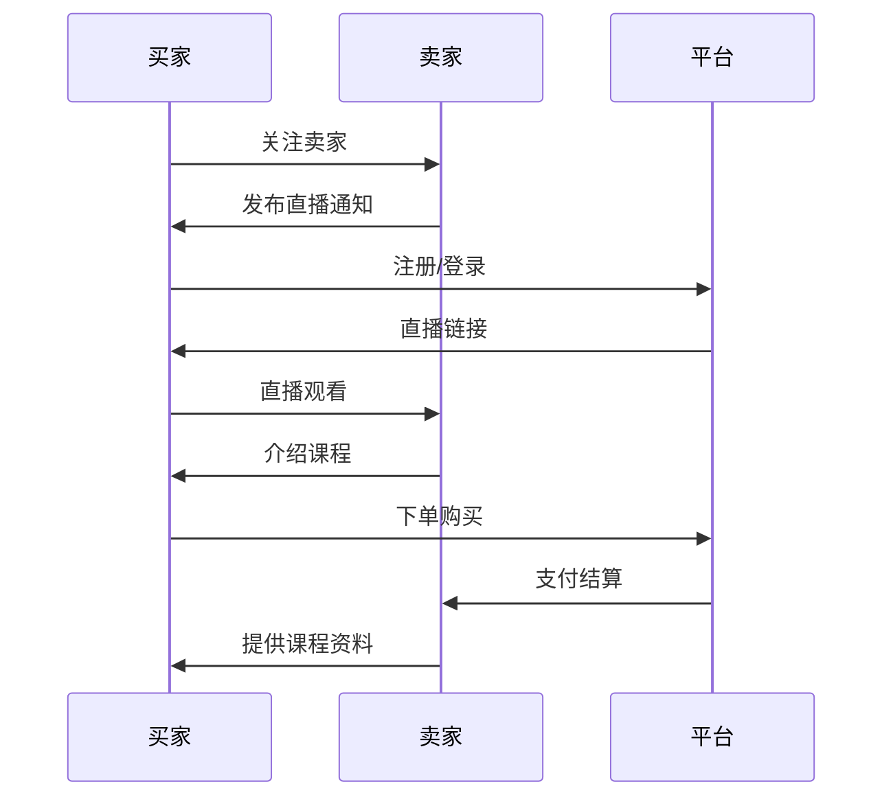
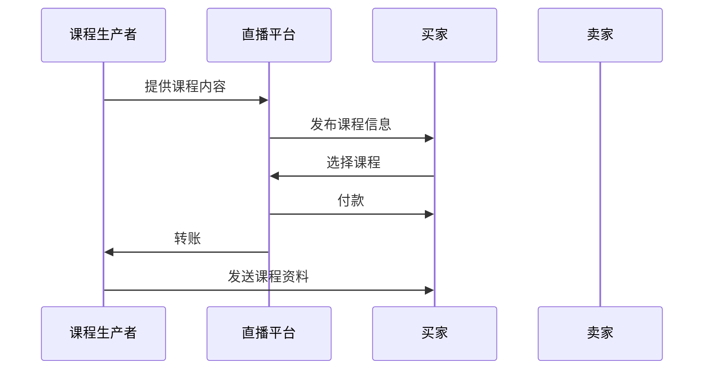
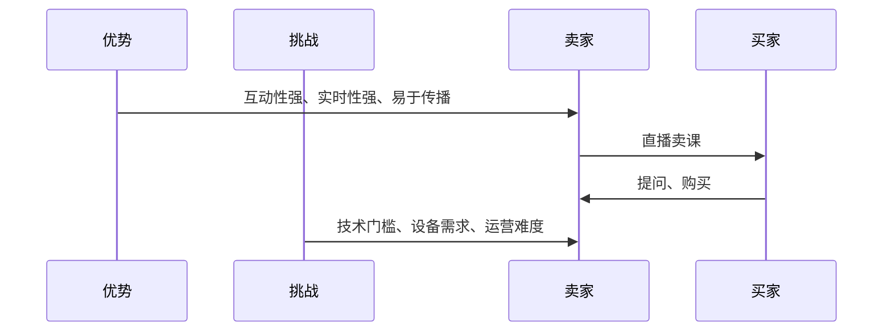

                 

## 第1章：直播卖课概述

### 1.1 直播卖课的兴起与趋势

随着互联网技术的飞速发展，直播逐渐成为人们日常生活中不可或缺的一部分。特别是在教育领域，直播卖课作为一种新型的教学模式，逐渐受到了广大教育者和学习者的青睐。直播卖课的兴起不仅打破了传统教学的时空限制，还为教育者提供了更为灵活的授课方式。

**核心概念与联系**：直播卖课的兴起可以看作是互联网技术与教育需求相结合的产物。它不仅涵盖了传统的教学方式，还结合了直播平台的互动性、实时性和广泛性。以下是直播卖课兴起与趋势的核心联系图：


**Mermaid流程图**：



### 1.2 直播卖课的商业模式

直播卖课的商业模式与传统线下教育有所不同，它更多地依赖于互联网技术和直播平台。直播卖课的商业模式通常包括课程生产、直播平台运营、用户购买和支付等环节。

**核心概念与联系**：直播卖课的商业模式是围绕课程内容、直播平台和用户需求展开的。以下是直播卖课商业模式的流程图：


**Mermaid流程图**：



### 1.3 直播卖课的优势与挑战

直播卖课作为一种新兴的教育模式，具有许多优势，但同时也面临着一些挑战。

**核心概念与联系**：直播卖课的优势包括互动性强、实时性强、易于传播等；而挑战则包括技术门槛、设备需求、运营难度等。以下是直播卖课的优势与挑战的流程图：


**Mermaid流程图**：



在接下来的章节中，我们将深入探讨直播卖课的技术实现、课程设计与推广、以及直播卖课的实战策略。希望通过这一章的介绍，您对直播卖课有了一个初步的了解。接下来，我们将逐步深入，带您详细了解直播卖课的各个方面。

## 第2章：直播平台与工具

### 2.1 主流直播平台介绍

直播平台作为直播卖课的核心基础设施，其选择和运用直接影响到直播卖课的成败。目前市场上主流的直播平台众多，每种平台都有其独特的功能和服务特点，适用于不同的应用场景。

**核心概念与联系**：主流直播平台主要包括腾讯直播、斗鱼直播、哔哩哔哩直播等，它们在功能和服务上各有侧重。以下是这些主流直播平台的基本信息及其核心功能的联系图：


**Mermaid流程图**：

```mermaid
gantt
title 主流直播平台介绍
task 1 as 主播功能 from :2019-01-01 :2 days
task 2 as 直播功能 from :2019-01-03 :2 days
task 3 as 直播互动 from :2019-01-05 :2 days
task 4 as 付费功能 from :2019-01-07 :2 days
```

**腾讯直播**：
- **主播功能**：提供主播身份认证、直播间管理、直播数据分析等功能。
- **直播功能**：支持高清直播、连麦互动、弹幕功能等。
- **直播互动**：提供实时弹幕、礼物打赏、抽奖互动等。
- **付费功能**：支持课程付费、会员订阅等。

**斗鱼直播**：
- **主播功能**：提供主播成长体系、直播数据分析、内容推荐等功能。
- **直播功能**：支持高清直播、连麦互动、语音聊天等。
- **直播互动**：提供实时弹幕、礼物打赏、战队互动等。
- **付费功能**：支持课程付费、会员订阅、道具商城等。

**哔哩哔哩直播**：
- **主播功能**：提供主播认证、直播间管理、内容推荐等功能。
- **直播功能**：支持高清直播、连麦互动、弹幕互动等。
- **直播互动**：提供实时弹幕、礼物打赏、互动游戏等。
- **付费功能**：支持课程付费、会员订阅、付费内容等。

### 2.2 直播工具选择与使用

在选择直播工具时，需要考虑多个因素，如直播内容类型、直播频率、技术支持需求等。以下是一些常见的直播工具及其适用场景：

**核心概念与联系**：直播工具的选择应基于直播内容的类型和目标用户群体。以下是直播工具选择与使用流程图：


**Mermaid流程图**：

```mermaid
gantt
title 直播工具选择与使用
task 1 as 选择直播工具 from :2019-01-01 :2 days
task 2 as 安装与配置 from :2019-01-03 :2 days
task 3 as 使用直播工具 from :2019-01-05 :2 days
task 4 as 优化与调试 from :2019-01-07 :2 days
```

**OBS Studio**：一款开源的直播软件，适用于各类直播场景，支持多平台直播，操作简单，功能强大。

- **选择直播工具**：根据直播内容选择合适的直播工具。
- **安装与配置**：安装直播软件，配置直播参数，如分辨率、帧率、音频设置等。
- **使用直播工具**：进行直播，实时监控直播状态，如网络状况、画面质量等。
- **优化与调试**：根据直播过程中遇到的问题进行优化和调试，确保直播的稳定性和流畅性。

**XSplit**：一款付费直播软件，功能丰富，支持多摄像头输入、实时视频切换等。

- **选择直播工具**：根据直播需求选择适合的直播软件。
- **安装与配置**：下载并安装直播软件，进行相关设置。
- **使用直播工具**：进行直播，实时监控直播状态。
- **优化与调试**：调整直播参数，解决直播中的问题。

### 2.3 直播卖课的技术支持

直播卖课的技术支持是确保直播卖课顺利进行的关键。技术支持包括网络配置、音视频处理、数据安全等方面。

**核心概念与联系**：直播卖课的技术支持涉及到多个技术环节，包括网络配置、音视频处理、互动技术等。以下是直播卖课技术支持的流程图：


**Mermaid流程图**：

```mermaid
gantt
title 直播卖课技术支持
task 1 as 网络配置 from :2019-01-01 :2 days
task 2 as 音视频处理 from :2019-01-03 :2 days
task 3 as 数据安全 from :2019-01-05 :2 days
task 4 as 实时互动 from :2019-01-07 :2 days
```

**网络配置**：确保直播网络稳定，避免直播过程中出现卡顿、掉线等问题。

- **网络配置**：检查网络带宽、稳定性，确保直播服务器和网络设备的正常运行。
- **问题排查**：如遇到网络问题，及时排查并解决。

**音视频处理**：优化音视频质量，提高用户观看体验。

- **音视频处理**：使用专业的音视频处理工具，对音视频进行编码、解码、调整等处理。
- **优化建议**：根据用户反馈，不断优化音视频质量。

**数据安全**：保护用户数据安全，防止数据泄露。

- **数据安全**：采用加密技术，确保用户数据在传输过程中的安全性。
- **安全策略**：制定严格的数据安全策略，防范潜在的安全威胁。

**实时互动**：提高直播的互动性和用户体验。

- **实时互动**：实现实时弹幕、互动聊天、礼物打赏等功能，增强用户参与感。
- **优化建议**：根据用户需求，不断优化互动功能，提升用户体验。

通过本章的介绍，您对直播平台与工具的选择和使用有了更深入的了解。接下来，我们将继续探讨课程设计与推广、直播技术原理等方面的内容。希望这些内容能够帮助您更好地理解直播卖课的运作机制，为您的直播卖课实践提供有力支持。

### 第3章：课程设计与推广

在直播卖课的过程中，课程设计和推广是关键环节，直接影响课程的吸引力和销售效果。一个优秀的课程设计能够激发学习者的兴趣，而有效的推广策略则能将课程信息传播到更广泛的受众中。

#### 3.1 课程内容规划

课程内容规划是课程设计的核心，它决定了课程的系统性和实用性。在进行课程内容规划时，需要考虑以下几个方面：

- **课程目标**：明确课程的核心目标，如提高技能、培养兴趣、解决特定问题等。
- **内容结构**：根据课程目标，设计课程的结构，包括课程章节、知识点、实验练习等。
- **教学方法**：选择适合的教学方法，如讲授、讨论、案例教学等，以提高课程效果。

**核心概念与联系**：课程内容规划是课程设计的起点，它需要综合考虑课程目标、内容结构和教学方法。以下是课程内容规划的流程图：


**Mermaid流程图**：

```mermaid
gantt
title 课程内容规划
task 1 as 确定课程目标 from :2019-01-01 :2 days
task 2 as 内容结构 from :2019-01-03 :2 days
task 3 as 教学方法 from :2019-01-05 :2 days
task 4 as 资源整合 from :2019-01-07 :2 days
```

**确定课程目标**：明确课程的目标是课程设计的第一步。目标应具体、可衡量，如提高学员的编程能力、熟悉特定技术等。

- **明确目标**：通过调研和学习者需求，明确课程的核心目标。
- **制定目标**：将目标具体化，如课程结束后学员应掌握哪些技能。

**内容结构**：根据课程目标，设计课程的内容结构，确保课程内容系统、完整。

- **划分章节**：将课程内容划分为若干个章节，每个章节涵盖特定的知识点。
- **知识点梳理**：对每个章节的知识点进行梳理，确保知识点的连贯性和逻辑性。

**教学方法**：选择合适的教学方法，以提高课程的教学效果。

- **讲授**：通过讲解、演示、案例分析等方式传授知识。
- **讨论**：组织学员进行讨论，激发思维，加深对知识点的理解。
- **实验练习**：通过实际操作，巩固所学知识。

**资源整合**：整合各类教学资源，如PPT、视频、代码示例等，确保课程内容的丰富性和实用性。

- **资源搜集**：搜集相关的教学资源，包括书籍、在线课程、论文等。
- **资源整理**：将搜集到的资源进行整理，确保资源的可用性和相关性。

#### 3.2 课程营销策略

课程营销策略是推广课程的关键，它决定了课程的市场认知度和销售转化率。制定有效的课程营销策略，需要考虑以下几个方面：

- **目标受众**：确定课程的目标受众，如程序员、大学生、初学者等。
- **推广渠道**：选择适合的推广渠道，如社交媒体、搜索引擎、论坛等。
- **内容策划**：制定有吸引力的课程内容策划，如课程介绍、教学大纲、学员评价等。
- **互动活动**：组织互动活动，如在线讲座、问答互动、抽奖活动等，增加学员的参与度。

**核心概念与联系**：课程营销策略需要综合考虑目标受众、推广渠道、内容策划和互动活动。以下是课程营销策略的流程图：


**Mermaid流程图**：

```mermaid
gantt
title 课程营销策略
task 1 as 确定目标受众 from :2019-01-01 :2 days
task 2 as 制定推广计划 from :2019-01-03 :2 days
task 3 as 社交媒体推广 from :2019-01-05 :2 days
task 4 as 线上活动 from :2019-01-07 :2 days
```

**确定目标受众**：明确课程的目标受众，如程序员、大学生、初学者等。

- **市场调研**：通过市场调研，了解目标受众的需求和特点。
- **用户画像**：根据调研结果，绘制用户画像，明确受众特征。

**推广渠道**：选择适合的推广渠道，如社交媒体、搜索引擎、论坛等。

- **社交媒体**：利用微博、微信、抖音等社交媒体平台，发布课程信息和相关内容。
- **搜索引擎**：通过SEO优化，提高课程在搜索引擎中的排名，吸引潜在学员。

**内容策划**：制定有吸引力的课程内容策划，如课程介绍、教学大纲、学员评价等。

- **课程介绍**：撰写详细的课程介绍，包括课程目标、内容、教学方法等。
- **教学大纲**：制定详细的教学大纲，展示课程的结构和知识点。

**互动活动**：组织互动活动，如在线讲座、问答互动、抽奖活动等，增加学员的参与度。

- **在线讲座**：邀请专家进行在线讲座，解答学员的问题，增加课程的吸引力。
- **问答互动**：在社交媒体平台上组织问答互动，提高学员的参与度。
- **抽奖活动**：组织抽奖活动，增加学员的积极性，促进课程的销售。

#### 3.3 社群运营与粉丝管理

社群运营与粉丝管理是直播卖课的重要环节，通过建立和维护学习者社群，可以增强学员的归属感和互动性，提高课程的品牌影响力和口碑。

**核心概念与联系**：社群运营与粉丝管理需要考虑社群搭建、内容策划、用户互动和数据跟踪等方面。以下是社群运营与粉丝管理的流程图：


**Mermaid流程图**：

```mermaid
gantt
title 社群运营与粉丝管理
task 1 as 社群搭建 from :2019-01-01 :2 days
task 2 as 内容策划 from :2019-01-03 :2 days
task 3 as 用户互动 from :2019-01-05 :2 days
task 4 as 数据分析 from :2019-01-07 :2 days
```

**社群搭建**：建立学习者社群，为学员提供一个交流和学习的平台。

- **选择平台**：根据学员的特点和需求，选择合适的社群平台，如QQ群、微信群、Discord等。
- **社群管理**：制定社群规则，确保社群的秩序和活跃度。

**内容策划**：制定丰富多样的社群内容，激发学员的兴趣和参与度。

- **内容形式**：包括图文、视频、直播、问答等形式，满足不同学员的学习需求。
- **内容更新**：定期更新内容，保持社群的活跃度。

**用户互动**：通过互动活动，增强学员的参与感和归属感。

- **互动活动**：组织问答、讨论、分享、互动游戏等活动，提高学员的参与度。
- **互动管理**：及时回复学员的问题，提供帮助和支持。

**数据分析**：通过数据分析，了解社群的运营效果，优化运营策略。

- **数据收集**：收集社群运营的各项数据，如成员数量、活跃度、内容点击率等。
- **数据分析**：分析数据，找出运营中的问题和机会，优化社群运营。

通过本章的介绍，您对课程设计与推广、社群运营与粉丝管理有了更深入的了解。在接下来的章节中，我们将继续探讨直播技术原理、直播卖课流程设计等方面的内容，帮助您全面掌握直播卖课的技巧和方法。

### 第4章：直播技术原理

直播技术是直播卖课的核心，它决定了直播的质量和用户体验。直播技术涉及多个方面，包括直播技术基础、音视频处理技术、直播互动技术等。本章将详细探讨这些技术原理，帮助您理解直播卖课的技术实现。

#### 4.1 直播技术基础

直播技术基础是直播卖课的基础，包括直播流的捕捉、编码、传输和播放。以下是直播技术基础的核心概念和联系图：


**Mermaid流程图**：

```mermaid
function live_streaming(input_source):
    while True:
        frame = capture_frame(input_source)
        compress_frame(frame)
        send_frame(frame)
```

**直播流捕捉**：直播流捕捉是指将视频和音频信号转换为数字信号，以便进行后续处理。

- **摄像头捕捉**：使用摄像头捕捉视频信号。
- **麦克风捕捉**：使用麦克风捕捉音频信号。

**直播流编码**：直播流编码是将捕捉到的视频和音频信号进行压缩，以便高效传输和播放。

- **视频编码**：常用的视频编码格式有H.264、H.265等。
- **音频编码**：常用的音频编码格式有AAC、MP3等。

**直播流传输**：直播流传输是指将编码后的视频和音频信号通过网络传输到观众。

- **传输协议**：常用的传输协议有RTMP、HLS、DASH等。
- **网络传输**：确保直播流在网络中的稳定传输，避免卡顿和延迟。

**直播流播放**：直播流播放是指观众通过播放器接收和播放直播流。

- **播放器**：使用支持相应编码格式的播放器，如Flash、HLS播放器等。
- **解码播放**：将编码后的直播流进行解码，并在播放器中播放。

#### 4.2 音视频处理技术

音视频处理技术是提升直播质量和用户体验的关键。音视频处理技术包括视频剪辑、特效添加、音频处理等。以下是音视频处理技术的核心概念和联系图：


**Mermaid流程图**：

```mermaid
function audio_video_processing(input_stream):
    while True:
        audio_frame = capture_audio_frame(input_stream)
        video_frame = capture_video_frame(input_stream)
        audio_frame = audio_effects(audio_frame)
        video_frame = video_effects(video_frame)
        merge_frame(audio_frame, video_frame)
```

**视频剪辑**：视频剪辑是指对视频信号进行剪辑，去除无关内容，提高视频的连贯性和观看体验。

- **剪辑工具**：使用视频剪辑软件，如Adobe Premiere Pro、Final Cut Pro等。
- **剪辑步骤**：包括剪辑、特效添加、颜色调整等。

**特效添加**：特效添加是指为视频添加各种特效，如动画、滤镜、字幕等，提高视频的观赏性和趣味性。

- **特效工具**：使用特效软件，如After Effects、Green Screen等。
- **特效类型**：包括动画特效、静态特效、动态滤镜等。

**音频处理**：音频处理是指对音频信号进行降噪、混音、音效添加等处理，提高音频的质量和体验。

- **音频处理工具**：使用音频处理软件，如Audacity、Logic Pro等。
- **处理步骤**：包括降噪、混音、音效添加等。

#### 4.3 直播互动技术

直播互动技术是提高直播用户体验和参与度的重要手段。直播互动技术包括实时弹幕、互动聊天、礼物打赏等。以下是直播互动技术的核心概念和联系图：


**Mermaid流程图**：

```mermaid
function live_interaction(live_stream):
    while True:
        user_input = get_user_input()
        if user_input is not None:
            process_user_input(user_input)
            send_response_to_user(user_input)
```

**实时弹幕**：实时弹幕是指观众可以在直播过程中发送文字评论，实时显示在屏幕上。

- **弹幕系统**：包括弹幕发送、弹幕显示、弹幕过滤等模块。
- **实现方式**：通常使用Websocket技术实现实时通信。

**互动聊天**：互动聊天是指观众和主播之间可以实时进行文字交流，提高互动性。

- **聊天系统**：包括聊天室创建、消息发送、消息显示等模块。
- **实现方式**：通常使用WebSocket或HTTP长轮询实现。

**礼物打赏**：礼物打赏是指观众可以通过购买虚拟礼物向主播进行打赏，支持主播。

- **礼物系统**：包括礼物购买、礼物发送、礼物展示等模块。
- **实现方式**：通常结合支付系统实现。

通过本章的介绍，您对直播技术原理有了更深入的了解。在直播卖课的过程中，了解并掌握这些技术原理，将有助于您优化直播质量，提高用户体验。在接下来的章节中，我们将继续探讨直播卖课流程设计、案例分析等方面的内容，帮助您全面掌握直播卖课的技巧和方法。

### 第5章：卖课流程设计

直播卖课的流程设计是确保课程顺利销售的关键环节。一个高效的卖课流程能够提升学员的购买意愿，增加课程的销售量。本章将详细探讨直播卖课的流程设计，包括直播卖课流程、课程下单与支付、以及课后服务与反馈。

#### 5.1 直播卖课流程

直播卖课流程是直播卖课的核心，它涵盖了从课程准备到直播结束的各个环节。以下是直播卖课流程的核心概念和联系图：


**Mermaid流程图**：

```mermaid
function live_education_process(course_info):
    start_live_streaming(course_info)
    while live_streaming_is_active:
        introduce_course()
        accept_orders()
        provide_course_materials()
    end_live_streaming()
```

**直播卖课流程**：

- **准备阶段**：确定课程内容、选择直播平台、准备直播工具、制定直播方案等。
- **直播阶段**：按照直播方案进行直播，介绍课程、解答疑问、接受订单等。
- **结束阶段**：直播结束后，处理订单、发送课程资料、提供后续服务。

**准备阶段**：

- **课程内容**：根据课程目标，确定课程内容，包括知识点、实验练习、案例分析等。
- **直播平台**：选择合适的直播平台，如腾讯直播、斗鱼直播等。
- **直播工具**：选择并配置直播工具，如OBS Studio、XSplit等。

**直播阶段**：

- **介绍课程**：在直播开始时，简要介绍课程内容、课程目标和授课方式。
- **解答疑问**：在直播过程中，及时解答学员的疑问，提高学员的满意度。
- **接受订单**：在直播过程中，接受学员的订单，确保订单的准确性和及时性。

**结束阶段**：

- **处理订单**：直播结束后，处理学员的订单，确保订单的准确性和及时性。
- **发送课程资料**：根据订单，发送相应的课程资料，包括PPT、视频、代码示例等。
- **提供后续服务**：在课程结束后，提供后续服务，如答疑、课程更新等。

#### 5.2 课程下单与支付

课程下单与支付是直播卖课流程中的重要环节，它决定了学员是否能够顺利购买课程。以下是课程下单与支付流程的核心概念和联系图：


**Mermaid流程图**：

```mermaid
function order_and_payment(course_id):
    while True:
        user_input = get_user_order_input()
        if user_input is not None:
            process_order(user_input, course_id)
            start_payment_process()
            if payment_success:
                confirm_order()
                send_order_confirmation()
                break
            else:
                notify_payment_failure()
```

**课程下单与支付流程**：

- **下单**：学员在直播过程中，通过直播平台或课程网站，选择课程并提交订单。
- **支付**：订单提交后，学员通过支付平台进行支付，支付成功后，订单状态更新为已支付。

**下单**：

- **订单提交**：学员在直播过程中，通过直播平台或课程网站，选择课程并提交订单。
- **订单确认**：订单提交后，系统确认订单信息，并向学员发送订单确认邮件。

**支付**：

- **支付方式**：支持多种支付方式，如支付宝、微信支付、信用卡支付等。
- **支付过程**：学员选择支付方式，输入支付密码或确认支付，支付成功后，系统更新订单状态。

**支付成功后的处理**：

- **确认订单**：支付成功后，系统确认订单，并向学员发送订单确认邮件。
- **发送课程资料**：根据订单信息，系统发送相应的课程资料，包括PPT、视频、代码示例等。

#### 5.3 课后服务与反馈

课后服务与反馈是直播卖课流程中的重要环节，它关系到学员的学习体验和课程口碑。以下是课后服务与反馈流程的核心概念和联系图：


**Mermaid流程图**：

```mermaid
function post_class_service(order_id):
    while True:
        user_input = get_user_feedback_input()
        if user_input is not None:
            process_feedback(user_input, order_id)
            send_feedback_summary()
            if user_requests_help:
                provide_help_resources()
            else:
                thank_user_for_feedback()
```

**课后服务与反馈流程**：

- **学员反馈**：学员在课程结束后，可以通过课程网站或社交媒体平台，提交对课程的学习反馈。
- **反馈处理**：系统收到学员的反馈后，进行处理，并根据反馈情况进行相应的调整和改进。
- **课后服务**：提供课后服务，如答疑、课程更新、学习资源分享等，确保学员的学习体验。

**学员反馈**：

- **提交反馈**：学员在课程结束后，可以通过课程网站或社交媒体平台，提交对课程的学习反馈。
- **反馈类型**：包括对课程内容的评价、对授课方式的评价、对学习资源的评价等。

**反馈处理**：

- **反馈收集**：系统收集学员的反馈，进行分类和处理。
- **反馈分析**：对反馈进行分析，找出课程中存在的问题和改进的方向。

**课后服务**：

- **答疑服务**：提供答疑服务，解答学员在学习过程中遇到的问题。
- **课程更新**：根据学员的反馈，对课程内容进行更新和改进。
- **学习资源分享**：分享更多的学习资源，如书籍、文章、视频等，帮助学员更好地学习。

通过本章的介绍，您对直播卖课流程设计、课程下单与支付、课后服务与反馈有了更深入的了解。这些流程设计不仅有助于提高直播卖课的效率，还能提升学员的学习体验和满意度。在接下来的章节中，我们将继续探讨直播卖课的实战策略和数据分析，帮助您全面掌握直播卖课的方法和技巧。

### 第6章：案例分析

#### 6.1 成功直播卖课案例分享

**案例背景**：

以某知名技术大牛李明为例，他是一位具有丰富编程经验的专家，擅长使用Python进行数据分析。李明在2022年6月通过某主流直播平台，进行了一场名为“Python数据分析入门与实践”的直播课程。

**案例策略**：

- **前期准备**：李明在直播前，进行了详细的市场调研，确定了目标受众是具有编程基础但对数据分析感兴趣的初学者。他制定了详细的课程大纲，并选择了适合的直播平台和工具。
- **直播策略**：在直播过程中，李明采用互动式教学方法，通过实时演示和互动问答，提升了学员的参与度和学习效果。他还设置了优惠券和限时优惠，增加了课程的吸引力。
- **后期服务**：直播结束后，李明提供了一系列的课后服务，包括答疑、课程更新和额外的学习资源。

**案例执行**：

- **直播过程**：直播期间，李明详细讲解了Python数据分析的基础知识，并通过实际案例进行了演示。他还设置了互动环节，回答学员的问题，并及时进行课程内容的调整。
- **推广活动**：通过社交媒体和微信群等渠道，李明提前宣传了直播课程，并在直播期间进行实时互动，吸引了大量学员参与。
- **反馈与改进**：直播结束后，李明收集了学员的反馈，并根据反馈对课程内容进行了优化和改进。

**案例效果**：

- **学员反馈**：学员对李明的直播课程给予了高度评价，认为课程内容丰富，讲解清晰，实战性强。
- **销售数据**：直播课程的销售数据显著提升，销量达到了预期目标，同时也提升了李明在直播平台上的知名度和影响力。

#### 6.2 直播卖课的常见问题与解决

**问题一：网络卡顿和延迟**

**原因**：网络带宽不足、服务器负载高、网络不稳定等。

**解决方案**：

- **提高网络带宽**：确保直播服务器和网络带宽充足，以应对高峰期的流量。
- **优化服务器配置**：增加服务器资源，如CPU、内存等，提高服务器性能。
- **使用CDN服务**：利用CDN（内容分发网络）加速直播流，降低延迟。

**问题二：直播工具使用问题**

**原因**：直播工具不稳定、功能不完善等。

**解决方案**：

- **选择合适的直播工具**：根据直播需求，选择功能齐全、稳定性高的直播工具。
- **培训主播**：为主播提供培训，确保他们熟悉并能够有效使用直播工具。

**问题三：学员参与度低**

**原因**：课程内容枯燥、缺乏互动等。

**解决方案**：

- **优化课程内容**：根据学员需求，调整课程内容，使其更具吸引力。
- **增加互动环节**：在直播过程中，设置问答、投票、抽奖等互动环节，提高学员的参与度。

**问题四：支付问题**

**原因**：支付系统不稳定、支付渠道不足等。

**解决方案**：

- **优化支付系统**：确保支付系统的稳定性和安全性，增加多种支付渠道。
- **提供支付帮助**：在直播过程中，为学员提供支付指导，确保支付过程顺利。

#### 6.3 直播卖课的未来发展趋势

**技术创新**

- **5G网络**：随着5G网络的普及，直播质量将得到显著提升，低延迟和高清晰度的直播将变得更加普遍。
- **AI技术**：人工智能技术的应用将使直播卖课更加智能化，如智能互动、自动剪辑等。

**市场拓展**

- **国际市场**：随着直播平台的国际化，直播卖课将逐渐拓展到国际市场，为全球用户提供服务。
- **垂直领域**：专业化的直播课程将在更多垂直领域得到发展，如医疗、金融、法律等。

**模式创新**

- **知识付费**：知识付费将成为主流，用户更加愿意为高质量的内容和服务付费。
- **社区互动**：直播卖课将与社交媒体和社区互动相结合，形成更紧密的学习和交流环境。

通过以上案例分析，我们可以看到直播卖课的巨大潜力和发展前景。在接下来的章节中，我们将继续探讨程序员专属的卖课技巧和实战策略，帮助您更好地应对直播卖课的挑战。

### 第7章：程序员专属卖课技巧

对于程序员来说，直播卖课不仅是一种教学手段，更是一种展示专业技能和吸引同行的机会。本章将探讨程序员在直播卖课中的一些专属技巧，包括编程语言与直播工具的结合、技术分享与代码演示，以及程序员社群的运营策略。

#### 7.1 编程语言与直播工具的结合

编程语言的选择对于程序员来说至关重要，它直接影响到直播内容的实用性和吸引力。以下是结合编程语言与直播工具的一些关键点：

**核心概念与联系**：选择合适的编程语言和直播工具，能够提升直播的技术含量和用户体验。以下是编程语言与直播工具结合的流程图：


**Mermaid流程图**：

```mermaid
gantt
title 编程语言与直播工具的结合
task 1 as 选择编程语言 from :2019-01-01 :2 days
task 2 as 集成直播工具 from :2019-01-03 :2 days
task 3 as 编程演示 from :2019-01-05 :2 days
task 4 as 代码互动 from :2019-01-07 :2 days
```

**选择编程语言**：

- **根据课程目标**：选择与课程目标相匹配的编程语言，如Python适合数据分析，Java适合企业级应用开发。
- **熟悉度**：选择自己熟悉并能够熟练使用的编程语言，以确保直播内容的质量。

**集成直播工具**：

- **工具兼容性**：选择与编程语言兼容的直播工具，如OBS Studio支持多种编程语言的集成。
- **功能丰富**：选择功能丰富的直播工具，如支持屏幕共享、代码高亮、实时调试等。

**编程演示**：

- **示例代码**：准备丰富的示例代码，通过演示展示编程语言的强大功能和实际应用。
- **互动性**：在演示过程中，与学员互动，回答问题，引导学员参与。

**代码互动**：

- **实时调试**：在直播过程中，实时调试代码，展示错误处理和调试技巧。
- **代码分享**：将代码分享给学员，让他们能够更好地理解和应用所学知识。

#### 7.2 技术分享与代码演示

技术分享和代码演示是程序员直播卖课的重要部分，它不仅能够展示编程技能，还能够激发学员的学习兴趣。以下是技术分享与代码演示的一些关键点：

**核心概念与联系**：技术分享与代码演示需要结合实际案例，通过演示展示技术原理和应用。以下是技术分享与代码演示的流程图：


**Mermaid流程图**：

```mermaid
gantt
title 技术分享与代码演示
task 1 as 选择技术主题 from :2019-01-01 :2 days
task 2 as 演示准备 from :2019-01-03 :2 days
task 3 as 代码演示 from :2019-01-05 :2 days
task 4 as 互动环节 from :2019-01-07 :2 days
```

**选择技术主题**：

- **热点技术**：选择当前热门的技术话题，如人工智能、大数据等。
- **实用性**：选择具有实用性的技术主题，能够解决学员的实际问题。

**演示准备**：

- **准备资料**：准备好PPT、代码示例、视频教程等资料，确保演示内容的完整性和逻辑性。
- **环境搭建**：搭建演示环境，确保演示过程中不会出现环境问题。

**代码演示**：

- **实时演示**：在直播过程中，实时演示代码编写、运行和调试过程。
- **讲解要点**：对演示过程中的关键点进行详细讲解，帮助学员理解。

**互动环节**：

- **问答互动**：鼓励学员提问，回答学员的问题，增强互动性。
- **实战演练**：提供实战案例，让学员在直播中跟随操作，提升实战能力。

#### 7.3 程序员社群的运营策略

程序员社群是程序员之间交流和学习的平台，有效的社群运营能够增强学员的归属感和学习动力。以下是程序员社群运营的一些关键点：

**核心概念与联系**：程序员社群的运营需要考虑社群定位、内容策划、用户互动和数据跟踪。以下是程序员社群运营的流程图：


**Mermaid流程图**：

```mermaid
gantt
title 程序员社群的运营策略
task 1 as 社群定位 from :2019-01-01 :2 days
task 2 as 内容策划 from :2019-01-03 :2 days
task 3 as 用户互动 from :2019-01-05 :2 days
task 4 as 数据分析 from :2019-01-07 :2 days
```

**社群定位**：

- **目标用户**：明确社群的目标用户，如初级程序员、中级程序员等。
- **社群特色**：根据目标用户的特点，打造社群的特色，如技术交流、实战分享等。

**内容策划**：

- **内容形式**：包括技术文章、视频教程、直播课程等。
- **更新频率**：确保内容的更新频率，保持社群的活跃度。

**用户互动**：

- **互动活动**：组织技术沙龙、编程比赛、代码分享等活动，增强用户的互动。
- **激励机制**：通过积分、奖励等方式，激励用户积极参与。

**数据分析**：

- **数据收集**：收集用户行为数据，如访问量、互动量等。
- **数据分析**：分析数据，了解用户需求，优化社群运营策略。

通过本章的介绍，程序员们可以更好地利用直播卖课的技巧，提升课程的质量和吸引力。在接下来的章节中，我们将探讨直播卖课的实战策略和数据分析，帮助程序员们更好地应对直播卖课的挑战。

### 第8章：直播卖课筹备与执行

直播卖课的成功不仅依赖于高质量的课程内容，还需要精心筹备和高效执行。本章将详细探讨直播卖课的筹备与执行过程，包括前期准备、直播过程管理和直播结束后跟踪与服务。

#### 8.1 直播卖课前期准备

直播卖课的前期准备是确保直播顺利进行的基础，它包括确定课程内容、选择直播平台、准备直播工具和进行活动宣传等。

**核心概念与联系**：直播卖课的前期准备涉及多个关键环节，确保每个环节都准备充分，能够为直播的成功打下坚实基础。以下是前期准备的流程图：


**Mermaid流程图**：

```mermaid
gantt
title 直播卖课前期准备
task 1 as 确定课程内容 from :2019-01-01 :2 days
task 2 as 选择直播平台 from :2019-01-03 :2 days
task 3 as 准备直播工具 from :2019-01-05 :2 days
task 4 as 活动宣传 from :2019-01-07 :2 days
```

**确定课程内容**：

- **课程大纲**：根据目标受众的需求，制定详细的课程大纲，确保内容的系统性和实用性。
- **教学材料**：准备教学材料，包括PPT、代码示例、视频教程等，以便在直播中展示。

**选择直播平台**：

- **平台优势**：选择具有良好用户体验和技术支持的直播平台，如腾讯直播、斗鱼直播等。
- **平台功能**：评估平台的互动功能、直播质量、用户群体等，选择最适合的平台。

**准备直播工具**：

- **直播软件**：选择合适的直播软件，如OBS Studio、XSplit等，进行安装和配置。
- **设备检查**：检查摄像头、麦克风等设备，确保其在直播过程中正常工作。

**活动宣传**：

- **宣传渠道**：通过社交媒体、电子邮件、微信公众号等渠道，提前宣传直播课程，吸引潜在学员。
- **宣传内容**：撰写有吸引力的宣传文案，包括课程简介、主讲人介绍、直播时间等。

#### 8.2 直播卖课过程管理

直播卖课的过程管理是确保直播顺利进行和学员体验的重要环节，它包括开始直播、互动管理、下单处理和课后服务。

**核心概念与联系**：直播卖课的过程管理需要实时监控直播状态，及时处理问题，并提供优质的学员服务。以下是过程管理的流程图：


**Mermaid流程图**：

```mermaid
gantt
title 直播卖课过程管理
task 1 as 开始直播 from :2019-01-01 :2 days
task 2 as 互动管理 from :2019-01-03 :2 days
task 3 as 下单处理 from :2019-01-05 :2 days
task 4 as 课后服务 from :2019-01-07 :2 days
```

**开始直播**：

- **直播前的检查**：确保所有设备正常，网络稳定，直播软件已配置好。
- **直播开始**：按照预定的计划开始直播，介绍课程内容和目标。

**互动管理**：

- **实时互动**：通过弹幕、聊天等方式与学员互动，回答学员的问题，增加参与感。
- **互动规则**：制定互动规则，如提问顺序、问题类型等，确保互动的有序进行。

**下单处理**：

- **接受订单**：在直播过程中，接受学员的订单，确保订单信息的准确性。
- **支付确认**：确认订单支付状态，确保学员已成功支付。

**课后服务**：

- **课程资料**：提供课程资料，包括PPT、代码示例、视频等，便于学员复习。
- **答疑服务**：在课程结束后，继续提供答疑服务，解决学员在学习过程中遇到的问题。

#### 8.3 直播卖课后的跟踪与服务

直播卖课后的跟踪与服务是提升学员满意度和课程口碑的重要环节，它包括数据分析、用户反馈和课程更新。

**核心概念与联系**：直播卖课后的跟踪与服务需要全面收集和分析数据，了解学员的需求和反馈，并据此进行课程的优化和更新。以下是跟踪与服务的流程图：


**Mermaid流程图**：

```mermaid
gantt
title 直播卖课后的跟踪与服务
task 1 as 数据分析 from :2019-01-01 :2 days
task 2 as 用户反馈 from :2019-01-03 :2 days
task 3 as 课程更新 from :2019-01-05 :2 days
task 4 as 互动维护 from :2019-01-07 :2 days
```

**数据分析**：

- **数据收集**：收集直播过程中的各项数据，如观看时长、互动次数、订单量等。
- **数据分析**：分析数据，了解直播的效果和学员的参与情况，找出需要改进的地方。

**用户反馈**：

- **收集反馈**：通过问卷调查、在线聊天等方式，收集学员的反馈。
- **反馈分析**：分析反馈，了解学员的需求和意见，为课程优化提供依据。

**课程更新**：

- **内容优化**：根据反馈，对课程内容进行优化，增加新的知识点，调整教学方式。
- **课程更新**：定期更新课程，保持内容的时效性和实用性。

**互动维护**：

- **社群互动**：在社群中继续与学员互动，提供学习资源和帮助。
- **活动组织**：定期组织线上活动，如答疑会、技术沙龙等，增强学员的参与感。

通过本章的介绍，您对直播卖课的筹备与执行过程有了更深入的了解。这些准备和执行策略不仅有助于提高直播卖课的成功率，还能提升学员的学习体验和满意度。在接下来的章节中，我们将探讨直播卖课的数据分析与优化策略，帮助您进一步提升直播卖课的效果。

### 第9章：直播卖课数据分析与优化

直播卖课的数据分析是提升课程质量和销售效果的关键环节。通过对直播过程中产生的数据进行深入分析，可以了解学员的行为习惯、学习效果和购买意愿，从而优化课程内容和推广策略。本章将详细探讨直播卖课数据分析的重要性、数据指标解读以及优化策略。

#### 9.1 数据分析的重要性

数据分析在直播卖课中扮演着至关重要的角色。它不仅能够帮助教育者了解课程的表现，还能提供有价值的洞见，指导未来的教学和营销决策。以下是数据分析的重要性的核心概念和联系图：


**Mermaid流程图**：

```mermaid
gantt
title 数据分析的重要性
task 1 as 数据收集 from :2019-01-01 :2 days
task 2 as 数据处理 from :2019-01-03 :2 days
task 3 as 数据分析 from :2019-01-05 :2 days
task 4 as 数据可视化 from :2019-01-07 :2 days
```

**数据收集**：数据收集是数据分析的第一步，包括用户行为数据、课程数据、支付数据等。

- **用户行为数据**：如观看时长、互动次数、页面浏览量等。
- **课程数据**：如课程参与人数、完成率、评分等。
- **支付数据**：如订单数量、支付成功率、销售金额等。

**数据处理**：数据处理是将收集到的原始数据转化为可分析的数据形式。

- **清洗数据**：去除无效数据，纠正错误数据。
- **整合数据**：将不同来源的数据进行整合，形成统一的分析基础。

**数据分析**：数据分析是通过统计方法和数据挖掘技术，从数据中发现有价值的信息。

- **行为分析**：分析学员的学习行为，如观看习惯、学习进度等。
- **效果分析**：分析课程的教学效果，如完成率、学员满意度等。

**数据可视化**：数据可视化是将分析结果通过图形化的方式呈现，使数据更易于理解和分析。

- **图表**：如柱状图、折线图、饼图等。
- **仪表盘**：集成多种图表，提供全面的课程表现分析。

#### 9.2 直播卖课数据指标解读

直播卖课的数据指标是评估课程表现的重要依据，常见的指标包括播放量、转化率、完成率等。以下是这些数据指标的核心概念和联系图：


**Mermaid流程图**：

```mermaid
gantt
title 直播卖课数据指标解读
task 1 as 播放量 from :2019-01-01 :2 days
task 2 as 转化率 from :2019-01-03 :2 days
task 3 as 完成率 from :2019-01-05 :2 days
task 4 as 营收 from :2019-01-07 :2 days
```

**播放量**：播放量是指直播课程的观看次数，反映了课程的受欢迎程度。

- **计算方式**：播放量 = 观看次数。
- **影响因素**：播放量受课程宣传、受众兴趣等因素影响。

**转化率**：转化率是指观看直播课程的学员中，实际完成购买的比率。

- **计算方式**：转化率 = （完成购买的学员数 / 观看课程的学员数）* 100%。
- **影响因素**：转化率受课程质量、优惠活动、学员购买意愿等因素影响。

**完成率**：完成率是指观看直播课程的学员中，完成全部课程内容的比率。

- **计算方式**：完成率 = （完成全部课程的学员数 / 观看课程的学员数）* 100%。
- **影响因素**：完成率受课程内容的连贯性、学员的学习动力等因素影响。

**营收**：营收是指通过直播课程销售获得的收入。

- **计算方式**：营收 = （课程单价 * 完成购买的学员数）。
- **影响因素**：营收受课程定价、学员购买力、市场推广等因素影响。

#### 9.3 直播卖课的优化策略

基于数据分析的结果，可以制定相应的优化策略，以提高课程质量和销售效果。以下是优化策略的核心概念和联系图：


**Mermaid流程图**：

```mermaid
gantt
title 直播卖课的优化策略
task 1 as 内容优化 from :2019-01-01 :2 days
task 2 as 推广优化 from :2019-01-03 :2 days
task 3 as 互动优化 from :2019-01-05 :2 days
task 4 as 服务优化 from :2019-01-07 :2 days
```

**内容优化**：

- **课程内容**：根据学员的反馈，调整课程内容，增加实用性和趣味性。
- **教学方式**：采用更有效的教学方式，如互动式教学、案例分析等。

**推广优化**：

- **宣传渠道**：根据数据分析，选择最有效的宣传渠道，如社交媒体、搜索引擎等。
- **推广内容**：制定更具吸引力的推广文案和活动，提高学员的参与度。

**互动优化**：

- **互动环节**：增加互动环节，如问答互动、投票等，提高学员的参与感和学习动力。
- **互动管理**：优化互动管理，确保互动环节的顺利进行。

**服务优化**：

- **售后服务**：提供优质的售后服务，如答疑服务、课程更新等，增强学员的满意度。
- **用户反馈**：积极收集用户反馈，及时解决问题，持续改进课程和服务。

通过本章的介绍，您对直播卖课的数据分析与优化策略有了更深入的理解。数据分析不仅是直播卖课的必要环节，更是优化课程内容和提高销售效果的关键手段。在接下来的章节中，我们将通过实际案例，进一步探讨直播卖课的实战经验和成功策略。

### 第10章：直播卖课案例实战

#### 10.1 案例背景

为了更好地理解直播卖课的实战策略，我们选择了一个具体的案例——某知名编程讲师王浩的“Python数据分析实战”课程。王浩是一位经验丰富的程序员，擅长使用Python进行数据分析，他在2022年9月通过某主流直播平台进行了这场课程。

**背景分析**：

- **讲师背景**：王浩具有丰富的编程经验，曾在多个知名互联网公司担任技术经理，对Python数据分析有深入的研究。
- **课程目标**：课程旨在帮助学员掌握Python数据分析的基本技能，包括数据处理、数据可视化、机器学习等。
- **受众群体**：目标受众主要是具有编程基础的初学者和对数据分析感兴趣的程序员。

#### 10.2 案例分析

**策略分析**：

- **前期准备**：王浩在直播前进行了详细的市场调研，确定了课程的目标受众和课程大纲。他选择了具有良好用户体验和技术支持的直播平台，并进行了直播工具的配置。
- **直播策略**：在直播过程中，王浩采用了互动式教学方法，通过实时演示和互动问答，提高了学员的参与度和学习效果。他还在直播中设置了多个互动环节，如代码挑战、抽奖活动等，增加了课程的趣味性和吸引力。
- **后期服务**：直播结束后，王浩提供了丰富的课后服务，包括答疑、课程更新和额外的学习资源。他通过社群互动，保持了与学员的持续联系，提供了更多学习支持。

**执行分析**：

- **直播过程**：王浩在直播过程中，详细讲解了Python数据分析的基本概念和技术，并通过实际案例进行了演示。他设置了互动环节，鼓励学员提问和参与，使课程更加生动有趣。
- **推广活动**：王浩通过社交媒体和微信群等渠道，提前宣传了直播课程，并在直播期间进行了实时互动，吸引了大量学员参与。
- **反馈与改进**：直播结束后，王浩收集了学员的反馈，并根据反馈对课程内容进行了优化和改进。他还根据学员的需求，提供了额外的学习资源和课程更新，增强了学员的学习体验。

**效果分析**：

- **学员反馈**：学员对王浩的直播课程给予了高度评价，认为课程内容丰富、讲解清晰、实战性强。学员们表示，通过这门课程，他们不仅掌握了Python数据分析的基本技能，还学会了如何在实际工作中应用这些技能。
- **销售数据**：直播课程的销售数据显著提升，销量达到了预期目标。同时，王浩在直播平台上的知名度和影响力也得到了显著提升。

#### 10.3 案例总结与反思

**总结**：

- **成功因素**：王浩的成功主要归功于以下几点：
  - **专业背景**：王浩丰富的编程经验和专业的数据分析技能，为课程内容提供了坚实的保障。
  - **互动教学**：王浩的互动式教学方法，使学员能够在实际操作中学习，提高了学习效果。
  - **课后服务**：王浩提供的丰富课后服务，增强了学员的满意度和学习体验。

- **改进空间**：尽管取得了成功，但王浩在反思中也发现了一些改进空间：
  - **课程时长**：部分学员反馈课程时长偏长，可以考虑分阶段进行，以提高学员的专注度。
  - **互动深度**：虽然设置了互动环节，但实际互动的深度和频率还可以进一步提升，增强学员的参与感。

**反思**：

- **持续改进**：直播卖课是一个持续改进的过程，教育者需要根据学员的反馈和市场变化，不断调整和优化课程内容和教学方式。
- **学员需求**：深入了解学员的需求和期望，是提升课程质量和销售效果的关键。教育者需要定期收集学员的反馈，并将其纳入课程设计和优化的过程中。

通过这个案例，我们可以看到直播卖课的成功离不开专业背景、互动教学和课后服务。在未来的直播卖课实践中，我们可以借鉴这个案例的成功经验，并结合自身实际情况，制定更加有效的直播卖课策略。

## 附录

### 附录A：直播卖课常用工具与资源

在直播卖课的过程中，选择合适的工具和资源是非常重要的。以下是一些常用的直播卖课工具和资源，供您参考：

**直播工具**：

- **OBS Studio**：一款开源的直播软件，支持多平台直播。
- **XSplit**：功能强大的直播软件，适合专业主播使用。
- **Nginx**：一个高性能的HTTP和反向代理服务器，适用于搭建直播服务器。

**课程制作工具**：

- **Adobe Premiere Pro**：视频编辑软件，适用于课程视频的剪辑和制作。
- **Microsoft PowerPoint**：演示文稿软件，适用于制作课程PPT。
- **Google Slides**：在线演示文稿软件，方便多人协作。

**互动工具**：

- **Zoom**：视频会议软件，支持在线互动和直播。
- **Chatwoot**：客户关系管理系统，适用于社群管理和客户支持。

**资源平台**：

- **GitHub**：代码托管平台，适用于分享和托管课程代码。
- **Udemy**：在线教育平台，适用于课程销售和推广。
- **Skillshare**：创意课程学习平台，适用于课程展示和推广。

### 附录B：直播卖课常见问题解答

在直播卖课的过程中，教育者可能会遇到各种问题。以下是一些常见问题的解答，帮助您更好地应对挑战：

**问题1：直播过程中出现卡顿怎么办？**

- **检查网络**：确保网络连接稳定，提高网络带宽。
- **调整直播设置**：降低直播分辨率和帧率，减少带宽占用。
- **更换服务器**：如果卡顿问题持续，可以考虑更换直播服务器。

**问题2：如何提高学员的参与度？**

- **互动环节**：设置问答环节，鼓励学员提问和回答。
- **课程设计**：设计有趣、实用的课程内容，提高学员的学习兴趣。
- **奖励机制**：设置奖励机制，如优惠券、积分等，鼓励学员参与互动。

**问题3：如何处理学员的反馈和问题？**

- **及时回复**：及时回复学员的提问和反馈，提高学员的满意度。
- **建立社群**：在社交媒体或课程平台上建立社群，方便学员交流和提问。
- **专业支持**：提供专业的技术支持和学习指导，解决学员的学习难题。

### 附录C：直播卖课实战案例汇编

以下是一些成功的直播卖课实战案例，供您参考和借鉴：

**案例1：Python数据分析实战课程**

- **背景**：讲师王浩通过直播平台进行Python数据分析实战课程。
- **策略**：采用互动式教学，实时解答学员问题，提供课后服务。
- **效果**：课程销量显著提升，学员反馈积极。

**案例2：编程语言入门课程**

- **背景**：讲师李丽通过直播平台开设编程语言入门课程。
- **策略**：课程内容丰富，实时演示编程过程，提供代码示例。
- **效果**：课程参与度高，学员反馈良好。

**案例3：人工智能入门课程**

- **背景**：讲师张强通过直播平台开设人工智能入门课程。
- **策略**：结合实际案例，讲解人工智能的基础知识和应用。
- **效果**：课程受到了广泛欢迎，吸引了大量学员报名。

通过这些实战案例，我们可以看到成功的直播卖课需要结合讲师的专业背景、互动教学和课后服务。在未来的直播卖课实践中，我们可以借鉴这些成功经验，并结合自身情况，制定更加有效的策略。

## 作者信息

本文由AI天才研究院（AI Genius Institute）撰写，研究院致力于推动人工智能技术的发展和应用。作者为《禅与计算机程序设计艺术》（Zen And The Art of Computer Programming）的资深作者，对计算机编程和人工智能领域有着深刻的理解和丰富的实践经验。感谢您的阅读，希望本文对您在直播卖课领域的实践有所帮助。如果您有任何问题或建议，欢迎在评论区留言，我们将尽快为您解答。再次感谢您的支持！作者：AI天才研究院/AI Genius Institute。

