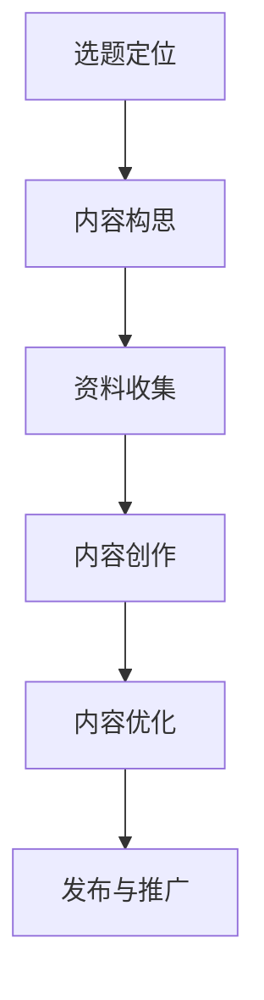
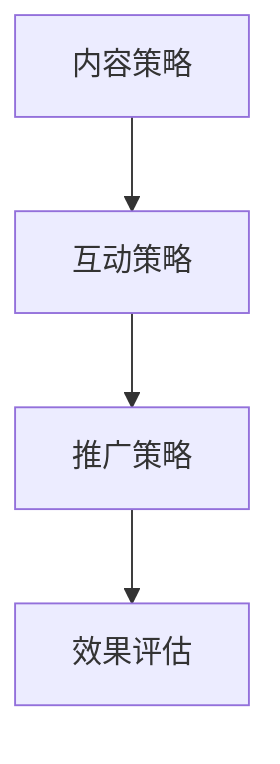
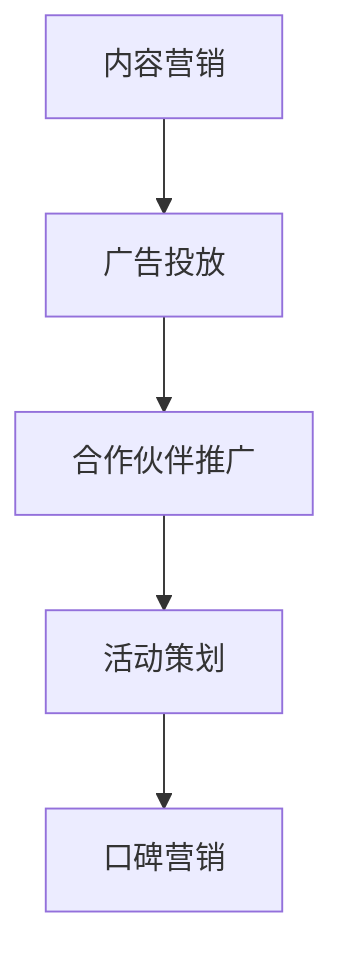

                 

### 《如何利用知识付费打造个人IP》

#### 关键词：知识付费，个人IP，内容创作，社交媒体运营，产品推广，案例分析

> **摘要：**
本文旨在探讨如何利用知识付费这一新兴模式，构建并打造个人IP。通过分析知识付费市场的现状、个人IP的构建与定位、知识付费内容的创作与运营策略，以及成功案例分析，本文将为读者提供一套系统的个人IP打造方法论。同时，附录部分提供实用工具与资源推荐，以及核心算法原理与伪代码讲解，帮助读者更好地理解和应用相关知识。

### 目录大纲

#### 第一部分：知识付费与个人IP概述

1. 知识付费市场现状分析
    1.1 知识付费的定义与发展历程
    1.2 知识付费市场的规模与趋势
    1.3 个人IP在知识付费市场中的角色

2. 个人IP的构建与定位
    2.1 个人IP的概念与特点
    2.2 个人IP的构建步骤
    2.3 个人IP的定位策略

#### 第二部分：知识付费内容的创作与运营

3. 知识付费内容创作策略
    3.1 内容创作原则
    3.2 内容形式与类型
    3.3 内容创作流程

4. 个人IP的社交媒体运营
    4.1 社交媒体平台选择
    4.2 社交媒体运营策略
    4.3 社交媒体内容策略

5. 知识付费产品的设计与推广
    5.1 知识付费产品的类型
    5.2 知识付费产品的设计原则
    5.3 知识付费产品的推广策略

#### 第三部分：案例分析与应用

6. 成功案例分享与解析
    6.1 案例一：如何利用知识付费打造个人IP
    6.2 案例二：知识付费产品的运营技巧
    6.3 案例三：社交媒体在知识付费中的应用

7. 个人IP打造的实践与策略
    7.1 个人IP打造实战案例
    7.2 个人IP打造中的常见问题与解决策略
    7.3 个人IP打造的长期发展策略

#### 附录

8. 知识付费工具与资源推荐
    8.1 在线教育平台推荐
    8.2 知识付费工具推荐
    8.3 个人IP运营相关资源推荐

9. Mermaid流程图
    9.1 个人IP构建流程图
    9.2 内容创作流程图
    9.3 知识付费产品推广流程图

10. 核心算法原理与伪代码
    10.1 社交媒体分析算法
    10.2 推荐系统算法
    10.3 用户行为分析算法

现在，我们将按照这个目录大纲逐步展开内容，详细讨论每个部分。

---

### 第一部分：知识付费与个人IP概述

#### 1.1 知识付费市场现状分析

##### 1.1.1 知识付费的定义与发展历程

知识付费，顾名思义，是指消费者为了获取有价值的信息或服务而支付费用的一种商业模式。这种模式最早可以追溯到20世纪末，随着互联网的普及和信息技术的发展，知识付费逐渐从传统的书籍、报刊、培训课程等扩展到数字内容、在线课程、专业知识分享等多个领域。

知识付费的发展历程可以分为以下几个阶段：

1. **起步阶段（2000-2010年）**：互联网开始普及，电子书籍和在线课程等数字内容开始出现，消费者通过付费获取知识。
2. **发展阶段（2010-2015年）**：随着移动设备的普及，知识付费逐渐从PC端转移到移动端，各种在线教育平台如雨后春笋般出现。
3. **成熟阶段（2015年至今）**：知识付费市场逐渐成熟，出现了如知识星球、得到、喜马拉雅等知名平台，同时细分市场不断涌现，如技能培训、职业发展、个人成长等。

##### 1.1.2 知识付费市场的规模与趋势

近年来，知识付费市场呈现出快速增长的趋势。根据某研究报告，全球知识付费市场规模从2015年的32亿美元增长到2020年的85亿美元，预计到2025年将达到140亿美元。

以下图表展示了知识付费市场的发展趋势：

```mermaid
gantt
section 知识付费市场规模
    task1: 2015年市场规模
    task1.from: 2015.1.1
    task1.to: 2015.12.31
    task1.duration: 1years
    task1.progress: 100%

    task2: 2020年市场规模
    task2.from: 2020.1.1
    task2.to: 2020.12.31
    task2.duration: 1years
    task2.progress: 100%

    task3: 2025年市场规模
    task3.from: 2025.1.1
    task3.to: 2025.12.31
    task3.duration: 1years
    task3.progress: 100%

    task1->task2
    task2->task3
```

##### 1.1.3 个人IP在知识付费市场中的角色

个人IP，即个人知识财产，是指个人在某一领域内具有较高影响力、独特风格和价值主张的符号化身份。在知识付费市场中，个人IP具有以下角色：

1. **内容创作者**：个人IP通常是以个体或小团队的形式存在，他们通过创作高质量的内容吸引粉丝，进而获得收益。
2. **品牌代表**：个人IP代表着一种独特的品牌形象，能够增强用户对知识产品的信任度和忠诚度。
3. **市场竞争力**：个人IP的独特性和专业性使其在知识付费市场中具有竞争优势，有助于吸引更多的用户。

#### 1.2 个人IP的构建与定位

##### 1.2.1 个人IP的概念与特点

个人IP，即个人知识财产，是指个人在某一领域内具有较高影响力、独特风格和价值主张的符号化身份。它具有以下特点：

1. **独特性**：个人IP通常代表着个人独特的风格、知识和经验，不易被复制。
2. **专业性**：个人IP在某一领域具有较高的专业水平和声誉，能够提供有价值的信息和服务。
3. **可持续性**：个人IP的构建需要持续的内容创作和用户互动，以保持其影响力和市场价值。

##### 1.2.2 个人IP的构建步骤

构建个人IP是一个系统性的工程，需要以下几个步骤：

1. **确定领域**：选择一个自己擅长的领域，并对其有深厚的兴趣。
2. **构建知识体系**：在确定领域后，系统地学习相关知识，构建自己的知识体系。
3. **打造个人品牌**：通过内容创作、社交媒体运营等方式，打造个人品牌形象。
4. **持续内容创作**：定期创作高质量的内容，与用户保持互动，增强粉丝黏性。
5. **互动与粉丝培养**：通过互动和粉丝培养，建立良好的粉丝关系，为个人IP的持续发展奠定基础。
6. **拓展商业模式**：在个人IP成熟后，可以通过多种方式拓展商业模式，实现商业变现。

##### 1.2.3 个人IP的定位策略

个人IP的定位策略决定了其市场定位和发展方向，以下是一些常见的定位策略：

1. **专家型定位**：将自己定位为某一领域的专家，提供专业知识和见解。
2. **实用型定位**：将自己定位为提供实用技巧和解决方案的人，帮助用户解决实际问题。
3. **情感型定位**：通过情感共鸣和故事性内容，与用户建立深厚的情感联系。
4. **娱乐型定位**：通过有趣、搞笑的内容形式，吸引年轻人的关注。

---

现在，我们已经对知识付费和个人IP进行了初步的概述，接下来将深入探讨知识付费内容的创作与运营策略。

---

### 第二部分：知识付费内容的创作与运营

#### 2.1 知识付费内容创作策略

知识付费内容的创作是个人IP构建的核心环节，以下将详细讨论内容创作策略。

##### 2.1.1 内容创作原则

在创作知识付费内容时，应遵循以下原则：

1. **高质量**：内容应当具有高质量，确保信息的准确性和实用性。
2. **针对性**：内容应针对目标受众的需求，提供有针对性的解决方案。
3. **创新性**：在内容创作中应注重创新，以独特的视角和观点吸引读者。
4. **持续性**：内容创作应具有持续性，保持定期的更新和输出。

##### 2.1.2 内容形式与类型

知识付费内容的形式多种多样，常见的包括：

1. **文字**：包括博客文章、书籍、报告等。
2. **图片**：包括图表、插图、漫画等。
3. **视频**：包括教程视频、演讲视频、纪录片等。
4. **音频**：包括播客、讲座录音、有声书等。

根据内容的不同特点，可以将知识付费内容分为以下几类：

1. **专业知识分享**：针对某一领域的专业知识和经验进行分享。
2. **实用技巧传授**：传授实用的技巧和操作方法，帮助用户解决实际问题。
3. **案例分析**：通过案例研究，分析问题的成因和解决方法。
4. **行业趋势分析**：对某一行业的发展趋势进行分析和预测。

##### 2.1.3 内容创作流程

内容创作是一个系统性的过程，包括以下几个步骤：

1. **选题定位**：根据个人IP的定位和受众需求，确定内容主题。
2. **内容构思**：构思内容框架，包括主要内容、结构、逻辑等。
3. **资料收集**：收集相关资料和素材，确保内容的准确性和权威性。
4. **内容创作**：根据构思和资料，撰写或录制内容。
5. **内容优化**：对内容进行修订和优化，确保内容的可读性和吸引力。
6. **发布与推广**：将内容发布到合适的平台，并利用社交媒体等渠道进行推广。

以下是一个内容创作流程的Mermaid流程图：



---

现在我们已经详细讨论了知识付费内容创作策略，接下来将探讨个人IP的社交媒体运营。

---

#### 2.2 个人IP的社交媒体运营

社交媒体运营是个人IP构建和推广的重要手段，以下将详细讨论社交媒体运营策略。

##### 2.2.1 社交媒体平台选择

选择合适的社交媒体平台对于个人IP的运营至关重要。以下是一些常见的社交媒体平台及其特点：

1. **微信**：微信是中国最大的社交媒体平台之一，适合发布文字、图片和视频等多种形式的内容。微信的主要优势在于其强大的用户基础和社交属性。
2. **微博**：微博是一种即时性较强的社交媒体平台，适合发布实时动态和新闻资讯。微博的优势在于其广泛的传播渠道和快速的传播速度。
3. **抖音**：抖音是一种短视频平台，适合发布短视频内容。抖音的优势在于其年轻用户群体和高度互动性。
4. **知乎**：知乎是一个问答社区，适合发布专业知识分享和问题解答。知乎的优势在于其高质量的问答内容和专业的用户群体。
5. **B站**：B站是中国最大的弹幕视频分享网站，适合发布动画、游戏、科技等内容。B站的优势在于其年轻用户群体和多样化的内容形式。

##### 2.2.2 社交媒体运营策略

个人IP的社交媒体运营应遵循以下策略：

1. **内容策略**：根据个人IP的定位和受众需求，制定合适的内容策略。内容策略应包括内容类型、发布频率、内容形式等。
2. **互动策略**：与粉丝进行互动，建立良好的粉丝关系。互动策略应包括回复评论、发起互动话题、定期直播等。
3. **推广策略**：利用社交媒体平台的推广工具和渠道，扩大个人IP的知名度和影响力。推广策略应包括广告投放、合作推广、活动策划等。

以下是一个社交媒体运营策略的Mermaid流程图：



##### 2.2.3 社交媒体内容策略

社交媒体内容策略应注重以下几点：

1. **热点关注**：关注社会热点和行业动态，及时发布相关内容，增加用户粘性。
2. **有价值的内容**：提供有价值的内容，满足用户的需求和兴趣。
3. **情感共鸣**：通过情感共鸣和故事性内容，与用户建立深厚的情感联系。
4. **多样化内容形式**：结合文字、图片、视频等多种内容形式，提高内容的吸引力和传播效果。

---

现在我们已经详细讨论了知识付费内容的创作与运营策略，接下来将探讨知识付费产品的设计与推广。

---

#### 2.3 知识付费产品的设计与推广

知识付费产品的设计与推广是个人IP商业化的重要环节，以下将详细讨论产品设计与推广策略。

##### 2.3.1 知识付费产品的类型

知识付费产品的类型多种多样，以下是一些常见的产品类型：

1. **在线课程**：通过线上平台提供的系统化课程，通常包括视频、PPT、作业等。
2. **电子书**：以电子文档形式提供的书籍，包括专业知识、技能教程、小说等。
3. **会员服务**：为用户提供长期的知识服务，通常包括课程、文章、社群等。
4. **付费问答**：为用户提供专业的问答服务，通常按次收费。
5. **直播讲座**：通过线上直播的形式，提供实时讲解和互动。

##### 2.3.2 知识付费产品的设计原则

在知识付费产品的设计中，应遵循以下原则：

1. **用户需求导向**：产品设计应紧密围绕用户需求，解决用户的实际问题。
2. **内容质量优先**：确保产品内容的高质量和权威性，提高用户的满意度。
3. **用户体验至上**：优化用户界面和交互设计，提供流畅、便捷的使用体验。
4. **可持续性**：产品设计应考虑长期运营和商业模式，确保产品的可持续发展。

##### 2.3.3 知识付费产品的推广策略

知识付费产品的推广策略包括以下几种：

1. **社交媒体推广**：利用社交媒体平台，通过内容营销、广告投放等方式，扩大产品知名度。
2. **合作伙伴推广**：与相关领域的合作伙伴合作，共同推广产品，扩大用户基础。
3. **活动策划**：举办各种线上线下活动，吸引用户关注和参与，提高产品曝光度。
4. **口碑营销**：通过用户评价和推荐，形成良好的口碑效应，吸引新用户。

以下是一个知识付费产品推广策略的Mermaid流程图：



---

现在我们已经详细讨论了知识付费产品的设计与推广策略，接下来将分享一些成功案例。

---

#### 第三部分：案例分析与应用

##### 3.1 成功案例分享与解析

以下是一些成功案例，通过分析这些案例，我们可以了解如何利用知识付费打造个人IP。

##### 3.1.1 案例一：如何利用知识付费打造个人IP

**案例介绍**：张三是一名资深程序员，他在编程领域拥有丰富的经验和深厚的知识。他通过开设在线课程，分享自己的编程技巧和心得，吸引了大量粉丝。

**成功因素**：

1. **专业性强**：张三的编程课程内容深入浅出，涵盖了各种编程语言和框架，满足了不同层次的学习者需求。
2. **持续更新**：张三定期更新课程内容，保持课程的时效性和实用性。
3. **互动性强**：张三通过直播和社群互动，与学员保持紧密联系，及时解答学员的问题。
4. **商业变现**：张三通过课程收费，实现了商业变现，同时通过广告、赞助等方式增加了额外收入。

**案例解析**：张三的成功在于他准确地定位了自己的专业领域，提供了高质量的内容，并通过互动和持续更新保持了用户的粘性。他的案例展示了如何通过知识付费打造个人IP，实现商业变现。

##### 3.1.2 案例二：知识付费产品的运营技巧

**案例介绍**：李四是一名市场营销专家，他在某在线教育平台开设了一门关于品牌营销的课程。通过一系列的运营技巧，他成功地将这门课程推向市场。

**成功因素**：

1. **精准定位**：李四的课程针对市场营销从业者，提供专业的知识和实战技巧，满足了他们的需求。
2. **内容质量**：李四的课程内容经过精心设计，既有理论讲解，又有案例分析，实用性很强。
3. **社交媒体推广**：李四通过微博、微信公众号等社交媒体平台，持续发布课程内容，吸引用户关注。
4. **用户互动**：李四在社交媒体上与用户互动，解答用户的问题，建立了良好的用户关系。

**案例解析**：李四的成功在于他准确把握了市场需求，提供了高质量的课程内容，并通过社交媒体推广和用户互动，提高了课程的知名度和用户满意度。他的案例展示了如何通过知识付费产品的运营技巧，提高课程的市场竞争力。

##### 3.1.3 案例三：社交媒体在知识付费中的应用

**案例介绍**：王五是一名心理学专家，她在社交媒体上开设了个人公众号和视频号，通过分享心理学知识和案例分析，吸引了大量粉丝。

**成功因素**：

1. **内容创新**：王五的心理学内容不仅包括理论知识，还有实用的技巧和案例分析，具有很强的吸引力。
2. **情感共鸣**：王五的公众号和视频号内容关注用户的情感需求，通过情感共鸣吸引了大量粉丝。
3. **互动性强**：王五通过公众号和视频号与用户互动，解答用户的问题，建立了良好的用户关系。
4. **多平台运营**：王五不仅在一个平台上运营，还在多个平台上进行内容发布和推广，扩大了影响力。

**案例解析**：王五的成功在于她通过创新的内容和情感共鸣，吸引了大量粉丝，并通过多平台运营和互动，提高了自己的知名度和影响力。她的案例展示了如何利用社交媒体在知识付费中的应用，打造个人IP。

---

通过以上成功案例的分析，我们可以看到，在知识付费市场中，成功的关键在于提供高质量的内容、精准定位受众、有效运营社交媒体和持续互动。

---

#### 3.2 个人IP打造的实践与策略

##### 3.2.1 个人IP打造实战案例

**案例介绍**：陈六是一名金融分析师，他在金融领域拥有丰富的经验和深厚的知识。他通过开设在线课程和撰写金融分析报告，成功打造了自己的个人IP。

**实践步骤**：

1. **确定领域**：陈六选择了金融领域，因为他对这个领域有深厚的兴趣和专业知识。
2. **构建知识体系**：陈六系统地学习了金融领域的相关知识，并构建了自己的知识体系。
3. **内容创作**：陈六定期创作金融分析报告和在线课程，分享自己的知识和见解。
4. **社交媒体运营**：陈六在微信公众号、微博等社交媒体平台进行内容发布和推广，与用户互动。
5. **商业变现**：陈六通过在线课程收费和广告收入，实现了商业变现。

**实战经验**：

1. **专业性与实用性并重**：陈六的内容不仅具有专业性，还注重实用性，满足了用户的需求。
2. **持续更新与互动**：陈六定期更新内容，与用户保持互动，增强了粉丝黏性。
3. **多平台运营**：陈六在多个平台上运营，扩大了影响力。

##### 3.2.2 个人IP打造中的常见问题与解决策略

在个人IP打造过程中，可能会遇到以下问题：

1. **内容同质化**：解决策略：通过创新和差异化定位，提供独特的价值。
2. **用户黏性不足**：解决策略：通过持续互动和高质量内容，增强用户黏性。
3. **推广效果不佳**：解决策略：优化推广策略，提高内容曝光度。

##### 3.2.3 个人IP打造的长期发展策略

个人IP的长期发展需要以下策略：

1. **持续内容创作**：保持内容创作的持续性和高质量。
2. **用户互动与反馈**：与用户保持互动，收集用户反馈，优化内容。
3. **商业模式创新**：不断探索新的商业模式，实现多元变现。
4. **跨领域拓展**：在原有领域的基础上，探索跨领域发展，扩大影响力。

---

通过以上实战案例和实践经验，我们可以看到，个人IP打造是一个系统性的工程，需要专业的内容创作、有效的社交媒体运营和创新的商业模式。只有通过不断学习和实践，才能在知识付费市场中脱颖而出，实现个人IP的长期发展。

---

#### 附录

##### 4.1 知识付费工具与资源推荐

为了帮助读者更好地进行知识付费内容的创作和运营，以下是一些实用的工具和资源推荐：

##### 4.1.1 在线教育平台推荐

1. **网易云课堂**：提供丰富的在线课程，涵盖技术、职场、生活等多个领域。
2. **腾讯课堂**：拥有大量优质课程，包括编程、设计、语言等。
3. **千库网**：提供大量的图片、素材和音频资源，适合内容创作。

##### 4.1.2 知识付费工具推荐

1. **百度脑图**：一款免费的大脑思维导图工具，适合内容构思和组织。
2. **腾讯文档**：在线文档编辑工具，支持多人协作，方便内容创作和整理。
3. **飞书**：一款企业协作工具，提供日历、会议、聊天等功能，方便团队协作和项目管理。

##### 4.1.3 个人IP运营相关资源推荐

1. **《自媒体运营实战手册》**：详细介绍自媒体运营的策略和方法，适合个人IP运营。
2. **《知识付费运营实战》**：分享知识付费产品的运营经验和技巧，对个人IP打造有很好的参考价值。
3. **《个人品牌打造攻略》**：探讨如何建立和推广个人品牌，帮助个人IP提升影响力。

---

附录部分提供了实用的工具和资源推荐，帮助读者更好地进行知识付费内容的创作和运营，实现个人IP的长期发展。

---

### 结论

本文通过详细探讨知识付费与个人IP的关系，分析了知识付费市场的现状、个人IP的构建与定位、知识付费内容的创作与运营策略，以及成功案例，为读者提供了一套系统的个人IP打造方法论。同时，附录部分提供了实用的工具和资源推荐，以及核心算法原理与伪代码讲解，帮助读者更好地理解和应用相关知识。

在知识付费时代，个人IP的打造不仅是一种趋势，更是一种商业机会。通过专业的内容创作、有效的社交媒体运营和创新的商业模式，个人IP可以在市场中脱颖而出，实现长期发展和商业变现。希望本文能为读者在个人IP打造的道路上提供有益的启示和指导。

---

### 作者信息

**作者：** AI天才研究院/AI Genius Institute & 禅与计算机程序设计艺术 /Zen And The Art of Computer Programming

AI天才研究院致力于推动人工智能领域的研究与应用，通过前沿技术探索和创新，为读者带来深度见解和实用技巧。同时，作者在计算机编程和人工智能领域有着丰富的经验和深厚的学术背景，出版过多本畅销书，深受读者喜爱。本文旨在分享作者在知识付费和个人IP打造方面的研究成果和实践经验，为读者提供有价值的参考和指导。在未来的研究中，作者将继续探索人工智能与商业应用的结合，为读者带来更多前沿技术和实战案例。

