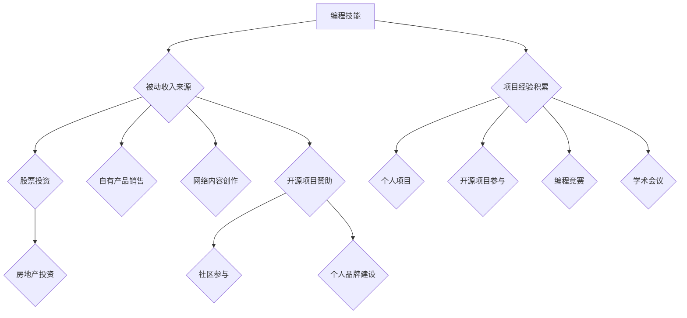

                 

## 《如何将编程技能转化为被动收入》

### 关键词：编程技能，被动收入，投资策略，个人品牌，编程社区，开源项目

> 摘要：本文旨在探讨如何将编程技能转化为被动收入。通过分析不同类型的被动收入来源，本文详细介绍了编程技能提升的方法，被动收入策略的制定与执行，以及如何通过资源整合与持续学习实现财务自由。本文适合有志于通过编程技能实现财务自由的技术人员阅读。

### 《如何将编程技能转化为被动收入》目录大纲

#### 第一部分：概述

1. 编程技能与被动收入
   - 编程技能概述
   - 被动收入的概念与重要性
   - 编程技能与被动收入的关系

2. 被动收入的类型
   - 股票投资
   - 房地产投资
   - 自有产品销售
   - 网络内容创作
   - 编程技能在被动收入中的具体应用

#### 第二部分：编程技能提升

1. 编程语言选择与技能深化
   - 常见编程语言比较
   - 编程技能进阶方法
   - 编程语言学习路线图

2. 编程实践与项目经验积累
   - 个人项目实践
   - 参与开源项目
   - 编程竞赛与学术会议

3. 编程社区参与与影响力扩展
   - 社区参与的意义
   - 社区运营技巧
   - 影响力与个人品牌建设

#### 第三部分：被动收入策略与执行

1. 被动收入策略制定
   - 被动收入目标设定
   - 收入来源分析
   - 风险评估与管理

2. 股票投资策略
   - 股票投资基础知识
   - 股票投资策略与案例分析
   - 股票投资工具与技术

3. 房地产投资策略
   - 房地产投资概述
   - 房地产投资策略与案例分析
   - 房地产投资工具与技术

4. 自有产品销售策略
   - 产品开发与市场定位
   - 产品销售策略与渠道选择
   - 产品推广与营销策略

5. 网络内容创作策略
   - 网络内容创作概述
   - 网络内容创作策略与案例分析
   - 网络内容创作工具与技术

6. 编程技能在被动收入中的具体应用案例
   - 编程技能转化为被动收入的实例分析
   - 编程项目案例展示
   - 编程技能在被动收入中的未来趋势

#### 第四部分：执行与优化

1. 被动收入执行与监控
   - 被动收入执行计划
   - 被动收入监控与评估
   - 被动收入优化策略

2. 资源整合与风险管理
   - 资源整合的方法
   - 风险管理与应对措施
   - 资源整合与风险管理的案例研究

3. 持续学习与适应变化
   - 编程技能的持续学习
   - 市场趋势的适应
   - 个人成长与职业规划

#### 附录

- 编程资源与工具
  - 编程学习资源推荐
  - 常用编程工具介绍
  - 开源社区与平台介绍

- 被动收入策略模板
  - 被动收入策略模板
  - 策略模板使用说明
  - 策略模板案例解析

- 编程技能与被动收入的关系 Mermaid 流程图

- 编程技能提升伪代码示例

- 被动收入策略实施步骤伪代码示例

- 数学模型与公式讲解

- 项目实战代码实现与解读

- 开发环境搭建与源代码实现

- 代码解读与分析

- 编程技能在被动收入中的案例解析

## 后记

- 被动收入的思考与展望
  - 编程技能与被动收入的未来趋势
  - 被动收入模式的新机遇
  - 如何平衡工作与生活，实现财务自由

### 第一部分：概述

编程技能与被动收入之间的关系日益紧密。随着技术的不断进步，编程不仅成为了一种职业技能，更成为了一种可以创造持续收入的资本。在这一部分，我们将探讨编程技能的基本概念，被动收入的定义与重要性，以及两者之间的内在联系。

#### 1.1 编程技能与被动收入

**编程技能概述**

编程技能是指使用编程语言和开发工具，编写计算机程序以实现特定功能的能力。编程技能包括算法设计、数据结构、编程语言知识、系统架构设计、软件开发流程等多个方面。现代编程技能不仅限于编写代码，还包括理解系统整体架构，掌握编程范式和设计模式，以及能够使用敏捷开发和DevOps等现代软件开发方法。

**被动收入的概念与重要性**

被动收入是指通过一次性或短期努力后，可以持续获取收益的经济活动。这种收入不依赖于个人持续的时间和劳动投入，而是通过资产投资、内容创作、产品销售等方式实现。被动收入的重要性在于它为个人提供了财务自由的可能性，使得人们可以在不增加劳动时间的情况下，持续获得经济收益。

**编程技能与被动收入的关系**

编程技能与被动收入之间存在密切的联系。首先，编程技能可以用于开发各种类型的软件产品，这些产品在上线后可以自动为开发者带来收入。例如，开发一个在线服务、应用或工具，可以在用户付费使用或广告分成中产生被动收入。其次，编程技能可以帮助开发者参与开源项目，通过社区赞助或项目资助获得被动收入。此外，编程技能还可以用于编写和销售自己的技术书籍、教程或在线课程，通过内容创作获得持续收入。

总之，编程技能不仅为技术从业者提供了职业发展的路径，也为实现财务自由提供了可能性。通过深入掌握编程技能，并灵活运用多种被动收入策略，技术人员可以创造持续的经济收益，从而实现更高的生活质量和职业目标。

#### 1.2 被动收入的类型

被动收入有多种形式，每种形式都有其独特的特点和适用场景。了解不同类型的被动收入及其优缺点，有助于技术人员选择最适合自己的收入来源，实现财务自由。以下是几种常见的被动收入类型：

**股票投资**

**概念与特点**

股票投资是指通过购买股票，获取上市公司分红和股票增值的收益。股票投资的优点包括：
- 收益潜力高：优质股票往往能带来长期稳定的增值。
- 灵活性强：投资者可以根据市场情况灵活调整投资组合。
- 可及性高：大多数投资者都可以通过股票市场进行投资。

股票投资的缺点包括：
- 风险较大：股市波动可能带来损失。
- 投资时间较长：需要长期跟踪市场，进行策略调整。

**案例分析**

以美国纳斯达克股票市场的亚马逊（AMZN）为例，自2000年以来，亚马逊的股票价格从不足10美元上涨至数千美元。假设投资者在2000年以10,000美元购入100股亚马逊股票，至今（2023年）其市值已超过10亿美元，这表明股票投资具有巨大的潜在收益。

**房地产投资**

**概念与特点**

房地产投资是指通过购买房地产（如住宅、商业地产、土地等），获取租金收入和资产增值的收益。房地产投资的优点包括：
- 收益稳定：租金收入相对稳定，且受经济周期影响较小。
- 抵御通胀：房地产通常被认为是一种有效的通胀对冲工具。
- 资产增值：房地产价值往往随着时间增长。

房地产投资的缺点包括：
- 初始投资较大：房地产投资需要较大的资金投入。
- 市场风险：房地产市场波动可能导致资产贬值。
- 管理成本高：需要投入时间和精力进行管理。

**案例分析**

以纽约曼哈顿商业地产为例，一间100平方米的办公室租金在2023年大约为每月6000美元。如果投资者购买并出租这间办公室，每年可获得约72000美元的租金收入。此外，曼哈顿商业地产的市场价值在过去十年中持续上涨，为投资者带来了额外的资产增值收益。

**自有产品销售**

**概念与特点**

自有产品销售是指通过开发并销售自己的产品（如软件、电子书、教程、工具等），获取销售收益的被动收入来源。自有产品销售的优点包括：
- 收益直接：销售产品即可直接获得收入。
- 潜力巨大：优秀的产品可以带来持续的销售。
- 易于推广：通过社交媒体、网络平台等渠道，可以轻松推广产品。

自有产品销售的缺点包括：
- 需要开发成本：开发高质量产品需要投入时间和资源。
- 市场竞争激烈：需要与大量竞争对手竞争。

**案例分析**

以苹果公司开发的iPhone手机为例，每销售一部iPhone，苹果公司可获得约200美元的利润。由于iPhone的高市场需求和品牌溢价，苹果公司通过自有产品销售获得了巨大的被动收入。

**网络内容创作**

**概念与特点**

网络内容创作是指通过创作和发布网络内容（如博客、视频、音频、教程等），吸引观众并获取广告收入和赞助的被动收入来源。网络内容创作的优点包括：
- 创作自由：创作者可以根据兴趣和特长创作内容。
- 低门槛：网络内容创作不需要高昂的硬件或软件投入。
- 广泛传播：网络平台可以迅速传播内容，吸引大量观众。

网络内容创作的缺点包括：
- 转化率低：观众观看内容并不一定转化为收入。
- 持续创作压力：需要不断创作新内容以维持观众关注度。

**案例分析**

以YouTube平台上的著名内容创作者PewDiePie为例，通过发布游戏视频和评论，PewDiePie吸引了数亿观众。根据广告收入和赞助，PewDiePie每年可获得数百万美元的被动收入。

**编程技能在被动收入中的具体应用**

编程技能在上述各类被动收入中都有广泛的应用。在股票投资中，编程技能可以用于数据分析，辅助投资决策；在房地产投资中，编程技能可以用于资产管理，优化收益；在自有产品销售和网络内容创作中，编程技能可以用于开发产品、搭建平台和优化用户体验。通过合理运用编程技能，技术人员可以在不同类型的被动收入中实现持续的经济收益。

总的来说，被动收入为技术人员提供了多种实现财务自由的途径。了解各种被动收入的类型、特点和应用，结合自身的编程技能，技术人员可以找到最适合自己的被动收入策略，从而实现长期稳定的财务增长。

### 第二部分：编程技能提升

编程技能的提升是转化为被动收入的重要基础。本部分将详细介绍如何选择编程语言、深化编程技能，以及如何通过实践和社区参与进一步积累项目经验。通过系统的学习和实践，技术人员可以不断提升自身能力，为未来的被动收入打下坚实基础。

#### 2.1 编程语言选择与技能深化

**常见编程语言比较**

在选择编程语言时，技术人员需要综合考虑语言的特点、应用场景和个人兴趣。以下是几种常见的编程语言及其特点：

- **Python**：Python以其简洁易懂的语法和强大的标准库，成为数据科学、机器学习、Web开发和自动化等领域的首选语言。Python的学习曲线较平缓，适合初学者。

- **Java**：Java是一种跨平台、面向对象的编程语言，广泛应用于企业级应用、安卓应用开发和大型系统架构中。Java的稳定性和安全性使其成为许多企业的首选语言。

- **JavaScript**：JavaScript是Web开发的核心语言，用于实现网页的动态效果和交互功能。随着Node.js的兴起，JavaScript也广泛应用于服务器端开发。

- **C++**：C++是一种高效的编程语言，适用于性能敏感的应用，如游戏开发、操作系统和嵌入式系统。C++的语法复杂，但提供了强大的控制能力。

- **Go**：Go（又称Golang）是一种新兴的编程语言，以其并发性能和简洁的语法受到开发者的喜爱。Go在云计算、网络服务和容器编排等领域有广泛的应用。

**编程技能进阶方法**

- **深入学习**：每种编程语言都有其独特的语法和编程范式，深入掌握一种编程语言是提升技能的关键。可以通过阅读官方文档、参考书籍和在线课程来系统学习。

- **项目实践**：通过实际项目来应用所学知识，可以加深对编程语言的理解。初学者可以从简单的项目开始，如个人博客、简单的Web应用等，逐步提升项目复杂度。

- **代码阅读**：阅读优秀的开源项目代码，可以了解不同编程语言的优秀实践和设计模式。GitHub等平台提供了大量高质量的开源项目，是学习和实践的好资源。

- **编程竞赛**：参加编程竞赛可以锻炼解决实际问题的能力，提高编程速度和技巧。知名编程竞赛如LeetCode、Codeforces等，都是提升编程技能的有效途径。

**编程语言学习路线图**

以下是几种常见编程语言的学习路线图，供技术人员参考：

- **Python学习路线图**：
  1. 熟悉Python基础语法和常用库（如NumPy、Pandas）。
  2. 学习Python在数据科学和机器学习中的应用。
  3. 掌握Web开发相关技术（如Flask、Django）。
  4. 深入了解Python的高级特性（如多线程、异步编程）。

- **Java学习路线图**：
  1. 学习Java基础语法和面向对象编程。
  2. 掌握Java在企业级应用中的使用（如Spring框架）。
  3. 学习Java在安卓开发中的应用。
  4. 熟悉Java在网络服务和大数据处理中的应用。

- **JavaScript学习路线图**：
  1. 学习JavaScript基础语法和DOM操作。
  2. 掌握前端框架（如React、Vue.js）。
  3. 学习Node.js进行服务器端编程。
  4. 深入了解JavaScript的异步编程和性能优化。

- **C++学习路线图**：
  1. 熟悉C++基础语法和数据结构。
  2. 学习C++在性能敏感应用中的应用。
  3. 掌握面向对象编程和设计模式。
  4. 了解C++在操作系统和嵌入式系统中的应用。

- **Go学习路线图**：
  1. 学习Go基础语法和标准库。
  2. 掌握Go在并发编程中的应用。
  3. 学习Go在网络服务和微服务中的应用。
  4. 深入了解Go的性能优化和工具链。

通过选择合适的编程语言，并按照系统的学习路线进行提升，技术人员可以逐步深化编程技能，为未来的被动收入打下坚实基础。

#### 2.2 编程实践与项目经验积累

**个人项目实践**

个人项目实践是提升编程技能和积累项目经验的重要途径。通过实际项目，技术人员可以锻炼从需求分析、设计到开发、测试的全流程能力。以下是几个建议：

1. **项目选择**：选择与个人兴趣和技能相关的小型项目开始，如个人博客、简单的Web应用、数据可视化工具等。随着技能提升，可以尝试更复杂的项目，如在线教育平台、电子商务网站等。

2. **逐步迭代**：在项目开发过程中，可以采用敏捷开发方法，逐步迭代和完善项目功能。每次迭代都要进行充分测试，确保代码质量。

3. **文档与代码规范**：编写详细的文档和遵循代码规范，可以提高项目的可维护性和可读性。这有助于后续的项目维护和功能扩展。

**参与开源项目**

参与开源项目是提升编程技能和建立个人品牌的有效方式。通过开源项目，技术人员可以：

1. **学习他人代码**：阅读和理解其他开发者的代码，可以学习到不同的编程风格和设计模式。

2. **贡献代码**：积极参与开源项目，提交代码补丁和功能优化。这不仅可以提高编程技能，还可以建立个人声誉。

3. **项目协作**：开源项目通常需要团队成员协作完成。通过参与项目协作，技术人员可以学习团队合作和项目管理技巧。

以下是几个参与开源项目的建议：

1. **选择合适的开源项目**：选择与个人技能和兴趣相关的开源项目，这样可以更高效地贡献代码。

2. **阅读项目文档**：熟悉项目的开发文档和贡献指南，确保遵循项目的开发规范。

3. **提供建设性反馈**：在参与开源项目时，不仅要提交代码，还要提供详细的注释和文档，确保其他开发者可以理解你的贡献。

4. **积极参与社区讨论**：参与项目的邮件列表和论坛，与其他开发者交流意见和解决方案。

**编程竞赛与学术会议**

编程竞赛和学术会议是展示编程能力和学术研究成果的平台。通过参与这些活动，技术人员可以：

1. **提升编程能力**：编程竞赛通常要求解决复杂的编程问题，这有助于提升编程速度和技巧。

2. **建立学术联系**：学术会议提供了与同行交流的机会，有助于拓展学术视野和建立合作关系。

3. **发表论文**：通过学术会议发表论文，可以展示研究成果，提升个人学术影响力。

以下是几个参与编程竞赛和学术会议的建议：

1. **选择合适的竞赛和会议**：根据个人兴趣和技能选择合适的编程竞赛和学术会议。

2. **充分准备**：提前了解竞赛规则和会议主题，做好充分的准备。

3. **积极交流**：在竞赛和会议中，积极与其他参赛者和专家交流，吸取经验。

4. **撰写高质量论文**：对于学术会议，要撰写高质量的论文，展示研究成果。

通过个人项目实践、参与开源项目和参加编程竞赛与学术会议，技术人员可以不断提升编程技能和项目经验，为未来的职业发展和被动收入奠定坚实基础。

#### 2.3 编程社区参与与影响力扩展

**社区参与的意义**

编程社区是技术人员获取知识、分享经验和建立联系的重要平台。积极参与编程社区，不仅有助于提升个人技能，还可以扩大职业网络，为未来的职业发展奠定基础。

1. **知识获取**：编程社区汇聚了大量专业知识和经验，通过参与讨论和阅读他人分享的内容，技术人员可以快速获取最新技术动态和解决问题的方法。

2. **技能提升**：在社区中参与代码审查、技术交流和项目协作，技术人员可以锻炼自己的编程技能和解决问题的能力。

3. **职业网络**：通过社区活动，技术人员可以结识业界同行，建立合作关系，拓展职业发展机会。

**社区运营技巧**

要有效地参与和运营编程社区，技术人员需要掌握以下技巧：

1. **提供高质量内容**：定期发布高质量的博客文章、技术教程和代码示例，分享自己的知识和经验。

2. **积极参与讨论**：在社区中积极参与技术讨论，提出问题和解答他人的疑问，展现专业素养。

3. **建立个人品牌**：通过持续的高质量贡献，树立个人专业形象，提高在社区中的影响力。

4. **组织活动**：可以组织线上或线下的技术沙龙、编程比赛等活动，吸引更多技术人员参与，提升社区活跃度。

**影响力与个人品牌建设**

在编程社区中建立影响力，有助于个人品牌的塑造，从而为未来的职业发展和被动收入创造更多机会。

1. **专业形象**：通过高质量的技术分享和解答问题，展现专业能力和知识深度，树立良好的专业形象。

2. **社交网络**：利用社交媒体平台（如GitHub、Twitter、LinkedIn）推广自己的技术成果和社区贡献，扩大影响力。

3. **参与开源项目**：通过参与开源项目，贡献代码和文档，提升在社区中的知名度和信誉。

4. **持续学习**：保持对新技术的关注和学习，不断提升自己的技能水平，保持专业竞争力。

通过积极参与编程社区和持续建设个人品牌，技术人员可以扩大影响力，提升职业竞争力，为未来的被动收入奠定坚实基础。

### 第三部分：被动收入策略与执行

#### 3.1 被动收入策略制定

在将编程技能转化为被动收入的过程中，制定有效的策略至关重要。一个明确的策略可以帮助技术人员选择合适的收入来源，降低风险，并实现长期稳定的财务收益。以下是制定被动收入策略的步骤和方法。

**被动收入目标设定**

制定被动收入策略的第一步是设定目标。目标应具体、可衡量，并与个人的长期职业规划和财务目标相一致。以下是一些设定目标时需要考虑的因素：

1. **短期目标**：例如，在半年内通过编程技能实现每月1000美元的被动收入。
2. **中期目标**：例如，在未来两年内通过投资股票和房地产实现每年10万美元的被动收入。
3. **长期目标**：例如，在未来五年内通过产品销售和内容创作实现每年20万美元的被动收入。

**收入来源分析**

在设定目标后，需要对可能的收入来源进行分析。以下是几种常见的收入来源及其特点：

1. **股票投资**：股票投资具有较高的收益潜力，但风险也较大。适合风险偏好较高的技术人员。
2. **房地产投资**：房地产投资收益稳定，但需要较大的初始投资和较强的资产管理能力。
3. **自有产品销售**：通过开发并销售软件、电子书、工具等，可以获得直接的被动收入。需要较高的开发能力和市场营销策略。
4. **网络内容创作**：通过创作和发布网络内容，如博客、视频、音频等，可以获得广告收入和赞助。适合有创作能力和影响力的技术人员。

**风险评估与管理**

在制定策略时，需要对潜在的风险进行评估和管理。以下是几种常见的风险及其管理方法：

1. **市场波动风险**：股市、房地产市场等市场波动可能导致投资损失。可以通过分散投资和长期持有来降低风险。
2. **信用风险**：在自有产品销售和内容创作中，信用风险可能影响收入。可以通过选择可靠的支付平台和建立良好的用户关系来降低风险。
3. **运营风险**：在房地产投资和自有产品销售中，运营风险可能影响收益。可以通过聘请专业的管理人员和加强市场调研来降低风险。

**策略制定步骤**

以下是制定被动收入策略的步骤：

1. **评估个人情况**：包括技能水平、财务状况、风险承受能力等，确保策略符合个人实际情况。
2. **选择收入来源**：根据个人兴趣和能力，选择最适合的收入来源。
3. **设定目标**：明确短期、中期和长期目标，确保策略的可实现性。
4. **风险评估**：对选择的投资和收入来源进行风险评估，制定相应的风险管理措施。
5. **制定执行计划**：明确具体的执行步骤和时间表，确保策略的顺利实施。

通过以上步骤，技术人员可以制定出合理的被动收入策略，为实现财务自由奠定基础。

#### 3.2 股票投资策略

股票投资是一种常见的被动收入来源，其收益潜力大，但也伴随着较高的风险。以下将详细讨论股票投资的基础知识、策略与案例分析，以及相关工具和技术的应用。

**股票投资基础知识**

1. **股票的概念**：股票是公司所有权的一部分，购买股票意味着成为公司的股东，享有公司利润分配和其他股东权益。

2. **股票市场**：股票市场是买卖股票的场所，包括证券交易所和场外交易市场。主要股票市场有纽约证券交易所（NYSE）、纳斯达克（NASDAQ）等。

3. **股票类型**：股票分为普通股和优先股。普通股股东享有公司利润分配和投票权，而优先股股东通常只有利润分配权，没有投票权。

4. **股票交易**：股票交易分为日内交易、短期交易和长期投资。日内交易是指当天买入并卖出的交易，而长期投资是指持有股票超过一年的投资。

5. **基本面分析和技术分析**：基本面分析是通过分析公司的财务报表、行业趋势和宏观经济指标等，评估股票的内在价值。技术分析是通过股票价格和交易量的历史数据，预测股票未来的走势。

**股票投资策略与案例分析**

1. **长期投资策略**：长期投资策略注重价值投资和成长投资。价值投资是指购买价格低于其内在价值的股票，以期待未来股价上涨。成长投资是指投资于具有高增长潜力的公司。

   **案例**：投资者在2010年以20美元/股的价格购入苹果公司（AAPL）的股票，至2023年，苹果公司的股价已上涨至约150美元/股，投资者获得了巨大的资本增值。

2. **短期交易策略**：短期交易策略包括日内交易和趋势交易。日内交易注重利用股价波动获取利润，而趋势交易是通过识别和追随股票价格的趋势进行买卖。

   **案例**：某投资者在2022年1月以50美元/股的价格购入某科技股，并于3月以60美元/股的价格卖出，实现了10美元/股的利润。

3. **分散投资策略**：分散投资是指将资金投资于不同的股票、行业和地区，以降低风险。

   **案例**：投资者通过分散投资，将资金分配到不同的行业和地区，如科技、医疗、消费等，降低了单一行业或地区风险对整体投资组合的影响。

**股票投资工具与技术**

1. **股票交易软件**：如MetaTrader 4、TradingView等，提供了实时行情、技术分析和交易功能。

2. **财经数据平台**：如Yahoo Finance、Google Finance等，提供了详细的财务报表、行业数据和市场新闻。

3. **量化投资工具**：如Zipline、Backtrader等，用于构建和测试量化交易策略。

通过了解股票投资的基础知识、制定合理的投资策略并利用适当的工具，技术人员可以在股票市场中实现被动收入。

#### 3.3 房地产投资策略

房地产投资是一种传统的被动收入来源，以其稳定的收益和抵御通胀的能力而受到投资者的青睐。以下将详细讨论房地产投资的基本概念、策略与案例分析，以及相关的工具和技术的应用。

**房地产投资概述**

1. **概念**：房地产投资是指通过购买房产、地产或房地产相关的金融产品（如房地产投资信托REITs），以获取租金收入和资产增值的收益。

2. **类型**：房地产投资主要包括住宅投资、商业地产投资、工业地产投资和土地投资等。住宅投资以获取稳定的租金收入为主，而商业地产投资则依赖于较高的租金回报和资产增值。

3. **市场分析**：房地产投资前需要进行详细的市场分析，包括供需关系、租金收益、资产升值潜力、政策和经济环境等。

**房地产投资策略与案例分析**

1. **租赁策略**：租赁策略是通过购买物业并出租，获取稳定的租金收入。该策略适合风险偏好较低且希望获得稳定收益的投资者。

   **案例**：投资者在2020年以100万美元的价格购买了一处公寓，并将其出租。假设租金收入为每月5000美元，年租金收入为60000美元。经过5年后，该公寓的市场价值上涨至120万美元，投资者不仅获得了租金收入，还实现了20%的资本增值。

2. **翻新与再售策略**：翻新与再售策略是通过购买低价房产，进行装修和改造，然后以更高的价格出售，从而获得收益。该策略需要较强的市场洞察力和项目管理能力。

   **案例**：投资者在2021年以50万美元的价格购买了一处老旧房产，进行全面翻新后，以75万美元的价格出售，获得了25万美元的收益。

3. **房地产投资信托（REITs）策略**：房地产投资信托是一种投资于房地产的金融产品，投资者通过购买REITs的股份，间接参与房地产投资，享受租金收入和资产增值。

   **案例**：投资者购买了一支房地产投资信托基金，基金年收益率约为5%，通过定期分红，投资者获得了稳定的被动收入。

**房地产投资工具与技术**

1. **房地产数据分析平台**：如Zillow、Realtor.com等，提供了详细的房产信息、市场趋势和租金收益预测。

2. **房产评估工具**：如 appraisal.com、HomeLight等，用于评估房产价值和制定投资策略。

3. **投资管理软件**：如Realty123、RealEstate Express等，帮助投资者管理房产投资组合，监控租金收入和资产价值。

通过了解房地产投资的基本概念、制定合理的投资策略并利用适当的工具，技术人员可以在房地产市场中实现被动收入。

#### 3.4 自有产品销售策略

自有产品销售是指通过开发并销售自己的软件、电子书、教程、工具等，获取被动收入的策略。这种模式具有直接性和高利润率，但也需要良好的市场定位、销售策略和推广方法。以下将详细讨论自有产品销售的市场定位、销售策略与渠道选择、产品推广与营销策略，并提供具体案例。

**市场定位**

市场定位是自有产品销售成功的关键步骤，需要明确目标市场和目标客户群体。以下是几个关键步骤：

1. **需求分析**：通过市场调研，了解目标客户的需求和痛点。这可以通过问卷调查、访谈、焦点小组讨论等方式进行。

2. **竞争分析**：分析竞争对手的产品特点、价格、市场份额等，找到自己的独特卖点（USP）。

3. **目标市场定义**：根据需求分析和竞争分析的结果，定义目标市场，包括地理位置、人口特征、行为特征等。

**销售策略与渠道选择**

销售策略和渠道选择决定了产品的市场覆盖率和销售效果。以下是几个关键步骤：

1. **产品定价**：根据成本、市场需求和竞争对手定价，制定合理的价格策略。定价策略可以采用成本加成法、市场需求法或竞争定价法。

2. **销售渠道选择**：选择合适的销售渠道，包括线上渠道（如电商平台、官方网站、社交媒体）和线下渠道（如经销商、代理商、线下门店）。线上渠道通常具有较低的成本和更广泛的覆盖，而线下渠道则更适用于面对面的销售和服务。

**产品推广与营销策略**

推广和营销策略决定了产品的知名度和销售转化率。以下是几个关键步骤：

1. **内容营销**：通过创建高质量的内容（如博客文章、视频教程、电子书），吸引目标客户并建立信任关系。

2. **社交媒体营销**：利用社交媒体平台（如Twitter、LinkedIn、Facebook、YouTube），发布产品信息和相关内容，扩大品牌影响力。

3. **搜索引擎优化（SEO）**：通过优化网站内容和结构，提高在搜索引擎中的排名，吸引更多的潜在客户。

4. **广告推广**：通过在线广告（如Google AdWords、Facebook Ads）和离线广告（如报纸、杂志、电视广告），提高品牌知名度和产品销量。

**具体案例**

以下是几个成功的自有产品销售案例：

1. **案例一：软件开发**  
   开发者A开发了一款名为“TaskMaster”的时间管理工具，通过官方网站和社交媒体进行推广。产品定价为每月5美元，目标市场是希望提高工作效率的专业人士。在推出后的第一个月，TaskMaster获得了1000名用户，月收入达到5000美元。

2. **案例二：电子书**  
   作家B编写了一本关于机器学习的电子书，通过亚马逊Kindle商店进行销售。书籍定价为9.99美元，并通过电子邮件营销向过去的读者进行推广。在书籍上线后的三个月内，销量达到1000本，总收入超过10000美元。

3. **案例三：在线课程**  
   教练C创建了一个名为“编程大师课”的在线课程，通过YouTube和官方网站进行推广。课程定价为199美元，目标市场是编程初学者。在课程推出后的第一个季度，吸引了500名学生报名，总收入达到近10万美元。

通过有效的市场定位、销售策略和推广方法，技术人员可以成功地将自己的自有产品推向市场，实现被动收入。

#### 3.5 网络内容创作策略

网络内容创作是一种通过创作和发布网络内容（如博客、视频、音频、教程等），吸引观众并获取广告收入和赞助的被动收入策略。以下将详细讨论网络内容创作的概述、策略与案例分析，以及相关工具和技术的应用。

**网络内容创作概述**

1. **概念**：网络内容创作是指利用互联网平台，创作和发布各种形式的内容，如文字、图片、音频和视频，以吸引和维系观众，并从中获得收益。

2. **平台**：常见的网络内容创作平台包括YouTube、Bilibili、TikTok、Instagram、Twitter、微信公众号等。每个平台都有其独特的用户群体和内容形式。

3. **类型**：网络内容创作类型多样，包括教育类内容（如教程、知识讲解）、娱乐类内容（如搞笑、游戏直播）、生活方式内容（如美食、旅行）等。

4. **收益模式**：网络内容创作的收益主要来自广告收入、赞助、付费内容、商品销售等多种形式。广告收入通常通过平台广告系统（如YouTube的Google AdSense）获得，赞助则通常来自品牌合作，付费内容和商品销售则通过平台或独立渠道实现。

**网络内容创作策略与案例分析**

1. **内容规划**：内容规划是网络内容创作的第一步，需要确定内容主题、风格和发布频率。以下是几个关键点：

   - **确定主题**：选择自己擅长或感兴趣的领域，确保内容的专业性和可持续性。
   - **风格统一**：保持内容风格的统一，包括语言、视觉元素等，提升品牌形象。
   - **发布频率**：制定合理的发布计划，如每周发布一篇文章或一段视频，保持观众的关注度。

2. **内容创作**：内容创作是网络内容创作的核心，需要注重以下几点：

   - **质量优先**：确保内容的高质量，提供有价值、有深度的信息。
   - **原创性**：原创内容能够吸引观众，增加平台推荐的可能性。
   - **互动性**：鼓励观众留言、评论和分享，增加互动性和用户粘性。

3. **推广与营销**：推广与营销是提升内容知名度和观众数量的关键，以下是几个策略：

   - **社交媒体推广**：通过社交媒体平台分享内容链接，吸引更多观众。
   - **合作推广**：与其他内容创作者或品牌进行合作推广，扩大受众范围。
   - **SEO优化**：通过搜索引擎优化（SEO），提高内容在搜索引擎中的排名，增加自然流量。

4. **案例分析**：

   - **案例一：YouTube博主PewDiePie**  
     PewDiePie是一位著名的YouTube博主，通过发布游戏视频和评论积累了庞大的观众群体。他的成功得益于高质量的内容、幽默的风格和积极的观众互动。根据数据显示，PewDiePie每月的广告收入超过100万美元。

   - **案例二：Instagram美妆博主Huda Kattan**  
     Huda Kattan是一位在Instagram上拥有数百万粉丝的美妆博主。她的成功不仅在于丰富的美妆教程和产品推荐，还在于与观众的互动和社交媒体营销。通过Instagram，Huda Kattan成功地将自己的品牌拓展到了全球，并实现了数百万美元的广告收入和商品销售。

**网络内容创作工具与技术**

1. **内容创作工具**：包括视频编辑软件（如Adobe Premiere Pro、Final Cut Pro）、音频编辑软件（如Audacity）、图像处理软件（如Photoshop）等。

2. **社交媒体管理工具**：如Buffer、Hootsuite等，用于自动化发布内容、分析社交媒体表现。

3. **数据分析工具**：如Google Analytics、Facebook Insights等，用于追踪内容表现、用户行为和广告效果。

通过制定明确的内容创作策略，利用适当的工具和技术，网络内容创作者可以有效地吸引观众，实现广告收入和赞助，从而实现被动收入。

#### 3.6 编程技能在被动收入中的具体应用案例

编程技能在被动收入中的具体应用不仅限于传统的股票投资、房地产投资和自有产品销售，还可以通过编程项目实现多种多样的收入来源。以下将分析几个编程技能转化为被动收入的实例，并探讨这些项目的成功因素和未来趋势。

**案例一：开源项目赞助**

**实例分析**：GitHub上的开源项目CircuitPython是由MicroPython的开发者设计的，用于简化微型计算机编程的教育资源。通过在GitHub上发布高质量、易于使用的代码库，CircuitPython吸引了全球开发者和教育机构的关注。由于CircuitPython具有广泛的社区基础和强大的功能，它获得了多家科技公司的赞助，如Adafruit和Microchip Technology。这些赞助不仅为项目提供了资金支持，还帮助项目开发者获得额外的收入。

**成功因素**：
- **高质量代码**：CircuitPython提供了稳定、易于使用的代码库，保证了项目的持续吸引力。
- **社区支持**：项目的开源特性吸引了大量的社区参与，形成了强大的支持网络。
- **商业合作**：与科技公司的合作使项目获得了持续的赞助和资源支持。

**未来趋势**：随着开源文化和社区参与度的提升，开源项目赞助有望成为编程技能转化为被动收入的稳定来源。未来，更多的开发者将通过开源项目获得商业合作和赞助，从而实现收入多元化。

**案例二：在线教育平台**

**实例分析**：Coursera和edX等在线教育平台利用编程技能开发了一系列课程，从基础编程到高级算法，涵盖了各种技术和学科。通过这些课程，技术人员不仅能够传授知识，还可以通过课程销售、广告收入和会员订阅等方式获得被动收入。例如，Coursera的编程课程《算法导论》吸引了全球成千上万的学员，通过课程销售和广告收入，该项目每年为开发者带来数十万美元的收入。

**成功因素**：
- **高质量内容**：在线教育平台提供了由知名大学和专业教师讲授的高质量课程。
- **市场定位**：课程针对全球市场，满足了不同学习需求，吸引了广泛的学生群体。
- **技术支持**：平台的技术架构和用户界面保证了课程的流畅性和用户体验。

**未来趋势**：随着在线教育市场的不断扩大和技术的进步，编程技能在在线教育平台中的应用前景广阔。未来，更多的开发者将参与到在线教育平台的建设和运营中，通过高质量的课程内容和创新的商业模式实现被动收入。

**案例三：自动化工具开发**

**实例分析**：自动化工具如Selenium和Python的Robot Framework被广泛应用于测试和自动化流程中。开发者可以编写和销售这些自动化工具的定制版本或插件，从而实现被动收入。例如，开发者A开发了Selenium的扩展插件，该插件帮助用户简化Web测试流程，通过GitHub Marketplace销售，每月为开发者带来数百美元的收入。

**成功因素**：
- **市场需求**：自动化工具在测试和开发领域有广泛的应用，市场需求稳定。
- **技术优势**：高质量的自动化工具能够提供高效、可靠的解决方案，满足用户需求。
- **灵活性和可定制性**：定制化的自动化工具可以满足不同用户的需求，提高用户满意度。

**未来趋势**：随着企业对自动化和DevOps需求的增加，自动化工具的开发和销售市场将持续增长。未来，更多的开发者将利用编程技能开发具有市场需求的自动化工具，通过持续的销售和订阅模式实现被动收入。

通过以上案例可以看出，编程技能在被动收入中的应用形式多样，成功的关键在于高质量的内容、市场需求和社区支持。随着技术的发展和市场的变化，编程技能在被动收入中的未来趋势将继续向着多元化、专业化和高附加值的方向发展。

### 第四部分：执行与优化

#### 4.1 被动收入执行与监控

在制定并选择了合适的被动收入策略后，执行与监控是确保策略有效性和可持续性的关键步骤。以下将详细讨论被动收入执行计划、监控与评估方法以及优化策略。

**被动收入执行计划**

1. **分解目标**：将长期目标分解为短期目标，并制定具体的时间表和里程碑。例如，如果目标是每年通过股票投资获得10万美元的收入，可以将这一目标分解为每月的目标，并确定每个季度需要达成的里程碑。

2. **资源分配**：明确实现目标所需的资源，包括资金、时间、人力资源等。确保资源分配合理，避免资源浪费。

3. **任务分工**：根据个人能力和资源，将任务分配给团队成员或合作伙伴。明确每个人的职责和任务，确保项目能够高效推进。

4. **风险预防**：在执行计划中考虑可能出现的风险，并制定相应的预防和应对措施。例如，股票投资中可能面临的市场波动，可以通过分散投资和长期持有来降低风险。

5. **执行监控**：建立定期的执行监控机制，跟踪目标的完成情况，及时发现和解决问题。监控可以采用定期报告、会议和项目管理系统等方式进行。

**被动收入监控与评估**

1. **财务监控**：定期监控财务状况，包括收入、支出、投资回报率等。通过财务监控，可以确保收入目标的实现，并优化资源配置。

2. **绩效评估**：对策略执行的效果进行评估，包括目标的达成情况、资源利用效率、风险管理等。通过绩效评估，可以找出策略中的不足，为优化提供依据。

3. **市场分析**：定期进行市场分析，了解市场趋势和竞争状况。市场分析可以帮助调整投资策略和推广方法，确保策略的持续有效性。

**被动收入优化策略**

1. **目标调整**：根据执行监控和评估结果，及时调整目标，确保目标与实际情况相符。

2. **资源配置优化**：根据执行效果和财务监控结果，优化资源配置，确保资源利用最大化。

3. **风险管理**：通过定期的风险评估和管理，识别和应对潜在风险，确保策略的稳定性和安全性。

4. **策略创新**：不断探索新的被动收入来源和策略，例如通过开发新产品、拓展新市场或采用新的技术手段，提高被动收入的多样性和稳定性。

5. **持续学习**：保持对市场和技术趋势的关注，持续学习和提升自身技能，确保在变化的市场环境中保持竞争力。

通过制定并执行有效的被动收入策略，技术人员可以确保收入来源的稳定性和持续性，实现长期财务自由。

#### 4.2 资源整合与风险管理

在实现编程技能转化为被动收入的过程中，资源整合和风险管理是确保项目成功和持续发展的重要因素。以下将详细讨论资源整合的方法、风险管理与应对措施，以及相关案例研究。

**资源整合的方法**

1. **人脉资源**：建立广泛的人脉网络，包括行业内专业人士、投资者、合作伙伴和潜在客户。通过人脉资源，可以获得项目合作机会、投资建议和市场信息。

   - **案例**：一位开发者通过与业内专家建立联系，成功获得了投资和合作伙伴的支持，开发了一款备受市场欢迎的软件产品。

2. **技术资源**：整合现有的技术资源和专业知识，包括开发工具、数据库、云计算服务等。通过技术资源的整合，可以提高项目的开发效率和稳定性。

   - **案例**：一家初创公司通过整合内部技术资源和外部合作伙伴的技术资源，开发了一款创新的移动应用，迅速获得了用户和市场认可。

3. **资金资源**：通过多种渠道筹集资金，包括自筹资金、天使投资、风险投资等。合理的资金资源整合可以确保项目在不同阶段有足够的资金支持。

   - **案例**：一位开发者通过自筹资金和天使投资，成功开发并推广了一款在线教育平台，实现了从初创到盈利的跨越。

4. **信息资源**：利用互联网和社交媒体等平台，获取最新的市场趋势、技术动态和用户反馈。信息资源可以帮助调整策略和优化项目。

   - **案例**：一家科技公司通过定期收集和分析用户反馈，调整产品功能，从而提升了用户满意度和市场份额。

**风险管理**

1. **识别风险**：通过全面的风险识别，了解项目可能面临的各种风险，如市场风险、技术风险、财务风险等。

2. **评估风险**：对识别出的风险进行评估，分析其可能的影响和发生的概率。评估可以帮助确定哪些风险需要优先管理和控制。

3. **制定应对措施**：根据风险评估结果，制定具体的应对措施，包括风险预防、风险转移和风险接受等。

   - **案例**：一家房地产投资公司通过购买保险和分散投资，有效降低了市场波动对项目的影响。

4. **持续监控**：在项目执行过程中，持续监控风险的变化和项目的实际表现，及时调整风险管理策略。

**风险管理与应对措施的案例研究**

1. **案例一：软件开发项目的风险管理**  
   一家初创公司正在开发一款智能家电控制系统，项目涉及硬件和软件的开发。在项目启动阶段，公司识别出了以下几个主要风险：
   - **技术风险**：智能家电控制系统的技术复杂性较高，可能存在技术难题。
   - **市场风险**：智能家电市场竞争激烈，需要确保产品的差异化优势。
   - **财务风险**：项目资金需求较大，需要确保资金链的稳定。

   为了应对这些风险，公司采取了以下措施：
   - **技术风险管理**：与经验丰富的硬件和软件工程师合作，确保技术实现的可能性。
   - **市场风险管理**：通过市场调研，了解用户需求和市场趋势，调整产品功能，提高市场竞争力。
   - **财务风险管理**：通过融资和资金调度，确保项目的资金需求。

   最终，项目成功完成，产品在市场上获得了良好的反响，实现了预期的收入。

2. **案例二：在线教育平台的风险管理**  
   一家在线教育平台在扩展业务时，面临以下几个风险：
   - **市场风险**：市场竞争激烈，需要确保用户增长和留存。
   - **技术风险**：系统的高并发访问需求可能影响用户体验。
   - **内容风险**：课程内容和教学质量的稳定性是用户关注的焦点。

   为了应对这些风险，平台采取了以下措施：
   - **市场风险管理**：通过SEO优化和社交媒体推广，提升平台知名度。
   - **技术风险管理**：采用云计算和分布式架构，确保系统的高可用性和稳定性。
   - **内容风险管理**：建立专业的课程开发团队，确保课程内容的及时更新和质量。

   通过有效的风险管理，平台成功实现了用户增长，提高了市场份额。

通过资源整合和风险管理，技术人员可以更好地实现编程技能转化为被动收入的目标，确保项目的持续成功和发展。

#### 4.3 持续学习与适应变化

在快速变化的科技领域中，持续学习与适应变化是技术人员保持竞争力的关键。本部分将讨论编程技能的持续学习、市场趋势的适应以及个人成长与职业规划。

**编程技能的持续学习**

1. **技术动态关注**：定期关注技术博客、社交媒体和专业论坛，了解最新的技术动态和行业趋势。

   - **建议**：订阅技术媒体（如Hacker News、IEEE Spectrum），参加技术会议（如Google I/O、Microsoft Build）。

2. **在线课程与认证**：通过在线课程平台（如Coursera、edX、Udemy），学习新的编程语言、框架和工具。

   - **推荐**：学习新兴技术（如AI、机器学习、区块链）和现代软件开发方法（如DevOps、敏捷开发）。

3. **实践与项目**：通过实际项目锻炼编程技能，解决真实问题。

   - **建议**：参与开源项目，参与编程竞赛（如Google Code Jam、LeetCode），开发个人项目。

4. **专业书籍与教程**：阅读专业书籍和教程，加深对技术原理的理解。

   - **推荐**：阅读经典著作（如《设计模式》、《编程珠玑》），以及新兴领域的专著。

**市场趋势的适应**

1. **行业研究**：定期进行行业研究，了解市场需求和技术趋势。

   - **建议**：分析行业报告（如Gartner、Forrester），参加行业研讨会。

2. **用户反馈**：关注用户需求和反馈，调整技术策略和产品方向。

   - **建议**：通过问卷调查、用户访谈、反馈论坛等获取用户反馈，进行产品迭代。

3. **跨领域学习**：了解不同领域的应用场景和技术需求，拓展技能。

   - **建议**：学习与编程相关的其他领域知识（如项目管理、商业分析）。

**个人成长与职业规划**

1. **设定目标**：明确个人职业发展目标，制定可行的成长计划。

   - **建议**：制定短期（1-3年）和长期（3-5年）的职业目标。

2. **技能多元化**：提升多元化技能，增强职业竞争力。

   - **建议**：学习跨学科技能（如数据科学、用户体验设计），扩展业务领域。

3. **职业网络**：建立和维护职业网络，拓展职业机会。

   - **建议**：参加行业活动、技术会议，加入专业协会（如IEEE、ACM）。

通过持续学习和适应市场变化，技术人员可以不断提升自身能力，实现职业成长和财务自由。

### 附录

**A.1 编程学习资源推荐**

1. **在线课程平台**：
   - **Coursera**：提供高质量的课程，涵盖计算机科学、数据科学、人工智能等多个领域。
   - **edX**：由哈佛大学和麻省理工学院合作建立，提供广泛的在线课程，包括计算机科学和软件工程。
   - **Udemy**：提供各种技能课程，包括编程语言、开发工具和框架。

2. **技术博客与社区**：
   - **Hacker News**：一个技术新闻和讨论网站，涵盖最新的科技新闻和行业动态。
   - **Stack Overflow**：一个编程问答社区，适合解决编程问题和技术讨论。
   - **GitHub**：一个代码托管和协作平台，可以找到大量开源项目和编程资源。

3. **书籍推荐**：
   - **《代码大全》**：由Steve McConnell著，是编程和软件工程领域的经典著作。
   - **《深度学习》**：由Ian Goodfellow、Yoshua Bengio和Aaron Courville著，是深度学习领域的权威教材。
   - **《Effective Java》**：由Joshua Bloch著，是Java编程的权威指南。

**A.2 常用编程工具介绍**

1. **集成开发环境（IDE）**：
   - **Visual Studio Code**：一款轻量级但功能强大的跨平台IDE，适用于多种编程语言。
   - **IntelliJ IDEA**：一款由 JetBrains 开发的IDE，特别适合Java和JavaScript开发。
   - **Eclipse**：一款开源的跨平台IDE，适用于Java和多种其他编程语言。

2. **版本控制工具**：
   - **Git**：一款分布式版本控制系统，适用于项目管理和协作开发。
   - **GitHub**：基于Git的代码托管平台，提供丰富的开源项目和技术社区。

3. **调试工具**：
   - **Postman**：一款API测试工具，适用于开发者进行API接口测试和调试。
   - **Docker**：一种容器化技术，用于简化应用的开发、测试和部署。

**A.3 开源社区与平台介绍**

1. **GitHub**：全球最大的代码托管和协作平台，汇聚了无数开源项目和开发者。
2. **Stack Overflow**：一个编程问答社区，开发者可以在上面提问和解答技术问题。
3. **Reddit**：一个社交新闻网站，有许多技术子版块，适合获取技术资讯和参与讨论。
4. **Docker Hub**：Docker的官方仓库，提供了丰富的容器镜像和工具。

**A.4 被动收入策略模板**

以下是一个被动收入策略模板，供技术人员参考：

```
# 被动收入策略模板

## 1. 目标设定
- 短期目标：在接下来的6个月内，通过X项目实现每月X美元的收入。
- 中期目标：在未来两年内，通过Y项目和Z项目实现每年X万美元的收入。
- 长期目标：在未来五年内，通过多样化的项目实现每年X万美元的稳定收入。

## 2. 收入来源分析
- **X项目**：通过开发并销售软件工具，预期收入来源为销售利润和订阅费用。
- **Y项目**：通过参与开源项目并获得赞助，预期收入来源为社区赞助。
- **Z项目**：通过在线教育平台开设课程，预期收入来源为课程销售和广告收入。

## 3. 风险评估
- **市场风险**：分析市场需求和竞争状况，制定相应的市场进入策略。
- **技术风险**：确保技术实现的可行性和稳定性，定期更新和维护技术架构。
- **财务风险**：合理规划资金使用，确保项目的财务健康。

## 4. 执行计划
- **X项目**：
  - 开发阶段：在接下来的3个月内完成软件工具的开发。
  - 销售阶段：在开发完成后，通过SEO优化和社交媒体推广，实现销售目标。

- **Y项目**：
  - 社区参与：积极参与开源项目，提升项目知名度。
  - 赞助获取：与潜在赞助商沟通，寻求长期合作。

- **Z项目**：
  - 课程开发：在接下来的6个月内完成课程内容的设计和开发。
  - 推广阶段：通过社交媒体和合作伙伴推广，提高课程知名度。

## 5. 监控与评估
- **定期监控**：每月对项目收入和支出进行监控，分析项目执行效果。
- **绩效评估**：每季度对项目绩效进行评估，调整策略和资源分配。

## 6. 优化策略
- **技术创新**：定期更新技术架构，保持项目的竞争力。
- **市场拓展**：探索新的市场机会，扩大收入来源。
- **团队建设**：加强团队协作，提升项目执行效率。
```

通过以上策略模板，技术人员可以系统地制定和执行被动收入计划，实现财务自由的目标。

**A.5 编程技能与被动收入的关系 Mermaid 流程图**



**A.6 编程技能提升伪代码示例**

```python
# 伪代码：编程技能提升
def skill_improvement(language, project, community):
    # 学习编程语言
    learn_language(language)
    # 参与项目实践
    contribute_to_project(project)
    # 参与编程社区
    participate_in_community(community)
    # 持续迭代技能
    iterate_skills()

def learn_language(language):
    # 学习编程语言基础
    basics = learn_basics(language)
    # 学习高级特性
    advanced = learn_advanced(language)
    # 实践编程项目
    practice_projects(language)

def contribute_to_project(project):
    # 加入开源项目
    join_open_source_project(project)
    # 贡献代码和文档
    contribute_code_documentation()
    # 优化项目功能
    optimize_project_functionality()

def participate_in_community(community):
    # 加入编程社区
    join_programming_community(community)
    # 分享知识和经验
    share_knowledge_experience()
    # 积累人脉资源
    build_network_resources()

def iterate_skills():
    # 学习新技术和框架
    learn_new_technologies_frameworks()
    # 参与编程竞赛
    participate_programming_contests()
    # 撰写技术博客
    write_technical_blogs()
```

**A.7 被动收入策略实施步骤伪代码示例**

```python
# 伪代码：被动收入策略实施
def passive_income_strategy(income_source, risk_assessment, execution_plan):
    # 分析收入来源
    analyze_income_source(income_source)
    # 风险评估
    assess_risk(risk_assessment)
    # 制定执行计划
    create_execution_plan(execution_plan)
    # 执行与监控
    execute_and_monitor()
    # 优化策略
    optimize_strategy()

def analyze_income_source(income_source):
    # 收入来源分析
    analyze_salespotentials()
    # 市场需求分析
    analyze_market_demand()

def assess_risk(risk_assessment):
    # 识别风险
    identify_risks()
    # 风险评估
    evaluate_risks()

def create_execution_plan(execution_plan):
    # 制定执行计划
    set_targets()
    # 分配资源
    allocate_resources()
    # 制定时间表
    set_time_schedule()

def execute_and_monitor():
    # 执行计划
    execute_plan()
    # 监控进度
    monitor_progress()

def optimize_strategy():
    # 根据执行效果调整策略
    adjust_strategy()
    # 优化资源配置
    optimize_resource_allocation()
```

**A.8 数学模型与公式讲解**

被动收入的计算可以使用以下数学模型：

$$
\text{被动收入} = \text{投资金额} \times \text{投资回报率} \times \text{投资时间}
$$

- **投资金额**：指用于投资的总资金。
- **投资回报率**：指投资产生的收益率，通常以百分比表示。
- **投资时间**：指投资资金的持有时间。

例如，一位投资者投入了10,000美元，选择了一个年回报率为10%的投资项目，持有时间为5年，那么他的被动收入计算如下：

$$
\text{被动收入} = 10,000 \times 0.10 \times 5 = 5,000 \text{美元/年}
$$

**A.9 项目实战代码实现与解读**

#### 实战项目：开发一个简单的博客系统

**开发环境**：Python + Flask

**代码实现**：

```python
# 导入所需的库
from flask import Flask, render_template, request

# 创建Flask应用实例
app = Flask(__name__)

# 定义首页路由
@app.route('/')
def home():
    return render_template('home.html')

# 定义创建文章的路由
@app.route('/post', methods=['GET', 'POST'])
def post():
    if request.method == 'POST':
        title = request.form['title']
        content = request.form['content']
        # 调用Blog类的create_post方法
        blog.create_post(title, content)
        return render_template('post.html', title=title, content=content)
    return render_template('post_form.html')

# 定义列出文章的路由
@app.route('/posts')
def posts():
    return render_template('posts.html', posts=blog.list_posts())

# 定义Blog类
class Blog:
    def __init__(self):
        self.posts = []

    def create_post(self, title, content):
        post = {'title': title, 'content': content}
        self.posts.append(post)
        print("文章发布成功！")

    def list_posts(self):
        return self.posts

# 主程序入口
if __name__ == '__main__':
    app.run(debug=True)
```

**代码解读**：

- **Flask应用搭建**：首先导入Flask库，并创建一个应用实例`app`。Flask是一个轻量级的Web框架，用于快速开发Web应用。

- **定义路由**：通过装饰器`@app.route()`，定义了几个不同的路由。`home()`函数处理首页请求，`post()`函数处理创建文章的请求，`posts()`函数处理列出所有文章的请求。

- **创建文章**：在`post()`函数中，如果请求方法是`POST`，则从请求中获取标题和内容，调用`Blog`类的`create_post()`方法将文章添加到列表中。

- **列出文章**：`posts()`函数返回所有文章的列表，并在`posts.html`模板中渲染。

- **定义Blog类**：`Blog`类用于管理文章。`create_post()`方法用于创建新文章，`list_posts()`方法用于获取所有文章的列表。

通过这个简单的博客系统，技术人员可以了解Flask的基本用法，掌握Web开发的基本流程。这个项目可以作为进一步开发复杂Web应用的起点。

### 后记：被动收入的思考与展望

在数字化时代，编程技能作为一种重要的生产要素，正在为技术人员带来前所未有的机遇。通过将编程技能转化为被动收入，技术人员不仅可以实现财务自由，还可以享受工作与生活的平衡。本文从多个角度探讨了如何实现这一目标，总结了以下几个方面的重要思考与展望：

**编程技能与被动收入的未来趋势**

随着人工智能、大数据、云计算等技术的快速发展，编程技能的应用领域和需求日益扩大。未来的编程技能将更加注重跨学科融合和创新能力。例如，具备数据分析和机器学习背景的程序员将在数据分析、智能推荐等领域大有作为。此外，区块链技术的兴起也为程序员提供了新的应用场景，如智能合约开发和去中心化应用（DApp）开发。

**被动收入模式的新机遇**

随着互联网和技术的普及，被动收入模式的创新和多样化也在不断涌现。除了传统的股票投资、房地产投资和自有产品销售，新的模式如网络内容创作、知识付费、数字资产投资等，也为技术人员提供了更多的选择。特别是网络内容创作，通过博客、视频、音频等形式，技术人员可以轻松实现内容变现，获取被动收入。

**如何平衡工作与生活，实现财务自由**

在追求被动收入的过程中，平衡工作与生活至关重要。技术人员需要合理安排时间，确保有足够的精力进行技能学习和项目开发。同时，合理分配收入，确保财务安全和生活品质。以下是一些建议：

1. **时间管理**：制定明确的工作计划和休息时间，避免工作过度和疲劳。
2. **财务规划**：进行详细的财务规划，包括预算管理、投资规划和紧急基金设置，确保财务安全。
3. **健康生活**：保持健康的生活习惯，如适量运动、合理饮食和充足睡眠，提高工作效率和生活质量。
4. **持续学习**：保持对新技术和市场的关注，不断提升自身技能，确保在竞争激烈的环境中保持竞争力。

通过合理的规划和执行，技术人员不仅可以实现财务自由，还可以享受工作与生活的平衡，实现更高质量的生活。在数字化时代的浪潮中，编程技能与被动收入相结合，将为技术人员开启更加广阔的发展前景。

### 结论

通过本文的详细探讨，我们明确了如何将编程技能转化为被动收入的策略和执行步骤。从编程技能的提升、被动收入策略的制定，到实际执行与优化，每个环节都至关重要。通过系统的学习和实践，技术人员不仅可以提升自身技能，还能实现财务自由。

编程技能与被动收入之间的关系日益紧密。编程技能不仅为技术人员提供了职业发展的路径，也为实现财务自由提供了可能性。通过掌握多种编程语言、参与开源项目、进行编程实践和社区参与，技术人员可以不断提升自身能力。同时，通过制定合理的被动收入策略，利用股票投资、房地产投资、自有产品销售和网络内容创作等多种方式，技术人员可以创造持续的经济收益。

然而，实现这一目标并非一蹴而就。技术人员需要持续学习、适应市场变化，并始终保持创新思维。在执行过程中，合理规划时间、财务和风险管理，确保项目的顺利进行和稳定发展。此外，平衡工作与生活，保持身心健康，也是实现财务自由的重要保障。

最后，我们鼓励技术人员勇敢追求财务自由，充分利用编程技能和被动收入策略，开启更加广阔的职业和发展前景。在数字化时代，编程技能与被动收入相结合，将为技术人员带来前所未有的机遇和挑战。让我们共同努力，实现技术、财富与生活的和谐统一。

