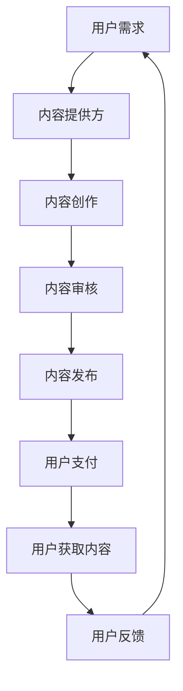
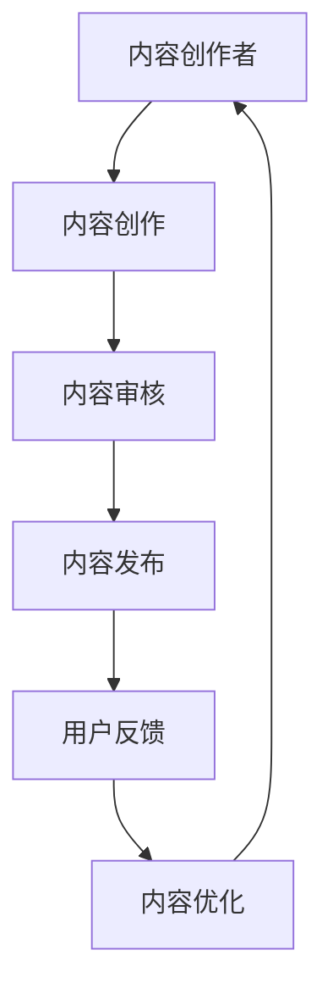
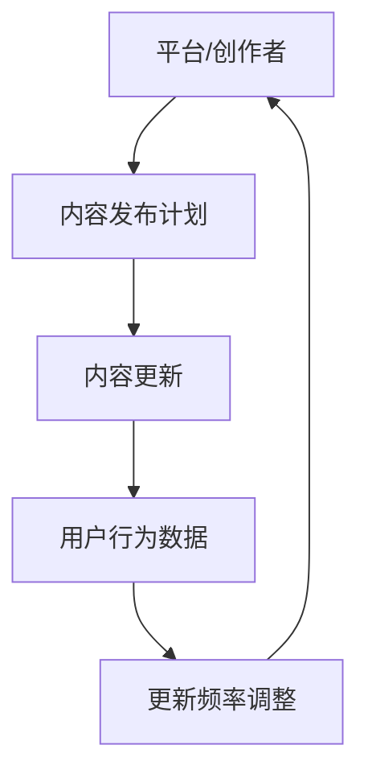

                 

# 《如何平衡知识付费的内容质量和更新频率》

## 核心关键词

知识付费、内容质量、更新频率、用户满意度、用户体验、平台策略、内容创作者、算法模型、数学公式、项目实战

### 摘要

知识付费作为一种商业模式，正在改变我们的学习和获取信息的方式。然而，如何平衡内容的质量和更新频率，以保持用户的持续关注和满意度，成为知识付费平台面临的重要挑战。本文从基础知识、内容质量评估、更新频率管理、实战案例分析等多个方面，详细探讨如何平衡知识付费的内容质量和更新频率，为知识付费平台和内容创作者提供实用的策略和指导。

----------------------------------------------------------------

## 目录大纲

1. **基础知识**
   1.1 知识付费概述
   1.2 知识付费平台介绍
   1.3 用户需求分析
2. **内容质量评估**
   2.1 内容质量评价指标
   2.2 内容质量提升策略
3. **更新频率管理**
   3.1 更新频率的重要性
   3.2 更新频率的设定方法
4. **实战案例分析**
   4.1 平台A案例分析
   4.2 平台B案例分析
5. **内容创作者实战**
   5.1 创作者自我评估
   5.2 创作工具与平台使用
6. **知识付费运营优化**
   6.1 用户行为分析
   6.2 运营策略调整
7. **策略与趋势**
   7.1 行业发展趋势
   7.2 未来展望
8. **政策与法规**
   8.1 知识付费政策分析
   8.2 遵守法规与规范
9. **附录**
   9.1 知识付费工具与资源
   9.2 参考文献与推荐阅读

----------------------------------------------------------------

## 第一部分：基础知识

### 第1章：知识付费概述

#### 1.1 知识付费的背景与发展

知识付费是指用户为获取有价值的信息、技能或知识而支付的费用。这种商业模式的出现，源于互联网技术的发展和用户对高质量内容的渴求。

**背景**：

- **互联网普及**：互联网的普及使得知识传播变得更加便捷，用户可以通过网络获取海量的信息。
- **用户需求变化**：随着社会的进步和人们生活水平的提高，用户对知识的渴求变得更加专业化和个性化。
- **商业模式创新**：知识付费成为平台和内容创作者探索的新商业模式，通过付费方式来提升内容的价值。

**发展**：

- **初期阶段**：知识付费主要以个人博客、专业论坛等形式存在，内容多为免费分享。
- **成长阶段**：随着平台的发展，知识付费逐渐从免费向付费转型，专业内容创作者开始涌现。
- **成熟阶段**：如今，知识付费已经成为一种主流的商业模式，平台和内容创作者都在不断优化用户体验，提高内容质量。

#### 1.2 知识付费平台介绍

知识付费平台是连接内容创作者和用户的重要桥梁。以下是一些代表性的知识付费平台及其特点：

- **知乎Live**：知乎Live是知乎推出的知识分享产品，用户可以通过购买课程、讲座等形式获取专业内容。
  - **特点**：专业性强、互动性强、用户基数大。
  
- **得到**：得到是罗振宇创办的知识付费平台，提供一系列专业课程和书籍解读。
  - **特点**：内容丰富、更新频率高、品牌影响力大。

- **喜马拉雅**：喜马拉雅是中国领先的音频分享平台，提供大量的有声读物、课程等内容。
  - **特点**：内容形式多样、用户参与度高、市场占有率大。

#### 1.3 用户需求分析

用户需求是知识付费平台发展的关键。以下是对用户需求的分析：

- **需求多样化**：用户对知识的需求不仅仅局限于某一领域，而是希望获取多领域的知识。
- **专业性强**：用户更倾向于选择专业性强、权威性高的内容。
- **个性化推荐**：用户希望平台能够根据个人兴趣和需求，提供个性化的推荐内容。
- **互动性**：用户希望在获取知识的过程中，能够与创作者或其他用户进行互动。

### 第2章：内容质量评估

#### 2.1 内容质量评价指标

内容质量是知识付费的核心竞争力。以下是一些常用的内容质量评价指标：

- **准确性**：内容是否提供了准确的信息，无误导性。
- **深度**：内容是否深入，能够满足用户对知识的深度需求。
- **原创性**：内容是否具有原创性，无抄袭或剽窃的痕迹。
- **实用性**：内容是否具有实际应用价值，能够帮助用户解决问题。

#### 2.2 内容质量提升策略

内容创作者可以通过以下策略来提升内容质量：

- **创作者能力评估**：平台可以对创作者进行定期评估，以确保创作者具备足够的专业知识和创作能力。
- **内容创作与优化**：平台可以提供专业的培训课程，帮助创作者提升创作水平。同时，创作者也可以通过不断学习和实践，提升自己的能力。

### 第3章：更新频率管理

#### 3.1 更新频率的重要性

更新频率是影响用户满意度和平台粘性的关键因素。以下是从用户和平台两个角度来探讨更新频率的重要性：

- **用户角度**：适当的更新频率能够满足用户对知识的渴求，提高用户满意度。过低的更新频率可能导致用户流失，而过高的更新频率则可能增加用户的心理负担。

- **平台角度**：更新频率是平台竞争力的体现。适当的更新频率能够吸引用户，提高用户粘性。同时，平台还可以通过分析用户行为数据，优化更新策略，提高内容传播效果。

#### 3.2 更新频率的设定方法

更新频率的设定需要考虑以下因素：

- **用户需求**：通过用户行为数据，分析用户对更新频率的偏好，确定最优的更新频率。
- **内容创作成本**：根据内容创作的复杂程度和创作者的能力，设定合理的更新频率。
- **平台策略**：平台应根据自身定位和发展目标，制定相应的更新频率策略。

通过以上三个章节的基础知识介绍，我们为后续的内容质量评估、更新频率管理以及实战案例分析奠定了基础。

----------------------------------------------------------------

## 第二部分：实战案例分析

### 第4章：知识付费平台案例分析

#### 4.1 平台A案例分析

**平台A简介**：平台A是一家专注于互联网技术和产品管理的知识付费平台，提供包括课程、讲座、书籍解读等多种形式的内容。平台以高质量、专业化为特色，吸引了大量互联网从业者和爱好者。

**内容质量评估方法**：

平台A采用以下方法来评估内容质量：

- **用户评分**：用户可以对课程进行评分，平台根据评分结果来评估内容的质量。
- **专家评审**：平台邀请行业专家对课程进行评审，确保内容的专业性和准确性。
- **数据监控**：平台通过数据分析，监控用户的学习进度、参与度和满意度，及时发现和解决内容问题。

**更新频率管理策略**：

平台A的更新频率管理策略如下：

- **定期更新**：平台每周发布至少1-2个新课程，确保内容的新鲜度和持续吸引力。
- **用户反馈**：平台根据用户反馈，调整更新频率。如果用户对某类内容的需求较高，平台会加大该类内容的更新频率。
- **内容储备**：平台提前储备一定数量的优质内容，以应对突发情况和用户需求高峰。

**案例分析**：通过以上策略，平台A在内容质量和更新频率方面取得了良好的效果。用户满意度高，平台粘性强，吸引了大量新用户注册。

#### 4.2 平台B案例分析

**平台B简介**：平台B是一家以健康养生为主题的知识付费平台，提供包括课程、直播、问答等多种形式的内容。平台以权威性、实用性为特色，吸引了大量养生爱好者和专业人士。

**内容质量评估方法**：

平台B采用以下方法来评估内容质量：

- **权威认证**：平台邀请权威专家进行课程认证，确保内容的科学性和权威性。
- **用户反馈**：用户可以对课程进行评价，平台根据评价结果来调整和优化内容。
- **内容审核**：平台对上传的内容进行严格审核，确保内容符合健康养生的标准和法规要求。

**更新频率管理策略**：

平台B的更新频率管理策略如下：

- **定期直播**：平台每周举办1-2场直播课程，实时解答用户的问题，提高用户参与度和满意度。
- **内容更新**：平台每天更新至少1-2个新课程，保持内容的持续更新和新鲜感。
- **季节性调整**：根据季节和节假日，平台会推出相应的专题内容和活动，吸引用户关注。

**案例分析**：通过以上策略，平台B在内容质量和更新频率方面也取得了显著成效。用户满意度高，平台影响力大，吸引了大量新用户注册。

### 第5章：内容创作者实战

#### 5.1 创作者自我评估

内容创作者可以通过以下方法进行自我评估：

- **能力评估**：创作者可以定期评估自己的专业能力和创作水平，找出自己的优势和不足。
- **用户反馈**：创作者可以关注用户对自己的课程的反馈，了解用户对自己的评价和需求。
- **同行比较**：创作者可以与同行进行学习交流，了解行业趋势和最新动态，提升自己的创作水平。

#### 5.2 创作工具与平台使用

内容创作者可以借助以下工具和平台来提高创作效率和内容质量：

- **内容创作工具**：如Markdown编辑器、图像处理软件、视频剪辑软件等。
- **内容管理系统**：如WordPress、Joomla等，可以帮助创作者方便地管理课程内容。
- **知识付费平台**：如知乎Live、得到等，提供丰富的课程发布和销售渠道。

通过实战案例分析和内容创作者的实战经验分享，我们可以看到，在知识付费领域，内容质量和更新频率是关键因素。通过科学的内容质量评估和合理的更新频率管理，知识付费平台和内容创作者可以提升用户体验，增加用户粘性，实现可持续发展。

----------------------------------------------------------------

## 第三部分：策略与趋势

### 第6章：知识付费行业趋势

#### 6.1 行业发展趋势

知识付费行业正呈现出以下发展趋势：

- **多元化**：知识付费内容不再局限于某一领域，而是涵盖了教育、健康、职场、科技等多个领域。
- **个性化**：随着大数据和人工智能技术的发展，知识付费平台能够根据用户的行为和偏好，提供个性化的内容推荐。
- **垂直化**：知识付费平台在细分市场中深耕，提供专业、权威的内容，满足用户的特定需求。
- **国际化**：知识付费逐渐走出国门，国际市场成为新的增长点。

#### 6.2 未来展望

未来，知识付费行业将继续发展，并呈现出以下趋势：

- **技术驱动**：人工智能、大数据等技术的应用，将进一步提高知识付费平台的运营效率和用户体验。
- **平台整合**：大型知识付费平台将通过并购、合作等方式，进一步扩大市场份额和影响力。
- **内容生态**：知识付费平台将构建更加完善的内容生态，促进内容创作者和用户的互动，提高内容的价值。

### 第7章：政策与法规

#### 7.1 知识付费政策分析

知识付费行业受到国家政策和法规的监管，以下是对相关政策的分析：

- **知识产权保护**：国家加强了对知识产权的保护，打击抄袭、剽窃等违法行为，为知识付费行业提供了良好的法律环境。
- **用户隐私保护**：国家对用户隐私保护提出了严格要求，知识付费平台需要遵循相关法律法规，确保用户数据的安全。
- **市场监管**：国家加强了对知识付费市场的监管，规范市场秩序，保障用户的合法权益。

#### 7.2 遵守法规与规范

知识付费平台和内容创作者应当遵守以下法规和规范：

- **知识产权法**：尊重他人的知识产权，不得侵犯他人的著作权、商标权等。
- **网络安全法**：保护用户数据安全，不得非法收集、使用用户个人信息。
- **广告法**：合法宣传内容，不得发布虚假广告，误导用户。

通过政策与法规的分析，我们可以看到，知识付费行业在快速发展的同时，也需要遵循相关法规和规范，确保行业的健康和可持续发展。

### 第8章：知识付费工具与资源

#### 8.1 内容创作工具

内容创作者可以使用以下工具来提高创作效率和内容质量：

- **Markdown编辑器**：如Typora、MacDown等，方便快速编写和格式化文本。
- **图像处理软件**：如Photoshop、Illustrator等，用于制作和优化图像。
- **视频剪辑软件**：如Adobe Premiere Pro、Final Cut Pro等，用于制作和剪辑视频。

#### 8.2 数据分析工具

数据分析工具可以帮助知识付费平台和内容创作者分析用户行为，优化内容策略：

- **数据分析软件**：如Tableau、Power BI等，用于数据可视化和分析。
- **数据挖掘工具**：如Python的Pandas库、R语言等，用于数据清洗、分析和建模。

#### 8.3 知识付费平台列表

以下是国内和海外一些知名的知识付费平台：

- **国内知识付费平台**：
  - 知乎Live
  - 得到
  - 喜马拉雅
  - 腾讯课堂
- **海外知识付费平台**：
  - Coursera
  - Udemy
  - edX

通过提供知识付费工具和资源，我们可以帮助内容创作者和知识付费平台提高效率，优化内容创作和运营策略。

### 核心概念与联系

#### 知识付费

知识付费是指用户为获取有价值的信息、技能或知识而支付的费用。它与免费内容的主要区别在于，知识付费内容通常更加深入、专业和权威。

**Mermaid 流程图：**


#### 内容质量

内容质量是指知识付费内容的准确性、深度、原创性、实用性等方面的表现。高质量的内容能够吸引用户，提高用户满意度，并促进平台的长期发展。

**Mermaid 流程图：**


#### 更新频率

更新频率是指知识付费平台或内容创作者在一定时间内发布新内容的次数。适当的更新频率能够保持用户黏性，提高用户参与度。

**Mermaid 流程图：**


### 核心算法原理讲解

#### 内容质量评估

内容质量评估通常涉及以下几个方面：

1. **准确性**：内容是否提供了正确的信息。
2. **深度**：内容是否详细深入，能够满足用户的需求。
3. **原创性**：内容是否原创，有无抄袭或剽窃的痕迹。
4. **实用性**：内容是否具有实际应用价值。

**伪代码：**
```python
def assess_content_quality(content):
    accuracy = check_accuracy(content)
    depth = check_depth(content)
    originality = check_originality(content)
    practicality = check_practicality(content)
    quality_score = (accuracy + depth + originality + practicality) / 4
    return quality_score
```

#### 更新频率管理

更新频率的管理需要综合考虑用户需求、内容创作成本、平台策略等因素。

1. **用户需求**：通过用户行为数据分析，确定用户对更新频率的偏好。
2. **内容创作成本**：根据内容创作的复杂程度和创作者的能力，设定合理的更新频率。
3. **平台策略**：平台应根据自身定位和发展目标，制定相应的更新频率策略。

**伪代码：**
```python
def manage_update_frequency(user_preferences, content_creativity, platform_strategy):
    optimal_frequency = 0
    
    if user_preferences['high_preference'] and content_creativity['high_creativity']:
        optimal_frequency = platform_strategy['high_frequency']
    elif user_preferences['medium_preference'] and content_creativity['medium_creativity']:
        optimal_frequency = platform_strategy['medium_frequency']
    else:
        optimal_frequency = platform_strategy['low_frequency']
    
    return optimal_frequency
```

### 数学模型和数学公式

#### 内容质量评估模型

假设内容质量 \( Q \) 是由四个维度 \( A \)（准确性）、\( D \)（深度）、\( O \)（原创性）和 \( P \)（实用性）的线性组合。

**数学模型：**
$$
Q = w_A \cdot A + w_D \cdot D + w_O \cdot O + w_P \cdot P
$$

其中，\( w_A, w_D, w_O, w_P \) 分别是准确性、深度、原创性和实用性的权重。

#### 更新频率优化模型

假设用户对更新频率的满意度 \( S \) 是由更新频率 \( F \) 和内容质量 \( Q \) 的函数。

**数学模型：**
$$
S = f(F, Q)
$$

其中，\( f \) 是一个复合函数，它可能是一个线性函数、指数函数或其他形式的函数，取决于用户的偏好和内容的特性。

### 详细讲解与举例说明

#### 内容质量评估模型详细讲解

**举例说明：**

- **准确性**：一篇关于金融市场的文章，其数据全部来源于可靠的官方统计，则准确性高。
- **深度**：一篇关于编程的教程，内容详细，包括代码示例、错误处理和优化建议，则深度高。
- **原创性**：一篇基于他人研究的新论文，提供了新的观点或数据，则原创性高。
- **实用性**：一篇关于健康饮食的建议，提供了具体的饮食方案和健康指标，则实用性高。

#### 更新频率优化模型详细讲解

**举例说明：**

- **用户满意度 \( S \) 高**：如果一个用户非常喜欢定期收到新的内容，而内容的质量 \( Q \) 也较高，那么即使更新频率 \( F \) 较高，用户满意度 \( S \) 也会高。
- **用户满意度 \( S \) 低**：如果一个用户不介意偶尔收到更新，但期望内容质量 \( Q \) 高，那么即使更新频率 \( F \) 低，用户满意度 \( S \) 也可能低。

### 项目实战

#### 知识付费平台内容更新案例

1. **开发环境搭建**：

   - **硬件要求**：服务器、数据库、网络设备。
   - **软件要求**：Web服务器软件（如Apache、Nginx）、数据库管理系统（如MySQL、PostgreSQL）、内容管理系统（如WordPress、Joomla）。

2. **源代码详细实现**：

   - **内容发布模块**：
     ```java
     public class ContentPublisher {
         public void publishContent(Content content) {
             // 发布内容到数据库
             // 调用内容审核接口
             // 发送通知给用户
         }
     }
     ```

   - **用户行为分析模块**：
     ```python
     def analyze_user_behavior(user_history):
         # 分析用户的历史行为数据
         # 计算用户偏好
         # 更新用户档案
     ```

3. **代码解读与分析**：

   - **内容发布模块**：负责将创作者提交的内容发布到平台，并进行内容审核和用户通知。在发布内容之前，系统会检查内容的完整性、合规性和质量，以确保用户获取到高质量的内容。

   - **用户行为分析模块**：通过分析用户的历史行为数据，如访问记录、购买记录、评论和点赞等，来确定用户的偏好。这些分析结果将被用于优化内容更新策略，例如调整更新频率，以更好地满足用户的需求。

通过上述代码解读与分析，我们可以看到，知识付费平台的内容更新不仅仅是简单的发布操作，还包括了内容审核、用户行为分析等复杂过程。这些功能的实现有助于提高内容质量，优化用户体验，从而促进平台的长期发展。

### 附录

#### 附录A：知识付费工具与资源

- **A.1 内容创作工具**
  - **文本编辑器**：Markdown编辑器（如Typora、MacDown）
  - **图像处理软件**：Photoshop、Illustrator
  - **视频剪辑软件**：Adobe Premiere Pro、Final Cut Pro

- **A.2 数据分析工具**
  - **数据分析软件**：Tableau、Power BI
  - **数据挖掘工具**：Python的Pandas库、R语言

- **A.3 知识付费平台列表**
  - **国内知识付费平台**：知乎Live、得到、喜马拉雅、腾讯课堂
  - **海外知识付费平台**：Coursera、Udemy、edX

#### 附录B：参考文献与推荐阅读

- **B.1 参考文献**
  - 相关研究论文与报告

- **B.2 推荐阅读**
  - 知识付费领域经典著作
  - 行业趋势分析报告

## 作者信息

作者：AI天才研究院/AI Genius Institute & 禅与计算机程序设计艺术/Zen And The Art of Computer Programming

