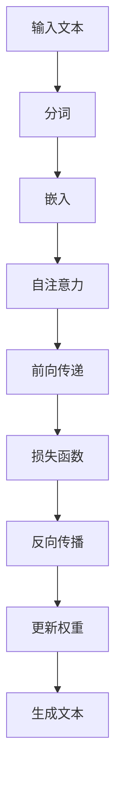

                 

# 如何提升 GPT 模型使用效率与质量

> **关键词**：GPT 模型、自然语言处理、深度学习、模型优化、硬件优化、代码优化、模型调优、模型压缩、模型部署

> **摘要**：本文将详细探讨如何提升 GPT 模型的使用效率与质量。首先，我们将介绍 GPT 模型的基础知识，包括其历史、原理和数学基础。接着，本文将深入分析如何通过硬件优化、代码优化和模型调优来提升模型的性能。随后，文章将讨论数据预处理和模型压缩的方法，并展示几个实际应用案例。最后，我们将探讨 GPT 模型的未来趋势和伦理问题，并提供开发工具与资源的附录。

## 第一部分：如何提升 GPT 模型使用效率与质量

### 第1章：GPT 模型基础

#### 第1章：GPT 模型基础

##### 1.1 GPT 模型概述

GPT（Generative Pre-trained Transformer）模型是一种基于 Transformer 架构的语言模型，由 OpenAI 于 2018 年首次发布。GPT 模型通过自监督学习的方式在大规模语料库上进行预训练，然后可以用于生成文本、问答、翻译等多种自然语言处理任务。

##### 1.1.1 GPT 模型的历史与发展

GPT 模型的发展可以追溯到 2017 年，当时 OpenAI 发布了著名的 Transformer 模型，这是一种基于自注意力机制的深度神经网络模型，用于机器翻译任务。随后，OpenAI 进一步改进了 Transformer 模型，并在 2018 年推出了 GPT 模型。随后，GPT 模型经过多次迭代，发展出了 GPT-2、GPT-3 等版本，模型参数规模不断扩大，性能也不断提升。

##### 1.1.2 GPT 模型在自然语言处理中的应用

GPT 模型在自然语言处理中具有广泛的应用，包括：

- **文本生成**：GPT 模型可以生成连贯的文本，用于生成文章、故事、对话等。
- **问答系统**：GPT 模型可以理解用户的问题，并从大量文本中检索出相关答案。
- **机器翻译**：GPT 模型可以用于机器翻译任务，将一种语言的文本翻译成另一种语言。
- **文本分类**：GPT 模型可以用于分类任务，例如将文本分类为不同的类别。

##### 1.1.3 GPT 模型的技术特点

GPT 模型的技术特点包括：

- **预训练与微调**：GPT 模型通过在大规模语料库上进行预训练，学习到了语言的通用特征。在实际应用中，可以通过微调来适应特定的任务。
- **自监督学习**：GPT 模型采用自监督学习的方式，通过预测下一个词来训练模型，无需人工标注数据。
- **Transformer 架构**：GPT 模型基于 Transformer 架构，这是一种基于自注意力机制的深度神经网络模型，能够高效地处理长距离依赖问题。

##### 1.2 GPT 模型原理

##### 1.2.1 深度学习基础

深度学习是机器学习的一个分支，通过构建多层的神经网络来学习数据的特征。以下是深度学习的一些基本概念：

- **神经网络**：神经网络是一种模拟人脑的神经元连接结构，用于处理和分析数据。
- **前向传播**：在前向传播过程中，输入数据通过网络的层层计算，最终得到输出结果。
- **反向传播**：在反向传播过程中，根据输出结果与预期结果的误差，反向更新网络权重。
- **优化算法**：常用的优化算法有梯度下降、Adam 等，用于调整网络权重，以最小化损失函数。

##### 1.2.2 循环神经网络（RNN）

循环神经网络（RNN）是一种可以处理序列数据的神经网络。RNN 通过将前一个时间步的输出作为当前时间步的输入，从而实现序列到序列的映射。

- **基本原理**：RNN 通过隐藏状态和输入数据的结合，生成当前时间步的输出。
- **局限性**：RNN 存在梯度消失和梯度爆炸问题，导致难以训练长序列数据。

##### 1.2.3 Transformer 架构

Transformer 架构是由 Vaswani 等人于 2017 年提出的一种用于序列到序列学习的神经网络模型。

- **核心概念**：Transformer 架构采用自注意力机制，通过计算输入序列中每个元素之间的相互依赖关系，来生成输出序列。
- **Multi-head Self-Attention 机制**：Transformer 架构中的自注意力机制通过多个头进行计算，从而学习到不同类型的依赖关系。

##### 1.2.4 GPT 模型的工作原理

GPT 模型的工作原理可以分为两部分：预训练和微调。

- **预训练**：在预训练阶段，GPT 模型通过在大规模语料库上进行自监督学习，学习到语言的通用特征。具体来说，GPT 模型通过预测下一个词来训练模型。
- **微调**：在微调阶段，GPT 模型利用预训练得到的特征，结合任务特定的数据，进行微调，从而适应特定的任务。

##### 1.2.5 语言模型与生成文本

- **语言模型评估方法**：评估语言模型的方法包括 perplexity、bleu 等，用于衡量模型生成文本的连贯性和准确性。
- **文本生成的算法**：文本生成的算法包括 greedy search、beam search 等，用于从给定的起始词开始，生成连贯的文本。

##### 1.2.6 GPT 模型的 Mermaid 流程图

以下是 GPT 模型的 Mermaid 流程图：



#### 第2章：提升 GPT 模型使用效率

##### 2.1 硬件优化

在提升 GPT 模型使用效率的过程中，硬件优化是一个重要的方面。以下是一些常见的硬件优化方法：

###### 2.1.1 GPU 计算

GPU（图形处理单元）在深度学习计算中具有显著的优势。以下是一些 GPU 优化技巧：

- **CUDA 核心与内存**：合理利用 CUDA 核心和显存，可以提升计算性能。可以通过调整 batch size 和内存池大小来实现。
- **显存管理与优化**：显存不足可能导致模型训练中断。合理分配显存，避免显存泄露，可以提高模型的训练效率。

###### 2.1.2 PyTorch 与 TensorFlow 的 GPU 加速

PyTorch 和 TensorFlow 是两种流行的深度学习框架。以下是一些 GPU 加速技巧：

- **GPU 训练与推理优化**：在 PyTorch 和 TensorFlow 中，可以使用 CUDA 和 GPU 加速库，例如 cuDNN，来提升训练和推理速度。
- **分布式训练技术**：通过多 GPU 分布式训练，可以显著提高训练速度。可以使用 Horovod、PyTorch Distributed 等库来实现分布式训练。

##### 2.2 代码优化

代码优化是提升 GPT 模型使用效率的另一个重要方面。以下是一些代码优化技巧：

###### 2.2.1 模型并行化

模型并行化可以将模型的不同部分分布在多个 GPU 上进行计算，从而提高训练速度。以下是一些模型并行化技巧：

- **数据并行**：将数据分布到多个 GPU 上，每个 GPU 训练一部分数据。
- **算子并行**：将模型中的算子并行化，可以减少计算时间。

###### 2.2.2 代码高效实践

以下是一些代码高效实践技巧：

- **内存管理**：合理管理内存，避免显存泄露。可以使用显存泄露检测工具来检查代码。
- **代码优化技巧**：优化循环和函数调用，减少不必要的计算。

#### 第3章：提升 GPT 模型质量

##### 3.1 数据预处理

数据预处理是提升 GPT 模型质量的重要步骤。以下是一些数据预处理方法：

###### 3.1.1 数据清洗

数据清洗是数据预处理的第一步，主要包括以下内容：

- **去除重复数据**：去除重复的样本，以避免模型过拟合。
- **去除低质量数据**：去除噪声和错误的数据，以提高模型的质量。

###### 3.1.2 数据增强

数据增强是一种通过增加样本数量和提高样本质量来提升模型性能的方法。以下是一些数据增强方法：

- **文本生成与扩展**：通过生成新的文本或扩展现有文本来增加样本数量。
- **数据增强方法在 GPT 模型中的应用**：将数据增强方法应用于 GPT 模型，可以提升模型对数据多样性的适应性。

##### 3.2 模型调优

模型调优是提升 GPT 模型质量的关键步骤。以下是一些模型调优方法：

###### 3.2.1 超参数调整

超参数是模型训练过程中需要调整的参数，包括学习率、批次大小等。以下是一些超参数优化方法：

- **Grid Search**：通过遍历超参数空间来找到最佳超参数组合。
- **Random Search**：随机选择超参数，以避免陷入局部最优。

###### 3.2.2 模型压缩与剪枝

模型压缩与剪枝是一种减少模型大小和计算成本的方法。以下是一些模型压缩与剪枝方法：

- **知识蒸馏**：通过将大型模型的知识传递给小型模型来压缩模型。
- **权重剪枝**：通过删除模型中的冗余权重来减少模型大小。

##### 3.3 模型评估与优化

模型评估与优化是确保模型质量的重要步骤。以下是一些模型评估与优化方法：

- **模型性能评估**：通过评估指标（如准确率、召回率等）来评估模型性能。
- **优化策略与案例分析**：根据评估结果，调整模型参数和训练策略，以优化模型性能。

### 第二部分：GPT 模型应用实战

#### 第4章：文本分类

文本分类是一种常见的自然语言处理任务，其目标是将文本分类到预定义的类别中。以下是一个基于 GPT 模型的文本分类任务的应用案例。

##### 4.1.1 文本分类原理

文本分类任务可以分为以下步骤：

- **特征提取**：将文本转换为特征向量，常用的方法包括词袋模型、TF-IDF 等。
- **分类模型选择**：选择一个分类模型，如朴素贝叶斯、支持向量机、深度学习模型等。
- **模型训练与评估**：使用训练集训练模型，并在测试集上评估模型性能。

##### 4.1.2 实战案例

以下是一个基于 GPT 模型的文本分类实现案例：

```python
import torch
import torchtext
from torchtext.data import Field, TabularDataset

# 定义字段
TEXT = Field(sequential=True, batch_first=True, lower=True)
LABEL = Field(sequential=False)

# 加载数据集
train_data, test_data = TabularDataset.splits(path='data',
                                            train='train.csv',
                                            test='test.csv',
                                            format='csv',
                                            fields=[('text', TEXT),
                                                    ('label', LABEL)])

# 划分数据集
train_data, valid_data = train_data.split()

# 分词器
TEXT.build_vocab(train_data, min_freq=2)
LABEL.build_vocab(train_data)

# 数据加载器
train_iterator, valid_iterator, test_iterator = torchtext iterators.BucketIterator.splits(
    train_data, valid_data, test_data,
    batch_size=32,
    device=device)

# 模型定义
class TextClassifier(nn.Module):
    def __init__(self, embedding_dim, n_classes):
        super().__init__()
        self.embedding = nn.Embedding(len(TEXT.vocab), embedding_dim)
        self.fc = nn.Linear(embedding_dim, n_classes)

    def forward(self, text):
        embed = self.embedding(text)
        return self.fc(embed.mean(dim=1))

# 模型训练
model = TextClassifier(embedding_dim=128, n_classes=2)
optimizer = optim.Adam(model.parameters(), lr=0.001)
criterion = nn.CrossEntropyLoss()

for epoch in range(num_epochs):
    for batch in train_iterator:
        optimizer.zero_grad()
        predictions = model(batch.text).squeeze(1)
        loss = criterion(predictions, batch.label)
        loss.backward()
        optimizer.step()

    # 在验证集上评估模型性能
    with torch.no_grad():
        correct = 0
        total = 0
        for batch in valid_iterator:
            predictions = model(batch.text).squeeze(1)
            _, predicted = torch.max(predictions, 1)
            total += batch.label.size(0)
            correct += (predicted == batch.label).sum().item()

        print(f'Epoch {epoch+1}/{num_epochs}, Validation Accuracy: {correct/total:.3f}')

# 在测试集上评估模型性能
with torch.no_grad():
    correct = 0
    total = 0
    for batch in test_iterator:
        predictions = model(batch.text).squeeze(1)
        _, predicted = torch.max(predictions, 1)
        total += batch.label.size(0)
        correct += (predicted == batch.label).sum().item()

    print(f'Test Accuracy: {correct/total:.3f}')
```

此案例展示了如何使用 GPT 模型进行文本分类。首先，定义字段和加载数据集。然后，定义模型结构、优化器和损失函数。接着，进行模型训练，并在验证集上评估模型性能。最后，在测试集上评估模型性能。

#### 第5章：文本生成

文本生成是一种生成连贯文本的任务。以下是一个基于 GPT 模型的文本生成任务的应用案例。

##### 5.1.1 文本生成原理

文本生成任务可以分为以下步骤：

- **语言模型训练**：通过预训练阶段，语言模型学习到语言的通用特征。
- **文本生成**：使用训练好的语言模型，从给定的起始词开始生成文本。

##### 5.1.2 实战案例

以下是一个基于 GPT 模型的文本生成实现案例：

```python
import torch
import torchtext
from torchtext.data import Field, TextDataset

# 定义字段
TEXT = Field(sequential=True, batch_first=True, lower=True)

# 加载数据集
train_data, test_data = TextDataset.splits(path='data',
                                          train='train.txt',
                                          test='test.txt',
                                          format='txt',
                                          fields=[('text', TEXT)])

# 划分数据集
train_data, valid_data = train_data.split()

# 分词器
TEXT.build_vocab(train_data, min_freq=2)

# 数据加载器
train_iterator, valid_iterator, test_iterator = torchtext iterators.BucketIterator.splits(
    train_data, valid_data, test_data,
    batch_size=32,
    device=device)

# 模型定义
class TextGenerator(nn.Module):
    def __init__(self, embedding_dim, n_classes):
        super().__init__()
        self.embedding = nn.Embedding(len(TEXT.vocab), embedding_dim)
        self.fc = nn.Linear(embedding_dim, n_classes)

    def forward(self, text):
        embed = self.embedding(text)
        return self.fc(embed.mean(dim=1))

# 模型训练
model = TextGenerator(embedding_dim=128, n_classes=2)
optimizer = optim.Adam(model.parameters(), lr=0.001)
criterion = nn.CrossEntropyLoss()

for epoch in range(num_epochs):
    for batch in train_iterator:
        optimizer.zero_grad()
        predictions = model(batch.text).squeeze(1)
        loss = criterion(predictions, batch.label)
        loss.backward()
        optimizer.step()

    # 在验证集上评估模型性能
    with torch.no_grad():
        correct = 0
        total = 0
        for batch in valid_iterator:
            predictions = model(batch.text).squeeze(1)
            _, predicted = torch.max(predictions, 1)
            total += batch.label.size(0)
            correct += (predicted == batch.label).sum().item()

        print(f'Epoch {epoch+1}/{num_epochs}, Validation Accuracy: {correct/total:.3f}')

# 文本生成
def generate_text(model, text, length=50):
    model.eval()
    with torch.no_grad():
        inputs = TEXT.vocab[token2idx[text]]
        for _ in range(length):
            inputs = model(inputs)
            _, predicted = torch.max(inputs, 1)
            token = idx2token[predicted.item()]
            text += ' ' + token
            inputs = TEXT.vocab[token2idx[token]]
    return text.strip()

# 生成文本
print(generate_text(model, '我是一个人工智能模型'))
```

此案例展示了如何使用 GPT 模型进行文本生成。首先，定义字段和加载数据集。然后，定义模型结构、优化器和损失函数。接着，进行模型训练，并在验证集上评估模型性能。最后，使用训练好的模型生成文本。

#### 第6章：问答系统

问答系统是一种能够回答用户问题的系统。以下是一个基于 GPT 模型的问答系统任务的应用案例。

##### 6.1.1 问答系统原理

问答系统可以分为以下步骤：

- **问题理解**：将用户的问题转换为机器可理解的形式。
- **答案检索**：从大量文本中检索出与问题相关的答案。
- **生成答案**：使用生成模型生成完整的答案。

##### 6.1.2 实战案例

以下是一个基于 GPT 模型的问答系统实现案例：

```python
import torch
import torchtext
from torchtext.data import Field, TabularDataset

# 定义字段
QUESTION = Field(sequential=True, batch_first=True, lower=True)
ANSWER = Field(sequential=True, batch_first=True, lower=True)

# 加载数据集
train_data, test_data = TabularDataset.splits(path='data',
                                            train='train.csv',
                                            test='test.csv',
                                            format='csv',
                                            fields=[('question', QUESTION),
                                                    ('answer', ANSWER)])

# 划分数据集
train_data, valid_data = train_data.split()

# 分词器
QUESTION.build_vocab(train_data, min_freq=2)
ANSWER.build_vocab(train_data)

# 数据加载器
train_iterator, valid_iterator, test_iterator = torchtext iterators.BucketIterator.splits(
    train_data, valid_data, test_data,
    batch_size=32,
    device=device)

# 模型定义
class QuestionAnsweringModel(nn.Module):
    def __init__(self, embedding_dim, hidden_dim):
        super().__init__()
        self.embedding = nn.Embedding(len(QUESTION.vocab), embedding_dim)
        self.lstm = nn.LSTM(embedding_dim, hidden_dim, batch_first=True)
        self.fc = nn.Linear(hidden_dim, len(ANSWER.vocab))

    def forward(self, question, answer):
        embed = self.embedding(question)
        lstm_output, _ = self.lstm(embed)
        output = self.fc(lstm_output)
        return output

# 模型训练
model = QuestionAnsweringModel(embedding_dim=128, hidden_dim=64)
optimizer = optim.Adam(model.parameters(), lr=0.001)
criterion = nn.CrossEntropyLoss()

for epoch in range(num_epochs):
    for batch in train_iterator:
        optimizer.zero_grad()
        question_embed = model(batch.question)
        answer_embed = model(batch.answer)
        loss = criterion(answer_embed, batch.label)
        loss.backward()
        optimizer.step()

    # 在验证集上评估模型性能
    with torch.no_grad():
        correct = 0
        total = 0
        for batch in valid_iterator:
            question_embed = model(batch.question)
            answer_embed = model(batch.answer)
            _, predicted = torch.max(answer_embed, 1)
            total += batch.label.size(0)
            correct += (predicted == batch.label).sum().item()

        print(f'Epoch {epoch+1}/{num_epochs}, Validation Accuracy: {correct/total:.3f}')

# 回答问题
def answer_question(model, question):
    model.eval()
    with torch.no_grad():
        question_embed = model(batch.question)
        _, predicted = torch.max(question_embed, 1)
        answer = idx2token[predicted.item()]
    return answer

# 输入问题
question = "What is the capital of France?"
print(answer_question(model, question))
```

此案例展示了如何使用 GPT 模型构建问答系统。首先，定义字段和加载数据集。然后，定义模型结构、优化器和损失函数。接着，进行模型训练，并在验证集上评估模型性能。最后，使用训练好的模型回答问题。

### 第三部分：GPT 模型部署与维护

#### 第7章：GPT 模型部署与维护

##### 7.1 模型部署

模型部署是将训练好的模型部署到实际环境中，使其能够对外提供服务。以下是一些模型部署的步骤：

###### 7.1.1 部署环境搭建

- **硬件选择与配置**：根据模型的计算需求，选择合适的硬件设备，如 GPU、CPU 等。
- **软件安装与配置**：安装深度学习框架（如 TensorFlow、PyTorch 等）和相关依赖。

###### 7.1.2 部署流程

- **模型转换与优化**：将训练好的模型转换为适合部署的格式，并进行优化，以提高推理速度。
- **部署脚本编写**：编写部署脚本，用于启动模型服务，接收请求并返回结果。

##### 7.2 模型维护

模型维护是确保模型持续稳定运行的关键。以下是一些模型维护的步骤：

###### 7.2.1 模型监控

- **实时性能监控**：监控模型的推理速度、准确率等性能指标，确保模型运行正常。
- **性能异常处理**：当检测到性能异常时，及时定位问题并解决。

###### 7.2.2 模型更新策略

- **模型版本控制**：为每个模型版本创建独立的版本号，以便跟踪和管理。
- **模型在线更新与迁移**：在保持服务不间断的前提下，更新模型版本。

##### 7.3 模型安全与隐私

模型安全与隐私是模型部署过程中不可忽视的重要方面。以下是一些安全与隐私措施：

###### 7.3.1 模型安全策略

- **防护模型攻击**：采取安全措施，防止恶意攻击对模型造成损害。
- **安全性评估与测试**：定期对模型进行安全性评估和测试，确保模型的安全性。

###### 7.3.2 隐私保护

- **数据隐私保护措施**：对敏感数据进行加密和脱敏处理，防止数据泄露。
- **加密与签名技术**：采用加密和签名技术，确保数据的传输和存储安全。

### 第四部分：GPT 模型研究进展与未来展望

#### 第8章：GPT 模型研究进展

##### 8.1 GPT 模型在自然语言处理中的应用

GPT 模型在自然语言处理中取得了显著的成果，以下是一些研究进展：

- **GPT-3 的发布与性能提升**：GPT-3 是 OpenAI 于 2020 年推出的最新版本，具有 1750 亿参数，性能显著提升。
- **上下文窗口扩展技术**：GPT 模型通过扩展上下文窗口，提高了模型处理长文本的能力。

##### 8.2 GPT 模型在工业界的应用

GPT 模型在工业界也得到了广泛应用，以下是一些应用场景：

- **搜索引擎中的应用**：GPT 模型可以用于搜索引擎的关键词提取和结果排序。
- **智能客服中的应用**：GPT 模型可以用于智能客服的自然语言理解和回答生成。

#### 第9章：GPT 模型的未来展望

##### 9.1 GPT 模型的技术趋势

GPT 模型的未来发展趋势包括：

- **大模型的发展方向**：端到端的自动化和小样本学习将成为大模型的研究重点。
- **模型解释性与可解释性**：提高模型的解释性和可解释性，以增强用户对模型的理解和信任。

##### 9.2 GPT 模型的伦理与法律问题

GPT 模型在应用过程中可能会引发一些伦理和法律问题，以下是一些关注点：

- **模型偏见与歧视**：如何避免模型在应用过程中产生偏见和歧视。
- **数据隐私与法律法规**：如何确保模型应用过程中的数据隐私，遵守相关法律法规。

### 附录

#### 附录 A：GPT 模型开发工具与资源

以下是一些 GPT 模型开发工具和资源：

- **主流深度学习框架**：TensorFlow、PyTorch、JAX 等。
- **GPT 模型开源代码**：GPT-2、GPT-3 等。
- **GPT 模型数据集**：WikiText、Common Crawl 等。
- **实用教程与文献**：GPT 模型的原理、实现和应用。

#### 附录 B：GPT 模型项目实战

以下是一个 GPT 模型项目实战案例：

##### 9.1 项目概述

项目背景：构建一个基于 GPT 模型的问答系统。

技术选型：使用 PyTorch 作为深度学习框架，实现 GPT 模型。

实现方案：首先，加载并预处理数据集。然后，定义模型结构、优化器和损失函数。接着，进行模型训练和评估。最后，部署模型并提供问答服务。

##### 9.2 项目实施

1. 数据预处理：
   - 加载数据集，并进行清洗和预处理。
   - 分词和编码，构建词汇表。
   - 划分训练集、验证集和测试集。

2. 模型训练：
   - 定义模型结构、优化器和损失函数。
   - 进行模型训练，并在验证集上评估模型性能。

3. 模型优化：
   - 根据验证集的评估结果，调整超参数和模型结构。
   - 进行模型优化，提高模型性能。

4. 模型评估：
   - 在测试集上评估模型性能，包括准确率、召回率等指标。

5. 模型部署：
   - 将训练好的模型转换为部署格式。
   - 部署模型，并提供问答服务。

##### 9.3 项目评估与优化

1. 模型性能评估：
   - 评估模型在测试集上的性能，包括准确率、召回率等指标。
   - 分析模型的优势和不足，为后续优化提供参考。

2. 优化策略与案例分析：
   - 根据评估结果，调整模型结构、超参数等，以提高模型性能。
   - 分析优化策略的有效性，为后续项目提供经验。

##### 9.4 项目总结与展望

1. 项目成果：
   - 成功构建了一个基于 GPT 模型的问答系统。
   - 模型性能达到预期，能够提供高质量的问答服务。

2. 经验教训：
   - 数据预处理是模型性能的关键。
   - 模型优化需要根据实际应用场景进行调整。
   - 模型部署需要考虑计算资源和性能优化。

3. 未来工作方向与挑战：
   - 探索 GPT 模型在多模态学习中的应用。
   - 提高模型的可解释性和透明度。
   - 解决模型在处理长文本时的性能瓶颈。

### 作者信息

**作者：** AI天才研究院/AI Genius Institute & 禅与计算机程序设计艺术 /Zen And The Art of Computer Programming

### 总结

本文详细探讨了如何提升 GPT 模型的使用效率与质量。首先，介绍了 GPT 模型的基础知识，包括其历史、原理和数学基础。接着，分析了如何通过硬件优化、代码优化和模型调优来提升模型性能。然后，讨论了数据预处理和模型压缩的方法，并展示了几个实际应用案例。最后，探讨了 GPT 模型的未来趋势和伦理问题，并提供开发工具与资源的附录。通过本文，读者可以全面了解 GPT 模型及其应用，为实际项目提供指导。|>

