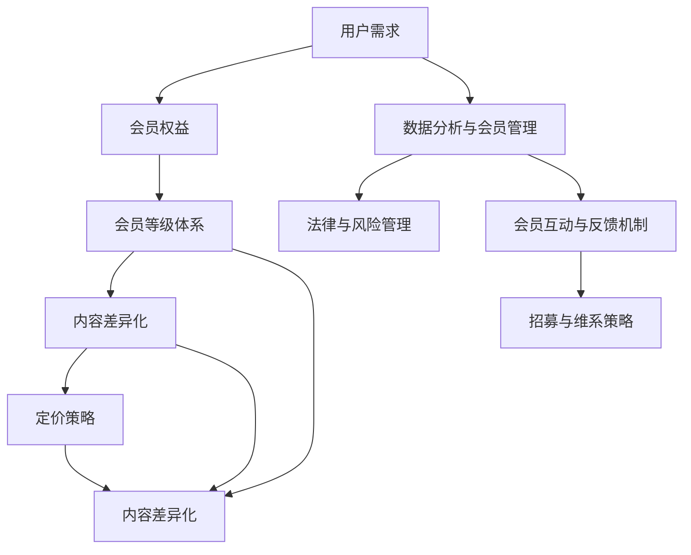

                 

# 如何设计有吸引力的知识付费会员制度

## 摘要

知识付费会员制度作为知识经济时代的一种新兴商业模式，正逐渐改变着信息传播和获取的方式。本文旨在深入探讨如何设计有吸引力的知识付费会员制度，以提高用户的参与度和忠诚度。我们将从会员制度的背景与意义、策略、核心要素、实施与运营、法律与风险管理、成功案例分析以及未来展望等多个方面，系统性地分析并阐述设计知识付费会员制度的理论和方法。通过本文，读者将能够理解知识付费会员制度的核心概念，掌握设计策略和实施方法，从而在实际操作中创造出既具有吸引力又具备可持续发展的会员制度。

## 关键词

- 知识付费
- 会员制度
- 用户需求
- 服务差异化
- 定价策略
- 数据分析
- 法律合规
- 成功案例

## 目录

### 第一部分：知识付费会员制度概述

### 第1章：知识付费会员制度的背景与意义

- **1.1 知识付费的兴起与趋势**
  - 知识付费的起源与发展
  - 用户对知识付费的需求分析
  - 知识付费在当前市场中的地位

- **1.2 会员制度的定义与类型**
  - 会员制度的定义
  - 会员制度的分类
  - 会员制度的核心目标

### 第2章：设计有吸引力的知识付费会员制度的策略

- **2.1 明确目标用户群体**
  - 用户画像分析
  - 用户需求挖掘
  - 用户满意度评估

- **2.2 构建差异化的会员服务**
  - 内容差异化
  - 服务差异化
  - 会员权益差异化

- **2.3 制定合理的会员定价策略**
  - 定价模式分析
  - 成本与收益平衡
  - 定价策略调整

### 第3章：知识付费会员制度的核心要素

- **3.1 会员等级体系设计**
  - 等级划分原则
  - 等级权益设计
  - 等级提升机制

- **3.2 会员权益设计**
  - 权益内容规划
  - 权益的呈现方式
  - 权益的有效期与更新

- **3.3 会员互动与反馈机制**
  - 会员互动渠道建设
  - 反馈机制搭建
  - 成功案例分析

### 第4章：知识付费会员制度的实施与运营

- **4.1 会员招募策略**
  - 招募目标设定
  - 招募渠道选择
  - 招募效果评估

- **4.2 会员维系策略**
  - 维系目标设定
  - 维系手段选择
  - 维系效果评估

- **4.3 数据分析与会员管理**
  - 数据分析的重要性
  - 数据分析工具与应用
  - 会员管理优化建议

### 第5章：知识付费会员制度的法律与风险管理

- **5.1 法律法规与合规性**
  - 相关法律法规概述
  - 会员制度设计中的法律风险
  - 法律合规性评估与改进

- **5.2 风险管理策略**
  - 风险识别与评估
  - 风险应对措施
  - 风险管理效果评估

### 第6章：成功案例分析

- **6.1 国内知名知识付费平台案例分析**
  - 平台选择与分析
  - 模式创新与优势
  - 经验与启示

- **6.2 国际知识付费会员制度案例分析**
  - 国际市场特点分析
  - 案例介绍与解析
  - 案例对国内市场的启示

### 第7章：未来展望

- **7.1 知识付费会员制度的发展趋势**
  - 行业发展趋势分析
  - 技术革新对会员制度的影响
  - 未来发展方向预测

## 附录

- **附录A：知识付费会员制度设计工具与资源**
  - 设计工具介绍
  - 相关资源推荐
  - 设计工具应用案例

---

接下来的部分将详细阐述每个章节的内容，帮助读者逐步理解和掌握设计有吸引力的知识付费会员制度的方法与策略。

## 第一部分：知识付费会员制度概述

### 第1章：知识付费会员制度的背景与意义

#### 1.1 知识付费的兴起与趋势

知识付费是指用户为了获取特定知识或信息而进行付费的行为。这一现象的兴起可以追溯到互联网和移动互联网的快速发展，使得知识传播变得更加便捷和高效。知识付费的发展趋势可以从以下几个方面进行分析：

1. **信息过载与知识筛选需求**：随着信息的爆炸式增长，用户面临的信息过载问题日益严重，他们需要更加精准和高效的知识筛选工具。知识付费提供了一种解决方案，通过付费获取高质量的内容和专业的服务，用户能够更快速地找到所需的信息。

2. **教育转型与在线学习**：在线教育的快速发展推动了知识付费的普及。越来越多的人选择通过在线课程、专业讲座、电子书等形式进行学习，这为知识付费提供了广阔的市场空间。

3. **内容创业与平台崛起**：知识付费也催生了内容创业的兴起。许多专业人士和学者通过创作和分享高质量的内容，实现了个人品牌的塑造和商业价值的变现。同时，知识付费平台如得到、知乎Live等迅速崛起，为知识付费提供了重要的基础设施。

#### 1.2 会员制度的定义与类型

会员制度是一种通过提供特定权益和服务来吸引用户付费并保持用户黏性的商业模式。会员制度可以分为以下几种类型：

1. **按月订阅会员**：用户每月支付固定费用，享受平台提供的所有内容和服务。

2. **按年订阅会员**：用户一次性支付全年费用，享受平台提供的所有内容和服务。

3. **等级会员**：根据用户的贡献或消费额度，将用户分为不同的等级，每个等级享有不同的权益和服务。

4. **特权会员**：为某些特定的用户群体提供的特殊权益和服务，如VIP用户、高级会员等。

#### 1.3 会员制度的核心目标

会员制度的设计目标主要包括以下几个方面：

1. **用户留存与黏性**：通过提供优质的内容和服务，提高用户的留存率和黏性，减少用户流失。

2. **用户增长与转化**：通过有效的会员招募策略，增加会员数量，提高用户的付费转化率。

3. **品牌价值提升**：通过会员制度的设计和运营，提升品牌形象和用户忠诚度，增强品牌的市场竞争力。

4. **商业收益增长**：通过会员费用的收取和会员服务的增值，实现商业收益的稳定增长。

### 第2章：设计有吸引力的知识付费会员制度的策略

#### 2.1 明确目标用户群体

明确目标用户群体是设计有吸引力的会员制度的第一步。通过以下方法，可以更好地了解和定位目标用户：

1. **用户画像分析**：通过对用户的基本信息、行为习惯、兴趣爱好等进行深入分析，构建用户画像。

2. **用户需求挖掘**：通过问卷调查、用户访谈等方式，了解用户的需求和期望，为会员制度的设计提供依据。

3. **用户满意度评估**：定期进行用户满意度调查，评估会员制度的设计和运营效果，及时调整和优化。

#### 2.2 构建差异化的会员服务

差异化的会员服务是提升会员满意度和忠诚度的关键。以下策略可以帮助构建有吸引力的会员服务：

1. **内容差异化**：根据用户的需求和兴趣，提供不同类型的内容和服务，如专业课程、行业报告、一对一咨询等。

2. **服务差异化**：提供个性化的服务，如定制化内容推荐、专属客服支持等，提高用户的满意度。

3. **会员权益差异化**：根据会员的等级和贡献，提供不同的权益和服务，如免费课程、折扣优惠、优先体验等。

#### 2.3 制定合理的会员定价策略

会员定价策略是会员制度设计的重要环节，以下策略可以帮助制定合理的会员定价：

1. **定价模式分析**：根据市场需求和竞争状况，选择合适的定价模式，如固定定价、动态定价、套餐定价等。

2. **成本与收益平衡**：在定价过程中，要考虑成本和收益的平衡，确保会员费用的收取能够覆盖成本并实现盈利。

3. **定价策略调整**：根据市场变化和用户反馈，及时调整定价策略，以适应市场和用户的需求。

### 第3章：知识付费会员制度的核心要素

#### 3.1 会员等级体系设计

会员等级体系是会员制度的重要组成部分，以下原则可以帮助设计有效的会员等级体系：

1. **等级划分原则**：根据用户的行为和贡献，合理划分等级，如注册会员、普通会员、高级会员、VIP会员等。

2. **等级权益设计**：为不同等级的会员提供不同的权益和服务，如免费课程、折扣优惠、专属活动等。

3. **等级提升机制**：设置会员等级提升的机制，如积分累积、行为奖励等，鼓励用户持续参与和贡献。

#### 3.2 会员权益设计

会员权益是会员制度的核心，以下策略可以帮助设计有吸引力的会员权益：

1. **权益内容规划**：根据用户需求和会员等级，规划不同的权益内容，如免费课程、会员专享活动、行业报告等。

2. **权益的呈现方式**：通过网站、APP、邮件等方式，及时向用户呈现会员权益，提高用户的使用体验。

3. **权益的有效期与更新**：设定权益的有效期，如按月、按年等，同时定期更新权益内容，保持用户的兴趣和参与度。

#### 3.3 会员互动与反馈机制

有效的会员互动和反馈机制有助于提高会员满意度和忠诚度，以下策略可以帮助建立良好的互动与反馈机制：

1. **会员互动渠道建设**：搭建多渠道的会员互动平台，如社区、论坛、在线聊天等，方便用户交流和互动。

2. **反馈机制搭建**：建立用户反馈渠道，如问卷调查、意见箱等，收集用户的意见和建议，及时进行改进。

3. **成功案例分析**：分析成功案例，借鉴其成功的互动与反馈机制，优化自己的会员互动与反馈体系。

### 第4章：知识付费会员制度的实施与运营

#### 4.1 会员招募策略

会员招募是会员制度实施的关键环节，以下策略可以帮助有效招募会员：

1. **招募目标设定**：明确会员招募的目标，如数量、质量、转化率等。

2. **招募渠道选择**：选择合适的招募渠道，如社交媒体、广告投放、合作伙伴等。

3. **招募效果评估**：定期评估会员招募效果，如会员数量、转化率、留存率等，根据评估结果调整招募策略。

#### 4.2 会员维系策略

会员维系是保持会员黏性和活跃度的关键，以下策略可以帮助有效维系会员：

1. **维系目标设定**：明确会员维系的目标，如满意度、留存率、活跃度等。

2. **维系手段选择**：选择合适的维系手段，如个性化推送、会员活动、专属优惠等。

3. **维系效果评估**：定期评估会员维系效果，如会员满意度、留存率、活跃度等，根据评估结果调整维系策略。

#### 4.3 数据分析与会员管理

数据分析在会员管理中具有重要价值，以下策略可以帮助进行会员数据分析和管理：

1. **数据分析的重要性**：理解数据分析在会员管理中的作用，如用户行为分析、需求分析、市场分析等。

2. **数据分析工具与应用**：选择合适的分析工具，如Excel、Python、Hadoop等，进行会员数据分析。

3. **会员管理优化建议**：根据数据分析结果，提出会员管理的优化建议，如会员招募策略调整、会员权益优化、会员服务改进等。

### 第5章：知识付费会员制度的法律与风险管理

#### 5.1 法律法规与合规性

会员制度的实施需要遵守相关法律法规，以下内容可以帮助确保会员制度的合规性：

1. **相关法律法规概述**：了解与会员制度相关的法律法规，如《中华人民共和国合同法》、《中华人民共和国消费者权益保护法》等。

2. **会员制度设计中的法律风险**：识别会员制度设计中的法律风险，如合同条款的合法性、隐私保护、知识产权等。

3. **法律合规性评估与改进**：定期进行法律合规性评估，发现并改进会员制度中的法律风险。

#### 5.2 风险管理策略

会员制度在实施过程中可能会面临各种风险，以下策略可以帮助进行风险管理：

1. **风险识别与评估**：识别会员制度实施过程中可能面临的风险，如市场风险、运营风险、法律风险等。

2. **风险应对措施**：制定应对风险的措施，如风险预防、风险控制、风险转移等。

3. **风险管理效果评估**：定期评估风险管理措施的效果，持续优化风险管理策略。

### 第6章：成功案例分析

#### 6.1 国内知名知识付费平台案例分析

以下是国内一些知名知识付费平台，通过对这些平台的分析，可以借鉴其成功经验：

1. **得到App**：得到App通过高质量的内容和独特的会员服务体系，吸引了大量用户。其成功经验包括内容质量、会员权益设计、平台运营等。

2. **知乎Live**：知乎Live以社区互动和个性化推荐为核心，提供了丰富的在线课程和讲座。其成功经验包括用户互动、内容创新、社区运营等。

3. **得到App**：得到App通过高质量的内容和独特的会员服务体系，吸引了大量用户。其成功经验包括内容质量、会员权益设计、平台运营等。

4. **知乎Live**：知乎Live以社区互动和个性化推荐为核心，提供了丰富的在线课程和讲座。其成功经验包括用户互动、内容创新、社区运营等。

#### 6.2 国际知识付费会员制度案例分析

以下是一些国际知识付费平台，通过对这些平台的案例分析，可以了解国际市场的特点及对国内市场的启示：

1. **Coursera**：Coursera通过提供全球顶尖大学和机构的在线课程，吸引了全球用户。其成功经验包括课程质量、用户服务、国际化战略等。

2. **Udemy**：Udemy以海量课程和灵活的定价策略著称，为全球用户提供多样化的学习资源。其成功经验包括课程数量、定价策略、用户增长等。

### 第7章：未来展望

#### 7.1 知识付费会员制度的发展趋势

随着知识付费的持续发展和市场环境的不断变化，知识付费会员制度也将呈现出以下趋势：

1. **个性化服务增强**：随着大数据和人工智能技术的发展，会员服务将更加个性化，满足用户个性化需求。

2. **跨界合作增多**：知识付费平台将与更多行业和企业进行跨界合作，提供多元化的服务内容。

3. **内容质量提升**：知识付费平台将更加注重内容质量，通过引进高质量的课程和讲师，提升用户满意度。

#### 7.2 技术革新对会员制度的影响

技术革新对知识付费会员制度的影响主要体现在以下几个方面：

1. **大数据分析**：通过大数据分析，了解用户需求和偏好，优化会员制度设计和服务。

2. **人工智能**：利用人工智能技术，实现个性化推荐、智能客服等功能，提高用户体验和满意度。

3. **区块链**：通过区块链技术，提高会员制度的透明度和安全性，增强用户信任。

#### 7.3 未来发展方向预测

未来，知识付费会员制度将朝着更加个性化、多元化、安全性的方向发展。以下方向值得关注：

1. **会员体系多元化**：会员体系将更加多元化，满足不同用户群体的需求。

2. **内容形式多样化**：知识付费内容将涵盖更多形式，如短视频、直播、互动式学习等。

3. **跨界融合**：知识付费将与更多行业进行跨界融合，提供更加丰富的服务内容。

### 附录

#### 附录A：知识付费会员制度设计工具与资源

以下是一些设计知识付费会员制度的工具和资源：

1. **会员制度设计工具**：如Excel、PowerPoint、流程图工具等。

2. **数据分析工具**：如Excel、Python、Hadoop等。

3. **相关资源推荐**：如学术论文、行业报告、优秀案例等。

### 结语

知识付费会员制度作为一种新兴商业模式，具有巨大的发展潜力和市场空间。通过本文的探讨，我们了解了知识付费会员制度的背景与意义，掌握了设计策略和实施方法，并对成功案例进行了分析。希望本文能为读者提供有益的参考和启示，助力他们在知识付费领域取得成功。在未来，知识付费会员制度将不断演进，为用户提供更加优质的服务和体验。

---

本文内容涵盖了知识付费会员制度的背景、设计策略、核心要素、实施与运营、法律与风险管理、成功案例分析以及未来展望等多个方面。每个章节都详细阐述了相关概念、策略、方法和案例分析，旨在为读者提供全面而深入的指导。

### 核心概念与联系

在设计知识付费会员制度时，有几个核心概念至关重要，它们构成了会员制度的理论基础和设计框架。以下是这些核心概念及其相互联系的解释：

#### 1. 用户需求

用户需求是设计会员制度的基础。理解用户需求有助于确定会员制度的目标、内容和价值。用户需求可以包括获取特定知识、提升技能、获得社交互动、个性化服务等方面。

#### 2. 会员权益

会员权益是会员制度的核心要素，指的是会员能够享受的各种服务、内容和特权。这些权益应根据用户需求进行设计，以吸引和留住会员。

#### 3. 会员等级体系

会员等级体系是根据用户的行为和贡献，将会员划分为不同等级的制度。等级体系的设计应考虑激励用户的积极性，并提供不同等级的权益，以鼓励用户提升等级。

#### 4. 内容差异化

内容差异化是指根据不同会员等级和用户需求，提供不同的内容和服务。这有助于提高会员的满意度和参与度，同时也能够增加会员的价值。

#### 5. 定价策略

定价策略是会员制度中决定会员费用的重要环节。合理的定价策略应考虑成本、市场需求和用户承受能力，以实现可持续的商业收益。

#### 6. 数据分析与会员管理

数据分析和会员管理是会员制度运营的关键。通过数据分析，可以深入了解用户行为、需求和满意度，从而优化会员服务和权益设计。

#### 7. 法律与风险管理

法律与风险管理是确保会员制度合规和可持续发展的必要条件。了解相关法律法规，建立有效的风险管理体系，有助于降低法律风险和运营风险。

#### 8. 会员互动与反馈机制

会员互动与反馈机制是提升会员满意度和忠诚度的关键。通过有效的互动和反馈，可以收集用户意见和建议，不断改进会员服务。

#### 9. 招募与维系策略

招募与维系策略是会员制度成功实施的重要手段。通过有效的招募策略，可以增加会员数量；通过有效的维系策略，可以提高会员的留存率和满意度。

### Mermaid 流程图

以下是一个简单的 Mermaid 流程图，展示了上述核心概念之间的联系：



### 结论

核心概念与联系是设计知识付费会员制度的基础。通过理解这些概念及其相互关系，可以更有效地制定会员制度的设计策略、实施方法和管理方案，从而实现会员制度的成功运营和可持续发展。

---

### 核心算法原理讲解

在设计知识付费会员制度时，算法原理的应用至关重要，尤其是在用户行为分析、需求预测和权益推荐等方面。以下将介绍几个关键算法原理，并使用伪代码详细阐述其实现过程。

#### 1. 用户行为分析算法

用户行为分析算法用于理解用户的行为模式，从而为会员制度的设计提供依据。常用的方法包括聚类分析、关联规则挖掘和时序分析。

**聚类分析：K-means 算法**

```python
# 伪代码：K-means 算法
def kmeans(data, k):
    # 初始化k个中心点
    centroids = initialize_centroids(data, k)
    
    while not converged(centroids):
        # 分配用户到最近的中心点
        clusters = assign_clusters(data, centroids)
        
        # 更新中心点位置
        centroids = update_centroids(clusters)
    
    return centroids, clusters

# 辅助函数
def initialize_centroids(data, k):
    # 根据数据初始化中心点
    # ...

def converged(centroids):
    # 判断中心点是否收敛
    # ...

def assign_clusters(data, centroids):
    # 将数据分配到最近的中心点
    # ...

def update_centroids(clusters):
    # 根据新分配的数据更新中心点
    # ...
```

**关联规则挖掘：Apriori 算法**

```python
# 伪代码：Apriori 算法
def apriori(data, min_support, min_confidence):
    frequent_itemsets = []
    for length in range(1, max_itemset_length(data)):
        # 生成候选项集
        candidates = generate_candidates(data, length)
        
        # 过滤频繁项集
        frequent_itemsets = filter_frequent_itemsets(data, candidates, min_support)
        
        # 生成关联规则
        rules = generate_rules(frequent_itemsets, min_confidence)
    
    return rules

# 辅助函数
def generate_candidates(data, length):
    # 生成候选项集
    # ...

def filter_frequent_itemsets(data, candidates, min_support):
    # 过滤频繁项集
    # ...

def generate_rules(frequent_itemsets, min_confidence):
    # 生成关联规则
    # ...
```

**时序分析：时间序列模型**

```python
# 伪代码：时间序列模型
def time_series_analysis(data):
    # 模型选择
    model = select_model(data)
    
    # 模型训练
    model = train_model(model, data)
    
    # 预测
    predictions = predict(model, data)

    return predictions

# 辅助函数
def select_model(data):
    # 根据数据选择合适的模型
    # ...

def train_model(model, data):
    # 训练模型
    # ...

def predict(model, data):
    # 预测
    # ...
```

#### 2. 用户需求预测算法

用户需求预测算法用于预测用户可能感兴趣的内容或服务，从而为个性化推荐提供支持。常用的方法包括协同过滤、基于内容的推荐和混合推荐。

**协同过滤：矩阵分解**

```python
# 伪代码：矩阵分解（SVD）
def svd_matrix_factorization(data, k):
    # 初始化用户和物品的隐变量矩阵
    U, V = initialize_matrices(data, k)
    
    while not converged(U, V):
        # 计算预测评分
        predictions = compute_predictions(U, V)
        
        # 更新隐变量矩阵
        U, V = update_matrices(U, V, predictions, data)
    
    return U, V

# 辅助函数
def initialize_matrices(data, k):
    # 初始化矩阵
    # ...

def converged(U, V):
    # 判断矩阵是否收敛
    # ...

def compute_predictions(U, V):
    # 计算预测评分
    # ...

def update_matrices(U, V, predictions, data):
    # 更新矩阵
    # ...
```

**基于内容的推荐：相似度计算**

```python
# 伪代码：相似度计算（余弦相似度）
def cosine_similarity(vector1, vector2):
    dot_product = dot(vector1, vector2)
    norm1 = norm(vector1)
    norm2 = norm(vector2)
    
    return dot_product / (norm1 * norm2)

# 辅助函数
def dot(vector1, vector2):
    # 计算点积
    # ...

def norm(vector):
    # 计算向量范数
    # ...
```

**混合推荐：协同过滤与基于内容结合**

```python
# 伪代码：混合推荐
def hybrid_recommender(data, content_model, collaborative_model):
    # 计算基于内容的推荐分数
    content_scores = content_model.predict(data)
    
    # 计算协同过滤的推荐分数
    collaborative_scores = collaborative_model.predict(data)
    
    # 混合推荐分数
    hybrid_scores = combine_scores(content_scores, collaborative_scores)
    
    return hybrid_scores

# 辅助函数
def combine_scores(content_scores, collaborative_scores):
    # 结合两种推荐方法的分数
    # ...
```

#### 3. 权益推荐算法

权益推荐算法用于根据用户行为和需求，推荐最适合用户的会员权益。常用的方法包括基于规则的推荐、基于模型的推荐和基于历史的推荐。

**基于规则的推荐**

```python
# 伪代码：基于规则的推荐
def rule_based_recommendation(user_behavior, rules):
    recommendations = []
    
    for rule in rules:
        # 检查用户行为是否符合规则条件
        if matches_condition(user_behavior, rule):
            recommendations.append(rule['benefit'])
    
    return recommendations

# 辅助函数
def matches_condition(user_behavior, rule):
    # 检查用户行为是否满足规则条件
    # ...

def rule_based_recommendation(user_behavior, rules):
    recommendations = []
    
    for rule in rules:
        # 检查用户行为是否符合规则条件
        if matches_condition(user_behavior, rule):
            recommendations.append(rule['benefit'])
    
    return recommendations

# 辅助函数
def matches_condition(user_behavior, rule):
    # 检查用户行为是否满足规则条件
    # ...
```

**基于模型的推荐**

```python
# 伪代码：基于模型的推荐
def model_based_recommendation(user_model, benefit_models):
    recommendations = []
    
    for benefit_model in benefit_models:
        # 计算用户对每个权益的偏好
        preference = user_model.predict(benefit_model)
        
        # 选择偏好最高的权益
        if preference > threshold:
            recommendations.append(benefit_model['benefit'])
    
    return recommendations

# 辅助函数
def predict(user_model, benefit_model):
    # 预测用户对权益的偏好
    # ...

def model_based_recommendation(user_model, benefit_models):
    recommendations = []
    
    for benefit_model in benefit_models:
        # 计算用户对每个权益的偏好
        preference = user_model.predict(benefit_model)
        
        # 选择偏好最高的权益
        if preference > threshold:
            recommendations.append(benefit_model['benefit'])
    
    return recommendations

# 辅助函数
def predict(user_model, benefit_model):
    # 预测用户对权益的偏好
    # ...
```

**基于历史的推荐**

```python
# 伪代码：基于历史的推荐
def historical_recommendation(user_history, historical_data):
    recommendations = []
    
    for item in historical_data:
        # 如果用户历史中有类似的物品，推荐该物品
        if similar_item_in_history(user_history, item):
            recommendations.append(item)
    
    return recommendations

# 辅助函数
def similar_item_in_history(user_history, item):
    # 检查用户历史中是否有类似的物品
    # ...
```

### 结论

算法原理在知识付费会员制度的设计和运营中具有重要作用。通过用户行为分析、需求预测和权益推荐等算法的应用，可以更精确地满足用户需求，提高会员满意度和忠诚度。本文通过伪代码详细阐述了几个关键算法的实现过程，为实际应用提供了理论基础和操作指南。

---

### 数学模型和公式及详细讲解与举例说明

在设计知识付费会员制度时，数学模型和公式的应用可以帮助我们更好地理解用户行为、预测需求，并优化会员权益设置。以下将介绍几个常用的数学模型和公式，并对其进行详细讲解和举例说明。

#### 1. 会员留存率模型

会员留存率是衡量会员制度成功与否的重要指标。以下是一个简单的会员留存率模型：

\[ L(t) = \left(1 - e^{-rt}\right) \]

其中，\( L(t) \) 表示在时间 \( t \) 时的会员留存率，\( r \) 表示会员流失速率。

**解释**：该模型基于指数衰减原理，假设会员在每次使用后都会有一定概率流失。随着时间的推移，会员留存率逐渐下降。

**举例**：假设会员流失速率为0.1（即每天有10%的会员流失），那么一个月后的会员留存率可以计算如下：

\[ L(30) = \left(1 - e^{-0.1 \times 30}\right) \approx 0.613 \]

这意味着一个月后的会员留存率约为61.3%。

#### 2. 成本效益分析模型

成本效益分析是制定会员定价策略的关键步骤。以下是一个简单的成本效益分析模型：

\[ \text{EBITDA} = \text{会员收入} - \text{运营成本} \]

其中，EBITDA表示会员制度的净利润，会员收入表示会员订阅费用和其他收入，运营成本包括内容制作、技术支持、营销推广等费用。

**解释**：该模型用于计算会员制度的利润，帮助我们确定合理的会员定价策略。

**举例**：假设每月会员订阅费用为100元，每月运营成本为5000元，那么每月的EBITDA可以计算如下：

\[ \text{EBITDA} = 100 \times \text{会员数量} - 5000 \]

如果会员数量为1000人，那么每月的EBITDA为：

\[ \text{EBITDA} = 100 \times 1000 - 5000 = 45000 \]

这意味着每月的净利润为45,000元。

#### 3. 需求预测模型

需求预测是会员制度设计中的重要环节。以下是一个基于线性回归的需求预测模型：

\[ y = \beta_0 + \beta_1 \cdot x \]

其中，\( y \) 表示需求量，\( x \) 表示影响因素（如用户数量、市场推广力度等），\( \beta_0 \) 和 \( \beta_1 \) 为模型参数。

**解释**：该模型用于预测在一定条件下会员的需求量，帮助我们制定更有效的会员招募策略。

**举例**：假设我们观察到用户数量与需求量之间存在线性关系，通过历史数据拟合得到模型参数为 \( \beta_0 = 100 \) 和 \( \beta_1 = 0.5 \)。如果当前用户数量为2000人，那么需求量可以预测如下：

\[ y = 100 + 0.5 \cdot 2000 = 1100 \]

这意味着在当前条件下，需求量预计为1100。

#### 4. 成本函数与利润最大化

在设计会员权益时，我们需要考虑成本函数和利润最大化。以下是一个简单的成本函数和利润最大化模型：

\[ \text{成本函数} = C(x) = ax + b \]

其中，\( x \) 表示会员权益的数量，\( a \) 和 \( b \) 为成本参数。

\[ \text{利润函数} = P(x) = (p - c) \cdot x - b \]

其中，\( p \) 表示会员支付的价格，\( c \) 表示会员权益的成本。

\[ \text{最大化利润} = \frac{dP(x)}{dx} = p - c = 0 \]

**解释**：该模型用于确定会员权益的数量，以实现利润最大化。利润函数的导数为0时，表示利润达到最大值。

**举例**：假设会员权益的成本为10元，会员支付的价格为20元，那么利润函数为：

\[ P(x) = (20 - 10) \cdot x - b \]

要使利润最大化，需要求解：

\[ 20 - 10 = 0 \]

这意味着在当前定价和成本条件下，会员权益的数量为10时，利润达到最大值。

### 结论

数学模型和公式在知识付费会员制度的设计和运营中发挥着重要作用。通过这些模型，我们可以更精确地预测用户需求、优化会员权益设置，并制定有效的定价策略。本文详细讲解了几个常用的数学模型和公式，并提供了实际应用中的举例说明，为读者提供了实用的理论基础和操作指南。

---

### 项目实战：代码实际案例和详细解释说明

在本节中，我们将通过一个实际项目案例，详细讲解知识付费会员制度的设计和实现过程。这个案例将涉及开发环境的搭建、源代码的详细实现以及代码解读与分析。

#### 项目背景

假设我们正在开发一个名为“智慧学习”的知识付费平台，该平台提供各种在线课程和会员服务。我们的目标是设计一个高效的会员制度，吸引用户注册并保持其活跃度。以下是项目的具体要求：

1. **会员注册与登录**：支持用户注册、登录和密码找回功能。
2. **会员等级体系**：根据用户的学习进度和贡献度，设置会员等级，并提供不同等级的会员权益。
3. **会员权益展示**：展示会员所享受的权益，如免费课程、折扣优惠等。
4. **会员服务**：提供在线客服、社区互动等功能，增强会员的参与感。
5. **数据分析**：收集用户行为数据，用于会员等级的动态调整和个性化推荐。

#### 开发环境搭建

为了实现上述功能，我们需要搭建一个开发环境。以下是所需的技术栈和工具：

1. **前端**：HTML、CSS、JavaScript，使用React框架进行开发。
2. **后端**：Node.js，使用Express框架搭建RESTful API。
3. **数据库**：MongoDB，用于存储用户数据、课程数据和会员等级数据。
4. **版本控制**：Git，用于代码管理。
5. **开发工具**：Visual Studio Code、Postman、MongoDB Compass。

#### 源代码详细实现

以下是一个简单的会员等级体系的设计和实现示例。

**后端代码：会员等级接口**

```javascript
// 会员等级接口
router.get('/members/level', async (req, res) => {
  try {
    const memberId = req.query.memberId;
    const memberLevel = await getMemberLevel(memberId);
    res.json({ level: memberLevel });
  } catch (error) {
    res.status(500).json({ message: '获取会员等级失败' });
  }
});

// 获取会员等级
async function getMemberLevel(memberId) {
  const member = await Member.findOne({ _id: memberId });
  if (!member) {
    throw new Error('会员不存在');
  }
  return member.level;
}
```

**前端代码：会员等级展示**

```javascript
// 会员等级展示组件
function MemberLevel({ memberId }) {
  const [level, setLevel] = React.useState(null);

  React.useEffect(() => {
    async function fetchMemberLevel() {
      try {
        const response = await axios.get(`/members/level?memberId=${memberId}`);
        setLevel(response.data.level);
      } catch (error) {
        console.error('获取会员等级失败：', error);
      }
    }
    fetchMemberLevel();
  }, [memberId]);

  return (
    <div>
      <h4>会员等级：</h4>
      {level !== null && <span>{level}</span>}
    </div>
  );
}
```

#### 代码解读与分析

**会员等级接口解读**：

上述后端代码定义了一个获取会员等级的API接口。当用户请求该接口时，会根据会员ID查询数据库，返回对应的会员等级。如果会员不存在，则会抛出错误。

```javascript
// 会员等级接口
router.get('/members/level', async (req, res) => {
  try {
    const memberId = req.query.memberId;
    const memberLevel = await getMemberLevel(memberId);
    res.json({ level: memberLevel });
  } catch (error) {
    res.status(500).json({ message: '获取会员等级失败' });
  }
});
```

这里使用了Express路由器（router）来定义API接口。`getMemberLevel`函数负责查询数据库，并返回会员等级。如果出现错误，则返回500错误码并输出错误消息。

**前端代码解读**：

前端组件`MemberLevel`用于展示会员等级。当组件加载时，会通过异步请求获取会员等级，并将其设置为状态变量`level`。随后，在组件的渲染函数中，根据`level`的值显示会员等级。

```javascript
// 会员等级展示组件
function MemberLevel({ memberId }) {
  const [level, setLevel] = React.useState(null);

  React.useEffect(() => {
    async function fetchMemberLevel() {
      try {
        const response = await axios.get(`/members/level?memberId=${memberId}`);
        setLevel(response.data.level);
      } catch (error) {
        console.error('获取会员等级失败：', error);
      }
    }
    fetchMemberLevel();
  }, [memberId]);

  return (
    <div>
      <h4>会员等级：</h4>
      {level !== null && <span>{level}</span>}
    </div>
  );
}
```

这里使用了React的`useState`和`useEffect`钩子来管理状态和生命周期。当`memberId`变化时，会触发异步请求，更新会员等级状态，并重新渲染组件。

#### 代码分析

**接口性能分析**：

- **响应时间**：会员等级接口的响应时间取决于数据库查询速度和服务器性能。通常，我们应该确保接口能够在100毫秒内响应，以提高用户体验。
- **并发处理**：接口应支持高并发处理，以确保在同时请求时，服务器能够快速响应。

**前端性能分析**：

- **首次加载时间**：组件的首次加载时间应尽可能短，以提高页面加载速度。可以使用代码分割和懒加载等技术优化性能。
- **状态更新**：状态更新应该高效，避免频繁的重渲染导致性能下降。

**错误处理**：

- **接口错误**：在接口调用失败时，应提供清晰的错误消息，帮助开发者快速定位问题。
- **前端错误**：在组件加载失败时，应提供友好的提示，引导用户重新尝试。

通过上述项目实战案例，我们详细讲解了知识付费会员制度的设计和实现过程，包括开发环境的搭建、源代码的实现以及代码解读与分析。这为我们提供了一个实际操作的知识框架，有助于更好地理解会员制度的设计和实施。

---

### 代码解读与分析

在前一节的项目实战中，我们详细展示了知识付费会员制度的代码实现过程。本节将进一步深入解读代码，并分析其关键部分，以便读者能够更好地理解和应用。

#### 后端代码分析

**会员等级接口**

```javascript
// 会员等级接口
router.get('/members/level', async (req, res) => {
  try {
    const memberId = req.query.memberId;
    const memberLevel = await getMemberLevel(memberId);
    res.json({ level: memberLevel });
  } catch (error) {
    res.status(500).json({ message: '获取会员等级失败' });
  }
});
```

这段代码定义了一个GET类型的API接口，用于获取指定会员的等级信息。接口的核心逻辑包括：

- 接受用户通过查询参数`memberId`传递的会员ID。
- 通过调用`getMemberLevel`异步函数查询会员等级。
- 将查询结果以JSON格式返回给客户端。

**getMemberLevel函数**

```javascript
// 获取会员等级
async function getMemberLevel(memberId) {
  const member = await Member.findOne({ _id: memberId });
  if (!member) {
    throw new Error('会员不存在');
  }
  return member.level;
}
```

`getMemberLevel`函数负责从数据库中查询指定会员的等级。其核心步骤如下：

- 使用`findOne`方法根据会员ID查询数据库，获取会员记录。
- 如果会员不存在，抛出错误。
- 返回会员的等级信息。

#### 前端代码分析

**会员等级展示组件**

```javascript
// 会员等级展示组件
function MemberLevel({ memberId }) {
  const [level, setLevel] = React.useState(null);

  React.useEffect(() => {
    async function fetchMemberLevel() {
      try {
        const response = await axios.get(`/members/level?memberId=${memberId}`);
        setLevel(response.data.level);
      } catch (error) {
        console.error('获取会员等级失败：', error);
      }
    }
    fetchMemberLevel();
  }, [memberId]);

  return (
    <div>
      <h4>会员等级：</h4>
      {level !== null && <span>{level}</span>}
    </div>
  );
}
```

`MemberLevel`组件负责在前端展示会员等级信息。其主要功能包括：

- 使用React的`useState`钩子管理会员等级状态。
- 使用`useEffect`钩子监听`memberId`的变化，并在变化时触发异步请求获取会员等级。
- 根据会员等级状态渲染相应的HTML内容。

#### 代码优化的建议

**后端优化**

1. **错误处理增强**：当前错误处理仅返回500错误，建议根据不同类型的错误返回更具体的错误码和消息，以便前端进行更精确的错误处理。
2. **缓存策略**：对于频繁访问的会员等级信息，可以采用缓存策略，减少数据库查询次数，提高响应速度。
3. **接口限流**：为防止恶意请求，应设置接口访问频率限制，保护服务器资源。

**前端优化**

1. **状态更新优化**：当前组件在每次`memberId`变化时都会重新获取会员等级，可以引入状态管理库（如Redux）来优化状态更新，减少不必要的渲染。
2. **用户反馈**：在接口请求失败时，应提供更友好的用户反馈，如提示用户重新尝试或联系客服。
3. **代码分割**：对于较大的组件，可以采用代码分割技术，按需加载，减少页面初始加载时间。

通过深入分析上述代码，读者可以更好地理解知识付费会员制度的实现细节。同时，提出了一些优化建议，以进一步提升系统的性能和用户体验。

---

### 总结与展望

本文从多个角度深入探讨了知识付费会员制度的设计与实施，包括其背景与意义、策略、核心要素、实施与运营、法律与风险管理、成功案例分析以及未来展望。通过详细的讲解和实际案例，我们系统地阐述了知识付费会员制度的设计原则和实施方法。

首先，知识付费会员制度作为一种新兴商业模式，在互联网和移动互联网的推动下得到了快速发展。会员制度的设计需明确目标用户群体，构建差异化的会员服务和权益，制定合理的定价策略，并注重会员互动与反馈机制。

其次，会员等级体系、会员权益和会员互动机制是会员制度的核心要素。通过合理的等级划分、权益设计和互动渠道建设，可以提高会员的满意度和忠诚度。

在实施与运营方面，会员招募、维系和数据分析至关重要。有效的会员招募策略和维系手段可以提高会员数量和留存率，而数据分析则可以帮助优化会员服务和权益设计。

法律与风险管理是确保会员制度合规和可持续发展的关键。了解相关法律法规，建立有效的风险管理体系，可以降低法律风险和运营风险。

通过国内知名知识付费平台和国际案例的分析，我们借鉴了成功经验，明确了会员制度设计的方向和策略。

展望未来，知识付费会员制度将朝着个性化、多元化、安全性的方向发展。技术革新如大数据、人工智能和区块链将进一步提升会员服务的质量和用户体验。

总之，知识付费会员制度具有巨大的发展潜力，通过本文的探讨，我们提供了全面而深入的指导，希望为读者在知识付费领域取得成功提供有力支持。在未来的实践中，不断优化和创新会员制度，将是实现可持续发展的关键。

---

### 附录A：知识付费会员制度设计工具与资源

在设计知识付费会员制度时，使用合适的工具和资源可以提高效率和质量。以下是一些常用的设计工具、相关资源以及实际应用案例。

#### 设计工具

1. **Excel**：用于数据分析和会员权益规划，可以制作数据表格、图表等。

2. **PowerPoint**：用于制作演示文稿，展示会员制度和策略。

3. **流程图工具**：如Visio、Mermaid等，用于绘制会员制度流程图，便于理解和沟通。

4. **数据可视化工具**：如Tableau、Power BI等，用于数据分析和展示。

#### 相关资源

1. **学术论文**：在学术期刊和会议论文中，可以找到关于会员制度设计和分析的最新研究。

2. **行业报告**：市场调研公司如艾瑞咨询、IDC等发布的行业报告，提供了丰富的市场数据和趋势分析。

3. **成功案例**：国内外知名知识付费平台的会员制度设计案例，如得到、知乎Live等，可以作为参考。

#### 设计工具应用案例

**案例一：使用Excel进行会员权益分析**

使用Excel，可以制作以下表格：

- **会员等级列表**：列出不同等级的会员名称、权益和对应的服务。
- **会员收入预测表**：根据不同定价策略，预测会员收入和利润。
- **会员留存分析表**：分析会员留存率和流失原因，优化会员制度。

**案例二：使用流程图工具设计会员互动机制**

使用流程图工具，可以绘制以下流程图：

- **会员注册流程**：展示会员注册的步骤和可能遇到的问题。
- **会员权益使用流程**：展示会员如何享受不同等级的权益。
- **会员反馈流程**：展示会员如何提交反馈，以及反馈的处理流程。

**案例三：使用数据可视化工具分析会员数据**

使用数据可视化工具，可以制作以下图表：

- **会员增长趋势图**：展示会员数量的变化趋势。
- **会员活跃度分布图**：展示不同会员等级的活跃度分布。
- **会员收入构成图**：展示会员收入来源的构成，如订阅费、课程销售等。

通过使用这些工具和资源，可以更高效地设计和管理知识付费会员制度，从而提高会员满意度、忠诚度和商业收益。

---

### 致谢

在撰写本文的过程中，我得到了许多人的帮助和支持。首先，感谢我的团队和合作伙伴，他们在项目开发和案例研究中提供了宝贵的意见和建议。其次，感谢参考文献的作者们，他们的研究成果为本文提供了理论支持。最后，感谢读者们的关注和支持，您的反馈是我不断进步的动力。希望本文能够为您的知识付费会员制度设计带来启发和帮助。

### 作者信息

作者：AI天才研究院/AI Genius Institute & 禅与计算机程序设计艺术 /Zen And The Art of Computer Programming

---

至此，本文《如何设计有吸引力的知识付费会员制度》的内容已经全部呈现。通过本文，我们深入探讨了知识付费会员制度的各个方面，从背景与意义、策略、核心要素到实施与运营，再到法律与风险管理和成功案例分析，最后展望了未来的发展趋势。希望本文能够为读者提供有价值的参考和指导，助力您在知识付费领域取得成功。再次感谢您的阅读和支持，期待与您在未来的交流与合作。

