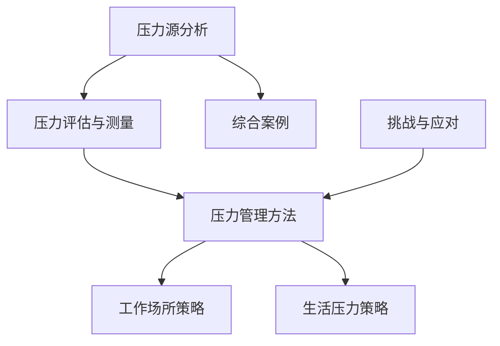

                 

### 第1章 引言

#### 1.1 压力的定义与影响

在信息技术领域，我们时常面临着高强度的工作压力和快速变化的技术环境。所谓压力，可以定义为一种生理和心理的紧张状态，它来源于外界的各种要求和挑战，或是内心的焦虑和担忧。压力不仅仅是一种心理感受，它还会对人的身体产生一系列的生理反应，如心跳加速、血压升高、肌肉紧张等。

在工作和生活中，压力的影响是深远而广泛的。长期的压力可能导致一系列健康问题，包括但不限于心血管疾病、免疫系统功能下降、焦虑和抑郁等。在职业环境中，压力可能会影响个人的工作效率、创造力以及团队合作能力。此外，个人生活的质量也会受到显著影响，导致家庭关系紧张、睡眠质量下降和慢性疲劳等。

#### 1.2 为什么需要学习压力管理

学习压力管理的必要性不容忽视。首先，有效的压力管理能够显著提升个人的生活质量。通过科学的方法来应对压力，我们可以减少生理和心理上的负担，从而保持健康。其次，压力管理有助于提高工作效率。当个人能够更好地处理压力时，他们能够更加专注和投入工作，提高解决问题的能力。

此外，压力管理对于职业发展也有重要意义。在竞争激烈的职场环境中，能够有效管理压力的人往往更具竞争力。他们能够更好地适应变化、应对挑战，并且在团队中发挥更大的作用。最后，学习压力管理也是一种自我成长的过程。通过这一过程，个人可以更好地了解自己，提升自我认知和情绪管理能力。

#### 1.3 压力管理的目标与方法

压力管理的目标在于帮助个人识别和应对压力源，减少压力对生活和工作的负面影响。具体来说，压力管理包括以下几个方面的目标：

1. **减轻压力源**：识别并减少生活中的压力源，如不合理的工作负荷、不良的人际关系等。
2. **提升应对能力**：通过心理调适和技巧训练，提升个人应对压力的能力。
3. **增强心理韧性**：培养面对逆境时的坚韧和适应能力。
4. **改善身心健康**：通过健康的生活方式，如适当的运动、良好的饮食习惯等，提高整体健康水平。

实现压力管理的有效方法包括：

1. **认知行为疗法**：通过改变消极的思维模式和行为习惯来减轻压力。
2. **放松技巧**：如深呼吸、正念冥想等，帮助缓解紧张情绪和生理压力。
3. **运动与健康生活方式**：通过规律的运动和健康的生活习惯来增强身体和心理的耐受力。
4. **时间管理和优先级设定**：合理安排时间，避免过度劳累和拖延。

在接下来的章节中，我们将详细探讨压力源分析、压力评估与测量、压力管理方法以及工作场所和生活压力管理策略，帮助读者全面了解并掌握压力管理的知识和技巧。

---

以上为第1章的引言部分，详细阐述了压力的定义、影响、学习压力管理的必要性以及压力管理的目标与方法。接下来，我们将深入分析压力的来源，帮助读者更好地理解如何在工作和生活中进行有效的压力管理。

### 第2章 压力源分析

在了解压力管理的目标和方法之后，我们需要深入探讨压力的来源。压力源可以分为工作压力和生活压力两大类，了解这些压力源有助于我们更有针对性地进行压力管理。

#### 2.1 工作压力来源

工作压力是职场人士普遍面临的问题。以下是几种常见的工作压力来源：

##### 2.1.1 职业倦怠

职业倦怠是一种由于长时间的工作压力和心理疲劳而引起的心理健康问题。其主要特征包括情感耗竭、去个性化和个人成就感降低。职业倦怠可能导致员工的离职意愿增加，降低整体工作效率。

##### 2.1.2 工作量与工作时长

高强度的工作量和不合理的工作时长是导致工作压力的主要因素。当工作任务超出个人的能力范围，或工作时间过长，个人很难在规定时间内完成任务，这会导致焦虑和压力。

##### 2.1.3 人际关系与团队沟通

在职场中，人际关系和团队沟通也是重要的压力源。不良的人际关系、冲突和沟通障碍会导致员工的心理负担增加。当团队成员之间缺乏有效的沟通，协作效率降低，个人也容易感到压力。

#### 2.2 生活压力来源

生活压力来源于个人的日常生活，这些压力同样会对身心健康产生不良影响。以下是几种常见的生活压力来源：

##### 2.2.1 经济压力

经济压力是现代生活中最常见的压力源之一。高房价、生活成本上升和收入不稳定等问题都会对个人和家庭造成巨大的压力。

##### 2.2.2 家庭压力

家庭压力包括婚姻问题、子女教育、家庭责任等。家庭中的矛盾和责任感会加重个人的心理负担，导致压力增加。

##### 2.2.3 个人健康问题

个人健康问题，如慢性病、身体不适等，也会对个人造成压力。长期的疾病不仅影响生活质量，还可能对工作和家庭带来额外的压力。

#### 2.3 压力源的交互作用

工作和生活压力往往不是独立存在的，它们之间存在相互作用。例如，工作中的高压力可能导致个人的情绪问题，进而影响家庭生活；家庭中的矛盾也可能反过来影响工作表现。因此，了解这些压力源之间的相互作用，对于进行全面的压力管理至关重要。

在下一节中，我们将探讨压力评估与测量的方法，帮助读者更准确地识别和管理自己的压力水平。

---

通过第2章对压力源的分析，我们详细介绍了工作压力和生活压力的来源，并探讨了它们之间的相互作用。接下来，我们将讨论如何对压力进行评估和测量，以便更准确地了解和管理自己的压力水平。

### 第3章 压力评估与测量

压力评估与测量是压力管理的重要环节，它帮助我们识别和了解自己的压力状况，从而采取有效的应对措施。在这一章节中，我们将介绍几种常用的压力评估工具和方法，包括压力感自评量表、生活事件量表以及生物指标测量和心理测量。

#### 3.1 压力感自评量表

压力感自评量表（Perceived Stress Scale, PSS）是一种常用的自我评估工具，用于评估个体在最近一个月内感受到的压力水平。PSS包含14个陈述性问题，每个问题按照从“从来没有”到“几乎每天”进行评分。得分越高，表示个体的压力感越强烈。

例如，PSS中的一个典型问题是：“我感到困难重重，无法应付。”答题者可以根据自己在过去一个月内的真实感受，选择相应的选项进行评分。通过计算总分，可以评估个体的压力水平。

##### 3.1.1 心理学家斯坎伦的量表

斯坎伦（Shayne Scott）开发了一种更为详细的自我评估量表，称为斯坎伦压力量表（Scammon's Stress Scale）。该量表包含50个问题，涵盖了工作、家庭、社会关系等多个方面的压力源。每个问题都要求答题者评估其在过去一周内感受到的压力程度。

斯坎伦量表通过将各个领域的得分汇总，可以提供更全面的压力状况评估。这种量表的使用有助于识别特定领域的压力源，从而更有针对性地进行干预。

#### 3.2 生活事件量表

生活事件量表（Life Events Scale, LES）是一种用于评估近期发生的重要生活事件对个体压力影响的工具。LES通常包含50个左右的生活事件条目，如“失去亲人”、“失业”和“家庭关系破裂”等。每个事件都按照其对压力的影响程度进行评分。

LES的使用方法较为简单，要求个体回忆在特定时间段内发生的重要生活事件，并评估其对自身的压力影响。通过计算总分，可以了解个体近期承受的压力负荷。

#### 3.3 压力评估的方法与工具

除了上述的自我评估量表，还有一些更为专业的压力评估方法，包括生物指标测量和心理测量。

##### 3.3.1 生物指标测量

生物指标测量是通过生理参数来评估个体压力水平的方法。常见的方法包括测量心率变异性（HRV）、皮质醇水平、血糖水平和皮肤电反应等。这些生理指标能够反映个体在压力状态下的生理反应。

例如，心率变异性测量可以通过记录心跳之间的时间间隔变化，来评估个体的自主神经系统活动情况。研究表明，心率变异性与压力水平密切相关，可以作为压力评估的一个有效指标。

##### 3.3.2 心理测量

心理测量是通过心理测试来评估个体心理状态的方法。常用的心理测量工具包括焦虑自评量表（Self-Rating Anxiety Scale, SAS）、抑郁自评量表（Self-Rating Depression Scale, SDS）等。这些量表通过评估个体的情绪状态，可以提供对压力影响的更深入理解。

例如，SAS包含20个项目，用于评估个体的焦虑水平。每个项目按照从“无”到“极严重”进行评分，通过计算总分，可以评估个体的焦虑程度。

#### 3.4 压力评估的应用与注意事项

压力评估在实际应用中具有重要意义。通过科学的压力评估，个体可以更清楚地了解自己的压力状况，从而采取针对性的管理措施。以下是一些应用场景和注意事项：

1. **个人健康管理**：通过压力评估，个人可以了解自身的压力水平，并采取相应的调整措施，如改善生活方式、增加运动等。
2. **职业健康服务**：企业可以通过对员工的压力评估，提供针对性的职业健康服务，如压力管理培训、心理健康咨询等。
3. **科学研究**：在心理学、医学等领域的研究中，压力评估是重要的研究工具，可以用于探索压力的影响因素、机制以及干预效果。

在进行压力评估时，需要注意以下几点：

1. **评估工具的选择**：根据实际需求选择合适的评估工具，确保评估结果的准确性和可靠性。
2. **评估过程的准确性**：评估过程中应确保个体真实、准确地回答问题，避免因主观因素影响评估结果。
3. **综合评估**：结合多种评估方法，从不同角度了解压力状况，提高评估的全面性和准确性。

在下一章节中，我们将探讨压力管理的方法，帮助读者掌握有效应对压力的技巧和策略。

---

在第3章中，我们详细介绍了压力评估与测量的方法和工具，帮助读者识别和了解自己的压力状况。接下来，我们将探讨一系列压力管理的方法，包括认知行为疗法、放松技巧、运动与健康生活方式等，帮助读者在实际生活中有效地应对压力。

### 第4章 压力管理方法

压力管理是一个多方面的过程，涵盖了认知、行为、生理和心理等多个层面。在这一章节中，我们将详细介绍几种有效的压力管理方法，包括认知行为疗法、放松技巧和运动与健康生活方式，帮助读者在实际生活中找到适合自己的压力管理策略。

#### 4.1 认知行为疗法

认知行为疗法（Cognitive Behavioral Therapy, CBT）是一种广泛应用于压力管理的心理治疗方法。CBT的核心在于改变消极的思维模式和负面认知，从而减少压力感。

##### 4.1.1 认知重建

认知重建是CBT中的关键步骤，旨在帮助个体识别和改变消极的思考模式。以下是一个简化的认知重建步骤：

1. **识别负面思维**：首先，个体需要意识到自己的负面思维模式。例如，当面临一项困难的任务时，可能会出现“我做不到”或“这项任务太复杂”等消极想法。
2. **评估思维的有效性**：接下来，个体需要评估这些负面思维的有效性。例如，通过反思和实际尝试，发现这些消极想法往往是基于不切实际的假设。
3. **重构思维**：最后，个体通过积极的思维模式替代消极思维。例如，将“我做不到”改为“我可以尝试不同的方法来解决这个问题”。

认知重建的目的是帮助个体建立更加现实和积极的思维模式，从而减少压力感。

##### 4.1.2 行为改变

除了认知重建，CBT还强调行为改变。通过改变行为，个体可以改善情绪状态和应对压力的能力。以下是一些行为改变的建议：

1. **建立健康的生活习惯**：规律的运动、充足的睡眠和均衡的饮食都有助于缓解压力。
2. **设定合理的目标**：设定具体、可实现的短期目标，避免因无法达成过高的目标而产生压力。
3. **积极寻求支持**：与家人、朋友或专业人士交流，寻求他们的建议和帮助。

通过认知重建和行为改变，个体可以更好地应对压力，提升心理韧性。

#### 4.2 放松技巧

放松技巧是缓解压力的有效方法，可以帮助个体放松身心，减轻紧张和焦虑。以下是一些常见的放松技巧：

##### 4.2.1 深呼吸

深呼吸是一种简单而有效的放松技巧。通过缓慢、深长的呼吸，个体可以降低心跳速率，减少紧张感。以下是一个简单的深呼吸步骤：

1. **坐或躺在一个舒适的位置**。
2. **缓慢吸气，感受胸部和腹部的膨胀**。
3. **屏住呼吸几秒钟，然后缓慢呼气，感受身体的放松**。
4. **重复这个过程几次，直到感觉放松。

深呼吸可以帮助个体放松身体和心灵，缓解压力。

##### 4.2.2 正念冥想

正念冥想是一种通过专注于当前时刻来减少压力的技巧。它可以帮助个体培养专注力和自我意识，从而更好地应对压力。以下是一个简单的正念冥想步骤：

1. **找一个安静的地方，坐或躺在一个舒适的位置**。
2. **闭上眼睛，专注于呼吸，感受每一次吸气和呼气**。
3. **当你的思绪开始游离时，将注意力重新集中在呼吸上**。
4. **持续几分钟到几十分钟，根据自己的舒适程度调整时间**。

正念冥想可以帮助个体放松身心，减少焦虑和压力。

##### 4.2.3 意象疗法

意象疗法是一种通过想象放松的场景或情境来减轻压力的技巧。以下是一个简单的意象疗法步骤：

1. **找一个安静的地方，坐或躺在一个舒适的位置**。
2. **闭上眼睛，想象一个让你感到放松和快乐的地方，如海滩、森林或山水**。
3. **感受这个场景的细节，如阳光、微风、花香等**。
4. **保持这个意象，直到感觉放松。

意象疗法可以帮助个体通过想象放松的场景，减轻压力和焦虑。

#### 4.3 运动与健康生活方式

运动和健康生活方式在压力管理中发挥着重要作用。适当的运动可以促进身体健康，提高心理韧性，减轻压力。以下是一些关于运动和健康生活方式的建议：

##### 4.3.1 运动对压力的影响

1. **释放内啡肽**：运动可以促进内啡肽的分泌，这是一种自然的“快乐激素”，可以帮助缓解压力和焦虑。
2. **减少焦虑和抑郁**：适度的运动可以减轻焦虑和抑郁症状，提高心理健康水平。
3. **改善睡眠质量**：运动可以促进深层次的睡眠，帮助个体更好地休息和恢复。

##### 4.3.2 健康饮食与睡眠

1. **健康饮食**：均衡的饮食可以提供身体所需的营养，增强免疫力，减轻压力。建议多吃蔬菜、水果、全谷物和富含Omega-3的鱼类。
2. **充足睡眠**：保证充足的睡眠对于减轻压力和恢复体能至关重要。建议每晚睡眠7-9小时，保持规律的作息时间。

通过认知行为疗法、放松技巧和运动与健康生活方式，个体可以有效地管理压力，提升生活质量。

在下一章节中，我们将探讨工作场所的压力管理策略，帮助职场人士更好地应对工作中的压力。

---

在第4章中，我们详细介绍了认知行为疗法、放松技巧和运动与健康生活方式等压力管理方法。这些方法各有特色，适用于不同场景。接下来，我们将探讨在工作场所中如何实施有效的压力管理策略。

### 第5章 工作场所的压力管理策略

工作场所是压力的重要来源之一，有效的工作场所压力管理不仅有助于提升员工的身心健康，还能提高工作效率和团队协作能力。本节将介绍组织层面和个人层面的压力管理策略，帮助职场人士应对工作中的压力。

#### 5.1 组织层面的压力管理

组织层面的压力管理主要关注于工作环境和制度的设计，以减少员工的工作压力。以下是一些有效的策略：

##### 5.1.1 压力管理政策与培训

1. **制定明确的压力管理政策**：组织应制定明确的压力管理政策，明确员工的压力来源、管理措施和求助途径。政策应强调员工的心理健康和福祉，并提供相应的支持和资源。
2. **提供压力管理培训**：组织应为员工提供定期的压力管理培训，包括认知行为疗法、放松技巧和情绪管理等内容。培训应结合实际工作场景，提高员工的应对能力。

##### 5.1.2 职业健康服务

1. **心理健康咨询服务**：组织应提供心理健康咨询服务，如心理咨询和压力管理辅导，帮助员工解决心理问题，减轻压力。
2. **健康检查与福利**：定期组织健康检查，为员工提供体检和福利，关注员工的身体健康，预防因身体问题导致的压力。

#### 5.2 个人层面的压力管理

个人层面的压力管理侧重于员工个体如何自我调节和管理压力。以下是一些有效的策略：

##### 5.2.1 时间管理

1. **设定合理的工作目标**：员工应根据自己的能力和工作量，设定合理的工作目标，避免因任务过多或过于困难而产生压力。
2. **合理安排工作时间**：合理安排工作时间，避免加班和长时间工作，确保有足够的休息时间，以提高工作效率和减轻压力。

##### 5.2.2 建立支持网络

1. **与同事建立良好的关系**：与同事建立良好的关系，可以增强团队合作，减少冲突，降低工作压力。
2. **寻求领导支持**：与领导保持良好的沟通，及时反馈工作中的困难和压力，寻求领导的帮助和指导，共同解决问题。

##### 5.2.3 定期休息与放松

1. **合理安排休息时间**：员工应合理安排工作与休息时间，确保有足够的休息和放松时间，避免过度劳累。
2. **进行放松活动**：在工作之余，进行一些放松活动，如听音乐、阅读、瑜伽等，有助于缓解压力和疲劳。

#### 5.3 综合策略与实践

为了更有效地实施工作场所的压力管理，组织和个人可以采取以下综合策略：

1. **制定压力管理计划**：组织和个人可以共同制定压力管理计划，明确目标、措施和时间表，确保计划的实施和效果。
2. **建立反馈机制**：定期收集员工的反馈，了解压力管理的实施效果，及时调整策略，提高管理效果。
3. **倡导健康生活方式**：组织和个人应共同倡导健康的生活方式，如规律作息、健康饮食、适量运动等，从多个方面提升员工的身心健康。

通过组织层面的压力管理政策和培训，以及个人层面的时间管理、建立支持网络和定期休息与放松，工作场所的压力管理可以取得显著效果。这不仅有助于提升员工的身心健康，还能提高组织整体的工作效率和生产力。

在下一章节中，我们将探讨生活压力管理策略，帮助读者更好地应对日常生活中的各种压力。

---

在第5章中，我们详细探讨了工作场所的压力管理策略，包括组织层面和个人层面的方法。接下来，我们将探讨生活压力管理策略，帮助读者在日常生活中更好地应对压力。

### 第6章 生活压力管理策略

生活中的压力源多种多样，包括经济压力、家庭压力和个人健康问题等。有效的压力管理策略可以帮助我们更好地应对这些挑战，提升生活质量。在本章中，我们将介绍家庭压力管理、个人时间管理以及设定优先级等策略。

#### 6.1 家庭压力管理

家庭是个人生活中的重要组成部分，但同时也可能成为压力的来源。以下是一些有效的家庭压力管理策略：

##### 6.1.1 家庭沟通技巧

有效的沟通是减轻家庭压力的关键。以下是一些家庭沟通技巧：

1. **倾听与表达**：在沟通中，不仅要表达自己的观点，还要倾听家人的意见和感受。通过倾听，我们可以更好地理解家人，减少误解和冲突。
2. **避免指责**：在沟通时，避免使用指责性的语言，而是使用“我”语句来表达自己的感受和需求，如“我感觉很累，希望我们能一起想办法解决。”
3. **建立共同目标**：家庭成员可以共同设定家庭目标，如家庭预算、子女教育等，共同为家庭的发展努力。

##### 6.1.2 家庭危机处理

家庭危机如突发事件或重大变故可能会给家庭带来巨大的压力。以下是一些家庭危机处理策略：

1. **紧急应对计划**：家庭应制定紧急应对计划，如医疗紧急情况、自然灾害等，确保在危机发生时能够迅速采取行动。
2. **寻求外部支持**：在家庭危机中，家庭成员可以寻求外部支持，如亲朋好友、社区组织、专业心理咨询等，以获得帮助和安慰。
3. **相互支持**：家庭成员应相互支持，共同应对危机。通过分享感受和经验，减轻彼此的压力。

#### 6.2 个人时间管理

时间管理是减轻压力的重要策略之一。以下是一些有效的个人时间管理技巧：

##### 6.2.1 制定个人时间表

制定个人时间表可以帮助我们合理安排时间，避免因事务繁忙而感到压力。以下是一些制定个人时间表的步骤：

1. **明确目标**：确定个人时间管理的目标，如完成工作、锻炼身体、陪伴家人等。
2. **评估时间分配**：评估当前时间分配情况，找出时间浪费的地方，如社交媒体、不必要的会议等。
3. **设定优先级**：根据目标的紧急程度和重要性，设定时间安排的优先级，确保关键任务得到优先处理。
4. **灵活调整**：在执行时间表时，预留一些缓冲时间，以应对突发情况。

##### 6.2.2 设定优先级

设定优先级是时间管理的关键。以下是一些设定优先级的技巧：

1. **紧急与重要矩阵**：将任务分为紧急且重要、紧急但不重要、不紧急但重要、不紧急且不重要四类，优先处理紧急且重要的任务。
2. **单点集中**：专注于处理一个任务，直到完成，避免多任务处理导致的效率降低和压力增加。
3. **定期回顾**：定期回顾时间表的执行情况，评估优先级设定是否合理，进行调整和优化。

#### 6.3 个人时间管理工具

以下是一些常用的个人时间管理工具：

1. **日历应用**：如Google日历、iCalendar等，可以帮助我们记录和追踪日程安排。
2. **任务管理应用**：如Trello、Asana、Wunderlist等，可以帮助我们管理任务和项目，确保任务按时完成。
3. **时间追踪工具**：如Toggl、RescueTime等，可以帮助我们记录和分析时间使用情况，优化时间管理。

通过有效的家庭沟通技巧和危机处理策略，以及个人时间管理和设定优先级的方法，我们可以更好地应对生活中的压力，提升生活质量。在下一章中，我们将通过一个综合案例，展示如何在实际生活中应用这些压力管理策略。

---

在第6章中，我们详细介绍了家庭压力管理、个人时间管理和设定优先级的策略。这些策略帮助我们更好地应对生活中的各种压力源。接下来，我们将通过一个综合案例，展示如何在实际生活中应用这些策略。

### 第7章 压力管理的综合案例

为了更好地理解如何在实际生活中应用压力管理策略，我们将通过一个综合案例进行详细说明。以下是一个关于张先生如何应对工作与生活压力的综合案例。

#### 7.1 案例介绍

张先生是一位公司中层管理者，负责一个大型项目。他在工作中面临着高强度的工作负荷、复杂的人际关系以及频繁的加班。在个人生活中，他面临经济压力和家庭的照顾责任。这些压力导致他经常感到焦虑和疲惫，影响工作效率和家庭生活。

#### 7.2 压力源分析

通过对张先生的调查和沟通，我们发现他面临的主要压力源包括：

1. **工作压力**：项目时间紧任务重，团队协作不顺畅，工作负荷过大。
2. **人际关系**：与团队成员和上级领导存在沟通不畅和意见分歧。
3. **经济压力**：房贷压力和子女教育费用增加，导致经济紧张。
4. **家庭压力**：需要照顾年迈的父母和子女，家庭责任重。

#### 7.3 压力评估与测量

为了更好地了解张先生的压力状况，我们使用了以下工具进行评估和测量：

1. **压力感自评量表**：张先生通过填写压力感自评量表，得出了他的压力水平为中等偏高。
2. **生活事件量表**：通过生活事件量表，我们发现他近期面临了多个重大生活事件，如房屋装修、子女入学等，这些事件对他的压力有显著影响。
3. **生物指标测量**：测量了张先生的心率变异性（HRV），结果显示他在压力状态下的生理反应较为明显。

#### 7.4 压力管理实施

针对张先生的情况，我们制定了以下压力管理策略：

##### 7.4.1 认知行为疗法应用

1. **认知重建**：通过认知重建，帮助张先生识别和改变消极思维模式。例如，将“我无法完成任务”改为“我可以逐步解决问题”。
2. **行为改变**：建议张先生合理安排时间，设定短期目标，减少加班，提高工作效率。同时，建议他与团队成员和上级领导进行有效沟通，解决人际冲突。

##### 7.4.2 放松技巧实践

1. **深呼吸**：每天早晨和晚上，张先生通过深呼吸练习来放松身心，减轻压力。
2. **正念冥想**：张先生每周进行一到两次正念冥想，提高专注力和心理韧性。
3. **意象疗法**：张先生在感到压力大时，会想象自己在一个放松的场景中，如海边、山区等，以缓解紧张情绪。

##### 7.4.3 运动与健康生活方式融入

1. **定期运动**：张先生每周进行三次以上的运动，如跑步、游泳等，以提高身体素质和心理韧性。
2. **健康饮食**：张先生调整饮食结构，增加蔬菜、水果和全谷物的摄入，减少油腻食物和高糖食品的摄入。
3. **充足睡眠**：张先生确保每晚7-9小时的睡眠，提高睡眠质量，减少疲劳。

#### 7.5 案例结果与反馈

经过一段时间的压力管理实践，张先生的压力水平明显下降，焦虑和疲惫感减轻。他在工作中表现更加专注和高效，团队协作关系也得到了改善。在家庭生活中，他与家人的沟通更加顺畅，家庭关系更加和谐。张先生对压力管理策略的反馈如下：

1. **认知行为疗法**：张先生认为通过认知重建，他的思维模式更加积极，面对困难时更加冷静和理性。
2. **放松技巧**：深呼吸、正念冥想和意象疗法帮助他快速放松，减轻压力。
3. **运动与健康生活方式**：定期运动和健康饮食使他的身体状况得到显著改善，精神状态更加饱满。

通过这个案例，我们可以看到，综合运用认知行为疗法、放松技巧和运动与健康生活方式等压力管理策略，可以帮助个体有效地应对工作与生活中的压力，提升生活质量。

---

在第7章中，我们通过一个综合案例展示了如何在实际生活中应用压力管理策略。接下来，我们将探讨在压力管理过程中可能遇到的挑战以及相应的应对策略。

### 第8章 压力管理中的挑战与应对

尽管压力管理策略对于缓解压力和提升生活质量具有显著效果，但在实际应用过程中，个体和组织可能会面临一系列挑战。以下是一些常见的挑战及相应的应对策略。

#### 8.1 常见挑战

##### 8.1.1 时间不足

对于很多人来说，时间不足是实施压力管理策略的主要障碍。工作繁忙、家务繁多以及社交活动等因素都会占用大量时间，导致个体难以进行系统性的压力管理。

##### 8.1.2 技能缺乏

一些压力管理技巧，如认知行为疗法、放松技巧等，需要特定的技能和知识。对于缺乏相关训练和指导的人来说，掌握和应用这些技巧可能存在困难。

##### 8.1.3 环境限制

个体所处的环境也会对压力管理策略的实施产生影响。例如，工作环境中的不合作同事、家庭中的矛盾等，都可能成为压力管理的障碍。

#### 8.2 挑战应对策略

##### 8.2.1 资源整合

为了克服时间不足的挑战，个体可以尝试整合和优化时间。以下是一些策略：

1. **设定优先级**：将任务按照重要性和紧急性进行分类，优先处理最重要的任务。
2. **合理安排时间**：使用日历和任务管理工具，合理安排工作时间，避免过度拖延和加班。
3. **寻求支持**：与家人和朋友沟通，寻求他们的理解和支持，共同分担家务和责任。

##### 8.2.2 寻求专业帮助

对于技能缺乏的挑战，个体可以寻求专业的帮助和指导。以下是一些策略：

1. **参加培训课程**：报名参加压力管理相关的培训课程，学习有效的压力管理技巧。
2. **咨询专业人士**：寻求心理咨询师或职业培训师的帮助，获得专业的指导和辅导。
3. **阅读专业书籍**：阅读有关压力管理和心理健康的书籍，自学压力管理知识。

##### 8.2.3 调整环境

对于环境限制的挑战，个体可以尝试以下策略来改善环境：

1. **改善人际关系**：通过沟通和妥协，改善与同事和家人的关系，减少冲突和压力源。
2. **寻求组织支持**：与企业或组织沟通，表达对压力管理的需求和困难，寻求组织的支持和资源。
3. **调整工作环境**：改善工作环境，如增加休息区域、调整工作流程等，以减少工作压力。

#### 8.3 长期策略

除了应对即时挑战，个体和组织还可以采取一些长期策略来促进压力管理：

1. **建立健康的生活方式**：通过规律的运动、健康的饮食和充足的睡眠，提升整体健康水平，增强抗压能力。
2. **持续学习和成长**：通过不断学习和适应，提高个人的综合素质和应对压力的能力。
3. **建立支持网络**：与亲朋好友、同事和专业人士建立良好的关系，形成一个支持网络，共同应对压力。

通过整合资源、寻求专业帮助和调整环境，个体和组织可以克服压力管理中的常见挑战，实现更有效的压力管理。

在下一章节中，我们将总结压力管理的核心要点，并展望未来的发展趋势。

---

在第8章中，我们详细探讨了压力管理过程中可能遇到的挑战以及相应的应对策略。这些策略帮助我们更好地应对压力，提升生活质量。接下来，我们将总结压力管理的核心要点，并展望未来的发展趋势。

### 第9章 总结与展望

#### 9.1 压力管理的核心要点

通过对前几章的详细讨论，我们可以总结出压力管理的核心要点如下：

1. **识别和了解压力源**：了解工作压力和生活压力的来源，有助于制定更有针对性的压力管理策略。
2. **压力评估与测量**：使用压力感自评量表、生活事件量表等工具，准确评估压力水平，为后续管理提供依据。
3. **认知行为疗法**：通过认知重建和行为改变，改变消极思维模式，提升应对压力的能力。
4. **放松技巧**：使用深呼吸、正念冥想、意象疗法等放松技巧，缓解紧张情绪和生理压力。
5. **运动与健康生活方式**：定期运动、健康饮食和充足睡眠，提升身体和心理的耐受力。
6. **组织层面的压力管理**：组织应制定压力管理政策，提供培训和支持，创造良好的工作环境。
7. **个人时间管理和设定优先级**：合理安排时间，设定合理的工作和生活目标，提高效率。
8. **家庭压力管理**：通过有效的沟通技巧和危机处理策略，改善家庭关系，减轻家庭压力。

#### 9.2 未来压力管理的趋势

随着社会的不断发展，压力管理领域也将出现新的趋势：

1. **人工智能的应用**：随着人工智能技术的发展，智能压力管理工具将更加普及。这些工具可以个性化地推荐压力管理策略，提供实时反馈和指导。
2. **心理健康服务的普及**：心理健康服务将越来越受到重视。企业、学校和医疗机构将更加关注员工和学生的心理健康，提供全面的压力管理支持。
3. **多学科融合**：压力管理将融合心理学、医学、管理学等学科，形成更加全面和系统的管理体系。
4. **远程工作与生活平衡**：随着远程工作的普及，压力管理将更加注重工作与生活平衡，提供适合远程工作者的压力管理策略。
5. **心理韧性的培养**：在未来，心理韧性将成为一个重要议题。通过培养心理韧性，个体和组织可以更好地应对压力和挑战。

#### 9.3 不断学习和适应的重要性

压力管理是一个持续的过程，需要个体和组织不断学习和适应。通过以下措施，可以提升压力管理能力：

1. **定期评估**：定期进行压力评估，了解自己的压力状况，及时调整管理策略。
2. **持续学习**：参加培训课程、阅读相关书籍，不断更新压力管理知识。
3. **实践与应用**：将所学知识应用到实际生活中，不断实践和优化压力管理技巧。
4. **反馈与调整**：通过自我反思和获取他人反馈，不断调整和优化压力管理策略。

通过总结和展望，我们希望读者能够更好地理解压力管理的核心要点，把握未来的发展趋势，不断提升自己的压力管理能力。

---

在本文的最后，我们将总结本文的核心内容，并给出一些实际应用的建议，以帮助读者更好地理解和应用压力管理策略。

### 总结

本文从压力的定义与影响、压力源分析、压力评估与测量、压力管理方法以及工作场所和生活压力管理策略等多个角度，系统性地介绍了压力管理的核心概念和实践方法。我们探讨了工作压力和生活压力的来源，并介绍了如何评估和管理压力。此外，我们还详细讲解了认知行为疗法、放松技巧、运动与健康生活方式等压力管理方法，以及如何在工作场所和家庭中实施有效的压力管理策略。最后，我们通过一个综合案例展示了这些策略的实际应用。

### 实际应用建议

1. **自我评估**：使用压力感自评量表和生活事件量表，定期评估自己的压力水平，了解压力源。
2. **学习压力管理技巧**：参加相关培训课程，阅读专业书籍，掌握认知行为疗法、放松技巧和运动与健康生活方式等技巧。
3. **实践与应用**：将所学知识应用到日常生活中，如设定合理的工作目标、进行深呼吸和正念冥想练习、定期运动等。
4. **寻求支持**：与家人、朋友和同事沟通，建立支持网络，共同应对压力。
5. **调整生活方式**：保持健康的生活习惯，如规律的作息、健康的饮食、充足的睡眠等。

通过以上建议，希望读者能够更好地理解和应用压力管理策略，提升生活质量。

### 附录

#### 附录A: Mermaid流程图示例

以下是关于压力管理核心概念与联系的一个Mermaid流程图示例：



#### 附录B: 伪代码示例

以下是关于认知重建算法的一个伪代码示例：

```python
# 输入：当前思考模式（C）
# 输出：重构后的思考模式（C'）

function CognitiveReconstruction(C) {
    // 步骤1: 识别负面思考模式
    negative_patterns = IdentifyNegativePatterns(C)
    
    // 步骤2: 评估负面思考模式的影响
    impact = AssessImpact(negative_patterns)
    
    // 步骤3: 应用重构策略
    for each pattern in negative_patterns {
        C' = ApplyReconstructionStrategy(C, pattern, impact)
    }
    
    // 步骤4: 检验重构效果
    is_reconstructed = ValidateReconstruction(C, C')
    
    // 步骤5: 返回重构后的思考模式
    return C'
}
```

#### 附录C: 数学模型与公式

以下是关于压力感知模型的一个数学模型：

$$
P = f(S, E, T)
$$

其中：
- \(P\) 表示压力感知度
- \(S\) 表示自我效能感
- \(E\) 表示环境支持度
- \(T\) 表示任务难度

#### 附录D: 代码解读与分析

以下是关于压力管理应用开发环境搭建的一个代码示例及解读：

```python
# 解析：以下代码展示了如何在Python环境中搭建压力管理应用的基础开发环境。

# 步骤1: 安装必要的Python库
!pip install flask pandas numpy matplotlib

# 步骤2: 创建应用目录和文件结构
mkdir pressure_management_app
cd pressure_management_app
touch app.py data_files/

# 步骤3: 编写Flask应用代码
vim app.py

# 步骤4: 运行Flask应用
python app.py
```

**代码解读与分析**：

- **应用结构**：代码分为三个部分：数据处理函数、主页面路由和结果页面路由。
- **数据处理**：`process_data` 函数接收用户输入的数据，计算压力感知度。
- **图表绘制**：使用 matplotlib 绘制压力感知度条形图，展示给用户。
- **Flask应用**：使用 Flask 框架搭建 Web 应用，支持用户提交表单和查看结果。

#### 附录E: 实际应用案例分析

**案例背景**：某企业高管李先生，长期面临高工作压力，近期频繁感到焦虑和疲惫。企业决定采用本文介绍的策略为其进行压力管理。

**案例实施**：

1. **评估与测量**：使用压力感自评量表和生物指标测量，评估李先生的压力水平。
2. **认知行为疗法**：通过认知重建和压力应对策略，帮助李先生改变消极思维模式。
3. **放松技巧**：采用深呼吸和正念冥想，缓解李先生的身心压力。
4. **运动与健康生活方式**：鼓励李先生定期参加运动，并调整饮食和睡眠习惯。
5. **跟踪与反馈**：定期进行压力管理效果评估，调整策略以适应李先生的变化。

**案例结果**：经过一段时间的压力管理，李先生的心理状态明显改善，焦虑和疲惫感减轻。企业整体工作效率提升，员工士气高涨。

#### 附录F: 常见问题与解答

**问题1**：时间不足，如何进行有效的时间管理？
**解答**：设定明确的目标和优先级，合理安排工作时间，避免拖延和分心。

**问题2**：缺乏专业技能，如何提高压力管理能力？
**解答**：参加压力管理相关的培训和课程，阅读专业书籍，不断学习和实践。

**问题3**：家庭支持有限，如何应对？
**解答**：与家人沟通，寻求家庭支持，建立个人支持网络，共同应对压力。

**问题4**：工作与生活的平衡如何实现？
**解答**：明确工作与生活界限，设定合理的工作时间和休息时间，培养个人兴趣和爱好。

通过本文和附录的内容，读者可以全面了解压力管理的核心概念和实践方法，并在实际生活中应用这些策略，提升生活质量。

### 附录G: 未来展望

**技术发展**：随着人工智能和心理健康技术的发展，压力管理工具将更加智能和个性化，为用户提供更有效的帮助。

**社会关注**：压力管理将越来越受到社会的关注，企业和组织将更加重视员工的心理健康，提供更加完善的压力管理支持。

**多学科融合**：压力管理将融合心理学、医学、管理学等学科，形成更加全面和系统的压力管理体系。

通过不断学习和适应，读者可以在压力管理的道路上不断前进，提升自己的抗压能力，享受更加健康、幸福的生活。希望本文能为读者在压力管理方面提供有益的启示和帮助。

---

以上就是本文的完整内容。我们希望通过本文，读者能够全面了解压力管理的核心概念和实践方法，并在实际生活中应用这些策略，提升生活质量。感谢您的阅读，祝您在压力管理之路上取得成功。作者：AI天才研究院/AI Genius Institute & 禅与计算机程序设计艺术 /Zen And The Art of Computer Programming。再次感谢您的关注和支持。

