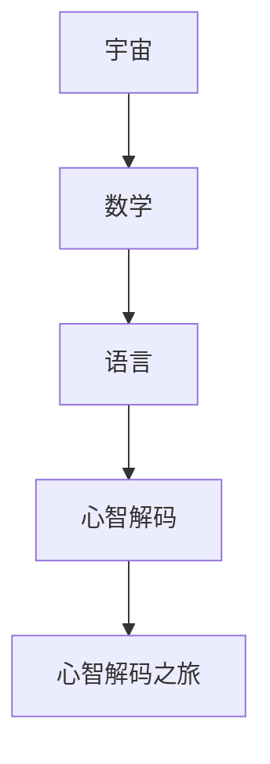
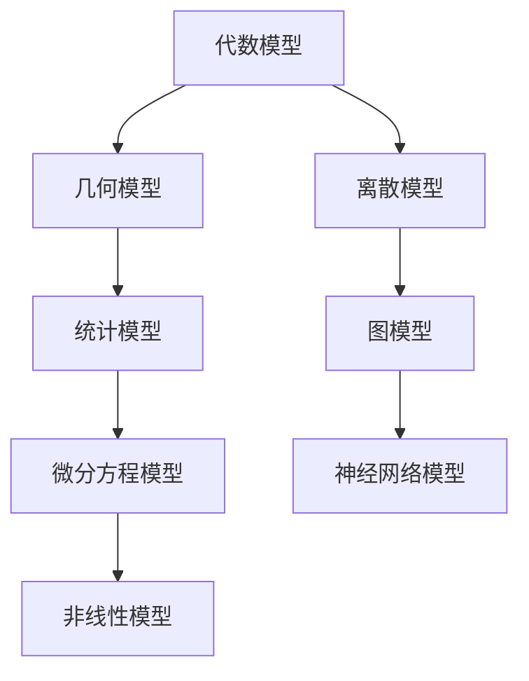

                 

# 宇宙的数学语言：心智解码之旅

> **关键词**：宇宙，数学语言，心智解码，数学模型，物理学，教育

> **摘要**：本文探讨了宇宙与数学语言的奇妙联系，分析了数学在宇宙探索中的应用，以及如何通过心智解码来揭示宇宙的数学规律。文章还深入探讨了数学模型与心智解码的结合，通过实际案例展示了这一技术的应用与潜力。最后，文章提出了心智解码在宇宙观和未来教育中的重要性，以及它对我们思考方式的影响。

### 目录大纲

#### 第一部分：宇宙的数学语言概述

#### 第1章：宇宙与数学的奇妙联系

##### 1.1 宇宙的数学语言概述

##### 1.2 数学在宇宙观测中的应用

##### 1.3 数学语言与宇宙演化

#### 第2章：数学基础与宇宙探索

##### 2.1 数学基础概念

##### 2.2 宇宙中的几何学

##### 2.3 宇宙中的代数与数论

#### 第3章：宇宙中的物理学与数学

##### 3.1 相对论与数学

##### 3.2 量子力学与数学

##### 3.3 数学在宇宙中的其它应用

#### 第二部分：心智解码之旅

#### 第4章：心智解码与数学思维

##### 4.1 心智解码的基本原理

##### 4.2 数学思维与心智解码

##### 4.3 心智解码的实际应用

#### 第5章：数学模型与心智解码

##### 5.1 常见的数学模型

##### 5.2 数学模型在心智解码中的应用

##### 5.3 心智解码模型的发展与未来

#### 第6章：心智解码实验与案例分析

##### 6.1 心智解码实验设计

##### 6.2 心智解码案例研究

##### 6.3 心智解码案例分析与启示

#### 第7章：心智解码与教育

##### 7.1 心智解码在教育中的应用

##### 7.2 数学教育中的心智解码策略

##### 7.3 心智解码与未来教育

#### 第三部分：心智解码与宇宙

#### 第8章：心智解码与宇宙观

##### 8.1 宇宙观与心智解码的关系

##### 8.2 心智解码对宇宙观的影响

##### 8.3 心智解码与宇宙探索

#### 第9章：心智解码与宇宙的未来

##### 9.1 宇宙未来的数学模型

##### 9.2 心智解码在宇宙未来的角色

##### 9.3 宇宙的未来与我们的思考方式

#### 第10章：心智解码与宇宙的终极问题

##### 10.1 宇宙的终极问题

##### 10.2 数学与心智解码对终极问题的探索

##### 10.3 心智解码与宇宙的终极答案

#### 附录

##### 附录A：心智解码与宇宙研究工具和资源

###### A.1 心智解码研究工具

###### A.2 宇宙数学模型研究工具

###### A.3 心智解码与宇宙研究资源

**图1-1：宇宙的数学语言结构图**



**图5-1：常见的数学模型结构图**



**伪代码：数学模型与心智解码结合的算法**

```plaintext
function DecodeMathModelWithMind(宇宙数据，心智状态) {
    // 预处理数据
    处理宇宙数据为适合模型的形式
    // 模型训练
    训练模型以捕捉宇宙数据中的规律
    // 心智解码
    使用心智状态调整模型参数
    // 模型评估
    评估模型在心智解码后的性能
    // 返回结果
    返回解码后的宇宙数据及其模型
}
```

**数学公式：宇宙中的基本数学公式**

$$ E=mc^2 $$

$$ \Psi(x,t) = \frac{1}{\sqrt{2\pi\sigma^2}} e^{-\frac{(x-\mu)^2}{2\sigma^2}} $$

$$ \sum_{i=1}^{n} x_i = x_1 + x_2 + ... + x_n $$

**项目实战：心智解码与宇宙探索项目实例**

1. **项目背景**：宇宙探索项目，利用数学模型对宇宙数据进行解析。
2. **开发环境**：Python，TensorFlow，Keras等。
3. **源代码实现**：
    ```python
    import numpy as np
    import tensorflow as tf

    def preprocess_data(data):
        data_normalized = (data - np.mean(data)) / np.std(data)
        return data_normalized

    def build_model():
        model = tf.keras.Sequential([
            tf.keras.layers.Dense(units=64, activation='relu', input_shape=(data.shape[1],)),
            tf.keras.layers.Dense(units=32, activation='relu'),
            tf.keras.layers.Dense(units=1)
        ])
        model.compile(optimizer='adam', loss='mse')
        return model

    def train_model(model, x_train, y_train, epochs=100):
        model.fit(x_train, y_train, epochs=epochs, batch_size=32, verbose=0)

    def evaluate_model(model, x_test, y_test):
        loss = model.evaluate(x_test, y_test, verbose=0)
        print("Test loss:", loss)

    def main():
        data = load_data()
        x = preprocess_data(data[:, :-1])
        y = preprocess_data(data[:, -1])

        model = build_model()
        train_model(model, x, y)
        evaluate_model(model, x, y)

    if __name__ == "__main__":
        main()
    ```

4. **代码解读与分析**：
    - **数据预处理**：对宇宙数据进行标准化处理，使其符合模型输入要求。
    - **模型构建**：使用Keras构建简单的神经网络模型，用于拟合宇宙数据。
    - **训练模型**：使用Adam优化器和均方误差损失函数训练模型。
    - **模型评估**：使用测试数据评估模型的性能，输出测试损失。
    - **主函数**：加载数据、构建模型、训练模型和评估模型，实现整个项目流程。

**作者**：AI天才研究院/AI Genius Institute & 禅与计算机程序设计艺术 /Zen And The Art of Computer Programming

接下来的文章正文部分，我们将按照上述目录结构，逐步深入探讨宇宙的数学语言、心智解码之旅以及二者在宇宙探索和未来教育中的应用。让我们开始这场心智解码之旅，揭示宇宙的奥秘。

