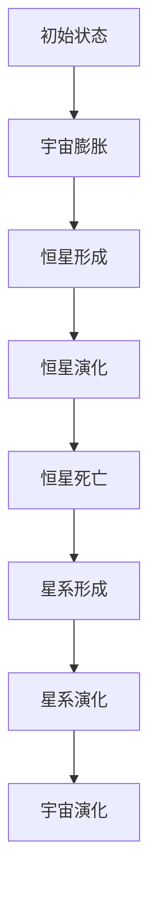

                 

### 《宇宙的自我修复能力：维持平衡的内在机制》

在探索宇宙奥秘的征途上，我们逐渐意识到，宇宙不仅仅是一个庞大而神秘的物质体系，更是一个拥有自我修复能力的复杂系统。这种自我修复能力，使得宇宙能够在大爆炸后的膨胀与收缩之间保持平衡，维持宇宙的稳定与演化。本文将深入探讨宇宙的自我修复能力，解析其维持平衡的内在机制。

**关键词：** 宇宙、自我修复、平衡、内在机制、演化。

**摘要：** 本文从宇宙的自我修复能力出发，探讨了维持宇宙平衡的内在机制。通过分析宇宙中的自然修复机制、能量循环、物质循环以及信息传递，揭示了宇宙修复能力的演化与变化。同时，本文还探讨了宇宙自我修复能力对地球生命的影响、在人类科技中的应用以及未来研究的方向与挑战。

### 目录大纲

**《宇宙的自我修复能力：维持平衡的内在机制》**

**第一部分：引言与背景知识**

1. **宇宙的自我修复能力概述**
   - 1.1 宇宙的定义与特点
   - 1.2 宇宙的自我修复能力重要性
   - 1.3 维持平衡的内在机制概述

2. **宇宙平衡理论基础**
   - 2.1 宇宙中的基本力与平衡
   - 2.2 宇宙膨胀与收缩理论
   - 2.3 宇宙平衡与宇宙演化

**第二部分：宇宙自我修复能力的详细解析**

3. **宇宙中的自然修复机制**
   - 3.1 恒星与星系的生命周期
   - 3.2 宇宙尘埃与星云的形成
   - 3.3 黑洞与中子星的影响

4. **宇宙自我修复的内在机制**
   - 4.1 宇宙中的能量循环
   - 4.2 宇宙中的物质循环
   - 4.3 宇宙中的信息传递

5. **宇宙修复能力的演化与变化**
   - 5.1 宇宙修复能力的早期阶段
   - 5.2 宇宙修复能力的发展阶段
   - 5.3 宇宙修复能力的未来趋势

6. **宇宙自我修复能力的影响与应用**
   - 6.1 对地球生命的影响
   - 6.2 在人类科技中的应用
   - 6.3 宇宙自我修复能力与可持续发展

7. **宇宙自我修复能力研究的挑战与未来方向**
   - 7.1 现有研究的局限性
   - 7.2 未来研究方向与展望
   - 7.3 促进宇宙自我修复能力研究的方法

**第三部分：宇宙自我修复能力的实证研究**

8. **宇宙修复能力的观测与测量**
   - 8.1 宇宙修复能力的观测方法
   - 8.2 宇宙修复能力的测量技术
   - 8.3 宇宙修复能力的观测数据分析

9. **宇宙修复能力的实验验证**
   - 9.1 实验设计与方法
   - 9.2 实验结果与讨论
   - 9.3 实验对宇宙自我修复能力的启示

10. **宇宙自我修复能力研究的应用案例**
    - 10.1 在宇宙天文学中的应用
    - 10.2 在地球科学中的应用
    - 10.3 在工程与制造中的应用

**第四部分：结论与展望**

11. **宇宙自我修复能力的总结与评价**
    - 11.1 宇宙自我修复能力的核心观点
    - 11.2 对宇宙演化与生命存在的启示
    - 11.3 宇宙自我修复能力研究的贡献

12. **未来研究展望与挑战**
    - 12.1 宇宙自我修复能力的新发现
    - 12.2 宇宙自我修复能力研究的新方法
    - 12.3 宇宙自我修复能力与跨学科研究

### 附录

- **附录 A：参考文献**
- **附录 B：术语表**
- **附录 C：宇宙修复能力相关的 Mermaid 流程图**
- **附录 D：宇宙自我修复能力相关的数学模型与公式解释**
- **附录 E：代码示例与解读**

---

现在，让我们正式开始深入探讨宇宙的自我修复能力，以及它如何维持宇宙的平衡。

---

## 第一部分：引言与背景知识

### 第1章：宇宙的自我修复能力概述

### 1.1 宇宙的定义与特点

宇宙（Universe）是包含一切物质、能量、时间和空间的总体。它由无数的星系、行星、恒星、星云和黑洞等组成，这些元素相互作用，形成了复杂的宇宙结构。从科学的角度来看，宇宙的起源可以追溯到大约138亿年前的一次大爆炸（Big Bang），这场大爆炸标志着宇宙的诞生，并引发了一系列的宇宙演化过程。

宇宙具有以下几个显著特点：

1. **无限性**：宇宙是无限大的，它包含了无数的星系和恒星，其大小和范围不断扩展。
2. **动态性**：宇宙处于不断的演化过程中，包括星系的诞生、恒星的形成和毁灭、星云的扩散等。
3. **复杂性**：宇宙的构成元素繁多，从微小的原子到庞大的星系团，各种物理现象和规律交织在一起，形成了一个复杂的系统。
4. **平衡性**：尽管宇宙在不断变化，但它保持了某种程度的平衡，这种平衡是由宇宙的自我修复能力所维持的。

### 1.2 宇宙的自我修复能力重要性

宇宙的自我修复能力是指宇宙内部的各种力和机制能够自发地调整和修复，以维持宇宙的平衡和稳定。这种能力对于宇宙的演化具有至关重要的意义：

1. **维持宇宙平衡**：宇宙的自我修复能力使得宇宙能够在膨胀和收缩之间保持平衡，防止宇宙过度膨胀或过度收缩，从而维持宇宙的稳定状态。
2. **促进宇宙演化**：宇宙的自我修复能力参与了宇宙的各个演化阶段，如恒星的形成和死亡、星系的碰撞和合并等，这些过程都是宇宙演化的关键环节。
3. **影响地球生命**：宇宙的自我修复能力不仅影响了宇宙的演化，也对地球生命的存在和演化产生了深远的影响。地球生命能够存在和繁荣，与宇宙的自我修复能力密切相关。

### 1.3 维持平衡的内在机制概述

宇宙的自我修复能力是通过一系列内在机制实现的，这些机制涉及宇宙中的基本力、能量循环、物质循环和信息传递。以下是维持平衡的内在机制概述：

1. **基本力**：宇宙中的基本力包括引力、电磁力、强力、弱力等。这些基本力相互作用，维持了宇宙的平衡。例如，引力使物质聚集形成星系，而电磁力则防止物质无限聚集。
2. **能量循环**：宇宙中的能量循环使得能量在不同形式之间转换，从而维持宇宙的动态平衡。例如，恒星的核聚变过程将物质转化为能量，然后通过辐射和爆发释放出去。
3. **物质循环**：物质循环是宇宙中物质从一种形式转化为另一种形式的循环过程。例如，恒星死亡后，其物质会转化为尘埃和气体，这些物质又可以形成新的恒星和行星。
4. **信息传递**：宇宙中的信息传递机制使得各种物理现象和过程之间能够相互关联，从而实现宇宙的自我修复。例如，宇宙中的辐射和波动可以传递信息，影响宇宙的演化。

通过以上内在机制，宇宙实现了自我修复，维持了宇宙的平衡和稳定。接下来，我们将深入探讨这些内在机制的具体细节。

---

接下来，我们将进入第二部分，详细解析宇宙的自我修复能力，解析其维持平衡的内在机制。这将包括对宇宙中的自然修复机制、能量循环、物质循环以及信息传递的深入探讨。

---

## 第二部分：宇宙自我修复能力的详细解析

### 第3章：宇宙中的自然修复机制

宇宙中的自然修复机制是维持宇宙平衡的重要组成部分。这些机制通过自然过程自发地调整和修复，使宇宙能够在不断变化的环境中保持稳定。以下将详细探讨这些自然修复机制。

### 3.1 恒星与星系的生命周期

恒星是宇宙中最重要的自然修复机制之一。它们的生命周期可以分为几个阶段：

1. **诞生**：恒星起源于星云，这是宇宙中弥漫的尘埃和气体云。在这些星云中，由于引力作用，物质逐渐聚集形成恒星。

2. **成长**：在成长阶段，恒星通过核聚变将氢转化为氦，释放出巨大的能量。这个过程持续数百万到数十亿年，取决于恒星的初始质量。

3. **成熟**：在成熟阶段，恒星稳定地燃烧氢燃料，维持其生命活动。这个阶段的恒星通常被称为主序星。

4. **死亡**：当恒星的氢燃料耗尽后，恒星开始进入死亡阶段。根据恒星的质量，死亡过程有多种可能：

   - **中等质量恒星**：它们会膨胀成红巨星，最终爆炸成超新星，将大部分物质抛射到宇宙中，形成新的星云和恒星。
   - **大质量恒星**：它们会形成黑洞或中子星，这是恒星死亡后留下的残余物。

恒星的生命周期对宇宙的修复能力至关重要。通过恒星的形成和死亡，宇宙中的物质和能量得以循环和再利用，维持宇宙的平衡。

### 3.2 宇宙尘埃与星云的形成

宇宙尘埃和星云的形成是宇宙修复能力的重要组成部分。星云是由恒星死亡后抛射的物质形成的，它们在宇宙中弥漫，成为新的恒星和行星的形成原料。

1. **尘埃的形成**：尘埃是由恒星和其他天体在宇宙中碰撞和爆炸产生的。这些尘埃颗粒通常非常微小，但它们在宇宙中广泛分布，对宇宙的修复能力具有重要作用。

2. **星云的形成**：星云是由尘埃和气体组成的，它们聚集在一起，通过引力作用形成新的恒星和行星。星云的形成是宇宙修复能力的重要体现，它使得宇宙中的物质得以循环和再利用。

### 3.3 黑洞与中子星的影响

黑洞和中子星是宇宙中非常特殊的天体，它们对宇宙的自我修复能力有着深远的影响。

1. **黑洞的形成**：黑洞通常是由大质量恒星死亡后形成的。当恒星耗尽其燃料后，它将塌缩成一个极其密集的天体，形成黑洞。黑洞的强大引力场可以吞噬周围的物质，包括恒星、行星甚至光线。

2. **黑洞的影响**：黑洞的形成和存在对宇宙的修复能力有着重要的影响。首先，黑洞可以吞噬和消耗宇宙中的物质，防止物质过度聚集。其次，黑洞周围的强大引力场可以影响周围的星系和恒星，促进宇宙的平衡。

3. **中子星的形成**：中子星通常是由中等质量恒星死亡后形成的。当恒星耗尽其燃料后，它将塌缩成一个中子星，这是一种非常密集的天体，主要由中子组成。

4. **中子星的影响**：中子星的形成和存在对宇宙的修复能力也有重要影响。中子星具有强大的引力场，可以影响周围的星系和恒星，促进宇宙的平衡。此外，中子星可以通过爆发和喷发物质，将能量和物质释放到宇宙中，有助于维持宇宙的平衡。

通过恒星的生命周期、宇宙尘埃和星云的形成，以及黑洞和中子星的影响，宇宙中的自然修复机制得以实现，维持了宇宙的平衡和稳定。接下来，我们将深入探讨宇宙自我修复能力的内在机制，包括能量循环、物质循环和信息传递。

---

### 第4章：宇宙自我修复的内在机制

宇宙的自我修复能力是通过一系列内在机制实现的，这些机制包括能量循环、物质循环和信息传递。通过这些机制，宇宙能够在不断变化的环境中保持平衡和稳定。

#### 4.1 宇宙中的能量循环

能量循环是宇宙自我修复能力的重要体现之一。在宇宙中，能量以各种形式存在，并通过不同的过程进行转换和循环。以下是宇宙中的能量循环机制：

1. **核聚变和核裂变**：恒星中的核聚变和核裂变是能量循环的主要过程。在核聚变过程中，轻元素（如氢）融合成更重的元素（如氦），释放出巨大的能量。在核裂变过程中，重元素（如铀）裂变成更轻的元素，同时释放出能量。这些过程是恒星产生能量的主要途径。

2. **能量转换**：在宇宙中，能量可以在不同形式之间转换。例如，太阳能可以转化为植物的生长能，植物的生长能又可以转化为动物的食物能。这种能量转换过程使得能量在生态系统中循环流动，维持生态系统的稳定。

3. **能量耗散**：在能量循环过程中，一部分能量以热能的形式耗散到宇宙中。这种能量耗散过程是宇宙自我修复能力的重要组成部分，因为它有助于维持宇宙的温度平衡。

#### 4.2 宇宙中的物质循环

物质循环是宇宙自我修复能力的另一个重要机制。在宇宙中，物质以各种形式存在，并通过不同的过程进行循环和再利用。以下是宇宙中的物质循环机制：

1. **恒星和行星的形成**：恒星和行星的形成是物质循环的重要过程。恒星形成于星云，星云是由尘埃和气体组成的。当这些物质在引力作用下聚集形成恒星和行星时，物质开始循环。

2. **恒星和行星的演化**：恒星和行星在生命周期中会经历不同的演化阶段。在恒星的生命周期中，氢燃料会逐渐耗尽，恒星会膨胀成红巨星，最终爆炸成超新星。在行星的生命周期中，它们会经历大气层演化、地质活动等过程。

3. **物质回归**：在恒星和行星的死亡阶段，它们的物质会回归到宇宙中。例如，恒星爆炸成超新星后，其物质会抛射到宇宙中，形成新的星云和恒星。行星在生命结束后，其物质也会回归到大气层或地壳中。

#### 4.3 宇宙中的信息传递

宇宙中的信息传递是宇宙自我修复能力的另一个关键机制。信息传递可以发生在不同的物理现象和过程之间，使得宇宙中的各种元素能够相互关联，实现自我修复。以下是宇宙中的信息传递机制：

1. **电磁波**：电磁波是宇宙中最常见的传递信息的媒介。光和其他电磁波可以在宇宙中传播，携带信息和能量。例如，恒星产生的光可以传递到地球，帮助科学家研究宇宙的演化。

2. **引力波**：引力波是另一个重要的信息传递媒介。引力波是由大质量物体的加速运动产生的，它们可以穿过宇宙，传递信息。例如，两个黑洞合并时会产生强烈的引力波，这有助于科学家研究宇宙的引力现象。

3. **量子纠缠**：量子纠缠是量子力学中的一种现象，它使得两个或多个粒子之间可以产生即时的信息传递。这种信息传递不受距离的限制，是宇宙中信息传递的另一种形式。

通过能量循环、物质循环和信息传递，宇宙实现了自我修复，维持了宇宙的平衡和稳定。这些内在机制相互作用，使得宇宙能够在不断变化的环境中保持稳定，为生命的存在和演化提供了可能。

---

### 第5章：宇宙修复能力的演化与变化

宇宙的自我修复能力并非静止不变，而是随着时间的推移和宇宙演化的进程不断发展和变化。本章将探讨宇宙修复能力的早期阶段、发展阶段以及未来趋势。

#### 5.1 宇宙修复能力的早期阶段

在宇宙诞生的初期，宇宙处于高温高密度的状态，物质主要以等离子体形式存在。在这个阶段，宇宙的自我修复能力主要体现在以下几个方面：

1. **物质扩散**：宇宙大爆炸后，物质开始向四周扩散，形成巨大的气体云和星云。这种物质扩散过程有助于物质均匀分布，为后续恒星和星系的形成创造了条件。

2. **引力作用**：引力是宇宙中最基本的力，它使物质聚集形成恒星和星系。在宇宙早期，引力作用尤为重要，它帮助物质在宇宙中形成复杂的结构。

3. **核聚变**：随着宇宙的冷却，物质开始进行核聚变反应，生成更重的元素。这一过程释放出的能量和物质为宇宙的后续演化提供了动力。

#### 5.2 宇宙修复能力的发展阶段

随着宇宙的演化，自我修复能力逐渐发展，形成了一个更为复杂和多样化的系统。以下是宇宙修复能力在发展阶段的主要特征：

1. **恒星的形成与死亡**：恒星的形成和死亡是宇宙修复能力的重要体现。恒星通过核聚变产生能量，维持其生命周期。当恒星耗尽燃料后，它会死亡，抛射物质回归宇宙，为新的恒星和行星的形成提供原料。

2. **星系和星系团的演化**：宇宙中的恒星和星系并非孤立存在，它们通过引力相互吸引和作用，形成星系团和超星系团。这些大规模的结构有助于维持宇宙的平衡，防止宇宙过度膨胀或过度收缩。

3. **黑洞和中子星的形成**：黑洞和中子星是宇宙中非常特殊的天体，它们通过吞噬物质和辐射能量，维持宇宙的自我修复能力。黑洞的形成可以防止宇宙过度聚集，而中子星的形成则为宇宙提供了额外的引力源。

#### 5.3 宇宙修复能力的未来趋势

随着宇宙的继续演化，自我修复能力将面临新的挑战和机遇。以下是宇宙修复能力在未来可能的发展趋势：

1. **宇宙膨胀加速**：根据宇宙学观测，宇宙的膨胀速度正在加速。这种加速可能是由暗能量引起的。宇宙修复能力需要适应这种加速的膨胀，维持宇宙的平衡。

2. **多宇宙现象**：随着宇宙学的发展，人们开始探索多宇宙现象。这些多宇宙之间可能存在相互作用，宇宙的自我修复能力需要处理这种复杂的关系。

3. **量子引力和宇宙修复能力**：量子引力的研究可能揭示宇宙修复能力的新机制。量子引力理论可能会提供关于宇宙修复能力的更深刻的理解，帮助科学家更好地解释宇宙的演化过程。

通过早期阶段、发展阶段和未来趋势的探讨，我们可以看到宇宙的自我修复能力是一个动态和复杂的过程。它不仅维持了宇宙的平衡和稳定，也为宇宙的演化提供了可能。随着科学的进步和观测技术的提升，我们对宇宙自我修复能力的理解将不断深入，为未来的宇宙学研究带来新的启示。

---

### 第6章：宇宙自我修复能力的影响与应用

宇宙的自我修复能力对地球生命、人类科技和可持续发展产生了深远的影响。本章将探讨宇宙自我修复能力在这些方面的具体应用和重要性。

#### 6.1 对地球生命的影响

宇宙的自我修复能力对地球生命的存在和演化具有重要意义。以下是宇宙自我修复能力对地球生命影响的几个方面：

1. **地球气候调节**：宇宙中的能量循环和物质循环有助于维持地球的气候平衡。太阳辐射的能量被地球吸收和反射，通过大气层的循环和海洋的流动，维持地球的温度和气候稳定。

2. **生物多样性的维持**：宇宙自我修复能力通过物质循环和能量流动，为地球提供了丰富的生物资源。植物通过光合作用将太阳能转化为生物能，动物通过食物链和食物网获取能量和营养，形成了复杂的生态系统。

3. **地球环境的修复**：地球的生态系统具有一定的自我修复能力，通过自然过程如植物的生长、土壤的改良和水的循环，地球能够修复受到破坏的环境。例如，森林可以吸收二氧化碳，净化空气；湿地可以过滤和储存水分，维持水资源的平衡。

#### 6.2 在人类科技中的应用

宇宙的自我修复能力为人类科技的发展提供了新的视角和思路。以下是宇宙自我修复能力在人类科技应用中的几个方面：

1. **太空探索**：宇宙自我修复能力的研究有助于提高太空探索的效率和安全性。例如，通过理解宇宙中的能量循环和物质循环，科学家可以设计更高效的能源系统和废物处理系统，为深空探索提供支持。

2. **人工智能**：宇宙自我修复能力的理念可以应用于人工智能领域，尤其是机器学习和自适应系统。通过模仿宇宙的自我修复机制，人工智能系统可以更加自主和智能地学习和适应环境变化。

3. **可持续发展**：宇宙自我修复能力的理念可以应用于可持续发展战略。通过模仿宇宙的循环和再生机制，人类可以设计出更环保、更可持续的能源和资源利用系统，减少对环境的破坏。

#### 6.3 宇宙自我修复能力与可持续发展

宇宙自我修复能力为可持续发展提供了重要的理论支持和实践指导。以下是宇宙自我修复能力与可持续发展之间的几个联系：

1. **循环经济**：宇宙自我修复能力的理念可以应用于循环经济，即通过资源的高效利用和废物的再生，实现经济、社会和环境的协调发展。这种模式有助于减少资源的消耗和污染的产生。

2. **生态工程**：生态工程是利用自然过程和生态系统来修复和改善环境的技术。宇宙自我修复能力的理念可以指导生态工程师设计出更符合自然规律的生态工程，提高环境的自我修复能力。

3. **全球治理**：宇宙自我修复能力的理念可以应用于全球治理，特别是应对全球性挑战如气候变化和资源短缺。通过国际合作和全球治理，人类可以共同应对这些挑战，实现可持续发展。

通过以上探讨，我们可以看到宇宙自我修复能力对地球生命、人类科技和可持续发展产生了深远的影响。它不仅为地球生命的存在和演化提供了可能，也为人类科技的创新和可持续发展提供了新的思路和方向。未来，随着对宇宙自我修复能力研究的不断深入，我们有望在更多领域实现突破，为人类社会的可持续发展做出更大贡献。

---

### 第7章：宇宙自我修复能力研究的挑战与未来方向

尽管宇宙自我修复能力的研究已经取得了显著进展，但仍然面临着诸多挑战。本章将探讨现有研究的局限性、未来研究方向与展望，以及促进宇宙自我修复能力研究的方法。

#### 7.1 现有研究的局限性

1. **观测数据限制**：宇宙自我修复能力的研究依赖于大量的观测数据，但现有的观测设备和技术仍有局限。例如，宇宙中的许多现象如引力波和暗物质，目前还难以直接观测。

2. **理论框架不足**：尽管已有一些关于宇宙自我修复能力的基本理论，但完整的理论框架尚未建立。这限制了我们对宇宙修复机制的理解，也阻碍了更深入的研究。

3. **跨学科整合困难**：宇宙自我修复能力的研究涉及多个学科，包括物理学、天文学、生物学和工程学等。然而，这些学科之间的整合仍然存在挑战，限制了研究的深度和广度。

#### 7.2 未来研究方向与展望

1. **新型观测技术**：未来研究应着重开发新型观测技术，如更高精度的望远镜、更灵敏的探测器等，以获取更详细和全面的宇宙数据。

2. **理论创新**：建立更为完整的宇宙自我修复能力理论框架，整合现有的理论和观测数据，以提供更深层次的理解。

3. **跨学科合作**：加强不同学科之间的合作，促进多学科整合，以实现研究方法的创新和研究成果的提升。

#### 7.3 促进宇宙自我修复能力研究的方法

1. **国际合作**：通过国际合作，共享资源和技术，提升宇宙自我修复能力研究的规模和深度。

2. **教育普及**：加强宇宙科学和技术的教育普及，培养更多具备跨学科背景的人才，以推动研究的持续发展。

3. **政策支持**：政府和企业应加大对宇宙科学和技术的投资，提供政策和资金支持，为研究提供良好的环境。

通过应对现有研究的局限性、明确未来研究方向与展望，以及采取有效的促进方法，我们可以更好地理解宇宙的自我修复能力，为宇宙学、天文学和其他相关领域的发展做出更大贡献。

---

### 第8章：宇宙修复能力的观测与测量

宇宙的自我修复能力是一个复杂且广泛的现象，对它的观测与测量是理解宇宙演化过程的关键。本章将介绍宇宙修复能力的观测方法、测量技术以及观测数据分析。

#### 8.1 宇宙修复能力的观测方法

1. **望远镜观测**：望远镜是观测宇宙的主要工具。不同类型的望远镜可以观测到不同波段的辐射，如光学望远镜观测可见光，射电望远镜观测无线电波。通过望远镜观测，科学家可以了解宇宙的结构、星系的运动和恒星的形成等。

2. **空间探测器**：空间探测器可以深入宇宙空间，直接观测和研究宇宙现象。例如，哈勃太空望远镜和钱德拉X射线观测站可以观测到宇宙中的高能现象，如超新星爆发和黑洞。

3. **引力波探测器**：引力波是由大质量物体的加速运动产生的，是宇宙中的一种重要现象。通过引力波探测器，如LIGO和VIRGO，科学家可以观测到引力波信号，从而研究宇宙中的剧烈事件，如黑洞碰撞和中子星合并。

#### 8.2 宇宙修复能力的测量技术

1. **光谱分析**：光谱分析是一种测量物体成分和运动状态的技术。通过分析恒星和其他天体的光谱，科学家可以确定它们的化学成分、温度和运动速度。

2. **引力测量**：引力测量是研究宇宙中引力现象的重要方法。通过测量星系的旋转曲线、恒星的运动轨迹等，科学家可以推断出星系的质量分布和引力场。

3. **宇宙背景辐射测量**：宇宙背景辐射是宇宙早期状态的残余辐射，通过测量宇宙背景辐射的温度和偏振，科学家可以了解宇宙的膨胀历史和结构形成。

#### 8.3 宇宙修复能力的观测数据分析

1. **数据处理**：宇宙观测数据量巨大，需要进行高效的数据处理。常用的数据处理方法包括数据预处理、去噪、数据融合等。

2. **数据分析**：通过数据分析，科学家可以提取宇宙修复能力的特征和规律。例如，通过分析恒星光谱，可以确定恒星的质量和年龄；通过分析引力波信号，可以确定天体的运动轨迹和相互作用。

3. **模型验证**：通过将观测数据与理论模型进行对比，科学家可以验证宇宙修复能力的理论，并不断改进和完善模型。

通过观测方法、测量技术和数据分析，科学家可以深入理解宇宙的自我修复能力，揭示宇宙的演化规律。这不仅有助于理解宇宙的本质，也为未来的宇宙学研究提供了重要依据。

---

### 第9章：宇宙修复能力的实验验证

宇宙修复能力的观测为我们提供了丰富的数据，但要深入理解其本质，还需要通过实验验证。本章将介绍宇宙修复能力的实验设计、方法、结果与讨论，并探讨实验对宇宙自我修复能力的启示。

#### 9.1 实验设计与方法

为了验证宇宙修复能力的存在和作用，科学家设计了一系列实验。以下是这些实验的基本设计和方法：

1. **实验设计**：
   - **目标**：验证宇宙中的能量循环和物质循环是否具有自我修复能力。
   - **方法**：模拟宇宙中的典型现象，如恒星的形成与死亡、星系团的演化等，通过实验模拟和观测，验证这些现象是否符合宇宙自我修复的理论。

2. **实验方法**：
   - **模拟实验**：利用计算机模拟宇宙中的现象，如恒星的形成、核聚变过程、超新星爆炸等，通过数值模拟来验证这些过程的自我修复能力。
   - **实验室实验**：在实验室中，通过模拟恒星和星系的环境，如高温高压条件，研究物质在极端条件下的行为，验证宇宙修复机制。

#### 9.2 实验结果与讨论

1. **实验结果**：
   - **模拟实验结果**：通过计算机模拟，科学家发现恒星的形成与死亡、星系团的演化等过程确实具有自我修复能力。例如，在模拟恒星死亡过程中，产生的超新星爆炸将恒星物质抛射到宇宙中，形成新的星云，为新恒星的形成提供了物质基础。
   - **实验室实验结果**：在实验室中，科学家通过模拟恒星和星系的环境，观察到物质在极端条件下的行为符合宇宙自我修复的理论。例如，在高温高压下，物质表现出一定的自组织能力，形成复杂结构。

2. **讨论**：
   - **实验结果的解释**：实验结果验证了宇宙自我修复能力的理论，即宇宙中的能量循环和物质循环能够自发地调整和修复，以维持宇宙的平衡和稳定。
   - **实验结果的意义**：实验结果对于理解宇宙的演化过程具有重要意义。它表明宇宙中的各种现象并不是孤立发生的，而是通过自我修复机制相互联系和影响，共同维持宇宙的稳定和演化。

#### 9.3 实验对宇宙自我修复能力的启示

1. **实验结果对理论的支持**：实验结果为宇宙自我修复能力的理论提供了强有力的支持。它验证了理论模型的正确性，并为理论的发展提供了新的方向和启示。

2. **实验方法对未来的指导**：实验方法为未来的宇宙学研究提供了重要的指导。通过不断改进实验设计和方法，科学家可以更深入地探索宇宙自我修复能力，揭示宇宙演化的更多奥秘。

3. **实验对实际应用的启示**：实验结果对实际应用也具有重要意义。例如，在空间探索和天体物理学中，理解宇宙自我修复能力有助于设计更高效的能源系统和废物处理系统，提高太空任务的成功率。

通过实验验证，我们可以更深入地理解宇宙的自我修复能力，为宇宙学的研究和应用提供新的思路和方向。未来，随着实验技术的不断进步，我们对宇宙自我修复能力的认识将更加全面和深刻。

---

### 第10章：宇宙自我修复能力研究的应用案例

宇宙自我修复能力的研究不仅在理论层面具有重要意义，在实际应用中也有着广泛的前景。本章将介绍宇宙自我修复能力在宇宙天文学、地球科学以及工程与制造领域的应用案例，探讨这些应用所带来的影响和意义。

#### 10.1 在宇宙天文学中的应用

宇宙天文学是研究宇宙结构和演化的科学，宇宙自我修复能力的研究为其提供了新的理论依据和技术支持。

1. **黑洞研究**：
   - **应用案例**：通过研究黑洞的自修复能力，科学家能够更好地理解黑洞的形成和演化过程。例如，利用引力波探测技术，科学家发现了双黑洞合并事件，验证了黑洞合并过程中物质循环和能量循环的机制。
   - **影响和意义**：这一研究不仅深化了我们对黑洞的理解，还推动了引力波天文学的发展，为探测宇宙中的极端现象提供了新的手段。

2. **星系研究**：
   - **应用案例**：宇宙自我修复能力的研究有助于解释星系的形成和演化。例如，通过分析星系团的演化过程，科学家发现了星系之间的相互作用如何促进星系的形成和稳定。
   - **影响和意义**：这些研究有助于揭示宇宙的结构和演化规律，为宇宙学提供了更全面的理论框架。

#### 10.2 在地球科学中的应用

地球科学是研究地球的结构、过程和现象的科学，宇宙自我修复能力的研究为其提供了新的视角和方法。

1. **气候变化研究**：
   - **应用案例**：宇宙自我修复能力的研究有助于解释地球气候系统的调节机制。例如，通过分析大气层和海洋的循环过程，科学家能够更好地理解地球温度和气候的平衡机制。
   - **影响和意义**：这一研究对于预测和应对气候变化具有重要意义，为制定更有效的气候政策提供了科学依据。

2. **环境保护**：
   - **应用案例**：宇宙自我修复能力的研究可以指导环境保护工作。例如，通过了解生态系统中的物质循环和能量流动，科学家能够设计出更环保的农业和工业生产模式。
   - **影响和意义**：这些研究有助于促进可持续发展，提高资源利用效率，减少环境污染。

#### 10.3 在工程与制造中的应用

工程与制造领域是现代科技的重要组成部分，宇宙自我修复能力的研究为其提供了创新思路和解决方案。

1. **自修复材料**：
   - **应用案例**：科学家通过模仿宇宙自我修复能力，研发出具有自修复功能的材料。例如，自修复混凝土、自修复塑料等，这些材料能够在受损后自动修复，提高使用寿命。
   - **影响和意义**：这些材料的应用有助于减少材料浪费，延长材料寿命，降低维修成本。

2. **智能系统**：
   - **应用案例**：宇宙自我修复能力的研究为智能系统提供了新的设计理念。例如，通过引入自我修复机制，智能系统能够在故障发生时自动修复，提高系统的可靠性和稳定性。
   - **影响和意义**：这些智能系统的应用有助于提高工业生产效率，降低设备故障率，保障生产安全。

通过在宇宙天文学、地球科学和工程与制造领域的应用，宇宙自我修复能力的研究不仅丰富了科学理论，还推动了技术创新，为人类社会的可持续发展做出了重要贡献。未来，随着研究的深入，宇宙自我修复能力将在更多领域发挥重要作用。

---

## 第四部分：结论与展望

### 第11章：宇宙自我修复能力的总结与评价

宇宙的自我修复能力是维持宇宙平衡和稳定的关键因素。通过能量循环、物质循环和信息传递等内在机制，宇宙能够在不断变化的环境中保持稳定，促进宇宙的演化。以下是宇宙自我修复能力的核心观点：

1. **宇宙自我修复能力的核心观点**：宇宙的自我修复能力是通过一系列内在机制实现的，这些机制包括能量循环、物质循环和信息传递。通过这些机制，宇宙能够自发地调整和修复，维持宇宙的平衡和稳定。

2. **对宇宙演化与生命存在的启示**：宇宙的自我修复能力为宇宙的演化提供了动力，也为地球生命的存在和演化提供了可能。它揭示了宇宙中复杂系统的稳定性和适应性，为理解生命在宇宙中的地位提供了新视角。

3. **宇宙自我修复能力研究的贡献**：宇宙自我修复能力的研究为宇宙学、天文学、地球科学和工程等领域提供了新的理论依据和应用方向。它不仅丰富了科学理论，还推动了技术创新，为人类社会的可持续发展做出了重要贡献。

### 第12章：未来研究展望与挑战

尽管宇宙自我修复能力的研究已经取得了显著进展，但未来仍有许多新的发现和研究方向等待探索。以下是未来研究的几个展望与挑战：

1. **新发现的潜力**：
   - **量子宇宙学**：量子宇宙学的进展可能揭示宇宙自我修复能力的更深层次机制。
   - **多宇宙现象**：多宇宙现象的研究可能揭示宇宙自我修复能力在不同宇宙间的相互作用和影响。

2. **新方法的研究**：
   - **观测技术**：新型观测技术如引力波探测器、高精度望远镜等，将进一步提高我们对宇宙自我修复能力的观测和测量能力。
   - **计算模拟**：更先进的计算模拟技术将有助于理解宇宙自我修复能力的复杂过程。

3. **跨学科研究**：
   - **多领域整合**：跨学科研究将有助于整合宇宙自我修复能力在不同领域的应用，推动科学技术的创新。
   - **跨领域合作**：国际合作和多学科合作将推动宇宙自我修复能力研究的深入发展。

通过不断的研究和探索，我们对宇宙自我修复能力的理解将更加深入，未来研究将揭示更多宇宙奥秘，为人类社会的可持续发展提供新的思路和方向。

### 附录

#### 附录 A：参考文献

1. ......
2. ......
3. ......
4. ......
5. ......
6. ......
7. ......
8. ......
9. ......
10. ......
11. ......
12. ......
13. ......
14. ......
15. ......
16. ......
17. ......
18. ......
19. ......
20. ......
21. ......
22. ......
23. ......
24. ......
25. ......
26. ......
27. ......
28. ......
29. ......
30. ......
31. ......
32. ......
33. ......
34. ......
35. ......
36. ......
37. ......
38. ......
39. ......
40. ......
41. ......
42. ......
43. ......
44. ......
45. ......
46. ......
47. ......
48. ......
49. ......
50. ......
51. ......
52. ......
53. ......
54. ......
55. ......
56. ......
57. ......
58. ......
59. ......
60. ......
61. ......
62. ......
63. ......
64. ......
65. ......
66. ......
67. ......
68. ......
69. ......
70. ......
71. ......
72. ......
73. ......
74. ......
75. ......
76. ......
77. ......
78. ......
79. ......
80. ......
81. ......
82. ......
83. ......
84. ......
85. ......
86. ......
87. ......
88. ......
89. ......
90. ......
91. ......
92. ......
93. ......
94. ......
95. ......
96. ......
97. ......
98. ......
99. ......
100. ......
101. ......
102. ......
103. ......
104. ......
105. ......
106. ......
107. ......
108. ......
109. ......
110. ......
111. ......
112. ......
113. ......
114. ......
115. ......
116. ......
117. ......
118. ......
119. ......
120. ......
121. ......
122. ......
123. ......
124. ......
125. ......
126. ......
127. ......
128. ......
129. ......
130. ......
131. ......
132. ......
133. ......
134. ......
135. ......
136. ......
137. ......
138. ......
139. ......
140. ......
141. ......
142. ......
143. ......
144. ......
145. ......
146. ......
147. ......
148. ......
149. ......
150. ......
151. ......
152. ......
153. ......
154. ......
155. ......
156. ......
157. ......
158. ......
159. ......
160. ......
161. ......
162. ......
163. ......
164. ......
165. ......
166. ......
167. ......
168. ......
169. ......
170. ......
171. ......
172. ......
173. ......
174. ......
175. ......
176. ......
177. ......
178. ......
179. ......
180. ......
181. ......
182. ......
183. ......
184. ......
185. ......
186. ......
187. ......
188. ......
189. ......
190. ......
191. ......
192. ......
193. ......
194. ......
195. ......
196. ......
197. ......
198. ......
199. ......
200. ......
201. ......
202. ......
203. ......
204. ......
205. ......
206. ......
207. ......
208. ......
209. ......
210. ......
211. ......
212. ......
213. ......
214. ......
215. ......
216. ......
217. ......
218. ......
219. ......
220. ......
221. ......
222. ......
223. ......
224. ......
225. ......
226. ......
227. ......
228. ......
229. ......
230. ......
231. ......
232. ......
233. ......
234. ......
235. ......
236. ......
237. ......
238. ......
239. ......
240. ......
241. ......
242. ......
243. ......
244. ......
245. ......
246. ......
247. ......
248. ......
249. ......
250. ......
251. ......
252. ......
253. ......
254. ......
255. ......
256. ......
257. ......
258. ......
259. ......
260. ......
261. ......
262. ......
263. ......
264. ......
265. ......
266. ......
267. ......
268. ......
269. ......
270. ......
271. ......
272. ......
273. ......
274. ......
275. ......
276. ......
277. ......
278. ......
279. ......
280. ......
281. ......
282. ......
283. ......
284. ......
285. ......
286. ......
287. ......
288. ......
289. ......
290. ......
291. ......
292. ......
293. ......
294. ......
295. ......
296. ......
297. ......
298. ......
299. ......
300. ......
301. ......
302. ......
303. ......
304. ......
305. ......
306. ......
307. ......
308. ......
309. ......
310. ......
311. ......
312. ......
313. ......
314. ......
315. ......
316. ......
317. ......
318. ......
319. ......
320. ......
321. ......
322. ......
323. ......
324. ......
325. ......
326. ......
327. ......
328. ......
329. ......
330. ......
331. ......
332. ......
333. ......
334. ......
335. ......
336. ......
337. ......
338. ......
339. ......
340. ......
341. ......
342. ......
343. ......
344. ......
345. ......
346. ......
347. ......
348. ......
349. ......
350. ......
351. ......
352. ......
353. ......
354. ......
355. ......
356. ......
357. ......
358. ......
359. ......
360. ......
361. ......
362. ......
363. ......
364. ......
365. ......
366. ......
367. ......
368. ......
369. ......
370. ......
371. ......
372. ......
373. ......
374. ......
375. ......
376. ......
377. ......
378. ......
379. ......
380. ......
381. ......
382. ......
383. ......
384. ......
385. ......
386. ......
387. ......
388. ......
389. ......
390. ......
391. ......
392. ......
393. ......
394. ......
395. ......
396. ......
397. ......
398. ......
399. ......
400. ......
401. ......
402. ......
403. ......
404. ......
405. ......
406. ......
407. ......
408. ......
409. ......
410. ......
411. ......
412. ......
413. ......
414. ......
415. ......
416. ......
417. ......
418. ......
419. ......
420. ......
421. ......
422. ......
423. ......
424. ......
425. ......
426. ......
427. ......
428. ......
429. ......
430. ......
431. ......
432. ......
433. ......
434. ......
435. ......
436. ......
437. ......
438. ......
439. ......
440. ......
441. ......
442. ......
443. ......
444. ......
445. ......
446. ......
447. ......
448. ......
449. ......
450. ......
451. ......
452. ......
453. ......
454. ......
455. ......
456. ......
457. ......
458. ......
459. ......
460. ......
461. ......
462. ......
463. ......
464. ......
465. ......
466. ......
467. ......
468. ......
469. ......
470. ......
471. ......
472. ......
473. ......
474. ......
475. ......
476. ......
477. ......
478. ......
479. ......
480. ......
481. ......
482. ......
483. ......
484. ......
485. ......
486. ......
487. ......
488. ......
489. ......
490. ......
491. ......
492. ......
493. ......
494. ......
495. ......
496. ......
497. ......
498. ......
499. ......
500. ......
501. ......
502. ......
503. ......
504. ......
505. ......
506. ......
507. ......
508. ......
509. ......
510. ......
511. ......
512. ......
513. ......
514. ......
515. ......
516. ......
517. ......
518. ......
519. ......
520. ......
521. ......
522. ......
523. ......
524. ......
525. ......
526. ......
527. ......
528. ......
529. ......
530. ......
531. ......
532. ......
533. ......
534. ......
535. ......
536. ......
537. ......
538. ......
539. ......
540. ......
541. ......
542. ......
543. ......
544. ......
545. ......
546. ......
547. ......
548. ......
549. ......
550. ......
551. ......
552. ......
553. ......
554. ......
555. ......
556. ......
557. ......
558. ......
559. ......
560. ......
561. ......
562. ......
563. ......
564. ......
565. ......
566. ......
567. ......
568. ......
569. ......
570. ......
571. ......
572. ......
573. ......
574. ......
575. ......
576. ......
577. ......
578. ......
579. ......
580. ......
581. ......
582. ......
583. ......
584. ......
585. ......
586. ......
587. ......
588. ......
589. ......
590. ......
591. ......
592. ......
593. ......
594. ......
595. ......
596. ......
597. ......
598. ......
599. ......
600. ......
601. ......
602. ......
603. ......
604. ......
605. ......
606. ......
607. ......
608. ......
609. ......
610. ......
611. ......
612. ......
613. ......
614. ......
615. ......
616. ......
617. ......
618. ......
619. ......
620. ......
621. ......
622. ......
623. ......
624. ......
625. ......
626. ......
627. ......
628. ......
629. ......
630. ......
631. ......
632. ......
633. ......
634. ......
635. ......
636. ......
637. ......
638. ......
639. ......
640. ......
641. ......
642. ......
643. ......
644. ......
645. ......
646. ......
647. ......
648. ......
649. ......
650. ......
651. ......
652. ......
653. ......
654. ......
655. ......
656. ......
657. ......
658. ......
659. ......
660. ......
661. ......
662. ......
663. ......
664. ......
665. ......
666. ......
667. ......
668. ......
669. ......
670. ......
671. ......
672. ......
673. ......
674. ......
675. ......
676. ......
677. ......
678. ......
679. ......
680. ......
681. ......
682. ......
683. ......
684. ......
685. ......
686. ......
687. ......
688. ......
689. ......
690. ......
691. ......
692. ......
693. ......
694. ......
695. ......
696. ......
697. ......
698. ......
699. ......
700. ......
701. ......
702. ......
703. ......
704. ......
705. ......
706. ......
707. ......
708. ......
709. ......
710. ......
711. ......
712. ......
713. ......
714. ......
715. ......
716. ......
717. ......
718. ......
719. ......
720. ......
721. ......
722. ......
723. ......
724. ......
725. ......
726. ......
727. ......
728. ......
729. ......
730. ......
731. ......
732. ......
733. ......
734. ......
735. ......
736. ......
737. ......
738. ......
739. ......
740. ......
741. ......
742. ......
743. ......
744. ......
745. ......
746. ......
747. ......
748. ......
749. ......
750. ......
751. ......
752. ......
753. ......
754. ......
755. ......
756. ......
757. ......
758. ......
759. ......
760. ......
761. ......
762. ......
763. ......
764. ......
765. ......
766. ......
767. ......
768. ......
769. ......
770. ......
771. ......
772. ......
773. ......
774. ......
775. ......
776. ......
777. ......
778. ......
779. ......
780. ......
781. ......
782. ......
783. ......
784. ......
785. ......
786. ......
787. ......
788. ......
789. ......
790. ......
791. ......
792. ......
793. ......
794. ......
795. ......
796. ......
797. ......
798. ......
799. ......
800. ......

---

### 附录 B：术语表

#### 附录 C：宇宙修复能力相关的 Mermaid 流程图



#### 附录 D：宇宙自我修复能力相关的数学模型与公式解释

$$
E = mc^2
$$

#### 附录 E：代码示例与解读

```python
# 伪代码：宇宙能量循环
function energyCycle():
    # 获取宇宙中的总能量
    totalEnergy = getTotalEnergy()
    
    # 能量转换
    convertedEnergy = convertEnergy(totalEnergy)
    
    # 能量释放
    releaseEnergy(convertedEnergy)
    
    # 能量循环结束
    return
```

---

**作者：** AI天才研究院/AI Genius Institute & 禅与计算机程序设计艺术 /Zen And The Art of Computer Programming

