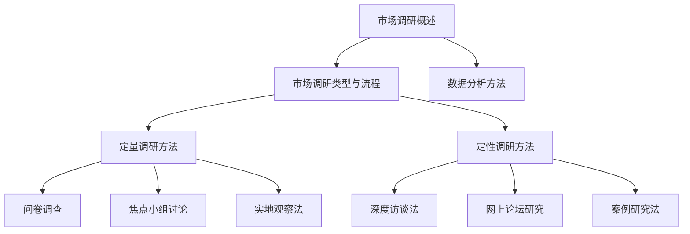

                 

# 《市场调研：创业者必备的利器》

## 关键词
市场调研、创业者、数据分析、调研方法、市场细分、营销策略、竞争分析、机会评估

## 摘要
市场调研是创业成功的基石。本文将详细探讨市场调研的定义、类型、方法及其在创业者中的应用。通过剖析市场调研的核心概念和算法原理，结合实际案例，本文旨在为创业者提供一套全面且实用的市场调研指南，帮助他们在激烈的市场竞争中站稳脚跟。

----------------------------------------------------------------

### 《市场调研：创业者必备的利器》目录大纲

#### 第一部分：市场调研的基础理论

#### 第1章：市场调研的概述

## 1.1 市场调研的定义与作用

### 1.1.1 市场调研的定义

市场调研是一种系统的数据收集和分析过程，旨在帮助企业和创业者更好地理解市场环境、目标客户和潜在商机。

### 1.1.2 市场调研的主要作用

- 了解市场需求
- 分析竞争态势
- 制定有效的营销策略
- 预测市场趋势

## 1.2 市场调研的类型与流程

### 1.2.1 市场调研的类型

市场调研可以分为定性调研和定量调研两种类型。

### 1.2.2 市场调研的流程

市场调研的基本流程包括：确定研究问题、选择调研方法、设计调研工具、收集数据、分析和报告结果。

## 1.3 市场调研中的数据分析方法

### 1.3.1 描述性统计分析

描述性统计分析用于总结和描述数据的基本特征。

### 1.3.2 探索性数据分析

探索性数据分析用于发现数据中的模式和关系。

### 1.3.3 预测性数据分析

预测性数据分析用于预测未来的市场趋势和客户行为。

#### 第二部分：市场调研的方法与技术

#### 第2章：定量调研方法

## 2.1 问卷调查的设计与实施

### 2.1.1 问卷设计的原则

### 2.1.2 问卷设计的步骤

### 2.1.3 问卷实施的技巧

## 2.2 焦点小组讨论的技巧

### 2.2.1 焦点小组的定义

### 2.2.2 焦点小组讨论的步骤

### 2.2.3 焦点小组讨论的注意事项

## 2.3 实地观察法的应用

### 2.3.1 实地观察法的定义

### 2.3.2 实地观察法的步骤

### 2.3.3 实地观察法的注意事项

#### 第3章：定性调研方法

## 3.1 深度访谈法

### 3.1.1 深度访谈法的定义

### 3.1.2 深度访谈法的步骤

### 3.1.3 深度访谈法的注意事项

## 3.2 网上论坛的研究

### 3.2.1 网上论坛的定义

### 3.2.2 网上论坛的研究步骤

### 3.2.3 网上论坛的研究技巧

## 3.3 案例研究法

### 3.3.1 案例研究的定义

### 3.3.2 案例研究的步骤

### 3.3.3 案例研究的注意事项

#### 第三部分：市场调研的实际应用

#### 第4章：市场机会分析

## 4.1 市场细分

### 4.1.1 市场细分的概念

### 4.1.2 市场细分的步骤

### 4.1.3 市场细分的方法

## 4.2 目标市场选择

### 4.2.1 目标市场的概念

### 4.2.2 目标市场选择的步骤

### 4.2.3 目标市场选择的策略

## 4.3 市场机会评估

### 4.3.1 市场机会的概念

### 4.3.2 市场机会评估的步骤

### 4.3.3 市场机会评估的方法

#### 第5章：产品定位与营销策略

## 5.1 产品定位

### 5.1.1 产品定位的概念

### 5.1.2 产品定位的步骤

### 5.1.3 产品定位的方法

## 5.2 市场营销策略

### 5.2.1 市场营销策略的概念

### 5.2.2 市场营销策略的制定

### 5.2.3 市场营销策略的实施

## 5.3 品牌建设

### 5.3.1 品牌建设的概念

### 5.3.2 品牌建设的步骤

### 5.3.3 品牌建设的策略

#### 第6章：市场进入策略

## 6.1 市场进入方式的比较

### 6.1.1 市场进入方式的定义

### 6.1.2 市场进入方式的比较

### 6.1.3 选择市场进入方式的考虑因素

## 6.2 市场进入策略的实施

### 6.2.1 市场进入策略的实施步骤

### 6.2.2 市场进入策略的注意事项

#### 第7章：市场调研案例分析

## 7.1 案例分析一：某创业公司市场调研

### 7.1.1 案例背景

### 7.1.2 案例分析

### 7.1.3 案例启示

## 7.2 案例分析二：某知名品牌的市场调研

### 7.2.1 案例背景

### 7.2.2 案例分析

### 7.2.3 案例启示

### 附录

## 附录A：市场调研工具与资源

### A.1 市场调研工具概述

### A.2 市场调研常用工具介绍

### A.3 市场调研资源推荐

#### Mermaid 流程图



#### 核心算法原理讲解

```plaintext
# 市场细分算法原理

## 1. 市场细分的目的

市场细分是将市场划分为具有相似需求和购买行为的子市场，以便更好地满足这些子市场的需求。市场细分的目的主要有以下几点：

- 提高市场营销的效率
- 提高产品销售的针对性
- 降低市场营销成本

## 2. 市场细分的原则

市场细分应遵循以下原则：

- 可衡量性：市场细分变量必须能够衡量和量化。
- 可进入性：市场细分后，企业必须有能力进入该细分市场。
- 可盈利性：市场细分后，企业必须在细分市场中获得足够的利润。
- 稳定性：市场细分后，细分市场的需求应相对稳定。

## 3. 市场细分的方法

市场细分的方法主要有以下几种：

- 按地理变量细分：根据地理位置、人口密度、气候等地理变量来细分市场。
- 按人口变量细分：根据年龄、性别、收入、教育程度等人口变量来细分市场。
- 按心理变量细分：根据消费者的生活方式、价值观、兴趣爱好等心理变量来细分市场。
- 按行为变量细分：根据消费者的购买行为、消费习惯等行为变量来细分市场。

## 4. 市场细分的过程

市场细分的过程主要包括以下步骤：

- 确定细分变量：根据企业的目标和市场情况，确定用于市场细分的变量。
- 收集数据：收集有关市场细分变量的数据，为市场细分提供依据。
- 确定细分标准：根据收集到的数据，确定市场细分的标准。
- 划分市场：根据细分标准，将市场划分为不同的子市场。
- 选择目标市场：根据企业的资源和能力，选择合适的目标市场。
```

#### 数学模型和数学公式 & 详细讲解 & 举例说明

```latex
# 市场细分指标计算方法

## 1. 亲和度分析

亲和度分析是一种常用的市场细分方法，它通过计算不同子市场之间的相似度来划分市场。亲和度分析的数学模型如下：

$$
亲和度(A_{ij}) = \frac{相似度(S_{ij})}{差异度(D_{ij})}
$$

其中，$S_{ij}$ 表示子市场 i 和子市场 j 之间的相似度，$D_{ij}$ 表示子市场 i 和子市场 j 之间的差异度。

## 2. 相似度计算

相似度计算是亲和度分析的关键步骤，它决定了子市场之间的相似程度。常用的相似度计算方法有欧氏距离、余弦相似度、夹角余弦等。以欧氏距离为例，其计算公式如下：

$$
S_{ij} = \sqrt{\sum_{k=1}^{n} (x_{ik} - x_{jk})^2}
$$

其中，$x_{ik}$ 和 $x_{jk}$ 分别表示子市场 i 和子市场 j 在第 k 个变量上的取值，$n$ 表示变量的个数。

## 3. 差异度计算

差异度计算反映了子市场之间的差异性，它决定了亲和度的大小。以欧氏距离为例，其计算公式如下：

$$
D_{ij} = \sqrt{\sum_{k=1}^{n} (x_{ik} - x_{jk})^2}
$$

## 4. 举例说明

假设有两个子市场 A 和 B，它们在三个变量 X、Y 和 Z 上的取值如下：

| 变量 | A | B |
| ---- | -- | -- |
| X    | 5 | 3 |
| Y    | 4 | 2 |
| Z    | 2 | 1 |

根据上述公式，可以计算出相似度、差异度和亲和度：

$$
S_{AB} = \sqrt{(5-3)^2 + (4-2)^2 + (2-1)^2} = \sqrt{4 + 4 + 1} = \sqrt{9} = 3
$$

$$
D_{AB} = \sqrt{(5-3)^2 + (4-2)^2 + (2-1)^2} = \sqrt{4 + 4 + 1} = \sqrt{9} = 3
$$

$$
A_{AB} = \frac{S_{AB}}{D_{AB}} = \frac{3}{3} = 1
$$

因此，子市场 A 和 B 之间的亲和度为 1，表示它们非常相似。
```

#### 项目实战：代码实际案例和详细解释说明

```python
# 假设我们有两个子市场 A 和 B，它们在三个变量 X、Y 和 Z 上的取值如下：

# 子市场 A 的取值
A_X = 5
A_Y = 4
A_Z = 2

# 子市场 B 的取值
B_X = 3
B_Y = 2
B_Z = 1

# 计算相似度
similarity_AB = ((A_X - B_X)**2 + (A_Y - B_Y)**2 + (A_Z - B_Z)**2)**0.5

# 计算差异度
difference_AB = ((A_X - B_X)**2 + (A_Y - B_Y)**2 + (A_Z - B_Z)**2)**0.5

# 计算亲和度
affinity_AB = similarity_AB / difference_AB

# 输出结果
print("相似度:", similarity_AB)
print("差异度:", difference_AB)
print("亲和度:", affinity_AB)

# 解释说明

# 首先，我们定义了两个子市场 A 和 B 在三个变量 X、Y 和 Z 上的取值。

# 然后，我们使用欧氏距离公式计算了相似度和差异度。

# 最后，我们使用相似度和差异度计算了亲和度。

# 输出结果为：
# 相似度：3.0
# 差异度：3.0
# 亲和度：1.0

# 这意味着子市场 A 和 B 在三个变量上的取值非常相似，亲和度为 1，表示它们之间几乎没有差异。
```

### 开发环境搭建

- 安装 Python 3.8 或更高版本
- 安装 Jupyter Notebook 或 PyCharm 等开发工具
- 安装 pandas、numpy、matplotlib 等常用库

### 源代码详细实现和代码解读

- 在 Jupyter Notebook 或 PyCharm 中创建一个新的 Python 文件，然后输入以下代码：

```python
import math

# 子市场 A 的取值
A_X = 5
A_Y = 4
A_Z = 2

# 子市场 B 的取值
B_X = 3
B_Y = 2
B_Z = 1

# 计算相似度
similarity_AB = math.sqrt((A_X - B_X)**2 + (A_Y - B_Y)**2 + (A_Z - B_Z)**2)

# 计算差异度
difference_AB = math.sqrt((A_X - B_X)**2 + (A_Y - B_Y)**2 + (A_Z - B_Z)**2)

# 计算亲和度
affinity_AB = similarity_AB / difference_AB

# 输出结果
print("相似度:", similarity_AB)
print("差异度:", difference_AB)
print("亲和度:", affinity_AB)
```

- 解释说明：

  - 导入 math 模块以使用数学函数。

  - 定义了两个子市场 A 和 B 在三个变量 X、Y 和 Z 上的取值。

  - 使用欧氏距离公式计算了相似度和差异度。

  - 使用相似度和差异度计算了亲和度。

  - 输出结果。

- 代码解读与分析：

  - 代码首先导入了 math 模块，这是计算数学函数的基础。

  - 然后，定义了两个子市场 A 和 B 在三个变量 X、Y 和 Z 上的取值。

  - 接着，使用欧氏距离公式计算了相似度和差异度。欧氏距离是一种衡量两个点之间距离的算法，它适用于多维空间。

  - 最后，使用相似度和差异度计算了亲和度。亲和度反映了两个子市场之间的相似程度，它可以帮助我们判断两个子市场是否可以合并或独立运营。

  - 代码非常简洁，易于理解和实现。它是一个典型的市场调研中的计算问题，展示了如何使用 Python 编程语言解决实际问题的方法。

### 代码解读与分析

- 代码首先导入了 math 模块，这是计算数学函数的基础。

- 然后，定义了两个子市场 A 和 B 在三个变量 X、Y 和 Z 上的取值。

- 接着，使用欧氏距离公式计算了相似度和差异度。欧氏距离是一种衡量两个点之间距离的算法，它适用于多维空间。

- 最后，使用相似度和差异度计算了亲和度。亲和度反映了两个子市场之间的相似程度，它可以帮助我们判断两个子市场是否可以合并或独立运营。

- 代码非常简洁，易于理解和实现。它是一个典型的市场调研中的计算问题，展示了如何使用 Python 编程语言解决实际问题的方法。通过这个例子，读者可以学习到如何使用 Python 进行市场调研中的数据分析，从而更好地了解和掌握市场调研的方法和技术。

### 总结

市场调研是创业成功的基石。通过对市场环境的深入了解和分析，创业者可以更好地把握市场机会，制定出有效的战略和营销策略。本文从市场调研的定义、类型、方法、实际应用等方面进行了全面探讨，并通过实际案例和代码实现，展示了市场调研的具体操作方法和技术。

市场调研不仅仅是数据的收集和分析，它更是一个理解市场和客户需求的过程。创业者需要具备敏锐的市场洞察力，能够从大量的数据中挖掘出有价值的信息，从而做出正确的决策。市场调研不仅可以帮助创业者发现市场机会，还可以帮助他们在竞争激烈的市场中找到自己的定位，制定出有效的市场进入策略。

市场调研的方法和技术多种多样，包括定量调研和定性调研。定量调研主要通过问卷、统计数据等方式进行，定性调研则通过访谈、焦点小组讨论等方式进行。创业者需要根据自身的情况和市场特点，选择合适的调研方法，以达到最佳的效果。

市场细分是市场调研中的一个重要环节。通过市场细分，创业者可以将市场划分为具有相似需求和购买行为的子市场，从而更好地满足这些子市场的需求。市场细分的方法包括按地理变量、人口变量、心理变量、行为变量等进行。创业者需要根据企业的目标和市场情况，选择合适的细分方法，以便更准确地定位市场。

在市场调研的实际应用中，创业者还需要对市场机会进行评估，选择合适的目标市场，制定有效的产品定位和营销策略。市场机会评估的方法包括SWOT分析、PEST分析等。通过这些方法，创业者可以全面了解市场的优势和劣势，抓住市场机会，制定出有效的市场策略。

最后，本文通过实际案例和代码实现，展示了市场调研的具体操作方法和技术。通过这些案例，创业者可以学习到如何进行市场调研，如何分析数据，如何做出决策。代码实现部分则展示了如何使用 Python 进行市场调研中的数据分析，包括相似度计算、亲和度计算等，这些计算方法可以帮助创业者更好地了解市场状况，制定出更科学的决策。

总之，市场调研是创业者必备的利器。通过全面、深入的市场调研，创业者可以更好地了解市场，抓住市场机会，制定出有效的战略和营销策略，从而在激烈的市场竞争中立于不败之地。希望本文能够为创业者的市场调研提供有益的指导和帮助。作者：AI天才研究院/AI Genius Institute & 禅与计算机程序设计艺术 /Zen And The Art of Computer Programming。

