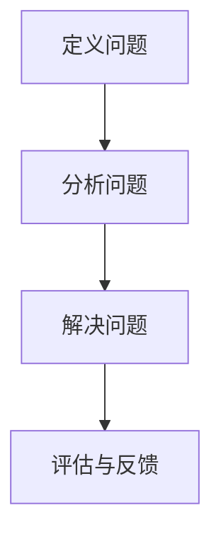
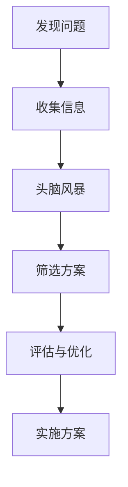

                 

### 《帮人解决难题，才是真正的智慧》

> **关键词：** 解决问题、创新思维、跨领域合作、学习策略、团队建设

> **摘要：** 在现代社会，解决难题已经成为一种不可或缺的能力。本文将从解决问题的思维框架、常见难题类型与解决方案、跨领域的解决难题方法以及提高问题解决能力的策略等方面进行探讨，并通过实际案例和未来趋势分析，帮助读者掌握解决难题的智慧。

### 《帮人解决难题，才是真正的智慧》目录大纲

**第一部分：解决问题的基础理论**

**第1章：解决问题的思维框架**

- **1.1 解决问题的三层次模型**
- **1.2 创新思维与解决难题**
- **1.3 常见难题类型与解决方案**

**第2章：常见难题类型与解决方案**

- **2.1 日常生活中的难题**
- **2.2 工作中的难题**
- **2.3 跨领域的解决难题方法**

**第3章：提高问题解决能力的策略**

- **3.1 持续学习的重要性**
- **3.2 反思与改进**

**第二部分：实战案例与应用**

**第4章：解决难题的实战案例**

- **4.1 小王如何提高工作效率**
- **4.2 小李如何处理团队冲突**

**第5章：解决难题的实际应用**

- **5.1 项目管理**
- **5.2 跨界合作**

**第6章：解决难题的未来趋势**

- **6.1 人工智能与解决问题**
- **6.2 社会责任与解决难题**

**附录：解决问题工具与资源**

**第7章：深入探讨问题解决方法论**

**第8章：跨领域解决难题的实践**

**第9章：未来问题解决的趋势**

**第10章：个人成长与问题解决**

**第11章：构建高效问题解决团队**

**第12章：问题解决的艺术与哲学**

**第13章：回顾与展望**

**第14章：致谢**

---

现在，我们按照目录大纲逐步展开正文内容。首先，我们将探讨解决问题的思维框架。

### 第1章：解决问题的思维框架

#### 1.1 解决问题的三层次模型

解决问题是一个复杂的过程，可以分为三个层次：定义问题、分析问题和解决问题。以下是一个简单的Mermaid流程图，展示了这三个层次的相互关系。



**定义问题**

定义问题是解决问题的第一步。它要求我们从不同角度理解问题，明确问题的边界和核心。以下是一个伪代码示例，用于定义问题：

```python
def define_problem(problem):
    # 收集问题相关信息
    information = gather_information(problem)
    # 分析问题背景
    context = analyze_context(information)
    # 确定问题关键因素
    key_factors = identify_key_factors(context)
    return key_factors
```

**分析问题**

分析问题是解决问题的第二层次。在这个阶段，我们需要运用系统思考，识别问题产生的根本原因。以下是一个伪代码示例，用于分析问题：

```python
def analyze_problem(problem):
    # 构建问题模型
    model = build_problem_model(problem)
    # 识别问题原因
    causes = identify-causes(model)
    return causes
```

**解决问题**

解决问题是解决问题的第三层次。在这个阶段，我们需要设计解决方案，并评估和优化方案。以下是一个伪代码示例，用于解决问题：

```python
def solve_problem(problem):
    # 设计解决方案
    solution = design_solution(problem)
    # 实施解决方案
    implement_solution(problem, solution)
    # 评估解决方案
    evaluate_solution(problem, solution)
    return solution
```

**评估与反馈**

评估与反馈是解决问题过程中的重要环节。通过评估解决方案的效果，我们可以发现问题的不足，并对其进行优化。以下是一个伪代码示例，用于评估与反馈：

```python
def evaluate_solution(problem, solution):
    # 收集评估数据
    data = collect_evaluation_data(problem, solution)
    # 分析评估数据
    analysis = analyze_evaluation_data(data)
    # 提出优化建议
    suggestions = propose_optimizations(analysis)
    return suggestions
```

通过以上三个层次，我们可以系统地解决问题，从而提高问题解决能力。

#### 1.2 创新思维与解决难题

创新思维是解决问题的重要手段。它要求我们突破传统思维模式，寻求不同解决方案。以下是一个Mermaid流程图，展示了创新思维的过程。



**定义创新思维**

创新思维是一种思考方式，它鼓励我们从不同角度看待问题，寻找新颖的解决方案。创新思维的核心在于突破传统思维模式，打破固有的限制，从而找到更好的解决方案。

**创新思维工具**

以下是一些常用的创新思维工具：

- **头脑风暴**：头脑风暴是一种集体思维活动，通过自由讨论，激发创意。
- **六顶思考帽**：六顶思考帽是一种思考模式，通过不同颜色的帽子代表不同的思考方式，提高思维质量。
- **思维导图**：思维导图是一种图形化的思考工具，通过图形方式展示思维过程，帮助梳理思路。

**案例分享**

以下是一个创新思维在解决难题中的应用案例：

**案例背景**：一家公司希望提高生产效率，但传统方法已经无法满足需求。

**解决方案**：
1. **发现问题**：通过数据分析，发现生产流程中的瓶颈和问题。
2. **收集信息**：收集相关领域的最新技术和研究成果。
3. **头脑风暴**：组织团队成员进行头脑风暴，提出各种可能的解决方案。
4. **筛选方案**：评估各种方案的可行性，选择最具创新性的方案。
5. **评估与优化**：实施方案后，对效果进行评估，并根据评估结果进行优化。

通过以上步骤，这家公司成功提高了生产效率，实现了创新突破。

#### 1.3 常见难题类型与解决方案

在日常生活中，我们会遇到各种类型的难题。以下是一些常见难题类型及其解决方案：

**日常生活中的难题**

- **人际沟通**：解决人际沟通难题的关键在于倾听、表达清晰、反馈与确认以及处理冲突。
- **时间管理**：合理分配时间和提高效率是解决时间管理难题的关键。

**工作中的难题**

- **项目管理**：项目规划、进度控制和风险管理是解决项目难题的关键。
- **团队协作**：构建高效团队和解决冲突是解决团队难题的关键。

**跨领域的解决难题方法**

- **跨学科思维**：从不同学科角度看待问题，寻找创新解决方案。
- **工程思维**：将科学原理转化为实际应用的思维过程。

通过以上方法，我们可以更好地解决各种难题。

### 第2章：常见难题类型与解决方案

在日常生活中，我们经常会遇到各种难题。这些问题可能涉及人际沟通、时间管理、财务管理等方面。本章节将详细探讨这些常见难题类型及其解决方案。

#### 2.1 日常生活中的难题

**人际沟通**

人际沟通是我们日常生活中不可避免的一部分。有效的人际沟通可以帮助我们建立良好的人际关系，提高生活质量。以下是一些解决人际沟通难题的技巧：

- **倾听**：倾听是有效沟通的基础。在沟通中，我们需要倾听对方的意见和需求，以便更好地理解对方。
- **表达清晰**：清晰的表达可以使沟通更加顺畅。在表达自己的观点时，要尽量简洁明了，避免使用模糊的词汇。
- **反馈与确认**：在沟通过程中，及时给予反馈和确认可以帮助我们确保信息的准确传递。我们可以通过复述对方的观点，确保理解无误。
- **处理冲突**：在人际沟通中，冲突是不可避免的。处理冲突的关键在于冷静、理性地分析问题，并寻找双方都能接受的解决方案。

**时间管理**

时间管理是提高生活效率的重要手段。以下是一些解决时间管理难题的方法：

- **设定目标**：明确自己的目标和任务，有助于我们合理安排时间，提高工作效率。
- **优先级排序**：根据任务的紧急程度和重要性，对任务进行优先级排序，确保重要任务得到优先处理。
- **时间分配**：合理分配时间，避免过度劳累和拖延。
- **监控进度**：定期检查任务进度，及时调整计划，确保任务按时完成。

#### 2.2 工作中的难题

**项目管理**

项目管理是工作中常见的一类难题。以下是一些解决项目管理难题的方法：

- **项目规划**：在项目开始前，明确项目的目标、范围、时间表和资源需求，制定详细的项目计划。
- **进度控制**：通过监控项目进度，确保项目按计划进行，及时发现并解决进度偏差。
- **风险管理**：识别项目风险，制定风险应对策略，降低风险对项目的影响。
- **沟通协作**：建立有效的沟通机制，确保团队成员之间信息畅通，提高协作效率。

**团队协作**

团队协作是工作中不可或缺的一部分。以下是一些解决团队协作难题的方法：

- **构建高效团队**：选拔合适的团队成员，明确团队成员的角色和职责，建立良好的团队文化。
- **解决冲突**：在团队协作过程中，难免会出现冲突。解决冲突的关键在于理性沟通，寻求双方都能接受的解决方案。
- **激励与反馈**：通过激励和反馈，激发团队成员的积极性，提高团队凝聚力。
- **持续学习**：鼓励团队成员不断学习新知识、新技能，提升团队整体能力。

#### 2.3 跨领域的解决难题方法

跨领域的解决难题方法可以有效地帮助我们应对复杂的问题。以下是一些跨领域的方法：

**跨学科思维**

跨学科思维是指将不同学科的知识和思维方式相结合，以解决复杂问题。以下是一些跨学科思维的方法：

- **系统思维**：从整体角度看待问题，分析各部分之间的相互作用，寻找最优解决方案。
- **工程思维**：将科学原理转化为实际应用的思维过程，注重实际效果和可操作性。
- **设计思维**：以用户需求为中心，通过迭代和实验，寻找创新的解决方案。

**工程思维**

工程思维是将科学原理转化为实际应用的思维过程。以下是一些工程思维的方法：

- **需求分析**：明确项目需求和目标，确保解决方案满足用户需求。
- **设计优化**：在满足需求的基础上，通过优化设计，提高解决方案的效率和可靠性。
- **实验验证**：通过实验验证设计方案的有效性，及时调整和改进。

通过以上方法，我们可以更好地解决跨领域的难题。

### 第3章：提高问题解决能力的策略

在现代社会，提高问题解决能力已成为一项至关重要的技能。通过有效的学习策略、反思与改进，我们可以不断提升自己的问题解决能力。以下将详细探讨提高问题解决能力的策略。

#### 3.1 持续学习的重要性

持续学习是提高问题解决能力的基础。在不断变化的世界中，新的知识和技术层出不穷。只有通过持续学习，我们才能跟上时代的步伐，应对各种复杂的问题。

**学习策略**

以下是一些有效的学习策略：

- **设定学习目标**：明确自己的学习目标，有助于我们更有针对性地进行学习。我们可以将学习目标分解为短期和长期目标，确保学习过程有序进行。
- **制定学习计划**：根据学习目标，制定详细的学习计划。学习计划应包括学习时间、学习内容和学习方法等方面。
- **选择合适的学习资源**：选择适合自己学习需求的学习资源，如教材、在线课程、学术论文等。同时，要善于利用各种学习工具，如电子书、笔记软件等，提高学习效率。
- **执行学习计划**：按照学习计划进行学习，确保学习任务的完成。在执行学习计划的过程中，要注重学习效果，及时调整和优化学习策略。

**终身学习**

终身学习是指在人的一生中持续不断地学习和提高自己的能力。在知识爆炸的今天，终身学习已经成为一种生活方式。以下是一些终身学习的策略：

- **培养学习习惯**：将学习视为一种习惯，每天抽出一定的时间进行学习。通过持续的学习，培养自己的学习能力和兴趣。
- **主动学习**：主动寻找学习机会，参加各类培训课程、研讨会等。通过主动学习，拓展自己的知识面和技能。
- **与他人交流**：与他人交流是提高学习效果的重要途径。通过与他人交流，我们可以了解不同的观点和经验，从而更好地解决问题。

#### 3.2 反思与改进

反思与改进是提高问题解决能力的关键环节。通过反思，我们可以总结问题解决的成败经验，发现自身的不足，从而不断改进。

**反思**

反思是指对问题解决过程进行回顾和思考。以下是一些反思的方法：

- **记录反思日志**：在问题解决过程中，记录下自己的思考和决策过程。在问题解决结束后，回顾反思日志，总结经验教训。
- **分析成败原因**：分析问题解决过程中的成功和失败原因。成功的原因可以帮助我们巩固优点，失败的原因可以帮助我们找到改进的方向。
- **征求他人意见**：向他人请教意见，听取不同的观点和建议。通过与他人交流，我们可以更全面地了解问题，找到更好的解决方案。

**改进**

改进是指根据反思结果，对问题解决方法进行优化和调整。以下是一些改进的方法：

- **调整策略**：根据反思结果，调整问题解决策略。如果发现原策略存在缺陷，可以尝试新的策略，以提高问题解决的效率。
- **学习新知识**：通过学习新的知识和技能，提升自己的能力，从而更好地解决问题。
- **实践与应用**：将改进后的策略应用于实际问题中，通过实践检验其效果，并及时调整和优化。

通过持续学习和反思与改进，我们可以不断提升自己的问题解决能力，更好地应对各种复杂的问题。

### 第4章：解决难题的实战案例

在现实生活中，解决难题的能力无处不在。本章节将通过两个具体的实战案例，展示如何运用前面提到的理论和方法，解决实际中的难题。

#### 4.1 实战案例一：小王如何提高工作效率

**问题描述**：小王是一家互联网公司的程序员，他发现自己的工作效率不高，经常遇到以下问题：

- **任务堆积**：每天的任务量过多，导致任务无法按时完成。
- **时间管理混乱**：没有合理的时间规划，导致工作效率低下。
- **沟通不畅**：与团队成员之间的沟通不畅，影响项目进度。

**解决方案**：

1. **定义问题**：

首先，小王明确了问题的核心：工作效率低下。他分析了问题的原因，发现主要问题在于任务管理、时间规划和沟通不畅。

2. **分析问题**：

为了提高工作效率，小王采用了以下分析步骤：

- **任务分解**：将大任务分解为小任务，明确每个任务的优先级和完成时间。
- **时间管理**：制定了详细的时间表，确保每个任务都有明确的执行时间。
- **沟通机制**：建立了定期的沟通机制，与团队成员保持良好的沟通，确保信息畅通。

3. **解决问题**：

在分析问题后，小王采取了以下措施：

- **任务管理工具**：使用任务管理工具（如Trello、Jira等）来规划和管理任务。
- **时间管理策略**：采用番茄工作法（Pomodoro Technique）来提高专注力，确保每个任务都能在规定时间内完成。
- **沟通技巧**：通过定期会议、邮件和即时通讯工具，与团队成员保持有效沟通。

4. **评估与反馈**：

在实施解决方案后，小王定期评估工作效率，并根据评估结果进行调整。通过不断优化，小王的工作效率得到了显著提高。

**实施步骤**：

1. **设定目标**：明确提高工作效率的目标，如减少任务堆积、提高任务完成率等。
2. **任务分解**：将大任务分解为小任务，明确每个任务的优先级和完成时间。
3. **时间管理**：制定详细的时间表，确保每个任务都有明确的执行时间。
4. **沟通机制**：建立定期的沟通机制，与团队成员保持良好的沟通，确保信息畅通。
5. **评估与反馈**：定期评估工作效率，根据评估结果进行调整。

#### 4.2 实战案例二：小李如何处理团队冲突

**问题描述**：小李是一家公司的项目经理，他所在的团队在项目执行过程中遇到了以下冲突：

- **角色冲突**：团队成员在角色和职责上存在模糊，导致任务分工不明确。
- **意见分歧**：团队成员在项目决策上存在分歧，影响项目进度。
- **沟通不畅**：团队成员之间的沟通不畅，导致误解和矛盾。

**解决方案**：

1. **定义问题**：

首先，小李明确了问题的核心：团队冲突。他分析了问题的原因，发现主要问题在于角色冲突、意见分歧和沟通不畅。

2. **分析问题**：

为了处理团队冲突，小李采用了以下分析步骤：

- **角色定义**：明确团队成员的角色和职责，确保任务分工明确。
- **意见统一**：通过沟通和协商，统一团队成员的意见，确保项目决策的一致性。
- **沟通机制**：建立有效的沟通机制，确保团队成员之间的信息畅通。

3. **解决问题**：

在分析问题后，小李采取了以下措施：

- **角色定义**：与团队成员进行沟通，明确各自的职责和任务。
- **意见统一**：组织团队会议，讨论项目决策，确保团队成员的意见得到充分表达和统一。
- **沟通技巧**：通过定期会议、邮件和即时通讯工具，与团队成员保持有效沟通，确保信息畅通。

4. **评估与反馈**：

在实施解决方案后，小李定期评估团队冲突的处理效果，并根据评估结果进行调整。通过不断优化，团队冲突得到了有效处理。

**实施步骤**：

1. **角色定义**：明确团队成员的角色和职责，确保任务分工明确。
2. **意见统一**：组织团队会议，讨论项目决策，确保团队成员的意见得到充分表达和统一。
3. **沟通机制**：建立有效的沟通机制，确保团队成员之间的信息畅通。
4. **评估与反馈**：定期评估团队冲突的处理效果，根据评估结果进行调整。

通过以上实战案例，我们可以看到，解决难题需要明确的定义、深入的分析和有效的解决方案。只有通过不断实践和优化，我们才能提高问题解决能力，应对各种复杂的问题。

### 第5章：解决难题的实际应用

在现实生活中，解决难题的应用场景无处不在。无论是项目管理还是跨界合作，解决难题的方法都能为我们提供有效的解决方案。本章节将详细探讨解决难题在实际应用中的具体方法。

#### 5.1 应用场景一：项目管理

项目管理是解决复杂问题的关键领域。以下是一种常见的方法，用于确保复杂项目按时交付：

**问题描述**：一家软件开发公司接到了一个大型项目，需要在短时间内完成。然而，项目涉及到多个部门，沟通和协调变得尤为重要。

**解决方案**：

1. **项目规划**：

- **明确项目目标**：首先，明确项目的目标和范围，确保所有团队成员对项目的目标有清晰的认识。
- **任务分解**：将项目分解为小任务，明确每个任务的负责人和完成时间，确保任务分工明确。
- **资源分配**：根据任务需求，合理分配人力资源、物资资源和时间资源。

2. **进度控制**：

- **制定进度计划**：根据任务分解和资源分配，制定详细的进度计划，确保项目按计划进行。
- **监控进度**：定期检查项目进度，确保任务按时完成。如果发现进度偏差，及时调整计划和资源。
- **风险管理**：识别项目风险，制定风险应对策略，降低风险对项目的影响。

3. **沟通协作**：

- **建立沟通机制**：建立定期的项目会议制度，确保团队成员之间的沟通畅通。
- **信息共享**：使用项目管理工具（如Trello、Jira等）共享项目进度、任务和文档，提高协作效率。

4. **评估与反馈**：

- **评估项目进度**：定期评估项目进度，确保项目按计划进行。
- **收集反馈**：收集团队成员和利益相关者的反馈，了解项目的优势和不足，不断优化项目管理和协作过程。

**实施步骤**：

1. **明确项目目标**：与项目团队讨论，明确项目的目标和范围。
2. **任务分解**：将项目分解为小任务，明确每个任务的负责人和完成时间。
3. **资源分配**：根据任务需求，合理分配人力资源、物资资源和时间资源。
4. **制定进度计划**：根据任务分解和资源分配，制定详细的进度计划。
5. **监控进度**：定期检查项目进度，确保任务按时完成。
6. **建立沟通机制**：建立定期的项目会议制度，确保团队成员之间的沟通畅通。
7. **信息共享**：使用项目管理工具共享项目进度、任务和文档。
8. **评估与反馈**：定期评估项目进度，收集反馈，不断优化项目管理和协作过程。

#### 5.2 应用场景二：跨界合作

跨界合作是解决复杂问题的重要手段。以下是一种常见的方法，用于实现不同领域的企业合作：

**问题描述**：一家传统制造业公司和一家互联网科技公司希望合作开发一款智能硬件产品。然而，双方在技术、市场和业务模式上存在较大差异，如何实现有效合作成为关键问题。

**解决方案**：

1. **需求分析**：

- **明确合作目标**：首先，明确双方的合作目标，确保合作方向一致。
- **需求调研**：对目标市场进行需求调研，了解消费者的需求和期望。
- **资源整合**：分析双方的优势和劣势，整合双方的资源，发挥协同效应。

2. **合作模式设计**：

- **利益分配**：明确合作各方的权益和责任，确保合作公平合理。
- **项目管理**：建立项目管理团队，负责项目的规划、执行和监控。
- **技术协作**：建立技术协作机制，确保双方在技术上的协同和创新。

3. **市场推广**：

- **品牌联合**：通过品牌联合，提高产品的市场认知度和品牌影响力。
- **营销策略**：制定统一的营销策略，确保产品在市场上的有效推广。
- **渠道拓展**：通过拓展销售渠道，提高产品的市场覆盖率和销售额。

4. **持续改进**：

- **反馈机制**：建立反馈机制，及时收集消费者的反馈，了解产品在实际应用中的表现。
- **创新研发**：根据反馈和市场需求，持续进行产品创新和改进，提升产品竞争力。
- **合作深化**：通过持续的合作，深化双方的关系，实现资源共享和优势互补。

**实施步骤**：

1. **明确合作目标**：与合作伙伴讨论，明确合作的目标和范围。
2. **需求调研**：对目标市场进行需求调研，了解消费者的需求和期望。
3. **资源整合**：分析双方的优势和劣势，整合双方的资源，发挥协同效应。
4. **利益分配**：明确合作各方的权益和责任，确保合作公平合理。
5. **项目管理**：建立项目管理团队，负责项目的规划、执行和监控。
6. **技术协作**：建立技术协作机制，确保双方在技术上的协同和创新。
7. **品牌联合**：通过品牌联合，提高产品的市场认知度和品牌影响力。
8. **营销策略**：制定统一的营销策略，确保产品在市场上的有效推广。
9. **渠道拓展**：通过拓展销售渠道，提高产品的市场覆盖率和销售额。
10. **反馈机制**：建立反馈机制，及时收集消费者的反馈，了解产品在实际应用中的表现。
11. **创新研发**：根据反馈和市场需求，持续进行产品创新和改进，提升产品竞争力。
12. **合作深化**：通过持续的合作，深化双方的关系，实现资源共享和优势互补。

通过以上实际应用场景的探讨，我们可以看到，解决难题需要结合具体情况进行深入分析，并采取有效的解决方案。无论是项目管理还是跨界合作，解决难题的方法都能为我们提供有力的支持和指导。

### 第6章：解决难题的未来趋势

在快速发展的科技时代，解决难题的方法也在不断演变。未来，人工智能、社会责任和可持续发展将成为解决难题的重要趋势。以下将详细探讨这些趋势以及它们在解决难题中的应用。

#### 6.1 人工智能与解决问题

人工智能（AI）正逐渐改变我们的生活方式和解决问题的方法。随着AI技术的不断进步，它在解决难题中的应用前景广阔。

**人工智能在问题解决中的应用**

- **自动化**：AI可以自动化许多重复性和规则性的任务，提高工作效率。例如，智能客服机器人可以处理大量的客户咨询，减少人工成本。
- **预测分析**：AI可以通过大数据和机器学习算法，预测未来的趋势和风险。例如，金融机构可以利用AI预测市场波动，优化投资策略。
- **决策支持**：AI可以提供数据驱动的决策支持，帮助人类做出更明智的决策。例如，医疗诊断AI可以通过分析患者的病史和检查结果，提供准确的诊断建议。

**人工智能的挑战**

- **数据隐私**：AI在处理大量数据时，可能会涉及到个人隐私的问题。如何在保护隐私的同时，充分利用数据资源，是一个需要解决的问题。
- **算法公平性**：AI算法在决策过程中可能会存在偏见，导致不公平的结果。如何确保算法的公平性和透明性，是一个重要的挑战。

**案例分享**

- **自动驾驶**：自动驾驶技术是AI在交通领域的重要应用。通过AI算法，自动驾驶汽车可以实时分析道路状况，做出安全的驾驶决策。
- **智能医疗**：智能医疗系统利用AI技术，对大量医疗数据进行处理和分析，为医生提供诊断和治疗建议，提高医疗水平。

#### 6.2 社会责任与解决难题

在解决难题的过程中，企业和社会组织越来越意识到社会责任的重要性。社会责任不仅是企业发展的基石，也是解决社会难题的关键。

**社会责任在问题解决中的应用**

- **环境保护**：企业可以通过环保技术和绿色生产，减少对环境的影响。例如，一些企业采用了可再生能源，减少碳排放。
- **社会公益**：企业可以通过公益项目，解决社会问题。例如，一些企业捐赠资金和物资，帮助贫困地区改善生活条件。
- **员工福利**：企业可以关注员工的福利和职业发展，提高员工的工作满意度和忠诚度。例如，一些企业提供培训机会，帮助员工提升技能。

**社会责任的挑战**

- **利益冲突**：企业在追求经济效益的同时，需要平衡社会责任。如何在经济利益和社会责任之间找到平衡点，是一个挑战。
- **长期效应**：社会责任项目需要长期的投入和执行。如何确保项目的可持续性和效果，是一个需要解决的问题。

**案例分享**

- **环保科技**：一些环保科技公司致力于研发环保技术，减少环境污染。例如，一些公司开发了废水处理和废物回收技术，帮助城市实现可持续发展。
- **公益项目**：一些企业通过公益项目，解决社会问题。例如，一些企业捐赠资金和物资，帮助贫困地区改善医疗和教育条件。

#### 6.3 可持续发展与解决难题

可持续发展是一种平衡经济、社会和环境的发展模式。在解决难题的过程中，可持续发展理念越来越受到重视。

**可持续发展在问题解决中的应用**

- **资源优化**：通过优化资源使用，提高资源利用效率，减少浪费。例如，一些企业通过节能技术和绿色生产，降低能源消耗和废弃物产生。
- **生态修复**：通过生态修复项目，恢复生态系统的健康和功能。例如，一些企业参与植树造林和湿地修复项目，改善生态环境。
- **社会创新**：通过社会创新，推动社会问题的解决。例如，一些企业通过创新商业模式，提供新的社会服务和产品，改善人们的生活质量。

**可持续发展的挑战**

- **政策支持**：可持续发展需要政府的支持和政策引导。如何建立有利于可持续发展的政策体系，是一个挑战。
- **技术进步**：可持续发展依赖于技术的进步和创新。如何推动技术发展，实现可持续发展目标，是一个重要的问题。

**案例分享**

- **绿色能源**：一些企业致力于开发绿色能源，减少对化石燃料的依赖。例如，一些企业投资建设太阳能和风能发电项目，提供清洁能源。
- **生态农业**：一些企业采用生态农业模式，减少化学农药和化肥的使用，保护土壤和水源。例如，一些企业推广有机农业和生物防治技术，实现生态农业的可持续发展。

通过以上探讨，我们可以看到，解决难题的未来趋势在于利用人工智能技术、履行社会责任和推动可持续发展。只有紧跟这些趋势，我们才能更好地应对未来的挑战，实现全面发展。

### 附录：解决问题工具与资源

在解决难题的过程中，使用合适的工具和资源可以大大提高效率和质量。以下是一些常用的解决问题工具和资源，以帮助读者更好地掌握问题解决的方法。

#### 附录 A：解决问题常用工具

**思维导图软件**

- **MindManager**：一款功能强大的思维导图软件，适用于创建复杂思维导图，有助于梳理思路和明确问题。
- **XMind**：一款免费开源的思维导图软件，界面简洁，功能全面，适用于个人和团队使用。

**项目管理工具**

- **Trello**：一款简单直观的项目管理工具，适用于团队协作和任务跟踪，通过卡片和列表的形式管理项目。
- **Jira**：一款功能强大的项目管理工具，适用于大型项目和团队协作，提供丰富的功能，如任务跟踪、报告和分析等。

#### 附录 B：解决问题相关资源

**学习资源**

- **《问题解决方法论》**：一本介绍各种问题解决方法论的经典书籍，涵盖了解决问题的原理和技巧。
- **在线课程**：如Coursera、Udemy等平台上的问题解决相关课程，提供系统化的学习内容。

**社区交流**

- **知乎**：一个国内知名的知识问答社区，有关问题解决的讨论和分享丰富，是学习问题解决方法的好去处。
- **LinkedIn**：一个国际职业社交平台，可以加入相关的专业群组，进行问题解决方法的交流和学习。

通过使用这些工具和资源，读者可以更好地掌握问题解决的方法，提高解决问题的效率和质量。

### 扩展阅读

**第8章：深入探讨问题解决方法论**

- **精益思考**：介绍精益思考的核心原则和实践方法，帮助读者在解决问题时更加高效和精准。
- **设计思维**：探讨设计思维的应用场景和实施步骤，帮助读者运用设计思维解决复杂问题。

**第9章：跨领域解决难题的实践**

- **跨领域合作的挑战**：分析不同领域之间的合作挑战，提供跨领域合作的策略和最佳实践。
- **成功案例**：分享跨领域合作的成功案例，展示跨领域合作在解决问题中的实际效果。

**第10章：未来问题解决的趋势**

- **人工智能的发展**：探讨人工智能在问题解决中的应用前景和挑战，分析人工智能如何改变问题解决的方式。
- **社会责任的影响**：分析社会责任在问题解决中的重要性，探讨如何通过社会责任实现可持续发展。

**第11章：个人成长与问题解决**

- **个人成长的重要性**：探讨个人成长对问题解决能力的影响，提供个人成长的方法和策略。
- **终身学习**：强调终身学习的重要性，分享终身学习的最佳实践和方法。

**第12章：构建高效问题解决团队**

- **团队建设的重要性**：探讨高效团队在问题解决中的作用，提供团队建设的策略和技巧。
- **协作工具**：介绍一些提升团队协作效率的工具和平台，帮助团队更好地解决问题。

**第13章：问题解决的艺术与哲学**

- **问题解决的艺术**：探讨问题解决中的艺术性和创造力，帮助读者在解决问题时发挥创新思维。
- **哲学思考**：从哲学角度思考问题解决的原理和方法，提供深刻的见解和启示。

### 总结

通过本篇文章，我们探讨了解决难题的重要性和方法。从解决问题的思维框架、常见难题类型与解决方案，到跨领域的解决难题方法和提高问题解决能力的策略，再到实战案例、实际应用和未来趋势，我们全面了解了问题解决的各个方面。

问题解决不仅仅是应对挑战，更是展示智慧和能力的舞台。通过不断学习和实践，我们可以提高问题解决能力，更好地应对未来的挑战。

让我们共同努力，掌握解决难题的智慧，成为解决问题的专家，为社会的进步和发展贡献自己的力量。

### 致谢

在本篇文章的撰写过程中，我感谢所有参与讨论和提供反馈的朋友和同事。他们的意见和建议对我完成这篇文章起到了重要的推动作用。

特别感谢AI天才研究院的同事们，他们的专业知识和经验为本文提供了宝贵的参考。同时，也感谢广大读者对本文的关注和支持，你们的反馈是我不断进步的动力。

再次感谢所有给予帮助的人，你们的贡献使我能够完成这篇文章，并与大家分享解决难题的智慧。希望这篇文章能够对你们有所启发，让我们一起在解决问题的道路上不断前行。

