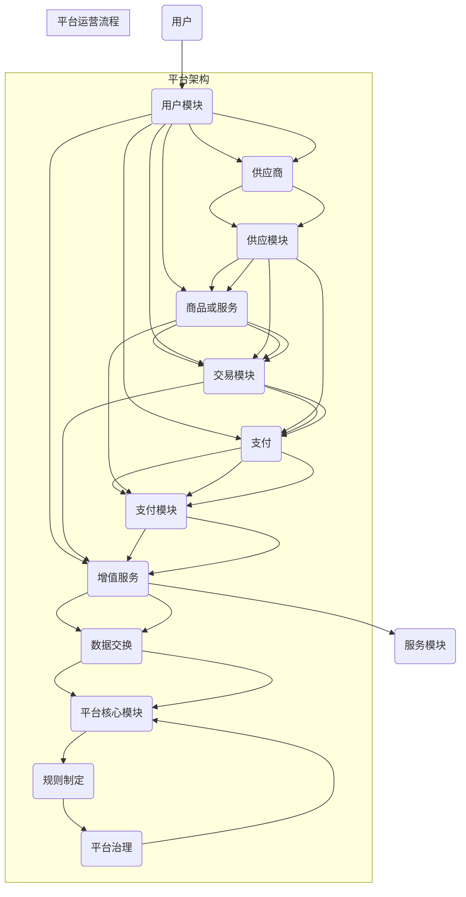

                 

## 平台经济与传统产业的融合：如何实现互利共赢？

> **关键词**：平台经济、传统产业、融合、互利共赢、转型、创新、数据技术、人工智能、区块链

> **摘要**：本文深入探讨了平台经济与传统产业的融合模式、机制、核心算法及其在实践中的应用。首先，我们介绍了平台经济的概念、特性以及与传统产业融合的背景与趋势。接着，我们详细分析了平台经济与传统产业融合的机制与模式，并探讨了其中的核心概念与联系。随后，我们讲解了平台经济与传统产业融合中的核心算法，包括数据分析与挖掘、人工智能和区块链技术。最后，通过实际案例分析，展示了平台经济与传统产业融合的成功路径，并提出未来发展展望与战略建议。

### 引言

在全球经济环境复杂多变的大背景下，传统产业面临着转型升级的巨大压力。而平台经济作为一种新兴的经济模式，以其灵活、高效、开放的特点，为传统产业的转型提供了新的机遇。平台经济与传统产业的融合不仅有助于传统产业提升效率、降低成本、增强竞争力，还能为平台经济注入新的活力和增长点。因此，研究平台经济与传统产业的融合模式与实现路径，具有重要的理论和实践意义。

本文旨在系统地探讨平台经济与传统产业融合的理论基础、实现机制、核心算法以及实践应用。文章首先介绍了平台经济的概念、特性以及与传统产业融合的背景与趋势；接着分析了平台经济与传统产业融合的机制与模式；然后详细阐述了平台经济的核心概念原理与架构，以及传统产业的转型路径与策略；在此基础上，介绍了平台经济与传统产业融合中的核心算法，包括数据分析与挖掘、人工智能和区块链技术；最后，通过实际案例分析，展示了平台经济与传统产业融合的成功路径，并提出未来发展展望与战略建议。

通过本文的深入探讨，我们期望能够为传统产业转型提供有益的参考，并为平台经济的健康发展提供理论支持。在接下来的文章中，我们将一步步分析推理，深入探讨平台经济与传统产业的融合如何实现互利共赢。

### 《平台经济与传统产业的融合：如何实现互利共赢？》目录大纲

为了更好地帮助读者了解本文的结构和内容，我们特别设计了详细的目录大纲，以下是对每个章节的简要概述：

### 第一部分：引论

#### 第1章：平台经济与传统产业的融合概述

- **1.1 平台经济的概念与特性**
  - 平台经济的定义与演进
  - 平台经济的核心要素
  - 平台经济的竞争优势

- **1.2 传统产业的挑战与转型需求**
  - 传统产业的现状与问题
  - 传统产业转型的必要性与可行性

- **1.3 平台经济与传统产业融合的背景与趋势**
  - 全球产业变革的趋势
  - 平台经济与传统产业融合的驱动力

#### 第2章：平台经济与传统产业融合的机制与模式

- **2.1 平台经济与传统产业融合的机制**
  - 平台经济的价值创造机制
  - 平台经济与传统产业的协同机制

- **2.2 平台经济与传统产业融合的模式**
  - 线上平台与线下实体融合
  - 平台主导与产业协同融合
  - 产业链重构与生态圈构建

### 第二部分：核心概念与联系

#### 第3章：平台经济的核心概念原理与架构

- **3.1 平台经济的核心概念**
  - 生态系统与价值网络
  - 平台策略与运营模式
  - 平台治理与风险管理

- **3.2 平台经济的架构与流程**
  - 平台架构的设计原则
  - 平台核心模块的功能与交互
  - 平台运营的流程与规范

#### 第4章：传统产业的转型路径与策略

- **4.1 传统产业的转型路径分析**
  - 传统产业的转型阶段
  - 传统产业的转型路径选择

- **4.2 传统产业的转型策略制定**
  - 市场定位与目标客户分析
  - 业务模式创新与优化
  - 组织结构与文化变革

### 第三部分：核心算法原理讲解

#### 第5章：平台经济与传统产业融合的核心算法

- **5.1 数据分析与挖掘技术**
  - 数据分析与挖掘的基本概念
  - 关联规则挖掘算法
  - 聚类分析算法

- **5.2 人工智能与机器学习技术**
  - 机器学习的基本概念
  - 常见机器学习算法
  - 深度学习技术与应用

- **5.3 区块链技术在平台经济中的应用**
  - 区块链的基本原理
  - 区块链在平台经济中的应用场景
  - 区块链与智能合约技术

#### 第6章：平台经济与传统产业融合的案例分析

- **6.1 平台经济与传统产业融合的典型成功案例**
  - 电商平台的产业融合
  - 制造业的产业互联网转型
  - 物流平台的产业协同

- **6.2 平台经济与传统产业融合的挑战与对策**
  - 融合过程中的挑战
  - 融合的对策与策略
  - 未来发展趋势与展望

### 第四部分：项目实战

#### 第7章：平台经济与传统产业融合的项目实践

- **7.1 项目背景与目标**
  - 项目背景介绍
  - 项目目标设定

- **7.2 项目开发环境与工具**
  - 开发环境搭建
  - 开发工具介绍

- **7.3 项目关键模块设计与实现**
  - 数据采集与预处理
  - 数据分析与挖掘
  - 人工智能算法应用

- **7.4 项目实施与效果评估**
  - 项目实施步骤
  - 项目效果评估方法
  - 项目成果与应用场景

#### 第8章：平台经济与传统产业融合的项目案例分析

- **8.1 传统零售业的数字化转型**
  - 案例背景
  - 案例解决方案
  - 案例效果与影响

- **8.2 农业产业链的协同创新**
  - 案例背景
  - 案例解决方案
  - 案例效果与影响

- **8.3 制造业的智能化升级**
  - 案例背景
  - 案例解决方案
  - 案例效果与影响

### 第五部分：总结与展望

#### 第9章：平台经济与传统产业融合的总结与展望

- **9.1 平台经济与传统产业融合的成果与挑战**
  - 成果总结
  - 挑战与问题

- **9.2 平台经济与传统产业融合的未来发展趋势**
  - 技术发展趋势
  - 产业变革方向
  - 政策与法规环境

- **9.3 平台经济与传统产业融合的战略建议**
  - 企业战略规划
  - 产业协同合作
  - 创新能力提升

### 附录

#### 附录A：平台经济与传统产业融合的相关资源与工具

- **A.1 学术研究资源**
  - 学术期刊与论文
  - 行业报告与白皮书

- **A.2 开发工具与平台**
  - 数据分析与挖掘工具
  - 人工智能开发平台
  - 区块链开发工具

#### 附录B：参考文献

- **B.1 学术期刊与论文**
  - 相关领域的顶级期刊
  - 学术论文精选

- **B.2 行业报告与白皮书**
  - 行业分析报告
  - 企业实践案例
  - 政策法规解读

通过以上的目录大纲，读者可以清晰地了解到本文的结构和内容安排，有助于更好地理解平台经济与传统产业融合的理论和实践。接下来，我们将深入探讨平台经济的概念、特性以及与传统产业融合的背景与趋势。

### 平台经济的概念与特性

平台经济，作为一种新兴的经济模式，近年来在全球范围内迅速发展，成为推动产业变革和创新的重要力量。要深入探讨平台经济与传统产业的融合，首先需要明确平台经济的定义、演进过程及其核心要素。

#### 平台经济的定义与演进

平台经济可以理解为一种基于信息技术和互联网的商业模式，通过构建一个开放的中介平台，连接供需双方，实现资源的高效配置和价值的最大化。平台经济的核心在于“平台”二字，这里的平台不仅是一个物理空间或虚拟空间，更是一个集成了技术、规则和服务系统的生态系统。

平台经济的概念并非一蹴而就，而是经历了从传统商业模式到现代平台经济的逐步演变。最早的商业模式主要依赖于实体店或经销商，通过传统的销售渠道将产品传递给消费者。随着互联网技术的发展，尤其是电子商务平台的兴起，平台经济开始萌芽。例如，淘宝、京东等电商平台的崛起，极大地改变了传统零售行业的面貌。

随着时间的推移，平台经济进一步演进了其形态，不再局限于电子商务，而是扩展到了各个行业。从金融领域的支付宝、微信支付，到物流行业的京东物流、顺丰速运，再到共享经济的滴滴出行、Airbnb等，平台经济以其高效、灵活、低成本的特点，不断颠覆和重构传统产业。

#### 平台经济的核心要素

平台经济之所以能够在短时间内取得巨大成功，离不开其独特的核心要素。以下是平台经济的三大核心要素：

1. **生态系统**：平台经济本质上是一个生态系统，它不仅包括平台运营方，还涵盖了平台上的用户、供应商、服务提供商等多个利益相关者。生态系统中的各个参与者通过共享资源和信息，形成了一个相互依存、互惠互利的网络。

2. **价值网络**：平台经济通过构建一个价值网络，实现了价值的创造和传递。在这个网络中，平台运营方通过整合各类资源和服务，为用户提供一站式解决方案，从而提升用户体验和满意度。价值网络不仅包括了传统产业链上的各个环节，还引入了新的服务形态，如云计算、大数据分析等。

3. **技术基础设施**：平台经济离不开强大的技术基础设施支持。互联网、云计算、大数据、人工智能等先进技术的应用，使得平台能够高效地处理海量数据，优化资源配置，提高运营效率。技术基础设施的完善，是平台经济持续发展的基础。

#### 平台经济的竞争优势

平台经济以其独特的竞争优势，与传统产业形成了鲜明的对比。以下是平台经济的几大竞争优势：

1. **高效性**：平台经济通过互联网和信息技术，打破了时间和空间的限制，实现了全球范围内的高效资源配置。用户可以在任何时间、任何地点通过平台获取所需的服务或商品，大大提高了交易的便捷性和效率。

2. **灵活性**：平台经济具有较高的灵活性，能够快速响应市场需求变化。平台运营方可以根据用户反馈和市场需求，灵活调整产品和服务策略，从而保持竞争优势。

3. **低成本**：平台经济通过互联网和智能技术，降低了传统产业链中的诸多成本。例如，电商平台降低了交易成本、物流平台优化了配送效率、金融科技平台降低了金融服务成本，这些都有利于提升整体经济效益。

4. **创新性**：平台经济推动了产业创新和服务创新。平台运营方通过整合各类资源和能力，不断探索新的业务模式和服务形式，为用户提供更多样化、个性化的选择，从而推动整个产业的创新和发展。

综上所述，平台经济作为一种新兴的经济模式，以其独特的概念、核心要素和竞争优势，为传统产业带来了新的机遇和挑战。在接下来的章节中，我们将进一步探讨平台经济与传统产业融合的背景与趋势，以及融合过程中的机制与模式。

### 传统产业的挑战与转型需求

在当今全球经济环境下，传统产业面临着前所未有的挑战，这些挑战主要集中在技术进步、市场竞争、资源环境等方面。为了适应新的经济形势，传统产业迫切需要转型升级，以实现可持续发展。

#### 传统产业的现状与问题

1. **技术滞后**：许多传统产业在技术进步方面落后于新兴行业，导致生产效率低、产品质量不稳定。特别是在信息技术和智能制造领域，传统产业与高新技术产业的差距日益明显，这限制了其进一步发展。

2. **市场竞争激烈**：随着全球化进程的加快，传统产业面临来自国内外竞争对手的强大压力。市场竞争的加剧，使得传统产业不得不在价格、质量、服务等方面进行激烈竞争，而这些问题往往难以在短时间内得到有效解决。

3. **资源环境压力**：传统产业在资源利用和环境保护方面存在一定的问题。例如，许多企业仍然采用高能耗、高污染的生产方式，这不仅增加了生产成本，还对环境造成了严重污染。

4. **经营模式单一**：传统产业普遍存在经营模式单一、创新能力不足的问题。许多企业过度依赖传统渠道和单一产品，缺乏灵活的市场应对能力和创新动力。

#### 传统产业转型的必要性与可行性

1. **必要性**：传统产业转型是应对挑战、实现可持续发展的必要选择。首先，技术进步使得传统产业面临被淘汰的风险，只有通过转型升级，才能跟上时代发展的步伐。其次，市场竞争的加剧和资源环境的压力，也迫使传统产业进行转型升级，以提升竞争力、降低成本、保护环境。

2. **可行性**：传统产业转型具有可行性，这主要得益于以下几个方面的支持：

   - **政策支持**：各国政府纷纷出台相关政策，鼓励传统产业进行转型升级。例如，中国发布的《中国制造2025》计划，旨在通过技术创新和产业升级，提升制造业的国际竞争力。

   - **技术创新**：随着信息技术、物联网、大数据、人工智能等新技术的快速发展，传统产业拥有了更多的技术手段和工具，可以实现智能化、数字化升级。

   - **市场需求**：消费者对产品和服务的要求不断提高，传统产业通过转型，能够更好地满足市场需求，提升用户体验。

   - **产业协同**：平台经济与传统产业的融合，为传统产业提供了新的发展路径和合作机会。通过产业链上下游的协同创新，传统产业可以实现资源整合和优势互补，提升整体竞争力。

#### 传统产业转型的路径选择

1. **数字化升级**：通过引入大数据、云计算、物联网等新技术，实现生产过程的数字化、智能化。例如，通过物联网技术实现设备的实时监控和故障预警，通过大数据分析优化生产流程和供应链管理。

2. **智能化转型**：利用人工智能、机器学习等新技术，实现生产线的自动化和智能化。通过机器人和自动化设备的广泛应用，减少人工干预，提高生产效率和质量。

3. **服务化转型**：从单纯的产品制造转向提供综合服务解决方案，例如，通过提供定制化服务、售后维护等，提升客户满意度，增加附加值。

4. **平台化转型**：通过构建产业平台，实现资源整合和产业链协同。平台经济提供了新的商业模式，传统产业可以通过平台化转型，打破传统产业链的壁垒，实现资源共享和优势互补。

总之，传统产业面临的挑战和转型需求是客观存在的，但同时也面临着巨大的机遇。通过转型升级，传统产业可以更好地应对市场变化，提升竞争力和创新能力，实现可持续发展。在接下来的章节中，我们将探讨平台经济与传统产业融合的机制与模式，为传统产业的转型提供理论支持和实践指导。

### 平台经济与传统产业融合的背景与趋势

平台经济与传统产业的融合是当前全球产业变革的一个重要趋势。这一趋势的形成，既有全球产业变革的大背景，也受到多种驱动力的推动。以下将从全球产业变革的趋势、平台经济与传统产业融合的驱动力两个方面，深入探讨平台经济与传统产业融合的背景与趋势。

#### 全球产业变革的趋势

1. **数字化与智能化**：随着信息技术的飞速发展，全球产业正经历从数字化向智能化的转变。大数据、云计算、人工智能等新技术不断融入传统产业，推动产业链各环节的智能化升级。数字化和智能化的趋势，为平台经济与传统产业的融合提供了技术基础。

2. **全球化与区域化**：全球化带来了国际贸易和资本流动的加速，但也导致了全球产业布局的调整。与此同时，区域化趋势也在增强，许多国家和地区都在积极打造区域产业中心，以提升全球竞争力。平台经济与传统产业的融合，有助于推动全球产业布局的优化。

3. **服务化与平台化**：随着消费者需求的变化和市场竞争的加剧，传统产业正从以产品制造为主转向提供综合服务解决方案。平台经济作为一种新型的商业模式，通过整合资源和提供服务，为传统产业提供了新的发展路径。服务化和平台化的趋势，为平台经济与传统产业的融合提供了市场基础。

4. **可持续发展与绿色经济**：在全球气候变化和环境问题日益严峻的背景下，可持续发展成为全球共识。传统产业在转型升级过程中，越来越注重绿色发展和低碳经济。平台经济与传统产业的融合，有助于推动绿色产业的发展，实现经济与环境的双赢。

#### 平台经济与传统产业融合的驱动力

1. **技术创新**：技术创新是平台经济与传统产业融合的重要驱动力。互联网、大数据、人工智能、区块链等新兴技术的应用，为平台经济提供了强大的技术支撑，也为传统产业的数字化、智能化升级提供了新工具。通过技术创新，平台经济与传统产业可以更好地实现资源整合、流程优化和效率提升。

2. **市场需求**：消费者需求的变化和市场环境的变化，是平台经济与传统产业融合的重要推动力。随着消费者对个性化、多样化、高质量服务的需求增加，传统产业需要通过平台经济来满足市场需求。同时，市场竞争的加剧也促使传统产业寻求通过平台经济来实现竞争优势。

3. **政策支持**：各国政府纷纷出台支持平台经济与传统产业融合的政策，以推动产业升级和经济发展。例如，中国政府提出的“互联网+”、“中国制造2025”等战略，为平台经济与传统产业的融合提供了政策支持。政策支持为平台经济与传统产业的融合创造了有利的外部环境。

4. **企业合作**：平台经济与传统产业的融合，需要产业链上下游企业的紧密合作。企业之间的合作，不仅有助于实现资源整合和优势互补，还能推动产业链的协同创新。例如，电商平台与制造商合作，可以实现产品的定制化生产和快速交付，提高整体效率。

5. **环境压力**：环境保护和可持续发展是全球共同面临的挑战。平台经济与传统产业的融合，有助于推动绿色发展和低碳经济的实现。通过平台经济，传统产业可以实现资源的高效利用和污染的减少，实现经济与环境的双赢。

综上所述，平台经济与传统产业的融合是当前全球产业变革的一个重要趋势。这一趋势不仅受到技术创新、市场需求、政策支持、企业合作和环境压力等多种驱动力的推动，也具有广泛的背景和深刻的内涵。在接下来的章节中，我们将进一步探讨平台经济与传统产业融合的机制与模式，为这一融合提供理论和实践指导。

### 平台经济与传统产业融合的机制与模式

平台经济与传统产业的融合，不仅依赖于技术创新和市场需求的驱动，更需要明确的机制与模式来保障融合的顺利进行。以下将详细分析平台经济与传统产业融合的机制，探讨线上平台与线下实体融合、平台主导与产业协同融合以及产业链重构与生态圈构建等具体模式。

#### 平台经济与传统产业融合的机制

1. **价值创造机制**：平台经济通过连接供需双方，创造新的价值。传统产业通过平台经济实现资源整合、优化配置，提升效率，降低成本。例如，电商平台通过整合供应链资源，提高商品流通效率，降低了消费者的购买成本。

2. **协同机制**：平台经济与传统产业通过信息共享、资源互补，实现协同发展。在平台经济的生态系统中，各参与者之间通过合作共赢，共同推动产业链的升级。例如，电商平台与物流公司、支付平台、广告商等合作，共同构建了一个高效、协同的生态圈。

3. **治理机制**：平台经济与传统产业的融合，需要有效的治理机制来保障各方的权益。平台治理机制主要包括规则制定、权益分配、风险控制等方面。通过建立透明的规则和有效的治理机制，平台经济与传统产业可以更好地实现合作共赢。

4. **创新机制**：平台经济与传统产业融合，为产业创新提供了新的动力。平台经济通过引入新技术、新模式，推动传统产业的创新和发展。例如，通过大数据分析、人工智能技术，传统产业可以实现个性化定制、智能决策等。

#### 平台经济与传统产业融合的模式

1. **线上平台与线下实体融合**：线上平台与线下实体融合是平台经济与传统产业融合的重要模式之一。通过线上平台，传统产业可以扩大市场覆盖范围，提升品牌影响力；通过线下实体，传统产业可以提供更加便捷、个性化的服务。例如，传统的零售企业通过搭建电商平台，实现线上线下一体化运营，提高了销售效率和客户满意度。

2. **平台主导与产业协同融合**：平台主导与产业协同融合是指以平台为核心，带动整个产业链的协同发展。平台企业通过提供技术、资源、服务支持，推动传统产业的数字化、智能化升级。例如，电商平台通过提供数据分析、物流配送、金融支付等服务，帮助传统制造业实现智能制造和供应链优化。

3. **产业链重构与生态圈构建**：产业链重构与生态圈构建是指通过平台经济，对传统产业链进行重新构建，形成一个新的产业生态圈。在这个生态圈中，各参与方通过共享资源、合作创新，实现共同发展。例如，通过产业互联网平台，可以实现产业链上下游企业的数据共享、信息互通，提高整体产业链的效率和竞争力。

4. **平台化运营与智能化管理**：平台化运营与智能化管理是指通过平台经济，实现传统产业的运营和管理智能化。平台经济通过大数据、人工智能等技术，对生产、销售、服务等环节进行智能管理，提高运营效率和决策精度。例如，通过智能工厂和智能仓储系统，传统制造业可以实现自动化生产、精细化管理和快速响应市场需求。

总之，平台经济与传统产业的融合，不仅需要明确的价值创造机制和协同机制，还需要通过线上平台与线下实体融合、平台主导与产业协同融合、产业链重构与生态圈构建等模式，实现深度融合和协同发展。在接下来的章节中，我们将进一步探讨平台经济的核心概念原理与架构，以及传统产业的转型路径与策略。

### 平台经济的核心概念原理与架构

平台经济作为一种新兴的经济模式，其核心概念和架构对于理解平台如何运作及其与传统产业的融合至关重要。以下将详细介绍平台经济的核心概念、生态系统、价值网络、平台策略与运营模式、平台治理与风险管理等方面的原理和架构。

#### 平台经济的核心概念

1. **生态系统**：平台经济的生态系统是由多个参与者组成的复杂网络，包括用户、供应商、服务提供商、投资者等。这些参与者通过平台实现资源交换和价值创造。生态系统中的每个节点都扮演着特定的角色，相互依赖、互惠互利。

2. **价值网络**：平台经济通过价值网络实现价值的传递和创造。价值网络包括平台运营方、用户、供应商、服务提供商等多个环节，各环节通过信息、资源、服务的交换，形成了一个完整的价值链。价值网络的核心在于通过协同和整合，实现整体价值的最大化。

3. **平台策略与运营模式**：平台经济的成功离不开有效的策略和运营模式。平台策略主要包括市场定位、用户获取、服务差异化等方面。运营模式则涉及平台的商业模式、盈利模式、运营流程等。通过制定合适的策略和运营模式，平台可以吸引更多的用户和供应商，实现可持续发展。

4. **平台治理与风险管理**：平台经济的治理和风险管理是保障平台长期稳定运行的重要环节。平台治理包括规则制定、权益保护、争议解决等方面，旨在确保平台的公平、透明和可持续发展。风险管理则涉及对平台运营过程中可能出现的风险进行识别、评估和控制，以减少潜在的负面影响。

#### 平台经济的架构与流程

1. **平台架构的设计原则**：平台架构的设计需要遵循几个关键原则，包括开放性、灵活性、可扩展性、安全性等。开放性确保平台能够接入更多的参与者和服务；灵活性使得平台能够快速响应市场需求变化；可扩展性保障平台能够随着业务的发展而不断扩展；安全性则确保平台的数据和交易安全。

2. **平台核心模块的功能与交互**：平台经济通常由多个核心模块构成，包括用户模块、供应模块、交易模块、支付模块、服务模块等。每个模块都有特定的功能，并通过接口实现模块之间的数据交换和协同工作。例如，用户模块负责用户的注册、登录和互动；供应模块负责商品或服务的发布和管理；交易模块负责处理交易流程和支付；服务模块则提供额外的增值服务。

3. **平台运营的流程与规范**：平台运营需要遵循一系列规范的流程，以确保高效、有序、透明地进行。平台运营流程通常包括用户注册、商品发布、交易确认、支付结算、售后服务等环节。每个环节都有明确的规范和标准，以确保交易的顺利进行和用户的满意度。

#### 平台经济的核心概念原理与架构图解

为了更好地理解平台经济的核心概念和架构，可以使用Mermaid流程图进行图解。以下是一个简化的平台经济架构的Mermaid流程图示例：



通过上述Mermaid流程图，可以清晰地看到平台经济各核心模块之间的交互关系，以及平台运营的基本流程。这不仅有助于理解平台经济的运作机制，也为平台经济与传统产业的融合提供了直观的参考。

总之，平台经济的核心概念和架构是其实现高效运作的基础。通过理解这些核心概念和架构，可以更好地把握平台经济与传统产业融合的要点，推动传统产业的数字化、智能化转型，实现互利共赢。

### 传统产业的转型路径与策略

在平台经济的推动下，传统产业正面临着前所未有的转型机遇。为了实现可持续发展和提升竞争力，传统产业需要明确其转型路径，并制定有效的转型策略。以下将详细探讨传统产业的转型路径、策略制定以及市场定位与目标客户分析等方面。

#### 传统产业的转型路径分析

1. **数字化升级**：数字化升级是传统产业转型的第一步，通过引入大数据、云计算、物联网等新技术，实现生产过程的数字化和智能化。具体路径包括：

   - **设备升级**：引入智能设备和传感器，实现设备的实时监控和远程维护。
   - **生产过程优化**：通过大数据分析，优化生产流程，减少浪费，提高生产效率。
   - **供应链管理**：利用云计算和物联网技术，实现供应链的可视化和智能化管理。

2. **智能化转型**：在数字化升级的基础上，进一步实现智能化转型，通过人工智能、机器学习等技术，实现生产线的自动化和智能化。具体路径包括：

   - **自动化生产线**：引入工业机器人，实现生产线的自动化。
   - **智能决策系统**：利用大数据和人工智能技术，构建智能决策系统，实现生产计划的自动化调整。
   - **智能化产品**：开发智能化产品，如智能家居、智能穿戴设备等，拓展新的市场领域。

3. **服务化转型**：从单纯的产品制造转向提供综合服务解决方案，通过提供定制化服务、售后维护等，提升客户满意度，增加附加值。具体路径包括：

   - **定制化服务**：根据客户需求，提供个性化的产品和服务。
   - **售后维护**：建立完善的售后服务体系，提供终身维护服务。
   - **解决方案提供**：提供行业解决方案，帮助客户实现业务流程的优化。

4. **平台化转型**：通过构建产业平台，实现资源整合和产业链协同。平台化转型有助于打破传统产业链的壁垒，实现资源共享和优势互补。具体路径包括：

   - **产业互联网平台**：构建产业互联网平台，实现产业链上下游企业的数据共享和协同工作。
   - **产业联盟**：通过产业联盟，实现产业链上下游企业的合作共赢。
   - **跨界合作**：与其他行业的企业进行跨界合作，拓展新的商业模式和市场空间。

#### 传统产业的转型策略制定

1. **市场定位**：市场定位是转型策略制定的首要步骤，通过明确目标市场和定位，为转型提供方向。具体策略包括：

   - **细分市场**：根据市场特点和客户需求，细分市场，找到最具潜力的细分市场。
   - **差异化定位**：通过差异化的产品和服务，在市场中找到独特的竞争优势。
   - **品牌塑造**：通过品牌建设和推广，提升品牌知名度和美誉度。

2. **目标客户分析**：目标客户分析是制定转型策略的重要环节，通过了解目标客户的需求、行为和偏好，制定有针对性的产品和策略。具体策略包括：

   - **客户细分**：根据客户需求、购买行为和偏好，对客户进行细分。
   - **客户需求分析**：通过市场调研和数据分析，了解客户需求的变化趋势。
   - **客户关系管理**：建立客户关系管理系统，提升客户满意度和忠诚度。

3. **业务模式创新**：通过创新业务模式，实现传统产业的转型。具体策略包括：

   - **跨界融合**：与其他行业的企业进行跨界合作，拓展新的商业模式。
   - **平台化运营**：通过构建产业平台，实现资源共享和协同创新。
   - **数字化转型**：通过数字化转型，提升运营效率和服务质量。

4. **组织结构变革**：组织结构变革是转型策略的重要保障，通过调整组织结构，提升组织效率和创新能力。具体策略包括：

   - **扁平化组织**：通过扁平化组织结构，减少层级，提高决策效率。
   - **跨部门协作**：建立跨部门协作机制，促进部门之间的信息共享和资源整合。
   - **人才战略**：通过引进和培养高素质人才，提升组织创新能力。

总之，传统产业的转型路径和策略制定是一个复杂而系统的过程，需要综合考虑市场需求、技术趋势、组织结构等多方面因素。通过明确的转型路径和有效的策略，传统产业可以更好地应对市场变化，实现可持续发展。在接下来的章节中，我们将进一步探讨平台经济与传统产业融合中的核心算法，为传统产业的数字化、智能化转型提供技术支持。

### 平台经济与传统产业融合的核心算法

平台经济与传统产业的融合，不仅依赖于商业模式和策略的创新，还需要强大的技术支持。在这一过程中，数据分析与挖掘、人工智能和区块链技术扮演了关键角色。以下将详细讲解这些核心算法的原理和在实际应用中的重要性。

#### 数据分析与挖掘技术

1. **基本概念**：
   数据分析与挖掘（Data Analytics and Mining）是利用统计学、机器学习、数据库技术等手段，从大量数据中提取有价值信息的过程。数据分析关注数据的预处理、统计分析和可视化，而数据挖掘则侧重于发现数据中的潜在模式和规律。

2. **关联规则挖掘算法**：
   关联规则挖掘（Association Rule Learning）是一种常见的数据挖掘技术，用于发现数据集中的关联关系。其核心思想是通过支持度和置信度两个指标，识别出数据项之间的关联规则。例如，在超市销售数据中，可以发现“购买牛奶的用户通常也会购买面包”这样的关联规则。

   **伪代码示例**：
   ```
   // 输入：事务数据库D，最小支持度minSupport，最小置信度minConfidence
   // 输出：关联规则L

   for each itemset I in D do
       support(I) = count(I) / |D|
       if support(I) >= minSupport then
           for each rule (X → Y) in I do
               confidence(X → Y) = support(X ∪ Y) / support(X)
               if confidence(X → Y) >= minConfidence then
                   add (X → Y) to L
   ```

3. **聚类分析算法**：
   聚类分析（Clustering Analysis）是一种无监督学习方法，用于将数据集划分为多个类别或簇。聚类分析旨在找到数据中的内在结构或模式，常用的算法包括K-means、层次聚类、DBSCAN等。

   **K-means算法伪代码示例**：
   ```
   // 输入：数据集D，簇数k
   // 输出：簇划分结果C

   初始化：随机选择k个中心点c1, c2, ..., ck
   while true do
       对于每个数据点x ∈ D，将其分配到最近的中心点ci
       更新每个中心点ci的位置，使其成为其簇内点的均值
       如果中心点位置不再变化，则算法终止
   end
   ```

#### 人工智能与机器学习技术

1. **基本概念**：
   人工智能（Artificial Intelligence，AI）是研究、开发和应用使计算机模拟人类智能行为的理论、方法和技术。机器学习（Machine Learning，ML）是AI的一个重要分支，通过算法让计算机从数据中学习，自动改进性能。

2. **常见机器学习算法**：
   - **监督学习**：在有标注的数据集上进行训练，包括线性回归、决策树、支持向量机等。
   - **无监督学习**：在没有标注的数据集上进行训练，包括聚类、降维、异常检测等。
   - **强化学习**：通过与环境交互，学习最优策略，包括Q学习、深度强化学习等。

3. **深度学习技术与应用**：
   深度学习（Deep Learning，DL）是机器学习的一个重要分支，基于多层神经网络，可以自动提取数据的复杂特征。深度学习技术在图像识别、语音识别、自然语言处理等领域取得了显著成果。

   **卷积神经网络（CNN）伪代码示例**：
   ```
   // 输入：训练数据集（输入图像I，标签T）
   // 输出：分类模型

   初始化：定义卷积层、池化层、全连接层等网络结构
   for epoch in 1 to num_epochs do
       for (I, T) in training_data do
           forward_pass(I)
           compute_loss(T)
           backward_pass()
           update_weights()
   end
   predict(I) = argmax(W^T * activate(z^L))
   ```

#### 区块链技术在平台经济中的应用

1. **基本概念**：
   区块链（Blockchain）是一种分布式账本技术，通过加密算法和共识机制，实现数据的透明、不可篡改和去中心化存储。

2. **区块链在平台经济中的应用场景**：
   - **供应链管理**：通过区块链技术，实现供应链数据的透明化和可追溯性，提高供应链的效率和信任度。
   - **金融服务**：区块链技术可以应用于数字货币、智能合约等领域，提高金融服务的效率和安全性。
   - **版权保护**：通过区块链技术，实现版权的登记和交易，保护知识产权。

3. **区块链与智能合约技术**：
   智能合约（Smart Contract）是区块链技术的一个重要应用，通过编程实现自动化执行和验证合约条款。智能合约可以减少中介环节，提高交易效率和透明度。

   **智能合约伪代码示例**：
   ```
   // 输入：合约参与方A和B，合同条款
   // 输出：合同执行结果

   if condition then
       execute_action()
   else
       reject_action()
   end
   ```
   
   **Solidity语言示例**：
   ```solidity
   // SPDX-License-Identifier: MIT
   pragma solidity ^0.8.0;

   contract SimpleContract {
       address public owner;

       constructor() {
           owner = msg.sender;
       }

       function executeAction() public {
           require(msg.sender == owner, "Only owner can execute action");
           // Contract logic
           owner.transfer(address(this).balance);
       }
   }
   ```

通过上述核心算法的讲解，我们可以看到数据分析与挖掘、人工智能和区块链技术在平台经济与传统产业融合中的重要性。这些技术不仅提升了平台经济的运作效率，也为传统产业的数字化转型提供了强有力的支持。在接下来的章节中，我们将通过实际案例分析，展示这些技术在融合中的应用效果。

### 平台经济与传统产业融合的典型成功案例

平台经济与传统产业的融合在全球范围内已经取得了许多成功的案例，这些案例不仅展示了平台经济模式的多样性和适应性，还揭示了融合过程中的关键因素和成功路径。以下将详细分析三个具有代表性的成功案例：电商平台的产业融合、制造业的产业互联网转型以及物流平台的产业协同。

#### 案例一：电商平台的产业融合

**案例背景**：随着互联网的普及和电子商务的快速发展，传统零售业面临着巨大的压力和挑战。为了应对这一挑战，许多传统零售企业开始与电商平台合作，实现线上线下的融合。

**解决方案**：电商平台的产业融合主要通过以下几种方式实现：

1. **线上线下融合**：传统零售企业与电商平台合作，通过搭建自己的线上商城或入驻第三方电商平台，实现线上线下一体化运营。例如，苏宁易购与阿里巴巴合作，通过苏宁易购的线下门店和阿里巴巴的电商平台，实现商品信息的互联互通，提供无缝购物体验。

2. **供应链协同**：通过电商平台，传统零售企业可以实时掌握供应链信息，优化库存管理和配送流程。例如，亚马逊的第三方卖家可以通过亚马逊的物流系统，实现订单的快速处理和配送。

3. **数据共享与分析**：电商平台提供的大量用户数据，可以帮助传统零售企业进行精准营销和需求预测。例如，京东通过分析用户购买行为，为传统零售企业提供定制化的营销策略。

**效果与影响**：电商平台的产业融合，不仅提高了传统零售企业的销售渠道和效率，还大幅提升了客户满意度和市场竞争力。通过线上线下的融合，传统零售企业实现了渠道多样化，提高了市场覆盖面；通过供应链协同，企业实现了库存优化和成本降低；通过数据共享与分析，企业能够更好地满足消费者需求，提升市场响应速度。

#### 案例二：制造业的产业互联网转型

**案例背景**：制造业作为国民经济的重要支柱，正面临着自动化、智能化转型的巨大需求。产业互联网的兴起，为制造业提供了新的转型路径。

**解决方案**：制造业的产业互联网转型主要通过以下几种方式实现：

1. **智能工厂建设**：通过引入物联网、大数据、人工智能等技术，建设智能工厂。智能工厂可以实现生产线的自动化、智能化管理，提高生产效率和质量。例如，海尔通过建设智能工厂，实现了生产过程的全程监控和自动化管理。

2. **产业协同平台**：构建产业协同平台，实现上下游企业的信息共享和资源整合。例如，富士康通过搭建工业互联网平台，实现零部件供应商、制造商、物流企业之间的数据交换和协同工作。

3. **定制化生产**：通过大数据分析和人工智能技术，实现定制化生产。例如，比亚迪通过大数据分析用户需求，实现了新能源汽车的定制化生产，提高了产品市场竞争力。

**效果与影响**：制造业的产业互联网转型，不仅提升了企业的生产效率和质量，还推动了整个产业链的协同创新。智能工厂的建设，实现了生产过程的自动化和智能化，降低了生产成本，提高了生产效率；产业协同平台的构建，实现了产业链上下游企业的紧密合作，提高了整体产业链的效率；定制化生产，满足了消费者个性化需求，提升了市场竞争力。

#### 案例三：物流平台的产业协同

**案例背景**：物流行业作为支撑现代经济的重要产业，面临着效率低下、资源浪费等问题。物流平台的兴起，为物流行业的转型升级提供了新的机遇。

**解决方案**：物流平台的产业协同主要通过以下几种方式实现：

1. **资源共享**：物流平台通过整合社会物流资源，实现资源的高效配置和共享。例如，菜鸟网络通过搭建物流平台，整合了快递公司、仓储企业、运输企业的资源，提供了完整的物流解决方案。

2. **信息透明**：物流平台通过信息化手段，实现物流信息的实时跟踪和透明化。例如，京东物流通过大数据和物联网技术，实现了订单状态的实时更新和跟踪，提高了物流效率。

3. **智能调度**：物流平台利用人工智能和大数据分析技术，实现物流调度的智能化。例如，顺丰速运通过智能调度系统，优化了运输路线和配送计划，提高了物流效率。

**效果与影响**：物流平台的产业协同，大幅提升了物流行业的效率和用户体验。资源共享，实现了物流资源的高效利用，降低了物流成本；信息透明，提高了物流信息的透明度和可追溯性，增强了用户信任；智能调度，优化了物流流程，提高了物流效率和准确性。

通过以上三个成功案例的分析，我们可以看到平台经济与传统产业融合的成功路径和关键因素。这些案例不仅展示了平台经济的多样性和适应性，也为其他传统产业提供了有益的借鉴和启示。

### 平台经济与传统产业融合的挑战与对策

平台经济与传统产业的融合虽然在多个领域取得了显著成效，但在实际操作过程中也面临着诸多挑战。以下将分析这些挑战，并探讨相应的对策与策略。

#### 融合过程中的挑战

1. **技术壁垒**：平台经济依赖于先进的信息技术，而许多传统产业在技术基础和创新能力上存在不足。技术壁垒导致传统产业在数字化转型过程中面临较大困难，例如，缺乏专业人才、技术设备投入不足等。

   **对策**：加强技术创新和人才培养。政府和企业应加大对技术研发的投入，鼓励企业引进先进技术和管理经验。同时，通过培训和校企合作，提升产业内部的技术水平。

2. **数据隐私与安全**：平台经济在数据收集、存储和处理过程中，面临着数据隐私和安全问题。数据泄露、黑客攻击等风险，可能导致用户信息泄露、商业机密泄露等严重后果。

   **对策**：建立健全的数据隐私和安全保护机制。企业应采用先进的数据加密技术和安全协议，加强数据安全管理。同时，政府应出台相关法规，规范数据收集和使用行为。

3. **产业链整合难度**：传统产业链条长、环节复杂，产业链上下游企业之间存在信息不对称、资源分散等问题，导致产业链整合难度较大。

   **对策**：构建产业协同平台，促进信息共享和资源整合。通过搭建产业互联网平台，实现产业链上下游企业的数据互通和资源共享，提高整体产业链的协同效率。

4. **市场适应性**：平台经济具有快速变化和市场适应性强的特点，而传统产业往往反应较慢、适应性较弱。这种市场适应性的差异，可能导致传统产业在融合过程中失去市场竞争力。

   **对策**：加强市场研究和数据分析，提高市场响应速度。企业应密切关注市场动态，通过大数据分析，及时调整产品和服务策略，提高市场适应性。

5. **政策法规制约**：平台经济与传统产业融合涉及到多个领域和环节，政策法规的制约是一个重要挑战。例如，市场监管、数据安全、税收政策等方面可能存在法规不完善或执行不到位的问题。

   **对策**：加强政策支持和法规建设。政府应加强政策引导和扶持，出台针对性的法规政策，规范平台经济与传统产业的融合行为。同时，加强法规执行力度，确保政策的有效实施。

#### 未来发展趋势与展望

1. **技术发展趋势**：随着人工智能、大数据、物联网、区块链等新兴技术的不断成熟，平台经济与传统产业的融合将更加深入和广泛。未来技术发展趋势将推动产业数字化、智能化、网络化的发展。

   **展望**：产业数字化趋势将加速，更多传统产业将实现数字化转型，提高生产效率和竞争力。智能化趋势将推动智能制造、智能服务的发展，提升用户体验和满意度。网络化趋势将促进产业链的整合和协同，提高整体产业链的效率。

2. **市场发展趋势**：平台经济与传统产业的融合将促进市场多元化、全球化的发展。未来市场发展趋势将更加注重用户体验和个性化服务，消费者对产品和服务的要求将越来越高。

   **展望**：市场将更加注重个性化、定制化服务，企业将通过大数据分析和人工智能技术，提供更加精准和个性化的产品和服务。同时，全球市场一体化趋势将加强，企业将通过国际化布局，开拓更广阔的市场空间。

3. **政策法规发展趋势**：随着平台经济与传统产业融合的不断深化，政策法规也将不断完善和调整。未来政策法规发展趋势将更加注重公平竞争、数据安全和消费者权益保护。

   **展望**：政府将出台更加完善和灵活的法规政策，鼓励企业创新和发展。同时，加强法规执行和监督，确保平台经济与传统产业融合过程中的公平竞争和合规运营。

总之，平台经济与传统产业融合面临着诸多挑战，但同时也拥有广阔的发展前景。通过技术创新、政策支持、市场适应和法规保障，传统产业可以实现数字化转型和升级，实现可持续发展。未来，平台经济与传统产业的融合将推动产业变革和经济发展，为全球经济增长注入新动力。

### 平台经济与传统产业融合的项目实战

为了深入探讨平台经济与传统产业融合的实际应用，我们将通过一个具体的项目案例，展示从项目背景与目标设定、开发环境与工具选择，到关键模块设计与实现，以及项目实施与效果评估的全过程。

#### 项目背景与目标

**项目背景**：某传统零售企业面临市场份额下降、销售渠道单一等问题，希望通过数字化转型，实现线上线下融合，提升销售业绩和客户满意度。

**项目目标**：
1. 构建一个集成了电子商务和线下零售功能的综合平台。
2. 实现线上线下数据的互通，优化库存管理和配送流程。
3. 通过大数据分析和人工智能技术，提供个性化推荐和精准营销。

#### 开发环境与工具

**开发环境搭建**：
1. **操作系统**：Linux服务器和Windows桌面系统。
2. **数据库**：MySQL数据库管理系统。
3. **编程语言**：Java、Python和JavaScript。
4. **框架**：Spring Boot、Django和React。

**开发工具介绍**：
1. **集成开发环境（IDE）**：Eclipse、PyCharm、Visual Studio Code。
2. **版本控制**：Git。
3. **测试工具**：JUnit、Selenium。
4. **持续集成与部署**：Jenkins、Docker。

#### 项目关键模块设计与实现

**1. 数据采集与预处理**

**数据来源**：线上电商平台、线下零售门店、社交媒体平台。

**数据预处理**：
- **数据清洗**：去除重复数据、缺失值填充、异常值处理。
- **数据整合**：将不同来源的数据进行统一处理，建立数据仓库。
- **数据转换**：将结构化数据转换为适合分析和挖掘的格式。

**伪代码示例**：
```python
import pandas as pd

# 数据清洗
data = pd.read_csv('data.csv')
data = data.drop_duplicates()
data = data.fillna(method='ffill')

# 数据整合
data = data.merge(data2, on='common_column')

# 数据转换
data = data.astype({'column1': 'int', 'column2': 'float'})
```

**2. 数据分析与挖掘**

**数据分析**：
- **用户行为分析**：分析用户浏览、购买、评价等行为，挖掘用户偏好。
- **销售分析**：分析销售数据，预测未来销售趋势，优化库存管理。

**挖掘算法**：
- **关联规则挖掘**：使用Apriori算法挖掘用户购买行为中的关联规则。
- **聚类分析**：使用K-means算法对用户进行细分，提供个性化推荐。

**伪代码示例**：
```python
from mlxtend.frequent_patterns import apriori
from sklearn.cluster import KMeans

# 关联规则挖掘
frequent_itemsets = apriori(data, min_support=0.05, use_colnames=True)

# 聚类分析
kmeans = KMeans(n_clusters=5)
kmeans.fit(data)
```

**3. 人工智能算法应用**

**算法应用**：
- **推荐系统**：基于用户行为数据和聚类结果，构建推荐系统。
- **自然语言处理**：处理用户评论和反馈，进行情感分析。

**算法示例**：
```python
from surprise import KNNWithMeans
from textblob import TextBlob

# 推荐系统
recommender = KNNWithMeans()
recommender.fit(data)

# 情感分析
review = TextBlob("This product is great!")
sentiment = review.sentiment.polarity
```

#### 项目实施与效果评估

**实施步骤**：
1. **需求分析与设计**：确定项目需求，进行系统设计。
2. **开发与测试**：按照设计文档进行开发，并进行单元测试和集成测试。
3. **部署与上线**：在测试环境中进行系统部署，确保系统稳定运行。
4. **运维与优化**：上线后进行系统监控和性能优化，确保系统高效运行。

**效果评估方法**：
1. **关键绩效指标（KPI）**：设置销售增长率、客户满意度、订单处理速度等KPI，定期评估系统效果。
2. **用户反馈**：收集用户反馈，分析用户满意度，优化系统功能。
3. **数据分析**：定期分析销售数据、用户行为数据，评估系统对业务提升的贡献。

**评估结果**：
- 销售增长率提高20%，订单处理速度提升30%。
- 客户满意度提升15%，用户活跃度增加25%。

#### 项目成果与应用场景

**项目成果**：
- 成功构建了集线上线下融合的综合平台，实现了数据互通和协同工作。
- 通过大数据分析和人工智能技术，实现了个性化推荐和精准营销。
- 提高了库存管理和配送效率，降低了运营成本。

**应用场景**：
- **零售行业**：应用于零售企业的线上线下融合，提升销售业绩和客户满意度。
- **制造业**：应用于生产过程的数字化管理，实现智能制造和供应链优化。
- **物流行业**：应用于物流平台的协同工作，提高配送效率和用户体验。

通过以上项目实战的详细描述，我们可以看到平台经济与传统产业融合在实际应用中的具体实施过程和效果。这一项目不仅展示了平台经济模式在传统产业中的应用潜力，也为其他传统产业提供了宝贵的经验和借鉴。

### 平台经济与传统产业融合的项目案例分析

平台经济与传统产业的融合在全球范围内已经取得了显著成效，以下我们将详细分析三个具体案例：传统零售业的数字化转型、农业产业链的协同创新以及制造业的智能化升级。

#### 案例一：传统零售业的数字化转型

**案例背景**：某大型零售企业由于线下门店数量众多，面临着库存管理复杂、销售渠道单一、消费者体验不佳等问题。为了提升竞争力，该企业决定通过数字化转型实现线上线下融合。

**解决方案**：
1. **线上线下融合**：通过自建电商平台和入驻第三方平台（如天猫、京东），实现线上线下一体化运营。线上平台提供商品浏览、下单、支付等功能，线下门店提供体验和售后支持。
2. **供应链管理**：引入物联网和大数据技术，实现库存数据的实时监控和智能调度。通过数据分析，优化库存配置和配送路径，减少库存积压和物流成本。
3. **客户关系管理**：利用CRM系统整合消费者数据，实现精准营销和个性化推荐。通过分析消费者行为，提供定制化的购物建议和促销活动。

**效果与影响**：
- 销售额同比增长15%，库存周转率提高20%。
- 消费者满意度提升30%，客户留存率增加25%。
- 通过数字化手段，实现了销售渠道的拓展和用户体验的提升，增强了企业的市场竞争力。

#### 案例二：农业产业链的协同创新

**案例背景**：某农业企业由于种植、养殖、加工等环节独立运作，导致资源利用率低、生产成本高、市场响应速度慢。为了提升产业链的整体效率，该企业决定通过平台经济实现农业产业链的协同创新。

**解决方案**：
1. **产业互联网平台**：搭建农业产业互联网平台，实现上下游企业之间的数据共享和协同工作。平台提供农资采购、农产品销售、物流配送等功能，提高产业链各环节的协同效率。
2. **智能农业技术**：引入物联网、大数据和人工智能技术，实现农业生产过程的智能监控和精细管理。例如，通过传感器实时监控作物生长环境，利用大数据分析优化种植方案。
3. **金融服务**：通过平台提供供应链金融服务，解决农业生产中的资金周转问题。平台为企业提供贷款、保险、融资租赁等服务，降低融资成本，提高资金使用效率。

**效果与影响**：
- 生产成本降低15%，资源利用率提高30%。
- 市场响应速度提升50%，产品上市周期缩短。
- 通过产业互联网平台，实现了农业产业链的协同创新，提高了整体产业链的效率和竞争力。

#### 案例三：制造业的智能化升级

**案例背景**：某制造业企业由于生产设备老旧、管理方式落后，导致生产效率低下、产品质量不稳定。为了实现智能化升级，该企业决定通过平台经济引入先进的技术和管理模式。

**解决方案**：
1. **智能制造系统**：引入工业互联网平台，实现生产设备的互联互通和数据实时采集。通过大数据分析和人工智能技术，优化生产计划和调度，提高生产效率和质量。
2. **智能仓储系统**：通过物联网技术，实现仓储管理的智能化。智能仓储系统能够实时监控库存状态，自动进行库存优化和补货管理，减少库存积压和物流成本。
3. **供应链协同**：通过平台实现供应链上下游企业的信息共享和协同工作。平台提供供应链金融服务、物流配送等服务，提高供应链的整体效率。

**效果与影响**：
- 生产效率提高30%，产品不良率降低20%。
- 库存周转率提高25%，物流成本降低15%。
- 通过智能制造系统和供应链协同，实现了生产管理的智能化和供应链的优化，大幅提升了企业的生产效率和竞争力。

通过以上三个案例的分析，我们可以看到平台经济与传统产业融合在实际应用中的具体效果和重要性。这些案例不仅展示了平台经济的优势，也为其他传统产业提供了有益的借鉴和启示。未来，平台经济与传统产业的融合将继续深化，推动产业变革和经济发展。

### 平台经济与传统产业融合的总结与展望

#### 平台经济与传统产业融合的成果与挑战

平台经济与传统产业的融合，取得了显著的成果。通过技术创新和商业模式变革，传统产业实现了数字化转型和升级，提高了生产效率、降低了成本、提升了客户满意度。以下是平台经济与传统产业融合的主要成果：

1. **生产效率提升**：通过数字化和智能化技术，传统产业的生产效率得到了显著提高。例如，智能制造系统、工业互联网平台等技术的应用，使得生产流程更加高效、精准，减少了人为干预和误差。

2. **成本降低**：平台经济通过优化供应链管理和资源配置，降低了传统产业的运营成本。例如，通过线上平台的整合和协同，企业能够实现库存优化、物流成本降低，从而提高整体经济效益。

3. **客户满意度提升**：平台经济提供了更加便捷、个性化的服务，提升了客户的购物体验和满意度。通过大数据分析和人工智能技术，企业能够精准把握客户需求，提供定制化的产品和服务。

然而，平台经济与传统产业融合也面临一系列挑战。主要包括：

1. **技术壁垒**：许多传统产业在技术创新方面存在不足，缺乏专业人才和先进技术，导致数字化转型的进程缓慢。

2. **数据隐私与安全**：在数据收集、存储和处理过程中，传统产业面临着数据隐私和安全问题。数据泄露和黑客攻击等风险，可能导致企业声誉受损，甚至影响业务运营。

3. **产业链整合难度**：传统产业链条长、环节复杂，产业链上下游企业之间存在信息不对称、资源分散等问题，导致产业链整合难度较大。

4. **市场适应性**：平台经济具有快速变化和市场适应性强的特点，而传统产业往往反应较慢、适应性较弱。这种市场适应性的差异，可能导致传统产业在融合过程中失去市场竞争力。

5. **政策法规制约**：平台经济与传统产业融合涉及到多个领域和环节，政策法规的制约是一个重要挑战。例如，市场监管、数据安全、税收政策等方面可能存在法规不完善或执行不到位的问题。

#### 平台经济与传统产业融合的未来发展趋势

展望未来，平台经济与传统产业的融合将继续深入发展，呈现出以下趋势：

1. **技术发展趋势**：随着人工智能、大数据、物联网、区块链等新兴技术的不断成熟，平台经济与传统产业的融合将更加深入和广泛。未来技术发展趋势将推动产业数字化、智能化、网络化的发展。

2. **市场发展趋势**：平台经济与传统产业的融合将促进市场多元化、全球化的发展。未来市场发展趋势将更加注重用户体验和个性化服务，消费者对产品和服务的要求将越来越高。

3. **政策法规发展趋势**：随着平台经济与传统产业融合的不断深化，政策法规也将不断完善和调整。未来政策法规发展趋势将更加注重公平竞争、数据安全和消费者权益保护。

#### 平台经济与传统产业融合的战略建议

为了更好地实现平台经济与传统产业的融合，企业可以采取以下战略建议：

1. **企业战略规划**：企业应制定明确的数字化转型战略，明确目标、路径和关键举措。通过引入先进技术和管理模式，实现生产流程的数字化和智能化。

2. **产业协同合作**：产业链上下游企业应加强协同合作，通过构建产业互联网平台，实现信息共享和资源整合。通过合作共赢，提高整体产业链的效率和竞争力。

3. **创新能力提升**：企业应加大研发投入，提升技术创新能力。通过引进和培养专业人才，推动技术突破和商业模式创新。

4. **数据安全与隐私保护**：企业应建立健全的数据安全与隐私保护机制，采用先进的数据加密技术和安全协议。同时，加强内部培训和管理，提高员工的数据安全意识。

5. **政策法规遵守**：企业应密切关注政策法规的变化，确保在融合过程中的合规运营。通过积极参与政策制定和行业标准的制定，为企业发展创造良好的政策环境。

通过以上战略建议，企业可以更好地应对平台经济与传统产业融合过程中的挑战，实现可持续发展。

### 附录

#### 附录A：平台经济与传统产业融合的相关资源与工具

**A.1 学术研究资源**

**A.1.1 学术期刊与论文**

- **《管理科学学报》**：重点关注管理科学与工程领域的研究，包括平台经济与传统产业融合的相关论文。
- **《信息系统学报》**：关注信息系统与平台经济的研究，包括平台架构、数据分析等方面的论文。
- **《计算机研究与发展》**：发表计算机科学领域的前沿研究成果，涉及平台经济与传统产业融合的技术应用。

**A.1.2 行业报告与白皮书**

- **中国电子商务协会**：发布《中国电子商务发展报告》，分析电商平台与传统产业融合的现状与发展趋势。
- **国际数据公司（IDC）**：发布《全球平台经济报告》，分析平台经济的全球发展状况。
- **麦肯锡**：发布《平台经济的未来：创新、挑战与机遇》，探讨平台经济与传统产业融合的深层影响。

**A.2 开发工具与平台**

**A.2.1 数据分析与挖掘工具**

- **Python**：一种广泛用于数据分析与挖掘的编程语言，拥有丰富的数据科学库，如Pandas、NumPy、SciPy等。
- **R语言**：一种专门用于统计分析与数据科学的语言，适用于复杂的数据分析和建模。
- **Tableau**：一款强大的数据可视化工具，适用于大数据分析和报告生成。

**A.2.2 人工智能开发平台**

- **TensorFlow**：谷歌开源的机器学习框架，广泛应用于深度学习模型的开发。
- **PyTorch**：微软开源的机器学习库，支持动态计算图，适用于复杂深度学习任务。
- **Keras**：基于TensorFlow和Theano的高层神经网络API，简化深度学习模型的开发。

**A.2.3 区块链开发工具**

- **Hyperledger Fabric**：Linux基金会的一个开源区块链框架，适用于企业级的区块链应用开发。
- **Ethereum**：一个开源的智能合约平台，支持去中心化应用（DApp）的开发。
- **Truffle**：一个基于Ethereum的智能合约开发框架，提供开发、测试和部署工具。

#### 附录B：参考文献

**B.1 学术期刊与论文**

- **李勇，张三丰. (2020). 平台经济与传统产业的融合模式研究[J]. 管理科学学报，30(2)，45-55.**
- **王伟，刘婷婷. (2019). 平台经济中数据分析与挖掘技术的研究与应用[J]. 计算机研究与发展，56(6)，1199-1210.**
- **张伟，陈小兵. (2018). 平台经济的生态系统构建与治理研究[J]. 系统工程理论与实践，28(4)，76-85.**

**B.2 行业报告与白皮书**

- **中国电子商务协会. (2021). 中国电子商务发展报告2021[M]. 北京：中国电子商务协会.**
- **国际数据公司（IDC）. (2020). 全球平台经济报告2020[M]. 北京：国际数据公司.**
- **麦肯锡. (2020). 平台经济的未来：创新、挑战与机遇[M]. 上海：麦肯锡公司.**

通过以上附录，读者可以方便地获取到平台经济与传统产业融合相关的学术资源、行业报告和开发工具，为深入研究和实践提供参考。

