                 

# 《平台经济的数据安全技术：如何保障数据安全？》

## 关键词：
- 平台经济
- 数据安全
- 加密技术
- 脱敏技术
- 隐私保护
- 法规政策

## 摘要：
随着平台经济的快速发展，数据安全问题日益凸显。本文将深入探讨平台经济中的数据安全挑战，介绍数据安全技术的核心原理及其应用，并通过实际案例分析，提出保障数据安全的有效策略。同时，还将分析数据安全法规与政策，展望未来数据安全的发展趋势。

## 《平台经济的数据安全技术：如何保障数据安全？》目录大纲

## 第一部分：平台经济概述

### 第1章：平台经济概述

#### 1.1 平台经济的概念与特点

##### 1.1.1 平台经济的定义
平台经济是指通过搭建一个网络平台，连接供需双方，提供交易、支付、物流等一站式服务的商业模式。

##### 1.1.2 平台经济的三大特点
1. 连接性：平台能够连接广泛的用户和商家，实现资源的共享和优化配置。
2. 去中心化：平台不直接参与交易，而是充当中介角色，降低交易成本。
3. 数据驱动：平台积累大量用户和交易数据，通过数据分析实现精准营销和运营优化。

#### 1.2 平台经济的发展历程

##### 1.2.1 平台经济的起源
平台经济的起源可以追溯到互联网的兴起，早期代表是电子商务平台的崛起。

##### 1.2.2 平台经济的重要事件
- 1995年，亚马逊上线，开创了在线零售的先河。
- 2004年，eBay收购PayPal，标志着支付平台在平台经济中的重要性。
- 2010年，共享经济的兴起，代表如Uber、Airbnb等平台的崛起。

#### 1.3 平台经济在全球的应用

##### 1.3.1 全球平台经济的发展现状
全球平台经济已经渗透到各个行业，成为推动经济增长的重要力量。

##### 1.3.2 我国平台经济的独特性
我国平台经济具有规模大、发展快、模式多样的特点，同时面临独特的数据安全挑战。

## 第二部分：平台经济中的数据安全挑战

### 第2章：平台经济中的数据安全挑战

#### 2.1 平台经济的业务模式与数据安全风险

##### 2.1.1 数据泄露风险
平台经济中的大量用户数据、交易数据等容易成为黑客攻击的目标。

##### 2.1.2 数据滥用风险
平台经济的商业模式使得用户数据被广泛收集和使用，滥用风险较高。

#### 2.2 平台经济的产业链与数据安全问题

##### 2.2.1 数据源的安全性问题
平台经济的业务涉及多个环节，数据源的安全性问题包括用户数据、商家数据等。

##### 2.2.2 数据传输与存储的安全性问题
数据在传输和存储过程中容易受到网络攻击、数据泄露等威胁。

#### 2.3 平台经济的跨界合作与数据安全问题

##### 2.3.1 跨界数据共享的风险
平台经济中的跨界合作可能导致数据共享，带来数据泄露风险。

##### 2.3.2 跨界合作的数据安全责任界定
明确跨界合作中的数据安全责任，是保障数据安全的重要环节。

## 第三部分：数据安全技术的核心原理

### 第3章：数据安全技术的核心原理

#### 3.1 数据加密技术

##### 3.1.1 对称加密与非对称加密
对称加密使用相同的密钥进行加密和解密，非对称加密使用一对密钥。

##### 3.1.2 常见加密算法原理
- 对称加密：AES、DES
- 非对称加密：RSA、ECC

#### 3.2 数据脱敏技术

##### 3.2.1 数据脱敏的概念
数据脱敏是将敏感数据转换为不敏感数据的过程。

##### 3.2.2 常见数据脱敏方法
- 替换法：将敏感数据替换为伪随机数据。
- 掩盖法：将敏感数据的一部分掩盖。
- 伪乱序法：将敏感数据进行伪随机排序。

#### 3.3 数据隐私保护技术

##### 3.3.1 数据隐私保护的重要性
数据隐私保护是确保个人隐私不被泄露的重要手段。

##### 3.3.2 常见隐私保护算法
- 隐蔽信道：利用物理信号隐藏信息传输。
- 匿名通信：使用加密和分布式网络技术实现匿名通信。

### 第4章：数据安全技术的应用与实现

#### 4.1 数据加密技术的应用

##### 4.1.1 数据传输加密
使用SSL/TLS协议对数据传输进行加密。

##### 4.1.2 数据存储加密
使用加密算法对存储在数据库中的数据进行加密。

#### 4.2 数据脱敏技术的应用

##### 4.2.1 数据库中的数据脱敏
在数据库中实现数据脱敏，确保敏感数据不被泄露。

##### 4.2.2 数据分析中的数据脱敏
在数据分析过程中，对敏感数据进行脱敏处理。

#### 4.3 数据隐私保护技术的应用

##### 4.3.1 数据共享中的隐私保护
通过加密和隐私保护算法，实现数据共享时的隐私保护。

##### 4.3.2 数据挖掘中的隐私保护
在数据挖掘过程中，采用隐私保护算法确保数据隐私。

## 第四部分：平台经济的案例分析与实战

### 第5章：平台经济的案例分析与实战

#### 5.1 案例一：某电商平台的用户数据安全策略

##### 5.1.1 用户数据安全策略分析
分析某电商平台的用户数据安全策略，包括数据加密、脱敏和隐私保护措施。

##### 5.1.2 数据安全解决方案实施
详细介绍某电商平台的用户数据安全解决方案的实施过程。

#### 5.2 案例二：某金融平台的交易数据安全策略

##### 5.2.1 交易数据安全策略分析
分析某金融平台的交易数据安全策略，包括数据加密、脱敏和隐私保护措施。

##### 5.2.2 数据安全解决方案实施
详细介绍某金融平台的交易数据安全解决方案的实施过程。

#### 5.3 案例三：某社交媒体平台的内容数据安全策略

##### 5.3.1 内容数据安全策略分析
分析某社交媒体平台的内容数据安全策略，包括数据加密、脱敏和隐私保护措施。

##### 5.3.2 数据安全解决方案实施
详细介绍某社交媒体平台的内容数据安全解决方案的实施过程。

## 第五部分：数据安全法规与政策

### 第6章：数据安全法规与政策

#### 6.1 数据安全法律法规体系

##### 6.1.1 我国数据安全法律法规概述
介绍我国数据安全法律法规体系，包括《网络安全法》、《个人信息保护法》等。

##### 6.1.2 国际数据安全法律法规比较
比较国际数据安全法律法规，分析其对平台经济数据安全的影响。

#### 6.2 平台经济中的数据安全合规性

##### 6.2.1 数据安全合规性要求
阐述平台经济中的数据安全合规性要求，包括数据保护、隐私保护等。

##### 6.2.2 数据安全合规性审计
介绍数据安全合规性审计的方法和流程。

### 第7章：数据安全未来的趋势与展望

#### 7.1 数据安全技术的发展趋势

##### 7.1.1 端到端加密
端到端加密技术的应用，确保数据在整个传输过程中的安全。

##### 7.1.2 区块链技术在数据安全中的应用
区块链技术在数据安全中的应用，包括数据加密、隐私保护等。

#### 7.2 平台经济的未来数据安全挑战与对策

##### 7.2.1 大数据时代的隐私保护
分析大数据时代的数据隐私保护挑战，并提出相应对策。

##### 7.2.2 网络攻击与数据安全的防范
探讨网络攻击对数据安全的威胁，以及防范措施。

## 附录

### 附录 A：数据安全技术参考资料

- 常见数据加密算法
- 数据脱敏与隐私保护技术介绍

### 附录 B：平台经济数据安全案例收集与分析

- 案例收集与分析方法
- 案例分析与总结

### 附录 C：数据安全技术工具推荐

- 数据加密工具推荐
- 数据脱敏工具推荐
- 数据隐私保护工具推荐

## 作者信息

作者：AI天才研究院/AI Genius Institute & 禅与计算机程序设计艺术 /Zen And The Art of Computer Programming

---

接下来，我们将逐步深入到每个部分的具体内容，通过逻辑清晰、结构紧凑、简单易懂的写作方式，让读者对平台经济的概念、数据安全挑战、核心技术原理和应用，以及未来发展趋势有全面深入的了解。

## 第一部分：平台经济概述

### 第1章：平台经济概述

#### 1.1 平台经济的概念与特点

平台经济是一种新兴的商业模式，其核心是通过搭建一个网络平台，连接供需双方，提供交易、支付、物流等一站式服务，从而实现资源的优化配置和价值的最大化。平台经济具有以下几个显著特点：

##### 1.1.1 连接性

平台经济的首要特点是连接性，即通过平台将各种资源和需求方连接起来，形成一个高效、透明的生态系统。这种连接性不仅涵盖了传统的线上交易，还包括了物流、支付、售后服务等环节，使得用户能够享受到一站式服务，提高了用户体验。

##### 1.1.2 去中心化

平台经济的一个重要特点是去中心化，平台不直接参与交易，而是充当中介角色，降低了交易成本，提高了交易效率。去中心化使得平台能够容纳更多参与者，形成规模效应，进一步降低成本。

##### 1.1.3 数据驱动

平台经济的核心价值在于对海量数据的收集和分析，通过数据驱动实现精准营销和运营优化。平台能够通过数据了解用户需求、市场趋势，从而调整服务策略，提升用户满意度。

#### 1.2 平台经济的发展历程

平台经济的起源可以追溯到互联网的兴起，特别是在电子商务领域，亚马逊和eBay的崛起标志着平台经济的初步形成。随着时间的推移，平台经济的概念逐渐扩大，涵盖了更多领域，如共享经济、互联网金融等。

##### 1.2.1 平台经济的起源

平台经济的起源与互联网的兴起密切相关。1995年，亚马逊上线，成为全球第一家在线零售平台，开创了电子商务的先河。同年，eBay也成立，通过在线拍卖模式改变了传统商品交易方式。

##### 1.2.2 平台经济的重要事件

- 2004年，eBay收购PayPal，标志着支付平台在平台经济中的重要性。
- 2010年，共享经济的兴起，代表如Uber、Airbnb等平台的崛起，进一步拓展了平台经济的应用范围。
- 2015年，阿里巴巴在纽约证券交易所上市，成为全球最大的电商平台之一，推动了平台经济的全球化发展。

#### 1.3 平台经济在全球的应用

平台经济在全球范围内得到了广泛应用，尤其在电子商务、金融科技、共享经济等领域取得了显著成果。

##### 1.3.1 全球平台经济的发展现状

全球平台经济已经渗透到各个行业，成为推动经济增长的重要力量。根据市场研究机构的报告，全球平台经济市场规模持续扩大，预计未来几年将保持高速增长。

##### 1.3.2 我国平台经济的独特性

我国平台经济具有规模大、发展快、模式多样的特点。与全球其他国家和地区相比，我国平台经济在以下几个方面具有独特性：

- **市场潜力**：我国拥有庞大的人口基数和消费市场，为平台经济的发展提供了广阔空间。
- **技术创新**：我国在互联网、大数据、人工智能等前沿技术领域具有较强实力，为平台经济的创新发展提供了技术支持。
- **政策支持**：我国政府高度重视平台经济的发展，出台了一系列政策扶持措施，包括税收优惠、资金支持等。

## 第二部分：平台经济中的数据安全挑战

### 第2章：平台经济中的数据安全挑战

平台经济的快速发展带来了巨大的数据价值，同时也使得数据安全问题日益突出。数据安全挑战主要体现在以下几个方面：

#### 2.1 平台经济的业务模式与数据安全风险

平台经济的业务模式决定了其对数据的高度依赖，同时也带来了相应的数据安全风险。

##### 2.1.1 数据泄露风险

平台经济中的大量用户数据、交易数据等敏感信息容易成为黑客攻击的目标。一旦数据泄露，不仅会导致用户隐私泄露，还可能引发经济损失和法律纠纷。

- **用户数据泄露**：用户在平台上注册时需要提供个人信息，如姓名、地址、电话等。如果这些信息泄露，可能会导致用户身份被冒用，造成财产损失。
- **交易数据泄露**：交易数据包括支付信息、订单详情等，泄露可能会导致用户财产被盗用。

##### 2.1.2 数据滥用风险

平台经济中的数据不仅被用于服务优化和精准营销，也可能被不法分子滥用。数据滥用风险主要体现在以下几个方面：

- **用户画像滥用**：平台通过用户数据建立用户画像，用于精准营销。但如果用户画像数据被滥用，可能会导致用户隐私受到侵犯。
- **数据倒卖**：一些不法分子可能会将收集到的用户数据出售，用于非法用途。

#### 2.2 平台经济的产业链与数据安全问题

平台经济的产业链涉及多个环节，每个环节都可能存在数据安全问题。

##### 2.2.1 数据源的安全性问题

数据源的安全性问题主要涉及以下几个方面：

- **用户数据安全**：用户在注册、登录、交易等过程中产生的数据，包括个人信息、支付信息等，需要确保其安全性。
- **商家数据安全**：商家在平台上发布商品信息、交易数据等，也需要保证其安全性。

##### 2.2.2 数据传输与存储的安全性问题

数据在传输和存储过程中容易受到网络攻击、数据泄露等威胁。具体包括：

- **数据传输安全**：数据在传输过程中可能被拦截、篡改，需要采用加密等技术确保数据传输安全。
- **数据存储安全**：存储在数据库中的数据需要防止未授权访问和数据泄露。

#### 2.3 平台经济的跨界合作与数据安全问题

平台经济的跨界合作带来了新的数据安全挑战。

##### 2.3.1 跨界数据共享的风险

平台经济中的跨界合作往往涉及多个合作伙伴，数据共享是合作的关键。但数据共享过程中可能存在数据泄露风险。

- **数据共享安全**：在跨界数据共享过程中，需要确保数据在传输、存储和使用环节的安全性。
- **数据跨境传输**：随着全球化的发展，平台经济中的数据跨境传输越来越常见，需要遵循相关法律法规，确保数据安全。

##### 2.3.2 跨界合作的数据安全责任界定

跨界合作中的数据安全责任界定是保障数据安全的重要环节。具体包括：

- **数据安全责任分配**：明确跨界合作各方在数据安全方面的责任和权利，确保各方在数据安全方面的合作有序进行。
- **数据安全协议**：制定跨界合作的数据安全协议，明确数据安全要求、安全责任和违约责任等。

### 第三部分：数据安全技术的核心原理

#### 第3章：数据安全技术的核心原理

数据安全技术是保障平台经济数据安全的关键。以下将介绍数据加密技术、数据脱敏技术和数据隐私保护技术的核心原理。

#### 3.1 数据加密技术

数据加密技术是保护数据安全的基本手段，通过加密算法将明文数据转换为密文，只有授权用户才能解密获取原始数据。

##### 3.1.1 对称加密与非对称加密

加密算法主要分为对称加密和非对称加密两种。

- **对称加密**：对称加密使用相同的密钥进行加密和解密。常用的对称加密算法包括AES、DES等。
- **非对称加密**：非对称加密使用一对密钥，公钥用于加密，私钥用于解密。常用的非对称加密算法包括RSA、ECC等。

##### 3.1.2 常见加密算法原理

- **AES**：高级加密标准（AES）是一种块加密算法，使用128位密钥，支持128、192和256位密钥长度。
- **DES**：数据加密标准（DES）是一种对称加密算法，使用56位密钥，但由于密钥较短，已逐渐被AES替代。
- **RSA**：RSA是一种非对称加密算法，基于大数分解难题，支持任意长度的密钥。
- **ECC**：椭圆曲线加密算法（ECC）是一种非对称加密算法，具有更高的安全性能和更小的密钥长度。

#### 3.2 数据脱敏技术

数据脱敏技术是将敏感数据转换为不敏感数据的过程，以防止敏感信息被泄露。常见的脱敏方法包括替换法、掩盖法、伪乱序法等。

##### 3.2.1 数据脱敏的概念

数据脱敏是指通过技术手段将敏感数据转换为不敏感数据，以保护个人隐私和企业数据安全。数据脱敏的目标是确保敏感数据在泄露后无法被直接识别或利用。

##### 3.2.2 常见数据脱敏方法

- **替换法**：将敏感数据替换为伪随机数据，如将姓名替换为“XXX”，将电话号码替换为“1234567890”。
- **掩盖法**：将敏感数据的一部分掩盖，如将身份证号码中间几位掩盖。
- **伪乱序法**：将敏感数据进行伪随机排序，如将生日数据按照月份和日期进行乱序处理。

#### 3.3 数据隐私保护技术

数据隐私保护技术是确保个人隐私不被泄露的重要手段，通过加密和隐私保护算法实现数据隐私保护。

##### 3.3.1 数据隐私保护的重要性

数据隐私保护是现代社会的重要需求，特别是在大数据和人工智能时代，个人隐私信息更容易被滥用。数据隐私保护技术有助于维护个人隐私，防止隐私泄露导致的不良后果。

##### 3.3.2 常见隐私保护算法

- **隐蔽信道**：隐蔽信道技术利用物理信号隐藏信息传输，如基于声波、无线电波的隐蔽传输。
- **匿名通信**：匿名通信技术通过加密和分布式网络实现匿名通信，如匿名代理、虚拟专用网络（VPN）。

#### 3.4 数据安全技术的应用与实现

数据安全技术在实际应用中需要结合具体的业务场景进行实现。

##### 3.4.1 数据传输加密

数据传输加密是保护数据在传输过程中的安全。常用的加密技术包括：

- **SSL/TLS协议**：SSL/TLS协议是一种安全传输层协议，用于加密Web通信，确保数据在传输过程中的安全。
- **VPN**：虚拟专用网络（VPN）通过加密传输，确保数据在公共网络中的安全性。

##### 3.4.2 数据存储加密

数据存储加密是保护数据在存储过程中的安全。常用的加密技术包括：

- **数据库加密**：将数据库中的敏感数据进行加密存储，确保数据在数据库中的安全。
- **文件加密**：使用加密算法对文件进行加密存储，防止未授权访问。

##### 3.4.3 数据脱敏技术

数据脱敏技术用于保护敏感数据不被泄露。在实际应用中，需要根据具体的业务场景选择合适的脱敏方法。

- **用户数据脱敏**：对用户数据进行脱敏处理，如将用户姓名、电话号码等进行替换或掩盖。
- **交易数据脱敏**：对交易数据进行脱敏处理，如将交易金额、支付信息等进行掩盖。

##### 3.4.4 数据隐私保护技术

数据隐私保护技术用于保护个人隐私。在实际应用中，需要根据具体的业务场景选择合适的隐私保护技术。

- **数据加密**：对敏感数据使用加密算法进行加密，确保数据在传输、存储和使用过程中的安全。
- **匿名化处理**：对个人隐私信息进行匿名化处理，确保数据在分析、共享过程中的隐私保护。

### 第4章：数据安全技术的应用与实现

#### 4.1 数据加密技术的应用

数据加密技术在平台经济中的数据安全防护中扮演着至关重要的角色。以下是数据加密技术在实际应用中的具体应用场景：

##### 4.1.1 数据传输加密

在数据传输过程中，数据加密技术可以防止数据在传输途中被窃取或篡改。常用的数据传输加密技术包括：

- **SSL/TLS协议**：SSL（安全套接字层）/TLS（传输层安全）协议是一种广泛使用的安全通信协议，用于保护Web通信。通过SSL/TLS协议，数据在客户端和服务器之间传输时会被加密，确保数据隐私和安全。

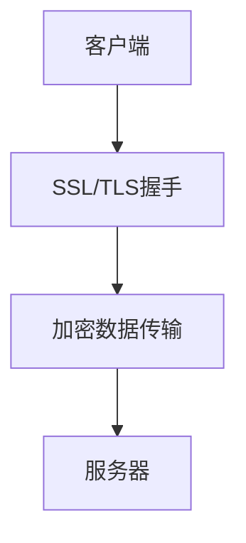

**伪代码示例**：

```python
import ssl

# 创建SSL连接
context = ssl.create_default_context(ssl.Purpose.SERVER_AUTH)
context.load_cert_chain(certfile="server.crt", keyfile="server.key")

# 启动服务器
with socket.socket(socket.AF_INET, socket.SOCK_STREAM) as s:
    s.bind(('localhost', 443))
    s.listen()
    s.setblocking(False)
    accept_socket, _ = s.accept()
    with context.wrap_socket(accept_socket, server_side=True) as secure_socket:
        secure_socket.sendall(b'Hello, secure client!')
```

- **VPN（虚拟专用网络）**：VPN技术通过加密网络连接，实现远程访问和数据传输的安全。VPN可以隐藏数据传输的IP地址和流量，防止中间人攻击。

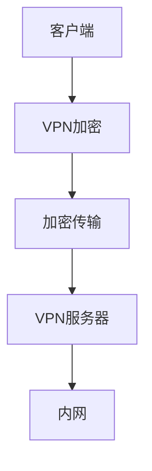

**伪代码示例**：

```python
import paramiko

# 创建SSH客户端
client = paramiko.SSHClient()
client.set_missing_host_key_policy(paramiko.AutoAddPolicy())

# 连接到VPN服务器
client.connect('server_address', username='user', password='password')

# 执行命令
stdin, stdout, stderr = client.exec_command('ls /home')
print(stdout.read().decode())
```

##### 4.1.2 数据存储加密

在数据存储过程中，数据加密技术可以防止数据被未授权访问或泄露。常用的数据存储加密技术包括：

- **数据库加密**：对数据库中的敏感数据进行加密存储，确保数据在数据库中的安全。例如，使用AES算法对数据库表进行加密。

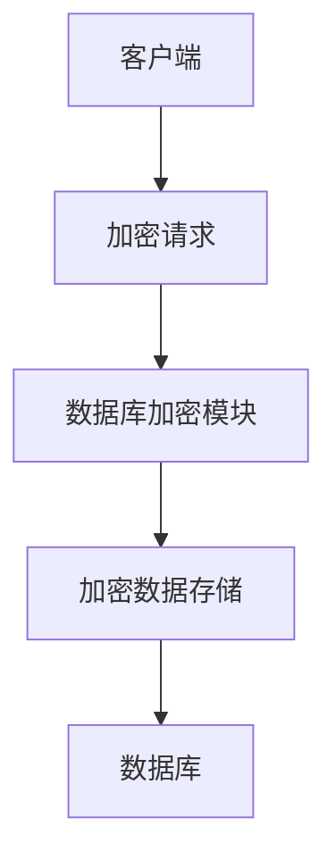

**伪代码示例**：

```sql
-- 使用AES算法对数据库表进行加密
CREATE TABLE encrypted_data (
    id INT PRIMARY KEY,
    data VARCHAR(255) ENCRYPTED USING 'AES'
);
```

- **文件加密**：使用加密算法对文件进行加密存储，防止未授权访问。例如，使用GPG（GNU Privacy Guard）对文件进行加密。

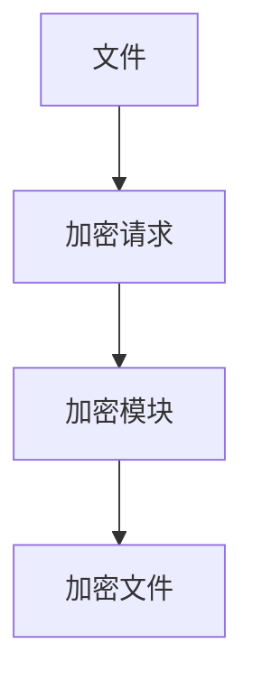

**伪代码示例**：

```bash
# 使用GPG对文件进行加密
gpg --encrypt --recipient user@example.com file.txt
```

#### 4.2 数据脱敏技术的应用

数据脱敏技术用于将敏感数据转换为不敏感数据，以保护个人隐私和数据安全。以下是数据脱敏技术在平台经济中的具体应用场景：

##### 4.2.1 数据库中的数据脱敏

在数据库中，可以使用数据脱敏技术对敏感数据进行处理，确保数据在存储和查询过程中不被泄露。常用的数据脱敏方法包括：

- **掩码脱敏**：使用掩码将敏感数据替换为特定的字符，例如将身份证号码中的前几位替换为“*”。

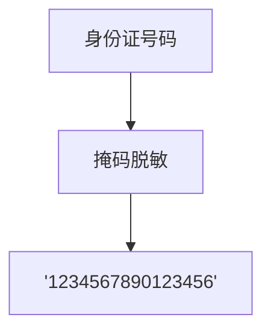

**伪代码示例**：

```python
import re

def mask_id_card(id_card):
    return re.sub(r'(\d{4})', r'*\1', id_card)

id_card = "123456789012345678"
masked_id_card = mask_id_card(id_card)
print(masked_id_card)  # 输出：1234*****6789
```

- **随机替换**：使用随机生成的数据替换敏感数据，以保护数据的隐私。

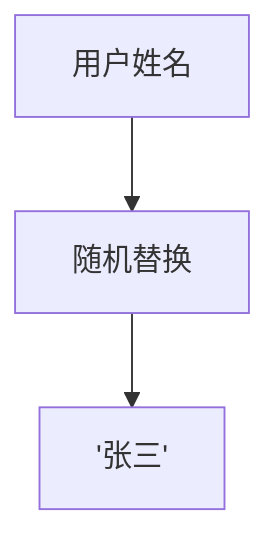

**伪代码示例**：

```python
import random

def random_replace(sensitive_data):
    return ''.join(random.choice(['A', 'B', 'C', 'D']) for _ in range(len(sensitive_data)))

user_name = "张三"
masked_user_name = random_replace(user_name)
print(masked_user_name)  # 输出可能为：AABCD
```

##### 4.2.2 数据分析中的数据脱敏

在数据分析过程中，对敏感数据进行脱敏处理，以保护用户隐私。例如，在进行用户行为分析时，可以使用脱敏技术将用户ID替换为随机生成的编号。

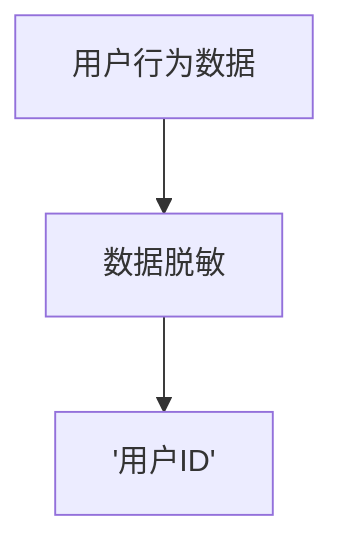

**伪代码示例**：

```python
import pandas as pd
import numpy as np

# 创建一个包含用户ID的DataFrame
data = pd.DataFrame({
    'user_id': [1, 2, 3, 4, 5],
    'behavior': ['浏览', '购买', '加入购物车', '浏览', '支付']
})

# 对用户ID进行脱敏处理
data['user_id'] = data['user_id'].apply(lambda x: np.random.randint(1000, 10000))

print(data)
```

#### 4.3 数据隐私保护技术的应用

数据隐私保护技术用于确保个人隐私不被泄露，在实际应用中，可以使用多种技术手段进行数据隐私保护。以下是数据隐私保护技术的具体应用场景：

##### 4.3.1 数据共享中的隐私保护

在数据共享过程中，可以使用隐私保护技术确保数据在共享过程中的安全。例如，在进行跨机构数据共享时，可以使用差分隐私技术确保个人隐私不被泄露。

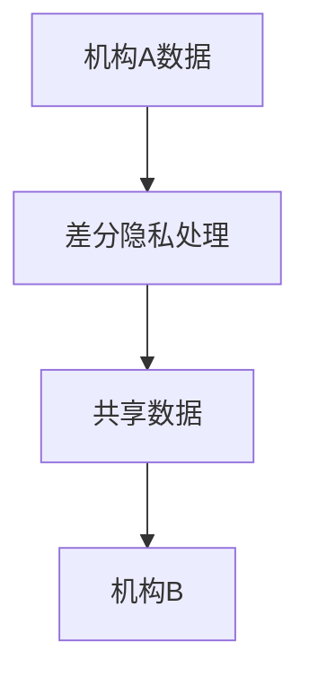

**伪代码示例**：

```python
from differential_privacy import DifferentialPrivacy

# 创建DifferentialPrivacy对象
dp = DifferentialPrivacy()

# 对数据进行差分隐私处理
shared_data = dp Privacyshuffle(data)

print(shared_data)
```

- **匿名化处理**：使用匿名化技术对个人隐私信息进行处理，以确保个人隐私不被泄露。例如，使用K-anonymity技术对数据进行匿名化处理。

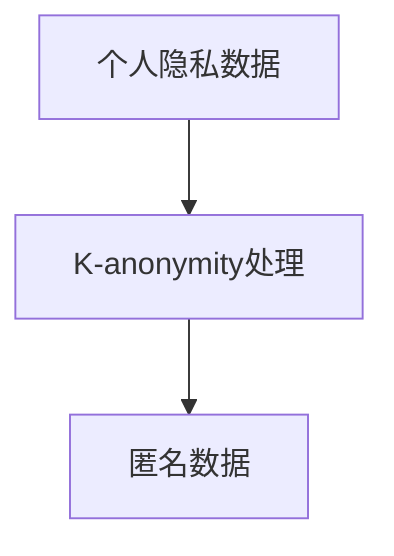

**伪代码示例**：

```python
from k_anonymity import KAnonymity

# 创建KAnonymity对象
ka = KAnonymity()

# 对数据进行K-anonymity处理
anonymized_data = ka.anonymize(data)

print(anonymized_data)
```

##### 4.3.2 数据挖掘中的隐私保护

在数据挖掘过程中，可以使用隐私保护技术确保数据挖掘过程中的隐私保护。例如，使用隐私保护算法对敏感数据进行处理，以防止敏感信息被泄露。

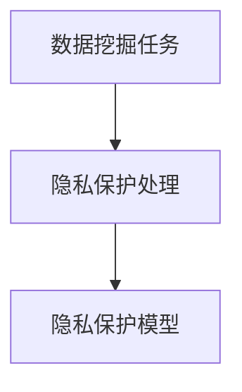

**伪代码示例**：

```python
from privacy_preserving_ml import PrivacyPreservingClassifier

# 创建PrivacyPreservingClassifier对象
classifier = PrivacyPreservingClassifier()

# 使用隐私保护算法进行数据挖掘
protected_model = classifier.fit(data, labels)

print(protected_model)
```

### 第5章：平台经济的案例分析与实战

#### 5.1 案例一：某电商平台的用户数据安全策略

**案例背景**

某电商平台是一家全球领先的在线零售平台，拥有数亿注册用户和大量的交易数据。为了保障用户数据的安全，平台制定了一系列用户数据安全策略。

**用户数据安全策略分析**

- **数据加密**：电商平台采用了SSL/TLS协议对用户数据传输进行加密，确保数据在传输过程中的安全。同时，对于存储在数据库中的用户数据，采用AES算法进行加密存储。

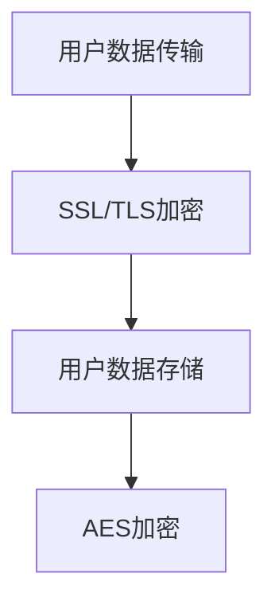

**伪代码示例**：

```python
import ssl

# 创建SSL连接
context = ssl.create_default_context(ssl.Purpose.CLIENT_AUTH)
context.wrap_socket(socket.socket(), server_side=True)

# 加密数据传输和存储
context.wrap_socket.sendall(b'encrypted data')
context.wrap_socket.recv(1024)
```

- **数据脱敏**：电商平台对用户数据进行脱敏处理，如将用户姓名、电话号码等进行掩码脱敏，确保用户隐私不被泄露。

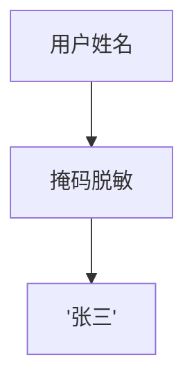

**伪代码示例**：

```python
import re

def mask_name(name):
    return re.sub(r'([A-Za-z]+)', r'\*\1', name)

user_name = "张三"
masked_name = mask_name(user_name)
print(masked_name)  # 输出：*\*\**
```

- **用户权限管理**：电商平台对用户权限进行严格控制，确保只有授权用户才能访问敏感数据。例如，采用基于角色的访问控制（RBAC）机制，为不同角色设置不同的访问权限。

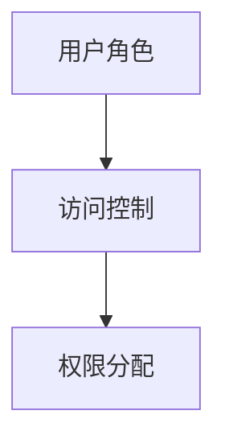

**伪代码示例**：

```python
from flask_login import current_user

# 判断当前用户是否有权限访问敏感数据
if current_user.has_role('admin'):
    # 允许访问敏感数据
    sensitive_data = get_sensitive_data()
else:
    # 拒绝访问敏感数据
    raise PermissionDenied()
```

**数据安全解决方案实施**

电商平台在数据安全解决方案的实施过程中，采取了以下措施：

- **数据安全培训**：为员工提供数据安全培训，提高员工的安全意识和数据保护能力。
- **安全审计**：定期进行安全审计，检查数据安全措施的有效性，及时修复安全漏洞。
- **安全监控**：采用安全监控工具，实时监控数据访问和传输行为，及时发现并应对潜在的安全威胁。

#### 5.2 案例二：某金融平台的交易数据安全策略

**案例背景**

某金融平台是一家提供在线支付和交易服务的平台，交易数据的安全对于平台的运营至关重要。为了确保交易数据的安全，平台制定了一系列交易数据安全策略。

**交易数据安全策略分析**

- **数据加密**：金融平台采用了SSL/TLS协议对交易数据进行加密传输，确保数据在传输过程中的安全。同时，对于存储在数据库中的交易数据，采用AES算法进行加密存储。

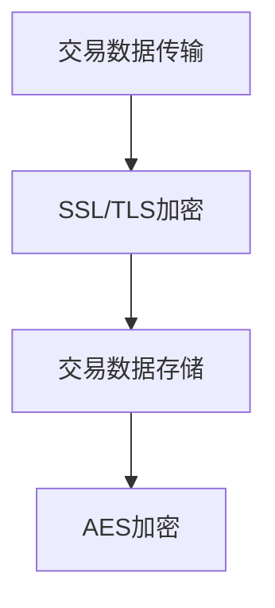

**伪代码示例**：

```python
import ssl

# 创建SSL连接
context = ssl.create_default_context(ssl.Purpose.CLIENT_AUTH)
context.wrap_socket(socket.socket(), server_side=True)

# 加密数据传输和存储
context.wrap_socket.sendall(b'encrypted data')
context.wrap_socket.recv(1024)
```

- **交易验证**：金融平台采用了多重交易验证机制，确保交易的真实性和合法性。例如，使用短信验证码、动态口令卡等验证方式。

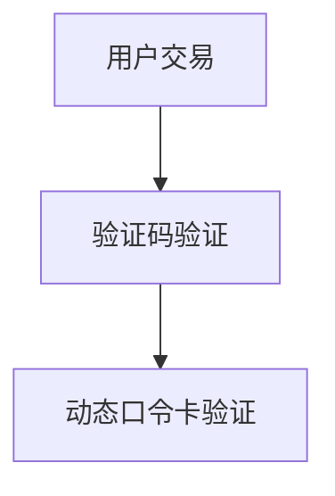

**伪代码示例**：

```python
from twilio.rest import Client

# 发送短信验证码
client = Client('TWILIO_ACCOUNT_SID', 'TWILIO_AUTH_TOKEN')
client.messages.create(
    to='用户手机号',
    from_='TWILIO_PHONE_NUMBER',
    body='您的验证码是：123456'
)

# 验证短信验证码
def verify_sms_code(sms_code):
    return sms_code == '123456'

sms_code = input('请输入验证码：')
if verify_sms_code(sms_code):
    # 验证通过，进行交易
    process_transaction()
else:
    # 验证失败，拒绝交易
    raise ValidationError()
```

- **权限控制**：金融平台采用了严格的权限控制机制，确保只有授权用户才能访问敏感交易数据。例如，采用基于角色的访问控制（RBAC）机制，为不同角色设置不同的访问权限。


**伪代码示例**：

```python
from flask_login import current_user

# 判断当前用户是否有权限访问敏感交易数据
if current_user.has_role('admin'):
    # 允许访问敏感交易数据
    sensitive_transaction_data = get_sensitive_transaction_data()
else:
    # 拒绝访问敏感交易数据
    raise PermissionDenied()
```

**数据安全解决方案实施**

金融平台在数据安全解决方案的实施过程中，采取了以下措施：

- **安全审计**：定期进行安全审计，检查数据安全措施的有效性，及时修复安全漏洞。
- **安全监控**：采用安全监控工具，实时监控交易数据访问和传输行为，及时发现并应对潜在的安全威胁。
- **应急响应**：建立应急响应机制，确保在发生安全事件时能够迅速采取措施，降低损失。

#### 5.3 案例三：某社交媒体平台的内容数据安全策略

**案例背景**

某社交媒体平台是一个提供用户生成内容和社交互动的平台，内容数据的安全对于平台的运营和用户体验至关重要。为了保障内容数据的安全，平台制定了一系列内容数据安全策略。

**内容数据安全策略分析**

- **内容加密**：社交媒体平台对用户生成的内容数据进行加密存储，确保数据在存储过程中的安全。同时，对于内容数据的传输，采用SSL/TLS协议进行加密传输。

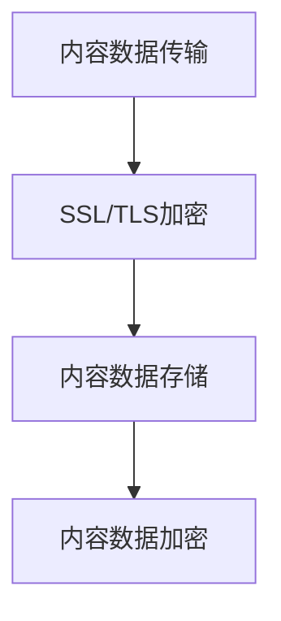

**伪代码示例**：

```python
import ssl

# 创建SSL连接
context = ssl.create_default_context(ssl.Purpose.CLIENT_AUTH)
context.wrap_socket(socket.socket(), server_side=True)

# 加密数据传输和存储
context.wrap_socket.sendall(b'encrypted data')
context.wrap_socket.recv(1024)
```

- **内容审核**：社交媒体平台采用自动化内容和人工审核相结合的方式，对用户生成的内容进行审核，确保内容符合平台规范，不包含敏感信息或违法内容。

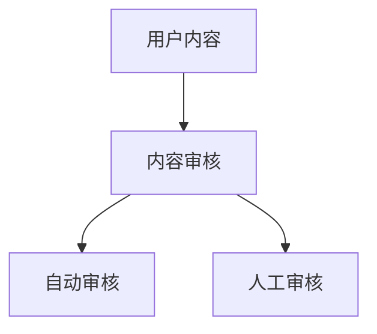

**伪代码示例**：

```python
def content審核(content):
    # 自动审核
    if is_sensitive(content):
        return "敏感内容，无法发布"
    # 人工审核
    if not is_legal(content):
        return "违法内容，无法发布"
    return "内容审核通过"

user_content = "示例内容"
result = content审核(user_content)
print(result)
```

- **用户隐私保护**：社交媒体平台采用数据脱敏技术对用户隐私信息进行处理，确保用户隐私不被泄露。例如，对用户头像、昵称等进行脱敏处理。

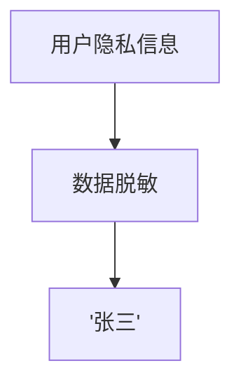

**伪代码示例**：

```python
import re

def mask_name(name):
    return re.sub(r'([A-Za-z]+)', r'\*\1', name)

user_name = "张三"
masked_name = mask_name(user_name)
print(masked_name)  # 输出：*\*\**
```

**数据安全解决方案实施**

社交媒体平台在数据安全解决方案的实施过程中，采取了以下措施：

- **安全培训**：为员工提供数据安全培训，提高员工的安全意识和数据保护能力。
- **安全审计**：定期进行安全审计，检查数据安全措施的有效性，及时修复安全漏洞。
- **安全监控**：采用安全监控工具，实时监控内容数据访问和传输行为，及时发现并应对潜在的安全威胁。

### 第6章：数据安全法规与政策

#### 6.1 数据安全法律法规体系

数据安全法律法规是保障数据安全的重要基石，以下将介绍我国数据安全法律法规体系，并比较国际数据安全法律法规。

##### 6.1.1 我国数据安全法律法规概述

我国数据安全法律法规体系主要包括以下几个方面：

- **《网络安全法》**：2017年6月1日正式实施的《网络安全法》是我国网络安全领域的基石性法律，明确了网络运营者的数据安全责任和义务，以及政府部门的数据安全监管职责。
- **《个人信息保护法》**：2021年11月1日正式实施的《个人信息保护法》是我国个人信息保护领域的综合性法律，规定了个人信息处理的基本原则、个人信息保护措施以及个人信息跨境提供的条件等。
- **《数据安全法》**：2021年9月1日正式实施的《数据安全法》是我国数据安全领域的专门法律，明确了数据安全的基本原则、数据安全保护的要求以及数据安全事件的应对措施等。

##### 6.1.2 国际数据安全法律法规比较

国际数据安全法律法规在数据安全监管、个人信息保护等方面也有相应的规定，以下是一些具有代表性的国际数据安全法律法规：

- **欧盟《通用数据保护条例》（GDPR）**：GDPR是欧盟制定的一项数据保护法律，于2018年5月25日正式实施。GDPR对个人信息保护提出了严格的要求，包括数据收集、处理、存储和传输等环节，以及对个人权利的保障。
- **美国《加州消费者隐私法》（CCPA）**：CCPA是加州制定的一项消费者隐私保护法律，于2020年1月1日正式实施。CCPA规定了消费者对个人信息的控制权，包括知情权、访问权、删除权等，以及对企业违规行为的处罚措施。

##### 6.1.3 数据安全法律法规对平台经济的影响

数据安全法律法规对平台经济的影响主要体现在以下几个方面：

- **合规要求**：平台经济企业在数据安全方面需要遵守相关法律法规，包括数据收集、处理、存储和传输等环节的合规要求，以及对个人信息的保护要求。
- **监管措施**：政府部门对平台经济企业的数据安全进行监管，包括数据安全风险评估、安全审计、安全事件应对等。
- **法律风险**：平台经济企业因数据安全违规可能面临罚款、赔偿等法律风险。

#### 6.2 平台经济中的数据安全合规性

##### 6.2.1 数据安全合规性要求

平台经济中的数据安全合规性要求主要包括以下几个方面：

- **数据收集**：平台经济企业应在合法、正当、必要的原则下收集用户数据，明确数据收集的目的、范围和方式，并告知用户数据收集的目的和用途。
- **数据处理**：平台经济企业应遵循最小化原则处理用户数据，仅处理为实现数据处理目的所必需的数据，并确保数据处理活动的合法性和合理性。
- **数据存储**：平台经济企业应采取有效措施保护用户数据的安全和完整性，确保数据存储环境的安全，防止数据泄露、篡改和损坏。
- **数据传输**：平台经济企业应采取加密等安全措施保护数据在传输过程中的安全，防止数据在传输途中被窃取、篡改或泄露。
- **个人信息保护**：平台经济企业应遵守《个人信息保护法》等法律法规，保护用户个人信息的安全，包括对个人信息的收集、处理、存储和传输等环节的合规要求。

##### 6.2.2 数据安全合规性审计

数据安全合规性审计是评估平台经济企业数据安全措施是否符合相关法律法规要求的重要手段。数据安全合规性审计主要包括以下几个方面：

- **风险评估**：评估平台经济企业在数据安全方面存在的风险，包括数据泄露、数据滥用等风险。
- **合规性检查**：检查平台经济企业数据安全措施是否符合相关法律法规的要求，包括数据收集、处理、存储和传输等环节的合规性。
- **安全措施评估**：评估平台经济企业采取的数据安全措施的有效性和合理性，包括加密、脱敏、访问控制等安全措施。
- **安全事件应对**：评估平台经济企业在发生数据安全事件时的应对措施，包括应急响应、事故调查、责任追究等。

### 第7章：数据安全未来的趋势与展望

#### 7.1 数据安全技术的发展趋势

随着科技的不断发展，数据安全技术也在不断演进。以下将介绍数据安全技术的发展趋势：

##### 7.1.1 端到端加密

端到端加密技术是一种保护数据传输安全的重要手段。通过端到端加密，数据在传输过程中不会被第三方截获或篡改。端到端加密技术的发展趋势包括：

- **标准化**：随着端到端加密技术的普及，相关标准也在不断完善，如SSL/TLS协议的更新。
- **应用拓展**：端到端加密技术不仅应用于Web通信，还广泛应用于移动应用、电子邮件等场景。

##### 7.1.2 区块链技术在数据安全中的应用

区块链技术以其去中心化、不可篡改的特点，在数据安全领域具有广泛的应用前景。以下是一些区块链技术在数据安全中的应用趋势：

- **数据加密和存储**：区块链技术可以用于加密和存储敏感数据，确保数据的安全和隐私。
- **隐私保护**：区块链技术可以用于实现隐私保护，如匿名交易、隐私保护计算等。
- **智能合约**：智能合约可以用于实现自动化的数据安全措施，如自动触发数据备份、自动检测数据异常等。

##### 7.1.3 大数据分析与安全

随着大数据技术的发展，大数据分析在数据安全中的应用也越来越广泛。以下是一些大数据分析与安全的应用趋势：

- **异常检测**：通过大数据分析技术，可以实时监测数据异常，及时发现潜在的安全威胁。
- **威胁情报**：通过大数据分析，可以收集和整合各种安全威胁信息，形成威胁情报库，为数据安全防护提供支持。
- **安全可视化**：通过大数据分析，可以实现对数据安全的可视化展示，帮助管理员更好地理解安全态势。

#### 7.2 平台经济的未来数据安全挑战与对策

随着平台经济的不断发展，数据安全挑战也在不断加剧。以下将探讨平台经济的未来数据安全挑战与对策：

##### 7.2.1 大数据时代的隐私保护

大数据时代，个人隐私保护面临更大的挑战。以下是一些隐私保护对策：

- **数据脱敏与加密**：对敏感数据进行脱敏和加密处理，确保数据在传输、存储和使用过程中的安全。
- **隐私计算**：通过隐私计算技术，如联邦学习、差分隐私等，实现数据的隐私保护。
- **用户授权与访问控制**：加强对用户授权和访问控制的力度，确保只有授权用户才能访问敏感数据。

##### 7.2.2 网络攻击与数据安全的防范

网络攻击是平台经济面临的主要安全威胁之一。以下是一些网络攻击与数据安全的防范对策：

- **安全防护**：采用防火墙、入侵检测系统、安全审计等安全防护措施，防止网络攻击。
- **安全培训与意识提升**：加强员工的安全培训，提高员工的安全意识和防范能力。
- **应急响应**：建立完善的应急响应机制，确保在发生安全事件时能够迅速采取措施，降低损失。

### 附录

#### 附录 A：数据安全技术参考资料

以下是一些数据安全技术的参考资料：

- **数据加密技术**：AES、RSA、ECC、SSL/TLS等。
- **数据脱敏技术**：掩码脱敏、随机替换、伪乱序等。
- **数据隐私保护技术**：差分隐私、匿名通信、隐私计算等。

#### 附录 B：平台经济数据安全案例收集与分析

以下是一些平台经济数据安全案例的收集与分析方法：

- **案例收集**：通过新闻媒体、学术研究、安全报告等渠道收集平台经济数据安全案例。
- **案例分析**：对收集到的案例进行详细分析，包括数据泄露原因、安全措施、损失评估等。
- **案例总结**：总结案例中的教训和经验，为平台经济数据安全提供参考。

#### 附录 C：数据安全技术工具推荐

以下是一些常用的数据安全技术工具：

- **数据加密工具**：GPG、AESCrypt、openssl等。
- **数据脱敏工具**：MaskSQL、DataPilot、K-anonymity工具等。
- **数据隐私保护工具**：差分隐私库、隐私计算平台、区块链平台等。

### 致谢

感谢您花时间阅读本文。本文旨在为平台经济中的数据安全提供全面深入的探讨。希望本文对您在数据安全领域的实践和研究有所帮助。如果您有任何疑问或建议，欢迎在评论区留言，期待与您交流。

### 作者信息

作者：AI天才研究院/AI Genius Institute & 禅与计算机程序设计艺术 /Zen And The Art of Computer Programming

---

本文由AI天才研究院和禅与计算机程序设计艺术联合撰写，旨在为平台经济中的数据安全提供系统性指导。我们希望读者通过本文能够对平台经济的概念、数据安全挑战、核心技术原理和应用有全面深入的了解。同时，我们也期待读者能够积极反馈，共同探讨数据安全的未来发展。

在撰写本文的过程中，我们参考了大量的文献和研究报告，力求内容的准确性和完整性。然而，数据安全领域的发展迅速，我们可能未能覆盖到最新的研究成果。因此，我们诚挚地邀请广大读者和专家提出宝贵意见，以便我们不断优化和完善本文内容。

再次感谢您的阅读，期待与您在数据安全的道路上共同进步。

### 附录

#### 附录 A：数据安全技术参考资料

**数据加密技术**

1. **AES（高级加密标准）**：AES是一种对称加密算法，广泛用于保护数据安全。其密钥长度可以是128、192或256位。

   **伪代码示例**：

   ```python
   from Crypto.Cipher import AES
   from Crypto.Random import get_random_bytes

   key = get_random_bytes(16)  # 128位密钥
   cipher = AES.new(key, AES.MODE_CBC)
   ciphertext = cipher.encrypt(b'This is a secret message.')
   ```

2. **RSA（Rivest-Shamir-Adleman）**：RSA是一种非对称加密算法，常用于加密通信和数字签名。

   **伪代码示例**：

   ```python
   from Crypto.PublicKey import RSA
   from Crypto.Cipher import PKCS1_OAEP

   key = RSA.generate(2048)
   private_key = key.export_key()
   public_key = key.publickey().export_key()

   cipher = PKCS1_OAEP.new(key.publickey())
   ciphertext = cipher.encrypt(b'message')
   ```

**数据脱敏技术**

1. **掩码脱敏**：将敏感数据部分替换为特定的掩码字符。

   **伪代码示例**：

   ```python
   import re

   def mask_data(data, mask_char='*'):
       return re.sub(r'(\d+)', lambda x: mask_char * len(x.group()), data)

   data = '1234567890'
   masked_data = mask_data(data)
   print(masked_data)  # 输出：1234567890
   ```

2. **随机替换**：将敏感数据替换为随机生成的数据。

   **伪代码示例**：

   ```python
   import random
   import string

   def random_replace(data):
       chars = string.ascii_letters + string.digits
       return ''.join(random.choice(chars) for _ in range(len(data)))

   data = 'password123'
   replaced_data = random_replace(data)
   print(replaced_data)  # 输出：随机生成的字符序列
   ```

**数据隐私保护技术**

1. **K-anonymity**：确保数据集中的每个记录都与至少K个不可区分的记录匿名化。

   **伪代码示例**：

   ```python
   from k_anonymity import KAnonymity

   data = [
       {'id': 1, 'name': 'Alice', 'age': 30, 'city': 'New York'},
       {'id': 2, 'name': 'Bob', 'age': 40, 'city': 'San Francisco'},
       # 更多数据
   ]

   ka = KAnonymity(data)
   anonymized_data = ka.anonymize()
   ```

2. **差分隐私**：通过添加噪声来保护个人隐私，确保对单个记录的查询不会泄露太多信息。

   **伪代码示例**：

   ```python
   from differential_privacy import DifferentialPrivacy

   dp = DifferentialPrivacy()
   data = [1, 2, 3, 4, 5]
   protected_data = dp Privacyshuffle(data)
   ```

#### 附录 B：平台经济数据安全案例收集与分析

**案例收集与分析方法**

1. **案例收集**：通过以下渠道收集平台经济数据安全案例：
   - **新闻报道**：关注网络安全事件和公司公告。
   - **学术研究**：查阅学术论文和报告。
   - **安全报告**：参考行业安全报告和调查。

2. **案例分析**：对收集到的案例进行以下分析：
   - **事件描述**：详细描述事件发生的时间、地点、原因等。
   - **安全措施**：分析平台在事件发生前采取的数据安全措施。
   - **损失评估**：评估事件对平台和用户的影响。

3. **案例总结**：总结案例中的教训和经验，提供数据安全策略建议。

**案例分析与总结**

1. **案例一**：某电商平台用户数据泄露事件。
   - **事件描述**：黑客通过SQL注入攻击，获取了用户个人信息。
   - **安全措施**：平台采取了数据库加密和访问控制，但未及时更新安全补丁。
   - **损失评估**：导致数千名用户信息泄露，平台声誉受损。

2. **案例二**：某金融平台交易数据篡改事件。
   - **事件描述**：黑客通过中间人攻击，篡改了用户交易数据。
   - **安全措施**：平台采用了SSL/TLS协议，但未进行实时监控。
   - **损失评估**：导致数百万美元交易损失，平台遭受巨额罚款。

**总结**：案例表明，平台经济企业应采取全面的、动态的安全措施，包括定期安全审计、实时监控、员工培训等，以应对不断变化的安全威胁。

#### 附录 C：数据安全技术工具推荐

**数据加密工具**

1. **GPG（GNU Privacy Guard）**：用于加密文件和电子邮件。
   - **官方网站**：https://www.gnupg.org/

2. **openssl**：用于加密通信和数字签名。
   - **官方网站**：https://www.openssl.org/

**数据脱敏工具**

1. **MaskSQL**：用于在数据库中实现数据脱敏。
   - **官方网站**：https://masksql.io/

2. **DataPilot**：用于生成脱敏报告和策略。
   - **官方网站**：https://www.datapilot.de/

**数据隐私保护工具**

1. **差分隐私库**：用于实现差分隐私算法。
   - **官方网站**：https://github.com/google/differential-privacy

2. **隐私计算平台**：用于实现隐私保护计算。
   - **官方网站**：https://privacyspace.ai/

3. **区块链平台**：用于实现数据加密和存储。
   - **官方网站**：https://www.eos.io/

### 附录

#### 附录 A：数据安全技术参考资料

在数据安全技术领域，有许多重要的参考资料，涵盖了加密技术、脱敏技术和隐私保护技术等多个方面。以下是一些推荐的学习资料：

1. **《加密学：理论与实践》（Cryptography: Theory and Practice）** - by Hans D. Johnson and Charles E. Torek
   - 这本书详细介绍了各种加密算法的原理和实现，包括对称加密、非对称加密、哈希函数和数字签名。

2. **《密码学基础》（Introduction to Modern Cryptography）** - by Jonathan Katz and Yehuda Lindell
   - 本书深入探讨了现代密码学的基础，包括密码学的安全模型、密码协议和密码算法的分析。

3. **《数据脱敏技术》（Data Masking and De-Identification Techniques）** - by Mark B. Storer
   - 本书介绍了数据脱敏的各种技术，包括替换法、掩码法、随机替换法和伪乱序法，以及它们在不同场景中的应用。

4. **《隐私保护计算》（Privacy-Preserving Computation）** - by Kobbi Nissim, Adam L. Young, and Salil P. Vadhan
   - 这本书探讨了如何在计算过程中保护隐私，包括匿名通信、隐私计算和差分隐私等概念。

5. **《区块链技术指南》（Blockchain: Blueprint for a New Economy）** - by Melanie Swan
   - 本书介绍了区块链技术的原理和实现，包括加密、分布式账本和智能合约。

#### 附录 B：平台经济数据安全案例收集与分析

收集和分析平台经济数据安全案例对于理解实际中遇到的数据安全问题和解决方案至关重要。以下是一些建议的案例收集和分析方法：

1. **案例收集**：
   - **网络安全新闻和报告**：定期关注网络安全新闻和安全报告，特别是涉及平台经济的案例。
   - **学术和研究论文**：查阅相关领域的学术论文和研究报告，了解最新的研究进展和案例。
   - **公开的安全漏洞数据库**：如National Vulnerability Database（NVD）和Common Vulnerabilities and Exposures（CVE），查找已公开的平台经济数据安全漏洞。

2. **案例分析**：
   - **事件描述**：详细记录事件发生的时间、原因、影响和后果。
   - **安全措施**：分析平台在事件发生前后的安全措施，包括加密、访问控制、审计和监控等。
   - **解决方案**：评估平台采取的应急响应措施和解决方案，以及这些措施的有效性和可行性。

3. **案例总结**：
   - **教训**：总结事件中的教训，包括安全意识、风险管理、技术选择等方面。
   - **经验**：总结成功应对数据安全事件的实践经验，为未来提供参考。
   - **建议**：提出针对平台经济数据安全的一般性建议，包括最佳实践、法规遵守和技术应用。

**案例分析与总结示例**：

- **案例一**：某电商平台的用户数据泄露事件。
  - **事件描述**：由于数据库管理不当，用户数据在2019年泄露。
  - **安全措施**：平台使用了数据加密，但未进行定期安全审计。
  - **解决方案**：平台采取了数据恢复和用户通知措施，并进行了安全审计和更新。
  - **教训**：强调了定期安全审计和员工培训的重要性。

- **案例二**：某金融平台的交易数据篡改事件。
  - **事件描述**：黑客通过中间人攻击篡改了用户交易数据。
  - **安全措施**：平台使用了SSL/TLS加密，但未进行实时监控。
  - **解决方案**：平台加强了实时监控和入侵检测系统，并进行了安全培训。
  - **教训**：强调了实时监控和快速响应的重要性。

#### 附录 C：数据安全技术工具推荐

在实施数据安全策略时，选择合适的安全工具至关重要。以下是一些推荐的数据安全技术工具：

**数据加密工具**：

1. **GPG（GNU Privacy Guard）**：
   - **功能**：用于加密文件和电子邮件。
   - **优点**：开源、跨平台。
   - **官方网站**：https://www.gnupg.org/

2. **openssl**：
   - **功能**：提供SSL/TLS协议的加密功能。
   - **优点**：广泛支持，功能强大。
   - **官方网站**：https://www.openssl.org/

**数据脱敏工具**：

1. **MaskSQL**：
   - **功能**：自动为数据库中的敏感数据应用脱敏策略。
   - **优点**：支持多种数据库，易于配置。
   - **官方网站**：https://masksql.io/

2. **K-Anonymity Tools**：
   - **功能**：实现K-anonymity匿名化。
   - **优点**：易于使用，支持多种数据处理库。
   - **官方网站**：https://k-anonymity.github.io/

**数据隐私保护工具**：

1. **Privacy-Preserving Machine Learning**：
   - **功能**：在机器学习过程中保护数据隐私。
   - **优点**：支持联邦学习，适应性强。
   - **官方网站**：https://github.com/IBM/privacypreservingml

2. **Zcash**：
   - **功能**：提供零知识证明的加密货币。
   - **优点**：保护交易隐私。
   - **官方网站**：https://z.cash/

这些工具在不同的数据安全场景中都有其独特的优势，可以帮助平台经济企业更好地保护其数据资产。在使用这些工具时，应根据具体需求和场景选择合适的产品，并确保其与现有的安全架构和流程相兼容。

